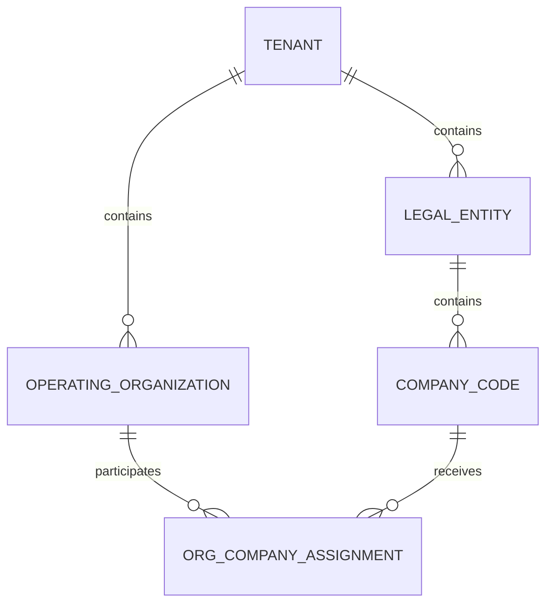
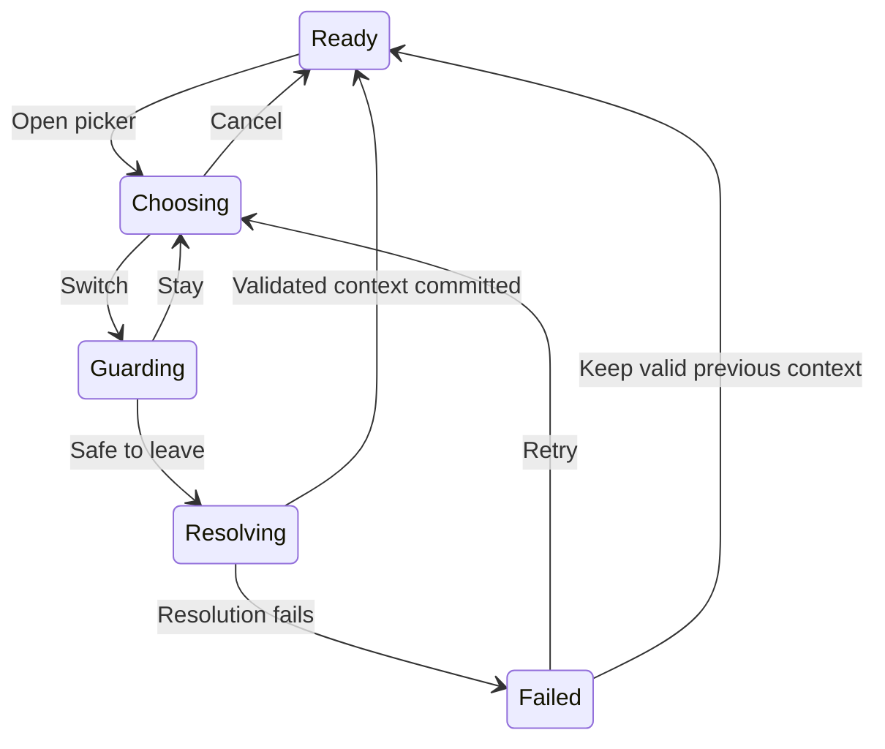

**Business Context Selector — detailed design recommendation**

Date: 2026-09-18. Status: target design with the first local Neon context foundation slice implemented; see section 13.1 for scope and validation. Inputs: both supplied notes, the shared application experience design, and the source references below. This is a product and engineering recommendation, not a certification of deployed authorization behavior.

**1. Recommended decision**

Use legal entity as Neon's global working context. Resolve company code and operating organization at the page and record level according to the entity's scope policy. Keep tenant identity visible. A selector narrows work scope; it never grants access.

Separate four concepts:

| Concept | Meaning | Owner |
| --- | --- | --- |
| Session identity | Signed-in principal, tenant membership, plane, any explicit acting-for identity | Server identity/session services |
| Working context | Legal entity currently used for operational browsing and defaults | Neon context adapter |
| Page scope | Company/organization filters and standard view | Page controller |
| Record context | Persisted company, responsible organization and applicable legal entity | Domain service |

The selected legal entity must not rewrite an existing record. Tenant-wide records remain tenant-wide when the selected legal entity changes. Render boundaries isolate failures; they do not own scope resolution or authorization.

**2. Organization model**

Recommended invariant: each company code belongs to exactly one legal entity within its tenant. An operating organization belongs to the tenant and can have effective-dated assignments to multiple company codes, including codes in different legal entities when explicitly configured.



Keep organization hierarchy separate from company assignments. A department tree does not establish company access, and company membership does not automatically grant every organization beneath a displayed group.

An assignment records organization ID, company ID, participation role, validity period and applicable capabilities. Defaults such as booking company are suggestions, not additional assignments or grants. Validate current eligibility on the server; the entity policy must specify whether business-date eligibility is additionally required. Backdating never restores revoked user access.

The existing operating-organization API already models an array of company assignments and effective dates. Preserve this model instead of introducing a single company parent on each organization.

**3. Normalize the nine scenarios**

| Scenario | Interpretation | Selector and form behavior |
| --- | --- | --- |
| 1 | One LE, one company, one organization | Show LE identity; default the sole authorized eligible company/organization pair |
| 2 | One LE, multiple companies, one organization per company | LE fixed; company choice determines organization |
| 3 | One LE, multiple companies, multiple organizations per company | LE fixed; company and organization resolve as a valid pair |
| 4 | Multiple LEs, one company per LE, one organization per company | Switch LE; company defaults; organization defaults if uniquely eligible |
| 5 | Multiple LEs, one company per LE, multiple organizations per company | Switch LE; company defaults; select/default eligible organization |
| 6 | As written, equivalent to scenario 4 | Apply scenario 4; if this means shared organization across LEs, use multiple assignment rows |
| 7 | Multiple LEs, multiple companies per LE, one organization per company | Switch LE; select/default company; resolve its organization |
| 8 | Multiple LEs, multiple companies per LE, multiple organizations per company | Switch LE; resolve company and organization from eligible combinations |
| 9 | Assumed: one shared organization serving several companies | LE limits eligible companies; shared organization remains one identity with multiple assignments |

Scenario 9 needs this explicit interpretation; otherwise its wording overlaps scenario 7. Implement one rule engine driven by cardinality and assignments, not nine scenario-specific branches. Cardinality always means the user's authorized, active, action-eligible choices—not merely the tenant's configured total.

**4. Global selector interaction**

Example global label: `Northstar Group / Northstar Malaysia ▾`. Full legal name and code are available on focus and in the picker; mobile retains a distinguishable LE label.

The picker contains tenant identity, current LE, search by LE name/code, and permitted LE choices. Selecting a row changes a pending choice. An explicit `Switch legal entity` action commits it. Browsing choices must not trigger context changes. Reuse the shared drawer and overlay interaction patterns; use a full-screen presentation on narrow layouts.

| Available choices | Behavior |
| --- | --- |
| Loading | Show resolving state; do not display a guessed default |
| One authorized LE | Show fixed identity without a redundant switch control |
| Multiple authorized LEs | Enable searchable picker |
| None | Show no operational context; keep independently authorized tenant-wide pages available |
| Catalog failure | Show retry; do not interpret failure as zero choices |
| Current choice revoked | Remove inaccessible operational content and resolve a valid destination |

Do not put company and organization selection into three compulsory global dropdowns. Users should see those controls at the task where their meaning is clear.

V1 should not offer `All legal entities` as an ordinary creation context. Cross-LE reporting or an authorized consolidated worklist can be an explicit page mode. It must label its wider scope and require a concrete target before creation. `All permitted companies in this legal entity` is a list filter, never a record field value.

**5. Deterministic defaults**

Opening an existing record uses its server-resolved context. Opening an explicit link validates its requested context first. A forbidden or inconsistent explicit target returns a scoped error; it must not silently open or create something in a different context.

For ordinary entry with no explicit target, resolve LE in this order:

1. Current validated context for this browser tab.
2. Valid profile default for this tenant and plane.
3. The sole eligible LE.
4. Eligible tenant-configured default LE.
5. Ask the user to choose from the remaining permitted LEs.

This retains the profile-first behavior requested in the notes. A saved “last used” value should not silently override a profile default. If a resume-last-used preference is later added, expose it explicitly and define its precedence.

Creation defaults are computed from eligible combinations for the particular entity/action:

1. Valid explicit page intent, such as `Create PO for MY01`.
2. Compatible current page company/organization selection.
3. Valid user profile defaults for the entity capability and selected LE.
4. Valid configured domain defaults.
5. A unique eligible remaining choice.
6. Leave required fields unresolved and request selection.

Resolve combinations together. Never choose a company from one preference and an incompatible organization from another. When a preferred pair is invalid, discard that candidate and continue; retain an individual coordinate only if it remains valid with the resolved pair. Defaults cannot expand scope.

One LE does not imply one company or organization. For scenarios 2 and 3, an LE fallback alone cannot populate both required record fields.

Persist profile defaults on the server. Keep active working selection tab-scoped; namespace cached preferences by principal, tenant and plane, with LE/capability added where applicable. Another tab changing its context must not retarget this tab's form. Handle unavailable browser storage without breaking selection. Revocation and logout still affect every tab.

**6. Entity policy matrix**

| Rule | Type A: company-driven | Type B: organization-driven | Type C: tenant-wide |
| --- | --- | --- | --- |
| Examples | Purchase order, invoice | Sourcing request, contract, BP request where configured | BP identity, reference catalogs |
| Global LE effect | Limits eligible companies and operational browsing | Limits the working lens; organization may serve several LEs | Does not filter base tenant records |
| Company on creation | Required | Optional only where the domain permits | Absent from base identity |
| Organization on creation | Required per supplied requirement | Required | Absent from base identity |
| LE on record | Derived from company | Explicit owning LE recommended for V1 | No artificial owning LE |
| List default | My documents | My documents | All records the user is authorized to read |
| Broader view | Explicit authorized views | Explicit authorized views | Same tenant scope, still field/row protected |

For Type A, show `Company code *` then `Operating organization *`. Selecting company constrains organizations to valid assignments and action grants. Changing either field must revalidate currency, numbering, accounting defaults, policies and workflow routing. Retain compatible values; explain and clear incompatible values. Submit remains unavailable until the combination is valid.

For Type B, show `Operating organization *` first. Company remains blank unless the user or a configured domain default supplies it. A blank company means no company-level designation; it never means access to all companies served by the organization.

Type B needs a scope rule that is missing from the notes: if a company-less record is owned only by a shared organization, which LE's worklist should contain it? Recommended V1 answer: persist an explicit owning LE when the request is created. Validate that the organization is eligible for that LE. This preserves deterministic LE browsing even with no company. If a record is intentionally cross-LE, introduce an explicit participating-LE scope model and authorized consolidated workspace; do not infer record scope from every current organization assignment. This is a proposed domain addition, not something confirmed in existing record schemas.

Contracts and sourcing documents may acquire company or multi-party requirements at later lifecycle stages. Scope class is a default policy; action-specific validation remains authoritative.

For Type C, distinguish global reference definitions from tenant-maintained overrides and enabled values. Currency/country catalogs may be platform-managed read-only data. Tenant users should not implicitly receive authority to edit platform definitions.

BP base identity can be tenant-wide while finance, banking, organization participation and company extensions remain separately scoped. Loading the base BP must not expose every extension.

**7. List views and authorization**

Replace the ambiguous phrase `Default only My Documents + ...` with separately named views:

| View | Definition |
| --- | --- |
| My documents | Current user is creator, requester or owner according to the entity's published definition |
| My team | A permitted team relationship admits the record |
| Shared with me | An active record share grants read access |
| Delegated to me | An effective delegation grants the relevant task or record action |
| All accessible | Union of permitted relationship and explicit scope grants, within the requested page scope |

Keep `My documents` as the initial Type A/B view for every role. A manager can explicitly choose a broader supported view. An optional personal saved view may later replace the initial view, but cannot change permissions. If you want the union to be the default, label it `My work` or `All accessible`, not `My documents`.

Conceptually, a read requires:

```text
authenticated tenant membership
AND application/entity read permission
AND match with the requested page scope
AND an admitted record relationship OR explicit scope grant
AND satisfaction of mandatory restrictions
```

The relationship/scope clause is grouped as one parenthesized expression. Implement the policy centrally rather than concatenating unchecked client filters.

Being creator does not bypass revoked access. A team hierarchy is not automatically a document grant. Sharing and delegation have explicit actions, effective dates and restrictions; neither implies create, edit or approve. Delegate authority cannot exceed the permitted delegated authority.

`Agent`, `Manager`, `Owner` and `Admin` should be role bundles mapped to explicit permissions and scopes. An organization-scoped manager does not automatically see every document in every company served by that organization. Company-wide read requires an explicit company-wide grant; organization read remains organization-limited. Keep tenant administration and business-data access separately assignable.

Type C should remain permission-driven. Give ordinary tenant members a baseline reference-read permission where appropriate. Tenant-wide location is not universal access, especially for sensitive BP fields. Create, edit, delete, publish and import require their own permissions.

Server-side request validation and deny-by-default access follow [OWASP's authorization guidance](https://cheatsheetseries.owasp.org/cheatsheets/Authorization_Cheat_Sheet.html). Apply the same admitted population to list rows, totals, aggregates, search, exports, attachments, favorites and Atlas.

**8. Record edit and approval behavior**

Record context is authoritative on open and on every command. Shell changes never modify stored organization/company ownership.

| Lifecycle/policy | Allowed behavior |
| --- | --- |
| No workflow | Authorized edit with validation, optimistic concurrency and audit |
| Edit prohibited | Read-only record with permitted alternative actions |
| Edit without reapproval | Only explicitly separate, allowed non-approval metadata; submitted payload and approval pack unchanged |
| Edit requires reapproval | Correction draft; resubmission creates a new attempt and approval pack |
| Edit with resubmission | Explicit Submit through the same correction mechanism; no weaker approval checks |

Do not classify company, organization, financial party, currency or approval-routing changes as harmless metadata. Such changes normally affect review context.

For unsent drafts, allow context changes only where the domain permits, after dependent values are revalidated. After submission or posting, context changes require the domain's correction, cancellation/recreation or reversal process. Absence of workflow does not imply that posted business facts are freely editable.

Bind Save/Submit to record or draft ID, persisted context, expected revision and current authorization. Include idempotency protection where supported. An already-submitted command keeps its original target even if the user changes context while awaiting its result.

**9. Context-switch lifecycle**



Before switching, check every registered dirty surface, including record panels and intake drafts. Offer `Stay`, `Discard and switch`, and `Save draft and switch` only if saving is supported. A failed save prevents the switch. An in-progress mutation must settle or remain independently tracked with its original context; aborting an HTTP request is not proof that a mutation was cancelled.

Resolve the destination against current server authorization. Create a new context generation, cancel obsolete reads and ignore late results from previous generations. Atomically commit the visible LE identity and the new page's loading/ready state. Never show old rows under the new LE label.

On a list, preserve compatible entity navigation and harmless display preferences, but clear incompatible filters, row selections and cursors. On a scoped record, navigate to the corresponding permitted collection when manually changing LE. A tenant-wide record may remain open, with scoped subpanels reset and reauthorized. If the current page is unavailable, open an allowed destination.

Retain the old context after failure only if it remains authorized. Revocation overrides retention and removes inaccessible data. A later page-data failure after successful context resolution should show an error under the new identity, not silently roll the selector back.

Reauthorize a record deep link before disclosing its identity. If it belongs to another permitted LE, coordinate context switching with navigation and unsaved-work protection. Browser Back/Forward follows the same rule. Never let the route and visible selector disagree about operational scope.

**10. Shared application integration**

The shared `BusinessContextSelector` renders a plane-provided model and delegates changes. The plane adapter supplies authorized choices, labels, current state and a switch operation. The shared shell owns presentation, focus, overlays and progress. The domain/page controller owns entity scope and commands.

| Layer | Responsibility |
| --- | --- |
| ApplicationBootstrapGate | Identity, tenant and required plane bootstrap |
| Neon context provider | Resolve legal entities, defaults, generation and switching |
| GlobalAppBar / BusinessContextSelector | Display and choose working LE |
| PageWorkspace / page controller | Own one scope state; render its control at the right of workspace navigation and expose the same coordinates through Filters |
| Entity form provider | Resolve and validate record company/organization |
| PageResourceBoundary | Loading, denied, failed and ready request states |
| Render boundaries | Contain render failures and disable dependent actions |
| Backend domain/authorization services | Final access and context validation |

Neon supplies legal-entity semantics. Mesh supplies network-account/acting-for semantics. Studio supplies its authorized design workspace; previewing a Neon context is explicitly labeled and does not confer operational authority. Share the interaction contract without requiring every plane to pretend it has the same hierarchy.

Suggested published entity policy fields: scope kind (`company`, `organization`, `tenant`), required coordinates, optional capability, default standard view, supported broader views, cross-LE support, and allowed draft context changes. Presentation metadata references this policy; it cannot grant privileges or weaken backend validation.

**10.1. Workspace context belongs in the navigation band**

Refinement from the supplied Business Partner Review & Approval screenshot: remove the operating-organization dropdown from the page body. Place a shared `WorkspaceContextControl` at the trailing edge of the horizontal workspace navigation band. Keep the global `BusinessContextSelector` responsible for LE. These controls have different scope and must have distinct accessible names.

```text
Global app bar      NEON    CirrusAtlantic UK                 Search ...
Page header         Business Partners                        New request
Navigation band     Overview | Manage | Review & Approval    Org: UK Procurement ▾
Collection toolbar  My documents ▾   Search requests         Filters (2)
Page body           Authorized request results
```

The selected organization above is illustrative, not a proposed automatic default for the pictured user. With no resolved required organization, show `Choose organization` in the same navigation position.

Use one compact control rather than a row of full-width dropdowns:

| Page scope | Navigation control example |
| --- | --- |
| Company-driven | `Company: UK01 · Org: Procurement ▾` |
| Organization-driven | `Org: UK Procurement ▾` |
| Organization-driven with company selected | `Org: UK Procurement · Company: UK01 ▾` |
| Supported aggregate list scope | `All permitted organizations ▾` |
| Tenant-wide base data | `Tenant-wide` noninteractive indicator, or omit when scope is already clear |
| Existing scoped record | `UK01 · Procurement` read-only context summary |
| Required context unresolved | `Choose organization` or `Choose company` |

Opening the control presents a small anchored panel for simple selection or the shared drawer for larger catalogs. The panel shows the current LE as read-only context, the applicable company/organization controls, authorized choices and an Apply action. Search and pending choices do not refresh the page until applied. Explicit `All permitted` options appear only when the page service supports aggregate queries.

On desktop, keep navigation at the start and scope at the end. The scope control sits outside the `tablist`; it is not an extra tab. Long labels truncate visually while retaining full accessible text. At narrow widths or high zoom, place the control on a second line within the navigation band. The tab strip can scroll independently; the context control must remain reachable. Use one control instance across layouts. A workspace without tabs still renders the same band with only the trailing context control.

Reuse the existing navigation band's sticky behavior; do not add a second independent sticky bar. The context panel participates in shared overlay/focus handling and must remain clear of a docked Atlas panel.

**10.2. Context and Filters use one controller**

Company and organization constraints belong to one canonical workspace scope state. The navigation control and a `Work context` group within Filters are two editors of that same state. Ordinary filters such as status, owner and date remain separate query predicates.

```text
WorkspaceScopeController
  committed scope: company / organization / explicit aggregate mode
  ordinary filters: status / owner / dates / search
  pending edits: one editor transaction
  apply: validate -> commit -> refresh affected providers
```

Applying a context edit through Filters updates the navigation summary. Applying through the navigation control updates Filters. There must be no hidden second organization filter that contradicts the displayed context. Do not add a duplicate ordinary filter field for a coordinate already owned by scope.

Use explicit reset semantics: `Clear filters` resets ordinary predicates only; it preserves work context. `Reset work context` resolves the configured default or a supported explicit aggregate scope. It must not convert an unresolved required coordinate into unrestricted access. The Filters button's count includes ordinary predicates only, since context is already displayed in the navigation band; label its internal group `Work context — also shown above`.

Applying Filters commits pending scope and predicate edits together after validation. If validation fails, preserve the previous committed state and retain pending edits with an explanation. Only one scope editor should be active at a time; opening the other must resolve or discard pending edits explicitly. Reuse the unsaved-work guard if changing scope would leave an active draft or record surface.

Context constrains the eligible population; ordinary filters narrow it further. Neither permits widening beyond server-authorized scope. An explicit consolidated mode requires page support and cannot be created merely by removing filter chips.

**10.3. Reuse across workspace tabs and records**

Place the scope controller above the entity's route/tab outlet so compatible tabs inherit it. Reuse the component across all PageWorkspaces, but do not share one unchecked mutable scope across unrelated entities. Partition persisted selection by principal, tenant, plane, LE and workspace/capability. Preserve compatible selections across tabs and revalidate against each tab's published scope policy.

For Business Partner, Manage may show tenant-wide base identity while Review & Approval requires organization-scoped requests. The same navigation slot therefore displays `Tenant-wide` on the base directory and the resolved organization on the request queue. Keep the last valid organization preference for return to the queue without implying that it filtered the tenant-wide directory. Overview providers explicitly declare whether they use tenant scope or current operational scope; label mixed-scope metrics individually.

Changing operational context refreshes all providers that declare a dependency on it: rows, scoped overview metrics, counts, export population and Atlas context. Tenant-only providers need not refetch merely because organization changed. Clear stale selections/cursors, and never retain old results under the new scope summary. Serialize applicable scope and filters in the route for links and Back/Forward, then reauthorize restored values.

For creation, the workspace context supplies a candidate default. Validate create eligibility separately. `New request` can remain available if the create flow supports choosing its required context; a read queue requiring organization selection does not automatically prohibit creation. Show concrete record company/organization fields in the form where users need to review or correct them. Moving the browsing selector out of the body does not remove actual business fields from forms.

For existing records, use the navigation slot as a read-only summary of persisted record context. A supported draft context change remains an explicit domain operation. Tenant-wide records with scoped subpanels can expose an editable `Viewing context` control, clearly distinct from record ownership. Cross-LE movement always uses the global switch lifecycle.

**10.4. Unresolved and failed context presentation**

Replace the screenshot's large `Choose a work context` card with a compact status strip directly below the navigation band: `Select an operating organization to view requests.` Its `Choose organization` action opens the navigation control. Keep dependent content unqueried until required context resolves; do not render an empty-results table or unauthorized aggregate results. This status strip contains no second selector and disappears after resolution.

Auto-resolve only a valid default or unique eligible choice under section 5. Do not force the user to select the sole valid organization repeatedly. If context is unresolved, show dependent counts as unknown. If no eligible organizations exist, show an access/setup state; if discovery fails, show Retry. These are distinct from an empty authorized queue.

**10.5. Proposed shared UI contract**

Extend `PageNavigationSlot` with a trailing context slot and support rendering it when navigation is absent. `PageWorkspace` accepts the resolved context presentation supplied by its page controller. The current implementation exposes navigation and toolbar slots but has no dedicated trailing context slot; this is a proposed addition.

Suggested presentation fields: `mode` (`editable`, `readonly`, `not_applicable`), `status` (`resolving`, `ready`, `required`, `denied`, `error`), visible/accessible summary, pending state and registered open/retry commands. Keep authorized option loading and apply logic in the controller/plane adapter. Page metadata selects supported presentation; it cannot insert arbitrary executable context logic.

Add acceptance checks for synchronized navigation/Filters edits, filter reset preserving scope, tenant-wide versus queue tab transitions, dependent metrics refresh, record ownership remaining unchanged, pages without tabs, long names, keyboard focus and narrow layouts. This refinement is a design update only; no runtime UI changes are included.

**11. Service contract and state recommendations**

Extend existing context services through a versioned contract. A proposed context model should distinguish `unresolved`, `legal_entity`, and explicit page-only `consolidated` modes. Represent `all_permitted` filters explicitly, not as null IDs whose meaning changes between pages.

The server should return authorized LE choices directly. Deriving them exclusively from company-read choices would exclude legitimate organization-only or tenant-wide users. Company and organization option discovery must be action-aware: permission to read a company does not establish permission to create invoices there.

Context resolution input contains requested coordinates, entity/action and applicable date. Output contains canonical coordinates, eligible options, catalog revision, default provenance and structured reasons for invalid combinations. Principal, tenant authority and grants come from the authenticated server context, never from client claims. No resolution response substitutes for reauthorization at Save/Submit.

List requests carry explicit view and page scope. Creation requests carry the concrete required coordinates. Record commands use the record's stored context. Reject inconsistent LE/company IDs and out-of-tenant relationships; validate all foreign keys within the authenticated tenant.

Cache keys include principal, tenant, plane, relevant business coordinates, entity, applied view/filters and applicable metadata revision. Track authorization invalidation separately and reject stale permissions. Generation IDs suppress obsolete responses; they are not security credentials. Reset Atlas binding, search results, badges, selections and scoped summaries when their applicable context changes.

**12. Worked examples**

Example A: the tenant has Malaysia and Singapore LEs. Malaysia has companies MY01 and MY02. A shared procurement organization serves both. The user has PO creation in MY01 only. Selecting Malaysia does not enable MY02 creation. The company defaults to MY01; the organization defaults only if it is eligible for that action and company. `All accessible` still cannot expose MY02 POs without a read grant.

Example B: that shared organization also serves Singapore. The user creates a company-less sourcing request while Malaysia is active. Under the proposed V1 rule, the request stores the organization and owning LE Malaysia. Switching to Singapore does not move the request or make it appear there merely because the same organization serves both LEs.

Example C: a BP identity is tenant-wide. Switching Malaysia to Singapore leaves authorized identity information available. Its finance extension switches or clears according to explicit company selection and permissions. Malaysian banking data must not remain displayed under a Singapore company label.

**13. Current implementation findings and migration**

The following table records the source-review baseline before implementation. Validation of the first implementation slice is recorded in section 13.1.

| Source | Observed foundation | Recommended evolution |
| --- | --- | --- |
| [Neon shell](../../../packages/planes/neon/shell/src/index.tsx) | Selection is `company` or `all_permitted`; LE is associated with a selected company; local storage restores choices | Add first-class LE context, tab isolation and coordinated switch lifecycle |
| [Work-context API](../../../packages/platform/foundation/api-client/src/work-context.ts) | Company rows include LE identity; bootstrap includes `supportsAllPermitted` | Version the contract for LE choice discovery and explicitly honor aggregate-mode support |
| [Operating-organization API](../../../packages/platform/foundation/api-client/src/operating-organization.ts) | Multiple effective-dated Company Code assignments, `organizationKind`, and effective capabilities | Preserve relationships and use action-aware server eligibility |
| [BP organization selection](../../../packages/planes/neon/business-partner/src/use-organization-selection.ts) | Filters organization choices against current company | Generalize through shared policy/resolution contracts while preserving BP-specific behavior |
| [Context selection drawer](../../../packages/platform/foundation/ui/src/context-selection-drawer.tsx) | Pending selection and asynchronous owner confirmation | Reuse interaction; replace version-specific wording/icon and use safe localized failure messages |
| [Atlas contract](../../contracts/atlas-business-context.md) | Requested coordinates are untrusted; generation changes invalidate runs | Preserve admission and stale-response guarantees during selector migration |

**Completed foundation and data cutover (2026-09-19):** The global LE provider, v2 business-context catalog, tab-isolated selection lifecycle, departure guard, and initial Type A validation adoption are implemented locally. The organization model now uses `organization_kind` and effective `operating_organization_capability` rows. The retired `master.operating_organization.domain`, `procurement_organization_profile.organization_type`, and `sales_organization_profile.organization_type` columns have been removed. The Business Partner role trigger and organization-profile trigger now validate effective `procurement` / `sales` capabilities. Demo, Technostat, and CirrusAtlantic organization seed packs were rebuilt using the new model.

**Remaining migration plan:** Complete each phase in order. A phase may add presentation only after its corresponding server admission and data rules are in place.

| Phase | Scope and implementation activities | Completion evidence | Dependency |
| --- | --- | --- | --- |
| 1. Workspace context UI | Build one shared `WorkspaceContextControl` at the trailing edge of the workspace navigation band. It owns pending Company Code and Operating Organization coordinates for the page. Synchronize it with Filters through one controller state and one Apply transaction. Replace the large page-body selector card with the compact required-context status strip. | Navigation and Filters always display the same committed scope; changing either updates the other; required pages do not query dependent collections before scope resolves. Keyboard, zoom, mobile and overlay tests pass. | Existing v2 catalog, selector lifecycle and departure guard. |
| 2. Action-aware discovery and published policy | Return authorized LE choices independently of Company Code read rows. Support organization-only and tenant-wide users. Publish entity/action policy metadata: scope kind, required coordinates, required capability, aggregate-mode support, standard/broader views, cross-LE behavior, and permitted draft context changes. | A request for each action returns only coordinates admitted for that action. Organization-only authority never becomes Company Code authority. A tenant-wide page is available without inventing an LE or company. | Phase 1 can consume the current catalog; policy publication is required before exposing broader modes. |
| 3. Complete Type A commands and pages | Adopt `validateNeonBusinessContext` in every remaining Type A mutation. Update forms and list pages to require Company Code first and then an eligible Operating Organization. Revalidate dependent currency, numbering, accounting, policy and workflow fields when either coordinate changes. | Forged, expired, cross-LE, unauthorized, and incompatible Company/Organization submissions are rejected by every command. Forms clear only incompatible dependent values and never persist an unresolved pair. | Phase 2 policy metadata and existing validator. |
| 4. Defaults and profile preference | Add server-persisted user defaults for LE, Company Code and Operating Organization, partitioned by tenant, plane, page/entity and capability where needed. Implement the deterministic resolution order in section 5. Retain tab-local working context separately from profile defaults. | A revoked/expired default falls back safely. A saved legacy `all_permitted` value never becomes an arbitrary LE. Two tabs can retain different working LEs. | Phase 2 defines policy and valid default dimensions. |
| 5. Type B and Type C policy migration | Approve and persist the `owning_legal_entity` rule for company-less Type B records, then create the historical-data migration from reliable evidence. Add page-specific Type C policies so tenant-wide base identities remain tenant-wide while scoped extensions reauthorize. | A Type B record with blank Company Code has one deterministic LE worklist and no implicit all-company access. Type C base records remain stable after an LE switch. | Formal Type B ownership decision and historical-data approval. |
| 6. Navigation and service integration | Reconcile record deep links, browser history and route parameters with the selected LE. Define permitted route-aware destinations after a switch. Partition query caches by context generation and scope. Apply equivalent server scoping to search, inbox, Atlas, exports, favorites, totals and aggregates. | No stale result, total, export, search hit or Atlas response crosses an LE/scope boundary. A deep link never reveals a record before authorization and context reconciliation. | Phases 2–5 establish page and record policies. |
| 7. Consolidated views and legacy retirement | Introduce explicit, labeled consolidated worklists only where aggregate queries are authorized. Migrate remaining legacy company mutation guards and consumers. Move Company Code out of the global header only after all workspace controls are live. Remove obsolete global company controls and preference formats. | Aggregate mode is unavailable for create and is explicitly authorized for each page. No consumer depends on header Company Code selection. Legacy preferences migrate to LE plus page preference. | All consuming pages migrated in phases 1–6. |

The immediate next slice is **Phase 1: WorkspaceContextControl and synchronized Filters**. It completes the intended page-level interaction while reusing the completed catalog, validator, hierarchy, seed data, and switch lifecycle.

Existing records lacking the proposed Type B owning LE require a domain-specific migration decision. Derive it only from reliable historical evidence; do not backfill shared-organization records using whichever LE happens to be active now.

**Operating-organization hierarchy decision (2026-09-18):** `All operating organizations` is the non-editable system root and means no organization filter only where the page policy permits broader scope. It is not an organization record. Tenant-created shared organizations remain real hierarchy nodes with lifecycle, owner, and dated Company Code assignments; one such organization may serve several Company Codes and must not be cloned per company.

**13.2. Approved baseline seed models (2026-09-18):** The seed packs use the current `master.operating_organization_company_assignment` table. Every Company Code receives one active, selectable `Company Operations` organization. `All operating organizations` remains virtual. Parent shared-operation nodes without a direct assignment are browse-only; their assigned children are selectable when the page policy and action grant allow them.

| Tenant | Default company owners | Shared-operation model |
| --- | --- | --- |
| CirrusAtlantic | `catl-company-operations` assigned to `catl` | None initially. This is the single-company baseline. |
| Technostat | One default each for `TKSA`, `SSK`, `TEGY`, and `SDTX` | `technostat-shared-operations` is a real cross-company owner assigned to all four companies, with `TKSA` as lead. |
| Demo | One default for every seeded Company Code | Global Strategic Sourcing and Global Enterprise Sales serve all companies. APAC and GCC shared procurement/sales leaves serve only their explicitly listed participants. |

Seed sources: [Demo](../../../server/db/seed-backup/tenants/neon/010_demo/100_org_structure/202_operating_organizations.sql), [Technostat](../../../server/db/seed-backup/tenants/neon/020_technostat/100_org_structure/202_operating_organizations.sql), and [CirrusAtlantic](../../../server/db/seed-backup/tenants/neon/030_cirrusatlantic/100_org_structure/202_operating_organizations.sql). Procurement and sales profiles are attached only to selectable business owners. Finance, people, and other processing teams are configured through workflow rather than being added as duplicate record-level operating organizations.

**13.1. First implementation slice — Neon context foundation and data cutover**

Implemented locally through 2026-09-19:

- First-class LE selection state, explicit unresolved state, deduplicated LE choices and a legal-entity header picker. A company preference migrates to its canonical LE; a legacy aggregate preference never selects an arbitrary LE.
- Tab-scoped LE/company persistence keyed by tenant and principal; organization preferences additionally partition by LE. Storage failures leave in-memory selection usable.
- Fresh server catalog resolution before a switch, explicit pending/switching state, atomic committed snapshots and generation-based page resets. Superseded requests cannot commit, including when cancellation is ignored by transport.
- Failed network resolution retains the old context and draft. Explicit authentication/access denial removes the old context. Successful discovery that revokes both old and requested choices clears the selection.
- A shared departure guard connected to generic forms/intake, BP guarded navigation, BP request saving and the BP command runner. Registered running commands block departure. A native browser prompt was replaced with an accessible in-application dialog only when registered unsaved work exists; clean switches continue without confirmation.
- The header retains the approved legal-entity logo and code/name. Its picker uses the established searchable, expandable legal-entity groups with direct Company Code selection; it does not render a second dropdown or an Apply button.
- The new `GET /api/neon/business-context-options` v2 contract is available through the Neon relay. It returns the server-authorized LE, Company Code, and effective Operating Organization hierarchy in one revisioned response. Supplying an `actionPermissionCode` narrows all three levels to that command's authorization scope. Aggregate mode remains false unless that exact command is explicitly allowed in server configuration.
- `validateNeonBusinessContext` is the paired server-side admission check for command handlers. It rejects unknown LEs, forged Company Codes, unauthorized organizations, incompatible organization/company combinations, and unauthorized aggregate requests before a handler performs domain work.
- Existing company-based consumers receive a concrete company and only the company choices in the active LE. The shell stays mounted while page content is reset on a committed switch.
- The Operating Organization cutover replaces legacy `domain` and profile `organization_type` fields with closed `organization_kind` values and effective capability rows. Demo, Technostat, and CirrusAtlantic seeds use the new fields; local tenant data was rebuilt and validated. Procurement and sales profiles, Business Partner organization assignment, response schemas, and the Neon operating-organization client contract now consume capabilities and `organizationKind`.

This is a compatibility foundation, not completion of the target design. LE options are currently projected from authorized active Company Codes, so independent LE/organization-only discovery, profile/tenant defaults, and metadata-published action policies remain later work. The v2 validator is ready, but individual mutation handlers must adopt it as they migrate; existing record commands continue to use their persisted domain context. Company remains in the header picker until workspace controls migrate. Global `All companies` is removed from this picker; consolidated views need explicit page support. A context-selection gate protects legacy operational consumers from interpreting an unresolved selection as an unrestricted query. Metadata-driven tenant-wide bypass and page-specific route destinations are not implemented in this slice. Switching does not update record ownership.

The navigation-band context control and synchronized Filters remain the next UI slice. General query-cache partitioning, all remaining legacy mutation guards, record deep-link reconciliation, route-aware switch destinations and business-context scoping of every global service remain integration work; the generation reset here covers the mounted page subtree.

Validation: targeted controller/API/scope/header tests, BP intake/retry/control tests, and two real-shell browser tests cover cancellation, draft reset, tab isolation, running-command blocking and narrow-screen keyboard dismissal. Affected shell, form and BP package typechecks passed. The repository-wide test-reachability check reports existing placement failures for nine `tooling/scripts/local-dev/*.test.mjs` files outside this slice. No deployment or production-data changes were performed.

**14. Acceptance criteria**

| Test case | Required outcome |
| --- | --- |
| All nine organizational layouts | Same policy implementation resolves valid choices |
| Tenant has one LE but user lacks access | No unauthorized auto-selection |
| Multiple companies under a single LE | Required company selection still resolves independently |
| Profile default revoked or expired | Safe eligible fallback; never retained as authority |
| Explicit URL context invalid | Scoped error, no silent substitution |
| Organization-only grant | No accidental company-wide read or write |
| Read granted, create denied | Read remains available; creation options/actions denied |
| Share/delegation expires | Access removed, including counts and secondary surfaces |
| Type B with blank company | Stable owning LE and no implicit all-company access |
| Type C after LE switch | Base identity remains tenant-wide; extensions reauthorize |
| Dirty form or pending Save | No silent loss, retargeting or assumed cancellation |
| Fast A → B → A navigation | Late B results cannot populate A |
| Failed context resolution | Prior authorized identity/data remain coherent |
| Authorization revoked during switch | Old inaccessible content removed |
| Two tabs in different LEs | One tab cannot silently retarget the other |
| Submitted correction | New attempt/pack where required; original approval evidence preserved |
| Keyboard/mobile/zoom/storage failure | Selector remains usable and active context identifiable |

The most consequential decisions are the first-class global LE context, explicit organization/company assignments, a persisted ownership rule for company-less Type B records, and permission-driven tenant-wide data. These establish predictable behavior before the visual selector is implemented.
