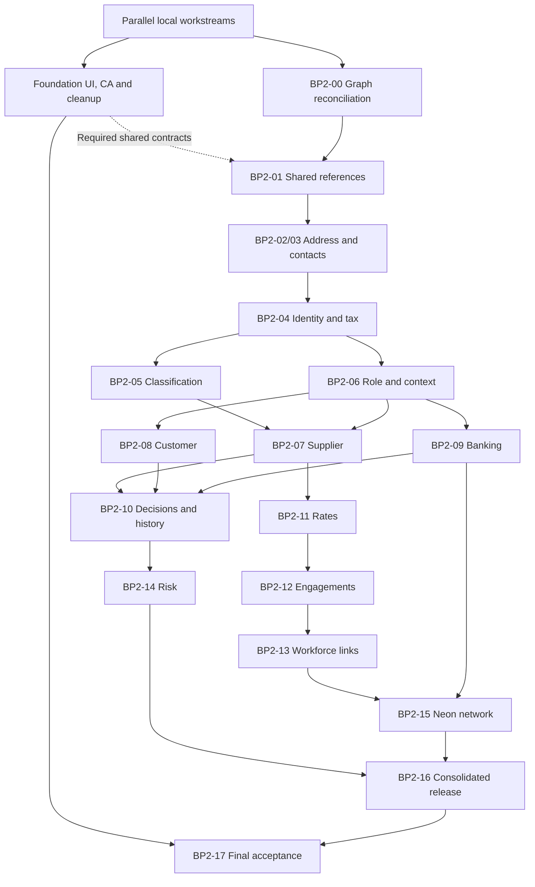

# Business Partner Phase 2 — Neon relationship and reference expansion

Created: 2026-09-21. Revision: 4 — BP2-00 reconciliation and BP2-01 shared-reference foundation completed. **Status: BP2-00 and BP2-01 complete with explicit corrective follow-ups; BP2-02–BP2-17 not started.**

This is a separate plan for foundation closeout and the Neon Business Partner expansion identified in the [DDL/MetaEntity review](neon-business-partner-ddl-review/README.md). `BP2-*` identifiers below are this workstream's packages; they do not refer to the original foundation plan's numbered compiler/runtime phases.

Existing authority remains with the [foundation plan](build-work-plan.md), [Comments and Attachments plan](entity-comments-and-attachments-build-plan.md), and their domain contracts. This document does not edit those plans or mark their remaining work complete. The [localization plan](localization-guidance-and-build-plan.md) remains separately deferred under its stated prerequisite; this plan neither starts it nor silently adds the entirety of Phase 2 as a new prerequisite.

## 1. Intended outcome and scope

Complete a coherent MetaEntity-driven Business Partner graph for Neon: shared references, addresses and contacts, identity/relationships, classification/certification, supplier/customer company context, governed decisions, masked banking, and supplier external-workforce summaries and workflow links.

The result is not an editable application for every physical table. Each table must have an explicit disposition: reusable reference entity, parent-owned collection, governed business entity, read-only history/projection, existing infrastructure dependency, or deferred adjacent domain.

### Included

- Reconcile initial-foundation items against current code and actual acceptance evidence before extending them.
- Reuse all 15 shared reference tables where the selected domain consumes them, with correct identities and lookup dependencies.
- Complete the related master/control model and the required document/snapshot links described in the review.
- Preserve existing domain services, authorization, evidence, lifecycle, verification and concurrency behavior beneath metadata-driven surfaces.
- Integrate the completed shared Comments/Attachments capability through metadata where appropriate; no second implementation.
- Close the loop from authored definition through compilation, immutable publication, activated payload, browser rendering and persisted domain result.
- Maintain table dispositions and concise package completion notes, including tables intentionally kept internal.

### Excluded

- Mesh and Studio application expansion, global reference authoring consoles, or cross-plane data writes.
- A new payroll, HR, treasury, finance, procurement or risk-calculation system. Existing owning workflows are reused through authorized summaries, actions and deep links.
- Generic editing of immutable evidence, integration inboxes/attempts, protected profiles, disclosure payloads or business decision results.
- A new localization implementation, translation editor or locale-qualification project.
- Production rollout cohorts, compatibility frameworks, dual writes or preserving obsolete local request storage.

Work against the current local development model: direct source contract/DDL/seed evolution, affected checks and a fresh disposable validation database where schema work requires one. The existing application database and object storage are not implicitly disposable. Do not execute a reset or mutate old immutable releases as part of this planning task.

## 2. Evidence baseline and status discipline

The preceding review scanned 229 Neon-manifest SQL files and 580 unique CREATE TABLE declarations; 11 legacy request tables are dropped later in the manifest. There are 278 declarations in the requested schemas: 15 shared, 153 master and 110 control. The review found 19 direct storage bindings in the inspected draft core-example set; absence from that set does not prove absence from every runtime metadata source.

Use the [278-table review matrix](neon-business-partner-ddl-review/shared-master-control-matrix.csv), [43-table user-list reconciliation](neon-business-partner-ddl-review/user-list-reconciliation.csv), and [all-schema declaration inventory](neon-business-partner-ddl-review/all-neon-table-declarations.csv) as starting evidence. This plan adds a [table-to-work-package allocation](neon-business-partner-ddl-review/phase-2-table-work-packages.csv). Allocation is planned ownership, not proof of implementation or an instruction to expose every row as an entity.

The foundation records contain both implementation notes and older unchecked/status entries. **An unchecked entry is a re-verification candidate, not an instruction to rebuild working functionality.** Conversely, a successful screenshot or a draft JSON file is not proof of full publication/authorization/domain acceptance.

At the final documentation check, the Comments/Attachments owning plan records CA-00–CA-02 complete and CA-03–CA-10 planned. Consume its [CA-01/CA-02 implementation record](entity-comments-and-attachments-ca01-ca02-implementation.md) and latest status during BF-05; do not restart completed packages. That workstream is progressing independently, so its owning record remains authoritative.

Use these statuses during execution:

| Status | Meaning |
|---|---|
| Planned | Required outcome is defined; no implementation completion claimed |
| Verify existing | Source suggests the outcome exists; confirm callers and relevant evidence |
| In progress | Changes or required integration checks remain |
| Complete | Implementation and affected checks pass; required behavior demonstrated |
| Retained dependency | Existing authority is reused; no new standalone BP entity |
| Intentionally internal | No general UI/CRUD exposure; safe projection only if explicitly scoped |
| Deferred | Outside this workstream; reason and owning domain recorded |

For each completed work package record three short items: what changed, what was checked, what remains. A package may finish with focused checks and carry its integrated journey to BP2-17, but the overall plan cannot finish until required end-to-end journeys pass. No independent approval ceremony or evidence dossier is required per package.

### Local definition of done

This repository has no staging or production deployment. Use one practical completion rule for every BF/BP2 package:

1. The required code, canonical schema/seeds, metadata and callers are coherent; reuse working implementation and remove superseded paths after checking consumers.
2. Affected typechecks/builds and meaningful focused checks pass. For schema changes, verify the changed behavior against the canonical fresh-install DDL using the application database role. For metadata changes, verify actual local publication and consumption, not only example JSON.
3. The package's local behavior works and its three-line completion note identifies any integrated journey carried to BP2-17. Unfinished required behavior stays in progress; only cross-package validation may be carried forward.

The **Done when** and **Checks** lines below are implementation checklists under this single rule, not separate sign-off gates. Reuse existing passing checks when the relevant code and contracts have not changed. No mandatory screenshots, duplicate manual negative-case runs, per-table evidence dossiers, staging/UAT sign-offs, deployment rehearsals or production rollback plans are required for this local build. Future deployment readiness belongs to a later deployment plan.

Keep domain requirements intact: tenant/parent/company authorization, protected data, referential integrity, version checks, idempotency, audit history and business approvals still apply. Simplifying project completion does not remove business approval workflows or immutable metadata release semantics. Run one combined local integration pass after both workstreams converge; after fixes, repeat affected journeys rather than the entire suite without cause.

## 3. Foundation closeout before Phase 2 implementation

These packages reconcile pending initial-foundation work. They do not duplicate or replace its ownership. **Phase 2 may progress in parallel with foundation work when the specific contracts it consumes are verified.** BF-00–BF-05 are not a blanket prerequisite to start. Foundation closure, including the accepted Comments/Attachments scope, is required for BP2-17 final integration completion.

### Parallel ownership and prerequisites

| Work | Can proceed when | Integration boundary |
|---|---|---|
| BP2-00 inventory and reconciliation | Current source and owning plans are available; coordinate with BF-00 | No dependency on cosmetic or collaboration completion |
| BP2-01 reference contracts/providers/metadata | Relevant BP2-00 ownership is resolved; consumed reader, publication and lookup contracts are verified | BF-01/BF-02 only for paths used by this slice |
| BP2-02/03 address/contact slices | Required reference contracts and existing mutation/parent-access paths pass focused checks | BF-04 for mutations used; foundation owns generic layout/navigation changes |
| BP2-04/05 and later domain slices | Their package dependencies and actual shared contracts are ready | Prepare independent work now; integrate dependent behavior when ready |
| Certificate or other attachment-dependent behavior | Required shared attachment contract and implementation are ready | Consume BF-05/CA outcomes; no alternate attachment implementation |
| BP2-17 combined local completion | Required BP2 work and BF-00–BF-05 closeout have converged | One integrated local pass |

Foundation owns UI cosmetic fixes, shared navigation/layout, Comments/Attachments and its repository cleanup. Phase 2 owns the reference/domain expansion and its metadata wiring. Use separate branches/worktrees for concurrent code changes; coordinate shared schema, contract, registry and publication edits with one owner for each overlapping change. This scheduling guidance does not require parallel agents.

Before removing a package, check repository imports, manifests, exports, registration, scripts and in-flight Phase 2 consumers. Agree and update the replacement callers in the same coherent change, then run affected checks. Do not retain unused packages indefinitely, or delete a dependency while another slice is adopting its replacement. If a shared contract changes, recheck its affected consumers rather than stopping every workstream.

### BF-00 — Establish the real completion baseline

- [ ] Read the latest foundation, Comments/Attachments and implementation completion records; reconcile older status rows with current code.
- [ ] Capture one authenticated local Manage → detail → section → request journey and its API calls; the earlier foundation inventory recorded a missing browser trace.
- [ ] Identify actual active release IDs/hashes and source definitions for BP, supplier/customer roles, references and collaboration capabilities. Record source-versus-active mismatches explicitly.
- [ ] Record the canonical public routes, BFF operations, runtime registrations, retained domain providers and obsolete candidate callers.
- [ ] Establish a fixture with more than one authorized/unauthorized company and partner, plus zero/nonzero related collections. Reuse existing fixtures where available.

Done when: a concise current caller/release/acceptance map exists. No phase is restarted solely because an old checkbox is unmarked.

### BF-01 — Verify shared reader, projection and cache boundaries

- [ ] Verify immutable artifact caches are distinct from authorized browser projections and record data.
- [ ] Confirm raw artifact keys include appropriate plane/tenant/preview/release coordinates; sensitive data/projection keys retain principal, authorization epoch and resource context where relevant.
- [ ] Confirm one request intent cannot mix release fragments; missing artifacts and cache failures do not compile on demand or silently switch releases.
- [ ] Find remaining private BP definition loaders; move only redundant metadata loading to the shared pinned reader, preserving business interpretation adapters.
- [ ] Verify context changes and late responses cannot restore stale data into the active record view.

Done when: existing reader checks plus any necessary targeted regression pass; actual retained adapters are documented.

### BF-02 — Reconcile routes and generic read contracts

- [ ] Confirm the supported generic list, record bootstrap, section, summary, lookup and operation routes against current registrations and callers.
- [ ] Complete a missing list/lookup capability only where an actual consumer requires it; do not add speculative batch endpoints.
- [ ] Confirm safe typed filters, allowlisted projections, deterministic bounded pagination and tenant/owner admission in shared collection reads.
- [ ] Remove duplicated generic-page ownership and dead route wrappers only after tracing public aliases, imports, exports and bookmarks.
- [ ] Preserve current BP URLs, query state, browser history, bookmarks and entity-title breadcrumbs.

Done when: Manage and a reusable reference list/detail flow work through documented supported contracts; callers do not choose SQL tables or arbitrary provider keys.

### BF-03 — Close record navigation and section-read acceptance

- [ ] Verify direct tabs → 360 dropdown destinations, deep links, back/forward, return to Overview, and last-section alignment.
- [ ] Verify content-only, content+sections, content+summary and three-pane settings preserve headings, padding and scroll behavior.
- [ ] Retain demand-driven section loading, independent retry, resource revisions and invalidation; no whole-record child fan-out.
- [ ] Confirm empty, forbidden, missing-context, loading and unexpected-error states remain distinct. Expected context errors must not create unhandled promise rejections.
- [ ] Verify protected banking/tax/identity fields are not exposed through fallback renderers, search, summaries or raw technical response envelopes.

Done when: the completed foundation UI remains the regression baseline; Phase 2 does not redesign it.

### BF-04 — Close governed operation and request acceptance

- [ ] Run the pending requester → approver → materializer journey using current compiled actions and real local providers.
- [ ] Confirm current request storage uses shared case/snapshot services. Reconcile draft definitions still naming the removed `document.business_partner_request` family.
- [ ] Verify version checks, idempotency, permission/context rechecks, validation and evidence for existing required operations.
- [ ] Confirm reads/navigation do not allocate numbers, create cases, submit actions or perform business mutations.
- [ ] Retire obsolete request routes/materializers only after their replacement callers are accounted for; preserve registered domain commands.

Done when: the logical request experience is bound to the current service projection and its actual acceptance succeeds.

### BF-05 — Consume Comments/Attachments completion and finish shared cleanup

- [ ] Confirm CA-01–CA-10 required outcomes against their own latest completion record; basic rendering/upload is not full capability completion.
- [ ] Carry unresolved capability work to that workstream, not to new BP-specific implementations here.
- [ ] Confirm owner admission, policy/revision handling, drawer/content state sharing and required local provider behavior.
- [ ] Retain the capability reuse check on a second entity and relevant isolation tests from the existing plan.
- [ ] Close pending foundation cleanup: obsolete imports, API wrappers, registries, exports, examples and tests are removed or explicitly retained for a real consumer.

Done when: existing required foundation and capability work is complete and reusable. Localization remains governed by its separate plan.

## 4. Architecture rules for every Phase 2 package

### 4.1 Storage and identity

- Bind to the actual post-manifest table/view or authorized service projection. A CREATE declaration that is later dropped is not an available target.
- Keep `business_partner`, supplier and customer role identities distinct and linked; do not create duplicate partner records per role.
- Preserve actual UUID, natural-code and composite identities. Country/currency fields storing codes do not become UUID values because the reference entity has a UUID primary key.
- Preserve source-specific revision/concurrency semantics. Do not invent `record_version` or `id` fields on tables that do not have them.
- Treat `master.bank_account_usage` as a parent-owned resource unless composite identity is supported explicitly; its key is `(tenant_id, bank_account_link_id)`.
- Polymorphic owner links use registered owner admission. Their `owner_id` is not automatically a direct FK to Business Partner.

### 4.2 Metadata contract package

For each exposed entity/collection prepare the applicable artifacts through the existing compiler:

| Artifact concern | Required content |
|---|---|
| Core | Actual source/provider, identities, fields, protected-field policies, context and capabilities |
| References | Target entity, stored value field, display/search fields, typed dependent filters, inactive-value display behavior |
| Relations | Parent/link/target identity, cardinality, effective dates, scope/owner admission and allowed child commands |
| Presentation | List/detail/section placement, bounded pagination, empty/context/restricted states and safe column choices |
| Operations | Named registered handler, permission, input schema, version/idempotency and resulting invalidations |
| Flow | Existing case/process orchestration and outcomes where a governed change is required |
| Publication | Validated dependencies, registry/permission references, immutable release identity and consumer-compatible projection |

Logical labels/section names must be explicit metadata, not guessed from table names. Preserve existing message keys and the readable label contract; a new localization engine is out of scope.

### 4.3 Authorization and command boundaries

- Recheck current tenant, parent, role, company and organization authority on the server for lists, counts, reads, exports and commands.
- Shared references are globally scoped datasets; access still requires the relevant app authority, but do not invent a tenant column for them.
- Filter company-scoped data by permitted scope. NULL context is not an implicit grant to all companies.
- Metadata may hide unavailable actions but does not authorize the server operation.
- Protect bank details, person data, identifiers and private evidence in projections before rendering. A generic fallback must not expose omitted protected fields.
- Preserve audit/evidence and business validation. Approval, verification, lifting a block, accepting a disclosure or activating an engagement must not become generic field updates.
- Keep declaration/lookup evaluation side-effect free and parameterized. Only server-owned allowlisted bindings can select identifiers, columns, relations or handlers.

### 4.4 UI and integration behavior

- Reuse the existing page shell, section workspace, forms, reference selector and registered specialized renderers.
- A child record's identity, display fields and link attributes must remain separate. Show purpose/primary/effective dates on the relationship, not as properties of the shared address/person/account.
- Load only active/visible resources; do not add hidden counts or full related collections to bootstrap.
- Reset dependent lookup selections only when incompatible, with a clear validation message. Preserve valid existing/inactive values for historical display without allowing new invalid selections.
- Cache and invalidate by the actual resource identity/context/revision. A child mutation need not increment the BP row version to refresh its section.
- Use deep links to owning workflows rather than embedding full treasury, finance or HR management in BP.

### 4.5 Intended app placement and action visibility

This is a proposed surface map, not a requirement to add one navigation item per table. Preserve the existing 360/role/request/transaction/activity navigation and extend its published sections only where the user can take a meaningful action or inspect useful related data.

| Surface | Content | Allowed action style |
|---|---|---|
| Overview / summaries | Existing identity and safe current primary contact/address, role and availability summaries | Navigate to the relevant section; no hidden write on summary load |
| Identity / relationships | Aliases, identity relationships and separately modeled governance membership | Start the supported amendment or relationship command |
| Contacts | Contact people, roles, channels and permitted identity links | Existing contact/channel commands and verification |
| Addresses | Formatted address target plus owner purpose, primary flag and effective dates | Governed add/amend/link change; read-only validation history |
| Identifiers & Tax | Safe identifiers, registrations and jurisdiction references | Authorized amendment/reveal; protected values omitted by default |
| Capabilities / Industry | Tenant commodity capability and industry classification with reference labels | Governed classification change, never automatic crosswalk remapping |
| Qualifications & Certificates | Certificate evidence and qualification outcomes, kept semantically distinct | Existing qualification review/decision and shared attachment actions |
| Roles & scope / company sections | Supplier/customer role, organization assignment and company profile | Role extension and authorized company configuration flow |
| Banking | Masked account, link purpose, scope/company usage and verification/disclosure status | Explicit verification/acceptance/usage/reveal operation |
| Supplier workforce | Authorized engagement/rate/requisition summaries | Open the owning workforce workflow; expose only implemented permitted commands |
| Requests | Current shared cases with validation, decision and materialization outcomes | Case lifecycle operations from published action metadata |
| Business Transactions | Company-authorized domain summaries and supported transaction links | Open the owning transaction; no duplicate finance command path |
| Activity / history | Safe immutable events, mutations, lifecycle and provenance | Read-only drilldown, with access rechecked |
| Comments / Attachments | Completed shared drawer/content capability | Existing capability actions under parent policy |

Reference list/detail pages can be reused from selectors or existing module navigation. Adding read-only reference support does not require promoting every shared dictionary into the main BP menu. Applicability follows partner role, context, capability and authority; an inapplicable section must not be presented as an empty collection.

### 4.6 Source schema change procedure

For each proposed database change, identify the specific invariant absent from current enforcement before editing DDL. Many relationships already exist and require only metadata wiring.

- Inventory actual columns, defaults, keys, check/exclusion constraints, indexes, functions/triggers, views, grants and RLS affected by the change, including later manifest files.
- Verify the domain command/materializer and projection use the same identity and scope. A UI selector is not a replacement for referential integrity or authorization.
- Update canonical DDL, necessary reference seeds, affected contracts and repository code together; add only indexes justified by the actual filtered/paginated query.
- Build changed schema behavior in a fresh disposable validation database using the manifest. Do not infer that source edits changed an already running database.
- Preserve existing local state unless a later explicitly authorized reset or data operation is part of execution. Do not add a migration/compatibility subsystem just to retain incidental development fixtures.
- Verify real runtime-role permissions and tenant predicates for changed paths. A successful superuser query is not access-control acceptance.

## 5. Phase 2 work package map

BP2-00 reconciliation and BP2-01 shared-reference foundation are complete; BP2-02–BP2-17 remain planned. Dependencies describe implementation order. Reconciliation completion does not imply that the remaining domain expansion or recorded source corrections have been implemented.

| ID | Outcome | Depends on | Primary owner |
|---|---|---|---|
| BP2-00 | Reconcile table, artifact and provider ownership | Coordinate with BF-00; no foundation-wide blocker | Runtime + metadata + BP domain |
| BP2-01 | Shared reference foundation | BP2-00 | Metadata + reference runtime |
| BP2-02 | Country/state/address graph | BP2-01 | Address domain + generic forms |
| BP2-03 | Contact/person/channel graph | BP2-01 | Contact domain + generic collections |
| BP2-04 | Identity, aliases, relationships and tax | BP2-01–BP2-03 | BP domain |
| BP2-05 | Classification and certification | BP2-01, BP2-04 | Classification + BP domain |
| BP2-06 | Role and company/organization context | BP2-01, BP2-04 | BP + organization authority |
| BP2-07 | Supplier commercial controls | BP2-05, BP2-06 | Supplier domain |
| BP2-08 | Customer commercial controls | BP2-06 | Customer domain |
| BP2-09 | Bank directory, usage and verification | BP2-01, BP2-06 | Banking domain |
| BP2-10 | Decision scopes, blocks and history | BP2-07, BP2-08, BP2-09 | BP governance |
| BP2-11 | External-workforce rate policy | BP2-01, BP2-06, BP2-07 | Workforce commercial policy |
| BP2-12 | External-worker and engagement graph | BP2-06, BP2-11 | External workforce |
| BP2-13 | Supplier workforce workflow links | BP2-12 | Workforce + procurement/finance |
| BP2-14 | Qualification risk drilldown | BP2-05, BP2-07, BP2-10 | Risk + BP admission |
| BP2-15 | Safe Neon network projections | BP2-09, BP2-12, BP2-13 | Neon integration owners |
| BP2-16 | Consolidated publication and capability wiring | BP2-01–BP2-15 | Compiler/runtime integration |
| BP2-17 | Integrated acceptance and retirement | BP2-16; required BF-00–BF-05 closeout | Cross-domain integration |

Publication and focused validation happen in every vertical slice. BP2-16 consolidates the release graph and checks compatibility; it is not the first time any package is published. BP2-07 and BP2-08 can progress independently after their prerequisites. Dependencies apply to the contracts actually consumed: independent work can proceed while another subtask waits. Attachment-dependent outcomes additionally consume BF-05/CA readiness. A package remains in progress until its required implementation and focused checks are complete.

## 6. Detailed implementation packages

### BP2-00 — Reconcile the complete graph before adding entities

**Completion record:** [BP2-00 reconciliation and checks](neon-business-partner-ddl-review/bp2-00/README.md). Read-only active metadata/catalog evidence, table/field/presentation/handler/operation ledgers and concrete corrective work are attached. The retired request Core binding remains an explicit BF-04 correction; no old tables or new entities were created. Source-catalog validation is tested when a final catalog is supplied; publisher integration is tracked as C02 alongside the request correction.

**Inputs:** review CSVs, activated metadata from BF-00, actual registered providers and final DDL order.

- [x] Give every reviewed table an exposure type, owning domain, current artifact/provider evidence and planned consumer or exclusion reason.
- [x] Distinguish existing core completeness from core presence; account for all 43 user-listed tables.
- [x] Reconcile the 11 retired request declarations to the case/snapshot projection; retain the logical request entity without reviving legacy storage.
- [x] Separate employee-based workforce metadata from external-worker/engagement metadata and permissions.
- [x] Record every required specialized handler and why declarative reads are insufficient; do not wrap the former whole-record aggregator in a generic handler name.
- [x] Establish one table/field/handler naming ledger so examples, compiler schemas, source DDL and browser parsers agree.
- [x] Classify unsupported business operations separately from missing UI metadata; retain unsupported actions as unavailable rather than exposing an inert button.

**Done when:** table-to-surface mapping and typed contracts are coherent; source-example mismatches have concrete corrective work. **Checks:** removed source object rejected; missing required handler/permission rejected; no generic write permission inferred from entity visibility.

### BP2-01 — Shared reference foundation and lookup contracts

**Tables:** all 15 `shared` references. Banking-specific directory behavior is completed in BP2-09; classification-specific behavior in BP2-05.

- [x] Reuse country and currency readers/definitions already present; verify actual release coverage before creating another core.
- [x] Define or complete read-only reference cores for state/region, language, locale, timezone, UOM, classification scheme/codes/crosswalks and bank institution/branch/identifier.
- [x] Define stable stored value versus record identity for each consuming field, including code-valued country/currency/timezone fields and UUID-valued bank references.
- [x] Reuse the supported lookup API and reference controls; extend typed contracts only where a real dependent lookup needs them.
- [x] Add explicit search/display projections, bounded pagination and deterministic ordering. Do not fetch entire growing code catalogs into form state.
- [x] Admit only declared dependencies such as country, bank institution or classification domain; reject forged filters and field names.
- [x] Resolve inactive existing selections for display while excluding ineligible references from new selections.
- [x] Keep language distinct from locale, timezone aliases distinct from display names and billing units distinct from general UOM.
- [x] Keep global reference maintenance outside this phase; add only the Neon read/list/detail/lookup surfaces actually required.

**Done when:** reference registry serves real BP consumers through one contract. **Checks:** code/UUID mismatch, invalid dependent filter, inactive historical value, pagination boundaries, country/state and institution/branch isolation. No UI-language activation changes.

**Completion record:** [BP2-01 shared reference foundation and lookup contracts](neon-business-partner-ddl-review/bp2-01/README.md). The accompanying [registry ledger](neon-business-partner-ddl-review/bp2-01/reference-registry.csv) records every shared table, persisted value, stable record identity, admitted dependency scope, BP consumer and historical-display rule. The new read-only Core artifacts remain authoring inputs until their governed Neon publication; no reference maintenance or UI-language activation was added.

### BP2-02 — Country → subdivision → address → owner link

**Tables:** `master.address`, `address_link`, `address_event`; `shared.country`, `state_region`, `timezone`; owner registry dependencies.

- [ ] Add missing state/region, manual-region mode and timezone projections to the address core and BP target field bindings where supported by the source contract.
- [ ] Model state lookup as country-dependent, preserving full subdivision codes and the existing composite FK. Do not add a duplicate country/state relation.
- [ ] On country change, clear only incompatible subdivision values and reevaluate postal/address rules. The server remains authoritative.
- [ ] Reuse existing state-code/country validation and active-reference capture; support the existing manual-region path when appropriate without asserting a false reference.
- [ ] Replace country-specific UI condition branches with the supported country address policy/hints; do not treat `has_postal_codes` as a universal mandatory-postcode flag.
- [ ] Keep canonical address data separate from link purpose, attention/addressee, primary status, usage status and effective dates.
- [ ] Verify the polymorphic owner mapping, tenant identity and temporal primary-address behavior in all reads and writes.
- [ ] Surface validation/provider history as read-only safe events. Do not expose event insertion as an end-user operation.
- [ ] Apply changes through the existing governed capture/materialization path and invalidate both Addresses and affected Primary Address summary resources.

**Done when:** valid country/state/address data travels through intake/amendment, materialization and detail. **Checks:** mismatched country/state, country switch, missing subdivision coverage, inactive state, foreign-owner link, effective-date/primary overlap and historical display.

### BP2-03 — Contact person, roles and channels

**Tables:** `contact_person`, `contact_person_role`, `contact_link`, `contact_email`, `contact_phone`, `contact_person_identity_link`; protected person data remains separately owned.

- [ ] Define typed person → role/channel/link relations and their owner resolution; do not conflate a BP contact, person identity and authentication principal.
- [ ] Reuse channel verification, normalization, purpose and primary-selection logic.
- [ ] Bind safe contact names and channels to the existing registered contact renderer; avoid raw ID-only cards when a display projection exists.
- [ ] Admit contact-role/channel commands through their parent with current field permissions; retain verification commands and proof requirements.
- [ ] Expose person-identity links only to an authorized consumer and never automatically project sensitive person profiles.
- [ ] Refresh Contacts and Primary Contact summary after relevant child changes without requiring an unrelated BP version increment.

**Done when:** reusable contact graph with correct channel/role detail. **Checks:** cross-owner channel access, primary selection, normalized duplicate behavior, unverified/verified states and identity-linked protected fields.

### BP2-04 — Identity, aliases, relationships, identifiers and tax

**Tables:** `business_partner`, `business_partner_alias`, `business_partner_relationship`, `business_partner_governance_relation`, `business_partner_identifier`, `business_partner_tax_registration`; `tax_jurisdiction`, `tax_type` and organization-owned registrations as references only.

- [x] Add aliases as owned records with kind, language/locale interpretation, country, primary flag and effective dates; reuse existing identity projection.
- [x] Resolve the alias language ambiguity before adding a new FK: specify base language versus regional locale, supported normalization and validation.
- [x] Keep commercial relationships distinct from governance membership. Define source/target direction and required permissions explicitly.
- [x] Link identifiers and tax registrations to their supported type/country/jurisdiction references, including subdivision where applicable.
- [ ] Retain masked identifier values and audited reveal behavior; exclude protected values from list/search/default projections.
- [ ] Publish correct child empty-state and field metadata. Do not infer copy or entity relationships from table names.
- [ ] Keep organization tax registrations organization-owned; provide a reference/drilldown only when the BP relationship actually requires one.

**Done when:** Identity/Relationships/Identifiers & Tax expose the intended graph through governed paths. **Checks:** inverse relationship direction, self-link policy, expired alias, language/locale mismatch, wrong jurisdiction and protected-field denial.

#### BP2-04 implementation contract

The `master.business_partner_alias.language_code` column is intentionally a mixed legacy text field, not a foreign key. It accepts either a base BCP-47 language (`en`, `ms`, `fil`) or a language-region locale (`en-GB`, `pt-BR`). The governed handler trims whitespace, lowercases the language subtag, uppercases the region subtag, and rejects underscores, script subtags, and any other tag shape. Its locale region is not an assertion about the alias's `country_code`; the latter remains the territorial reference. A later migration may split language and locale into separately typed fields, at which point each can take its appropriate reference. Until then, adding a `shared.language` FK would reject valid regional locales and is prohibited.

Commercial relationship records are directional assertions: `source_business_partner_id` is the asserting partner and `target_business_partner_id` is its counterpart. The network projection shows an inverse row only as a read-only view; it never swaps or writes source and target. Governance membership remains in `business_partner_governance_relation` and is not a commercial relationship. Both paths use their own governed change request, and the database self-link constraint remains authoritative.

Identifiers retain their lookup-backed `scheme_code` and optional ISO issuing country. Governed materialization accepts an issuing country only when it is active in `shared.country`. Tax registrations retain their tenant-local jurisdiction and optional tax-type identities; both must be active and tenant owned. A jurisdiction with an ISO subdivision is accepted only when that `(country_code, state_region_code)` remains an active shared subdivision. The identifier/tax projection returns scheme or registration type alongside the resolved tax type, jurisdiction, country, and subdivision coordinates; it does not turn organization-owned tax registrations into BP children.

### BP2-05 — Commodity, industry and certificate graph

**Tables:** `business_partner_commodity_capability`, `commodity_category`, `commodity_code_assignment`, `business_partner_industry_classification`, `certification`, `certification_type`; shared classification tables and applicable control policies.

- [ ] Preserve capability → tenant commodity category → code assignment → shared code. Do not bind capability directly to `shared.commodity_code`.
- [ ] Use domain-qualified code identities, hierarchy and actual effective/version semantics supported by the existing catalog. Do not invent a scheme-version column.
- [ ] Preserve the industry's `(industry_domain_code, industry_code_id)` identity and supported domain constraints; lookup expansion must not silently broaden the business contract.
- [ ] Surface crosswalk mappings as reference evidence; classification change remains an explicit domain action.
- [ ] Keep routing-default mappings and owner-primary mappings distinct; preserve provenance/confidence where relevant.
- [ ] Model certification type/custom-name alternatives, dates and owner scope; bind certificate evidence to the completed attachment capability.
- [ ] Separate a certificate's existence from an approved qualification decision.

**Done when:** capability/classification/certificate surfaces reuse canonical references and policies. **Checks:** cross-tenant category, wrong code domain, invalid hierarchy selection, ambiguous mapping, expired certificate and attachment parent-access parity.

#### BP2-05 implementation contract

`business_partner_commodity_capability` owns only a tenant `commodity_category_id`. Code evidence is resolved through `commodity_code_assignment`, then `shared.commodity_code`; the capability never stores or joins directly to a shared code. A mapping publishes its domain-qualified code identity, mapping type, confidence and provenance. `is_owner_primary` and `is_code_routing_default` are deliberately separate flags: the former is the preferred code for the category in a domain, while the latter is an inbound code-to-category routing rule.

Industry classification remains the composite `(industry_domain_code, industry_code_id)` identity. The database foreign key is authoritative for the matching shared-code domain, and presentation must not substitute a crosswalk result as the selected classification. Crosswalks are evidence only; changing a classification remains a governed domain action.

A certification is an owner-scoped factual record, not a qualification decision. It must use exactly one of a registered certification type or custom name, may be company/site scoped, and its attachment is returned only after the attachment is complete and the caller has both certification and attachment access. Expired certifications and their evidence are excluded from both certificate and attachment projections.

### BP2-06 — Supplier/customer roles and organization/company context

**Tables:** `supplier`, `customer`, `business_partner_operating_organization_assignment`, `company_code_supplier_profile`, `company_code_customer_profile`, `legal_entity_internal_partner_link`, `intercompany_trading_pair`; organization reference dependencies.

- [ ] Reuse one partner identity and existing role creation/extension flows; do not create duplicate partner masters to represent supplier and customer.
- [ ] Declare role/context applicability for each section and operation through typed metadata and current domain authorization.
- [ ] Resolve legal entity, operating organization, company participation and capability through existing authoritative assignments.
- [ ] Keep internal legal-entity partner links/intercompany pairs applicable only to their supported internal-organization scenarios.
- [ ] Handle missing, invalid and revoked contexts with the existing centered availability state and an applicable context-selection action.
- [ ] Ensure selectors do not reassign persisted record ownership; commands must carry and validate intended scope.
- [ ] Preserve permission-aware aggregation: no unbounded all-company fallback when context is absent.

**Done when:** one partner can have supplier/customer roles with distinct valid company profiles. **Checks:** role absence, wrong organization capability, unauthorized company, revoked context, NULL scope, stale selection and internal/external role mismatch.

### BP2-07 — Supplier qualification, preference and activation

**Tables:** `control.business_partner_qualification`, `supplier_preference_designation`; supplier company profile; payment/reference, activation and process-policy dependencies.

- [ ] Bind supplier qualification and preference lists/details to safe existing decision projections.
- [ ] Define request/review/approve/reject/revoke actions only where corresponding governed commands exist or are implemented within this package.
- [ ] Preserve partner-role identity, commodity, organization/company scopes, effective dates, approval requirements and idempotency.
- [ ] Reuse activation-readiness, required evidence and process-selection services. Display specific unmet requirements and allowed remediation flows.
- [ ] Expose payment methods/terms and permitted accounting references through company-filtered lookups; subordinate term clauses stay under their term.
- [ ] Do not show activation as available merely because the form has values; the authoritative readiness and decision checks must pass.

**Done when:** governed supplier qualification/preference changes are visible and affect eligibility through the existing authority. **Checks:** pending versus approved outcomes, double decision retry, missing evidence, future/expired preference and activation blocked by unmet requirements.

### BP2-08 — Customer designation, credit and lifecycle

**Tables:** `control.customer_account_designation`, `customer_credit_review`, `customer_lifecycle_event`; customer company profile and commercial references.

- [ ] Expose designation/credit review history and current effective outcomes with explicit customer/company context.
- [ ] Bind safe financial fields and currency to the actual company profile/review semantics; do not treat a review as a direct balance mutation.
- [ ] Reuse named decision/revocation/lifecycle commands with current authorization, expected version and evidence handling.
- [ ] Keep lifecycle events read-only; show permitted transitions rather than arbitrary status editing.
- [ ] Refresh affected company/credit/eligibility summaries after successful operations.

**Done when:** customer commercial governance is navigable and consistent with its domain result. **Checks:** cross-company credit read/write, expired designation, stale decision, repeated action, forbidden transition and event immutability.

### BP2-09 — Bank directory, account ownership and company usage

**Tables:** shared bank institution/branch/identifier; `master.bank_account`, `bank_account_link`, `bank_account_usage`, `bank_account_company_usage`, `bank_provisional_reference`; bank-validation configuration and verification document dependencies.

- [ ] Reuse the existing Banking reader and bank-directory projection, preserving masks and audited reveal operations.
- [ ] Add institution-dependent branch and identifier lookups; preserve scheme, namespace, jurisdiction and effective dates, not just BIC.
- [ ] Validate institution/branch compatibility against existing composite constraints on every write.
- [ ] Keep bank account data, owner relationship, usage scope, company acceptance and verification as distinct resources in metadata.
- [ ] Model composite-key usage as an owned resource; no invented `id` or generic update endpoint.
- [ ] Preserve provisional-bank submission/resolution as a governed process; a reference miss must not create a global institution automatically.
- [ ] Preserve selected-companies versus all-authorized-companies semantics and per-company accepted disclosure version/fingerprint.
- [ ] Define explicit verification, usage change, acceptance and reveal actions through existing commands; do not expose protected account identifiers in a generic detail/list payload.
- [ ] Keep `bank_account_house_config` and `bank_account_house_payment_method` as treasury-owned adjacent setup, not editable supplier bank details.
- [ ] Refresh Banking/summary state after verified changes and fail safely on context loss or revoked reveal permission.

**Done when:** Banking metadata describes the full protected ownership/usage graph without duplicating its service. **Checks:** branch/institution mismatch, inaccessible account link, unaccepted/replaced disclosure, unauthorized company, provisional status, reveal audit and safe retry after timeout.

### BP2-10 — Decision scopes, blocks and evidence

**Tables:** `control.business_partner_decision_scope`, `business_partner_block`, `business_partner_mutation_evidence`, `customer_lifecycle_event`; address events and relevant case evidence projections.

- [ ] Attach include/exclude scope rows to their actual qualification/preference/designation/credit parent; validate the allowed parent and scope combination.
- [ ] Preserve current hierarchy/effective-date/fingerprint semantics; a selector cannot override the authoritative resolution.
- [ ] Expose block scope, reason, effective dates and permitted lift/block commands; retain downstream eligibility effects.
- [ ] Present mutation/lifecycle/address evidence through typed activity/history projections, not raw technical envelopes.
- [ ] Keep all immutable evidence and event writes under their service owner. Read/list/export admission must match the parent context.
- [ ] Make child decision/block changes invalidate appropriate eligibility and summary resources.

**Done when:** users can understand applicable decisions/blocks and act only through authorized commands. **Checks:** orphan/wrong-parent scope, inconsistent include/exclude input, expired/lifted blocks, duplicate lift, cross-parent evidence access and unchanged historical evidence.

### BP2-11 — Supplier external-workforce rate cards and rates

**Tables:** `control.external_workforce_rate_card`, `external_workforce_rate`; supplier, company, currency, job and site references.

- [ ] Define a company-governed rate-card root and child rate rows with supplier/job/site/classification filters and effective ranges.
- [ ] Resolve rate-card currency through the existing currency reference; verify server validation and decide whether a matching FK is required before changing canonical DDL.
- [ ] Preserve the constrained billing-unit vocabulary. Do not equate `fixed` with a physical UOM; any future conversion requires explicit semantics.
- [ ] Validate min/max/regular rates, overtime factors, markup, effective overlap and company scope using existing domain rules.
- [ ] Keep rates as policy, not spend authorization. Accepted commercial terms on work orders/SOWs remain revisioned snapshots.
- [ ] Show only supplier-applicable rows in BP; do not disclose unrelated suppliers' negotiated rates.

**Done when:** supplier rates are referenceable by authorized workforce workflows without overwriting accepted contractual snapshots. **Checks:** wrong currency, overlaps, invalid unit, supplier filter bypass, out-of-range rates and changes after contract acceptance.

### BP2-12 — External-worker, person, engagement and placement

**Tables:** `master.person`, `external_worker`; `document.worker_engagement`, `worker_operational_placement`, `worker_compliance_item`, `engagement_onboarding_case`; rate and organization dependencies.

- [ ] Introduce distinct external-worker/engagement definitions and register their provider keys and permissions; do not reuse employee-based storage bindings.
- [ ] Resolve supplier association through engagements and commercial documents; `external_worker` has no permanent supplier FK.
- [ ] Model engagement → external worker → person with strict safe projection; sensitive profiles are not generic related collections.
- [ ] Preserve the work-order-or-SOW source constraint, dates, company/legal entity, classification, rates and readiness state.
- [ ] Reuse existing activation/suspension/termination/onboarding/access-projection authority. UI metadata must not directly provision access.
- [ ] Expose placements and compliance as parent-scoped child resources; verify relevant org/site/cost-center dependencies.
- [ ] Preserve sequential/concurrent engagement semantics defined by the domain; do not globally deduplicate worker relationships into one supplier.

**Done when:** a supplier's valid engagements are visible without exposing unrelated workers or internal employee data. **Checks:** same person with different supplier engagements, foreign-company placement, missing contractual source, unready activation, termination/access revocation and restricted-person projection.

### BP2-13 — Supplier workforce requisition, contract and execution links

**Tables:** `document.workforce_requisition`, `workforce_requisition_supplier`, `external_candidate_submission`, `external_candidate_evaluation`, `contingent_work_order`, `contingent_work_order_revision`, `statement_of_work`, `statement_of_work_revision`, `statement_of_work_item`, external time/expense/service header-line tables, workforce invoice/source allocations and existing service sheets.

- [ ] Declare supplier-filtered relations and stable counts/deep links from the BP workforce surface to owning workflows.
- [ ] Reuse requisition distribution authority and supplier admission; a supplier must not see another supplier's submissions or prices.
- [ ] Preserve pre-selection candidate privacy and restricted evidence boundaries. Do not put CV/PII payloads into generic metadata fields.
- [ ] Expose accepted/revised commercial terms read-only from their authoritative revisions; modifications occur in their contract workflow.
- [ ] Integrate time/expense/service summaries through existing approval and finance services; do not add an alternate acceptance or invoicing path.
- [ ] Preserve source allocation, reversal and duplicate-claim protections; retain stable links to the accepted business document.
- [ ] If a destination workflow is not yet operational, mark it unavailable with its owner/dependency recorded. Required plan outcomes remain open; do not claim an inert link is complete.

**Done when:** the BP app gives a coherent supplier workforce overview and functioning links into required existing execution workflows. **Checks:** supplier-scoped requisitions/candidates, revision integrity, unauthorized claim, duplicate acceptance/allocation and required destination availability.

### BP2-14 — Qualification-linked risk projection

**Tables:** `master.party_risk_assessment`, dimension scores, evidence, drivers, mitigations and review events; risk models/dimensions/sources and `control.risk_source_config` as dependencies.

- [ ] Bind the qualification's actual assessment link; define safe current outcome and permitted drilldown fields.
- [ ] Keep risk scoring/model/provider configuration and reassessment authority in the existing risk domain.
- [ ] Preserve immutable assessment/evidence history and mitigation lifecycle; do not render internal provider payloads as arbitrary JSON.
- [ ] Show unavailable/pending/stale assessment states distinctly from low risk or no records.
- [ ] Use role/company/parent admission consistently for summaries and evidence drilldowns.

**Done when:** qualification risk context is understandable without creating a new risk engine. **Checks:** missing/stale assessment, denied evidence, assessment from another partner, mitigation changes and no recalculation on read.

### BP2-15 — Neon network provenance and processing boundaries

**Tables:** the eight user-listed `control.mesh_*` tables, received profile/disclosure snapshots and Neon match/accept/profile-change documents.

- [ ] Expose only approved account links, profile projection state, bank disclosure acceptance and safe provenance through current readers.
- [ ] Keep profile/disclosure/claim inboxes and processing attempts internal; provide a bounded safe status only where the app needs one.
- [ ] Reuse Neon-owned match/accept/change-review commands with revision, idempotency and source authority checks.
- [ ] Preserve received immutable snapshots; external profile changes must not overwrite local master records merely because a page is read.
- [ ] Connect workforce claim reconciliation outcomes to the owning execution workflow, not a new raw-inbox editor.
- [ ] Keep bank disclosures behind Banking field protection and company acceptance.
- [ ] Do not implement Mesh app routes, Studio configuration screens or cross-plane database joins in this package.

**Done when:** safe Neon integration status and permitted acceptance flows are available; raw integration records remain private. **Checks:** replay, out-of-order/newer disclosure, stale acceptance, wrong source account/tenant, unauthorized raw payload and no mutation on read.

### BP2-16 — Consolidate publication, operations and capabilities

- [ ] Build the full core/reference/relation/presentation/operation dependency graph for the selected surfaces through the existing compiler.
- [ ] Validate source object existence, identities, typed fields, supported renderer/provider registrations, permissions and child/parent references.
- [ ] Reject unknown or retired storage targets, unsupported handler keys, invalid code/UUID bindings and operations lacking a domain implementation.
- [ ] Publish the assembled local release through the real authority; inspect activated payloads and browser projections rather than only draft examples.
- [ ] Attach Comments/Attachments only where ownership and capability policies are valid; certificates and workflow evidence retain their real attachment ownership.
- [ ] Check list/detail/section/summary/lookup/export field protection and operation parity.
- [ ] Verify cache pins, child invalidation and context transitions across the expanded graph.
- [ ] Remove replaced hardcoded label/relation/provider branches only after consumer checks. Retain specialized business renderers/readers where justified.

**Done when:** activated metadata and live local readers agree; no fake generic provider hides an unbounded legacy aggregator. **Checks:** publication negative cases, active payload identity, section isolation and a second entity reusing a shared lookup/collection capability.

### BP2-17 — Final acceptance, cleanup and completion

- [ ] Run the integrated journeys in section 9 once after package integration, using real local services and appropriately isolated fixtures.
- [ ] Resolve required failures, rerun affected paths and record any approved/deferred adjacent domain limitations explicitly.
- [ ] Reconcile the table allocation, actual release/source map, final routes/providers and named operations.
- [ ] Delete superseded imports, registries, wrappers, tests and examples only after all consumers move. Do not remove retained domain protections in pursuit of generic code.
- [ ] Confirm the existing BP navigation/layout/empty-state behavior and Comments/Attachments acceptance remain intact.
- [ ] Confirm Mesh/Studio apps and localization have not been unintentionally expanded.
- [ ] Record actual affected typechecks/tests, final local results and remaining nonrequired work. Close this plan only when all required outcomes are complete.

**Done when:** one complete supported Neon BP graph, with safe references, governed commands, traceable active metadata and honest per-surface status.

## 7. Schema and contract decisions to resolve during implementation

| Decision | Proposed direction | Owner / closure point |
|---|---|---|
| Existing example versus active release | Active verified payload + current service is runtime evidence; reconcile source definitions without editing immutable history | BF-00/BF-04, BP2-00 |
| Alias language semantics | Choose base language or locale explicitly; normalize and validate before introducing a reference constraint | BP2-04 |
| Address manual subdivision | Retain supported manual-region mode; reference mode requires a valid country/subdivision pair | BP2-02 |
| Reference UUID versus stored code | Declare valueField/reference identity explicitly; do not globally convert persisted codes | BP2-01 |
| Composite bank usage identity | Parent-owned resource unless composite-key support is deliberately implemented | BP2-09 |
| Rate-card currency integrity | Verify existing command validation; add an appropriate FK only after source/data compatibility review | BP2-11 |
| Workforce billing-unit mapping | Preserve existing constrained units; generic UOM mapping is not an implicit requirement | BP2-11 |
| Missing workforce handler | Dedicated external-workforce provider with actual authorization and projection, separate from employee definitions | BP2-12 |
| Missing downstream workflow | Realize required workflow integration or record an explicit scope/dependency decision; no inert links counted as completion | BP2-13 |
| Global shared-reference maintenance | Read/reference consumption only in Neon; authoring/maintenance deferred to its owning workstream | BP2-01 |

These are implementation decisions to resolve with evidence, not mandatory user approval checkpoints. Escalate only material product-scope ambiguities that cannot be resolved from the accepted domain model.

## 8. Expected code and source ownership

Existing paths are starting points; introduce a new module only when a real extraction/consumer requires it.

| Area | Source locations | Responsibility |
|---|---|---|
| Canonical DDL | `server/db/ddl/common/shared/`, `common/master/`, `common/control/`, `planes/neon/master/`, `planes/neon/control/`, `planes/neon/document/` | Verified references/constraints and local seeds; preserve manifest order and grants/RLS |
| Metadata source examples | `metadata/products/mdg/entities/` | Reconcile illustrative artifacts with actual authoring source; never treat example edits as publication |
| Contracts/compiler | `packages/contracts/platform/entity-runtime/`, `server/packages/contracts/publication/`, `server/packages/services/publication/` | Typed identities/relations/references and validated compilation |
| Metadata reader | `server/packages/platform/metadata/` | Pinned immutable resolution and authorized projections |
| Runtime resources | `server/packages/platform/experience/src/entity-*.ts` | Plan, section, summary and named operation dispatch |
| BP domain | `server/packages/services/master-data/src/` | Existing BP360, case, contact/address, eligibility, supplier/customer, banking and workforce authority |
| Finance/workforce execution | `server/packages/services/finance/src/external-workforce/` and existing owning services | Accepted service-sheet/source/allocation behavior |
| Runtime registration | `server/apps/platform-host/src/composition/register-services.ts` and current domain registration modules | Explicit handler/provider registration; not an alternate business-logic layer |
| Shared client/renderers | `packages/platform/entity/runtime/descriptor-client/`, `form-detail/`, `list-view/` | Typed resources, reference controls, related collections, context states and existing navigation |
| BP app composition | `packages/planes/neon/business-partner/src/` | Domain-specific composition only; generic behavior remains in shared runtime |
| Thin routes | `apps/neon/app/` and BFF relay configuration | Preserve public routes and admit supported API operations |

API work must use the current authoritative route contracts. Record/section/summary/operation runtime routes already exist; verify collection and lookup support before adding endpoints. Do not derive a public API for every SQL table.

## 9. Validation matrix and one integrated local pass

### Focused checks during packages

| ID | Scenario | Expected result / owner |
|---|---|---|
| V01 | Retired source table or missing handler referenced by artifact | Compilation/publication rejects it; BP2-00/BP2-16 |
| V02 | Natural code supplied where UUID required, or inverse | Typed validation rejects; no incorrectly persisted reference; BP2-01 |
| V03 | Country changes while subdivision request is in flight | No stale subdivision selected; server rejects mismatch; BP2-02 |
| V04 | Inactive reference on an existing record | Historical value displays; new invalid selection unavailable; BP2-01 |
| V05 | Parent/tenant/owner forged for child list or command | No unauthorized data or mutation; BP2-02/BP2-03/BP2-10 |
| V06 | Role/company context revoked after load | Subsequent reads/commands deny; caches do not restore stale data; BF-01/BP2-06 |
| V07 | Wrong classification domain or cross-tenant commodity category | Validated before materialization; BP2-05 |
| V08 | Repeated approval/activation or stale record version | Idempotent same outcome or explicit conflict; no duplicate evidence/mutation; BP2-07/BP2-08 |
| V09 | Bank branch from another institution or unaccepted company usage | Rejected; protected fields remain masked; BP2-09 |
| V10 | Protected values requested through generic projection/export | Not returned without required protected operation; BP2-04/BP2-09 |
| V11 | Orphan decision scope or read of another parent's evidence | Rejected/denied; evidence immutable; BP2-10 |
| V12 | Rate overlap, invalid currency/unit or cross-supplier rates | Correct policy validation and scope filtering; BP2-11 |
| V13 | Same person has engagements with different suppliers | Only authorized engagement context visible; no employee-based inference; BP2-12 |
| V14 | Candidate privacy, duplicate claims or source allocations | Existing owner/finance authority preserved; BP2-13 |
| V15 | Missing/stale risk data or denied evidence | Correct availability state, not an invented risk outcome; BP2-14 |
| V16 | Replay/out-of-order external profile/disclosure | No unauthorized overwrite; current acceptance/version semantics retained; BP2-15 |
| V17 | Read-only history or page navigation | No case creation, numbering, approval, verification or other business mutation; all packages |
| V18 | New metadata release during independent section reads | One admitted pin per intent; correct retry/invalidation; BF-01/BP2-16 |

Run affected package typechecks/builds and focused contract/service/component/database checks. Use actual canonical DDL in a fresh disposable PostgreSQL fixture for changed constraints, composite identities and tenant isolation; mocks alone cannot prove them. Test negative cases that exercise business boundaries rather than tests that merely mirror rendered markup.

### Integrated journeys

1. **Partner foundation:** create/amend an allowed BP through the real case flow; choose country/subdivision, add address/contact/alias, materialize and verify detail plus summaries and evidence.
2. **Classification and qualification:** select tenant category and valid industry reference, attach certificate evidence using shared capabilities, then complete an authorized qualification decision.
3. **Supplier scope and banking:** extend supplier/company scope, resolve valid bank/branch or provisional path, complete required verification and company usage, then verify masked reads and authorized reveal.
4. **Customer governance:** extend customer/company scope, run required designation/credit decisions, verify lifecycle history and wrong-company denial.
5. **Supplier workforce:** reference an allowed company rate, navigate supplier requisition/contract context, inspect/create through the supported engagement workflow, then verify placement/compliance/readiness and appropriate execution-document links.
6. **Network/risk:** use configured local fixtures/providers to verify safe provenance and risk outcomes; demonstrate replay/current-version handling and restricted evidence behavior without requiring Mesh app implementation.
7. **Experience regression:** repeat Activity → 360 → Banking, direct section deep link, top/bottom scrolling, browser history, view settings, context changes, empty states and Comments/Attachments drawer/content continuity.
8. **Reuse:** demonstrate an actual second entity consuming the shared reference/related collection/capability runtime without an entity-name branch in generic components.

Each journey uses actors appropriate to its operations. Reuse focused automated tenant/company/owner denial checks; manually repeat them only when integration introduces a boundary not already covered. If a required local integration is unavailable, record the specific incomplete outcome; an attractive empty UI is not evidence that the integration works.

## 10. Parallel delivery sequence and local integration

Start with BP2-00 and BP2-01, followed by BP2-02; proceed with BP2-03 when its contact contracts are ready. Foundation continues independently. The graph shows delivery order; the package table and specific consumed contracts determine readiness.

Use working vertical slices: source contract → provider/command → metadata publication → client behavior → focused check. Do not create all empty entity folders before proving the first relationship. Validate the reference/address slice before repeating the pattern for more entities; confirm the external-workforce boundary before expanding workflow links. These are normal implementation checks, not additional user approval gates.

Scheduling and effort estimates should follow BF-00/BP2-00, because metadata gaps, missing business handlers and existing completed functionality have materially different costs. No dates or completion estimates are implied by the work-package numbering.

## 11. Completion checklist and current record

- [ ] Foundation carry-forward reconciled and required existing work complete; no duplicate implementation from stale checkboxes.
- [ ] All 43 user-listed tables have explicit implemented/dependency/internal/deferred dispositions; all 278 reviewed requested-schema tables remain accounted for.
- [ ] Every implemented section has a real registered provider or validated declarative query, published metadata and passing parent/context admission.
- [ ] Country/state/address, classifications, Banking and workforce references use the actual source identities and constraints.
- [ ] Supplier/customer roles, company scope, decisions and protected values preserve domain authority.
- [ ] Supplier external workforce is distinct from employee-based workforce and required workflow destinations function.
- [ ] Active local releases contain the intended artifacts; draft examples and retired storage are not mistaken for runtime wiring.
- [ ] Shared Comments/Attachments behavior and existing BP UX remain intact.
- [ ] Required focused checks and one integrated local pass succeed; remaining nonrequired dependencies are accurately recorded.
- [ ] Obsolete callers/definitions are removed after consumer verification; no duplicate generic query/command bypass remains.

| Work | Current status | Execution note |
|---|---|---|
| This Phase 2 plan and allocation matrix | Revision 3: BP2-00 record attached | Domain scope and allocation retained |
| BF-00–BF-05 | Verify existing / reconcile pending work | Do not infer failures or completion from older status rows |
| BP2-00 | Complete: reconciliation and targeted admission checks | [Changes, checks and limitations](neon-business-partner-ddl-review/bp2-00/README.md); corrective work assigned to owning packages |
| BP2-01 | Complete | Reference registry, read-only authoring cores, bounded lookup route/control, dependency validation and historical display resolution are implemented; publish through the governed Neon release path when ready |
| BP2-02–BP2-17 | Planned; not started | Begin eligible slices alongside foundation; verify consumed dependencies; converge at BP2-17 |
| Mesh/Studio apps | Deferred | Neon-only scope |
| Localization | Separate deferred workstream | Existing plan and prerequisite unchanged |
| BP2-00 implementation | Compiler registry/source admission and permission-registry reconciliation | Regression tests added; no DDL/data changes or release activation |

During execution, add per-package completion rows with actual source changes, checks and limitations here. This plan does not retroactively amend the existing plans' records.
