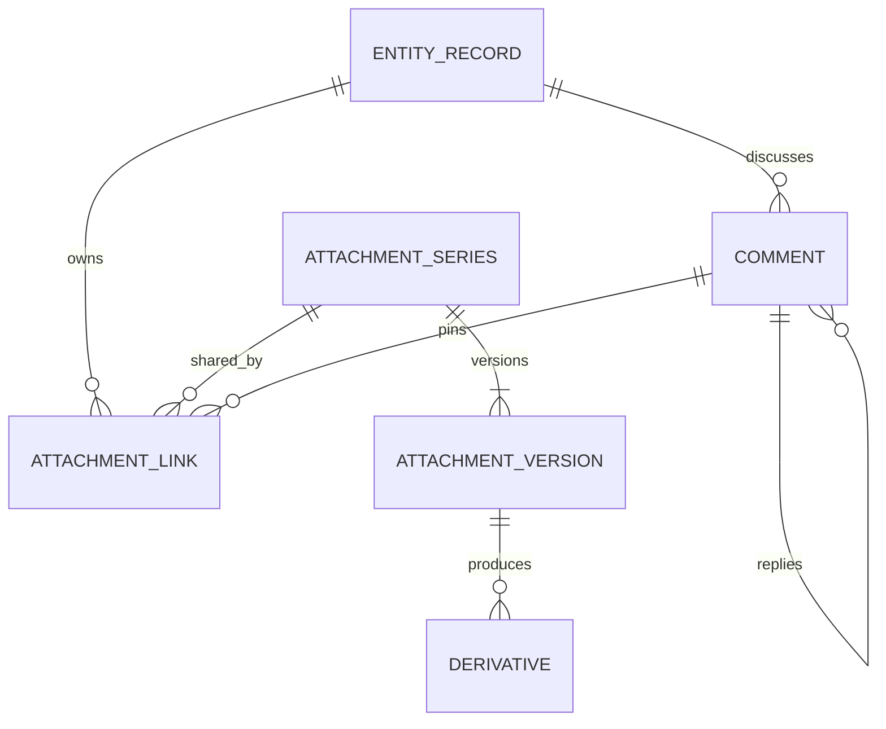

# Entity App comments and attachments design

Status: proposed; implementation and deployment are separate work. Reviewed 2026-09-21 against the current, uncommitted workspace and local Docker engine.

## 1. Recommendation

Use **one contextual right drawer with Comments and Files tabs**, available from every authorized record section. Provide **Open in content area** for sustained file management and long discussions, using the same components and resource state. Open document previews in a large viewer with a clear return action.

Keep record identity visible. On wide screens use a docked, nonmodal drawer; on smaller screens use a modal sheet. The drawer, Summary View, and other shell side surfaces share one coordinator. Opening collaboration temporarily suspends Summary View and closing it restores the user's previous preference. Do not stack drawers or compress the record into an unusable column.

| Choice                         | Strength                                       | Limitation                                      | Decision                  |
| ------------------------------ | ---------------------------------------------- | ----------------------------------------------- | ------------------------- |
| Drawer only                    | Fast comments/upload while inspecting a record | File organization and document review need room | Default quick interaction |
| Content area only              | Space for search, versions and previews        | Requires leaving the current business section   | Expanded workspace        |
| Shared drawer and content view | Supports both tasks and preserves context      | Requires shared state and surface coordination  | Recommended               |

Deliver the shared platform capability first in Neon Business Partner, then qualify another compiled entity. Mesh and Studio consume it through their own published capabilities and permissions. Do not hard-code Business Partner routes into the shared UI.

## 2. Recording review

Local references:

- `/home/chandravel_natarajan/work/experiments/Recording 2026-09-21 021343.mp4`: 75.58 seconds, 1916×968.
- `/home/chandravel_natarajan/work/experiments/Recording 2026-09-21 021641.mp4`: 84.52 seconds, 1916×968.

Review method: extracted visual samples approximately every eight seconds across both recordings. Observations below concern visible UI, not audio narration or proof of backend behavior. The recordings show a Cost Center screen on a staging hostname; local source/runtime findings are a separate evidence source.

| Recording / approximate time | Visible interaction                                                            | Design requirement                                                                                                        |
| ---------------------------- | ------------------------------------------------------------------------------ | ------------------------------------------------------------------------------------------------------------------------- |
| Attachment, 4–20s            | File chooser, large PDF viewer, right attachment drawer                        | Browse upload, preview, return to the same record                                                                         |
| Attachment, 28–36s           | Inline filename edit, PDF type filter                                          | Rename display label; quick type filters                                                                                  |
| Attachment, 44s              | Second image, upload banner and scan-in-progress labels                        | Per-file upload and scan states; avoid a single ambiguous success state                                                   |
| Attachment, 52–68s           | Image preview and expanded uploader/time/size/type/visibility/version metadata | Useful preview, expandable details, clear visibility                                                                      |
| Attachment, throughout       | Drop/paste affordance, search, newest-first control, New Folder                | Drag/drop, paste, search, sorting, later folder management; folder creation itself was not demonstrated in sampled frames |
| Comments, 4–36s              | Expandable formatted composer and Internal/Public selector                     | Rich text with explicit audience                                                                                          |
| Comments, 44–60s             | Root comment, reaction and nested replies                                      | Threads, reactions, collapse/expand                                                                                       |
| Comments, 68–84s             | Inline editing and report form/status                                          | Optimistic concurrency, reporting feedback                                                                                |

A preview appears while list rows still show “Security scan in progress.” This could be stale presentation or permissive admission; the recording does not establish which. The new design must never serve original or derivative bytes before their required checks pass. A blank PDF preview must show loading, unavailable, or failed states with recovery instead of an empty white surface.

## 3. What exists and what is missing

| Area                     | Source evidence                                                                             | Reuse / gap                                                                                                                                                                                                        |
| ------------------------ | ------------------------------------------------------------------------------------------- | ------------------------------------------------------------------------------------------------------------------------------------------------------------------------------------------------------------------ |
| Compiled entity sections | `packages/platform/entity/runtime/form-detail/src/compiled-section-content.tsx`             | Existing `platform.comments.v1` and `platform.attachments.v1`; basic text create/edit/delete, single upload/retry, download. Replace generic cards with shared experiences                                         |
| Rich composer            | `packages/platform/communications/collaboration-ui/src/rich-comment-composer.tsx`           | Rich JSON and clipboard image support exist. Needs formatting toolbar, audience selection, attachment queue, draft restore, integrated threads. Current component submits Internal and default uploader is unbound |
| Browser upload adapters  | `collaboration-ui/src/attachment-client.ts`; compiled uploader                              | Both stage/PUT/finalize. Consolidate around stable attachment IDs and outcome-aware retry; generic adapter currently allocates a new UUID each call                                                                |
| Attachment lifecycle     | `server/packages/services/attachments/src/attachment-lifecycle.ts`                          | Quota reservations, private copy before scan, hashing, lifecycle, purge/retention logic exist                                                                                                                      |
| Canonical model          | `server/db/ddl/common/document/03_foundation_tables.sql`                                    | Series, immutable versions, links, folders, comments, drafts, mentions, reactions already exist. Add targeted extensions rather than duplicate tables                                                              |
| Collaboration API        | `server/packages/platform/collaboration/src/`                                               | Replies, edits, reactions, drafts, read markers, flags and outbox events exist; current compiled reader projects only basic fields                                                                                 |
| Extraction/search        | `server/packages/services/document-processing/src/`; `server/packages/platform/search/src/` | Jobs and authorized search exist; extraction registration depends on jobs, extractor, search and storage together. Decouple extraction from search availability                                                    |
| Derivatives              | `server/packages/services/document-derivatives/src/`                                        | Four rendition definitions and scan-aware job handling exist; provider integration and user-facing retrieval need completion                                                                                       |
| Content library          | `server/packages/services/content/src/content-routes.ts`                                    | Content items have their own ACL, version/link routes. Entity attachments should reuse the underlying series model without becoming content items automatically                                                    |
| Atlas retrieval          | `server/packages/services/attachments/src/retrieval-admission.ts`                           | Current-parent authorization, hash/version and passage admission exist. Optional later experience; never substitute broad AI access for attachment permission                                                      |

### Findings that gate release

1. **Preview protocol mismatch, confirmed live.** `register-adapters.ts` gives PDF and preview adapters the same rendering URL. The PDF adapter uses Gotenberg; the preview adapter posts multipart data to `/render` and expects JSON/base64. From the DEV API container, Gotenberg returned `GET /health → 200`, `POST /render → 404`. Health alone cannot certify preview support.
2. **Deployment/source network drift, confirmed by inspect.** Current parity Compose places parser/render and API/worker/scheduler on `document-services`. Inspected DEV and QA parser/render containers remain on `data`; runtime containers lack the proposed document-services membership. Reconcile the effective source-runtime overrides too, and recreate the group together in a separate rollout.
3. **Parent authorization needs explicit admission.** Generic stage/status/download routes pass attachment IDs to the authorizer; stage does not pass the entity coordinate in the generic permission resource. Content-item staging has a dedicated ACL branch. Require verified parent access for entity uploads and every read, including direct download/preview URLs. Treat this as a code-path gap requiring end-to-end authorization tests, not a claim that every deployed role is exploitable.
4. **Comment attachment association is insufficiently scoped.** `replaceRelations` checks active attachment membership within the tenant, but does not itself require authorized source ownership/parent access, checked scan state, expiry, or pin the referenced version. Harden association before enabling the rich composer widely.
5. **Internal audience is not fully enforced by the compiled reader.** The inspected SQL excludes other authors' Private comments, but treats Internal like Public. Apply audience membership in the service, RLS strategy and nested resources, counts and notifications.
6. **Series lifecycle and list identity need correction.** The current attachment collection checks attachment state but omits series status/expiry and may duplicate a version across matching links. Use a documented series/link identity and apply all lifecycle predicates. The reader joins only current versions; pinned historical evidence requires a deliberate separate projection.
7. **Processing state is invisible.** The collection returns only active/scanned rows, and the status response lacks derivative states. Expose uploader-visible pending work separately from readable files.
8. **Cleanup scheduling is incomplete at this composition point.** `schedulePurge` is a no-op; reservation recovery is registered. Qualify an actual retained-object purge schedule and retries before claiming automatic physical deletion.
9. **Search needs entity-scoped bounded retrieval.** Existing search authorizes each candidate but scans batches to compute authorized totals. Add exact record scope and bounded pagination; do not fetch broad results and filter them in the browser.

## 4. Interaction specification

### Entry, navigation and layout

- Record header: `Comments` with authorized unread count and `Files` with authorized series count. Hide unavailable actions; loading is not zero.
- Desktop ≥1280px: initial drawer 480px, resizable 400–640px; maintain at least 640px useful record content. If that cannot fit, use a sheet or expanded workspace.
- Tablet 768–1279px: modal sheet up to 640px wide. Phone <768px: full-screen sheet. Preview is full screen on phones.
- Drawer header: record label/code, Comments/Files tabs, Expand and Close. Keep composer/upload controls and search visible while content scrolls.
- Expand uses the authorized compiled section destination; Collapse returns to the originating tab, section, scroll and focused control. Existing `tab`/`section` semantics remain intact.
- Proposed URL additions: `panel=comments|files`, `commentId`, `attachmentId`, `versionId`. Only valid authorized IDs restore a surface. Use history entries for explicit opening/selection; replace history for filters. Width and preferred layout are user preferences.
- Switching records cancels stale reads and changes the draft/upload coordinate. No response from the old record can update the new record. Explicitly warn before discarding an unsaved draft; uploads already admitted remain bound to the original record.

### Files

Compact rows: type icon or ready thumbnail; display name; size; uploader; relative time; availability label; overflow actions. Expanded view adds category, version, audience and processing details. Never expose raw storage keys or principal UUIDs as primary user labels.

Toolbar: Upload files, Search files, All/Images/PDFs/Documents/Spreadsheets/Other, newest/name/size sorting, list/grid. Add folder breadcrumbs/New folder in phase 3. Counts are scoped to authorized matches. “Just added” is a temporary highlight, not a storage category.

Upload entry: file picker with multiple selection, drop target in the active collaboration surface and clipboard images when the composer/drop target owns focus. Do not hijack paste in business fields. Queue each file independently; start with at most three transfers and one expensive processing task per worker allocation, then tune from measurements.

Proposed initial allowlist: PDF, PNG, JPEG, WebP, TXT, CSV, DOCX, XLSX and PPTX. The server policy wins; use the existing 25 MiB default ceiling unless tenant/entity configuration is lower. Batch selection limit 10 aligns with the comment attachment contract, while multiple batches can serve a record. Reject zero-byte input. Explicitly reject executables, active HTML/SVG and archives initially. Signed PUT length enforcement is not guaranteed by the storage contract: finalization verifies actual bytes, and storage lifecycle/quota controls handle abandoned oversized staging objects.

Actions by capability:

| Action             | Behavior                                                                                                                        |
| ------------------ | ------------------------------------------------------------------------------------------------------------------------------- |
| Preview            | Only when an authorized safe original or scanned derivative is ready; show failure/unsupported with permitted download fallback |
| Download           | Mint short-lived authorized URL on click, default 120s; no permanent URL in page data                                           |
| Rename             | Inline display-name edit, extension separate and unchanged; preserve original filename, bytes and hash                          |
| Details            | Human uploader, timestamp, size, MIME, audience, version, source record, processing and retention status                        |
| Upload new version | Explicit action, immutable new bytes, old current remains usable until new version is admitted                                  |
| Remove from record | Unlink this association after showing scope; does not delete a shared file everywhere                                           |
| Delete everywhere  | Separate privileged lifecycle operation with reference/retention/legal-hold evaluation                                          |
| Copy link          | Copy app deep link with version when needed, never object URL                                                                   |

The filename duplicate dialog offers Keep both or New version; never overwrite based on filename alone. Batch actions return per-item results and retain failed selections. Folder deletion either rejects nonempty folders or explicitly moves links to the parent; it never silently purges files.

### Comments

Reuse rich JSON with server-derived safe HTML and plain text. Toolbar: bold/italic, lists, link, mention, attach. Display permitted audience choices: **Record participants** maps to current `public`, **Internal team** to `internal`, **Only me** to `private`. “Public” must never imply internet access. Default Internal only when the entity has a defined internal membership policy; otherwise use its published safe default.

Root threads newest first; replies chronological and lazily paginated. Show author display name/avatar, audience, timestamp, edited indicator, attachment chips, reactions, Reply and permitted overflow actions. Flatten visual indentation after two levels while honoring the existing backend maximum depth of five. Replies cannot broaden the parent audience; reactions, reports and mentions require read access to the target.

Save draft per plane/tenant/principal/entity/record/parent thread; restore when reopened. An upload for a draft stays private to its draft owner until an atomic comment association succeeds. A restricted comment's file must not become visible through the record-wide Files list automatically. “Add to record Files” is a separate authorized sharing action with an explicit audience choice.

Submit only after referenced uploads are clean and admitted. Preserve a stable command idempotency key across ambiguous retries. Keep draft and attachment references after errors. For attachment-only comments, evolve the existing nonblank `comment_text` constraint/projection deliberately (accessible derived attachment label or explicit contract change); do not assume the composer and schema already agree.

Edits use expected revision even on the first edit (createdAt fallback until a real revision is introduced). Conflict UI retains the local draft and offers reload/reapply. Removed root comments retain a tombstone if readable replies remain. Report UI shows accepted status; moderation is a separate authorized workflow. Existing status fields do not establish a ready Resolve/Archive UI/API.

### Accessibility and states

Label icon controls. Provide visible focus, keyboard-operable resize or fixed width alternatives, keyboard upload and menus, Escape and focus restoration. Trap focus only for modal sheets/viewers; docked drawer must allow access to record fields. Announce upload transitions through a polite live region without announcing every percentage. Show progress, state and errors as text as well as color. Honor reduced motion and 200% zoom.

Empty states distinguish no files, no search matches, no access and unavailable service. Failed operations retain retry context. Initial list uses skeletons; preview uses an explicit loading state. Download failures render an error with retry instead of unhandled rejection.

## 5. Data ownership and contracts



`ENTITY_RECORD` is a logical coordinate resolved through published metadata/Records, not a new universal SQL table. Plane is selected from verified context; tenant/principal are never trusted from request bodies.

Reuse `document.attachment_series`, `attachment`, `attachment_link`, `attachment_folder` and the existing derivative/collaboration tables. `attachment.id` identifies immutable bytes; `series.id` identifies the document over time; `link.id` identifies association to an authorized parent. Comments pin `pinned_attachment_id` to preserve evidence. Record links can follow current version. Superseding a series does not erase earlier comment evidence.

Proposed additive fields/contracts, subject to migration review:

- Series display name and revision for rename/current-version concurrency; retain `original_filename` on immutable versions. A metadata field is acceptable only with schema validation and an update revision.
- Link-level category, audience policy reference, revision and draft/committed association state where existing structures do not represent them. Avoid introducing a second, contradictory visibility flag on attachment bytes.
- Upload-session association to verified parent or draft owner with expiry and stable command identity. Existing quota reservation remains the capacity authority.
- Derived response `actions`, lifecycle, scan, extraction and preview states, authorized uploader identity and thumbnail availability; no signed URL until requested.
- Auditable version promotion and link/unlink events. Preserve legal hold, retention and canonical DB foundation generation workflow across planes.

Authorization equation for an access path: verified plane/tenant + readable parent + allowed attachment operation + association audience + admitted lifecycle/version. Comment paths additionally require readable thread/comment. Resolve every path to a parent; UUID possession and same-tenant membership are insufficient. Explicit broader record links can grant access independently, so the sharing UI must explain when adding one broadens visibility.

## 6. Upload and processing lifecycle

```mermaid
sequenceDiagram
  participant UI as Entity UI
  participant API as Attachment service
  participant DB as PostgreSQL
  participant S3 as Object storage
  participant AV as ClamAV
  participant Jobs as Workers
  UI->>API: Stage stable attachment ID + parent/draft coordinate
  API->>DB: Authorize parent, reserve quota, persist upload
  API-->>UI: Short-lived private staging PUT URL
  UI->>S3: PUT bytes
  UI->>API: Finalize same attachment ID
  API->>S3: Copy into unique immutable candidate
  API->>AV: Scan exact candidate; measure/hash bytes
  API->>DB: Commit clean version/link + quota + outbox atomically
  API-->>UI: Original ready; derivatives pending
  DB-->>Jobs: Durable processing dispatch
  Jobs->>S3: Read admitted immutable version
  Jobs->>Jobs: Extract text / produce and scan derivatives
  Jobs->>DB: Persist independent processing outcomes
  UI->>API: Read scoped status / request authorized preview
```

Current finalization performs scanning inline and aborts on client disconnect. Phase 1 preserves that contract, with outcome-aware retries; asynchronous `202` finalization is a later explicit API change, not assumed existing behavior. After an uncertain response, check status using the original ID. If active, finish; if staging is still valid, resume the allowed step. Do not blindly request another PUT for an active attachment, since restaging active bytes is deliberately denied.

| Dimension        | User-visible states / rule                                                                                    |
| ---------------- | ------------------------------------------------------------------------------------------------------------- |
| Browser transfer | Queued → Uploading → Uploaded; cancel/retry and actual transport progress                                     |
| Admission        | Checking → Ready, Blocked, or Check failed; failure/unavailable scanner never means clean                     |
| Extraction       | Pending → Extracted, Unsupported or Failed; does not prevent permitted original download                      |
| Preview          | Pending → Ready, Unsupported or Failed; never present an unscanned derivative                                 |
| Lifecycle        | Active → Unlinked/soft-deleted/expired → eligible for purge; legal hold and references gate physical deletion |

These are a presentation mapping, not a proposed replacement enum that conflicts with existing DB domains. Preserve current statuses and add explicit derivative/scan outcome projection where missing.

Processing is at-least-once. Key work by plane, tenant, immutable version/hash, rendition and specification hash. Idempotent consumers recheck lifecycle before committing results and never let late jobs reactivate deleted versions. The transaction outbox must persist intended work; a reconciler repairs missed extraction/derivative dispatch. Reservation expiry, orphan objects, failed jobs, index removals and retained-object purges need separate bounded maintenance schedules. Unlink/delete invalidates counts, signed-URL issuance, search and AI retrieval; an already issued object URL can remain usable until its short TTL expires. Use an authenticated streaming proxy if immediate byte revocation is a requirement.

## 7. API and compiled-runtime integration

Existing paths below are server routes; browsers use the established authenticated BFF/relay and CSRF conventions.

| Existing API                                                   | Intended reuse                                                                                  |
| -------------------------------------------------------------- | ----------------------------------------------------------------------------------------------- |
| `POST /api/attachments/stage`                                  | Stable upload ID, metadata and parent coordinate; add explicit parent admission                 |
| `POST /api/attachments/:attachmentId/finalize`                 | Immutable-copy scan/hash/quota commit                                                           |
| `GET /api/attachments/:attachmentId/status`                    | Extend with authorized processing status; distinguish uploader polling from collaborator status |
| `POST /api/attachments/:attachmentId/download`                 | Reauthorize parent/link/version and mint TTL-limited access                                     |
| `DELETE /api/attachments/:attachmentId`                        | Existing uploader-scoped lifecycle deletion; do not reuse as generic unlink                     |
| `POST /api/collab/comments` and `/:id/replies`                 | Rich document, attachment IDs, mentions, audience, idempotency                                  |
| `PATCH /api/collab/comments/:id`; `DELETE .../:id`             | Authorship/permission and revision-aware updates                                                |
| `POST .../:id/reactions`; `DELETE .../:id/reactions/:code`     | Reaction toggles                                                                                |
| `POST/DELETE /api/collab/drafts`                               | Draft writes/deletion; add authorized read/restore projection                                   |
| `POST /api/collab/comments/mark-all-read`; `POST .../:id/flag` | Read markers and reporting                                                                      |

Proposed new entity-generic resources, not existing endpoints:

- `GET /api/entities/:entityCode/:recordId/collaboration`: authorized counts, capabilities, audience policy and upload policy; lazy data, not full feeds.
- `GET .../attachments`: cursor, category/type, folder, query, sort, permitted metadata, link/series/version IDs and processing summaries. Prefer extending the compiled section service rather than creating a parallel reader; endpoint shape must follow runtime conventions at implementation.
- `PATCH /api/attachment-series/:seriesId`: display name with expected revision.
- `POST .../:seriesId/versions/stage`; `GET .../:seriesId/versions`: admitted version upload/history scoped by an authorized parent link.
- `DELETE /api/attachment-links/:linkId`: unlink with expected revision and parent authorization.
- `POST /api/attachments/:attachmentId/preview`: requested rendition/page plus link context; return ready URL/expiry or typed pending/unsupported state. Byte-range support and safe headers must be qualified for PDF viewing.
- Folder list/create/rename/move/delete routes only with phase 3 organization policy.

Return typed problem responses: invalid/unsupported file, quota exceeded with retry information, upload expired, scan unavailable, blocked file, conflict, not found/not permitted and preview pending/failed. Use 409 for stale revision/state, 413 for excess size and 429 for throttling. Keep unavailable/pending distinct from empty data. Foreign/missing IDs should use a consistent non-disclosing error policy.

Extend published presentation capabilities with comments/files placement, allowed audiences, file categories, count policy and action keys. Compile to authorized page-plan capabilities; do not make browser flags the security boundary. Preserve registered renderer keys. Introduce shared `RecordCollaborationSurface`, `CommentThreadList`, `RecordCommentComposer`, `AttachmentWorkspace`, `UploadQueue` and `AttachmentViewer` in the communications UI package, and keep entity runtime responsible for coordinate/navigation/provider binding.

Cache keys include plane, tenant, principal/authorization revision, entity, record, resource context, filters and cursor. Invalidate collection/count/thread/preview state on corresponding mutations. Use cursor pages of 25 initially and cancel superseded reads. No attachment or comment query should run merely because a hidden drawer is mounted. Poll only visible pending items with backoff; add existing platform event transport later if qualified. Never add a new realtime container solely for these badges.

## 8. Docker application review and effective use

Snapshot: **55 containers: 54 running, one exited probe**. All containers with reported Docker health were healthy; several operations services do not define health checks. This is readiness evidence, not authenticated functional certification. [Per-container inventory](evidence/entity-attachments-20260921/container-inventory.json) contains names, image references, state, memory limits and networks for every inspected container, without secrets.

| Service/application                     | Observed deployment | Effective attachment/comment use                                                                                                               |
| --------------------------------------- | ------------------- | ---------------------------------------------------------------------------------------------------------------------------------------------- |
| Neon web                                | DEV source + QA     | Shared drawer, Files workspace, upload progress, accessible preview                                                                            |
| Studio web                              | DEV source + QA     | Publish entity attachment/comment policies and reviewer capabilities                                                                           |
| Mesh web                                | DEV source + QA     | Same components with Mesh parent/audience boundaries; no automatic cross-plane sharing                                                         |
| API                                     | DEV source + QA     | Authentication, parent admission, quota, lifecycle/association commands and signed URL issuance                                                |
| Worker                                  | DEV source + QA     | Extraction, derivatives, scan-backed processing, notification/outbox consumption; isolate expensive jobs by queue/concurrency                  |
| Scheduler                               | DEV source + QA     | Reservations, orphan reconciliation, retention/purge, processing recovery, index repair                                                        |
| PostgreSQL `db`                         | DEV + QA            | Authoritative metadata, links, comments, revisions, RLS, quota, audit/outbox; no binary blobs                                                  |
| PgBouncer `dbpool-apps`                 | DEV + QA            | Short application transactions; set request scope transaction-locally and qualify RLS through pooling                                          |
| PgBouncer `dbpool-session`              | DEV + QA            | Existing session-bound administrative/worker needs; do not hold DB transactions while streaming/scanning                                       |
| SeaweedFS `objectstorage`               | DEV + QA            | Private S3 staging/originals/derivatives with immutable keys; S3 adapter permits later configured AWS storage                                  |
| SeaweedFS `storage-console`             | DEV only            | Operator inspection/recovery, never user-facing attachment browser                                                                             |
| ClamAV `virusscan`                      | DEV + QA            | Admission scanning and derivative scanning; monitor signature freshness and scan timeouts                                                      |
| Tika `docparser`                        | DEV + QA            | Text/metadata extraction and qualified OCR; bounded inputs/output/time, no browser direct access                                               |
| Gotenberg `docrender`                   | DEV + QA            | Existing generated HTML→PDF documents. Current Compose disables LibreOffice/PDF-engine routes; cannot promise Office file previews as deployed |
| Meilisearch `searchcore`                | DEV + QA            | Extracted text search with server-side parent/audience/lifecycle admission; rebuildable index                                                  |
| Valkey `memorycache`                    | DEV + QA            | Short-lived authorized metadata/count cache, not durable drafts/files/jobs                                                                     |
| Valkey `jobqueue`                       | DEV + QA            | BullMQ job delivery/retries; preserve isolation from disposable cache and secrets cache                                                        |
| Valkey `secretstore-cache`              | DEV only            | Infisical dependency; do not use for collaboration state                                                                                       |
| Keycloak `iam`                          | DEV + QA            | Verified identity/session; entity permissions and audiences still come from application admission                                              |
| Infisical `secretstore`                 | DEV only            | Storage/search/provider credentials; never expose through page plans                                                                           |
| `publication-secretstore-tls`           | DEV + QA            | TLS path for existing secret/publication integration; infrastructure reuse only                                                                |
| Platform ingress / platform-outage      | Shared              | HTTPS entry and controlled outage response                                                                                                     |
| Instance gateway / gateway-outage       | DEV + QA            | BFF/API/object-upload routing, size/timeouts/CORS; show retryable outage to upload UI                                                          |
| Mailpit `mailtrap`                      | DEV + QA            | Verify mentions/reply notifications in development/QA; production delivery uses configured notification providers                              |
| `bp-operation-review`, `bp-role-review` | DEV only            | Domain approval evidence may reference pinned clean attachments; keep generic comments outside workflow authority                              |
| Prometheus `metrics`, Alertmanager      | DEV only            | Upload/finalize latency, scan age/failures, queue age, derivative/extraction failure, quota/orphan trends                                      |
| Three cache/queue exporters             | DEV only            | Memory, eviction and queue infrastructure metrics; application job age requires application instrumentation                                    |
| Exited `scheduler-probe`                | One, exit 127       | Old diagnostic artifact, no product function; removal is separate operator cleanup                                                             |

Compose also defines optional Grafana (`telemetry`), Tempo (`tracing`), Loki (`logging`), Alloy (`logshipper`), Uptime Kuma (`statuswatch`), Metabase (`analyticsboard`), pgweb (`dbconsole`), Bull Board (`queueconsole`), and Atlas inference. None appears as a running container in this snapshot. Init services are one-shot provisioning definitions, not absent user features. Do not enable every optional container to claim full utilization: use Grafana/log collection for operational investigation, queue console for authorized retry triage, and aggregate analytics only when reporting needs justify it. Atlas flags/networks do not establish a running local model; verify its configured external/local provider separately.

### Capacity and deployment implications

A single idle `docker stats` sample showed DEV source web processes using about 1.57 GiB (Studio), 2.66 GiB (Neon) and 1.53 GiB (Mesh), versus roughly 64–68 MiB each for QA built web containers. DEV Infisical used approximately 638 MiB of 768 MiB; parser approximately 344 MiB of 768 MiB; scanner approximately 374 MiB of 1.25 GiB. These observations identify where to measure, not a load test or justification to shrink allocations. DEV+QA duplication is useful for qualification but consumes laptop capacity; manage environment lifetime through existing stack tooling when separately authorized.

Use the currently allocated services efficiently before adding infrastructure. Prioritize thumbnails only for viewed files; generate PDF previews on demand; skip unsupported types rather than enqueueing four guaranteed failures. Separate scanner/extraction/preview concurrency and enforce tenant fairness. Bound OCR/page count, output size and queue retries. Measure peak RSS and p95 latency under representative documents before increasing parallelism.

Preview implementation decision: retain Gotenberg's restricted HTML→PDF purpose initially. Add a qualified derivative provider implementing the adapter contract, or refactor the adapter to provider-specific routes with a separate bounded rasterization step. For Office preview, choose a dedicated isolated conversion profile/service with explicitly enabled LibreOffice; do not silently broaden the shared renderer. PDF-page/image thumbnail rasterization needs a vetted implementation, not an assumption that generic Gotenberg `/render` exists. The official [Gotenberg route overview](https://gotenberg.dev/docs/getting-started/routes) distinguishes its conversion/screenshot endpoints, and [LibreOffice conversion documentation](https://gotenberg.dev/docs/convert-with-libreoffice/convert-to-pdf) describes Office conversion. Pin/qualify the selected deployed version rather than treating current web documentation as deployed capability.

Tika OCR requires suitable engine/language configuration and bounded workloads; see [Apache Tika OCR guidance](https://cwiki.apache.org/confluence/spaces/TIKA/pages/109454096/TikaOCR). Current source Compose names a Tika 4.0.0 hardened image; the older September 12 review mentioned 3.3.1.0. Inspected digest-only deployed image references do not by themselves establish which parser version is running. Verify version/configuration before qualifying OCR languages.

Operational release gate: reconcile image digests and effective networks, run real conversion/extraction/scanning/authorized retrieval probes, then publish capability readiness separately from `/health`. No Docker services were changed during this review.

## 9. Delivery sequence

| Phase                       | Scope                                                                                                                                     | Exit condition                                                                                           |
| --------------------------- | ----------------------------------------------------------------------------------------------------------------------------------------- | -------------------------------------------------------------------------------------------------------- |
| 0 — admission and readiness | Parent/audience association admission, series predicates, retry semantics, preview protocol decision, network drift plan                  | Negative authorization scenarios pass; services tested through their actual protocols                    |
| 1 — useful shared UI        | Drawer/content coordination, upload queue, compact Files, details/download, rich threads, audience, replies, reactions, drafts and counts | Both reference journeys work on Business Partner, including errors, keyboard and mobile                  |
| 2 — previews and discovery  | Qualified derivative provider, image/PDF viewer, text extraction/OCR subset, record-scoped search                                         | Unsupported/failure states correct; no bytes before scan; derived jobs recover without duplicate outputs |
| 3 — document management     | Rename, categories/folders, pinned versions, shared links, unlink, retention operations                                                   | Version races, pinned evidence, shared deletion and holds verified                                       |
| 4 — broader reuse           | Second entity and other planes, optional notifications and Atlas citations                                                                | Published capabilities and audience isolation verified per entity/plane                                  |

Phase 1 may provide safe direct image/PDF viewing only after delivery headers and parent admission are qualified. Office conversion remains phase 2. Do not make notifications or AI a prerequisite for comments/files.

Likely change ownership: shared UI and upload client in communications; entity bindings/navigation in form-detail and shell coordinator; page-plan extensions in entity-runtime contracts/metadata compiler; owner readers and commands in collaboration/attachments; orchestration in platform-host; additive canonical schema work in the DB generator/migrations; provider changes in preview/rendering adapters and Compose.

## 10. Acceptance and rollout checklist

1. Upload by browse/drop/paste; multiple successes/failures; zero-byte/oversized/unsupported files; cancellation and retry after lost finalize response; same ID never overwrites admitted bytes.
2. Clean/infected/unavailable/stale scanner and encrypted/unsupported input; no preview/download while unchecked. Scanned derivative failure leaves original availability truthful.
3. Cross-tenant, cross-plane, denied parent, guessed attachment ID, same-tenant unauthorized attachment association, restricted comment file through Files/search/AI, revoked membership and expired version.
4. Rich text sanitization, unsafe links, paste, mentions limited to authorized recipients, nested audience restrictions, thread pagination, drafts, concurrent edit and report feedback.
5. Reader can download a collaborator's admitted file with parent permission; uploader loses access when parent permission is revoked; mutation requires independent capability. Tenant membership alone grants neither.
6. New version concurrency, comment pins old version, duplicate filenames, unlink shared file, legal hold, quota recovery, delete during processing and replayed outbox jobs.
7. Expanded/drawer mode keeps draft/filters/selection; close restores Summary preference; Back/Forward/deep links and record switching do not leak stale data; no hidden-panel requests.
8. Browser and transport qualification: CSRF, signed PUT CORS, actual progress, PDF byte ranges, expired URL refresh, safe Content-Disposition/content types, sandboxed viewer, phone/keyboard/zoom.
9. PostgreSQL/RLS integration through real pools, SeaweedFS/ClamAV integration, real provider conversion and extraction, queue retry/recovery and audit/outbox behavior. Unit doubles do not replace these gates.
10. Load targets to validate (proposed, not measured): first 25 rows p95 ≤500ms server time; drawer first usable state ≤1s excluding network; isolated 10 MiB upload finalize p95 ≤15s and first-page preview p95 ≤30s on the qualification profile. Tune after baseline and include peak memory and fairness under concurrent tenants.

Roll out behind published entity capabilities. Enable Business Partner for a small internal group, observe failures/queue age/quota and privacy scenarios, then the second entity. Rollback disables new UI/actions and job producers while preserving admitted files, links and readable historical data. Drain or pause new job types safely; do not reverse additive schema by destroying user content.

## 11. Review evidence and limits

Read-only Docker inspection covered all local containers and one idle resource sample. The renderer probe was a health GET and an empty POST to `/render`; no user files were uploaded. Repository review covered current code/DDL/Compose and existing audit documents. The recordings were sampled visually; staging behavior was not reproduced through an authenticated browser. No database changes, deployment, container restart or application implementation was performed. Existing unrelated workspace edits were preserved.

The associated [interactive layout prototype](../../prototypes/entity-comments-attachments.html) demonstrates drawer/content placement, tabs, mock filters, upload states, comments and preview. It uses invented sample data and browser-only state; it does not prove backend readiness.

### Design artifact validation

The standalone HTML prototype was exercised with headless Chromium at desktop and phone widths: drawer expand/collapse, preview open/close, comment submission, file filtering, simulated upload state transitions and Summary View visibility passed without browser script errors. Phone width had no horizontal overflow. The document's local links and inventory counts were validated. These checks validate the design artifact only; the application integration acceptance scenarios above remain implementation work.
