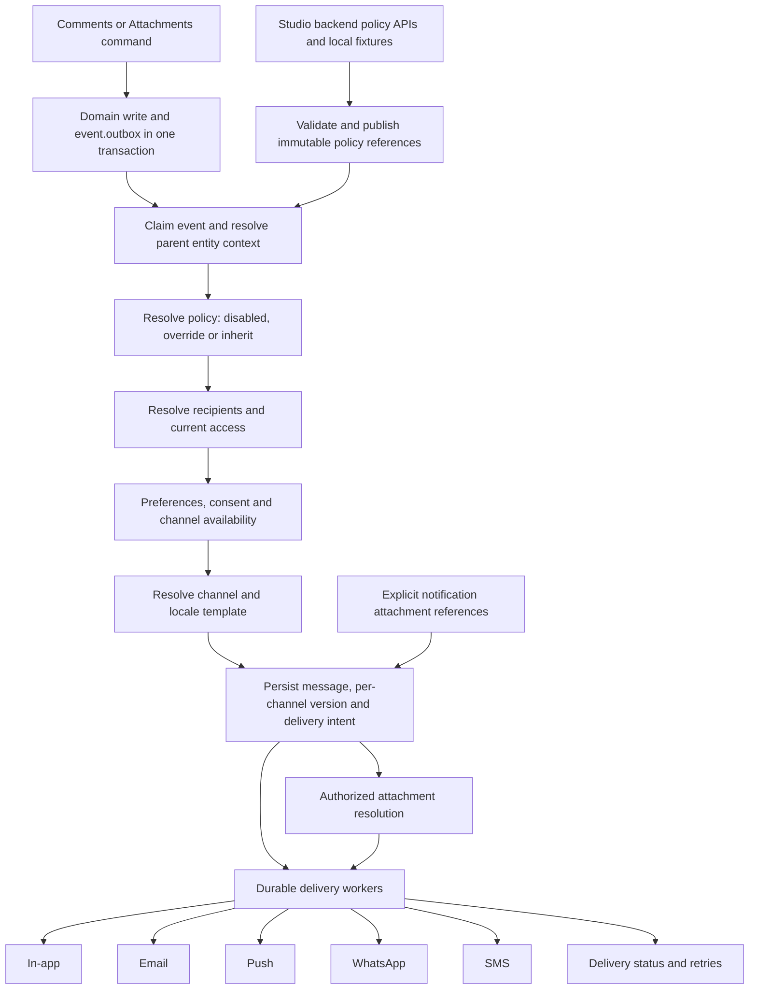

# Entity notification channels — local development build plan

Status: ready for local development implementation. Prepared 2026-09-23; revised for two phases: Studio backend only, followed by Neon frontend and backend. Checks remain local and simple. Preparing this plan has not changed containers, providers or databases.

## 1. Outcome and scope

Build one governed notification system for all admitted entity apps. Comments and Attachments supply reusable events and capability defaults. Business Partner and other entities select inherited, overridden or disabled policies through published metadata. Templates remain centrally managed; entity definitions reference them rather than copy their content.

Channels in scope: application notifications (`in_app`), email, browser/mobile push (`push`), WhatsApp (`whatsapp`) and phone text messages (`sms`). Existing webhook support remains compatible and receives regression coverage. Voice calls are not part of SMS and are outside this build.

Phase 1 builds Studio backend configuration, validation, preview APIs and publication. Phase 2 builds Neon frontend and backend integration, including event handling, routing, delivery, preferences, attachment handling and a simple delivery view. Studio frontend screens are deferred. Shared contracts and services remain in generic platform packages; these phases describe the integration scope, not separate implementations per app. Creating an actionable workflow Inbox task remains a separate domain operation; a notification may link to a task but must not create one implicitly.

## 2. Existing local setup

Read-only observations on 2026-09-23:

| Area | Checked locally | What we can reuse |
|---|---|---|
| Development API, worker, scheduler | `athyper-dev-source-api-1`, `athyper-dev-source-worker-1`, `athyper-dev-source-scheduler-1` running and healthy | Ready for local integration work. |
| Runtime channel configuration | All three report `ATHYPER_ENV=local`, `NOTIFICATION_CAPTURE=true`, `EMAIL_PROVIDER=smtp`, `SMTP_HOST=mailtrap`, `SMTP_PORT=1025` | Use capture for all local channel checks; it simulates external delivery. |
| Mailpit | `athyper-dev-mailtrap-1` healthy; internal `/livez` and messages API reachable; API reported 500 messages | Capture inbox is available. Use a distinctive test subject to find new messages; it retains up to 500 messages. |
| Templates | Neon, Studio and Mesh each contain active platform-default English version-1 `comment_mention` templates for `in_app` and `email` | Defaults are present in all three development databases. |
| Neon mention routing | Enabled `collab.comment_mention`, channels `{in_app,email}`, no entity restriction or condition | Current default is broad, not an entity-specific published policy. |
| Neon Collaboration outbox | 56 created, 20 deleted, 11 edited, 3 flagged and 12 reaction-added events in the inspected snapshot | Comment actions produce events. No mention event appeared in that query. |
| Neon notification messages | No rows with a Collaboration event code | No persisted Collaboration planning evidence in this snapshot; this does not establish a worker failure because no mention event was observed. |
| Push secret references | VAPID file-variable names present on API/worker | Presence only; secret contents, usability and real device registration were not verified. |

Available repository infrastructure:

- `deploy/compose/instance/compose.notification-capture.yaml`: isolated local Mailpit capture.
- `deploy/compose/instance/compose.notification-providers.yaml`: external email-provider overlay, currently oriented to SES. It is not a complete all-provider provisioning overlay.
- `server/packages/adapters/communications/src/`: SMTP, SES, Twilio SMS, Meta WhatsApp, Web Push, FCM and capture adapters.
- `server/packages/platform/notifications/src/`: planning, durable delivery, in-app delivery, push subscriptions, preferences, provider events, retries and operations.
- `docs/runbooks/communication-channel-setup.md`: prior channel setup and capture verification procedure. Its dated deployment descriptions must not be mistaken for the currently inspected image set.

## 3. Target flow



Persist domain events even when notification policy is disabled. Suppression changes communication behavior, not whether the domain action occurred.

## 4. Ownership and metadata model

Studio catalogs do not require relocating physical tables into an entity schema. Register resources by responsibility:

For this build, Studio exposure means backend metadata and authorized APIs. Studio screens for these resources are deferred; the Neon notification and delivery views are built in Phase 2.

| Resource group | Ownership and Studio exposure |
|---|---|
| `document.comment`, `document.comment_mention`, `document.attachment`, `document.attachment_link` | Platform resources with service-governed operations; no bypass through generic CRUD. |
| `control.notification_template`, `control.notification_routing_rule` | Governed authoring, validation, preview, versioning and publication. |
| `event.notification_message`, `event.notification_delivery`, `event.notification_message_attachment`, `event.notification_inbox_state` | Operational read models and explicit actions such as retry/dismiss. |
| `event.outbox`, `event.notification_outbox_state` | Infrastructure inspection and controlled recovery; not ordinary editable entity records. |
| `log.notification_delivery_attempt`, `log.notification_dlq` | Restricted diagnostics and audited replay. |
| `master.principal_notification_preference`, provider/consent/subscription resources | Separate recipient and provider configuration, enforced at runtime. |

Extend the publication contract with a notification-policy reference associated with a capability. Reuse existing publication storage and compiled routing projections; do not introduce a second mutable policy store without a demonstrated need. The policy artifact carries a schema version, revision/hash, declared event policies, channel/template references and inheritance mode.

Illustrative proposed shape (not accepted by the current contract):

```json
{
  "capability": "comments",
  "notificationPolicy": {
    "mode": "inherit",
    "policyRef": "platform.comments.notifications.v1"
  }
}
```

Business Partner can override just one event/channel template. Employee can explicitly disable notifications while retaining Comments. An app without Comments has the capability disabled independently. Server authorization remains mandatory regardless of policy configuration.

## 5. Deterministic policy and template inheritance

Resolve policy first, template second:

1. Resolve the admitted parent entity and capability from trusted event/resource data.
2. Apply the published entity policy. `disabled` is terminal; `inherit` uses the referenced capability default; `override` supplies a validated patch over that default.
3. Apply authorized tenant configuration according to explicit governance. A tenant default cannot silently re-enable an entity policy disabled by a higher authority.
4. Determine permitted channels and recipients; apply current access, preferences and consent.
5. Resolve each enabled channel's entity-specific template reference, otherwise its shared capability default.
6. Within the selected template reference, resolve authorized tenant customization and locale fallback deterministically. Record the exact template version/hash used per delivery.

Do not infer fallback from a broken explicit reference. An omitted override inherits; an explicit unpublished/missing template fails publication. Runtime corruption is a visible planning failure, not a silent switch to another message. A channel with no supported default cannot be enabled at publication.

Avoid adding class inheritance in the first release. If introduced later, use entity → explicitly declared class → capability default; validate cycles and precedence. Do not infer classes from database schemas or folder names.

Use shared variables such as `record_label`, `entity_label`, `actor_display_name` and an authorized record/comment link to avoid copying templates per entity. Template rendering must enforce variable types, required values, escaped HTML, length limits and safe link handling. The current variable validator checks required names; extend it to validate the declared types as well.

## 6. Event and recipient semantics

| Trigger | Proposed default | Explicit extension |
|---|---|---|
| Comment created without mentions | No broadcast | Entity policy may notify subscribers/owners with a defined recipient resolver. |
| Comment mention | In-app and email for eligible mentioned users, excluding actor | Entity may disable or select other configured channels. |
| Comment edited | Notify newly added mentions only | Separate opt-in edited-comment policy for subscribers; retained mentions do not receive another mention alert. |
| Comment reply | No implicit broadcast in the first release | Optional parent-author/subscriber rule with actor exclusion and access filtering. |
| Attachment uploaded/finalized | No user broadcast | Optional notification after the policy-selected ready state, not staging. |
| Folder/category/rename changes | No user broadcast | Explicit recipient policy if a business process requires it. |
| File attached to a comment | Keep comment/file reference | Notification attachment inclusion must be explicit. |
| Moderation/security event | Existing governed operations policy | Never inherit ordinary public comment recipients. |

Separate the event's resource identity (`document.comment`/attachment) from its parent record coordinate. Today the mention payload contains parent `entity_type`/`entity_id`, while the outbox top-level entity is the comment. Preserve this distinction in a versioned event envelope; do not overwrite the comment identity to make routing work.

Use stable event identity incorporating mutation/command identity, comment revision where applicable, event kind and mention recipient. Compute newly added mentions atomically with the edit transaction. Retries must not duplicate mention intent. Removal, re-addition, author self-mention and multiple mentions in the same document need explicit tests.

Current `dedup_window_ms=300000` is seeded but is not consumed by the inspected planner. Implement and test semantic time-window deduplication separately from command/event idempotency. Define which events may be coalesced; never suppress an unrelated record or recipient. Use transactional claims/constraints and an explicit time bucket/window algorithm; test concurrent workers and window boundaries.

Resolve recipient authorization against the current parent record and audience at planning and immediately before sensitive delivery. A stale mention must not expose private content after access revocation. Record the reason for suppression without storing sensitive excerpts in logs. Mobile push and SMS should default to minimal content and an authorized link.

## 7. Channel build activities

| Channel | Existing code to reuse | Build now | Simple local check |
|---|---|---|---|
| In-app | Notification handler and inbox state | Wire mentions to the application notification list, unread count, read/dismiss actions and record link. | A mentioned local user sees the notification and can open the record. |
| Email | SMTP capture and SES adapters | Add shared HTML/text templates, variable rendering, locale fallback and the selected attachment policy. | The rendered message appears in Mailpit. |
| Browser push | Web Push/VAPID and enrollment infrastructure | Connect permission/subscription UI, notification payload and service-worker click handling. | Capture the payload and test subscription/click behavior with fixtures; an actual browser send is optional. |
| Mobile push | FCM adapter | Wire authenticated token registration/removal and a shared push payload. | Register a synthetic device token and inspect captured delivery; no mobile app is needed to finish this local build. |
| WhatsApp | Meta template-message adapter | Map the shared notification to provider-template name, language and parameters; connect consent and delivery status. | Inspect the captured WhatsApp payload and test success/failure responses with mocks. |
| SMS | Twilio adapter | Map phone contact, message text, preferences/consent and delivery status. | Inspect the captured SMS text and test success/failure responses with mocks. |
| Webhook | Existing handler/subscriptions | Keep existing behavior working while changing shared routing. | Run the existing focused webhook tests. |

Show clear channel states such as `Local capture`, `Not configured` and `Live provider`. Use the existing capture adapters instead of building new simulators. Every requested channel remains in the local build; provider accounts, real phones and mobile app delivery are optional follow-up work. A local capture result must be labelled as capture in the UI.

## 8. Notification attachments

Reuse `NotificationAttachmentReference`: attachment ID, current/pinned version, link/embed/auto disposition, required flag and display name. Persist references, not bytes, storage keys or durable signed URLs, in notification intent.

Default to authorized links. For comment files, prefer the version pinned to the comment. Resolve identity, current access, scan status, retention/legal restrictions, size and channel constraints at delivery. Generate short-lived retrieval URLs only after authorization.

Connect and test the existing document notification-attachment resolver with Collaboration files; check which `document.attachment` sources it supports. Add a resolver dispatch contract keyed by resource type if needed, reusing attachment retrieval admission. Optional attachment failure may omit the file with an explicit outcome; required attachment failure blocks the delivery. Tests must cover deletion, quarantine, access revocation, version replacement and oversized embedding.

## 9. Two-phase build checklist

Use existing code and complete Phase 1 before connecting the Phase 2 runtime. Each step finishes with a simple local check; no separate approval or production evidence package is required.

### Phase 1 — Studio backend only

**Implementation update (2026-09-23):** S-01–S-04 complete. Both Studio migrations are applied. Authenticated API fixtures independently reviewed, signed and published BP inherit, BP override and Employee/neutral disabled configurations; all three were verified in Neon through Studio publication inspection. Validation/access checks and backend regression tests pass. Temporary user-approved verification grants were revoked; no Neon grants were added. See [Phase 1 backend API and local setup guide](notification-phase1-backend.md) and [local verification result](../../reports/notification-phase1-live-verification-20260923.json). Phase 2 local implementation is recorded below.

Build configuration and publication services that the future Studio frontend can consume. Use authenticated API calls and a small local fixture/script to configure and preview policies in this phase. Scripts must call the normal validated service/publication path; do not bypass it with direct database edits.

| Step | Build activities | Main code areas | Done when |
|---|---|---|---|
| S-01 | Define notification policy references, inherit/override/disabled modes, template variables, channel settings and parent-record coordinates. Add BP and Employee/neutral entity examples. | Shared publication, notification and Collaboration contracts | Valid examples load and invalid settings return a clear error. |
| S-02 | Add backend template/policy list, read, create/update, validation and preview operations using existing authorization/versioning patterns. Preview renders synthetic input without sending. | Studio backend API integration and shared template/policy services | API calls can save a draft, read it and preview a channel template. |
| S-03 | Connect save/publish to the existing publication path. Validate references, compile the policy projection and make the published version available to Neon. Add required migrations and shared defaults. | Publication services, metadata catalogs and control-table projections | A fixture publishes BP inherit, BP override and Employee disabled; Neon can read the expected published configuration. |
| S-04 | Add a small local setup script/API examples and backend tests for validation, publication, access and version compatibility. Document request/response shapes for the later frontend. | Local tooling, backend tests and API documentation | The script sets up the sample policies through the supported API/service path and the backend tests/typechecks pass. |

**Phase 1 complete:** configuration, preview and publication work through backend APIs. No Studio forms, pages, navigation or frontend tests are required.

### Phase 2 — Neon frontend and backend

**Implementation update (2026-09-23):** N-01–N-06 local build implemented. Live BP in-app/email delivery, retained-mention suppression, recipient read/dismiss and Neon controls verified. Other requested channels passed Mailpit capture smoke; neutral-entity reuse and authorized operator retry passed fixtures. Live operator access remains denied without grants. Real providers/devices and authenticated external callback ingestion remain deferred. See [Phase 2 implementation and local setup](notification-phase2-neon.md).

Consume the published settings from Phase 1. Start with in-app and email, then wire the other local capture channels. Put reusable behavior in shared packages; Neon supplies entity context and hosts the user-facing integration.

| Step | Build activities | Main code areas | Done when |
|---|---|---|---|
| N-01 | Implement policy/template resolution and parent-aware routing. Respect explicit disable and prevent the broad default from sending twice. | Shared notification planner, entity runtime and Neon integration | BP uses its default or override; the disabled test entity creates no notification. |
| N-02 | Emit newly added mentions on edit; add stable event identity and configured deduplication. Connect audience/access, preferences and consent checks. | Collaboration service/repository, capability admission and notification planner | Mention A, edit, then add B sends only the expected notifications; denied/opted-out users and retries behave correctly. |
| N-03 | Connect explicit notification attachment references, pinned versions and required/optional behavior to authorized retrieval. | Shared attachment services and notification attachment resolver | A permitted file resolves and blocked files follow the selected policy. |
| N-04 | Connect all channel payloads to capture adapters, worker processing, device/subscription APIs and callback mappings. Use mocks for external providers. | Communications adapters, host composition, push enrollment and delivery handlers | In-app records are created; email/push/WhatsApp/SMS outputs appear in capture; mocked failures update delivery status. |
| N-05 | Build Neon notification-list/read/dismiss behavior, unread count, authorized record links, channel preferences and browser-push controls. Add a permission-scoped delivery list with status/error and retry. Use shared UI/theme components. | Neon shell/Activity center, shared notification UI and backend API relay | A local user can see/open notifications and manage preferences; an authorized operator can inspect and retry a failure. |
| N-06 | Rebuild affected local services, run the walkthrough, check a neutral second-entity fixture and update local setup notes. | Local instance configuration, browser/backend tests and documentation | The walkthrough works and affected tests/typechecks pass. |

**Phase 2 complete:** the Neon experience and shared runtime work locally for every requested channel using in-app persistence or capture. Real providers/devices are deferred to section 14. A second-entity fixture checks generic reuse without requiring a complete second business application.

## 10. Frontend boundaries

### Included now — Neon

Use existing Activity center and shared panels for notification lists, unread/read/dismiss state and authorized record/comment links. Keep Notifications distinct from workflow Inbox tasks. Provide channel preferences and browser-push enrollment; show `Local capture`, `Not configured` or `Live provider` accurately.

Add a simple permission-scoped delivery view showing event, entity, template, channel, status/error and retry. Explain policy-disabled, access-denied and preference-suppressed outcomes. Reuse existing backend operations where available. Neon does not get a duplicate platform template-authoring editor.

### Deferred — Studio frontend

The future Studio frontend will consume Phase 1 APIs to provide template/policy editors, channel/locale selection, variable help, inheritance indicators and preview/save/publish controls. No new Studio screen is part of either current phase.

Phase 1 must still provide stable, authorized APIs and clear validation errors so this later UI does not require rebuilding the backend. Configure local policies with the Phase 1 setup script/API examples until that frontend is built.

## 11. Data migration and compatibility

- Keep current tables and generic event names. Add only the contract/projection columns or lookup tables needed for explicit scope, policy revision and deduplication; keep existing data and tenant access rules working.
- Adopt existing `comment_mention` templates as capability defaults. Do not create copies for every entity.
- Replace or override the broad mention rule through a local migration. Rule precedence must avoid a still-enabled broad rule defeating an entity disable or creating duplicate messages.
- Record exact policy/template versions per channel delivery; the inspected planner's aggregate template version is insufficient when channel template versions differ.
- New events carry versioned parent coordinates; a compatibility reader accepts legacy Collaboration payload fields. Do not blanket-replay historical outbox events after adding a rule.
- Define a cutover watermark for new routing. Any historical replay requires explicit scope and idempotency protection.
- Keep replay tied to the originally resolved policy/template snapshot, while rechecking current recipient and attachment access. A deliberate re-render uses a new audited operation.

## 12. Simple local walkthrough and tests

Use local users and synthetic data.

**Phase 1 backend check:** use the setup script/API examples to create and preview a template, publish an inherited policy and an override, and publish a disabled test-entity policy. Check one invalid reference and one unauthorized request. Confirm Neon can read the published configuration. No Studio browser walkthrough is needed.

**Phase 2 Neon walkthrough:**

1. **Default template:** mention another user on a Business Partner record. Check the in-app notification and email in Mailpit.
2. **Entity override:** change and publish BP's email template through the Phase 1 API/script, repeat the mention in Neon and confirm the override. The shared in-app template should still work.
3. **Disabled entity:** use an Employee or neutral entity fixture with notifications disabled. Comments still save and no notification is sent.
4. **Edit behavior:** retain an existing mention, then add another user. Confirm only the newly mentioned user gets a new mention notification.
5. **Other channels:** enable local capture for push, WhatsApp and SMS. Inspect the resulting messages/payloads.
6. **Attachments:** include an explicit permitted file reference and check the selected version. Confirm blocked files follow required/optional behavior. Capture lists attachment metadata; use resolver tests to check bytes/links without changing the capture adapter's behavior.
7. **Recovery:** simulate one failed delivery, view its error and retry. Confirm an already completed delivery is not repeated.

Keep targeted automated tests for policy fallback/disable, template variables, mention delta, concurrent retries/deduplication, recipient access and attachment permission checks. Test provider responses and device registration with mocks. Run affected package typechecks. Reuse existing tests wherever possible; no separate release test matrix or evidence collection is needed.

Studio backend APIs/scripts supply configuration; Neon supplies the frontend walkthrough. Check shared seeds/contracts for Mesh compatibility without requiring Mesh frontend work or a full Mesh rollout.

## 13. Local setup steps

1. Reuse the running development database, queues and Mailpit. Keep `NOTIFICATION_CAPTURE=true` and `EMAIL_PROVIDER=smtp` for external-channel simulation.
2. Add the required local migrations and shared template seeds. Preserve current records and avoid replaying old events unintentionally.
3. Build and restart only affected development services, keeping API/worker/scheduler code compatible. Do not change unrelated instance configuration.
4. Configure and publish the local entity policy through the Phase 1 API/script, then use Neon for the Phase 2 walkthrough in section 12.
5. Record a brief completion note: what was built, which checks passed and any remaining local limitations. Update the channel setup runbook if commands/configuration changed.

No provider credentials, production sender identities, mobile devices, canary rollout or rollback rehearsal are required to complete these steps. Keep external sends off unless explicitly requested as follow-up work.

## 14. Later: Studio frontend, real providers and production readiness

These items are deferred and do not block either phase:

- Build Studio template/policy management screens on the Phase 1 APIs.

- Configure real email/SMS/WhatsApp accounts, sender identities and secret references; verify current provider requirements.
- Test actual browser/mobile devices, delivery receipts, email bounces/complaints and provider-specific failures.
- Complete any mobile client work needed for device enrollment and deep links.
- Expand production monitoring, load testing, retention, cross-plane deployment and rollback procedures when a live release is planned.

Keep the current authorization, consent and tenant-isolation behavior in the local implementation so later activation does not require redesigning the feature.

## 15. Completion checklist by phase

**Phase 1 — Studio backend**

- Template/policy APIs support configuration, validation and preview.
- Published policy references and defaults are available to the Neon runtime.
- API examples/setup scripts cover inherit, override and disable.
- Focused backend tests and affected typechecks pass.

**Phase 2 — Neon frontend and backend**

- Shared policy/template resolution, entity overrides and explicit disable work.
- Comments/mentions and explicit file references reach the notification flow.
- In-app delivery and Neon notification controls work; email/push/WhatsApp/SMS can be inspected through capture.
- Preferences/access checks, failure details and retry work.
- The Neon walkthrough, focused regression tests and affected typechecks pass.

A short completion note for each phase is sufficient. Studio frontend, real-device delivery and production rollout are separate follow-up work and do not block these phases.

Related documentation: [code ownership](collaboration-code-ownership.md), [Collaboration architecture review](../../reports/collaboration-metaentity-architecture-review-20260923.md), [channel setup runbook](../../runbooks/communication-channel-setup.md).
