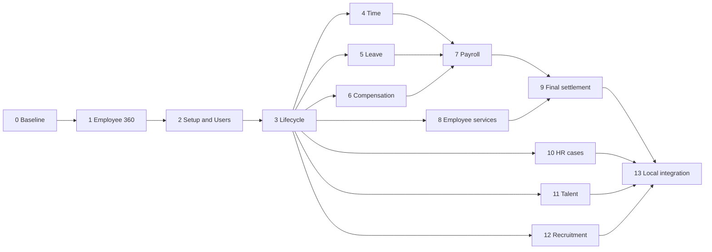

# HR module delivery plan — Employee 360 through full People delivery

> **Historical.** Written before commit `870f08f52` removed the bespoke Business Partner and workforce applications. Routes, packages and files named here may no longer exist, and de-linked paths were dead when this was cleaned up. New entity work goes through the shared Entity Framework ([onboarding guide](../../../runbooks/meta-entity-onboarding.md)); do not treat this as current instruction.

Review date: 2026-09-22. Status: consolidated master plan for a robust local development build, grounded in the current working-tree DDL. No schema changes, migrations, runtime qualification, or production-readiness claims are made by this document.

**Master-plan authority:** this document consolidates the agreed scope, architecture, cross-cutting requirements and immediate priorities. The [Stage 1 Internal Workforce / Stage 2 External Workforce plan](hr-internal-external-implementation-plan.md) supplies the detailed I0–I9 / E0–E7 implementation sequence. The numbered stages 0–13 below are capability work packages, not additional top-level delivery stages or serial gates. Internal recruitment is in Internal Workforce; supplier procurement/engagement delivery is in External Workforce.

## Consolidated discussion and supporting specifications

| Topic | Decision incorporated into this plan | Detailed specification |
|---|---|---|
| Internal / External delivery | Deliver direct employees first, then supplier-backed engagements; share person and optional IAM identity | [Two-stage sequence](hr-internal-external-implementation-plan.md) |
| Wednesday customer demo | Target 23 September 2026; demonstrate whichever live increments work; remaining scope goes into the presentation | [Demo scope and estimate](customer-demo-pay-cycle-plan.md) |
| SAP / Oracle / Athyper / Frappe | Retain Athyper ownership; use Oracle employment hierarchy, SAP temporal semantics and Frappe usability as references | [Four-model comparison](hr-model-sap-oracle-athyper-frappe-comparison.md) |
| Detailed employee information | Assemble Employee 360 from canonical owners; incrementally add structured personal records | [86-field screen review](employee-personal-information-ddl-review.md), [field map](employee-personal-information-field-map.csv) |
| Localization and foreign employees | Separate country presentation, employer/work location, citizenship, residency and payroll jurisdiction | [Country assessment, including SA/MY/SG](hr-country-localization-and-foreign-employees.md) |
| HR policies | Reuse shared versioned policy services; complete HR applicability, exceptions and calculation integration | [Policy DDL assessment](hr-policy-ddl-assessment.md) |
| Baseline and proposed fields | Existing definitions are evidence of foundations, not delivered workflows | [Table/field analysis](hr-workforce-table-field-analysis.md), [current fields](hr-workforce-current-fields.csv), [change register](hr-workforce-field-changes.csv) |

The existing change register is the earlier field proposal baseline. Later profile, localization and policy proposals in the linked reviews must be reconciled into the selected migration design before implementation; they are not additional independent authorities or already-applied DDL. Do not count the same identifier, schedule or policy model twice.

## Working mode — robust local build

Build and complete small functional increments locally. For Wednesday, show whichever increments work reliably; the remaining roadmap can be covered in the presentation. Attendance processing, leave calculations, one benefits flow and payroll calculation are the immediate customer priorities, with Employee 360 as their entry point.

The stage deliverables below remain the full capability backlog. Select an increment within a stage, implement it end to end, run the local checks, and move on. A stage does not have to deliver every listed feature before another increment can start. Dependency labels refer to the data and service contracts actually used: valid seeded employee/company/policy records can support processing work while unrelated onboarding or administration screens are still being built.

Use four local completion checks for each implemented increment:

1. The intended UI → API → database flow works locally and survives refresh; calculations execute on the server with explicit rule/input versions.
2. Relevant invalid input, permission denial and failure cases are handled. Writes are transactional; money/balance effects remain correct on retry and under the relevant concurrent operation.
3. Affected build/type checks and focused behavior tests pass. Check known expected calculation results where applicable; no repeated full-suite qualification for unrelated modules.
4. A short build note records what works, how to run it and what remains. Use `in progress`, `locally working`, or `deferred`; do not call an entire stage complete when only one increment works.

Keep canonical ownership, tenant/field permissions, validation, precision/rounding, approved-history integrity, idempotency and necessary audit evidence in the implementation. Formal sign-offs, pilot rollout, broad performance benchmarks, production restore drills and the historical upgrade matrix belong to the [later release-readiness checklist](hr-release-readiness-checklist.md). They are not prerequisites for local feature progress. Any repository-required checks for a touched change still apply.

## 1. Outcome and scope

Deliver Employee 360 first, then progressively enable employment administration, user access, attendance, leave, compensation, payroll, expenses, benefits, employee relations, learning, performance, recruitment, and complete exit settlement. Each release adds working processes and reconciled summaries to Employee 360.

The supplied screenshot is the minimum functional coverage. Recruitment, organization setup, user administration, reporting, integrations, and operational readiness complete the broader module. External workforce remains an integrated neighboring capability with its own commercial authority.

Payroll country coverage is undecided. Build calculations around explicit versioned rules and known expected results. Country qualification and business sign-off are required before operational payroll use, but do not block development of the calculation engine. Demonstrations must identify the rule set actually implemented; do not invent statutory rates.

Saudi Arabia, Malaysia and Singapore are target localization scenarios, not a commitment that all three statutory payroll packages are delivered. Select one explicit country/rule scope for the first processing increment. Foreign nationals directly employed by the company are included in Internal Workforce; nationality does not determine the Internal/External delivery stage.

## 2. Evidence and interpretation

Reviewed the Neon build manifest, master/document table definitions, relevant constraints, indexes, functions, views, RLS and grants, common principal/authz definitions, workforce service/routes/UI, metadata paths, and the existing [People business design](../../../business-workflows/people.md).

Primary source files:

- [Neon manifest](../../../../server/db/ddl/planes/neon/_manifest.txt)
- [HR masters](../../../../server/db/ddl/planes/neon/master/03_tables.sql): person at line 2398; organization/job/calendar/HR masters at 2591–3343; compensation assignment at 4462.
- [HR documents](../../../../server/db/ddl/planes/neon/document/03_tables.sql): attendance through payroll/policy acknowledgment at 3060–3568; profile requests at 4310; workforce IAM projection at 4398; external workforce at 5183 onward.
- [Master constraints](../../../../server/db/ddl/planes/neon/master/05_constraints.sql), [functions](../../../../server/db/ddl/planes/neon/master/07_functions.sql), [views](../../../../server/db/ddl/planes/neon/master/09_views.sql), [RLS](../../../../server/db/ddl/planes/neon/master/10_rls.sql), [grants](../../../../server/db/ddl/planes/neon/master/11_grants.sql).
- [Document functions](../../../../server/db/ddl/planes/neon/document/07_functions.sql): HR approval/operational state guards, leave/attendance validation, payroll guards and total refresh already exist.
- [Principal foundation](../../../../server/db/ddl/common/master/03_platform_tables.sql), [authorization](../../../../server/db/ddl/common/authz/03_tables.sql).
- Workforce routes, service, request UI, [workforce metadata](../../../../metadata/products/mdg/entities/workforce/core.json).

Companion [DDL inventory](hr-ddl-inventory.csv) lists selected existing tables with source locations. It is an inventory of foundations and dependencies, not a claim that those features are delivered.

Evidence labels used below:

- **Foundation:** relevant table definitions exist; end-to-end business capability still needs qualification.
- **Partial:** generic or adjacent structures exist, but the requested domain contract is incomplete.
- **New:** no dedicated model was found in the current DDL scan; proposed names are design candidates.
- **Source implementation:** relevant service/routes/UI were found; deployment and production activation remain unverified.

No live database inspection or tests were run for this planning review. Existing unrelated working-tree changes were left untouched. Generated service-coverage reports are not acceptance evidence: for example, payroll period is labelled code_complete while its command exposure is not_exposed and its repository/entry-point evidence is empty.

## 3. Current DDL coverage against the screenshot

Unqualified table names below are in `master` or `document` as indicated by the inventory.

| Screenshot capability | Existing foundation | Assessment / remaining work | Stage |
|---|---|---|---|
| Employee 360, prerequisite | person, person_sensitive_profile, employee, employment, work_assignment, position; v_employee | Foundation + workforce read endpoints; build consolidated authorized 360 and correct as-of projection | 1 |
| Attendance | attendance_day | Foundation; calculation, exception review, locking and payroll handoff | 4 |
| Attendance Request | attendance_adjustment_request | Foundation; approval, correction application and recalculation | 4 |
| Employee Checkin | time_punch | Foundation; mobile/device ingestion, pairing, duplicate handling | 4 |
| Leave Application | leave_request | Foundation; eligibility, overlap/balance controls, cancellation and reversal | 5 |
| Leave Allocation | leave_balance_entry, employee_leave_enrollment | Partial; controlled allocation document and accrual jobs, opening-balance authority | 5 |
| Leave Policy Assignment | leave_plan, leave_plan_rule, employee_leave_enrollment | Foundation; effective assignment, policy versions and recalculation rules | 5 |
| Employee Onboarding | workforce_request, workforce_request_validation, onboarding_case | Source implementation; qualify protected intake, approval, application and checklist journey | 3 |
| Employee Transfer | employment, work_assignment, workforce_request(change_employment) | Partial; explicit transfer subtype, effective closure/new assignment, intercompany behavior | 3 |
| Employee Promotion | job, pay_grade, position, compensation_change | Partial; coordinated assignment and compensation approvals/application | 3, 6 |
| Employee Grievance | hr_case, people_request | Partial; confidential participants, evidence, investigation, escalation and appeal | 10 |
| Employee Separation | workforce_request(offboard_employment), offboarding_case | Source implementation for parts; qualify notice, employment-specific exit and clearance | 3, 9 |
| Exit Interview | hr_case/offboarding_case are generic foundations | New structured questionnaire, answers, restricted feedback and reporting | 9 |
| Full and Final Statement | payroll_result, offboarding_case | Partial; settlement calculation, components, approvals, payment and corrections | 9 |
| Salary Withholding | pay_component and payroll results are adjacent | New explicit hold/release authority, reason, amount and recovery/release effects | 6, 7, 9 |
| Shift Request | people_request is generic | Partial; typed request, swap/change decisions and schedule materialization | 4 |
| Shift Assignment | shift_assignment, shift_type, work_pattern, work_pattern_day | Foundation; recurring roster generation and employee pattern assignment | 4 |
| Expense Claim | external_expense_sheet/item are for external engagements | New employee claim model; reuse shared finance/evidence mechanisms | 8 |
| Travel Request | no dedicated internal employee travel model found | New itinerary, budget, policy, approval and claim linkage | 8 |
| Employee Advance | payment_entry is shared finance infrastructure | New advance approval, disbursement, outstanding balance and settlement/recovery | 8 |
| Employee Benefit Application | no dedicated benefit domain found | New benefit plans, eligibility, dependants and enrollment/application | 8 |
| Employee Benefit Claim | no dedicated benefit claim domain found | New entitlements, claim evidence, caps, approval and payment | 8 |
| Salary Structure Assignment | pay_structure, pay_structure_line, compensation_assignment | Foundation; effective assignment and controlled changes | 6 |
| Salary Slip | payroll_result, payroll_result_line, shared render_output | Partial; qualified calculation plus immutable payslip rendering/distribution | 7 |
| Additional Salary | pay_component, compensation_change are adjacent | New one-off/recurring payroll input award model; avoid altering base salary for every award | 6 |
| Timesheet | external_time_sheet/entry are supplier-engagement records | New internal employee timesheet/entry, project approval and payroll/costing eligibility | 4 |
| Employee Incentive | pay_component is a calculation building block | New award eligibility, targets/approval and payroll input linkage | 6, 11 |
| Retention Bonus | pay_component is a calculation building block | New award terms, vesting, payout and recovery agreement | 6 |
| Bank Account | bank_account, bank_account_link, company usage infrastructure | Foundation; employee ownership support, controlled bank change and payroll distribution mandate need qualification | 6 |
| Training Event | no dedicated learning event model found | New course/event, enrollment, attendance and completion | 11 |
| Training Result | certification is adjacent shared infrastructure | New participant results and certification issuance linkage | 11 |
| Training Feedback | no dedicated learning feedback model found | New questionnaires/responses and privacy rules | 11 |
| Employee Skill Map | job/job_family/job_function are foundations | New skill taxonomy, employee proficiency, evidence and assessment history | 11 |
| Appraisal | no dedicated appraisal model found | New cycles, goals, reviewer assignments, ratings, calibration and acknowledgment | 11 |

Other useful existing foundations: statutory_scheme, employee_statutory_enrollment, employee_tax_declaration/line, payroll_period/run/run_employee, holiday_calendar/day, pay_group, pay_grade, control.formula_expression/version, policy_acknowledgment, principal/profile/identity_binding/UI and notification preferences, authz roles/groups/scopes, workflow, audit/outbox, attachments and document rendering.

Internal recruitment needs its own candidate/application/offer model. Existing workforce_requisition, external_candidate_submission/evaluation, contingent_work_order, worker_engagement and external_worker support supplier-provided workers; they do not establish internal recruitment or buyer employment.

## 4. Architecture and ownership decisions

1. Person owns controlled personal identity; employee owns workforce identity; employment owns the employer relationship; assignment owns effective job/organization placement. A person can have multiple employments. User access is optional.
2. Principal and identity binding own application actor/login linkage. IAM executes provisioning, suspension and access removal. HR status and IAM delivery status are separate outcomes.
3. Neon owns HR records. Do not publish personal, compensation or grievance records to Mesh. Studio may author/release definitions; it does not become HR transaction authority.
4. Reuse Business Partner platform patterns: compiled entity definitions, sections, related-record navigation, scoped lists, request/review/apply, validation evidence, workflow inbox, comments, attachments and audit. Define HR entity contracts and permission policies explicitly; copying BP presentation alone is insufficient.
5. New writes use canonical employment and assignment records. Treat legacy flattened employee fields as compatibility data with an explicit projection/synchronization policy.
6. Effective dates, policy/formula versions, source evidence and as-of semantics must be reproducible. Corrections supersede or reverse accepted effects. Payroll/leave/finance effects must be idempotent and reconcilable.
7. Finance owns posting, disbursement and reconciliation. HR owns eligibility and approved amounts; payroll owns calculations. Expose each handoff's actual state.
8. Generic people_request/hr_case/checklist JSON may carry versioned auxiliary data. Money, entitlement ledgers, dependent relationships, investigation access and reportable lifecycle facts need typed contracts and relational integrity.

### 4.1 Detailed employee file and temporal ownership

Retain person → employee → employment → work_assignment. Oracle's employment hierarchy and SAP's effective job-change behavior are design references, not schemas to copy. Follow Frappe's approachable employee sections while preserving Athyper's canonical owners and permissions.

- Person/profile: legal/display/preferred names, optional salutation, protected demographics, structured citizenship and identity documents, emergency contacts, education, prior employment and optional biography/health records. Support single-name people. Derive age at an explicit date.
- Employment/terms: actual confirmation, planned contract expiry, notice period, source offer, planned retirement and last-working dates where they represent distinct facts. Probation end is not confirmation; contract expiry is not actual termination.
- Assignment: dated job, manager, grade/position and organization. Derive internal work history from accepted assignment records. Define primary assignment per employment versus overall primary employment before expanding concurrent-employment support.
- Shared infrastructure: reuse contacts, addresses, consent, bank accounts and versioned evidence with verified person/employee ownership and HR access. Avoid duplicate employee-specific authorities.
- Sensitive sections: independent permissions for identity/DOB, health, pay, banking and exit feedback. General comments, metadata and activity payloads must not expose protected values.

Define a business change versus a correction, stable assignment identity versus revisions, and same-day ordering where required. Preserve effective history and recorded correction evidence. Pin finalized payroll inputs rather than recalculating historical results from today's employee file. Standardize new exclusive date boundaries while explicitly adapting existing contracts; do not silently change legacy meanings.

### 4.2 Country localization and local / foreign employees

The reference/configuration foundation already includes SA/MY/SG, SAR/MYR/SGD, their timezones, regional locales and country banking-capture definitions. This establishes data/configuration capability, not complete translations, payment adapters or statutory processing.

| Configuration owner | Responsibility |
|---|---|
| Tenant and principal preference | Enabled UI catalogs, presentation defaults and permitted user overrides |
| Legal entity / company | Employer identity, country, functional currency and company policy bindings |
| Site / schedule | Operational timezone, work pattern, regional/company holidays and roster overrides |
| Employment / payroll profile | Applicable payroll jurisdictions, pay group, eligibility facts and effective policy versions |
| Published country rule package | Qualified formula/rate/policy versions and country-specific output contracts |

Support separate country tenants and one multinational tenant with multiple employers. Tenant country, UI language and tenant weekend defaults must not become universal payroll or attendance authorities. Preserve the distinction between UI catalog and regional formatting locale; validate Arabic RTL layouts and actual HR translation coverage independently of locale seed availability. Reconcile document-template locale validation with the locale contract it consumes.

Add or extend structured, dated citizenship, identity-document, residency, tax-residency, work-authorization and employment/payroll-jurisdiction records. Link applicable authorizations to employment with verified country/sponsor/restriction scope. Do not use a permanent is_foreign flag or infer tax/benefit eligibility from nationality alone. International home/host assignments and multiple-jurisdiction payroll are later increments unless required by the first selected use case.

Reuse global masters and versioned rule infrastructure rather than country copies of employee tables. Missing or conflicting calculation inputs must produce visible exceptions, not silent tenant-country defaults or zero deductions. Localization does not establish deployment-region/data-residency compliance.

### 4.3 HR policy architecture

Reuse control.policy_definition/rule, policy_test_case/result, policy_activation and policy_evaluation_history. Existing policy definitions own versions, hashes and effective dates; shared services provide simulation and exact-version evaluation. Reuse formula_expression_version, rate tables, rounding and existing workflow rather than introducing another rule engine.

Complete the HR-specific layer:

1. Effective applicability bindings by policy family, jurisdiction, employer, site and validated employee cohort; explicit employment assignments where necessary.
2. Family-specific conflict/combination semantics. Some rules combine and others select one applicable plan; unresolved ties must fail visibly. No universal last-write-wins hierarchy.
3. Approved, time-bounded exceptions with source policy/rule, permitted value/unit, reason, approver and workflow evidence. Only explicitly overridable rules may be changed.
4. Immutable leave-plan/configuration revisions and defined enrollment revision selection; typed or schema-validated accrual, proration, carry-forward, expiry, overtime and benefit settings.
5. Calculation evidence linking the selected policy, formula/rate versions, as-of facts, rounding and result. Eligibility/approval decisions are separate from arithmetic processing.
6. Versioned handbook content, audience assignment, due dates and acknowledgment status. Validate the exact localized content hash; executable policy hashes and document-content hashes are not necessarily identical.

Keep authorization, HR eligibility, calculation and handbook acknowledgment as distinct responsibilities. Policy changes must preserve historical leave/payroll results and generate controlled corrections where needed. Use the existing test-case facility for expected outcomes; additional formal approval gates are not introduced.

## 5. Foundation backlog and initial risk register

| ID | Finding | Required disposition |
|---|---|---|
| HR-F01 | person_number is nullable with UNIQUE NULLS NOT DISTINCT per tenant | Allow multiple nulls or require generated numbers; preflight/backfill before applying chosen constraint |
| HR-F02 | v_employee selects employment/assignment independently by status/date, without an applicable-date filter | New canonical as-of projection, explicit primary employment selection and assignment-to-employment consistency; preserve compatibility consumers |
| HR-F03 | employee, employment lifecycle status and work_assignment use text without explicit allowed-status checks in reviewed definitions | Define state contracts and migrations; distinguish workforce status from employment_status and IAM status |
| HR-F04 | work_assignment.employment_id is nullable and validation returns early when null | Require employment for new employee assignment commands; inventory legacy exceptions before strengthening DDL |
| HR-F05 | Primary overlap exclusions exist, but do not require a primary record; predicates omit inactive/terminated history | Define primary/secondary and historical rules, multi-employment behavior, assignment date containment and total FTE policy |
| HR-F06 | Duplicated employee/person and employment/assignment fields can drift | Canonical writer contract, read precedence and reconciliation; no independent editing of duplicate facts |
| HR-F07 | Sensitive-profile RLS is tenant-level and application role has SELECT | Verify service-only exposure, HR/manager/self scopes, purpose-based disclosure, export redaction and audit; no generic sensitive field serialization |
| HR-F08 | shift_assignment has UNIQUE(tenant_id,employee_id,work_date) | Explicitly decide split-shift support; extend key/segments if multiple shifts per day are required |
| HR-F09 | Enrollment, compensation and assignment end-date checks use differing >= versus > conventions | Specify date inclusivity per domain, align range checks and migration; test adjacent periods and same-day changes |
| HR-F10 | Generic HR approval guard does not itself establish independent approver eligibility or workflow decisions | Enforce scoped authorization, separation of duties, immutable approved payload and workflow evidence through command paths |
| HR-F11 | leave enrollment opening_balance and leave_balance_entry both represent potential balance sources | Choose ledger as balance authority, import opening entries once, prevent double counting |
| HR-F12 | Payroll tables constrain net amounts and result-line amounts; run employee uniqueness is per run/employee | Validate negative/recovery/correction semantics and concurrent employment/pay-group requirements before payroll design is fixed |
| HR-F13 | user_profile_update_request enforces requester=creator=principal | Keep self-service contract; administrative changes require distinct authorized commands |
| HR-F14 | Onboarding/offboarding checklist storage is JSON and offboarding_case is employee-linked | Add typed task evidence where needed and employment-specific exit linkage so one contract can end without closing all employment/access |
| HR-F15 | Detailed employee fields exceed existing sensitive-profile/metadata coverage | Reconcile structured identifiers, emergency contacts, joining terms, education/prior employment, protected health and exit records with the profile field review |
| HR-F16 | Country-aware masters exist without complete HR applicability / foreign-employee models | Add dated citizenship/residency/authorization and payroll-jurisdiction bindings; qualify one rule scope before extending country coverage |
| HR-F17 | Shared policy services exist, but HR assignment, exception and calculation integration are partial | Reuse exact-version services; add HR bindings, conflict semantics, approved exceptions and input/result evidence |
| HR-F18 | Leave enrollment is dated but leave plan/rules lack a complete immutable revision contract | Preserve stable plan identity, versioned settings and explicit enrollment revision selection; historical calculations must not use edited current rules |
| HR-F19 | Policy acknowledgment records content hash but inspected validation does not establish the authoritative content-version link | Bind exact localized content/evidence; clarify policy identity versus entity_type used as code snapshot before handbook distribution |
| HR-F20 | Locale references and country banking capture can be mistaken for full country delivery | Verify translation/RTL/template contracts separately from country payroll/output adapters and bank execution |

These findings distinguish confirmed DDL shapes from business decisions. They are not a complete security audit or proof that service-level safeguards are absent.

## 6. Stage-by-stage delivery

Stage 0 is a short setup/preflight task within the active workstream. Stage 1 supplies the initial employee view. Attendance, leave, benefits and payroll increments can follow as soon as their required records and contracts exist. The numbered stages organize the complete backlog; they are not serial approval gates or a calendar estimate.

### Stage 0 — Employee 360 readiness and schema baseline

**Depends on:** none. **Owners:** HR product, data/platform engineering, IAM/security.

Deliver: verify the local database and routes needed by the selected increment; create representative synthetic fixtures; fix relevant identity/date/scope defects; establish the canonical read/write contract. Record other foundation findings in the backlog rather than blocking the whole module. Apply and verify any required local migration without discarding existing workspace data.

**Local completion check:** The local app connects to the database, required fixtures load, and the selected read/write path works. Changed constraints or migrations are exercised against relevant fixture data; any required backfill is verified.

**Build status (2026-09-22, in progress):** The migration and initial synthetic fixtures are applied. The [comprehensive Stage 0 review](stage-0-comprehensive-review.md) supersedes the earlier completion claim and records temporal projection defects, company-scope gaps, fixture/test limitations and the missing authenticated read/write proof. Complete its focused work packages alongside Stage 1; the [initial build note](stage-0-employee-360-readiness.md) retains the original implementation evidence.

### Stage 1 — Employee directory and Employee 360 v1

**Depends on:** Stage 0. **Owners:** HR application, platform UI/API.

Deliver:

- Directory with employee number/name, company, department, position, manager and employment status; authorized search/filter/sort/pagination and saved views.
- Header with employee identity, selected employment/company, as-of date, employment and access status, and permitted actions.
- Overview, personal/contact details, employment history, assignment/organization, user/access summary, requests/tasks, permitted documents/comments and audit timeline.
- Current, future and historical assignments displayed distinctly; multi-employment selector; manager navigation and team views subject to scope.
- Protected fields fetched only through authorized reveal endpoints; restricted sections/counts never loaded into an unauthorized browser.
- Empty states distinguish no data, no permission and unavailable module. Later modules add sections only when enabled; no fabricated totals or working-looking placeholder actions.
- Section contracts independently paginated and loaded; stable permission-aware links from BP-adjacent workforce views where appropriate.
- Use the personal-information field map for Overview, Joining, Address & Contacts, Attendance & Leave, Salary, Personal Details, Profile and Exit. Deliver basic identity/employment first; structured passport, emergency contact and joining additions follow as selected increments. Education, prior employment, health and biography do not block the pay-cycle demo.

**Local completion check:** Open the directory and employee detail, verify selected employment/current-versus-future assignment, and refresh successfully. A permitted user sees the intended fields; a denied tenant/company/user does not receive them. Add fixtures for the history cases implemented in this increment.

**Local deliverable:** Employee 360 read experience. Add transactional sections as their increments become locally working.

**Build status (2026-09-22, Employee 360 v1 locally complete; hardening in progress):** The company-scoped directory has database search/filter/sort, opaque cursor pagination and persisted saved views. Employee 360 includes multi-employment history, current/future/ended assignments, joining, requests/tasks, independently loaded documents/comments/audit, and purpose-bound protected reveal controls. Restricted sections are permission-gated before mounting. The live runtime repository probe and authenticated allowed/denied browser proof pass. The [Stage 1 build note](stage-1-employee-360-build-note.md) records the v1 baseline. The [post-v1 hardening note](stage-1-employee-360-hardening-build-note.md) records structured personal DDL, protected reads, recursive team hierarchy and direct offboarding. The [transaction follow-up note](stage-1-employee-360-transaction-follow-up.md) records education/work-history editing, approved-request offboarding reconciliation and the prepared Workforce comment capability. Sensitive-record editing and live governed collaboration activation remain open; they do not block the pay-cycle demo.

### Stage 2 — HR setup, User app and self-service foundation

**Depends on:** Stage 1 contracts. **Owners:** HR setup, IAM, platform authorization.

Deliver: scoped administration for jobs/families/functions, grades, positions, company/organization references, sites, calendars and policy defaults; governance for effective setup changes. User directory/detail with principal profile, identity bindings, membership, groups/roles/scopes, preferences and provisioning diagnostics. Self-service profile changes use the existing self-only request contract; admin changes use separate commands. Define manager/self/HR authority from current approved relationships, including delegation.

Include country/company/site configuration and reusable HR policy applicability from sections 4.2–4.3. Configure catalog versus formatting locale explicitly, preserve existing locale governance, and expose the applicable policy/version in HR setup. Detailed administration screens can follow seeded valid configurations. Add policy simulation and conflict explanations through existing services.

**Local completion check:** The implemented setup/profile/access action saves and reloads correctly. Reject unauthorized changes and incompatible user types; test retries if provisioning is included, and preserve historical facts.

**Build status (2026-09-22, Stage 2 expanded and still in progress):** The company-scoped setup catalog, draft positions, tenant-scoped User directory/detail and self-service profile request now have policy applicability and review/application increments. Version-pinned country, company and site assignments resolve by specificity and date; a separate reviewer publishes a draft, and overlapping active versions at the same scope are rejected. The User app has separate admin profile edits for active human principals, self-request submission and a review queue with approval/rejection, optimistic concurrency and audit. Employee 360 displays a server-computed self/current-manager/delegation/HR authority summary. The [Stage 2 build note](stage-2-hr-setup-user-foundation-build-note.md) records migrations, local rollback probes and authenticated allowed/denied browser proof. A governed draft-and-publish path now covers new job families, job functions, grades, jobs, positions, sites and holiday calendars, with tenant versus company scope, an independent publisher and an approval register. The User detail can queue an eligible Workforce IAM projection retry through the existing asynchronous intent. The simulation picker now exposes only published applicable policy versions with executable rules. Effective company–organization assignments and reviewed future holiday-day additions now save and reload through separate publication; the organization catalog recognizes active effective links. Remaining work: editing/versioning existing setup records, historical calendar-day corrections, command-level manager/delegation authority, an MFA-authenticated linked-user browser retry, and country-specific governed HR rule sets validated against actual attendance, leave, benefit and payroll calculations. A synthetic leave-eligibility example now has two passing authoring tests, independent activation and a published company assignment; browser simulation returns its allow/deny explanation. It remains a demonstration rule, not a statutory entitlement or pay calculation.

### Stage 3 — Governed employee lifecycle

**Depends on:** Stages 1–2. **Owners:** HR lifecycle, workflow, IAM.

Deliver: onboarding, additional employment, probation confirmation, transfer, promotion, manager/job/location changes, suspension, reactivation, rehire and separation initiation. Reuse workforce_request validation/submission/decision/application and onboarding/offboarding routes. Add versioned request subtypes and domain evidence where the four existing request kinds are insufficient. Govern protected intake and duplicate-person resolution.

Transfers close prior assignments and open new ones at the agreed boundary. Intercompany changes explicitly choose new employment versus assignment change. Promotions can create linked compensation requests whose pay effect is enabled in Stage 6. Checklist tasks carry assignee, due date, state, completion evidence and retry behavior. Basic departure/access coordination ships here; final monetary settlement waits for Stage 9.

**Local completion check:** One implemented lifecycle action completes request → review → apply and updates the correct dated records once. Test rejection, stale-version handling and retry; an exit action must preserve other valid relationships.

### Stage 4 — Scheduling, check-in, attendance and employee timesheets

**Depends on:** Stages 2–3. **Owners:** Time & Attendance, integrations.

Deliver: shift types, work patterns, employee pattern/calendar assignment, roster generation, shift requests/swaps, check-in/out, device import, attendance calculation, exception inbox and approved adjustments. Add typed internal timesheet/entry and project/task approval, reusing project references and workflow. Decide split shifts before changing the existing one-shift-per-date constraint.

Version overtime, grace periods, break, rounding and absence rules. Handle local timezones, overnight shifts, duplicate/out-of-order punches, daylight-saving transitions where applicable, missing punches and schedule corrections. Freeze reviewed time inputs and produce versioned payroll/costing handoffs.

Bind the applicable employee/employment schedule, holiday calendar and attendance policy as of the work date. Capture device-source employee identity separately from punch-source device identity. UI language or tenant-country changes must not change attendance totals.

**Local completion check:** Process sample punches or timesheets into expected totals; handle missing/invalid entries and replay the same input without duplicate effects. Verify the configured timezone and one relevant date boundary; preserve approved correction history.

### Stage 5 — Leave management

**Depends on:** Stage 2 calendars/authorization, Stage 3 employment; integrates with Stage 4.

Deliver: type/plan/rule setup, effective policy enrollment, opening allocation, accrual, carry-forward/expiry, application, manager review, team calendar, cancellation, reversal and balance statements. Extend allocation/reservation evidence rather than maintaining an independent editable balance. Decide employment/company scope for existing employee-linked entitlements.

Implement immutable plan/configuration revisions, proration/rounding semantics and approved exception handling using the shared HR policy layer. Test policy changes across effective boundaries and retain the exact versions behind each ledger effect.

**Local completion check:** For the implemented leave rule, verify opening/accrued/used/remaining amounts against expected results, including paid versus unpaid treatment. Approval, cancellation and retries change the balance once; concurrent consumption respects the configured limit.

### Stage 6 — Compensation, employee banking and payroll inputs

**Depends on:** Stages 2–3; Stage 4/5 input contracts. **Owners:** Compensation, payroll, finance banking.

Deliver: salary structures/components, pay groups, compensation assignments and approved changes, statutory enrollment and tax declaration capture. Add typed payroll input/award records for additional salary, incentives, retention bonus and recurring deductions; record period, eligibility, approval, source and consumption. Retention terms include vesting and recovery conditions.

Reuse protected bank_account/link infrastructure after qualifying employee ownership and lookup authorization. Add employee payroll payment instruction/distribution if existing links cannot express split amounts/percentages, currency and effective mandate. Add explicit salary hold/release records and distinguish payment holds from earnings adjustments.

Link employment payroll profiles to jurisdiction, residency/eligibility determinations and effective statutory enrollment scope. Country account-capture rules are reusable; do not treat them as delivered payroll bank exports. Add employee component overrides without conflating base salary, CTC and take-home pay.

**Local completion check:** The implemented compensation/award/bank instruction saves through its authorized path and produces the expected payroll input. Verify effective dates, restricted-field access and once-only award consumption where used.

### Stage 7 — Payroll calculation, payslips and finance settlement

**Depends on:** implemented time/leave/compensation input contracts; finance integration and selected country packages when those outputs are included. **Owners:** Payroll, finance, country implementation specialists.

Deliver: payroll calendar/periods, employee eligibility, frozen inputs, calculation previews, exception review, approval, locking, posting, correction/reversal and off-cycle runs. Complete formula/rule execution around existing payroll run/result tables. Add input snapshots, version evidence and adjustment lineage where necessary. Qualify multi-employment and pay-group result granularity before implementation.

Deliver protected immutable payslips using shared rendering; payroll register, statutory summaries and selected-country output adapters; payment proposals/bank export integration, failed-payment handling, payment status and reconciliation. Finance posting and successful bank payment remain separate states.

Deliver one explicitly selected country/rule package first, then independently qualify SA/MY/SG packages as prioritized. Freeze policy/formula/rate versions, eligibility inputs and currency rounding. Keep local and foreign direct employees in the same processing model with their applicable facts; support cross-border obligations only when explicitly implemented.

**Local completion check:** Calculate and persist a sample payroll with independently checked component/gross/deduction/net totals; show the breakdown or payslip and verify repeat calculation/correction behavior. Preserve finalized results and scoped access. Posting/payment checks apply only when those handoffs are implemented; show pending handoffs explicitly.

### Stage 8 — Expenses, travel, advances and benefits

**Depends on:** Stages 2–3, finance integration; Stage 7 for payroll-routed effects. **Owners:** Employee services, finance, benefits.

Deliver employee expense_claim/line, travel_request/itinerary, employee_advance and settlement/recovery records; reimbursement policy, receipts, currencies, approval, duplicate-claim checks, cancellation and outstanding advances. Model approved payable/advance effects through finance instead of assuming every employee must be a supplier BP.

Deliver benefit_plan/rule, eligibility, employee/dependant enrollment, application, claim/line and consumption/reimbursement evidence. Capture coverage dates, caps, employer/employee contributions and payroll linkage where selected. Proposed entity names require detailed model review; no dedicated internal models were found in the baseline.

Reuse HR policy applicability/versioning and keep benefit insurance coverage distinct from statutory membership. One explicit benefit flow is an immediate demo priority; the entire expense/travel/advance work package is not its prerequisite.

**Local completion check:** Complete the selected benefit or claim flow with expected eligibility/cap/amount results and a persisted approval. Retry or concurrent approval cannot duplicate consumption or exceed the cap; any implemented payroll/finance handoff reconciles to the approved amount.

### Stage 9 — Complete employee exit and final settlement

**Depends on:** Stage 3 departure plus Stages 5–8. **Owners:** HR, payroll, finance, IAM, asset custodians.

Deliver notice/last-working-day handling, employment-specific separation, asset/resource clearance tasks, structured exit interview, outstanding leave/advances/benefits assessment, holds/releases and full-and-final statement. Add settlement header/lines and calculation/approval/payment references, with legal/rule versions for the enabled jurisdiction.

**Local completion check:** For the implemented separation/settlement flow, retain employment history, calculate the expected outstanding amounts and show incomplete clearance/payment tasks honestly. Repeated execution must not duplicate settlement or remove access supported by another valid relationship.

### Stage 10 — Employee relations and confidential HR cases

**Depends on:** Stages 1–3. **Owners:** HR case management and authorization.

Deliver typed grievance/disciplinary/general case categories over hr_case, participant ACL, restricted evidence, investigation actions, assigned tasks, service deadlines, resolution and appeal. Introduce case-specific participant/event structures where generic fields cannot enforce these rules. The general employee timeline shows only authorized summaries.

**Local completion check:** Create and progress one case with an authorized participant. An unauthorized user cannot retrieve its details, attachments or identifying counts; retain decision evidence.

### Stage 11 — Skills, learning and performance

**Depends on:** Stages 2–3; integrates with Stage 6 rewards. **Owners:** Talent/learning.

Deliver skill taxonomy, employee skill/proficiency evidence and job skill requirements; course catalog, training events, enrollment, attendance, results, feedback and certification links. Deliver appraisal cycles/templates, goals, reviewers, self/manager assessment, ratings, calibration, development plans and acknowledgment. Link approved reward recommendations to compensation requests, with independent approval.

**Local completion check:** Complete the implemented learning or appraisal flow with persisted results and the expected participant permissions. Preserve accepted results; any reward recommendation uses the compensation approval path.

### Stage 12 — Recruitment and external workforce integration

**Depends on:** Stage 2 positions, Stage 3 onboarding; may run earlier after those contracts stabilize. **Owners:** Talent acquisition, supplier workforce.

Deliver internal hiring requisition, candidate profile, application, interview/evaluation, offer approval and accepted-offer handoff to protected onboarding. Define applicant retention, restricted documents and duplicate-person resolution. Existing external-candidate/work-order/engagement structures continue to govern contingent workers separately.

Employee 360 can link an authorized prior external engagement when a worker converts to employment, preserving the commercial records. Add a workforce overview that distinguishes employees from external workers in headcount and payroll eligibility.

**Local completion check:** For the implemented recruiting/conversion flow, apply the approved handoff once and preserve person identity. Rejected candidates do not create employees; restricted candidate/engagement data remains scoped.

### Stage 13 — Local integration and module consolidation

**Depends on:** the increments being integrated. **Owners:** HR application and platform engineering; QA as applicable.

Deliver a connected local experience, repeatable fixtures, calculation/reconciliation reports and useful dashboards for the implemented capabilities. Resolve cross-module contract issues and obvious usability/accessibility defects. Record import/export, integration and operational work still needed before a wider release in the separate readiness checklist.

**Local completion check:** Run the locally completed increments together using reproducible fixtures and verify their shared totals/history. Fix integration failures and list deferred work; operational release qualification is tracked separately.

## 7. Employee 360 section rollout

| Section | First release | Authority and access |
|---|---|---|
| Overview, employment, organization/history | 1 | Person/employee/employment/assignment, scoped HR and self/team views |
| Personal and contact information | 1 | Person and protected profile, field/purpose authorization |
| User/access summary | 1 read; 2 administration | Principal/IAM; role changes restricted to authorized access administrators |
| Documents, requests, permitted activity | 1 | Existing evidence/workflow services; section-specific authorization |
| Lifecycle/tasks | 3 | Workforce requests and onboarding/offboarding |
| Attendance, shifts, timesheets | 4 | Accepted time records and approved adjustments |
| Leave | 5 | Enrollment and entitlement ledger |
| Compensation, bank mandate and awards | 6 | Restricted compensation/banking/payroll input authority |
| Payslips and payroll | 7 | Finalized payroll results and immutable rendered outputs |
| Expenses, advances, benefits | 8 | Approved claims, entitlements and financial settlement references |
| Exit and settlement | 9 | Separation case and final settlement |
| Confidential cases | 10 | Case-specific access; no general visibility by default |
| Learning, skills, performance | 11 | Versioned talent records and reviewer scopes |
| Recruitment/conversion links | 12 | Restricted candidate/engagement evidence |

## 8. Local definition of done

An increment is locally working when the four checks in Working mode pass and its stage-specific check is satisfied for the implemented scope. Keep the evidence lightweight: relevant automated checks, one reproducible browser/API scenario, and a short build note. No separate approval meeting, signed acceptance pack or deployment runbook is needed for each local increment.

Implement the applicable DDL/local migration, constraints/indexes/RLS/grants, schema/type updates, service/repository, scoped APIs and usable UI together. Reuse the existing entity/presentation/workflow mechanisms where the feature needs them. Keep business rules in the service/domain path; do not replace missing processing with browser-only totals or direct ungoverned table edits.

Use focused tests for the changes: expected calculation results, tenant/field authorization, date boundaries and invalid state handling; test transaction/retry/concurrent behavior where the feature changes money, entitlement or access. Verify data round-trips through the UI/API. Run broader suites only when required by repository policy, a shared-platform change or an observed regression.

A fresh local build and relevant local migration must be reproducible. Full historical upgrade coverage, formal multi-country payroll qualification, production load/restore exercises and tenant pilot activation are tracked in [release readiness](hr-release-readiness-checklist.md). Existing local data is retained; destructive resets are not an implicit part of fixture setup.

## 9. Dependencies, milestones and staffing

- **M1:** Stage 1 — useful Employee 360 with correct scope/history.
- **M2:** Stages 2–3 — operational core HR and User app.
- **M3:** Stages 4–6 — reviewed time, leave and pay inputs.
- **M4:** Stage 7 — locally working payroll for the implemented rule set and any completed finance handoff.
- **M5:** Stages 8–9 — employee services and complete exit settlement.
- **M6:** Stages 10–12 — relations, talent and acquisition coverage.
- **M7:** Stage 13 — locally integrated completed capabilities, with remaining work tracked. Operational release follows the separate readiness checklist.

Suggested workstreams: core HR/Employee 360; IAM/platform; time/leave; compensation/payroll/finance; employee services/talent; shared QA/migration/operations. These are ownership boundaries, not a commitment to parallel staffing. Update implementation estimates as local preflight and completed increments reveal the actual work. Payroll localization and finance settlement are likely critical-path uncertainties.

## 10. Decisions to close and immediate implementation backlog

For the next increment, settle only decisions that affect its data or behavior: audience/scope, required date conventions, canonical fields and calculation rules. Keep unresolved broader choices in the backlog. Use existing platform styling and BP interaction conventions as the starting point.

Before respective later stages: country/payroll coverage; split-shift and attendance devices; accrual/negative leave rules; pay frequency and retro corrections; employee payment mandate; benefit types; travel policy; approval/delegation levels; confidential-case roles; appraisal model; recruitment integrations; migration sources and expected volumes.

First actionable backlog:

1. HR-000: verify the required local schema/routes and load representative synthetic employee/company fixtures.
2. HR-001: repair relevant person-number/lifecycle/date defects with focused database tests and a verified local migration.
3. HR-002: canonical current/as-of employee aggregate with consistent selected employment/assignment.
4. HR-003: scoped directory and section query contracts, field permissions and protected reveal audit.
5. HR-004: Employee 360 entity/presentation metadata and directory/detail routes using shared platform components.
6. HR-005: related requests, documents, activity and optional user summary; correct empty/error/denied states.
7. HR-006: run the implemented browser/API flow, relevant scope/history tests and local build checks; record remaining work.

HR-000–006 supplies the employee foundation. For the Wednesday build, keep Employee 360 lean and prioritize attendance → leave → one benefit flow → payroll calculation once the required contracts exist. Demonstrate whichever increments are locally working and cover pending capabilities in the presentation; completing the whole roadmap is not a demo prerequisite.

### Consolidated next increments

All entries below are planned, not completed. Order them by the selected working slice; identifiers are backlog references, not separate implementation gates.

| ID | Increment | First useful deliverable |
|---|---|---|
| HR-007 | Reconcile profile, localization and policy proposals with baseline field register | One canonical field/model design for the selected migration; no duplicate identifiers, schedules or policy engines |
| HR-008 | Country/company/site and employee policy applicability | Explicit selected jurisdiction, calendar/schedule and policy versions with conflict handling |
| HR-009 | Attendance processing | Persist punches and expected work/absence totals with policy/input evidence |
| HR-010 | Leave calculation | Versioned entitlement/accrual, approval/cancellation and retry-safe ledger effects |
| HR-011 | One benefit flow | Eligibility, enrollment/claim or allowance, cap and approved payroll treatment |
| HR-012 | Live payroll slice | Persist expected component/gross/deduction/net results and explain selected inputs/rules |
| HR-013 | Detailed employee file | Structured joining, identity, emergency contacts and subsequent profile sections |
| HR-014 | Local/foreign direct employee coverage | Citizenship/residency/authorization evidence and employment-specific eligibility; no nationality-driven role conversion |
| HR-015 | HR exceptions and handbook lifecycle | Approved bounded exceptions, exact content assignment/acknowledgment and reminders as implemented |
| HR-016 | Additional country packages and advanced history | Independently checked country outputs, policy changes, retro corrections and later home/host cases |
| HR-017 | Remaining Internal capabilities, then External increments | Follow I0–I9 and E0–E7; preserve existing external implementation while building Internal |

The narrow integrated demo estimate remains **18–26 focused engineering hours, roughly 2–4 working days for one engineer, with low confidence** until runtime and calculation preflight. One day remains a high-risk prototype target. This estimate excludes the complete profile/localization/policy backlog, all-country statutory payroll, actual bank execution and the full module; it is not a delivery promise for Wednesday. Country and rule inputs remain unresolved until selected explicitly.
