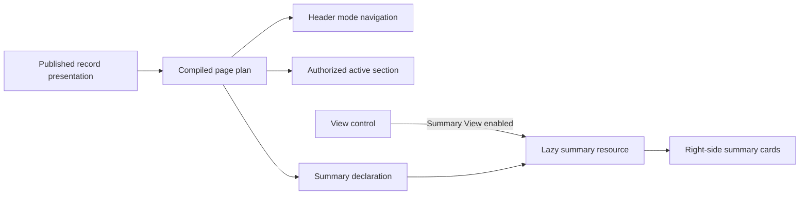

# Record navigation and Summary View design

**Status:** Implemented for Business Partner; requisition providers remain a separate delivery  
**Scope:** Compiled entity record pages, beginning with Business Partner and requisition  
**Decision:** Header navigation is the primary record navigation. Summary View is an optional, lazy right-side decision-support panel.

## Purpose

Record pages need one predictable way to move between record modes, preserve a precise deep link, and optionally expose the small set of facts needed to make a decision without duplicating the active section.

Business Partner already declares a 360 panel. Its **360 View** is a group of shared sections; its other modes are direct destinations. The current compiled entity runtime exposes authorized sections as a flat list, so the browser cannot distinguish those two cases from the page plan alone. It also does not project the existing primary-contact and primary-address sidebar declarations.

This design carries that presentation information into the compiled runtime, replaces duplicated navigation rails with header navigation, and introduces one reusable Summary View contract.



## Record navigation

### Presentation model

The existing `recordPresentation.panel` continues to define record modes:

```ts
panel: {
  schemaVersion: 1,
  kind: "360",
  sections: [
    "overview", "identity", "contacts", "addresses",
    "identifiers-tax", "banking", "qualifications-certificates"
  ],
  tabs: [
    { key: "360", label: "360 View", provider: "360" },
    { key: "roles", label: "Roles & scope", provider: "section", sectionKey: "roles-scope" },
    { key: "requests", label: "Requests", provider: "section", sectionKey: "requests" },
    { key: "transactions", label: "Business Transactions", provider: "section", sectionKey: "business-activity" },
    { key: "activity", label: "Activity", provider: "section", sectionKey: "activity" }
  ]
}
```

The browser renders this as:

| Published property | Rendered control | Selection target |
| --- | --- | --- |
| `tabs[].provider: "360"` | **360 View** menu button | Its authorized `panel.sections` children |
| `panel.sections[]` | Menu entries below **360 View** | Individual record sections |
| `tabs[].provider: "section"` | Direct tab | Its `sectionKey` |

The server intersects all configured keys with the caller's authorized `plan.sections` before returning the page plan. A denied section is omitted from both the 360 menu and direct tabs. The browser must never infer group membership from a section name.

### URL state

Navigation state is explicit and shareable:

| User selection | URL state |
| --- | --- |
| 360 View → Addresses | `?tab=360&section=addresses` |
| Roles & scope | `?tab=roles&section=roles-scope` |
| Activity | `?tab=activity&section=activity` |

Explicit clicks create a history entry. Browser Back/Forward and page reload restore the selected tab and section. A legacy URL containing only `section` is normalized to its owning tab after the authorized plan is available. A section that is no longer authorized falls back to the first authorized 360 child, then the first authorized direct tab.

### Layout

The record header and navigation use separate responsibilities:

- The record header holds identity, status, description, and actions.
- The record-mode navigation is a shell-width band with the same horizontal inset and divider treatment as breadcrumbs.
- The 360 menu is the only section selector for the default Content View.
- The prior left rail and its **Expand content** / **Show navigation** controls are not shown in Content View because they duplicate header navigation.

### Continuous 360 Section View

Section View is an opt-in runtime mode for the authorized children of the compiled `provider: "360"` tab. It mounts lightweight anchors for those sections in presentation order and progressively fetches a section when it enters the reading-position window. It does not add direct tabs such as Roles & scope, Requests, Business Transactions, or Activity to the document.

`IntersectionObserver` identifies the section crossing the reading position. The runtime updates the active 360 menu entry and contextual outline, then replaces `section` in the current URL. It never creates a browser-history entry during ordinary scrolling. Explicit menu or outline selection scrolls to the selected heading and creates the normal history entry.

The resource workspace preserves the existing authorization-scoped section cache and in-flight request deduplication. A menu opening still performs no section fetch, and sections outside the viewport remain placeholders until approached.

## View control

A compact **View** control sits at the trailing end of the record-mode navigation band. It changes page layout only; it is not record state and is not written to the URL.

| View | Default | Purpose | Responsive behavior |
| --- | --- | --- | --- |
| Content View | Yes | Full-width active section | Available at every width |
| Section View | No | Optional contextual outline for a long, continuous 360 document | Available on wide layouts; becomes a selector on narrow layouts |
| Summary View | No | Decision-support cards alongside the active content | Moves above content or closes on narrow layouts |

The user preference is stored per user and plane. It is restored on later record pages but can be changed for the current page at any time. Selection of a tab or section never changes the user's view preference.

## Summary View

### One declaration, not two

`panel.sidebar` is the existing 360-only sidebar declaration. It currently supports `primary-contact` and `primary-address`; it is the migration source for Summary View, not a second independently authored summary definition.

Add `recordPresentation.summaryView` as the general summary declaration. When it is present, it is authoritative. During migration, a missing `summaryView` is derived from `panel.sidebar`. New publications author `summaryView` and do not author `panel.sidebar`.

```ts
summaryView: {
  schemaVersion: 1,
  cards: [
    { key: "contact", label: "Primary Contact", provider: "primary-contact" },
    { key: "address", label: "Primary Address", provider: "primary-address" },
    { key: "relationships", label: "Relationships", provider: "relationship-summary" },
    { key: "governance", label: "Governance", provider: "governance-state" }
  ]
}
```

`key` is stable for caching and telemetry. `label` is author-controlled display text. `provider` is a registered, versioned server capability; metadata selects a provider but never supplies a query, a policy decision, or executable browser code.

### Business Partner prototype

Business Partner begins with at most four cards:

| Card | Provider | Content | Existing availability |
| --- | --- | --- | --- |
| Primary Contact | `primary-contact` | Designated contact, preferred channel, role | Existing `panel.sidebar` provider |
| Primary Address | `primary-address` | Designated address and verification state | Existing `panel.sidebar` provider |
| Relationships | `relationship-summary` | Authorized supplier/customer roles, company or organization counts, setup gaps | New projection from existing overview data |
| Governance | `governance-state` | Active request, incompleteness, restriction, or clear state | New governed-case projection |

No provider selects the first contact or address as a fallback. An absent primary designation produces an explicit empty card. Sensitive fields, masked banking values, and unpermitted relationships are omitted by the server.

### Requisition prototype

Requisition uses the same contract with providers specialized for operational decisions:

| Card | Provider | Content |
| --- | --- | --- |
| Funding profile | `funding-profile` | Budget state, consumption, reserved amount, reporting period |
| Requisition totals | `requisition-totals` | Currency, base value, discounts, charges, tax, gross payable |
| Approval path | `approval-path` | Current stage, resolved approvers, pending decision |
| Atlas recommendation | `atlas-recommendation` | One authorized, actionable recommendation with evidence/reference |

These are server-composed projections. The browser does not calculate budget state, approval routing, or commercial totals from requisition lines.

### Compiled runtime contract

The bootstrap plan gains browser-safe navigation and summary declarations after authorization filtering:

```ts
interface EntityRuntimePagePlan {
  // Existing properties omitted.
  readonly navigation?: {
    readonly tabs: readonly {
      readonly key: string; // "360" is valid
      readonly label: LocalizedText;
      readonly provider: "360" | "section";
      readonly sectionKeys: readonly string[];
    }[];
  };
  readonly summaryView?: {
    readonly cards: readonly {
      readonly key: string;
      readonly label: LocalizedText;
      readonly provider: string;
    }[];
  };
}
```

The compiled presentation-surface schema must allow these projections. The page planner validates references, removes unauthorized or unavailable entries, and returns only the admitted result. The current Business Partner fallback panel remains compatibility-only until this projection is published.

### Summary resource

Summary data is fetched only after the user enables Summary View:

```text
GET /api/entity-runtime/:entityCode/records/:recordId/summary
  ?surface=detail
  &operatingOrganizationId=...
  &companyCodeId=...
  &legalEntityId=...
  &asOf=...
  &roleLens=...
```

The response contains a release pin, record revision, and one resource state per admitted card. Providers run server-side and independently reauthorize record, context, and card data. A failed card does not hide neighboring cards. A missing provider is returned as unavailable only when its existence is safe to disclose; otherwise it is omitted.

## Performance and lifecycle

- Opening the 360 menu performs no section request.
- Selecting a section requests only that section when it is not already cached.
- Section requests are keyed by tenant, principal, authorization epoch, record, release, section, locale, and resource context.
- In-flight requests for the same key are deduplicated. A request made obsolete by a new selection is aborted when no consumer remains.
- Completed sections remain in the section cache until their release, record revision, context, or authorization identity changes.
- Summary View does not prefetch on hover. It starts one lazy summary request when enabled, caches the result with the same record/context/authorization identity, and cancels on record or context change.
- Optional idle prefetch is limited to one likely next section and is disabled on constrained-network signals.
- Switching a View changes layout only. It does not refetch the active section.

## Accessibility

- **360 View** is a menu button with an accessible label, expanded state, Escape dismissal, and focus return to its opener.
- Direct modes remain buttons/tabs with an exposed current state.
- Selecting a menu child updates URL state, closes the menu, moves focus to the active section heading, and announces the destination once.
- The View control uses checkable menu items and identifies the active layout.
- Summary cards have headings, explicit loading/error/empty states, and no color-only status signal.
- Narrow layouts retain access to record modes and summary content without mounting duplicate interactive controls.

## Delivery plan

1. **Complete:** `summaryView` parsing, validation, and fallback projection from legacy `panel.sidebar`.
2. **Complete:** compiled presentation-surface navigation and summary declarations, with an authorization-filtered page-plan projection.
3. **Complete:** Business Partner consumes the projected navigation when published and preserves normalized `tab` and `section` URL state; the compatibility panel remains only for older releases.
4. **Complete:** reusable View control with Content and lazy Summary layouts; Summary is responsive and does not duplicate section navigation.
5. **Complete:** lazy summary endpoint, browser resource client, provider registry, request-local provider deduplication, and per-card resource states.
6. **Complete:** Business Partner primary-contact, primary-address, relationship, and governance cards.
7. **Complete:** progressive continuous rendering for authorized 360 children in Section View, including observer-driven active-section and `replaceState` synchronization.
8. Add requisition providers after the Business Partner contract and cache behavior are qualified.

## Review acceptance criteria

- A published 360 group and direct tab render correctly using only the authorized compiled plan.
- Deep links, browser Back/Forward, refresh, and legacy section-only URLs resolve to the correct tab and section.
- Opening menus, toggling layouts, and rapid navigation do not eagerly load unrelated sections or summaries.
- Summary View never returns unauthorized fields, relationships, counts, or provider details.
- Business Partner preserves explicit empty states for missing primary contact/address.
- Requisition budget, totals, approval, and Atlas cards remain server-derived and independently failure-tolerant.
- Keyboard, screen reader, narrow layout, dark theme, and high-zoom checks pass.
