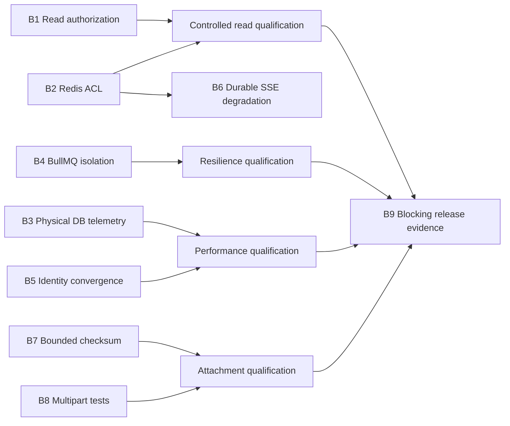

# Athyper Production Blocker Remediation Assessment and Plan

**Assessment date:** 2026-07-15  
**Source snapshot:** Git `6ca7aac9f2ff150400dec8b739af3e96e96eb4e1` plus the current uncommitted environment and Compose changes  
**Scope:** Entity read authorization, Redis ACL/topology, PostgreSQL physical cost, canonical request identity, record SSE, attachment checksum/multipart handling, and production qualification  
**Related assessment:** [Frappe vs Athyper post-improvement comparison](./frappe-vs-athyper-post-improvement-detailed-comparison.md)

## 1. Executive decision

The nine findings are confirmed blockers, not documentation-only gaps. Athyper should remain in controlled/shadow rollout for the affected read, mutation, SSE, and attachment paths until the exit criteria in this plan are met.

The most serious issue is the missing mandatory entity-read authorization contract at the new query-kernel boundary. Redis ACL and BullMQ topology issues are next because they can make correctly implemented descriptor caching, invalidation, record fan-out, and queue isolation fail or degrade silently. The PostgreSQL issue is primarily a measurement and architecture problem: one logical Kysely query can cause four physical commands, so current query-count budgets do not describe actual database pressure.

The attachment test failures have a specific cause. The multipart route now performs several asynchronous authorization steps before Busboy is constructed, while the tests emit parser events immediately and wait for only one microtask. The events are emitted before listeners exist. This is a test synchronization defect and a handler-contract maintainability problem; it is not evidence that the streaming implementation itself buffers uploads.

The release gate is working as designed by failing closed. It must not be bypassed or populated with example/synthetic evidence. Real qualification must be the last phase, after all other blocker fixes have been deployed to a production-like environment.

### Release recommendation

| Area | Current decision | Promotion condition |
|---|---|---|
| `EntityQueryService` list/detail | Do not broaden pilots | Mandatory read authorization overlay and deny-path tests pass |
| Descriptor/list Redis cache | Do not rely on L2 until ACL verified | Real Redis test succeeds as the exact runtime ACL user |
| BullMQ jobs | Do not call topology isolated | Runtime proves a distinct production endpoint/credential or a time-bound approved exception exists |
| Record SSE | Do not claim durable degradation | Connected clients continue draining PostgreSQL during Redis loss |
| Presigned attachments | Keep quarantined/controlled | Checksum verification is bounded-memory and tied to an upload intent |
| Multipart attachments | Block attachment qualification | Five regression tests plus real multipart integration pass |
| Production release | Block | Every required evidence artifact validates against the exact release commit |

## 2. Priority and dependency assessment

All nine items are release relevant. Priority indicates remediation order, not whether an item may be skipped.

| ID | Finding | Class | Priority | Risk if unresolved | Relative effort | Primary capability owner |
|---|---|---|---|---|---|---|
| B1 | New query path lacks mandatory entity-read authorization | Security/data exposure | P0 | Unauthorized row or field disclosure, including from cache | L | Records + IAM/policy |
| B2 | Redis app ACL omits new keys/channels | Correctness/availability | P0 | Cache and invalidation degradation, SSE/outbox `NOPERM`, inconsistent replicas | M | Platform/SRE |
| B3 | Logical query telemetry hides physical tenant-stamp commands | Performance/capacity | P1 | Under-sized DB/pool, misleading budgets, avoidable latency | L | DB platform + observability |
| B4 | BullMQ dedicated Redis can silently fall back to primary Redis | Availability/isolation | P0 | Queue/cache interference and correlated outage | M | Platform/SRE |
| B5 | 173 route-local identity-resolution occurrences remain | Security/performance/convergence | P1 | Repeated auth/DB work and inconsistent identity semantics | XL | API platform + service owners |
| B6 | SSE Redis degradation stops durable draining | Correctness/realtime | P0 | Connected client remains stale while receiving keepalives | M | Records/realtime |
| B7 | Presigned checksum can buffer the entire object | Memory/security | P0 | API OOM/GC pressure and upload-amplified denial of service | L | Documents + object storage |
| B8 | Five multipart tests fail | Quality/release | P0 | Attachment lifecycle cannot be qualified; future races are hard to diagnose | S-M | Documents + QA |
| B9 | Production qualification evidence is absent | Governance/release | P0 | No defensible production readiness or performance claim | L plus environment time | Release engineering + SRE |

Effort bands are relative: S is a focused change, M spans several code/config/test surfaces, L requires a new contract or integration path, and XL is a multi-wave migration.

### Dependency flow



## 3. Target production architecture

```text
authenticated boundary
  -> one VerifiedRequestContext per request
  -> ExecutionDescriptor (shared, principal-neutral metadata)
  -> EffectiveReadAuthorizationOverlay (principal/security specific)
  -> EntityQueryService
       -> authorization check before cache or data access
       -> security-scoped page/count cache
       -> tenant-stamped PostgreSQL execution

Redis cache/realtime plane
  -> role-specific ACL credentials
  -> exact descriptor/list/outbox keyspaces
  -> exact invalidation and record channel patterns

BullMQ plane
  -> distinct endpoint, credential, capacity and memory policy

record SSE
  -> PostgreSQL durable event log is source of truth
  -> Redis is a low-latency wake-up only
  -> bounded polling continues during Redis degradation

attachment flow
  -> durable/signed upload intent
  -> client-to-object-store upload with checksum contract
  -> HEAD/provider verification or streaming worker verification
  -> quarantined attachment becomes active only after verification and scan
```

## 4. B1 — Mandatory read authorization for `EntityQueryService`

### Assessment

This blocker is confirmed with high confidence:

- [`EntityQueryService.assertContext`](../../server/packages/services/records/query/entity-query.service.ts) checks only that tenant, principal, and profile hash exist.
- [`ListEntitiesCommand`](../../server/packages/services/records/query/entity-query.types.ts) requires a verified context and descriptor, but no non-optional read authorization decision.
- The query plan adds tenant/company/legal scope and applies static descriptor masking, but static metadata is not a substitute for a principal's effective entity, row, or field permission.
- The current unit fixture in [`entity-query.service.test.ts`](../../server/packages/services/records/query/__tests__/entity-query.service.test.ts) successfully queries with `permissions: {}`.
- In contrast, [`EntityMutationService`](../../server/packages/services/records/mutation/entity-mutation.service.ts) checks each mutation binding's `permissionCode` against `context.permissions.allowed`.
- PostgreSQL RLS protects tenant isolation; it does not prove entity-operation authorization or all application field/row policies.

### Failure modes

1. A valid tenant principal without the entity read grant can enter the pilot query path.
2. A shared descriptor can expose a projection broader than the principal's readable fields.
3. A user can filter or sort on a field that should be hidden even if response masking removes it.
4. A cached page generated under an insufficient security identity can be reused if the security hash does not cover the complete effective authorization decision.
5. Falling back to the legacy path after a denial/error can accidentally become a permission bypass.

### Target contract

Keep the execution descriptor principal-neutral. Add a required, immutable, principal-specific authorization input, for example:

```ts
interface EffectiveReadAuthorizationOverlay {
  entityCode: string;
  permissionCode: string;
  allowed: true;
  readableFields: readonly string[];
  filterableFields: readonly string[];
  sortableFields: readonly string[];
  rowScope: readonly TrustedRowPredicate[];
  securityHash: string;
  authEpoch: number;
  profileHash: string;
}
```

`TrustedRowPredicate` must be produced by trusted policy code and compiled through an allowlisted operator/column mapping. It must never contain client SQL.

### Implementation plan

1. Add a read-operation binding to the metadata/compiler contract, aligned with mutation `permissionCode` semantics.
2. Implement `resolveEffectiveReadAuthorization(context, descriptor, operation)` in the policy/IAM boundary.
3. Make the overlay a non-optional field of list and detail commands.
4. Fail closed before result-cache lookup, count-cache lookup, reference hydration, or entity-table SQL when the operation is not allowed or the overlay is missing/stale.
5. Intersect descriptor projection/search/filter/sort fields with the overlay. Reject attempts to filter/sort/search hidden fields; do not merely mask them after SQL execution.
6. Compile row-scope predicates into the same trusted query plan as tenant/company/legal predicates.
7. Include the overlay's stable `securityHash`, `authEpoch`, and policy revision in page/count cache keys and signed cursors.
8. Prevent legacy fallback on an authorization denial. Fallback is permitted only for unsupported query shape after the same authorization decision has succeeded.
9. Apply the same contract to detail reads and future aggregates, exports, reference lookups, and SSE record existence checks.
10. Keep entities on the legacy/controlled path when their row-security semantics cannot yet be represented by the overlay.

### Required tests

- No entity SQL and no result-cache read when the entity permission is absent.
- Allowed principal can list/detail; otherwise identical principal cannot.
- Permission revocation or `authEpoch` change cannot reuse a warm page.
- Two profiles in one tenant do not share pages when row/field policies differ.
- Hidden fields cannot be projected, searched, filtered, sorted, or leaked through reference labels.
- Company subtree, organization, legal-entity, and tenant predicates are all enforced.
- Cross-tenant cursor/cache replay fails.
- Descriptor generation or policy revision mismatch invalidates the cursor.
- Redis unavailable follows the same authorization result and fails safely.

### Exit criteria

- Every `EntityQueryService.list/detail` call requires a successful overlay at compile time and runtime.
- Denied-request integration tests prove zero entity-table access.
- Security review signs off on operation, row, and field semantics for the first promoted entity.
- No pilot expands until warm-cache and revoked-permission tests pass with a live PostgreSQL and Redis stack.

### Rollout and rollback

Roll out one entity and one operation at a time. Shadow-compare allowed requests, but exercise denial paths directly rather than shadow-serving unauthorized data. Rollback disables the query pilot; it must not disable the canonical authorization boundary.

## 5. B2 — Redis ACL coverage for descriptor, list, and record workloads

### Assessment

The app user in both [`redis-acl.conf.tpl`](../../stack/config/memorycache/redis-acl.conf.tpl) and [`redis-acl.conf`](../../stack/config/memorycache/redis-acl.conf) permits the older `desc:v4:*` keyspace and `&activity:*` channels. It does not permit the currently implemented key/channel contracts:

| Runtime purpose | Required pattern |
|---|---|
| Descriptor generation | `~execdesc:gen:v1:*` |
| Descriptor head | `~execdesc:head:v1:*` |
| Descriptor payload | `~execdesc:v1:*` |
| Keyset list page | `~listpage:v2:*` |
| Entity query count | `~entityquery-count:v1:*` |
| Idempotent outbox publication, when this runtime role uses it | `~outbox:processed:v1:*` |
| Descriptor invalidation pub/sub | `&execdesc:invalidate:v1` |
| Record event pub/sub | `&record:*` |

The current [`redis-acl-contract.test.ts`](../../server/src/__tests__/redis-acl-contract.test.ts) asserts the activity channel but not the new descriptor/list/record contracts. Several Redis paths intentionally degrade to PostgreSQL/local behavior, so an ACL error can look like a performance miss instead of a deployment error.

### Target design

Create a versioned Redis access manifest as the single source of truth. Separate access by runtime role:

- API: session/bootstrap reads, descriptor/list caches, descriptor subscription, record subscription/publication as required.
- Worker: descriptor invalidation publication, record publication, outbox processed markers.
- BullMQ producer/worker: queue-only keys on the dedicated jobs Redis.
- Operations: health and controlled diagnostic commands only.

Do not solve this with `~*`, `&*`, `+@all`, or a shared administrative credential.

### Implementation plan

1. Inventory every key builder, channel builder, command, and runtime credential. Include Lua script keys and BullMQ's actual prefix.
2. Add a machine-readable manifest under `config/governance` with owner, runtime role, read/write command class, pattern, version, and retirement state.
3. Generate or validate both ACL template and rendered ACL from that manifest to prevent drift.
4. Add the exact patterns above to only the roles that use them.
5. Extend the static ACL contract test to consume the manifest.
6. Add a live Redis integration test that authenticates as the real `app` user and proves GET/SET/INCR/DEL plus exact PUBLISH/SUBSCRIBE operations.
7. Add negative assertions: the app user cannot access another role's prefix, arbitrary channels, admin commands, or flush/config commands.
8. Add startup probes for required key/channel access. A production `NOPERM` on a required contract should make readiness fail rather than silently running indefinitely in degraded mode.
9. Export Redis `NOPERM`, cache-layer fallback, invalidation-subscription, reconnect, and command-latency metrics by role.
10. Deploy additive ACL permissions before enabling the corresponding application feature.

### Exit criteria

- Static manifest/ACL tests pass for template and rendered configuration.
- Live Redis tests pass using the exact production-style username and password.
- A 30-minute descriptor/list/SSE smoke produces zero `NOPERM` events.
- Revoking one required pattern makes readiness or the explicit integration test fail predictably.
- Unrelated keys/channels remain denied.

### Rollout and rollback

ACL additions are backward-compatible and should deploy before code promotion. Rollback removes only unused new patterns after consumers are disabled. Never roll back by switching the application to an administrative Redis user.

## 6. B3 — Physical PostgreSQL cost and tenant stamping

### Assessment

[`tenant-stamp-driver.ts`](../../server/packages/adapters/db/src/kysely/tenant-stamp-driver.ts) explicitly implements a standalone tenant-scoped query as:

```text
BEGIN
SELECT set_config('app.current_tenant_id', $1, true)
application query
COMMIT
```

That is four physical PostgreSQL commands and normally four protocol exchanges for one logical Kysely call. [`performance-dialect.ts`](../../server/packages/adapters/db/src/kysely/performance-dialect.ts) intentionally observes the outer logical call and does not expose the internal stamp commands. Consequently, a route budget of one logical SQL query can materially understate pool occupancy, network latency, PostgreSQL command rate, and transaction overhead.

There is also duplicate mutation stamping risk. The tenant-stamp driver stamps the explicit transaction at begin, while [`executeDurableMutationTransaction`](../../server/packages/services/shared/durable-mutation-transaction.ts) sets tenant and principal again inside the transaction.

### Correct target metrics

Track both logical work and physical cost:

| Metric | Meaning |
|---|---|
| Logical query count | Application-level Kysely operations |
| Physical DB command count | BEGIN/SET/application/COMMIT/ROLLBACK commands |
| Protocol exchange count | Actual driver/network request-response exchanges |
| Tenant stamp overhead | Time spent beginning, stamping, committing, or rolling back |
| Transaction duration | Wall time a connection/transaction is held |
| Pool wait and utilization | Contention before a connection is acquired |
| Application SQL duration | PostgreSQL execution excluding stamp/transport overhead |

### Implementation plan

1. Instrument `TenantStampDriver` around every internal command. Tag implicit versus explicit transaction, runtime, route family, success/rollback, and whether tenant/principal were stamped.
2. Preserve logical metrics; add physical metrics rather than redefining existing dashboards.
3. Include BEGIN, COMMIT, ROLLBACK, and `set_config` in qualification evidence even if top-statement SQL filters omit them.
4. Extend the driver context to stamp tenant and principal once per explicit transaction from the verified async context.
5. Remove the duplicate tenant stamp in durable mutation helpers after an integration test proves the driver owns it. If principal cannot yet be driver-owned, set only principal in the helper.
6. Introduce short operation-level transactions around clusters of tenant-scoped DB queries where this amortizes one stamp across several queries.
7. Do not hold these transactions across Redis calls, object-storage transfers, external HTTP, client streaming, or expensive metadata compilation.
8. For a single-query read, evaluate a safe driver/protocol batch or pipeline only after instrumentation. Do not embed untrusted values in a multi-statement string and do not weaken RLS to save round trips.
9. Validate all alternatives with PgBouncer transaction pooling; a session-level GUC is not acceptable.
10. Update performance budgets to contain both logical-query and physical-command/exchange limits.

### Decision experiment

Benchmark three variants on the same network and pool:

- Current implicit four-command transaction.
- Short explicit operation transaction, demonstrating savings for multi-query operations.
- A driver-supported parameterized batch/pipeline for the single-query path, only if RLS and rollback semantics remain correct.

Measure p50/p95/p99, commands/operation, protocol exchanges/operation, pool wait, transaction duration, CPU, and tenant-leak tests. Choose from evidence; do not assume explicit transactions improve a single-query route, because without batching they still require begin/stamp/query/commit.

### Exit criteria

- Dashboards and qualification files show logical and physical costs separately.
- A durable mutation stamps each tenant/principal exactly once per transaction.
- Hot routes have an explicit physical-command budget and pass it under concurrency.
- Tenant isolation passes under connection reuse, rollback, timeout, cancellation, and PgBouncer transaction pooling.
- No transaction spans Redis, object storage, external network calls, or SSE connection lifetime.

## 7. B4 — Enforced BullMQ Redis isolation

### Assessment

[`bootstrap.ts`](../../server/src/kernel/bootstrap.ts) rejects a missing `REDIS_BULLMQ_URL` outside local development unless an explicit shared override is set. However, [`athyper-apps.yml`](../../stack/compose/apps/athyper-apps.yml) currently injects:

```yaml
REDIS_BULLMQ_URL: "${REDIS_BULLMQ_URL:-${REDIS_URL}}"
```

The runtime therefore sees a non-empty BullMQ URL even when the operator did not provide a dedicated endpoint. The guard verifies presence, not isolation. A separate Redis database number on the same server also does not isolate memory, CPU, persistence, failover, or eviction.

### Target production contract

- `dedicated`: BullMQ host/port or cluster endpoint is distinct from the cache/session Redis and uses a queue-specific credential.
- `approved-shared`: an explicit, time-limited exception with namespace, ACL, memory/capacity, eviction, incident-blast-radius, owner, and expiry evidence.
- `local`: sharing is allowed for developer convenience and is clearly logged.

### Implementation plan

1. Remove the Compose fallback from BullMQ URL to primary Redis.
2. Add an explicit `REDIS_BULLMQ_ISOLATION_MODE=dedicated|approved-shared|local` contract.
3. Normalize Redis URLs and compare scheme, host, port, TLS mode, and cluster identity. In dedicated production mode, a different DB index alone must fail.
4. Require a separate username/ACL with access only to the configured BullMQ prefix.
5. Ensure staging/production Compose includes or externally provisions the jobs Redis instead of leaving it as an optional unnoticed profile.
6. Update Windows and Linux environment validation scripts so missing, identical, malformed, or policy-inconsistent values fail before deployment.
7. Give the jobs Redis an appropriate persistence and `noeviction`/capacity policy. Cache eviction policy must not be inherited accidentally.
8. Emit a redacted topology fingerprint at startup and expose a readiness check for the jobs endpoint.
9. Add chaos tests: primary cache Redis failure does not stop established job processing; jobs Redis failure does not corrupt session/cache behavior; producers report queue unavailability clearly.
10. Document the approved-shared exception workflow and automatic expiry.

### Exit criteria

- Production cannot start in `dedicated` mode when endpoints resolve to the same Redis service.
- Compose and both validation scripts fail when the dedicated value is absent.
- BullMQ uses a queue-only credential and key prefix.
- Separate capacity, latency, queue-depth, failure, and eviction dashboards exist.
- A shared exception, if temporarily required, is explicit, expiring, and attached to release evidence.

## 8. B5 — Canonical identity convergence

### Assessment

The current ratchet reports **173 tracked matches across 31 route files**:

| Pattern | Current count |
|---|---:|
| `verifyBearer` | 58 |
| `resolveTenantId` | 56 |
| Direct `x-org` access | 28 |
| Principal resolution | 31 |
| **Total** | **173** |

[`verify-records-identity-boundary.mjs`](../../scripts/policy/verify-records-identity-boundary.mjs) prevents the counts from increasing, which is useful, but it allows the current duplication indefinitely. The records root has a canonical context boundary, while adjunct routes such as SSE, reference/label helpers, attachments, and other service routers continue to resolve identity locally.

### Target invariant

For each protected HTTP request:

```text
token verification count       = 1
tenant resolution count        = 1
principal/effective IAM count  = 1
VerifiedRequestContext objects = 1 immutable instance
route-local org/realm headers  = 0
```

Public routes must be explicitly allowlisted. Background jobs must use a distinct trusted service/job context rather than manufacturing an HTTP identity.

### Migration plan

1. Expand the inventory repository-wide and classify every occurrence as authenticated boundary, approved public route, service/job boundary, compatibility adapter, or migration debt.
2. Attach the frozen `VerifiedRequestContext` to a typed request symbol/`res.locals` once, and expose `requireVerifiedContext(req)` to downstream routers.
3. Move document/attachment authorization onto the same boundary instead of verifying bearer and resolving context inside each attachment handler.
4. Migrate in waves:
   - record read/detail/reference/label adjunct routes;
   - record SSE and collaboration streams;
   - attachment and document routes;
   - line, child, bulk, import/export, and lifecycle routes;
   - domain-specific routers and compatibility aliases.
5. Delete direct `x-org`/realm reads below the boundary. Pass tenant/company/realm from context explicitly.
6. Centralize authorization errors, audit attributes, request ID, `authEpoch`, `profileHash`, and security scope derivation.
7. Create a separate factory for scheduled/job/service contexts with explicit actor and tenant provenance.
8. Lower the ratchet baseline in every migration PR; do not wait for one large final cleanup.
9. When protected-route counts reach zero, change CI from a numerical baseline to a forbidden-pattern rule with a small reviewed allowlist for the boundary itself.
10. Measure token verification, IAM DB queries, tenant lookup queries, and context resolution time before and after each wave.

### Exit criteria

- No protected route performs route-local bearer, org-header, tenant, or principal resolution.
- Public and service/job exceptions are explicit and tested.
- One context instance is used by authorization, query/mutation, audit, cache keys, SSE, and attachment ownership.
- CI forbids new route-local identity resolution instead of merely ratcheting at 173.
- Compatibility traffic and auth-cost telemetry show no regression before aliases are retired.

## 9. B6 — Durable SSE drain during Redis degradation

### Assessment

The record SSE endpoint in [`records.route.ts`](../../server/packages/services/records/routes/records.route.ts) correctly treats PostgreSQL durable events as the source of truth and Redis as a wake-up. It performs an initial durable drain and drains again when a Redis message arrives. When subscription fails, however, `feedMode` becomes `keepalive-only`; only the keepalive interval continues. The comment says periodic draining closes the wake-up-loss window, but no periodic durable-drain timer is scheduled.

This produces a dangerous false-health state: the TCP/SSE connection remains alive and receives keepalive comments while business events stop advancing.

### Target state machine

```text
connecting
  -> pubsub            Redis subscribed; event wakes immediate durable drain
  -> degraded_poll     Redis absent; jittered bounded PostgreSQL drain continues
  -> recovering        resubscribe and drain before returning to pubsub
  -> closing           timers/subscriptions/in-flight work released
```

PostgreSQL cursor order and `Last-Event-ID` remain authoritative. Redis payloads should trigger a drain, not become the sole event record.

### Implementation plan

1. Add a configurable degraded polling interval with jitter and exponential backoff bounded by an explicit maximum delivery-lag objective.
2. Schedule a slower safety drain even in healthy pub/sub mode to close missed-publication and subscriber-reconnect windows.
3. Keep one drain in flight per feed; coalesce concurrent wake-ups.
4. Prefer a per-process/per-record feed coordinator so many clients watching the same record share one Redis subscription and degraded poll rather than creating a database timer stampede.
5. On Redis reconnect, resubscribe, perform a durable catch-up drain, then transition to `pubsub` and stop the fast degraded poller.
6. Cap batch size and iterations per tick; immediately schedule another tick while backlog remains.
7. Handle response backpressure. If `res.write` returns false, bound queued bytes/events and close/reset instead of accumulating memory.
8. Clean up all timers, subscriptions, listeners, and in-flight references on close, abort, timeout, and server shutdown.
9. Authorize the entity/record before opening the stream using the canonical context/read contract. Use a maximum connection lifetime or periodic authorization epoch validation so revoked access is not permanent until socket close.
10. Emit feed mode, connected clients, durable lag, cursor, drain duration/count, rows per drain, Redis reconnects, missed wake-ups, errors, and slow-client closure metrics.

### Required tests

- Redis unavailable before connect: a later durable DB event reaches the existing client within the degraded bound.
- Redis fails after subscription: later durable events still arrive.
- Redis recovers: catch-up runs once, no duplicate event is sent, and fast polling stops.
- `Last-Event-ID` replay, retention reset, multiple events, and batch continuation preserve order.
- Two clients for the same record do not multiply Redis subscriptions/polls unexpectedly.
- Slow client/backpressure and socket close free every resource.
- ACL denial is observable and enters degraded mode while readiness/alerts report it.

### Exit criteria

- Keepalive-only is no longer a terminal active mode for an authorized connected feed.
- Redis-off event delivery lag is at most the configured poll interval plus one durable-query p95 under qualified load.
- No duplicate or out-of-order cursor is observed across failure/recovery tests.
- Degraded polling QPS and connection memory stay within explicit capacity budgets.

## 10. B7 — Bounded-memory presigned checksum validation

### Assessment

[`completePresignedUpload`](../../server/packages/services/documents/services/attachment.service.ts) calls `storage.get(storageKey)` when `expectedSha256` is supplied and hashes the returned `Buffer`. API memory therefore grows with object size. Concurrent large completions can amplify heap use and garbage collection or terminate the process.

The completion request also supplies the expected checksum. Without a durable/signed upload intent or object-store-verified checksum, completion evidence is weaker than a server-held initiation contract.

### Target flow

1. Initiation creates a durable upload intent containing tenant, principal, entity, record, storage key, expected size, checksum algorithm/value, expiry, and idempotency key.
2. Presigning requires the provider checksum header when supported.
3. Completion locks/consumes the intent and uses HEAD/provider metadata to verify size, ownership, expiry, and provider-validated checksum.
4. If the provider cannot expose a trustworthy SHA-256, completion leaves the object `verification_pending`/quarantined and enqueues a streaming verifier.
5. A worker reads the object as a stream, hashes incrementally with a byte/time limit, and activates only after checksum plus malware/quarantine policy succeeds.
6. Expired, mismatched, replayed, or abandoned intents/objects are cleaned by a durable sweeper and object-store lifecycle rule.

### Implementation plan

1. Add an upload-intent table or a signed, single-use server token backed by a replay store. A durable row is recommended for audit, expiry, and cleanup.
2. Extend the object-storage adapter with verified checksum metadata capability and `getStream`; advertise provider capabilities explicitly.
3. Require checksum headers in newly issued presigned requests when S3/MinIO capability supports them.
4. Remove `storage.get()` from presigned completion. Do not replace it with chunk accumulation in API memory.
5. Add a streaming verification job for providers/objects without trusted checksum metadata.
6. Keep `master.attachment` quarantined or verification-pending until checksum and scanning complete. Never expose download/activation on client assertion alone.
7. Treat multipart ETag only as an object/version hint; it is not a SHA-256 checksum.
8. Make completion idempotent and consume/lock the intent to prevent replay against a different object or record.
9. Delete/quarantine mismatches and audit actor, object version, reason, and byte count.
10. After staged validation, make strict size/checksum/intent flags default-on in production examples.

### Required tests

- A 250 MB object is verified with a bounded API/worker memory delta, for example less than 32 MB above steady state.
- Hash match, mismatch, truncated object, oversized object, missing metadata, expired intent, replay, wrong tenant, and wrong storage key.
- Multipart object ETag is not accepted as SHA-256.
- API restart between initiate and complete preserves the intent.
- Worker failure/retry is idempotent and the attachment remains unavailable.
- Abandoned objects are removed by lifecycle/sweeper evidence.

### Exit criteria

- No presigned completion path reads an entire object into API memory.
- Expected checksum is bound at initiation and cannot be changed at completion.
- Activation/download requires successful server/provider verification and quarantine policy.
- Large-object concurrency load stays inside heap, event-loop, and worker throughput budgets.

## 11. B8 — Multipart attachment regression tests

### Root cause

All five failures in [`attachments.route.test.ts`](../../server/packages/services/documents/routes/__tests__/attachments.route.test.ts) have status/call counts of zero because the test drives the fake parser too early:

```text
test calls handler
  -> route awaits verifyBearer
  -> awaits resolveDocumentEntity
  -> awaits resolveVerifiedRequestContext
  -> awaits authorizeAttachmentAccess
  -> only then constructs Busboy and installs listeners

test emits file/finish immediately after handler call
  -> no Busboy listeners exist yet
  -> event is lost
```

The route wraps an async IIFE in a non-async Express handler and returns `void`. Tests then use `await Promise.resolve()`, which is not a completion contract. Adding more arbitrary microtask flushes would remain flaky.

### Implementation plan

1. Extract an async multipart preflight function: authentication/context, entity resolution, authorization, limits, and replay check.
2. Extract the parser lifecycle into a promise that settles exactly once on response, parser error/finish, upload resolution/rejection, timeout, abort, or size failure.
3. Register request abort/error handling before piping and make cleanup idempotent.
4. Wrap the async handler with the project's standard Express error wrapper so rejection reaches `next` deterministically.
5. Update the fake request so file and finish events are emitted from/after `req.pipe(parser)`, matching the real lifecycle.
6. Add a `parserReady`/`waitFor(busboy called)` synchronization point in unit tests and await a response/handler settlement signal. Do not use microtask-count assumptions.
7. Restore the five scenarios: no file, parse timeout, aggregate/file size limit, upload stream failure, and idempotent replay.
8. Add a Supertest-style integration test with a real multipart body and real Busboy parser; unit mocks alone cannot validate stream ordering.
9. Add client abort, duplicate file part, parser error, storage timeout, backpressure, and exactly-once response tests.
10. Ensure canonical context migration does not reintroduce route-local async test assumptions.

### Exit criteria

- All five currently failing tests pass without arbitrary sleeps or repeated `Promise.resolve()` calls.
- The complete attachment route suite and presigned contract suite pass.
- A real multipart upload integration proves streaming, size enforcement, failure cleanup, and idempotent response behavior.
- Each request produces exactly one terminal response or `next(error)` call.

## 12. B9 — Production qualification and release evidence

### Assessment

The blocking release gate in [`release-gate.json`](../../config/governance/release-gate.json) is correctly configured, but the current qualification policy reports these 11 unique files as missing:

1. `perf/qualification/current-report.json`
2. `perf/qualification/result.json`
3. `perf/qualification/company-code-read.json`
4. `perf/qualification/company-code-mutation.json`
5. `perf/qualification/evidence/rls.json`
6. `perf/qualification/evidence/outbox-durability.json`
7. `perf/qualification/evidence/redis-degradation.json`
8. `perf/qualification/evidence/attachment-quarantine.json`
9. `perf/qualification/evidence/sse-reconnect-catchup.json`
10. `perf/qualification/evidence/tenant-size-load.json`
11. `perf/qualification/compatibility-report.json`

`current-report.example.json` is a test/example input and must never be copied or renamed into release evidence.

### Evidence provenance contract

Every artifact should include:

- schema/kind version;
- exact Git commit and `dirty: false` status;
- container image digests and dependency lock hash;
- deployment/config fingerprint with secrets redacted;
- PostgreSQL/PgBouncer, Redis, BullMQ, object-store, worker, CPU, memory, and network topology;
- dataset profile, tenant sizes, seed/version hash, and scenario inputs;
- start/end timestamps, tool versions, sample counts, warm-up, duration, and concurrency;
- p50/p95/p99, throughput, errors, logical queries, physical commands/exchanges, pool wait, transaction duration, cache/queue metrics, and resource metrics where applicable;
- pass/fail result against the checked-in budget revision;
- immutable CI run/artifact reference and responsible owner.

### Qualification pipeline

1. Build the exact candidate from a clean commit; record image digests.
2. Provision a production-like topology with dedicated jobs Redis and the production-style app/worker ACL users.
3. Seed versioned small, medium, large, skewed, two-tenant, and multi-permission-profile data.
4. Run static/unit gates, including read authorization, ACL manifest, identity boundary, multipart, and artifact schema tests.
5. Run live integration gates: RLS/tenant reuse, Redis ACL, outbox atomicity/retry, attachment quarantine, SSE Redis loss/recovery, and BullMQ isolation.
6. Run the existing k6 warm/cold/resilience/soak scenarios with authorization, RLS, audit, idempotency, outbox, and normal durability enabled.
7. Run each baseline/candidate performance scenario three times after warm-up. Require repeatability within the existing 10% guidance before comparing.
8. Capture physical tenant-stamp commands and infrastructure telemetry, not only outer logical query count.
9. Generate the read/mutation slices and qualification result from the measured current report.
10. Observe compatibility/shadow traffic for the required window and generate the compatibility report.
11. Validate each evidence schema, then run `pnpm policy:qualification-artifacts`, `pnpm qualify:meta-entity`, and `pnpm policy:release-gate`.
12. Publish the immutable evidence bundle alongside the release candidate. Do not hand-edit pass fields.

### Evidence-specific minimums

| Artifact | Must prove |
|---|---|
| RLS | Two tenants under connection reuse, rollback, cancellation, and PgBouncer transaction mode cannot cross-read/write |
| Outbox durability | Record/audit/idempotency/outbox atomicity plus retry/idempotent consumer behavior |
| Redis degradation | Correct cache miss/fallback, invalidation recovery, `NOPERM` absence, and bounded degraded behavior |
| Attachment quarantine | Intent/checksum/scan/activation ordering, mismatch denial, cleanup, and bounded memory |
| SSE reconnect/catch-up | Last-Event-ID order, Redis-off drain, recovery, no duplicates, and lag objective |
| Tenant-size load | Keyset behavior and p95/p99 across small/large/skewed tenants |
| Compatibility | Route volume, shadow differences, error/latency deltas, and zero required retirement blockers |

### Exit criteria

- All 11 unique evidence files exist and pass schema/semantic validation.
- Evidence identifies one clean commit and the deployed image digests for that commit.
- All blocking commands pass without exceptions or example data.
- Results are repeatable and collected on production-like topology.
- Release approvers can trace every pass value to raw k6, metrics, database, Redis, queue, and integration outputs.

## 13. Integrated delivery plan

### Milestone 0 — Freeze and make work observable

- Keep read/list pilots controlled and mutation stages in shadow validation.
- Record the candidate commit, current flags, and topology.
- Add blocker dashboards and a single remediation tracking board.
- Do not generate release evidence yet; preliminary diagnostics must be labeled non-qualification.

**Exit:** owners assigned, flags recorded, no affected pilot expands.

### Milestone 1 — Close immediate security and deployment blockers

- B1: read authorization overlay for the first pilot entity.
- B2: Redis access manifest, ACL updates, live ACL tests.
- B4: remove BullMQ fallback and enforce isolation mode.
- B8: deterministic multipart handler/tests.

These workstreams can proceed in parallel, but read promotion waits for all four.

**Exit:** authorization denies before data access; exact Redis app access works; production cannot silently share BullMQ Redis; attachment test suite is green.

### Milestone 2 — Close durability and memory blockers

- B6: degraded SSE polling/recovery state machine and capacity controls.
- B7: upload intent, provider checksum or streaming verifier, bounded-memory tests.

**Exit:** Redis loss does not stale connected SSE feeds; large checksum verification cannot grow API heap with object size.

### Milestone 3 — Make performance measurement honest and converge identity

- B3: physical command/protocol telemetry, duplicate stamp removal, transaction experiments.
- B5: identity migration waves, beginning with query, SSE, and attachment paths under qualification.
- Update budgets to include physical cost and context-resolution cost.

**Exit:** qualification routes have one canonical context; DB dashboards expose complete physical cost; chosen tenant-stamp design passes RLS and load tests.

### Milestone 4 — Production-like qualification

- Deploy the exact clean candidate with final ACL/topology.
- Run security, correctness, resilience, performance, soak, and compatibility evidence.
- Generate and validate all B9 artifacts.

**Exit:** blocking release gate passes for the exact candidate. Any code/config change after measurement invalidates affected evidence and requires rerun.

### Milestone 5 — Controlled promotion and retirement

- Promote one representative read entity, observe, then promote detail.
- Promote mutations only after parity, durability, and rollback evidence.
- Expand entity classes gradually: master, document aggregate, child, ledger/read-only.
- Lower identity and compatibility baselines on every promotion.

**Exit:** observation windows meet error, security, latency, resource, and compatibility targets; rollback has been rehearsed.

## 14. Verification matrix

| Gate | Unit/static | Live integration | Load/resilience | Required evidence |
|---|---|---|---|---|
| Read authorization | Overlay/compiler/cache-key tests | Real policy + PG + Redis deny/allow tests | Mixed profiles, revocation during load | RLS + current report + read slice |
| Redis ACL | Manifest/config contract | Authenticate as API/worker/jobs users | Restart, ACL denial, flush/recovery simulation | Redis degradation |
| Tenant stamping | Driver command accounting | PgBouncer reuse/rollback/cancel | Pool pressure and network latency | Current report + tenant-size load |
| BullMQ isolation | URL normalization/config tests | Separate credentials/endpoints | Independent failure/queue backlog | Redis/topology resilience attachment |
| Canonical identity | Forbidden-pattern and one-context tests | Token/IAM query counts | Auth/cache churn | Compatibility + current report |
| SSE | State-machine/fake timer tests | Redis loss/recovery + durable DB | Many clients, slow clients, backlog | SSE reconnect/catch-up |
| Checksum | Intent/state/capability tests | S3/MinIO metadata and streaming worker | Large concurrent objects | Attachment quarantine |
| Multipart | Deterministic mocked lifecycle | Real multipart parser/object store | Concurrent upload/abort/timeout | Attachment quarantine |
| Release gate | Schema/policy tests | Artifact provenance checks | Three repeatable runs + soak | All 11 files |

## 15. Observability required before promotion

| Domain | Required signals |
|---|---|
| Authorization | allow/deny by entity/operation/reason, overlay resolution latency, stale auth epoch, denied-before-SQL count |
| PostgreSQL | logical queries, physical commands/exchanges, stamp overhead, application SQL, transaction duration, pool wait/utilization, rollback |
| Redis | calls/latency/hit ratio by keyspace, `NOPERM`, fallback layer, subscriber state/reconnect, generation lag |
| BullMQ | endpoint fingerprint, queue depth/age, producer errors, worker latency, memory/eviction, connection state |
| Identity | token verifies/request, tenant/principal lookups/request, context-resolution latency, legacy-path count |
| SSE | clients and mode, drain lag/duration/rows, reconnects, missed wake-ups, poll QPS, slow-client closure |
| Attachments | intent age/state, verification bytes/time, checksum mismatch, heap/RSS, quarantine age, abandoned cleanup |
| Qualification | commit/image/config/dataset identity, sample/repeatability, budget result, raw-artifact links |

Avoid high-cardinality labels such as principal, tenant UUID, record ID, attachment ID, or raw channel/key in metrics. Put those only in sampled, access-controlled structured logs/traces.

## 16. Rollback policy

Rollback is per capability, not a blanket reversion of security controls:

- Read query rollback disables the entity pilot and returns to the legacy execution path after the same canonical authorization decision.
- Redis feature rollback disables the consumer first; additive least-privilege ACL patterns can remain until safely retired.
- BullMQ rollback may use an explicit approved-shared exception only with an owner, expiry, capacity evidence, and queue namespace/ACL. Silent fallback remains forbidden.
- SSE rollback keeps durable polling even if Redis wake-up is disabled.
- Attachment rollback keeps uploads quarantined or disables new presigned initiation; it must not activate unverified objects.
- Identity rollback may restore a compatibility adapter at the canonical boundary, not route-local token/header parsing.
- Qualification evidence is invalidated whenever the deployed code, relevant config, topology, dataset, or budget revision changes.

## 17. Definition of production-ready for these blockers

The blocker set is complete only when all of the following are true:

1. Entity read operation, row, and field authorization is mandatory before query/cache access.
2. Runtime Redis users can access every required and no unrelated keyspace/channel; live ACL tests prove it.
3. Logical and physical PostgreSQL costs are separately measured and budgeted; tenant/principal stamping is not duplicated.
4. BullMQ production isolation cannot be bypassed by environment or Compose defaults.
5. Protected qualification routes use exactly one canonical verified context, and the 173-count ratchet is being driven to zero with a dated owner plan.
6. Record SSE continues durable delivery during Redis outage and recovers without duplicates.
7. Presigned checksum verification has bounded memory and a server-held intent/verification chain.
8. Multipart unit and real-parser integration tests pass deterministically.
9. All real qualification artifacts validate for the exact clean release candidate.

Until then, Athyper has a credible target architecture and substantial implemented foundations, but it does not yet have sufficient security, isolation, physical-cost, degradation, attachment, and qualification proof for unrestricted production CRUD promotion.

## 18. Verification basis and limitations

This plan is based on a source/configuration audit of the current Athyper workspace and the following targeted checks:

- The identity policy currently passes only its no-increase ratchet and reports `173 tracked matches across 31 route files`; this is evidence of controlled debt, not convergence.
- The qualification-artifact policy fails for all 11 unique production evidence paths listed in B9.
- The targeted architecture test run contained 78 selected tests: 73 passed and five multipart attachment-route tests failed. The five failures were traced to parser events being emitted before the asynchronous preflight constructs Busboy.
- Descriptor, query, mutation, governance, and retirement tests passing in the earlier comparison establish useful component coverage, but do not replace live infrastructure qualification.
- No live PostgreSQL/PgBouncer physical-round-trip benchmark, Redis ACL authentication test, dedicated BullMQ chaos test, MinIO/S3 large-object memory test, SSE degradation load test, or identical Frappe/Athyper benchmark was executed as part of this planning pass.

Accordingly, numerical performance improvements are intentionally not claimed here. The B9 pipeline is the mechanism for turning this implementation plan into measured production evidence.
