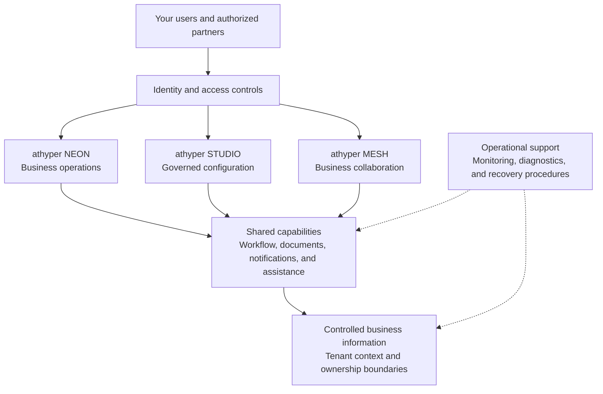
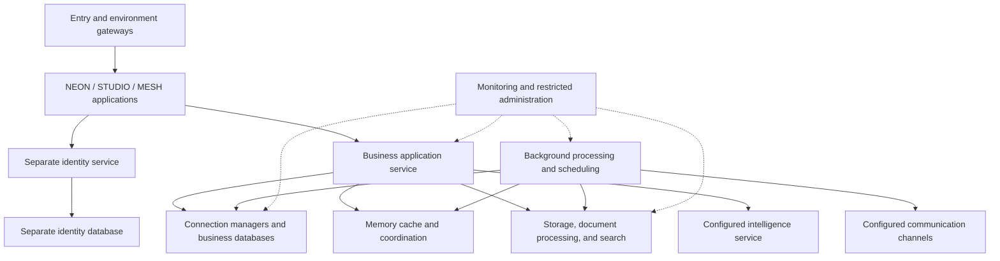

# athyper Robust Architecture

## Tenant Architecture Whitepaper

**A foundation for controlled business operations, trusted collaboration, and accountable growth**

**Edition:** September 2026  
**Audience:** tenant business leaders, enterprise architects, security teams, and implementation stakeholders

## Executive perspective

Business platforms hold more than records. They connect people, decisions, documents, and relationships that organizations depend on every day. Their architecture must support clear ownership of information, appropriate access, controlled change, and an understandable record of what happened.

athyper brings these concerns together through three coordinated business environments: **NEON** for business operations, **STUDIO** for governed configuration, and **MESH** for collaboration. Shared capabilities support identity, authorization, documents, workflow, monitoring, and background processing across these environments.

The architecture emphasizes five outcomes:

- **Separation of tenant information:** access is evaluated within an explicit organization and tenant context, with additional controls at the data layer.
- **Accountable business change:** governed processes connect proposals, evidence, decisions, and accepted records.
- **Controlled collaboration:** information received from another organization remains subject to the receiving organization's acceptance process.
- **Operational visibility:** monitoring, diagnostic records, and processing status help operators distinguish completed work from work that needs attention.
- **Managed evolution:** versioned definitions and controlled releases support changes to business processes and platform capabilities.

This whitepaper describes the architectural approach. Available capabilities depend on the selected services, configuration, and deployment qualification. Hosting commitments, service levels, retention, and recovery objectives are defined for the tenant's agreed service arrangement.

## 1. One platform, three clear responsibilities

athyper separates business execution, configuration, and collaboration so that each has a clear owner.

| Business environment | Purpose                                                                                         | Value for tenants                                                                               |
| -------------------- | ----------------------------------------------------------------------------------------------- | ----------------------------------------------------------------------------------------------- |
| **athyper NEON**     | Supports tenant business operations and accepted operational records.                           | Provides the business environment in which authorized users manage their organization's work.   |
| **athyper STUDIO**   | Governs business definitions, policies, configuration, and their publication.                   | Supports controlled changes to how business information is collected and processed.             |
| **athyper MESH**     | Supports relationships and structured information exchange between participating organizations. | Enables collaboration while preserving the receiving organization's authority over its records. |

These environments work together without making their responsibilities interchangeable. A configuration administrator does not acquire authority to approve a supplier merely by publishing a form. An external partner does not acquire access to tenant business records merely by establishing a relationship.

For example, a supplier may provide information through MESH. The receiving organization evaluates that information through its governed process before accepting it into NEON. STUDIO supplies the applicable published definitions and rules.

The diagram describes business responsibilities. It does not imply dedicated physical infrastructure for each tenant or independent availability for every environment.

## 2. Tenant information has an explicit boundary

A tenant is an organization's application data and access context within athyper. Tenant-owned records are associated with that context, and ordinary business operations are evaluated against it.

The architecture combines application authorization with data-layer tenant controls. Application checks determine whether an action is permitted; data-layer controls restrict which tenant records an ordinary runtime operation can access or change.

Users may also need narrower access within a tenant. Legal entities, company codes, organizational units, and other business scopes provide additional context for relevant permissions. Membership in a tenant does not automatically establish access to every function or every business record.

The three business environments have separate application databases. Tenants within an environment use shared data structures with tenant-scoped access. This provides logical tenant separation; it should not be understood as a dedicated database or server for every customer.

Administrative and support access follows a distinct privileged boundary. Tenant separation must therefore be considered together with the applicable operational access arrangements, role assignments, and oversight procedures.

**Tenant implication:** shared platform capabilities can serve multiple organizations while access remains tied to a defined tenant and business context.

## 3. Trusted identity and controlled access

athyper treats identity verification and permission to act as separate decisions.

Signing in establishes who the user is. The platform then resolves the selected tenant context, the user's local identity, and the applicable permissions. Sensitive business operations may also require a particular scope, policy condition, or level of assurance.

| Access question                            | Architectural response                                        |
| ------------------------------------------ | ------------------------------------------------------------- |
| Who is the user?                           | Verify the sign-in identity and session.                      |
| Which organization is the user acting for? | Resolve the selected tenant and application context.          |
| What may the user do?                      | Evaluate applicable permissions and business scope.           |
| Is the action valid now?                   | Apply the relevant policy, record state, and version checks.  |
| Which information may be accessed?         | Enforce applicable record, document, and data-layer controls. |

Browser sessions use a controlled server-side access boundary. User-supplied identity details are not accepted as independent proof of authority. Selecting a different context requires validation of that context rather than combining unrelated permissions.

Visible menus and buttons help users navigate, but the platform evaluates the underlying operation when it is requested. This matters equally for browser actions and enabled system integrations.

### Separate identity and access management support

A dedicated identity and access management (IAM) service supports sign-in independently of the business applications. Identity-provider records are held separately from the three business application databases. This establishes a clear operational boundary between authentication and business data.

The shared identity service supports access to the NEON, STUDIO, and MESH experiences. Each experience still resolves its own tenant membership and business permissions. A recognized identity in one environment does not automatically receive equivalent access in another.

Browser session management complements this service by handling session validity, context selection, renewal, and sign-out. Identity-service health, session availability, and business authorization are monitored and evaluated as distinct concerns. The shared service does not imply a dedicated IAM deployment for every tenant or independent availability for each application.

**Tenant implication:** a successful login starts an access evaluation; it does not grant unrestricted business authority.

## 4. Business changes follow a governed lifecycle

A business record often needs more than a save action. A new supplier, for example, may require supporting documents, validation, review, and a decision before becoming operational.

athyper's governed lifecycle separates proposed information from accepted business state. Its architectural pattern connects:

1. **Published requirements:** an identifiable definition of the information and rules that apply.
2. **Draft and evidence:** proposed information and supporting documents.
3. **Validation:** checks for completeness, consistency, conflicts, and applicable conditions.
4. **Review and decision:** authorized review under the configured process.
5. **Acceptance into business records:** controlled application of the approved change.
6. **Readiness and activation:** any additional conditions required before operational use.
7. **Subsequent change:** further updates processed through the applicable controls.

A case, a review task, a document, and an operational record have separate states. Approving a case does not necessarily complete every activation requirement. Generating a document does not constitute approval of its contents.

Published definitions can be associated with the cases that use them, making it possible to identify which requirements applied to a particular submission. Evidence and recorded outcomes help distinguish successful changes from rejected, conflicting, or repeated requests.

This pattern guides the platform's governed services. The precise steps, automated bindings, and entry channels available for a tenant depend on the implemented and enabled business process.

**Tenant implication:** business teams can distinguish what was proposed, what was decided, and what became an accepted record.

## 5. Collaboration preserves your acceptance authority

Cross-organization collaboration creates value when information can move without removing the recipient's controls.

MESH supports structured relationships and information exchange. Receiving information is separate from accepting a business change. A partner's identity, disclosed profile, or requested relationship does not automatically grant access or create an approved operational record.

This distinction is especially important where an organization is both a supplier and a customer. Those commercial roles can relate to one Business Partner while retaining their own business requirements. People supplied by a partner follow separate person and engagement processes.

Collaboration also has operational stages. Information may be submitted, received, validated, accepted, or rejected at different times. Recorded processing outcomes and reconciliation help make incomplete exchanges visible.

**Tenant implication:** external participation can support your processes while your organization retains authority over acceptance and use of the resulting information.

## 6. Communication channels connect events to people

athyper's communication capability connects business events with the people who need to act or stay informed. Configured routes select the relevant message, recipients, and delivery channels.

| Channel                                   | Typical role                                                        |
| ----------------------------------------- | ------------------------------------------------------------------- |
| **In-application notifications**          | Updates and work prompts within the business experience             |
| **Email**                                 | Review invitations, business updates, and authorized document links |
| **Text messages**                         | Short alerts and contact-related messages for enabled journeys      |
| **Business messaging**                    | Messages through an enabled business messaging channel              |
| **Browser and mobile push notifications** | Timely prompts to enrolled browsers or devices                      |
| **System callbacks**                      | Event notifications sent to an approved receiving system            |

These are supported channel categories, not a commitment that every channel is enabled for every tenant or event. Delivery requires the applicable routing rules, templates, recipients, credentials, consent, and enrollment. Channel-specific preferences and policies affect which messages are sent.

The delivery path distinguishes a business event, a planned message, an attempted delivery, and the available delivery outcome. Failed attempts can enter the applicable retry or operator-review process. A business change may be complete while its notification remains pending.

Messages can direct recipients to an authenticated task, case, or document. Receiving or opening a message does not approve a transaction, grant document access, or establish that a person has acknowledged its contents. Incoming replies are not automatically treated as authorized business commands.

Communication planning and delivery run through the platform's application and background-processing services. External delivery connections are configured separately. An optional non-production message-capture service supports delivery testing before a channel is put into use.

**Tenant implication:** communication can follow business events across the enabled channels, with clear recipient rules and visibility into delivery outcomes.

## 7. Documents remain connected to business context

Documents support decisions, but storing a file is only one part of managing it.

athyper separates file content from the business information that describes its version, entity relationship, processing state, and access requirements. Supporting capabilities include malware inspection, content extraction, document generation, and controlled retrieval.

| Concern                  | Architectural treatment                                                    |
| ------------------------ | -------------------------------------------------------------------------- |
| Business association     | Link documents to the relevant entity or process.                          |
| Version and evidence     | Retain identifiable file references and applicable history.                |
| Processing status        | Distinguish upload, inspection, extraction, and generation outcomes.       |
| Retrieval and disclosure | Evaluate applicable access before providing protected content.             |
| Published artifacts      | Use a separate storage and writer boundary for retained release artifacts. |

An uploaded file should not be interpreted as successfully inspected or approved. Likewise, a notification about a document is not proof that the recipient may access it.

Storage protections, retention periods, encryption arrangements, and recovery coverage depend on the qualified deployment and the tenant's service requirements. These arrangements must be considered together with business-record recovery so that restored records still refer to the correct document content.

### Object storage with distinct responsibilities

athyper uses a dedicated object-storage capability for file content. Business records retain the references and access context needed to locate and use that content. This separation allows file processing and storage to be managed alongside the business lifecycle without placing large file content directly into operational records.

| Storage area            | What it holds                                                  | Control emphasis                                                           |
| ----------------------- | -------------------------------------------------------------- | -------------------------------------------------------------------------- |
| **Business documents**  | Uploaded and generated files associated with business activity | Authorized retrieval, version references, and applicable processing checks |
| **Published artifacts** | Released definitions and retained generated artifacts          | A separate writer identity with restricted deletion rights                 |
| **Transfer files**      | Import, export, and exchange files                             | Controlled transfer state and applicable expiry or cleanup rules           |

Storage initialization establishes the required areas and policies. A restricted storage administration interface can support operations where enabled. Depending on the deployment, file content is served by a containerized storage service or a separately provisioned managed storage service; it is not necessarily stored inside the application containers.

Access to a storage location does not replace business authorization. Retention and deletion rules must also account for the associated business records, evidence, and recovery requirements.

**Tenant implication:** files participate in an accountable business process rather than becoming disconnected attachments.

## 8. Reliable processing makes incomplete work visible

Some activities can complete during a user's request. Others take longer or depend on another system: document generation, notifications, scheduled work, and information exchange are common examples.

athyper separates interactive business operations from background processing. Governed services can commit a business change together with a durable record of the follow-up work it requires. Background services then process the applicable work and record its outcome.

This separation helps distinguish two important facts: the business change was accepted, and a downstream activity has completed. A supplier submission can be recorded while a related notification remains pending.

Repeated or interrupted work requires explicit handling. The architecture uses request identities, recorded outcomes, and reconciliation patterns to support controlled retries. The exact retry behavior depends on the business capability and any external service involved.

The platform does not assume that every external action completes once and only once. Recovery must account for situations where a remote action succeeds but confirmation is delayed or lost.

**Tenant implication:** pending or failed follow-up activity can be investigated without treating it as proof that the underlying business record was never saved.

## 9. Memory cache supports responsive access and coordination

A shared memory service supports fast access to selected frequently used information. Caching can reduce repeated retrieval or calculation, helping application services use their resources efficiently.

The same infrastructure also supports distinct session and background-work coordination needs. These uses have different lifecycles: a cached copy, an active session, and pending work cannot all be treated as disposable data.

| Use                              | Purpose                                                          | Architectural boundary                                                      |
| -------------------------------- | ---------------------------------------------------------------- | --------------------------------------------------------------------------- |
| **Application cache**            | Reuse selected information without repeating all underlying work | Relevant expiry and invalidation rules determine when it must be refreshed. |
| **Session support**              | Maintain server-side browser session state                       | Session validity and access context remain subject to identity controls.    |
| **Background-work coordination** | Coordinate queued work and processing ownership                  | Pending work requires its own persistence, retry, and recovery treatment.   |
| **Operational coordination**     | Support scheduling ownership and applicable request controls     | Coordination state does not replace durable business evidence.              |

Tenant-sensitive cached information must retain the relevant tenant and access context. Cached values do not become the authority for business records merely because they can be retrieved quickly. Changes to permissions or configuration require the applicable refresh or invalidation behavior.

The memory service is an operational dependency. Its loss may affect session access or background processing as well as cache performance; recovery is evaluated for each use rather than assuming that clearing all memory is harmless.

**Tenant implication:** the platform has a dedicated mechanism for efficient repeated access and coordinated processing, with correctness and recovery responsibilities kept explicit.

## 10. Operational visibility supports service management

athyper's operations architecture brings together complementary views of service behavior.

| Capability                          | What it helps operators understand                               |
| ----------------------------------- | ---------------------------------------------------------------- |
| **Service health monitoring**       | Whether processes and their required dependencies are available. |
| **Centralized operational records** | Events and errors relevant to diagnosis.                         |
| **Request tracing**                 | How an operation moves through participating services.           |
| **Performance monitoring**          | Resource use, response behavior, and processing pressure.        |
| **Background-work monitoring**      | Pending work, repeated failures, and processing delays.          |
| **Alert routing**                   | Conditions that require operational attention.                   |

These capabilities answer different questions. A running application does not prove that a document service is available. A healthy sign-in experience does not prove that background notifications are being delivered.

Business audit evidence also has a different purpose from diagnostic records. Business evidence explains actions and decisions; operational diagnostics help investigate service behavior. Tenant access to reports, dashboards, and evidence is determined by the agreed service scope and permissions.

**Tenant implication:** support teams have architectural mechanisms for investigating the affected activity and its dependencies, rather than relying only on whether a login page opens.

## 11. Recovery and growth require measured planning

The architecture supports separately operated interactive, background, and scheduled processing. This creates options for allocating capacity according to workload. Shared data services and other dependencies still influence overall performance and availability.

Capacity planning should reflect the tenant's actual workload: concurrent users, transaction volume, document sizes, reporting activity, scheduled processing, and integration demand. A modular architecture provides deployment options; measured qualification establishes whether a selected configuration meets the requirement.

Recovery similarly involves more than restoring business tables. Documents, access configuration, pending work, and external processing outcomes must also be considered. The platform's database recovery tooling supports restoration into an isolated environment for verification before a controlled cutover.

The appropriate service arrangement should define:

- Availability and support expectations.
- Acceptable data loss and recovery time objectives.
- Backup scope, retention, and restore testing.
- Hosting location and relevant data-location requirements.
- Capacity assumptions and how material growth will be evaluated.

These are deployment and service commitments. This whitepaper does not assign numerical guarantees to them.

**Tenant implication:** resilience and growth are assessed against your operational needs and demonstrated recovery behavior.

## 12. Controlled evolution protects business continuity

Business requirements change. New information may be required, approval rules may evolve, and integrations may be added.

STUDIO provides the authoring and publication boundary for governed definitions and configuration. Versioned releases help identify what a receiving environment applies and what a business case depends on.

Platform delivery also includes release identification, component security checks, and validation of the selected deployment. Data compatibility is a separate consideration: a software release may require a reviewed data change, a new published definition, or updated service configuration.

Fresh environment setup and updates to an existing environment follow different paths. An existing tenant's data requires compatibility planning and applicable upgrade validation.

**Tenant implication:** changes to business behavior and platform software can be evaluated as identifiable releases with defined deployment requirements.

## 13. Atlas AI: business assistance with accountable evidence

**athyper Atlas AI** is the platform's assistance layer for supported business experiences. It helps users understand information, prepare work, and interpret available business evidence within the context of their current activity.

Atlas connects assistance to registered business capabilities and authorized information. Its scope depends on the enabled entity, the user's permissions, published configuration, and the capabilities qualified for the selected deployment. Business Partner is a reference use case; support should be established separately for additional business domains.

### Context-aware assistance

A business question often depends on which record, organization, company, role, or list the user is viewing. Atlas can receive a validated description of that context so that a question relates to the intended work.

For example, a question about a selected supplier should remain tied to that supplier and the applicable business scope. A question about a filtered list should not silently become a statement about every record in the tenant.

The platform validates the requested context before using registered business capabilities. Changing the working context prevents a late answer from the previous context from appearing as the result for the new one. Where an assessment uses saved information, unsaved edits are not treated as accepted business facts. Historical views also require distinct handling rather than applying current-state actions to past records.

### Practical assistance capabilities

| Capability                       | How it supports users                                                                                   | Boundary                                                                                     |
| -------------------------------- | ------------------------------------------------------------------------------------------------------- | -------------------------------------------------------------------------------------------- |
| **Business summaries**           | Present a concise view of information available for an admitted record or supported selection.          | Coverage remains limited to the authorized information and supported scope.                  |
| **Completeness explanations**    | Explain disclosed requirements and findings for saved business information.                             | Completeness is distinct from approval, activation, or permission to transact.               |
| **Eligibility explanations**     | Present an available business-service decision for a specified role, organization, operation, and date. | The owning business service determines eligibility; AI does not invent the decision.         |
| **Saved-case explanations**      | Explain supported saved validation results and disclosed changes between case versions.                 | Unevaluated or partial evidence cannot establish that the entire case is valid or unchanged. |
| **Document-grounded assistance** | Retrieve relevant content from enabled, processed, and authorized knowledge sources.                    | Coverage depends on source readiness and the qualified retrieval path.                       |
| **Drafting and preparation**     | Help users formulate questions, explanations, or supported proposals.                                   | Generated content requires review before it is relied upon or submitted.                     |
| **Guided next steps**            | Present an available action proposal or direct attention to missing context.                            | Only registered, currently authorized actions can enter the controlled execution path.       |

The table describes available architectural capabilities, not universal activation. A tenant's enabled journeys determine which assessments, sources, and actions are usable.

### Evidence-linked answers and visible limits

For supported structured answers, Atlas presents references to the business evidence used in the response. Available source details can include the observed record or revision, the time of observation, and the scope of the assessment.

Business facts, counts, statuses, and action availability come from validated business-service results. Generated prose helps explain those results; it does not create new business authority. A response based on partial evidence must remain distinguishable from a complete assessment.

Missing context, unavailable sources, and unevaluated requirements are meaningful outcomes. Atlas should ask for the necessary scope or indicate the limitation rather than presenting a confident conclusion unsupported by the available evidence. An interrupted response is not treated as a completed answer.

For example, “the disclosed saved-data requirements are complete” does not mean “this supplier is approved for payment.” Payment eligibility requires its own business scope and decision.

### Document knowledge and access boundaries

Document assistance depends on an enabled retrieval process that makes eligible content available for the supported experience. Uploading a document does not automatically make its contents searchable by Atlas. Inspection, extraction, source configuration, indexing, and applicable access checks affect readiness.

Knowledge retrieval must preserve the relationship between content and its owning business record. A similar search result is not proof of permission to disclose the source. Broader retrieval coverage requires qualification of record, document, and relevant field-access boundaries.

For supported evidence-backed conversation replay, current access and source state are checked again. A saved answer is not a permanent access grant, and changed permissions or evidence may prevent its previous contents from being replayed.

### Human control over business actions

For governed Business Partner processes, Atlas has no authority to approve, merge, activate, or grant access. Those decisions remain within the established business controls.

Where a supported action proposal is enabled, the user reviews and explicitly confirms it. The owning service then rechecks permissions, the exact target, the record version, and applicable policy before executing the command. Explaining a saved validation result does not run a new validation or submit the case.

This preserves separate responsibilities: Atlas assists with understanding and preparation, the user confirms a permitted proposal, and the business service determines whether execution is valid.

### Deployment, oversight, and improvement

Atlas can use locally configured intelligence or an approved external inference connection, depending on the deployment. These options have different capacity, data-processing, and operating requirements. The selected arrangement must establish which information may be processed, where processing occurs, and the applicable conversation and diagnostic retention rules. Local inference is an available option, not a claim that every Atlas request remains within the tenant's environment.

Operational records support investigation of runs, registered capability calls, execution outcomes, and applicable usage. Qualification should assess the intended tasks, answer quality, disclosure behavior, source coverage, response time, and failure handling. A working assistance interface alone does not establish readiness for every business use case.

A broader feedback-to-improvement workflow is an architectural direction under development. Feedback does not automatically change active business rules, published definitions, or model behavior. Any proposed improvement requires the applicable review, evaluation, and release process; autonomous self-learning is not a service commitment in this whitepaper.

**Tenant implication:** Atlas AI can help users prepare and understand their work with business context and inspectable evidence, while access, decisions, and execution remain governed by the owning services.

## 14. Containerized services have defined responsibilities

A container packages a running service with the components it needs. athyper organizes its deployment into services with identifiable responsibilities, allowing operators to configure, observe, and maintain the selected service groups.

The following catalogue covers the platform's documented container roles using capability names. Some rows group multiple containers with related responsibilities. Communication channels and business capabilities can run within shared application services; each capability does not necessarily have its own container.

### Access and application services

| Container role                              | Responsibility                                                                    |
| ------------------------------------------- | --------------------------------------------------------------------------------- |
| **Shared entry gateway**                    | Direct incoming traffic to the selected environment.                              |
| **Environment gateway**                     | Route traffic to the appropriate application and service within that environment. |
| **Shared and environment outage pages**     | Provide a controlled response during configured maintenance or unavailability.    |
| **NEON, STUDIO, and MESH web applications** | Deliver the three business experiences through separate application containers.   |
| **Business application service**            | Process authenticated requests, business queries, and governed commands.          |
| **Background processing service**           | Execute eligible queued work, including document and communication activities.    |
| **Scheduling service**                      | Coordinate configured recurring and scheduled work.                               |
| **Identity service**                        | Provide the separate authentication boundary used by the business experiences.    |

### Data and content services

| Container role                             | Responsibility                                                                                    |
| ------------------------------------------ | ------------------------------------------------------------------------------------------------- |
| **Business and identity database service** | Host the separate application and identity databases in the documented shared-service deployment. |
| **Transaction connection manager**         | Reuse database connections for ordinary transactional application work.                           |
| **Session connection manager**             | Support configured clients that require a persistent database session.                            |
| **Memory cache and coordination service**  | Support caching, session infrastructure, and background-work coordination.                        |
| **Object-storage service**                 | Serve document, artifact, and transfer content in deployments using local storage.                |
| **Malware inspection service**             | Inspect eligible file content before downstream use under the applicable processing rules.        |
| **Document generation service**            | Produce formatted documents from authorized generation requests.                                  |
| **Document extraction service**            | Extract usable content from supported files.                                                      |
| **Search service**                         | Maintain and query derived search information for enabled experiences.                            |
| **Local intelligence service**             | Execute locally configured assistance models where that deployment option is selected.            |

### Monitoring and administration services

| Container role                                             | Responsibility                                                                     |
| ---------------------------------------------------------- | ---------------------------------------------------------------------------------- |
| **Metrics collection service**                             | Collect service and resource measurements.                                         |
| **Memory-service metrics exporter**                        | Make memory-service measurements available to monitoring.                          |
| **Operational record service**                             | Store and query diagnostic records.                                                |
| **Operational data collection service**                    | Collect and forward logs and other operational signals.                            |
| **Request trace service**                                  | Retain request-path information for investigation.                                 |
| **Alert routing service**                                  | Route configured operational alerts.                                               |
| **Operational dashboard service**                          | Present the selected monitoring views.                                             |
| **Availability monitoring service**                        | Probe configured endpoints for availability.                                       |
| **Secrets management service**                             | Support controlled operational-secret management where enabled.                    |
| **Protected publication connection service**               | Protect the publication service's connection to the configured secrets service.    |
| **Analytics workspace**                                    | Support configured analytical access and reporting.                                |
| **Database, queue, and storage administration interfaces** | Provide separate restricted operator tools where enabled.                          |
| **Test message-capture service**                           | Inspect non-production email delivery without treating it as live tenant delivery. |

Monitoring services may be selected at environment level or through the shared operations environment. Optional administration tools are operator capabilities; their inclusion here does not imply tenant access or public exposure.

### Initialization and release tasks

| Container role                                          | Responsibility                                                          |
| ------------------------------------------------------- | ----------------------------------------------------------------------- |
| **Database initialization task**                        | Establish the required database foundations and identities.             |
| **Fresh database setup task**                           | Apply the approved definition to an empty application database.         |
| **Database upgrade task**                               | Apply the applicable reviewed changes to a supported existing baseline. |
| **Database baseline task**                              | Maintain the applicable upgrade baseline records.                       |
| **Object-storage initialization task**                  | Establish required storage areas and reconcile initialization policies. |
| **Search-access initialization task**                   | Establish the search service's required access configuration.           |
| **Secrets and analytics database initialization tasks** | Prepare database support for the respective optional services.          |

Initialization and release tasks run for a bounded purpose rather than continuously serving business requests. Their presence does not establish that an upgrade or optional capability is applicable to every deployment.

The diagram groups responsibilities for readability. Communication endpoints and managed services can operate outside the container environment. Separate containers do not by themselves guarantee independent failure domains, dedicated tenant infrastructure, or automatic scaling.

**Tenant implication:** the platform's supporting services have identifiable operational roles, making the selected deployment easier to assess and maintain.

## 15. Aligning the architecture with your organization

A tenant implementation translates these architectural capabilities into a defined operating arrangement.

| Planning area             | Decisions to establish                                                                                                              |
| ------------------------- | ----------------------------------------------------------------------------------------------------------------------------------- |
| Organization structure    | Tenant context, legal entities, operational units, and business scopes                                                              |
| User access               | Identity arrangements, roles, administrative responsibilities, and access review                                                    |
| Governed processes        | Required information, evidence, reviewers, decisions, and activation conditions                                                     |
| Collaboration             | Participating organizations, permitted disclosures, and receiving acceptance rules                                                  |
| Documents and information | Classification, access, retention, and recovery requirements                                                                        |
| Communication channels    | Enabled channels, routing, recipients, consent, enrollment, and delivery support                                                    |
| Integrations              | Approved connections, ownership, failure handling, and reconciliation                                                               |
| Operations                | Service levels, support responsibilities, monitoring, capacity, and recovery objectives                                             |
| Atlas AI                  | Enabled use cases, authorized knowledge sources, action boundaries, processing location, retention, and task-specific qualification |
| Enabled capabilities      | Selected business modules and the qualification needed for their use                                                                |

The resulting service definition establishes which capabilities are available to your organization and how they are configured. It also provides the appropriate place for contractual commitments and deployment-specific assurance evidence.

athyper's architecture connects tenant context, governed decisions, accepted records, and operational outcomes. That connection gives business and technology stakeholders a practical basis for evaluating how the platform will support their organization's work.
