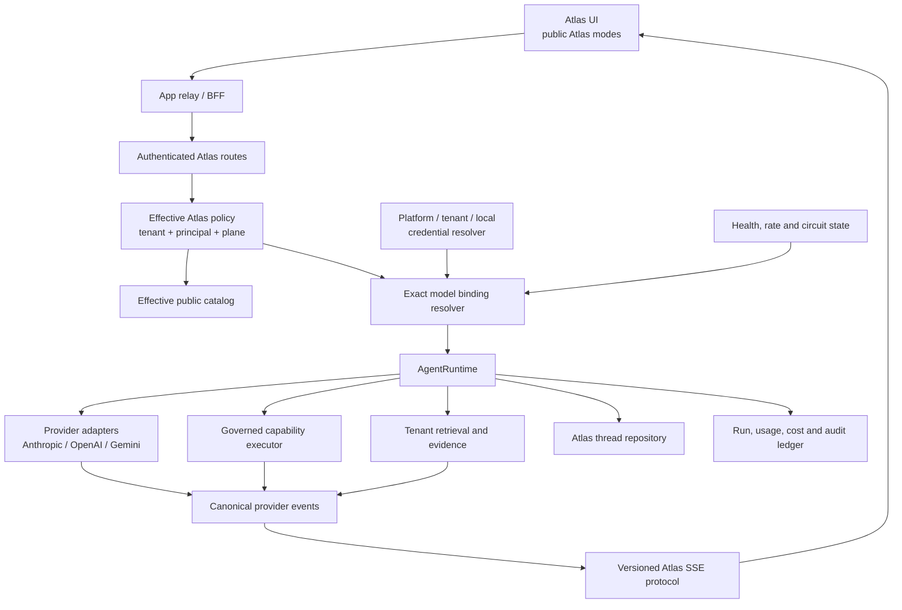
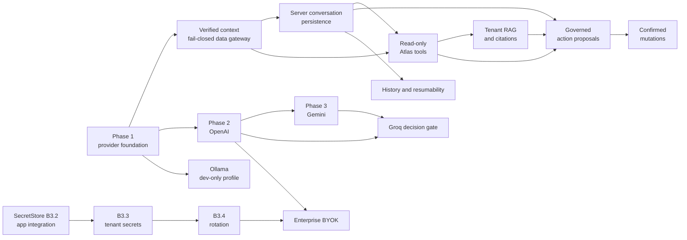

# Atlas agent provider and capability roadmap

**Plan date:** 2026-07-23

**Source snapshot:** Git `379883edd5d3123c5edb8392172eaad90b11fad4` plus the current uncommitted Atlas working tree

**Scope:** Phase 1 foundation hardening, Phase 2 OpenAI, Phase 3 Gemini, and the foundations required for optional Ollama, evidence-led Groq adoption, governed tools and actions, tenant RAG, server conversation persistence, and enterprise BYOK

**Related baseline:** [Atlas agent base holder](./atlas-agent-base-holder.md)

## Status snapshot — 2026-07-23

Phase 1 foundation work and the Phase 2 OpenAI adapter/configuration foundation
are present in the current working tree. The OpenAI surface remains a
default-off, internal diagnostic binding pinned to `gpt-5.6-sol`.

Phase 2 evaluation inputs are now prepared as the immutable
`atlas-openai-eval` version `1.0.0`: 200 synthetic cases, 25 in each required
category, plus a validator and regression test. See the
[Phase 2 OpenAI evaluation runbook](../runbooks/atlas-agent-phase2-openai-evaluation.md).

The Phase 7E server-conversation foundation is also implemented default-off:
three durable tables, owner/participant RLS, server-authoritative bounded
history, idempotent run/message persistence, guarded thread APIs, a gated
history client, and separately authorized retention maintenance. See the
[conversation persistence runbook](../runbooks/atlas-agent-conversation-persistence.md).
Tenant retention overrides, transcript export, audited support mode,
application-level content encryption, and production promotion remain open.

This status does **not** claim a live provider evaluation, model score,
Anthropic comparison, staff rollout, tenant pilot, two-week soak, or
account/project/region/privacy approval. Those remain open promotion gates.

## 1. Executive decision

Do not add another live provider to the current Atlas base until exact-model routing,
operational availability, usage metering, tenant-effective catalog resolution, and
provider conformance tests are in place.

The current platform is a useful base:

- `@athyper/atlas-agent-runtime` owns a browser-neutral protocol, canonical stream
  envelope, memory conversation reducer, and browser SSE transport.
- `@athyper/atlas-agent-ui` owns the panel, fullscreen prototype, composer, model
  picker, messages, and triggers.
- `@athyper/svc-ai` owns provider adapters, `AgentRuntime`, the existing governed
  `AIRuntime`, capability/autonomy/confidence services, rate limiting, feedback,
  and AI logging foundations.
- Neon mounts Atlas; Neon, Mesh, and Admin relays all recognize the long-lived
  Atlas stream.
- Environment, tenant feature flag, permission, rate-limit, plane, and session
  checks fail closed.

However, the current provider registry is provider-scoped while the catalog and
UI are model-scoped. One Anthropic provider instance can therefore be selected
through several advertised model IDs even though the upstream model is fixed at
bootstrap. The current completion envelope can then report the requested model
rather than the model actually invoked. That must be corrected before cost,
quality, billing, or provider comparisons are credible.

### Recommended program order

1. **Phase 1 — Foundation hardening:** make provider/model selection, telemetry,
   catalog policy, UI claims, and tests truthful.
2. **Phase 2 — OpenAI:** validate the internal Responses adapter, execute the
   versioned evaluation, and consider allowlisted pilots only after sign-off.
3. **Phase 3 — Gemini:** implement a genuinely different native provider contract
   and promote only after paid-tier, privacy, quality, cost, and reliability
   evaluation.
4. **Future capability tracks:** add Ollama, Groq, persistence, tools, RAG, and
   BYOK only through the contracts established in Phase 1.

No phase should be promoted merely because its adapter returns text. Promotion
requires the exit criteria in this plan.

## 2. Product and ownership decisions

### 2.1 Atlas is the product; providers are implementation details

The customer-facing product should default to:

- **Atlas Fast**
- **Atlas Balanced**
- **Atlas Best**

The internal catalog may map those public models to Anthropic, OpenAI, Gemini, or
a later approved provider. A provider/model diagnostic picker may remain behind
an internal evaluation permission and feature flag, but it should not define the
normal customer experience.

This separation gives Athyper freedom to change providers for quality, cost,
regional, resilience, or lifecycle reasons without changing saved customer
preferences or the product contract.

### 2.2 Athyper owns orchestration and conversation state

Atlas should not make a provider's response/thread ID its authoritative history.
Each request is constructed from Athyper-owned state and sent through a selected
model binding. Provider-native IDs are diagnostic metadata only.

For OpenAI, use the Responses API as a stateless streamed invocation with
`store: false`; Atlas supplies the required history and retains no dependency on
provider-side conversation state. OpenAI documents Responses streaming as typed
SSE events and documents a default application-state retention period unless
storage is disabled. `store: false` is a useful request control but is not a
substitute for an approved organization-level data-retention configuration:

- [Streaming API responses](https://developers.openai.com/api/docs/guides/streaming-responses)
- [Conversation state](https://developers.openai.com/api/docs/guides/conversation-state)
- [Safety identifiers](https://developers.openai.com/api/docs/guides/safety-best-practices#implement-safety-identifiers)
- [OpenAI API data controls](https://developers.openai.com/api/docs/guides/your-data#v1responses)

### 2.3 Credentials remain server-side

The browser never receives provider credentials. The initial product uses
Athyper-managed provider projects and charges customers through Atlas metering.
Enterprise BYOK later introduces tenant-owned secret references, not customer
logins to ChatGPT, Claude, or Gemini consumer products.

### 2.4 No silent provider or credential fallback

If a tenant is bound to a specific provider, region, data policy, or BYOK
credential, a failure must not silently move the request to another provider or
to an Athyper platform key. Fallback is permitted only when an explicit,
auditable tenant routing policy authorizes the alternative.

### 2.5 Content is not telemetry

Operational and billing records store identifiers, versions, timings, token
usage, cost attribution, policy decisions, and outcome codes. They do not store
raw prompts or responses by default. Any future content retention must be an
explicit tenant policy with encryption, access controls, retention, deletion,
and legal review.

## 3. Target architecture



### 3.1 Public model versus upstream model

Introduce an exact binding similar to:

```ts
interface AtlasModelBinding {
  publicModelId: string;             // atlas-fast
  providerId: string;                // anthropic | openai | gemini
  upstreamModelId: string;           // exact provider model identifier
  adapterId: string;                 // adapter implementation/version
  displayTier: "fast" | "balanced" | "best";
  status: "available" | "restricted" | "disabled";
  capabilities: AtlasModelCapabilities;
  credentialPolicy: "platform" | "tenant_optional" | "tenant_required" | "local";
  dataHandlingProfileId: string;     // retention, region, egress, classification
  routingPolicyId: string;           // fallback and residency policy
  allowedDataClasses: readonly string[];
  allowedRegions: readonly string[];
  priceVersion: string;
  inputPricePerMtokUsd: number | null;
  outputPricePerMtokUsd: number | null;
}
```

The client sends only an allowed public model ID. The server resolves the exact
binding after authenticating the tenant, principal, and plane.

### 3.2 Canonical provider contract

Evolve `IModelProvider` so an invocation receives the resolved upstream model,
not a provider instance with one hidden bootstrap model:

```ts
interface ProviderInvocation {
  binding: AtlasModelBinding;
  prompt: ModelPrompt;
  tools?: readonly ProviderToolDefinition[];
  signal?: AbortSignal;
  trace: {
    runId: string;
    tenantId: string;
    principalHash: string;
    promptVersion: string;
  };
}
```

The provider event stream must represent:

- provider response started, including provider request ID and actual model;
- text delta;
- refusal or safety block;
- tool-call start, argument delta, and completed input;
- usage, including whether each update is an absolute snapshot or a delta and
  provider-supported cache/reasoning fields;
- completed with normalized finish reason;
- failed with normalized error class, retryability, and optional `retryAfter`;
- cancellation and truncated/incomplete stream.

Provider-native event objects must not cross the adapter boundary.

Request builders remain provider-specific. Do not apply one global set of
generation parameters such as `temperature`, `top_p`, or `top_k`: a binding may
use only parameters certified for that exact upstream model.

### 3.3 Normalized provider errors

Use stable error classes:

- `authentication`
- `permission`
- `invalid_request`
- `model_unavailable`
- `rate_limited`
- `quota_exhausted`
- `overloaded`
- `timeout`
- `safety_block`
- `stream_incomplete`
- `protocol_error`
- `upstream_error`
- `cancelled`

Raw provider error text may be recorded in restricted operational logging after
redaction, but it must not be streamed directly to users.

Normalize terminal reasons independently from errors:

- `stop`
- `length`
- `tool_call`
- `content_filter`
- `refusal`
- `cancelled`
- `incomplete`
- `error`

### 3.4 Canonical request context and data gateway

Before persistence, RAG, or tools, make the Atlas route consume the platform's
[`VerifiedRequestContext`](../../server/packages/services/iam/permission-context/verified-request-context.ts)
rather than reconstructing identity and scope locally.
Every downstream call must receive:

- verified tenant, principal, and plane;
- permission/profile snapshot hash;
- company, legal-entity, and organization scope;
- request, correlation, and idempotency IDs;
- authentication epoch for stale-session detection.

Introduce an internal `AtlasDataGateway`. Tools and retrieval must use this
gateway instead of querying application tables or generic relay routes. It:

1. resolves the canonical entity execution descriptor;
2. checks the exact read/action permission;
3. applies tenant, visibility, company, and extended scopes;
4. applies field-security masking;
5. returns immutable source identity/version metadata; and
6. fails closed when permission, scope, masking, or metadata resolution fails.

This is stricter than a normal UI read path because data already sent into model
context cannot be recalled after a later authorization correction.

## 4. Phase 1 — Foundation hardening

### Objective

Turn the current local Atlas implementation into a reviewable, provider-correct,
metered, policy-driven baseline. Phase 1 does not add a second live provider.

### F1. Establish a controlled baseline

1. Inventory and separate Atlas changes from unrelated working-tree changes.
2. Update `atlas-agent-base-holder.md` to match what actually ships.
3. Decide whether fullscreen and the provider picker are part of the base or
   experimental. The recommended base is the panel only.
4. Record the exact package, DB seed, relay, Compose, and application changes in
   the baseline review.
5. Land the base as a deliberate reviewed change before starting provider work.

**Required correction:** the fullscreen prototype currently claims a 30-day
conversation lifetime even though conversations are memory-only and clear on
reload. Remove that statement until server persistence exists. Remove or
complete the dead AI Notice link.

### F2. Replace provider-scoped lookup with exact model binding

1. Add `AtlasModelBinding` to the server/runtime contract.
2. Change `ProviderRegistry` to resolve a binding and adapter together.
3. Pass `upstreamModelId` on every provider invocation.
4. Record the provider-returned actual model/version.
5. Record actual provider/model metadata in internal logs and the append-only
   ledger; public `run.started` and `run.completed` expose only Atlas modes.
6. Reject a response whose actual model conflicts with the resolved binding
   unless the binding explicitly permits a provider alias.
7. Add regression tests proving that selecting two models from the same provider
   invokes two different upstream model IDs.

### F3. Make availability and capabilities truthful

1. Do not register unimplemented OpenAI or Gemini stubs as operational adapters.
2. Define adapter states: `implemented`, `credentialed`, `healthy`, and
   `eligible`.
3. Derive `AgentRuntime.available` from at least one eligible exact binding.
4. Derive the effective catalog from eligible bindings plus tenant policy.
5. Advertise tools, vision, structured output, and context limits only when the
   complete Atlas path supports them.
6. Keep `tools: false` and `vision: false` for the conversational base.
7. Add a generic provider icon/label fallback so future providers do not require
   changing a closed TypeScript union in several packages.

### F4. Resolve catalog policy per request

The model endpoint and run endpoint must use the same effective catalog resolver.
Remove the bootstrap-wide catalog from `AgentRuntime`.

The resolver should intersect:

1. global environment and release flags;
2. adapter implementation and health;
3. credential availability;
4. tenant entitlement and provider allow/deny policy;
5. principal permission;
6. plane;
7. requested capability;
8. permitted region and data classification;
9. tenant budget/rate policy;
10. rollout percentage or pilot allowlist.

Return a policy revision with the catalog. The run request may include the
revision, allowing the server to reject a stale selection cleanly and return a
new default.

### F5. Normalize configuration and secrets

1. Replace the ambiguous split between `ATLAS_AGENT_MODEL` and
   `ATLAS_AGENT_DEFAULT_MODEL_ID`.
2. Validate Atlas configuration through the existing server configuration
   layer, not ad hoc `Number(process.env...)` calls.
3. Keep provider secrets out of app/browser environment files.
4. Evolve `SecretResolver` behind a `ProviderCredentialResolver` interface that
   can later support:
   - platform environment/vault secret;
   - tenant vault reference;
   - local Ollama profile without a secret.
5. Resolve a request-scoped credential lease only after an exact binding and
   verified tenant context are selected. Pass the secret only to the adapter;
   pass fingerprint metadata only to the ledger.
6. Emit only secret-reference metadata and credential fingerprints; never log
   raw keys.
7. Add readiness checks that distinguish disabled, missing credential,
   unauthorized credential, and unhealthy provider.

Recommended initial configuration concepts:

```text
ATLAS_AGENT_ENABLED
ATLAS_AGENT_DEFAULT_PUBLIC_MODEL
ATLAS_AGENT_PROVIDER_TIMEOUT_MS
ATLAS_AGENT_STREAM_IDLE_TIMEOUT_MS
ATLAS_AGENT_MAX_OUTPUT_TOKENS
ATLAS_AGENT_USER_RUNS_PER_MINUTE
ATLAS_AGENT_TENANT_RUNS_PER_MINUTE
```

Provider-specific upstream model IDs belong in server-side bindings.

### F6. Add an Atlas run and usage ledger

Do not overload the current `log.ai_inference_log` without a schema decision: it
currently models action/prediction inference and expects a UUID model ID.

Prefer two append-only records so a future tool loop can make several provider
calls within one user-visible run:

- `log.ai_agent_run`: the Atlas turn, authorization/policy snapshot, aggregate
  outcome, aggregate billable units, retrieval/tool counts, and timestamps;
- `log.ai_agent_call`: one exact provider invocation, binding, provider request
  ID, actual model, usage, latency, retry, and provider cost.

At minimum the combined contract contains:

```text
run_id
call_id
tenant_id
principal_id
thread_id
client_request_id
plane
requested_public_model_id
binding_id
provider_id
actual_upstream_model_id
provider_request_id
adapter_version
credential_owner (platform / tenant / developer)
credential_reference_hash
data_handling_profile_id
provider_region
prompt_version
policy_revision
status
finish_reason
input_tokens
output_tokens
cache_read_tokens
cache_write_tokens
reasoning_tokens
provider_cost_usd
billable_units
price_version
started_at
first_token_at
completed_at
duration_ms
error_class
error_code
retry_count
retrieval_count
tool_call_count
```

Rules:

- content is excluded by default;
- each usage event declares absolute-snapshot versus delta semantics;
- provider usage is final only when the adapter marks it final;
- cost uses the price version effective at invocation time;
- cancellation and incomplete streams remain billable/observable outcomes;
- requested and actual models are separate;
- billing units are separate from provider cost;
- one run can aggregate multiple calls without losing call-level reconciliation;
- write failure emits an alert and cannot silently produce fabricated usage.

### F7. Finish the product shell contract

1. Keep the Neon panel as the base surface.
2. Register any shipped panel/fullscreen surface with the existing
   surface-stack controller for focus, Escape, z-index, and composition.
3. Hide provider/model diagnostics behind an internal permission and flag.
4. Present public Atlas modes to normal customers.
5. Remove vendor token prices from the customer UI; product pricing is not
   necessarily provider pass-through pricing.
6. Connect thumbs-up/down to the existing `/api/ai/feedback` route and capture
   the Atlas run/message target.
7. Add a real AI Notice route before exposing its link.
8. Continue showing the financial verification warning.
9. Keep history UI hidden until server persistence is implemented.
10. When tenant, principal, plane, or authentication epoch changes, abort the
    active stream, clear memory conversation and provider/catalog caches, then
    resolve a new effective catalog before another send.

### F8. Add deterministic provider and contract testing

Add a `FakeModelProvider` for unit and CI tests. It must support scripted:

- normal text completion;
- chunk boundaries split at arbitrary bytes;
- CRLF and LF framing;
- usage before or at completion;
- refusal;
- rate limit with retry-after;
- truncated stream;
- provider error after partial output;
- cancellation;
- tool-call deltas for future tests.

Create one provider conformance suite that every adapter must pass. It should
assert:

- exact model propagation;
- canonical event order;
- only one terminal event;
- valid usage semantics;
- cancellation closes upstream work;
- no raw provider error leaks;
- malformed JSON/SSE/NDJSON fails safely;
- retry never duplicates already-streamed text;
- provider capability declarations match test coverage.

### F9. Add route, policy, and UI tests

Required server route tests:

- environment disabled;
- tenant flag disabled;
- unauthenticated;
- unresolved tenant/principal;
- permission denied;
- plane mismatch;
- stale/denied model;
- no eligible provider;
- user and tenant rate limits;
- disconnect cancellation;
- heartbeat and terminal event;
- catalog and run resolver consistency;
- verified request context reaches runtime/data-gateway calls unchanged.

Required UI tests:

- catalog loading/failure;
- unavailable model fallback;
- no send before a public model is resolved;
- cancellation;
- truncated stream;
- feedback;
- surface-stack behavior;
- hidden internal provider controls;
- tenant/plane/auth-epoch change aborts the old stream and clears conversation
  state before a new catalog is used.

### F10. Add operational controls

Metrics:

- run count by public model, provider, result, tenant tier, and plane;
- time to first token;
- total duration;
- stream completion/truncation/cancellation rate;
- provider 4xx/429/5xx/timeout;
- token usage and estimated cost;
- binding mismatch;
- catalog denial reason;
- rate-limit scope;
- feedback ratio.

Operational safeguards:

- timeout and stream-idle timeout;
- concurrency limit per provider and tenant;
- circuit state per provider/model/region;
- no automatic retry after the first user-visible delta;
- bounded history, request body, output, and tool-loop budgets;
- global and tenant kill switches;
- a runbook for key revocation, provider outage, model retirement, and rollback.

### Phase 1 exit criteria

- Exact-model tests prove requested bindings invoke the correct upstream model.
- Requested and actual model IDs are visible separately in the run ledger.
- Unimplemented/uncredentialed adapters cannot make Atlas appear available.
- Catalog and run resolution use the same tenant-effective policy.
- The normal customer UI exposes Atlas modes, not raw provider choices.
- The shipped overlay is surface-stack compliant.
- Atlas feedback targets a real run/message.
- Scope changes cannot retain or stream a previous tenant's conversation.
- Verified request context and fail-closed data gateway contracts are ready for
  future persistence, RAG, and tools.
- The deterministic fake provider and shared conformance suite pass.
- Required route denial tests prove no upstream call is made.
- Focused package tests, server typecheck, relay tests, and an end-to-end Neon
  stream pass.
- All documentation and example environments match the final configuration.

## 5. Phase 2 — OpenAI provider

### Objective

Complete and validate the internal OpenAI adapter as a possible second hosted
provider while preserving Atlas-owned state, protocol, policy, and metering.
Adapter presence alone does not authorize a live evaluation or pilot.

### O1. Integration surface

Use the OpenAI Responses API with streaming enabled. Its semantic SSE events map
cleanly to the canonical provider contract:

- `response.created` -> provider response started;
- `response.output_text.delta` -> text delta;
- refusal events -> normalized refusal/safety event;
- `response.function_call_arguments.delta/done` -> future tool-call events;
- `response.completed` -> final usage, actual model, and finish state;
- `response.failed`, `response.incomplete`, or `error` -> normalized failure.

OpenAI documents the typed streaming lifecycle and warns that partial output is
harder to moderate:

- [Streaming API responses](https://developers.openai.com/api/docs/guides/streaming-responses)
- [Streaming moderation risk](https://developers.openai.com/api/docs/guides/streaming-responses#moderation-risk)

OpenAI's function-call stream provides call IDs and incremental JSON arguments,
which should be accumulated inside the adapter and emitted through the canonical
tool-call contract:

- [OpenAI function calling — streaming](https://developers.openai.com/api/docs/guides/function-calling#streaming)

### O2. State and retention

1. Send `store: false`.
2. Do not use provider conversation objects or `previous_response_id` as Atlas
   authority.
3. Send only the bounded history assembled by Atlas.
4. Treat `store: false` and organization-level ZDR/data controls as separate
   controls.
5. Hash the Athyper tenant/principal-derived safety identifier; do not transmit
   an email address or username.
6. Record the OpenAI request ID and actual model only as diagnostics.

The governing references are:

- [Conversation state](https://developers.openai.com/api/docs/guides/conversation-state)
- [Safety identifiers](https://developers.openai.com/api/docs/guides/safety-best-practices#implement-safety-identifiers)
- [Responses data controls](https://developers.openai.com/api/docs/guides/your-data#v1responses)

### O3. Configuration

Add server-only configuration:

```text
OPENAI_API_KEY or platform vault reference
OPENAI_PROJECT_ID when required by the approved account design
OPENAI_PROVIDER_ENABLED
OPENAI_TIMEOUT_MS
```

The current internal-only evaluation profile pins the exact model
`gpt-5.6-sol`. This is an evaluation candidate, not a customer default or a
promotion decision. Keep it in the reviewed binding so a later lifecycle change
does not require adapter changes, and rerun the immutable evaluation before
changing the approved model:

- [GPT-5.6 Sol model page](https://developers.openai.com/api/docs/models/gpt-5.6-sol)

### O4. Implementation

1. Implement `OpenAiTextProvider` against the canonical contract.
2. Keep the vendor SDK, if used, private to the adapter package.
3. Map typed stream events and capture final usage.
4. Handle provider refusal, incomplete output, rate limits, timeout, overload,
   and authentication separately.
5. Add recorded provider-native fixtures without secrets or customer content.
6. Pass the common provider conformance suite.
7. Add an internal public binding such as `atlas-openai-eval`; do not make it a
   customer default.
8. Add health/readiness without generating customer-visible content.
9. Document the partial-output safety policy. Streaming content is already
   delivered before end-of-response moderation can complete; higher-risk
   surfaces may require bounded buffering or a stricter pre/post-check path.

### O5. Evaluation and rollout

The version `1.0.0` input set and validator are prepared, but have not been
executed against a live model. It contains 200 synthetic cases covering:

- generic product help;
- finance terminology and calculations;
- refusal to invent live tenant data;
- prompt-injection resistance;
- multi-turn instruction retention;
- concise answers;
- structured JSON fixtures for future tools;
- cancellation and long responses.

The source, validation command, execution procedure, privacy gates, and
rollback are documented in the
[Phase 2 OpenAI evaluation runbook](../runbooks/atlas-agent-phase2-openai-evaluation.md).

Compare OpenAI against the Anthropic baseline on:

- task success and human preference;
- unsupported factual claims;
- policy/refusal correctness;
- time to first token and total latency;
- stream error and rate-limit rate;
- input/output tokens and actual cost;
- provider availability by region.

Rollout:

1. local fixture and sandbox account;
2. CI contract tests;
3. internal staff flag;
4. selected non-sensitive pilot tenants;
5. optional Atlas mode routing after evaluation sign-off.

Recommended initial promotion gates, calibrated after the Anthropic baseline:

- all 200 versioned evaluation cases, with at least 25 represented in every
  required category;
- no more than a two-percentage-point task-quality regression;
- at least 99.5% successful completed streams during the pilot;
- provider 429/5xx below 1% for the approved load profile;
- token/usage reconciliation difference at or below 1%;
- internal evaluation, allowlisted tenants, then a two-week production soak.

These are proposed Athyper release gates, not provider guarantees.

### Phase 2 exit criteria

- OpenAI passes every provider conformance test.
- `store: false` is asserted in tests.
- Requested public, configured upstream, and actual returned models agree.
- Usage and cost are persisted in the run ledger.
- Quality does not regress beyond the approved evaluation tolerance.
- Reliability and latency meet the product SLO established from the Anthropic
  baseline.
- Security/privacy review approves the account, project, region, and retention
  configuration.
- Disabling OpenAI removes its bindings without affecting Anthropic.

## 6. Phase 3 — Gemini provider and routing evaluation

### Objective

Add a native Gemini adapter to validate that Atlas is genuinely provider-neutral,
then decide whether Gemini is a development option, production route, or neither
based on evidence.

### G1. Provider and model lifecycle

1. Use the GA Gemini Interactions API for new implementation. Google recommends
   it for new projects and introduces new agent capabilities there first.
2. Use the official Google GenAI SDK, pin its exact approved version, and keep
   all native event/interaction/part types inside the adapter.
3. Pin a stable model through `AtlasModelBinding`. At this plan's 2026-07-23
   snapshot, the official overview lists stable Gemini 3.6 Flash, 3.5 Flash,
   and 3.5 Flash-Lite; recheck lifecycle status at implementation and every
   promotion.
4. Do not build a new adapter around the current `gemini-2.5-pro` placeholder;
   Google lists the 2.5 Pro/Flash shutdown date as 2026-10-16.
5. Maintain a model lifecycle alert and replacement rehearsal.
6. Keep the first adapter text-only and stateless: no provider built-in tools,
   search, code execution, remote MCP, image/PDF input, or provider-owned thread
   state until each capability has its own security and conformance gate.

Implementation review on 2026-07-23 selected `@google/genai` `2.13.0` and the
exact stable model `gemini-3.6-flash`. Google describes Interactions as GA even
though its current REST path remains `/v1beta/interactions`; record both facts
in lifecycle evidence rather than interpreting the path suffix as the product
lifecycle.

Official references:

- [Gemini Interactions API](https://ai.google.dev/gemini-api/docs/interactions-overview)
- [Gemini Interactions schema](https://ai.google.dev/api/interactions-api)
- [Gemini streaming](https://ai.google.dev/gemini-api/docs/streaming)
- [Gemini model deprecations](https://ai.google.dev/gemini-api/docs/deprecations)
- [Gemini function calling](https://ai.google.dev/gemini-api/docs/function-calling)

### G2. Data policy

1. Set `store: false` and send Atlas-owned bounded history. Interactions are
   stored by default; Google's current documentation describes 55-day paid-tier
   and one-day free-tier storage when storage is enabled. `store: false` is not
   by itself full ZDR; project approval and feature restrictions remain
   separate controls.
2. Free-tier Gemini may be used only for synthetic/manual development data under
   an explicit local/development profile.
3. Any tenant or pilot data requires an approved paid Google offering, account,
   region, DPA, retention configuration, and security review.
4. Never silently switch a tenant request from an approved paid binding to a
   free project.
5. Use a separate Google project and credential per environment, with separate
   quota/spend policy and no shared request logs.
6. Use Google's restricted authentication-key design and complete any required
   migration before its published enforcement date; do not rely on an
   unrestricted API key.
7. Record the effective provider account class and provider endpoint class in
   run policy metadata. The Gemini Developer API endpoint is global; the
   `provider_region=global` ledger value is not a selectable residency claim.

Google currently distinguishes free-tier content used to improve products from
paid-tier content not used for that purpose:

- [Gemini API pricing and data-use distinction](https://ai.google.dev/gemini-api/docs/pricing)
- [Gemini API key guidance](https://ai.google.dev/gemini-api/docs/api-key)
- [Gemini ZDR](https://ai.google.dev/gemini-api/docs/zdr)
- [Gemini API additional terms](https://ai.google.dev/gemini-api/terms)
- [Gemini endpoint country availability](https://ai.google.dev/gemini-api/docs/available-regions)

### G3. Adapter behavior

Normalize:

- streamed text parts;
- terminal interaction statuses, including failure, cancellation, incomplete,
  budget exhaustion, and future `requires_action`;
- SSE errors, model-output errors, and SDK/HTTP errors without exposing their
  human-readable messages;
- input/output/cached/thinking usage where available;
- tool/function calls;
- provider calls that lack the same call-ID semantics as another provider;
- model-specific generation parameter restrictions.

The current Interactions contract does not document a refusal event, finish
reason, `promptFeedback`, candidate safety ratings, or a stable safety-block
discriminator. Do not import legacy `generateContent` event assumptions and do
not infer safety from free-form error text. Until an approved paid-sandbox run
produces a sanitized structured native safety fixture, report the provider
policy classification as unknown and keep the safety promotion gate blocked.

If a provider does not supply a stable tool call ID, the adapter may generate an
Atlas call ID while preserving the provider's positional/native reference in
restricted trace metadata.

The Gemini request builder must not inherit Anthropic/OpenAI defaults. For the
selected 3.6 binding, omit `temperature`, `top_p`, `top_k`,
`candidate_count`, custom `safety_settings`, and a final model turn. Any later
parameter requires an exact-model compatibility fixture and adapter-version
review.

### G4. Evaluation

Run the same immutable evaluation set and production-shaped load profile used
for Anthropic/OpenAI. Add:

- safety-block normalization tests;
- long-context behavior;
- JSON/structured-output adherence;
- multi-function-call ordering;
- model parameter compatibility;
- quota exhaustion and project-level limits.

Use the Phase 2 numeric promotion gates unless the Phase 1 baseline leads
Security, Product, and SRE to approve a stricter role-specific threshold.

### Phase 3 exit criteria

- Gemini passes the common provider conformance suite.
- `store: false` and Atlas-supplied history are asserted in tests.
- No tenant data is sent through a free-tier project.
- Model lifecycle, data-use, region, and account policy are documented.
- Quality, latency, reliability, and cost are measured against both existing
  hosted providers.
- Routing remains disabled until product/security/SRE sign off on its intended
  role.
- Removing Gemini bindings does not change public Atlas IDs or saved customer
  preferences.

## 7. Future capability tracks

These tracks are not one linear phase. They share Phase 1 contracts and can be
scheduled only when their prerequisites and business trigger are met.

## 7A. Ollama — optional offline developer profile

### Purpose

Provide manual offline development and provider-contract testing without making
local GPU/CPU inference a platform or CI dependency.

### Prerequisites

- Phase 1 model binding and provider conformance suite.
- Provider IDs and UI metadata are extensible.
- A development-only endpoint allowlist exists.

### Plan

1. Implement `OllamaProvider` using `/api/chat`.
2. Parse Ollama's newline-delimited JSON stream and map it to canonical events.
3. Add an explicit local profile, for example:

   ```text
   ATLAS_PROVIDER_PROFILE=local-ollama
   ATLAS_OLLAMA_ENABLED=false
   OLLAMA_BASE_URL=http://127.0.0.1:11434
   OLLAMA_MODEL=<developer-approved local model>
   OLLAMA_MODEL_DIGEST=<approved digest>
   OLLAMA_NO_CLOUD=1
   ```

4. Permit loopback by default. Docker-specific development hosts must be
   explicitly allowlisted; arbitrary URLs are rejected to prevent SSRF.
5. Discover with `/api/tags` and inspect with `/api/show`; verify the requested
   model, digest, context, and license before enabling it.
6. Default to text-only and no tools until that exact model passes tool tests.
7. Cap concurrency, context, output, and idle time for workstation safety.
8. Add fixture-based CI tests and a separately tagged optional live Ollama test.
9. Do not add Ollama to staging/production environment examples.
10. Permit synthetic or explicitly approved local data only.
11. Never auto-pull a model during Atlas startup or a user request.
12. Reject Ollama cloud model names and non-loopback cloud endpoints. Startup
    must fail closed if the local profile is enabled in staging or production.
13. Provide a developer `doctor`/setup check; do not make CI, application boot,
    or another developer's environment depend on a running Ollama daemon.

Ollama documents NDJSON streaming and model-dependent tool calling:

- [Ollama streaming](https://docs.ollama.com/api/streaming)
- [Ollama tool calling](https://docs.ollama.com/capabilities/tool-calling)

### Exit criteria

- Atlas can complete a Q&A run with external network disabled.
- CI does not require Ollama or a GPU.
- The local endpoint cannot target an arbitrary remote/internal address.
- A model digest mismatch or missing local model fails without pulling content.
- Tool/vision capabilities remain false unless certified per model.
- No production profile can enable the adapter accidentally.

## 7B. Groq — evidence-triggered hosted open-model route

### Entry trigger

Do not implement Groq merely because the API is mostly OpenAI-compatible.
Proceed only when at least one measured requirement exists:

- current hosted providers miss an approved time-to-first-token or throughput
  SLO;
- an approved open model materially improves a target Atlas task;
- provider diversification is required and Groq meets region/data controls;
- measured total cost justifies the added operational surface.

### Plan

1. Write a short decision record with the baseline metric and target.
2. Reuse a low-level OpenAI-compatible HTTP/SSE codec where safe, but implement
   a distinct `GroqProvider` capability/error/config profile.
3. Do not assume every OpenAI field, tool feature, model, or finish reason is
   supported.
4. Pin exact Groq model IDs and lifecycle metadata.
5. Validate organization/project rate limits, data controls, region, DPA, and
   Zero Data Retention settings for the intended workload.
6. Pass the shared conformance and Atlas evaluation suites.
7. Run an internal shadow/canary comparison for the specific triggering task.
8. Promote only that role; do not make Groq a universal fallback.
9. Start with stateless text Chat Completions only. Do not enable Compound,
   provider built-ins, remote MCP, or tools by assuming OpenAI compatibility.
10. Normalize Groq-specific status/error behavior and test every omitted or
    transformed OpenAI-compatible request field.

Initial decision gates, to be adjusted after measuring the Anthropic/OpenAI/
Gemini baseline:

- at least 30% improvement in p95 time to first token, or 25% improvement in a
  measured multi-step agent loop, when latency is the trigger;
- task quality within two percentage points of the approved baseline;
- at least 20% total economics improvement when cost is the trigger;
- at least 99.5% successful completed streams and less than 1% provider
  429/5xx failures during the pilot;
- a two-week allowlisted soak with no tenant-isolation or data-policy incident.

These are proposed product gates, not claims about Groq performance.

Official references:

- [Groq OpenAI compatibility](https://console.groq.com/docs/openai)
- [Groq rate limits](https://console.groq.com/docs/rate-limits)
- [Groq data controls](https://console.groq.com/docs/your-data)

### Exit criteria

- The original measured latency/open-model requirement is met.
- Quality and policy performance meet the approved tolerance.
- Unsupported OpenAI-compatible fields are covered by tests.
- Rate, cost, data, and regional controls are production-approved.
- The route can be disabled without changing public Atlas IDs.

## 7C. Atlas tools and governed actions

### Implementation status — 2026-07-24

Phase 7C.1 is implemented behind default-off environment, tenant, per-tool,
permission, strict-policy, persistence, model-binding, and provider gates:

- provider-neutral tool definitions, tool-use/result blocks, and bounded
  multi-round execution for Anthropic and OpenAI;
- one Neon-only deterministic `atlas_catalog_help` manifest;
- exact `ai.agent.tools.read` permission and `atlas_tool_read` policy code;
- live IAM profile/scope and auth-epoch revalidation plus uncached feature and
  strict policy checks before dispatch;
- durable `event.ai_tool_invocation` proposal/execution/terminal ledger, RLS,
  transition guards, idempotency, Prisma model, and contract verifiers;
- admin-only stale read-invocation recovery primitive.

Mutation, confirmation-token execution, entity lookup, invoice extraction,
prefill, and Mesh actor mapping are not enabled. The stale-invocation recovery
primitive still requires scheduler/metrics wiring before the first tenant
pilot.

### Purpose

Differentiate Atlas through governed Athyper capabilities rather than model
branding. The model may propose a tool call; only server policy can authorize
and execute it.

### Existing foundations to reuse

- `CapabilityRegistry`
- `AIRuntime`
- `AutonomyResolver`
- `ConfidenceResolver`
- `EvidenceBinder`
- AI action/feedback logging
- IAM permission checks
- feature flags
- lifecycle/business services
- canonical tool-call stream events already reserved in the runtime protocol

The Phase 7C.1 implementation now supplies the first complete read-only loop.
Later action families must extend that boundary without weakening it.

### Authorization boundary

All tools execute through `VerifiedRequestContext` and `AtlasDataGateway`.
Only tools already effective for the verified principal, plane, entity, company
scope, and lifecycle state are described to the model. The strictest of these
controls wins:

- platform hard ceiling;
- tool-handler ceiling;
- tenant `ai_action_policy`;
- confidence/autonomy threshold;
- exact IAM permission;
- compiled entity read/write/action capability;
- company/legal-entity and field-security scope;
- lifecycle, action-rule, workflow, and row-version preconditions.

### Tool manifest

Every tool requires:

```text
tool_code and version
display name and description
input and output JSON schemas
required permission(s)
allowed planes
risk class
read / propose / mutate classification
idempotency requirements
timeout and result-size limits
confirmation policy
step-up/dual-control policy
capability implementation binding
audit and evidence policy
```

### Execution lifecycle

```text
model proposes call
  -> server validates tool name and schema
  -> effective capability and IAM policy resolution
  -> risk/autonomy decision
  -> read-only execution OR persisted action proposal
  -> explicit confirmation when required
  -> recheck auth epoch, policy, permission, lifecycle, and row version
  -> idempotent business-service execution
  -> structured result + evidence
  -> model summary
  -> audit/usage/feedback
```

Rules:

- the browser never invokes a capability directly on the model's authority;
- no tool implementation exposes arbitrary SQL, URL fetch, or shell execution;
- tool results are untrusted data, not instructions;
- mutation tools call existing domain/business services;
- action confirmation tokens bind tenant, principal, tool, argument hash, record
  version, policy revision, and expiry;
- retries use idempotency keys;
- maximum model turns, tool calls, elapsed time, and token cost are bounded;
- high-risk/irreversible actions require explicit confirmation and, where
  policy requires it, MFA step-up or dual control;
- no raw chain-of-thought is stored or exposed.

Persist every action proposal in `event.ai_tool_invocation`, including:

```text
run_id / thread_id / tool_call_id
tool_code / tool_version / input_hash
risk and resolved autonomy decision
permission / policy / profile snapshots
proposal summary and affected entity
confirmation actor / time / expiry
expected record row version
downstream command idempotency key
proposed / confirmed / executing / completed / denied / failed / expired
```

The confirmation token is created and signed by the server, never by the model.
Execution must go through `WorkflowLifecycleRuntime`, an entity mutation
service, or another registered domain command so existing transaction, command
log, and outbox guarantees remain authoritative.

### Rollout order

1. Read-only catalog/help capability.
2. Read-only entity lookup with evidence and permission filtering.
3. Existing invoice extraction as a structured result, not an autonomous write.
4. Form prefill/action proposal.
5. Reversible low-risk mutation after confirmation.
6. Higher-risk actions only after policy and audit qualification.

Keep posting, approval, payment, bank-account changes, deletion, and credential
management at `assist` with explicit confirmation until each action family is
separately certified.

### Exit criteria

- Unknown, disabled, malformed, or unauthorized tool calls never execute.
- Cross-tenant and privilege-escalation tests prove fail-closed behavior.
- Permission, field mask, lifecycle, authentication epoch, and row version are
  re-evaluated at confirmed execution time.
- Confirmation replay and stale-record/TOCTOU tests fail safely.
- Mutation retries cannot duplicate effects.
- Every completed action links run, tool call, policy decision, actor,
  confirmation, idempotency key, business transaction, and evidence.
- Cancellation and provider failure cannot leave an ambiguous action state.
- Read-only tool quality is proven before any mutation tool is enabled.

## 7D. Tenant RAG, evidence, and citations

### Purpose

Allow Atlas to answer from authorized tenant knowledge while proving where every
material claim came from.

### Current platform assets

- attachment storage, authorization, scanning, and extracted text;
- PostgreSQL full-text indexes;
- tenant-scoped Meilisearch service and keys;
- embeddings provider abstraction;
- `EvidenceBinder` for page/bounding-box/cell/span pointers;
- entity metadata and permission services.

No pgvector extension or completed semantic chunk index is present today. Select
the vector technology only after a benchmark and operations review. The
retrieval contract should support PostgreSQL/pgvector, Meilisearch hybrid search,
or an approved external vector service without changing AgentRuntime.

The current Meilisearch access pattern is tenant-scoped, not sufficiently
principal/role/entity/field scoped for Atlas model context. Existing attachment
text and CMS versions are useful corpus inputs, but neither becomes eligible
merely because it shares the tenant.

### Knowledge contracts

Introduce an engine-neutral `KnowledgeIndex` plus:

- `control.ai_knowledge_source`: enabled source type, plane, inclusion filters,
  data classification, provider-egress policy, chunk/embedding configuration,
  retention, status, and sync cursor;
- `snapshot.ai_source_revision`: immutable source identity, version, checksum,
  canonical application reference, security-policy/profile version, PII/data
  classification, and superseded/deleted timestamps;
- `snapshot.ai_knowledge_chunk`: source revision, ordinal, checksum, token
  count, locator, embedding model/dimension, vector reference, and index status;
- an `ai_index` outbox topic for upsert, supersede, delete, ACL-change, and
  retention-expiry events;
- `log.ai_retrieval_log`: run, query hash, selected source/chunk IDs, filters,
  scores, latency, and permission/profile hash, without raw query or chunk text
  by default.

### Ingestion pipeline

```text
approved source event
  -> authorization/data-classification check
  -> extract and normalize
  -> redact or reject prohibited content
  -> deterministic chunk and content hash
  -> embed with recorded model/version
  -> lexical/vector index
  -> publish versioned searchable state
```

Each indexed chunk needs:

- tenant;
- source type and stable source ID;
- source version/content hash;
- locator such as entity/field, attachment/page/span, sheet/cell, or document
  section;
- ACL/security-scope metadata;
- data classification and retention class;
- embedding model/version and chunker version;
- created, superseded, and deleted timestamps.

### Retrieval pipeline

```text
user query
  -> effective tenant/principal authorization
  -> resolve eligible source classes and mandatory security filters
  -> query rewrite without authority expansion
  -> filtered lexical/vector candidate retrieval
  -> revalidate selected source in canonical database
  -> apply field masking
  -> optional rerank
  -> evidence bundle
  -> model generation
  -> citation validation
  -> cited response
```

Security requirements:

- retrieval authorization is evaluated at query time;
- tenant, plane, principal/role, visibility, company, entity, and field scopes
  constrain candidate retrieval, not just a post-filter of tenant top-K;
- indexed ACL metadata is an optimization, not the sole authority;
- every chosen source is revalidated against the canonical database before its
  text is placed in a provider request;
- no cross-tenant index, cache, or citation replay;
- deleted/revoked sources disappear within a defined SLA;
- retrieved content is treated as untrusted and cannot override system/tool
  instructions;
- credentials, secrets, hidden fields, and prohibited attachments are excluded;
- embeddings are sensitive derived tenant data and follow the source's
  isolation, retention, deletion, and provider-egress policy;
- tool/action decisions cannot rely on uncited RAG claims alone.

### Citation contract

Extend evidence pointers with stable source identity:

```ts
interface AtlasCitation {
  citationId: string;
  sourceKind: "record" | "attachment" | "content";
  sourceId: string;
  sourceVersionId: string;
  sourceChecksum: string;
  title: string;
  deepLink?: string;
  locator:
    | { kind: "page"; page: number; bbox?: [number, number, number, number] }
    | { kind: "text"; start: number; end: number }
    | { kind: "cell"; sheet: string; cell: string }
    | { kind: "entity-field"; entityType: string; entityId: string; field: string };
  excerpt?: string;
  retrievedAt: string;
}
```

The server validates that every citation belongs to the evidence bundle and
current principal before streaming it to the UI. Citation detail and deep links
are resolved through an authenticated endpoint; the UI never trusts a
model-supplied title or URL.

### Evaluation

- retrieval recall on a labeled tenant-safe corpus;
- citation precision and source validity;
- grounded-answer/unsupported-claim rate;
- stale/deleted source behavior;
- prompt injection from indexed content;
- hidden-field and revoked-permission tests;
- cross-tenant isolation under warm caches;
- retrieval and end-to-end latency;
- embedding/index cost and reindex throughput.

### Exit criteria

- Every material tenant-data claim can be traced to a valid authorized source.
- Zero cross-tenant retrieval/citation leakage in adversarial tests.
- Cross-principal, expired-grant, and field-mask leakage tests also pass.
- Revocation and deletion meet the defined SLA.
- Citation UI opens the exact source/locator the user is allowed to view.
- Grounded quality passes the labeled evaluation threshold.
- Index rebuild, embedding-model change, and rollback are rehearsed.

## 7E. Server conversation persistence

### Purpose

Provide durable threads, history rail, resumable conversations, retention, and
tool/RAG trace continuity without delegating storage authority to a provider.

**Implementation status (2026-07-23):** the default-off foundation is present
in the working tree. Its activation, operational limits, and promotion checks
are documented in the
[conversation persistence runbook](../runbooks/atlas-agent-conversation-persistence.md).
The exit criteria below remain the promotion contract; the implementation
status does not waive deferred export, support-access, tenant-policy,
encryption, or production-soak gates.

### Data model

Reuse [`master.conversation` and `master.conversation_participant`](../../server/db/ddl/master/01_tables_identity.sql)
as the thread envelope and membership model, then add Atlas-specific state. Do
not store the Atlas transcript as generic comments: their author/content
semantics do not represent model runs, role, ordering, failure, idempotency,
tools, or citations.

Add `master.atlas_thread` one-to-one with the conversation:

```text
conversation_id
immutable plane
owner_principal_id
retention_policy_id / expires_at
optional rolling summary / summary_version
last_message_sequence
optimistic row_version
```

Add append-only `master.atlas_message`:

```text
message_id
tenant_id / conversation_id / sequence
role (user / assistant / tool / system)
content_blocks or protected content reference
complete / failed / cancelled status
run_id / parent_message_id
result-card / citation / tool references
created_at / terminal_at
```

Messages become immutable after terminal completion; corrections create a new
message/version rather than rewriting the transcript.

Add a durable active-run record, such as `event.atlas_run`, with unique
`client_request_id`, input/output message IDs, started/completed/failed/
cancelled state, cancellation ownership, and terminal error class. On terminal
completion, reconcile it to the Phase 1 append-only metering ledger rather than
duplicating prompt/response content there.

`master.conversation` RLS currently permits tenant-wide reads in paths that are
not sufficient for private Atlas history. Add owner/participant policies similar
to the participant-aware Mesh conversation rules. Because Master and Mesh
conversation scopes differ, expose a plane-neutral repository with plane-
specific authorization adapters instead of assuming one table policy fits all
planes.

### API

- create thread;
- list owned/authorized threads with cursor pagination;
- read one thread and paginated messages;
- append through an AgentRuntime run only;
- rename/archive;
- delete and scheduled purge;
- export when tenant policy allows;
- optional admin/support access only through an explicit audited support mode.

### Runtime migration

1. Keep memory-only mode as the default behind a persistence flag.
2. Persist the user message and idempotent run record transactionally before
   opening the provider stream.
3. When persistence is enabled, the server loads authoritative history; stop
   trusting a complete client-supplied transcript.
4. Assemble context from a token budget, recent messages, and an optional
   versioned rolling summary.
5. Retain `client_request_id` so retries cannot duplicate a message or run.
6. Use monotonic message sequence and transactionally link run/message outcome.
7. Reject concurrent or cross-owner thread runs unless explicit branching is
   later designed.
8. Persist a failed/cancelled partial assistant response only according to an
   explicit UX, retention, and retry policy.
9. Add history rail only after list/read/delete endpoints and retention text are
   real.

### Security and lifecycle

- principal-private access by default;
- tenant RLS plus owner/participant authorization;
- `(tenant_id, conversation_id)` composite foreign keys and checks;
- plane is immutable, and IDs never cross tenants or planes;
- encryption for retained content according to classification;
- configurable tenant retention with minimum/maximum platform policy;
- soft delete followed by deterministic purge;
- legal hold and export policy where required;
- no prompt/response content in operational logs;
- cache keys include tenant, principal, auth epoch, and policy revision.

### Exit criteria

- Reload/resume reconstructs the same bounded model history.
- A principal cannot read another principal's private Atlas thread.
- Tenant A, tenant B, same-tenant non-owner, revoked participant, and wrong-plane
  tests all fail closed.
- The same `client_request_id` cannot create duplicate messages or runs.
- Client history tampering cannot alter server-authoritative history.
- Delete, purge, export, and retention jobs are verified end to end.
- Provider changes do not affect stored thread portability.
- History UI claims exactly match configured retention.

## 7F. Enterprise BYOK

### Purpose

Allow an enterprise tenant to supply an approved provider credential while
Athyper continues to provide Atlas policy, orchestration, metering, support, and
audit.

### Existing foundation to reuse

- opaque credential-reference patterns already used by banking integrations;
- the optional Infisical Compose service delivered in SecretStore B3.1;
- the request-scoped `ProviderCredentialResolver` lease seam over the current
  `SecretResolver`, not the current environment backend as a tenant vault;
- audit services and IAM step-up patterns;
- tenant feature flags and permissions.

**Hard prerequisite:** do not schedule production BYOK until SecretStore B3.2
(application SDK/config integration), B3.3 (tenant-scoped secret storage), and
B3.4 (rotation/re-encryption operations) are complete and approved by
Operations and Security. The current status and gating decisions are recorded in
[secrets management](../infrastructure/secrets-management.md#4-secretstore--infisical--self-hosted-secret-manager).

The current
[`CredentialEncryptionService`](../../server/packages/foundation/crypto/credential-encryption.service.ts)
is useful for local/legacy protected fields, but its key-version state is
process-local and its compatibility path accepts legacy plaintext. It is not
the production tenant-BYOK authority.

### Credential model

Add `control.ai_provider_connection` containing metadata only:

```text
credential_id
tenant_id
provider_id
opaque secret-provider reference and secret version
display label
credential fingerprint
project/account metadata and credential owner
allowed models/regions
data retention / zero-retention classification
routing priority and fallback policy
status / health / revocation state
created/rotated/revoked timestamps
last validation status/time
created/rotated/revoked by
```

Raw provider keys are not stored in PostgreSQL, metadata JSON, browser storage,
logs, errors, traces, or SSE events.

Introduce `TenantSecretProvider`:

```text
resolve(tenant, provider, purpose, version) -> short-lived in-memory secret
set / test / rotate / revoke -> metadata only to callers
verify tenant-to-reference ownership
emit safe audit metadata
support Infisical first; allow future Vault/AWS implementations
```

### Management flow

1. Require an enterprise entitlement, `ai.provider_credentials.manage`, recent
   authentication, and MFA step-up.
2. Accept the provider API credential/service-account material over a
   write-only server route. ChatGPT, Claude.ai, and Gemini consumer logins are
   never accepted.
3. Store it in the approved secret backend.
4. Return only a masked fingerprint and metadata.
5. Validate provider authentication and allowed model/project scope.
6. Bind it to an explicit tenant model policy.
7. Support rotation with overlap and a controlled cutover.
8. Support immediate revoke and cache invalidation.
9. Audit create, validate, bind, rotate, disable, and revoke without secret
   content.

Provide separate governed operations for configure, test, rotate, revoke, and
read health metadata. No read operation returns the credential value.

### Runtime rules

- credential resolution is tenant + provider + binding scoped;
- secret cache is short-lived and revocation-aware;
- no credential crosses tenant boundaries;
- no tenant key is used for another tenant's health check;
- no silent fallback to a platform key;
- provider egress hosts are allowlisted;
- tenant rate and spend limits remain enforced;
- Atlas still records usage even when the provider bill goes directly to the
  tenant;
- customer-facing billing distinguishes provider pass-through from Atlas service
  units.

Routing is explicit:

```text
tenant routing policy
  -> valid permitted tenant BYOK connection
  -> otherwise platform-managed connection only if policy permits
  -> otherwise fail closed
```

### Exit criteria

- Raw secrets never appear in DB metadata, logs, telemetry, browser payloads, or
  errors.
- Cross-tenant credential tests fail closed.
- Rotation succeeds without ambiguous mixed billing.
- Rotation works across multiple server/worker replicas and survives restart.
- Revocation prevents new calls within the approved cache-invalidation SLA.
- Invalid/exhausted tenant credentials affect only that tenant and binding.
- Support cannot reveal the secret and support access is audited.
- Contract, DPA, region, retention, and incident responsibilities are documented.

## 8. Dependency and scheduling map



Recommended critical path:

1. Phase 1 foundation.
2. Phase 2 OpenAI and the common hosted-provider evaluation harness.
3. Phase 3 Gemini if the business still requires a third hosted provider.
4. In parallel with hosted-provider evaluation, finish verified request context
   and the fail-closed Atlas data gateway.
5. Make server persistence the first future product slice. It validates identity,
   tenancy, idempotency, protocol, retention, and audit without record mutation.
6. Add two or three read-only tools through the data gateway.
7. Add RAG/evidence and action proposals as separate tracks once read
   authorization is proven.
8. Enable confirmed mutations only after persistence, proposal audit,
   authorization recheck, and idempotent domain execution are stable.
9. BYOK starts only after SecretStore B3.2-B3.4 and one common hosted-provider
   credential resolver are production-ready.
10. Groq starts only after measured provider results establish its exact need.

## 9. Release governance

### 9.1 Feature flags

Keep separate flags for:

```text
atlas_agent_enabled
atlas_provider_openai_enabled
atlas_provider_gemini_enabled
atlas_provider_ollama_local_enabled
atlas_provider_groq_enabled
atlas_provider_diagnostics_enabled
atlas_conversation_persistence_enabled
atlas_tools_read_enabled
atlas_tools_proposal_enabled
atlas_tools_mutation_enabled
atlas_rag_enabled
atlas_byok_enabled
```

Provider eligibility must also require credentials and effective policy; a flag
alone never makes a provider available.

### 9.2 Permissions

Retain `ai.agent.use` and add only when the related feature exists:

```text
ai.agent.provider_diagnostics
ai.agent.history.read
ai.agent.history.delete
ai.agent.feedback.submit
ai.agent.knowledge.manage
ai.agent.tool.<capability>
ai.provider_credentials.manage
```

Mutation tools continue to require the underlying business permission; an Atlas
permission never replaces the domain permission.

### 9.3 Promotion evidence

Each promotion must attach:

- exact Git commit and configuration revision;
- exact provider adapter and upstream model versions;
- conformance results;
- route/security test results;
- evaluation dataset/version and results;
- load and failure-injection results;
- data/privacy/security approvals;
- metering reconciliation;
- rollout and rollback procedure;
- current model lifecycle/deprecation review.

### 9.4 Rollback

Rollback order:

1. disable the affected tenant/provider/capability flag;
2. remove the binding from the effective catalog;
3. allow active streams to cancel or finish under a bounded drain window;
4. preserve run/action audit records;
5. never rewrite a completed run to claim another provider/model;
6. restore the previous binding only through a new policy revision.

## 10. Program completion criteria

The provider and capability foundation is complete when:

- customers interact with stable Atlas public modes;
- every run resolves one exact, authorized, healthy binding;
- requested and actual models, credentials, region, usage, cost, and policy are
  auditable;
- provider adapters pass one shared contract suite;
- Atlas owns portable thread and message state;
- tenant data enters a provider only through approved data/region policy;
- every tenant-data claim can carry valid evidence;
- every tool/action is schema-validated, authorized, idempotent, bounded, and
  auditable;
- BYOK secrets remain tenant-isolated and server-only;
- optional Ollama cannot enter production accidentally;
- Groq is adopted only against a recorded, measured requirement;
- provider, model, credential, RAG index, persistence, or tool failures can be
  disabled independently without breaking the core product shell.
