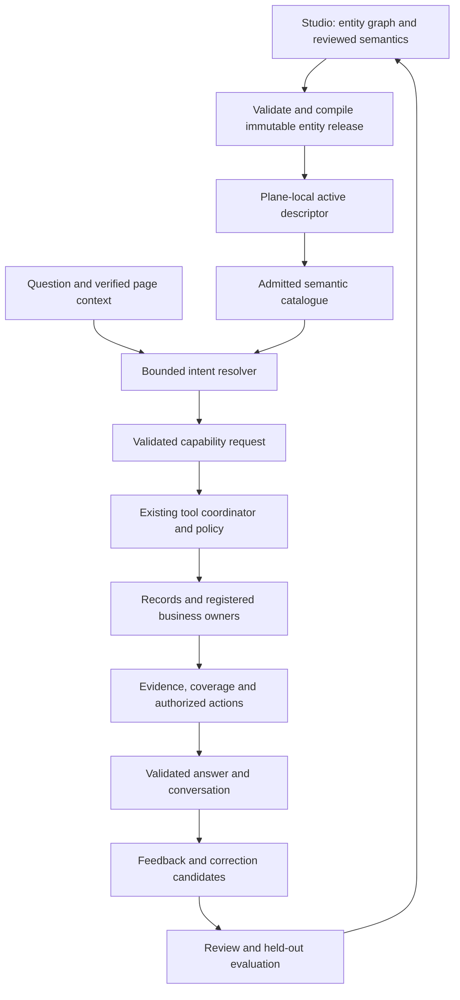

# Atlas Meta Entity learning foundation

Date: 2026-09-10. Status: proposed architecture and implementation plan.

F0 implementation update: the [reviewed DEV/QA baseline](atlas-foundation-f0-baseline.md)
and [repeatable collector](../runbooks/atlas-foundation-baseline.md) are available.
They record current deployment/schema gaps; later phases remain proposed.

This proposal follows a read-only review of the current working-tree DDL, Atlas runtime, metadata contracts, and Business Partner implementation notes. It does not establish live database parity, deployment state, or new qualification results. No schema or application changes accompany this document. Proposed table and capability names below are design names, not existing APIs.

## 1. Architectural decision

Make the published Meta Entity descriptor the source of Atlas business semantics and declared capabilities. Registered services own execution and business decisions. Current authorized data supplies evidence. Reviewed feedback produces candidate semantic changes that pass through the existing authoring, evaluation, and publication lifecycle.

The first learning loop improves aliases, intent examples, and clarification behavior. Model weights remain independently versioned. A successful read, high similarity score, or positive vote never grants authority or establishes a business rule.

Business Partner is the reference domain adapter. A second existing entity is the required proof that the platform abstraction works.

## 2. Existing foundation and concrete gaps

| Responsibility | Existing DDL / implementation | Recommended treatment |
| --- | --- | --- |
| Entity authoring | `metadata.entity`, `entity_change_set`, `entity_field`, search profiles, relations, surfaces, operations, policy and lifecycle bindings | Reuse the graph and its change-set ownership. Derive types, descriptions, classifications, searchability, and operation references from existing definitions. |
| Publication | `metadata.entity_release`, `snapshot.entity_contract_revision`, release artifacts, `publication.release` and deployment records | Include semantics in the immutable entity release. Reuse release verification and deployment receipts. |
| Local runtime | `runtime_meta.entity_contract`, `entity_descriptor`, `applied_release`, `release_activation_head`, activation events | Resolve semantics from the active local release. Runtime must continue operating without a Studio connection. |
| Current AI declarations | `EntityAiDescriptorV1`, authored in one active surface's `layoutConfig.ai` | Preserve v1 compatibility; add an entity-level authoring home and a versioned richer contract. |
| Execution | `atlas_run`, `ai_tool_invocation`, `ai_agent_call`, `ai_agent_run`, `atlas_provider_usage` | Preserve durable runs, proposals, idempotency, zero-model completion, and metering. Add semantic decision lineage separately. |
| Conversation | `atlas_thread`, `atlas_message` | Keep transcripts here and retain current replay authorization. Avoid duplicating their content into operational logs. |
| Feedback | `ai_feedback_log`, monitoring ledger | Reuse feedback intake; add typed semantic correction and exact response bindings through an additive contract. |
| Knowledge | `atlas_knowledge_source`, `atlas_knowledge_revision`, `atlas_knowledge_chunk`, ingestion service/jobs | Reuse revision and index lifecycle after strengthening retrieval admission. Chunk rows intentionally contain locators, not customer text. |
| Policy and monitoring | `ai_action_policy`, `ai_confidence_threshold`, `ai_drift_baseline`, `ai_calibration_log`, `ai_monitoring_log` | Reuse applicable administration and monitoring contracts. Calibrate task-specific routing thresholds against labeled outcomes. |
| Evaluation fixtures | `metadata.entity_contract_test_case` and immutable artifact infrastructure | Extend with a semantic test kind and typed expectations; store execution results in versioned artifacts. |
| Coordination | `event.outbox`, descriptor/authorization invalidation outboxes, `ops.job_execution` and attempts | Reuse delivery, retries, deduplication, and reconciliation mechanisms; register new event/job contracts explicitly. |

Important implementation findings:

- The current metadata provider catalogue contains BP-specific entries. Several runtime selection and target-binding branches also name BP tools explicitly.
- `createAtlasEntitySectionTool` already provides a reusable section executor, validation, citations, and replay support. Build on it.
- Host capability assessment already models missing dependencies and readiness. Integrate Atlas registrations with this mechanism to catch startup-order omissions before admitting requests.
- `AtlasKnowledgeService.search` currently filters index candidates by permission code. That method does not itself re-read source/revision state or establish parent-record, field, and relationship admission. These checks are prerequisites for broader entity retrieval; downstream protections must be assessed per composition.
- The current monitoring feedback writer stores a target, verdict, and reason while leaving `detail` and `evidence_snapshot` empty. A correction workflow needs a typed write/read path; JSON columns alone do not implement learning.
- Contract test kinds currently allow validation, compilation, compatibility, and operation. Semantic tests require a domain/parser/compiler change.
- Some AI DDL headers name `server/db/scripts/catalog/build-common-ai-ddl.mjs`, which was not present during this review. Verify supported database package entry points and repair stale generation instructions before relying on regeneration.

## 3. Target architecture

Use six logical modules within the existing contracts, metadata, AI, and owner packages initially. They do not require six services or a separate agent per entity.

| Module | Owns | Boundary |
| --- | --- | --- |
| Semantic compiler | Versioned business vocabulary and capability references | Consumes the authoring graph; never invents business rules or readers |
| Capability registry | Installed adapter contracts and qualified plane/entity support | Metadata references registered IDs; no arbitrary endpoints, SQL, or script bodies |
| Intent resolver | Entity/capability candidates, bounded filters, ambiguity and missing input | Emits a validated request; does not authorize execution |
| Evidence execution | Existing Records, owner services, tool coordination and citations | Facts and assessments retain current authorization, freshness, and coverage |
| Answer presentation | Direct factual rendering and optional model explanation | Counts/statuses/actions come from validated evidence and registered resolvers |
| Learning workflow | Feedback classification, candidate review and evaluation | Produces draft semantic changes; cannot modify active releases |

Effective capability availability is the intersection of published declarations, installed adapter compatibility, target plane, feature admission, agent allowlist, execution-path/model capability, data-class policy, and current user authorization. Definition discovery cannot replace invocation-time authorization. Direct reads should retain their zero-model path and accurate metering.

## 4. Entity semantics and publication contract

Move the authoritative AI authoring configuration to the entity change set. A surface may reference an entity presentation profile; it should not become a second owner of the vocabulary.

Reuse existing field descriptions, data types, type configuration, cardinality, classifications, search bindings, relations, operations, and policy bindings. Add only missing semantic information: localized aliases, business definitions, qualified terms, approved examples, capability bindings, and required context references.

Examples for BP:

| Phrase | Approved meaning | Additional requirement |
| --- | --- | --- |
| vendor | BP with supplier role | Resolve a role reference; do not silently broaden to all BPs |
| customer | BP with customer role | Preserve any conflict with the applied page role |
| contact person | Registered contacts section | Section and child-field admission |
| can we buy from this partner | Eligibility capability | Owner-defined organization/company/role/operation/date inputs |
| ready for onboarding | Readiness capability | Saved completeness rules and explicit assessment scope |

A term target is a bounded discriminated union: entity, field, relationship, enum/role value, or capability. A qualified meaning contains typed references validated against published contracts. It is not free-form filter code. Vocabulary applies within a declared tenant/platform authoring scope, locale, entity, and optional role.

Precedence must be deterministic: resolve the applicable entity contract through existing tenant/platform rules first, then explicit locale and configured locale fallback. Within that contract, exact approved terms precede semantic similarity. Conflicting equally applicable meanings require clarification. Runtime must not dynamically merge arbitrary tenant candidates into a platform definition. Resolve any permitted overrides at publication and include them in the hash.

Compile semantic content into the entity contract/descriptor, with its own schema version and a derived semantic hash covered by the existing contract hash. Start with an in-memory exact-term index derived from the active descriptor. A later keyword/embedding index is a rebuildable projection bound to the same semantic hash, not a separate authority.

Compatibility sequence: support old and new descriptor versions, add entity-level authoring, provide an explicit draft migration from v1 surface configuration, reject dual authoring, then publish selected entities. Preserve legacy hashes when semantics are absent. Retain old BP tool IDs/result shapes through compatibility registrations for saved conversations.

## 5. Proposed DDL additions and extensions

These are logical schema recommendations. Final SQL must follow existing archetypes, RLS, grants, constraints, triggers, and migration conventions after a live catalog parity check.

| Proposed object | Ownership and key fields | Invariants |
| --- | --- | --- |
| `metadata.entity_ai_profile` | Studio change set: entity, change set, schema version, enabled/context settings, summary/search/relationship references, presentation profiles | One profile per applicable entity change set; editable only under the existing change-set lifecycle |
| `metadata.entity_semantic_term` | Studio change set: stable term key, locale, phrase, normalized phrase, target kind/reference, typed qualifier, definition/examples, status | Same-scope references; bounded JSON; versioned normalization; represent ambiguity explicitly rather than enforcing one global meaning per phrase |
| `metadata.entity_ai_capability_binding` | Studio change set: binding key, capability ID/version, owner adapter ID/version, context contract, operation/section references | Registry compatibility validation; declaration never installs an adapter or grants an operation |
| `ai.atlas_learning_candidate` | Plane-local tenant candidate: entity code, locale, source release/hash, candidate kind, minimized proposal, originating feedback coordinate, state, row version, retention coordinates | Tenant isolation; no active runtime discovery; proposals become immutable at review, edits create a successor |
| `ai.atlas_learning_candidate_event` | Append-only candidate transitions: actor, decision code, timestamp, expected proposal hash, authoring/release coordinates where applicable | Authorized compare-and-swap transition; reviewed is distinct from published or activated |
| `ai.atlas_intent_resolution` | Append-only per-run decision: tenant, principal, plane, run/step, descriptor/semantic hash, registry/resolver revision, selected capability, resolution method, safe outcome/ambiguity codes | No raw prompt, business values, or hidden candidate names; protected run-scoped access |

Extend `ai_feedback_log` through typed nullable run/message/plane bindings or a typed companion relation if multiple feedback families prevent coherent constraints. Preserve existing feedback semantics; verify actual same-tenant run/message/principal ownership server-side and add same-database composite constraints where available. A new correction contract must not overload `target_id` with several undocumented meanings. Keep detailed proposed wording in the retention-controlled candidate store.

Extend `metadata.entity_contract_test_case` with a semantic test kind and versioned input/expectation schema. The existing domain, validation, compilation, exports, and artifact compatibility checks must change together. Tag examples as retrieval examples or held-out evaluation cases; held-out cases must never enter the runtime example index. Test execution produces immutable results linked to the exact fixture hash and release candidate.

Avoid adding duplicate catalogue, conversation, tool-invocation, or knowledge tables. The published catalogue is derived from the descriptor. Registry manifests stay code-owned initially and are exposed to Studio through a versioned catalogue contract.

Cross-plane handling is explicit: runtime feedback/candidates remain in the originating plane. Studio receives only an authorized, minimized proposal through a registered service/event handoff, with origin plane, candidate ID and hash, and deduplication coordinates. Source IDs across databases are trust coordinates, matching the existing publication design; no cross-database foreign keys or direct Studio reads of tenant transcripts. Define retry, acknowledgement, revocation/withdrawal, and reconciliation for this handoff.

For new authoring tables preserve the metadata graph's nullable-tenant platform conventions and composite ownership checks. Runtime learning rows require a concrete tenant and verified principal. Use `shared.uuidv7()`, bounded strings/arrays, state checks, row-version transitions, targeted indexes, and explicitly reviewed RLS/grants. Tenant isolation alone is insufficient for protected feedback; reviewer scope and origin permissions also matter. Never grant platform-wide publication through a tenant correction action.

## 6. Runtime behavior and data access

1. Capture an immutable page context and resolve current identity, tenant, plane, scope, descriptor and admission. Preserve navigation generation checks, historical restrictions, and saved-data-only behavior.
2. Build a bounded capability catalogue for the admitted entity/context. Exclude inaccessible descriptions/examples before sending them to a model.
3. Resolve exact terms and explicit section requests. If needed, retrieve a small number of approved examples, then ask the model for a schema-constrained intent. Record the resolution method and revisions.
4. Validate the intent's fields, operators, relationship references, limits, targets, and scope against Records and registered capability contracts. Model confidence and similarity scores are routing signals, not permissions or proof of correctness.
5. Resolve record names through an authorized lookup capability. Display ambiguous permitted candidates. Model-generated UUIDs and chat-entered scope names do not become applied authority.
6. Execute existing read tools or the governed mutation proposal path. Use owner services for readiness, eligibility and validation. Preserve revalidation, concurrency controls, idempotency and confirmation for submission.
7. Render direct facts, counts and unavailable states from validated results. Use a model explanation when useful, with bounded evidence and source references.
8. Finalize run, tools, messages and metering under current durable semantics. Append semantic lineage without fabricating provider usage for direct reads.

Separate definition retrieval from live-data retrieval. Field definitions and approved terms come from the descriptor. Record names and current values come from Records. Documents come from document owners. Assessments come from business owners. A language model never queries storage paths or constructs SQL from metadata.

For entity/document retrieval, reauthorize every candidate and parent relationship, check current source/revision/deletion/scan state, then load bounded permitted passages. Indexing may lag; authorization and revision checks cannot wait for reindexing. Source removal must make retrieval ineligible immediately and schedule idempotent index cleanup. Test incomplete cleanup and failed ingestion recovery explicitly.

Relationship traversal requires a registered runtime relationship contract and owner adapter, with direction, row limits, depth, time budget, and field permissions. Authoring graph relations are not automatically executable joins. Start with one-hop BP contacts/addresses and exact coverage reporting.

## 7. Learning and improvement

Classify feedback into vocabulary, intent, missing context, unsupported capability, owner/tool failure, evidence/coverage, and presentation. Only applicable categories create semantic candidates. A positive vote or apparent successful action is a weak signal; verified corrections and labeled outcomes carry stronger evidence.

Candidate lifecycle: observed → triaged → reviewed or rejected → linked to a draft change set → evaluated → published. Activation is confirmed separately for each target plane/release. Stale candidates are rebased and re-reviewed against changed field/capability references; retries cannot duplicate publication.

Use a Studio Feedback Inbox showing minimized question examples, interpreted meaning, proposed correction, source version, supporting observations, collision warnings, and evaluation changes. Reviewer access is separately authorized. Personal wording preferences do not silently change shared definitions.

Automatic processing may group similar candidates and suggest aliases. Promotion into shared runtime vocabulary requires the configured review and release gates. Do not schedule model retraining after every conversation. Consider classifier, embedding, or language-model tuning only after held-out evaluations identify an error pattern that metadata and retrieval cannot adequately address.

Published vocabulary and approved examples have explicit provenance and publication retention. Raw feedback and unreviewed proposals have shorter independent retention. A conversation purge must propagate to any copied protected candidate content. Retain only approved minimized examples under their own declared retention authority; define how later withdrawal affects future releases and derived indexes.

## 8. Business Partner reference implementation

| Slice | Existing foundation | Work required |
| --- | --- | --- |
| Identity and vocabulary | Summary reads and AI aliases | Model supplier/customer as qualified roles; publish field/role explanations and example questions |
| Contacts and addresses | Shared section executor, owners, direct renderer | Move discovery references into the generic catalogue; preserve compatibility tool IDs and coverage behavior |
| Readiness and eligibility | BP owner insight tools and disclosure | Describe distinct capabilities and required scope; remove BP-specific orchestration branches incrementally |
| Manage questions | List insights with bounded owner assessments | Preserve selection/page/filtered-set semantics; publish supported analysis intents and explicit completeness limits |
| Case explanation/submission | Saved-case tools, preview guard, durable proposal path | Declare parent/case context contract; preserve existing confirmation and owner validation |
| Banking, tax, certificates | Some sections currently advertise reader unavailable | Connect and qualify owner projections individually; semantic publication cannot make missing readers functional |
| Duplicate/document extensions | Existing owner-contract and qualification plan | Deliver only after the generic foundation and relevant owner/disclosure contracts |

Example acceptance journey: “Can we buy from this vendor?” resolves the current BP and supplier meaning, identifies the eligibility capability, asks for missing transaction scope, executes the owner evaluator when admitted, and explains only disclosed findings. A correction such as “I meant onboarding completeness” creates a candidate example for readiness; it does not change the business decision rule.

## 9. Delivery plan

| Phase | Deliverables and primary owners | Exit gate |
| --- | --- | --- |
| F0 — Establish baseline | Database/host/AI owners inventory actual descriptors, schemas, registry, adapters and enabled BP features; reconcile recorded qualification with target evidence | Reviewed source/deployment/model/policy/descriptor inventory, current errors and supported capability matrix; resolve stale DDL entry-point guidance |
| F1 — Semantic authoring | Metadata contracts, Studio authoring and DB packages add entity-level profile/terms/bindings, v2 parser/compiler, migration preview and semantic fixtures | Deterministic hashes; old descriptors still parse; invalid refs, ambiguous dual sources and unsupported versions rejected; clean install and forward migration parity |
| F2 — Generic execution | Platform AI and host composition implement catalogue assembly, registry compatibility, context requirements and BP compatibility adapters | BP identity/contacts/addresses and one existing non-BP entity work without entity-specific central-runtime edits; missing owners produce honest availability |
| F3 — Intent and feedback | AI contracts/runtime and agent UI add validated intents, exact-term routing, clarification, intent lineage and typed feedback | Held-out BP paraphrases, missing-scope and denied-access cases pass; zero-model paths retain correct SQL completion and metering |
| F4 — Reviewed learning | Studio, AI, jobs and publication owners implement candidate/event persistence, minimized cross-plane handoff, inbox, evaluation and publication linkage | A real correction moves through review and a new release; rejected/stale candidates cannot affect runtime; activation and rollback demonstrated |
| F5 — Evidence scale | Records/domain/document/search owners strengthen retrieval admission, batch assessment and optional bounded caching | Stale/deleted/revoked evidence excluded; partial coverage truthful; measured dataset/load/latency and failure recovery |
| F6 — Pilot qualification | Existing BP qualification tooling plus second-entity suites | Authenticated personas, pinned-model questions, SQL integration, rollback, accessibility and operational evidence all match the same release bindings |

F0 → F1 → F2 → F3 → F4 is the minimum foundation sequence. Run a second-entity vertical slice in F2, not after BP expansion. F5 can be delivered in separately qualified increments; document/vector retrieval is not required for the first learning loop. Broader release remains subject to F6.

Primary change locations: `server/packages/contracts/metadata`, `server/packages/contracts/ai`, `server/packages/planes/studio/meta-entity-authoring`, `server/packages/platform/metadata`, `server/packages/platform/ai`, host composition, existing master-data owners, agent UI/shell, and `server/db`. Keep interfaces in shared contracts, compiler work in Studio, execution in platform AI, and business calculations in the domain owner.

## 10. Evaluation, operations and migration

Initial proposed quality gate: at least 95% correct entity/capability selection and supported-task completion on an agreed held-out set, reported separately by entity, locale, and persona. Require zero observed unauthorized disclosure, unsupported mutation, or fabricated identifier/count/status failures in the acceptance suite. These are proposed gates, not measured results or universal correctness claims. Track ambiguity handling and refusal rates so aggressive refusal cannot inflate accuracy.

Include unknown terms, overlapping roles, exact vs fuzzy names, injection in metadata/documents, inaccessible fields, mixed denied selections, historical views, unsaved changes, absent owners, source revisions, activation changes during runs, revocation, cancellation, zero-model completion, submission retries, duplicate feedback and candidate races. Test direct database constraints and real repositories as well as runtime mocks.

Record source tree, active release, descriptor/semantic hash, capability manifest, resolver, model/embedding model if used, prompt, policy and fixture revisions. Keep raw values out of general operational telemetry. Retrieve diagnostic details through authorized evidence/conversation owners. Measure task accuracy and correction rate alongside latency, tool availability, stale-context discards, index lag and queue failures. Average model confidence alone is not a useful proof of learning.

Keep the pinned local inference configuration initially. Measure token budgets with the selected catalogue and evidence. Distributed inference admission must be established before adding API replicas against the single local provider queue. Cache admission needs explicit capacity limits and session-continuity checks; namespaces alone do not isolate shared Redis memory. Extend the existing reuse binding with semantic/capability revisions if their changes can affect the cached result, while retaining current per-disclosure authorization.

Deployment uses additive forward migrations for installed databases and equivalent canonical DDL for fresh databases. Validate plane manifests, constraints/indexes/triggers/RLS/grants, authorization seeds, and clean-versus-upgraded catalog parity through supported DB package commands. Do not replay foundation DDL against populated databases. Land application compatibility before activating new descriptor versions; backfill only reviewed draft profiles. Avoid editing unrelated concurrent working-tree changes.

Roll back semantic changes by publishing/activating a compatible release through the supported lifecycle, including a forward compensating release if monotonic activation requires it. Do not edit immutable release JSON in place. Preserve ledgers and proposals; invalidate derived indexes/caches by release hash. Test rollback with old conversations and pending confirmed-action receipts, and reauthorize all replayed content.

Foundation completion means a reviewed BP correction measurably improves unseen wording after publication, the same pipeline works on a second Meta Entity, current owner data remains authoritative, and neither entity needs a custom central agent loop.

## 11. Source map

- [Metadata authoring DDL](../../server/db/ddl/planes/studio/metadata/03_tables.sql)
- [Metadata domains](../../server/db/ddl/planes/studio/metadata/02_domains.sql)
- [Common runtime metadata DDL](../../server/db/ddl/common/runtime_meta/03_tables.sql)
- [Publication DDL](../../server/db/ddl/planes/studio/publication/03_tables.sql)
- [Studio snapshot DDL](../../server/db/ddl/planes/studio/snapshot/03_tables.sql)
- [Common AI DDL](../../server/db/ddl/common/ai/03_tables.sql)
- [AI RLS](../../server/db/ddl/common/ai/10_rls.sql)
- [Current AI metadata schema](../../server/packages/contracts/metadata/src/entity-ai.ts)
- [Shared entity section executor](../../server/packages/platform/ai/src/entity-section-tool.ts)
- [Current BP routing](../../server/packages/platform/ai/src/business-partner-tool-selection.ts)
- [Host capability assessment](../../server/apps/platform-host/src/composition/capability-registry.ts)
- [Knowledge service](../../server/packages/platform/ai/src/knowledge.ts)
- [Monitoring and feedback persistence](../../server/packages/platform/ai/src/monitoring.ts)
- [Evidence reuse policy](../../server/packages/platform/ai/src/insight-reuse-policy.ts)
- [Existing BP implementation plan](business-partner/atlas-ai-agent-implementation-plan.md)
- [Shared sections and qualification notes](../contracts/atlas-entity-sections.md)
- [Automatic brief prerequisites](../contracts/atlas-automatic-briefs.md)
- [Database script guidance](../../server/db/scripts/README.md)

F2 implementation and prototype publication guidance: [generic capabilities runbook](../runbooks/atlas-f2-generic-capabilities.md). The automated two-entity vertical is implemented; target publication and deployment qualification remain explicit release evidence.

F3 implementation and database rollout: [structured intent and response feedback](../runbooks/atlas-f3-intent-feedback.md). Typed feedback is a review signal; F4 candidate review and publication remain separate.

F4 implementation: see [the reviewed vocabulary inbox runbook](../runbooks/atlas-f4-learning-inbox.md) for the initial English record-summary workflow, publication gates, migration commands, qualification and remaining scope.

F5 implementation and bounded-runtime qualification: [Retrieval, batching and caching](../runbooks/atlas-f5-retrieval-batching-cache.md). Candidate reuse always repeats canonical and owner admission; the synthetic batching benchmark is not a deployed performance qualification.
