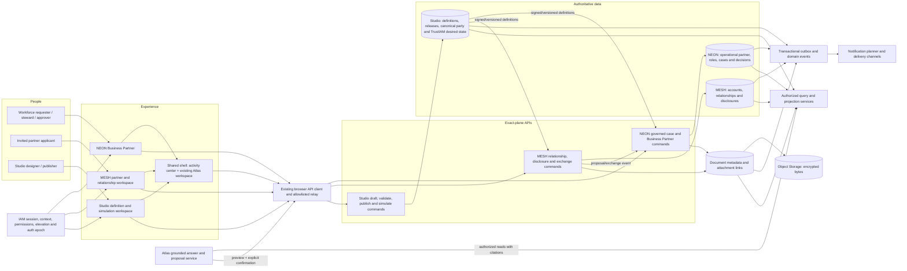

# Business Partner experience architecture and delivery plan

Status: review draft
Scope: NEON, MESH, Studio, IAM, Object Storage, Atlas AI and Notification Channel
Decision basis: the governed entity lifecycle ADR, the frontend-first module guidance, the current repository implementation and the Business Partner scratchpad proposals

> This document is the point-in-time repository audit and source proposal. The consolidated capability documentation is indexed at [`business-partner/README.md`](business-partner/README.md). New journey, scope and acceptance decisions should be recorded in that package.

## Executive decision

Build Business Partner onboarding as one governed journey presented through several bounded experiences, not as a new cross-plane application or a fourth authoritative data plane.

- Studio owns versioned semantics: entity, form, validation, matching, journey, notification and surface definitions.
- MESH owns network accounts, relationships, disclosures and cross-tenant exchange.
- NEON owns the operational Business Partner, thin supplier/customer roles, local decisions and materialized state.
- IAM authenticates people and services and resolves their permitted tenant, plane and organization context. A canonical party identifier correlates identities; it does not authorize them.
- Object Storage owns document bytes. The document database owns attachment metadata, linkage, status, retention and legal-hold state.
- Notification Channel delivers messages derived from committed domain events. It does not decide workflow state.
- Atlas AI reads authorized context and creates explanations, drafts or command proposals. It never becomes a system of record and never bypasses confirmation or the governed command path.

There are three authoritative data planes, plus shared platform capabilities. Atlas is a proposal service, not a data plane. All cross-plane movement uses published contracts, projections and events; there are no cross-database foreign keys or direct cross-plane writes.

The first releasable vertical slice should be an invitation-backed supplier onboarding case with progressive data collection, evidence upload, deterministic validation, duplicate review, human approval, operational materialization and lifecycle notifications. This exercises every important boundary without requiring all twelve proposed AI automations on day one.

## Audit verdict

| Area | Repository reality | Audit decision | Release implication |
| --- | --- | --- | --- |
| Governed lifecycle | The case, snapshot, evidence, audit, outbox, lineage and materialization foundations are substantial. | Retain the case-native command model and exact replay/version rules. | Do not create a second workflow or write path in the frontend. |
| NEON | A real Business Partner 360, lists, request flows and commercial controls exist. Some flows still use local effects, hand-built tables, browser prompts and redirects. | Evolve the current module; do not rewrite it. Extract only proven generic workflow pieces. | Suitable starting point for the vertical slice after frontend governance is green. |
| MESH | The overview and relationship list are real. Profile, request, detail, capability and selective-disclosure experiences are thin or explanatory. | Build actual account/profile and relationship workspaces against MESH-owned contracts. | A relationship detail and inbound proposal slice is required before cross-tenant pilot. |
| Studio | Backend metadata/release foundations and the AI Experience editor are meaningful. Business Partner model, matching, validation, workflow and publication pages are mostly stubs. | Make Studio the authoring and simulation experience, not an operational data editor. | Read-only release inspection comes before full authoring. |
| IAM | Browser session gates, context selection, TrustIAM desired-state projection and invitation APIs exist. | Use separate workforce and restricted-applicant trust paths. Keep canonical-party correlation separate from authentication. | External onboarding UI, revocation and negative authorization tests remain required. |
| Object Storage | Staging, quotas, malware scan, hashing, activation, signed downloads, retention and legal holds exist. | Reuse the attachment lifecycle. Add a Business Partner evidence experience; never expose object keys. | Production storage configuration and protected-document handling must be qualified. |
| Atlas AI | The global dock/full-screen workspace, grounded answers, citations, proposals, confirmation and server-side reauthorization exist. | Extend the existing dock with structured Business Partner context and a shared governed preview. Do not create another Atlas dock. | Start with read-only explanations and readiness guidance, then assisted mutations. |
| Notification Channel | In-app, email, SMS, push and WhatsApp infrastructure, preferences, SSE and provider adapters exist. | Add Business Partner event-to-recipient/template/deep-link policies. | Provider readiness is environment-specific and has not been proven by this audit. |
| Frontend governance | Module typechecks and tests pass, but the frontend spine dependency-budget policy currently fails in several packages. | Repair or deliberately re-baseline dependency budgets before adding packages. | This is a phase-zero gate, not cleanup to defer until release. |
| Production certification | Local implementation evidence is strong, but the production certification script reports missing runbooks and qualification evidence. | Describe the capability as implemented/partially qualified, not production certified. | Production release remains blocked until evidence and operational gates pass. |

## Corrections to the scratchpad proposal

The useful ideas in the scratchpad should be retained, with four architectural corrections:

1. Treat Studio, MESH and NEON as the three authoritative planes. IAM, Object Storage, notifications and Atlas are shared capabilities with narrowly defined authority.
2. Extend the existing shell Atlas workspace. A second `AtlasDock` would split conversation, proposal and confirmation behavior.
3. Do not create `packages/planes/shared/business-partner-kit`. Plane-to-plane sharing obscures ownership. Generic case/evidence components belong in the platform entity runtime after their contracts are proven; plane packages retain adapters and domain language.
4. Do not claim G0-G5 or production certification from local code coverage alone. Release certification requires the missing runbooks, environment evidence and operational sign-offs.

## Architecture



### Non-negotiable invariants

- Every request is authenticated and authorized again at the exact-plane server route. UI visibility is not authorization.
- Every mutation carries an idempotency key and, for an existing aggregate, an expected row version.
- A committed command atomically records state, case transition, snapshot/evidence, audit, outbox and lineage as applicable.
- Cross-plane messages are proposals until the receiving plane validates and accepts them.
- A published definition is immutable. Draft changes create a new version; an active case remains pinned to the version it started with unless an explicit migration is approved.
- Sensitive fields are hidden by default and require purpose-bound permission and, where configured, recent elevation.
- AI output is untrusted input. It is schema validated, policy checked, previewed, confirmed and reauthorized at execution time.
- Notifications contain references and safe summaries, not bank, tax, identity-document or other restricted payloads.
- Object keys, provider identifiers, access tokens and internal policy details never appear in browser-visible contracts.

## Authority and responsibility matrix

| Concern | Authority | May propose or project | Must not do |
| --- | --- | --- | --- |
| Operational Business Partner and roles | NEON | MESH exchange and Studio definitions can propose inputs | MESH or Studio may not write NEON records directly |
| Network relationship and disclosure | MESH | NEON may project local activation/status; Studio supplies definition versions | NEON may not mutate relationship authority |
| Semantic definition and release | Studio | Atlas may draft; reviewers may comment | Runtime planes may not silently change a published contract |
| Authentication and authorization context | IAM/runtime policy | Studio TrustIAM desired state can project scopes | Canonical party and Business Partner IDs may not grant access |
| Attachment metadata and evidence linkage | Document domain in the owning plane | Atlas/extractors may append derived evidence through commands | Object Storage may not become a domain database |
| Attachment bytes | Object Storage | Document service controls signed access | UI and domain rows may not store reusable direct URLs |
| Workflow decision | Owning plane workflow/case service | Humans and Atlas may create proposals | Atlas and notification handlers may not transition cases directly |
| Delivery | Notification Channel | Domain events request delivery | Delivery success may not imply domain success |
| Explanation and draft actions | Atlas | Authorized sources, tools and deterministic rules ground output | Atlas may not invent authority or execute outside registered commands |

## Experience contracts

The UI needs stable experience-shaped contracts rather than composing raw persistence models in the browser.

### Context coordinate

Every Business Partner screen and Atlas request should resolve the same structured coordinate:

```ts
type BusinessPartnerExperienceContext = {
  plane: "neon" | "mesh" | "studio";
  tenantId: string;
  principalId: string;
  actingAccountId?: string;
  operatingOrganizationId?: string;
  companyCodeId?: string;
  recordId?: string;
  relationshipId?: string;
  caseId?: string;
  section: string;
  roleLens?: "base" | "supplier" | "customer";
  asOf?: string;
  definition: { id: string; version: number; contentHash: string };
  permissionsHash: string;
  authorizationEpoch: number;
};
```

The server derives or verifies tenant, principal, permissions hash and authorization epoch. The browser may select from authorized contexts but may not assert them as facts.

### Governed case view

The case query should return a projection optimized for review and editing:

```ts
type GovernedCaseView = {
  id: string;
  kind: string;
  status: string;
  rowVersion: number;
  definition: { id: string; version: number; contentHash: string };
  subject: { type: string; id?: string; displayName: string };
  ownership: { requesterId: string; assigneeId?: string; queue?: string };
  progress: { completed: number; required: number; blockers: number };
  sections: Array<{
    id: string;
    label: string;
    state: "not_started" | "in_progress" | "complete" | "blocked" | "not_applicable";
    errors: number;
  }>;
  allowedActions: Array<{ id: string; label: string; requiresElevation?: boolean }>;
  evidenceSummary: { active: number; scanning: number; quarantined: number; missing: number };
  timestamps: { createdAt: string; updatedAt: string; dueAt?: string };
};
```

Mutations use generated contracts and `createOperation`, are allowlisted by the relay, and include `idempotencyKey`, `expectedRowVersion` and the minimum command payload. Conflict responses must include the current version and a safe refresh/compare path.

### Evidence view

An evidence item exposes document meaning and safe lifecycle state, never bucket or key:

```ts
type EvidenceItemView = {
  id: string;
  requirementId: string;
  fileName: string;
  mediaType: string;
  sizeBytes?: number;
  version: number;
  status: "staged" | "uploading" | "scanning" | "extracting" | "active" | "quarantined" | "expired";
  classification: "internal" | "confidential" | "restricted";
  extractedFields?: Array<{ path: string; value: unknown; confidence: number; evidenceSpan?: string }>;
  retentionUntil?: string;
  legalHold: boolean;
  canDownload: boolean;
  canReplace: boolean;
};
```

### Notification event

Business Partner events should publish stable references and routing attributes, not rendered message bodies:

```ts
type BusinessPartnerNotificationEvent = {
  eventId: string;
  eventType: string;
  occurredAt: string;
  tenantId: string;
  plane: "neon" | "mesh" | "studio";
  subject: { type: string; id: string; displayLabel?: string };
  caseId?: string;
  relationshipId?: string;
  actorId?: string;
  recipientHints: Array<"requester" | "assignee" | "partner_admin" | "steward" | "publisher">;
  templateData: Record<string, string | number | boolean | null>;
  deduplicationKey: string;
};
```

The notification planner resolves actual recipients and permitted deep links at delivery time.

## Frontend package design

Use the established frontend spine: generated contract, operation registry, browser API client, query-key factory, hooks, gates, mutation guard, shared UI, surface kit and shell.

### Package boundary

- Extend `packages/platform/entity/runtime/workflow-ui` with domain-neutral primitives only after its dependency and ownership budget is accepted:
  - `GovernedCaseWorkspace`
  - `CaseProgress`
  - `CaseTimeline`
  - `CaseActionBar`
  - `EvidencePanel`
  - `VersionConflictNotice`
  - `DecisionDialog`
  - `ContextualAtlasTrigger`
- Keep `BusinessPartner360Shell`, supplier/customer lenses and NEON-specific decision panels in `packages/planes/neon/business-partner`.
- Keep relationship, disclosure, consent and exchanged-proposal adapters in `packages/planes/mesh/business-partner`.
- Keep definition, rule, journey, simulation and publication adapters in `packages/planes/studio/business-partner`.
- Extend the existing shell Atlas workspace to receive the structured coordinate. Reuse one governed action-preview component in Home, dock and full-screen modes.
- Do not introduce direct imports between plane packages.

Avoid a broad extraction before the vertical slice. Move a component to platform only when at least two plane adapters use the same behavioral contract and platform ownership is clear.

### Data access and state rules

- Queries use plane-scoped keys containing tenant/context, entity/case identifier, definition version, role lens and historical `asOf` when relevant.
- Cancel obsolete requests when context, record or historical coordinate changes.
- Server state stays in the query cache; transient UI state stays local; resumable drafts are persisted by a governed draft command.
- Dirty form navigation uses the shared confirmation dialog, not `window.prompt` or implicit redirects.
- Optimistic updates are limited to reversible presentation state. Workflow transitions wait for the committed server result.
- Historical mode is visually unmistakable and makes all mutation controls unavailable.
- Every page renders loading, empty, partial, stale, conflict, forbidden, expired-session and failure states deliberately.

## Information architecture and screen inventory

### Shared and external experiences

| Screen | Primary user | MVP purpose |
| --- | --- | --- |
| Invitation landing | Invited applicant | Validate invitation, explain data use, establish restricted session |
| Identity and organization verification | Applicant | Required IAM actions, MFA/step-up, organization claim and recovery |
| Onboarding workspace | Applicant/requester | Progressive sections, autosaved draft, evidence, validation and submission |
| Activity center | All authenticated users | Assigned work, status changes, expiring qualifications and delivery state |
| Atlas workspace | Authorized users | Grounded help, readiness explanation and governed proposals in current context |

An invitation-only user should not be forced through the internal NEON shell. Initially expose a minimal restricted external surface backed by the existing NEON external invitation APIs. A MESH-authenticated partner can enter the same journey from MESH, but its session and account context remain MESH-owned. Consolidation into a separate external application is a later product decision, not a prerequisite for the first slice.

### NEON

1. Business Partner list and saved views.
2. Definition-driven 360 with base, supplier and customer lenses.
3. Request/case inbox with ownership, SLA and status filters.
4. Create and edit onboarding workspace.
5. Evidence and extraction review.
6. Duplicate candidate comparison and merge decision.
7. Validation, readiness and path-to-activation panel.
8. Human decision workspace for approval, return and rejection.
9. Qualification, preference, credit, link, bank and activation panels.
10. History, evidence, audit and point-in-time view.

### MESH

1. Network account and published organization profile.
2. Relationship list and relationship detail.
3. Relationship capability and status management.
4. Selective-disclosure and consent policy view.
5. Proposed profile change with current/local/incoming three-way comparison.
6. Invitation, correction and exchanged-request status.
7. Quarantine and exception queue for invalid or unauthorized exchanges.

### Studio

1. Business Partner model and field catalog.
2. Form/surface designer with preview for applicant, requester and steward personas.
3. Deterministic validation rule editor and test cases.
4. Matching policy, thresholds and golden-corpus results.
5. Journey/workflow editor with role and SLA checks.
6. Notification policy and template editor.
7. Release diff, impact analysis, approval and publication.
8. Historical snapshot simulation and migration preview.
9. Atlas assistant configuration, evaluation set and publication state.

## Review wireframes

### Internal onboarding and case workspace

```text
┌──────────────────────────────────────────────────────────────────────────────┐
│ BP request · SUP-02418     Draft     v7        Owner: A. Tan     Due: 2 days │
│ Acme Components Sdn Bhd              [History] [More] [Ask Atlas]            │
├───────────────┬──────────────────────────────────────┬───────────────────────┤
│ 1 Organization│ Organization details                 │ Readiness 68%          │
│ 2 Tax          │ Legal name        [______________]   │ 2 blocking issues      │
│ 3 Banking      │ Registration no.  [______________]   │                       │
│ 4 Contacts     │ Country           [MY ▼]             │ Suggested next action │
│ 5 Evidence     │                                      │ Add tax evidence       │
│ 6 Review       │ [Validation/fix-it message]           │                       │
│                │                                      │ Evidence               │
│ Autosaved 10s  │                                      │ 3 active · 1 scanning  │
├───────────────┴──────────────────────────────────────┴───────────────────────┤
│ [Save draft]                                  [Validate] [Submit for review] │
└──────────────────────────────────────────────────────────────────────────────┘
```

The right rail is contextual but not authoritative. Atlas may explain a blocker or prepare a proposal; deterministic validation and server-reported allowed actions control the footer.

### Applicant experience

```text
┌──────────────────────────────────────────────────────────────┐
│ Invitation for Acme Components     Secure session: 18:42     │
│ [Identity ✓]—[Organization ✓]—[Details]—[Evidence]—[Review] │
├──────────────────────────────────────────────────────────────┤
│ We only request information required for this relationship. │
│                                                              │
│ Business details                                             │
│ ... progressive fields based on country and requested role  │
│                                                              │
│ [Save and exit]                              [Continue]       │
└──────────────────────────────────────────────────────────────┘
```

This surface has no internal navigation, queue names or employee-only data. It shows session expiry, autosave, recovery and support paths explicitly.

### MESH incoming change comparison

```text
┌─────────────────────────────────────────────────────────────────────────────┐
│ Relationship: Acme ↔ Northstar         Incoming profile proposal           │
├───────────────────────┬───────────────────────┬─────────────────────────────┤
│ Published baseline A  │ Local accepted B      │ Incoming proposal C         │
│ Address: Old Road     │ Address: Old Road     │ Address: New Road           │
│ Tax status: verified  │ Tax status: verified  │ Tax status: unchanged       │
├───────────────────────┴───────────────────────┴─────────────────────────────┤
│ Conflict: address · Evidence: registry extract · Disclosure: permitted     │
│ [Reject] [Request correction] [Prepare acceptance]                         │
└─────────────────────────────────────────────────────────────────────────────┘
```

Acceptance creates a governed proposal for the receiving authority; it does not directly overwrite NEON.

### Responsive and accessibility requirements

- At narrow widths, section navigation becomes a progress menu and the context rail becomes a bottom sheet/drawer.
- All work is possible without drag-and-drop; uploads have a file-picker path.
- Focus moves to the first invalid field after validation and to the conflict notice after a version conflict.
- Status uses text and iconography in addition to color.
- Dialogs trap and restore focus; background content becomes inert.
- Tables provide a card/list alternative on mobile for primary journeys.
- Target WCAG 2.2 AA, including keyboard flows, accessible names, error summaries and 200% zoom.

## Smarter onboarding design

### Primary journey

1. A workforce user or MESH partner creates an invitation/request using an approved journey definition.
2. IAM establishes either a workforce context or a restricted invitation-bound applicant session.
3. The runtime asks the smallest deterministic next set of questions based on role, country, relationship and already verified data.
4. The applicant uploads evidence through the attachment lifecycle. Scanning and extraction are visible states.
5. Extracted values are presented with confidence and evidence spans; a person accepts or corrects them.
6. Compiled rules validate the draft. A fix-it assistant may explain the rule but cannot waive it.
7. Entity resolution presents explainable candidates. An authorized steward confirms no-match, link or merge.
8. The requester reviews completeness and submits. The server calculates allowed transitions.
9. Approvers make segregated decisions with purpose, comment and elevation where required.
10. NEON materializes the operational Business Partner and roles only after an approved case.
11. Transactional events update MESH projections and notify authorized participants.
12. Readiness and qualification monitoring opens deterministic follow-up cases when policy conditions occur.

### AI automation portfolio

| # | Proposal | Decision | Earliest wave | Guardrail / prerequisite |
| --- | --- | --- | --- | --- |
| 1 | Document-to-case extraction | Accept | Assisted intake | Active/scanned evidence only; confidence and source spans; human confirmation |
| 2 | Progressive profiling | Modify | Assisted intake | Runtime branching is deterministic; AI can author or explain draft policy only |
| 3 | Compiled validation plus fix-it | Split | Foundation/read-only | Compiled rules are prerequisite; AI explanation is cited and cannot change outcome |
| 4 | Explainable entity resolution | Accept | Resolution | Calibrated thresholds, golden corpus, reason codes and no autonomous merge |
| 5 | Three-way merge assistant | Accept | Cross-plane | Explicit A/B/C baseline and field-level reviewer decision |
| 6 | External enrichment/screening | Conditional | Continuous controls | Vendor, residency, licensing, retention and legal review; evidence is not decision |
| 7 | Event-driven requalification | Modify | Continuous controls | Deterministic event opens the case; AI drafts summary/next steps only |
| 8 | Readiness copilot | Accept first | Read-only | Grounded only in case view, rules and evidence; no hidden write |
| 9 | Privacy-preserving MESH anomaly signals | Defer | Optimization | Volume, privacy model, fingerprint governance and false-positive process required |
| 10 | Studio authoring copilot | Accept | Authoring | Draft-only output; compiler/tests/reviewer/publisher remain authoritative |
| 11 | Historical release simulation | Accept | Authoring | Deterministic replay provides results; AI summarizes differences |
| 12 | Grounded steward/360 explanation | Accept first | Read-only | Structured context, citations, access filtering and safe audit narrative |

### Atlas integration sequence

1. Add the structured experience coordinate to the existing shell context provider.
2. Add Business Partner sources for case summary, current snapshot, definition/rules, evidence metadata and audit timeline, each permission filtered.
3. Unify the governed action preview so all surfaces display affected entity, expected version, expiry, arguments and required confirmation.
4. Ship read-only readiness and decision explanation with an evaluation set.
5. Add document extraction review and draft corrections.
6. Add proposed commands only after tool registration, authorization tests, replay tests and failure-safe UI are complete.

Atlas conversations should store references to authorized snapshots rather than copying restricted source payloads into long-lived generic history.

## IAM and external identity design

| Persona | Session | Allowed scope | Prohibited |
| --- | --- | --- | --- |
| Workforce requester | Normal workforce session with selected tenant/plane/org | Create and edit own/assigned draft, view permitted partner data | Approval without role; cross-tenant access |
| Steward | Workforce session, elevated for sensitive reveals/actions | Validate, resolve duplicates, request correction | Self-approval where maker/checker applies |
| Approver | Workforce session, step-up where policy requires | Approved transitions for assigned scope | Editing applicant identity/evidence to force approval |
| Restricted applicant | Invitation-bound principal, short session | Only invited case fields/evidence/status and correction requests | Internal comments, other cases, tenant navigation, decision controls |
| MESH partner admin | MESH account session and relationship scope | Published profile, disclosures, invitations and relationship proposals | Direct NEON operational mutation |
| Studio publisher | Studio session with publish permission/elevation | Review and publish approved definition release | Operational record mutation |
| Auditor/support | Purpose-bound read or impersonation-safe support tool | Evidence/audit appropriate to role | Unrecorded reveal or mutation |

Required controls:

- Invitation tokens are one-time/limited-use, hashed at rest, expire, and are bound to tenant, case and intended identity claims.
- Acceptance creates the least-privileged applicant principal and records terms/privacy acknowledgement.
- Cancellation, expiry, terminal completion and support recovery revoke or rotate access and advance the authorization epoch.
- MFA/step-up and required actions are visible workflow states, not generic errors.
- Maker/checker, delegated administration and service-account paths have explicit server tests.
- Sensitive tax/bank/identity reveals require permission, purpose and recent elevation and create audit evidence.

## Object Storage and evidence design

The current staged attachment lifecycle is the correct base:

`stage metadata + reserve quota -> signed upload -> verify/scan/hash -> activate or quarantine -> extract/derive -> retain/hold/purge`

Business Partner UI work should add:

- Evidence requirements derived from the pinned journey definition.
- Upload progress followed by separate scan and extraction states; upload completion is not evidence acceptance.
- Version/replacement history rather than destructive overwrite.
- Field extraction review with source spans and confidence.
- Classification, retention date and legal-hold indicators appropriate to permission.
- Short-lived, permission-checked download actions generated at click time.
- Quarantine messaging that does not leak scanner internals and provides a safe replace/contact-support path.
- Evidence links to case, subject, requirement and decision snapshot.

Production qualification must verify encryption configuration, key ownership/rotation, bucket policy, private-network controls where applicable, lifecycle/retention policy, region/data-residency alignment, malware-provider behavior, backup/restore expectations and signed-URL logging. The code-level adapter alone does not prove these environment controls.

## Notification Channel design

Seed Business Partner-specific routing and template policy in the owning overlay. The domain emits events; the notification planner resolves recipients, preferences, mandatory delivery and deep links.

| Event | Recipient | Default channel | Deep link | Mandatory? |
| --- | --- | --- | --- | --- |
| `business_partner.invitation.created` | Invitee | Email; optional SMS | Restricted invitation landing | Transactional |
| `business_partner.case.submitted` | Current approver/queue | In-app + email | Decision workspace | Policy controlled |
| `business_partner.case.returned` | Requester/applicant | In-app + email | First blocking/correction section | Transactional |
| `business_partner.case.approved` | Requester and relationship owner | In-app | Read-only case outcome | Preference aware |
| `business_partner.case.rejected` | Requester/applicant as permitted | In-app + email | Safe outcome/reapply guidance | Transactional |
| `business_partner.case.materialized` | Requester, owner and MESH acknowledgement handler | In-app/event | 360 or relationship | Preference aware |
| `business_partner.qualification.expiring` | Relationship owner/steward | In-app + email | Qualification renewal case | Policy controlled |
| `business_partner.activation.blocked` | Owner/steward | In-app | Readiness blockers | Policy controlled |
| `business_partner.duplicate.review_required` | Data-steward queue | In-app | Candidate comparison | Policy controlled |
| `business_partner.profile.quarantined` | MESH integration steward | In-app + operational alert | Exception queue | Mandatory operational |
| `business_partner.bank_verification.required` | Segregated approver | In-app | Restricted bank decision | Mandatory security |

Templates use display labels and case references, never raw bank/tax/document values. Test deduplication, retries, dead-letter behavior, recipient revocation, preference suppression, mandatory-security exceptions, localized rendering, deep-link authorization, bounce/failure observability and delivery-provider readiness in the target environment.

## Delivery plan

Planning ranges assume a stable cross-functional team and are for sequencing, not commitments. Streams can overlap only after their shared contracts are frozen.

### Phase 0 — architecture and baseline health (1–2 weeks)

Deliverables:

- Approve this authority model and the external applicant trust boundary.
- Decide the generic workflow UI ownership and dependency budget.
- Repair or explicitly re-baseline all current frontend spine budget failures.
- Publish typed case, evidence, context-coordinate and notification-event contracts.
- Inventory current routes, operations and catalog entries; identify missing allowlist entries without adding ad hoc fetch paths.
- Define protected-document classification and production storage qualification checklist.
- Define the Business Partner event/recipient/template matrix.
- Replace “production certified” language with accurate release status.

Exit gate: architecture decisions accepted, policy checks green, contracts compile, threat-model actions owned, and no new package violates plane boundaries.

### Phase 1 — internal vertical slice (2–3 weeks)

Deliverables:

- NEON case list/detail and onboarding workspace backed by the existing governed command path.
- Definition-pinned progressive sections, autosave, deterministic validation and conflict handling.
- Shared case shell/action bar primitives proven through the NEON adapter.
- Replace browser prompts/implicit redirects in the touched flow with shared dialogs and navigation guards.
- Structured Atlas context and read-only readiness explanation.
- Invitation, submitted, returned, approved/rejected and materialized notification routes.

Exit gate: a workforce requester can create, complete, submit and observe a supplier onboarding case; an independent approver can decide; replay is idempotent; server denial tests pass.

### Phase 2 — applicant and evidence experience (3–4 weeks)

Deliverables:

- Restricted invitation landing, identity/required-action states, recovery and session-expiry UX.
- Evidence requirements, upload/scan/quarantine/activate/download lifecycle and accessible failure states.
- Document extraction review with field confidence and evidence spans.
- Applicant correction and resume-later flow.
- Sensitive-field reveal, elevation and audit UX.

Exit gate: an invited external applicant completes the journey without access to the internal shell or another invitation; malware/quota/expiry/retention and revocation tests pass.

### Phase 3 — MESH relationship and exchange (3–4 weeks)

Deliverables:

- Real MESH account profile and relationship detail/capability UI.
- Selective-disclosure and consent view.
- Exchanged proposal status and exception/quarantine queue.
- Three-way profile-change comparison with request-correction and prepare-acceptance actions.
- Materialization acknowledgement and relationship notifications.

Exit gate: a MESH proposal crosses via event/projection, remains a proposal in NEON, is independently authorized and validated, and produces traceable acknowledgement without a direct write.

### Phase 4 — stewardship and continuous controls (3–4 weeks)

Deliverables:

- Duplicate candidate comparison and governed merge/link/no-match decisions.
- Qualification, preference, credit, bank and activation readiness consolidation.
- Event-driven requalification and renewal cases.
- Atlas cited decision explanation and draft action previews.
- SLA/activity-center views and operational notification coverage.

Exit gate: golden-corpus match metrics meet approved thresholds, no autonomous merge exists, maker/checker/elevation tests pass and operational dashboards expose stuck cases/deliveries.

### Phase 5 — Studio authoring and release qualification (4–6 weeks)

Deliverables:

- Definition, validation, matching, journey and notification authoring flows.
- Multi-persona preview, compiler checks and test-case runner.
- Release diff, impact analysis, historical snapshot simulation and publication approval.
- Draft-only Atlas authoring assistance with evaluation and provenance.
- Missing rollout/qualification runbooks and production evidence.

Exit gate: a signed definition release is approved, published, consumed by compatible runtimes, rollback/recovery is rehearsed and the full production certification gate passes.

## Initial implementation backlog

| Priority | Story | Acceptance criteria |
| --- | --- | --- |
| P0 | Resolve frontend spine budget drift | Policy passes; any raised budget has owner, rationale and expiry/review; no duplicate client/state package added |
| P0 | Adopt context coordinate contract | Same typed coordinate drives query keys, server verification, history mode and Atlas; tampered tenant/plane is denied |
| P0 | Define external applicant authorization | Invitation-bound permissions, terminal revocation, auth epoch and cross-invitation denial are contract tested |
| P0 | Qualify evidence classification | Required classification, retention, hold and download rules approved before protected uploads pilot |
| P1 | Build governed case query/command hooks | Generated contracts/operations, relay allowlist, stable keys, cancellation, error mapping and idempotency tests |
| P1 | Build NEON onboarding shell | Keyboard-complete section flow, autosave, validation summary, conflict resolution and historical read-only mode |
| P1 | Build evidence panel | Stage/upload/scan/extract/active/quarantine states; no object key/direct URL exposed; accessible retry/replace |
| P1 | Seed lifecycle notifications | Recipient/template/deep-link policy tested for invite, submit, return, decision and materialization |
| P1 | Add Atlas structured context | Case/record/section coordinate, citations and authorization filtering; no second workspace |
| P1 | Unify governed proposal preview | Dock/Home/full-screen show same entity, version, expiry, arguments, confirmation and stale-proposal handling |
| P1 | Build MESH relationship detail | Real API data, capability/disclosure state, request status and direct-write negative test |
| P2 | Build applicant surface | Minimal restricted navigation, session/recovery/required-action UX, mobile and accessibility coverage |
| P2 | Add extraction review | Confidence/source span, accept/correct, audit and no silent persistence |
| P2 | Build duplicate review | Explainable candidates, threshold/result provenance and authorized human outcome |
| P2 | Add Studio release inspector | Published version/diff/compatibility read-only view before editors |

## Build rules

For each frontend capability:

1. Add or extend the shared schema and operation contract.
2. Register the browser operation and relay allowlist entry.
3. Implement the exact-plane server route with authentication, context, permission, input and transaction checks independent of the UI.
4. Add catalog metadata/permissions/features where the route is discoverable.
5. Add query keys, typed hooks, gates, mutation guard and deliberate page states.
6. Compose with existing UI/surface/shell packages and the current Atlas workspace.
7. Add denial, replay, conflict, accessibility and observability tests before marking the screen complete.

No screen may introduce raw `fetch`, a second API client, a second notification client, a second Atlas container or a direct cross-plane dependency.

## Test and qualification strategy

### Contract and unit tests

- Schema parse/serialize and backward-compatibility fixtures.
- Query-key completeness and obsolete-request cancellation.
- Reducer/view-model tests for every lifecycle and attachment state.
- Validation compiler golden cases and property-based boundary cases.
- Notification template escaping, localization, redaction and deduplication.
- Atlas source authorization, citation shape, proposal expiry and schema validation.
- Component accessibility tests for names, roles, focus, errors and keyboard operation.

### Server and database integration tests

- Exact replay returns the same result; conflicting payload under the same idempotency key is rejected.
- Expected-version mismatch returns a conflict without partial writes.
- Case, snapshot/evidence, audit, outbox and lineage are atomic.
- Cross-tenant, cross-plane, wrong organization/company code and stale authorization epoch are denied.
- Maker/checker and elevated sensitive actions cannot be self-approved or replayed after elevation expiry.
- MESH exchange is quarantined or rejected when contract, disclosure, signature or recipient policy fails.
- Attachment quota, malware, size/hash mismatch, activation, signed download, replacement, retention and legal hold are exercised against a real compatible object-store environment.
- Notification retries and dead-letter behavior do not repeat the domain command.

### End-to-end journeys

1. Workforce-created supplier onboarding: draft -> validate -> duplicate review -> submit -> approve -> materialize -> notify.
2. Invitation onboarding on mobile: accept -> required identity action -> resume -> evidence -> correction -> submit -> status.
3. Negative invitation isolation: token/identity/tenant mismatch, expiry, cancel and terminal revocation.
4. MESH relationship proposal: disclose -> exchange -> quarantine/accept -> NEON governed decision -> acknowledgement.
5. Return loop: approver returns one section, applicant changes only permitted fields, resubmits with new version.
6. Version conflict: two editors, safe compare/refresh, no lost update.
7. Historical view: `asOf` snapshot is read-only and matches audit/evidence coordinate.
8. Sensitive decision: purpose/elevation/reveal/approval and audit evidence.
9. Atlas read-only answer with citations followed by a separately confirmed proposal; stale/revoked execution is denied.
10. Requalification: deterministic expiry event opens a case and routes an actionable notification.

### Non-functional qualification

- WCAG 2.2 AA automated and manual keyboard/screen-reader review.
- Responsive verification at phone, tablet and desktop widths.
- P95 list/detail/case render and API latency budgets defined with representative data volume.
- Upload behavior over slow/interrupted networks and large permitted files.
- Load and race tests for idempotency, row-version conflicts, invitation acceptance and notification bursts.
- Security review covering IDOR, CSRF, token leakage, stored XSS in labels/templates, file polyglots, signed-URL replay, prompt injection and indirect tool injection.
- Privacy review covering purpose limitation, minimization, retention, subject access/export and cross-border enrichment.
- Backup/restore and disaster-recovery rehearsal for metadata plus object consistency.

### Release gates

- All plane/module typechecks and tests pass.
- Frontend spine and NEON/MESH boundary policies pass.
- No unresolved critical/high threat-model findings.
- Target environment IAM, storage and notification-provider readiness checks pass with retained evidence.
- E2E production-like fixtures execute rather than skip.
- Observability dashboards, alerts, support runbook, rollback and data-reconciliation procedures are approved.
- Business Partner production certification reports success with all required evidence present.

## Metrics and operational signals

| Outcome | Metric |
| --- | --- |
| Faster onboarding | Median/P90 time from invitation to materialization; active effort time vs waiting time |
| Lower applicant friction | Completion, abandonment, resume and per-section correction rates |
| Better data quality | First-pass validation, missing evidence, duplicate escape and post-activation correction rates |
| Safe automation | Extraction acceptance/correction by field, match precision/recall, AI proposal acceptance and override rates |
| Workflow health | Queue age, return loops, approval SLA, materialization lag and stuck-case count |
| Trust and security | Cross-scope denial tests, sensitive reveal audit completeness, revoked-session attempts and quarantine rate |
| Communication | Delivery latency, failure/bounce, deduplication and actionable-notification click-through |
| Reliability | Command replay/conflict rate, outbox lag, projection drift, upload scan/activation latency and reconciliation defects |

Never optimize completion rate by weakening validation, disclosure, maker/checker or evidence requirements. Pair speed metrics with quality and control metrics.

## Ownership model

| Workstream | Accountable owner | Required partners |
| --- | --- | --- |
| Business Partner product/journey | Master Data product owner | Supplier/customer operations, MESH product, UX |
| NEON domain and materialization | NEON Master Data team | Workflow, database, security |
| MESH relationship/exchange | MESH team | NEON, privacy, integration |
| Studio definitions/releases | Studio metadata team | Domain owners, runtime teams, release governance |
| IAM/invitations | Identity team | Security, privacy, external experience |
| Attachments/evidence | Document platform team | Security, privacy, operations, Atlas |
| Notification policy/delivery | Communications platform team | Domain owners, IAM, operations |
| Atlas sources/tools/evals | AI platform team | Domain owner, security, model risk |
| Reusable workflow UI | Frontend platform team | All three plane UI owners, accessibility |
| Qualification/release | Business Partner release owner | SRE, security, data governance, support |

## Decisions required at design review

1. Approve the three-plane/shared-capability authority model.
2. Approve a minimal restricted external applicant surface backed initially by the current external invitation APIs.
3. Approve `platform/entity/runtime/workflow-ui` as the candidate home for proven domain-neutral case/evidence components, subject to dependency-budget repair.
4. Approve the experience context coordinate and definition-pinning strategy.
5. Select mandatory versus preference-aware notification events and supported MVP channels.
6. Approve evidence classification, region, encryption/key ownership, retention and legal-hold policy.
7. Approve matching thresholds, golden corpus, false-merge tolerance and steward roles.
8. Approve the AI rollout order: grounded read-only help before extraction and any command proposals.
9. Assign owners and dates for production certification runbooks and environment evidence.

## Definition of ready for implementation

A slice is ready when its user, authority, data classification, definition version, APIs/events, permissions/elevation, failure states, notification consequences, telemetry and test fixtures are agreed. Its contract and server denial test must exist before detailed UI implementation starts.

## Definition of done

A slice is done when the real API is integrated; all loading/empty/partial/error/conflict/forbidden/session states are designed; keyboard/mobile/accessibility requirements pass; exact-plane authorization and replay/version behavior are tested; audit/evidence/outbox/lineage are correct; Atlas and notifications cannot bypass the command; operational signals and runbooks exist; and the applicable release gates are green.

## Repository evidence reviewed

Primary architectural sources:

- `docs/architecture/decisions/governed-entity-lifecycle.md`
- `docs/architecture/frontend-first-business-module.md`
- `packages/planes/neon/business-partner`
- `packages/planes/mesh/business-partner`
- `packages/planes/studio/business-partner`
- `packages/platform/entity/runtime`
- `packages/platform/shell/shell/src/atlas-workspace.tsx`
- `packages/platform/ai/agent-ui`
- `packages/platform/communications/notifications-client`
- `packages/platform/communications/collaboration-ui/src/attachment-client.ts`
- `server/packages/platform/ai`
- `server/packages/services/attachments`
- `server/packages/platform/notifications`
- `server/packages/services/master-data`

Point-in-time verification performed for this audit:

- NEON, MESH and Studio Business Partner package typechecks passed.
- NEON Business Partner component tests passed: 25 tests across 6 files.
- First-business-module readiness passed.
- NEON/MESH boundary policy passed.
- Atlas grounded-answer contract tests passed: 5 tests.
- Notification provider-readiness unit tests passed: 4 tests. Environment provider readiness was not executed because it requires an explicit staging or production target.
- Frontend spine policy failed because multiple package dependency budgets are already over their configured limits.
- Business Partner production certification reported blocked because required production rollout/qualification runbooks and evidence were absent.

These are audit-time observations, not permanent certification evidence. Re-run the repository and target-environment gates after implementation and retain their outputs in the governed release evidence location.
