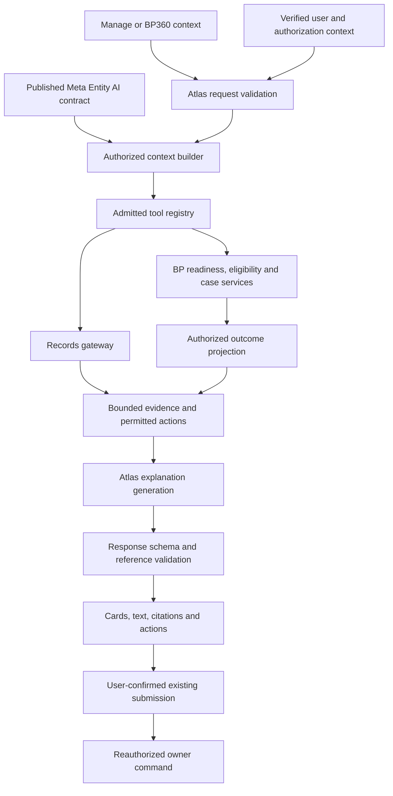

# Business Partner Atlas AI Agent — implementation plan

Date: 2026-09-08  
Status: Open overall; BP-AI-00 baseline and F6 DEV pilot closed within their recorded scopes
Scope: NEON Business Partner Manage, individual BP360 records, and related case assistance

BP-AI-00 complete (DEV baseline, 2026-09-09): [inventory and authenticated closure report](bp-ai-00-baseline.md). A refreshed session passed 20 measured cited reads plus warm-up, a visible Atlas response check and the 94-test R9 regression gate. Observed p95: first text 1.901 s, complete response 4.889 s. Tenant-specific descriptor precedence is documented; later feature/persona qualification remains separate.

BP-AI-06 implementation: [Manage insights and selected comparisons](../../contracts/atlas-business-partner-list-insights.md) use the authorized Records list service, exact-only totals and bounded owner readiness reads. Structured results label partial coverage and overlapping issue counts; comparison tables and server-authored count summaries share the live/replay authorization path. Synthetic scale and Records parity tests are implemented. Deployment and authenticated browser/live-model qualification remain pending under BP-AI-09.

BP-AI-01 implementation: optional AI metadata schema, Studio validation/compilation and runtime parsing are implemented in the working tree. See [the v1 contract and supported capability catalogue](../../contracts/entity-ai-metadata.md). Deterministic publication, invalid-reference rejection and legacy compatibility are covered by 75 passing package tests and three package typechecks. No live metadata publication or runtime AI enablement was performed.

BP-AI-04 implementation: [owner-backed record insights](../../contracts/atlas-business-partner-insights.md) now provide `bp_read_brief`, `bp_explain_readiness`, and `bp_check_eligibility` through master-data and platform AI. Explicit role/organization/company scope, field-authorized Records identity, restricted-requirement suppression, unavailable states, and fresh replay authorization are covered by focused tests; R9 passes. This is working-tree implementation, not a deployed/live-model qualification claim.

BP-AI-03 implementation: [insight disclosure contracts, query audit and cache/history policy](../../contracts/atlas-insight-disclosure.md) are implemented. Restricted evidence and dependent findings/actions are withheld; Records search excludes unreadable fields. Message replay now requires current lineage authorization and fails closed when it is unavailable. Durable lineage persistence and fresh owner-read reauthorization are now connected for new messages; legacy or incomplete lineage remains withheld. [DEV replay qualification](evidence/bp-ai-03-replay-20260909.json) passed on 2026-09-09, including authenticated history/export/retry, grounded follow-up, API recreation and capability revocation/restoration. New BP owner tools and broader BP-AI-09 rollout qualification remain subsequent work packages.

BP-AI-02 implementation: versioned shared page context, semantic Manage/record/BP360 publishers, shell/controller/client/API/runtime transport, server Records/Entity List admission and generation-bound navigation are implemented. See [the context contract and qualification notes](../../contracts/atlas-business-context.md). Focused contract, HTTP and navigation tests and R9 pass. On 2026-09-09, authenticated DEV browser/live-model qualification passed all 22 checks after API/Neon deployment, and the existing frontend governance failures were closed. See [deployment and gate-closure evidence](evidence/bp-ai-02-deployed-20260909.md).

BP-AI-05 implemented and deployed to DEV (2026-09-09): [answer envelope and presentation contract](../../contracts/atlas-answer-envelope.md) includes strict reference validation, safe prose/owner-assessment rendering, inline source groups, context-specific starters and accessible dock/fullscreen layouts. Authorized source metadata survives history, follow-ups and replay under current lineage checks; streaming text retains exact whitespace. [Deployed qualification](evidence/bp-ai-05-deployed-20260909.md) passed 24 authenticated Chromium/live-model checks, including desktop/mobile accessibility scans, keyboard focus, computed contrast and screenshot review. Local checks and R9 pass. Broader BP-AI-09 persona/production rollout and physical screen-reader qualification retain their separate scope.

BP-AI-07 implementation: [saved case explanations and confirmed-submit integration](../../contracts/atlas-case-explanation.md) are implemented in the working tree. Current-snapshot validation, partial routing-field diffs against the previous saved snapshot, baseline-scope authorization, case-context binding and owner-checked submit previews are covered by focused tests and R9. Protected field diffs remain withheld; deployment and authenticated browser/model qualification are not claimed.

## Closure review — 2026-09-10

**Do not mark this entire implementation plan closed.** The [BP-AI-00 baseline](bp-ai-00-baseline.md)
is closed, and the [F6 DEV CirrusAtlantic BP/Mesh pilot](evidence/atlas-f6-phase-closure-distributed-20260910.json)
is closed with all ten gates passed. F6's pilot checks do not satisfy every
BP-AI work-package exit gate or the broader BP-AI-09 release rubric.

The package notes above record their earlier implementation milestones. Later
F6 evidence establishes reviewed tenant AI publication, generic BP/Mesh execution,
document-grounded retrieval and inference reliability for its recorded fixtures;
it supersedes earlier statements that no live AI publication occurred within that
pilot. It does not establish release qualification for every BP insight or case tool.

| Item | Closure decision | Remaining evidence or scope |
| --- | --- | --- |
| BP-AI-00 | Closed, DEV baseline | Historical inventory and measured single-record workload; not current performance certification |
| F6 foundation pilot | Closed, recorded DEV BP/Mesh deployment | Ten gates and separate distributed inference qualification; documented limitations retained |
| BP-AI-04/06/07 broader record, Manage and case scope | Keep release qualification open | Bind owner-backed readiness/eligibility, filtered/selected insights and confirmed-submit behavior to the target BP-AI release receipts |
| BP-AI-08 automatic briefs | Keep open | Demonstrate proactive scheduling, cache invalidation/revocation, deduplication and accepted latency/budgets; shared inference admission alone does not qualify this package |
| BP-AI-09 full BP release | Keep open | Complete version-bound target intake, eight required personas, package acceptance, live-model quality, performance and operations evidence |
| BP-AI-10 extensions | Keep open for selected capabilities | Duplicate candidates and document-expiry owner/workflow qualification; optional draft preview has its own gate. Retrieval citations do not establish document validity or expiry decisions |

Review verification: `pnpm qualify:business-partner-ai` exited 1 with
`qualified: false` and 85 required gates for the default BP-AI-00–07 candidate.
The checked-in [intake](../../../governance/config/governance/business-partner-ai-qualification.v1.json)
still has no run identity, revision bindings or completed receipt paths. This is
an evidence-readiness result, not 85 observed application failures. See the
[BP-AI-09 runbook](../../runbooks/business-partner-ai-qualification.md) for the
separate release contract. The retained F6 arithmetic failure also cannot be
omitted from a future supported-task completion assessment.

## 1. Outcome and design commitments

Atlas will answer business questions using the user's current page context and authorized evidence. On Manage it helps users find and prioritize work. On an individual partner it explains the record, identifies verified requirements and blockers, and guides the next permitted action.

The attached proposal and discussion are the requirements baseline. This plan covers dynamic responses, page context, metadata reuse, authorization, governed evaluation, list and record insights, evidence, actions, proactive briefs, caching, and implementation qualification.

Core commitments:

1. Published Meta Entity descriptors supply business semantics and enabled capabilities. Metadata does not grant permission.
2. Existing Records, Business Partner, eligibility, and workflow services remain authoritative. Atlas does not duplicate their business rules.
3. The user-facing model receives only authorized projections and separately authorized derived outcomes. It does not search everything under an administrator identity and redact afterward.
4. The model generates explanations; services determine facts, readiness, eligibility, counts, and command availability.
5. Directory visibility, lifecycle status, completeness, role readiness, transaction eligibility, and case submission readiness are distinct concepts.
6. Every answer identifies its scope and evidence. Missing, restricted, unavailable, stale, and not evaluated are distinct internal states.
7. Generated actions reference registered application capabilities. The model cannot invent executable commands, identifiers, routes, or confirmations.
8. Start with read assistance and existing confirmed submission. Introduce additional mutation capabilities only through separately qualified owner contracts.

## 2. Verified baseline and implementation discovery

These observations describe the inspected working tree, not an assertion about every deployment. The tree contains substantial ongoing changes; implementation must integrate with the current branch and preserve unrelated edits.

| Area | Existing foundation | Required extension |
| --- | --- | --- |
| Atlas workspace | Route-derived context label, conversation, action previews, sources | Structured page context, record/selection binding, response cards and inline evidence |
| Browser conversation controller | Question, selected agent, thread and attachment context | Versioned business context carried through request and stream lifecycle |
| Record gateway | Published descriptor resolution, Records query, field projection, source coordinates, profile hash | Audit all query operators and relationship paths; add insight-specific result contracts |
| BP tools | `bp_read_summary`, `bp_submit_case` | List insights, richer record brief, requirements/readiness, eligibility and case explanation |
| BP summary | Code, display name, category, status; readiness is `not_evaluated` | Preserve this contract; add separate evaluated capabilities rather than silently changing its meaning |
| BP360 | Sections, completeness definitions, request history and explainability | Narrow authorized adapters for Atlas; avoid serializing the entire BP360 response |
| Directory | Published directory scope, authorized filters, shared query enforcement | Reuse identical semantics for AI search, coverage and counts |
| Eligibility | Owner service distinguishes order, invoice and payment eligibility | Explicit role, organization and company coordinates in AI requests |
| Local generation | Pinned local model, generic prompt, 4,096-token context, bounded output and tool rounds | Context budgeting, intent-specific tools, compact facts, grounded-answer evaluations |
| Submission | Explicit preview/confirmation, owner validation, concurrency and idempotency | Maintain existing controls; attach case findings to the same reviewed target |

Baseline files:

- [Workspace](../../../packages/platform/shell/shell/src/atlas-workspace.tsx)
- [Conversation controller](../../../packages/platform/ai/agent-ui/src/index.ts)
- [Browser runtime](../../../packages/platform/ai/agent-runtime/src/index.ts)
- [Record gateway](../../../server/packages/platform/ai/src/record-data-gateway.ts)
- [Business Partner tools](../../../server/packages/platform/ai/src/business-partner-tools.ts)
- [Local generation composition](../../../server/packages/platform/ai/src/local-generation-composition.ts)
- [Directory scope contract](../../contracts/business-partner-directory-scope.md)
- [BP360 completeness](../../../server/packages/services/master-data/src/business-partner-360-completeness.ts)
- [R9 qualification](../../runbooks/business-partner-r9-atlas.md)
- [Local staged-tools evidence](../../runbooks/atlas-staged-tools.md)

Resolve these before implementation:

- R9 documentation expects a published record version; staged deployment documentation permits a hash of the authorized projection when a row version is absent. Capture the actual descriptor and deployment behavior. A content hash is never a mutation concurrency version.
- Audit BP360 projections and derived disclosure: an existing section response is not automatically an approved model payload. In particular, do not forward restricted counts or `restricted_verified` evidence without an explicit disclosure decision.
- The completeness definition currently excludes risk. Do not introduce an AI risk score through this plan.
- Verify list, record panel, full-page, and route aliases against ongoing entity-runtime changes. Bind semantic entity context rather than a hard-coded route layout.

## 3. User journeys

### 3.1 Manage: discover and prioritize

When Atlas opens, show a compact scope label and a brief, if the insight capability is available. Do not generate on every route render or keystroke.

Example context: **Business Partners · Drafts · CirrusAtlantic UK · 3 selected**.

| User intent | Evidence required | Presentation and action |
| --- | --- | --- |
| Which partners need attention? | Authorized filtered population, owner-defined findings, due dates if available | Counts with coverage, top findings, open matching worklist |
| What is blocking my selection? | Explicit selected IDs and per-record readiness results | Comparison table with scoped blockers |
| Show drafts ready for submission | Related cases and current owner validation | Case worklist; BP draft status alone is insufficient |
| Which cases have waited longest? | Authorized case timestamps and business-defined age semantics | Sorted case list with dates; distinguish age from SLA breach |
| Find possible duplicates | Qualified matching provider and authorized comparison fields | Candidates, matching/conflicting evidence, compare action |

Default analysis target: selected records when selection is nonempty; otherwise all filtered results. Display that target before results and allow the user to switch. Explicit wording such as “all filtered partners” overrides the default without changing authorization.

Coverage must state `selection`, `visible_page`, or `filtered_set`, whether analysis is complete, and when it was evaluated. Overlapping issue counts must be labelled as overlapping; a partner with two issues is counted once in a distinct-partner total. If a provider can examine only a bounded subset, do not describe it as the whole directory.

### 3.2 Individual record: explain and resolve

Example context: **Acme Supplies · Supplier · Purchasing setup · Company A**.

| User intent | Evidence required | Presentation and action |
| --- | --- | --- |
| What should I know? | Authorized identity, lifecycle, role/scope and brief findings | Compact partner card and up to three relevant findings |
| What is missing? | Published requirements and owner evaluation | Required versus recommended items, field/section navigation |
| Can we purchase from this supplier? | Eligibility for order, supplier role, organization/company | Eligible, ineligible or unevaluated outcome with permitted explanation |
| Why is this case blocked? | Current case validation and workflow facts | Verified blockers and links to the case |
| What changed in the draft? | Authorized case diff and baseline revision | Before/after values only where both are authorized |
| Explain this field/error | Published field semantics, validation code and permitted evidence | Plain-language explanation and next step |

Readiness is always qualified by role and scope. A historical/as-of view stays explicitly historical and does not offer mutations. If transaction scope is missing, use the established scope picker rather than guessing from list filters.

Unsaved edits are initially represented only as a dirty-state indicator: “This assessment uses saved data.” A later draft-preview capability may accept an allowlisted patch and return a clearly labelled nonpersistent assessment; it must not imply the saved record is ready.

### 3.3 Illustrative response

The following is a design example, not a finding about a real partner:

> **Acme Supplies has two supplier-onboarding blockers in Company A.**
>
> The registered address is incomplete, and a required certificate has expired.
>
> **Next step:** Complete the registered address, then review the certificate.
>
> **Open address** · **View certificate** · **Show requirements**
>
> Based on the saved record and current onboarding requirements. Checked at 10:30.

## 4. Architecture and ownership



| Owner | Responsibilities |
| --- | --- |
| Metadata contracts / Studio authoring / publication | AI contract schema, deterministic validation, publication and compatibility |
| Entity runtime and NEON BP UI | Publish page context, selection, role/section and dirty state; navigate using registered routes |
| Atlas contracts/runtime | Context transport, orchestration, budgets, tool admission, provenance, conversation handling |
| Records and authorization | Row admission, directory scope, field and query-operation authorization |
| Master-data services | Requirements, readiness, eligibility, case validation/diff, actionable findings |
| Atlas UI | Context label, grounded rendering, evidence, errors, accessible action previews |
| Qualification/operations | Permission personas, model/browser evaluation, metrics, staged rollout and recovery |

Do not add a second unrestricted SQL or search endpoint for Atlas. Metadata-driven generic reads must be explicitly enabled; domain decisions and mutations remain owner-specific.

## 5. Proposed contracts

Names below are design proposals, not existing API guarantees. Final schemas belong in shared contracts and must be validated at both transport and service boundaries.

### 5.1 Published entity AI contract

Add an optional, versioned AI extension to the compiled descriptor containing:

- `schemaVersion`, `enabled`, business aliases and description.
- `summaryFieldKeys`, `searchFieldKeys`, explicitly enabled relationship keys.
- Supported insight-provider IDs and registered action IDs.
- Presentation profile IDs for list brief, record brief and comparison.
- Supported context kinds and capability dependencies.

Reference existing field labels, classifications, validation definitions, sections and command bindings rather than copying them into a second policy catalogue. Arbitrary scripts, model-written URLs, raw SQL and authority-granting prompt text are not permitted configuration.

Publication validates every reference and provider/action registration, produces a deterministic descriptor hash, and rejects unknown capability versions. Omitted AI metadata preserves existing behavior and does not automatically expose generic reads. Explicit legacy BP tools continue under their current admission rules.

Effective capability = published enablement intersected with runtime registration, feature admission, model support and current authorization. Only the relevant authorized tool subset is placed in the model request; the server still enforces every invocation.

### 5.2 Client page context and server resolution

Proposed `AtlasBusinessContextV1` is a discriminated union:

| Common | Manage context | Record context |
| --- | --- | --- |
| Schema version, entity code, context generation ID, locale | Canonical applied filters/search, selected IDs, analysis target, sort, pagination/cursor | Record ID, open section, role lens, case ID, saved revision, dirty flag, optional historical instant |
| Requested work organization/company coordinates | Applied directory organization/company arrays | Transaction coordinates kept distinct from directory membership |

Never accept principal, tenant, permissions, profile hash or authorization epoch as authoritative browser fields. Resolve these from the verified server request. Validate filter fields/operators and each supplied coordinate. Reject invalid mixed selections according to existing directory rules rather than silently dropping unauthorized IDs.

Server output is an internal authorized context with descriptor hash, canonical scope fingerprint, capability set and evidence request bounds. Treat names and free-text record content as untrusted data, not instructions.

Carry context through shell provider → controller → browser client → API schema → runtime → tools. Every run captures its generation ID. On record/scope changes, abort old reads where possible and discard late events for the old context. Existing submitted commands are not undone by navigation; retain their receipts with their original target.

### 5.3 Insight result and evidence

Proposed owner result:

```typescript
type AtlasInsightResult = {
  schemaVersion: 1;
  scope: AuthorizedScopeSummary;
  coverage: {
    target: "selection" | "visible_page" | "filtered_set" | "record";
    state: "complete" | "partial" | "unavailable";
    evaluatedCount?: number;
    authorizedTotalCount?: number;
    continuationToken?: string;
  };
  evaluatedAt: string;
  freshness: "current" | "stale";
  findings: AuthorizedFinding[];
  evidence: AuthorizedEvidence[];
  actions: AuthorizedActionReference[];
};
```

Each finding has a stable ID, business code, severity, approved facts, rule/definition reference, applicable role/scope, evidence IDs and permitted action IDs. Owner services provide business priority; AI may summarize or order findings within that policy but may not invent a risk score or due date.

Each evidence item includes entity/record coordinates when disclosable, descriptor revision, source revision kind, rule version where relevant and observation time. Keep raw owner reason codes and security diagnostics outside user/model payloads unless approved for disclosure.

Internal evaluation states distinguish evaluated pass/fail, not evaluated, definition unavailable, provider unavailable and restricted. The disclosure projector decides which state descriptions may be exposed. Never turn a denied or omitted field into “missing.”

### 5.4 Answer and action contract

Use structured presentation with flexible prose:

- Answer kind: brief, explanation, comparison, worklist or unavailable.
- Short generated summary and optional explanation.
- References to authorized findings and evidence.
- Recommended next step referencing an available action.
- Server-derived coverage/freshness labels.

Validate finding, evidence and action references against the current tool results. The renderer gets values, status badges, totals and links from those results rather than trusting model-generated replacements. Schema checks do not prove prose accuracy; live-model factuality evaluation and conservative fallback remain necessary.

Use server-resolved registered navigation actions for fields, sections, records and filtered lists. Submission remains an existing governed proposal. Showing a button is not authorization to execute; revalidate on click and at the owner command.

Render safe Markdown for explanatory prose and dedicated components for findings/comparisons. Do not render arbitrary HTML. Stream explanation text as text; show interactive actions only after their structured payload is validated. Place readable source links beside answers in the dock, not only in fullscreen technical details.

## 6. Business Partner tool roadmap

Proposed tool names are provisional. Favor bounded owner composites to fit the local model's context and tool-round limits.

| Tool | Inputs | Owner/source | Delivery |
| --- | --- | --- | --- |
| `bp_read_summary` | Existing record and organization coordinates | Existing Records gateway | Retain |
| `bp_read_brief` | Record, role/section, authorized scope | BP360 adapters plus authorized identity | First usable record release |
| `bp_list_insights` | Canonical filters or selection, requested insight, bounds | Shared Records scope plus batched BP findings | Manage release |
| `bp_explain_readiness` | Record, role, organization/company | Published completeness/definition services | First usable record release |
| `bp_check_eligibility` | Record, role, order/invoice/payment, explicit coordinates | Existing eligibility service | First usable record release |
| `bp_explain_case` | Case ID, expected source revision, requested validation/diff | Case service, validation and authorized comparison | Case release |
| `bp_submit_case` | Existing governance target/version | Existing request service and tool ledger | Retain; integrate after case evidence |
| `bp_find_duplicate_candidates` | Authorized target/search fields, bounds | Separately qualified matching provider | Later release |
| `bp_check_document_requirements` | Record, role/scope, as-of time | Authorized document/certification owner | Later release |

List insights need server-side aggregation over the same authorized candidate set, with bounded batching or a qualified materialized projection. Avoid one tool call per row. The directory's existing candidate limit is a constraint, not permission to load all candidates into the model. When narrowing is necessary, return an actionable scope request.

Do not infer missing required documents merely from an empty document list. Obtain the applicable definition and evidence state. Duplicate recommendations must expose only authorized candidate existence and comparison fields; merging remains out of scope.

## 7. Authorization and disclosure

### 7.1 Ordinary user assistance

At every tool call enforce tenant, plane, principal, entity operation, directory membership, record admission, field projection, selected coordinates and current policy. Authorization also applies to filter/sort/group fields, relationship traversal, snippets, counts, comparisons, derived outcomes, citations and exports.

A hidden credit-limit field must not become searchable through “find partners above one million.” A restricted linked record must not leak through its name, count or citation. Search indexes, if introduced later, are retrieval accelerators only; authoritative permission checks must run before snippets reach the model.

### 7.2 Broader internal evaluation

An owner service may evaluate protected inputs only under an explicit, purpose-limited service contract and applicable tenant boundary. It must independently authorize the requesting user's access to the resulting outcome. No automatic tenant-wide or cross-tenant authority is implied.

Example: a permitted user may receive “Payment setup requires review” without receiving bank details, but only if that status disclosure is approved. Neither the model nor a generic “safe summary” prompt decides this release. Suppress restricted inputs from model payloads, prompts, tool traces and general logs.

For the first release, use existing user-scoped service calls. Broader evaluation is deferred until an owner identifies the exact purpose, input authority, output policy and tests.

### 7.3 User-facing access language

| Condition | Wording policy |
| --- | --- |
| Authorized empty field | “The registered address is missing.” |
| Check did not run | “Supplier readiness has not been checked.” |
| Evidence/definition unavailable | “Readiness could not be determined from the available evidence.” |
| Authorized outcome, restricted details | Approved outcome only; permitted navigation if available |
| Existence not disclosable | “I couldn't find an accessible matching record.” |
| Operation unavailable | Explain unavailable capability without revealing protected targets |

Do not reveal hidden-record counts or the existence of confidential duplicate candidates. Explicit aggregate disclosure requires its own policy, including protection against inference through repeated narrow queries.

### 7.4 History, caches and action continuity

Cache keys include tenant, principal, plane, profile hash, authorization epoch, canonical scope/filter/selection, descriptor and rule versions, relevant data revisions, intent and locale. Time-sensitive insights also need a TTL tied to certificate expiry, eligibility validity and provider freshness. A single partner version is insufficient for list or multi-source findings.

Invalidate after relevant saves, validation, workflow changes, scope changes, permission changes and definition publication. Always reauthorize cache use. Cache entries must not outlive their underlying authority.

Persist evidence lineage with generated answers. Revalidate it before server-side history replay or inclusion in subsequent model context. If old prose combines newly restricted facts, withhold the affected message rather than attempting unreliable substring redaction. Previously displayed information cannot be recalled from a user's memory or external copy; prevent further server disclosure and clear stale in-app context on detected revocation.

Confirmation remains bound to target, arguments, version and current authority. Ambiguous “submit it” must resolve an actual case; ask for selection when more than one target is plausible. Uncertain command outcomes use existing reconciliation procedures, not a new proposal that might duplicate execution.

## 8. Generation, proactive assistance and performance

Prompt policy should tell Atlas to answer the actual question, use only returned evidence, distinguish assessment scope and freshness, explain business impact, avoid raw tool names/UUIDs by default, and offer no more than three useful supported next actions. Retrieved text and attachments remain untrusted content.

Automatic briefs run only when Atlas is opened or explicitly refreshed, and after meaningful saved-state changes while it remains open. Debounce filter changes until Apply. Section changes can update starter questions without invoking the model. Deduplicate concurrent identical requests and cancel obsolete read work.

The current local model has a 4,096-token context and a small tool-round budget. Before requesting generation, budget system policy, relevant tool schemas, question/context, bounded history, evidence and output together. Compact deterministic facts and use composite tools; paginate details. Never truncate away authorization rules or scope labels. If the request cannot fit, ask for narrower analysis or return an owner-rendered brief.

Keep the current provider/model configuration initially. Benchmark real tasks before proposing model or context-window changes; model migration is a separate qualified configuration change.

Provisional performance objectives, to be validated on the local deployment in phase 0:

- Context label and static starter questions available without inference.
- Standard record/list evidence reads: target p95 under 2 seconds at an agreed dataset size.
- First useful generated text: target p95 under 5 seconds; complete ordinary brief under 15 seconds.
- Slow/partial providers never produce an all-clear claim; return explicit partial coverage and a bounded continuation.

These are engineering targets, not measured current performance. Set concurrency, row/result-byte bounds and per-run quotas from the baseline benchmark.

## 9. Implementation work packages and exit gates

All packages below describe future work. Contract and documentation changes should precede their consumers. Keep each package reviewable and independently controlled where practical.

| ID | Work package and primary touchpoints | Depends on | Exit gate |
| --- | --- | --- | --- |
| BP-AI-00 | Inventory deployment, descriptors, owner projections, existing permissions, route contexts and model budgets; capture baseline fixtures | None | Source-version discrepancy resolved; evidence/disclosure matrix and benchmark recorded |
| BP-AI-01 | AI metadata schema in `server/packages/contracts/metadata`; authoring/publication validation in Studio and metadata parser | 00 | Deterministic publication, invalid-reference rejection, legacy compatibility |
| BP-AI-02 | Context schema in shared AI contracts; entity-runtime publishers; shell/controller/client/API/runtime transport | 00, 01 contract | Manage, record, panel and fullscreen contexts survive navigation correctly; forged coordinates rejected |
| BP-AI-03 | Insight/evidence/action contracts; authorized projection adapters; query-operation audit; cache/history policy | 00, 01 | Restricted facts and derived signals absent from model payloads, responses and replay |
| BP-AI-04 | BP brief, completeness/readiness and eligibility adapters/tools in master-data and platform AI | 02, 03 | Record questions answered from owner evidence; scope and unavailable-state tests pass |
| BP-AI-05 | Structured answer envelope, validated renderer, safe prose, inline sources, context-specific starter questions | 02, 03 | Accessible dock/fullscreen experience; no invented action/reference accepted |
| BP-AI-06 | Filtered-list insights, selected-record comparisons, coverage/count semantics and bounded aggregation | 03, 04, 05 | Results match authorized Records population; partial/overlap semantics tested at scale |
| BP-AI-07 | Case validation/diff explanation and existing confirmed-submit integration | 03, 04, 05 | Preview matches actual case/version; exactly one accepted owner submission under retry |
| BP-AI-08 | Opt-in rollout of automatic briefs, refresh, cancellation, deduplication, cache and context budgeting | 04, 05, 06 | No stale-record race or duplicate generation; measured budget/latency targets accepted |
| BP-AI-09 | Full persona/browser/live-model qualification, operations runbook and release evidence | Each enabled package | Release gates below pass on target environment |
| BP-AI-10 | Duplicate candidates, document expiry and optional draft-preview evaluation | 09 plus owner contracts | Separate evidence quality, disclosure and workflow qualification for each capability |

BP-AI-10 build started: [capability contracts and owner gaps](../../contracts/atlas-business-partner-extensions.md), explicit capability selection, and independent owner-contract, evidence-quality, disclosure and workflow receipt checks now extend the BP-AI-09 verifier. The pending extension intake selects duplicate candidates and document expiry; draft preview remains optional. Local verifier tests pass; owner projections, runtime adapters and target qualification remain outstanding. No extended capability is enabled by this build.

BP-AI-09 build started: [qualification and operations runbook](../../runbooks/business-partner-ai-qualification.md), a version-bound release receipt verifier, and a pending DEV intake now cover package-dependent acceptance, all eight personas, browser/accessibility, live-model quality, performance and rollback. Local validation is recorded in [build evidence](evidence/bp-ai-09-build-20260909.json). Full target execution and reviewed receipts remain outstanding; the release gate intentionally fails until those are supplied. This does not qualify BP-AI-08 or expand deployed capabilities.

BP-AI-08 build started: the first slice adds default-off NEON rollout wiring, session opt-in, saved-state/applied-query scheduling, explicit refresh, controller-local deduplication and cancellation ownership tests. See [automatic brief contract and remaining gate](../../contracts/atlas-automatic-briefs.md). Redis caching, distributed coordination and measured live latency acceptance remain outstanding; BP-AI-08 is not release-qualified.

Logical review sequence: metadata contract → context transport → evidence/disclosure → record vertical slice → response UI → Manage insights → case assistance → proactive operation → qualification. UI components may be developed against fixtures once their contracts are stable.

Suggested releases:

1. **Record assistance:** BP-AI-00 through 05 and applicable 09 gates. User-triggered brief, requirements and explicit eligibility; existing summary remains available.
2. **Manage and case assistance:** BP-AI-06 and 07 with applicable 09 gates. Complete filtered coverage or clearly bounded partial results.
3. **Proactive assistance:** BP-AI-08 after latency, cost and revocation behavior are demonstrated.
4. **Extended recommendations:** BP-AI-10, one capability at a time.

Do not commit calendar dates until phase 0 confirms owner-service gaps and staffing. The main dependencies are disclosure semantics, list aggregation and history reauthorization, not response wording.

## 10. Acceptance and evaluation plan

Use synthetic fixtures covering organization/person partners, supplier/customer roles, multiple companies, active and draft states, case lifecycle states, empty and unavailable evidence, and published requirement versions. Workforce-specific processing is excluded from initial qualification.

Personas must include a directory reader, scoped onboarding user, submitter, independent reviewer, user without sensitive-field access, user denied a specific record, another-tenant user and a user whose access is revoked during a run. Map these to actual existing permission bindings in phase 0; do not invent role grants just to pass tests.

| ID | Scenario | Required assertion |
| --- | --- | --- |
| A01 | Manage has filters, pagination and selection | Explicit analysis target; totals come from authorized server queries |
| A02 | Same partner has multiple findings | Distinct partner count and overlapping issue counts remain correct |
| A03 | Switch partner A to B during generation | No A result/action attached to B; old events discarded |
| A04 | Change company or role | Reevaluate scoped readiness/eligibility and invalidate stale findings |
| A05 | Active partner, ineligible supplier | No “ready for purchasing” inference from lifecycle status |
| A06 | Missing field versus denied field | Only authorized absence becomes a missing-data finding |
| A07 | Hidden filter/sort/group field or linked record | No indirect disclosure through query results, names or counts |
| A08 | Cross-tenant ID or invalid organization selection | Denied before evidence reaches the model |
| A09 | Partial/time-out/definition-unavailable provider | No all-clear; explicit authorized coverage/unavailable wording |
| A10 | Unsaved or historical record | Saved/historical assessment labelled; no inappropriate mutation |
| A11 | Permission revoked before cache/history replay | Restricted evidence and affected prior prose withheld from new disclosure/model use |
| A12 | Malicious instructions inside partner name/document | Treated as data; no scope, tool or policy expansion |
| A13 | Model invents action, evidence ID or count | Structured references rejected; authoritative counts rendered from tool result |
| A14 | Case submission: stale version, expiry, retry, concurrent confirmation | Owner rejects invalid state; exactly one accepted submission and consistent receipt |
| A15 | Large filtered set/context budget exhausted | Bounded reads, truthful partial results or narrowing; no silent truncation claim |
| A16 | Fullscreen/panel/history/context transitions | Correct record and source context retained without duplicate requests |
| A17 | Broader outcome evaluation, if enabled later | Only separately authorized outcome disclosed; no restricted inputs or existence leaks |
| A18 | Natural-language follow-ups | “Why?”, “show those”, and “submit it” retain explicit authorized evidence/target or request clarification |

Testing layers:

1. Contract/unit tests for schemas, deterministic metadata, reference validation, state mapping and authorization decisions.
2. Service integration tests for Records scope parity, owner projections, list aggregation and case behavior.
3. Existing R9 regression gate: `pnpm qualify:business-partner-r9`. Inspect current scripts before adding focused package commands. Extend qualification rather than replacing the original tool guarantees.
4. Authenticated browser tests on Manage and BP360, including streaming whitespace, cancellation, focus/keyboard use, sources, navigation and action previews.
5. Live pinned-model evaluations using varied natural-language prompts and multi-turn scenarios. Record model digest, prompt/tool/descriptor/policy revisions and sanitized results.

Proposed release thresholds: zero authorization or unsupported-mutation failures in the acceptance suite; all rendered factual identifiers/counts/statuses backed by owner results; at least 95% supported-task completion across the agreed live-model fixture set; every unavailable/partial fixture handled truthfully. Human review checks whether the next step is useful and justified. These thresholds are proposed gates, not current measured results or proof of universal model correctness.

## 11. Rollout, monitoring and recovery

Use existing Atlas generation/read/mutation admission controls. Add proposed feature controls for business context, record insights, list insights and proactive briefs only where independent rollback is needed. Register new tools only for qualified NEON profiles; do not expand Mesh/Studio availability implicitly.

Rollout sequence: synthetic DEV fixtures → permission-persona qualification → target read pilot → Manage/case pilot → proactive briefs → broader authorized users. Existing submission stays under its current explicit-confirmation controls and is qualified alongside new case explanations.

Monitor authorized tool success/denial, stale-context discards, source age, partial coverage, schema/reference rejection, unsupported requests, cache hits, latency, token usage and action outcomes. Audit hashes, versions, scope fingerprints and trace IDs; avoid raw protected prompts/values in general telemetry. An authorization failure must not leak its protected reason through a user-visible error.

Rollback new capability flags/allowlists first while preserving basic authorized summary, conversations and immutable command evidence as permitted. Use the existing read/chat/history staged controls for wider incidents. Do not delete ledgers or repeat an uncertain submission; reconcile with owner receipts. Descriptor rollback uses a compatible published version, never in-place editing of immutable releases.

## 12. Definition of done and follow-on decisions

The initial Business Partner AI Agent is complete when an authorized user can open Manage or a record, ask a business question without typing tool names/UUIDs, receive a scoped evidence-backed answer, navigate to the relevant permitted work, and safely prepare the existing submission workflow. The same functionality must behave correctly under restricted access, context changes, unavailable evidence and revocation.

Release evidence must include published metadata/contract versions, changed-package checks, R9 regressions, authenticated persona/browser results, live-model quality measurements, performance baseline, enabled capability list and rollback instructions. Documentation alone is not implementation completion.

Follow-on decisions, resolved when their phase starts:

- Actual source revision support per deployed descriptor.
- Which existing readiness outcomes are disclosable independently of their inputs.
- Batched versus materialized list insights after scale measurement.
- Whether draft-preview validation can reuse an existing nonpersistent owner API.
- Whether duplicate/document providers have sufficient evidence and policy contracts.
- Whether the measured local-model budget supports the desired tasks without a separate model change.

### Attachment traceability

| Attached requirement | Plan coverage |
| --- | --- |
| Current screen and record context | Sections 3 and 5.2; BP-AI-02 |
| Manage versus individual record assistance | Section 3; BP-AI-04/06/07 |
| Business decisions separate from prose | Sections 4–6 |
| Summary/findings/recommendation/actions/evidence | Section 5.3–5.4; BP-AI-05 |
| Automatic briefs and state refresh | Section 8; BP-AI-08 |
| Metadata principles and published capability contract | Section 5.1; BP-AI-01 |
| User-scoped access and broader governed evaluation | Section 7.1–7.2; BP-AI-03 |
| Natural representation of restricted/unavailable information | Section 7.3 |
| Continuous authorization, caches, history and actions | Section 7.4; A03/A04/A11/A14 |
| Permission-based qualification and phased implementation | Sections 9–12 |

## 13. Existing Docker infrastructure assessment

Read-only inspection on 2026-09-08 found Meilisearch, MinIO, Redis, Tika, ClamAV and Gotenberg running with healthy Docker status in both DEV and QA. DEV also has a healthy Atlas inference container. Docker health is not evidence that Atlas retrieval, indexing completeness, backups or authorization have passed end-to-end qualification. No containers or configuration were changed during this assessment.

| Service | Observed image | Recommended Atlas role |
| --- | --- | --- |
| `searchcore` | `getmeili/meilisearch:v1.13` | Locate authorized partner documents and, later, explicitly published searchable entity projections |
| `objectstorage` | `minio/minio:RELEASE.2025-09-07T16-13-09Z` | Store source attachments and versioned evidence artifacts through existing object-storage/document services |
| `memorycache` | `redis:7.4.8-alpine` | Bounded, short-lived authorized insight caches, request deduplication and invalidation coordination |
| `docparser` | `apache/tika:3.0.0.0-full` | Extract document text for bounded retrieval; extraction does not establish document validity or OCR quality |
| `virusscan` | `clamav/clamav:1.5.2` | Existing scanning gate before document use; malware scanning does not prevent prompt injection |
| `docrender` | `gotenberg/gotenberg:8.31.0` | Optional export of reviewed briefs; not required for initial chat assistance |
| PostgreSQL and existing owner services | `postgres:16.13-bookworm` | Authoritative business state, permissions, workflow receipts, conversation/evidence lineage |

### 13.1 Existing integration evidence

- The host composition registers Meilisearch, Redis and S3-compatible object-storage adapters.
- Document processing composes object storage, Tika, search indexing and the existing jobs runtime when those dependencies are available.
- The Meilisearch adapter initializes a keyword-oriented document index and filters queries by tenant and plane. No hybrid/embedding configuration is established by the inspected adapter.
- The document-search service checks `documents.search`, then `documents.read` for each attachment before returning hits. It computes pagination/counts over authorized retrievable hits rather than using raw estimated index totals. This is a useful base, but search-window limits, freshness and parent BP/section admission still need Atlas-specific qualification.
- Atlas prompt attachments already require a matching prompt link, current active attachment, uploader ownership, completed scanning/extraction and data-class admission. That narrow resolver does not automatically authorize retrieval of arbitrary BP attachments.
- Atlas knowledge ingestion has version/chunk/index acknowledgement contracts. Do not assume the general Meilisearch document adapter implements the separate `AtlasKnowledgeIndex` interface or that this path is enabled in the local chat runtime; qualify the composition explicitly.

Implementation references:

- [Adapter registration](../../../server/apps/platform-host/src/composition/register-adapters.ts)
- [Meilisearch adapter](../../../server/packages/adapters/search-meilisearch/src/meilisearch-index.ts)
- [Authorized document search](../../../server/packages/platform/search/src/document-search-service.ts)
- [Atlas attachment resolver](../../../server/packages/platform/ai/src/attachment-context.ts)
- [Atlas knowledge ingestion](../../../server/packages/platform/ai/src/knowledge.ts)

### 13.2 Recommended retrieval flow

1. Published metadata identifies allowed document relationships and searchable fields.
2. The existing document pipeline stores/scans/extracts authorized source documents and indexes permitted retrieval projections with stable tenant, entity, attachment and revision coordinates.
3. Atlas resolves the user's question and verified BP/page context, then calls a bounded document retrieval tool.
4. Meilisearch supplies candidates. The server reauthorizes each candidate and its parent relationship, validates current revision/deletion state, and retrieves a bounded text passage through the document owner.
5. Only authorized passages enter the model, with evidence references. MinIO object keys and unrestricted object URLs do not become model-selected retrieval capabilities.
6. Atlas generates an answer with document references. Do not claim page-level citations unless extraction retained reliable page coordinates; current plain-text extraction alone is insufficient.

Keep current readiness, approval, eligibility and exact Manage totals on owner services/Records. An eventually consistent search index cannot establish those decisions. Handle index updates, deletion, ACL changes and definition changes with durable processing/reconciliation; retrieval-time authorization remains mandatory even before reindexing finishes.

Keyword retrieval is the first step. Meilisearch documents hybrid search using configured embedders, but support/configuration must be checked against the installed v1.13 release and a qualified local embedding provider before enabling it. Do not assume the current chat model is an embedding model or silently send documents to a cloud embedder. See [Meilisearch security documentation](https://www.meilisearch.com/docs/capabilities/security/overview) and [hybrid retrieval configuration](https://github.com/meilisearch/documentation/blob/main/capabilities/hybrid_search/getting_started.mdx).

### 13.3 Redis capacity and cache policy

One DEV Docker statistics sample showed search at approximately 18.6 MiB/1 GiB, object storage at 106.8 MiB/1 GiB, Redis at 258 MiB/512 MiB, and inference at 4.54 GiB/10 GiB. These are instantaneous container memory observations, not Redis dataset size, GPU use, or load-test headroom.

A live DEV Redis read reported `maxmemory=0`, `maxmemory-policy=noeviction`, and no loaded modules. The container limit therefore does not provide graceful Redis cache admission: memory can grow until container pressure terminates the process. The same service supports application sessions, so AI cache growth must not endanger login/session availability.

Before BP-AI-08, measure Redis dataset/RSS/persistence overhead and establish an explicit memory budget plus application-level cache admission. Use strict TTLs, entry-size/count limits and namespaced keys incorporating authorization/scope/version information from section 7.4. Namespace separation alone does not isolate memory. Keep AI caching small initially or place it on a separately budgeted Redis service if load requires independent eviction; do not enable global eviction of session keys casually. Redis documents the distinction between memory limits and eviction policy in [its eviction guide](https://redis.io/docs/latest/develop/reference/eviction/).

Start with exact-context evidence caching. Do not share semantically similar answers across users or authorization scopes. The observed Redis has no vector-search module, so semantic/vector caching is not a currently demonstrated capability. Keep durable conversation and command/idempotency evidence in their existing SQL owners. Cache failure can fall back to authorized source reads when capacity permits; authentication failure must retain existing fail-closed behavior.

### 13.4 Delivery additions

| Phase | Infrastructure work | Required evidence |
| --- | --- | --- |
| BP-AI-00 | Capture provider health, actual adapter composition, index scope/settings, memory budget and dataset scale | Sanitized baseline; distinguish configured, healthy and end-to-end qualified |
| BP-AI-04/05 | Integrate owner evidence first; preserve existing prompt attachment path | Record answers work without search dependency |
| BP-AI-08 | Add bounded Redis evidence caching and request deduplication | Revocation, invalidation, overload and session-continuity tests |
| BP-AI-10 | Add BP-scoped document retrieval using MinIO/document services, Tika and Meilisearch | Unauthorized/stale/deleted document exclusion, bounded passages and accurate citations |
| Later qualified extension | Hybrid retrieval/local embeddings if keyword evaluation shows a material gap | Version compatibility, retrieval-quality gain, classification controls and measured resources |

Reuse the existing adapters and jobs runtime. No new vector database, storage migration or inference provider is required to deliver the initial Business Partner agent.
