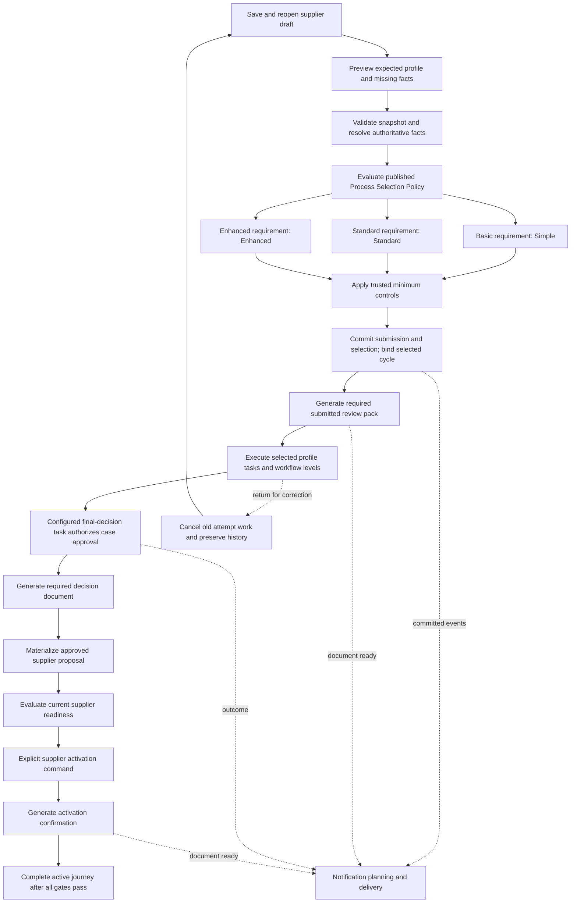

# Internal supplier onboarding: implementation plan for review

Date: 2026-09-14  
Status: Increment A started — P0 complete; P1 accepted in local DEV; P1a shared integration and ready live previews qualified; three profile/document catalogs authored; P2 submission/cycle ownership qualified in local DEV; P3 task execution qualified with controlled document readiness; P4 documents and gates accepted in local DEV with controlled upstream activation fixtures; P5 correction and closure accepted in local DEV; P6 accepted for the local DEV purchasing pilot with documented bank fixtures; P7 communications accepted in local DEV, including three fresh activation notices and temporary grant cleanup; P8 NEON integration accepted in local DEV; P9 local build and qualification accepted for the local DEV purchasing pilot
Application: Existing NEON Business Partner screens and services  
Environment: Local development build

## 1. Objective and scope

Implement internal supplier onboarding as the first complete application of the [shared governed-process architecture](../decisions/governed-case-communications-and-documents.md). Reuse the current Business Partner intake, case, workflow, governance, attachment, document, notification and activation authorities. The result must be a working NEON journey, not a separate demonstration application.

The initial prototype (Increment A) covers draft capture, a governed Compliance requirement field, validation, Process Selection Policy integration with the existing policy engine, Simple/Standard/Enhanced onboarding, required generated documents, same-profile correction/resubmission, materialization, supplier readiness, activation and journey completion. All three profiles remain initial deliverables. Cross-profile rerouting and downgrade exceptions move to Increment B; commodity/industry rules move to Increment C. The ten-task structure belongs only to Enhanced.

The existing [Standard request and Full profile intake](full-profile-prototype.md) remains the form foundation. This plan assigns its data and evidence to process responsibilities; it does not replace it with another hardcoded form. Customer onboarding, external supplier/MESH participation, electronic signatures, sourcing, purchasing and employee journeys are outside this implementation. Their shared orchestration needs inform the contracts, but they are not additional pilot deliverables.

**Local-build decision:** update canonical source, DDL, functions and active seed/authoring definitions directly. Replace the local supplier journey where applicable. Do not build upgrade migrations, dual-write paths, historical data conversion, legacy API compatibility shims or production rollout machinery for this prototype. Rebuild the affected local environment and recreate synthetic fixtures when schema changes require it. Published executions must nevertheless pin their revisions: that is a runtime correctness rule, not a migration requirement.

This document defines delivery scope. The [P0 baseline and audit](internal-supplier-onboarding-p0-baseline.md) is complete. [P1 fields and shared contracts](internal-supplier-onboarding-p1-implementation.md) are accepted in local DEV: case schema release 2, active Studio field graph revision 59, and authenticated NEON/owning-API qualification are evidenced. P1a shared policy integration and P2 submission/cycle ownership are implemented and qualified in local DEV. P3 task-owned workflows are deployed and qualified with the permitted controlled document-ready fixture; P4 documents and gates are accepted in local DEV: all three purposes are rendered, scanned, stored and downloaded for each profile, with a declared controlled upstream activation-fixture boundary. [P5 correction and closure](internal-supplier-onboarding-p5-implementation.md) are accepted in local DEV with same-profile resubmission, full re-review, explicit cancellation, terminal rejection and authenticated browser qualification. [P6 materialization and activation](internal-supplier-onboarding-p6-implementation.md) is accepted for the local DEV purchasing pilot: authenticated qualification, activation, documents and closure pass for all profiles; bank gates use the explicitly documented PostgreSQL fixture boundary. P7 communications and P8 NEON integration are accepted in local DEV. [P9 local build and qualification](internal-supplier-onboarding-p9-implementation.md) is accepted within the documented purchasing-pilot and fixture boundaries. Follow-ups B/C remain separate scopes.

### Audit disposition and delivery boundary

| Audit finding | Plan decision |
| --- | --- |
| Existing policy engine is reusable | Reuse its evaluator, authoring and simulation. Add a process-selection adapter, typed result validation, exact-version evaluation and durable selection evidence; do not create another expression engine |
| Strategic and Intercompany cannot coexist in the current single-select supplier type | Keep the existing `supplierType` / `ownershipClass` contract intact. Add an independent compliance requirement field. Remove the unrepresentable Strategic + Intercompany test from the initial build |
| Classification integrity was underspecified | Compliance requirement is an authorized business assertion, not a verified compliance result. Validate server-side minimum controls; retain actor/reason evidence. Future classification rules need declared fact owners and authority |
| Strongest-ever profile rule creates correction friction | Draft changes do not trigger a governance ratchet. Initial same-case correction keeps the accepted profile. Cross-profile changes and a separately reviewed downgrade policy are Increment B |
| Pilot scope expanded through successive edits | Explicitly separate A: complete compliance-led onboarding; B: rerouting/exceptions; C: richer fact rules. Completion of A does not claim completion of B or C |

An intake “internal supplier onboarding” channel means staff initiate the request inside NEON; it does not force `ownershipClass=internal`. Existing internal/external ownership and supplier subtype validation continues to apply.

## 2. Architecture decisions

| Area | Increment A decision |
| --- | --- |
| Business proposal | One `document.entity_case` owns the proposal and immutable submission/decision/result references |
| Journey | One cycle run starts only after accepted selection. Same-profile corrections keep the same case/run with a new submission attempt |
| Process selection | A scoped published policy maps Basic → Simple, Standard → Standard, Enhanced → Enhanced; trusted tenant/company minimum controls may strengthen the result |
| Supplier type | Preserve the existing single-select subtype and ownership cross-validation; it does not select the process in A |
| Selection evidence | Pin the requested level, policy/rule, authoritative minimum controls, submission snapshot, effective profile, execution manifest and explanation |
| Draft | Incomplete save remains supported; authorized users can correct the requested level freely before first submission; preview does not start work or lock a profile |
| Business tasks | Simple: consolidated preparation and independent approval; Standard: preparation, combined review and business approval; Enhanced: ten named tasks |
| Post-approval work | Visible materialization, banking/readiness, activation and required result-document gates remain independently applicable |
| Workflow ownership | Each review/approval task owns its execution, levels and quorum |
| Execution order | Profile tasks are sequential in A; multiple reviewers within a level may act under its quorum |
| Decision authority | Exactly one final-decision task per profile may authorize case approval; reviews and intermediate approvals only complete their tasks |
| Documents | Submitted review pack, decision document and activation confirmation pin source snapshot and template version |
| Communications | In-app and local capture email; delivery state remains separate from business state |
| Correction | Revalidate a new snapshot; restart all selected reviews/approvals if the effective profile remains unchanged. Reject unsupported same-case profile changes before creating new work |
| Activation / completion | Authorized activation rechecks current domain readiness. One evaluator controls successful cycle completion |
| Local replacement | Update current source, canonical DDL and active definitions directly; no special migration, backfill, dual-write or compatibility rollout |

Independent parallel review branches, replacement-run orchestration and downgrade-exception workflows are not hidden requirements of A.

### 2.1 Request field and profile catalog

Add a field through the published request contract and native form authoring; the inspected intake does not establish an existing field with this routing meaning.

| Property | Decision |
| --- | --- |
| Label | Compliance requirement |
| Proposed semantic key | `requestedComplianceLevel` |
| Controlled values | `basic`, `standard`, `enhanced` (displayed as Basic, Standard, Enhanced) |
| Meaning | Requested depth of onboarding governance; not “compliant”, “passed” or a completed risk assessment |
| Placement | Request governance section, available in both Standard request and Full profile form views |
| Requiredness | Optional while saving an incomplete draft; explicit valid selection required before submission; no silent Basic default |
| Authority | Requester/business owner with published field/operation permission proposes it; server validates allowed levels and mandatory minimums |
| Evidence | Retain requested value, actor and change reason. Require a reason when proposing Basic or changing a previously saved requirement; no extra workflow is created for pre-submission edits |
| Persistence | Contract-bound case snapshots; do not automatically add it as supplier master-data authority |
| Output | Selected process profile is server-owned and read-only in the client |

Final semantic IDs and labels must be checked against existing reference/field catalogs in P0/P1. Do not reuse an unrelated compliance-status field merely because its label looks similar.

| Requested level | Candidate profile | Business tasks | Final case decision |
| --- | --- | --- | --- |
| Basic | Simple | `CONSOLIDATED_PREPARATION` → `INDEPENDENT_APPROVAL` | Independent approval task |
| Standard | Standard | `CONSOLIDATED_PREPARATION` → `COMBINED_REVIEW` → `BUSINESS_APPROVAL` | Business approval task |
| Enhanced | Enhanced | T1–T10 in section 4 | `FINAL_APPROVAL` (T10) |

All three routes retain applicable validation, document and activation controls. A trusted tenant/company minimum may raise the effective profile; for example, Basic requested plus a Standard minimum yields Standard. Explain requested requirement, candidate profile and effective profile separately.

The requirement is an authorized business assertion. Role permissions, reasons and minimum-control checks do not prove its business accuracy. A reviewer can return a request believed to be understated. A later independent assessment/commodity/industry rule can derive a stronger floor. This limitation is explicit; the system must not describe the requester's choice as verified compliance.

Consolidated preparation merges assignments, not obligations. Missing specialist tasks are not fabricated as completed tasks. “Standard request / Full profile” are form views and “Simple / Standard / Enhanced” are process profiles; switching a form view cannot clear the requirement or change its meaning. Employee count does not select the profile.

### 2.2 Reuse the current policy engine precisely

The concrete reuse targets are [policy-service.ts](../../../server/packages/platform/policy/src/policy-service.ts), [json-rule-evaluator.ts](../../../server/packages/platform/policy/src/json-rule-evaluator.ts) and the [policy contracts](../../../server/packages/contracts/policy/src/policy.ts).

Verified current behavior and required integration:

- Rules within a definition are sorted by ascending priority. `first_match` stops at the first match within that definition.
- Across collected outcomes, the service chooses the winning action by action precedence (`deny` outranks `require_workflow`, for example). Numeric priority is not a global winner algorithm across policy definitions.
- Simulation returns trace and winning outcome; under `first_match`, later rules are not evaluated. Do not label them false or claim every possible matching rule was traced.
- Normal evaluation audits the decision and matched-rule IDs but does not itself persist the complete process-selection trace/manifest required here.
- Current evaluation resolves active definitions, optionally filtered by definition IDs. Extend the owner repository/service path for exact pinned revisions; passing only an ID is not exact-version selection.

**Increment A binding:** resolve exactly one published process-selection definition for the tenant/plane/process family/company scope and use `first_match`. Route rules use a consistent `require_workflow` action with a narrowly validated process-selection result in `actionConfig` identifying a registered profile. The adapter resolves that profile to the complete cycle/workflow/document manifest; it does not mistake the result for a single case-wide workflow.

Keep this evaluation scoped to the process-selection caller. Do not change generic action precedence or accidentally feed the new result shape into unrelated policy consumers. The adapter rejects an unexpected action/configuration, `none`, unavailable profile or missing manifest; the generic service's `permitted` flag alone cannot authorize cycle creation. Mandatory authorization/domain controls remain independent gates and cannot be overridden by a route result.

The shared platform policy owner retains expression evaluation, simulation and existing authoring primitives. Shared governance owns the process-selection adapter and immutable selection evidence. Control-admin/publication resolves scoped policy/profile bindings. Business Partner supplies validated request facts and domain-owned minimum controls. NEON displays preview/explanation and submits through the owning case command.

### 2.3 Initial selection rules and fact contract

| Priority | Condition | Candidate profile |
| --- | --- | --- |
| 10 | `requestedComplianceLevel === enhanced` | Enhanced |
| 20 | `requestedComplianceLevel === standard` | Standard |
| 30 | `requestedComplianceLevel === basic` | Simple |

The three predicates are mutually exclusive. Their priority order is explicit configuration, not a test of overlapping supplier classifications. All valid enum values must be covered at publication. Missing/invalid values are validation errors; a validated request with no route is a configuration error, not permission to default to Simple or Standard.

Apply trusted tenant/company minimum controls to the candidate and record the resulting effective profile. In A, a conflict fixture is Basic requested versus a Standard/Enhanced minimum. Another fixture is `supplierType=intercompany` plus Enhanced requirement, which is representable today and selects Enhanced without changing supplier type.

Proposed reusable fact envelope:

```text
facts schema/version
request: requestedComplianceLevel
context: tenant / plane / organization / company (server supplied)
controls: minimum profile and mandatory gate references (owner supplied)
source: case snapshot / fact hash / authority versions / as-of evidence
```

Resolve facts through typed adapters, not arbitrary database queries or browser-supplied control fields. Authorize the requester and field updates, validate enum values and scope, and reject attempts to submit a trusted profile or minimum control directly. Do not hardcode Basic/Standard/Enhanced routing in Business Partner service branches; publish the three rules against the existing evaluator.

Preserve the existing `supplierType` enum (`general | strategic | service | carrier | intercompany`) and its `ownershipClass` compatibility checks. Neither intercompany nor strategic type grants a route in A. An Intercompany + Strategic subtype test is invalid because those are mutually exclusive values of one field. A future orthogonal relationship/importance model is an explicit Increment C design decision, not a P1 prerequisite.

### 2.4 Preview, submission and evidence

1. Draft preview evaluates authorized current facts without creating work. Missing requirement/configuration gives an incomplete/unavailable explanation while incomplete draft save still works. Preview never establishes a strongest-ever profile.
2. First submission validates the saved snapshot, resolves exactly one effective policy revision, evaluates the request, applies mandatory controls and checks all selected bindings.
3. Atomically commit accepted submission/attempt, immutable selection evidence, cycle association and outbox intents. On validation/selection failure, do not create a cycle or reviewer work. Recheck authoritative control versions under the transaction/concurrency model.
4. Pin policy, profile, cycle/workflow/document revisions in the execution manifest. Delayed jobs and submission replay use those versions. Later publication cannot retarget an accepted journey.
5. Persist policy/evaluator version, evaluated trace and winning rule, request/fact hash, trusted control references, candidate/effective profile, manifest, actor/time/reason, attempt and idempotency identity. Not-evaluated rules remain distinguishable from evaluated false rules.
6. On same-profile correction, re-evaluate the pinned policy with corrected facts and retain the manifest; a different required effective profile is an explicit unsupported change in A, handled in section 8. Current activation controls are rechecked regardless of pinned route policy.

Selection evidence references canonical case data rather than duplicating a mutable proposal store. A client-visible preview is never trusted as the submission decision. Authorized policy rebasing of an active case is deferred.

### 2.5 Delivery increments and later fact expansion

| Increment | Scope | Completion boundary |
| --- | --- | --- |
| A — Initial prototype | Compliance field; all three full onboarding routes; preview/evidence/pinning; same-profile correction; document and activation gates | Existing NEON users can complete each route and correct ordinary data without a second orchestration mode |
| B — Profile changes after submission | Re-evaluation to another profile; replacement cycle/run association; cross-profile event isolation; separately reviewed downgrade exception policy | Stronger/weaker changes have explicit authorized behavior and preserved history |
| C — Commodity/industry policy | Governed classification facts and richer compound rules; optional supplier relationship/importance redesign | Domain-owned classifications drive explainable rules without changing the core workflow runtime |

Increment C extends the versioned fact envelope with commodity/industry classification sets and authoritative reference versions. Define fact ownership, allowed request assertions, hierarchy expansion, multiple classifications, missing/unknown values and any/all matching explicitly. Resolve taxonomy relationships and bounded derived facts in domain adapters. Reuse supported equality/membership/boolean expressions; do not assume the current evaluator already has arbitrary array intersection or taxonomy traversal operators.

Illustrative later policies: a governed restricted commodity raises the minimum to Enhanced; a configured commodity/industry combination requires specialist review; otherwise the requested requirement supplies the baseline. These are future tenant policies, not universal industry rules. Attribute the selected result to both declared and derived facts, and prove changed classification inputs cannot silently weaken mandatory controls.

A future strongest-accepted-profile rule is a stakeholder decision in B. It must distinguish an accepted submission from a draft preview, explain the cost of correcting an erroneously high selection, define who may approve a decrease and bind that approval to the exact corrected snapshot. It is not silently included in A.

## 3. End-to-end flow



Diagram arrows describe Increment A, not current implementation completeness. Corrected drafts are re-evaluated on resubmission; a changed effective profile is rejected before new work is created in A. Bank registration and company preparation can begin earlier when permitted by their existing domain services; their readiness is checked again immediately before activation.

## 4. Enhanced task catalog and shared ownership

These codes are authored in the local DEV Enhanced catalog. P3 executes their pinned task workflows; qualification uses controlled document readiness until P4 connects real case artifacts.

| Task | Code | Owner | Completion evidence / dependency |
| --- | --- | --- | --- |
| T1 | `ORGANIZATION_IDENTITY` | Requester/data steward | Required organization data in the validated submission snapshot |
| T2 | `CONTACT_AND_ADDRESS` | Requester/data steward | Required addresses, contact relationships and policy-required verification evidence |
| T3 | `REGISTRATION_EVIDENCE` | Requester/compliance contributor | Required registration/tax/certification data and admitted supporting attachments |
| T4 | `COMPANY_REQUIREMENTS` | Requester/business owner | Proposed operating-organization/company context and commercial requirements; separate company configuration remains its own authority |
| T5 | `SUBMISSION_PACKAGE` | System, with requester submitting | T1–T4 satisfied; successful submission; scanned, persisted review pack bound to that submission |
| T6 | `COMPLIANCE_REVIEW` | Configured compliance reviewers | T5; all configured review levels/quorums satisfied |
| T7 | `FINANCE_REVIEW` | Configured finance reviewers | T6; all configured review levels/quorums satisfied |
| T8 | `OPERATIONS_REVIEW` | Configured operational reviewers | T7; all configured review levels/quorums satisfied |
| T9 | `DEPARTMENT_APPROVAL` | Configured department authorities | T8; all configured approval levels/quorums satisfied |
| T10 | `FINAL_APPROVAL` | Configured final approval authorities | T9; final levels/quorums satisfied and authorized case decision committed |

T1–T4 describe preparation performed before submission. Draft UI completion indicators are provisional validation projections, not completed governance tasks. On successful submission, instantiate the cycle and project T1–T4 completion from that exact validated snapshot. T5 remains incomplete until the review document is ready. Submission must not immediately create actionable reviewer assignments or send reviewer-ready notices before T5 succeeds.

The Enhanced profile has ten business tasks plus visible post-approval system gates. Simple and Standard use their smaller catalogs from section 2.1 and the same applicable domain gates. Do not hide extra human tasks inside a gate to preserve an artificial task count. Mandatory bank/company work uses its existing screens and authorities; the onboarding view links to it and shows the resulting gate evidence.

### Reviewer model

Each configured level defines reviewer selectors, sequence, quorum, due policy and escalation behavior. Resolve candidates per task and level using actual organization/company scope and applicable permissions. The current host pattern that supplies the same candidate list to every stage must be replaced for the pilot.

Use named roles backed by synthetic principals for local fixtures; never hardcode principal UUIDs in the reusable process definition. Exclude the submitter from decision eligibility. Record resolved candidates, chosen assignees and resolution policy/version as execution evidence. Fail clearly if a required role has no eligible reviewer or quorum cannot be met.

Enhanced fixtures should exercise at least two levels per review/approval task, a level requiring all assigned reviewers, and a level with a count quorum. Simple fixtures require one independent approver; Standard fixtures exercise combined review followed by business approval. These are fixture choices; the runtime must execute the published level definitions rather than assume fixed reviewer counts.

## 5. Case, task and workflow binding

### Target relationship

```text
cycle_run
  -> cycle_task
      -> workflow execution for this task and submission attempt
          -> workflow stages / levels
              -> individual work items and decisions

cycle_subject -> entity_case -> pinned submission snapshot
submission attempt -> immutable process selection -> pinned profile/run/manifest
workflow/task execution -> same case and submission attempt
work_item.cycle_task_id -> actual governance task ID
```

Keep `workflowRequestId`, `workflowStageId`, `workItemId`, `cycleRunId` and `cycleTaskId` distinct throughout API contracts, event payloads, database writes and UI adapters. Existing supplier paths using cycle-named fields to carry workflow/work-item IDs must be replaced consistently; do not retain misleading aliases in this local replacement.

The existing case view assumes a current case-wide workflow. Extend it to expose task-owned executions and current actionable work items, with explicit attempt and outcome scope. Query selection must use those coordinates, not simply the latest workflow row for a case. A case can have several workflow executions across tasks and correction attempts.

Extract/reuse the existing stage progression and quorum logic under the workflow owner. The Business Partner repository supplies case/domain context; it must not remain the only implementation of reusable task workflow execution. Workflow completion yields a typed task outcome. A separate authorized adapter applies the appropriate domain command.

### Outcome rules

| Outcome | Effect |
| --- | --- |
| One reviewer accepts | Record decision; evaluate that level's quorum |
| Level succeeds | Activate the next level, if any |
| Enhanced T6/T7/T8 or Standard combined review succeeds | Complete that review task; case remains awaiting the overall decision |
| T9 succeeds | Complete department approval; activate final approval |
| Selected profile’s final-decision task succeeds | Simple independent approval, Standard business approval or Enhanced T10 commits the case decision through the lifecycle command; record decision snapshot and complete the task |
| Authorized return | Enter correction flow; stop current attempt's downstream work |
| Authorized rejection | Commit rejected case decision and close remaining work without representing success |

Review UI uses “Accept review” and “Return for changes”; approval UI uses “Approve”, “Return for changes” and “Reject” where allowed by policy. Underlying vote storage can reuse existing decision structures only if outcome scope is explicit and an accepted review cannot invoke final case approval.

## 6. Document generation and gates

| Document | Source | Generation trigger | Gate | Recipients |
| --- | --- | --- | --- | --- |
| Supplier review pack | Exact submitted snapshot plus allowed evidence references | Committed submission attempt | Required before any profile’s first human decision task; Enhanced T5 completes only when ready | Eligible reviewers through authenticated task access |
| Supplier decision document | Exact decision snapshot and referenced review outcomes | Committed approval/rejection decision | On approval, required before materialization; on rejection, tracked as closure evidence | Requester and authorized owners |
| Supplier activation confirmation | Result snapshot and activation evidence | Successful activation | Required before successful journey completion | Requester and authorized relationship owners |

Implement a Business Partner document projection adapter that loads and authorizes the pinned source. The browser selects a permitted document purpose; it must not supply arbitrary business data that the generator treats as approved facts. Sensitive fields remain masked or omitted according to purpose and recipient access. Protected identifiers and secrets must never enter general notification payloads or review PDFs.

Extend the render contract to accept and persist trusted source provenance and exact document-template selection. Persist source snapshot ID/hash, document purpose, projection version, template version/checksum, case/cycle/task/attempt and selection/profile coordinates, attachment version/hash and command/job identity. Do not assume the current render service's effective-date template lookup or `versionPolicy: current` establishes this binding.

Document generation executes after the business transaction through durable work. Its stages are request → render → scan → store/register → document-ready evidence → evaluate owning gate. The business transaction must not hold locks during PDF rendering or a provider call. Reuse existing durable jobs and document/attachment authorities; add only bounded missing persistence to canonical DDL where source/job/artifact correlation cannot otherwise be enforced.

Use a stable render identity derived from case, attempt, document purpose, source snapshot and template version. Same request retries reuse the result. Changed input under that identity is a conflict. Failed rendering/scanning keeps only its required gate blocked and exposes a retry action to an authorized operator.

Pin the attachment version when notifying reviewers or communicating a decision. Do not generate a new PDF for every reviewer. Return/resubmit produces a new review pack; old versions remain evidence and cannot satisfy the current attempt's gate.

Activation confirmation is generated after activation and blocks journey closure, not activation itself. This avoids a circular requirement for proof of an action that has not yet occurred. Similarly, decision-document failure does not undo an accepted approval; it blocks the next configured step.

## 7. Communication design

P7 implementation and qualification boundaries: [Communications implementation](internal-supplier-onboarding-p7-implementation.md).

Use the existing outbox → routing/planning → message/delivery ledger → channel-handler pipeline. Configure one canonical notification source for each pilot milestone, so generic work-item creation and Business Partner events do not both produce duplicate assignment alerts.

| Milestone | Audience | Behavior |
| --- | --- | --- |
| Submission accepted | Requester | Confirm submission; show review-pack preparation status |
| Review/approval level actionable | Current eligible assignees | In-app assignment and locally captured email with authenticated task link |
| Reminder / SLA escalation | Current assignee and configured escalation recipient | Recheck that the task, level and attempt are still active before sending |
| Returned for changes | Requester | Correction reason and case link; exclude restricted review notes |
| Final decision | Requester / authorized owners | Outcome notice; attach/link the decision document only after it is ready |
| Activation confirmation ready | Requester / authorized relationship owner | Result notice with access-controlled pinned document link |
| Persistent document/delivery failure | Authorized operational owner | Operational attention; no fabricated business rejection or approval |

Prefer links; permit embedded email documents only when configured and recipient-authorized. Apply implemented preference, consent and mandatory-message policies explicitly. A label such as `mandatory_transactional` must not be treated as proof that all dispatch paths implement the intended policy.

Compose the notification attachment resolver with a real recipient access policy in the host. A helper existing in a package is insufficient: current host wiring requires an injected access policy. Verify eligible/unauthorized recipients, expired/revoked artifacts and required-attachment failure.

Track delivery states independently from business states. Captured email is labelled as local transport evidence. Receipt, opening, reply, acknowledgement, ownership verification and signature are not interchangeable. The pilot provides authenticated NEON actions; it does not accept approval by email reply.

## 8. Correction, rejection and retry rules

### Increment A: same-profile correction

1. Authorize the returning actor against the current work item/attempt; require a reason.
2. Commit the case correction transition and immutable evidence.
3. Cancel outstanding work items and pending stages for that attempt; stop stale reminders and preserve prior decisions/artifacts as historical evidence.
4. Reopen the existing draft using the established case lifecycle semantics. Display “Returned for changes” from authoritative evidence where editable storage status is `draft`.
5. Permit authorized draft amendments and current validation. Requirement edits before the first accepted submission remain freely correctable and never create an exception workflow.
6. On resubmission of a returned case, evaluate the corrected requirement against the pinned policy and trusted controls. If the effective profile remains the same, create a new attempt/snapshot, retain the existing run/manifest, re-evaluate preparation evidence, generate a new pack and restart all selected reviews/approvals.
7. If the effective profile would change, retain the saved draft but reject resubmission with an explicit “This correction requires a different onboarding profile; changing the process for this case is not supported in this prototype” outcome. Do not silently keep an insufficient weaker route, mutate the run template or create new work.

For A, an actor who needs a different process can explicitly close/cancel the unmaterialized proposal under the authorized case/cycle command and create a new request. Preserve the old evidence and display a reference to the replacement request where available. Do not auto-cancel, auto-copy confidential data, or call this same-case rerouting. A rejected/closed old proposal must no longer have active decision work. P5 includes the bounded explicit cancellation path if the existing command surface lacks it.

This boundary applies to stronger and weaker profile changes. It is a visible prototype limitation; it is not a strongest-ever requirement ratchet or an approval to bypass mandatory controls. A requirement value may change within a returned draft when controls still resolve to the same effective profile; record the new facts and selection evidence for the attempt.

All required reviews/approvals restart after an accepted same-profile resubmission. Selective reuse of prior decisions is deferred. Late events, links and document callbacks from cancelled attempts cannot advance current work.

### Increment B: cross-profile rerouting and exceptions (deferred)

Implement B only after its policy choices are reviewed. Retain the case as the stable episode; if a new selected profile needs another template, cancel the old run with a rerouted reason and bind a replacement run atomically. Never rewrite its pinned template or historical completed tasks. Enforce one active attempt/run association, idempotent replay and isolation from superseded events. Rerouted-run cancellation is not supplier rejection.

Resolve the operational policy explicitly: which increases may proceed automatically on resubmission, whether decreases retain the previously accepted stronger route by default, who may approve an exception and how to handle an erroneously high original selection. Any exception must be independently authorized, reasoned, versioned and bound to the corrected case snapshot and permitted controls. Draft previews never participate in this rule. These workflows and their UI are not A deliverables.

### Rejection and explicit cancellation

Rejection is terminal for the proposal: preserve decision evidence, cancel downstream work and generate the decision document. Use the cycle’s existing `cancelled` status with rejected-case evidence; never mark it successfully `completed`. The rejection document is durable follow-up work even after unsuccessful closure. Explicit requester/owner cancellation uses its own authorized reason and must not emit a reviewer-rejection notice. A later proposal begins a new case.

### Transaction and replay boundaries

- Case mutations, decision evidence, task/workflow changes and their outbox intents commit atomically where they share a transaction boundary.
- Asynchronous consumers use durable idempotent processing, retry and recorded terminal failure; do not claim exactly-once delivery.
- Check expected case/task/work-item versions and attempt identity. Stale links cannot decide new work.
- Renderer/storage/provider calls are recoverable side effects, not a distributed database transaction.

## 9. Materialization, readiness and activation

After final approval and the required decision artifact, the authorized materialization command creates the approved Business Partner/supplier records and snapshot lineage. Case approval cannot independently certify operational supplier qualification. Replace the current shortcut that treats case approval as sufficient completion evidence for a task labelled qualification; actual qualification/readiness remains under its domain owner.

The readiness evaluator must report named gates with `satisfied`, `pending`, `blocked` or policy-supported `not_applicable` disposition, current evidence references, responsible owner and allowed next action. These are proposed API dispositions, not current database status literals.

Required gates include:

- Approved case and matching successful materialization.
- Required operating-organization/company configuration.
- Applicable supplier qualification and current supporting evidence.
- Required commercial/payment setup.
- Protected bank registration and independent bank verification where policy requires them.
- Current risk/block checks and other existing activation conditions.
- No unresolved mandatory process work or blocking critical deviations.

Activation rechecks current volatile conditions and expected record versions. A readiness result from an earlier screen load cannot authorize activation after evidence expires or a new block is raised. Do not make bank requirements universally mandatory: policy determines applicability, and any bypass needs the existing governed authority.

Successful cycle completion requires: all required tasks from the effective selected profile satisfied for the current accepted attempt, with valid pinned selection evidence; approved materialization; activation evidence; required activation confirmation; and no outstanding mandatory child work or critical deviation. Both the generic cycle service and Business Partner coordinator must use the same completion evaluation. Remove the coordinator's independent “all tasks completed means close” shortcut.

## 10. Existing NEON experience

Extend the current request workspace, case review panels and supplier 360 surfaces. Reuse application navigation, API transport, descriptor-driven forms and established components.

| Surface | Required change |
| --- | --- |
| Request overview | Show expected/selected profile, explanation, case decision, onboarding progress and supplier activation separately; show next actionable owner/step |
| Details | Add Compliance requirement and reason to both form views; preserve incomplete draft save, validation, protected capture and supplier type/ownership rules |
| Journey | Show selected profile tasks, current attempt, dependency and owner; show post-approval gates and prior attempt history. Replacement-run history belongs to B |
| Process preview and correction | Explain requested requirement, candidate/effective profile, winning rule and minimum control; allow draft corrections and clearly report unsupported post-submission profile changes. No downgrade-exception UI in A |
| Reviews and approvals | Group levels/work items under their owning task; show current quorum and allowed actor action; display read-only historical attempts |
| Documents | Show purpose, source revision, ready/failed state, approved download action and authorized retry where applicable |
| Communications | Show event, recipient audience and delivery state under appropriate access; offer operational retry only where authorized |
| Activity | Combine references to real case, task, decision, document and delivery evidence; do not manufacture audit events from timestamps or row versions |
| Supplier result / 360 | Link to materialized records and actual readiness/activation commands; do not display “Active” from case approval alone |

Buttons depend on server-provided capabilities and current versions; the server repeats authorization and gate checks. Technical IDs/hashes belong in expandable evidence details, not the main requester flow. Required document failures must explain what is waiting and who can act, without making the reviewer click an action that is known to be unavailable.

## 11. Contracts, persistence and source ownership

| Owner / source area | Planned work |
| --- | --- |
| Existing platform policy contracts/service/authoring | Reuse evaluator, rule authoring, simulation and first-match behavior; add exact-revision access and validate the scoped process-selection result without changing general action precedence |
| `server/packages/contracts/control-admin` and control-admin authoring | Scoped policy/profile bindings, complete three-value mapping, typed task/outcome/gate definitions and publication validation |
| `server/packages/contracts/governance` and platform governance | Adapter over existing policy owner, immutable selection evidence, same-run attempt association, task/workflow links and readiness; replacement-run/exception mechanisms deferred to B |
| `server/packages/contracts/workflow` and platform workflow | Reusable task-owned execution, levels/quorum, candidate resolution evidence and completion outcomes |
| `server/packages/contracts/master-data` and services/master-data | Compliance requirement contract, authorized request/minimum-control facts, selection orchestration, unchanged-profile correction guard, domain readiness and document projection |
| services/publication and Studio Business Partner authoring | Publish compatible entity, cycle, workflow, document and notification definitions; resolve reviewer selectors by scope |
| services/documents and contracts/documents | Exact template/source pinning, durable artifact provenance and recoverable render completion |
| platform/notifications | Canonical event routing, recipient authorization, pinned artifact delivery and stale-reminder handling |
| platform-host composition | Wire the real services, authorizers, document jobs, notification attachment access policy and command adapters |
| `packages/planes/neon/business-partner` | Journey/task views, document/communication panels, corrected IDs and actionable gate UI |
| Canonical DDL, active seeds and provisioning | Replace local supplier definitions, add missing bounded schema constraints and seed synthetic reviewers/templates/routes |

Published binding contracts need: process family, policy/profile revisions, declared fact schema and authority, first-match priority, exhaustive enum coverage and minimum controls, execution manifest, task template identity; execution kind; workflow definition/version/hash; task versus case outcome scope; launch/completion dependencies; document purpose/template/input projection; recipient policy; gate applicability; and retry identity. Runtime evidence needs tenant/plane/scope, policy/evaluator version, matched/winning rules, fact evidence/hash, candidate/effective profile, selection identity, cycle/task/case, attempt, workflow/stage/work item, source snapshot and artifact coordinates. Persist an immutable selection record per accepted attempt and enforce its association with the existing case/run. Do not implement replacement-run or downgrade-exception persistence in A solely for speculative future use. Add bounded canonical schema where those identities cannot be enforced in current projections; do not hide authoritative selection solely in untyped `cycle_run.data`.

Prefer existing normalized tables and immutable snapshots. Do not add a generic mutable process payload or duplicate supplier proposal store. Where existing tables lack enforceable ownership/attempt/provenance coordinates, update canonical schema directly with tenant-composite constraints and uniqueness for replay. Database trigger/command rules, repositories, contracts and UI parsers must change together.

## 12. Local build replacement

1. Inventory the affected canonical DDL, active seed packs, native authoring scripts and generated contracts. Read current runtime definitions rather than relying on historical seed backups or old execution reports.
2. Update these sources directly. Publish the compliance requirement field in both intake views and replace the supplier cycle/workflow definitions with three profile catalogs and their compliance mapping policy; add published document templates/bindings, notification routes and role assignments.
3. Update the normal local build/provisioning entry points to apply the replacement. Do not add special migration files or an alternate prototype-only runtime.
4. Rebuild affected local schemas/services as needed and regenerate disposable supplier fixtures. Preserve unrelated workspace changes and avoid modifying unrelated application data as part of a targeted fixture reset.
5. Produce a resolved configuration report listing the actual selection-policy/profile/cycle/workflow/document/notification revision coordinates, reviewer assignments and required provider/runtime capabilities.
6. Run the full pilot against the rebuilt local NEON environment using synthetic records and capture email. Confirm that a clean rebuild reproduces the same configuration and behavior.

No historical backfill, dual operation or production cutover is required. No operational rebuild is performed during this planning turn.

## 13. Increment A implementation work packages

Each package has an observable exit condition. B and C are separate follow-up scopes, not hidden acceptance gates for A.

**P0 completed 2026-09-14:** [reuse inventory and P1 handoff](internal-supplier-onboarding-p0-baseline.md), [captured local configuration](internal-supplier-onboarding-p0-evidence.json). Active intake preview revision 58, published case contract, existing eight-task cycle revision 2, absent selection policies and absent supplier document templates are recorded with exact coordinates. This is baseline evidence, not Increment A qualification.

**P1 accepted in local DEV 2026-09-14:** [implementation and qualification](internal-supplier-onboarding-p1-implementation.md), [publication, live API/browser and database evidence](internal-supplier-onboarding-p1-evidence.json). Both fields, server validation, shared selection/task/document coordinates and publication compiler are implemented. Cirrus Atlantic case schema release 2 and Studio field graph revision 59 are active. Both rendered form views and owning APIs pass P1 qualification. A separate draft replay conflict is recorded for P2; no replay success or P1a runtime selection is claimed.

**P1a shared integration implemented and qualified 2026-09-14:** [owner contracts, implementation and handoff](internal-supplier-onboarding-p1a-implementation.md), [real PostgreSQL evidence](internal-supplier-onboarding-p1a-evidence.json). Exact-revision policy evaluation, scoped first-match publication, minimum controls, preview registrar and immutable evidence are implemented. Controlled catalog references remain explicit test doubles. DEV source API mounting, NEON relay and exact catalog resolvers are deployed and qualified. The live scoped policy and all three A profile/document catalogs are authored. Authenticated Basic/Standard/Enhanced previews return ready with 2/3/10 tasks and exact document pins; real Gotenberg rendering and ClamAV scanning qualify the three authored templates. P2 owns atomic submission and durable document-job dispatch; P3/P4 retain task execution, document processing/storage and gate callbacks; P8 consumes the mounted API in its views.


**P2 implemented and qualified 2026-09-14:** [submission/cycle ownership](internal-supplier-onboarding-p2-implementation.md), [live and database evidence](internal-supplier-onboarding-p2-evidence.json). Authenticated Basic/Standard/Enhanced submissions atomically pin the selected policy/manifest and submitted snapshot, create one run/attempt, project preparation tasks and commit one review-pack job/dispatch. Concurrent replay returns the accepted IDs without reevaluation. Human tasks and case decisions remain document-gated. P3/P4 own workflow execution and durable document processing/results.

**P3 implemented and qualified 2026-09-14:** [task-owned reviews and approvals](internal-supplier-onboarding-p3-implementation.md), [qualification evidence](internal-supplier-onboarding-p3-evidence.json). The shared workflow runner executes 1/2/5 human tasks for Simple/Standard/Enhanced, resolves each level by scoped role, enforces maker-checker/quorum and commits case approval only from the final task. Authenticated task APIs and NEON relay are deployed. Real PostgreSQL command qualification uses the controlled document-ready fixture explicitly permitted for P3; live pending document jobs stay blocked. P4 and final A qualification must connect and verify real case rendering/storage/scanning.


**P4 accepted in local DEV 2026-09-14:** [documents and gates](internal-supplier-onboarding-p4-implementation.md), [qualification evidence](internal-supplier-onboarding-p4-evidence.json). All three profiles have real review packs, decision documents and activation confirmations, with exact provenance, Gotenberg rendering, ClamAV scanning, S3 storage, authenticated downloads and successful gate callbacks. Thirteen authenticated task votes produced final decisions; owning APIs materialized the suppliers. Activation uses explicitly controlled upstream readiness fixtures and the existing readiness/lifecycle repositories. Replay, failure isolation, current recipient checks and separate materialization/closure gates are qualified. P6's complete readiness/activation workflow and payment readiness are not claimed by this P4 fixture.

**P5 accepted in local DEV 2026-09-14:** [same-profile correction and closure](internal-supplier-onboarding-p5-implementation.md), [qualification evidence](internal-supplier-onboarding-p5-evidence.json). All three profiles retain their exact run/policy/manifest while creating new attempts, packs and complete re-review. Concurrent replay, historical evidence, stronger/weaker profile-change rejection without new work, explicit cancellation/new-request navigation, terminal rejection documents and stale-execution isolation are qualified through owning APIs, PostgreSQL and Chromium. P6–P9 and follow-ups B/C remain separate scopes.

**P6 accepted for the local DEV purchasing pilot 2026-09-14:** [implementation and qualification boundaries](internal-supplier-onboarding-p6-implementation.md), [evidence](internal-supplier-onboarding-p6-evidence.json). All three profiles complete authenticated supplier/company materialization, independent qualification and activation, real activation confirmations, closure/replay and browser readiness checks. Payment and linked-bank gates are qualified with real PostgreSQL owners and governed commands using rolled-back fixtures; external Mesh bank intake/verification is not claimed. Temporary authorized DEV grants were revoked. P7–P9 and follow-ups B/C remain separate scopes.


**P8 accepted in local DEV 2026-09-15:** [NEON integration and qualification boundaries](internal-supplier-onboarding-p8-implementation.md), [acceptance evidence](internal-supplier-onboarding-p8-evidence.json). Existing screens expose saved-fact previews, dynamic task/level/quorum evidence, same-profile correction and explicit profile-change refusal, authorized document actions, recipient-only communications, historical attempts and scoped readiness controls. Real NEON buttons qualify all three profiles, full re-review, rejection and cancellation. Six user/profile checks verify nine stored PDF hashes and exact readiness links; an old document notice retains its historical job without current actions. P8 also resolves the P5/P6 closure-pin conflict without relaxing the immutable run guard. No new temporary grants or migrations were introduced. P9 and follow-ups B/C remain separate scopes.

| Package | Work | Exit condition |
| --- | --- | --- |
| P0 — Baseline and audit confirmation | Inventory published intake fields, supplierType/ownership constraints, existing policy semantics/authoring, runtime contracts, templates and local dependencies | Concrete reuse inventory; no assumption of independent Strategic/Intercompany fields or an existing routing-compliance field |
| P1 — Field and shared binding contracts | Publish requirement/reason fields; allowed enum/permissions; typed selection result, exact policy/profile/manifest/attempt coordinates and task/gate bindings | Both form views/API validate the field; compiler covers all three values and rejects ambiguous/unsafe results; no supplier-type split |
| P1a — Existing policy integration | Add scoped process-selection adapter; one first-match definition, consistent result action, minimum-control validation, preview and durable trace/evidence | Basic/Standard/Enhanced map correctly; no new expression engine; absent result never launches a cycle; exact revision evaluation verified |
| P2 — Submission/cycle ownership | Atomically validate/select/pin/create run and attempt; project preparation work; dispatch review-pack generation | One accepted selection/run on replay, no decisions before document readiness, no stale-policy retargeting |
| P3 — Task-owned reviews/approvals | Reuse/extract runner; configure the three profile catalogs; resolve reviewers per level, bind work items and designate final decision | Each route runs real commands; intermediate reviews cannot approve case; maker-checker/quorum hold |
| P4 — Documents and gates | Authorized snapshot projection, exact template selection, durable render jobs, scanning, provenance and gate callbacks | All three document purposes are generated; failures preserve business state and block only their required step |
| P5 — Same-profile correction and closure | Cancel old attempt work, preserve evidence, new snapshot/pack, full re-review; reject profile-changing resubmission; authorized rejection/cancellation | Same-profile correction works; different profile creates no new work; explicit close/new-request path retains history |
| P6 — Materialization/activation | Reuse materializers and readiness owners; consolidate completion evaluation and link bank/company work | Approval, materialization, activation and closure remain distinct and gated for all profiles |
| P7 — Communications | Pilot events/templates, recipient access resolver, pinned links, reminders, capture delivery | One eligible notice per milestone; stale reminders suppressed; failed delivery cannot change business outcome |
| P8 — NEON integration | Requirement field, profile preview, dynamic task views, same-profile corrections, documents, communications and readiness actions | Full A scope works in existing screens; unsupported profile changes are explained rather than silently rerouted |
| P9 — Local build/qualification | Direct canonical definition updates; three requirement/profile fixtures, scope/minimum-control fixtures, full acceptance | Reproducible local build and real service/database/browser evidence; no migration scripts |

P1a precedes P2. P4's contract is designed in P1; P2's document gate uses that contract. P3 tests may use controlled document-port doubles until P4 is connected, but final qualification must use real rendering/storage. P5/P6 depend on actual task and case outcomes. P7 consumes established committed events. P8 is accepted only against the owning APIs.


**P9 accepted for the local DEV purchasing pilot 2026-09-15:** [reproducible commands and acceptance coverage](internal-supplier-onboarding-p9-implementation.md), [fresh qualification evidence](internal-supplier-onboarding-p9-evidence.json). Complete Studio/NEON canonical builds, native form reconstruction, runtime/catalog publication replay, three live requirement fixtures, trusted minimum/correction fixtures, 13 database suites, six browser journeys, nine real PDF downloads and three Mailpit/inbox activation-notice checks pass. P9 fixes missing communication manifest wiring, first-contract bootstrap, tenant seed audit context and incomplete-draft serialization. No migrations or new live grants were introduced. The recorded P6/P7 purchasing and bank-fixture boundaries remain explicit; follow-ups B/C are excluded.

**Follow-up B:** define/review post-submission increase/decrease policy, add replacement-run/active-association semantics and any independent exception command/UI, then qualify stale-event isolation and concurrent rerouting. **Follow-up C:** define authoritative commodity/industry facts and taxonomy semantics, publish compound rules, evaluate classification-model changes only if needed and qualify overlap/missing-fact behavior. Neither follow-up needs special migrations in the local-build approach, but neither is implemented as part of A.

## 14. Acceptance test matrix

### Increment A — required

| Scenario | Required result | Verification level |
| --- | --- | --- |
| Incomplete draft save/reopen | Missing requirement or selection configuration does not prevent permitted draft save; no run starts | Service + browser |
| Requirement contract and form views | Controlled field/reason survives Standard/Full profile switch; API cannot bypass enum/field authorization | Contract + API + browser |
| Draft entry correction | Enhanced preview changed to Basic before first submit creates no strongest-ever lock or exception | Service + browser |
| Basic → Simple | Consolidated preparation and independent approval, documents, materialization and applicable readiness/activation | Policy + database + browser |
| Standard → Standard | Combined preparation/review/business approval and shared downstream gates | Policy + database + browser |
| Enhanced → Enhanced | All ten Enhanced tasks, documents and downstream gates | Policy + database + browser |
| Intercompany + Enhanced requirement | Valid ownership/type remains intercompany/internal; independent requirement selects Enhanced | Validator + policy + browser |
| Existing ownership/type compatibility | Invalid internal/general or external/intercompany combinations remain invalid; no imaginary Strategic + Intercompany subtype fixture | Service + database |
| Requested versus minimum control | Basic requested with Standard/Enhanced minimum selects stronger effective profile with explanation; applicable bank/qualification checks remain | Policy + domain integration |
| Requirement integrity | Unauthorized field/control tampering denied; Basic/change reasons retained; requester assertion is not labelled verified compliance | Authorization + API |
| Missing requirement / no route | Invalid/missing values fail submission; missing mapping/configuration or `none` outcome creates no run; no silent fallback | Compiler + policy + database |
| Policy semantics | Single scoped first-match definition chooses expected rule; unexpected action/config and ambiguous priorities rejected; unrelated action precedence unchanged | Policy integration |
| Trace fidelity and version pinning | Persist evaluated trace/winner/manifest; unevaluated rules not reported false; delayed jobs and replay use exact accepted revisions | Service + database |
| Tenant/company isolation | Correct scoped binding/minimum/roles; other tenant facts/evidence inaccessible; capability gaps do not silently weaken governance | Authorization + database |
| Preview versus submit | Preview creates no work; changed request/control facts are rechecked; client-supplied profile cannot override selection | API + browser |
| Submission replay/concurrency | One run/accepted attempt and corresponding render/workflow intents | Database concurrency |
| Multilevel quorum / eligibility | Partial/duplicate votes cannot complete levels; correct scoped reviewers; submitter excluded; impossible quorum fails | Workflow + database |
| Early case approval | Standard review and Enhanced intermediate tasks cannot approve/materialize/activate; one final-decision task per profile | Service + database |
| Same-profile correction | New snapshot/attempt/pack, same run, all selected reviews restart, historical evidence retained | Database + browser |
| Changed effective profile after return | Saved draft retained; resubmission rejected before new work; no automatic weaker/stronger routing or template mutation | Database + browser |
| Changed requirement, same effective profile | When minimum controls keep profile unchanged, record corrected facts and accept a new attempt without rerouting | Policy + database |
| Explicit cancellation/new request | Authorized closure stops old work, preserves history and permits separate new proposal; no automatic cancellation or false rejection notice | API + database + browser |
| Rejection | Terminal proposal, downstream cancellation, retained decision artifact; no successful journey completion | Database + browser |
| Document render/scanning failure | Required gate blocks, accepted business state remains, retry creates one accepted artifact | Document integration |
| Source/recipient integrity | Pinned source/template/artifact; revoked/cross-tenant/unauthorized recipient denied | Document + authorization integration |
| Delivery failure/replay | Independent retry evidence; no duplicate business decision or premature completion | Notification integration |
| Stale reminder/callback | Cancelled attempt cannot remind or advance current attempt | Jobs + integration |
| Materialization failure/replay | No assumed partial success or duplicate supplier/children | Database |
| Readiness changes | Current expired verification/qualification or new block prevents activation despite earlier readiness | Domain + database |
| Post-activation document failure | Supplier remains active; cycle waits for required confirmation | Database + browser |
| Clean local rebuild | Field, three profile/policy catalogs, roles/templates/routes reproduce without migrations | Local qualification |

### Increment B — deferred qualification

Test automatic increases only once that policy is agreed; test independently authorized decreases if adopted; test erroneous-high-selection recovery, exact snapshot-bound exception evidence, replacement-run concurrency/replay, one active association and late old-run events. Do not report these as passing or as part of A completion.

### Increment C — deferred qualification

Test authoritative commodity/industry lookup, hierarchy and multiple classifications, any/all rules, overlap precedence, missing/unknown facts, compound conditions, revision pinning and attempted control weakening. An orthogonal Strategic + Intercompany test is valid only after an explicit fact-model change, not by injecting contradictory values into the current subtype field.

Use focused package checks during development, then actual database transaction/concurrency and browser tests. Report unrelated existing failures separately. Mock/source-pattern tests do not prove live integration. Real external email/provider delivery is not an acceptance-suite side effect.

## 15. Increment A definition of done and review decisions

A is complete when requesters and configured reviewers use existing NEON screens to select Basic, Standard or Enhanced compliance requirement and complete the corresponding Simple, Standard and Enhanced onboarding routes, including same-profile correction. Policy evaluation reuses the existing platform implementation; exact selection/manifests are pinned; task authority/quorum, document gates, domain activation and local capture communications are demonstrated against real local services.

Required deliverables: published requirement/reason fields in both form views; scoped policy adapter and complete three-value rules; authorized minimum controls; selection preview/evidence; shared task bindings and supplier adapters; canonical DDL/active configuration updates; working NEON panels; three document purposes/templates; in-app/capture-email routes; automated tests; local setup runbook and qualification evidence. No supplier-type split, replacement-run workflow, downgrade-exception workflow, commodity/industry rules or migration package is required for A.

Reviewers should explicitly assess:

- The field name/meaning and who can propose or change it; the policy-defined minimums that prevent lower-governance selection where prohibited.
- The distinction between requester assertion and independently verified compliance.
- Three complete route implementations in A, with the ten-task structure limited to Enhanced.
- Free authorized draft correction before submission and the explicit same-profile-only boundary afterward.
- The operational cost of close/new-request for a process change until B ships; a strongest-accepted-profile/downgrade policy remains a deliberate B decision.
- Richer commodity/industry facts and any supplier classification redesign as C rather than speculative initial schema work.

This revision supersedes the earlier all-in-one pilot scope. A completion does not imply B/C implementation or deployed qualification.

## 16. Source references

- [Existing intake prototype](full-profile-prototype.md)
- [Governed process architecture](../decisions/governed-case-communications-and-documents.md)
- [Cycle template contract](../../../server/packages/contracts/control-admin/src/cycle-config.ts)
- [Cycle execution service](../../../server/packages/platform/governance/src/cycles/cycle-execution-services.ts)
- [Business Partner onboarding coordinator](../../../server/packages/services/master-data/src/business-partner-onboarding-cycle.ts)
- [Business Partner request service](../../../server/packages/services/master-data/src/business-partner-request-service.ts)
- [Business Partner case/workflow repository](../../../server/packages/services/master-data/src/kysely-business-partner-case-repository.ts)
- [Workflow contracts](../../../server/packages/contracts/workflow/src/authoring.ts)
- [Document service](../../../server/packages/services/documents/src/document-service.ts)
- [Notification attachment resolver](../../../server/packages/services/documents/src/notification-attachment-resolver.ts)
- [Notification planner](../../../server/packages/platform/notifications/src/notification-planner.ts)
- [Host service composition](../../../server/apps/platform-host/src/composition/register-services.ts)
- [NEON request workspace](../../../packages/planes/neon/business-partner/src/request-workspace.tsx)
- [Canonical supplier cycle seeds](../../../server/db/ddl/planes/neon/control/12_reference_seed.sql)

- [Existing policy service and winner semantics](../../../server/packages/platform/policy/src/policy-service.ts)
- [Existing bounded expression evaluator](../../../server/packages/platform/policy/src/json-rule-evaluator.ts)
- [Policy result/evaluation contracts](../../../server/packages/contracts/policy/src/policy.ts)
- [Supplier ownership/subtype validation](../../../server/packages/services/master-data/src/business-partner-request-validator.ts)
- [Existing supplier subtype selector](../../../packages/planes/neon/business-partner/src/role-extension-experience.tsx)
