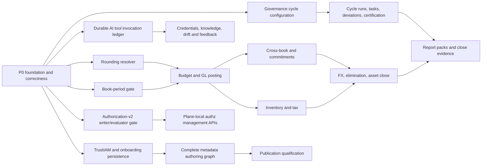

# DDL-to-Service-Layer Build Plan

**Status:** Proposed for review  
**Prepared:** 2026-08-11  
**Review 1 amendment:** Folder placement aligned to three-plane DDL ownership and the 2026-08-10 package-ownership matrix  
**Source audit:** Athyper Server — DDL vs. Service Layer: Full Status Report, dated 2026-08-11  
**Repository scope validated:** `server/packages`, `server/apps/platform-host`, `server/db/ddl`, and the active authorization-v2 architecture documents

## 1. Executive decision

Treat the audit as a backlog seed, not as the current implementation baseline. The central conclusion remains valid: Athyper has strong runtime infrastructure and materially incomplete business services above finance, governance, AI accountability, Studio authority, and control schemas. However, several audit findings are stale or incomplete in the current checkout.

The recommended delivery order is:

1. Close cross-cutting correctness gaps and establish service contracts, database integration tests, idempotency rules, and package composition conventions.
2. Build the finance posting-control spine: rounding resolution, book-period gates, budget/GL posting, and balances.
3. Build governance cycle execution and evidence services, including consent and moderation bridges.
4. Make the AI tool lifecycle durable before expanding AI autonomy, credentials, knowledge, or monitoring.
5. Complete Studio TrustIAM/onboarding persistence and extend the existing metadata-authoring aggregate.
6. Deliver authorization management through the accepted authorization-v2, plane-local ownership model.
7. Add control administration by separating mutable tenant overrides from platform catalogs that remain seed/publication managed.
8. Qualify each vertical with live PostgreSQL concurrency, RLS, replay, recovery, and rollout evidence.

This is a multi-release program. Under the staffing assumptions in section 11, plan for **13–16 two-week sprints elapsed** with three backend streams and shared database, security, QA, and SRE support. Finance, governance, and AI can run in parallel after the foundation gate; their internal dependencies cannot be skipped.

## 2. Corrected current-state baseline

The audit's overall `~52%` score should not be used as a release KPI until the table-to-command matrix is regenerated from the current tree. Use capability exit gates instead of a single blended percentage.

| Domain | Audit statement | Current repository evidence | Planning disposition |
|---|---|---|---|
| Finance/ledger | Empty service | Confirmed: `server/packages/services/finance/src/index.ts` exports nothing | Greenfield P0 business vertical |
| Governance schema | No service package | Confirmed for the nine `governance.*` tables; job/audit classes named “governance” do not implement this schema | Greenfield P0/P1 platform vertical |
| TrustIAM | No package | Partially stale: IAM contains a durable `identity_provisioning_request` create/replay path and organization projection verification logic | Extend existing IAM/Studio authority code; do not duplicate provisioning |
| Onboarding | No package | Stale: a Studio onboarding saga, one reconcile route, tests, and job definitions exist; no Kysely repository or complete host composition was found | Persistence and lifecycle completion, not greenfield |
| Metadata authoring | Read cache only | Stale: change-set/release authoring, validation, testing, publishing, activation, rollback, a Kysely repository, routes, and host registration exist | Extend the aggregate to uncovered metadata tables and harden concurrency |
| AI | Runtime exists; persistence gaps | Confirmed and broader: governed tool logic exists, but the host does not compose the AI package and no durable tool-proposal/invocation repository was found | Durable accountability and composition before capability expansion |
| Authz | Verify/read oriented | Management gap confirmed, but the accepted authorization-v2 ADR requires plane-local writers and one semantic evaluator | Deliver inside the existing authorization-v2 program; no central duplicate writer |
| Authorization epoch | No increment service | Audit is stale: DDL captures authz changes and calls `event.fn_authorization_emit_invalidation`, which applies epoch bumps | Close as DDL-owned; test it rather than adding a service writer |
| Control admin | Mostly absent | Confirmed, except connector type/instance reads and pure feature/entitlement logic | Split runtime overrides from migration/publication-managed catalogs |
| Notification consent | Preferences do not persist governance consent | Confirmed | Early governance bridge |
| Record snapshots | Chain race | Partially stale: a snapshot service contract exists, but no Kysely repository or host registration was found; its current model does not represent the full DDL identity/payload contract | P0 correctness remediation |
| Numbering counter tracking | Verify six columns | Closed by inspection: allocation updates `allocation_count`, `last_allocation_id`, `last_allocated_at`, `last_allocated_by`, `last_correlation_id`, and the value fields under `FOR UPDATE` | Add/retain regression test only |
| Integration DLQ | Replay evidence missing | Confirmed; no DLQ replay service was found. Hashes are written, but a response-body preview is also persisted | Add governed replay and remove/strictly sanitize raw preview storage |
| Comment moderation | Flag has no completion path | Confirmed | Early governance bridge plus full moderation workflow |

## 3. Target package and ownership model

Use the current package conventions: contracts are dependency-light, services own state machines, repositories own SQL, routes are thin, plane packages bind authority-specific adapters, and final application composition lives in `server/apps/platform-host`.

### Folder-placement decision

DDL placement identifies the **physical data authority**; it does not require an identically named TypeScript package under `server/packages/planes`. Apply these rules:

| DDL location | Meaning | Recommended code location |
|---|---|---|
| `server/db/ddl/planes/neon/ledger` | Neon-only ERP operational schema | Canonical domain implementation in `server/packages/services/finance`; bind it only from the Neon plane composition |
| `server/db/ddl/common/governance` | Same schema contract installed separately in Studio, Neon, and Mesh; rows remain plane-local | Reusable implementation in `server/packages/platform/governance` with plane-local repositories selected from verified context |
| `server/db/ddl/common/control` | Common plane-local control contract | Common readers and tenant-local administration in `server/packages/platform/control-admin` |
| `server/db/ddl/planes/{plane}/control` | Plane-specific control overlay | Owning plane/domain package, never a generic control repository that guesses the plane |
| `server/db/ddl/common/ai` and `common/authz` | Common behavior with independent plane-local data | Existing `server/packages/platform/ai` and `server/packages/platform/iam` with no cross-plane fallback |
| `server/db/ddl/planes/studio/{metadata,onboarding,trustiam}` | Studio-only desired-state authority | `server/packages/planes/studio/*`, except shared authentication/evaluator logic that remains in platform IAM |

The August 10 package-ownership matrix already marks `@athyper/server-service-finance` at `server/packages/services/finance` as the canonical active location with no move planned. The previous `server/packages/planes/neon/finance` package was deleted because it was an empty, unconsumed stub. Recreating that package for the full implementation would introduce two finance authorities. Keep the service package and make the Neon boundary explicit through types, repository construction, and composition.

The only finance code added to `@athyper/server-plane-neon` should be composition code. It must not contain a second copy of finance state machines or SQL repositories.

```text
packages/contracts/neon/finance/            existing cross-runtime contract package
  src/                                      transport-safe finance API DTOs and enums

server/packages/contracts/
  finance/                                  server-only commands, errors, and ports;
                                            every execution coordinate is Neon-only
  governance/                               cycle, hold, report, consent, moderation ports
  control-admin/                            plane-local admin and catalog-reader ports

server/packages/services/finance/
  src/shared/                               money, hashes, idempotency, Neon posting context
  src/ledger/                               period, budget, GL, cross-book, commitment
  src/inventory/                            movement, balance, valuation
  src/tax/                                  calculation, credit movement
  src/closing/                              FX, elimination, asset revaluation
  src/planning/                             planning run/output
  src/repositories/neon/                    Kysely implementations for Neon DDL only
  src/routes/                               authenticated finance APIs; reject non-Neon context

server/packages/planes/neon/
  src/register-finance.ts                   composition only: Neon DB adapter, routes, jobs,
                                            readiness, feature gate
  src/index.ts                              exports Neon composition; no ledger SQL

server/packages/platform/governance/
  src/cycle/                                run, task, deviation, certification
  src/compliance/                           legal hold and report packs
  src/consent/                              point-in-time channel consent
  src/moderation/                           comment flag decisions
  src/repositories/                         Studio/Neon/Mesh local repository implementations
  src/routes/                               authenticated platform APIs

server/packages/platform/control-admin/
  src/catalog/                              read/resolve locally materialized catalogs
  src/tenant/                               feature, parameter, entitlement overrides
  src/rounding/                             common rounding rule/context resolution and admin
  src/cycle/                                plane-local cycle-template administration
  src/connectors/                           plane-local connector-instance lifecycle
  src/repositories/                         exact-plane repositories; no fallback

server/packages/planes/studio/control-authoring/
  src/catalog/                              desired-state platform catalog authoring
  src/blueprints/                           cycle/configuration blueprint authoring
  src/publication/                          signed projection commands and receipts

existing packages extended in place:
  server/packages/platform/ai
  server/packages/platform/iam
  server/packages/planes/studio/onboarding
  server/packages/planes/studio/meta-entity-authoring
  server/packages/services/records
  server/packages/services/integration
```

### Ownership rules

- `ledger.*` is Neon operational state and is written only through the finance vertical. Finance contracts, routes, jobs, and repository constructors must reject any context whose `planeKey` is not `neon`.
- `server/packages/services/finance` is the one finance implementation authority. `server/packages/planes/neon` only binds that service to the Neon database/runtime.
- `common/*` DDL means a common schema definition installed into multiple databases; it never means shared rows or one central database.
- `governance.*` is plane-local common state. Select the database from `VerifiedRequestContext.planeKey` through `PlaneTransactionCoordinator`; never fall back across planes.
- TrustIAM and onboarding authority remain Studio-owned.
- Authorization groups, roles, scopes, denies, delegation, ACLs, and overrides remain plane-local as required by the accepted authorization-v2 ADR. Shared contracts are allowed; shared authorization data is not.
- Platform catalogs such as bank validation rules, subscription plans, and global feature definitions are not automatically runtime CRUD. Author desired state in Studio and materialize reviewed/signed projections into each plane unless an ownership decision explicitly keeps them seed-managed.
- Neon-only finance configuration from `planes/neon/control` belongs to the finance domain package. It must not be added to generic `platform/control-admin` merely because its SQL schema is named `control`.
- Tenant overrides and tenant-owned templates are runtime-managed and must emit audit and invalidation evidence.

## 4. Non-negotiable implementation rules

### 4.1 Transaction and evidence boundary

Every state-changing command must execute business data, audit evidence, and outbox publication in one plane-local transaction. A service may return only after that transaction commits. Job publication that cannot be atomic must use the durable outbox.

### 4.2 Idempotency

Do not implement `SELECT` followed by an unguarded `INSERT`. That races under concurrent retries. Use a unique idempotency coordinate and one of these patterns:

- `INSERT ... ON CONFLICT DO NOTHING RETURNING ...`, then load and compare a canonical request fingerprint; or
- lock the aggregate row, re-check the receipt, write the transaction and receipt in one transaction.

A reused key with the same fingerprint replays the original result. A reused key with a different fingerprint returns a stable conflict and writes no business rows.

### 4.3 Financial values

- Never convert PostgreSQL `numeric` money or quantity values through JavaScript `number`.
- Use canonical decimal strings at contracts and database-native arithmetic for atomic balance updates. If application calculation is required, adopt one reviewed decimal library in `finance/shared`.
- Resolve rounding context before posting and persist the rule/revision evidence used.
- Never write generated columns such as `available_amount`, balance closing totals, `average_unit_cost`, consumed layer totals, variances, or unrealized gain/loss.

### 4.4 Append-only and reversal semantics

Append-only ledger and evidence tables receive no ordinary update/delete repository methods. Correction is an explicit reversal linked to the original row. Validate self-reference, polarity, and original-row eligibility in the service even when DDL also checks them.

### 4.5 Concurrency

- Balance aggregates use `version_number` optimistic concurrency and compare-and-swap updates.
- Ordered chains and FIFO/LIFO consumption use an aggregate lock or transaction-scoped advisory lock before reading the predecessor/layers.
- State transitions use `UPDATE ... WHERE status = <from> [AND version = <expected>] RETURNING ...`; zero rows is a conflict, not success.
- Tests must include two real concurrent PostgreSQL transactions, not only mocked repositories.

### 4.6 Security and privacy

- Every route authenticates, resolves a verified context, checks an exact permission, and relies on plane-local RLS as a second boundary.
- Provider credentials are encrypted through the secret/key adapter; plaintext never appears in SQL parameters retained by logs, API responses, audit metadata, or exceptions.
- Request/response bodies are not stored in integration evidence. Store hashes, bounded structured classifications, and explicitly redacted headers only.
- AI snapshots and evidence references are bounded metadata, never prompts, results, tokens, secrets, or raw source documents.

## 5. Dependency and release flow



The critical business path is `rounding -> book period -> GL -> cross-book/closing -> governance certification/report pack`. AI and Studio authority can progress in parallel, but cannot bypass the P0 transactional and security gates.

## 6. Wave 0 — Foundation and correctness closure

**Target:** Sprints 1–2  
**Exit condition:** no new domain vertical starts without the shared rules and live database test harness below.

### P0.1 Regenerate the coverage matrix

- Create a machine-readable inventory with one row per DDL table: physical owner, service owner, supported commands, repository, route/job, audit event, outbox event, unit test, PostgreSQL integration test, and rollout status.
- Classify each table as runtime mutable, append-only, projection, evidence, catalog/seed managed, or read-only.
- Remove the blended completeness percentage until every row has a definition-of-covered.

### P0.2 Establish contracts and package skeletons

- Extend the existing `packages/contracts/neon/finance` package with transport-safe API DTOs; keep database/repository types out of this cross-runtime package.
- Add server-only finance, governance, and control-admin contract packages for application commands and repository ports. Finance execution contracts must statically require `planeKey: "neon"`.
- Define stable error codes, idempotency/replay results, expected-version conflicts, pagination, and permission codes.
- Add package scripts matching established services: build, typecheck including tests, and Vitest.
- Add `register-finance.ts` to the existing Neon plane composition. It constructs repositories only from the Neon adapter and fails startup if finance is enabled without that adapter.
- Register common governance/control packages once per exact plane database. Keep routes/jobs behind disabled configuration until their vertical exit gate passes.
- Add dependency and static-import checks proving Neon finance code is not imported by Studio/Mesh composition and no finance repository accepts a generic database fallback.

### P0.3 Build the PostgreSQL service test harness

- Run against DDL-created Studio, Neon, and Mesh databases with the same application roles and RLS session context as production.
- Provide helpers for tenant/principal setup, transaction barriers, time control, duplicate command races, and outbox/audit assertions.
- Add negative cross-tenant and wrong-plane tests to every repository suite.
- Make integration suites opt-in locally and mandatory in the service-layer qualification workflow.

### P0.4 Correct record snapshot persistence

- Expand the record snapshot contract to represent `entity_snapshot_identity` and `entity_snapshot`: predecessor ID/hash, chain sequence, entity contract hash, source record version, capture event/kind, correlation/audit identifiers, retention, payload size, and capture source.
- Implement a Kysely repository that takes a transaction-scoped advisory lock on `(tenant, entity type, entity ID)`, then loads the predecessor, calculates the next sequence/hash, and inserts identity plus payload atomically.
- Make the service derive contract hash and source row version from the published descriptor/read result rather than accepting client values.
- Register capture/query/compare/restore in the records composition and expose permission-checked routes only after RLS/concurrency tests pass.
- Prove two concurrent captures form sequences `n` and `n+1`, never two `n` rows, and that an identical payload follows the documented replay/deduplication policy.

### P0.5 Correct integration DLQ handling

- Add repository methods and an admin command that locks a DLQ row, verifies it is replayable, stamps `replayed_at` and `replayed_by`, resets the delivery through a valid state transition, and enqueues with a deterministic replay job ID.
- Emit audit/outbox evidence and return the existing replay receipt on retry.
- Stop persisting `response_body_preview` by default. If a connector needs diagnostic content, store only an explicitly allowlisted, redacted structured error object with a separate classification and retention policy.
- Retain SHA-256 request/response hashes and tests proving raw bodies and secrets are absent from log rows.

### P0.6 Bridge consent and moderation

- Introduce the governance repository boundary early.
- On channel opt-in/opt-out, upsert `governance.channel_consent` with destination hash, effective time, source, evidence, and expiry. Notification planning must check the point-in-time consent result.
- When `event.comment_flag` is created, create or replay the unique `governance.comment_moderation` row in the same plane transaction.
- Do not implement a partial “resolved” update until the moderation transition service in Wave 2 exists.

### P0.7 Close verified audit items

- Add a numbering regression assertion covering all counter tracking columns and mark finding 11 closed.
- Add an integration test proving authz table changes create invalidation evidence and increment the correct DDL-owned epoch; do not add an application epoch writer.

## 7. Wave 1 — Finance engine

**Target:** Sprints 3–11  
**Primary owner:** Finance service team plus finance/accounting SME  
**Release strategy:** one ledger capability at a time; APIs remain disabled until the relevant slice passes its exit gate.

### F1 Finance foundation, rounding, and period control

Deliver:

- Finance request/command contracts using decimal strings, canonical hashes, stable idempotency results, and exact company/book/period coordinates.
- A read resolver for `control.rounding_rule` and `control.rounding_context`, including sparse-match precedence and a returned rule/revision evidence object.
- `BookPeriodService` for allowed forward transitions and explicitly authorized reopen/correction policy if the business permits it.
- A reusable posting guard that resolves book, period, currency, rounding, permissions, and source-document evidence before any transaction insert.

Acceptance:

- Invalid status edges fail before ledger writes.
- Hard-closed periods reject all ordinary posting paths, including retries and background jobs.
- Generated fields never appear in insert/update column lists.
- Same-key/same-input retries return the original outcome; same-key/different-input retries conflict.

### F2 Budget and planning

| Service | Tables | Required behavior |
|---|---|---|
| `BudgetService` | `budget_transaction` | Append reserve/consume/release/adjust entries; validate prior/resulting state; reversals are new entries |
| `BudgetBalanceService` | `budget_balance` | Atomic/OCC projection update from committed transaction; rebuild and reconcile from the append log |
| `PlanningRunService` | `planning_run` | Enforce the DDL status machine, immutable input/model evidence, cancellation/failure semantics |
| `PlanningOutputService` | `planning_output` | Idempotent output-line append; never write generated variance; query by run/driver/dimension |

Acceptance includes concurrent reservation overspend prevention, deterministic balance rebuild, repeated worker execution, planning failure recovery, and decimal/rounding property tests.

### F3 GL, cross-book posting, and commitments

| Service | Tables | Required behavior |
|---|---|---|
| `GlPostingService` | `gl_balance` plus canonical journal sources | Validate balanced source journal, period gate, currency/rounding, dimension scope; OCC debit/credit aggregate updates |
| `CrossBookPostingService` | `cross_book_posting_execution` | Lock/replay by source journal + policy + effective date; create destination command IDs; record partial/failure evidence without double posting |
| `CommitmentService` | `commitment_fulfillment` | Append fulfill/reverse adjustments; enforce quantity/value sign and source identity; expose commitment-vs-actual query |

Do not invent a journal writer inside this package if the canonical journal aggregate is owned elsewhere. Define an input port and require immutable source journal/version/hash evidence.

Acceptance includes balanced/debalanced journal cases, 100 concurrent posts to one GL coordinate, cross-book worker crash/retry at each boundary, and fulfillment reversal chains.

### F4 Inventory valuation

- `InventoryMovementService`: append receipt/issue/transfer/reversal movements with deterministic movement sequence and idempotency.
- `ValuationLayerService`: lock eligible layers in valuation order, consume without negative remaining quantity/value, and retry safely.
- `InventoryBalanceService`: update positions and last-applied sequence under OCC; leave generated average cost to PostgreSQL.
- Support FIFO first. Add LIFO/AVCO only after their accounting examples and property tests are approved; do not hide incomplete methods behind a generic enum.

Acceptance includes same-SKU concurrent issues, insufficient-stock behavior, transfer atomicity, reversal after partial layer consumption, and full balance/layer rebuild comparison.

### F5 Tax ledger

- `TaxCalculationService`: resolve rate/rule/basis snapshots, calculate with the rounding resolver, append evidence hash and source coordinates, and support linked reversals.
- `TaxCreditService`: append input-credit movements against buckets and expose point-in-time balances through a query/rebuild path.
- Never depend on mutable current tax configuration to explain a historical line; persist bounded snapshots and revision/hash evidence.

Acceptance includes inclusive/exclusive tax, multi-rate grouping, zero/negative edge rules, FX conversion, reversal, evidence-hash reproducibility, and historical replay after configuration changes.

### F6 Close and revaluation

- `FxRevaluationService`: use a fixed rate snapshot, reject same transaction/functional currency, append run lines, and read generated unrealized gain/loss.
- `IcEliminationService`: produce balanced debit/credit eliminations, enforce company separation and one-sided line polarity, and replay by run/line identity.
- `AssetRevaluationService`: append fair-value/impairment reserve movements with carrying/recoverable evidence and linked reversals.
- Expose close-readiness queries consumed by governance cycle tasks; the finance service does not certify its own controls.

Acceptance includes deterministic reruns, rate changes after close, failure midway through a run, line-balance proofs, reversal chains, and report totals reconciled to source balances.

### Finance wave exit gate

- All 16 audited ledger tables have an explicit runtime owner and command/query status.
- Every append table has replay and reversal tests; every balance table has OCC and rebuild tests.
- Period closure blocks every finance mutation consistently.
- Finance SME approves golden accounting examples and reconciliation totals.
- Live RLS, concurrency, failure-injection, and 24-hour posting/rebuild soak evidence is attached to the release commit.

## 8. Wave 2 — Governance and AI accountability

**Target:** Sprints 3–8 in parallel with Finance  

### G1 Cycle configuration administration

Build `CycleConfigService` in `server/packages/platform/control-admin/src/cycle` over cycle type, phase, task category/template, dependencies, cross-dependencies, and carry-forward rules. `server/packages/platform/governance` consumes its read contract; it does not own a second cycle-template repository.

- Treat the template as a versioned aggregate; publish a complete immutable revision rather than editing an active template graph in place.
- Validate DAG acyclicity, missing references, duplicate ordering/codes, cross-cycle references, and carry-forward targets before publication.
- Provide plane-local preview/validate/read APIs. Where the template originates from a Studio blueprint, `server/packages/planes/studio/control-authoring` publishes a signed desired-state revision and the local service applies it idempotently.
- Runtime cycle creation pins the locally materialized published template revision/hash.

### G2 Cycle execution

- `CycleRunService`: create from a published template; instantiate tasks/dependencies atomically; enforce run status transitions and parent-cycle rules.
- `CycleTaskService`: claim/start/complete/block/reopen according to policy; require completion evidence; unlock successors only when all dependencies pass.
- `CycleDeviationService`: create, resolve, waive, and carry forward deviations with severity and traceable target cycle.
- `CycleCertificationService`: enforce reviewer separation, required evidence snapshot, and immutable signed/certified outcomes.

Acceptance includes DAG fan-in/fan-out, concurrent task completion, failed dependency behavior, carry-forward replay, author/certifier separation, and close-cycle readiness sourced from finance.

### G3 Compliance and reports

- `LegalHoldService`: draft/activate/release transitions, manifest add/remove policy, effective/release time rules, and retention adapter integration.
- `ReportPackService`: request asynchronous generation, pin source revisions, persist artifact URI/hash, supersede rather than mutate, and verify artifacts on download.
- Jobs use deterministic IDs and durable status/evidence; artifacts are stored outside PostgreSQL through the existing object-store abstraction.

### G4 Consent and moderation completion

- `ChannelConsentService`: `record`, `revoke`, `checkAt`, and history queries, with hashed destination and evidence.
- `ModerationService`: open/review/resolve/dismiss transitions, decision/reason validation, reviewer evidence, and atomic closure of `event.comment_flag`.
- Update notification and collaboration composition to depend on these ports rather than writing governance SQL directly.

### A1 Durable AI tool invocation ledger

This is the AI P0. Extend the AI contracts and implement a Kysely-backed `AtlasToolProposalStore`/ledger over `ai.ai_tool_invocation`.

Required transitions:

```text
proposed -> confirmed -> executing -> completed
         -> denied
         -> expired
confirmed/executing -> failed or cancelled
```

- `propose` writes canonical input hash, operation/risk/autonomy decision, permission/policy/profile snapshots, authorization epoch/revisions, and confirmation metadata.
- `confirm` stores only a lowercase SHA-256 token hash and actor/time after verification.
- `beginExecution` re-authorizes and writes the execution guard, epoch, policy revision, downstream idempotency key, and `executing_at` with a compare-and-swap status transition.
- `complete`, `fail`, `deny`, `expire`, and `cancel` write bounded terminal evidence once; terminal rows are immutable.
- Integrate transitions inside `AtlasToolService.preview/run` so no registered tool can bypass the ledger.
- Compose AI repositories, runtime, routes, provider adapters, and readiness checks in `platform-host`; a package that is not composed is not covered.

Acceptance includes duplicate provider call IDs, confirmation expiry, token mismatch, permission/epoch change between preview and execution, worker cancellation, command replay, terminal immutability, and proof that prompts/results/secrets are absent from the row.

### A2 AI credentials, knowledge, and monitoring

After A1:

- Provider credentials: encrypted create/rotate/revoke, monotonic rotation epoch, cache invalidation, key-version evidence, and no secret read API.
- Knowledge: source/revision/chunk ingestion jobs, content hashes, version supersession, vector-index readiness, tenant/RLS isolation, retract/delete semantics, and source citations.
- Policies/thresholds: admin APIs for tenant action policy and confidence thresholds with validation, versioning, audit, and invalidation.
- Monitoring: durable inference/feedback/calibration log writers; current-baseline swap in one transaction; drift jobs and alerts based on pinned model/prompt/policy revisions.

Do not add autonomous mutation levels until A1 is qualified in production-like conditions.

## 9. Wave 3 — Studio authority and metadata authoring

**Target:** Sprints 6–11  

### T1 TrustIAM completion

Extend the existing IAM vertical rather than creating a second TrustIAM package.

- `OrganizationService`: create/update/status transitions with idempotency, provider links, and audit/outbox evidence.
- `OrganizationProjectionService`: maintain desired version/hash and reconciliation status for each target application/plane; reject same-version/different-hash updates.
- `ProjectionScopeService`: manage bounded projection scopes and compile them into commands.
- `IdentityProvisioningService`: retain the existing create/replay logic, then add claim/start/apply/fail/retry/cancel terminal transitions and worker receipts.
- Keep Studio as desired-state authority and use authenticated command/event transports to target planes.

### O1 Onboarding persistence and case lifecycle

- Implement a Kysely `OnboardingSagaRepository` over case, target, step, dependency, check, resource, compilation decision, revision, work item, and guest access.
- Add case commands for draft, submit, compile, approve/reject, provision, activate, suspend/correct, offboard, and terminal outcomes according to DDL domains.
- Persist a canonical revision/hash before submission and on every approved correction.
- Compile checks, target resources, access gates, and step DAG from the approved revision.
- Use existing semantic command idempotency coordinates and record every receipt transactionally.
- Implement guest-access expiry/revocation jobs and work-item resolution.
- Compose routes and jobs in `platform-host`; readiness must fail when Studio DB or required provisioning transports are unavailable.

Acceptance includes DAG validation, partial target failure/retry, desired-state drift, same-version hash conflict, offboarding retention rules, expired guest access, and replay after a worker crash.

### M1 Metadata authoring completion

Preserve `entity_change_set` as the aggregate root and extend the existing `MetaEntityGraph`. Add typed branches and persistence for:

- keys and key fields;
- search profiles and search fields;
- relations, targets, and relation fields;
- surface sections, field bindings, and surface operations;
- operation permissions, rules, and scope bindings;
- flows and flow steps;
- field policy bindings;
- lifecycle operation bindings;
- numbering bindings;
- class/runtime profiles where authoring ownership is approved.

Implementation requirements:

- Replace generic `Readonly<Record<string, unknown>>` rows with typed contracts and bounded validation.
- Validate reference integrity and the complete graph before deleting/replacing any existing graph rows.
- Lock the change set by expected `lock_version`; persist the graph in dependency order in one transaction; increment revision exactly once.
- Add deterministic canonicalization independent of input object/array ordering where semantics permit.
- Ensure release numbering is concurrency safe by locking an entity-level coordinate; locking only the change set does not serialize two approved branches for one entity.
- Require the latest valid contract revision to match the exact current change-set revision before release.
- Retain author/reviewer separation, signed artifacts, publication, activation, rollback, and generation events already present.

Acceptance includes every graph branch round-tripping, invalid cross-reference rejection without data loss, concurrent branch publication, deterministic hash fixtures, compiler compatibility, activation failure recovery, and rollback across all three planes.

## 10. Wave 4 — Authorization management and control administration

**Target:** Sprints 9–14  
**Gate:** authorization writer work cannot bypass the accepted Wave 0 ownership ADR, change-capture watermark, golden corpus, or writer-switch approval.

### Z1 Authorization-v2 management

Deliver one repository-independent semantic service with plane-local repositories for:

- role lifecycle and role-permission assignment;
- group lifecycle, membership, and scoped group-role assignment;
- deny rules evaluated before all allow paths;
- bounded delegation and grants;
- emergency overrides with approval, expiry, and revocation;
- exact-record ACLs;
- trusted-device registration/revocation;
- scope targets and hierarchy;
- entity operation/scope binding publication.

Requirements:

- Select the repository from the exact verified plane; never mirror or fall back across Neon/Mesh.
- Use the existing DDL authorization invalidation capture and epoch functions. Services emit business audit evidence but do not manually mutate epochs.
- Run management APIs in legacy/shadow/enforce modes compatible with the existing authorization-v2 rollout selector.
- Prove evaluator precedence with the golden corpus: hard failures and denies beat role, delegation, ACL, and override allow paths.
- Maintain separate permission codes for read, manage, approve, revoke, and break-glass actions.

### C1 Control administration classification

**Approved:** 2026-08-11. The binding table-level decision and executable
route-registration guard are recorded in
[`control-administration-ownership-matrix.md`](./control-administration-ownership-matrix.md).

Before adding routes, apply this ownership matrix:

| Class | Examples | Write mechanism |
|---|---|---|
| Platform catalog | feature definitions, subscription plan/module definitions, usage metric catalog, global bank validation rules | Versioned seed/publication with review; runtime read APIs |
| Tenant override | feature overrides, tenant parameter values, tenant usage-limit overrides | Authenticated runtime admin APIs with OCC, audit, outbox/invalidation |
| Tenant configuration | rounding rules/contexts, connector instances, tenant cycle templates | Runtime aggregate services with lifecycle/versioning |
| Reference lookup | lookup domains/values | Platform publication or tenant authoring based on row ownership; never unrestricted generic CRUD |

### C2 Control services

- Feature flags: local catalog reader plus tenant override create/update/expire; invalidate feature evaluation caches. Platform definition authoring/publication remains Studio-owned.
- Parameters: typed validation against definition, bounds/allowed values, effective dates, reload mode, and cache invalidation.
- Lookups: local versioned domain/value application with reference-use checks and retirement rather than destructive delete; desired-state publication is Studio-owned when rows are platform catalog data.
- Rounding: aggregate CRUD, overlap/precedence validation, simulation endpoint, and cache invalidation.
- Bank validation: Studio-owned catalog authoring/publish/test with country/currency/rail fixtures, plus plane-local read/verify support.
- Entitlements: local plan/module/limit catalog readers and governed tenant overrides; platform plan authoring is Studio-owned and usage counters remain runtime-owned.
- Connectors: draft/validate/activate/suspend/deprecate lifecycle, secret references only, health-check jobs, and endpoint compatibility checks.
- Cycle config: reuse G1; do not implement a duplicate service.

## 11. Delivery plan and staffing assumptions

### Reference staffing

- Stream F: two backend engineers plus a part-time finance SME.
- Stream G: two backend engineers covering governance and control.
- Stream S: two backend engineers covering AI and Studio authority.
- Shared: one database/platform engineer, one QA automation engineer, security review, SRE/release support, and product owners for each state machine.

With fewer than three streams, preserve the dependency order and extend elapsed time; do not compress qualification gates.

### Sprint map

| Sprints | Stream F | Stream G | Stream S | Shared gate |
|---|---|---|---|---|
| 1–2 | Contracts, decimal/idempotency primitives, test harness | Governance/control contracts, consent/moderation bridge | AI/Studio baseline and composition design | P0 snapshot, DLQ, epoch, numbering closure |
| 3–5 | Rounding reader, period, budget/planning | Cycle config and cycle execution | Durable AI tool ledger and host composition | Live RLS/concurrency CI |
| 6–8 | GL, cross-book, commitments | Deviations, certification, holds, reports | TrustIAM and onboarding persistence | Failure injection and replay evidence |
| 9–11 | Inventory, tax, closing | Control tenant overrides | Metadata graph completion | Security/privacy review |
| 12–14 | Finance reconciliation/soak | Control catalogs/connectors | Authz management behind v2 gates | End-to-end qualification |
| 15–16 | Fix/rollout buffer | Fix/rollout buffer | Fix/rollout buffer | Staged promotion and recovery drill |

### Estimation policy

Estimate each service slice only after its command/state-transition table and golden examples are approved. Use these planning bands:

- **S:** one repository aggregate and simple CRUD/read lifecycle, 1–2 engineer-weeks.
- **M:** transactional state machine plus routes/audit/outbox/live DB tests, 3–5 engineer-weeks.
- **L:** concurrent financial aggregate, DAG, cross-plane orchestration, or secure credential lifecycle, 6–10 engineer-weeks.
- **XL:** multi-service vertical with reconciliation, jobs, recovery, and production qualification, 12+ engineer-weeks.

The schedule above assumes deliberate reuse of shared transaction/idempotency/test primitives. It does not include new UI work, historical data repair, or unapproved DDL redesign.

## 12. Definition of done for every service slice

A table having a repository class is not service coverage. A slice is complete only when all applicable items pass:

1. Commands, queries, states, transitions, permissions, idempotency coordinates, and error codes are documented and typed.
2. Service validation mirrors critical DDL invariants without attempting to replace database enforcement.
3. Repository SQL is tenant/plane scoped and passes live application-role RLS tests.
4. Business mutation, audit, and outbox evidence commit atomically.
5. Replay, stale-version, concurrent mutation, and failure-after-write cases have deterministic outcomes.
6. Append-only/reversal, generated-column, hashing, decimal, and secret-handling policies are verified by tests or static checks.
7. Routes/jobs are composed in `platform-host`, have readiness behavior, and use exact permission checks.
8. Metrics cover request outcome, conflict/replay rate, transition latency, job lag/retries, and reconciliation drift without high-cardinality tenant IDs.
9. Dashboards, alerts, runbook, recovery/rebuild procedure, rollout flag, and rollback procedure exist.
10. Unit, route/contract, live PostgreSQL, RLS, concurrency, and domain golden-example suites pass against the exact release commit.

## 13. Program-level acceptance and rollout

### Promotion stages

1. **Code complete:** package builds and isolated tests pass; routes/jobs disabled.
2. **Database qualified:** live DDL/RLS/concurrency/replay suites pass with application roles.
3. **Shadow/read-only:** queries, reconciliation, and evidence collection run without serving mutations.
4. **Controlled mutation:** one tenant/cohort, explicit feature revision, bounded volume, named rollback owner.
5. **General availability:** reconciliation is clean for the observation window, recovery drill passes, and SLO/error budgets are approved.

### Program exit metrics

- 100% of runtime-mutable audited tables have an approved owner and at least one qualified command or an explicit “not exposed” decision.
- 100% of append-only ledger/evidence tables have replay, immutability, and reversal policy tests.
- 100% of balance/projection tables have rebuild/reconciliation and concurrency evidence.
- No cross-plane database fallback exists in governance, authorization, onboarding, or AI paths.
- No plaintext provider credential, confirmation token, integration body, AI prompt/result, or unbounded evidence snapshot appears in database/log scans.
- Finance golden examples reconcile to source journals and balances; governance report packs verify against pinned artifact hashes.
- Authorization-v2 and AI-tool ledgers pass deny/revocation/epoch-change tests before their mutation paths are promoted.

## 14. First implementation backlog

Start with these tickets in order:

1. `P0-COVERAGE`: generate and review the table-to-command ownership matrix.
2. `P0-SNAPSHOT`: align snapshot contracts to DDL; implement locked Kysely identity/payload repository and composition.
3. `P0-DLQ`: implement governed replay/stamping and remove raw response preview persistence.
4. `P0-CONSENT`: persist opt-in/opt-out to governance and use point-in-time checks.
5. `P0-MODERATION`: create moderation rows atomically with flags.
6. `P0-DBTEST`: add plane/RLS/concurrency integration harness and CI job.
7. `F-CONTRACT`: finance contracts, decimal/hash/idempotency primitives, and package test setup.
8. `C-ROUNDING-READ`: rounding/context resolver with precedence fixtures.
9. `F-PERIOD`: book-period service and posting guard.
10. `F-BUDGET`: append-only budget transactions plus OCC/rebuildable balances.
11. `G-CYCLE-CONFIG`: versioned cycle template aggregate and DAG validator.
12. `A-TOOL-LEDGER`: durable AI proposal/confirmation/execution/terminal state repository.

Review the command/state-transition design for tickets 7–12 together before implementation. They establish patterns that every later vertical will copy.
