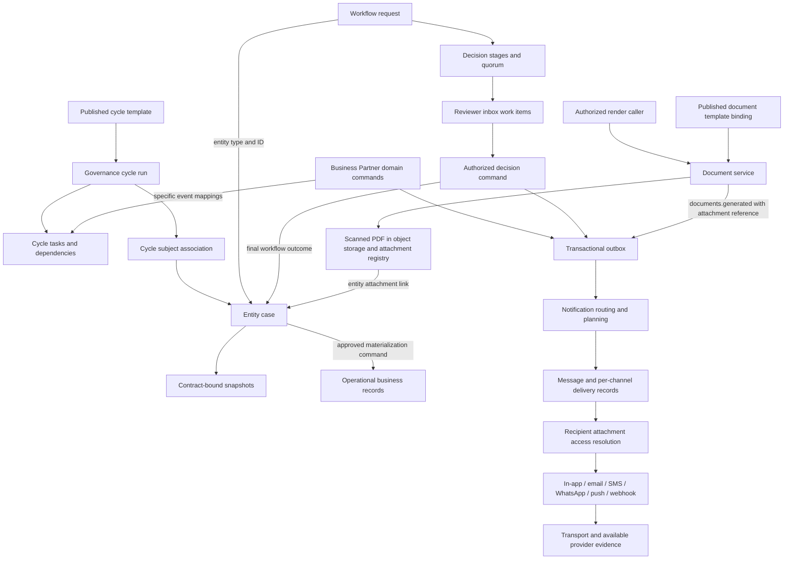
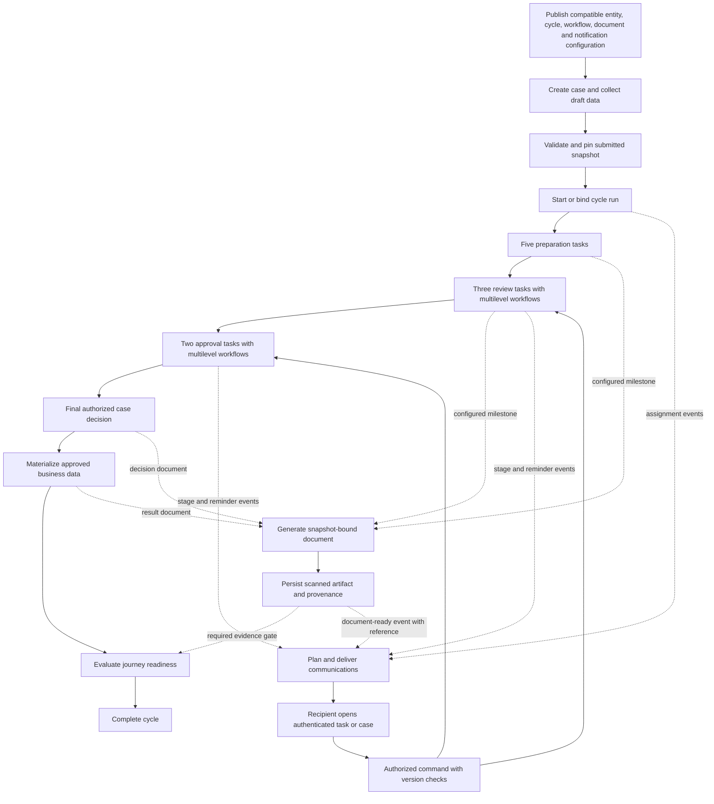

# Governed case flow: cycles, workflows, communications, and generated documents

Date: 2026-09-14  
Status: Current-source architecture review and proposed integration contract  
Scope: Shared platform services, with Business Partner as the concrete runtime example.

This document extends [Governed entity lifecycle](governed-entity-lifecycle.md). It distinguishes implemented connections from proposed orchestration. It is based on repository source, not live database, deployed-template, or provider qualification. The ten-task example is an illustrative configuration, not a claim that this exact journey is deployed.

## 1. Ownership

| Component | Owns | Does not establish by itself |
| --- | --- | --- |
| Entity case | Proposed mutation, pinned entity contract, snapshot head, submission and decision evidence | Completion of the entire journey |
| Governance cycle | Journey execution, required tasks, dependencies, deviations and readiness | Individual reviewer decisions |
| Governance task | Required business work, assignment, due date and completion evidence | An automatically configured multilevel workflow |
| Workflow | Human decision stages, reviewer assignments and quorum | Materialization of approved data |
| Lifecycle commands | Legal state transitions, authorization, versions and evidence | Delivery of a message or generation of a PDF |
| Notifications | Event routing, message templates, recipients, channel selection and delivery evidence | Business approval, task completion, acknowledgement or signature |
| Document generator | Rendering a published template into a stored, scanned artifact | Authority of caller-supplied business data or approval of its contents |
| Attachments | File versions, links, access, scanning and retrieval | Case proposal state |
| MESH exchange | Cross-tenant structured disclosure and exchange evidence | Ordinary email delivery or NEON business authority |

Lifecycle is a property of several objects, not one extra process encompassing them all. Case, cycle, task, workflow, work item, attachment and business record have separate states.

## 2. Current implemented connections

The file-to-case edge applies when the render command addresses that case entity and ID; documents can also link to other entities. Every outbox-to-message path requires a matching enabled route, suitable template and eligible recipient. The diagram does not imply that every event is delivered or that every channel is enabled.

### Case, cycle and workflow identity

- `governance.cycle_subject` associates a cycle with an entity case and optionally a task. The current `document.entity_case` header does not contain the direct cycle/workflow foreign-key fields sketched in the older target ADR.
- `governance.cycle_task.cycle_run_id` establishes task ownership. Dependencies establish ordering.
- Business Partner `document.workflow_request` records use `entity_type = 'business_partner_case'` and `entity_id = case ID`.
- `document.workflow_stage.workflow_request_id` establishes stage ownership. Business Partner work-item payloads carry `workflowRequestId` and `workflowStageId`; source entity coordinates identify the case.
- `document.work_item.cycle_task_id` exists in the schema, but the inspected Business Partner stage-work-item writer does not populate it. The generic work-item command contract also does not expose that coordinate.
- Cycle templates currently describe categories, entity codes, manual/system/hybrid completion and dependencies. They do not declare a first-class per-task workflow revision, notification rule or render trigger.

For internal supplier onboarding, draft save and preflight validation do not create the cycle. Submission starts or finds a run from `BP_SUPPLIER_ONBOARDING`. The coordinator maps submission to registration/duplicate-review work, approval to qualification, and later bank/readiness/activation events to their corresponding tasks. This domain-specific adapter is the current cycle bridge.

Sources: [case/work-item schema](../../../server/db/ddl/common/document/03_tables.sql), [cycle schema](../../../server/db/ddl/common/governance/03_tables.sql), [cycle template contracts](../../../server/packages/contracts/control-admin/src/cycle-config.ts), [Business Partner coordinator](../../../server/packages/services/master-data/src/business-partner-onboarding-cycle.ts), [case workflow repository](../../../server/packages/services/master-data/src/kysely-business-partner-case-repository.ts).

### Communications

The durable path is:

1. A business command writes its event to `event.outbox` in the business transaction.
2. Notification workers claim events and track planning in `event.notification_outbox_state`.
3. The planner matches `control.notification_routing_rule` by event and optional entity/lifecycle/condition filters.
4. It selects a channel-specific `control.notification_template`, resolves recipients, and applies preferences, consent and digest handling as implemented for that route/channel.
5. It writes `event.notification_message`, `event.notification_delivery`, optional `event.notification_message_attachment`, and digest staging.
6. Delivery workers resolve required attachments and dispatch through configured handlers. Retry, failure and dead-letter paths track operational failures separately from business state.

The repository has in-app, SMTP/SES email, Twilio SMS, Meta WhatsApp, Web Push/FCM and webhook capabilities. Their availability depends on host configuration, enrollment, consent, recipient resolution and templates; a provider adapter is not proof of a qualified journey.

Business Partner projects bounded notification data for submission, stage activation, return, approval, rejection, materialization and supplier activation. The NEON seed includes case/stage routing and templates. The projection's delivery-class label should not be interpreted as proof that every planner path bypasses preferences for mandatory messages: the generic planner explicitly checks preferences and consent.

Workflow assignment/reminder/SLA notification infrastructure also exists. Cycle task reminders still need an explicit binding to that infrastructure; a cycle task due date alone does not prove a notification will be sent.

An email or push message should direct a reviewer to the authenticated work item. Opening it does not cast a vote. An email reply or WhatsApp reply is not currently established here as an inbound case command. MESH structured exchange is a separate integration path. Provider delivery, recipient acknowledgement, contact ownership verification and electronic signature are different evidence types.

Sources: [Business Partner projection](../../../server/packages/services/master-data/src/business-partner-notifications.ts), [outbox planning](../../../server/packages/platform/notifications/src/outbox-planning.ts), [planner](../../../server/packages/platform/notifications/src/notification-planner.ts), [delivery](../../../server/packages/platform/notifications/src/durable-delivery.ts), [common routing seeds](../../../server/db/ddl/common/control/12_notification_reference_seed.sql), [NEON routing seeds](../../../server/db/ddl/planes/neon/control/12_notification_reference_seed.sql), [channel setup](../../runbooks/communication-channel-setup.md).

### Document generation and delivery

The generator has a separate template system from notification messages:

| Template family | Resolution | Output |
| --- | --- | --- |
| Entity/form contract | Published entity contract and descriptor | Meaning, validation and presentation of case data |
| Cycle template | Published cycle revision | Runtime tasks and dependencies |
| Workflow definition | Definition version and artifact hash | Decision stages and reviewer rules |
| Document template | `master.template_binding`, `master.template`, `snapshot.template_version`; print profile/letterhead where applicable | PDF artifact |
| Notification template | Template key, channel, locale and active version | Message subject/body/payload |

The document service currently:

1. Authorizes `documents.render` and the published entity operation.
2. Resolves the published document binding by entity type, operation, variant, locale and effective date.
3. Validates/renders caller-supplied `data` using the strict Handlebars renderer and template variable schema.
4. Renders PDF, scans it, computes its hash and writes object storage.
5. Saves `document.attachment_series`, `document.attachment` and `document.attachment_link`, plus audit and `documents.generated` outbox evidence in a database transaction.
6. Returns the artifact and optionally schedules extraction. If database persistence fails, it attempts object cleanup; storage and database writes are not a single distributed transaction.

`documents.generated` already includes `notification_attachments`. The current emitter uses `versionPolicy: current`, `requestedDisposition: auto`, and `required: true`. The delivery worker interprets `auto` as a link; explicit `embed` embeds content only for email. The resolver checks eligibility, scan state and recipient access; embedded content also undergoes size/hash checks.

No `documents.generated` routing seed was found in the inspected DDL tree. The existing event-to-attachment plumbing therefore needs an appropriate route/template/recipient configuration before it produces a message. A tenant may have configuration outside this source review.

The render command does not accept an explicit source-case snapshot or exact template-version coordinate. It accepts `data` and resolves the effective published template. A domain adapter must supply authoritative snapshot-derived data; an explicit pinned-input contract is proposed below for decision documents. Automatic generation at arbitrary case/task milestones was not found in the inspected case integration.

Sources: [render contract](../../../server/packages/contracts/documents/src/documents.ts), [document service](../../../server/packages/services/documents/src/document-service.ts), [template/artifact repository](../../../server/packages/services/documents/src/kysely-document-repositories.ts), [attachment resolver](../../../server/packages/services/documents/src/notification-attachment-resolver.ts), [host composition](../../../server/apps/platform-host/src/composition/register-services.ts).

## 3. Revised complete flow — proposed orchestration

Solid arrows below describe the desired journey order, not implementation completeness. Milestone-to-workflow, milestone-to-render and artifact-to-task-gate bindings are proposed additions over the services above.

The five preparation tasks may run in parallel when their dependency graph permits. The three reviews may also run concurrently, with each task's internal levels ordered independently. Two approval tasks can run sequentially if Approval B requires Approval A. This graph must be explicit rather than inferred from task display order.

If a document must exist before review, its generation is a prerequisite of that review task, not merely a cycle-closing check. If materialization must wait for a required decision artifact, its command must check that evidence. Ordinary informational delivery remains asynchronous and does not block approval or materialization.

## 4. Ten-task example with communication and documents

The following names and documents are examples, not existing published template codes. Render operations and communication routes would be configured only where needed.

| Task | Required work | Workflow | Communication point | Document/evidence point |
| --- | --- | --- | --- | --- |
| T1 | Collect organization details | Manual work | Assignment and correction request | Draft form data remains in case snapshots |
| T2 | Collect registration evidence | Manual/external work | Request missing evidence through an authorized channel | Uploaded registration files, scanned and linked |
| T3 | Capture tax and compliance data | Manual/system checks | Missing-information request | Validation results and supporting attachments |
| T4 | Capture bank-registration evidence | Restricted manual/system work | Restricted task link to eligible users | Protected evidence references; exclude raw account data from general PDFs/messages |
| T5 | Assemble submission package | System/hybrid | Package-ready notice if required | Generate submitted-snapshot review pack; make it a review prerequisite if required |
| T6 | Compliance review | Level 1 → level 2 | Notify each active level; remind/escalate under policy | Pinned review pack; optional review report after completion |
| T7 | Finance review | Level 1 → level 2 → level 3 | Notify current eligible reviewers | Finance-specific authorized document view |
| T8 | Operational review | Multiple reviewers with quorum | Notify assigned reviewers; stop stale reminders after outcome | Review conclusions and evidence references |
| T9 | Department approval | Manager → department head | Notify each active approval level | Decision pack with completed review evidence |
| T10 | Final approval | Finance authority → final authority | Outcome or correction notice after authorized decision | Generate approved/rejected decision document from decision evidence |

There are still ten cycle tasks. Each workflow can produce several stages and many inbox work items. A generated PDF and a notification delivery do not become extra business tasks unless the journey explicitly requires separate work or acknowledgement.

After T10, materialization and activation remain separate domain commands. If this example's journey includes them, bind them as explicit completion gates or extend the task list. Do not mark the cycle complete simply because ten human tasks finished while required materialization remains outstanding. The generic cycle readiness implementation checks mandatory tasks, active child cycles and open critical deviations; it does not automatically inspect arbitrary document or delivery gates. The Business Partner coordinator has its own task-based completion logic, so new gates must also be enforced in that adapter or it must be consolidated with the shared readiness path.

## 5. Binding contract to add

This is a proposed contract surface, not existing columns or a migration prescription. Reuse existing authorities and review persistence choices before adding storage.

| Binding | Required coordinates and behavior |
| --- | --- |
| Task execution | Cycle template revision + task template ID → manual/system/review/approval execution, workflow revision where applicable, launch condition and completion condition |
| Runtime workflow correlation | Tenant + plane + cycle run + cycle task + case + workflow request; populate work-item task association; distinguish resubmission/attempts |
| Outcome authority | Review outcome completes review work; intermediate approval completes its task; only the designated final decision may approve/reject/return the case |
| Document milestone | Trigger + entity operation + document binding/revision + locale/variant + submitted/decision/result snapshot + data projection version |
| Artifact provenance | Source snapshot and hash + template version/checksum + render request identity + attachment version/hash + case/task/workflow coordinates |
| Notification milestone | Domain event + route/template + recipients + lifecycle filter + deep link + optional artifact reference; reconcile existing generic work-item and Business Partner routes to avoid duplicate alerts |
| Completion gate | Required artifact, successful domain command, or explicit acknowledgement; identify the authority that evaluates it |
| Retry/replay | Stable identity per source event, task attempt, document purpose and snapshot; reject changed content under the same identity |

Use a document-ready event when a message requires a document. Do not dispatch an approval-outcome message with an attachment that has not yet been generated. Either send an immediate outcome notice followed by a document-ready notice, or wait to plan the single combined message after artifact persistence, according to configuration.

Decision documents should pin an exact attachment version for delivery. The current generic generator's `current` reference is not sufficient to specify that policy for all future versioned artifacts. A later render must not silently change what a reviewer previously saw.

## 6. State and failure behavior

| Situation | Required behavior for the revised flow |
| --- | --- |
| One reviewer approves | Record the vote; wait for quorum and remaining levels. Keep the case awaiting final decision |
| Review returns for correction | Invoke an authorized correction transition; close/cancel obsolete work, record which tasks must reopen, invalidate dependent approvals as configured and resubmit a new snapshot |
| Final decision rejects | Preserve decision evidence and any rejection document; cancel downstream work as configured; cycle cancellation/closure is a separate policy |
| PDF rendering or scanning fails | Retry or record failure. Block only tasks/commands with an explicit required-document gate |
| Required attachment is unavailable to a recipient | Fail that delivery; do not send an apparently complete package without it. Optional attachment failure may be omitted by current delivery logic |
| Email/SMS/push fails | Retry/record operational failure; preserve the accepted business decision |
| Provider reports delivery | Update transport evidence; do not approve, acknowledge or sign on behalf of the recipient |
| Duplicate event or retry arrives | Reuse the corresponding message/artifact/workflow attempt; no duplicate vote or business transition |
| Case changes after review package creation | Preserve old package; generate a new version from the new snapshot and apply explicit re-review policy |
| Materialization fails after approval | Preserve approval evidence, track the materialization failure and keep required downstream readiness unsatisfied |

The current Business Partner workflow calls the case lifecycle command on the final stage, or on rejection/return. Extending it to five independent review/approval workflows requires separating task-level outcomes from case-level terminal decisions; reusing its final-stage behavior unchanged would approve the case too early.

## 7. Implementation sequence and acceptance

1. Add and validate task execution/outcome bindings; connect runtime workflow and work-item identities to cycle tasks. Demonstrate all ten tasks without early case approval.
2. Add a milestone document adapter that reads authorized pinned snapshots, preserves template/input provenance, and invokes the existing generator idempotently. Extend render contracts where exact version selection is required.
3. Configure document-ready routing, recipients and templates; connect pinned artifact references to existing notification delivery. Verify actual channel policy instead of assuming adapter availability.
4. Add required-document/materialization/acknowledgement gates to the owning task or domain command and reconcile both cycle completion paths.
5. Expose one case timeline linking cycle work, workflow stages, documents, messages and delivery attempts through authority IDs. Keep business status and transport status separately visible.

Acceptance should exercise parallel reviews, multilevel quorum, return/resubmit, early-decision rejection, stale snapshots, missing templates, malware/render failure, attachment access denial, provider failure, duplicate events and retries, cross-tenant isolation, and materialization failure. A successful transport test does not certify the complete journey.

This revision documents the full flow and the integration backlog. It does not change runtime behavior, publish configuration, generate business documents, or send communications.
