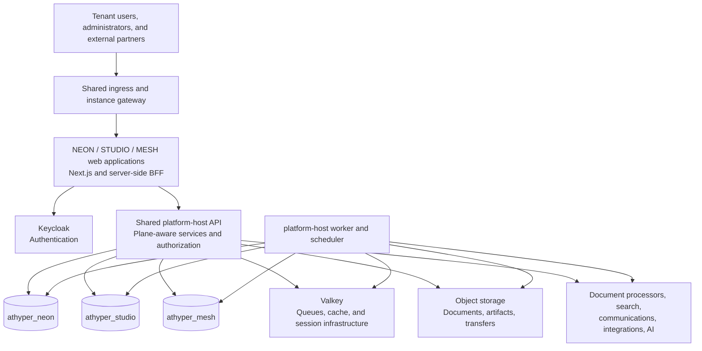
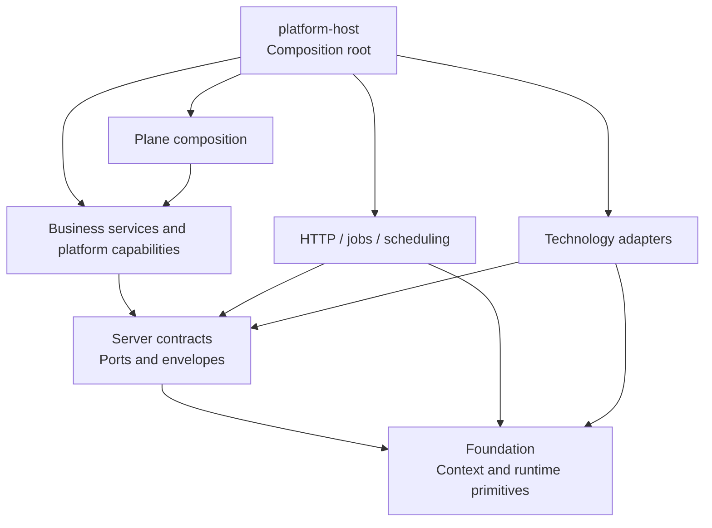
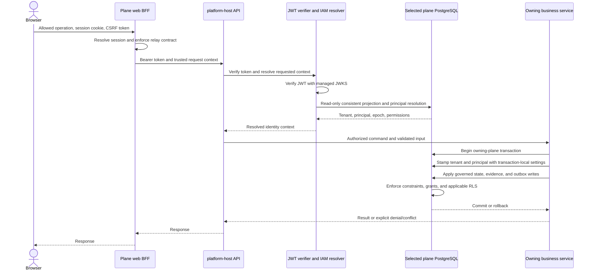
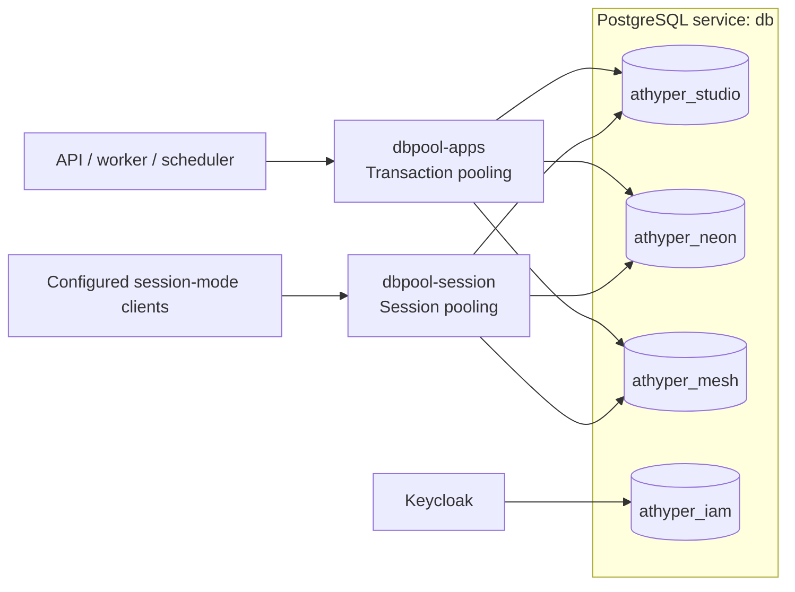
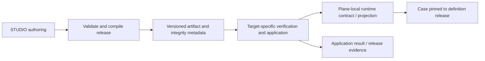
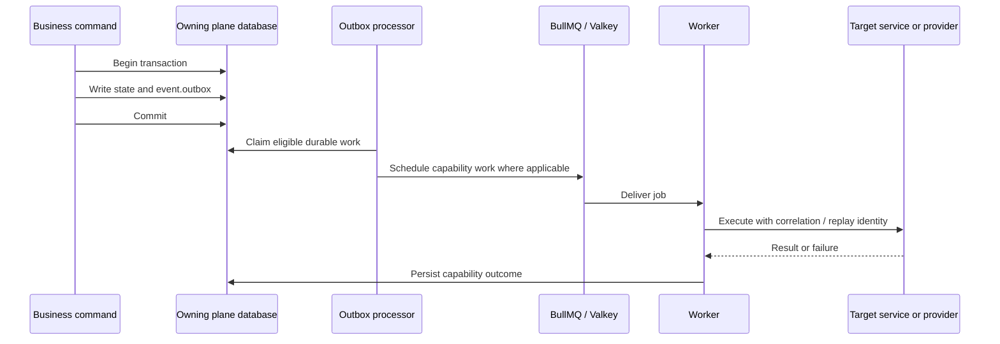
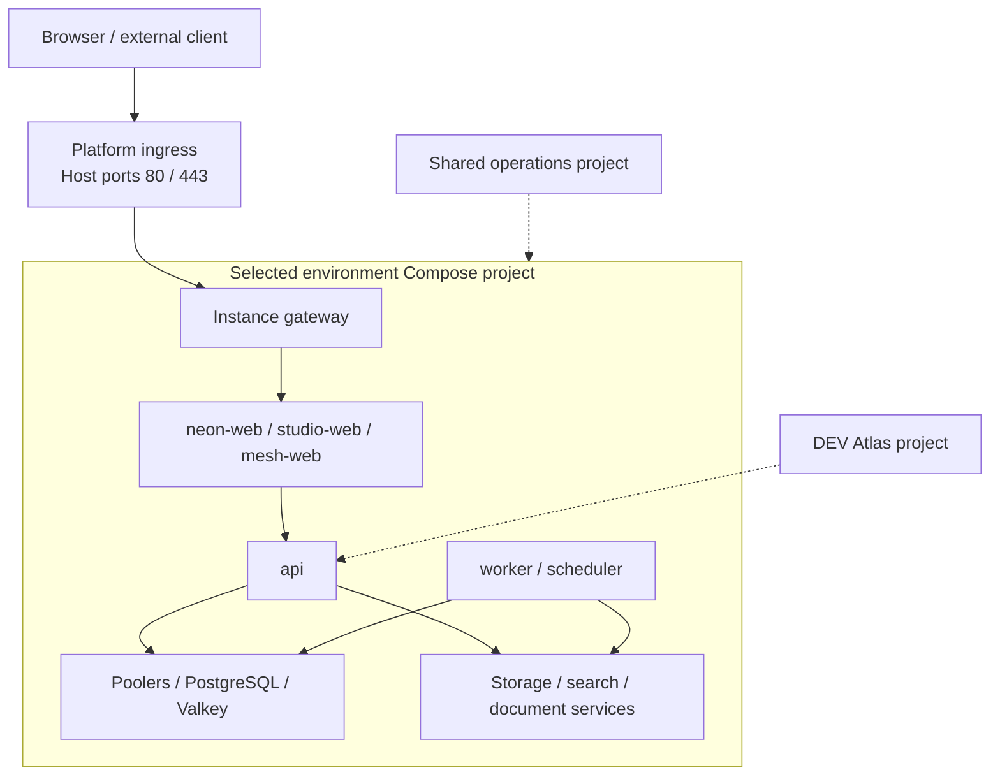

# athyper System Architecture Overview

**Repository baseline:** 2026-09-14  
**Audience:** engineers, architects, security reviewers, and platform operators  
**Scope:** application boundaries, runtime composition, identity, data isolation, governed execution, and deployment

athyper is a multi-tenant business platform with three application planes: **NEON** for business operations, **STUDIO** for platform authoring and administration, and **MESH** for external collaboration. Three Next.js applications share a TypeScript backend implemented as a modular platform host. The backend runs as separate API, worker, and scheduler processes. Each application plane owns a separate PostgreSQL database; tenant data is isolated within that database using row-level security.

This document explains the architecture and the consequences of its boundaries. It is the engineer-facing source for shorter architecture summaries. Domain contracts and operational runbooks remain authoritative for their respective details.

Statements marked **Implemented** describe inspected repository code or configuration, not proof that a capability is enabled or qualified in a running environment. **Architectural rule** identifies an intended boundary. **Open** identifies a decision or qualification gap. Product domain names indicate responsibility, not feature-completion status. The workspace contains ongoing implementation changes; this document is not a certification of a released commit or a live deployment.

## Contents

1. [System context and ownership](#1-system-context-and-ownership)
2. [Design principles and tradeoffs](#2-design-principles-and-tradeoffs)
3. [Repository and dependency architecture](#3-repository-and-dependency-architecture)
4. [Frontend and browser boundary](#4-frontend-and-browser-boundary)
5. [Backend composition and process model](#5-backend-composition-and-process-model)
6. [Identity, authorization, and request execution](#6-identity-authorization-and-request-execution)
7. [Multi-tenancy and transaction isolation](#7-multi-tenancy-and-transaction-isolation)
8. [Database topology and schema lifecycle](#8-database-topology-and-schema-lifecycle)
9. [Governed business execution and publication](#9-governed-business-execution-and-publication)
10. [Events, jobs, and scheduling](#10-events-jobs-and-scheduling)
11. [Documents, integrations, search, and AI](#11-documents-integrations-search-and-ai)
12. [Infrastructure and deployment topology](#12-infrastructure-and-deployment-topology)
13. [Docker service inventory](#13-docker-service-inventory)
14. [Operations, resilience, and release validation](#14-operations-resilience-and-release-validation)
15. [Open decisions and implementation limits](#15-open-decisions-and-implementation-limits)
16. [Source map and maintenance guidance](#16-source-map-and-maintenance-guidance)

## 1. System context and ownership

### 1.1 The three planes

A **plane** is an application and data-ownership boundary. It is distinct from a tenant, a PostgreSQL schema, and an individual process.

| Plane  | Primary responsibility                                                                 | Representative domains                                                                             | Web application | Database         |
| ------ | -------------------------------------------------------------------------------------- | -------------------------------------------------------------------------------------------------- | --------------- | ---------------- |
| NEON   | Tenant business operations and operational records                                     | Master data, finance, procurement, sales, inventory, people, projects, assets                      | `apps/neon`     | `athyper_neon`   |
| STUDIO | Governed definitions, platform configuration, identity administration, and publication | Entity authoring, TrustIAM, plans and entitlements, integration configuration, Atlas configuration | `apps/studio`   | `athyper_studio` |
| MESH   | Collaboration between participating organizations                                      | Network accounts, relationships, capabilities, disclosures, and exchanges                          | `apps/mesh`     | `athyper_mesh`   |

The web applications are separate deployable units. The current parity deployment uses one shared API process and shared worker/scheduler processes for the three planes. Separate databases therefore do **not** imply separate backend deployments, separate PostgreSQL servers, or independent failure domains.

### 1.2 Authority and cross-plane relationships

STUDIO owns authoring and publication authority. NEON owns its accepted operational business records. MESH owns network relationships and exchange state. Each receiving plane remains responsible for admission, authorization, and acceptance of incoming changes.

For example, a supplier profile disclosed through MESH is a proposal to NEON. It does not become an approved NEON Business Partner merely because the sender owns a MESH account. Likewise, publishing a definition from STUDIO does not authorize STUDIO users to mutate tenant business records.

Canonical-party IDs, IAM organization IDs, plane tenant IDs, principal IDs, MESH account IDs, and Business Partner IDs represent different coordinates. A link between them must be resolved through the applicable contract; matching or related identities do not imply equivalent permissions.

The current host can hold adapters for several databases and coordinate plane-specific work. The architectural boundary is explicit ownership, target selection, and scoped transactions. It would be inaccurate to describe the implementation as a process that can never open connections to more than one plane.

Sources: [Business Partner authority](business-partner/README.md), [adapter registration](../../server/apps/platform-host/src/composition/register-adapters.ts), [service composition](../../server/apps/platform-host/src/composition/register-services.ts).

### 1.3 System context diagram



Connections show available runtime relationships, not permission for every service to use every database or provider. Keycloak's own `athyper_iam` database is separate from the three application databases.

## 2. Design principles and tradeoffs

| Principle                                   | Architectural consequence                                                                               | Tradeoff or qualification                                                                               |
| ------------------------------------------- | ------------------------------------------------------------------------------------------------------- | ------------------------------------------------------------------------------------------------------- |
| Plane-owned data                            | Select the owning plane explicitly; exchange IDs, releases, and proposals through defined boundaries.   | Shared host composition still requires careful review of adapter selection and privileged coordination. |
| Shared-schema tenancy                       | Use tenant-scoped rows and PostgreSQL RLS within each plane database.                                   | Isolation also depends on role grants, policies, and correctly scoped transactions.                     |
| Authentication separated from authorization | Verify identity through Keycloak, then resolve membership and permissions in the selected plane.        | A valid token alone is insufficient for application access.                                             |
| Explicit access context                     | Evaluate a selected plane and tenant context rather than combining unrelated organization grants.       | Context changes require session/context revalidation.                                                   |
| Governed business mutation                  | Entry channels converge on validation, decision, evidence, and materialization contracts.               | Implemented channel and lifecycle coverage must be verified per domain.                                 |
| Contracts and composition                   | Keep stable interfaces separate from technology adapters; bind implementations at startup.              | The composition root legitimately imports adapters, and some service repositories use Kysely directly.  |
| Local atomicity, distributed reconciliation | Commit business state and its outbox event together; retry cross-boundary work using stable identities. | A local commit does not guarantee remote completion or exactly-once delivery.                           |
| Versioned definitions and configuration     | Pin governed cases and releases to identifiable definitions and policy versions.                        | Deployment needs compatibility and activation checks, not just valid source configuration.              |
| Least privilege                             | Separate normal runtime, authoring, projection, worker, and administrative capabilities.                | Privileged policies are explicit exceptions to ordinary tenant isolation.                               |
| Evidence-based readiness                    | Qualify the actual image, configuration, schema, and provider combination.                              | Source presence, successful startup, and historical test evidence establish different things.           |

These principles describe review obligations. They should not be read as a claim that every package or deployment has already been exhaustively checked against every invariant.

## 3. Repository and dependency architecture

### 3.1 Repository map

| Location                            | Responsibility                                                                                |
| ----------------------------------- | --------------------------------------------------------------------------------------------- |
| `apps/{neon,studio,mesh}`           | Next.js applications and plane-specific web entry points                                      |
| `packages/planes/`                  | Plane-specific frontend shells and business modules                                           |
| `packages/platform/`                | Shared frontend foundation, IAM, gateway, shell, entity, AI, and communications capabilities  |
| `packages/contracts/`               | Shared application and wire contracts grouped by foundation, platform, and plane              |
| `server/apps/platform-host/`        | Deployable backend entry point, process lifecycles, and dependency composition                |
| `server/packages/planes/`           | Backend plane composition and plane-owned authoring/onboarding capabilities                   |
| `server/packages/services/`         | Business/application services and their repositories                                          |
| `server/packages/platform/`         | Reusable platform capabilities such as IAM, policy, workflow, and notifications               |
| `server/packages/runtime/`          | HTTP, job, and scheduling infrastructure                                                      |
| `server/packages/contracts/`        | Server ports, envelopes, and capability interfaces                                            |
| `server/packages/adapters/`         | Concrete database, provider, storage, search, AI, and telemetry integrations                  |
| `server/packages/foundation/`       | Shared runtime primitives and persistence-neutral transaction/context types                   |
| `server/db/`                        | Canonical DDL, manifests, generated-type inputs, seeds, and operational database tooling      |
| `deploy/`                           | Compose projects, stack controller, infrastructure images, configuration, and cloud templates |
| `governance/`, `tooling/`, `tests/` | Governed configuration, verification automation, and cross-package validation                 |

The workspace includes transitional exclusions and older package paths. [pnpm-workspace.yaml](../../pnpm-workspace.yaml) determines active package membership; a directory's existence alone does not make it an active dependency.

### 3.2 Dependency model



This is a conceptual dependency view, not an exhaustive import graph. Services and platform capabilities are not one mandatory serial chain. A capability can consume another capability through its published interface, subject to repository ownership rules.

Server contracts define stable boundaries without Express, BullMQ, Kysely, network-client, or telemetry-SDK implementations. Foundation owns common context and observability primitives. Database-specific repositories also exist inside service/platform packages, so the repository should not be described as universally persistence-free outside `adapters/`.

Sources: [server contract ownership](../../server/packages/contracts/README.md), [shared contract ownership](../../packages/contracts/README.md), [package ownership matrix](package-ownership-matrix.md).

## 4. Frontend and browser boundary

### 4.1 Composition of the web applications

Each plane application combines its own routes and business modules with shared platform packages. The shared foundation supplies UI, theme, internationalization, API-client, and query primitives. Shell packages supply navigation and common application surfaces. Entity packages support descriptor-driven lists, forms, details, content, and workflow presentation.

This arrangement allows common interaction behavior across the three planes while keeping business ownership explicit. Shared rendering components do not make NEON and MESH records interchangeable, and displaying an action does not establish permission to execute it.

### 4.2 Session-backed BFF

The backend-for-frontend (BFF) is the server-side boundary between a browser and the runtime API. The auth BFF handles login/callback flows, session state, context selection, refresh, and logout. It stores sealed token bundles server-side and gives the browser an opaque session cookie and a sanitized session view.

The API relay uses an operation catalogue containing methods, paths, request classes, tenant requirements, body limits, and idempotency requirements. It resolves the trusted session, forwards authorized operations to the runtime API, and applies CSRF and request-boundary checks. Its blocked-header list prevents browser-supplied authorization and identity headers from being passed through as trusted identity.

The BFF also supports differentiated handling for JSON, upload, download, and streaming operations. These paths have different size and timeout needs; a generic JSON request policy is insufficient for all of them.

The API remains responsible for token verification, plane/tenant resolution, and business authorization. BFF checks complement that boundary rather than replacing it.

Sources: [auth BFF](../../packages/platform/iam/auth-bff/src/index.ts), [session packages](../../packages/platform/iam/), [API relay](../../packages/platform/gateway/bff-relay/src/index.ts), [frontend readiness contract](frontend-first-business-module.md).

## 5. Backend composition and process model

### 5.1 Composition root

[main.ts](../../server/apps/platform-host/src/main.ts) selects the process mode from `MODE`, defaulting to `api`, and dispatches to the corresponding process implementation. Composition registers adapters, runtimes, and services with the host container and shutdown lifecycle.

| Composition area                                                                             | Responsibility                                                                                                        |
| -------------------------------------------------------------------------------------------- | --------------------------------------------------------------------------------------------------------------------- |
| [register-adapters.ts](../../server/apps/platform-host/src/composition/register-adapters.ts) | Configure concrete providers and database adapters, qualify configured plane databases, and register resource cleanup |
| [register-runtimes.ts](../../server/apps/platform-host/src/composition/register-runtimes.ts) | Construct shared runtime facilities                                                                                   |
| [register-services.ts](../../server/apps/platform-host/src/composition/register-services.ts) | Bind application services, repositories, authorizers, routes, publication orchestration, and job integrations         |

The Studio database adapter retains the historical name `athyperDatabase` / `athyper-postgres`. That name refers to the STUDIO database in the three-plane topology; it does not identify a fourth application authority.

### 5.2 Runtime modes

| Mode        | Main work                                                                               | Operational implication                                                                  |
| ----------- | --------------------------------------------------------------------------------------- | ---------------------------------------------------------------------------------------- |
| `api`       | HTTP endpoints, authentication, authorization, commands, queries, and health interfaces | Request latency and readiness depend on configured synchronous dependencies.             |
| `worker`    | BullMQ consumers and capability-specific background work                                | Backlog, retries, failed work, and database/provider access require separate monitoring. |
| `scheduler` | Scheduled work registration and execution coordination                                  | Leadership and duplicate-scheduling behavior matter when more than one instance runs.    |

These modes use the same runtime image but different process entry paths. They can be operated separately; this does not establish that every mode is independently scalable without additional qualification. Database pool budgets, queue contention, scheduler leadership, and shared provider limits constrain scaling.

### 5.3 Service groups

Business services include records, master data, finance, numbering, publication, integration, attachments, content, documents, document processing, and derivatives. Platform capabilities include IAM, policy, entitlements, metadata, governance, workflow, audit, notifications, collaboration, search, AI, experience, preferences, taxonomy, and reference data.

These are code ownership and composition units. They are not individually deployed microservices in the parity topology. A package's presence also does not establish that its routes, workers, credentials, or tenant policies are enabled.

## 6. Identity, authorization, and request execution

### 6.1 Separate security decisions

| Decision                     | Authority or mechanism                            | What it establishes                                                               |
| ---------------------------- | ------------------------------------------------- | --------------------------------------------------------------------------------- |
| Token authenticity           | Keycloak adapter and JWT verification             | Trusted issuer, audience, signature, and token claims                             |
| Browser session validity     | Auth BFF and session store                        | Current browser/session binding and usable access context                         |
| Plane and tenant admission   | Plane-local IAM projection resolution             | The requested tenant is an active application projection for the identity context |
| Principal binding            | Plane-local principal identity resolution         | External subject maps to a local principal and authorization epoch                |
| Permission evaluation        | Permission resolver and capability authorizers    | The principal may perform the operation in the applicable scope                   |
| Feature or plan availability | Entitlement and feature services where integrated | The requested capability is available under the applicable configuration          |
| Row access                   | PostgreSQL grants and RLS                         | The database operation is permitted for the effective role and tenant context     |

A valid identity is necessary but does not by itself prove membership, entitlement, record access, or command permission. UI visibility, URL parameters, and incoming tenant headers cannot substitute for these decisions.

### 6.2 Authentication and context resolution

The Keycloak adapter uses `jose.jwtVerify` with realm-specific issuer and audience configuration and a managed JWKS key set. JWT verification does not require a synchronous call to Keycloak for every request; key retrieval and refresh are separate from verifying an individual token.

The plane-local resolver chooses `requestedTenantId` or the token tenant hint, requires a valid UUID and organization context, and runs a `REPEATABLE READ, READ ONLY` transaction in the selected plane. It then:

1. Resolves active application projections through `authz.fn_resolve_active_application_projections` and matches the requested tenant.
2. Sets transaction-local tenant context for subsequent resolution.
3. Resolves the external subject through `master.fn_resolve_principal_identity`.
4. Sets principal context and resolves permissions in the same consistent snapshot.
5. Returns tenant ID, principal ID, authorization epoch, and permission information, or no admitted context if the required binding cannot be established.

Token organization or tenant values are therefore resolution inputs, not independent authorization truth. A session's selected context must remain explicit; unrelated organization grants must not be unioned into broader access.

Sources: [Keycloak adapter](../../server/packages/adapters/auth-keycloak/src/keycloak-auth-adapter.ts), [JWKS manager](../../server/packages/adapters/auth-keycloak/src/keycloak-jwks-manager.ts), [identity resolver](../../server/packages/platform/iam/src/kysely-identity-context-resolver.ts), [authorization boundary ADR](authorization-v2-ownership-evaluation-and-plane-boundary-adr.md).

### 6.3 Representative authenticated mutation



This sequence describes the governed mutation pattern. Read-only endpoints, login, health probes, and provider callbacks have different contracts. Identity resolution and the later business mutation are distinct transactions; services must still enforce applicable current policy, version, and state-transition checks when executing the command.

## 7. Multi-tenancy and transaction isolation

### 7.1 Tenant and organization coordinates

The application model is **one database per plane with shared-schema, row-scoped tenancy**. It is not a schema-per-tenant or database-per-tenant deployment.

| Coordinate                                         | Meaning                                                                             |
| -------------------------------------------------- | ----------------------------------------------------------------------------------- |
| `tenant_id`                                        | Primary application data-isolation coordinate within a plane                        |
| `principal_id`                                     | Acting identity within that tenant/plane                                            |
| `master.tenant`, `master.tenant_profile`           | Tenant root and profile information                                                 |
| `master.tenant_relationship`                       | Explicit relationship between tenant endpoints                                      |
| `master.legal_entity`                              | Legal organization, potentially linked to a canonical party and parent legal entity |
| `master.company_code`                              | Finance-operational unit associated with a legal entity                             |
| `master.org_unit`, `master.operating_organization` | Organizational and operational structure                                            |
| Company assignments, profit centers, cost centers  | Further operational and financial scope dimensions                                  |

Tenant isolation and organizational authorization address different concerns. Two company codes in one tenant may share the same RLS tenant boundary while requiring different operation or record scopes. A shared canonical-party reference does not merge tenant boundaries.

Tenant-owned business tables carry tenant coordinates, but global/reference tables and relationship tables can have different access models. Their policies must be read individually.

### 7.2 Transaction-local identity

The database adapter exposes actor stamping through [transaction.ts](../../server/packages/adapters/database/core/src/transaction.ts). The core SQL shape is:

```sql
SELECT set_config('app.current_tenant_id', :tenant_id, true),
       set_config('app.current_principal_id', :principal_id, true);
```

The placeholders above are explanatory; the implementation uses bound Kysely parameters. The `true` argument makes the settings transaction-local. They expire with the transaction, which is essential when connections are reused through a transaction pool.

Tenant business queries must execute in the same transaction that receives the trusted actor context. The core transaction runner accepts an optional actor and stamps it when supplied. Some composition paths stamp explicitly. Consequently, actor stamping is a calling-path responsibility, not an automatic property of every Kysely query or transaction in the repository.

A background job must also establish the appropriate plane and actor context. A worker's ability to connect to a database is not sufficient tenant authorization.

### 7.3 Row-level security

A representative tenant policy is:

```sql
ALTER TABLE master.legal_entity ENABLE ROW LEVEL SECURITY;
ALTER TABLE master.legal_entity FORCE ROW LEVEL SECURITY;

CREATE POLICY tenant_access ON master.legal_entity FOR ALL
    USING (tenant_id = shared.current_tenant_id_soft())
    WITH CHECK (tenant_id = shared.current_tenant_id());
```

The soft helper returns a nullable tenant value for row visibility. The strict helper raises when tenant context is missing. For an ordinary tenant policy, missing context therefore exposes no matching tenant rows and prevents writes that require a valid tenant.

Relationship tables can intentionally permit reads from either endpoint:

```sql
USING (
    from_tenant_id = shared.current_tenant_id_soft()
    OR to_tenant_id = shared.current_tenant_id_soft()
);
```

RLS protects against an omitted tenant predicate only when the effective role is subject to the intended policies. Canonical DDL also contains bootstrap `seed_write` policies scoped to the DDL execution role and, in some areas, privileged `admin_access` policies. Superuser or RLS-bypass privileges are outside the ordinary runtime boundary. These exceptions must not be interpreted as safe general-purpose runtime access.

`FORCE ROW LEVEL SECURITY` and a tenant column alone do not prove complete isolation. Review table grants, role membership, policy combinations, privileged functions, and the transaction path together. RLS also does not replace field-level disclosure or command-level authorization.

Sources: [NEON master RLS](../../server/db/ddl/planes/neon/master/10_rls.sql), [strict tenant helper](../../server/db/ddl/common/shared/04_pre_constraints.sql), [shared functions](../../server/db/ddl/common/shared/07_functions.sql), [service-role definitions](../../server/db/ddl/common/_database/01_service_roles.sql).

## 8. Database topology and schema lifecycle

### 8.1 Physical topology



This shows the application/IAM split in the base stack. Keycloak connects directly to `db` for `athyper_iam`; the session pooler is available for separately configured session-mode clients. Plane databases share the `db` service in this topology, so a database-server outage or resource shortage can affect all three. No cross-database foreign keys connect plane records; cross-plane references are application-level coordinates.

### 8.2 Schema responsibilities

| Schema or family                                    | Purpose and ownership                                                                         |
| --------------------------------------------------- | --------------------------------------------------------------------------------------------- |
| `shared`                                            | Common database primitives and shared reference support                                       |
| `master`                                            | Plane-local tenant, principal, organization, and master-data structures                       |
| `authz`                                             | Authorization and application-projection structures                                           |
| `control`                                           | Runtime configuration/catalogue structures; exact content and write permissions vary by plane |
| `document`                                          | Cases, workflow/work items, document-related application state                                |
| `governance`                                        | Governed cycles, tasks, decisions, and compliance-related structures                          |
| `snapshot`                                          | Versioned snapshots and lineage                                                               |
| `event`                                             | Outbox and durable delivery-related state                                                     |
| `audit`, `log`, `ops`                               | Audit evidence, logging structures, and operational state                                     |
| `runtime_meta`                                      | Runtime metadata contracts and release/application state                                      |
| `ai`                                                | AI-related configuration and persisted capability state                                       |
| `ledger`                                            | NEON-specific finance structures                                                              |
| `metadata`, `trustiam`, `onboarding`, `publication` | STUDIO-owned authoring, identity administration, provisioning, and release authority          |

This is a responsibility map, not a complete table inventory. Shared schema names do not imply identical contents or shared rows. In particular, `control` contains plane-local operational configuration as well as published definitions; the entire schema should not be described as universally read-only.

Sensitive control-plane capabilities use named service roles, including TrustIAM, onboarding, publication, and projection-applier roles. `NOLOGIN` roles define privilege sets; actual workload login identities need the appropriate explicit grants or memberships. Ordinary unauthenticated application access is not represented by a guest database role.

### 8.3 Canonical DDL and generated types

The DDL tree separates shared definitions under `server/db/ddl/common/` from plane-specific definitions under `server/db/ddl/planes/`. Each plane's `_manifest.txt` explicitly orders the common and plane files needed for a fresh foundation build, including schemas, tables, functions, constraints, indexes, triggers, RLS, grants, and reference seeds.

Canonical SQL owns database behavior. The Prisma schema files provide inputs to the `prisma-kysely` generator, producing typed Kysely definitions in database adapter packages. They do not replace the SQL definition of policies, triggers, or other database behavior. Application repository access uses Kysely; this is not a Prisma Client runtime architecture.

Sources: [NEON manifest](../../server/db/ddl/planes/neon/_manifest.txt), [STUDIO manifest](../../server/db/ddl/planes/studio/_manifest.txt), [MESH manifest](../../server/db/ddl/planes/mesh/_manifest.txt), [type generator configuration](../../server/db/prisma/schema.neon.prisma).

### 8.4 Fresh builds versus upgrades

The current development baseline has comment-only automatic upgrade manifests. Fresh databases are created from canonical foundation manifests. A foundation build is not an upgrade mechanism for populated databases.

Operational installers, repair tooling, retained legacy upgrades, and candidate-generation tooling exist separately. Existing databases requiring pre-baseline changes need a reviewed, baseline-specific upgrade plan. Empty automatic manifests do not prove that an existing installation matches the canonical schema.

Previously applied checksums and receipts remain part of the compatibility record. New schema changes require reviewed upgrade entries and testing against the relevant existing baseline; replaying foundation DDL or resetting receipts is not an acceptable shortcut.

Sources: [migration baseline and future upgrades](../../server/db/migrations/README.md), [DDL consolidation runbook](../runbooks/sql-ddl-consolidation.md).

## 9. Governed business execution and publication

### 9.1 Distinct lifecycle authorities

| Concern                                               | Authority                                       |
| ----------------------------------------------------- | ----------------------------------------------- |
| Definition, form, policy, and release authoring       | STUDIO                                          |
| Proposed entity change and case head                  | Owning-plane entity case                        |
| Journey, tasks, dependencies, and completion tracking | Governance cycle and tasks                      |
| Human review stages, quorum, and decisions            | Workflow                                        |
| Immutable submitted/decided/materialized versions     | Snapshot and lineage records                    |
| Accepted operational record                           | Receiving business plane, such as NEON          |
| File metadata, scanning, retrieval, and bytes         | Attachment/document services and object storage |

These objects have separate states. Completing a task, approving a case, generating a PDF, and activating a supplier are distinct transitions.

### 9.2 Representative Business Partner flow

The canonical boundary is a published definition followed by draft/evidence collection, deterministic validation, review, authorized decision, governed materialization, and readiness/activation. Supplier and Customer are roles of a Business Partner; supplier-provided workers follow separate person and engagement lifecycles.

Governed commands validate the relevant tenant, actor, scope, expected version, idempotency identity, and current policy. They record evidence and explicit outcomes for replay, conflict, denial, or invalid transition. Where the service uses a local transaction, business state, related evidence, and the outbox write commit or roll back together.

Current source connects cases, snapshots, workflow stages, work items, and domain-specific cycle coordination. The broader lifecycle ADR is explicitly a target architecture and migration contract. It must not be treated as proof that every proposed field or generic orchestration binding exists. The companion current-source review documents differences, including task-to-workflow and communications bindings.

Sources: [Business Partner architecture](business-partner/README.md), [target lifecycle ADR](decisions/governed-entity-lifecycle.md), [current governed case flow](decisions/governed-case-communications-and-documents.md).

### 9.3 Publication and cross-plane coordination

Publication separates mutable authoring from identifiable runtime releases. The publication service includes compilation, artifact loading/storage, signing integration, operations tracking, and target-local projection repositories. Receiving runtimes consume the applicable release and apply its local contracts through explicit composition.



This is a conceptual release flow. The exact review, signing, activation, and rollback contract depends on the publication capability and deployment configuration.

Cross-plane provisioning and publication must tolerate partial completion. The architectural coordination model is an idempotent saga: correlate the command and result, preserve version identity, apply a local transaction at each owner, and reconcile outcomes. There is no atomic transaction spanning PostgreSQL databases, a queue, object storage, and an external provider.

The shared host's orchestration code is therefore a sensitive boundary. A source-plane authoring operation must not silently become an unrestricted target-plane write. Review the selected adapter, privileged role, target tenant, and receiving service contract together.

Sources: [publication services](../../server/packages/services/publication/src/), [publication orchestrator](../../server/packages/services/publication/src/publication-orchestrator.ts), [composition root](../../server/apps/platform-host/src/composition/register-services.ts).

## 10. Events, jobs, and scheduling

### 10.1 Durable state and asynchronous execution

The platform uses PostgreSQL outbox records and BullMQ job infrastructure backed by a Redis-compatible service. These have different responsibilities: the outbox records a committed event, while the queue coordinates asynchronous execution.



The diagram illustrates the pattern; not every outbox consumer has the same queue path. Notification planning, for example, maintains durable planning and delivery state in the database.

A committed command can succeed while downstream work remains pending or fails. Consumers must handle replay and interrupted execution. Do not infer exactly-once side effects merely from a queue acknowledgement or an outbox row. Provider-specific idempotency and recorded outcomes determine what can be retried safely.

### 10.2 Scheduler ownership and worker context

Scheduling includes a Redis-backed leader lease and an owner registry. Leadership is acquired and renewed with ownership checks; failure to renew is treated as loss of leadership. This controls scheduling ownership, but does not establish exactly-once business execution after a job is enqueued.

Workers need explicit plane and tenant context, bounded concurrency, and capability-appropriate failure handling. Operationally, pending work, repeated failures, dead-letter state, and scheduler leadership must be observed separately from API availability.

Sources: [job runtime](../../server/packages/runtime/jobs/src/bullmq-job-runtime.ts), [scheduler runtime](../../server/packages/runtime/scheduling/src/), [leader lease](../../server/packages/runtime/scheduling/src/scheduler-leader-lease.ts), [notification planning](../../server/packages/platform/notifications/src/outbox-planning.ts).

## 11. Documents, integrations, search, and AI

### 11.1 Document and attachment pipeline

Attachments associate controlled metadata and file versions with entities. Object storage owns the bytes. Document processing, malware scanning, rendering, and content extraction are separate capabilities with separate outcomes.

| Component                             | Responsibility                                                                          |
| ------------------------------------- | --------------------------------------------------------------------------------------- |
| Attachments/content/document services | Access checks, metadata, entity links, version references, and generation orchestration |
| `virusscan` / ClamAV                  | Malware inspection                                                                      |
| `docrender` / Gotenberg               | Document/PDF rendering                                                                  |
| `docparser` / Tika                    | Content extraction                                                                      |
| Document derivatives                  | Derived outputs and their processing lifecycle                                          |
| Object storage adapter                | Storage operations under the selected bucket and credential authority                   |

A successful upload is not equivalent to an approved case, a clean scan, or permission to disclose the file. Generated documents also require the applicable attachment/access path. Notifications should resolve authorized attachments or references rather than copying protected payloads into unrestricted delivery records.

### 11.2 Storage classes and environment boundary

| Bucket class | Purpose                                            | Access distinction                                                   |
| ------------ | -------------------------------------------------- | -------------------------------------------------------------------- |
| Documents    | User and application documents                     | Application-managed operations under the storage contract            |
| Artifacts    | Publication and other retained generated artifacts | Separate writer identity; application can read, writer cannot delete |
| Transfers    | Import/export and transfer objects                 | Lifecycle and cleanup associated with transfer state                 |

DEV and QA use separate local SeaweedFS instances. STG/PROD have an AWS CloudFormation design with three private versioned buckets, SSE-KMS, public-access blocks, TLS-only policies, and retained buckets/key on stack deletion. The documented AWS setup remains pending provisioning; repository templates are not deployed resources.

AWS authentication uses short-lived profiles through Roles Anywhere for non-AWS hosting or appropriate AWS role-based identity. Local SeaweedFS uses its own managed secrets and distinct application/writer credentials. The previous blanket statement that no static S3 credentials exist in any environment would obscure this difference.

Deny-delete permissions and application write-once acceptance are meaningful controls, but should not be presented as an unverified regulatory Object Lock/WORM guarantee. Storage acceptance needs provider-specific create/replay/conflict and delete-denial evidence.

Sources: [AWS storage design and status](../../deploy/aws/object-storage/README.md), [local storage acceptance](../operations/object-storage-v6.md), [S3 adapter](../../server/packages/adapters/object-storage-s3/).

### 11.3 Notifications and integrations

Notifications follow a durable event-to-message-to-delivery path. Routing rules select templates and recipients; applicable preferences, consent, attachment access, and channel configuration affect delivery. The repository contains in-app, email, SMS, WhatsApp, push, and webhook capabilities, but provider configuration and qualification determine actual availability.

Transport delivery is distinct from a business decision or proof of document approval. Opening a message does not cast a workflow vote. MESH structured exchange is also distinct from email delivery and remains subject to receiving-plane acceptance.

Integration services and HTTP adapters provide external-system boundaries. Endpoint contracts must specify authentication, correlation, retry behavior, and validation. A remote provider failure must be represented as an integration outcome rather than silently implying that the business operation completed externally.

Sources: [communications flow](decisions/governed-case-communications-and-documents.md), [notification delivery](../../server/packages/platform/notifications/src/durable-delivery.ts), [integration services](../../server/packages/services/integration/).

### 11.4 Search and Atlas AI

Meilisearch provides a search capability through a dedicated adapter. Search results are derived representations and do not replace authoritative records or access checks. Reindexing, stale results, and disclosure boundaries belong to the search capability's operational contract.

Atlas combines AI services, model-provider adapters, semantic retrieval, and document grounding. Provider packages exist for Ollama, OpenAI, Anthropic, and Gemini; the local Atlas Compose project provides Ollama inference. Package availability does not establish that each provider is selected, credentialed, or enabled.

For Business Partner workflows, Atlas may draft and explain; it has no authority to approve, merge, activate, or grant access. Retrieved business data and document references remain subject to the relevant disclosure boundary. Model availability and retrieval qualification are separate readiness conditions.

Sources: [AI platform](../../server/packages/platform/ai/), [Atlas foundation](atlas-meta-entity-learning-foundation.md), [semantic retrieval runbook](../runbooks/atlas-semantic-retrieval.md), [search adapter](../../server/packages/adapters/search-meilisearch/).

## 12. Infrastructure and deployment topology

### 12.1 Runtime baseline

The repository pins Node.js `24.19.0` and pnpm `10.33.0`, and uses Turborepo for workspace tasks. These are repository baseline values, not recommendations for the latest upstream versions.

Docker Compose under Stack v2 is the supported deployment foundation. The `athyper` controller in `deploy/stackctl` renders configuration, evaluates policy and readiness gates, and manages instance operations. Daily DEV work also has source-mode presets (`pnpm devsimple`, `pnpm devfull`) backed by the shared infrastructure; the full parity Compose stack is not the only development workflow.

Sources: [root package configuration](../../package.json), [deployment guide](../../deploy/README.md), [current DEV workspace](../runbooks/shared-dev-workspace.md).

### 12.2 Compose project boundaries

| Project family | Scope                     | Main responsibility                                                               |
| -------------- | ------------------------- | --------------------------------------------------------------------------------- |
| `platform/`    | Shared per host           | Public/local ingress and outage response                                          |
| `instance/`    | Per environment           | Instance gateway, application processes, data services, and selected capabilities |
| `atlas/`       | Local DEV                 | Local inference service and inference network                                     |
| `operations/`  | Shared operations project | Metrics, logs, traces, alerting, and status monitoring                            |



Network membership is explicit in Compose: ingress/edge, application, data, and document-service networks serve different purposes. Internal service ports are not automatically host-published ports. The selected environment and overlays determine the final exposure.

### 12.3 Environments and capacity

| Environment | Compose project / domain convention | Database host-port convention | Status qualification                                                           |
| ----------- | ----------------------------------- | ----------------------------- | ------------------------------------------------------------------------------ |
| DEV         | `athyper-dev`, `*.dev.athyper.test` | Loopback `5432`               | Local development; source and container workflows                              |
| QA          | `athyper-qa`, `*.qa.athyper.test`   | `55432`                       | Separate configuration, networks, and volumes; inspect current readiness gates |
| STG         | `athyper-stg`, `*.stg.athyper.test` | `56432`                       | Staging controls and provider/restore qualification required                   |
| Production  | Release-specific                    | Deployment-specific           | Final hosting topology and region remain open in this overview                 |

These conventions describe configuration, not a statement that QA/STG are currently running or approved. The deployment guide contains historical phase records; current templates, rendered plans, and valid receipts determine deployability.

Resource profiles bound the local stack and make optional services opt-in. The previous overview quoted a parity budget of approximately 13.3 GiB / 16 vCPU against a laptop profile; use the current controller plan for selected-profile totals rather than treating that historical estimate as a performance result. A memory/CPU allocation is not a throughput or latency guarantee.

Kubernetes/K3s remains a deferred orchestration decision subject to the controller assessment and rehearsal evidence. It is not an assumed successor deployment.

## 13. Docker service inventory

The following names are literal Compose service identifiers. Images are selected through Compose defaults and environment-specific image configuration. For releases, the resolved digest and provenance are authoritative; copying mutable tags into this document would create a second, easily stale image catalogue.

### 13.1 Shared ingress and local inference

| Compose source                                                      | Services                     | Function / exposure                                                         |
| ------------------------------------------------------------------- | ---------------------------- | --------------------------------------------------------------------------- |
| [platform/compose.yaml](../../deploy/compose/platform/compose.yaml) | `ingress`, `platform-outage` | Traefik ingress and outage page; baseline host bindings are loopback 80/443 |
| [atlas/compose.yaml](../../deploy/compose/atlas/compose.yaml)       | `atlas-inference`            | Ollama local inference; internal inference network                          |

### 13.2 Base instance infrastructure

Source: [instance/compose.yaml](../../deploy/compose/instance/compose.yaml).

| Service              | Technology               | Responsibility / baseline exposure                                     |
| -------------------- | ------------------------ | ---------------------------------------------------------------------- |
| `gateway`            | Traefik                  | Instance routing; shared ingress and internal networks                 |
| `gateway-outage`     | Unprivileged Nginx       | Instance maintenance/outage response                                   |
| `db`                 | PostgreSQL               | Application and IAM databases; environment-specific loopback host port |
| `db-init`            | PostgreSQL bootstrap job | Database and identity initialization                                   |
| `dbpool-apps`        | PgBouncer                | Transaction pooling for application traffic                            |
| `dbpool-session`     | PgBouncer                | Session pooling for clients requiring session semantics                |
| `memorycache`        | Valkey                   | Redis-compatible cache and queue infrastructure                        |
| `objectstorage`      | SeaweedFS                | Local S3-compatible storage for DEV/QA                                 |
| `objectstorage-init` | S3 tools job             | Bucket and storage-policy initialization                               |
| `iam`                | Keycloak                 | Authentication provider; internal service and management ports         |

### 13.3 Parity application and processing tier

Source: [instance/compose.parity.yaml](../../deploy/compose/instance/compose.parity.yaml).

| Service                              | Responsibility                        | Internal port or execution mode                     |
| ------------------------------------ | ------------------------------------- | --------------------------------------------------- |
| `neon-web`, `mesh-web`, `studio-web` | Plane web applications                | `3000`                                              |
| `api`                                | Runtime HTTP API                      | `4000`; metrics configuration uses `9464`           |
| `worker`                             | Background consumers                  | `MODE=worker`; metrics configuration uses `9464`    |
| `scheduler`                          | Scheduled work                        | `MODE=scheduler`; metrics configuration uses `9464` |
| `db-migration`                       | Empty-database foundation application | One-shot migration profile                          |
| `db-forward-migration`               | Reviewed forward-migration execution  | One-shot migration profile                          |
| `db-migration-baseline`              | Migration baseline bookkeeping        | One-shot migration profile                          |
| `virusscan`                          | ClamAV malware scanning               | `3310`                                              |
| `docrender`                          | Gotenberg document rendering          | `3000`                                              |
| `docparser`                          | Tika extraction                       | `9998`                                              |
| `searchcore`                         | Meilisearch indexing and query        | `7700`                                              |
| `searchcore-key-init`                | Search key bootstrap                  | One-shot                                            |

A service declaration does not imply it is selected by the active profile. Migration services also do not establish compatibility with arbitrary populated databases.

### 13.4 Optional capabilities and overlays

Source: [instance/compose.optional.yaml](../../deploy/compose/instance/compose.optional.yaml).

| Services                                          | Purpose                                                     |
| ------------------------------------------------- | ----------------------------------------------------------- |
| `memorycache-exporter`                            | Redis-compatible service metrics                            |
| `metrics`, `tracing`, `alertmanager`, `telemetry` | Instance-level Prometheus, Tempo, Alertmanager, and Grafana |
| `secretstore`                                     | Infisical secrets capability                                |
| `analyticsboard`                                  | Metabase analytics                                          |
| `dbconsole`                                       | Pgweb database UI                                           |
| `queueconsole`                                    | Bull Board queue UI                                         |

The optional operator UIs use loopback bindings in the baseline configuration. Final host ports come from the rendered stack. Optional instance observability is distinct from the shared operations project below.

Additional overlays configure AWS storage, publication, authoring, signing/trust, provider notifications, local contact challenges, and observability. Some add services: notification capture adds `mailtrap` (Mailpit), the storage console adds `storage-console`, and publication secret-store TLS adds `publication-secretstore-tls`. These overlays are not all merely environment-variable patches.

Source: [instance overlay directory](../../deploy/compose/instance/).

### 13.5 Shared operations stack

Source: [operations/compose.yaml](../../deploy/compose/operations/compose.yaml).

| Service        | Technology   | Responsibility                    |
| -------------- | ------------ | --------------------------------- |
| `metrics`      | Prometheus   | Metric collection                 |
| `logging`      | Loki         | Log storage/query                 |
| `logshipper`   | Alloy        | Telemetry/log collection pipeline |
| `tracing`      | Tempo        | Distributed trace storage         |
| `alertmanager` | Alertmanager | Alert routing                     |
| `telemetry`    | Grafana      | Operational dashboards            |
| `statuswatch`  | Uptime Kuma  | Availability probes               |

The operations project has its own lifecycle and loopback operator endpoints. Monitoring stack availability and application readiness are separate concerns.

## 14. Operations, resilience, and release validation

### 14.1 Health and failure interpretation

The API exposes liveness/readiness/health interfaces, and the runtime composition registers dependency probes. A live process can still be unready, and a healthy dependency probe is not an end-to-end business qualification.

| Failure                                 | Architectural effect                                                                                          | Evidence to inspect                                   |
| --------------------------------------- | ------------------------------------------------------------------------------------------------------------- | ----------------------------------------------------- |
| Plane database or pool unavailable      | Affected commands cannot complete; shared PostgreSQL failure may affect every plane                           | Connection/pool metrics, readiness, database logs     |
| Identity/session dependency unavailable | Login, refresh, or context resolution may fail; cached-key JWT verification has different dependency behavior | Session diagnostics, JWKS status, IAM errors          |
| Queue infrastructure unavailable        | Enqueue/consumer/scheduling work can fail; a committed outbox record remains a separate durable fact          | Queue errors, outbox age, retry state                 |
| Worker stopped                          | API may remain available while downstream work accumulates                                                    | Backlog, oldest pending work, worker health           |
| Renderer/parser/scanner unavailable     | Related document work is incomplete or failed                                                                 | Processing state and dependency health                |
| External provider unavailable           | Delivery or integration remains pending/failed according to its contract                                      | Durable delivery/operation records and retry outcomes |
| Search or inference unavailable         | Dependent search/AI experience is affected                                                                    | Capability readiness and request outcomes             |

These are failure boundaries, not promises of automatic fallback. Each capability's code and configuration determine whether failure blocks startup, denies an operation, or defers work.

Sources: [API process](../../server/apps/platform-host/src/processes/api/index.ts), [service health composition](../../server/apps/platform-host/src/composition/register-services.ts).

### 14.2 Backup and recovery

The controller documents PostgreSQL custom-format backups for the four databases plus global role metadata. Restore validates recorded sizes/checksums and restores into a new isolated project/volume for inspection or a separately controlled cutover. It does not overwrite the active database volume as its normal restore path.

A database backup does not by itself recover object bytes, active queues, external provider state, secrets, or published images. Database rows and object references must remain consistent after recovery; retry/reconciliation state also needs an explicit recovery decision. S3 versioning and bucket retention are useful storage controls but do not prove a tested full-system recovery objective.

**Open:** this overview does not establish production RPO, RTO, availability SLOs, retention periods, or a qualified multi-node failover design. Those require explicit operational decisions and measured rehearsals.

Source: [controller backup and restore contract](../../deploy/README.md).

### 14.3 Build, release, and schema compatibility

[Docker Bake](../../deploy/docker-bake.hcl) builds the plane web applications, runtime, and supporting image targets. The image workflow includes exact source-revision handling, vulnerability scanning, BuildKit SBOM/provenance, and digest-based image records. The release boundary is the selected image set and its evidence, not a floating `:dev` tag.

Schema compatibility is a separate gate. A successfully built image can still require a database change, a new projection, a published definition, or provider configuration. Startup success alone cannot establish that a governed business journey works.

Appropriate release evidence includes the relevant package checks, database foundation/upgrade validation, authorization and tenant-isolation tests, and authenticated end-to-end capability qualification. Scope these checks to the change while preserving explicit deployment and activation gates.

Sources: [image workflow](../../.github/workflows/stack-v2-images.yml), [migration guidance](../../server/db/migrations/README.md), [contract tests](../../tests/contracts/README.md), [E2E guidance](../../tests/e2e/README.md).

## 15. Open decisions and implementation limits

| Area                          | Current boundary                                                                              | What resolves it                                                                 |
| ----------------------------- | --------------------------------------------------------------------------------------------- | -------------------------------------------------------------------------------- |
| Production hosting            | No final production platform/region is established by this overview                           | Recorded deployment decision and environment-specific topology                   |
| AWS object storage            | Templates and authentication design exist; the storage README records provisioning as pending | Actual provisioning outputs, configuration, and service-level acceptance         |
| Existing database upgrades    | Automatic post-baseline manifests are empty; operational and legacy paths remain separate     | Reviewed baseline-specific upgrades and compatibility evidence                   |
| QA/STG readiness              | Configuration exists; source presence does not establish rollout approval                     | Current rendered plan, migration/provider gates, and valid rehearsal receipts    |
| Cross-plane enforcement       | Shared runtime holds multiple adapters and coordinates privileged work                        | Continued review of authority, target selection, grants, and receiving contracts |
| Governed lifecycle coverage   | Current domain bindings coexist with a broader target ADR                                     | Capability-specific implementation and authenticated journey qualification       |
| Entity authorization adoption | Shared contracts and deployment/adoption work have separate status                            | Applicable published policy and adoption/activation evidence                     |
| Consolidated data model       | This document maps schema responsibilities, not every table or relationship                   | A manifest-derived per-plane inventory and maintained domain ERDs                |
| Production resilience         | Shared services exist; numeric SLO/RPO/RTO and HA are not established here                    | Capacity testing, recovery objectives, and failover/restore rehearsals           |
| Kubernetes/K3s                | Deferred orchestration choice                                                                 | Controller assessment and required environment rehearsal evidence                |

An open item is not necessarily absent code. It can be an unresolved operational decision, incomplete activation, or a gap between a target contract and current implementation.

## 16. Source map and maintenance guidance

| Question                                       | Start here                                                                                                                            |
| ---------------------------------------------- | ------------------------------------------------------------------------------------------------------------------------------------- |
| Who owns a business record or decision?        | [Business Partner authority](business-partner/README.md) and the applicable domain contract                                           |
| How are browser requests admitted and relayed? | [Auth BFF](../../packages/platform/iam/auth-bff/src/index.ts) and [BFF relay](../../packages/platform/gateway/bff-relay/src/index.ts) |
| Which implementations run in the host?         | [Composition directory](../../server/apps/platform-host/src/composition/)                                                             |
| How is identity mapped into a plane?           | [IAM resolver](../../server/packages/platform/iam/src/kysely-identity-context-resolver.ts)                                            |
| How is tenant context applied?                 | [Transaction adapter](../../server/packages/adapters/database/core/src/transaction.ts) and plane RLS files                            |
| What is the fresh database definition?         | [Plane DDL manifests](../../server/db/ddl/planes/)                                                                                    |
| How are existing databases changed?            | [Migration README](../../server/db/migrations/README.md)                                                                              |
| What is implemented in the governed lifecycle? | [Current case-flow review](decisions/governed-case-communications-and-documents.md)                                                   |
| Which processes and providers are deployed?    | [Compose sources](../../deploy/compose/) and the controller's rendered plan                                                           |
| How should DEV be operated today?              | [Shared DEV workspace](../runbooks/shared-dev-workspace.md)                                                                           |
| How is entity authorization adopted?           | [Adoption runbook](../runbooks/entity-authorization-adoption.md)                                                                      |

Update this overview when an ownership boundary, trust boundary, transaction model, process topology, or supported deployment model changes. Keep volatile image selections, exact environment values, exhaustive table inventories, and execution evidence in their owning manifests and runbooks, linking them here.

When source and architecture guidance diverge, record the distinction explicitly. A target ADR explains intended direction; executable code defines present behavior; a deployment receipt records what was run; qualification evidence shows what was actually demonstrated. Effective architecture documentation keeps those meanings separate.
