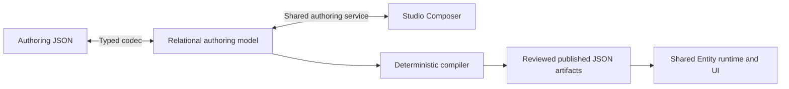

# Entity Studio — field-level relational authoring blueprint

**Reconciled design for owner review • 6 October 2026 (DDL-verified revision).** This document specifies the target relational authoring model, JSON contracts and shared Studio composer. Sections 1–10 contain the reconciled design; section 11 records the resolved audit decisions, compatibility boundary and qualification criteria. Section 11.11 lists the decisions from the 6 October review against `server/db/ddl/planes/studio/metadata`. Section 11.12 is the column-level legacy and JSONB retirement ledger. This is a design specification, not a claim of implemented DDL, deployed runtime behavior or release approval. It is self-contained. Examples are configuration/data specimens, not executable grants, seeds or a statement that a release has been published. Dictionary sample cells demonstrate their column variants independently; only worked examples describe a whole consistent row/graph.

## 1. Model and design rules



The authoring model is relational. Each scalar has a typed column; each independently ordered/referenced membership has a row. The shared compiler emits JSON from that model. Studio edits the same typed model whether it was created interactively or imported as JSON.

Model optimization decisions:

- Reuse entity, draft, release, runtime, field, key, search, relation, operation, surface and capability tables for their defined responsibilities.
- Put single surface settings directly on `entity_surface`; do not create a separate one-row list-settings table.
- A navigated detail section belongs to exactly one navigation group in its surface; form and sectioned embedded sections have no group. Lookup surfaces are token-based and have no sections or navigation groups. Store `navigation_group_id` on the section; do not create a second group-membership table for this cardinality.
- A list-view field row carries visibility order, sort order/direction and grouping. Do not create three different field-membership tables for those settings.
- Reuse one label/translation catalogue per draft. Each consumer stores a label FK, not another label JSON object.
- Reuse registered enum domains and search profiles. Do not copy their options/search-field lists into every surface or AI declaration.
- AI profile rows select entity-facing tools and context only. AI execution policy, quotas, credentials, knowledge, conversations, usage and telemetry have distinct ownership in the AI schema; they are not copied into Entity metadata.
- Shared capability profiles define comments/attachments/activity settings once. Entity enrollments pin the profile and select permitted typed overrides. Profile resolution is explicit and frozen into publication output.
- No authoring property bag, EAV replacement for configuration, executable code/SQL upload, entity-name dispatch or inferred permission is part of this model.

Names and SQL types below define the intended contract. Metadata sample IDs such as `@country`, `@country.detail` and `@country.name` are readable **document aliases for internal UUID FKs**, not stored string IDs and not visible record IDs in Entity lists.

## 2. Ownership, standard columns and constraints

### 2.1 Standard draft-owned columns

Draft-owned rows use these columns unless a table explicitly derives its coordinates from a non-null parent FK. Audit columns are service-owned and are not editable composer controls.

| Column | Type | Rule | Sample |
| --- | --- | --- | --- |
| id | uuid | PK, generated with `shared.uuidv7()` | `@country.name` |
| tenant_id | uuid NULL | NULL for product baseline; explicit tenant for tenant-owned drafts/extensions | `@tenant` or NULL |
| entity_id | uuid | FK to stable entity identity | `@country` |
| change_set_id | uuid | FK to owning authoring draft | `@country.draft` |
| status | text/domain | active/deprecated where members are independently versioned | active |
| created_at | timestamptz | server timestamp | 2026-10-04T10:00:00Z |
| created_by | uuid | authenticated author identity | `@author` |
| updated_at / updated_by | timestamptz / uuid NULL | paired, service-owned | NULL / NULL |

Stable entity/field identities do not carry change_set_id or revision-member status. entity retains its own draft/active/deprecated/retired lifecycle; field identity retains retirement evidence rather than revision-member status. The custom-value table uses its explicitly declared composite record key and has no authoring draft coordinate. Profiles/catalogues shared between entities have their own governed resource/revision coordinate, not a fabricated business entity identity. Their immutable published references use resource key, version and content hash. Draft references and cross-resource qualification are verified through the shared publication contract.

### 2.2 Database invariants

- Same-graph FKs use `(change_set_id, referenced_id)` coordinates with matching unique keys; entity ownership is checked against the root. Nullable tenant columns do not substitute for same-graph FKs; a NULL-safe ownership guard checks tenant equality.
- External relation targets, permission catalogues and immutable profile/tool releases are explicitly typed cross-resource references. They must not become unrestricted cross-tenant pointers.
- Logical keys are unique within their owner. Active sibling positions are unique. Section parentage is acyclic, and parent/child sections belong to the same surface/navigation group.
- For ordered collections, stored positions are one-based integers. This matches `entity_key_field`, `entity_search_field` and `entity_relation_field` (`CHECK position BETWEEN 1 AND n`). The existing `entity_surface_section`, `entity_surface_field_binding`, `entity_surface_operation` and `entity_surface_component_binding` positions are **zero-based** (`CHECK position >= 0`). A forward migration renumbers those rows by +1 inside each sibling scope, then replaces the CHECK with `position >= 1`. The codec never guesses which convention a row uses. JSON array indexes are zero-based; the codec adds/subtracts one explicitly. Order is preserved, never inferred from UUID or insertion time.
- A detail surface declares readable title/code fields and navigation. A list declares an explicit readable identity and allowed visible fields. UUIDs remain internal and are rejected as visible list identity/columns, including saved views.
- An operation/surface with a valid undefined permission has no entity permission requirement. A defined permission uses its exact published catalogue reference. Authentication, tenant isolation, record scope, explicit denies and existing controls still apply.
- Required configuration is explicit. Defaults chosen in Studio are persisted as authored values; no runtime guessing from field order, section names or entity codes.
- Validation spans DDL constraints, typed codecs, authoring semantics and publication qualification. Passing an FK check alone does not prove a renderer/provider is installed or access is authorized.

### 2.3 DDL integrity and save semantics

Every draft child stores id, tenant_id, entity_id and change_set_id; shared catalogue/profile and stable-identity exceptions are explicitly named. Add unique (change_set_id,id) to referenced draft tables. FK change_set_id identifies the root; an ownership guard checks child.entity_id = root.entity_id and tenant_id IS NOT DISTINCT FROM root. Never rely on a nullable composite tenant FK to enforce ownership.

| Invariant | Database enforcement | Authoring/publication enforcement |
| --- | --- | --- |
| Local member reference | Composite FK (change_set_id,member_id) to unique (change_set_id,id), deferrable where graph insertion requires it | Reject foreign graph IDs; resolve JSON logical references through server-owned maps |
| Same surface/group | Composite or deferred constraint trigger verifies owner chain; supplied group/section/field placements match | Named path diagnostics; no cross-surface slot reuse |
| Tree membership | Self-FK plus deferred recursive cycle/root/purpose checks | Qualified depth limits; no tab-as-section nodes |
| Target published reference | FK target_release_id to Entity release; guard target entity/owner and sealed source revision | Key/operation/surface/view keys resolved against that exact release and content hash; target plane qualified |
| Tenant overlay | Root tenant non-null, exact base_release_id and owned overlay rows; local/overlay XOR | Product-declared extension point and baseline operation enrollment only; effective graph retains both source hashes |
| Position | positive integer; deferrable unique NULLS NOT DISTINCT within owner/sibling dimensions | Dense 1..N on saved ordered collections; reorder whole membership set atomically |
| Surface applicability | CHECK permits NULL for an incomplete embedded draft or sectioned/collection for embedded, and requires NULL otherwise; deferred owner guards reject section/group/view/action/binding rows incompatible with the surface kind/mode | Shared descriptor applicability is validated at save, import and compilation; missing embedded mode is a P finding, never inferred |
| Section variant | Irrelevant variant columns NULL; a supplied relation/component/capability selection belongs to the declared content_kind | P completeness: related_list target/surface/operation, component slot minimums, capability enrollment/layout |
| Components | FK to catalogue row; deferred guard validates level, manifest/slot ownership and selected typed-option set | Installed host/plane, supported value types, cardinality and read/input compatibility |
| Defaults / predicates | Tagged payload XOR; irrelevant payloads NULL; bound/type/paired-column checks | Operator/type compatibility, trusted context, provider limits and policy signature qualification |
| Permissions | Exact owned catalogue reference validated in its plane; no generated codes | Valid absent property means no entity permission grant; invalid metadata/reference never becomes allow |
| Published graph | Existing immutable/state-transition triggers and append-only publication evidence | Human authorship and independent owner review of exact hashes; no application save bypass |

Partial draft save is deliberate: SQL integrity, unknown properties, ownership, invalid values, incompatible selections and contradictory declarations always reject. Missing P properties can be saved on mutable draft/rejected change sets with a returned validation report. No valid-preview/publication receipt is produced until P completeness passes. Submitted/approved/published graphs are sealed under their existing controls. Conversion of an allegedly complete source has stricter all-path validation and never labels a failed conversion as a completed import.

Service save calls the existing `metadata.fn_advance_entity_change_set(change_set_id, expected_lock_version, actor)`. This compares and advances lock_version exactly once and only for draft/rejected change sets. It also issues the transaction-local `app.entity_change_set_write_token` that every normalized graph mutation trigger requires. The service then verifies author rights, applies all member writes in that one transaction, runs the deferred ownership/tree/order checks and captures the immutable `snapshot.entity_draft_save` row for the new revision. It returns both the persisted revision and the validation findings. New member tables must enforce the same write-token guard as existing ones; a table without it is not a graph member. Concurrent stale save returns conflict with no partial writes. Preview reads a consistent saved revision; its validation/compiler hash binds that revision and exact dependencies. A malformed preview never invokes unqualified readers.

For content_kind=fields, relation/component/capability columns are NULL; direct bindings or child sections are allowed, not both. related_list has only its relation-target/surface/view/read/setup fields. component has only component_contract_id and slots. capability has only enrollment/layout references. Child sections are permitted only under fields layout containers. Null related-list selections are incomplete drafts, not an instruction to read unscoped data.

Required indexes: all FK referencing columns; (change_set_id,status); scoped logical keys; (entity_surface_id,navigation_group_id,parent_section_id,position); (entity_surface_section_id,binding_kind,position); (view_id,visible_position), (view_id,sort_position); (relation_target_id,position); overlay baseline/target coordinates; and policy/operation scope lookup keys. Add custom-value query indexes only for qualified operators, led by (tenant_id,entity_id,field_identity_id) and the corresponding typed value. No index grants authorization.

Draft-member deletion uses the owning graph transaction and explicit child removal; external dependencies and sealed releases use RESTRICT. Stable field identities are never reused for a different field and remain while values/references exist. RLS preserves platform/tenant ownership through the existing trusted session contract; client-supplied tenant_id is never ownership evidence.

### 2.4 Catalogue, label and profile ownership

ui_component_contract and its slots are immutable registered resource projections; they do not inherit Entity draft coordinates. Capability profiles and override rules belong to their governed profile resource revision and retain their exact publication reference/hash. entity_field_identity belongs to a stable entity and tenant, without change_set_id. entity_class_profile retains its existing natural primary key. Release rows retain their actual governance columns, not the draft-member common-column template.

entity_label and entity_label_translation in this dictionary belong to Entity drafts. External profile/component labels remain with their registered resource; do not insert a fake entity_id or cross-draft label row to own them. Entity-specific labels on enrollments/sections reference the Entity label catalogue. Localized output joins the two qualified resources without duplicating their authoring authority.

### 2.5 Lifecycle, nullability and concrete constraint templates

Draft members with independent lifecycle keep the established status, replacement logical key and deprecated_since_release_no/planned_removal_release_no controls. Where the dictionary uses replacement_*_id, the codec resolves the stable replacement key and exports it; there is one logical successor, not two independently editable values. Replacement must be same kind/entity and qualified; deprecated members cannot be selected for new active bindings. Historical publications retain the original member. active status and draft/published status are different domains.

The following DDL fragments specify constraint semantics for the forward implementation. They are illustrative clauses, not an applied migration or a complete CREATE TABLE script:

```sql
-- A field placement has exactly one ownership path.
CHECK (num_nonnulls(entity_surface_id, overlay_id) = 1),
CHECK (overlay_id IS NULL OR entity_surface_section_id IS NULL)

-- A section cannot carry a second content variant's configuration.
CHECK (content_kind = 'component' OR component_contract_id IS NULL),
CHECK (content_kind = 'capability' OR
       num_nonnulls(entity_capability_id, capability_layout_binding_id) = 0),
CHECK (content_kind = 'related_list' OR
       num_nonnulls(relation_target_id, target_surface_key, target_view_key,
                    read_operation_key, presentation_cardinality,
                    empty_title_label_id, empty_description_label_id,
                    empty_creation_mode, setup_label_id, create_operation_key,
                    edit_label_id) = 0)

-- Mutable predicate trees may be incomplete but cannot have two owners.
CHECK ((parent_predicate_id IS NULL AND
        num_nonnulls(view_id, authorization_profile_id, field_binding_id,
                     surface_operation_id, surface_section_id) = 1)
    OR (parent_predicate_id IS NOT NULL AND
        num_nonnulls(view_id, authorization_profile_id, field_binding_id,
                     surface_operation_id, surface_section_id) = 0))

-- Scoped member reference; parent table declares UNIQUE(change_set_id,id).
FOREIGN KEY (change_set_id, entity_field_id)
  REFERENCES metadata.entity_field(change_set_id, id)
  DEFERRABLE INITIALLY DEFERRED
```

Ordinary CHECK constraints do not inspect other rows. Same-surface membership, component-level compatibility, field-choice XOR, dense order, tree cycles and exact baseline ownership therefore use deferred constraint triggers and the shared validator. The SQL constraint and typed validator must produce consistent results; application-only validation does not replace tenant/graph integrity in the DB. Supplied invalid foreign IDs never become an incomplete-draft allowance.

Nullable columns with paired keys/versions/hashes use all-or-none checks. Character limits and numeric/date bounds reject min > max; irrelevant field-family columns must be NULL. Reference tokens reject raw UUID display. A UUID foreign key can participate in a readable reference only when the published component resolves authorized target tokens; it cannot fall back to the underlying UUID. This applies to default/personal views, embedded lists, cards, hints and exports of presentation labels.

## 3. Field dictionary

`R` means NOT NULL in storage; `N` means nullable. `P` marks a publication/preview requirement that can remain incomplete in a mutable UI draft. Conditional variant checks apply immediately to supplied values; publication validates completeness. An R designation qualified by a surface/content kind means N at SQL level with P requiredness for that kind. An FK selector displays a declared readable code/name and stores an internal UUID. A catalogue selector is backed by the relevant governed catalogue. Sets are typed arrays only when they have no independent identity/order/relationship semantics; their canonical JSON order is explicitly sorted by value. Ordered collections always use position rows. Every table has its declared PK/FKs plus the applicable standard ownership/audit columns; the setting-column and override-column subsections extend their named table and do not introduce tables.

### `metadata.entity`

*Composer home: Overview › Identity.* (Maintained cross-reference to sections 7.2–7.7; not generated output.)

Stable entity identity, separate from versioned definitions.

PK `id`; scope uniqueness `(tenant_id, entity_code)` with NULLs treated as equal; module_id references control.module.

| Column | PostgreSQL type | Required / rule | Sample value | Authoring intent |
| --- | --- | --- | --- | --- |
| `entity_code` | `text` | R; canonical code, unique in scope | country | Code input |
| `module_id` | `uuid` | R; owning module FK | @reference-module | Module selector |
| `entity_class` | `text/domain` | R; declared class | reference | Class selector |
| `ownership_model` | `text/domain` | R; system/package/tenant/overlay | system | Ownership selector |

### `metadata.entity_change_set`

*Composer home: Overview › Identity (draft) and Provenance.* (Maintained cross-reference to sections 7.2–7.7; not generated output.)

Owns the complete definition being composed; presentation/localization values live once at this root.

One semantic graph per draft. Target declarations are owned by entity_target rows; compiled envelopes derive their sets. Review/authorship fields are service-owned metadata, not surface layout settings.

| Column | PostgreSQL type | Required / rule | Sample value | Authoring intent |
| --- | --- | --- | --- | --- |
| `change_set_code` | `text` | R; unique entity revision code | country-definition-v1 | Draft code |
| `base_release_id` | `uuid` | N; exact published baseline | @baseline-release | Baseline selector |
| `source_kind` | `text` | R; product/tenant_entity/tenant_extension | product | Read-only ownership |
| `schema_version` | `integer` | R; positive authoring-contract version | 1 | Read-only |
| `entity_label_id` | `uuid` | R; label FK | @label.country | Entity label selector |
| `default_locale` | `text` | R; governed UI locale code | en | Locale selector |
| `required_locales` | `text[]` | R; distinct, includes default locale | {en,ms,ar} | Locale multi-select |
| `publication_resource_key` | `text` | R; explicit publication identity | metadata.entity.country | Resource identity |
| `source_uri` | `text` | N; author-supplied provenance | repository entity source | Provenance input |
| `source_hash` | `text` | N; sha256, supplied/verified import identity | 64 hexadecimal characters | Read-only after import |
| `lock_version` | `bigint` | R; 0..2^53−1 (forward CHECK); advanced exactly once per graph save by fn_advance_entity_change_set | 7 | Read-only; API revision (JSON integer) |
| `branch_code` | `text` | R; scoped branch code | main | Branch selector |
| `parent_change_set_id` | `uuid` | N; same entity/owner | NULL | Read-only lineage |
| `title` | `text` | R; draft title; governance text, not runtime label | Country authoring | Draft title |
| `change_summary` | `text` | N; bounded | Layout and reference configuration | Summary |
| `change_reason_code` | `text` | N; governed reason | NULL | Reason selector |
| `ticket_reference` | `text` | N | NULL | Reference |
| `publication_owner` | `text` | R; platform/tenant; scope constrained | platform | Read-only ownership |
| `submitted_at` | `timestamptz` | N; paired with submitted_by | NULL | Server-owned |
| `submitted_by` | `uuid` | N | NULL | Server-owned |
| `reviewed_at` | `timestamptz` | N; paired with reviewed_by | NULL | Server-owned |
| `reviewed_by` | `uuid` | N | NULL | Server-owned |
| `approved_at` | `timestamptz` | N; paired with approved_by | NULL | Server-owned |
| `approved_by` | `uuid` | N | NULL | Server-owned |
| `rejected_at` | `timestamptz` | N; paired with rejected_by | NULL | Server-owned |
| `rejected_by` | `uuid` | N | NULL | Server-owned |
| `rejection_reason` | `text` | N; required by rejected state | NULL | Reviewer statement |
| `published_at` | `timestamptz` | N; paired with published_by | NULL | Server-owned |
| `published_by` | `uuid` | N | NULL | Server-owned |
| `status_changed_at` | `timestamptz` | N; paired with status_changed_by | NULL | Server-owned |
| `status_changed_by` | `uuid` | N | NULL | Server-owned |

The root status uses the existing draft/in_review/approved/rejected/abandoned/published domain, not member active/deprecated. Preserve the existing state-transition and independent-review triggers. publication_owner governs authorship/review; source_kind governs graph composition; entity.ownership_model governs record ownership. Tenant extensions require a platform baseline release of the same entity. Tenant-owned entities are not mislabeled extensions. No separate revision column is stored.

### `metadata.entity_release`

*Composer home: Review and release › Releases (read-only).* (Maintained cross-reference to sections 7.2–7.7; not generated output.)

Immutable release using the established publication and Entity governance columns.

PK id; tenant_id follows entity ownership. Existing checks, immutable triggers, review receipts and publication associations remain authoritative. Release rows do not inherit mutable draft audit/status columns. Hash inputs/versioning are preserved; a new compiler contract version has explicit canonicalization. Do not introduce release_version or a second semantic_source_hash. Target rows are mutable draft intent; release.target_planes is its immutable evidence snapshot, not a second writable intent.

| Column | PostgreSQL type | Required / rule | Sample value | Authoring intent |
| --- | --- | --- | --- | --- |
| `entity_id` | `uuid` | R; stable entity FK | @country | Server-owned |
| `change_set_id` | `uuid` | R; exact sealed authoring draft | @country.draft | Read-only |
| `revision_id` | `uuid` | R; existing governed revision identity | @revision | Read-only |
| `release_no` | `bigint` | R; positive, unique entity/tenant sequence | 1 | Read-only |
| `version_label` | `text` | N; existing semantic version constraint | 1.0.0 | Release label |
| `release_kind` | `text/domain` | R; publish/rollback/retire | publish | Governed action |
| `supersedes_release_id` | `uuid` | N; required for successor, same entity/scope | NULL | Read-only lineage |
| `rollback_of_release_id` | `uuid` | N; required only for rollback | NULL | Read-only lineage |
| `contract_schema_code` | `text` | R; registered compiled schema | athyper.meta-entity-contract | Read-only |
| `contract_schema_version` | `text` | R; exact registered version | 2.1.0 | Read-only |
| `contract_hash` | `text` | R; existing contract canonicalization, SHA-256 | 64 hex characters | Read-only |
| `revision_hash` | `text` | R; existing governed revision hash, SHA-256 | 64 hex characters | Read-only |
| `release_hash` | `text` | R; existing release envelope hash, SHA-256 | 64 hex characters | Read-only |
| `compatibility_level` | `text/domain` | R; existing governed domain | backward_compatible | Read-only qualification |
| `target_planes` | `text[]` | R; immutable snapshot derived from declared targets | {studio,neon,mesh} | Read-only |
| `minimum_runtime_version` | `text` | N; qualified semantic version | NULL | Read-only |
| `signature_algorithm` | `text` | N; all-or-none signature tuple | NULL | Server-owned |
| `signing_key_id` | `text` | N; signature tuple | NULL | Server-owned |
| `contract_signature` | `text` | N; signature tuple | NULL | Server-owned |
| `audit_event_id` | `uuid` | N; existing audit reference | @audit | Server-owned |
| `publication_reason` | `text` | N; bounded | Reviewed entity release | Release reason |
| `ticket_reference` | `text` | N | NULL | Reference |
| `correlation_id` | `uuid` | N | @correlation | Server-owned |
| `published_at` | `timestamptz` | R | 2026-10-05T10:00:00Z | Server-owned |
| `published_by` | `uuid` | R; authenticated governed publisher | @publisher | Server-owned |

### `metadata.entity_target`

*Composer home: Overview › Ownership and targets.* (Maintained cross-reference to sections 7.2–7.7; not generated output.)

One declared publication plane and its explicit requirement; no duplicate target arrays on the draft.

Unique draft/plane and draft/position. Plane support is independently qualified; a recommended target is not silently converted to a required one.

| Column | PostgreSQL type | Required / rule | Sample value | Authoring intent |
| --- | --- | --- | --- | --- |
| `target_plane` | `text` | R; neon/mesh/studio registered plane | studio | Plane selector |
| `requirement` | `text` | R; required/recommended/optional | required | Requirement selector |
| `position` | `integer` | R; preserved declaration order | 1 | Order control |

### `metadata.entity_navigation_placement`

*Composer home: Overview › Placement.* (Maintained cross-reference to sections 7.2–7.7; not generated output.)

Ordered published location in the shared workspace/module navigation.

Unique target/workspace/module/route; at most one default per target. Authoring placement never installs an entity-specific page or API.

| Column | PostgreSQL type | Required / rule | Sample value | Authoring intent |
| --- | --- | --- | --- | --- |
| `entity_target_id` | `uuid` | R; same draft plane declaration | @country.studio_target | Plane selector |
| `module_id` | `uuid` | R; governed navigation module | @rel_module | Module selector |
| `route_slug` | `text` | R; explicit shared Entity route segment | countries | Route input |
| `is_default` | `boolean` | N; absence distinct from false | NULL | Optional switch |
| `name_label_id` | `uuid` | N; placement name when supplied | @label.countries | Label selector |
| `position` | `integer` | R | 1 | Order control |
| `workspace_id` | `uuid` | R; FK control.workspace | @foundation | Readable workspace selector |

Composite FK (workspace_id,module_id) references control.workspace_module. Both catalogue members and their association must be active and qualified for the target plane. Cross-plane compilation resolves governed codes from these Studio catalogue references; it does not assume UUID equality across databases.

### `metadata.entity_field_identity`

*Composer home: Data model › Fields (server-owned, Technical details).* (Maintained cross-reference to sections 7.2–7.7; not generated output.)

Small stable identity catalogue for fields whose versioned definition rows change across drafts.

PK id with shared.uuidv7(); unique entity/tenant/parent/key using NULL-safe uniqueness. This table contains identity only, no duplicate field constraints or presentation. Revision fields and stored custom values FK this identity, so draft forks cannot orphan values. Retiring a field retains its identity while any record values refer to it.

| Column | PostgreSQL type | Required / rule | Sample value | Authoring intent |
| --- | --- | --- | --- | --- |
| `entity_id` | `uuid` | R; stable entity ownership | @principal_profile | Server-owned |
| `tenant_id` | `uuid` | N; product field NULL, extension field explicit owner | @tenant | Server-owned |
| `field_key` | `text` | R; stable logical field key | preferred_contact_time | Field code |
| `parent_identity_id` | `uuid` | N; stable nested-field parent, same scope/entity | NULL | Server-owned |

### `metadata.entity_runtime_profile`

*Composer home: Overview › Storage.* (Maintained cross-reference to sections 7.2–7.7; not generated output.)

Physical record contract and reusable provider selection. Storage settings are not UI settings.

Unique change_set_id; profile_key is default, preserving the existing one-profile contract. Object identifiers are server-owned registered selections, never arbitrary client SQL. Physical storage plane is distinct from publication target plane.

| Column | PostgreSQL type | Required / rule | Sample value | Authoring intent |
| --- | --- | --- | --- | --- |
| `profile_key` | `text` | R; explicit key | default | Profile code |
| `backing_kind` | `text` | R; table/view/materialized_view/external/virtual; existing domain | table | Backing selector |
| `storage_plane` | `text` | N; required for table/view/materialized_view/external, NULL for virtual (existing storage CHECK) | studio | Plane selector |
| `storage_schema` | `text` | R; registered storage contract | shared | Registered schema selector |
| `storage_object` | `text` | R; registered source object | country | Registered object selector |
| `read_mode` | `text` | R; installed framework capability | generic | Capability selector |
| `write_mode` | `text` | R; enabled write contract or none | none | Capability selector |
| `api_exposure` | `text` | R; declared exposure | api | Exposure selector |
| `create_mode` | `text` | R; form_only/early_draft/direct/source_document; write_mode=none requires form_only | form_only | Create-mode selector |
| `draft_ttl_hours` | `integer` | N; required iff create_mode=early_draft, 1..8760 (existing CHECK) | NULL | Number input, shown only for early_draft |
| `concurrency_mode` | `text` | R; none/optimistic/append_only; append_only iff write_mode=append_only | none | Concurrency selector |
| `id_field_id` | `uuid` | R; technical record identity field | @country.id | Field selector |
| `tenant_field_id` | `uuid` | N; explicit tenant coordinate | NULL | Field selector |
| `record_version_field_id` | `uuid` | N; required for optimistic writes | @profile.record_version | Field selector |
| `soft_delete_field_id` | `uuid` | N; declared deletion semantics | NULL | Field selector |
| `read_handler_key` | `text` | N; required iff read_mode=facade, otherwise NULL (existing CHECK) | registered facade reader | Registered contract selector |
| `read_handler_version` | `integer` | N; paired with read_handler_key | 1 | Registered contract selector |
| `write_handler_key` | `text` | N; required iff write_mode=facade, otherwise NULL (existing CHECK) | shared registered writer | Registered contract selector |
| `write_handler_version` | `integer` | N; registered write contract | 1 | Registered contract selector |
| `reference_capability_key` | `text` | N; qualified cross-plane read capability | NULL | Registered capability selector |
| `reference_capability_version` | `integer` | N; paired with capability key | NULL | Version selector |

The existing `record_version_field_key`, `tenant_field_key` and `soft_delete_field_key` text columns are replaced by the `*_field_id` FKs above. The forward migration resolves each key against the same change set's fields and blocks if it cannot. `id_field_id` is new: the technical record identity is declared, never assumed to be a field named `id`. Provider handlers select record storage/read ports. They do not duplicate entity_operation.handler_key, which selects operation execution. Table/view/materialized_view require registered schema/object; external requires a storage plane but no SQL object; virtual requires neither. No arbitrary SQL identifiers are accepted. Every key/version pair pins its manifest hash through governed release dependencies.

### `metadata.entity_field`

*Composer home: Data model › Fields (inspector, section 7.7).* (Maintained cross-reference to sections 7.2–7.7; not generated output.)

One canonical definition per field; constraints and business type are not copied into surface bindings.

Unique `(change_set_id, field_identity_id)`; logical key/parent uniqueness belongs to entity_field_identity. Field key is read through field_identity_id, not stored a second time on this revision row. Stable logical field identity survives draft forks; revision row IDs do not become record value identities. Literal defaults use a tagged typed value: exactly one compatible value column. literal_null has no payload and is legal only for nullable fields. Physical non-null generated/defaulted fields can omit create input only when the selected operation contract supplies a valid value. Structured business values are different from authoring configuration.

| Column | PostgreSQL type | Required / rule | Sample value | Authoring intent |
| --- | --- | --- | --- | --- |
| `field_identity_id` | `uuid` | R; FK to stable identity catalogue | @state.country_code.identity | Server-owned |
| `parent_field_id` | `uuid` | N; derived from entity_field_identity.parent_identity_id within this draft; not independently writable | NULL | Read-only (set when the nested field is created) |
| `label_id` | `uuid` | R for visible fields; label FK | @label.country_code | Label selector |
| `description` | `text` | N; bounded documentation | Country alpha-2 code | Text input |
| `data_type` | `text/domain` | R; registered field type | string | Type selector |
| `storage_type` | `text` | N; server-populated from the registered storage catalogue for storage_path at save and re-verified at publication; never client-supplied | text | Read-only from registered storage |
| `cardinality` | `text` | R; one/many for new authoring; optionality is `nullable` only. Legacy zero_or_one decodes to one + nullable=true | one | Single/repeated switch |
| `value_origin` | `text` | R; stored/computed/projected/runtime | stored | Origin selector |
| `storage_kind` | `text` | N; column/extension; required iff value_origin is stored/projected, NULL for computed/runtime (value_origin already says so) | column | Storage selector |
| `storage_path` | `text` | N; validated registered column/path | country_code | Registered column selector |
| `nullable` | `boolean` | R; qualified storage/value contract permits explicit NULL | false | Read-only from storage or typed extension editor |
| `required` | `boolean` | R; required authored input, distinct from physical nullability/defaults | true | Switch |
| `write_mode` | `text` | R; read_only/mutable/write_once; value_origin computed/projected/runtime requires read_only. Legacy `computed` decodes to read_only (value_origin carries it) | read_only | Mode selector |
| `data_classification` | `text` | R; explicit classification | public | Classification selector |
| `retention_policy_code` | `text` | N; catalogue reference | NULL | Retention selector |
| `semantic_role` | `text` | N; declared role, not inferred | status | Role selector |
| `min_length` | `integer` | N; 0 <= min <= max | 2 | Number inputs |
| `max_length` | `integer` | N; 0 <= min <= max | 2 | Number inputs |
| `minimum` | `numeric` | N; ordered numeric bounds | 0 | Number inputs |
| `maximum` | `numeric` | N; ordered numeric bounds | 6 | Number inputs |
| `pattern` | `text` | N; validated supported regex | ^[A-Z]{2}$ | Pattern editor |
| `precision` | `integer` | N; compatible numeric type | 12 | Number inputs |
| `scale` | `integer` | N; compatible numeric type | 2 | Number inputs |
| `domain_code` | `text` | N; registered enum/lookup domain | master.ui_appearance_mode | Domain selector |
| `default_kind` | `text` | R; none/literal_null/literal/context/database | none | Default selector |
| `default_text` | `text` | N; one typed literal only | active | Typed default editor |
| `default_numeric` | `numeric` | N; one typed literal only | NULL | Typed default editor |
| `default_boolean` | `boolean` | N; one typed literal only | NULL | Typed default editor |
| `default_context_key` | `text` | N; registered context contract, paired with version | current_principal | Context selector |
| `default_context_version` | `integer` | N; paired; positive version | 1 | Version selector |
| `key_generation` | `text` | R; none/database_uuidv7/provided | provided | Key policy selector |
| `relation_id` | `uuid` | N; canonical relation selection pointer; join structure lives in entity_relation rows, never copied here | @state.country | Relation selector |
| `computed_contract_key` | `text` | N; installed computation contract | registered computation | Contract selector |
| `computed_contract_version` | `integer` | N; installed computation contract | 1 | Contract selector |
| `validation_contract_key` | `text` | N; registered complex validator | registered validator | Contract selector |
| `validation_contract_version` | `integer` | N; registered complex validator | 1 | Contract selector |
| `json_schema_key` | `text` | N; required for structured JSON business values | registered schema | Schema selector |
| `json_schema_hash` | `text` | N; required for structured JSON business values | digest | Schema selector |
| `replacement_field_id` | `uuid` | N; active replacement | NULL | Field selector |
| `minimum_date` | `date` | N; date family only | NULL | Date bound |
| `maximum_date` | `date` | N; >= minimum_date | NULL | Date bound |
| `minimum_datetime` | `timestamptz` | N; datetime only | NULL | Datetime bound |
| `maximum_datetime` | `timestamptz` | N; >= minimum_datetime | NULL | Datetime bound |
| `temporal_kind` | `text` | N; date/datetime only; date/instant | instant | Temporal contract |
| `currency_field_id` | `uuid` | N; money only, XOR currency_code | @amount.currency | Currency field selector |
| `currency_code` | `text` | N; money only, governed code XOR field | NULL | Currency selector |
| `default_date` | `date` | N; literal date only | NULL | Typed default |
| `default_datetime` | `timestamptz` | N; literal datetime only | NULL | Typed default |
| `default_uuid` | `uuid` | N; literal technical UUID only; never displayed as label | NULL | Governed reference selector |

R data_type is the scalar/structured semantic family; a relation-bearing string stays a string. A target-owned lookup surface supplies reference presentation through relation_target; no copied label field is stored here. Optionality is stored once, in nullable; cardinality only distinguishes single from repeated values, and many uses a qualified structured item contract. Nested-field parentage is owned once, by entity_field_identity.parent_identity_id. The existing field_key, replacement_field_key, type_config, default_spec, computation_spec and validation_spec columns are retired by the 11.12 ledger. Physical storage nullability and authoring required input are independent. Only registered zero-parameter computation/validation contracts are enabled by these key/version columns; parameterized contracts require an explicit finite typed parameter design before selection. No hidden JSON options are accepted.


The semantic family constraint matrix is mandatory: string/text permit length/pattern only; integer/bigint permit integral numeric bounds; decimal/money permit numeric bounds/precision/scale; date permits date bounds; datetime permits instant bounds/temporal_kind; boolean and UUID permit none of these range/format constraints. Enum uses domain_code XOR owned choices, with a deferred count guard. Phase-1 enum is string-backed: entity_field_choice.value_text is text and non-string enum payloads block until a qualified typed enum contract exists. Money requires exactly one currency field or governed fixed currency. Structured json/many requires a pinned schema and supported provider; a property bag is not a schema contract. String/text aliases share a semantic resolver while preserving physical storage type and explicit component choice. bigint/decimal JSON encodings preserve precision as decimal strings when necessary.

### `metadata.entity_field_choice`

*Composer home: Data model › Fields › field Value rules panel.* (Maintained cross-reference to sections 7.2–7.7; not generated output.)

Use only for entity-owned inline choices. Registered catalogue domains stay catalogue-owned.

Unique `(entity_field_id, value_text)`. Surface lookups and AI do not duplicate these rows. Surface narrowing selects existing choices and cannot introduce invalid domain values.

| Column | PostgreSQL type | Required / rule | Sample value | Authoring intent |
| --- | --- | --- | --- | --- |
| `entity_field_id` | `uuid` | R; enum field FK | @country.status | Field selector |
| `value_text` | `text` | R; string enum values only in this contract; unique field value | active | Value input |
| `label_id` | `uuid` | R | @label.status.active | Label selector |
| `tone` | `text` | N; neutral/success/warning/danger | success | Tone selector |
| `position` | `integer` | R | 1 | Order control |

Non-string choice payloads are not silently stringified. They require a qualified typed enum contract before import/editor selection. Domain-backed fields have zero entity-owned choice rows; catalogue labels/tones are referenced, not copied.

### `metadata.entity_key`

*Composer home: Data model › Keys.* (Maintained cross-reference to sections 7.2–7.7; not generated output.)

Defines key semantics; technical and readable business identities are distinct.

Ordered fields live in `entity_key_field`; a compound key is not a comma-separated column string.

| Column | PostgreSQL type | Required / rule | Sample value | Authoring intent |
| --- | --- | --- | --- | --- |
| `key_key` | `text` | R; unique draft key | country_code | Key code |
| `key_kind` | `text` | R; primary/natural/alternate/idempotency | natural | Kind selector |
| `uniqueness_scope` | `text` | R; explicitly declared scope | global | Scope selector |
| `null_semantics` | `text` | R; key null contract | not_allowed | Selector |

### `metadata.entity_key_field`

*Composer home: Data model › Keys.* (Maintained cross-reference to sections 7.2–7.7; not generated output.)

Key membership including composite identities.

Unique key/field and key/position. State Region stored positions: country_code at 1, code at 2; JSON array indexes are 0 and 1.

| Column | PostgreSQL type | Required / rule | Sample value | Authoring intent |
| --- | --- | --- | --- | --- |
| `entity_key_id` | `uuid` | R | @state.natural_key | Key selector |
| `entity_field_id` | `uuid` | R | @state.country_code | Field selector |
| `position` | `integer` | R; contiguous within key | 1 | Order control |

### `metadata.entity_search_profile`

*Composer home: Data model › Search.* (Maintained cross-reference to sections 7.2–7.7; not generated output.)

Single search definition reused by surfaces and entity AI.

AI can select a dedicated search profile if it needs a subset. It must not maintain an unrelated second search field list.

| Column | PostgreSQL type | Required / rule | Sample value | Authoring intent |
| --- | --- | --- | --- | --- |
| `search_key` | `text` | R; unique draft profile | default | Code input |
| `search_kind` | `text` | R; keyword/full_text/hybrid | keyword | Selector |
| `query_operator` | `text` | R; and/or | and | Operator selector |
| `minimum_query_length` | `integer` | R; nonnegative | 2 | Number input |
| `language_code` | `text` | N; approved language | en | Language selector |
| `normalization_mode` | `text` | R; none/casefold/casefold_unaccent | casefold | Selector |
| `is_default` | `boolean` | R; at most one active default | true | Switch |

### `metadata.entity_search_field`

*Composer home: Data model › Search.* (Maintained cross-reference to sections 7.2–7.7; not generated output.)

Ordered weighted field memberships.

Unique profile/field and profile/position.

| Column | PostgreSQL type | Required / rule | Sample value | Authoring intent |
| --- | --- | --- | --- | --- |
| `entity_search_profile_id` | `uuid` | R | @country.search | Profile selector |
| `entity_field_id` | `uuid` | R; search-authorized field | @country.name | Field selector |
| `position` | `integer` | R | 2 | Order control |
| `match_mode` | `text` | R; supported by type/provider | contains | Match selector |
| `weight` | `numeric` | N; positive | 1 | Number input |

### `metadata.entity_relation`

*Composer home: Data model › Relations.* (Maintained cross-reference to sections 7.2–7.7; not generated output.)

Named relationship structure; display cardinality is an explicit presentation choice.

No permissions or independently repeated joins in a surface or AI selection.

| Column | PostgreSQL type | Required / rule | Sample value | Authoring intent |
| --- | --- | --- | --- | --- |
| `relation_key` | `text` | R; unique in draft | country | Code input |
| `relation_kind` | `text` | R; qualified cardinality | many_to_one | Selector |
| `resolution_kind` | `text` | R; supported foreign_key/logical | foreign_key | Selector |
| `ownership_mode` | `text/domain` | R; reference/aggregate_child/shared | reference | Ownership selector |
| `mutation_mode` | `text` | R; declared qualified behavior | read_only | Selector |
| `on_delete` | `text` | R; registered referential semantics | restrict | Selectors |
| `on_update` | `text` | R; registered referential semantics | restrict | Selectors |
| `inverse_relation_id` | `uuid` | N; explicit inverse | NULL | Relation selector |

### `metadata.entity_relation_target`

*Composer home: Data model › Relations.* (Maintained cross-reference to sections 7.2–7.7; not generated output.)

Canonical target identity, key and exact published source, including its target-owned lookup presentation.

Unique relation/variant. The target release FK must belong to target_entity_id; immutable release_hash and target source revision are derived from that FK and emitted as dependencies, not independently editable text. Target field/key/surface logical keys resolve against that sealed revision. Multiple variants require an installed resolver that selects exactly one; unsupported polymorphism blocks qualification. Structural-only relations need no lookup surface until a display/picker selects them.

| Column | PostgreSQL type | Required / rule | Sample value | Authoring intent |
| --- | --- | --- | --- | --- |
| `entity_relation_id` | `uuid` | R; same graph | @state.country | Relation selector |
| `relation_target_key` | `text` | R; unique relation variant | default | Code input |
| `target_entity_id` | `uuid` | R; governed identity | @country | Entity selector |
| `target_key_key` | `text` | R; declared target key | country_code | Target key selector |
| `target_release_id` | `uuid` | N; P exact published Entity release | @country.release | Release selector |
| `reference_surface_key` | `text` | N; P when relation is displayed/picked; target lookup surface | lookup | Target presentation selector |
| `discriminator_value` | `text` | N; only qualified variant relations | NULL | Variant selector |
| `is_default` | `boolean` | R; at most one per relation | true | Variant selector |

### `metadata.entity_relation_field`

*Composer home: Data model › Relations.* (Maintained cross-reference to sections 7.2–7.7; not generated output.)

Ordered join mappings, including tenant equality and compound keys.

Unique target/source field, target/target field and target/position. Examples: country_code → code; parent reference (country_code,parent_code) → (country_code,code).

| Column | PostgreSQL type | Required / rule | Sample value | Authoring intent |
| --- | --- | --- | --- | --- |
| `entity_relation_target_id` | `uuid` | R | @state.country.target | Target selector |
| `source_field_id` | `uuid` | R | @state.country_code | Source field selector |
| `target_field_key` | `text` | R; declared qualified target field | code | Target field selector |
| `position` | `integer` | R; contiguous | 1 | Order control |

### `metadata.entity_field_reference_binding`

*Composer home: Data model › Relations.* (Maintained cross-reference to sections 7.2–7.7; not generated output.)

Non-entity lookup domain or registered resolver selection.

Entity-to-entity references always use the relation tables above.

| Column | PostgreSQL type | Required / rule | Sample value | Authoring intent |
| --- | --- | --- | --- | --- |
| `entity_field_id` | `uuid` | R | @profile.appearance_mode | Field selector |
| `binding_key` | `text` | R | appearance_choices | Code input |
| `reference_kind` | `text` | R; lookup_domain/resolver | lookup_domain | Selector |
| `resolver_key` | `text` | N; exactly one matching target | registered resolver | Contract selector |
| `resolver_version` | `integer` | N; exactly one matching target | 1 | Contract selector |
| `require_active` | `boolean` | R | true | Switch |

For reference_kind=lookup_domain, the field.domain_code is the sole catalogue identity; no second lookup_domain copy is stored. For resolver, resolver_key/version is required and domain_code must be NULL. require_active is only an explicitly supported narrowing rule. An entity relation never uses this table.

### `metadata.entity_operation`

*Composer home: Access and behaviour › Operations.* (Maintained cross-reference to sections 7.2–7.7; not generated output.)

Operation identity, executable selection and explicit authorization semantics.

Exact permission, plane/scope and runtime selections are separate relational bindings; operation names do not construct permission codes or handler names.

| Column | PostgreSQL type | Required / rule | Sample value | Authoring intent |
| --- | --- | --- | --- | --- |
| `operation_key` | `text` | R; unique in draft | read | Code input |
| `operation_kind` | `text` | R; declared semantic kind | read | Selector |
| `label_id` | `uuid` | R | @label.read | Label selector |
| `audit_event_code` | `text` | R; configured audit identity | published audit event | Catalogue selector |
| `execution_mode` | `text` | R; qualified execution mode | synchronous | Selector |
| `idempotency_mode` | `text` | R; none/required/revision contract | none | Selector |
| `input_surface_id` | `uuid` | N; same graph surface FKs | @profile.form | Surface selectors |
| `result_surface_id` | `uuid` | N; same graph surface FKs | @profile.detail | Surface selectors |
| `authorization_target` | `text` | R; collection/existing/new | existing | Selector |
| `authorization_effect` | `text` | R; read/write/navigation | read | Selector |
| `requires_parent_read` | `boolean` | R; explicit published requirement | false | Switch |
| `requires_preflight` | `boolean` | R; registered evidence requirement | false | Read-only qualified contract setting |
| `replacement_operation_id` | `uuid` | N | NULL | Operation selector |
| `handler_key` | `text` | N; P for executable operation; registered shared handler | entity.record.read.v1 | Contract selector |
| `handler_version` | `integer` | N; key/version both absent or present | 1 | Version selector |
| `preflight_key` | `text` | N; P when requires_preflight; installed contract | NULL | Contract selector |
| `preflight_version` | `integer` | N; paired | NULL | Version selector |
| `extension_field_mode` | `text` | R; none/allow_owned_fields; product-governed | none | Extension enrollment policy |
| `export_formats` | `text[]` | N; export operation only; qualified formats | {csv} | Format selector |
| `export_max_records` | `bigint` | N; export only; positive approved bound | 10000 | Limit input |

One shared operation handler across declared planes; each plane must qualify that contract. Scope resolvers stay in entity_operation_scope_binding. A source requiring incompatible per-plane handlers is unsupported in this contract version and blocks import/publication; do not create a parallel runtime-binding table or infer dispatch. The earlier separate entity_operation_runtime_binding table is folded into this row's handler_key/version plus entity_operation_scope_binding and is not reintroduced. Existing requires_mfa storage/control is preserved service-side; this composer has no editable MFA member. The legacy operation columns are retired by the 11.12 ledger: `permission_code` duplicates entity_operation_permission; `confirmation_surface_key` moves to entity_surface_operation.confirmation_surface_id; `input_surface_key`/`result_surface_key` become the *_surface_id FKs; `label` becomes label_id. `description` is kept as bounded author documentation (`text`, N, ≤4000), not a runtime label.

### `metadata.entity_operation_permission`

*Composer home: Access and behaviour › Permissions and scope.* (Maintained cross-reference to sections 7.2–7.7; not generated output.)

Exact plane-specific permission metadata.

Unique operation/plane. Zero rows for an operation means no entity permission requirement, once the metadata itself is valid; it never means bypass other platform controls.

| Column | PostgreSQL type | Required / rule | Sample value | Authoring intent |
| --- | --- | --- | --- | --- |
| `entity_operation_id` | `uuid` | R | @profile.patch | Operation selector |
| `target_plane` | `text` | R; declared publication target | studio | Plane selector |
| `permission_code` | `text` | R in a row; governed exact code | selected published permission | Permission catalogue selector |
| `permission_kind` | `text` | R; existing CHECK entity_operation/capability | entity_operation | Selector |

### `metadata.entity_access_permission`

*Composer home: Access and behaviour › Permissions and scope.* (Generated from section 7.2; edit the map there, not here.)

Exact plane-specific permission for a surface or a capability action. It has the same shape as entity_operation_permission, but its owner is not an operation.

Owner XOR: exactly one of entity_surface_id and capability_binding_id, both same-graph. Unique owner/plane. Zero rows for an owner means that owner adds no entity permission requirement, provided the metadata itself is valid. A capability binding row is legal only for binding_kind=action. This replaces the earlier single `entity_surface.permission_code` and `entity_capability_binding.permission_code` text columns. Those columns could not say which plane's catalogue the code belongs to, and every other permission in this model is plane-qualified. Same code-format CHECK as entity_operation_permission; codes are selected from the published catalogue, never constructed.

| Column | PostgreSQL type | Required / rule | Sample value | Authoring intent |
| --- | --- | --- | --- | --- |
| `entity_surface_id` | `uuid` | N; XOR capability_binding_id | NULL | Fixed by context |
| `capability_binding_id` | `uuid` | N; XOR entity_surface_id; action bindings only | @country.comments.read | Fixed by context |
| `target_plane` | `text` | R; declared publication target | neon | Plane selector |
| `permission_code` | `text` | R in a row; governed exact code | selected comment-read permission | Permission catalogue selector |
| `permission_kind` | `text` | R; entity_operation/capability | capability | Selector |

### `metadata.entity_operation_scope_binding`

*Composer home: Access and behaviour › Permissions and scope.* (Maintained cross-reference to sections 7.2–7.7; not generated output.)

Canonical scope coordinates and resolver selection.

Unique draft/binding_key and operation/plane/scope_kind (existing constraints). Existing CHECKs remain: tenant scope uses tenant_context only; coordinate_key is required iff the source is request/record/collection field; resolver key/version are required iff the source is relation_resolver; collection decisions cannot use request/record fields. Scope cannot be supplied as untrusted filter text.

| Column | PostgreSQL type | Required / rule | Sample value | Authoring intent |
| --- | --- | --- | --- | --- |
| `entity_operation_id` | `uuid` | R | @profile.read | Operation selector |
| `target_plane` | `text` | R | studio | Plane selector |
| `binding_key` | `text` | R | record_scope | Code input |
| `decision_mode` | `text` | R; collection/entity_resource | entity_resource | Selector |
| `scope_kind` | `text` | R; supported coordinate contract | tenant | Selector |
| `coordinate_source` | `text` | R; trusted source | tenant_context | Selector |
| `coordinate_key` | `text` | N; required iff coordinate_source is request_field/record_field/collection_field | NULL | Field-coordinate selector |
| `resolver_key` | `text` | N; required iff coordinate_source=relation_resolver | NULL | Contract selector |
| `resolver_version` | `integer` | N; paired with resolver_key | NULL | Contract selector |
| `missing_value_behavior` | `text` | R; deny when coordinate required | deny | Read-only contract setting |

### `metadata.entity_operation_field`

*Composer home: Access and behaviour › Operations.* (Maintained cross-reference to sections 7.2–7.7; not generated output.)

Explicit writable/request field enrollment.

Unique operation/field. Compiles operation fieldKeys; surface visibility never enrolls a write field automatically.

| Column | PostgreSQL type | Required / rule | Sample value | Authoring intent |
| --- | --- | --- | --- | --- |
| `entity_operation_id` | `uuid` | R | @profile.patch | Operation selector |
| `entity_field_id` | `uuid` | R; compatible stored/input field | @profile.display_name | Field selector |
| `position` | `integer` | R | 1 | Order control |
| `operation_change_set_id` | `uuid` | R; local draft or exact approved baseline graph for extension | @profile.draft | Server-resolved |

Composite FK (operation_change_set_id,entity_operation_id) resolves an existing operation. Normally it equals change_set_id. A tenant extension may reference only its exact sealed base_release_id graph and only an operation with extension_field_mode=allow_owned_fields. Field_id always belongs to the extension/current draft. This permits owned custom fields without editing the baseline operation. Required-input semantics are enforced on create/full input; patch omission means unchanged.

### `metadata.entity_authorization_profile`

*Composer home: Access and behaviour › Permissions and scope.* (Maintained cross-reference to sections 7.2–7.7; not generated output.)

Entity-level access/read/directory and owner semantics, together in one profile per plane.

Unique draft/plane. Owner access is not another loosely attached surface object; absence of optional owner settings does not invent another scope.

| Column | PostgreSQL type | Required / rule | Sample value | Authoring intent |
| --- | --- | --- | --- | --- |
| `target_plane` | `text` | R | studio | Plane selector |
| `ownership_resolver_key` | `text` | R; registered contract | tenant.record.v1 | Contract selector |
| `ownership_resolver_version` | `integer` | R; registered contract | 1 | Contract selector |
| `record_read_operation_id` | `uuid` | R | @profile.read | Operation selector |
| `directory_operation_id` | `uuid` | R | @profile.list | Operation selector |
| `directory_population` | `text` | R; qualified directory scope | tenant | Selector |
| `owner_field_id` | `uuid` | N; declared owner coordinate | @profile.principal_id | Field selector |
| `created_by_field_id` | `uuid` | N; paired when required | @profile.created_by | Field selectors |
| `updated_by_field_id` | `uuid` | N; paired when required | @profile.updated_by | Field selectors |
| `administer_permission_code` | `text` | N; exact published property | selected administration permission | Permission selector |

### `metadata.entity_field_access`

*Composer home: Access and behaviour › Field access.* (Maintained cross-reference to sections 7.2–7.7; not generated output.)

Keep one field/plane access row; separate read/query/write semantics explicitly.

Unique field/plane. Write membership uses entity_operation_field; access validation verifies compatible read/write exposure without a duplicated write-operation list.

| Column | PostgreSQL type | Required / rule | Sample value | Authoring intent |
| --- | --- | --- | --- | --- |
| `entity_field_id` | `uuid` | R | @country.name | Field selector |
| `target_plane` | `text` | R | studio | Plane selector |
| `read_operation_id` | `uuid` | R | @country.read | Operation selector |
| `representation` | `text` | R; plain/masked/omitted contract | plain | Selector |
| `query_uses` | `text[]` | R; supported permitted set | {search,filter,sort,group} | Multi-select |
| `read_operation_change_set_id` | `uuid` | R; local or exact sealed baseline graph | @country.draft | Server-resolved |

Composite read-operation FK uses read_operation_change_set_id. Cross-draft selection is permitted only for the exact approved baseline of a tenant extension; it inherits that operation and cannot weaken product authorization. Conditional policy bindings remain independent approved controls. Missing exposure metadata for a rendered field is a configuration error; this is distinct from a valid absent entity permission.

### `metadata.ui_component_contract`

*Composer home: Experience › component palette (read-only catalogue).* (Maintained cross-reference to sections 7.2–7.7; not generated output.)

Read-only governed catalogue projection of installed shared UI contracts. It is the single palette authority; authoring cannot upload or edit implementation code.

PK id with shared.uuidv7(); unique key/version/level; tenant_id NULL for platform registry or explicit qualified tenant resource. No entity_id/change_set_id. Ownership/audit belongs to the publication resource. Referencing FKs resolve the expected component_level and exact manifest. No navigation-group component level is exposed. DB registration alone does not prove plane/host installation. option_keys can only enumerate the typed options declared on bindings below; geometry/scope is not an option copy.

| Column | PostgreSQL type | Required / rule | Sample value | Authoring intent |
| --- | --- | --- | --- | --- |
| `component_key` | `text` | R; registered key | platform.address.fields.v1 | Read-only catalogue |
| `component_version` | `integer` | R; positive immutable version | 1 | Version selector |
| `component_level` | `text` | R; surface/section/field_display/field_input/filter/format | section | Read-only level |
| `component_tier` | `text` | R; standard/shared_composite/domain_registered | shared_composite | Read-only tier |
| `manifest_hash` | `text` | R; SHA-256 of approved registered contract | 64 hex characters | Read-only qualification |
| `publication_resource_key` | `text` | R; governed contract resource | registered component resource | Read-only |
| `publication_release_hash` | `text` | R; exact reviewed resource release | 64 hex characters | Read-only |
| `supported_data_types` | `text[]` | R; distinct finite family set; empty for structural components | {string,enum} | Read-only compatibility |
| `supported_planes` | `text[]` | R; declared registered subset | {studio,neon,mesh} | Read-only compatibility |
| `option_keys` | `text[]` | R; finite column contract, not arbitrary names | {text_wrap} | Read-only option capability |
| `status` | `text/domain` | R; active/deprecated | active | Read-only lifecycle |

### `metadata.ui_component_slot`

*Composer home: Experience › component palette (read-only catalogue).* (Maintained cross-reference to sections 7.2–7.7; not generated output.)

Ordered registered field roles of a component contract; implementation metadata, not a second component selection.

PK id; parent-owned catalogue coordinates; unique contract/role and contract/position. Every slot maps to authorized field bindings of the selected section. Required slots are publication constraints; draft bindings can be incomplete but never point at a slot of another component.

| Column | PostgreSQL type | Required / rule | Sample value | Authoring intent |
| --- | --- | --- | --- | --- |
| `component_contract_id` | `uuid` | R; FK ui_component_contract | @address.component | Read-only |
| `role_key` | `text` | R; unique per contract | country | Read-only role |
| `supported_data_types` | `text[]` | R; compatible field family set | {string} | Read-only types |
| `value_contract` | `text` | R; scalar/reference/structured | reference | Read-only contract |
| `access_mode` | `text` | R; read/input | read | Read-only access |
| `minimum_bindings` | `integer` | R; >=0 | 1 | Read-only requirement |
| `maximum_bindings` | `integer` | R; >=minimum, bounded | 1 | Read-only bound |
| `position` | `integer` | R; >=1 | 1 | Read-only order |

### `metadata.entity_policy_binding`

*Composer home: Access and behaviour › Policies.* (Maintained cross-reference to sections 7.2–7.7; not generated output.)

Existing conditional-policy composition; policy definitions and evaluation remain control-owned.

Existing identity/ownership/audit and key/priority constraints remain. The selected policy is pinned through immutable publication dependencies. No policy body or input_mapping bag is authored here. Parameter rows below select the exact declared inputs; policy controls cannot be weakened by presentation, tenant overlays or missing entity permissions.

| Column | PostgreSQL type | Required / rule | Sample value | Authoring intent |
| --- | --- | --- | --- | --- |
| `entity_operation_id` | `uuid` | N; same graph operation, NULL for entity/field-wide binding | NULL | Operation selector |
| `policy_definition_id` | `uuid` | R; existing approved control.policy_definition | @policy | Governed policy selector |
| `binding_key` | `text` | R; unique scoped key | record_policy | Code input |
| `binding_stage` | `text/domain` | R; existing qualified stage domain | authorization | Stage selector |
| `enforcement` | `text/domain` | R; preserve existing enforcement contract | enforce | Governed selector |
| `priority` | `smallint` | R; 0..32767; ordered within owner/operation/stage | 100 | Priority control |

### `metadata.entity_field_policy_binding`

*Composer home: Access and behaviour › Policies.* (Maintained cross-reference to sections 7.2–7.7; not generated output.)

Field-scoped variant of `entity_policy_binding`. It has every column, rule and control of that table plus the column below; the shared rules are not restated. The two existing tables stay separate for compatibility (section 11.6). Studio edits both through one Policies editor in the Access and behaviour module, with scope = entity or field.

| Column | PostgreSQL type | Required / rule | Sample value | Authoring intent |
| --- | --- | --- | --- | --- |
| `entity_field_id` | `uuid` | R; same graph field | @profile.name | Field selector |

### `metadata.entity_policy_parameter_binding`

*Composer home: Access and behaviour › Policies.* (Maintained cross-reference to sections 7.2–7.7; not generated output.)

Finite argument mapping to a declared policy signature, not a generic settings store.

PK id; XOR owner with same graph guard; unique owner/parameter. Unknown parameters, incompatible types/sources and expression strings reject save. All required signature arguments must be bound before preview/publication. Structured/variadic arguments are unsupported in this version and block conversion. This table maps declared function inputs; it cannot introduce a property, option or policy behavior.

| Column | PostgreSQL type | Required / rule | Sample value | Authoring intent |
| --- | --- | --- | --- | --- |
| `entity_policy_binding_id` | `uuid` | N; XOR field_policy_binding_id | @record.policy | Owner context |
| `field_policy_binding_id` | `uuid` | N; XOR entity policy owner | NULL | Owner context |
| `parameter_key` | `text` | R; existing declared parameter of pinned policy signature | record_owner | Parameter selector |
| `source_kind` | `text` | R; field/context/literal | field | Source selector |
| `entity_field_id` | `uuid` | N; field only; same graph | @profile.principal_id | Field selector |
| `context_key` | `text` | N; context only; trusted registered coordinate | NULL | Context selector |
| `context_version` | `integer` | N; paired | NULL | Version selector |
| `value_kind` | `text` | N; literal only; text/numeric/boolean/date/datetime/uuid/null | NULL | Typed discriminator |
| `value_text` | `text` | N; exact compatible literal only | NULL | Typed value |
| `value_numeric` | `numeric` | N; exact compatible literal only | NULL | Typed value |
| `value_boolean` | `boolean` | N; exact compatible literal only | NULL | Typed value |
| `value_date` | `date` | N; exact compatible literal only | NULL | Typed value |
| `value_datetime` | `timestamptz` | N; exact compatible literal only | NULL | Typed value |
| `value_uuid` | `uuid` | N; exact compatible literal only | NULL | Authorized reference selector |

### `metadata.entity_class_profile`

*Composer home: Overview › Identity (read-only defaults source).* (Maintained cross-reference to sections 7.2–7.7; not generated output.)

Immutable class defaults; values are copied explicitly during authoring and then persisted. No runtime inference.

These are retained columns, not replacement concepts. Retains its existing PK entity_class, profile_version and created audit; no draft coordinates or UUID id.

| Column | PostgreSQL type | Required / rule | Sample value | Authoring intent |
| --- | --- | --- | --- | --- |
| `entity_class` | `metadata.entity_class_d` | R; preserve existing typed contract | reference | Typed governed editor |
| `profile_version` | `integer` | R; preserve existing typed contract | 1 | Typed governed editor |
| `fallback_name` | `text` | R; preserve existing typed contract | Reference entity | Typed governed editor |
| `description` | `text` | R; preserve existing typed contract | Published reference data | Typed governed editor |
| `default_backing_kind` | `metadata.entity_backing_kind_d` | R; preserve existing typed contract | table | Typed governed editor |
| `default_api_exposure` | `metadata.entity_api_exposure_d` | R; preserve existing typed contract | api | Typed governed editor |
| `default_read_mode` | `metadata.entity_read_mode_d` | R; preserve existing typed contract | generic | Typed governed editor |
| `default_write_mode` | `metadata.entity_write_mode_d` | R; preserve existing typed contract | none | Typed governed editor |
| `default_concurrency_mode` | `metadata.entity_concurrency_mode_d` | R; preserve existing typed contract | none | Typed governed editor |
| `default_change_policy` | `metadata.entity_change_policy_d` | R; preserve existing typed contract | locked | Read-only existing control |


### `metadata.entity_operation_rule`

*Composer home: Access and behaviour › Rules and context.* (Maintained cross-reference to sections 7.2–7.7; not generated output.)

Existing generic operation controls. Lifecycle-conditioned rules are outside new Phase 1 editing; existing protected controls are preserved.

These are retained columns, not replacement concepts. Standard draft ownership applies; retain the existing operation/field scope FKs and ordering/uniqueness checks.

| Column | PostgreSQL type | Required / rule | Sample value | Authoring intent |
| --- | --- | --- | --- | --- |
| `entity_operation_id` | `uuid` | R; preserve existing typed contract | @owned_reference | Typed governed editor |
| `rule_key` | `text` | R; preserve existing typed contract | scope_rule | Typed governed editor |
| `priority` | `smallint` | R; preserve existing typed contract | 1 | Typed governed editor |
| `decision` | `metadata.entity_operation_rule_decision_d` | R; preserve existing typed contract | deny | Typed governed editor |
| `plane_code` | `text` | N; preserve existing typed contract | NULL | Typed governed editor |
| `lifecycle_state_code` | `text` | N; preserve existing typed contract | NULL | Read-only existing control |
| `lifecycle_transition_code` | `text` | N; preserve existing typed contract | NULL | Read-only existing control |
| `required_capability_code` | `text` | N; preserve existing typed contract | NULL | Typed governed editor |
| `reason_code` | `text` | N; preserve existing typed contract | NULL | Typed governed editor |


### `metadata.entity_operation_context_requirement`

*Composer home: Access and behaviour › Rules and context.* (Maintained cross-reference to sections 7.2–7.7; not generated output.)

Existing trusted context input contract. Request fields are not trusted tenant evidence.

These are retained columns, not replacement concepts. Standard draft ownership applies; retain the existing operation/field scope FKs and ordering/uniqueness checks.

| Column | PostgreSQL type | Required / rule | Sample value | Authoring intent |
| --- | --- | --- | --- | --- |
| `entity_operation_id` | `uuid` | R; preserve existing typed contract | @owned_reference | Typed governed editor |
| `coordinate_key` | `text` | R; preserve existing typed contract | tenantId | Typed governed editor |
| `source_kind` | `text` | R; preserve existing typed contract | tenant_context | Typed governed editor |
| `source_field_key` | `text` | N; preserve existing typed contract | NULL | Typed governed editor |
| `required` | `boolean` | R; preserve existing typed contract | true | Typed governed editor |


### `metadata.entity_contract_test_case`

*Composer home: Review and release › Contract tests.* (Maintained cross-reference to sections 7.2–7.7; not generated output.)

Existing schema-bound fixture metadata. Results belong to immutable qualification artifacts, not these rows.

These are retained columns, not replacement concepts. Standard draft ownership applies; retain the existing operation/field scope FKs and ordering/uniqueness checks.

| Column | PostgreSQL type | Required / rule | Sample value | Authoring intent |
| --- | --- | --- | --- | --- |
| `test_key` | `text` | R; preserve existing typed contract | country_contract | Typed governed editor |
| `test_kind` | `metadata.entity_contract_test_kind_d` | R; preserve existing typed contract | compilation | Typed governed editor |
| `title` | `text` | R; preserve existing typed contract | Compile the declared entity contract | Typed governed editor |
| `description` | `text` | N; preserve existing typed contract | NULL | Typed governed editor |
| `target_plane` | `text` | N; preserve existing typed contract | NULL | Typed governed editor |
| `entity_operation_id` | `uuid` | N; preserve existing typed contract | NULL | Typed governed editor |
| `entity_flow_id` | `uuid` | N; preserve existing typed contract | NULL | Read-only existing control |
| `input_context` | `jsonb` | R; pinned fixture schema and bounded payload; only qualified test kinds | {} | Typed governed editor |
| `expected_outcome` | `metadata.entity_contract_test_outcome_d` | R; preserve existing typed contract | pass | Typed governed editor |
| `expected_diagnostic_codes` | `text[]` | R; preserve existing typed contract | {} | Typed governed editor |
| `input_schema_key` | `text` | N; P when fixture supplied; registered schema | registered fixture schema | Schema selector |
| `input_schema_hash` | `text` | N; paired; P pinned SHA-256 | 64 hex characters | Read-only |


### `metadata.entity_surface`

*Composer home: Experience › surface tree and surface inspector (sections 7.6–7.7).* (Maintained cross-reference to sections 7.2–7.7; not generated output.)

Single home for surface-level scalar settings. Nullable settings are constrained by surface kind and explicit embedded mode. List-only settings also apply to collection embedded and are NULL elsewhere; reference_key_id/reference_format are NULL outside lookup. Section 7.6 defines the same applicability contract for the composer, API validation and compiler.

One active default surface per kind. A form's create/edit modes are **derived** from its submit placements (entity_surface_operation with interaction_target=submit and a create- or update-kind operation). No separate form_modes array is stored: the array would be a second, contradictable copy of the placements. Geometry shared by create/edit uses one form surface; differing operation labels are operation-placement metadata. Different geometry requires a second explicitly selected surface, not duplicated form JSON.

| Column | PostgreSQL type | Required / rule | Sample value | Authoring intent |
| --- | --- | --- | --- | --- |
| `surface_key` | `text` | R; unique in draft | detail | Code input |
| `surface_kind` | `text` | R; list/detail/form/embedded/lookup | detail | Kind selector |
| `embedded_mode` | `text` | N; P for embedded; sectioned/collection; NULL for all other kinds | NULL | Explicit embedded presentation selector |
| `label_id` | `uuid` | N; P readable surface label | @label.countries | Label selectors |
| `description_label_id` | `uuid` | N | NULL | Label selectors |
| `layout_kind` | `text` | R; flow/grid/stack. The existing `tabs` value is retired for new authoring (R08); navigation groups own tabs | stack | Layout selector |
| `is_default` | `boolean` | R; at most one active per kind | true | Switch |
| `icon_key` | `text` | N; registered semantic icon | globe | Icon selector |
| `identity_field_id` | `uuid` | P for list and collection embedded; readable business field | @country.code | Field selector |
| `title_field_id` | `uuid` | N; P for detail/lookup readable title | @country.name | Field selectors |
| `code_field_id` | `uuid` | N; detail only; optional readable code | @country.code | Field selectors |
| `column_count` | `smallint` | N; P 1..12 for detail, form and sectioned embedded; NULL for list, collection embedded and lookup | 1 | Layout number |
| `search_profile_id` | `uuid` | N; list/collection embedded only; search definition FK | @country.search | Search selector |
| `supported_modes` | `text[]` | P for list and collection embedded; qualified modes | {table,compact} | Mode multi-select |
| `default_page_size` | `integer` | P for list and collection embedded; positive member of allowed set | 25 | Number input |
| `allowed_page_sizes` | `integer[]` | P for list and collection embedded; distinct positive values | {10,25,50,100} | Number list |
| `max_sort_levels` | `integer` | P for list and collection embedded; bounded | 3 | Number input |
| `count_mode` | `text` | P for list and collection embedded; exact/estimated/none contract | exact | Selector |
| `max_filters` | `integer` | P for list and collection embedded; provider-approved | 20 | Number inputs |
| `max_filter_depth` | `integer` | P for list and collection embedded; provider-approved | 3 | Number inputs |
| `max_page_size` | `integer` | P for list and collection embedded; >= every allowed size | 100 | Number input |
| `empty_title_label_id` | `uuid` | N; list/collection embedded only | @label.empty | Label selectors |
| `empty_description_label_id` | `uuid` | N; list/collection embedded only | NULL | Label selectors |
| `component_contract_id` | `uuid` | N; P for list/detail/form/embedded; NULL for lookup; level=surface | @shared.detail | Surface renderer selector |
| `show_group_band` | `boolean` | N; P for navigated detail; NULL for other kinds | true | Navigation band switch |
| `reference_key_id` | `uuid` | N; P for lookup; same graph key | @country.country_code | Reference value-key selector |
| `reference_format` | `text` | N; P for lookup; literal text + enrolled token grammar | {code} — {name} | Target reference format editor |
| `extension_point_key` | `text` | N; list/embedded/form without sections only; permits owned field bindings | NULL | Governed extension point |

The surface's `embedded_mode` is the sole authored discriminator for embedded presentation. `sectioned` permits section rows and record field placements; `collection` permits list views, readable identity, filters and paging. The selected surface component must qualify that declared mode; component selection and existing child rows never infer or override it. Missing mode is a P finding and disables mode-dependent editors/preview. Other surface kinds require NULL. The service DTO uses embeddedMode and the portable codec round-trips it; the compiler emits the declared variant into the qualified runtime contract. A runtime contract unable to express the variant blocks publication rather than inferring one. Legacy conversion without an explicit, losslessly mapped variant reports MISSING_EMBEDDED_MODE and requires an authored selection; it must not classify the surface from its rows.

Lookup is a token-based reference presentation, not an independently rendered record layout. It permits title_field_id, reference_key_id, reference_format and reference_token bindings; it forbids section/group/view/action rows, summary/header bindings and a surface component selection. Generic required layout_kind/column_count retain the explicit neutral values stack/1 on lookup (read-only, no rendered layout meaning); form/list/embedded/navigation/extension settings are NULL. Input adapters must report incompatible lookup layout content, never discard it. Target lookup tokens still use qualified readable field/reference display contracts and target authorization.

Surface kind lookup is the sole owner of reference presentation. It declares value-key members, readable title and a bounded literal/token template; reference_token bindings define every usable token. No executable expression or fallback field is allowed. A binding can narrow presentation only by selecting another target-authored lookup surface whose token exposure is a subset. List/detail/form/embedded surfaces select the appropriate component contract. column_count lays out direct sections; each section owns its internal column_count. A detail surface requires explicit navigation groups and show_group_band for preview/publication; one group never implies a band choice.

An optional surface permission is held in entity_access_permission rows, one per plane. It is an independent published access property and can only add its own exact check. It does not copy the read-operation permission. Compiler validation rejects duplicated authoring sources for the same property; the runtime still applies applicable surface, operation, field and scope controls. An absent valid surface permission adds no grant requirement.

### `metadata.entity_surface_navigation_group`

*Composer home: Experience › Navigation groups (detail).* (Maintained cross-reference to sections 7.2–7.7; not generated output.)

Navigation tab label, behavior and membership owner. No component renderer or alternative surface-level navigation mode is stored.

Unique surface/key and deferrable surface/position. Group content is derived from section.navigation_group_id ordered by section.position. The shared renderer consumes per-group section_display; compatibility export to scroll/switch is allowed only when lossless for the selected runtime contract. Mixed group behavior cannot be flattened to one surface mode; unsupported runtimes block publication.

| Column | PostgreSQL type | Required / rule | Sample value | Authoring intent |
| --- | --- | --- | --- | --- |
| `entity_surface_id` | `uuid` | R; same graph detail surface | @country.detail | Surface selector |
| `group_key` | `text` | R; unique surface key | overview | Code input |
| `label_id` | `uuid` | N; P readable label | @label.overview | Label selector |
| `icon_key` | `text` | N; registered icon | NULL | Icon selector |
| `section_display` | `text` | N; P continuous/selected | continuous | Section display selector |
| `position` | `integer` | R; >=1; unique surface order | 1 | Drag order |

### `metadata.entity_surface_section`

*Composer home: Experience › Layout tree and section inspector.* (Maintained cross-reference to sections 7.2–7.7; not generated output.)

One layout region with one explicit content variant. Navigated detail regions have a group; forms and sectioned embedded regions have no group. List, collection embedded and lookup surfaces cannot own section rows.

Unique surface/key; unique sibling position with NULL parent treated as equal, deferrable for reordering. See section 2.3 for variant CHECKs and deferred graph guards. Related references resolve target release through relation_target_id; no second target entity, join, release hash or UUID pointer is copied onto the section. For related lists the exact target operation, surface, view and fields are qualified and locked by the relation on the server. Layout containers can own child sections; mixing direct field bindings and nested sections under the same fields container is prohibited to avoid competing order/geometry. Components and capabilities are leaf content.

| Column | PostgreSQL type | Required / rule | Sample value | Authoring intent |
| --- | --- | --- | --- | --- |
| `entity_surface_id` | `uuid` | R; local surface FK | @country.detail | Surface selector |
| `navigation_group_id` | `uuid` | N; P for navigated detail; same surface | @country.overview | Tab selector |
| `parent_section_id` | `uuid` | N; same surface/group; acyclic | NULL | Parent region |
| `section_key` | `text` | R; unique surface logical key | phone | Code input |
| `label_id` | `uuid` | N; P for labeled region | @label.phone | Label selector |
| `section_kind` | `text` | R; section/subsection/fieldset/columns | section | Layout selector |
| `content_kind` | `text` | R; fields/related_list/component/capability | fields | Content selector |
| `position` | `integer` | R; >=1 within siblings | 2 | Drag order |
| `column_count` | `smallint` | R; 1..12; layout for direct children | 2 | Grid control |
| `collapsible` | `boolean` | R | false | Switch |
| `collapsed_by_default` | `boolean` | R; true requires collapsible | false | Switch |
| `placement` | `text` | R; direct/overflow; only qualified renderer behavior | direct | Placement selector |
| `icon_key` | `text` | N; registered | phone | Icon selector |
| `relation_target_id` | `uuid` | N; P related_list; same graph canonical target | @principal.profile.target | Relation selector |
| `target_surface_key` | `text` | N; P related_list; embedded surface in target's sealed release | embedded_profile | Target surface selector |
| `target_view_key` | `text` | N; P when target embedded surface is a collection | default | Target view selector |
| `read_operation_key` | `text` | N; P related_list; target release operation | list | Target operation selector |
| `presentation_cardinality` | `text` | N; P related_list; one/zero_or_one/many | zero_or_one | Cardinality selector |
| `empty_title_label_id` | `uuid` | N; related_list only | @label.profile.empty | Label selector |
| `empty_description_label_id` | `uuid` | N; related_list only | @label.profile.help | Label selector |
| `empty_creation_mode` | `text` | N; related_list only; unavailable/setup_operation | setup_operation | Empty-state selector |
| `setup_label_id` | `uuid` | N; setup_operation only | @label.profile.setup | Label selector |
| `create_operation_key` | `text` | N; setup_operation only; target-release operation | create | Target operation selector |
| `edit_label_id` | `uuid` | N; related_list only | @label.profile.edit | Label selector |
| `component_contract_id` | `uuid` | N; P component; level=section | @address.component | Component selector |
| `entity_capability_id` | `uuid` | N; P capability; same graph enrollment | @country.comments | Capability selector |
| `capability_layout_binding_id` | `uuid` | N; P capability; binding belongs to enrollment and kind=layout | @comments.content | Layout selector |
| `extension_point_key` | `text` | N; fields content only; stable product-owned extension point | additional_fields | Governed extension point |

### `metadata.entity_surface_field_binding`

*Composer home: Experience › Header, Layout tree, Columns and views, Cards and summaries or Reference presentation according to placement kind; shared field placement inspector.* (Maintained cross-reference to sections 7.2–7.7; not generated output.)

One authorized field placement with explicit display/input/filter/format selections. Value constraints and access remain field/operation-owned.

Local owner is surface plus optional section; overlay owner is the exact baseline target from entity_surface_overlay, never both. Unique binding key per surface/overlay and position per section/kind (NULL-safe). Component slots reference these rows; composite content does not also render them as ordinary fields. reference_token enrollments belong only to lookup surfaces. summary means card/summary surface content; header_context means header context. Read-only and required indication derive from the field plus selected operation; no read_only/show_required_indicator/list_available/grouping_enabled/visibility-operation/edit-operation copies exist. Permitted visibility/edit conditions are predicates and may only further restrict presentation.

| Column | PostgreSQL type | Required / rule | Sample value | Authoring intent |
| --- | --- | --- | --- | --- |
| `entity_surface_id` | `uuid` | N; XOR overlay_id; local surface | @country.detail | Surface selector |
| `entity_surface_section_id` | `uuid` | N; same local surface; P for section fields | @country.phone | Section selector |
| `overlay_id` | `uuid` | N; XOR local surface; tenant-owned overlay target | NULL | Server-owned overlay context |
| `entity_field_id` | `uuid` | R; same graph field | @country.calling_code | Field selector |
| `binding_key` | `text` | R; unique within surface or overlay | calling_code | Code input |
| `binding_kind` | `text` | R; field/badge/summary/header_context/reference_token | field | Placement kind |
| `position` | `integer` | R; >=1 within placement owner and kind | 1 | Drag order |
| `label_override_id` | `uuid` | N; only an explicitly different presentation label | NULL | Label selector |
| `help_label_id` | `uuid` | N | @label.help | Help text |
| `placeholder_label_id` | `uuid` | N; input-capable placement | NULL | Placeholder |
| `component_display_id` | `uuid` | N; P for visible display; level=field_display | @text.display | Display component selector |
| `component_input_id` | `uuid` | N; P for enabled form input; level=field_input | NULL | Input component selector |
| `component_filter_id` | `uuid` | N; filter level; requires permitted filter query use | NULL | Filter component selector |
| `component_format_id` | `uuid` | N; format level, compatible display contract | NULL | Format selector |
| `column_span` | `smallint` | R; 1..owning grid width | 1 | Grid span |
| `width` | `integer` | N; positive bounded pixels | 180 | Width control |
| `alignment` | `text` | N; start/center/end | start | Alignment |
| `filter_operators` | `text[]` | N; nonempty permitted type/provider subset when filter enabled | {eq,contains} | Operator selector |
| `default_filter_operator` | `text` | N; member of filter_operators | contains | Operator selector |
| `meaningful_for_form` | `boolean` | R; form-completion membership, not write permission | false | Completion selector |
| `reference_surface_key` | `text` | N; narrower target-authored lookup surface; otherwise canonical selection | NULL | Narrow presentation selector |
| `reference_load_mode` | `text` | N; eager/lazy supported reference control | lazy | Load selector |
| `token_key` | `text` | N; required iff reference_token; unique lookup surface token | code | Token name |
| `text_wrap` | `boolean` | N; only registered components declaring this option | true | Text wrap |
| `fraction_digits` | `smallint` | N; finite format option; compatible decimal precision/scale | 2 | Fraction digits |
| `date_style` | `text` | N; short/medium/long; temporal format contract only | NULL | Date format style |
| `empty_text_label_id` | `uuid` | N; registered display option; cannot mask access/config failure | NULL | Empty-value label |

### `metadata.entity_surface_component_field`

*Composer home: Experience › section Component panel (slot mapping).* (Maintained cross-reference to sections 7.2–7.7; not generated output.)

Registered slot-to-placement mappings for a composite section.

Unique section/slot/position; duplicate binding within a slot forbidden. Deferred guard verifies slot.component_contract_id equals section.component_contract_id; binding.section equals owner; types/access/cardinality match slot contract. Slot minimums are publication checks; maximums and mismatches reject save. There is no navigation-group slot owner and no independent role text copy.

| Column | PostgreSQL type | Required / rule | Sample value | Authoring intent |
| --- | --- | --- | --- | --- |
| `entity_surface_section_id` | `uuid` | R; same graph component section | @address.location | Section selector |
| `component_slot_id` | `uuid` | R; registered slot of section component contract | @address.country.role | Readable role selector |
| `field_binding_id` | `uuid` | R; same section field placement | @address.country.binding | Field selector |
| `position` | `integer` | R; >=1 within slot; supports ordered multi-field slots | 1 | Slot order |

### `metadata.entity_surface_overlay`

*Composer home: Extensions › Overlays (tenant extension drafts only).* (Maintained cross-reference to sections 7.2–7.7; not generated output.)

Tenant-owned placement instruction targeting a stable extension point in an exact immutable product baseline.

Tenant_id must be non-null and source_kind=tenant_extension. Unique draft/baseline/surface/section/extension-point/anchor/position with NULL-safe keys. Product extension-point declaration must match selected surface/section. Local field bindings reference overlay.id; their positions order the additions. Baseline members retain their relative order. Duplicate keys, ambiguous anchors or conflicting extensions fail publication. List additions become eligible bindings, not automatic changes to the product default view; user/tenant views explicitly select them. Form additions require qualified baseline operation enrollment and never become writable from placement alone.

| Column | PostgreSQL type | Required / rule | Sample value | Authoring intent |
| --- | --- | --- | --- | --- |
| `baseline_release_id` | `uuid` | R; equals extension change_set.base_release_id | @profile.baseline | Read-only |
| `surface_key` | `text` | R; baseline stable surface key | detail | Target surface selector |
| `section_key` | `text` | N; baseline section key, required for section target | overview | Section selector |
| `extension_point_key` | `text` | R; exact product-declared extension point | additional_fields | Extension point selector |
| `anchor_binding_key` | `text` | N; same target, required for before/after | NULL | Anchor selector |
| `insertion_mode` | `text` | R; before/after/end | end | Placement selector |
| `position` | `integer` | R; >=1; overlay ordering at target/anchor | 1 | Drag order |

### `metadata.entity_surface_operation`

*Composer home: Experience › Actions.* (Maintained cross-reference to sections 7.2–7.7; not generated output.)

Places existing operations on surfaces/sections; includes submit and setup labels.

Unique surface/placement key. Form mode uses the explicitly referenced create/patch operation, not surface-key naming conventions.

| Column | PostgreSQL type | Required / rule | Sample value | Authoring intent |
| --- | --- | --- | --- | --- |
| `entity_surface_id` | `uuid` | R | @profile.form | Surface selector |
| `entity_surface_section_id` | `uuid` | N; same surface | NULL | Section selector |
| `entity_operation_id` | `uuid` | R | @profile.create | Operation selector |
| `placement_key` | `text` | R; unique placement | submit_create | Code input |
| `interaction_target` | `text` | R; supported primary/secondary/toolbar/row/selection/overflow/submit | submit | Placement selector |
| `selection_mode` | `text` | R; none/single/multiple | none | Selector |
| `position` | `integer` | R | 1 | Order control |
| `label_override_id` | `uuid` | N; only when the placement's text differs from entity_operation.label_id (for example a submit label) | @label.setup_profile | Label selector |
| `icon_key` | `text` | N; registered choices | NULL | Selectors |
| `presentation_variant` | `text` | N; registered choices | primary | Selectors |
| `confirmation_surface_id` | `uuid` | N; same graph | NULL | Surface selector |
| `entry_contract_key` | `text` | N; installed entry contract | permission_only | Contract selector |
| `entry_contract_version` | `integer` | N; paired with entry_contract_key | NULL | Contract selector |

### `metadata.entity_surface_view`

*Composer home: Experience › Columns and views.* (Maintained cross-reference to sections 7.2–7.7; not generated output.)

Product default and named published list states, independent of personal saved-view data.

Exactly one default is required for a publishable list or collection-embedded surface. Personal saved views retain their separate user ownership.

| Column | PostgreSQL type | Required / rule | Sample value | Authoring intent |
| --- | --- | --- | --- | --- |
| `entity_surface_id` | `uuid` | R; list/collection embedded surface | @country.list | Surface selector |
| `view_key` | `text` | R | default | Code input |
| `view_kind` | `text` | R; default/published | default | Kind selector |
| `label_id` | `uuid` | N; required for named view | @label.default | Label selector |
| `query_text` | `text` | N; bounded default query | NULL | Query input |
| `density` | `text` | R; comfortable/compact/spacious | comfortable | Selector |
| `mode` | `text` | R; member of supported surface modes | table | Selector |
| `position` | `integer` | R | 1 | Order control |

The default view is a publication requirement; a newly composed list may save an incomplete draft without one. Named views are product/tenant authored presentation; personal saved views remain user-owned and are revalidated against the qualified effective field set.

### `metadata.entity_surface_view_field`

*Composer home: Experience › Columns and views.* (Maintained cross-reference to sections 7.2–7.7; not generated output.)

One reusable row per view/field handles columns, sort and grouping without duplicate membership tables.

Unique view/field. At least one of visibility/sort/group must be selected. Query permissions and no-UUID list constraints apply to every view.

| Column | PostgreSQL type | Required / rule | Sample value | Authoring intent |
| --- | --- | --- | --- | --- |
| `view_id` | `uuid` | R | @country.default_view | View selector |
| `field_binding_id` | `uuid` | R; eligible same-surface field | @country.name.list_binding | Field selector |
| `visible_position` | `integer` | N; NULL means not a visible column | 1 | Visibility/order control |
| `sort_position` | `integer` | N; unique sort priority | 1 | Sort order |
| `sort_direction` | `text` | N; required iff sort position present | asc | Direction selector |
| `grouped` | `boolean` | R; at most one true per view | false | Grouping switch |
| `width_override` | `integer` | N; qualified presentation override | 240 | Number input |

### `metadata.entity_predicate`

*Composer home: Experience › Filters/Visibility rules/Form behavior by purpose; record_lock in Access and behaviour › Record lock.* (Maintained cross-reference to sections 7.2–7.7; not generated output.)

Typed conditions reused for supported list filters, locked record constraints and visibility conditions, with an explicit finite purpose.

Group nodes have no field/operator/value payload; condition nodes have no conjunction. Root nodes carry exactly one owner; descendants inherit it and cannot change purpose. Parent/position uniqueness preserves group order; max_filter_depth and purpose grammar bound nesting. Record-lock purpose permits only the registered locked-predicate grammar and is never editable as a user list filter. Nullary operators use value_kind=none with no payload. Finite conditions are not arbitrary SQL/expression code.

| Column | PostgreSQL type | Required / rule | Sample value | Authoring intent |
| --- | --- | --- | --- | --- |
| `predicate_key` | `text` | R; logical key | active_filter | Code input |
| `parent_predicate_id` | `uuid` | N; same purpose/owner graph, acyclic | NULL | Condition group selector |
| `node_kind` | `text` | R; condition/group | condition | Read-only editor type |
| `conjunction` | `text` | N; all/any for group only | NULL | Group operator selector |
| `purpose` | `text` | R; list_filter/record_lock/visibility/editability | list_filter | Read-only editor context |
| `view_id` | `uuid` | N; exactly one root owner matching purpose | @country.default_view | Scoped owner |
| `authorization_profile_id` | `uuid` | N; exactly one root owner matching purpose | NULL | Scoped owner |
| `field_binding_id` | `uuid` | N; exactly one root owner matching purpose | NULL | Scoped owner |
| `entity_field_id` | `uuid` | N for group; R for condition, eligible field | @country.status | Field selector |
| `operator` | `text` | N for group; R for condition, supported purpose/type | eq | Operator selector |
| `value_kind` | `text` | N for group; R for condition; text/numeric/boolean/date/datetime/uuid/text_set/numeric_set/uuid_set/date_set/datetime_set/context/none | text | Typed editor discriminator |
| `value_text` | `text` | N; exactly one compatible payload | active | Typed value control |
| `value_numeric` | `numeric` | N; exactly one compatible payload | NULL | Typed value control |
| `value_boolean` | `boolean` | N; exactly one compatible payload | NULL | Typed value control |
| `value_date` | `date` | N; compatible tagged payload | NULL | Typed value control |
| `value_datetime` | `timestamptz` | N; compatible tagged payload | NULL | Typed value control |
| `value_uuid` | `uuid` | N; compatible tagged payload | NULL | Typed value control |
| `value_text_set` | `text[]` | N; set operators only | NULL | Multi-value control |
| `position` | `integer` | R | 1 | Order control |
| `surface_operation_id` | `uuid` | N; root visibility owner only | NULL | Scoped owner |
| `surface_section_id` | `uuid` | N; root visibility owner only | NULL | Scoped owner |
| `value_numeric_set` | `numeric[]` | N; numeric membership operator only | NULL | Typed values |
| `value_uuid_set` | `uuid[]` | N; internal reference membership only | NULL | Authorized selectors |
| `value_date_set` | `date[]` | N; date membership operator only | NULL | Typed values |
| `value_datetime_set` | `timestamptz[]` | N; datetime membership operator only | NULL | Typed values |
| `context_key` | `text` | N; value_kind=context; registered trusted coordinate | NULL | Trusted context selector |
| `context_version` | `integer` | N; paired with context_key | NULL | Contract version |

Root CHECK uses num_nonnulls(view_id,authorization_profile_id,field_binding_id,surface_operation_id,surface_section_id)=1. Descendants have zero owner FKs and the same purpose as their root. list_filter roots own a view; record_lock roots own an authorization profile; editability owns a field binding; visibility owns a field binding, surface operation or section. Group nodes have conjunction only and no field/operator/value. Conditions have exactly the typed operand required by their operator; is_null/is_not_null use none, membership uses a nonempty compatible set, context uses the trusted registered coordinate. Root/sibling order is NULL-safe and deferred. Cycles, mixed owners/purposes and max depth violations reject save. Visibility can suppress presentation but cannot authorize reads/writes or replace policy enforcement.

### `metadata.entity_label`

*Composer home: Labels and languages, and inline wherever a label is shown.* (Maintained cross-reference to sections 7.2–7.7; not generated output.)

Canonical labels with scope and default text.

Stable keys identify labels; consumers reference label UUIDs. Default locale is owned once by the Entity draft root; external profile labels stay with their resource.

| Column | PostgreSQL type | Required / rule | Sample value | Authoring intent |
| --- | --- | --- | --- | --- |
| `label_key` | `text` | R; unique within label scope | entity.country.fields.name | Label key input |
| `default_text` | `text` | N; required iff source_kind=owned; nonblank, bounded | Name | Text input |
| `source_kind` | `text` | R; owned/shared | owned | Read-only badge ("shared" chip) |
| `shared_label_key` | `text` | N; required iff source_kind=shared; key in the pinned platform UI-label resource | NULL | Shared label picker |

Shared labels avoid one repeated cost. Common presentation text such as "Overview", "Audit", "Created at" and "Status" otherwise needs its own label row and translations in every entity draft (seven current sources each declare an "Audit" section). A shared row is still an entity_label row, so every consumer keeps its single label FK. It holds no text: the compiler resolves it from the governed platform UI-label resource, pinned by key/version/hash as a draft dependency like any other external resource. Translations exist only for owned rows. Converting a shared label to owned is an explicit author action ("Customize for this entity") that copies the text once. Shared labels are disabled until that platform label resource is published under the section 2.4 ownership rules; until then every label is owned.

### `metadata.entity_label_translation`

*Composer home: Labels and languages › Translation matrix.* (Maintained cross-reference to sections 7.2–7.7; not generated output.)

One non-default translation per label and locale.

Unique label/locale. Compiler derives default-locale values from default_text rather than storing a conflicting default translation.

| Column | PostgreSQL type | Required / rule | Sample value | Authoring intent |
| --- | --- | --- | --- | --- |
| `label_id` | `uuid` | R | @label.country.name | Label selector |
| `locale_code` | `text` | R; required supported locale, not default | ms | Locale selector |
| `text` | `text` | R; nonblank | Nama | Translation editor |

### `metadata.entity_surface_badge_tone`

*Composer home: Experience › Header.* (Maintained cross-reference to sections 7.2–7.7; not generated output.)

Only for a badge whose display mapping differs from reusable enum choice tones.

A badge uses canonical choice tones when there is no explicit override. Do not copy identical maps into this table.

| Column | PostgreSQL type | Required / rule | Sample value | Authoring intent |
| --- | --- | --- | --- | --- |
| `field_binding_id` | `uuid` | R; badge binding | @country.status.badge | Badge selector |
| `choice_id` | `uuid` | N; enum choice FK when applicable | @status.active | Choice selector |
| `value_text` | `text` | N; scalar non-enum mapping, XOR choice | NULL | Value input |
| `tone` | `text` | R; supported tone | success | Tone selector |

### `metadata.capability_profile`

*Composer home: Capabilities (read-only profile).* (Maintained cross-reference to sections 7.2–7.7; not generated output.)

Reusable versioned comments/attachments/activity configuration. A profile is a governed resource, not an entity-specific implementation.

Profile catalogue rows have explicit resource ownership, review and source version; they are not mutable runtime defaults. Settings below are typed columns on this same row, constrained by capability_kind.

| Column | PostgreSQL type | Required / rule | Sample value | Authoring intent |
| --- | --- | --- | --- | --- |
| `profile_code` | `text` | R; unique scope/code/version | platform.activity.standard | Profile code |
| `profile_version` | `integer` | R; positive immutable published version | 2 | Version |
| `capability_kind` | `text` | R; comments/attachments/activity | activity | Kind selector |
| `default_locale` | `text` | R; label locale | en | Locale selector |
| `service_key` | `text` | R; installed contract | platform.activity.v1 | Contract selector |
| `service_version` | `integer` | R; installed contract | 1 | Contract selector |
| `admission_key` | `text` | R; shared record admission | platform.records.admission.v1 | Contract selector |
| `admission_version` | `integer` | R; shared record admission | 1 | Contract selector |
| `publication_ref` | `text` | R at selection; immutable published identity | qualified release | Read-only release pin |
| `content_hash` | `text` | R at selection; immutable published identity | digest | Read-only release pin |

### `metadata.capability_profile — setting columns`

Finite capability-specific columns on the profile table; irrelevant-kind settings must be NULL.

A CHECK validates positive limits and declared feature invariants. No generic settings JSONB column.

| Column | PostgreSQL type | Required / rule | Sample value | Authoring intent |
| --- | --- | --- | --- | --- |
| `comment_max_text_length` | `integer` | comments; positive bounded | 5000 | Number input |
| `comment_max_depth` | `integer` | comments; positive bounded | 5 | Number input |
| `comment_allowed_audiences` | `text[]` | comments; supported subset | {public,private} | Multi-select |
| `comment_default_audience` | `text` | comments; member of allowed set | private | Selector |
| `comment_replies` | `boolean` | comments; explicit features | true | Switches |
| `comment_edits` | `boolean` | comments; explicit features | true | Switches |
| `comment_reactions` | `boolean` | comments; explicit features | true | Switches |
| `comment_mentions` | `boolean` | comments; explicit features | true | Switches |
| `comment_drafts` | `boolean` | comments; explicit features | true | Switches |
| `comment_reporting` | `boolean` | comments; explicit features | true | Switches |
| `comment_history` | `boolean` | comments; explicit features | true | Switches |
| `comment_reaction_codes` | `text[]` | comments; registered codes | {thumbs_up,heart,celebrate} | Multi-select |
| `comment_draft_retention_days` | `integer` | comments; bounded nonnegative | 30 | Number input |
| `comment_attachments_allowed` | `boolean` | comments; requires attachment enrollment | true | Switch |
| `comment_attachment_max_count` | `integer` | comments; bounded | 3 | Number input |
| `attachment_max_file_bytes` | `bigint` | attachments; positive | 5242880 | Size input |
| `attachment_max_batch_count` | `integer` | attachments; positive | 3 | Number input |
| `attachment_content_types` | `text[]` | attachments; allowed MIME types | {application/pdf,image/png} | Multi-select |
| `attachment_scan_required` | `boolean` | attachments; approved security control | true | Protected profile setting |
| `attachment_categories` | `text[]` | attachments; explicit supported categories | {} | Category selector |
| `attachment_folders` | `boolean` | attachments; explicit features | true | Switches |
| `attachment_versioning` | `boolean` | attachments; explicit features | true | Switches |
| `attachment_rename` | `boolean` | attachments; explicit features | true | Switches |
| `attachment_preview` | `boolean` | attachments; installed processing features | true | Switches |
| `attachment_extraction` | `boolean` | attachments; installed processing features | true | Switches |
| `attachment_search` | `boolean` | attachments; installed processing features | true | Switches |
| `attachment_renditions` | `text[]` | attachments; installed formats | {thumbnail,pdf,image} | Multi-select |
| `attachment_duplicate_behavior` | `text` | attachments; qualified invariant | reject | Selector |
| `attachment_unlink_mode` | `text` | attachments; qualified association contract | association_only | Read-only contract |
| `attachment_download_mode` | `text` | attachments; qualified URL contract | short_lived_authorized_url | Read-only contract |
| `activity_views` | `text[]` | activity; permitted timeline/auditLog/versions/snapshots set | {timeline,auditLog,snapshots} | Multi-select |
| `activity_default_view` | `text` | activity; member of views | timeline | Selector |
| `activity_manual_capture` | `boolean` | activity; exact approved capability | true | Qualified setting |
| `activity_automatic_capture` | `text` | activity; none/committed/milestone | none | Qualified selector |
| `activity_capture_operations` | `text[]` | activity; declared qualified operation keys | {} | Operation selector |
| `activity_retention_class` | `text` | activity; retention catalogue | standard | Retention selector |
| `activity_default_range_days` | `integer` | activity; 0 < default <= max | 30 | Number inputs |
| `activity_max_range_days` | `integer` | activity; 0 < default <= max | 90 | Number inputs |
| `activity_page_size` | `integer` | activity; bounded | 50 | Number input |
| `activity_recording_provider` | `text` | N; registered history recording capability | NULL | Qualified contract selector |
| `activity_recording_provider_version` | `integer` | N; registered history recording capability | NULL | Qualified contract selector |
| `comment_rich_text_schema_key` | `text` | comments; exact registered versioned schema reference | athyper.rich-text/1.0 | Schema selector |
| `comment_attachment_pin_version` | `boolean` | comments; explicit version-pinning contract | true | Governed profile setting |
| `attachment_link_kinds` | `text[]` | attachments; registered compatible association kinds | {context,comment} | Link-kind selector |

### `metadata.capability_profile_override_rule`

*Composer home: Capabilities (read-only rule).* (Maintained cross-reference to sections 7.2–7.7; not generated output.)

A bounded permission to override one known profile setting; this is not an arbitrary settings store.

Unique profile/property. Exactly the rule variant compatible with the setting type is populated; unknown property keys are rejected.

| Column | PostgreSQL type | Required / rule | Sample value | Authoring intent |
| --- | --- | --- | --- | --- |
| `profile_id` | `uuid` | R; exact profile revision | @activity.standard.v2 | Profile selector |
| `property_key` | `text` | R; finite typed property catalogue | activity_page_size | Setting selector |
| `minimum` | `numeric` | N; numeric bounded rule | 10 | Bounds editor |
| `maximum` | `numeric` | N; numeric bounded rule | 100 | Bounds editor |
| `allowed_text_values` | `text[]` | N; text/enum subset rule | {timeline,auditLog} | Allowed-value editor |
| `allowed_boolean_values` | `boolean[]` | N; boolean rule | {false,true} | Allowed-value editor |

### `metadata.entity_capability`

*Composer home: Capabilities › Enrollments and Effective settings.* (Maintained cross-reference to sections 7.2–7.7; not generated output.)

Entity enrollment in one immutable reviewed capability profile.

Unique draft/capability. Exact profile code/version/hash is derived through profile_id. Enrollment ownership field/resolver derives from the canonical authorization profile, not a separate owner policy. The finite override setting columns listed below exist as nullable `override_<setting_column>` on this row; NULL means no override. Values are scalar/typed arrays with the same type as the setting above; the profile and rule determine authorization and bounds. Unused capability-kind overrides are NULL.

| Column | PostgreSQL type | Required / rule | Sample value | Authoring intent |
| --- | --- | --- | --- | --- |
| `capability_key` | `text` | R; comments/attachments/activity | comments | Capability selector |
| `enabled` | `boolean` | R | true | Switch |
| `profile_id` | `uuid` | R; immutable profile version | @comments.profile | Profile selector |
| `load_mode` | `text` | R; lazy/eager supported contract | lazy | Selector |
| `include_in_aggregate_data` | `boolean` | R; explicit qualified behavior | false | Switch |
| `attachment_capability_id` | `uuid` | N; comments only; same graph attachment enrollment when enabled | @country.attachments | Attachment enrollment selector |

Enrollment contains no second placement or layout set. A content_kind=capability section selects the enrollment and one registered layout binding; its navigation group determines the tab. Multiple sections may select the same qualified enrollment without copying its profile/settings. Profile source is a pinned immutable resource dependency, and content authorization remains independent.

### `metadata.entity_capability — override columns`

These columns are on the enrollment table, not another table. The finite set below is the complete override contract.

NULL means inherit pinned profile; no row/array entry is a generic settings property. Protected scan/download/unlink/provider settings have no override column. Overrides are rejected unless the exact pinned profile rule authorizes the property and value. Effective settings are frozen by the compiler.

| Column | PostgreSQL type | Required / rule | Sample value | Authoring intent |
| --- | --- | --- | --- | --- |
| `override_comment_max_text_length` | `integer` | N; comments; positive bounded; only if pinned override rule permits | NULL | Bounded profile override |
| `override_comment_max_depth` | `integer` | N; comments; positive bounded; only if pinned override rule permits | NULL | Bounded profile override |
| `override_comment_allowed_audiences` | `text[]` | N; comments; supported subset; only if pinned override rule permits | NULL | Bounded profile override |
| `override_comment_default_audience` | `text` | N; comments; member of allowed set; only if pinned override rule permits | NULL | Bounded profile override |
| `override_comment_replies` | `boolean` | N; comments; explicit features; only if pinned override rule permits | NULL | Bounded profile override |
| `override_comment_edits` | `boolean` | N; comments; explicit features; only if pinned override rule permits | NULL | Bounded profile override |
| `override_comment_reactions` | `boolean` | N; comments; explicit features; only if pinned override rule permits | NULL | Bounded profile override |
| `override_comment_mentions` | `boolean` | N; comments; explicit features; only if pinned override rule permits | NULL | Bounded profile override |
| `override_comment_drafts` | `boolean` | N; comments; explicit features; only if pinned override rule permits | NULL | Bounded profile override |
| `override_comment_reporting` | `boolean` | N; comments; explicit features; only if pinned override rule permits | NULL | Bounded profile override |
| `override_comment_history` | `boolean` | N; comments; explicit features; only if pinned override rule permits | NULL | Bounded profile override |
| `override_comment_reaction_codes` | `text[]` | N; comments; registered codes; only if pinned override rule permits | NULL | Bounded profile override |
| `override_comment_draft_retention_days` | `integer` | N; comments; bounded nonnegative; only if pinned override rule permits | NULL | Bounded profile override |
| `override_comment_attachments_allowed` | `boolean` | N; comments; requires attachment enrollment; only if pinned override rule permits | NULL | Bounded profile override |
| `override_comment_attachment_max_count` | `integer` | N; comments; bounded; only if pinned override rule permits | NULL | Bounded profile override |
| `override_attachment_max_file_bytes` | `bigint` | N; attachments; positive; only if pinned override rule permits | NULL | Bounded profile override |
| `override_attachment_max_batch_count` | `integer` | N; attachments; positive; only if pinned override rule permits | NULL | Bounded profile override |
| `override_attachment_content_types` | `text[]` | N; attachments; allowed MIME types; only if pinned override rule permits | NULL | Bounded profile override |
| `override_attachment_categories` | `text[]` | N; attachments; explicit supported categories; only if pinned override rule permits | NULL | Bounded profile override |
| `override_attachment_folders` | `boolean` | N; attachments; explicit features; only if pinned override rule permits | NULL | Bounded profile override |
| `override_attachment_versioning` | `boolean` | N; attachments; explicit features; only if pinned override rule permits | NULL | Bounded profile override |
| `override_attachment_rename` | `boolean` | N; attachments; explicit features; only if pinned override rule permits | NULL | Bounded profile override |
| `override_attachment_preview` | `boolean` | N; attachments; installed processing features; only if pinned override rule permits | NULL | Bounded profile override |
| `override_attachment_extraction` | `boolean` | N; attachments; installed processing features; only if pinned override rule permits | NULL | Bounded profile override |
| `override_attachment_search` | `boolean` | N; attachments; installed processing features; only if pinned override rule permits | NULL | Bounded profile override |
| `override_attachment_renditions` | `text[]` | N; attachments; installed formats; only if pinned override rule permits | NULL | Bounded profile override |
| `override_attachment_duplicate_behavior` | `text` | N; attachments; qualified invariant; only if pinned override rule permits | NULL | Bounded profile override |
| `override_activity_views` | `text[]` | N; activity; permitted timeline/auditLog/versions/snapshots set; only if pinned override rule permits | NULL | Bounded profile override |
| `override_activity_default_view` | `text` | N; activity; member of views; only if pinned override rule permits | NULL | Bounded profile override |
| `override_activity_manual_capture` | `boolean` | N; activity; exact approved capability; only if pinned override rule permits | NULL | Bounded profile override |
| `override_activity_automatic_capture` | `text` | N; activity; none/committed/milestone; only if pinned override rule permits | NULL | Bounded profile override |
| `override_activity_capture_operations` | `text[]` | N; activity; declared qualified operation keys; only if pinned override rule permits | NULL | Bounded profile override |
| `override_activity_retention_class` | `text` | N; activity; retention catalogue; only if pinned override rule permits | NULL | Bounded profile override |
| `override_activity_default_range_days` | `integer` | N; activity; 0 < default <= max; only if pinned override rule permits | NULL | Bounded profile override |
| `override_activity_max_range_days` | `integer` | N; activity; 0 < default <= max; only if pinned override rule permits | NULL | Bounded profile override |
| `override_activity_page_size` | `integer` | N; activity; bounded; only if pinned override rule permits | NULL | Bounded profile override |

### `metadata.entity_capability_binding`

*Composer home: Capabilities › Actions and layouts.* (Maintained cross-reference to sections 7.2–7.7; not generated output.)

Ordered action/layout/qualified collection binding selections for an enrollment.

Finite row variants have CHECK constraints. An action's exact per-plane permission lives in entity_access_permission. Selecting a layout or a profile never grants action permission. Binding references a capability enrollment and registered contract, not a separate API stack.

| Column | PostgreSQL type | Required / rule | Sample value | Authoring intent |
| --- | --- | --- | --- | --- |
| `entity_capability_id` | `uuid` | R | @country.comments | Capability selector |
| `binding_kind` | `text` | R; action/layout/collection | action | Kind selector |
| `binding_key` | `text` | R; unique capability/kind/key | read | Code input |
| `contract_key` | `text` | R; registered service contract | platform.comments.read.v1 | Contract selector |
| `contract_version` | `integer` | R; registered service contract | 1 | Contract selector |
| `concurrency_mode` | `text` | R for actions | none | Qualified selectors |
| `idempotency_mode` | `text` | R for actions | none | Qualified selectors |
| `relation_id` | `uuid` | N; declared collection/record scope where needed | NULL | Relation selector |
| `position` | `integer` | R | 1 | Order control |

### `metadata.entity_ai_profile`

*Composer home: AI › Profile.* (Maintained cross-reference to sections 7.2–7.7; not generated output.)

Entity-facing AI declaration only. It does not store AI execution/autonomy policy.

Unique draft. AI search keys compile from the selected search profile. No copied permission policy, thresholds, credential or provider quota fields.

| Column | PostgreSQL type | Required / rule | Sample value | Authoring intent |
| --- | --- | --- | --- | --- |
| `enabled` | `boolean` | R | true | Switch |
| `description` | `text` | N; <=1024 characters | Read published Country reference information. | Description editor |
| `aliases` | `text[]` | R; bounded unique phrases | {country,country details} | Alias list |
| `context_kinds` | `text[]` | R; manage/record subset | {record} | Context selector |
| `search_profile_id` | `uuid` | N; required when search is selected | @country.search | Search profile selector |
| `vocabulary_locale` | `text` | N; registered vocabulary locale | en | Locale selector |

### `metadata.entity_ai_field`

*Composer home: AI › Fields.* (Maintained cross-reference to sections 7.2–7.7; not generated output.)

Ordered summary-field selections.

Unique profile/field and profile/position. Selections do not bypass field authorization.

| Column | PostgreSQL type | Required / rule | Sample value | Authoring intent |
| --- | --- | --- | --- | --- |
| `ai_profile_id` | `uuid` | R | @country.ai | Profile selector |
| `entity_field_id` | `uuid` | R; readable allowed field | @country.name | Field selector |
| `position` | `integer` | R | 1 | Order control |

### `metadata.entity_ai_binding`

*Composer home: AI › Bindings.* (Maintained cross-reference to sections 7.2–7.7; not generated output.)

Finite union of provider/action/presentation-profile selections with typed constraints.

Unique profile/kind/contract. A provider validates context and manifests; an action validates its published operation; a presentation profile validates its context. Manifest/input/result schema hashes are qualified compiler dependency output, not editable copies of AI registries.

| Column | PostgreSQL type | Required / rule | Sample value | Authoring intent |
| --- | --- | --- | --- | --- |
| `ai_profile_id` | `uuid` | R | @country.ai | Profile selector |
| `binding_kind` | `text` | R; insight_provider/action/presentation_profile | insight_provider | Kind selector |
| `contract_key` | `text` | R; registered AI contract | entity_read_record | Contract selector |
| `contract_version` | `integer` | R; exact registered version | 1 | Version selector |
| `required` | `boolean` | N; provider only; preserve undefined versus false | NULL | Optional switch |
| `operation_id` | `uuid` | N; required for action only | @country.read | Operation selector |
| `position` | `integer` | R | 1 | Order control |

### `metadata.entity_ai_reference`

*Composer home: AI › References.* (Maintained cross-reference to sections 7.2–7.7; not generated output.)

AI relationship navigation refers to canonical structures, not independently authored joins.

Exactly one variant. AI relationshipKeys emits the approved reference entry field/collection source reference expected by the AI contract; it does not assume relation_key equals field_key.

| Column | PostgreSQL type | Required / rule | Sample value | Authoring intent |
| --- | --- | --- | --- | --- |
| `ai_profile_id` | `uuid` | R | @state.ai | Profile selector |
| `reference_kind` | `text` | R; entity_relation/registered_collection | entity_relation | Selector |
| `relation_id` | `uuid` | N; required for entity_relation | @state.country | Relation selector |
| `source_field_id` | `uuid` | N; reference-field entry point | @state.country_code | Field selector |
| `collection_contract_key` | `text` | N; registered collection variant only | NULL | Contract selector |
| `collection_contract_version` | `integer` | N; registered collection variant only | NULL | Contract selector |
| `position` | `integer` | R | 1 | Order control |

### `metadata.entity_ai_term`

*Composer home: AI › Terms.* (Maintained cross-reference to sections 7.2–7.7; not generated output.)

Reviewed vocabulary terms attached to selected providers; learning-source provenance remains AI-owned.

Unique profile/normalized phrase/provider. An authored term is reviewed with the draft like any other member. A learned term carries the exact approved candidate identity and proposal hash; editing its phrase would invalidate that hash, so a change to a learned term creates a new authored term. Candidate data/review is not copied into this table. Default vocabulary may be absent; no term is synthesized from record data.

| Column | PostgreSQL type | Required / rule | Sample value | Authoring intent |
| --- | --- | --- | --- | --- |
| `ai_profile_id` | `uuid` | R | @country.ai | Profile selector |
| `provider_binding_id` | `uuid` | R; selected insight provider | @country.ai.read_record | Provider selector |
| `phrase` | `text` | R; normalized short supported phrase; read-only when origin_kind=learning_candidate | country details | Phrase editor (authored) / read-only (learned) |
| `origin_kind` | `text` | R; authored/learning_candidate | learning_candidate | Read-only provenance |
| `origin_plane` | `text` | N; all-or-none provenance tuple, required iff learning_candidate | studio | Read-only provenance |
| `origin_candidate_id` | `uuid` | N; provenance tuple | @candidate | Read-only provenance |
| `origin_proposal_hash` | `text` | N; provenance tuple; SHA-256 of reviewed proposal | 64 hexadecimal characters | Read-only provenance |

## 4. AI ownership and effective reuse

| Information | Authoritative owner | Entity model reference |
| --- | --- | --- |
| Entity enablement, aliases, summaries, search and provider selections | The five Entity AI tables above | Same entity draft and published graph |
| Action autonomy and human-confirmation policy | `ai.ai_action_policy` | Shared AI policy resolution; no copied override in entity profile |
| Confidence thresholds | `ai.ai_confidence_threshold` | AI service evaluation; not a field editor |
| Drift/statistics | `ai.ai_drift_baseline`, AI monitoring/calibration | No authoring copy |
| Provider credentials and quotas | AI provider credential/quota contracts | No secret/config copy in Entity metadata |
| Knowledge and learning candidates | AI knowledge/learning contracts | Immutable candidate/revision references only |
| Threads, messages, runs, usage and tool invocation logs | AI runtime stores | No configuration mirror |
| Tool manifests/input/result schemas | Registered shared tool contracts | Compiler pins exact versions/hashes |

Entity permission, field access and record scope apply independently of AI selection. A selected provider is not a grant. Provider context must be supported; record summaries require selected readable summary fields. Optional provider requirements preserve absence as distinct from false. UI authoring cannot raise autonomy, change confirmation rules or invent a missing provider.

Comments, attachments and activity likewise use the existing owning stores for their actual content. Metadata stores enrollment/settings/bindings only. Activity view selections are supported profile subsets, with real authorized readers and data coverage. Nothing synthesizes audit history or snapshots from missing data.

## 5. Custom field model

A custom field is a normal `entity_field` with a stable field identity, label, type, constraints, storage kind and explicit access. Studio can create it, place it in shared surfaces/forms, include it in qualified searches/views and compile it through the same contract.

Storage is explicit:

| value_origin / storage_kind | Meaning | Preconditions |
| --- | --- | --- |
| stored / column | Registered physical column | Column exists in the approved storage contract; compatible type/default/key semantics |
| stored / extension | Typed value in shared extension storage | Source is an eligible stable-identity record, and a registered shared extension provider supports the requested query/write behavior |
| computed / NULL | Registered computation | Qualified immutable computation contract; write_mode=read_only unless a separately declared inverse contract exists |
| runtime / NULL | Non-persisted input/read value | Supported renderer/provider contract; cannot be represented as a physical stored field |

Origin and storage are two coordinates, not one overloaded list. value_origin says where the value comes from; storage_kind says where a stored or projected value lives.

Creating a field in Studio does not issue arbitrary ALTER TABLE statements or make a read-only entity writable. Physical schema extension is a separately governed schema contract; tenant extensions do not mutate the platform baseline. Typed custom value storage below is business data storage, not a metadata property bag.

### `master.entity_custom_field_value`

One shared typed extension store for eligible entities, not a new business-specific table per custom field.

PK `(tenant_id, entity_id, record_id, field_identity_id)`; audit columns are service-owned. Exactly one payload for value_state=value; none for null. No arbitrary attribute key is accepted. Product/global records can have tenant-local extensions only with an explicit published extension ownership contract.

| Column | PostgreSQL type | Required / rule | Sample value | Authoring intent |
| --- | --- | --- | --- | --- |
| `tenant_id` | `uuid` | R; caller/extension scope | @tenant | Server-owned |
| `entity_id` | `uuid` | R; governed entity identity | @principal_profile | Server-owned |
| `record_id` | `uuid` | R; eligible stable technical record ID | @record | Server-owned |
| `field_identity_id` | `uuid` | R; FK entity_field_identity, stable across definition revisions | @profile.preferred_contact_time | Server-owned |
| `value_kind` | `text` | R; compatible registered scalar/reference/structured type | text | Derived from field |
| `value_text` | `text` | N; tagged compatible value | Morning | Typed shared field control |
| `value_numeric` | `numeric` | N; tagged compatible value | NULL | Typed shared field control |
| `value_boolean` | `boolean` | N; tagged compatible value | NULL | Typed shared field control |
| `value_date` | `date` | N; tagged compatible value | NULL | Typed shared field control |
| `value_datetime` | `timestamptz` | N; tagged compatible value | NULL | Typed shared field control |
| `value_reference_id` | `uuid` | N; tagged compatible value | NULL | Typed shared field control |
| `value_json` | `jsonb` | N; only structured business-value field with pinned schema | NULL | Registered structured field control |
| `value_state` | `text` | R; value/null | value | Null/value selector when permitted |
| `record_version` | `bigint` | R; positive optimistic concurrency | 1 | Server-owned |

The shared provider verifies the real parent record, tenant/extension ownership, active field definition and access inside the record transaction. A polymorphic entity/record identity cannot have a normal FK to an arbitrary table: this integrity is an explicit shared provider contract, not a claimed SQL FK. Provider composition qualifies deletion/orphan handling and transaction boundaries. Non-UUID identity models need an approved adapter; unsupported storage is an actionable configuration error, not another key guess.

Extension values require matching tenant/entity/stable-field identity and the exact published extension field contract. Scalar extension fields support string, integer/bigint/decimal, boolean, date and datetime in this version. UUID reference or structured extension controls remain disabled until the shared provider qualifies their target/schema behavior. Once values exist, changing a field identity/type cannot reinterpret them in place: incompatible changes require a new stable field identity and explicit governed value conversion.

Search/filter/sort/group use extension fields only when the shared query provider supports those operations for that type. Its projection and query use declared field identities and locked record scope. No entity-specific reader/writer is generated.

Example custom field: `preferred_contact_time`, string, nullable, max_length=32, storage_kind=extension, label=Preferred contact time. It is enrolled explicitly in the profile form, the patch operation and field access. Its value can be Morning. A nullable boolean extension preserves three states: unset/inherit, true and false.

## 6. JSON ↔ relational codec

### 6.1 Two JSON contracts with different purposes

**Authoring JSON** is a complete semantic representation of this model, including labels/locales, keys, references, access, surfaces, views, capabilities and AI selections. It is the import/export contract and the Studio form state. Logical codes identify member references; technical IDs may be present internally but are not displayed.

**Published runtime JSON** is a qualified projection of that source. Its envelopes, hashes, dependencies and effective profile settings are compiler-owned. It need not contain draft review data or every authoring distinction. Runtime JSON alone is not assumed to reconstruct omitted information: a bidirectional package includes the complete authoring manifest. An incomplete input fails with a precise missing-property error rather than an invented default.

Optional JSON scalar properties use SQL NULL to represent absence when the authoring schema does not permit a literal null. A schema that needs an explicit null uses a typed discriminator: literal_null for defaults, value_state=null for extension values, and value_kind=none for nullary predicates. Optional arrays have SQL NULL for absence and an empty typed array for an explicit empty set. NULL, false and an empty collection are not interchangeable. New required settings persist the chosen Studio value; optional settings are not filled silently during export. Opaque envelope row IDs/timestamps are nonsemantic; registered projection shapes have one canonical normalization.

Round-trip laws:

- `decode(encode(model)) = model` modulo technical row IDs/audit timestamps and explicitly nonsemantic storage order.
- `encode(decode(authoringJSON)) = canonical(authoringJSON)`; declared member order and every schema-supported distinction between explicit null, false, empty lists and omission remain distinct.
- `compile(model) = compile(decode(encode(model)))` with identical semantic source/dependency hashes.
- Import resolves every field/key/section/operation/profile reference before writing. Unknown properties, dangling references and unsupported selections produce path-specific errors.

### 6.2 Country semantic authoring specimen

```json
{
  "schema": "athyper.entity-authoring-model/1",
  "entity": {"code": "country", "class": "reference", "ownership": "system"},
  "targets": [{"plane":"studio","requirement":"required"},{"plane":"neon","requirement":"required"},{"plane":"mesh","requirement":"required"}],
  "localization": {"defaultLocale": "en", "requiredLocales": ["en", "ms", "ar"]},
  "fields": [
    {"key": "code", "type": "string", "required": true, "storage": {"kind": "column", "path": "code"}},
    {"key": "name", "type": "string", "required": true, "storage": {"kind": "column", "path": "name"}}
  ],
  "surfaces": [{
    "key": "detail", "kind": "detail", "titleField": "name", "codeField": "code",
    "showGroupBand": true,
    "navigation": {"groups": [{"key": "overview", "label": "navigation.overview", "sectionDisplay": "continuous", "position": 1}]},
    "sections": [{"key": "overview", "group": "overview", "label": "entity.country.sections.overview", "position": 1}],
    "fieldBindings": [
      {"key": "code", "section": "overview", "field": "code", "position": 1},
      {"key": "name", "section": "overview", "field": "name", "position": 2}
    ]
  }]
}
```

This is a section fragment, not a complete import package: a complete package also supplies the referenced labels, storage/provider contract, access and the full field/surface definitions. Studio validates it against the versioned authoring schema before save.

A database import allocates field and section UUIDs, resolves those logical references, and inserts row memberships. A database export joins label/profile references and emits the same logical values. Compiler output emits `recordPresentation.sections`, tab `sectionKeys`, localizedLabels and validated component fields from these rows.

### 6.3 Canonical property mapping

| JSON property / concept | Canonical relational authority | Output rule |
| --- | --- | --- |
| schema / contractSchema / schemaVersion | Registered authoring/renderer/compiler contract version | Versioned envelope; not arbitrary text editor |
| entityCode / entityClass / ownershipModel / moduleCode | entity identity/module/class/ownership | Stable identity projection |
| planes / targets.declared / required / recommended | entity_target.target_plane / requirement / position | Declared target envelope and qualified requiredness |
| title / entityLabel / localizedLabels / labelKey / defaultText | label FKs, labels/translations and root locale requirements | One localized text object per reference |
| fields.key / fieldKey / type / dataType / storageType | entity_field_identity.field_key + entity_field type columns | Typed field projection |
| required / nullable / cardinality | entity_field + qualified physical storage | Required/nullable compatible with origin/storage; cardinality also declares repeated values |
| typeConfig.kind / min_length / max_length / minimum / maximum / pattern | entity_field typed constraints | Generated typeConfig/schema |
| choices / domainCode / display.lookup.options | Domain reference or field-choice rows | Lookup values/labels from one authority |
| field binding.sourceObject / column / storagePath | Runtime storage contract + field column/path | Qualified storage mapping |
| nested itemFields / item labels | Parent field tree + label/choice references | Typed nested business-value schema |
| referenceConfig / keyReference / valueField / labelField / fields mappings | Canonical relation target/mapping and readable-label selection | Generated validated reference mapping |
| keys / keyFields / codeKeyFields | entity_key + ordered key_field | Exact single/composite key |
| searchFields / searchProfiles / searchFieldKeys | search profile + ordered search fields | Surface/AI references same approved definition |
| surfaces / layoutKind / surfaceKind / iconKey | surface typed columns + component_contract_id | Shared renderer configuration |
| navigation tabs / sectionDisplay / sectionKeys | navigation groups.section_display + section group FK/order; surface.show_group_band | Exact declared hierarchy; legacy mode exports only when lossless |
| sections / fields / placement / columns / collapse | Section and field binding rows | Ordered shared layout |
| section component.bindings / rendererKey | section.component_contract_id + component_slot_id/field_binding_id rows | Key/version/role names derived from pinned catalogue |
| record title/code / badges / tones | Surface identity fields + badge bindings/choice tones/overrides | Readable header and badges |
| form create/edit sections / meaningfulFields / help / submitLabel | Reused form geometry, binding meaningful flag/help labels, operation placement label | Separate modes/operation labels without duplicate layouts |
| record relationship cardinality / readOperation / emptyState / setup | Section relation_target_id + pinned target surface/view/operation keys + label FKs | Preserved optionality and authorized empty/setup presentation |
| defaultState / columns / sort / group / density / mode | Default view + view-field memberships + typed predicates | Deterministic state |
| filterPresentation / limits / supportedModes | Binding filter controls + surface typed limits | Real supported controls only |
| actions / inputSurface / resultSurface / label / confirmation | Operation + surface-operation placement | Existing shared action rendering |
| operation fieldKeys | operation-field membership | Explicit write/request field set |
| authorization ownership / directory / recordReadOperation / ownerAccess | Per-plane authorization profile | Exact scope/owner behavior |
| authorization fieldPolicies read/query/write | Field access + operation membership | Compatible published field policy groups; grouping is deterministic |
| permissions / requiresParentRead / scopeBinding / authorizationRuntime | Operation handler + permission/scope rows | Exact published security and registered contracts |
| recordPredicates / visibility / editability | Typed purpose-bound predicates and operation references | Supported condition contract only |
| capabilities enabled/service/load/owner | Enrollment + pinned profile/registered ownership | Effective reviewed capability projection |
| commentBinding / attachmentBinding / activity profile | Typed profile settings, overrides and capability actions | Frozen effective profile, exact action permissions |
| AI enabled/aliases/description/contextKinds | entity_ai_profile | Entity AI declaration |
| AI summaryFieldKeys / searchFieldKeys / relationshipKeys | AI fields, selected search profile and AI canonical reference rows | Preserved order and authorized reference entry points |
| AI providers/actions/presentationProfiles/version/required | AI typed binding variants | Registered capability selections; optional requiredness preserved |
| AI vocabulary terms/origin | AI terms referencing selected providers and approved candidate identity | Normalized vocabulary with provenance |
| dependencies / manifest/schema/artifact hashes | Qualified compiler/publication output | Hash-bound dependencies; not editable source copies |
| placement plane/module/workspace/routeSlug/default | entity_navigation_placement target/workspace/module/route/default/name/position | Explicit shared route placement; no entity-specific route generator |
| customFields.enabled / reasonCode | Qualified declared custom-field storage contract | Capability availability and precise validation reason |
| query/readiness facts/resource states/projection/validation authority | Registered provider/validation contracts and typed access/field constraints | Qualified generated contract descriptions; clients do not define executable evaluation |

`schemaVersion` values on generated subcontracts are selected by the pinned authoring/compiler/renderer contract, not another editable version per layout object. Contract-defined grouping keys (for example equivalent field policy groups) are deterministic output; authoring stores the exact per-field access semantics. Runtime `mutationPolicy.handlerKey` projects the qualified storage-writer contract when that schema defines a storage policy; it is not a second handler selection. Serialized technical IDs are logical references in semantic export, resolved to owned row IDs on save.

Business schema/profile samples use actual property names as examples. Source artifact envelopes and compiled representation details are generated projections, not additional authoring tables. Dynamic localization label keys/locales and component role names are catalogue data, not new database columns for each Country field.

### 6.4 Source-path conversion ledger

The ledger below is generated from the JSON files under metadata/entities at the time of this reconciliation. It groups only dynamic field/label/role keys; each actual property still receives a path-specific conversion result. The selected input schema version is mandatory. Concrete samples are source evidence, not values to seed into tables. For large/technical values the sample is abbreviated; execution receipts retain the exact value/hash.

**C** = convert to the named typed authority, with schema/graph checks; **V** = verify a repeated/derived fact against that authority; **E** = preserve immutable compiled evidence and validate its registered projection; **B** = block an unsupported/ambiguous shape. Unknown future paths are B even when their parent is recognized. A source-schema version may define documented structural defaults; the adapter records and persists these. It cannot default missing readable identity, groups, section behavior, permissions, component selections or unresolved references.

Authoring service DTOs use the camelCase equivalent of dictionary columns, including scoped internal IDs. API revision is the explicit exception mapping to lock_version. Each collection maps to its named table; profile settings/overrides stay on their named root row. Selectors carry owned IDs; clients never establish ownership by posting an ID. Service revision is lock_version as a JSON integer. A forward CHECK `lock_version <= 9007199254740991` keeps it inside the exact JavaScript integer range, so the current `Number(row.lock_version)` mapping is lossless by construction and no string-encoded revision exception is needed. Record-value bigint/decimal fields still use the lossless decimal-string codec. The portable authoring JSON codec exports stable logical keys instead of row IDs and resolves them on import. Thus API DTO and portable JSON represent the same normalized graph, not separately writable definitions. Published runtime JSON remains a qualified projection.

| SQL value | Typed API / portable codec rule | Studio control and validation |
| --- | --- | --- |
| uuid FK | Internal UUID in service DTO; scoped logical key plus pinned external release coordinate in portable export | Readable selector; FK and owner guards on save |
| bigint / numeric | Exact decimal string when outside safe integer or decimal precision; reject lossy numeric coercion | Compatible numeric editor |
| date / timestamptz | ISO date / UTC instant string; field temporal contract explicit | Registered temporal control |
| nullable scalar | Optional/explicit null according to the finite authoring schema; payload discriminators retain explicit null when needed | Null is not false/empty; incomplete P findings remain visible |
| typed set array | Distinct validated values; canonical lexical/value order | Explicit multi-select; empty and absent are distinct where optional |
| ordered membership | Positive DB position and logical member reference; array index converts index+1 | Drag order; atomic reorder with conflict detection |
| sealed dependency | Exact source identity/version/hash from governed release/catalogue | Read-only qualification; never accepts client-forged hashes |

Position samples preserve source spelling: shared-reference and table-entity `keyFields[].position` are already one-based, while `surfaceFieldBindings[].position` and view-field sort/visible positions are zero-based in source and store index+1. The adapter applies the +1 uniformly to every zero-based family; it never stores a source `0` as `0`.

<!-- generated:begin source-path-ledger; inputs=metadata/entities/**/*.json; regenerate per section 9 provenance rule; do not hand-edit -->

#### `athyper.compiled-entity-artifact/2.0-draft`

| Source leaf path | Sample | Disposition and canonical authority |
| --- | --- | --- |
| `accessAuthority` | "operation_authorized_parent_flow" | **E** immutable artifact + registered compiler projection; never a second writable authoring source |
| `artifactHash` | "sha256:c400650d5e7621d87146faa84de3ad6601736047bd8e3359b940ae… | **E** immutable artifact + registered compiler projection; never a second writable authoring source |
| `artifactKey` | "address/core" | **E** immutable artifact + registered compiler projection; never a second writable authoring source |
| `artifactType` | "core" | **E** immutable artifact + registered compiler projection; never a second writable authoring source |
| `businessContext.aggregateAccess` | "explicit_authorization_only" | **E** immutable artifact + registered compiler projection; never a second writable authoring source |
| `businessContext.recordOwnershipSource` | "persisted_record" | **E** immutable artifact + registered compiler projection; never a second writable authoring source |
| `businessContext.scopeKind` | "tenant" | **E** immutable artifact + registered compiler projection; never a second writable authoring source |
| `businessContext.selectorMayChangeOwnership` | false | **E** immutable artifact + registered compiler projection; never a second writable authoring source |
| `capabilities.attachments.enabled` | false | **E** immutable artifact + registered compiler projection; never a second writable authoring source |
| `capabilities.audit.enabled` | true | **E** immutable artifact + registered compiler projection; never a second writable authoring source |
| `capabilities.audit.load` | "lazy" | **E** immutable artifact + registered compiler projection; never a second writable authoring source |
| `capabilities.audit.serviceKey` | "platform.audit.v1" | **E** immutable artifact + registered compiler projection; never a second writable authoring source |
| `capabilities.comments.enabled` | false | **E** immutable artifact + registered compiler projection; never a second writable authoring source |
| `capabilities.comments.load` | "lazy" | **E** immutable artifact + registered compiler projection; never a second writable authoring source |
| `capabilities.comments.ownerEntityCode` | "workforce" | **E** immutable artifact + registered compiler projection; never a second writable authoring source |
| `capabilities.comments.serviceKey` | "platform.comments.v1" | **E** immutable artifact + registered compiler projection; never a second writable authoring source |
| `capabilities.customFields.enabled` | false | **E** immutable artifact + registered compiler projection; never a second writable authoring source |
| `capabilities.customFields.reasonCode` | "CUSTOM_ATTRIBUTES_STORAGE_NOT_APPROVED" | **E** immutable artifact + registered compiler projection; never a second writable authoring source |
| `commentBinding.actions[].concurrency` | "none" | **E** immutable artifact + registered compiler projection; never a second writable authoring source |
| `commentBinding.actions[].handlerKey` | "platform.comments.read.v1" | **E** immutable artifact + registered compiler projection; never a second writable authoring source |
| `commentBinding.actions[].idempotency` | "none" | **E** immutable artifact + registered compiler projection; never a second writable authoring source |
| `commentBinding.actions[].key` | "read" | **E** immutable artifact + registered compiler projection; never a second writable authoring source |
| `commentBinding.actions[].permissionCode` | "neon.collaboration.comment.read" | **E** immutable artifact + registered compiler projection; never a second writable authoring source |
| `commentBinding.admissionResolverKey` | "platform.records.admission.v1" | **E** immutable artifact + registered compiler projection; never a second writable authoring source |
| `commentBinding.allowedAudiences[]` | "public" | **E** immutable artifact + registered compiler projection; never a second writable authoring source |
| `commentBinding.attachments.allowed` | false | **E** immutable artifact + registered compiler projection; never a second writable authoring source |
| `commentBinding.attachments.maxCount` | 0 | **E** immutable artifact + registered compiler projection; never a second writable authoring source |
| `commentBinding.attachments.pinVersion` | true | **E** immutable artifact + registered compiler projection; never a second writable authoring source |
| `commentBinding.defaultAudience` | "public" | **E** immutable artifact + registered compiler projection; never a second writable authoring source |
| `commentBinding.draftRetentionDays` | 30 | **E** immutable artifact + registered compiler projection; never a second writable authoring source |
| `commentBinding.features.drafts` | false | **E** immutable artifact + registered compiler projection; never a second writable authoring source |
| `commentBinding.features.edits` | true | **E** immutable artifact + registered compiler projection; never a second writable authoring source |
| `commentBinding.features.history` | false | **E** immutable artifact + registered compiler projection; never a second writable authoring source |
| `commentBinding.features.mentions` | false | **E** immutable artifact + registered compiler projection; never a second writable authoring source |
| `commentBinding.features.reactions` | false | **E** immutable artifact + registered compiler projection; never a second writable authoring source |
| `commentBinding.features.replies` | true | **E** immutable artifact + registered compiler projection; never a second writable authoring source |
| `commentBinding.features.reporting` | false | **E** immutable artifact + registered compiler projection; never a second writable authoring source |
| `commentBinding.layouts[]` | "drawer" | **E** immutable artifact + registered compiler projection; never a second writable authoring source |
| `commentBinding.maxDepth` | 2 | **E** immutable artifact + registered compiler projection; never a second writable authoring source |
| `commentBinding.maxTextLength` | 5000 | **E** immutable artifact + registered compiler projection; never a second writable authoring source |
| `commentBinding.ownerEntityCode` | "workforce" | **E** immutable artifact + registered compiler projection; never a second writable authoring source |
| `commentBinding.reactionCodes[]` | [] | **E** immutable artifact + registered compiler projection; never a second writable authoring source |
| `commentBinding.richTextSchema` | "athyper.rich-text/1.0" | **E** immutable artifact + registered compiler projection; never a second writable authoring source |
| `commentBinding.schemaVersion` | 1 | **E** immutable artifact + registered compiler projection; never a second writable authoring source |
| `commentBinding.serviceKey` | "platform.comments.v1" | **E** immutable artifact + registered compiler projection; never a second writable authoring source |
| `contractStatus` | "draft_for_review" | **E** immutable artifact + registered compiler projection; never a second writable authoring source |
| `coreRef` | "address/core.json" | **E** immutable artifact + registered compiler projection; never a second writable authoring source |
| `defaultsProfile` | "platform.core-field-defaults.v1" | **E** immutable artifact + registered compiler projection; never a second writable authoring source |
| `defaultsProfileRef` | "platform/core-field-defaults.v1.json" | **E** immutable artifact + registered compiler projection; never a second writable authoring source |
| `dependencies[]` | "country/core" | **E** immutable artifact + registered compiler projection; never a second writable authoring source |
| `entityCode` | "address" | **E** immutable artifact + registered compiler projection; never a second writable authoring source |
| `fieldBindings[].fieldKey` | "line1" | **E** immutable artifact + registered compiler projection; never a second writable authoring source |
| `fields[].binding.column` | "id" | **E** immutable artifact + registered compiler projection; never a second writable authoring source |
| `fields[].binding.sourceObject` | "master.address" | **E** immutable artifact + registered compiler projection; never a second writable authoring source |
| `fields[].dataType` | "uuid" | **E** immutable artifact + registered compiler projection; never a second writable authoring source |
| `fields[].display.attachmentDownload` | true | **E** immutable artifact + registered compiler projection; never a second writable authoring source |
| `fields[].display.itemFields[].dataType` | "enum" | **E** immutable artifact + registered compiler projection; never a second writable authoring source |
| `fields[].display.itemFields[].display.lookup.code` | "master.contact_role" | **E** immutable artifact + registered compiler projection; never a second writable authoring source |
| `fields[].display.itemFields[].display.lookup.options[].label.defaultText` | "Email" | **E** immutable artifact + registered compiler projection; never a second writable authoring source |
| `fields[].display.itemFields[].display.lookup.options[].label.labelKey` | "partner.view.type.email" | **E** immutable artifact + registered compiler projection; never a second writable authoring source |
| `fields[].display.itemFields[].display.lookup.options[].value` | "email" | **E** immutable artifact + registered compiler projection; never a second writable authoring source |
| `fields[].display.itemFields[].key` | "name" | **E** immutable artifact + registered compiler projection; never a second writable authoring source |
| `fields[].display.itemFields[].label.defaultText` | "Contact" | **E** immutable artifact + registered compiler projection; never a second writable authoring source |
| `fields[].display.itemFields[].label.labelKey` | "partner.view.contact" | **E** immutable artifact + registered compiler projection; never a second writable authoring source |
| `fields[].display.lookup.code` | "shared.country" | **E** immutable artifact + registered compiler projection; never a second writable authoring source |
| `fields[].display.lookup.options[].label.defaultText` | "Not verified" | **E** immutable artifact + registered compiler projection; never a second writable authoring source |
| `fields[].display.lookup.options[].label.labelKey` | "address.validation.unverified" | **E** immutable artifact + registered compiler projection; never a second writable authoring source |
| `fields[].display.lookup.options[].value` | "unverified" | **E** immutable artifact + registered compiler projection; never a second writable authoring source |
| `fields[].key` | "id" | **E** immutable artifact + registered compiler projection; never a second writable authoring source |
| `fields[].label.defaultText` | "Id" | **E** immutable artifact + registered compiler projection; never a second writable authoring source |
| `fields[].label.labelKey` | "entity.address.core.fields.id.label" | **E** immutable artifact + registered compiler projection; never a second writable authoring source |
| `fields[].nullable` | false | **E** immutable artifact + registered compiler projection; never a second writable authoring source |
| `fields[].readPolicy` | "authorized_projection" | **E** immutable artifact + registered compiler projection; never a second writable authoring source |
| `fields[].referenceConfig.targetEntityCode` | "country" | **E** immutable artifact + registered compiler projection; never a second writable authoring source |
| `fields[].referenceConfig.valueField` | "code" | **E** immutable artifact + registered compiler projection; never a second writable authoring source |
| `fields[].storageType` | "uuid" | **E** immutable artifact + registered compiler projection; never a second writable authoring source |
| `fields[].uiFacets.editability` | "readonly" | **E** immutable artifact + registered compiler projection; never a second writable authoring source |
| `fields[].uiFacets.visibility` | "hidden" | **E** immutable artifact + registered compiler projection; never a second writable authoring source |
| `fields[].valueOrigin` | "stored" | **E** immutable artifact + registered compiler projection; never a second writable authoring source |
| `fields[].writePolicy` | "system_managed" | **E** immutable artifact + registered compiler projection; never a second writable authoring source |
| `operationDefaultsProfile` | "platform.governed-child-operation.v1" | **E** immutable artifact + registered compiler projection; never a second writable authoring source |
| `operationDefaultsProfileRef` | "platform/governed-child-operation.v1.json" | **E** immutable artifact + registered compiler projection; never a second writable authoring source |
| `operations[].draftEntityCode` | "business_partner_request" | **E** immutable artifact + registered compiler projection; never a second writable authoring source |
| `operations[].execution.handlerKey` | "neon.address.read.v1" | **E** immutable artifact + registered compiler projection; never a second writable authoring source |
| `operations[].execution.registryRequired` | true | **E** immutable artifact + registered compiler projection; never a second writable authoring source |
| `operations[].idempotency` | "not_applicable" | **E** immutable artifact + registered compiler projection; never a second writable authoring source |
| `operations[].key` | "read" | **E** immutable artifact + registered compiler projection; never a second writable authoring source |
| `operations[].ownerChangeIsolationRequired` | true | **E** immutable artifact + registered compiler projection; never a second writable authoring source |
| `operations[].permissionCode` | "neon.address.read" | **E** immutable artifact + registered compiler projection; never a second writable authoring source |
| `operations[].permissionStatus` | "proposed_requires_catalog_verification" | **E** immutable artifact + registered compiler projection; never a second writable authoring source |
| `operations[].scopeBinding.denyUnresolved` | true | **E** immutable artifact + registered compiler projection; never a second writable authoring source |
| `operations[].scopeBinding.resolverKey` | "neon.business-context.v1" | **E** immutable artifact + registered compiler projection; never a second writable authoring source |
| `operations[].scopeBinding.scopeSource` | "persisted_record_or_validated_create_input" | **E** immutable artifact + registered compiler projection; never a second writable authoring source |
| `operations[].targetBinding.clientSuppliedTargetEntityCode` | "forbidden" | **E** immutable artifact + registered compiler projection; never a second writable authoring source |
| `operations[].targetBinding.handlerMustRejectTargetMismatch` | true | **E** immutable artifact + registered compiler projection; never a second writable authoring source |
| `operations[].targetBinding.targetEntityCode` | "address" | **E** immutable artifact + registered compiler projection; never a second writable authoring source |
| `operations[].targetBinding.targetResolution` | "operation_context_only" | **E** immutable artifact + registered compiler projection; never a second writable authoring source |
| `ownerBinding` | "supplied_by_parent_relation" | **E** immutable artifact + registered compiler projection; never a second writable authoring source |
| `ownerBinding.canonicalTargetUpdate` | "explicit_shared_address_command_only" | **E** immutable artifact + registered compiler projection; never a second writable authoring source |
| `ownerBinding.kind` | "polymorphic" | **E** immutable artifact + registered compiler projection; never a second writable authoring source |
| `ownerBinding.ownerIdField` | "owner_id" | **E** immutable artifact + registered compiler projection; never a second writable authoring source |
| `ownerBinding.ownerTypeField` | "owner_type_id" | **E** immutable artifact + registered compiler projection; never a second writable authoring source |
| `ownerBinding.ownerTypeResolver` | "platform.entity-type.v1" | **E** immutable artifact + registered compiler projection; never a second writable authoring source |
| `ownerBinding.targetEntityCode` | "address" | **E** immutable artifact + registered compiler projection; never a second writable authoring source |
| `ownerBinding.targetIdField` | "address_id" | **E** immutable artifact + registered compiler projection; never a second writable authoring source |
| `ownerBinding.tenantEqualityRequired` | true | **E** immutable artifact + registered compiler projection; never a second writable authoring source |
| `plane` | "neon" | **E** immutable artifact + registered compiler projection; never a second writable authoring source |
| `policyBindings[]` | [] | **E** immutable artifact + registered compiler projection; never a second writable authoring source |
| `projectionPolicy.serverOnlyDependenciesNeverSerialized` | true | **E** immutable artifact + registered compiler projection; never a second writable authoring source |
| `projectionPolicy.unknownField` | "deny" | **E** immutable artifact + registered compiler projection; never a second writable authoring source |
| `query.filters[]` | [] | **E** immutable artifact + registered compiler projection; never a second writable authoring source |
| `query.search[]` | [] | **E** immutable artifact + registered compiler projection; never a second writable authoring source |
| `query.sorts[]` | [] | **E** immutable artifact + registered compiler projection; never a second writable authoring source |
| `querySafetyLimits.maxFilterDepth` | 3 | **E** immutable artifact + registered compiler projection; never a second writable authoring source |
| `querySafetyLimits.maxFilters` | 20 | **E** immutable artifact + registered compiler projection; never a second writable authoring source |
| `querySafetyLimits.maxPageSize` | 100 | **E** immutable artifact + registered compiler projection; never a second writable authoring source |
| `querySafetyLimits.maxSortFields` | 3 | **E** immutable artifact + registered compiler projection; never a second writable authoring source |
| `querySafetyLimits.presentationMayOnlyNarrow` | true | **E** immutable artifact + registered compiler projection; never a second writable authoring source |
| `readinessFacts[]` | [] | **E** immutable artifact + registered compiler projection; never a second writable authoring source |
| `readinessFacts[].code` | "BUSINESS_PARTNER_ACTIVE" | **E** immutable artifact + registered compiler projection; never a second writable authoring source |
| `readinessFacts[].commitRecheck` | true | **E** immutable artifact + registered compiler projection; never a second writable authoring source |
| `readinessFacts[].evaluation` | "on_demand" | **E** immutable artifact + registered compiler projection; never a second writable authoring source |
| `readinessFacts[].evaluatorKey` | "neon.bp.readiness.business_partner_active.v1" | **E** immutable artifact + registered compiler projection; never a second writable authoring source |
| `readinessFacts[].requiredCoordinates[]` | "businessPartnerId" | **E** immutable artifact + registered compiler projection; never a second writable authoring source |
| `readinessFacts[].resultMetadata[]` | "evaluatedAt" | **E** immutable artifact + registered compiler projection; never a second writable authoring source |
| `readinessFacts[].resultType` | "ready_not_ready_unknown_not_applicable" | **E** immutable artifact + registered compiler projection; never a second writable authoring source |
| `readinessFacts[].unknownBehavior` | "cannot_authorize_operation" | **E** immutable artifact + registered compiler projection; never a second writable authoring source |
| `referencePicker.allowedTokens[]` | "name" | **E** immutable artifact + registered compiler projection; never a second writable authoring source |
| `referencePicker.displayFormat` | "{name}" | **E** immutable artifact + registered compiler projection; never a second writable authoring source |
| `referencePicker.labelField` | "name" | **E** immutable artifact + registered compiler projection; never a second writable authoring source |
| `referencePicker.load` | "bounded_lookup" | **E** immutable artifact + registered compiler projection; never a second writable authoring source |
| `referencePicker.valueField` | "id" | **E** immutable artifact + registered compiler projection; never a second writable authoring source |
| `relations[]` | [] | **E** immutable artifact + registered compiler projection; never a second writable authoring source |
| `relations[].binding.handlerKey` | "neon.bp.section.contacts.v1" | **E** immutable artifact + registered compiler projection; never a second writable authoring source |
| `relations[].binding.scopeContract.ownerMapping.ownerColumn` | "contact_person_id" | **E** immutable artifact + registered compiler projection; never a second writable authoring source |
| `relations[].binding.scopeContract.ownerMapping.ownerTypeColumn` | "owner_type_id" | **E** immutable artifact + registered compiler projection; never a second writable authoring source |
| `relations[].binding.scopeContract.ownerMapping.sourceObject` | "master.contact_person_role" | **E** immutable artifact + registered compiler projection; never a second writable authoring source |
| `relations[].binding.scopeContract.ownerMapping.template` | "direct_contact_person_owner" | **E** immutable artifact + registered compiler projection; never a second writable authoring source |
| `relations[].binding.scopeContract.targetResolution` | "registered_handler" | **E** immutable artifact + registered compiler projection; never a second writable authoring source |
| `relations[].relationKey` | "contact_person.roles" | **E** immutable artifact + registered compiler projection; never a second writable authoring source |
| `relations[].targetEntityCode` | "contact_person_role" | **E** immutable artifact + registered compiler projection; never a second writable authoring source |
| `rendererKey` | "platform.postal-address.v1" | **E** immutable artifact + registered compiler projection; never a second writable authoring source |
| `resourceStates[]` | "loading" | **E** immutable artifact + registered compiler projection; never a second writable authoring source |
| `schema` | "athyper.compiled-entity-artifact/2.0-draft" | **E** immutable artifact + registered compiler projection; never a second writable authoring source |
| `schemaVersion` | 2 | **E** immutable artifact + registered compiler projection; never a second writable authoring source |
| `sectionKey` | "address" | **E** immutable artifact + registered compiler projection; never a second writable authoring source |
| `serverDependencies[].column` | "id" | **E** immutable artifact + registered compiler projection; never a second writable authoring source |
| `serverDependencies[].purpose` | "identity_context_or_concurrency" | **E** immutable artifact + registered compiler projection; never a second writable authoring source |
| `serverDependencies[].sourceObject` | "master.address" | **E** immutable artifact + registered compiler projection; never a second writable authoring source |
| `storage.genericWriteEnabled` | false | **E** immutable artifact + registered compiler projection; never a second writable authoring source |
| `storage.idField` | "id" | **E** immutable artifact + registered compiler projection; never a second writable authoring source |
| `storage.kind` | "table" | **E** immutable artifact + registered compiler projection; never a second writable authoring source |
| `storage.primaryObject` | "master.address" | **E** immutable artifact + registered compiler projection; never a second writable authoring source |
| `storage.sourceObjects[]` | "master.address" | **E** immutable artifact + registered compiler projection; never a second writable authoring source |
| `storage.tenantField` | "tenant_id" | **E** immutable artifact + registered compiler projection; never a second writable authoring source |
| `validationAuthority.domainRules` | "registered_handler_and_database_constraints" | **E** immutable artifact + registered compiler projection; never a second writable authoring source |
| `validationAuthority.fieldRules` | "compiled_and_server_enforced" | **E** immutable artifact + registered compiler projection; never a second writable authoring source |
| `validationAuthority.missingEvaluator` | "block_write" | **E** immutable artifact + registered compiler projection; never a second writable authoring source |
| `validationAuthority.uiVisibilityGrantsAccess` | false | **E** immutable artifact + registered compiler projection; never a second writable authoring source |

#### `athyper.entity-activity-source/1`

| Source leaf path | Sample | Disposition and canonical authority |
| --- | --- | --- |
| `profile.code` | "platform.activity.standard" | **C** entity_capability.profile_id → exact capability_profile.profile_code/profile_version |
| `profile.version` | 2 | **C** entity_capability.profile_id → exact capability_profile.profile_code/profile_version |
| `schema` | "athyper.entity-activity-source/1" | **V** registered input/compiler contract version |

#### `athyper.entity-placement/1`

| Source leaf path | Sample | Disposition and canonical authority |
| --- | --- | --- |
| `entityCode` | "address" | **C** entity.entity_code (verify selected entity) |
| `name` | "Addresses" | **C** placement.name_label_id → labels |
| `placements[].default` | true | **C** placement.is_default |
| `placements[].module` | "loc" | **C** placement.module_id → control.module |
| `placements[].plane` | "neon" | **C** placement.entity_target_id |
| `placements[].routeSlug` | "addresses" | **C** placement.route_slug |
| `placements[].workspace` | "mdg" | **C** placement.workspace_id → control.workspace |
| `schema` | "athyper.entity-placement/1" | **V** registered input/compiler contract version |

#### `athyper.entity-source/2`

| Source leaf path | Sample | Disposition and canonical authority |
| --- | --- | --- |
| `activity` | "activity.json" | **C** versioned source manifest reference → selected resource/hash/provenance; no UI property copy |
| `artifacts[]` | "core.json" | **C** versioned source manifest reference → selected resource/hash/provenance; no UI property copy |
| `authoringOwnership` | "platform" | **C** change_set.publication_owner |
| `capabilities` | "capabilities.json" | **C** versioned source manifest reference → selected resource/hash/provenance; no UI property copy |
| `definition` | "definition.json" | **C** versioned source manifest reference → selected resource/hash/provenance; no UI property copy |
| `entityClass` | "business" | **C** entity.entity_class |
| `entityCode` | "address" | **C** entity.entity_code |
| `localization` | "localization.json" | **C** versioned source manifest reference → selected resource/hash/provenance; no UI property copy |
| `ownershipModel` | "system" | **C** entity.ownership_model |
| `placement` | "placement.json" | **C** versioned source manifest reference → selected resource/hash/provenance; no UI property copy |
| `schema` | "athyper.entity-source/2" | **V** registered input/compiler contract version |
| `targets.declared[]` | "neon" | **C** entity_target.target_plane |
| `targets.recommended[]` | "neon" | **C** entity_target.requirement=recommended |
| `targets.required[]` | [] | **C** entity_target.requirement=required |

#### `athyper.meta-entity-localization/1`

| Source leaf path | Sample | Disposition and canonical authority |
| --- | --- | --- |
| `defaultLocale` | "en" | **C** change_set.default_locale |
| `requiredLocales[]` | "en" | **C** change_set.required_locales |
| `schema` | "athyper.meta-entity-localization/1" | **V** registered input/compiler contract version |
| `values.{labelKey}.{locale}` | "Countries" | **C** entity_label.default_text / entity_label_translation.text, by locale |

#### `athyper.shared-reference-product/1`

| Source leaf path | Sample | Disposition and canonical authority |
| --- | --- | --- |
| `definition.ai.actions[].id` | "open_record" | **C** entity_ai_binding kind/contract_key/contract_version/required/operation_id/position |
| `definition.ai.actions[].operationKey` | "read" | **C** entity_ai_binding kind/contract_key/contract_version/required/operation_id/position |
| `definition.ai.actions[].version` | 1 | **C** entity_ai_binding kind/contract_key/contract_version/required/operation_id/position |
| `definition.ai.aliases[]` | "country" | **C** metadata.entity_ai_profile.aliases |
| `definition.ai.contextKinds[]` | "record" | **C** metadata.entity_ai_profile.context_kinds |
| `definition.ai.description` | "Read published Country reference information. Postal and phon… | **C** metadata.entity_ai_profile.description |
| `definition.ai.enabled` | true | **C** metadata.entity_ai_profile.enabled |
| `definition.ai.insightProviders[].id` | "entity_lookup" | **C** entity_ai_binding kind/contract_key/contract_version/required/operation_id/position |
| `definition.ai.insightProviders[].version` | 1 | **C** entity_ai_binding kind/contract_key/contract_version/required/operation_id/position |
| `definition.ai.presentationProfiles[].id` | "record_brief" | **C** entity_ai_binding kind/contract_key/contract_version/required/operation_id/position |
| `definition.ai.presentationProfiles[].version` | 1 | **C** entity_ai_binding kind/contract_key/contract_version/required/operation_id/position |
| `definition.ai.relationshipKeys[]` | [] | **C** entity_ai_reference canonical relation/source-field or qualified collection |
| `definition.ai.schemaVersion` | 1 | **V** registered input/compiler contract version |
| `definition.ai.searchFieldKeys[]` | "code" | **C** entity_ai_profile.search_profile_id → search_field ordered members |
| `definition.ai.summaryFieldKeys[]` | "code" | **C** entity_ai_field.entity_field_id/position |
| `definition.codeField` | "code" | **C** surface.code_field_id |
| `definition.codeKeyFields[]` | "country_code" | **C** entity_key + ordered key_field |
| `definition.columns[]` | "code" | **C** default view_field.visible_position |
| `definition.entityCode` | "country" | **C** entity.entity_code |
| `definition.entityLabel.defaultText` | "Country" | **C** entity_label.label_key/default_text + label FK of the declared owner; deduplicate by equality |
| `definition.entityLabel.labelKey` | "entity.country.label" | **C** entity_label.label_key/default_text + label FK of the declared owner; deduplicate by equality |
| `definition.fields[].choices[].label.defaultText` | "Active" | **C** entity_label.label_key/default_text + label FK of the declared owner; deduplicate by equality |
| `definition.fields[].choices[].label.labelKey` | "reference.status.active" | **C** entity_label.label_key/default_text + label FK of the declared owner; deduplicate by equality |
| `definition.fields[].choices[].tone` | "success" | **C** entity_field_choice value_text/label_id/tone/position; domain XOR check |
| `definition.fields[].choices[].value` | "active" | **C** entity_field_choice value_text/label_id/tone/position; domain XOR check |
| `definition.fields[].domainCode` | "shared.ref_status_d" | **C** metadata.entity_field.domain_code |
| `definition.fields[].key` | "id" | **C** metadata.entity_field.field_identity_id → entity_field_identity.field_key |
| `definition.fields[].keyReference.fields[].source` | "language_code" | **C** relation/target/field rows; target lookup presentation; repeated structure equality required |
| `definition.fields[].keyReference.fields[].target` | "code" | **C** relation/target/field rows; target lookup presentation; repeated structure equality required |
| `definition.fields[].keyReference.labelField` | "name" | **C** relation/target/field rows; target lookup presentation; repeated structure equality required |
| `definition.fields[].keyReference.targetEntity` | "language" | **C** relation/target/field rows; target lookup presentation; repeated structure equality required |
| `definition.fields[].label.defaultText` | "Record ID" | **C** entity_label.label_key/default_text + label FK of the declared owner; deduplicate by equality |
| `definition.fields[].label.labelKey` | "entity.country.fields.id" | **C** entity_label.label_key/default_text + label FK of the declared owner; deduplicate by equality |
| `definition.fields[].required` | true | **C** metadata.entity_field.required |
| `definition.fields[].semanticRole` | "status" | **C** metadata.entity_field.semantic_role |
| `definition.fields[].type` | "uuid" | **C** metadata.entity_field.data_type |
| `definition.iconKey` | "globe" | **C** surface.icon_key |
| `definition.navigation.mode` | "scroll" | **C** group key/label/order, section memberships; mode maps to section_display only by registered lossless codec; show_group_band must be authored |
| `definition.navigation.tabs[].key` | "overview" | **C** group key/label/order, section memberships; mode maps to section_display only by registered lossless codec; show_group_band must be authored |
| `definition.navigation.tabs[].label` | "Overview" | **C** group key/label/order, section memberships; mode maps to section_display only by registered lossless codec; show_group_band must be authored |
| `definition.navigation.tabs[].localizedLabel.defaultText` | "Overview" | **C** group key/label/order, section memberships; mode maps to section_display only by registered lossless codec; show_group_band must be authored |
| `definition.navigation.tabs[].localizedLabel.labelKey` | "navigation.overview" | **C** group key/label/order, section memberships; mode maps to section_display only by registered lossless codec; show_group_band must be authored |
| `definition.navigation.tabs[].sectionKeys[]` | "overview" | **C** group key/label/order, section memberships; mode maps to section_display only by registered lossless codec; show_group_band must be authored |
| `definition.runtimeBindings[].handler` | "entity.record.list.v1" | **C** entity_operation.handler_key/version + operation_scope_binding.resolver_key/version; registered version resolution |
| `definition.runtimeBindings[].operation` | "list" | **C** entity_operation.handler_key/version + operation_scope_binding.resolver_key/version; registered version resolution |
| `definition.runtimeBindings[].resolver` | "tenant.record.v1" | **C** entity_operation.handler_key/version + operation_scope_binding.resolver_key/version; registered version resolution |
| `definition.searchFields[]` | "code" | **C** search_profile + ordered search_field |
| `definition.sections[].fields[]` | "name" | **C** entity_surface_section key/label/order + field_binding section/field/order; missing groups remain blocking P findings |
| `definition.sections[].key` | "overview" | **C** entity_surface_section key/label/order + field_binding section/field/order; missing groups remain blocking P findings |
| `definition.sections[].label.defaultText` | "Country" | **C** entity_label.label_key/default_text + label FK of the declared owner; deduplicate by equality |
| `definition.sections[].label.labelKey` | "entity.country.sections.overview" | **C** entity_label.label_key/default_text + label FK of the declared owner; deduplicate by equality |
| `definition.storageObject` | "country" | **C** runtime_profile.storage_object (registered source) |
| `definition.title.defaultText` | "Countries" | **C** entity_label.label_key/default_text + label FK of the declared owner; deduplicate by equality |
| `definition.title.labelKey` | "entity.country.title" | **C** entity_label.label_key/default_text + label FK of the declared owner; deduplicate by equality |
| `definition.titleField` | "name" | **C** surface.title_field_id |
| `moduleCode` | "rel" | **C** entity.module_id → control.module |
| `planes[]` | "studio" | **V** entity_target.target_plane; reconcile manifest requiredness |
| `schema` | "athyper.shared-reference-product/1" | **V** registered input/compiler contract version |

#### `athyper.table-entity-product/1`

| Source leaf path | Sample | Disposition and canonical authority |
| --- | --- | --- |
| `definition.ai.actions[].id` | "open_record" | **C** entity_ai_binding kind/contract_key/contract_version/required/operation_id/position |
| `definition.ai.actions[].operationKey` | "read" | **C** entity_ai_binding kind/contract_key/contract_version/required/operation_id/position |
| `definition.ai.actions[].version` | 1 | **C** entity_ai_binding kind/contract_key/contract_version/required/operation_id/position |
| `definition.ai.aliases[]` | "principal" | **C** metadata.entity_ai_profile.aliases |
| `definition.ai.contextKinds[]` | "record" | **C** metadata.entity_ai_profile.context_kinds |
| `definition.ai.description` | "Read saved authorized values only. Parent-scoped lists retain… | **C** metadata.entity_ai_profile.description |
| `definition.ai.enabled` | true | **C** metadata.entity_ai_profile.enabled |
| `definition.ai.insightProviders[].id` | "entity_lookup" | **C** entity_ai_binding kind/contract_key/contract_version/required/operation_id/position |
| `definition.ai.insightProviders[].version` | 1 | **C** entity_ai_binding kind/contract_key/contract_version/required/operation_id/position |
| `definition.ai.presentationProfiles[].id` | "record_brief" | **C** entity_ai_binding kind/contract_key/contract_version/required/operation_id/position |
| `definition.ai.presentationProfiles[].version` | 1 | **C** entity_ai_binding kind/contract_key/contract_version/required/operation_id/position |
| `definition.ai.relationshipKeys[]` | [] | **C** entity_ai_reference canonical relation/source-field or qualified collection |
| `definition.ai.schemaVersion` | 1 | **V** registered input/compiler contract version |
| `definition.ai.searchFieldKeys[]` | "code" | **C** entity_ai_profile.search_profile_id → search_field ordered members |
| `definition.ai.summaryFieldKeys[]` | "code" | **C** entity_ai_field.entity_field_id/position |
| `definition.contractSchema` | "athyper.meta-entity-contract/2.1" | **V** registered input/compiler contract version |
| `definition.entity.entityClass` | "business" | **C** metadata.entity.entity_class |
| `definition.entity.entityCode` | "address" | **C** metadata.entity.entity_code |
| `definition.entity.ownershipModel` | "system" | **C** metadata.entity.ownership_model |
| `definition.fieldReferenceBindings[].bindingKey` | "state_region_code_reference" | **C** entity relation target/selection for structural entity references; otherwise field_reference_binding with field.domain_code or resolver; never dual-write |
| `definition.fieldReferenceBindings[].entityFieldId` | "41eee574-1ae8-557c-ab8d-ad74859ccf96" | **C** entity relation target/selection for structural entity references; otherwise field_reference_binding with field.domain_code or resolver; never dual-write |
| `definition.fieldReferenceBindings[].id` | "a694ea65-a8cb-5657-8b87-62a68294291c" | **C** owned member logical-key → server ID map; identity values are not blindly reused |
| `definition.fieldReferenceBindings[].referenceKind` | "entity_relation" | **C** entity relation target/selection for structural entity references; otherwise field_reference_binding with field.domain_code or resolver; never dual-write |
| `definition.fieldReferenceBindings[].status` | "active" | **C** entity relation target/selection for structural entity references; otherwise field_reference_binding with field.domain_code or resolver; never dual-write |
| `definition.fieldReferenceBindings[].targetEntityCode` | "state_region" | **C** entity relation target/selection for structural entity references; otherwise field_reference_binding with field.domain_code or resolver; never dual-write |
| `definition.fields[].cardinality` | "one" | **C** metadata.entity_field.cardinality |
| `definition.fields[].dataClassification` | "internal" | **C** metadata.entity_field.data_classification |
| `definition.fields[].dataType` | "uuid" | **C** metadata.entity_field.data_type |
| `definition.fields[].fieldKey` | "id" | **C** metadata.entity_field.field_identity_id → entity_field_identity.field_key |
| `definition.fields[].id` | "cd7372fa-0e60-5fd5-97bd-6954898c285c" | **C** owned member logical-key → server ID map; identity values are not blindly reused |
| `definition.fields[].status` | "active" | **C** metadata.entity_field.status |
| `definition.fields[].storagePath` | "id" | **C** metadata.entity_field.storage_path |
| `definition.fields[].typeConfig.domain_code` | "master.address.status" | **C** metadata.entity_field.domain_code |
| `definition.fields[].typeConfig.keyReference.fields[].source` | "country_code" | **C** relation/target/field rows; target lookup presentation; repeated structure equality required |
| `definition.fields[].typeConfig.keyReference.fields[].target` | "country_code" | **C** relation/target/field rows; target lookup presentation; repeated structure equality required |
| `definition.fields[].typeConfig.keyReference.labelField` | "name" | **C** relation/target/field rows; target lookup presentation; repeated structure equality required |
| `definition.fields[].typeConfig.keyReference.targetEntity` | "state_region" | **C** relation/target/field rows; target lookup presentation; repeated structure equality required |
| `definition.fields[].typeConfig.kind` | "uuid" | **V** entity_field.data_type compatible discriminator |
| `definition.fields[].typeConfig.max_length` | 127 | **C** metadata.entity_field.max_length |
| `definition.fields[].typeConfig.maximum` | 9007199254740991 | **C** metadata.entity_field.maximum |
| `definition.fields[].typeConfig.min_length` | 2 | **C** metadata.entity_field.min_length |
| `definition.fields[].typeConfig.minimum` | 1 | **C** metadata.entity_field.minimum |
| `definition.fields[].typeConfig.pattern` | "^[a-z][a-z0-9_.:-]{1,126}$" | **C** metadata.entity_field.pattern |
| `definition.fields[].valueOrigin` | "stored" | **C** metadata.entity_field.value_origin |
| `definition.fields[].writeMode` | "read_only" | **C** metadata.entity_field.write_mode |
| `definition.keyFields[].entityFieldId` | "cd7372fa-0e60-5fd5-97bd-6954898c285c" | **C** metadata.entity_key_field.entity_field_id |
| `definition.keyFields[].entityKeyId` | "4f8e7597-e6c2-5109-95a3-e27d293da0c5" | **C** metadata.entity_key_field.entity_key_id |
| `definition.keyFields[].id` | "fe866d3d-6e1a-5754-b37c-40b81cecbb01" | **C** owned member logical-key → server ID map; identity values are not blindly reused |
| `definition.keyFields[].position` | 1 | **C** metadata.entity_key_field.position |
| `definition.keys[].id` | "4f8e7597-e6c2-5109-95a3-e27d293da0c5" | **C** owned member logical-key → server ID map; identity values are not blindly reused |
| `definition.keys[].keyKey` | "primary" | **C** metadata.entity_key.key_key |
| `definition.keys[].keyKind` | "primary" | **C** metadata.entity_key.key_kind |
| `definition.keys[].uniquenessScope` | "global" | **C** metadata.entity_key.uniqueness_scope |
| `definition.operationPermissions[].entityOperationId` | "45a78d25-d9cc-53c6-a7f9-13319be3cb71" | **C** metadata.entity_operation_permission.entity_operation_id |
| `definition.operationPermissions[].id` | "971cf5cc-64d6-5a15-99d7-135e5089e71d" | **C** owned member logical-key → server ID map; identity values are not blindly reused |
| `definition.operationPermissions[].permissionCode` | "neon.workforce.address.read" | **C** metadata.entity_operation_permission.permission_code |
| `definition.operationPermissions[].permissionKind` | "capability" | **C** metadata.entity_operation_permission.permission_kind |
| `definition.operationPermissions[].targetPlane` | "neon" | **C** metadata.entity_operation_permission.target_plane |
| `definition.operationScopeBindings[].bindingKey` | "list_tenant" | **C** metadata.entity_operation_scope_binding.binding_key |
| `definition.operationScopeBindings[].coordinateSource` | "tenant_context" | **C** metadata.entity_operation_scope_binding.coordinate_source |
| `definition.operationScopeBindings[].decisionMode` | "collection" | **C** metadata.entity_operation_scope_binding.decision_mode |
| `definition.operationScopeBindings[].entityOperationId` | "45a78d25-d9cc-53c6-a7f9-13319be3cb71" | **C** metadata.entity_operation_scope_binding.entity_operation_id |
| `definition.operationScopeBindings[].id` | "db681d28-d88f-56da-85f5-ff5c437c6722" | **C** owned member logical-key → server ID map; identity values are not blindly reused |
| `definition.operationScopeBindings[].missingValueBehavior` | "deny" | **C** metadata.entity_operation_scope_binding.missing_value_behavior |
| `definition.operationScopeBindings[].scopeKind` | "tenant" | **C** metadata.entity_operation_scope_binding.scope_kind |
| `definition.operationScopeBindings[].targetPlane` | "neon" | **C** metadata.entity_operation_scope_binding.target_plane |
| `definition.operations[].auditEventCode` | "address.list" | **C** metadata.entity_operation.audit_event_code |
| `definition.operations[].fieldKeys[]` | "id" | **C** entity_operation_field.entity_field_id/position (explicit enrollment) |
| `definition.operations[].handlerKey` | "entity.record.create.v1" | **C** metadata.entity_operation.handler_key |
| `definition.operations[].id` | "45a78d25-d9cc-53c6-a7f9-13319be3cb71" | **C** owned member logical-key → server ID map; identity values are not blindly reused |
| `definition.operations[].idempotencyMode` | "required" | **C** metadata.entity_operation.idempotency_mode |
| `definition.operations[].label` | "Addresses" | **C** entity_operation.label_id → entity_label |
| `definition.operations[].operationKey` | "list" | **C** metadata.entity_operation.operation_key |
| `definition.operations[].operationKind` | "read" | **C** metadata.entity_operation.operation_kind |
| `definition.runtimeProfiles[].apiExposure` | "api" | **C** metadata.entity_runtime_profile.api_exposure |
| `definition.runtimeProfiles[].backingKind` | "table" | **C** metadata.entity_runtime_profile.backing_kind |
| `definition.runtimeProfiles[].concurrencyMode` | "none" | **C** metadata.entity_runtime_profile.concurrency_mode |
| `definition.runtimeProfiles[].createMode` | "form_only" | **C** metadata.entity_runtime_profile.create_mode |
| `definition.runtimeProfiles[].id` | "effc6513-222f-51fb-ae32-22296002a0ad" | **C** owned member logical-key → server ID map; identity values are not blindly reused |
| `definition.runtimeProfiles[].profileKey` | "default" | **C** metadata.entity_runtime_profile.profile_key |
| `definition.runtimeProfiles[].readMode` | "generic" | **C** metadata.entity_runtime_profile.read_mode |
| `definition.runtimeProfiles[].recordVersionFieldKey` | "record_version" | **C** metadata.entity_runtime_profile.record_version_field_id |
| `definition.runtimeProfiles[].storageObject` | "address" | **C** metadata.entity_runtime_profile.storage_object |
| `definition.runtimeProfiles[].storagePlane` | "neon" | **C** metadata.entity_runtime_profile.storage_plane |
| `definition.runtimeProfiles[].storageSchema` | "master" | **C** metadata.entity_runtime_profile.storage_schema |
| `definition.runtimeProfiles[].tenantFieldKey` | "tenant_id" | **C** metadata.entity_runtime_profile.tenant_field_id |
| `definition.runtimeProfiles[].writeMode` | "none" | **C** metadata.entity_runtime_profile.write_mode |
| `definition.searchFields[].entityFieldId` | "35887e58-3e23-55b5-be0d-66c59a8465f7" | **C** metadata.entity_search_field.entity_field_id |
| `definition.searchFields[].entitySearchProfileId` | "dcfbafab-8083-5def-9c23-6a3b5a700d3f" | **C** metadata.entity_search_field.entity_search_profile_id |
| `definition.searchFields[].id` | "5995ce54-2616-593a-a13b-845fce078240" | **C** owned member logical-key → server ID map; identity values are not blindly reused |
| `definition.searchFields[].matchMode` | "contains" | **C** metadata.entity_search_field.match_mode |
| `definition.searchFields[].position` | 1 | **C** metadata.entity_search_field.position |
| `definition.searchProfiles[].id` | "dcfbafab-8083-5def-9c23-6a3b5a700d3f" | **C** owned member logical-key → server ID map; identity values are not blindly reused |
| `definition.searchProfiles[].isDefault` | true | **C** metadata.entity_search_profile.is_default |
| `definition.searchProfiles[].minimumQueryLength` | 1 | **C** metadata.entity_search_profile.minimum_query_length |
| `definition.searchProfiles[].searchKey` | "default" | **C** metadata.entity_search_profile.search_key |
| `definition.searchProfiles[].searchKind` | "keyword" | **C** metadata.entity_search_profile.search_kind |
| `definition.surfaceFieldBindings[].bindingKey` | "list_id" | **C** metadata.entity_surface_field_binding.binding_key |
| `definition.surfaceFieldBindings[].displayConfig.defaultVisible` | false | **C** default view_field.visible_position; no-UUID validation first |
| `definition.surfaceFieldBindings[].displayConfig.lookup.options[].label` | "Draft" | **V** canonical field choice/domain + label authority; reject conflicts |
| `definition.surfaceFieldBindings[].displayConfig.lookup.options[].value` | "draft" | **V** canonical field choice/domain + label authority; reject conflicts |
| `definition.surfaceFieldBindings[].entityFieldId` | "cd7372fa-0e60-5fd5-97bd-6954898c285c" | **C** metadata.entity_surface_field_binding.entity_field_id |
| `definition.surfaceFieldBindings[].entitySurfaceId` | "f4a66ca8-0cb2-5373-9921-4598580cbd40" | **C** metadata.entity_surface_field_binding.entity_surface_id |
| `definition.surfaceFieldBindings[].id` | "337022e4-1285-5bc6-969e-f59af881c5e7" | **C** owned member logical-key → server ID map; identity values are not blindly reused |
| `definition.surfaceFieldBindings[].labelOverride` | "Record ID" | **C** metadata.entity_surface_field_binding.label_override_id |
| `definition.surfaceFieldBindings[].position` | 0 | **C** metadata.entity_surface_field_binding.position |
| `definition.surfaces[].id` | "f4a66ca8-0cb2-5373-9921-4598580cbd40" | **C** owned member logical-key → server ID map; identity values are not blindly reused |
| `definition.surfaces[].isDefault` | true | **C** metadata.entity_surface.is_default |
| `definition.surfaces[].layoutConfig.authorization.directory.operation` | "list" | **C** authorization_profile ownership resolver/directory_operation_id/directory_population/record_read_operation_id |
| `definition.surfaces[].layoutConfig.authorization.directory.population` | "tenant" | **C** authorization_profile ownership resolver/directory_operation_id/directory_population/record_read_operation_id |
| `definition.surfaces[].layoutConfig.authorization.entityCode` | "address" | **V** selected entity + entity_target plane |
| `definition.surfaces[].layoutConfig.authorization.fieldPolicies[].fields[]` | "id" | **C** field_access read/representation/query_uses + operation_field write enrollment; policy grouping derived |
| `definition.surfaces[].layoutConfig.authorization.fieldPolicies[].key` | "id" | **C** field_access read/representation/query_uses + operation_field write enrollment; policy grouping derived |
| `definition.surfaces[].layoutConfig.authorization.fieldPolicies[].queryUses[]` | [] | **C** field_access read/representation/query_uses + operation_field write enrollment; policy grouping derived |
| `definition.surfaces[].layoutConfig.authorization.fieldPolicies[].readOperation` | "read" | **C** field_access read/representation/query_uses + operation_field write enrollment; policy grouping derived |
| `definition.surfaces[].layoutConfig.authorization.fieldPolicies[].representation` | "plain" | **C** field_access read/representation/query_uses + operation_field write enrollment; policy grouping derived |
| `definition.surfaces[].layoutConfig.authorization.fieldPolicies[].writeOperations[]` | [] | **C** field_access read/representation/query_uses + operation_field write enrollment; policy grouping derived |
| `definition.surfaces[].layoutConfig.authorization.operations[].effect` | "read" | **V** operation/permission/scope typed authority; conflicts block before deduplication |
| `definition.surfaces[].layoutConfig.authorization.operations[].key` | "list" | **V** operation/permission/scope typed authority; conflicts block before deduplication |
| `definition.surfaces[].layoutConfig.authorization.operations[].permissionCode` | "neon.workforce.address.read" | **V** operation/permission/scope typed authority; conflicts block before deduplication |
| `definition.surfaces[].layoutConfig.authorization.operations[].requiresParentRead` | false | **V** operation/permission/scope typed authority; conflicts block before deduplication |
| `definition.surfaces[].layoutConfig.authorization.operations[].requiresPreflight` | false | **V** operation/permission/scope typed authority; conflicts block before deduplication |
| `definition.surfaces[].layoutConfig.authorization.operations[].scope` | "tenant.record.v1" | **V** operation/permission/scope typed authority; conflicts block before deduplication |
| `definition.surfaces[].layoutConfig.authorization.operations[].target` | "collection" | **V** operation/permission/scope typed authority; conflicts block before deduplication |
| `definition.surfaces[].layoutConfig.authorization.ownership` | "tenant.record.v1" | **C** authorization_profile ownership resolver/directory_operation_id/directory_population/record_read_operation_id |
| `definition.surfaces[].layoutConfig.authorization.planeKey` | "neon" | **V** selected entity + entity_target plane |
| `definition.surfaces[].layoutConfig.authorization.recordReadOperation` | "read" | **C** authorization_profile ownership resolver/directory_operation_id/directory_population/record_read_operation_id |
| `definition.surfaces[].layoutConfig.authorization.relationships[]` | [] | **V** canonical relation / surface permission projection; nonempty unqualified shape blocks |
| `definition.surfaces[].layoutConfig.authorization.schemaVersion` | 1 | **V** registered input/compiler contract version |
| `definition.surfaces[].layoutConfig.authorization.surfaces[]` | [] | **V** canonical relation / surface permission projection; nonempty unqualified shape blocks |
| `definition.surfaces[].layoutConfig.authorizationRuntime.bindings[].handler` | "entity.record.list.v1" | **C** operation handler and scope resolver selections; versioned runtime projection |
| `definition.surfaces[].layoutConfig.authorizationRuntime.bindings[].operation` | "list" | **C** operation handler and scope resolver selections; versioned runtime projection |
| `definition.surfaces[].layoutConfig.authorizationRuntime.bindings[].resolver` | "tenant.record.v1" | **C** operation handler and scope resolver selections; versioned runtime projection |
| `definition.surfaces[].layoutConfig.authorizationRuntime.runtimeVersion` | "entity-authorization.v1" | **V** operation handler and scope resolver selections; versioned runtime projection |
| `definition.surfaces[].layoutConfig.authorizationRuntime.schemaVersion` | 1 | **V** registered input/compiler contract version |
| `definition.surfaces[].layoutConfig.defaultState.density` | "comfortable" | **C** surface_view.density/mode/query_text or view_field field binding/sort_position/sort_direction |
| `definition.surfaces[].layoutConfig.defaultState.mode` | "table" | **C** surface_view.density/mode/query_text or view_field field binding/sort_position/sort_direction |
| `definition.surfaces[].layoutConfig.defaultState.sort[].direction` | "asc" | **C** surface_view.density/mode/query_text or view_field field binding/sort_position/sort_direction |
| `definition.surfaces[].layoutConfig.defaultState.sort[].field` | "city" | **C** surface_view.density/mode/query_text or view_field field binding/sort_position/sort_direction |
| `definition.surfaces[].layoutConfig.formPresentation.create.help.{fieldKey}` | "Use default keeps the inherited delivery setting." | **C** field_binding.help_label_id on the mode-selected form |
| `definition.surfaces[].layoutConfig.formPresentation.create.sections[].fields[]` | "event_code" | **C** form surface/section/binding rows; merge equal geometry only |
| `definition.surfaces[].layoutConfig.formPresentation.create.sections[].key` | "delivery" | **C** form surface/section/binding rows; merge equal geometry only |
| `definition.surfaces[].layoutConfig.formPresentation.create.sections[].label` | "Notification delivery" | **C** form surface/section/binding rows; merge equal geometry only |
| `definition.surfaces[].layoutConfig.formPresentation.create.submitLabel` | "Add preference" | **C** surface_operation.label_id + interaction_target=submit; exact create/edit operation |
| `definition.surfaces[].layoutConfig.formPresentation.edit.help.{fieldKey}` | "Use default keeps the inherited delivery setting." | **C** field_binding.help_label_id on the mode-selected form |
| `definition.surfaces[].layoutConfig.formPresentation.edit.sections[].fields[]` | "event_code" | **C** form surface/section/binding rows; merge equal geometry only |
| `definition.surfaces[].layoutConfig.formPresentation.edit.sections[].key` | "delivery" | **C** form surface/section/binding rows; merge equal geometry only |
| `definition.surfaces[].layoutConfig.formPresentation.edit.sections[].label` | "Notification delivery" | **C** form surface/section/binding rows; merge equal geometry only |
| `definition.surfaces[].layoutConfig.formPresentation.edit.submitLabel` | "Save preference" | **C** surface_operation.label_id + interaction_target=submit; exact create/edit operation |
| `definition.surfaces[].layoutConfig.formPresentation.meaningfulFields[]` | "given_name" | **C** field_binding.meaningful_for_form |
| `definition.surfaces[].layoutConfig.formPresentation.schemaVersion` | 1 | **V** registered input/compiler contract version |
| `definition.surfaces[].layoutConfig.identityField` | "id" | **C** surface.identity_field_id (readable; UUID rejected) |
| `definition.surfaces[].layoutConfig.limits.allowedPageSizes[]` | 10 | **C** metadata.entity_surface.allowed_page_sizes |
| `definition.surfaces[].layoutConfig.limits.countMode` | "exact" | **C** metadata.entity_surface.count_mode |
| `definition.surfaces[].layoutConfig.limits.defaultPageSize` | 25 | **C** metadata.entity_surface.default_page_size |
| `definition.surfaces[].layoutConfig.limits.maxSortLevels` | 3 | **C** metadata.entity_surface.max_sort_levels |
| `definition.surfaces[].layoutConfig.localizedLabels.entity.defaultText` | "Principal" | **C** entity_label.label_key/default_text + label FK of the declared owner; deduplicate by equality |
| `definition.surfaces[].layoutConfig.localizedLabels.entity.labelKey` | "entity.principal.label" | **C** entity_label.label_key/default_text + label FK of the declared owner; deduplicate by equality |
| `definition.surfaces[].layoutConfig.localizedLabels.fields.{fieldKey}.defaultText` | "Record ID" | **C** entity_label.label_key/default_text + label FK of the declared owner; deduplicate by equality |
| `definition.surfaces[].layoutConfig.localizedLabels.fields.{fieldKey}.labelKey` | "entity.principal.fields.id" | **C** entity_label.label_key/default_text + label FK of the declared owner; deduplicate by equality |
| `definition.surfaces[].layoutConfig.localizedLabels.options.{fieldKey}.{choice}.defaultText` | "User" | **C** entity_label.label_key/default_text + label FK of the declared owner; deduplicate by equality |
| `definition.surfaces[].layoutConfig.localizedLabels.options.{fieldKey}.{choice}.labelKey` | "entity.principal.options.principal_type.user" | **C** entity_label.label_key/default_text + label FK of the declared owner; deduplicate by equality |
| `definition.surfaces[].layoutConfig.localizedLabels.title.defaultText` | "Principals" | **C** entity_label.label_key/default_text + label FK of the declared owner; deduplicate by equality |
| `definition.surfaces[].layoutConfig.localizedLabels.title.labelKey` | "entity.principal.title" | **C** entity_label.label_key/default_text + label FK of the declared owner; deduplicate by equality |
| `definition.surfaces[].layoutConfig.mutationPolicy.handlerKey` | "platform.notifications.preferences.v1" | **C** runtime_profile.write_handler_key/version only after storage-writer contract qualification |
| `definition.surfaces[].layoutConfig.mutationPolicy.schemaVersion` | 1 | **V** registered input/compiler contract version |
| `definition.surfaces[].layoutConfig.ownerAccess.administerPermission` | "common.identity.principal.administer" | **C** authorization_profile.administer_permission_code |
| `definition.surfaces[].layoutConfig.ownerAccess.createdByField` | "created_by" | **C** authorization_profile.created_by_field_id |
| `definition.surfaces[].layoutConfig.ownerAccess.ownerField` | "id" | **C** authorization_profile.owner_field_id |
| `definition.surfaces[].layoutConfig.ownerAccess.schemaVersion` | 1 | **V** registered input/compiler contract version |
| `definition.surfaces[].layoutConfig.ownerAccess.updatedByField` | "updated_by" | **C** authorization_profile.updated_by_field_id |
| `definition.surfaces[].layoutConfig.recordPredicates[].field` | "event_code" | **C** entity_predicate purpose=record_lock; field/operator/tagged operand |
| `definition.surfaces[].layoutConfig.recordPredicates[].operator` | "ne" | **C** entity_predicate purpose=record_lock; field/operator/tagged operand |
| `definition.surfaces[].layoutConfig.recordPredicates[].value` | "platform.preferences.version" | **C** entity_predicate purpose=record_lock; field/operator/tagged operand |
| `definition.surfaces[].layoutConfig.recordPresentation.actions[]` | [] | **C** surface_operation rows; explicit empty array consumes zero members |
| `definition.surfaces[].layoutConfig.recordPresentation.codeField` | "id" | **C** surface.code_field_id |
| `definition.surfaces[].layoutConfig.recordPresentation.entityRelationships[].cardinality` | "zero_or_one" | **C** relation/target/field + section target surface/view/read/create/labels; exact target release qualification |
| `definition.surfaces[].layoutConfig.recordPresentation.entityRelationships[].emptyState.creation` | "on_save" | **C** relation/target/field + section target surface/view/read/create/labels; exact target release qualification |
| `definition.surfaces[].layoutConfig.recordPresentation.entityRelationships[].emptyState.editLabel.defaultText` | "Edit profile" | **C** relation/target/field + section target surface/view/read/create/labels; exact target release qualification |
| `definition.surfaces[].layoutConfig.recordPresentation.entityRelationships[].emptyState.editLabel.labelKey` | "entity.principal.related.profile.empty.edit" | **C** relation/target/field + section target surface/view/read/create/labels; exact target release qualification |
| `definition.surfaces[].layoutConfig.recordPresentation.entityRelationships[].emptyState.message.defaultText` | "Add the names shown across the platform." | **C** relation/target/field + section target surface/view/read/create/labels; exact target release qualification |
| `definition.surfaces[].layoutConfig.recordPresentation.entityRelationships[].emptyState.message.labelKey` | "entity.principal.related.profile.empty.message" | **C** relation/target/field + section target surface/view/read/create/labels; exact target release qualification |
| `definition.surfaces[].layoutConfig.recordPresentation.entityRelationships[].emptyState.setupLabel.defaultText` | "Set up profile" | **C** relation/target/field + section target surface/view/read/create/labels; exact target release qualification |
| `definition.surfaces[].layoutConfig.recordPresentation.entityRelationships[].emptyState.setupLabel.labelKey` | "entity.principal.related.profile.empty.setup" | **C** relation/target/field + section target surface/view/read/create/labels; exact target release qualification |
| `definition.surfaces[].layoutConfig.recordPresentation.entityRelationships[].emptyState.title.defaultText` | "Set up your profile" | **C** entity_label.label_key/default_text + label FK of the declared owner; deduplicate by equality |
| `definition.surfaces[].layoutConfig.recordPresentation.entityRelationships[].emptyState.title.labelKey` | "entity.principal.related.profile.empty.title" | **C** entity_label.label_key/default_text + label FK of the declared owner; deduplicate by equality |
| `definition.surfaces[].layoutConfig.recordPresentation.entityRelationships[].fields[].source` | "id" | **C** relation/target/field + section target surface/view/read/create/labels; exact target release qualification |
| `definition.surfaces[].layoutConfig.recordPresentation.entityRelationships[].fields[].target` | "principal_id" | **C** relation/target/field + section target surface/view/read/create/labels; exact target release qualification |
| `definition.surfaces[].layoutConfig.recordPresentation.entityRelationships[].key` | "profile" | **C** relation/target/field + section target surface/view/read/create/labels; exact target release qualification |
| `definition.surfaces[].layoutConfig.recordPresentation.entityRelationships[].readOperation` | "list" | **C** relation/target/field + section target surface/view/read/create/labels; exact target release qualification |
| `definition.surfaces[].layoutConfig.recordPresentation.entityRelationships[].targetEntity` | "principal_profile" | **C** relation/target/field + section target surface/view/read/create/labels; exact target release qualification |
| `definition.surfaces[].layoutConfig.recordPresentation.entityRelationships[].tenant.source` | "tenant_id" | **C** relation/target/field + section target surface/view/read/create/labels; exact target release qualification |
| `definition.surfaces[].layoutConfig.recordPresentation.entityRelationships[].tenant.target` | "tenant_id" | **C** relation/target/field + section target surface/view/read/create/labels; exact target release qualification |
| `definition.surfaces[].layoutConfig.recordPresentation.localizedLabels.entity.defaultText` | "Principal" | **C** entity_label.label_key/default_text + label FK of the declared owner; deduplicate by equality |
| `definition.surfaces[].layoutConfig.recordPresentation.localizedLabels.entity.labelKey` | "entity.principal.label" | **C** entity_label.label_key/default_text + label FK of the declared owner; deduplicate by equality |
| `definition.surfaces[].layoutConfig.recordPresentation.localizedLabels.fields.{fieldKey}.defaultText` | "Record ID" | **C** entity_label.label_key/default_text + label FK of the declared owner; deduplicate by equality |
| `definition.surfaces[].layoutConfig.recordPresentation.localizedLabels.fields.{fieldKey}.labelKey` | "entity.principal.fields.id" | **C** entity_label.label_key/default_text + label FK of the declared owner; deduplicate by equality |
| `definition.surfaces[].layoutConfig.recordPresentation.localizedLabels.options.{fieldKey}.{choice}.defaultText` | "User" | **C** entity_label.label_key/default_text + label FK of the declared owner; deduplicate by equality |
| `definition.surfaces[].layoutConfig.recordPresentation.localizedLabels.options.{fieldKey}.{choice}.labelKey` | "entity.principal.options.principal_type.user" | **C** entity_label.label_key/default_text + label FK of the declared owner; deduplicate by equality |
| `definition.surfaces[].layoutConfig.recordPresentation.localizedLabels.title.defaultText` | "Principals" | **C** entity_label.label_key/default_text + label FK of the declared owner; deduplicate by equality |
| `definition.surfaces[].layoutConfig.recordPresentation.localizedLabels.title.labelKey` | "entity.principal.title" | **C** entity_label.label_key/default_text + label FK of the declared owner; deduplicate by equality |
| `definition.surfaces[].layoutConfig.recordPresentation.navigation.mode` | "scroll" | **C** group/section membership; per-group section_display; missing explicit band choice blocks |
| `definition.surfaces[].layoutConfig.recordPresentation.navigation.tabs[].key` | "overview" | **C** group/section membership; per-group section_display; missing explicit band choice blocks |
| `definition.surfaces[].layoutConfig.recordPresentation.navigation.tabs[].label` | "Overview" | **C** group/section membership; per-group section_display; missing explicit band choice blocks |
| `definition.surfaces[].layoutConfig.recordPresentation.navigation.tabs[].localizedLabel.defaultText` | "Overview" | **C** group/section membership; per-group section_display; missing explicit band choice blocks |
| `definition.surfaces[].layoutConfig.recordPresentation.navigation.tabs[].localizedLabel.labelKey` | "entity.principal.sections.overview" | **C** group/section membership; per-group section_display; missing explicit band choice blocks |
| `definition.surfaces[].layoutConfig.recordPresentation.navigation.tabs[].sectionKeys[]` | "overview" | **C** group/section membership; per-group section_display; missing explicit band choice blocks |
| `definition.surfaces[].layoutConfig.recordPresentation.schemaVersion` | 1 | **V** registered input/compiler contract version |
| `definition.surfaces[].layoutConfig.recordPresentation.sections[].component.bindings.{roleKey}` | "country_code" | **C** component_slot_id → exact section field_binding_id |
| `definition.surfaces[].layoutConfig.recordPresentation.sections[].component.rendererKey` | "platform.address.fields.v1" | **C** section.component_contract_id → qualified catalogue key/version |
| `definition.surfaces[].layoutConfig.recordPresentation.sections[].fields[]` | "country_code" | **C** section key/label/icon/relationship target and field binding section/order |
| `definition.surfaces[].layoutConfig.recordPresentation.sections[].iconKey` | "layout" | **C** section key/label/icon/relationship target and field binding section/order |
| `definition.surfaces[].layoutConfig.recordPresentation.sections[].key` | "address" | **C** section key/label/icon/relationship target and field binding section/order |
| `definition.surfaces[].layoutConfig.recordPresentation.sections[].label` | "Postal address" | **C** section key/label/icon/relationship target and field binding section/order |
| `definition.surfaces[].layoutConfig.recordPresentation.sections[].localizedLabel.defaultText` | "Overview" | **C** section key/label/icon/relationship target and field binding section/order |
| `definition.surfaces[].layoutConfig.recordPresentation.sections[].localizedLabel.labelKey` | "entity.principal.sections.overview" | **C** section key/label/icon/relationship target and field binding section/order |
| `definition.surfaces[].layoutConfig.recordPresentation.sections[].relationshipKey` | "profile" | **C** section key/label/icon/relationship target and field binding section/order |
| `definition.surfaces[].layoutConfig.recordPresentation.titleField` | "formatted_address" | **C** surface.title_field_id |
| `definition.surfaces[].layoutConfig.supportedModes[]` | "table" | **C** surface.supported_modes |
| `definition.surfaces[].surfaceKey` | "list" | **C** metadata.entity_surface.surface_key |
| `definition.surfaces[].surfaceKind` | "list" | **C** metadata.entity_surface.surface_kind |
| `definition.surfaces[].title` | "Addresses" | **C** surface.label_id → entity_label |
| `moduleCode` | "loc" | **C** entity.module_id → control.module |
| `planes[]` | "neon" | **V** entity_target.target_plane; reconcile manifest requiredness |
| `schema` | "athyper.table-entity-product/1" | **V** registered input/compiler contract version |

#### `capability-sidecar`

| Source leaf path | Sample | Disposition and canonical authority |
| --- | --- | --- |
| `[].binding.actions[].concurrency` | "none" | **C** entity_capability_binding.concurrency_mode |
| `[].binding.actions[].handlerKey` | "platform.comments.read.v1" | **C** entity_capability_binding.contract_key/version |
| `[].binding.actions[].idempotency` | "none" | **C** entity_capability_binding.idempotency_mode |
| `[].binding.actions[].key` | "read" | **C** entity_capability_binding.binding_key |
| `[].binding.actions[].permissionCode` | "common.collaboration.comment.read" | **C** entity_capability_binding.permission_code |
| `[].binding.admissionResolverKey` | "platform.records.admission.v1" | **C** capability_profile.admission_key/version |
| `[].binding.allowedAudiences[]` | "public" | **C** capability_profile.comment_allowed_audiences; pinned profile or permitted finite enrollment override |
| `[].binding.allowedContentTypes[]` | "application/pdf" | **C** capability_profile.attachment_content_types; pinned profile or permitted finite enrollment override |
| `[].binding.attachments.allowed` | true | **C** capability_profile.comment_attachments_allowed; pinned profile or permitted finite enrollment override |
| `[].binding.attachments.bindingRef` | "country/operation#attachmentBinding" | **C** entity_capability.attachment_capability_id (same graph; verify target) |
| `[].binding.attachments.maxCount` | 3 | **C** capability_profile.comment_attachment_max_count; pinned profile or permitted finite enrollment override |
| `[].binding.attachments.pinVersion` | true | **C** capability_profile.comment_attachment_pin_version; pinned profile or permitted finite enrollment override |
| `[].binding.categories[]` | [] | **C** capability_profile.attachment_categories; pinned profile or permitted finite enrollment override |
| `[].binding.defaultAudience` | "private" | **C** capability_profile.comment_default_audience; pinned profile or permitted finite enrollment override |
| `[].binding.download` | "short_lived_authorized_url" | **C** capability_profile.attachment_download_mode; pinned profile or permitted finite enrollment override |
| `[].binding.draftRetentionDays` | 30 | **C** capability_profile.comment_draft_retention_days; pinned profile or permitted finite enrollment override |
| `[].binding.duplicateBehavior` | "reject" | **C** capability_profile.attachment_duplicate_behavior; pinned profile or permitted finite enrollment override |
| `[].binding.features.drafts` | true | **C** capability_profile.comment_drafts; pinned profile or permitted finite enrollment override |
| `[].binding.features.edits` | true | **C** capability_profile.comment_edits; pinned profile or permitted finite enrollment override |
| `[].binding.features.history` | true | **C** capability_profile.comment_history; pinned profile or permitted finite enrollment override |
| `[].binding.features.mentions` | true | **C** capability_profile.comment_mentions; pinned profile or permitted finite enrollment override |
| `[].binding.features.reactions` | true | **C** capability_profile.comment_reactions; pinned profile or permitted finite enrollment override |
| `[].binding.features.replies` | true | **C** capability_profile.comment_replies; pinned profile or permitted finite enrollment override |
| `[].binding.features.reporting` | true | **C** capability_profile.comment_reporting; pinned profile or permitted finite enrollment override |
| `[].binding.folders` | true | **C** capability_profile.attachment_folders; pinned profile or permitted finite enrollment override |
| `[].binding.layouts[]` | "drawer" | **C** entity_capability_binding kind=layout, registered contract/version |
| `[].binding.linkKinds[]` | "context" | **C** capability_profile.attachment_link_kinds; pinned profile or permitted finite enrollment override |
| `[].binding.maxBatchCount` | 3 | **C** capability_profile.attachment_max_batch_count; pinned profile or permitted finite enrollment override |
| `[].binding.maxDepth` | 5 | **C** capability_profile.comment_max_depth; pinned profile or permitted finite enrollment override |
| `[].binding.maxFileBytes` | 5242880 | **C** capability_profile.attachment_max_file_bytes; pinned profile or permitted finite enrollment override |
| `[].binding.maxTextLength` | 5000 | **C** capability_profile.comment_max_text_length; pinned profile or permitted finite enrollment override |
| `[].binding.ownerEntityCode` | "country" | **V** entity.entity_code and canonical enrollment/authorization ownership |
| `[].binding.processing.extraction` | true | **C** capability_profile.attachment_extraction; pinned profile or permitted finite enrollment override |
| `[].binding.processing.preview` | true | **C** capability_profile.attachment_preview; pinned profile or permitted finite enrollment override |
| `[].binding.processing.renditions[]` | "thumbnail" | **C** capability_profile.attachment_renditions; pinned profile or permitted finite enrollment override |
| `[].binding.processing.search` | true | **C** capability_profile.attachment_search; pinned profile or permitted finite enrollment override |
| `[].binding.reactionCodes[]` | "thumbs_up" | **C** capability_profile.comment_reaction_codes; pinned profile or permitted finite enrollment override |
| `[].binding.rename` | true | **C** capability_profile.attachment_rename; pinned profile or permitted finite enrollment override |
| `[].binding.richTextSchema` | "athyper.rich-text/1.0" | **C** capability_profile.comment_rich_text_schema_key; pinned profile or permitted finite enrollment override |
| `[].binding.scanRequired` | true | **C** capability_profile.attachment_scan_required; pinned profile or permitted finite enrollment override |
| `[].binding.schemaVersion` | 1 | **V** registered input/compiler contract version |
| `[].binding.serviceKey` | "platform.comments.v1" | **C** capability_profile.service_key/version |
| `[].binding.unlink` | "association_only" | **C** capability_profile.attachment_unlink_mode; pinned profile or permitted finite enrollment override |
| `[].binding.versioning` | true | **C** capability_profile.attachment_versioning; pinned profile or permitted finite enrollment override |
| `[].capabilityKey` | "comments" | **C** entity_capability.capability_key |
| `[].declaration.enabled` | true | **C** entity_capability.enabled |
| `[].declaration.includeInAggregateData` | false | **C** entity_capability.include_in_aggregate_data |
| `[].declaration.load` | "lazy" | **C** entity_capability.load_mode |
| `[].declaration.ownerEntityCode` | "country" | **V** entity.entity_code and canonical enrollment/authorization ownership |
| `[].declaration.serviceKey` | "platform.comments.v1" | **C** capability_profile.service_key/version (verify agreement) |

<!-- generated:end source-path-ledger -->

## 7. Studio authoring behavior

The versioned AuthoringSchemaDescriptor combines these DDL types/constraints/FKs with explicit labels, section/tab order, readable identity selectors and registered control contracts. Studio renders the shared editor from it; it does not introspect arbitrary SQL or derive a screen from column order.

Save is atomic, optimistic-concurrency checked and scoped to the open draft. Composer-generated UUIDs are not trusted ownership evidence. The server resolves every FK and rechecks access, type, member order, profile override bounds and registered capability availability before committing. Preview reads the committed normalized model; a preview failure does not imply a failed save.

Sections 7.2–7.7 are the single composer authority; the "Composer home" annotations in section 3 are maintained cross-references to these sections, not generated output. Section 7.2 owns module placement; sections 7.6–7.7 refine editor/panel placement. Future generation must consume one versioned descriptor containing both levels and validate the annotations against it; no generator is claimed here. Section 11.9 adds composition-boundary rules only and does not define a second area list.

### 7.1 Shared integration and completion contract

| Integration point | Contract responsibility |
| --- | --- |
| contracts/meta-entity-authoring/src/model.ts | Typed graph DTOs and discriminated field/section/predicate variants; no unknown-record bags for authorable properties |
| planes/studio/meta-entity-authoring shared repository | Scoped Kysely save/load, lock_version, graph identity, typed collection membership and preserved governance |
| Shared authoring deterministic validation/compiler | Complete normalized graph validation, declared defaults, qualified dependencies and reviewed runtime JSON |
| Existing platform metadata projection and Entity readers | Consume the compiled contract; retain authorization, tenant scope, record locks and unavailable-reference semantics |
| Shared Studio change-set composer | Registered field/layout/view editors driven by AuthoringSchemaDescriptor and explicit published controls |
| Shared Entity list/detail/form components | Production and preview rendering of the same supported contract; no entity-name branches |

Every dictionary scalar maps to the camelCase service DTO member and SQL column; every membership maps to an ordered typed collection. ID selectors resolve exact scoped rows, and portable export converts them to logical keys. The field dictionaries, SQL constraints, typed API schema, codec and UI descriptor must share one versioned contract during implementation. A generated client/type file is derived output, not a second writable schema.

Save returns draft identity, new revision and validation findings even when P completeness is unfinished. Preview requires a valid model and reports missing selections instead of selecting a component, tab or identity. Submit/publication also validates dependency installation and exact source hashes. A usable component control requires all its typed options and slot mappings to be supported; unsupported options cannot be stored in a fallback bag.

### 7.2 Composer modules and navigation map

The composer is the shared change-set record page. Its navigation groups are explicitly authored metadata (no synthesized tab), and they group the DDL into the modules below. Every dictionary table has one canonical editing home, partitioned by purpose where stated below. Contextual entry points invoke that same registered editor and canonical mutation contract; they do not maintain separate form state, validation rules or persistence paths. Other modules link to that home or invoke its shared contextual editor. A table appears only when the draft's source_kind and content make it applicable.

| # | Module (navigation group) | Sections, in order | Tables edited here | Read-only links shown here |
| --- | --- | --- | --- | --- |
| 1 | Overview | Identity · Ownership and targets · Placement · Storage · Provenance | entity, entity_change_set, entity_target, entity_navigation_placement, entity_runtime_profile | entity_class_profile (defaults source), base release |
| 2 | Data model | Fields (choices are edited in the field Value rules panel) · Keys · Relations · Search | entity_field, entity_field_choice, entity_key, entity_key_field, entity_relation, entity_relation_target, entity_relation_field, entity_field_reference_binding, entity_search_profile, entity_search_field | entity_field_identity (server-owned), where-used placements |
| 3 | Experience | Surface tree, then the selected surface's editor (List · Detail · Form · Embedded · Lookup) | entity_surface, entity_surface_navigation_group, entity_surface_section, entity_surface_field_binding, entity_surface_component_field, entity_surface_badge_tone, entity_surface_view, entity_surface_view_field, entity_surface_operation, entity_predicate (list_filter/visibility/editability) | ui_component_contract and ui_component_slot as palette only |
| 4 | Access and behaviour | Operations · Permissions and scope · Field access · Record lock · Policies · Rules and context | entity_operation, entity_operation_permission, entity_access_permission, entity_operation_scope_binding, entity_operation_field, entity_authorization_profile, entity_field_access, entity_predicate (record_lock), entity_policy_binding, entity_field_policy_binding, entity_policy_parameter_binding, entity_operation_rule, entity_operation_context_requirement | requires_mfa read-only; no MFA editor |
| 5 | Labels and languages | Translation matrix · Missing translations | entity_label, entity_label_translation | label usages |
| 6 | Capabilities | Enrollments · Effective settings · Actions and layouts | entity_capability (incl. override columns), entity_capability_binding | capability_profile, capability_profile_override_rule |
| 7 | AI | Profile · Fields · Bindings · References · Terms | entity_ai_profile, entity_ai_field, entity_ai_binding, entity_ai_reference, entity_ai_term | AI-owned policy (section 4), by link |
| 8 | Extensions (tenant_extension drafts only) | Overlays · Custom-field placements | entity_surface_overlay | custom fields (edited in Data model, filtered to storage_kind=extension); baseline release graph, read-only |
| 9 | Review and release | Validation · Changes vs baseline · Preview · Contract tests · Releases · Evidence | entity_contract_test_case | entity_release, entity_product_review_receipt, entity_baseline_import, entity_baseline_import_revocation, publication_recovery_archive, publication_recovery_revocation, entity_learning_ancestry |

entity_predicate has one editing home per purpose: list_filter, visibility and editability in Experience; record_lock in Access and behaviour. Custom fields are ordinary fields edited in Data model; Extensions places them.

Not shown in the composer: the section 11.6 Phase 2 excluded tables (entity_flow, entity_flow_step, entity_lifecycle_binding, entity_lifecycle_operation_binding, entity_numbering_binding, entity_change_case_binding, entity_materialization_binding, entity_materialization_field_mapping); entity_surface_component_binding, whose replaced loose pointer path has no editor; and master.entity_custom_field_value, which is record data owned by the shared extension provider.

Navigation aids are part of the contract, not decoration:

- **Breadcrumb path** for every control: Module › Surface › Group › Section › Binding (readable keys/labels, never UUIDs). Validation findings, diffs and search results use the same path and deep-link to the exact control.
- **Find in draft** searches logical keys, labels and translations across all modules.
- **Field hub**: opening a field in Data model lists every placement, view membership, access row, policy, AI and search use, each with a link. Common placements (add to list default view, detail section, form) are actions here, so authors don't hunt across modules.
- **Per-module status**: member counts plus a P-completeness indicator from the saved validation report. A module with only P gaps is incomplete, not failed.
- **Experience surface tree** is the module's local navigation. Selecting a surface shows only the editors valid for its surface_kind.
- **Inherited vs owned**: in tenant extension drafts, baseline members render read-only with an "inherited" marker; only owned members and overlays are editable.

### 7.3 Control derivation and the standard control set

The dictionary's **Authoring intent** cells explain semantics; they are not control IDs or a second editor registry. The versioned AuthoringSchemaDescriptor selects the stable control IDs below using explicit semantic roles, ownership, scoped references and declared groups, checked against DDL types. Column suffixes, arbitrary SQL CHECK parsing and entity names never select behavior. These are Studio property editors, distinct from the runtime display/input/filter/format component catalogue. They cannot infer entity identity, navigation, authorization or published runtime component selections.

Descriptor resolution follows this order:

1. Classify each property as authorable, read-only, derived/server-owned or excluded, with its canonical owner and applicability condition. Read-only and excluded properties cannot acquire an editor through type matching.
2. Resolve explicitly declared composite groups, such as a range, contract key/version pair, typed value or predicate tree. Each group enumerates its consumed SQL columns and DTO paths. Each leaf has exactly one owning editor path; child controls inside that editor are not additional owners.
3. Resolve remaining properties through their declared semantic role and compatible scalar control. Explicit descriptor variants resolve text/code, choice/multi-choice, authorized record references and ordered versus set-valued lists. There is no first-match fallback.
4. Reject overlapping groups, unconsumed authorable properties, ambiguous roles, incompatible types, unsupported variants and unresolved control versions at descriptor build time. New variants require a versioned shared contract and qualification, not an ad hoc override or generic text/JSON fallback.

For example, minimum/maximum belong to one `range` group rather than two `number` editors; a contract key/version belongs to one `catalogue_picker`, so its integer version cannot independently become a `number` editor. Each descriptor entry records control ID/version, consumed paths, purpose, null/absence semantics, applicable variants, canonical mutation contract and readable diagnostic location.

| Stable control ID | Explicit semantic contract | Behavior |
| --- | --- | --- |
| `code` | Authored logical code/key with declared pattern | Suggest from label only through an explicit author action; persist accepted value |
| `text` | Free text with declared bounds, if any | Show applicable bounds; no invented maximum |
| `label` | Draft-owned entity_label reference | Shared inline label editor and translation editor; readable text, scoped row ownership |
| `number` | Integral or exact decimal scalar | Declared bounds/step; bigint and decimal use lossless codecs, never forced JS-number conversion |
| `range` | Declared numeric/date/instant lower-upper group | Paired compatible editors; optional endpoints remain absent; compare values in their declared domain |
| `number_list` | Integer collection with declared set/order semantics | Canonical sort only for sets; preserve order for sequences |
| `switch` | Required two-state boolean | True/false |
| `tri_state` | Nullable boolean with declared null meaning | Null/true/false; patch omission is a separate unchanged state |
| `choice` | Single registered finite-domain value | Values from the qualified catalogue contract, never scraped SQL |
| `multi_choice` | Finite-domain set | Chips; canonical set order; absence and empty preserved where supported |
| `member_picker` | Scoped draft member or pinned baseline reference | Readable key/label; compatible ownership and target filters rechecked by server |
| `catalogue_picker` | Registered reference, including grouped key/version/hash | One qualified selection; existing pinned selections stay visible read-only if no longer selectable |
| `order` | Explicit ordered membership and sibling scope | Drag/keyboard move; atomic dense 1..N rewrite with revision checks |
| `typed_value` | Purpose-specific discriminated value contract in section 7.4 | Only permitted variants and their compatible child editors |
| `condition_builder` | Predicate tree with declared purpose | Group/condition nodes; field-compatible operators and bounded grammar |
| `pattern` | Registered supported regex dialect | Bounded validation and sample evaluation; no arbitrary executable expression |
| `token_template` | Target-owned reference format | Token chips from enrolled reference_token bindings only |
| `profile_override` | Setting governed by pinned override rule | Effective value, allowed bound and explicit inheritance state |
| `read_only` | Server-owned, derived, catalogue or evidence value | Readable summaries; technical IDs/hashes only in authorized metadata Technical details |
| `temporal` | Date or instant scalar | Date preserves calendar day; instant preserves UTC instant with explicit display timezone; no silent date/instant conversion |
| `record_picker` | Qualified record-reference value | Authorized readable target labels; internal UUID payload only; no raw UUID input or label fallback |
| `text_list` | Declared free-text sequence or set, including AI aliases/phrases | Per-item validation; preserve sequence order or normalize sets as explicitly declared |
| `schema_form` | Bounded value with exact registered schema key/hash, such as contract-test input_context | Qualified typed child controls; reject unsupported schema constructs; no generic JSON textarea or authoring-property bag |

`schema_form` does not authorize structured custom-field values before their provider qualifies, nor workflow/case fixtures or arbitrary executable inputs. Schema selection and editor availability remain subject to the existing Phase 1 scope. Temporal editors are also used as children of range and typed-value controls; this shares implementation without creating another SQL owner. Registered record pickers require a qualified target contract; a UUID type alone is insufficient.

### 7.4 Reusable column groups — defined once

These groups share primitive codecs, structural validators and registered editor components. Each use declares its purpose-specific DTO union and permitted variants; reuse does not make distinct null, default, ownership or authorization semantics interchangeable. Tables reference the common primitive contract and their purpose refinement rather than restating or broadening it. Column patterns below are descriptive, not name-based discovery rules.

| Group | Columns | Used by | Single implementation |
| --- | --- | --- | --- |
| Typed value | `*_kind` discriminator + one of `*_text/_numeric/_boolean/_date/_datetime/_uuid/_*_set/context_key+version` | entity_field defaults, entity_predicate, entity_policy_parameter_binding, master.entity_custom_field_value | Shared scalar codecs and editor primitives composed with the purpose contracts below |
| Profile override | `override_<setting>` mirroring exactly one capability_profile setting; NULL means inherit | entity_capability override columns | Profile override control, driven by the pinned override rule; no per-column editor code |
| Label reference | any `*label_id` | about 21 columns across surfaces, sections, bindings, operations, choices, views, placement | Inline label editor; label rows owned by the draft |
| Registered contract reference | `*_key` + `*_version` (+ hash where published) | about 20 pairs: components, handlers, computation/validation, context, entry contracts | Catalogue picker; all-or-none pair check |
| Ordered membership | `position` within a declared sibling scope | about 20 tables | Order control; deferred dense-order validator |
| Member lifecycle | status, replacement key, deprecated_since/planned_removal release numbers | independently versioned members (section 2.5) | Lifecycle panel; replacement picker of the same kind |
| Ownership path | local owner XOR overlay owner; root owner XOR (predicates, policy parameters) | bindings, predicates, policy parameters | Server-owned; never a user control |
| Paired audit | created/updated at/by | all draft members | Read-only Technical details |

Typed-value purpose contracts remain distinct:

| Purpose | Authoritative discriminator and allowed sources | Required refinement |
| --- | --- | --- |
| Field default | default_kind = none/literal_null/literal/context/database | Literal selects one compatible default payload; null has none; context requires the pinned context contract; database uses the qualified storage default, never authored SQL |
| Predicate | Node kind plus value_kind from the predicate dictionary | Group has no payload; nullary condition uses none; scalar/set/context variants require the operator and purpose grammar to permit them; none is not literal null |
| Policy parameter | source_kind = field/context/literal; value_kind only for literal | Exact pinned parameter signature controls type and nullability; field/context have no literal payload; null literal has no scalar payload; no arbitrary parameter keys or sets |
| Custom record value | value_state = value/null with published field type | Null requires nullable field and no payload; omission is unchanged on patch, not null; only currently qualified scalar variants are enabled; record-value writes use the shared extension provider, not Studio metadata save |

Every refinement rejects unrelated payload columns and unsupported variants at the API and persistence boundaries. Sharing a date/number codec never permits a predicate context in a stored record value or a database default in a policy argument. Round trips preserve omitted, null, false, empty set and explicit value wherever the specific contract supports them. This is a finite family of typed contracts, not an EAV configuration mechanism.

### 7.5 User-friendly authoring rules

1. **Progressive disclosure.** The inspector shows only columns valid for the selected data_type family, surface_kind or content_kind (section 3 constraint matrix). Irrelevant columns are hidden, not shown as disabled noise.
2. **Labels are typed, not picked.** Authors type label text in context. The composer proposes a label_key from the breadcrumb path, persists it explicitly, and reuses an existing label only when the author chooses it. Translation gaps show as chips and in Labels and languages.
3. **Create in context.** Adding a section, view, choice or relation from where it is needed creates the member and selects it. Authors don't leave the current editor to create dependencies first.
4. **Explicit defaults, offered once.** Class-profile and composer suggestions are applied by a visible "Apply suggested settings" action and saved as authored values. Nothing is inferred later at runtime.
5. **Bulk actions** for fields: place selected fields in a section, add them to a view, or set query uses in one transaction.
6. **Live preview beside the editor** uses the production renderer on the last saved revision. Unsaved edits are flagged; preview never shows unsaved state as published.
7. **Validation is navigable.** Findings are grouped by module and severity (blocking save vs publication-only P gaps), each with a breadcrumb deep link. Save keeps P gaps; publication lists them.
8. **Technical identity stays hidden.** UUIDs, hashes and change-set IDs appear only under Technical details. This exception is limited to authorized Studio metadata inspection. It never enables raw UUIDs in Entity list/default/saved-view columns, embedded lists, cards, search hints or fallback reference labels. Selectors, normal lists, cards and diffs use readable keys and labels; invalid presentation rejects rather than silently hiding or substituting values.
9. **Keyboard and accessibility parity.** Drag order has keyboard move controls. Every control has a label, error association and focus target reachable from its validation finding.
10. **One canonical editor and mutation contract per property.** Inline labels and the translation matrix invoke the same label editor/command; Field hub placement actions invoke the Experience placement editor/command. Contextual entry points preserve the same ownership checks, validation and optimistic concurrency. Reused labels show their affected usages before a shared text edit; authors can explicitly create a separate label instead. There is no second independently writable representation (section 7.2).

### 7.6 Experience editors by surface kind

Selecting a surface in the Experience surface tree opens only the editors applicable to its surface_kind. Editors marked "—" are not rendered. Hiding controls is only presentation: the same applicability contract rejects incompatible supplied values and owned rows during API save, import and compilation. Changing a kind/mode returns path-specific conflicts and an explicit removal/remapping proposal; the author must choose corrections in the same atomic, revision-checked graph save. No silent deletion, NULL coercion or hidden retained configuration is allowed. Each editor is the canonical home of the properties listed; the surface inspector (section 7.7) holds the remaining scalar settings.

| Editor | Properties it owns | list | detail | form | embedded | lookup |
| --- | --- | --- | --- | --- | --- | --- |
| Header | title_field_id, code_field_id; bindings of kind badge/header_context; entity_surface_badge_tone | — | ✓ | — | — | title only |
| Navigation groups | entity_surface_navigation_group rows; show_group_band | — | ✓ | — | — | — |
| Layout tree | entity_surface_section rows; bindings of kind field; entity_surface_component_field | — | ✓ | ✓ | ✓ (sectioned) | — |
| Columns and views | entity_surface_view, entity_surface_view_field; identity_field_id; list field bindings | ✓ | — | — | ✓ (collection) | — |
| Cards and summaries | binding_kind=summary placements and their display/format selections | qualified card/summary mode | — | — | qualified collection card/summary mode | — |
| Filters | binding filter component/operators; entity_predicate purpose list_filter | ✓ | — | — | ✓ (collection) | — |
| Form behavior | derived create/edit modes (read-only, from submit Actions); meaningful_for_form; entity_predicate purpose editability | — | — | ✓ | — | — |
| Actions | entity_surface_operation (targets valid for the kind) | toolbar/row/selection | primary/secondary/overflow | submit | collection: row/selection; sectioned: none | — |
| Visibility rules | entity_predicate purpose visibility | — | ✓ | ✓ | ✓ | — |
| Reference presentation | reference_key_id, reference_format; bindings of kind reference_token | — | — | — | — | ✓ |
| Extension point | extension_point_key on the surface or a fields section | surface | fields section | fields section, or surface only when sectionless | collection: surface; sectioned: fields section | — |

Cards and summaries require an explicitly selected supported_modes entry and qualified registered renderer; binding_kind=summary is not another surface kind. Their editor uses the shared field-placement inspector. Views enroll the intended readable placements explicitly; neither summaries nor default columns are synthesized from available fields. Unsupported card/summary modes block qualification.

A product surface shows Extension point only to platform authors. A tenant extension draft shows the declared extension points as overlay targets in the Extensions module instead.

### 7.7 Inspector panels for primary members

The inspector for a selected member shows collapsible panels in the order below. A panel appears only when its condition holds; within a panel, irrelevant columns are hidden (rule 7.5.1). Each leaf has one canonical editor/descriptor and mutation contract. These panels are contextual instances of the section 7.6 editors, not additional property owners: the Input panel invokes Form behavior for meaningful_for_form, the Filter panel invokes Filters, and the Section inspector invokes Layout tree. Header, list, summary and reference-token placements use the same binding inspector with purpose-specific applicability. There is no parallel state or save path. Server-owned identity, ownership and audit columns appear only in Technical details.

**Field** (`entity_field`, opened from Data model or the Field hub)

| Panel | Columns | Shown when |
| --- | --- | --- |
| Basics | label_id, description, data_type, cardinality, semantic_role, parent_field_id | always |
| Value rules | min_length, max_length, pattern | string/text family |
| Value rules | minimum, maximum, precision, scale | numeric/decimal/money family |
| Value rules | minimum_date, maximum_date, minimum_datetime, maximum_datetime, temporal_kind | date/datetime family |
| Value rules | domain_code; Choices editor (entity_field_choice) only for enum without a selected domain | enum or field reference_kind=lookup_domain; resolver references require domain_code NULL |
| Value rules | currency_field_id, currency_code | money |
| Value rules | json_schema_key, json_schema_hash | structured value |
| Storage and input | value_origin, storage_kind, storage_path, storage_type (read-only), nullable, required, write_mode, key_generation | always |
| Default | default_kind with default_text/numeric/boolean/date/datetime/uuid or default_context_key/version (typed value group) | always show declared default kind, including none/database on read-only fields; editing depends on author rights and qualified storage/default contract, not record-input write_mode |
| Relation | relation_id, with a link to the Relations editor | relation-bearing field |
| Contracts | computed_contract_key/version, validation_contract_key/version | value_origin or validation requires a registered contract |
| Data governance | data_classification, retention_policy_code | always |
| Lifecycle | replacement_field_id, plus status and deprecation (member lifecycle group) | member deprecated or being replaced |
| Usage | where-used list from the Field hub (read-only) | always |
| Technical details | field_identity_id and standard columns | collapsed |

**Surface** (`entity_surface`)

| Panel | Columns | Shown when |
| --- | --- | --- |
| Basics | surface_key, surface_kind, label_id, description_label_id, icon_key, is_default | always |
| Rendering | component_contract_id, layout_kind, column_count, embedded_mode | embedded_mode only on embedded; other controls constrained by kind/mode; lookup shows neutral layout values read-only and has no component selector |
| Access | entity_access_permission rows for this surface, one per plane (contextual entry to the Permissions and scope editor) | always; no rows means no added surface permission |
| List settings | supported_modes, default_page_size, allowed_page_sizes, max_page_size, max_sort_levels, count_mode, max_filters, max_filter_depth, search_profile_id | list or collection embedded |
| Empty state | empty_title_label_id, empty_description_label_id | list or collection embedded |

identity_field_id, title_field_id, code_field_id, show_group_band, reference_key_id, reference_format and extension_point_key are owned by the section 7.6 editors and are not repeated in this inspector.

**Section** (`entity_surface_section`)

| Panel | Columns | Shown when |
| --- | --- | --- |
| Basics | section_key, label_id, icon_key, section_kind, content_kind | always |
| Position | navigation_group_id, parent_section_id, position (Order control in the tree) | always; group only on navigated detail |
| Layout | column_count, collapsible, collapsed_by_default, placement | always |
| Related list | relation_target_id, target_surface_key, target_view_key, read_operation_key, presentation_cardinality | content_kind = related_list |
| Empty and setup | empty_title_label_id, empty_description_label_id, empty_creation_mode, setup_label_id, create_operation_key, edit_label_id | content_kind = related_list |
| Component | component_contract_id, plus the slot mapping editor (entity_surface_component_field) | content_kind = component |
| Capability | entity_capability_id, capability_layout_binding_id | content_kind = capability |
| Fields | ordered field bindings, or child sections (never both) | content_kind = fields |
| Extension point | extension_point_key | content_kind = fields, platform author |

entity_surface_id is fixed by the tree position and is never an inspector control.

**Field placement** (`entity_surface_field_binding`)

| Panel | Columns | Shown when |
| --- | --- | --- |
| Placement | entity_field_id, binding_key, binding_kind, entity_surface_section_id, position, column_span | always |
| Text | label_override_id, help_label_id, placeholder_label_id, empty_text_label_id | label_override only for a deliberately different label; placeholder only for input placements |
| Display | component_display_id, component_format_id, width, alignment, text_wrap, fraction_digits, date_style | display placements; options only where the selected component declares them |
| Input | component_input_id, meaningful_for_form | form placements with an enrolled write operation |
| Filter | component_filter_id, filter_operators, default_filter_operator | list or collection embedded placements whose field access permits filter; contextual Filters editor |
| Reference | reference_surface_key, reference_load_mode | relation-bearing field |
| Reference token | token_key | binding_kind = reference_token on a lookup surface |

entity_surface_id and overlay_id are fixed by context (surface or tenant overlay) and are never inspector controls. Read-only state, requiredness, visibility and column eligibility are shown as derived badges from the field, field access and operation enrollment; they have no binding columns to edit.

### 7.8 DDL-led authoring flows

Sections 7.2–7.7 say *where* each property is edited. This section says *how an author gets from an empty draft to a publishable one*. Each flow is a sequence of the canonical editors above, not another editor or persistence path.

**Composer frame.** It reuses the shared change-set record page and its navigation components:

```text
┌ Country · draft country-definition-v3 · rev 7 · ● 4 publication gaps ─────────── [Save] [Preview] [Submit] ┐
│ Overview  Data model  Experience  Access  Labels  Capabilities  AI  Review         (navigation groups)     │
├──────────────┬──────────────────────────────────────────────┬──────────────────────────────────────────────┤
│ Local nav    │ Editor (grid, tree or designer)              │ Inspector (7.7 panels)  │  Live preview (tab) │
│ Fields   22  │  key        label      type    req  null  …  │  Basics                                      │
│ Keys      2  │  code       Code       string   ✓    –       │  Value rules (string)                        │
│ Relations 0  │  name       Name       string   ✓    –       │  Storage and input                           │
│ Search    1 ●│  + Add from storage (3 unbound columns)      │  Data governance · Usage (5) · Technical ▸   │
└──────────────┴──────────────────────────────────────────────┴──────────────────────────────────────────────┘
```

**1. Completion checklist from P requirements.** The saved validation report already classifies every missing P property, so the checklist is generated from it rather than authored. It follows dependency order: Storage → Fields → Keys → readable identity and detail title → default list view → detail navigation groups and sections → access (operations, field access, authorization profile) → labels for required locales → review. Each item deep-links to the owning control (7.5 rule 7). An item clears only when its finding clears; nothing is ticked manually.

**2. Add fields from registered storage.** For column-backed storage, the Fields grid offers "Add from storage". It lists the registered storage object's columns that no field binds yet, with SQL type, nullability, length and numeric precision. Selecting columns creates fields whose `storage_path`, `storage_type`, `nullable` and compatible type bounds (`max_length`, `precision`/`scale`) are taken from the catalogue. The author must still supply the label, data_classification and `required`, which DDL cannot determine. Enum domains are proposed only when the column type is a registered domain. The proposal is shown before save and persisted as authored values (7.5 rule 4). It never sets readable identity, list columns, placement or access, and it never runs DDL against the business table.

**3. Fields grid plus inspector.** Data model › Fields is a grid with one row per entity_field. Its columns are the descriptor's grid-eligible scalars: key, label, data_type, required, nullable, write_mode, data_classification and storage_path, plus a completeness dot. Bulk selection drives the 7.5 rule 5 actions. Cell edits use the same canonical mutation as the inspector. The inspector holds everything else, so the grid stays narrow.

**4. Variant changes are explicit.** Changing data_type, value_origin, content_kind, surface_kind, binding_kind or a typed-value discriminator can make populated columns irrelevant, and those columns must then be NULL (section 2.5). The composer shows a confirmation dialog listing each value that will be cleared, using readable names, and clears them in the same save. Hidden-but-populated values are never left behind and never silently dropped.

**5. Columns and views designer.** One list view is edited as a column ribbon. Each chip is one entity_surface_view_field row, and its controls are exactly that row's columns: visible and order, sort priority and direction, group, width override. Eligible bindings not in the view appear in a side tray. UUID-typed and non-readable fields are absent from the tray, with a reason, rather than offered and rejected later. Default-view filters open the list_filter condition builder in place.

**6. Layout tree.** The detail tree shows navigation group › section › field binding/component slot. An "Unplaced fields" tray lists readable fields that the surface does not yet place. Dragging and keyboard moves rewrite the whole sibling order atomically (7.3 `order`). A new detail surface starts with no groups. The checklist asks the author to create the first navigation group and choose show_group_band, because neither is inferred.

**7. Changes, history and restore.** "Changes vs baseline" diffs normalized rows by logical key and breadcrumb path; it does not diff JSON. Revision history lists the `snapshot.entity_draft_save` captures. Restoring a revision decodes that immutable snapshot through the portable codec and saves it as a new revision with full validation. It never writes the snapshot back directly or rewinds lock_version.

**8. Ownership is always visible.** Chips mark members as *inherited* (tenant extension baseline), *shared* (shared label or pinned profile) or *owned*. Inherited and shared values are read-only in place, with the explicit action that makes them editable where the contract allows one (create overlay, "Customize for this entity").

## 8. Kysely keys, IDs and typed data access

Kysely is the typed query builder; UUID generation belongs to the declared database default/key contract. Metadata row PKs use `DEFAULT shared.uuidv7()`. The repository omits PKs on new inserts and receives them through `returning`. It does not build IDs from entity names or infer business numbering.

```ts
import type { Generated, Insertable, Selectable } from 'kysely';

// Illustrative excerpt of the DDL-generated table type, not a second schema.
interface EntityFieldTable {
  id: Generated<string>;
  tenant_id: string | null;
  entity_id: string;
  change_set_id: string;
  field_identity_id: string;
  data_type: string;
  storage_kind: string;
  storage_path: string | null;
}

type FieldInsert = Insertable<EntityFieldTable>;
type FieldRow = Selectable<EntityFieldTable>;

// db.transaction(), draft locks, validation and audit surround this operation.
const created = await trx.insertInto('metadata.entity_field')
  .values(validatedFieldInsert)
  .returning(['id', 'field_identity_id'])
  .executeTakeFirstOrThrow();
logicalFieldIds.set(validatedLogicalFieldKey, created.id);
// Child bindings use created.id. No permission/entity dispatch is constructed.
```

Multi-row import uses server-owned maps for logical field/key/section/operation references. Allocate parent IDs with INSERT RETURNING, then child memberships. For self-referencing graphs, reserve IDs through the same database UUID function and use deferrable validated FKs inside one transaction. Preserve existing IDs for updates resolved by owned logical keys; a save is not a wholesale identity regeneration.

Record keys follow the declared key policy. Database_uuidv7 omits the technical record ID and uses the DB default. Provided business codes, such as Country code, remain authored business values and enforce the declared unique key. Compound identities, such as State Region (country_code,code), use ordered key members. Human-visible numbering is not supplied by a random UUID or an entity-name convention.

Kysely database interfaces are generated from the approved DDL using the repository generation path; changes must regenerate the types and compile all affected shared repositories. Generated<string> represents the DB-default UUID, not an application key generator. SQL bigint/numeric and timestamp driver types use explicit lossless adapters for business values. lock_version is the deliberate exception: the safe-integer CHECK makes `Number()` exact for it.

A draft fork changes revision row IDs and remaps local FKs atomically. It preserves stable logical field identities, external release/profile references and custom-value field identities. Canonical graph hashing uses logical references/ordered values, not generated UUIDs, DB timestamps or arbitrary query result order.

Tenant extensions have an explicit baseline source release/hash and permitted extension ownership. They add owned custom-field metadata without updating baseline rows. Compiled resolution preserves both source identities and hashes and cannot weaken product controls.

## 9. Entity and field specimens

These samples inventory the selected repository definition (or core-only specimen where no definition exists). They illustrate business values and logical fields; source required/type spellings are input evidence, not overrides of the reconciled field semantics. DDL and selected-source conflicts block conversion. The codec resolves required input separately from physical nullability/defaults and never makes a technical identity editable. Technical identity/audit fields remain internal or explicitly read-only; a sample label does not make them visible list columns. Values are illustrative, not fixtures to load or asserted production values.

<!-- generated:begin entity-specimens; inputs=selected specimen sources listed below; do not hand-edit -->

### `country` — `country`

| Business field | Type | Required / constraints or domain | Metadata column samples | Illustrative record value |
| --- | --- | --- | --- | --- |
| `id` | `uuid` | required=true; technical/read-only unless exact operation enrollment permits | identity.field_key=id; field.data_type=uuid; field.storage_path=id | @country.id |
| `code` | `string` | required=true | identity.field_key=code; field.data_type=string; field.storage_path=code | MY |
| `name` | `string` | required=true | identity.field_key=name; field.data_type=string; field.storage_path=name | Malaysia |
| `code3` | `string` | nullable=true; SQL=character(3) | identity.field_key=code3; field.data_type=string; field.storage_path=code3 | MYS |
| `numeric3` | `string` | nullable=true; SQL=character(3) | identity.field_key=numeric3; field.data_type=string; field.storage_path=numeric3 | 458 |
| `official_name` | `string` | nullable=true; SQL=text | identity.field_key=official_name; field.data_type=string; field.storage_path=official_name | Malaysia |
| `region` | `string` | nullable=true; SQL=text | identity.field_key=region; field.data_type=string; field.storage_path=region | Asia |
| `subregion` | `string` | nullable=true; SQL=text | identity.field_key=subregion; field.data_type=string; field.storage_path=subregion | South-eastern Asia |
| `calling_code` | `string` | nullable=true; SQL=text | identity.field_key=calling_code; field.data_type=string; field.storage_path=calling_code | 60 |
| `phone_trunk_prefix` | `string` | nullable=true; SQL=text | identity.field_key=phone_trunk_prefix; field.data_type=string; field.storage_path=phone_trunk_prefix | 0 |
| `phone_national_pattern` | `string` | nullable=true; SQL=text | identity.field_key=phone_national_pattern; field.data_type=string; field.storage_path=phone_national_pattern | illustrative declared regex |
| `phone_example` | `string` | nullable=true; SQL=text | identity.field_key=phone_example; field.data_type=string; field.storage_path=phone_example | +60 12 345 6789 |
| `has_postal_codes` | `boolean` | required=true | identity.field_key=has_postal_codes; field.data_type=boolean; field.storage_path=has_postal_codes | True |
| `postal_code_pattern` | `string` | nullable=true; SQL=text | identity.field_key=postal_code_pattern; field.data_type=string; field.storage_path=postal_code_pattern | ^[0-9]{5}$ |
| `postal_code_label` | `string` | required=true | identity.field_key=postal_code_label; field.data_type=string; field.storage_path=postal_code_label | Postcode |
| `postal_code_example` | `string` | nullable=true; SQL=text | identity.field_key=postal_code_example; field.data_type=string; field.storage_path=postal_code_example | 50000 |
| `region_label` | `string` | required=true | identity.field_key=region_label; field.data_type=string; field.storage_path=region_label | State |
| `postal_position` | `string` | required=true | identity.field_key=postal_position; field.data_type=string; field.storage_path=postal_position | before_city |
| `address_format` | `string` | nullable=true; SQL=text | identity.field_key=address_format; field.data_type=string; field.storage_path=address_format | {line1} {postal_code} {city} |
| `status` | `enum` | required=true; domain=shared.ref_status_d; choices=active,deprecated | identity.field_key=status; field.data_type=enum; field.storage_path=status | active |
| `created_at` | `datetime` | required=true | identity.field_key=created_at; field.data_type=datetime; field.storage_path=created_at | 2026-10-04T10:00:00Z |
| `updated_at` | `datetime` | nullable=true; SQL=timestamptz | identity.field_key=updated_at; field.data_type=datetime; field.storage_path=updated_at | NULL |

| Detail section | Label | Field binding order |
| --- | --- | --- |
| overview | Country | name, official_name, code, code3, numeric3, region, subregion, status |
| phone | Phone | calling_code, phone_trunk_prefix, phone_national_pattern, phone_example |
| address | Postal and address | has_postal_codes, postal_code_label, postal_code_pattern, postal_code_example, region_label, postal_position, address_format |
| audit | Audit | created_at, updated_at |

### `state_region` — `state_region`

| Business field | Type | Required / constraints or domain | Metadata column samples | Illustrative record value |
| --- | --- | --- | --- | --- |
| `id` | `uuid` | required=true; technical/read-only unless exact operation enrollment permits | identity.field_key=id; field.data_type=uuid; field.storage_path=id | @state_region.id |
| `code` | `string` | required=true | identity.field_key=code; field.data_type=string; field.storage_path=code | SL |
| `name` | `string` | required=true | identity.field_key=name; field.data_type=string; field.storage_path=name | Selangor |
| `country_code` | `string` | required=true | identity.field_key=country_code; field.data_type=string; field.storage_path=country_code | MY |
| `category` | `string` | nullable=true; SQL=text | identity.field_key=category; field.data_type=string; field.storage_path=category | state |
| `parent_code` | `string` | nullable=true; SQL=text | identity.field_key=parent_code; field.data_type=string; field.storage_path=parent_code | NULL |
| `status` | `enum` | required=true; domain=shared.ref_status_d; choices=active,deprecated | identity.field_key=status; field.data_type=enum; field.storage_path=status | active |
| `created_at` | `datetime` | required=true | identity.field_key=created_at; field.data_type=datetime; field.storage_path=created_at | 2026-10-04T10:00:00Z |
| `updated_at` | `datetime` | nullable=true; SQL=timestamptz | identity.field_key=updated_at; field.data_type=datetime; field.storage_path=updated_at | NULL |

| Detail section | Label | Field binding order |
| --- | --- | --- |
| overview | States and regions | code, name, country_code, category, parent_code, status |
| audit | Audit | created_at, updated_at |

### `principal` — `principal`

| Business field | Type | Required / constraints or domain | Metadata column samples | Illustrative record value |
| --- | --- | --- | --- | --- |
| `id` | `uuid` | nullable=false; SQL=uuid; technical/read-only unless exact operation enrollment permits | identity.field_key=id; field.data_type=uuid; field.storage_path=id | @principal.id |
| `tenant_id` | `uuid` | nullable=false; SQL=uuid; technical/read-only unless exact operation enrollment permits | identity.field_key=tenant_id; field.data_type=uuid; field.storage_path=tenant_id | @principal.tenant_id |
| `code` | `string` | nullable=false; SQL=text | identity.field_key=code; field.data_type=string; field.storage_path=code | illustrative principal code |
| `name` | `string` | nullable=false; SQL=text | identity.field_key=name; field.data_type=string; field.storage_path=name | illustrative principal name |
| `principal_type` | `enum` | nullable=false; SQL=master.principal_type_d; domain_code=master.principal_type | identity.field_key=principal_type; field.data_type=enum; field.storage_path=principal_type | user |
| `provisioning_source` | `enum` | nullable=false; SQL=master.principal_provisioning_source_d; domain_code=master.principal_provisioning_source | identity.field_key=provisioning_source; field.data_type=enum; field.storage_path=provisioning_source | internal |
| `status` | `enum` | nullable=false; SQL=master.principal_status_d; domain_code=master.principal_status | identity.field_key=status; field.data_type=enum; field.storage_path=status | active |
| `created_at` | `datetime` | nullable=false; SQL=timestamptz | identity.field_key=created_at; field.data_type=datetime; field.storage_path=created_at | 2026-10-04T10:00:00Z |
| `updated_at` | `datetime` | nullable=true; SQL=timestamptz | identity.field_key=updated_at; field.data_type=datetime; field.storage_path=updated_at | NULL |
| `created_by` | `uuid` | nullable=false; SQL=uuid; technical/read-only unless exact operation enrollment permits | identity.field_key=created_by; field.data_type=uuid; field.storage_path=created_by | @principal.created_by |
| `updated_by` | `uuid` | nullable=true; SQL=uuid; technical/read-only unless exact operation enrollment permits | identity.field_key=updated_by; field.data_type=uuid; field.storage_path=updated_by | @principal.updated_by |

| Detail section | Label | Field binding order |
| --- | --- | --- |
| overview | Overview | code, name, principal_type, provisioning_source, status |
| profile | Profile |  |
| notifications | Notifications |  |
| ui_profile | UI Profile |  |

### `principal_profile` — `principal_profile`

| Business field | Type | Required / constraints or domain | Metadata column samples | Illustrative record value |
| --- | --- | --- | --- | --- |
| `id` | `uuid` | nullable=false; SQL=uuid; technical/read-only unless exact operation enrollment permits | identity.field_key=id; field.data_type=uuid; field.storage_path=id | @principal_profile.id |
| `tenant_id` | `uuid` | nullable=false; SQL=uuid; technical/read-only unless exact operation enrollment permits | identity.field_key=tenant_id; field.data_type=uuid; field.storage_path=tenant_id | @principal_profile.tenant_id |
| `principal_id` | `uuid` | nullable=false; SQL=uuid; technical/read-only unless exact operation enrollment permits | identity.field_key=principal_id; field.data_type=uuid; field.storage_path=principal_id | @principal_profile.principal_id |
| `given_name` | `string` | nullable=true; SQL=text; min_length=1; max_length=128 | identity.field_key=given_name; field.data_type=string; field.storage_path=given_name | Amina |
| `family_name` | `string` | nullable=true; SQL=text; min_length=1; max_length=128 | identity.field_key=family_name; field.data_type=string; field.storage_path=family_name | Rahman |
| `preferred_name` | `string` | nullable=true; SQL=text; min_length=1; max_length=128 | identity.field_key=preferred_name; field.data_type=string; field.storage_path=preferred_name | Amina |
| `display_name` | `string` | nullable=true; SQL=text; min_length=1; max_length=256 | identity.field_key=display_name; field.data_type=string; field.storage_path=display_name | Amina Rahman |
| `avatar_url` | `string` | nullable=true; SQL=text; min_length=1; max_length=2048 | identity.field_key=avatar_url; field.data_type=string; field.storage_path=avatar_url | https://example.invalid/avatar.png |
| `record_version` | `integer` | nullable=false; SQL=bigint; technical/read-only unless exact operation enrollment permits | identity.field_key=record_version; field.data_type=integer; field.storage_path=record_version | 1 |
| `created_at` | `datetime` | nullable=false; SQL=timestamptz | identity.field_key=created_at; field.data_type=datetime; field.storage_path=created_at | 2026-10-04T10:00:00Z |
| `updated_at` | `datetime` | nullable=true; SQL=timestamptz | identity.field_key=updated_at; field.data_type=datetime; field.storage_path=updated_at | NULL |
| `created_by` | `uuid` | nullable=false; SQL=uuid; technical/read-only unless exact operation enrollment permits | identity.field_key=created_by; field.data_type=uuid; field.storage_path=created_by | @principal_profile.created_by |
| `updated_by` | `uuid` | nullable=true; SQL=uuid; technical/read-only unless exact operation enrollment permits | identity.field_key=updated_by; field.data_type=uuid; field.storage_path=updated_by | @principal_profile.updated_by |

| Detail section | Label | Field binding order |
| --- | --- | --- |
| overview | Overview | given_name, family_name, preferred_name, display_name, avatar_url |

### `principal_ui_profile` — `principal_ui_profile`

| Business field | Type | Required / constraints or domain | Metadata column samples | Illustrative record value |
| --- | --- | --- | --- | --- |
| `id` | `uuid` | nullable=false; SQL=uuid; technical/read-only unless exact operation enrollment permits | identity.field_key=id; field.data_type=uuid; field.storage_path=id | @principal_ui_profile.id |
| `tenant_id` | `uuid` | nullable=false; SQL=uuid; technical/read-only unless exact operation enrollment permits | identity.field_key=tenant_id; field.data_type=uuid; field.storage_path=tenant_id | @principal_ui_profile.tenant_id |
| `principal_id` | `uuid` | nullable=false; SQL=uuid; technical/read-only unless exact operation enrollment permits | identity.field_key=principal_id; field.data_type=uuid; field.storage_path=principal_id | @principal_ui_profile.principal_id |
| `locale_code` | `string` | nullable=true; SQL=text; max_length=64 | identity.field_key=locale_code; field.data_type=string; field.storage_path=locale_code | en-MY |
| `language_code` | `string` | nullable=true; SQL=text; max_length=64 | identity.field_key=language_code; field.data_type=string; field.storage_path=language_code | en |
| `timezone_code` | `string` | nullable=true; SQL=text; max_length=128 | identity.field_key=timezone_code; field.data_type=string; field.storage_path=timezone_code | Asia/Kuala_Lumpur |
| `date_format` | `string` | nullable=true; SQL=text; min_length=1; max_length=64 | identity.field_key=date_format; field.data_type=string; field.storage_path=date_format | dd/MM/yyyy |
| `number_format` | `string` | nullable=true; SQL=text; min_length=1; max_length=64 | identity.field_key=number_format; field.data_type=string; field.storage_path=number_format | #,##0.00 |
| `week_start` | `integer` | nullable=true; SQL=smallint; minimum=0; maximum=6 | identity.field_key=week_start; field.data_type=integer; field.storage_path=week_start | 1 |
| `appearance_mode` | `enum` | nullable=true; SQL=master.ui_appearance_mode_d; domain_code=master.ui_appearance_mode | identity.field_key=appearance_mode; field.data_type=enum; field.storage_path=appearance_mode | system |
| `density_code` | `enum` | nullable=true; SQL=master.ui_density_d; domain_code=master.ui_density | identity.field_key=density_code; field.data_type=enum; field.storage_path=density_code | comfortable |
| `record_version` | `integer` | nullable=false; SQL=bigint; technical/read-only unless exact operation enrollment permits | identity.field_key=record_version; field.data_type=integer; field.storage_path=record_version | 1 |
| `created_at` | `datetime` | nullable=false; SQL=timestamptz | identity.field_key=created_at; field.data_type=datetime; field.storage_path=created_at | 2026-10-04T10:00:00Z |
| `updated_at` | `datetime` | nullable=true; SQL=timestamptz | identity.field_key=updated_at; field.data_type=datetime; field.storage_path=updated_at | NULL |
| `created_by` | `uuid` | nullable=false; SQL=uuid; technical/read-only unless exact operation enrollment permits | identity.field_key=created_by; field.data_type=uuid; field.storage_path=created_by | @principal_ui_profile.created_by |
| `updated_by` | `uuid` | nullable=true; SQL=uuid; technical/read-only unless exact operation enrollment permits | identity.field_key=updated_by; field.data_type=uuid; field.storage_path=updated_by | @principal_ui_profile.updated_by |

| Detail section | Label | Field binding order |
| --- | --- | --- |
| overview | Overview | locale_code, language_code, timezone_code, date_format, number_format, week_start, appearance_mode, density_code |

### `principal_notification_preference` — `principal_notification_preference`

| Business field | Type | Required / constraints or domain | Metadata column samples | Illustrative record value |
| --- | --- | --- | --- | --- |
| `id` | `uuid` | nullable=false; SQL=uuid; technical/read-only unless exact operation enrollment permits | identity.field_key=id; field.data_type=uuid; field.storage_path=id | @principal_notification_preference.id |
| `tenant_id` | `uuid` | nullable=false; SQL=uuid; technical/read-only unless exact operation enrollment permits | identity.field_key=tenant_id; field.data_type=uuid; field.storage_path=tenant_id | @principal_notification_preference.tenant_id |
| `principal_id` | `uuid` | nullable=false; SQL=uuid; technical/read-only unless exact operation enrollment permits | identity.field_key=principal_id; field.data_type=uuid; field.storage_path=principal_id | @principal_notification_preference.principal_id |
| `event_code` | `string` | nullable=false; SQL=text; min_length=2; max_length=127; pattern=^[a-z][a-z0-9_.:-]{1,126}$ | identity.field_key=event_code; field.data_type=string; field.storage_path=event_code | illustrative.notification.event |
| `channel` | `enum` | nullable=false; SQL=master.notification_channel_d; domain_code=master.notification_channel | identity.field_key=channel; field.data_type=enum; field.storage_path=channel | email |
| `is_enabled` | `boolean` | nullable=true; SQL=boolean | identity.field_key=is_enabled; field.data_type=boolean; field.storage_path=is_enabled | NULL |
| `frequency_code` | `enum` | nullable=true; SQL=master.notification_digest_frequency_d; domain_code=master.notification_digest_frequency | identity.field_key=frequency_code; field.data_type=enum; field.storage_path=frequency_code | NULL |
| `status` | `enum` | nullable=false; SQL=shared.active_inactive_d; domain_code=shared.ref_status | identity.field_key=status; field.data_type=enum; field.storage_path=status | active |
| `record_version` | `integer` | nullable=false; SQL=bigint; technical/read-only unless exact operation enrollment permits | identity.field_key=record_version; field.data_type=integer; field.storage_path=record_version | 1 |
| `created_at` | `datetime` | nullable=false; SQL=timestamptz | identity.field_key=created_at; field.data_type=datetime; field.storage_path=created_at | 2026-10-04T10:00:00Z |
| `updated_at` | `datetime` | nullable=true; SQL=timestamptz | identity.field_key=updated_at; field.data_type=datetime; field.storage_path=updated_at | NULL |
| `created_by` | `uuid` | nullable=false; SQL=uuid; technical/read-only unless exact operation enrollment permits | identity.field_key=created_by; field.data_type=uuid; field.storage_path=created_by | @principal_notification_preference.created_by |
| `updated_by` | `uuid` | nullable=true; SQL=uuid; technical/read-only unless exact operation enrollment permits | identity.field_key=updated_by; field.data_type=uuid; field.storage_path=updated_by | @principal_notification_preference.updated_by |

| Detail section | Label | Field binding order |
| --- | --- | --- |
| overview | Overview | event_code, channel, is_enabled, frequency_code, status |

### `address` — `address`

| Business field | Type | Required / constraints or domain | Metadata column samples | Illustrative record value |
| --- | --- | --- | --- | --- |
| `id` | `uuid` | nullable=false; SQL=uuid; technical/read-only unless exact operation enrollment permits | identity.field_key=id; field.data_type=uuid; field.storage_path=id | @address.id |
| `tenant_id` | `uuid` | nullable=false; SQL=uuid; technical/read-only unless exact operation enrollment permits | identity.field_key=tenant_id; field.data_type=uuid; field.storage_path=tenant_id | @address.tenant_id |
| `line1` | `string` | nullable=true; SQL=text | identity.field_key=line1; field.data_type=string; field.storage_path=line1 | illustrative line1 |
| `line2` | `string` | nullable=true; SQL=text | identity.field_key=line2; field.data_type=string; field.storage_path=line2 | illustrative line2 |
| `line3` | `string` | nullable=true; SQL=text | identity.field_key=line3; field.data_type=string; field.storage_path=line3 | illustrative line3 |
| `city` | `string` | nullable=true; SQL=text | identity.field_key=city; field.data_type=string; field.storage_path=city | illustrative city |
| `state_region_code` | `string` | nullable=true; SQL=text | identity.field_key=state_region_code; field.data_type=string; field.storage_path=state_region_code | illustrative state region code |
| `postal_code` | `string` | nullable=true; SQL=text | identity.field_key=postal_code; field.data_type=string; field.storage_path=postal_code | illustrative postal code |
| `country_code` | `string` | nullable=false; SQL=character(2) | identity.field_key=country_code; field.data_type=string; field.storage_path=country_code | MY |
| `timezone_code` | `string` | nullable=true; SQL=text | identity.field_key=timezone_code; field.data_type=string; field.storage_path=timezone_code | Asia/Kuala_Lumpur |
| `formatted_address` | `string` | nullable=true; SQL=text | identity.field_key=formatted_address; field.data_type=string; field.storage_path=formatted_address | illustrative formatted address |
| `address_kind` | `string` | nullable=false; SQL=text | identity.field_key=address_kind; field.data_type=string; field.storage_path=address_kind | illustrative address kind |
| `status` | `enum` | nullable=false; SQL=text; domain_code=master.address.status | identity.field_key=status; field.data_type=enum; field.storage_path=status | active |

### `address_link` — `master.address_link`

| Business field | Type | Required / constraints or domain | Metadata column samples | Illustrative record value |
| --- | --- | --- | --- | --- |
| `lines` | `json` | nullable=true | identity.field_key=lines; field.data_type=json; field.storage_path=lines | schema-qualified business value |
| `locality` | `string` | nullable=true | identity.field_key=locality; field.data_type=string; field.storage_path=locality | illustrative locality |
| `region` | `string` | nullable=true | identity.field_key=region; field.data_type=string; field.storage_path=region | Asia |
| `postalCode` | `string` | nullable=true | identity.field_key=postalCode; field.data_type=string; field.storage_path=postalCode | illustrative postalCode |
| `countryCode` | `string` | nullable=true | identity.field_key=countryCode; field.data_type=string; field.storage_path=countryCode | illustrative countryCode |
| `primary` | `boolean` | nullable=true | identity.field_key=primary; field.data_type=boolean; field.storage_path=primary | False |
| `validationStatus` | `enum` | nullable=true | identity.field_key=validationStatus; field.data_type=enum; field.storage_path=validationStatus | illustrative validationStatus |
| `effectiveFrom` | `date` | nullable=true | identity.field_key=effectiveFrom; field.data_type=date; field.storage_path=effectiveFrom | 2026-10-04 |
| `effectiveUntil` | `date` | nullable=true | identity.field_key=effectiveUntil; field.data_type=date; field.storage_path=effectiveUntil | 2026-10-04 |
| `assignedContacts` | `json` | nullable=true | identity.field_key=assignedContacts; field.data_type=json; field.storage_path=assignedContacts | schema-qualified business value |
| `id` | `uuid` | nullable=false; technical/read-only unless exact operation enrollment permits | identity.field_key=id; field.data_type=uuid; field.storage_path=id | @address_link.id |
| `owner_type_id` | `uuid` | nullable=false | identity.field_key=owner_type_id; field.data_type=uuid; field.storage_path=owner_type_id | @address_link.owner_type_id |
| `owner_id` | `uuid` | nullable=false | identity.field_key=owner_id; field.data_type=uuid; field.storage_path=owner_id | @address_link.owner_id |
| `address_id` | `uuid` | nullable=false | identity.field_key=address_id; field.data_type=uuid; field.storage_path=address_id | @address_link.address_id |
| `purpose` | `enum` | nullable=false | identity.field_key=purpose; field.data_type=enum; field.storage_path=purpose | illustrative purpose |
| `is_primary` | `boolean` | nullable=false | identity.field_key=is_primary; field.data_type=boolean; field.storage_path=is_primary | False |
| `effective_from` | `date` | nullable=false | identity.field_key=effective_from; field.data_type=date; field.storage_path=effective_from | 2026-10-04 |
| `effective_until` | `date` | nullable=true | identity.field_key=effective_until; field.data_type=date; field.storage_path=effective_until | 2026-10-04 |
| `role_qualifier` | `enum` | nullable=true | identity.field_key=role_qualifier; field.data_type=enum; field.storage_path=role_qualifier | illustrative role qualifier |
| `attention_line` | `string` | nullable=true | identity.field_key=attention_line; field.data_type=string; field.storage_path=attention_line | illustrative attention line |
| `usage_status` | `string` | nullable=false | identity.field_key=usage_status; field.data_type=string; field.storage_path=usage_status | illustrative usage status |
| `usage_denied_reason_code` | `string` | nullable=true | identity.field_key=usage_denied_reason_code; field.data_type=string; field.storage_path=usage_denied_reason_code | illustrative usage denied reason code |

### `bank_branch` — `shared.bank_branch`

| Business field | Type | Required / constraints or domain | Metadata column samples | Illustrative record value |
| --- | --- | --- | --- | --- |
| `id` | `uuid` | nullable=false; technical/read-only unless exact operation enrollment permits | identity.field_key=id; field.data_type=uuid; field.storage_path=id | @bank_branch.id |
| `institutionId` | `uuid` | nullable=false | identity.field_key=institutionId; field.data_type=uuid; field.storage_path=institution_id | @bank_branch.institutionId |
| `name` | `string` | nullable=false | identity.field_key=name; field.data_type=string; field.storage_path=name | illustrative bank_branch name |
| `countryCode` | `string` | nullable=false | identity.field_key=countryCode; field.data_type=string; field.storage_path=country_code | illustrative countryCode |

### `bank_identifier` — `shared.bank_identifier`

| Business field | Type | Required / constraints or domain | Metadata column samples | Illustrative record value |
| --- | --- | --- | --- | --- |
| `id` | `uuid` | nullable=false; technical/read-only unless exact operation enrollment permits | identity.field_key=id; field.data_type=uuid; field.storage_path=id | @bank_identifier.id |
| `institutionId` | `uuid` | nullable=false | identity.field_key=institutionId; field.data_type=uuid; field.storage_path=institution_id | @bank_identifier.institutionId |
| `branchId` | `uuid` | nullable=true | identity.field_key=branchId; field.data_type=uuid; field.storage_path=branch_id | @bank_identifier.branchId |
| `scheme` | `string` | nullable=false | identity.field_key=scheme; field.data_type=string; field.storage_path=scheme | illustrative scheme |
| `value` | `string` | nullable=false | identity.field_key=value; field.data_type=string; field.storage_path=value | illustrative value |

### `bank_institution` — `shared.bank_institution`

| Business field | Type | Required / constraints or domain | Metadata column samples | Illustrative record value |
| --- | --- | --- | --- | --- |
| `id` | `uuid` | nullable=false; technical/read-only unless exact operation enrollment permits | identity.field_key=id; field.data_type=uuid; field.storage_path=id | @bank_institution.id |
| `name` | `string` | nullable=false | identity.field_key=name; field.data_type=string; field.storage_path=name | illustrative bank_institution name |
| `countryCode` | `string` | nullable=false | identity.field_key=countryCode; field.data_type=string; field.storage_path=country_code | illustrative countryCode |
| `institutionType` | `string` | nullable=false | identity.field_key=institutionType; field.data_type=string; field.storage_path=institution_type | illustrative institutionType |

### `certification` — `master.certification`

| Business field | Type | Required / constraints or domain | Metadata column samples | Illustrative record value |
| --- | --- | --- | --- | --- |
| `id` | `uuid` | nullable=false; technical/read-only unless exact operation enrollment permits | identity.field_key=id; field.data_type=uuid; field.storage_path=id | @certification.id |
| `company_code_id` | `uuid` | nullable=true | identity.field_key=company_code_id; field.data_type=uuid; field.storage_path=company_code_id | @certification.company_code_id |
| `site_id` | `uuid` | nullable=true | identity.field_key=site_id; field.data_type=uuid; field.storage_path=site_id | @certification.site_id |
| `owner_type` | `string` | nullable=false | identity.field_key=owner_type; field.data_type=string; field.storage_path=owner_type | illustrative owner type |
| `owner_id` | `uuid` | nullable=false | identity.field_key=owner_id; field.data_type=uuid; field.storage_path=owner_id | @certification.owner_id |
| `document_attachment_id` | `uuid` | nullable=true | identity.field_key=document_attachment_id; field.data_type=uuid; field.storage_path=document_attachment_id | @certification.document_attachment_id |
| `certification_type_id` | `uuid` | nullable=true | identity.field_key=certification_type_id; field.data_type=uuid; field.storage_path=certification_type_id | @certification.certification_type_id |
| `custom_name` | `string` | nullable=true | identity.field_key=custom_name; field.data_type=string; field.storage_path=custom_name | illustrative custom name |
| `display_name` | `string` | nullable=true | identity.field_key=display_name; field.data_type=string; field.storage_path=custom_name | Amina Rahman |
| `issuing_body` | `string` | nullable=true | identity.field_key=issuing_body; field.data_type=string; field.storage_path=issuing_body | illustrative issuing body |
| `certificate_number` | `string` | nullable=true | identity.field_key=certificate_number; field.data_type=string; field.storage_path=certificate_number | illustrative certificate number |
| `certified_by` | `string` | nullable=true | identity.field_key=certified_by; field.data_type=string; field.storage_path=certified_by | illustrative certified by |
| `effective_from` | `date` | nullable=true | identity.field_key=effective_from; field.data_type=date; field.storage_path=effective_from | 2026-10-04 |
| `effective_until` | `date` | nullable=true | identity.field_key=effective_until; field.data_type=date; field.storage_path=effective_until | 2026-10-04 |
| `status` | `enum` | nullable=false | identity.field_key=status; field.data_type=enum; field.storage_path=status | active |

### `classification_scheme` — `shared.classification_scheme`

| Business field | Type | Required / constraints or domain | Metadata column samples | Illustrative record value |
| --- | --- | --- | --- | --- |
| `code` | `string` | nullable=false | identity.field_key=code; field.data_type=string; field.storage_path=code | illustrative classification_scheme code |
| `name` | `string` | nullable=false | identity.field_key=name; field.data_type=string; field.storage_path=name | illustrative classification_scheme name |
| `schemeKind` | `string` | nullable=false | identity.field_key=schemeKind; field.data_type=string; field.storage_path=scheme_kind | illustrative schemeKind |

### `commodity_code` — `shared.commodity_code`

| Business field | Type | Required / constraints or domain | Metadata column samples | Illustrative record value |
| --- | --- | --- | --- | --- |
| `id` | `uuid` | nullable=false; technical/read-only unless exact operation enrollment permits | identity.field_key=id; field.data_type=uuid; field.storage_path=id | @commodity_code.id |
| `domainCode` | `string` | nullable=false | identity.field_key=domainCode; field.data_type=string; field.storage_path=domain_code | illustrative domainCode |
| `code` | `string` | nullable=false | identity.field_key=code; field.data_type=string; field.storage_path=code | illustrative commodity_code code |
| `name` | `string` | nullable=false | identity.field_key=name; field.data_type=string; field.storage_path=name | illustrative commodity_code name |

### `commodity_crosswalk` — `shared.commodity_crosswalk`

| Business field | Type | Required / constraints or domain | Metadata column samples | Illustrative record value |
| --- | --- | --- | --- | --- |
| `id` | `uuid` | nullable=false; technical/read-only unless exact operation enrollment permits | identity.field_key=id; field.data_type=uuid; field.storage_path=id | @commodity_crosswalk.id |
| `sourceDomainCode` | `enum` | nullable=false | identity.field_key=sourceDomainCode; field.data_type=enum; field.storage_path=source_domain_code | illustrative sourceDomainCode |
| `sourceCode` | `string` | nullable=false | identity.field_key=sourceCode; field.data_type=string; field.storage_path=source_code | illustrative sourceCode |
| `targetDomainCode` | `enum` | nullable=false | identity.field_key=targetDomainCode; field.data_type=enum; field.storage_path=target_domain_code | illustrative targetDomainCode |
| `targetCode` | `string` | nullable=false | identity.field_key=targetCode; field.data_type=string; field.storage_path=target_code | illustrative targetCode |
| `mappingType` | `enum` | nullable=false | identity.field_key=mappingType; field.data_type=enum; field.storage_path=mapping_type | illustrative mappingType |
| `confidence` | `decimal` | nullable=true | identity.field_key=confidence; field.data_type=decimal; field.storage_path=confidence | 1 |
| `provenance` | `enum` | nullable=false | identity.field_key=provenance; field.data_type=enum; field.storage_path=provenance | illustrative provenance |
| `verified` | `boolean` | nullable=false | identity.field_key=verified; field.data_type=boolean; field.storage_path=is_verified | False |

### `contact_channel` — `master.contact_link`

| Business field | Type | Required / constraints or domain | Metadata column samples | Illustrative record value |
| --- | --- | --- | --- | --- |
| `id` | `uuid` | nullable=false; technical/read-only unless exact operation enrollment permits | identity.field_key=id; field.data_type=uuid; field.storage_path=id | @contact_channel.id |
| `owner_id` | `uuid` | nullable=false | identity.field_key=owner_id; field.data_type=uuid; field.storage_path=owner_id | @contact_channel.owner_id |
| `channel_type` | `string` | nullable=false | identity.field_key=channel_type; field.data_type=string; field.storage_path=channel_type | illustrative channel type |
| `purpose` | `string` | nullable=false | identity.field_key=purpose; field.data_type=string; field.storage_path=purpose | illustrative purpose |
| `is_primary` | `boolean` | nullable=false | identity.field_key=is_primary; field.data_type=boolean; field.storage_path=is_primary | False |
| `is_verified` | `boolean` | nullable=false | identity.field_key=is_verified; field.data_type=boolean; field.storage_path=is_verified | False |
| `effective_from` | `datetime` | nullable=false | identity.field_key=effective_from; field.data_type=datetime; field.storage_path=effective_from | 2026-10-04T10:00:00Z |
| `effective_until` | `datetime` | nullable=true | identity.field_key=effective_until; field.data_type=datetime; field.storage_path=effective_until | 2026-10-04T10:00:00Z |
| `email_mx_valid` | `boolean` | nullable=true | identity.field_key=email_mx_valid; field.data_type=boolean; field.storage_path=mx_valid | False |
| `phone_line_type` | `string` | nullable=true | identity.field_key=phone_line_type; field.data_type=string; field.storage_path=line_type | illustrative phone line type |

### `contact_person` — `master.contact_person`

| Business field | Type | Required / constraints or domain | Metadata column samples | Illustrative record value |
| --- | --- | --- | --- | --- |
| `channels` | `json` | nullable=true | identity.field_key=channels; field.data_type=json; field.storage_path=channels | schema-qualified business value |
| `roles` | `json` | nullable=true | identity.field_key=roles; field.data_type=json; field.storage_path=roles | schema-qualified business value |
| `id` | `uuid` | nullable=false; technical/read-only unless exact operation enrollment permits | identity.field_key=id; field.data_type=uuid; field.storage_path=id | @contact_person.id |
| `contact_name` | `string` | nullable=false | identity.field_key=contact_name; field.data_type=string; field.storage_path=contact_name | illustrative contact name |
| `business_title` | `string` | nullable=true | identity.field_key=business_title; field.data_type=string; field.storage_path=business_title | illustrative business title |
| `department_name` | `string` | nullable=true | identity.field_key=department_name; field.data_type=string; field.storage_path=department_name | illustrative department name |
| `is_primary` | `boolean` | nullable=false | identity.field_key=is_primary; field.data_type=boolean; field.storage_path=is_primary | False |
| `status` | `enum` | nullable=false | identity.field_key=status; field.data_type=enum; field.storage_path=status | active |

### `contact_person_role` — `master.contact_person_role`

| Business field | Type | Required / constraints or domain | Metadata column samples | Illustrative record value |
| --- | --- | --- | --- | --- |
| `id` | `uuid` | nullable=false; technical/read-only unless exact operation enrollment permits | identity.field_key=id; field.data_type=uuid; field.storage_path=id | @contact_person_role.id |
| `contact_person_id` | `uuid` | nullable=false | identity.field_key=contact_person_id; field.data_type=uuid; field.storage_path=contact_person_id | @contact_person_role.contact_person_id |
| `role_code` | `string` | nullable=false | identity.field_key=role_code; field.data_type=string; field.storage_path=role_code | illustrative role code |
| `is_primary` | `boolean` | nullable=false | identity.field_key=is_primary; field.data_type=boolean; field.storage_path=is_primary | False |
| `effective_from` | `date` | nullable=false | identity.field_key=effective_from; field.data_type=date; field.storage_path=effective_from | 2026-10-04 |
| `effective_until` | `date` | nullable=true | identity.field_key=effective_until; field.data_type=date; field.storage_path=effective_until | 2026-10-04 |

### `currency` — `currency`

| Business field | Type | Required / constraints or domain | Metadata column samples | Illustrative record value |
| --- | --- | --- | --- | --- |
| `id` | `uuid` | required=true; technical/read-only unless exact operation enrollment permits | identity.field_key=id; field.data_type=uuid; field.storage_path=id | @currency.id |
| `code` | `string` | required=true | identity.field_key=code; field.data_type=string; field.storage_path=code | illustrative currency code |
| `name` | `string` | required=true | identity.field_key=name; field.data_type=string; field.storage_path=name | illustrative currency name |
| `symbol` | `string` | nullable=true; SQL=text | identity.field_key=symbol; field.data_type=string; field.storage_path=symbol | illustrative symbol |
| `minor_units` | `integer` | nullable=true; SQL=integer | identity.field_key=minor_units; field.data_type=integer; field.storage_path=minor_units | 1 |
| `numeric3` | `string` | nullable=true; SQL=character(3) | identity.field_key=numeric3; field.data_type=string; field.storage_path=numeric3 | 458 |
| `status` | `enum` | required=true; domain=shared.ref_status_d; choices=active,deprecated | identity.field_key=status; field.data_type=enum; field.storage_path=status | active |
| `created_at` | `datetime` | required=true | identity.field_key=created_at; field.data_type=datetime; field.storage_path=created_at | 2026-10-04T10:00:00Z |
| `updated_at` | `datetime` | nullable=true; SQL=timestamptz | identity.field_key=updated_at; field.data_type=datetime; field.storage_path=updated_at | NULL |

### `employee` — `employee`

| Business field | Type | Required / constraints or domain | Metadata column samples | Illustrative record value |
| --- | --- | --- | --- | --- |
| `id` | `uuid` | nullable=false; SQL=uuid; technical/read-only unless exact operation enrollment permits | identity.field_key=id; field.data_type=uuid; field.storage_path=id | @employee.id |
| `tenant_id` | `uuid` | nullable=false; SQL=uuid; technical/read-only unless exact operation enrollment permits | identity.field_key=tenant_id; field.data_type=uuid; field.storage_path=tenant_id | @employee.tenant_id |
| `code` | `string` | nullable=false; SQL=text | identity.field_key=code; field.data_type=string; field.storage_path=code | illustrative employee code |
| `employee_number` | `string` | nullable=false; SQL=text | identity.field_key=employee_number; field.data_type=string; field.storage_path=employee_number | illustrative employee number |
| `person_id` | `uuid` | nullable=false; SQL=uuid | identity.field_key=person_id; field.data_type=uuid; field.storage_path=person_id | @employee.person_id |
| `principal_id` | `uuid` | nullable=true; SQL=uuid; technical/read-only unless exact operation enrollment permits | identity.field_key=principal_id; field.data_type=uuid; field.storage_path=principal_id | @employee.principal_id |
| `status` | `string` | nullable=false; SQL=text | identity.field_key=status; field.data_type=string; field.storage_path=status | active |

### `external_worker` — `external_worker`

| Business field | Type | Required / constraints or domain | Metadata column samples | Illustrative record value |
| --- | --- | --- | --- | --- |
| `id` | `uuid` | nullable=false; SQL=uuid; technical/read-only unless exact operation enrollment permits | identity.field_key=id; field.data_type=uuid; field.storage_path=id | @external_worker.id |
| `tenant_id` | `uuid` | nullable=false; SQL=uuid; technical/read-only unless exact operation enrollment permits | identity.field_key=tenant_id; field.data_type=uuid; field.storage_path=tenant_id | @external_worker.tenant_id |
| `worker_number` | `string` | nullable=false; SQL=text | identity.field_key=worker_number; field.data_type=string; field.storage_path=worker_number | illustrative worker number |
| `person_id` | `uuid` | nullable=false; SQL=uuid | identity.field_key=person_id; field.data_type=uuid; field.storage_path=person_id | @external_worker.person_id |
| `default_classification` | `string` | nullable=true; SQL=text | identity.field_key=default_classification; field.data_type=string; field.storage_path=default_classification | illustrative default classification |
| `status` | `enum` | nullable=false; SQL=text; domain_code=master.external_worker.status | identity.field_key=status; field.data_type=enum; field.storage_path=status | active |

### `industry_code` — `shared.industry_code`

| Business field | Type | Required / constraints or domain | Metadata column samples | Illustrative record value |
| --- | --- | --- | --- | --- |
| `id` | `uuid` | nullable=false; technical/read-only unless exact operation enrollment permits | identity.field_key=id; field.data_type=uuid; field.storage_path=id | @industry_code.id |
| `domainCode` | `string` | nullable=false | identity.field_key=domainCode; field.data_type=string; field.storage_path=domain_code | illustrative domainCode |
| `code` | `string` | nullable=false | identity.field_key=code; field.data_type=string; field.storage_path=code | illustrative industry_code code |
| `name` | `string` | nullable=false | identity.field_key=name; field.data_type=string; field.storage_path=name | illustrative industry_code name |

### `industry_crosswalk` — `shared.industry_crosswalk`

| Business field | Type | Required / constraints or domain | Metadata column samples | Illustrative record value |
| --- | --- | --- | --- | --- |
| `id` | `uuid` | nullable=false; technical/read-only unless exact operation enrollment permits | identity.field_key=id; field.data_type=uuid; field.storage_path=id | @industry_crosswalk.id |
| `sourceDomainCode` | `enum` | nullable=false | identity.field_key=sourceDomainCode; field.data_type=enum; field.storage_path=source_domain_code | illustrative sourceDomainCode |
| `sourceCode` | `string` | nullable=false | identity.field_key=sourceCode; field.data_type=string; field.storage_path=source_code | illustrative sourceCode |
| `targetDomainCode` | `enum` | nullable=false | identity.field_key=targetDomainCode; field.data_type=enum; field.storage_path=target_domain_code | illustrative targetDomainCode |
| `targetCode` | `string` | nullable=false | identity.field_key=targetCode; field.data_type=string; field.storage_path=target_code | illustrative targetCode |
| `mappingType` | `enum` | nullable=false | identity.field_key=mappingType; field.data_type=enum; field.storage_path=mapping_type | illustrative mappingType |
| `confidence` | `decimal` | nullable=true | identity.field_key=confidence; field.data_type=decimal; field.storage_path=confidence | 1 |
| `provenance` | `enum` | nullable=false | identity.field_key=provenance; field.data_type=enum; field.storage_path=provenance | illustrative provenance |
| `verified` | `boolean` | nullable=false | identity.field_key=verified; field.data_type=boolean; field.storage_path=is_verified | False |

### `language` — `language`

| Business field | Type | Required / constraints or domain | Metadata column samples | Illustrative record value |
| --- | --- | --- | --- | --- |
| `id` | `uuid` | required=true; technical/read-only unless exact operation enrollment permits | identity.field_key=id; field.data_type=uuid; field.storage_path=id | @language.id |
| `code` | `string` | required=true | identity.field_key=code; field.data_type=string; field.storage_path=code | illustrative language code |
| `name` | `string` | required=true | identity.field_key=name; field.data_type=string; field.storage_path=name | illustrative language name |
| `native_name` | `string` | nullable=true; SQL=text | identity.field_key=native_name; field.data_type=string; field.storage_path=native_name | illustrative native name |
| `iso639_2` | `string` | nullable=true; SQL=text | identity.field_key=iso639_2; field.data_type=string; field.storage_path=iso639_2 | illustrative iso639 2 |
| `direction` | `enum` | required=true; domain=shared.text_direction; choices=ltr,rtl | identity.field_key=direction; field.data_type=enum; field.storage_path=direction | ltr |
| `status` | `enum` | required=true; domain=shared.ref_status_d; choices=active,deprecated | identity.field_key=status; field.data_type=enum; field.storage_path=status | active |
| `created_at` | `datetime` | required=true | identity.field_key=created_at; field.data_type=datetime; field.storage_path=created_at | 2026-10-04T10:00:00Z |
| `updated_at` | `datetime` | nullable=true; SQL=timestamptz | identity.field_key=updated_at; field.data_type=datetime; field.storage_path=updated_at | NULL |

### `locale` — `locale`

| Business field | Type | Required / constraints or domain | Metadata column samples | Illustrative record value |
| --- | --- | --- | --- | --- |
| `id` | `uuid` | required=true; technical/read-only unless exact operation enrollment permits | identity.field_key=id; field.data_type=uuid; field.storage_path=id | @locale.id |
| `code` | `string` | required=true | identity.field_key=code; field.data_type=string; field.storage_path=code | illustrative locale code |
| `name` | `string` | required=true | identity.field_key=name; field.data_type=string; field.storage_path=name | illustrative locale name |
| `language_code` | `string` | required=true | identity.field_key=language_code; field.data_type=string; field.storage_path=language_code | en |
| `country_code` | `string` | nullable=true; SQL=character(2) | identity.field_key=country_code; field.data_type=string; field.storage_path=country_code | MY |
| `script` | `string` | nullable=true; SQL=text | identity.field_key=script; field.data_type=string; field.storage_path=script | illustrative script |
| `direction` | `enum` | required=true; domain=shared.text_direction; choices=ltr,rtl | identity.field_key=direction; field.data_type=enum; field.storage_path=direction | ltr |
| `status` | `enum` | required=true; domain=shared.ref_status_d; choices=active,deprecated | identity.field_key=status; field.data_type=enum; field.storage_path=status | active |
| `created_at` | `datetime` | required=true | identity.field_key=created_at; field.data_type=datetime; field.storage_path=created_at | 2026-10-04T10:00:00Z |
| `updated_at` | `datetime` | nullable=true; SQL=timestamptz | identity.field_key=updated_at; field.data_type=datetime; field.storage_path=updated_at | NULL |

### `person` — `person`

| Business field | Type | Required / constraints or domain | Metadata column samples | Illustrative record value |
| --- | --- | --- | --- | --- |
| `id` | `uuid` | nullable=false; SQL=uuid; technical/read-only unless exact operation enrollment permits | identity.field_key=id; field.data_type=uuid; field.storage_path=id | @person.id |
| `tenant_id` | `uuid` | nullable=false; SQL=uuid; technical/read-only unless exact operation enrollment permits | identity.field_key=tenant_id; field.data_type=uuid; field.storage_path=tenant_id | @person.tenant_id |
| `code` | `string` | nullable=false; SQL=text | identity.field_key=code; field.data_type=string; field.storage_path=code | illustrative person code |
| `name` | `string` | nullable=false; SQL=text | identity.field_key=name; field.data_type=string; field.storage_path=name | illustrative person name |
| `first_name` | `string` | nullable=false; SQL=text | identity.field_key=first_name; field.data_type=string; field.storage_path=first_name | illustrative first name |
| `middle_name` | `string` | nullable=true; SQL=text | identity.field_key=middle_name; field.data_type=string; field.storage_path=middle_name | illustrative middle name |
| `last_name` | `string` | nullable=false; SQL=text | identity.field_key=last_name; field.data_type=string; field.storage_path=last_name | illustrative last name |
| `display_name` | `string` | nullable=true; SQL=text | identity.field_key=display_name; field.data_type=string; field.storage_path=display_name | Amina Rahman |
| `preferred_name` | `string` | nullable=true; SQL=text | identity.field_key=preferred_name; field.data_type=string; field.storage_path=preferred_name | Amina |
| `primary_email` | `string` | nullable=true; SQL=text | identity.field_key=primary_email; field.data_type=string; field.storage_path=primary_email | illustrative primary email |
| `primary_phone` | `string` | nullable=true; SQL=text | identity.field_key=primary_phone; field.data_type=string; field.storage_path=primary_phone | illustrative primary phone |
| `country_code` | `string` | nullable=true; SQL=character(2) | identity.field_key=country_code; field.data_type=string; field.storage_path=country_code | MY |
| `status` | `enum` | nullable=false; SQL=text; domain_code=master.person.status | identity.field_key=status; field.data_type=enum; field.storage_path=status | active |

### `person_address_use` — `person_address_use`

| Business field | Type | Required / constraints or domain | Metadata column samples | Illustrative record value |
| --- | --- | --- | --- | --- |
| `id` | `uuid` | nullable=false; SQL=uuid; technical/read-only unless exact operation enrollment permits | identity.field_key=id; field.data_type=uuid; field.storage_path=id | @person_address_use.id |
| `tenant_id` | `uuid` | nullable=false; SQL=uuid; technical/read-only unless exact operation enrollment permits | identity.field_key=tenant_id; field.data_type=uuid; field.storage_path=tenant_id | @person_address_use.tenant_id |
| `person_id` | `uuid` | nullable=false; SQL=uuid | identity.field_key=person_id; field.data_type=uuid; field.storage_path=person_id | @person_address_use.person_id |
| `address_id` | `uuid` | nullable=false; SQL=uuid | identity.field_key=address_id; field.data_type=uuid; field.storage_path=address_id | @person_address_use.address_id |
| `purpose` | `string` | nullable=false; SQL=text | identity.field_key=purpose; field.data_type=string; field.storage_path=purpose | illustrative purpose |
| `is_primary` | `boolean` | nullable=false; SQL=boolean | identity.field_key=is_primary; field.data_type=boolean; field.storage_path=is_primary | False |
| `effective_from` | `date` | nullable=false; SQL=date | identity.field_key=effective_from; field.data_type=date; field.storage_path=effective_from | 2026-10-04 |
| `effective_until` | `date` | nullable=true; SQL=date | identity.field_key=effective_until; field.data_type=date; field.storage_path=effective_until | 2026-10-04 |
| `status` | `enum` | nullable=false; SQL=text; domain_code=master.person_address_use.status | identity.field_key=status; field.data_type=enum; field.storage_path=status | active |
| `row_version` | `integer` | nullable=false; SQL=bigint; minimum=1; maximum=9007199254740991 | identity.field_key=row_version; field.data_type=integer; field.storage_path=row_version | 1 |

### `timezone` — `timezone`

| Business field | Type | Required / constraints or domain | Metadata column samples | Illustrative record value |
| --- | --- | --- | --- | --- |
| `id` | `uuid` | required=true; technical/read-only unless exact operation enrollment permits | identity.field_key=id; field.data_type=uuid; field.storage_path=id | @timezone.id |
| `code` | `string` | required=true | identity.field_key=code; field.data_type=string; field.storage_path=code | illustrative timezone code |
| `name` | `string` | nullable=true; SQL=text | identity.field_key=name; field.data_type=string; field.storage_path=name | illustrative timezone name |
| `utc_offset_minutes` | `integer` | nullable=true; SQL=integer | identity.field_key=utc_offset_minutes; field.data_type=integer; field.storage_path=utc_offset_minutes | 1 |
| `is_alias` | `boolean` | required=true | identity.field_key=is_alias; field.data_type=boolean; field.storage_path=is_alias | False |
| `canonical_code` | `string` | nullable=true; SQL=text | identity.field_key=canonical_code; field.data_type=string; field.storage_path=canonical_code | illustrative canonical code |
| `status` | `enum` | required=true; domain=shared.ref_status_d; choices=active,deprecated | identity.field_key=status; field.data_type=enum; field.storage_path=status | active |
| `created_at` | `datetime` | required=true | identity.field_key=created_at; field.data_type=datetime; field.storage_path=created_at | 2026-10-04T10:00:00Z |
| `updated_at` | `datetime` | nullable=true; SQL=timestamptz | identity.field_key=updated_at; field.data_type=datetime; field.storage_path=updated_at | NULL |

### `uom` — `shared.uom`

| Business field | Type | Required / constraints or domain | Metadata column samples | Illustrative record value |
| --- | --- | --- | --- | --- |
| `code` | `string` | nullable=false | identity.field_key=code; field.data_type=string; field.storage_path=code | illustrative uom code |
| `name` | `string` | nullable=false | identity.field_key=name; field.data_type=string; field.storage_path=name | illustrative uom name |
| `quantityType` | `string` | nullable=false | identity.field_key=quantityType; field.data_type=string; field.storage_path=quantity_type | illustrative quantityType |

### `workforce` — `master.employee`

| Business field | Type | Required / constraints or domain | Metadata column samples | Illustrative record value |
| --- | --- | --- | --- | --- |
| `id` | `uuid` | nullable=false; technical/read-only unless exact operation enrollment permits | identity.field_key=id; field.data_type=uuid; field.storage_path=id | @workforce.id |
| `employee_number` | `string` | nullable=false | identity.field_key=employee_number; field.data_type=string; field.storage_path=employee_number | illustrative employee number |
| `display_name` | `string` | nullable=true | identity.field_key=display_name; field.data_type=string; field.storage_path=display_name | Amina Rahman |
| `employment_type` | `string` | nullable=false | identity.field_key=employment_type; field.data_type=string; field.storage_path=employment_type | illustrative employment type |
| `company_code_id` | `uuid` | nullable=true | identity.field_key=company_code_id; field.data_type=uuid; field.storage_path=company_code_id | @workforce.company_code_id |
| `status` | `string` | nullable=false | identity.field_key=status; field.data_type=string; field.storage_path=status | active |

<!-- generated:end entity-specimens -->

### Specimen provenance and regeneration rule

Tooling may regenerate the conversion ledger in section 6.4 and specimens in this section **inside this same document**, with delimited generated regions, pinned input paths/hashes, generator version and deterministic comparison. Preserve the requested detailed examples and their explanatory design decisions. Source evidence is not target-model authority: generation must report disagreements against the approved dictionaries rather than overwrite the design to match legacy DDL. Supporting scripts and qualification receipts are not companion design reports; no second normative blueprint is created. This specifies the generation contract, not an assertion that such tooling already exists.

Definition.json is the selected semantic specimen where declared; otherwise core.json is explicitly a compiled-evidence specimen. This selection does not resolve conflicting sources for publication. For regeneration, enumerate entity.json manifests, read the declared definition or identify the core-only evidence, extract fields and qualified DDL constraints, and compare differences before replacing the specimen block. Preserve source spelling in the evidence column; normalize only through the registered codec. A DDL/source disagreement is a finding, never a guessed merged record model. Hashes below make this inventory reproducible; examples do not attest deployed releases.

| Entity | Selected specimen source | Field count | SHA-256 |
| --- | --- | --- | --- |
| `address` | `metadata/entities/common/master/address/definition.json` | 13 | `a13086de9dd149b6a3286127685e24f0923f3bfc10487fc0e1452366295310d4` |
| `address_link` | `metadata/entities/common/master/address_link/core.json` | 22 | `56535caa3bd762c49575a171fc371b7db3e6d686c46f70775c5681f8440e3437` |
| `certification` | `metadata/entities/common/master/certification/core.json` | 15 | `fa3d6651576eaae41d971773edcb65dc908739e050332d5ffab0055acce9d9d1` |
| `contact_channel` | `metadata/entities/common/master/contact_channel/core.json` | 10 | `31dc531d0a9b11f3fe4990ac5ca8af915ca3eec828e7dd76ca0b5a9d55764902` |
| `contact_person` | `metadata/entities/common/master/contact_person/core.json` | 8 | `0d8a52c2586ca8f113fcdb4d1d84349ec75c382878cb108aef9beaa57fe549d7` |
| `contact_person_role` | `metadata/entities/common/master/contact_person_role/core.json` | 6 | `02a6dceb15da11dca07cbc8be2975f258227921bdde0d80d386020d957050850` |
| `person_address_use` | `metadata/entities/common/master/person_address_use/definition.json` | 10 | `0dc299aabf6b352da1f1eb0da05d90676b647780fc2e4491917452291f4be542` |
| `bank_branch` | `metadata/entities/common/reference/bank_branch/core.json` | 4 | `4625747c310c2204d00a64ae2837326b0bc771249bf0f1d9554c50bf384db743` |
| `bank_identifier` | `metadata/entities/common/reference/bank_identifier/core.json` | 5 | `bf17932fb37663cf89589ebd3fceff50a7e927e2e7da19e644d9140a3d85e02c` |
| `bank_institution` | `metadata/entities/common/reference/bank_institution/core.json` | 4 | `4c2a27b8876ee4321ecfc594cf434d8be8c4312ef4d86e77bee13836e29cf581` |
| `classification_scheme` | `metadata/entities/common/reference/classification_scheme/core.json` | 3 | `3c4cb4f6fac73ea6399341dbd3f7e5a0ab671e60e2375d1d8c4b1966ca0c7546` |
| `commodity_code` | `metadata/entities/common/reference/commodity_code/core.json` | 4 | `420c52360db0e650785d4b4df879d651dc5efa1428a0b29c708a43a46626569b` |
| `commodity_crosswalk` | `metadata/entities/common/reference/commodity_crosswalk/core.json` | 9 | `e7f38f61ead59220371e65eb779b0630fa331c11d0f3f1ae0d2e689bcc912f5c` |
| `country` | `metadata/entities/common/reference/country/definition.json` | 22 | `b2ae56019d0c3bf9d8b39addbfe4186cb6d8f8ece11103d2b68e576dd161845f` |
| `currency` | `metadata/entities/common/reference/currency/definition.json` | 9 | `9caab5b9cf5804c933c0a3d29d04463757ede620404a26411144638462d288bc` |
| `industry_code` | `metadata/entities/common/reference/industry_code/core.json` | 4 | `2f0fd8ca7f7ff222aa5ea7b2f92cf50ce75be5ee84990b44431290d0ec4ca873` |
| `industry_crosswalk` | `metadata/entities/common/reference/industry_crosswalk/core.json` | 9 | `c91da8ad9c112d5b4aa8ae0ddcb98abb86ed18a42d3688661586798de4c83e90` |
| `language` | `metadata/entities/common/reference/language/definition.json` | 9 | `c5571599a2ef42ea8d9745cdceb143c41afc20af9ef80e861e8ad91b1e92cb31` |
| `locale` | `metadata/entities/common/reference/locale/definition.json` | 10 | `1dea6ec30d78f821bb7582b0a72d7c895e6441bb0ed6123e05fac649d7afb93d` |
| `state_region` | `metadata/entities/common/reference/state_region/definition.json` | 9 | `2077a079ac67ac6307e311fda34d9bb03c059ebb5355de06816163ea79fe11fb` |
| `timezone` | `metadata/entities/common/reference/timezone/definition.json` | 9 | `af4c50e9253f698fc358426a0b8ce22b5d3814ffd910c2dfc1a50d5ff6c6506e` |
| `uom` | `metadata/entities/common/reference/uom/core.json` | 3 | `dcf53f375ac6d35e4a4af0024be48b5c6bb70cb82c693d06c232708e4101078e` |
| `principal` | `metadata/entities/platform/iam/principal/definition.json` | 11 | `71d8f32e6608f6484e46125b70bc5d6026f987b77fbd691aace580ed5d85079b` |
| `principal_notification_preference` | `metadata/entities/platform/iam/principal_notification_preference/definition.json` | 13 | `14ec334c169923d665583f65486eb7cce7a7d1e3b0833e1b117ae62991300c66` |
| `principal_profile` | `metadata/entities/platform/iam/principal_profile/definition.json` | 13 | `cfcf06304194ca237fcf88701470632d64969b4b5bcd78d57bf83f4c08e2d1d5` |
| `principal_ui_profile` | `metadata/entities/platform/iam/principal_ui_profile/definition.json` | 16 | `2c7101baf39283868966c2117842fa78856e2b170cbf0c76567731a33b9d44b5` |
| `employee` | `metadata/entities/ppl/workforce/employee/definition.json` | 7 | `2841a8c433b89e740f0bddfd9b9ed4d7025175fa163473006b94040e21727848` |
| `external_worker` | `metadata/entities/ppl/workforce/external_worker/definition.json` | 6 | `4ba4d3170213a57f08d9b06d0d285f51c7a9be88539bdfe8b42ab79093311a92` |
| `person` | `metadata/entities/ppl/workforce/person/definition.json` | 13 | `e634cf92ac4455a0f964987d7b06865abfc5d57cc06ea9239d51ae9d75b07064` |
| `workforce` | `metadata/entities/ppl/workforce/workforce/core.json` | 6 | `6d9ea5caaa57dbbbb0f7da499c3c944e3132b819f70d0a4606be02f440408b09` |

### Specimen semantics

- Country detail has Country, Phone, Postal/address and Audit sections. Its Overview tab explicitly owns those sections. The label Overview is authored; no default tab is synthesized.
- State Region selects Country and its optional parent through declared simple/composite relations. A nullable parent_code remains NULL and does not mean an unresolved relation to an invented root.
- Principal Profile create/edit share Names and Photo geometry; create and patch have their own exact operation/submit labels. Avatar URL is a value field, not a separate upload API.
- Principal UI Profile reuses Language and region, Formatting and Appearance sections. Locale/language/timezone reference labels are resolved through authorized Entity readers. NULL settings preserve their published organization-default meaning.
- Notification Preferences use Notification delivery. `is_enabled = NULL` means use the declared inherited setting; true and false are separate values. The tri-state composer must not coerce NULL to false. Event codes and enum choices must validate against the supported catalogue; illustrative samples do not install an event.
- Domain-owned option values are selected from their catalogue. Example appearance/channel/frequency values are not hardcoded UI or runtime allowlists.

## 10. Blueprint completeness rules

A field-level composer control is complete only when its column/row owner, SQL type, null/empty semantics, catalogue/reference, readable selector, constraint, JSON mapping and shared renderer behavior are all defined. Every schema/property shown here belongs to that single model; adding a screen or JSON blob cannot substitute for an unbound property.

The supported model uses explicit metadata for all surface hierarchy, shared components, capabilities, fields and access. Published profile/tool dependencies are immutable version/hash selections. Independent review binds the exact semantic graph and compiled output. This document defines architecture and contracts; it does not attest a deployed implementation or authorize a release approval.

## 11. Reconciled audit decisions and compatibility contract — 5 October 2026

**Status: reconciliation incorporated into the design; implementation and release qualification are separate.** This section records how the four audits resolve into sections 1–10. It is a decision/compatibility appendix, not an alternative model. The field dictionaries are the target contract. Source findings describe inspected evidence and do not authorize deletion or business execution.

### 11.1 Evidence, scope and interpretation

The repository checks establish:

- `server/db/ddl/planes/studio/metadata/03_tables.sql` declares **36** tables. The metadata DDL directory declares **42 distinct tables**, including baseline, recovery, ancestry and human-review records. These are file-inventory scopes, not live database counts.
- The sources contain **15 product definitions: nine table-entity products and six shared-reference products**, plus **22 core.json files**. Only Country and Principal definitions declare navigation. Four definitions select UUID `id` as list identity: Address, Person Address Use, Principal Profile and Principal UI Profile.
- `packages/platform/entity/runtime/form-detail/src/detail-workspace.tsx` constructs an Overview group when navigation is absent. That is incompatible with the standing explicit-navigation requirement.
- Address selects `platform.address.fields.v1` in its definition and `platform.postal-address.v1` in its section artifact. This is an unresolved contract conflict, not evidence that the keys are interchangeable.
- The authoring TypeScript contracts still expose several `Record<string, unknown>` structures. The field DDL validates the type_config object discriminator, not the complete permitted per-type shape.
- The canonical-relation authoring guard already rejects structural keyReference declarations on new saves. Its compiler projection still emits compatible reference mappings. Therefore the recommendation to remove its guard or compatibility projection immediately is unsafe.
- The existing component-binding table selects another surface through a JSON Pointer. It is not currently a graph collection in the shared authoring save/load contract. A table declaration alone does not establish a functioning authoring or renderer integration.

The reported DEV snapshot—21 entities, 54 change sets, 102 surfaces, 1,365 bindings, empty normalized section/relation collections and the reported JSON key frequencies—is **audit-supplied evidence, not independently queried in this review**. It supports prioritizing normalization, but does not justify destructive cleanup, universal claims of nonuse or dropping security/governance records.

The audits identify more than one difference between the blueprint and DDL: presentation storage, navigation structure, reference presentation, component composition, authorization ownership and governance vocabulary all need reconciliation. “Only one axis differs” understates the work.

### 11.2 Reconciliation decisions

| ID | Topic | Design decision | Canonical resolution / qualification requirement |
| --- | --- | --- | --- |
| R01 | Authoring authority | Accept relational typed storage as the single authoring authority. | Replace editable field/presentation/access/AI bags with columns and memberships. Runtime JSON remains derived; imported evidence remains immutable. No new editor saves to layout_config. |
| R02 | Field conversion | Accept a shared typed field-model resolver and compatible control resolver. | Resolve normalized columns, choices and canonical relations into FieldSpec; resolve explicitly selected components into ControlSpec. Both compiler and preview use the same contracts. This extends the shared framework, not another provider stack. |
| R03 | Typed type_config JSON | Reject it as the final storage design. | Discriminated TypeScript unions and per-kind validation are required, but their authored members map to typed columns/rows. Do not keep JSON as a permanent second authority or implement a disposable JSON-backed composer. |
| R04 | Reference data type | Refine rather than rename blindly. | Persist the actual scalar/storage type plus canonical relation selection. References can use strings, UUIDs or compound keys. Runtime reference descriptors can remain semantic types; they are derived, not another structural authoring model. |
| R05 | String/text aliases | Use one semantic text family with explicit control selection. | Preserve actual char/text/varchar storage semantics, limits and published compatibility. Do not rewrite physical types or assume long text implies a textarea. |
| R06 | Navigation | Accept one group table with required section_display. | Each navigated detail section owns one group FK. The competing authored surface navigation_mode is removed; compiler compatibility mapping is explicit. Missing groups block applicable detail qualification. |
| R07 | Single-group rendering | Accept explicit surface-level show_group_band. | It controls the whole band, not one flag per group. One group can render with or without a band exactly as authored. No count-based inference. |
| R08 | Tab/section domains | Accept forward retirement of tab-as-section and tabs-as-layout for this model. | Navigation groups own tabs; section_kind describes layout only. Preserve applied hashes and historical artifacts. Remove old choices only after all affected authoring contracts/data have a validated conversion. |
| R09 | Section content | Accept content_kind = fields / related_list / component / capability. | Rename layout group to subsection. Enforce variant-specific required/prohibited columns. Related-list empty/setup fields do not leak onto ordinary field sections. |
| R10 | Layout geometry | Keep only qualified shared layout behavior. | Surface column_count lays out its sections; section column_count lays out that section's direct children; field spans are bounded by their owning grid. No inheritance by name. Nested/collapsible/overflow behavior is unavailable in Studio until the shared renderer qualifies it. |
| R11 | Embedded surfaces | Accept relation + exact target release/surface/view selection. | Target coordinates include source identity/hash and qualified embedded surface. The server validates relation mapping, tenant/record lock, target operation, field exposure and target permissions before reading. |
| R12 | Component slots versus surface embedding | Reject replacing field slots with surface embedding. | A component consumes typed roles; an embedded list composes an authorized target surface. These are different contracts. Keep one field-slot mapping for components and one typed target-surface selection for related lists. |
| R13 | Component catalogue | Accept one governed selection mechanism, reusing the registered implementation contracts. | A metadata selection pins key/version/manifest identity and must match installed plane/host capabilities. Catalogue rows contain no code, URL loader or independent permission logic. Do not create a duplicate runtime registry. |
| R14 | Component tiers | Accept standard, shared-composite and domain-registered tiers. | Standard display/input selections are persisted explicitly. Domain registration must be reusable and remain behind the shared Entity interfaces; it does not authorize entity-specific apps or handlers. |
| R15 | Tab components | Remove the unqualified placeholder. | No navigation-group renderer selector until an actual registered shared contract is qualified. This does not remove section components or field display/input controls. |
| R16 | Component options | Reject arbitrary option_key + typed-value EAV. | Use a finite versioned option contract with explicit typed columns or constrained reusable variants. Sorting, page size, access and layout keep their existing canonical owners; a component cannot override them in another store. |
| R17 | Display/input/format | Accept distinct compatible selections. | Detail/list fields may select registered display components and formats; forms select input components. A list cell is not a form input. Conditional rendering cannot bypass field access. |
| R18 | Reference labels | Accept target-owned readable presentation. | Use the target lookup surface with reference_key_id, reference_format and reference_token bindings. Field and binding copies of labelField/templates are removed. Sources can select or narrow approved target presentations without expanding readable fields. |
| R19 | Header/summary fields | Accept explicit header_context enrollment. | Define summary as card/summary-surface content; header_context is the record-header context area. Both remain readable-field enrollments, not a new identity or access authority. |
| R20 | Access duplication | Keep semantics, exposure and operation membership separate. | Field write_mode/required/nullable own value semantics; field access owns exposure/query authorization; operation-field rows own writable enrollment. Remove duplicated binding edit/read access requirements. Derive effective editability and required indication; presentation does not grant access. |
| R21 | List eligibility | Refine the proposal to collapse all flags. | query_uses governs allowed query operations; view rows own selected columns/sort/group state. Readable-list eligibility is validated from exposure, component compatibility and no-UUID rules. Do not equate a query grant with permission to display a value. |
| R22 | Conditional policies | Keep existing policy references distinct from exposure. | entity_field_policy_binding composes approved conditional policies; entity_field_access describes static exposure. Typed predicates support only their qualified purposes, not an alternative policy engine. |
| R23 | Runtime bindings | Reuse existing operation and scope-binding authority first. | Keep the handler selection once and the trusted resolver on the existing scope contract where sufficient. This version uses operation.handler_key/version and scope-binding resolver key/version. Incompatible per-plane handler variation is rejected; no parallel runtime-binding table is introduced. |
| R24 | Storage writer versus operation handler | Do not merge merely because values match. | A record-storage writer port and an operation execution handler can have different contracts. Validate the exact role of mutationPolicy before mapping it to runtime_profile.write_handler_key. Contradictory declarations block conversion. |
| R25 | Placement | Use consistently governed references. | workspace_id and module_id reference control.workspace/control.module and their existing control.workspace_module association. Compiled navigation carries qualified codes; placements have explicit ordering and optional default. |
| R26 | Governance | Preserve existing release/draft semantics. | API revision maps to lock_version; release version maps to release_no. contract_hash, revision_hash, release_hash, signatures, review, supersession and rollback remain. No redundant semantic_source_hash or replacement release ledger is added. |
| R27 | Tenant overlays | Accept separate tenant-owned rows. | Bindings target baseline release hash + stable surface/section/binding keys. The resolved graph has explicit overlay provenance/order/conflict rules. Tenant rows never update product rows or weaken access. |
| R28 | Custom-value storage | Use the defined typed extension contract; enable only after qualification. | Verify eligible parent identity, stable field identity, transaction ownership, typed values, query capability and retirement semantics with one field before enabling its controls. The dictionary defines one logical shared store; implementation must reuse an equivalent qualified store rather than add a duplicate. |
| R29 | AI and capabilities | Accept normalized enrollment and reuse of owning schemas. | Entity stores selections/settings and pinned profile/tool dependencies. AI policies, secrets, quotas, runs and learning evidence remain AI-owned; comments/attachments/history content remains in owning stores. |
| R30 | Source conversion | Accept an explicit validated adapter appendix. | Every supplied path receives a consumed, verified-derived, preserved-evidence or blocking result. No guessed identities/groups, silent dropping or dual writable authoring sources. |
| R31 | Specimens | Keep all requested entity coverage. | Give detailed canonical examples for Country, Principal, Address and Principal Profile; generate remaining embedded specimens from declared authoritative inputs. DDL and source disagreements are findings, not blended examples. |
| R32 | Qualification | Require complete shared-framework slices. | DDL, Kysely types, API codec, save/load, validation, compiler, shared composer and runtime reader must qualify together. Read-only preview does not prove writes, authorization, publication or independent review. |
| R33 | Label authority | Retire free-text title/label as writable authoring. | Surface/section/operation labels are `label_id` FKs only. The existing `entity_surface.title`, `entity_surface_section.title` and `entity_operation.label` string columns are read compatibility projections until a verified consumer conversion; the composer never writes both a string and a label FK for one property. |

### 11.3 Field-level semantic contract

The recommended API is a discriminated FieldSpec over **typed relational values**, not a discriminated bag stored as JSONB. CHECK constraints validate compatible columns within each row; FK/catalogue constraints establish references. Cross-row dependency and installed-provider checks remain in the shared authoring/publication validator.

| Semantic family | Typed authority | Required validation | Studio behavior |
| --- | --- | --- | --- |
| Text | min_length, max_length, pattern; qualified storage type | Nonnegative ordered lengths; supported regex; other-family constraint columns NULL | Persist explicitly selected text/display control; multiline is a component selection |
| Integer / bigint | numeric bounds plus declared storage/serialization contract | Integral bounds within declared storage range; no lossy JS-number conversion | Numeric editor; bigint values outside safe range round-trip through qualified decimal-string encoding |
| Decimal / money | minimum, maximum, precision, scale; money's explicit currency contract | 0 <= scale <= precision within storage limits; currency ownership/provider selection explicit | Decimal editor; no invented currency or precision |
| Boolean | nullable, required, typed default | No string/number coercion; required input and nullable value semantics remain distinct | Binary or tri-state value control according to the declared value contract |
| UUID scalar | key-generation policy, nullable, required | Internal identity remains internal; no visible raw UUID list columns, labels or hints | Internal technical field or authorized readable reference control; never hide-and-allow invalid presentation |
| Date | minimum_date, maximum_date | Ordered typed date bounds; datetime/numeric bounds prohibited | Registered date editor and format |
| Datetime | minimum_datetime, maximum_datetime, temporal contract | Ordered timezone-aware bounds; declared interpretation of date-only/local input | Registered datetime editor; no browser timezone guess |
| Enum | domain_code XOR field-choice rows | Exactly one choice authority; allowed scalar type and distinct values; catalogue-compatible labels/tones | Catalogue-backed selector; bindings do not copy choices |
| Relation-bearing scalar | scalar type + canonical relation target/mappings + target presentation selection | Compatible simple/composite target key; locked tenant coordinates; readable target fields | Authorized reference display/picker; source scalar type is retained |
| Structured business value | json_schema_key + pinned hash; qualified value-storage contract | Strict registered schema, size/depth limits and supported query behavior | Registered structured editor; not a configuration property bag |
| Computed/runtime value | installed contract key/version and declared result type | Qualified inputs/result type, access and allowed query behavior; no code/SQL upload | Qualified display/input only; no implicit physical column |

The field dictionary defines date/datetime bounds and the finite default payload set: default_text, default_numeric, default_boolean, default_date, default_datetime and default_uuid. default_kind distinguishes none, literal_null, literal, context and database. Each kind has exactly its compatible payload/context/provider selection. None and literal_null are different; a database default is not an arbitrary SQL-expression text box.

`required` describes required authored operation input; `nullable` describes whether an explicit null value is permitted. A generated non-null field may be omitted on create only when the qualified operation/default contract supplies it. A tri-state UI must distinguish an omitted patch member from a member explicitly set to NULL. Notification is_enabled NULL must never become false.

A source dataType=reference is converted only after its physical scalar type and canonical relation are qualified; otherwise conversion blocks. Structured literal defaults and unqualified type-specific options are unsupported in this contract version and never written into JSON option columns. A reference does **not** imply UUID storage. For example, State Region country_code remains a string joined to Country code; the optional parent relation uses (country_code,parent_code) → (country_code,code). Entity-to-entity structure belongs only in relation tables. field_reference_binding remains for non-entity lookup/resolver contracts; lookup identity lives once in field.domain_code.

FieldSpec is a static definition. Masked values, unavailable references, download grants and other per-request states are produced by the existing authorized readers. The resolver describes supported representations; it must not manufacture an authorized value or transfer policy decisions into UI conversion.

### 11.4 Component contract and composition boundary

The palette must expose only installed, qualified contracts with compatible level, plane, field types and required slots. Component contract identity is a governed selection; the host supplies the implementation.

| Responsibility | Canonical owner | Explicitly excluded |
| --- | --- | --- |
| Surface shell | Shared surface renderer selection | A separate entity explorer/page |
| Navigation band | Published group membership, section_display and show_group_band | Placeholder tab renderers or inferred Overview |
| Composite section | Registered section contract + role-to-binding rows | Role mapping dropped by the compiler |
| Related records | Canonical relation + pinned target embedded surface/view | Arbitrary JSON Pointer or unlocked caller filters |
| Field display | Compatible display-component selection | Input widgets reused as list cells without a display contract |
| Field input | Compatible input-component selection + operation enrollment | A component granting write access |
| Formatting/filter control | Qualified format/filter selections | A second type/validation/default/permission definition |
| Capability content | Section content_kind=capability + pinned enrollment/profile | Duplicate comments/history layouts or business-data stores |

entity_surface_component_binding is not the new composition authority. The related-list section selects a canonical relation target and target surface/view keys from that target release; registered composite sections use component-slot rows. Retirement of the old writable path is conditional on verified consumer/data conversion. Historical signed artifacts are preserved.

The catalogue is not a free-form option schema service. Every enabled option must have a finite contract, SQL location, typed API member, validation, compiler mapping and supported renderer. Reuse section/view/field columns whenever they already own the setting. Surface embedding and field slots coexist because their semantics differ, not because each entity needs its own implementation.

### 11.5 JSONB decisions

| Data class | Recommendation | Reason / controls |
| --- | --- | --- |
| Authoring presentation/access/AI/field constraints | Normalize; no editable whole-object JSONB | Individually owned composer properties require typed columns/rows |
| Predicate conditions | Finite typed grammar only for qualified Phase 1 purposes | No arbitrary expression evaluator; depth/operators/types/ownership validated |
| Policy parameter mappings | Explicit finite parameter/member bindings where this slice needs them | Do not use a generic policy-config bag; do not expand policy/workflow scope |
| Contract test fixture payload | Keep schema-bound JSON where the fixture is genuinely structured | Pinned input schema, bounded payload and separate immutable result evidence; current object CHECK alone is insufficient |
| Baseline/recovery/ancestry evidence | Preserve immutable evidence and hashes | Evidence is not another writable authoring source; edits cannot masquerade as historical imports |
| Compiled runtime artifacts | Keep reviewed derived JSON | Canonical inputs/dependencies/compiler version determine the artifact |
| Structured business field values | Keep only through a qualified schema/provider contract | These are record values, not authoring configuration; queryability depends on the declared provider |
| Phase 2 flow/materialization data | Leave outside this composer redesign | No new execution or normalization feature is authorized by an unused JSON column |

“JSONB is allowed only when never queried” is not the right universal rule. A qualified structured business value can support queries. The governing distinction here is **typed authoring configuration versus structured record values, immutable evidence and derived output**, with precise schema/ownership/validation for each.

The concrete normalization map from the current metadata DDL's JSONB columns to the typed target:

| Legacy JSONB column (current DDL) | Typed target (this dictionary) | Disposition |
| --- | --- | --- |
| `entity_field.type_config` | `data_type` plus `min_length`/`max_length`/`pattern`/`minimum`/`maximum`/`precision`/`scale`/`domain_code`/`relation_id`/`json_schema_key`+`hash`; enum choices | Normalize (R03) |
| `entity_field.default_spec` | `default_kind` + `default_text`/`_numeric`/`_boolean`/`_date`/`_datetime`/`_uuid`/`_context_key`+`version` | Normalize |
| `entity_field.computation_spec` / `validation_spec` | `computed_contract_key`+`version` / `validation_contract_key`+`version` | Normalize |
| `entity_surface.layout_config` | surface typed columns + navigation groups + view/view_field + predicates | Normalize (R01) |
| `entity_surface_section.layout_config` | section typed columns + `content_kind` variant columns | Normalize |
| `entity_surface_field_binding.display_config` | binding typed columns (`component_*_id`, `width`, `alignment`, `filter_*`, `text_wrap`, `fraction_digits`, `date_style`) + single choice authority | Normalize |
| `entity_surface_field_binding.visibility_rule` / `editability_rule` / `entity_surface_operation.visibility_rule` | `entity_predicate` rows (typed condition grammar) | Normalize |
| `entity_capability.declaration`/`binding`/`profile`/`profile_definition`/`overrides` | `capability_profile` typed settings + `entity_capability` override columns + `entity_capability_binding` rows | Normalize |
| `entity_policy_binding.input_mapping` / `entity_field_policy_binding.input_mapping` | `entity_policy_parameter_binding` rows | Normalize where qualified |
| `entity_contract_test_case.input_context` | keep schema-bound `jsonb`, pinned `input_schema_key`+`hash` | Keep typed-bound |
| `entity_flow_step.entry_condition` / `completion_condition` | Phase-2 excluded | Leave; do not normalize |
| `master.entity_custom_field_value.value_json` | keep qualified structured record value (pinned schema) | Keep qualified |
| `snapshot.entity_draft_save.graph` | immutable per-revision capture of the normalized graph, hashed; FK target of entity_learning_ancestry | Keep as evidence. The composer and compiler never read authoring state from it; restore re-saves it through the codec (7.8 flow 7). Uncited `previous` captures of abandoned or published drafts are eligible for governed retention |

No editable whole-object JSONB remains on the Phase-1 authoring surface; the only retained JSONB is pinned-schema structured record/fixture values and immutable evidence.

### 11.6 Compatibility disposition of existing metadata DDL tables

This is a design disposition, not an instruction to delete tables or data. No live zero-row count proves that a table has no consumer. Retire means a forward, consumer-verified retirement of a writable path after a validated replacement; applied migrations and immutable evidence remain intact.

| Table | Design disposition | Boundary / reason |
| --- | --- | --- |
| `entity` | Keep / extend | Stable identity and ownership; no entity dispatch. |
| `entity_change_set` | Keep / extend | Preserve lock_version, lifecycle, authorship and review; add normalized graph references. |
| `entity_release` | Keep governance | Preserve release_no, hashes, signatures, lineage and immutable target snapshot. |
| `entity_class_profile` | Keep governed defaults | Resolve approved defaults explicitly into authored values; no runtime guessing. |
| `entity_runtime_profile` | Keep / extend | Physical source/provider selection, concurrency and trusted storage controls. |
| `entity_field` | Keep / normalize | Typed semantic constraints/defaults and stable identity; remove competing editable specs. |
| `entity_key` | Keep | Declared key kind, null semantics and uniqueness scope. |
| `entity_key_field` | Keep | Ordered single/composite key members. |
| `entity_search_profile` | Keep | Qualified search definition reused by surfaces and AI. |
| `entity_search_field` | Keep | Ordered weighted field enrollment. |
| `entity_relation` | Keep canonical | Named structure/cardinality/ownership; no copied joins elsewhere. |
| `entity_relation_target` | Keep / qualify | Target key/variant and exact dependency identity. |
| `entity_relation_field` | Keep | Ordered source-target mappings, including tenant coordinates. |
| `entity_surface` | Keep / normalize | Typed surface identity, controls and layout; no whole layout_config authoring. Retire `title` as writable authoring in favor of `label_id` (R33). |
| `entity_surface_section` | Keep / extend | Navigation FK, layout/content variants, typed relation/component/capability selection. Retire `title` in favor of `label_id` (R33). |
| `entity_surface_field_binding` | Keep / normalize | Placement and qualified presentation selections; no duplicate value/access authority. |
| `entity_surface_component_binding` | Replace loose pointer path | Typed related-surface selection replaces embedding pointers; registered component slots remain separate. |
| `entity_operation` | Keep / qualify | Existing shared operation selection; no new business handlers or MFA changes. Retire writable `label` and `permission_code` in favor of `label_id` and `entity_operation_permission` (R33/R26). |
| `entity_operation_permission` | Keep | Exact published per-plane permission; absent valid property adds no permission requirement. |
| `entity_surface_operation` | Keep / extend | Placement and submit labels; qualified typed visibility; extend domain for submit explicitly. |
| `entity_operation_rule` | Keep existing controls | Approved generic rules only; no new workflow/business rule execution. |
| `entity_flow` | Phase 2 excluded | No composer or execution activity in this design slice. |
| `entity_flow_step` | Phase 2 excluded | Do not normalize unused entry/completion blobs as a pretext to build execution. |
| `entity_policy_binding` | Keep controls | References canonical policy definitions; normalize only required qualified parameter mappings. |
| `entity_field_policy_binding` | Keep controls | Conditional field policy references, distinct from static exposure. |
| `entity_contract_test_case` | Keep / qualify | Schema-bound Phase 1 fixtures and declared expectations; no flow execution. |
| `entity_lifecycle_binding` | Phase 2 excluded | Preserve existing records; no lifecycle feature implementation. |
| `entity_lifecycle_operation_binding` | Phase 2 excluded | No new lifecycle-operation mappings for this composer. |
| `entity_numbering_binding` | Phase 2 excluded | Preserve separately governed existing numbering; UUID key generation is not numbering. |
| `entity_operation_scope_binding` | Keep / extend if needed | Trusted coordinates and qualified resolver; no inferred scope. |
| `entity_change_case_binding` | Phase 2 excluded | No case creation, amendment or workflow binding. |
| `entity_operation_context_requirement` | Keep qualified controls | Existing trusted context requirements; no case/workflow expansion. |
| `entity_field_reference_binding` | Keep narrowed role | Non-entity lookup domains/resolvers; structural entity references use relation rows. |
| `entity_materialization_binding` | Phase 2 excluded | No new materialization provider/workflow. |
| `entity_materialization_field_mapping` | Phase 2 excluded | Preserve records; no mapping editor in this slice. |
| `entity_capability` | Keep / normalize | Enrollment plus pinned typed profiles and finite permitted overrides. |
| `entity_baseline_import` | Keep immutable evidence | Preserve payload/hash/authorship context; not an editable source. |
| `entity_baseline_import_revocation` | Keep governance | Preserve scoped revocation lineage. |
| `publication_recovery_archive` | Keep immutable evidence | Preserve recovery payload/hash/history. |
| `publication_recovery_revocation` | Keep governance | Preserve recovery revocation controls. |
| `entity_learning_ancestry` | Keep provenance | Immutable approved learning/source ancestry; no copied AI knowledge store. |
| `entity_product_review_receipt` | Keep independent review | Preserve exact human authorship/review attestation; service receipts do not replace it. |

### 11.7 Bounded conversion contract and property mapping

This appendix specifies compatibility behavior without making old JSON another writable source. Conversion runs through the shared authoring service as a draft operation. It does not activate a release, execute a workflow/case, grant permissions or change MFA. Publication still requires the exact governed human authorship and independent review.

#### Recognized package roles

| Input family | Role in conversion | Authority rule |
| --- | --- | --- |
| athyper.entity-source/2 | Entity manifest, ownership and declared target requirements | Identifies the intended source package. authoringOwnership selects governed author/reviewer ownership; it is not interchangeable with business ownership_model. |
| athyper.shared-reference-product/1 | Semantic reference-entity definition | Consume its complete fields, keys, search, labels and presentation through a versioned codec. No runtime field-name inference. |
| athyper.table-entity-product/1 | Semantic table-entity graph | Consume normalized collections and every declared presentation/access property. Reconcile repeated declarations by equality; contradictory values block. |
| athyper.entity-placement/1 | Workspace/module/route placement | Resolve exact governed catalogue members; preserve explicit default/order/name or report required omissions. |
| athyper.meta-entity-localization/1 | Default/required locales and label translations | One label authority. Equal repeats deduplicate; conflicting locale/default text blocks. |
| athyper.entity-activity-source/1 and capability sidecars | Profile/service enrollment | Resolve pinned profile and owning resource; convert finite settings and qualified overrides. Do not duplicate activity content or AI policy. |
| athyper.compiled-entity-artifact/2.0-draft, including core and section artifacts | Derived projection / bounded recovery evidence | Never preferred automatically over a declared semantic source. Compare registered projections. Recovery requires a complete validated model and explicit source selection; omitted presentation is not invented. |

source_kind distinguishes product, tenant_entity and tenant_extension composition. ownership_model describes entity record ownership. authoringOwnership describes the governed publication owner. They are three different coordinates. Contradictory declarations are not resolved by copying platform into ownership_model or converting every tenant-owned entity into an extension.

The adapter records the chosen source identity/hash and every dependency before conversion. If definition and core fields differ, or section artifacts select another renderer, report the difference and require an explicit governed source resolution. A manifest path by itself does not prove independent review or publication. A core-only source with missing required presentation cannot qualify list/detail surfaces until that presentation is authored.

#### All reported layout_config families

| Source property | Canonical target / projection | Conversion rule |
| --- | --- | --- |
| identityField | surface.identity_field_id | Resolve declared readable field. UUID/missing identity blocks; do not choose the first text field. |
| recordPresentation.titleField / codeField | surface title/code references | Validate authorized readable header fields; no raw technical-ID fallback. |
| recordPresentation.navigation | navigation-group rows + section group FK + section_display + show_group_band | sectionKeys is converted to owned memberships/order. Duplicate membership, missing group or missing required behavior blocks. |
| recordPresentation.sections | section layout/content rows + field bindings | Resolve each listed field to its surface placement. Visible section-field bindings without a section block. Non-section header/badge enrollments must have their explicit permitted binding kind. |
| recordPresentation.entityRelationships | canonical relation/target/mapping + related-list section target surface/view/labels | Repeated joins and tenant mappings must agree exactly. Pin qualified target dependency; never accept unlocked filters as relation scope. |
| recordPresentation.badges | badge enrollment + canonical choice tones / justified overrides | Equal repeated tone maps deduplicate; conflicts block. |
| recordPresentation.actions | surface-operation rows | Explicit empty array is a consumed empty collection, not an unreported dropped path. Supported placements/labels resolve existing operations. |
| localizedLabels and recordPresentation.localizedLabels | label FK catalogue and translations | One canonical label per logical key/locale; defaults and overrides remain distinct. |
| defaultState | default surface-view, view-field sort/group/column rows and predicates | Preserve density/mode/query/order. Every referenced field is eligible and owned by that surface. |
| limits | typed surface limits | Preserve bounds and validate provider-supported page/count/sort/filter behavior. |
| supportedModes | typed surface set | Only qualified modes; persist explicit selected values. |
| formPresentation | form surface/sections/bindings + operation placement | Reuse geometry only when create/edit sections/help are semantically equal. Unequal layouts stay explicitly separate; meaningful fields and mode-specific submit labels survive. |
| authorization.operations | operation/permission/scope authority | Compare repeated typed declarations before emitting the derived authorization contract. Absence of a valid permission property remains distinct from an unresolved permission. |
| authorization.fieldPolicies | field exposure + operation-field enrollment + existing conditional-policy references | Preserve read/query/representation/write semantics; grouping keys are canonical projections rather than competing policy bodies. |
| authorization ownership / directory / recordReadOperation | authorization profile | Trusted scope and owner resolution stay explicit and per qualified target plane. |
| authorizationRuntime | qualified handler/scope selections | Exact operation/resolver agreement required. Do not retain another writable handler selection. |
| ownerAccess | authorization profile owner/audit/administer selections | Equal duplicates collapse; contradictory owner coordinates block. |
| mutationPolicy | qualified storage writer or operation binding according to its declared contract | Do not equate storage and operation handlers by string equality. Unsupported writer contracts block. |
| recordPredicates | typed predicate purpose=record_lock | Preserve trusted coordinate semantics; not exposed as editable user filters. |
| ai | Entity AI profile/selections/summary/reference/term rows | Preserve provider/action/context requirements and immutable vocabulary provenance. AI execution policy is not imported here. |
| systemReferenceProduct / tableEntityProduct | source provenance + module/target references | Preserve required source schema/hash/target facts. Verify generated facts against compiler inputs; no presentation-copy property bag. |
| referenceCapability | registered runtime/profile capability selection | Catalogue-qualified contract key/version/dependency; no new entity-specific reader. |
| dataOperations | finite operation/export contract selections | Formats and limits require explicit typed ownership and qualified provider support. An unqualified feature is blocking, not an enabled export button. |
| collectionConfiguration | embedded surface, views, enrolled fields and qualified collection provider | One scoped collection model; quick-field/view membership remains ordered and authorized. Unsupported paths block. |
| historyReadModel | shared Entity read-model/provider enrollment | History follows Entity onboarding. No history explorer, separate route or alternate API. |

referenceCapability maps to runtime_profile.reference_capability_key/version and pinned dependencies; dataOperations export selections map to operation.export_formats/export_max_records. collectionConfiguration and historyReadModel accept only registered Entity surface/provider schema versions. Audit-only payload shapes without a supplied qualified schema are BLOCK_UNQUALIFIED_SOURCE_SHAPE. They are not routed into a catch-all column or enabled in the composer.

#### Other JSON/spec properties

| Source property | Target / treatment |
| --- | --- |
| fields.typeConfig.kind | Verify it matches the field semantic type; derive the output discriminator. It is not another authored scalar. |
| min_length / max_length / minimum / maximum / pattern / precision / scale / domain_code | Typed compatible field columns; invalid-kind columns are rejected. |
| keyReference / keyReference.fields / referenceConfig | Canonical relation target/mappings with explicit target presentation. Duplicate structural sources must agree; no second reference-binding representation. |
| relationReference | Canonical relation selection; retain new-save validation while compatible compiled reference output is supported. |
| inline choices / display.lookup.options / localizedLabels.options | Domain or entity-owned choice authority plus referenced labels/tones. Domain-backed copies must match the domain; a conflicting surface list is not silently discarded. |
| default_spec | Finite default discriminator and compatible typed payload/context/default-provider selection. |
| computation_spec / validation_spec | Installed computation/validation contract selections with complete finite typed parameters when required; no arbitrary config or executable expressions. |
| display_config.defaultVisible | Default view visible membership/order, after no-UUID validation. |
| display_config.statusTones / semanticRole / width / alignment / format | Canonical tones and field semantic role; presentation geometry/format selection only on binding. |
| visibility_rule / editability_rule / surface_operation.visibility_rule | Qualified condition grammar with typed owner and purpose. surface_operation_id is an explicit root predicate owner; section visibility uses surface_section_id. Predicate ownership is constrained by purpose. |
| section.layout_config | Consume registered typed section properties only; unknown or ambiguous properties block. |
| capability declaration/binding/profile/profile_definition/overrides | One pinned effective-profile authority, finite allowed overrides and exact action/layout selections. |
| test.input_context | Pinned schema-bound fixture value; retain structured payload rather than flattening test data into composer configuration. |
| import/recovery/ancestry payloads | Preserve exact immutable evidence, not another normalized editable graph. |
| flow entry/completion and case/materialization declarations | Report as excluded from this Phase 1 composer; do not execute, discard or normalize them into newly enabled features. |

The source-path ledger in section 6.4 enumerates the repository input families and their concrete/parameterized leaves. Each converted value uses the typed column/row contract; unknown leaves are blocking even under a recognized parent. Before executing a conversion, expand parameterized label/field/role paths to the exact selected source coordinates and include source value/type, destination, validation result and compiler destination in the conversion receipt. The receipt is execution evidence, not another design document.

#### Adapter behavior and atomicity

1. Inventory the selected source and dependency hashes. Validate its declared schema version before opening a write transaction.
2. Produce path-specific findings with severity, source location, conflicting counterpart and required authored correction. Unknown paths are blocking; known derived facts are verified; evidence paths remain byte/hash preserved.
3. Resolve logical labels/fields/keys/groups/sections/operations/contracts within owned scopes. Field-key-to-component-slot mapping selects the exact surface binding; multiple candidates block.
4. Validate no-UUID list presentation, navigation, complete content variants, enum authority, conditional rules, operation membership, target scope and installed component/provider compatibility.
5. Convert to the typed model only when there are no blocking conversion findings. Use the shared transaction, audit and optimistic lock. Existing immutable releases are not rewritten.
6. Reload/export the normalized model, compare canonical semantic values and compile with pinned dependencies. No source branch remains a second editable authority. Switching the authoring path and retiring writable blobs is one controlled cutover; historical runtime-read compatibility is separate.

A failed complete-source import is retained only as quarantined recovery evidence and findings. Interactive Studio draft saving follows section 2.3: missing P values are saved with incomplete findings, while invalid supplied values or broken ownership always reject. These are separate request modes; neither incomplete draft nor failed import can publish.

### 11.8 Concrete round-trip examples

These rows illustrate the defined mappings; aliases denote owned UUID references and are not database string IDs.

| Authored input | Relational result | Export / compile result |
| --- | --- | --- |
| List density=comfortable, mode=table; name asc at priority 0; code visible at 0, name at 1 | One default view; code/name membership rows; name.sort_position=1 and sort_direction=asc | The same default column order, sort, density and mode; no second defaultVisible authority |
| Create submitLabel=Create profile; edit submitLabel=Save changes | Two surface-operation rows sharing the qualified form; each points to its exact operation and label FK, interaction_target=submit | Distinct create/edit labels with one shared geometry when the source layouts are equal |
| Country group overview contains country, phone, postal and audit sections | One group; four section group FKs with ordered positions; explicit section_display and show_group_band | Runtime sectionKeys generated from memberships; no synthesized navigation |
| Address component role country → country_code | One qualified component selection; role row targets the exact address-section field binding | Same role identity and binding mapping retained; another renderer key causes a conflict |
| Notification patch is_enabled omitted versus is_enabled=NULL versus false | No patch member versus explicit typed null versus boolean false | Three distinct requests/results; omission does not clear a stored value |
| Tenant adds preferred_contact_time to a product section | Tenant-owned field identity/definition and overlay binding referencing pinned baseline surface/section keys | Effective compiled graph records baseline and tenant source identities/hashes; no product-row mutation |

### 11.9 Shared Studio composer contract

Use the existing shared change-set record experience with explicitly authored navigation and registered framework editor components. A layout tree, field inspector or view designer is a **reusable authoring capability** hosted there; it is not a custom entity app, explorer, route or provider stack.

Module boundaries, controls, reusable column groups and authoring rules are defined once in sections 7.2–7.5. The boundary rules here apply to every module: unplaced fields are editor inventory and are never rendered automatically; list controls exist only where the provider supports them; write fields come from operation enrollment; access selections never invent a permission or MFA requirement; capability/AI editors never copy business content, AI policy or secrets; and preview uses the production shared renderer.

The Authoring Schema Descriptor is versioned and explicitly records control order, labels, readable FK selectors, supported null semantics, permitted editor variants and field-path diagnostics. DDL types/CHECK expressions constrain values; the UI must not parse arbitrary SQL to infer intent. A PostgreSQL domain's values are presented through its registered catalogue contract, not by scraping SQL text in the browser.

Preview compiles a validated draft descriptor using the same compiler and qualified renderer as publication. Draft preview is visibly scoped, read-only and cannot masquerade as an activated release. Authorized reference readers remain authorized in preview; placeholder fixture data cannot prove live runtime coverage. Invalid configuration is shown as a configuration error, not suppressed through a fallback.

### 11.10 Acceptance and review gates

| Gate | Evidence needed |
| --- | --- |
| Amended design completeness | Every supported property has one SQL owner/type, API member, codec, constraint, compiler mapping and renderer; one consistent dictionary used across persistence, codec and renderer |
| Composer navigation and controls | Descriptor build proves each authorable leaf is consumed once by its owning scalar/composite editor, and every table/purpose has one canonical editing home per section 7.2; type/role ambiguity and overlapping groups fail the build; findings deep-link to controls; UUID inspection is limited to authorized metadata Technical details and never Entity list presentation; keyboard reordering works for every order control; every column of field, surface, section and field placement has exactly one home in a section 7.6 editor or 7.7 inspector panel, and editors not applicable to a surface_kind are not rendered |
| Property-level coverage | For each supported property, evidence names SQL column/row owner, typed API path, control ID/version and consumed group, canonical mutation contract, save/load mapping, validation, portable codec and compiler destination (or explicit non-runtime disposition). Catalogue/evidence/excluded properties have read-only or excluded dispositions. Table counts alone do not pass this gate |
| Purpose-specific editors | Qualify numeric/date/instant ranges, grouped contract references, authorized record pickers, schema-bound fixture inputs and text collections; verify default/predicate/policy/custom-value variants and null/omission behavior separately; no text/JSON fallback for unsupported shapes |
| Surface/editor reconciliation | Qualify token-only lookup rejection of section rows; explicit embedded_mode save/load/export/compile without row-based inference; summary placement creation through the shared inspector; lookup-domain field editing and read-only database defaults; conflicting kind/mode changes fail atomically until explicitly corrected; contextual inspectors invoke their canonical editor contracts |
| Existing-table compatibility | All 42 reviewed DDL declarations have an explicit disposition; preserved governance/security behavior is demonstrated |
| Country | Readable identity, required explicit group behavior, ordered four-section record experience, labels and list controls |
| Principal | Multiple groups and scoped related records through exact target surfaces; tenant isolation and target authorization |
| Address | One qualified renderer, exact field-slot roles, readable identity and authorized reference labels |
| Principal Profile | Shared create/edit form where equal, exact mode-specific submit labels, operation-field access and nullable value handling |
| Notification Preferences | Omitted/null/false preservation in import, save, export and qualified operation input |
| Invalid metadata | UUID columns/saved views, missing navigation, conflicting enums/components, dangling keys, incompatible predicates and unqualified providers fail with actionable paths |
| Tenant extension | One demonstrable custom field plus overlay; baseline remains immutable; conflicting overlay ordering/access fails closed |
| Round trips / determinism | Repeated save-load-export and compile produce equivalent semantic model and pinned dependency hashes; bigint/decimal/date values retain exact semantics |
| Artifact checks | CI compares newly generated mutable fixtures for a pinned compiler/input set; historical signed artifacts are verified, never regenerated in place |
| Publication | Exact release with existing human authorship and independent owner review; implementation/preview/test completion is not approval |

Layout can lead the first qualification slice, but access and record scope cannot be deferred for any surfaced live data. No UI-backed route is enabled merely because its layout converted successfully. Subsequent capability, AI and extension controls become available only after their entire shared contract qualifies. This sequence is a recommendation, not authorization to implement workflow/case/materialization execution or new business handlers.

The reconciled model is the basis for owner review and subsequent shared-framework implementation. Every enabled property must satisfy the database/API/codec/compiler/renderer contract and qualification gates above. Document reconciliation does not establish deployed behavior or human release approval.

### 11.11 DDL-verified review decisions — 6 October 2026

This review compared every section 3 dictionary against `server/db/ddl/planes/studio/metadata/*.sql`, the change-set functions and `snapshot.entity_draft_save`. **Applied** decisions are already incorporated into sections 2–8. **Proposed** decisions need owner acceptance; until accepted, the section 3 dictionaries stay authoritative.

| ID | Status | Finding | Decision |
| --- | --- | --- | --- |
| D01 | Applied | Section 2.2 said one-based positions "match the existing convention". Four surface tables use `position >= 0`. | Section 2.2 now names both conventions. A forward migration renumbers +1 and tightens the CHECK; the codec never guesses. |
| D02 | Applied | Save semantics described a generic lock. The DDL already has `fn_advance_entity_change_set` and a transaction-local write token. | Section 2.3 names the real mechanism. New member tables must require the token. |
| D03 | Applied | The blueprint required a decimal-string revision; the repository returns `Number(lock_version)`. | Revision is a JSON integer, with a forward CHECK at 2^53−1. One fewer codec exception. |
| D04 | Applied | runtime_profile omitted `draft_ttl_hours` and the `append_only` concurrency mode. It marked `storage_plane` R (the DDL allows NULL for virtual) and handler keys optional (the DDL requires them iff facade). | Rows corrected; `*_field_key` text columns map to `*_field_id`. |
| D05 | Applied | The scope-binding dictionary made `resolver_key` R and its sample violated `entity_operation_scope_binding_source_pair_chk`. | Resolver required iff relation_resolver; coordinate_key iff field source. Knock-on for the generated 6.4 ledger: legacy `runtimeBindings[].resolver` values on tenant-scoped bindings (for example `tenant.record.v1`) convert to `entity_authorization_profile.ownership_resolver_key`. They do not go to scope_binding.resolver_key; the generator must be corrected and the region regenerated. |
| D06 | Applied | `permission_kind` sample `entity` is outside the DDL domain (entity_operation/capability). | Sample and rule corrected. |
| D07 | Applied | `entity_surface.permission_code` and `entity_capability_binding.permission_code` were single text codes with no plane, while operation permissions are per plane. | New `entity_access_permission` (owner XOR, per plane). Both columns removed. |
| D08 | Applied | `cardinality` zero_or_one duplicated `nullable`, and the blueprint needed a rule to keep them consistent. | cardinality is one/many; optionality is nullable only. |
| D09 | Applied | storage_kind computed/runtime duplicated value_origin. write_mode `computed` duplicated value_origin=computed. | storage_kind is column/extension, NULL otherwise; write_mode drops computed. |
| D10 | Applied | Nested parentage was stored twice: on the revision (`parent_field_id`) and on the identity (`parent_identity_id`). | The identity owns it; the revision value is derived. |
| D11 | Applied | `form_modes` duplicated the form's submit placements. | Modes are derived from submit Actions. |
| D12 | Applied | `entity_surface_operation.label_id` was R, which copied the operation label onto every placement. | `label_override_id`, N, only when the text differs. |
| D13 | Applied | `column_count` was R for every surface kind, including list and lookup. `layout_kind` still allowed `tabs`. | Kind-scoped column_count; `tabs` retired for new authoring. |
| D14 | Applied | An AI term's phrase was editable while its learning provenance hash was R. | `origin_kind` authored/learning_candidate; learned phrases are read-only. |
| D15 | Applied | Labels repeated common text in every entity draft. | `entity_label.source_kind` owned/shared, behind the platform UI-label resource. |
| D16 | Applied | The regeneration rule required delimited generated regions, but there were none. | Markers added around the section 6.4 ledger and section 9 specimens. |
| D17 | Applied | The UI described *where* to edit, not how to reach a publishable draft from an empty one. | Section 7.8 flows: P checklist, add-from-storage, fields grid, explicit variant clearing, view designer, layout tree, row-level diff and restore. |
| D18 | Applied | Many DDL columns had no disposition (see 11.12). | Column-level ledger added; JSONB columns stay in the 11.5 map. |
| P01 | Proposed | `entity_capability` carries 36 `override_*` columns that mirror 44 profile setting columns. All three capability kinds share one wide row, so every new setting needs two migrations plus a rule row. | Use one typed settings table per capability kind (`capability_comment_settings`, `capability_attachment_settings`, `capability_activity_settings`). Each table's owner is profile_id XOR entity_capability_id. A profile row holds the baseline; an enrollment row holds overrides, where NULL means inherit. `capability_profile_override_rule.property_key` then becomes a domain over that table's columns. Still no JSON and no EAV; about 80 columns become three narrow, kind-pure tables. |
| P02 | Proposed | The related_list variant adds 11 columns to every section row and needs the largest variant CHECK in section 2.5. | Use a 1:1 subtype `entity_surface_section_related_list` (PK = section id, deferred guard on content_kind=related_list). component (1 column) and capability (2 columns) stay inline. |
| P03 | Proposed | entity_field holds about 50 columns, most of them family-specific bounds and typed defaults. | Keep the single row: NULLs are cheap, the 7.7 panels already scope the UI, and splitting by family would multiply joins for every field read. Recorded as considered and rejected unless profiling shows otherwise. |

### 11.12 Legacy column retirement ledger

This ledger covers the existing DDL columns that have no row in the section 3 dictionaries, other than JSONB (see the 11.5 map) and the standard ownership/lifecycle columns. Every retirement is a forward migration after validated conversion. Applied migration hashes and historical artifacts are untouched.

| Table.column (current DDL) | Target | Disposition |
| --- | --- | --- |
| `entity.status_changed_at/by` | unchanged | Keep; server-owned audit pair, Technical details only |
| `entity_runtime_profile.record_version_field_key / tenant_field_key / soft_delete_field_key` | `*_field_id` FKs | Convert by key within the same change set; unresolved keys block |
| `entity_field.field_key` | `entity_field_identity.field_key` via field_identity_id | Convert; allocate or reuse the stable identity |
| `entity_*.replacement_*_key` (field, key, search, relation, surface, operation) | `replacement_*_id` resolved, exported as logical key (section 2.5) | Convert |
| `entity_relation.inverse_relation_key` | `inverse_relation_id` | Convert |
| `entity_surface.title / description` | `label_id` / `description_label_id` | Convert into owned labels |
| `entity_surface_section.title / description` | `label_id` / documentation only | Convert title to a label. Description has no runtime consumer; keep it as author documentation or drop it after verifying there are no consumers |
| `entity_surface_section.section_kind` values `group`, `tab` | `subsection`; navigation groups (R08, R09) | Convert; tab-as-section blocks unless a group is authored |
| `entity_surface_field_binding.label_override / help_text / placeholder` | `label_override_id / help_label_id / placeholder_label_id` | Convert into owned labels |
| `entity_surface_field_binding.widget_key` | `component_input_id` / `component_display_id` | Convert against the component catalogue by level; ambiguous keys block |
| `entity_surface_field_binding.show_required_indicator` | derived from field + operation (R20) | Retire; a `false` that contradicts the derivation is reported |
| `entity_surface_field_binding` position unique key | add `binding_kind` to the uniqueness | Replace the constraint |
| `entity_operation.permission_code` | `entity_operation_permission` rows | Retire after the equality check; conflicting values block |
| `entity_operation.label` | `label_id` | Convert |
| `entity_operation.input/confirmation/result_surface_key` | `input_surface_id`, `result_surface_id`; `entity_surface_operation.confirmation_surface_id` | Convert |
| `entity_operation.requires_mfa` | unchanged | Keep; read-only, no composer editor (AGENTS MFA rule) |
| `entity_surface_operation.label_override` | `label_override_id` | Convert |
| `entity_surface_operation.interaction_target` domain | add `submit` | Extend domain |
| `entity_surface.layout_kind` value `tabs` | navigation groups | Retire for new authoring |
| `entity_field_reference_binding.target_entity_code / lookup_domain`, kind `entity_relation` | relation tables / `entity_field.domain_code` | Convert, then narrow the kind domain to lookup_domain/resolver |
| `entity_surface_component_binding.*` | related-list section + component slots (11.4) | Replace loose pointer path |
| `entity_change_set.lock_version` | unchanged | Add the CHECK `<= 9007199254740991` (D03) |
