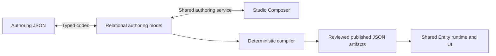

# Entity Studio — field-level relational authoring blueprint

**Reconciled design for owner review • 6 October 2026 (DDL-verified revision).** This document specifies the target relational authoring model, JSON contracts and shared Studio composer. Sections 1–10 contain the reconciled design; section 11 records the resolved audit decisions, compatibility boundary and qualification criteria. Section 11.11 lists the decisions from the 6 October reviews against `server/db/ddl/planes/studio/metadata` (D01–D18, then D19–D27 for the existing-DDL status and composer build order). Section 7.9 is the composer build order against the current DDL. Section 11.12 is the column-level legacy and JSONB retirement ledger. Section 11.19 records the subsequent dual-audit corrections and qualified/deferred dispositions. Section 6.5 specifies handler/event/webhook contracts, with source evidence and acceptance gates in section 11.20. Section 11.21 reconciles the foundation/access-expansion audits, including explicit qualified and deferred decisions. Section 11.22 records storage-boundary and authoring-safety corrections and qualified follow-ons. This is a design specification, not a claim of implemented DDL, deployed runtime behavior or release approval. It is self-contained. Examples are configuration/data specimens, not executable grants, seeds or a statement that a release has been published. Dictionary sample cells demonstrate their column variants independently; only worked examples describe a whole consistent row/graph.

## 1. Model and design rules



The authoring model is relational. Each scalar has a typed column; each independently ordered/referenced membership has a row. The shared compiler emits JSON from that model. Studio edits the same typed model whether it was created interactively or imported as JSON.

Kind-axis glossary: surface_kind selects list/detail/form/embedded/lookup; content_kind selects what a section contains; section_kind selects its layout; binding_kind selects a field placement's role; view_kind selects default versus named published list state. These axes are independent typed choices, not interchangeable strings.

Model optimization decisions:

- Reuse entity, draft, release, runtime, field, key, search, relation, operation, surface and capability tables for their defined responsibilities.
- Put single surface settings directly on `entity_surface`; do not create a separate one-row list-settings table.
- A navigated detail section belongs to exactly one navigation group in its surface; form and sectioned embedded sections have no group. Lookup surfaces are token-based and have no sections or navigation groups. Store `navigation_group_id` on the section; do not create a second group-membership table for this cardinality.
- A list-view field row carries visibility order, sort order/direction and grouping. Do not create three different field-membership tables for those settings.
- Reuse one label/translation catalogue per draft. Each consumer stores a label FK, not another label JSON object.
- Reuse registered enum domains and search profiles. Do not copy their options/search-field lists into every surface or AI declaration.
- AI profile rows select entity-facing tools and context only. AI execution policy, quotas, credentials, knowledge, conversations, usage and telemetry have distinct ownership in the AI schema; they are not copied into Entity metadata.
- Shared capability profiles define comments/attachments/activity settings once. Entity enrollments pin the profile and select permitted typed overrides. Profile resolution is explicit and frozen into publication output.
- No authoring property bag, EAV replacement for configuration, executable code/SQL upload, entity-name dispatch or inferred permission is part of this model.

Names and SQL types below define the intended contract. Metadata sample IDs such as `@country`, `@country.detail` and `@country.name` are readable **document aliases for internal UUID FKs**, not stored string IDs and not visible record IDs in Entity lists.

**Evidence terminology and invariant index.** Qualified means the applicable acceptance contract has a recorded passing evidence bundle identifying implementation revision, contract/dependency hashes, fixtures, environment, results and accountable approver. A designed requirement, pending test, signed artifact or successful deployment alone is not qualification. Required evidence is bounded by the named gate; failed/unknown checks cannot be relabeled passed. Tests may cite the following stable invariant IDs; the linked sections remain their canonical definitions, not another copy of the rules.

| ID | Canonical contract |
| --- | --- |
| INV-001 | Typed authoring authority and derived runtime artifacts — sections 1, 6 and 7.3.1 |
| INV-002 | Valid absent permission versus invalid evidence; independent governance — sections 2.4–2.4.3 |
| INV-003 | Source-kind membership and baseline isolation — section 2.4.1 |
| INV-004 | Exposure and presentation inference — section 2.4.2 and field-access dictionary |
| INV-005 | Reviewed source/target heads, rollback and release trust — section 2.3.3 and release dictionary |
| INV-006 | Partial-save integrity versus P completeness — sections 2.3 and 2.5 |
| INV-007 | Identity provenance, concurrency and retention — field-identity dictionary and section 5 |
| INV-008 | Explicit readable identity/navigation, no UUID presentation — sections 1 and 7 |
| INV-009 | Preserved protected controls; no unapproved MFA changes — section 6.1.5 |
| INV-010 | Sealed target requirements, receipt-derived delivery and current activation — release/target dictionary and section 2.4.1 |
| INV-011 | Legacy JSONB preservation equality versus immutable artifact bytes — section 6.1.2 |
| INV-012 | Ordered-family provenance and complete sibling scope — section 7.9.1 |
| INV-013 | Generated kind applicability and scoped cross-plane catalogue resolution — section 7.3.1 |
| INV-014 | Constraint cutover and semantic navigation conversion — sections 11.12 and 11.7; retain these canonical anchors until traced consolidation |

**Phase 1 implementation boundary:** deliver the dependency-complete typed contract, shared command/codec path, governed host bootstrap and Country/State Region read-only inspection/preview slice. Live reads additionally require F6 and F8; no synthetic preview attests live-data authorization. Existing controls needed by this subset remain mandatory. AI authoring, capability expansion, custom-value writes/overlays, release sets and Integration-owned authoring are later scope; parked workflow/case/print/integration automation remains NOT AUTHORIZED as stated in 7.9.4. A dictionary entry specifies a target contract, not a commitment to implement it in Phase 1.

<a id="meta-entity-legacy-cleanup-build-lifecycle"></a>

### Meta Entity Legacy Cleanup and Build Lifecycle Improvements — plan for review

**Status: proposed for review, 9 October 2026.** This consolidates the owner's requested simplified local cleanup and development loop. It specifies the intended exception; it does not claim implementation, installed authority, permission changes or QA/STG/PROD deployment. The existing local publication behavior remains the implementation baseline until this basis is implemented. The older local exception's Admin/Owner-per-candidate Publication row describes that baseline, not the proposed per-edit DEV experience. No standing MFA policy or AGENTS.md instruction is changed by this review document. Implement the local-authority behavior under the owner’s explicit local-publication exception, recorded consistently in AGENTS.md and this blueprint before changing that behavior. Any specific MFA change outside that exception requires separate prior approval. Already-authorized cleanup, inspection, tests and ordinary framework work may proceed independently; there is no blanket dependency on an AGENTS.md edit for every delivery step.

**Objective:** one shared native metadata path, clean maintained source/schema/container configuration, and Country/State Region usable on Studio, Neon and Mesh. Local development becomes **edit → save → publish → test**, without repeated human approval. Keep the existing framework, ledgers, compiler, typed storage, authentication, tenant scope and runtime permission semantics. No entity-name runtime allowlist, second authoring source or parallel publisher is introduced. No evidence pack, new audit phase, historical conversion requirement or exhaustive cleanup report is required.

**Execution checkpoint — 10 October 2026:** the approved local exception is recorded in AGENTS.md and its standing authority is installed. Country and State Region release 3 have compiled, signed, activated and acknowledged on Studio, Neon and Mesh under that authority, without renewed per-edit human approval. Scheduled recovery must use the same persisted-authority publisher resolution as normal dispatch; a generic worker identity is not interchangeable. The existing qualification runbook records exact releases and remaining cleanup, rollback and authenticated UI acceptance. This local checkpoint does not establish nonlocal promotion or completion of the entire cleanup plan.

#### Local authority and exact execution

Reuse the machine-policy infrastructure, extending native admission and database/worker guards explicitly rather than fabricating `humanExecutionPolicy` evidence. Introduce the named approval basis `local_development_authority`. Existing exact draft/hash enrollment is not standing authority and cannot deliver successive edits without this change.

| Contract | Required meaning |
| --- | --- |
| Standing authorization | Governed eligible developers/roles, product or tenant ownership scope, exact local instance and permitted destination instances/planes; permitted publish, retry, recovery and rollback actions; active/revoked state, validity and actual enrollment provenance. Reusable across ordinary edits. |
| Execution request | Automatically resolved saved source revision/hash, compiler/build identity, resource/dependency versions, artifact digests, destinations, expected heads, standing-authority reference, initiating developer, executing workloads, expiry and idempotency identity. No client-supplied authority. |
| Attribution | Developer is the actual initiator/maker; author workload submits; publisher workload performs automated approval/execution where the existing machine contract requires it. Workload separation is not independent human review. Human-only guards remain human-only outside this basis. |
| Enrollment | Prefer existing governed one-time enrollment, including its applicable MFA/independent review. It authorizes the reusable local capability, not a single draft. No new MFA-free permission is assumed. Resolve installed IAM eligibility for the authenticated developer without borrowing machine credentials or permissions. |
| Renewal and recovery | Expired exact requests may be renewed under current standing authority after current source/head/resource checks. Unchanged delivery retries reuse valid signed artifacts; changed compilation inputs require a new exact compilation request. No per-edit human reenrollment within standing scope. |
| Rollback | Same local basis may select a compatible existing local artifact, subject to current authority, head, schema, dependency and security checks. No rebuild or invented human receipt. Metadata rollback does not reverse destructive DDL. |

The shared application service owns the complete operation: authenticated admission, native graph resolution, validation, compilation, signing, delivery, activation and required runtime projection/materialization. Workload credentials stay server-side. Add progress and applicable retry to the existing Studio experience; this authorizes no broad composer redesign. Three destination activations are not one cross-database transaction: report partial completion and retry failed destinations safely.

#### Environment identity and trust

Use one typed mapping between deployment stage, runtime configuration profile, instance, plane, domain suffix and signing/verifier configuration. QA can use `ATHYPER_ENV=local`; runtime mode alone must never admit local authority. Preserve the trusted local tuple **environment=local, instance=dev, domainSuffix=dev.athyper.test**, plus configured destination scope. Test QA rejection with local runtime mode and QA instance/domain. Trusted host configuration and installed authority establish this identity; request fields do not.

Separate signature verification trust from permission to sign. Local keys authorize local artifacts only. Release candidates use isolated release-signing authority; QA/STG/PROD verify that authority without distributing private signing credentials to their runtimes. The current dev/production enum and runtime coupling need explicit integration work; adding a third enum is not itself the solution. Environment deployment approval remains separate from content signing.

| Deployment stage | Entry and human decision | Execution |
| --- | --- | --- |
| Local DEV | Valid standing authorization; one-time enrollment, no independent approval or publication-specific step-up per edit | Local compile/sign/publish/activate, recovery and rollback within scope |
| QA | Approved candidate manifest; no additional publication approval | Install candidate artifacts and run acceptance |
| STG | Same candidate plus QA pass and compatible installation; one independent STG promotion approval | Install identical corresponding per-plane artifacts |
| PROD | Same candidate plus STG pass and compatible installation; one independent production promotion approval | Install identical corresponding per-plane artifacts |

Applicable existing MFA stays on governed approval actions, not every compiler/signing/delivery stage. Tenant extensions use Tenant Admin/Tenant Owner for candidate governance and remain tenant-isolated. Local authority cannot satisfy nonlocal candidate approval or promotion qualification.

#### Candidate lifecycle and storage

Candidate states are **drafted → built → approved**, followed by per-environment deployment/qualification records; these are not deployment-stage names. “Base Version” is a user-facing name for the immutable candidate manifest, not another release ledger or writable authoring source.

CI builds before final human candidate approval. Platform Admin proposes and Platform Owner approves the resulting concrete manifest. Pin source coordinates/hashes, source commit, lockfile hash, build-input manifest, compiler identity, resource/dependency versions, per-plane/artifact-kind content digests, runtime image digests and required schema migrations. Changed compiled content requires a new candidate. Ordinary local edits may use a dirty checkout; reproducible release builds use pinned inputs.

Store manifests and artifacts using existing immutable artifact infrastructure; existing publication/review records bind approval to the manifest hash. CI job retention is not the retention policy for approved releases. Exact storage/API integration remains implementation work; no new ledger is prescribed. Environment secrets/endpoints remain external bindings and cannot silently change approved content.

**Promotion invariant:** for every declared plane and artifact kind, the STG/PROD content hash equals the QA-approved hash for that same plane and kind. Cross-plane equality is not required. Track signatures and installation receipts separately from content identity; key rotation is not a content rebuild. If existing artifacts embed environment-specific values, resolve that coupling before claiming unchanged-artifact promotion.

Reuse and extend the existing `release-promotion.ts` evaluator as the single rule implementation. Its current automatic branch assumes workload authorship; preserve the true developer identity through the explicit local basis. Candidate/signing/evaluator behavior can be tested without live QA/STG/PROD. Defining this ladder does not declare those environments installed or authorize an actual production deployment; previously parked promotion work is a proposed workstream here, not silently completed scope.

#### Cleanup and rebuild boundaries

Preserve the complete working state and identify the source used by the accepted deployment, including isolated recovery-build sources. Reconcile overlapping changes with their owning work before modifying shared publication files, then checkpoint the selected integration baseline in GitHub. A mixed backup commit preserves work but does not prove it is tested; HEAD alone need not identify the deployed source. Do not discard concurrent work or revert to an older commit solely because it is clean. Take database dumps outside Git, checking command success. No exhaustive provenance report is required. Preserve business rows during the metadata-only reset; reload only tables explicitly cleared. Retain IAM, tenants and unrelated applications. A dump is recovery material, not a source for reintroducing obsolete metadata.

Use a short working classification: `keep-shared`, `keep-native/recovery`, `generalize`, `delete`, `archive-doc`. Check code, exports, package scripts, shell/SQL, configuration, generated imports and dynamic registration together. “Legacy” names and zero TypeScript imports alone do not establish obsolescence. Delete superseded consumers, exports, configuration and legacy-only tests in the same pass. Keep reused machine-policy/native recovery capabilities and unrelated domain implementations. Remove obsolete tables/columns only with their obsolete consumers. Preserve applied migration bytes/hashes; update canonical DDL and add forward migrations/manifests where needed.

Root handoffs/rebuild notes are historical or redundant only after content review; preserve unique requirements and unrelated work. Keep this blueprint as design authority and the existing runbook as the sole current execution status. Do not create a competing cleanup plan.

Provide two maintained operations (names/commands to be selected during implementation):

- **Rebuild/start:** nondestructive, repeatable build/image selection, schema installation and startup. No implicit reset, duplicate releases or reissued approvals.
- **Reset/bootstrap:** explicit scoped destructive metadata reset and native bootstrap. Repeating this action is intentionally destructive, not a promised no-op.

Ordering: infrastructure → quiesce writers → dependency-safe schema/reset → retained/installed authority and resources → compatible application containers → native bootstrap/publish. Do not require final constraints before setup has applied them. Preserve applied migration history while explicitly recreating any reset objects; recorded migrations do not automatically rerun. Replace temporary recovery-build mounts with maintained container configuration while retaining recovery functionality. Verify existing standing authority and workload identities survive the scoped reset and remain usable; survival is a test of current structure, not a new subsystem.

**Implementation checkpoint (9 October 2026):** the shared publication contract now defines reusable local authority/admission and exact execution requests, including the trusted DEV tuple, current actor/scope/action/destination checks, authority revocation/expiry and source/compiler/resource/head/artifact binding. Request renewal creates a new exact hash under current authority; it does not extend old evidence. The existing promotion evaluator supports the explicit local basis while preserving human initiator attribution and rejects carrying it into QA/STG/PROD. These are tested contracts/evaluator behavior, not installed policy, native database admission or a deployed developer publication endpoint. AGENTS.md records the owner-authorized local exception without changing existing MFA catalog/enforcement. Exact native SQL/worker integration, standing enrollment, persistence and actual two-edit/recovery/rollback execution remain required.

The cleanup removed the unregistered BP definition/case-contract route factories, their exports and route-only tests after checking callers. Live preview/projection services remain because they have runtime consumers. Removed stale workspace/policy exemptions for the absent `product-deprecated` tree. Shared saved-view validation now checks normalized `groups` and rejects grouping loss/conflicts; this fixes the historical host typecheck failure without adding a Tree property. No table/data removal, DEV reset or new activation is claimed.

**Native database/worker connection checkpoint (9 October 2026):** canonical `41_local_publication_request.sql` adds a restricted command-receipt table and database admission/read functions; it is not another release ledger. A standing policy is resolved from the existing control policy store using the explicit `athyper.local-publication-enrollment/1` wrapper, with independent current maker/checker identities, active policy/version/hash, ownership and actor scope. The installer-owned host record must match the trusted local tuple. Control admission validates request digest, expiry, native saved source/revision/hash and target scope; worker reads recheck current authority rather than trusting queued request JSON. No host or standing policy is seeded automatically. This first native adapter accepts product sources only; tenant-source execution is not implemented by this checkpoint.

The existing `read_native_worker_source` has an explicit local-request branch, leaving the human branch intact. The shared TypeScript adapter requires authenticated control IAM before admission and independently resolved current compiler/resource/head/artifact inputs before execution. A savepoint scopes the request to the existing native reader and rolls back failed work; production startup exposes this path only when trusted local resolvers are supplied. No generic `fn_system_entity_authority` release-transition bypass was added. Release writes, queue metadata/activation attribution, standing-policy enrollment producer and deployed startup bindings still need integration before local end-to-end publication can succeed.

The forward migration `20261009_local_publication_request.sql` was installed on DEV Studio through the existing hash-checked ledger installer; existing accepted Country/State Region sources remain readable under `athyper_worker`. Real DEV has zero local request and host rows. Positive admission/worker execution tests use explicit disposable PostgreSQL fixtures, not fabricated DEV authority. No new Entity release or activation occurred.

**Standing enrollment/startup integration (9 October 2026):** the existing publication-policy proposal and independent activation service now accepts `athyper.local-publication-policy/1`. Its payload contains only developer/workload/scope/action/destination/validity declarations; clients cannot supply active state, approval identity or an enrollment receipt. Stored policy coordinates/hash, current active makers/checkers, principals and installed condition are resolved separately. The old standalone `athyper.local-publication-enrollment/1` wrapper in the earlier checkpoint was not producible by that service; the forward enrollment migration aligns the database reader with the existing `athyper.machine-publication-enrollment/1` envelope and its tested exact condition. Existing human and exact machine policies retain their execution semantics.

`PUBLICATION_WORKLOAD_CONFIG` may now identify `localAuthority: { id, version, hash }`. This is a trusted configuration pin, not an approval. Worker composition passes that configuration into native startup, which resolves current policy, actual native source/compiler contexts and per-plane heads. The native request's `resourceHashes` are sorted distinct canonical hashes of the fully resolved per-target compilation contexts (including resources, catalogue, identities and component evidence); target `artifactHash` pins the corresponding compiled descriptor digest before signing. These are separate from signed envelope/storage hashes. A missing native configuration, QA tuple, revoked workload/policy or changed input rejects. Exact request scope now surrounds current-source resolution inside the transaction savepoint, not just its final callback. Existing entity-reference visibility is extended only to the checked request's entity and declared relation targets.

The enrollment and source-read integrations are implemented/tested, and their forward database corrections installed. They do not create a standing authority or imply that the developer publish endpoint, queue execution, native lifecycle transitions, activation, recovery and rollback are implemented. No local authority is fabricated to close those remaining delivery steps.

**Local lifecycle implementation — 9 October 2026:** an exact request now has restricted `execution_revision`/`execution_status` progress, separate from its immutable saved-source input. `transition_local_publication_request` uses the existing native validation and change-set transition functions. Submission is attributed to the enrolled author workload; review is attributed to the distinct publisher workload. The developer remains the original maker. Native snapshot copying must retain the exact graph. Fresh renewal of an unpublished in-review/approved request requires recorded matching progress, source, developer/workload identities and predecessor, plus current authorization and newly resolved compiler/resource/target inputs. The immutable successor request records its prior request hash and preserves expired evidence. Phase replay is accepted only when this exact receipt recorded that phase (or a later completed phase), including explicitly validated renewal lineage; source edits, unrelated revisions, revoked authority and actor substitution reject. Transaction rollback also rolls back validation, snapshots and receipt progress. This is workload approval under `local_development_authority`, not human review.

Production startup resolves current resources and compiles before each phase, checks the workload's current authentication epoch and existing submit/review IAM permissions, then invokes the restricted transition. Saved revision pins remain immutable across verified lifecycle progression. The `publication.prepare-local-request` job is registered in the existing authority queue when local startup is configured; its payload contains only the admitted request hash. It reports **approved**, never published or activated. The authenticated control endpoint now accepts only a command ID and saved revision; trusted native composition resolves all source/compiler/resource/target pins. It commits the immutable request and audit atomically, with exact command replay and current standing-authority/IAM checks. The existing worker scheduler discovers these durable receipts through a publisher-scoped SQL function and enqueues the preparation job with a deterministic request key. Redis failure cannot erase the committed admission. HTTP 202 means admitted, not published. This source composition is tested but is not yet deployed or enabled by installed standing-authority configuration. The database local branch deliberately rejects release/preparation phases with `LOCAL_PUBLICATION_RELEASE_EXECUTION_NOT_CONFIGURED`; signed-source/release-link and downstream activation binding are not implemented by this checkpoint. Installing lifecycle SQL is not an end-to-end local publication result.

**Current installed/executed local checkpoint — 10 October 2026:** the independently approved standing policy is active and configured in DEV. Both reference successor drafts committed and replayed; their local publication requests were admitted and replayed. Execution exposed and corrected developer audit-contract selection, missing scheduler deployment, job tenant coordinates and worker-database composition. Fresh exact requests against the corrected build were admitted and replayed, and both drafts reached workload-approved revision 3. Deferred aggregate checks run inside the exact transition authority, with read-only graph dependencies on the nonlogin publication definer; workers retain no direct graph-table access. The local hash-domain binding correction is installed. Requests expired during integration fixes after workload approval; tested renewal from exact recorded progress is deployed and both refreshed requests were admitted and replayed. A replay may equal the renewal’s admitted revision only when the database confirms replay; fresh transitions still advance. Successful release creation and downstream activation remain unfinished. Prior requests and failed attempts remain recorded; no new Entity activation is claimed. Earlier missing-enrollment/admission statements are historical checkpoints. Detailed pins and current status remain in the existing qualification runbook. No nonlocal or MFA exception is added.

**Signed local release integration — 9 October 2026:** the shared preparation job now continues from workload review to the existing signed native release writer and canonical publication link, then queues the existing compilation job after commit. It reports **dispatched**, not activated. Requests pin the source envelope separately from per-plane descriptor hashes and exact predecessor head coordinates. A transaction-bound release receipt binds only the resulting exact release; signing/source mismatch, changed actors or failed audit roll back. Compilation and destination activation resolve the explicit local approval basis and recheck current standing authority. Existing signing, artifact loading, target readiness, projection/CAS and acknowledgements remain applicable. Replay may recognize this release's exact already-installed signed artifact; an unrelated or altered head still rejects. Human-reviewed publication remains a separate unchanged basis.

Canonical `44_local_publication_release.sql` and its forward migration are installed on DEV Studio. The narrow worker grants reuse existing signed-source/preparation/link functions; no general metadata table-read grant was added. The installer supports rollback rehearsal and immutable-ledger replay. This is installed database support, **not deployed application execution**. A maintained configuration installer resolves an already-active, independently enrolled policy and both workload identities before writing the installer-owned host tuple and private startup pin. It never creates or activates policy/IAM rows. No standing authority, host configuration, new Entity release or new activation has been installed/executed by this checkpoint. Deployment of the assembled application, initial standing-policy enrollment/configuration and the actual two-edit/recovery/rollback acceptance remain outstanding; the existing accepted releases remain active.

**Deployed enrollment correction (9 October 2026):** actual control-role execution now uses a bounded boolean identity-status function for standing-policy actor eligibility. It does not lock or disclose principal rows and grants no IAM mutation rights. SQL admission/execution retains current authority checks and locking. Control API, API and worker are deployed from committed local source; the first standing policy is submitted for independent review. Submission and healthy startup are not authority installation, Entity publication or activation; current execution coordinates are in the runbook.

**Signed-ledger completion and container runtime — 10 October 2026:** the shared signer reconciles the existing generic release ledger only after every committed compilation coordinate has a signed artifact. Serialize completion checks by release; use the existing approved-to-published transition and transactional outbox. Replays of published releases are idempotent; partial, missing-scope and unapproved releases do not acquire publication status. Keep signing completion distinct from per-target activation/acknowledgement. The bounded operator reconciliation command uses installed publisher attribution and the worker database role, never an administrator write or manufactured approval. Production images fingerprint their emitted dependency graph and packaged lockfile under a separate hash namespace from source deployments; exact request pins must match the executing build. The image build exercises actual emitted composition before deployment. Execution results and remaining cleanup stay in the existing runbook.

**Committed local compilation recovery — 10 October 2026:** authenticated source inspection includes the original developer’s published local source only when its recorded release progress matches the saved revision; it does not grant graph writes or approval. A published source may receive a fresh authenticated `recover` request under the same active standing authority before any artifact compilation has committed. Preserve the original publication request and immutable release; bind recovery through recorded request lineage. Require identical developer/workload identities, authority coordinate, source/descriptor, resources and target/predecessor pins; only the current lifecycle revision and compiler build pin may change. Current authority, expiry and actual source qualification remain enforced. Recovery replays recorded transitions and dispatches the same release through the existing worker; it must not rewrite signed artifacts or manufacture independent human approval. Later artifact/delivery recovery remains a separate capability. Shared compilation obtains predecessor pins from the trusted installed approval-basis resolver, then verifies the complete persisted source during lowering and requalifies before signing/dispatch. Relationship qualification receives only the current destination plane’s validated targets; complete multi-plane enrollment remains intact and mixed-plane membership is rejected by the qualifier. The current execution status and release coordinates are in the runbook.

#### Delivery and acceptance boundary

Immediate delivery is cleanup plus the local native publication loop. Promotion contracts and testable integration are a distinct follow-on within this review plan; live promotion depends on actual environment provisioning and authorization. Cleanup delivery steps and status are maintained in the [runbook plan](../../runbooks/entity-foundation-qualification.md#meta-entity-cleanup-lifecycle-plan). Clean installation, package builds, typechecks, relevant publication/framework tests and actual user flows are the completion checks; no separate evidence bureaucracy is introduced. Recheck historical failures against the current source. Resolve a still-present shared-framework preferences typecheck defect in coordination with its owning work; do not silently treat it as a permanent non-blocker. Report any unresolved failure explicitly and do not call the whole project green.

<a id="local-native-build-exception"></a>

**Current delivery authority — owner-approved local native-build exception (recorded 9 October 2026).** The project owner explicitly approved the local keep/simplify/defer profile, rebuilding the local Studio metadata schema after a recoverable `pg_dump`, fresh native Country/State Region drafts with fresh field identities and no adoption, and the four list/read operations written with `requires_mfa=false` as declared in the approved proposal without the revision-4 source-row initializer. Approval provenance is the owner's conversation message headed “Decisions for Audit 1 comments”, with three `[Approved]` decisions, followed by the instruction to update the documents. This is actual scope/initialization approval, not an agent-inferred exception, a release-review receipt or a claim that reset/bootstrap has executed.

This bounded exception supersedes the immediate local delivery sequence below and conflicting migration/adoption prerequisites elsewhere in this blueprint. General contracts and migration requirements remain applicable outside this profile. The authoritative execution checklist, status and evidence are maintained in the existing [qualification runbook](../../runbooks/entity-foundation-qualification.md#current-local-native-build). There is no companion plan or new audit appendix.

| Boundary | Approved local behavior | Retained requirement |
| --- | --- | --- |
| Environment and reset | Unused local DEV; rebuild scoped Studio Entity metadata and dependent obsolete Entity state after a recoverable backup | Preserve IAM, business data, unrelated platform services and applied migration history; inspect dependencies before destructive setup |
| Authoring | Fresh complete native Country/State Region graphs and fresh field identities | Real authenticated typed command endpoint, canonical rows, exact readback and shared compiler/runtime; no administrator SQL seeding of the Entity graphs |
| Identities | Allocate once for each new proposal and persist atomically; no legacy reservation adoption | Stable IDs within the run, uniqueness, referential integrity, rollback and replay without new allocations |
| Protected operation state | Exactly the four approved list/read operations initialize with declared `requires_mfa=false`; no old-source read/lock/initializer | Trusted bounded bootstrap input, no ordinary client override, no future-operation default and no change to MFA enforcement |
| Schema | Maintained clean-build setup and final native constraints; zero pending native constraints at acceptance | Typed/root/reference/whole-graph integrity and restricted application grants; immutable applied migration files |
| Evidence | One local environment, thin harness output, reduced diagnostics and run-level hashes | No fabricated approval, test result or deployment evidence; failures remain visible |
| Live reads | Real local storage/security/identity implementation plus positive and negative smoke tests | Exact permission semantics, authentication, tenant/record isolation and no inferred allow |
| Publication | Existing authenticated Admin proposal, independent Owner review and publication workers | Declared targets, verified artifacts, activation receipts; no machine receipt substituted for human review |

The scope contains complete existing reference declarations, including supported AI declarations and required presentation components; it does not authorize new AI editors or providers. Composer UI development, other business-entity onboarding, Board/Calendar/Gantt enhancements, legacy conversion, historical identity reconstruction and unrelated feature expansion remain outside this delivery unless the owner explicitly changes scope. This fence does not authorize reverting unrelated concurrent work.

Local simplification removes old-draft conflict/adoption work after reset, source-row initialization and rehearsal of historical constraint predecessors from the immediate path. New migrations/setup install the final native integrity contract; focused negative-write tests remain necessary. Rebuilding a schema with a preserved migration ledger must explicitly recreate its required objects rather than incorrectly expecting already-recorded migrations to rerun. Shared metadata/resource dependencies are retained or reinstalled; a two-entity scope is not permission to drop every table not directly used by these entities. Reset scripts and workers outside the DEV-only control API need their own environment checks; no shared runtime `if local, allow` branch is authorized.

**Local cleanup dependency boundary (audit reconciliation, 9 October).** This product is still a local build, with no QA/STG/PRD environment claimed. The approved reset is a dependency-aware rebuild of the Entity authoring scope, not an unconditional drop of the entire `metadata` schema. Read-only DEV inspection found **25** cross-schema foreign keys into metadata, including snapshot/publication history, AI learning, onboarding and private command state; the runbook records their grouped inventory. Foreign-key existence does not prove dependent rows exist. `DROP TABLE` normally refuses dependent objects unless explicitly cascaded; a cascading DDL drop can remove constraint objects, while row deletion follows each FK's delete action. Neither is an acceptable implicit cleanup plan.

Before destructive execution, the setup command emits its exact preserve/remove/recreate inventory with row scope and dependency closure. Preserve AI/onboarding and other out-of-scope state; retain its referenced metadata rows with unchanged IDs and semantic content, or restore that complete dependency closure if objects must be recreated. Do not insert placeholder parents just to satisfy FKs. Snapshot/publication rows genuinely belonging to the approved obsolete local Entity scope may be removed together with their dependent links/projections after backup; unrelated history and resources remain preserved. Snapshot history for discarded drafts is retained in the verified backup, not promised to remain live. Existing approvals do not authorize broad AI/onboarding deletion, global release-ledger cleanup or leaving FK constraints disabled. Unknown dependencies stop only the destructive step for classification, not the graph/host engineering.

The scoped rebuild installs the final native constraint contract directly, avoiding the in-place seven-check predecessor transition for this local delivery; it is a chosen setup route, not the only way to install final constraints. Destructive setup is gated on complete replacement graphs and executable startup composition (L1), plus the scoped reset manifest and a verified current backup. L0a inspection/backup work is non-destructive and starts first. The fresh bootstrap requires an empty target draft/member set, not an empty database. Preserved historical or platform rows can coexist with fresh targets without reviving legacy conversion or adoption. Old field-identity IDs are never recycled for fresh fields: remove obsolete identities only with the approved obsolete dependency closure; otherwise retain their historical semantics and use the existing retirement lifecycle if applicable. New proposal field/member IDs must be disjoint from the old set and stable across retries. The old source-copy initializer table is an obsolete candidate for scoped cleanup, not a dependency of the newly approved four-operation initialization path.

Take a fresh backup and **restore-verify that exact backup** before resetting; successful dump creation alone is insufficient. Use temporary restore targets in the local environment and verify restoration completion plus representative integrity/count checks; this is recovery verification, not a second continuously maintained application environment. Capture a compact pre-reset baseline of object/row identities, affected activation heads/resource pins and known failing assertions. It distinguishes state discarded by agreement from shared defects still requiring repair. Final native constraints, application-role execution and smoke behavior remain mandatory. The seven-check upgrade migration is deferred, not claimed implemented or cancelled: before offering an upgrade from the preserved old baseline, author and rehearse it against a restored upgraded copy. A future clean-installed QA environment does not automatically require historical migration support, and no such environment is assumed to exist now.

Fresh-run catalogue/descriptor/resource values are recomputed and bound to that run, rather than compared to the discarded database. A mismatch inside a run still rejects; proposal hashes cannot confer authority and schema fingerprints cannot confer storage-owner access. Formal qualification dossiers and signed evidence naming an accountable approver may be deferred to QA entry, but protocol-required artifact verification, independent review and semantic resource validation are not disabled. The existing live-resource rejection must be replaced by real bounded validation, not unconditional success.

One transaction per entity remains the atomic unit. If one draft commits and the other fails, keep the first unpublished draft and retry the second; do not introduce cross-entity transactions or rewrite committed history. A replay reauthorizes, preserves root/revision/members/identities/snapshots/command receipt and returns matching hashes; an existing correctly classified replay audit event may be appended. Reset is an explicit mode, never an implicit prerequisite of replay or routine verification.

The two delivery exits are: **A**, both actual native drafts committed, read back, compiled and replayed through the application role; and **B**, both independently reviewed new Entity releases published/activated and verified through the standard list/detail UI. Testing old active artifacts cannot satisfy B. Local manual testing is not separate QA/staging qualification. Formal F6/F8/F9 evidence, applicable upgrade compatibility and broader operational qualification remain in the runbook's QA-entry checklist; historical migration gates apply only if that capability is offered. No gate is declared passed by this documentation edit.

The local cleanup tooling now computes row-level candidate FK closure from an explicit product-entity scope, preserving roots and reporting protected dependents. The planner itself does not execute deletion or infer logical publication cleanup; the separate approved local reset executor consumes the exact PK manifest transactionally, preserves foreign keys, restores scoped user triggers and checks row counts. The source-free operation preparation contract accepts exact trusted declaration/member hashes and approved false values, then uses the canonical operation insert plan under fresh-root admission. Fresh identity persistence now has a canonical bootstrap branch: trusted preparation selects fresh mode, the proposal supplies a complete attributed identity roster, and the writer inserts it within the same admitted root transaction before fields. Parent ordering, collision rejection, exact compiler correspondence and replay without allocation are required. The installed/adoption path remains separate. The clean-build grant adds only explicit identity ID, parent and creation-time INSERT columns under existing RLS and revision guards; it does not grant lifecycle updates or deletes. The shared native-product assembler now constructs complete Country/State Region proposals from maintained definitions and actual storage catalogue facts, with fresh identities and explicit per-surface component selection. Production control-api startup now supplies proposal/resource composition from a private, pinned local configuration; schema, admission, component signature/deployment and current descriptor checks remain required. Proposal compilation has executed for both entities. The expanded renderer/component candidates are now independently approved, published and activated locally. Following verified restores, the owner-approved scoped reset committed in actual DEV: obsolete authoring rows and affected activation heads were removed while retaining Entity roots, business data, IAM and migration history. All seven pending native checks are removed; final aggregate guards and narrow fresh-identity grants remain, and actual application-role schema inspection reports zero blockers. Complete proposals and production startup configuration are installed. These local composition pins do not claim a published host approval or F6/F8/F9 qualification. The gateway now routes the native bootstrap command; authentication passed and exposed component-envelope and pre-insert reference/initializer integration defects, now corrected with exact admitted reads and four privately installed approved declarations. Canonical readback now uses an explicit member-set/UTC precision comparator without dropping properties or semantic positions; maintained proposals explicitly declare storage values and native numeric weights retain decimal strings. Compilation pins the original proposal before binding to verified SQL readback; replay binds both through its immutable request/receipt hashes. Both replacement native product drafts have now committed through the authenticated production application path at revision 1 and replayed with unchanged stored/compiled hashes; 31 fresh identities, immutable revisions 0/1 and transactional enrollment audit are verified. Old Country/State Region releases are no longer active; new Entity publication/activation and local read acceptance remain outstanding. The native live-read candidate compiler now derives linked security/storage declarations from the complete validated native graph, with exact permission/provider matching and complete stable-field coverage; unsupported semantics reject. The resource qualifier compares candidates against independently resolved native compilation inputs and remains closed when that source reader is absent. This is tested candidate lowering, not installed authority. The active product review service now accepts native 2.5 source compilation and typed target declarations; the adoption endpoint and marker-based target inference are removed from that service. Historical adoption receipts remain readable. The forward review policy and restricted native source reader are now installed locally. Production control-api startup supplies the resolver, which checks the exact immutable saved revision, stored operation controls, installed stable identities, current storage catalogue and signed active component evidence before compiling. Lifecycle transitions copy the unchanged source into the next immutable revision atomically; they cannot change the authoring graph. Restored-database evidence proves both complete sources compile under the non-bypass control login and review transitions preserve hashes and roll back. These checks establish source/review implementation, not human approval or publication readiness. Both actual authenticated HTTP inspections now succeed. A receipt-bound transition command runs the unchanged deferred graph validators internally without broad control-login table grants. Admin submission and independent Owner approval have both executed and replayed through authenticated endpoints: both sources are approved at revision 3 with unchanged graph hashes. The native publication authority and workload source-reader migrations are now installed with hash-verified ledger replay. Production service/worker compilation and activation now use trusted native source composition rather than legacy graph loading for this path; configured API/worker deployment and component tests are not proof of executed publication. The exact native execution policy was proposed by Admin and independently activated by Owner. Actual workload execution exposed a release-envelope/descriptor hash comparison defect in native preparation; the transaction rolled back with both drafts still approved at revision 3 and no new Entity release. The shared correction retains source, descriptor and signature checks, but changes the compiler pin and therefore requires a replacement execution policy. Its replacement policy was independently activated, but execution exposed a second hash-domain mismatch: PostgreSQL JSONB snapshot digests and canonical compiler source pins are distinct. Native preparation now validates each with its own codec, preserving stored hashes and signature checks. The complete correction was independently activated and actual execution passed the hash checks. Publication insertion then exposed an incomplete reset boundary: fresh authoring release 1 collides with retained withdrawn publication coordinates. The exact obsolete publication/runtime closure has now been rehearsed on restored backups and removed in DEV: 716 rows across Studio, Neon and Mesh, with preserved-row checksums and restored trigger states. Fresh drafts and unrelated state remain intact; uniqueness and predecessor checks were not relaxed. Retrying the active policy passes release-coordinate insertion but rolls back at commit when the deferred native core guard cannot find its root row. The aggregate-validation context correction is now installed: a bounded native publication-link trigger rechecks exact workload/release authority and executes the unchanged deferred guards before returning to the application role. A PostgreSQL regression proves positive commit and negative authorization/invalid-graph cases. Actual application publication returned HTTP 200: both drafts are published at revision 4 and both release-1 rows committed and were dispatched. The worker text-renderer registry omission and native redispatch reader have now been corrected and tested: the reader reconstructs validated immutable compiled bytes with the original signature instead of invoking legacy compilation. Both actual DEV stored releases pass readback reconstruction. The changed compiler now has a dedicated native recovery variant in the existing publication enrollment/worker path. It binds the complete original human-reviewed group, exact committed release hashes and failed jobs, a replacement compiler and a maximum 24-hour expiry. Enrollment requires empty compilation/artifact state; replay retains release IDs, immutable source/signatures and stable queue keys. Worker compilation and activation recheck current recovery authority and original source/target pins. The restricted database evidence function is installed; actual-row effective-role rehearsal and focused regression tests pass. The initial native recovery was independently activated, but execution rolled back at its audit actor-type check. The service-account transaction stamp is corrected and tested against the real audit contract. Compiler-only recovery replacement now uses the existing independent-review and atomic retirement receipt, with exact original policy/release/job scope preserved; restricted-role replacement and rollback proof pass. The corrected build was independently activated and executed: both existing releases compiled, were signed and dispatched. First activation attempts failed because the worker lacked the precise Entity identity read used for relation verification. Narrow column grants and a worker-only current-native-source RLS predicate are now installed, with actual effective-role allow/deny regression evidence. The exact delivery-recovery policy c0d07783-510d-4f7b-a010-78eb943ec633 was independently Owner-approved and activated, then executed through authenticated workload transport. Both second-attempt Studio/local/dev deployments activated and acknowledged the unchanged signed artifact hashes; both runtime activation heads point to native release 1. Original failed attempts remain preserved. Publication and Studio activation are now executed, not merely tested. Installed live-read resolution and authorized/denied list/detail acceptance remain to be verified before manual-test handover. Do not relax guards or synthesize adoption receipts. The owner explicitly requested removal of the legacy active review/publication path on 9 October; immutable history and applied migrations remain preserved. Exact execution evidence and the current L0–L6 status are in the runbook.

**Historical implementation sequence — superseded for the local profile:** the following 8 October narrative records the earlier preservation/adoption approach and implemented pieces. Its source-row initializer, reservation-adoption and pre-cutover qualification prerequisites are not current local-build requirements. Its shared architecture/control requirements remain applicable where not explicitly superseded above.

**Owner-approved DEV delivery sequence (8 October):** the immediate server-only
handover starts from fresh native Country/State Region drafts in the existing DEV
environment. A verified recoverable backup precedes scoped disposal of obsolete
Entity authoring/publication state. Preserve IAM, business data, platform services,
applied migration history and independent publication review. Legacy conversion and
historical identity reconstruction are separate acceptance work, not prerequisites
for this fresh-native demonstration. Root creation, typed whole-graph persistence,
initial/saved history, exact readback, compilation and reader compatibility form one
atomic command; an interrupted or rejected command must leave no partial draft.
Replay requires fresh current authorization. The compiler identity roster is resolved from installed stable
identity rows under that creation ticket, including before the target root exists.
The identity SELECT fence admits only the ticket's product entity; tenant identities,
other entities and unauthenticated preparation remain unavailable. Keys and parent
identity links come from those rows, not proposal-supplied context. Every qualification
and replay rechecks the roster. Reservation adoption remains a separate source-bound
check in the canonical writer; this read path cannot allocate or activate identities.
Fresh-root admission additionally pins the
product entity ID in the transaction ticket, rechecks and locks its current system
ownership in PostgreSQL, and permits only an unpinned revision-zero draft root. An
ordinary existing-draft ticket cannot create a root; native graph/initializer writes
and independent publication review remain separate authorities. Operation initialization uses only the
specifically approved source-bound initializer, never a default or client-supplied
protected value. Private initializer evidence may reserve an exact future draft UUID;
deferred database guards reject a mismatched or non-native target when that root is
created, and the source reader grants nothing while it is absent. Source FKs and
private evidence privileges remain intact. Insert-only native member grants require
the creation ticket, matching product root, actor and initial revision. Native operation
INSERT additionally checks and locks the approved source value in PostgreSQL; no
protected-value UPDATE/DELETE authority follows from bootstrap. Complete reference proposals
also retain their existing entity-facing AI profile, field, binding and reference declarations.
Their insert-only persistence uses the same creation-ticket/root/actor/revision fence; this
is not an AI editor or provider-execution authority. Vocabulary/term persistence remains
unsupported by the current compiler: no term INSERT grant is installed and profile
`vocabulary_locale` must remain NULL. Existing scoped read policies and semantic resource
qualification still apply. Compiler storage facts come from PostgreSQL catalogue inspection on the independently
registered storage-plane connection, including physical types, inherited domain nullability,
constraints, enum labels and generated/default expressions. A changed fingerprint rejects
qualification and replay; a proposal does not supply its own physical facts. The current
product-command composition supports its local Studio connection only and rejects cross-plane
storage until that connection is independently composed. This catalogue inspection reads no
business records and does not establish F6 owner authority or F8 access.
Compiler list-provider capabilities come from the shared record implementation, not a
proposal-supplied provider context. The bounded generic table/read-only profile supports
100-row pages, 20 flat filters, ten sort levels, exact/no counts and the shared table/compact
modes. Unsupported settings reject before persistence rather than being silently reduced
by the runtime. Its implementation-contract fingerprint is not a signed resource release
or proof of deployed F6/F8 authority; handler-backed and feature-specific list profiles
require their own registered composition.
Native compiler authorization assembly selects from the shared record read-registration
inventory and derives field keys from installed identities. It preserves exact authored
permission codes (or the explicit valid absent-permission state); missing, duplicate,
deprecated or unsupported scope bindings reject. This bounded profile admits only the
existing list/read callables and tenant-context scope semantics. Its implementation
fingerprint is compatibility evidence, not a permission grant, current policy approval,
protected-state initializer or F8 deployment receipt.
Native bootstrap retains AI declarations and resolves insight-provider content through the
same manifest resolver used by publication and the registered tool factories. Navigation
and presentation references use the existing versioned publication vocabulary. Field keys
come from installed identities; summary/search/reference eligibility comes from the exact
authored field-access, search and relation rows. These compiler bindings do not install
tools, authorize execution or attest live-resource readiness. Unknown capabilities,
unsupported versions, masked/UUID summaries and broken references reject.
Publication lowering preserves supported single-target, read-only foreign-key/logical
references through the shared key-reference representation. It verifies source/compiled
relation membership and full field-mapping coverage; unsupported mutation, polymorphic,
unmapped and orphan relation branches reject. This representation proof is separate from
remote target/resource qualification and does not grant reference-data access.
Bootstrap proposal transport is a content-pinned bundle of complete native graphs,
separate from installed compiler/resource authority. Construction validates typed rows,
local reference closure, label completeness and budgets; immutable manifest entries bind
entity, fresh draft, author, graph and document hashes. Command inputs contain coordinates
and a stable retry key only. The offline constructor writes a new directory and writes
its manifest last; it neither replaces existing bundles nor supplies startup configuration,
approvals or grants. Resource semantics and canonical application remain required.
Pending cutover checks
are removed only after canonical whole-graph application qualification. Native bootstrap does not attest deployed F6/F8/F9, publication or
activation. Execution evidence and remaining integration gaps belong in the existing
[qualification runbook](../../runbooks/entity-foundation-qualification.md).

**F0 source decision (supersedes the earlier in-Markdown proposal):** the canonical executable authoring contract belongs in `server/packages/contracts/meta-entity-authoring`, as a closed typed contract definition generating schema, descriptors, mappings and the blueprint's repetitive contract tables. This blueprint remains the sole design authority for rationale, scope and governance; package definitions implement that reviewed design. Generate section 3 and applicable comparison/ledger/specimen regions from the contract plus pinned source evidence. Do not generate narrative rationale or pretend repository-derived specimens come from schema alone. Until the package definition and generator qualify, existing tables are reviewed migration inputs, explicitly not executable or generated authority. The first owned-label contract/generator now exists as the bounded proof recorded in section 7.9.3; full reference qualification remains pending. Generated regions and package definitions cannot both be independently edited; CI fails drift, and semantic changes update the contract and affected rationale in one review.

### 1.1 Studio authoring and consuming-plane responsibilities

Owner-approved architectural direction: centralize governed authoring in Studio, expose specialized editors through shared framework contracts, and publish through the existing publication infrastructure to declared consuming planes. Entity composer completion remains the immediate priority. This direction does not approve implementation of future capability editors, workflow/case execution, new business handlers or MFA changes.

| Responsibility | Owner |
| --- | --- |
| Shared authoring workspace, review experience and release coordination | Studio |
| Entity fields, keys, relations, surfaces, navigation and operation bindings | Shared Entity Framework |
| Each resource's typed storage, semantic validation, compiler and execution | Owning capability/domain package through registered contracts |
| Signed artifacts, delivery commands and deployment evidence | Existing publication infrastructure |
| Local verification, activation and operational instances | Consuming plane |
| Personal views/preferences within published constraints | Consuming plane |
| Environment-specific credentials, connections and worker configuration | Appropriate plane administration |

Studio may itself be a declared consumer; authoring there does not automatically target business behavior to Studio. Shared/default presentation changes follow governed authoring, while executing an operation, printing a record or managing personal preferences remains close to the work in the consuming plane.

A reusable definition has its own identity, ownership, revision and release history, even if initially used by only one Entity. Entity metadata binds to it explicitly instead of copying its contents. Print, Workflow, Notifications and Numbering are future specialized authoring resources, not additional property bags inside Entity surfaces. The workspace remains thin; registered editors use existing framework hosting and canonical services, not bespoke applications or parallel providers.

Generalize contracts before persistence. Preserve entity_change_set, Entity graph foreign keys, typed dictionaries and governance evidence. Do not fabricate an entity_id for another resource, replace Entity storage with a universal JSON store, or globally rename Entity graph semantics to resource semantics. Sections 7.1.1 and 11.18 define the incremental boundary.

## 2. Ownership, standard columns and constraints

> Status: target design. Implementation, publication and runtime verification require the applicable gate evidence in section 7.9.4; illustrative DDL and candidate mechanisms are not applied or qualified implementations.

### 2.1 Standard draft-owned columns

Draft-owned rows use these columns unless a table explicitly derives its coordinates from a non-null parent FK. Audit columns are service-owned and are not editable composer controls.

| Column | Type | Rule | Sample |
| --- | --- | --- | --- |
| id | uuid | PK, generated with `shared.uuidv7()` | `@country.name` |
| tenant_id | uuid NULL | NULL for product baseline; explicit tenant for tenant-owned drafts/extensions | `@tenant` or NULL |
| entity_id | uuid | FK to stable entity identity | `@country` |
| change_set_id | uuid | FK to owning authoring draft | `@country.draft` |
| status | text/domain | active/deprecated where members are independently versioned | active |
| created_at | timestamptz | server timestamp | 2026-10-04T10:00:00Z |
| created_by | uuid | authenticated author identity | `@author` |
| updated_at / updated_by | timestamptz / uuid NULL | paired, service-owned | NULL / NULL |

Stable entity/field identities do not carry change_set_id or revision-member status. entity retains its own draft/active/deprecated/retired lifecycle; field identity retains retirement evidence rather than revision-member status. The custom-value table uses its explicitly declared composite record key and has no authoring draft coordinate. Profiles/catalogues shared between entities have their own governed resource/revision coordinate, not a fabricated business entity identity. Their immutable published references use resource key, version and content hash. Draft references and cross-resource qualification are verified through the shared publication contract.

### 2.2 Database invariants

- Same-graph FKs use `(change_set_id, referenced_id)` coordinates with matching unique keys; entity ownership is checked against the root. Nullable tenant columns do not substitute for same-graph FKs; a NULL-safe ownership guard checks tenant equality.
- External relation targets, permission catalogues and immutable profile/tool releases are explicitly typed cross-resource references. They must not become unrestricted cross-tenant pointers.
- Logical keys are unique within their owner. Active sibling positions are unique. Section parentage is acyclic, and parent/child sections belong to the same surface/navigation group.
- For ordered collections, stored positions are one-based integers. This matches `entity_key_field`, `entity_search_field` and `entity_relation_field` (`CHECK position BETWEEN 1 AND n`). The existing `entity_surface_section`, `entity_surface_field_binding`, `entity_surface_operation` and `entity_surface_component_binding` positions are **zero-based** (`CHECK position >= 0`). For the three retained surface membership tables, a forward migration renumbers valid rows by +1 inside each sibling scope, then replaces the CHECK with `position >= 1`. The retired entity_surface_component_binding has an explicit conversion/retirement disposition in section 7.9.1; its presence in the legacy inventory does not authorize a new editor. The codec never guesses which convention a row uses. JSON array indexes are zero-based; the boundary codec adds/subtracts one exactly once according to the declared input schema. Section 7.9.1 defines the boundary matrix; the adapter never shifts a value already normalized by that codec. Order is preserved, never inferred from UUID or insertion time.
- A detail surface declares readable title/code fields and navigation. A list declares an explicit readable identity and allowed visible fields. UUIDs remain internal and are rejected as visible list identity/columns, including saved views.
- An operation/surface with a valid undefined permission has no entity permission requirement. A defined permission uses its exact published catalogue reference. Authentication, tenant isolation, record scope, explicit denies and existing controls still apply.
- Required configuration is explicit. Defaults chosen in Studio are persisted as authored values; no runtime guessing from field order, section names or entity codes.
- Validation spans DDL constraints, typed codecs, authoring semantics and publication qualification. Passing an FK check alone does not prove a renderer/provider is installed or access is authorized.

### 2.3 DDL integrity and save semantics

Every draft child stores id, tenant_id, entity_id and change_set_id; shared catalogue/profile and stable-identity exceptions are explicitly named. Add unique (change_set_id,id) to referenced draft tables. FK change_set_id identifies the root; an ownership guard checks child.entity_id = root.entity_id and tenant_id IS NOT DISTINCT FROM root. Never rely on a nullable composite tenant FK to enforce ownership.

| Invariant | Database enforcement | Authoring/publication enforcement |
| --- | --- | --- |
| Local member reference | Composite FK (change_set_id,member_id) to unique (change_set_id,id), deferrable where graph insertion requires it | Reject foreign graph IDs; resolve JSON logical references through server-owned maps |
| Same surface/group | Composite or deferred constraint trigger verifies owner chain; supplied group/section/field placements match | Named path diagnostics; no cross-surface slot reuse |
| Tree membership | Self-FK plus deferred recursive cycle/root/purpose checks | Qualified depth limits; no tab-as-section nodes |
| Relation target binding | same_graph requires local entity and NULL release; published_release FK checks exact entity/owner/sealed revision | Local graph or exact release resolution per section 6.1.3; target plane and reader qualified; no latest-release fallback |
| Tenant overlay | Root tenant non-null, exact base_release_id and owned overlay rows; local/overlay XOR | Product-declared extension point and baseline operation enrollment only; effective graph retains both source hashes |
| Position | positive integer; deferrable unique NULLS NOT DISTINCT within owner/sibling dimensions | Dense 1..N on saved ordered collections; reorder whole membership set atomically |
| Surface applicability | CHECK permits NULL for an incomplete embedded draft or sectioned/collection for embedded, and requires NULL otherwise; deferred owner guards reject section/group/view/action/binding rows incompatible with the surface kind/mode | Shared descriptor applicability is validated at save, import and compilation; missing embedded mode is a P finding, never inferred |
| Section variant | Irrelevant variant columns NULL; a supplied relation/component/capability selection belongs to the declared content_kind | P completeness: related_list target/surface/operation, component slot minimums, capability enrollment/layout |
| Components | FK to catalogue row; deferred guard validates level, manifest/slot ownership and selected typed-option set | Installed host/plane, supported value types, cardinality and read/input compatibility |
| Defaults / predicates | Tagged payload XOR; irrelevant payloads NULL; bound/type/paired-column checks | Operator/type compatibility, trusted context, provider limits and policy signature qualification |
| Permissions | Exact owned catalogue reference validated in its plane; no generated codes | Valid absent property means no entity permission grant; invalid metadata/reference never becomes allow |
| Published graph | Existing immutable/state-transition triggers and append-only publication evidence | Human authorship and independent owner review of exact hashes; no application save bypass |

Partial draft save is deliberate: SQL integrity, unknown properties, ownership, invalid values, incompatible selections and contradictory declarations always reject. Missing P properties can be saved on mutable draft/rejected change sets with a returned validation report. No valid-preview/publication receipt is produced until P completeness passes. Submitted/approved/published graphs are sealed under their existing controls. Conversion of an allegedly complete source has stricter all-path validation and never labels a failed conversion as a completed import.

Service save calls the existing `metadata.fn_advance_entity_change_set(change_set_id, expected_lock_version, actor)`. This compares and advances lock_version exactly once and only for draft/rejected change sets. It also issues the transaction-local `app.entity_change_set_write_token` that every normalized graph mutation trigger requires. The service then verifies author rights, applies all member writes in that one transaction, runs the deferred ownership/tree/order checks and captures the immutable `snapshot.entity_draft_save` row for the new revision. It returns both the persisted revision and the validation findings. New member tables must enforce the same write-token guard as existing ones; a table without it is not a graph member. Concurrent stale save returns conflict with no partial writes. Root format/locale patches performed after that advance retain the same revision only when the current visible tuple has same-transaction update evidence (including repository savepoints), its audit timestamp matches the transaction, the token matches and only the explicitly admitted patch columns change. A caller-set token alone is insufficient. Status, title, ownership, lineage, attribution and other substantive root edits remain outside that revision-preserving path. Existing ancestry/scope and independent-review checks remain intact.

The same guard, `metadata.trg_guard_entity_graph_row(<coordinate columns>)`, also makes each table's **logical coordinate immutable on UPDATE**, together with id, tenant, entity, change set and creation evidence. Examples are `field_key` on entity_field, `surface_key` on entity_surface, (`entity_surface_id`, `section_key`) on sections, (`entity_surface_id`, `binding_key`) on bindings and (`entity_surface_id`, `placement_key`) on surface operations. A new member table declares its coordinate columns in that trigger. Consequences for the composer:

- A logical key cannot be edited in place once its row is saved. Renaming is an explicit **Rename key** command. The service executes it in the same revision-checked save as remove-and-recreate, remaps every same-graph reference and shows those references before confirmation. The command is limited to draft-local members without immutable or external references. Stable entity/field identities and custom-value identities are not eligible for remove-and-recreate; they use a governed replacement, preserving the original identity and data. The command retains audit evidence and reports all remaps. For a member present in the base release, rename is a breaking change, so the composer offers the member-lifecycle path instead (deprecate plus replacement key, section 2.5).
- Moving a placement to another surface is likewise remove-and-recreate, never an UPDATE of `entity_surface_id`. Moving within a surface (section, position) is an ordinary update.

Same-graph ownership of existing tables is enforced today by `(tenant_id, id)` unique keys plus the `trg_validate_entity_graph_binding` / deferred `trg_validate_entity_graph_deferred` trigger family, not by `(change_set_id, id)` composite FKs. New tables use the composite-FK form above. Existing tables keep their triggers until a forward migration replaces them one table at a time; the two mechanisms must never disagree, and the shared validator reports the same findings for both. Preview reads a consistent saved revision; its validation/compiler hash binds that revision and exact dependencies. A malformed preview never invokes unqualified readers.

For content_kind=fields, relation/component/capability columns are NULL; direct bindings or child sections are allowed, not both. related_list has only its relation-target/surface/view/read/setup fields. component has only component_contract_id and slots. capability has only enrollment/layout references. Child sections are permitted only under fields layout containers. Null related-list selections are incomplete drafts, not an instruction to read unscoped data.

Required indexes: all FK referencing columns; (change_set_id,status); scoped logical keys; (entity_surface_id,navigation_group_id,parent_section_id,position); (entity_surface_section_id,binding_kind,position); (view_id,visible_position), (view_id,sort_position); (relation_target_id,position); overlay baseline/target coordinates; and policy/operation scope lookup keys. Add custom-value query indexes only for qualified operators, led by (tenant_id,entity_id,field_identity_id) and the corresponding typed value. No index grants authorization.

Draft-member deletion uses the owning graph transaction and explicit child removal; external dependencies and sealed releases use RESTRICT. Stable field identities are never reused for a different field and remain while values/references exist. RLS preserves platform/tenant ownership through the existing trusted session contract; client-supplied tenant_id is never ownership evidence.

Rename key must remap and preserve all child security rows, policy/scope bindings and references atomically; remove-and-recreate is an internal identity operation, not permission reset. The semantic diff records old/new logical coordinates and retained controls as a rename. An ordinary delete plus add has no inferred lineage: show removed controls and every new none permission explicitly, invalidate approval and require independent review. Tests cover operation rename, recreation and failed remap rollback.

**Product-authoring database authority qualification:** ordinary tenant-scoped application policies do not themselves establish permission to write NULL-tenant product rows. Inventory the actual application role/session context, role membership/grants, RLS policies, function ownership and execution privileges for every product save/import/submit/publication path. The inspected declaration of metadata.fn_advance_entity_change_set in metadata/07_functions.sql does not specify SECURITY DEFINER; its write token proves participation in the mutation protocol, not independent database authority. Do not assume either elevated execution or athyperadmin is the only possible path without tracing deployed composition.

Qualify authorized Platform Admin product authoring and independent owner review, while denying tenant impersonation, forged principal/session scope, direct unauthorized DML and self-approved publication. No broad OR tenant_id IS NULL relaxation or seed-as-human-approval is authorized. Any proposed privileged routine requires explicit least-privilege ownership, safe name resolution, execution grants and verified human attribution. The platform/tenant governance maintainer owns this gate; named assignee/date are required before product-host/B0 activation. Existing authorization, audit and MFA controls remain intact.

**Server-only bootstrap composition (8 October 2026):** the owner defers shared composer UI and UI wiring. The control API now has an optional backend composition using the existing authenticated authoring authorizer, refreshed IAM evidence, separate issuer/application pools, canonical label writer and transaction-bound audit. Enrollment is a draft mutation; review receipts are not its authorization. Independent human review remains a publication gate. The bounded command host supplies no native-write, ownership-initialization, identity-allocation or protected-state-initializer authority. Startup role/database/audit checks and configuration reject unsafe bindings; they do not attest deployed installation or actual reference enrollment. Exact implementation and remaining installation/enrollment evidence are recorded in the [qualification runbook](../../runbooks/entity-foundation-qualification.md#server-only-governanceruntime-composition--8-october-2026). Keep the existing source-release/publication link and immutable history; lifecycle row counts alone do not justify ledger replacement, active-release deletion or expansion into deferred materialization execution.

**Bounded product-command implementation (M1, labels only):** the shared authoring package now supplies a separate issuer/application admission transport and a canonical label-enrollment executor. A trusted governance resolver must authorize the authenticated human, exact scope and request hash before the issuer creates a random, short-lived admission. The application cannot issue admissions. Database consumption binds the admission to the application login, transaction, backend, authority tenant, actor and draft. Scoped RLS and column grants admit only label enrollment, its revision update, command receipt and immutable snapshot insertion; this grants no operation/protected-state, ownership, review-state or publication edits. Canonical graph guards remain mandatory. Every service execution/replay rechecks governance, and completion or failure attempts separate revocation. Revocation serializes with a transaction already consuming the admission; this is not an asynchronous cancellation mechanism.

**Admission trust and failure semantics:** the database checks the request hash on entry and then enforces role/actor/draft/transaction scope. It does not compare subsequent SQL effects against the exact command payload. Only the trusted canonical writer and transactional audit path may consume this authority; it is not an arbitrary-SQL API. Consumption is single-use after a committed transaction, not across rollback: rollback undoes consumption, and a crash or failed separate revocation can leave the bearer reusable until expiry. Tests must preserve this distinction rather than claiming unconditional one-time execution. A failed revocation raises `PRODUCT_COMMAND_REVOCATION_FAILED`: `outcome=committed` includes the confirmed canonical result; `outcome=unconfirmed` retains the transaction failure without claiming rollback, since a COMMIT acknowledgement can be lost. Recovery re-enters authenticated governance with the same canonical idempotency key. Do not expose tokens or raw cleanup transport errors. No route may turn a confirmed commit into a claimed rollback or invite retry with a new command identity.

The control-host composition now accepts explicit product-label enrollment dependencies and registers `POST /api/platform-control/meta-entity-authoring/change-sets/:id/enroll-labels` only when supplied. It uses the existing IAM authentication middleware and verified request context, strict source-bound proposal input, and the canonical executor. The review database connection is never reused implicitly for enrollment. Missing installed dependencies leave the route absent. This bounded transport is installed in DEV through the existing authenticated control API. Country and State Region label commands advanced their drafts from revision 1 to 2 with 48 and 15 owned labels respectively. These are label allocations, not completed source/field-identity enrollment, native conversion or deployed F6/F8/F9 qualification. See the current installation evidence in the existing qualification runbook.

`product-command-authority.sql` and its reader companion are packaged sources; their immutable atomic operational upgrade is now applied in DEV. Fresh installation rejects existing candidate role names or schema; replay belongs to the immutable migration ledger, not permissive role adoption. It requires existing forced RLS, uses a separate NOLOGIN function owner with fixed name resolution, and grants no issuer membership to the command application. Host composition must supply the installed governance resolver, independently authenticated context, scoped read privileges, canonical host admission and existing transactional audit recorder. The disposable PostgreSQL proof uses separate non-admin issuer/application logins, but its governance resolver remains a fixture. The `product-command-reader.sql` companion supplies a closed 33-table legacy-reader inventory, requires existing forced RLS, and fences reads and the bounded label mutations with restrictive policies so existing permissive policies cannot widen admission. Relation-target entity headers and class profiles are reachable only through the admitted graph; materialization mappings use their admitted parent. This does not qualify native or live-data readers. The two SQL sources are now bundled atomically as the hash-pinned operational upgrade `20261008_entity_product_command_authority.sql` in `server/db/scripts/operations/upgrades/entity-product-command`; it is excluded from automatic plane manifests. The rollback-only DEV rehearsal cannot apply the upgrade or create human authority. Before installation, qualify the actual governance binding and deployed role/function/read-grant inventory, execute through the existing migration-ledger protocol, and verify denied/authorized deployed commands. No receipt in this transport substitutes for independent human publication review, and no Country/State Region enrollment is attested by the fixture.

The DEV installer uses strict existing-role and migration-digest preflight, separate issuer/application logins and finite runtime/audit function grants. It creates no human permissions. The forward audit-contract migration declares exactly the existing product enrollment/review events; audit append remains transactional. Installation is not a publication or host-release approval. Legacy label proposals may specify an exact `sourceMemberId` for a top-level member plus its property path: canonical history can reorder arrays, so replay resolves the exact member rather than guessing from position, name or text. Missing/ambiguous members and conflicting mappings reject. This preserves old snapshots and canonical command identities; it does not restore historical field lineage.

Historical identity preparation may propose correspondences only when complete field declarations match apart from the recreated member ID. It must bind current and historical source hashes and cover the independently loaded complete release roster. Each historical field has either a validated correspondence or an explicit rebind-required disposition; omission is not disposition. Rebind findings carry exact source release/hash/member coordinates and a compatibility classification. Semantic type and reference-binding changes are breaking; unknown changes block classification. Installation and dependent compilation must surface the findings, and named review plus current access/masking/target checks remain independent of declaration equality. Review and installed resolution remain separate requirements. Names alone never establish identity, and changed type/reference declarations cannot inherit continuity through this exact comparator. The existing qualification runbook records the actual reference-slice findings and pending decision.

### 2.3.1 Canonical mutation protocol and snapshot cadence

Interactive Studio authoring uses an atomic typed command batch, not ambiguous whole-graph replacement or unrestricted JSON Patch. The request supplies changeSetId, expectedRevision, a command identity under the existing idempotency contract, and an ordered commands array. Registered command variants are addMember, updateMember, removeMember, reorderMembers, renameDraftMember and the explicitly governed rebind/upgrade operations. Each variant selects a descriptor-enumerated member kind and schema-bound payload; there is no arbitrary table/path/SQL command. updateMember carries explicit set members and clear-property names with disjoint paths; omission means unchanged. removeMember is the sole ordinary deletion intent, with dependency findings. reorderMembers carries the complete sibling identity sequence, not intermediate drag coordinates.

The server checks the whole batch, resolves scoped member identities, advances the draft revision once, applies keyed reconciliation and captures one immutable draft-save snapshot in the same transaction. Failure rolls back the entire batch. Full portable import/restore is a distinct reviewed replaceGraph command: validate a complete typed snapshot, present additions/changes/removals, require expectedRevision and reconcile rather than delete/reinsert all members. A normal editor never submits this mode implicitly.

One lock_version remains the authoritative concurrency boundary. A stale batch returns conflict plus the changed member/path summary when authorized; it is not silently replayed against the new revision. The composer offers a three-way comparison with the author's original revision. Proven disjoint changes may be proposed as a new rebased batch, but an author must accept it and the server revalidates the entire graph. Separate module locks or last-write-wins are not introduced.

The composer supports local undo/redo of uncommitted edits and reorders against the same descriptor state. After a batch commits, undo is an explicit revision comparison/restore command with concurrency and full validation, never deletion of audit history. Edits and drag gestures are buffered locally until an explicit Save/batch commit; drag-over frames and selection changes do not write. A reorder gesture updates the local sibling sequence and is included in the next committed batch. Preview uses only that saved revision. Every successful committed graph batch retains one full snapshot under existing snapshot.entity_draft_save semantics; no sampling or automatic history deletion is authorized. No-op batches produce neither revision nor snapshot. Any future autosave/retention change requires an explicit qualified cadence, retention contract and preservation of referenced review/publication snapshots. Load tests must measure representative large drafts, including approximately 1,365 bindings, before editor release; snapshot cost is a measured gate, not grounds for weakening audit history. Before production rollout, record an explicit operational decision covering snapshot volume/capacity, retention period or review checkpoint, archival/retrieval requirements, protected release/review references and permitted disposal controls. That decision is currently pending. Preserve existing history in the meantime; neither automatic deletion nor indefinite retention is silently selected by this blueprint.

Batch-local references: addMember may declare a unique client-local token, referenced by later commands using a typed `{ "$tempRef": "token" }` member-reference variant. Tokens are request-local, never UUIDs or ownership evidence. The server prevalidates kinds/owners, allocates database identities and resolves the dependency graph in the same transaction; forward references are permitted only where the typed FK/graph contract supports them. Duplicate, unknown, cyclic-invalid or cross-batch tokens reject the whole batch. Responses return the token-to-persisted-identity mapping; idempotent replay returns that same mapping. Tokens never enter stored graphs, portable exports or compiled artifacts. Existing identities still require scoped resolution.

Governed resource budgets are independent platform operational controls, not invented entity permissions. A proposed typed limits contract binds source owner/tenant/principal and plane to active-draft/reserved-identity counts, command/snapshot byte and graph-size bounds, save/preview/dry-run rates, concurrency and preview-handle TTL/count limits. Reuse registered admission/rate-limit infrastructure; F0 specifies exact typed settings, scope accounting, overrides and diagnostics before enabling production. Missing required budget configuration blocks the affected rollout; no guessed unlimited default. Check admission atomically before effects and report a retryable quota/rate result without partial saves or history deletion. Fairness must prevent one tenant exhausting shared queues/storage. Retention and quota are distinct: reaching a budget cannot authorize snapshot disposal.

Unused reserved identities may be removed only through the existing governed disposal rule after every draft/snapshot/review/fork reference is legitimately removed and no release/value depends on them. Where only an editable draft references a reservation, explicit abandon/remove may release it after retention-approved disposal proves no retained reference; ordinary abandonment cannot erase immutable snapshots. Until that proof, quotas constrain reservation abuse and an authorized recovery/adoption of the existing compatible proposal can resolve ownership; incompatible reuse remains blocked. Never silently lease-expire a referenced identity or recycle its UUID.

Immediate-uniqueness reconciliation is an explicit batch phase. Under the draft revision lock, first resolve commands to the intended final graph and reject competing final defaults. For each descriptor-declared immediate partial-unique scope, clear departing/default-changing memberships before inserting or enabling replacements; then apply dependent updates and verify final completeness before the single snapshot. Order scopes and row locks deterministically. Do not apply request order blindly, disable indexes or expose the temporary no-default state as a committed revision. This applies to default surface/search/view/placement and every other registered immediate partial-unique membership, not hardcoded table exceptions. Tests include update+insert, remove+replace, two final defaults, cross-scope swaps and failure rollback; all preserve identity and one revision/snapshot per accepted batch.

### 2.3.2 Derived values, chains and targeted indexes

The proposed shared derived-field consistency guard runs in the graph transaction after nested-field creation, fork, rename/remap and storage rebind. parent_field_id equals the revision row in the same graph whose field_identity_id matches the stable parent_identity_id; a missing required parent or cycle rejects. storage_type equals the exact column type in the hash-pinned storage catalogue for storage_path. Clients cannot set either value. The server resolves catalogue facts through the qualified reader, recomputes affected values atomically and revalidates all dependent fields; publication independently verifies the same dependency hash. Database guards enforce same-graph parent consistency and write-token ownership; the database is not claimed to query a remote catalogue. Missing catalogue evidence blocks the mutation, not a best-effort stale cache update.

All replacement edges (field revision, stable field identity and other declared member replacements) must stay in their declared scope, reject self-links and form terminating acyclic chains. Deferred graph guards check the complete chain; replacing A with B does not permit B→A via another draft. Stable successors retain historical evidence, while immutable draft-local chains are checked within their pinned graphs. Inverse relations are not replacement chains: Phase 1 permits an explicit reciprocal pair A↔B with reversed compatible key mappings and matching scope, but no self-inverse edge or longer cycle. A self-referencing business entity may still declare distinct parent/children relation members; that is not a self-inverse member ID.

Required indexes supplement section 2.3: entity_predicate(change_set_id,purpose,parent_predicate_id,position), scoped partial indexes for each root-owner FK, entity_field_access(change_set_id,entity_field_id,target_plane), operation_field(operation_change_set_id,entity_operation_id), field_access(read_operation_change_set_id,read_operation_id), and replacement_identity_id. Generate index definitions from actual column names and query plans; index existence does not substitute for ownership, recursion limits or authorization checks.

### 2.3.3 Release concurrency, review independence and lifecycle

Draft lock_version protects one draft, not a release line. Submission and publication compare source_predecessor_release_id with the current sealed source head for the exact resource/source-owner release line. Publication locks that line and performs the comparison and successor insertion atomically; first publication checks that no predecessor exists. supersedes_release_id must equal that checked predecessor. For product/tenant_entity successors, base_release_id must identify that same source base where it represents the starting graph; for tenant_extension it identifies the separate product dependency. Legacy drafts require explicit verified predecessor backfill or a blocking finding, never assignment of whichever head is current at migration time. A tenant extension additionally pins its baseline dependency: its own source predecessor and product base_release_id are distinct coordinates and both must be validated. Activation separately checks the intended local active head; source publication head is never substituted for it.

A stale source base returns a named conflict. Explicit rebase uses a three-way semantic diff, typed reference/overlay remapping and full validation, then produces a new saved revision requiring fresh independent review. Never silently merge, overwrite the head or transplant approval. branch_code and parent_change_set_id record lineage; Phase 1 has no general sibling-branch merge/promotion UI. Existing governed fork/successor creation remains available through qualified services; it does not imply an arbitrary merge engine.

Reviewer independence includes every authenticated human who committed content to any revision of the change set, including imports, replaceGraph, accepted rebase and post-rejection edits, plus any attributable proposing author. Resolve this participant set from immutable save/proposal evidence, not only created_by/submitted_by; missing attribution blocks review. A contributor cannot gain eligibility by reverting their edits or changing draft status. A fork must retain provenance for carried proposals; copying content cannot launder authorship. Service activity is not human review. Any content/dependency/base change invalidates prior approval.

Semantic diff is the primary readable review artifact, but approval binds the exact base hash, resulting graph hash, dependency manifest hash, diff hash and diff-engine version together. A diff hash alone never replaces full-graph validation or source signatures. Classify access widening (including removal of a permission), exposure/masking, export/query, scope, protected capability settings and execution changes separately from presentation. Compute compatibility conservatively from versioned rules: removed fields/operations, narrowed types, incompatible references and newly required inputs without qualified defaults are breaking; presentation-only changes qualify as compatible only with supported consumers. Security changes carry separate classifications even when shape-compatible. Unknown changes block classification; an author's chosen compatibility label cannot override the evidence.

F0 descriptors assign every property a closed securityClass set (presentation, permission, exposure, scope, policy, storage_authority, execution, protected_control) and a versioned change-classifier rule. Missing classification blocks generation; presentation-only requires every changed property and dependency to qualify as such. Classifiers compare effective before/after graphs, including child-row removal, not just scalar edits. Explicitly classify policy removal/enforcement/priority, removal of operation-rule denies, record-lock predicates, authorization_target/effect, requires_parent_read and relation mutation_mode. Uncertain direction is security-impact-unknown and blocks approval pending resolution, never presentation-only. These annotations describe contracts and require no second writable authoring property bag.

Entity retirement is a governed release action with an affected-source/value inventory, independent review and target acknowledgements. Deprecation prevents new bindings under the declared policy while existing supported pins remain resolvable. Retirement does not delete sealed artifacts or custom values. The existing publication/dependency service owns retained dependency reachability and blocks disposal while active consumers, retained instances, reviews or retention/legal holds require the artifact. Dependents receive explicit rebind/rebase findings and migrate through reviewed successors. Revocation or an incompatible security/storage finding blocks affected operations immediately; unavailable pinned dependencies fail closed. No automated disposal or retention period is invented; the owner-approved retention decision remains required.

The composer-host definition uses the same controls, with a separately reachable governed baseline-import/publication command and signed rollback procedure as recovery. Qualification must rehearse a broken host definition with independent authorization/review preserved. No emergency bespoke editor, direct graph SQL or bypass approval is allowed.

Rollback is a newly reviewed successor, not restoration of old approval. Compute the semantic/security diff against the current sealed source head and, for activation, against each destination's current active head and effective current controls. Include every destination/head/hash in the review evidence; comparing only the historical graph's original base is insufficient. Widening receives normal independent security review. Changed source/active heads invalidate the relevant evidence and require refreshed diff/review before activation; local compare-and-swap prevents races. Historical provenance remains intact and a rollback cannot bypass revocation or current control intersection.

Successor preflight classifies reverse dependencies as gates as well as review findings. Before ordinary publication, verify every actively pinned consumer can map its referenced identities/operations to the candidate compatible security contract; an unmappable active dependency blocks publication pending a reviewed rebind/compatibility plan. Incomplete dependency inventory is unknown, not no consumers. Recheck current consuming-plane dependencies under activation preconditions because consumers may change after publication. Publication alone does not activate the successor. Urgent restriction/revocation is a distinct existing security path: it may deliberately block affected consumers, but must record impact and recovery evidence rather than mislabel the change compatible. Never retain unsafe access merely to keep a pin working.

### 2.3.4 Default uniqueness, namespaces and bounded validation

Generate scoped partial unique indexes for active/default rows: surface(change_set_id,surface_kind) where is_default; search_profile(change_set_id) where is_default; surface_view(entity_surface_id) where view_kind=default; relation_target(entity_relation_id) where is_default; navigation_placement(entity_target_id) where is_default IS TRUE; surface_view_field(view_id) where grouped. Include each table's applicable lifecycle exclusion. Exactly-one completeness remains a P check. Partial unique indexes are immediate: a default swap clears the old value before setting the new one within the revision-locked transaction; do not claim a partial unique index is deferrable.

Predicate roots have at most one root per (change_set_id,purpose,owner): generate one partial unique index per owner FK, filtered to parent_predicate_id IS NULL and that owner IS NOT NULL. all/any groups express multiple conditions below that root; multiple roots never imply undocumented conjunction. Retain purpose/owner XOR and same-graph constraints.

Logical coordinates use descriptor-declared bounded ASCII grammars compatible with existing key domains (snake_case where applicable; existing dotted/hyphenated qualified keys retain their declared grammar). Labels remain Unicode. Do not globally impose snake_case or silently normalize existing sealed keys. Resolve entities/resources by source owner plus stable identity, never a bare tenant/product code preference. Product codes/namespaces and workspace/module/plane route coordinates are reserved against tenant shadowing; reserve/check collisions under a serialized registry/publication check as well as save validation. A later product registration must also detect existing conflicts rather than override them. Tenant labels are scoped by owning resource and locale; compiled bundles preserve that namespace. Explicit approved overlay/translation points are the only way to customize baseline labels/routes. Legacy collisions block publication with a migration finding.

The versioned descriptor declares positive, tested limits for fields, sections, bindings, relations, predicate nodes/depth, commands per batch and payload bytes. Values require measured qualification, including the approximately 1,365-binding fixture, before editor release; this document invents no unmeasured numeric budget. Enforce bounds before expensive traversal and at save/import/compile. Reuse one bounded graph validation pass where possible and measure latency/snapshot size. PostgreSQL deferred constraint triggers are row-level; statement transition-table triggers cannot simply be declared deferred. The dirty-generation protocol in section 2.3.5 collects affected roots and deduplicates full validation under the graph write lock while preserving direct-DML guards and final transaction integrity. Do not remove deferred enforcement based on a performance assumption.

Deferrable position uniqueness and immediate partial-default uniqueness are distinct declared mechanisms. A transient duplicate inside an uncommitted transaction is not inherently an invalid final graph. Position constraints defer their check to support qualified reorders; the chosen partial-default indexes are immediate, so the reconciler clears the old default before setting its replacement. Preserve these exact semantics rather than claiming transient duplicates alone explain which mechanism is correct.

### 2.3.5 Transaction-scoped validation and collaborative reads

Choose a shared dirty-generation validator, not recursive whole-graph validation per member callback. The existing graph write lock/token remains mandatory. Every authorized member mutation performs narrow row-local ownership/immutable-coordinate checks and records its graph/affected roots in a private transaction-scoped dirty registry with a monotonically increasing mutation generation. The registry is service/database-owned (transaction identity plus graph coordinate); clients cannot mark a graph clean or supply a trusted validation receipt. No user-created temporary table or freely writable session variable establishes validity.

A deferred constraint trigger on that registry calls one shared graph validator under the same graph lock. It loads the current complete affected-root set and skips expensive work only when validated_generation equals mutation_generation. Otherwise it validates the graph and records the generation validated. Multiple queued callbacks may occur, but callbacks for an already validated generation do no recursive work. Updating the validation marker must not itself mark the graph dirty or create an infinite trigger loop. Explicit service validation uses the same routine before the saved snapshot/receipt; later mutations advance the generation and force revalidation at commit. SET CONSTRAINTS IMMEDIATE, multiple batches in one transaction, deferred FK failures, rollback and savepoint rollback must all preserve this invariant.

Direct authorized DML uses the same member guards and dirty marking; unauthorized DML fails before mutation. Missing write token, disabled/missing registry trigger or registry ownership checks prevent qualification. Internal registry state follows transaction rollback; committed bookkeeping has a separate proven-safe cleanup path as specified by the prototype below. It is not an authoring property bag or another graph source. F0 must specify the exact private SQL objects/privileges and callback conditions before replacing existing guards; existing per-row enforcement remains until the replacement passes direct-DML and batching conformance tests. Qualify approximately 1,365-binding reorder cost, number of full validation passes and callback overhead separately.

Priority 2 has a stop/go comparison against the simplest equivalent design: one final affected-graph validation under the existing write lock, with proven database final-state enforcement for every supported mutation/constraint mode. Compare correctness, full-validation count, callback overhead and latency at the 1,365-binding fixture and approved limits. A service-only final call is not equivalent for direct DML or subsequent writes. Adopt the dirty-generation candidate only if its correctness and measured benefit justify the extra machinery; otherwise document a simpler proven mechanism before changing existing guards.

The priority-2 prototype candidate is a private ordinary database relation keyed by non-reused database transaction identity plus graph identity, with normalized affected-root rows, mutation generation and validated generation. It is not a user temporary table, session setting or advisory lock acting as validity evidence. Only narrow privileged routines may mutate it; graph-writer roles cannot forge generations or cleanliness. Member guards advance mutation generation; a deferred registry trigger is scheduled only for insertion or mutation-generation change, never validated-generation-only updates. Explicit validation and callbacks share one routine. Each callback reads current registry state under the graph lock; rolled-back rows/generations follow transaction/savepoint rollback. Retained committed rows cannot qualify a later transaction and are cleaned by a bounded internal maintenance path only after transaction completion is proven; cleanup failure cannot change validation correctness. This refines the earlier transactional cleanup wording, not snapshot retention.

This is a prototype selection, not verified SQL. Its deliverable includes exact transaction-identity semantics on the supported database version, private DDL, function ownership/search-path/privilege rules, trigger event predicates, post-commit cleanup and crash tests. Qualify SET CONSTRAINTS IMMEDIATE before and after member mutations, including visibility of the final changed row; an early callback must not certify a pre-mutation state. Compare against retained existing guards and reject this candidate if final-state validation or bounded work cannot be proven. Do not replace working controls because the candidate has been named.

Phase 1 keeps one optimistic lock_version per draft, not one author per Entity. Multiple drafts/authors can work concurrently, but stale saves within a draft require explicit reconciliation. Module reads and comparisons bind one saved revision/hash, never mix revisions; users may inspect a newer revision without overwriting their unsaved buffer. Optional presence indicators are advisory and reveal only authorized identities. Measure two-author disjoint Fields/Labels edits, overlapping edits, rebase effort and conflict latency. Automatic stale-batch acceptance or member-subgraph locks remain deferred until a qualified read-set/phantom-dependency contract exists; non-overlapping writes alone do not prove semantic independence.

### 2.4 Catalogue, label and profile ownership

ui_component_contract and its slots are immutable registered resource projections; they do not inherit Entity draft coordinates. Capability profiles and override rules belong to their governed profile resource revision and retain their exact publication reference/hash. entity_field_identity belongs to a stable entity and tenant, without change_set_id. entity_class_profile retains its existing natural primary key. Release rows retain their actual governance columns, not the draft-member common-column template.

entity_label and entity_label_translation in this dictionary belong to Entity drafts. External profile/component labels remain with their registered resource; do not insert a fake entity_id or cross-draft label row to own them. Entity-specific labels on enrollments/sections reference the Entity label catalogue. Localized output joins the two qualified resources without duplicating their authoring authority.

**Governed authoring authority:** composer-host permissions are metadata-defined, and no extra permission code is invented or embedded in application logic. Preserve the independent product/tenant author and owner-review roles, contributor separation and publication authority required by section 2.4.1. Their exact role/policy bindings come from the existing governed platform publication contract, outside the host draft being edited; a host release cannot remove or redefine its own governance boundary. Save, submit, review, publish, API/CLI bootstrap and recovery enforce the applicable registered governance capability as well as the host's entity controls. Missing governance evidence blocks that capability, not unrelated entity access. F0 and host qualification must demonstrate the published binding source, delegated scope and enforcement for each action; removing host permission rows must not expand authority to ordinary Studio users. This preserves existing independent controls rather than adding a hardcoded author/review/publish permission set.

**Authoring permission intent:** retain valid permission absence as no entity grant required. The existing none/defined compiled contract is derived explicitly for each effective operation/surface/action × target plane. The composer always displays that resolved state and includes newly absent requirements in the immutable semantic review artifact. A new operation or plane has an unreviewed change state until the existing independent review approves its exact graph; that is review status, not an invented missing permission. Do not add mandatory authoring none rows or block otherwise valid preview solely because a permission property is absent. A future explicit intent-row redesign would require an owner-approved change to this rule and its typed migration; it is not adopted here.

### 2.4.1 Source ownership, publication authority and deployment destination

Keep three independent coordinates: source owner (platform baseline or tenant-owned definition), publication authority (authorized human author, independent reviewer and publisher), and deployment destination (applicable tenant scope, plane, environment and instance). A publication authority tenant must not become the owner of a platform baseline merely because publication.release has a tenant coordinate. Preserve platform-admin/platform-owner and tenant-admin/tenant-owner review separation and exact source hashes; service/deployment receipts are not human review evidence. Tenant extensions remain bounded overlays and cannot mutate their baseline or weaken platform controls.

Published and active are existing distinct states. Reuse publication.release, artifact, artifact_compilation, deployment, deployment_event and deployment_acknowledgement; do not introduce another release or activation ledger. The generic ledger is evidenced by server/db/ddl/planes/studio/publication/02_domains.sql and 03_tables.sql. Generic storage does not prove that each resource kind has a qualified compiler, dispatcher, verifier, renderer or activation adapter.

Studio coordinates approved publication and projects target receipts. Consuming-plane adapters verify compatibility and establish local active state; Studio never invents that state. fn_confirm_metadata_activation in metadata/12_baseline_import.sql checks existing activation evidence before emitting its acknowledgement event; it is not a universal resource activation implementation. Runtime continues from locally verified active artifacts during Studio outages while retaining local authorization, revocation and independent controls.

**Source-kind membership boundary:** apply the following closed family matrix at save/import and compilation. F0 expands families to exact table names and mutation modes, with zero unclassified member tables; a new family is forbidden until explicitly classified. Database guards validate source kind, same-graph ownership and permitted baseline/overlay references using the installed pinned contract; the service validator additionally proves extension-point semantics. Inherited product rows are resolved read-only from the sealed baseline, never copied into the tenant graph as writable members.

| Member family | product | tenant_entity | tenant_extension |
| --- | --- | --- | --- |
| Draft identity, targets and governance evidence | Governed own scope | Governed own tenant scope | Own extension scope and permitted baseline targets only; no baseline identity/profile mutation |
| Owned labels/translations and contract-test fixtures | Add/edit own | Add/edit own | Add/edit only for permitted owned members; no product label replacement |
| Field definitions/choices and stable identity references | Add/edit own | Add/edit own | Add ext_ extension fields only through approved extension points; no product field rows or storage-column claims; stable identity lifecycle server-owned |
| Runtime profiles, operations, permission/scope/policy rules, authorization profiles | Add/edit through normal controls | Add/edit through normal controls | Forbidden new/replacement rows; baseline operations/policies remain inherited |
| Field access and operation-field enrollment | Add/edit own | Add/edit own | Only own extension fields against exact approved baseline operations and allowed extension enrollment; cannot widen baseline scope/exposure |
| Surfaces, navigation groups, sections, views, surface operations | Add/edit own | Add/edit own | Forbidden new/replacement members; no new surface or open operation |
| Surface overlays and overlay-owned field bindings | No tenant overlays | No product-baseline overlays | Overlay-only at declared baseline anchors; registered controls and own-field placements only |
| Keys, relations, search profiles, predicates, component-field bindings, badges, AI, capabilities and navigation placement | Allowed only where the kind's complete contract exists | Same, tenant scope | Forbidden unless a later explicit typed extension contract adds that family; no generic copy-through |
| External catalogues and release/identity lifecycle records | Referenced read-only or governed service-owned | Same | Same; no client mutation |

Extension saves reject field-access or operation-field rows whose field is baseline-owned, and reject authored baseline operation-permission rows, with exact safe property-path diagnostics. An owned extension field may still enroll against an explicitly permitted, pinned baseline operation; the baseline-operation reference is not itself a forbidden redeclaration. No prohibited row is accepted as a silent runtime no-op.

This intentionally bounded initial extension surface does not promise every future extension use case. An unsupported member is a named error, not silently dropped or treated as permission absence. F0 tests each family with allowed/forbidden source-kind fixtures and direct authorized DML; baseline hashes and inherited restrictions remain mandatory.

E1 applies to every extension field-access and operation-field mutation, including imports and direct authorized DML. The guard verifies the exact sealed permitted baseline, own-field ownership, approved enrollment point and applicable product/tenant policy constraints; tests cover foreign/older/unsealed bases, product-field redeclaration, forged operation references and widened query/disclosure. A new tenant-owned field represented plain is not inherently a widening of an unrelated product field: validate that field's classification, lineage and governing policies. Computed/fetched values cannot launder masked/omitted product data through an extension field. E1 acceptance requires both save-time guard evidence and effective runtime composition; until then extension enrollment controls and mutation capabilities remain unavailable.

Extension enrollment must preserve the baseline operation's accepted input contract for existing callers. An owned extension field enrolled in a baseline operation is optional, or its omission has a pinned, deterministic and authorized server default qualified for that exact create/import/update context. required=true without such omission compatibility rejects save/qualification; a UI default is insufficient. PATCH omission means unchanged and cannot overwrite an existing value with a default. Cross-field rules must not introduce new mandatory inputs for unchanged baseline clients. Test old API/import/bulk payloads with and without tenant extensions; incompatible behavior needs a separately versioned explicitly selected contract, not implicit baseline tightening.

### 2.4.2 Effective security across pins, previews and data channels

Pinned artifacts remain immutable contract/presentation evidence, including their reviewed authorization declarations. A pin never exempts a request from the consuming plane's current independently governed authorization, explicit denies, exposure, record scope, revocation and protected capability controls. Do not silently replace the pinned graph with a newer graph. Resolve a compatible current active security contract and apply both restrictions: access must pass both, query uses intersect, scopes intersect, and representation may only become more restrictive (omitted over masked over plain). If the current control cannot be mapped to stable identities or required evidence is unavailable, block the affected operation and require rebind; never fall back to weaker pinned access. Protected settings combine by registered semantics, not arbitrary boolean logic: a required scan cannot become optional because an older profile permitted it. Qualify the shared resolver/version/cache invalidation contract before serving pinned live dependencies.

Tenant extensions expose baseline-superseded/rebase-needed status. A compatible baseline update may remain supported only under an explicitly governed compatibility policy; no implicit grace period permits revoked or weaker security. Incompatible or revoked baseline use suspends affected operations immediately until reviewed rebase/revalidation and activation. Unaffected operations may continue only if their independent dependency closure qualifies. Publication preflight and target activation verify these rules; no automatic baseline mutation is allowed.

Live saved-draft preview uses the intersection of currently active published data-read authority/exposure and the draft's requested presentation. Author rights are not record-read rights. A draft cannot unmask a live field, expose a draft-only field, widen scope or gain query access. Draft-only/unpublished values use marked fixtures or an unavailable-data finding. More restrictive draft presentation may narrow live output. The server reader applies this rule before values reach the renderer, preview response, AI context or cache; field filtering in the browser is insufficient.

Export/print/AI/reference/search channels cannot bypass field access. Export resolves the plane's authorization_profile.record_read_operation_id and each field's compatible entity_field_access read-operation binding, current record scope and representation; omitted fields are excluded and masked fields remain masked. entity_operation_field currently owns writable/request enrollment and must not be repurposed as a second read-field list. Any explicit export field selection must be a qualified subset of the resolved read closure; requested forbidden fields reject configuration. Enforce masking before serialization and background job results, with authorization rechecked at execution/download as applicable. Imported masked display values are not original values and cannot be silently written back; import mappings follow authorized input enrollment and reject unsupported masked placeholders.

Search profiles are reusable authoring definitions, but compile/qualify per target plane against effective field_access.query_uses and exposure. Incompatible search/filter/sort/group enrollment blocks that plane's qualification rather than silently dropping fields. Masking does not grant query access; masked-field queries require an explicitly qualified policy/provider contract preventing unauthorized raw-value inference, otherwise they reject. Personal views and runtime queries undergo the same checks.

Permission-row deletion is explicitly access widening and receives a review finding. The semantic diff also enumerates every newly effective operation/surface/capability-action × target-plane requirement, including newly added planes and members. A newly introduced none requirement is a distinct security finding even if no row was deleted; write/delete/export and external effects are identified separately. This finding requires informed independent review, not an invented default permission or automatic denial of valid permission absence. Preserve the runtime rule: a valid undefined applicable permission requires no entity grant. The first normalized compiler/reader transition must encode that resolved state explicitly as a closed none/defined requirement variant (with exact plane/catalogue identity when defined). Missing/unknown required state in that contract is invalid, not none. Historical artifact schemas retain their existing validated absence semantics through version-specific decoders; never rewrite signed artifacts or require a new field without a schema/compiler/reader transition. No default permission or MFA change is introduced.

For source_kind=product, record-UUID literals are forbidden in default_uuid, predicate value_uuid/value_uuid_set and policy-parameter UUID values. Internal metadata identities/FKs are distinct and remain permitted. Use registered trusted context, governed business keys and supported typed resolvers; an unresolved literal is a conversion finding, never guessed or stripped. Tenant literals also require scope/type validation and environment portability evidence. This rule does not permit UUID presentation.

Product activation establishes the current product baseline on that target. Tenant overlays do not veto a product release or silently keep the whole tenant on an obsolete baseline. Before activation, run an affected-overlay compatibility dry-run against the candidate baseline and record its observation/generation; activation rechecks that evidence. An overlay is executable only with its exact qualified baseline pin. A reviewed rebase/successor may qualify it against the new baseline; otherwise suspend that overlay and dependent operations while the new baseline serves unaffected behavior. Do not apply the old overlay directly to the new graph, delete its values, weaken required fields/relations or fabricate rebase approval. If safe baseline-only operation is impossible, report the affected operation unavailable. Dependency safety can block a particular activation under its explicit policy, but a tenant field-name collision cannot become a global product namespace veto. This is the target default; implementation must qualify suspension, recovery and read-only retained-data access before enabling mixed baseline/overlay deployment.

**Presentation inference rule:** all field dependencies of visibility/editability, badge tones, header/summary expressions and formatting participate in the effective read closure. Plain authorized fields may drive ordinary presentation. Masked fields cannot drive raw-value branches, tones, aggregates, lengths or formats merely because their display is masked. Add `condition` to the closed query_uses contract only for an explicitly registered policy/provider that permits the exact derived disclosure and proves its inference limits; the flag alone never grants unrestricted predicate access. Otherwise reject that configuration. Omitted fields never participate. Server evaluation of sensitive conditions returns only authorized bounded derived outputs and does not send raw operands; server execution alone does not make a boolean result safe. Client formatting/conditions may use plain authorized values or the already-masked representation only where the registered contract proves it cannot recover or infer disallowed information. Unknown dependency sets reject compilation. Include salary thresholds, masked enums, badge tones, headers and aggregate summaries in tests; this extends the webhook no-oracle principle to every presentation channel.

### 2.4.3 Effective-security resolver and authoring scope

The named shared prerequisite `entity.effective-security/1` must qualify before any pinned live read, saved-draft live preview, export or integration disclosure. Inputs are the pinned source/dependency identities and hashes, current locally active security generation, requested operation/fields/query uses, target plane/tenant and verified caller context. Resolve stable Entity/field/operation identities against installed immutable manifests; names alone cannot join different generations. Output is a discriminated resolved closure (exact generations/hashes, allowed operations, scoped reader/query contract, per-field representation and applicable protected settings) or a blocking diagnostic; it is not a reusable permission grant.

State machine: resolve installed evidence → verify scope/identity mapping → evaluate pinned and current controls → intersect compatible restrictions → issue a request-scoped resolved closure. Missing/revoked evidence yields blocked_dependency; unmappable identities or incompatible representation/settings yields rebind_required; failed authorization yields denied. None of those states becomes an absent permission. Registered protected-setting combiners carry key/version/hash and declared monotonic rules; incompatible masks/providers block rather than choose whichever mask is weaker. Successful composition cannot add query uses, widen scope, remove mandatory scanning or expose omitted fields.

Cache keys include caller authorization generation, tenant, plane, pinned hashes, current security generation and operation/field selection. Acquire the local head/security locks from section 5.1 before resolution; verify generations under that lock and retain the qualified closure for the bounded transaction. Activation publishes the new generation under the exclusive lock. Asynchronous invalidation improves freshness but never substitutes for generation checks; old cache entries cannot match the new coordinate. Long-lived handles/jobs re-resolve at execution. This is a prerequisite deliverable within existing foundation gates, not a reused F-number or a second policy engine.

The composer-host Entity declares record scope in published metadata for both read and mutation: tenant drafts require matching tenant ownership; product drafts require authenticated platform author/reviewer authority; applicable module scope resolves through entity.module_id and the existing governed scope/policy contracts. An author/reviewer permission alone does not confer access to every change set. Enforce scope on list, graph read/save/import/rebase/review, dependency selection and preview; filter lists server-side and recheck addressed records. Missing module resolver/assignment evidence blocks restricted authoring, never creates entity-name allowlists or additional inferred permission codes. Bootstrap must publish these bindings together with the host.

Collision diagnostics disclose only coordinates the actor is authorized to inspect. For a foreign tenant reservation, report a restricted namespace conflict with an opaque support correlation, not tenant identity, hidden key names, counts or suggested alternatives that reveal them. Authorized governance investigation uses separately scoped evidence. Save and publication checks must have equivalent redaction.

Effective-security composition is a product of typed restrictions, not one scalar security score. For each request, verified dependency/identity/trust resolution precedes evaluation; denial, revocation or unmappable evidence terminates access before any result serialization. Use the following resolver conformance algebra:

| Control family | Restriction order and composition |
| --- | --- |
| Permission requirements | Conjoin independently resolved pinned/current requirements. none contributes true only to the Entity permission component; defined requires its exact authorized catalogue binding. Removing a current permission does not cancel a pinned defined requirement |
| Allowed record/tenant scope | Intersect authorized sets/predicates under the registered provider grammar; unsupported intersection blocks rather than approximates |
| Explicit deny scope | Union denied sets, then subtract from the allowed intersection. Denied sets themselves are not intersected |
| Field representation | omitted is no disclosure. plain may narrow to a qualified mask. Equal mask contracts compose idempotently; different masks require an explicitly registered compatible meet, otherwise block. Never order unrelated masks by name or perceived strength |
| Query/condition uses | Intersect permitted uses and require each surviving use's provider/disclosure-safe contract; exposure alone grants no query use |
| Required safeguards | Conjoin obligations (for example a scan required by either side remains required); permitted implementations/settings intersect. Permission removal cannot remove a required scan. Unsatisfiable obligations block |
| Limits | For the same unit/scope and semantics, use the stricter bound; incompatible units or meanings require a registered adapter or block |
| Protected existing controls | Preserve their established registered semantics and verified values. This table does not define or change MFA behavior |

For supported combinations the meet is idempotent, commutative and associative after canonical normalization, and never permits more than either input. Registered combiners must supply these law tests and rejection vectors. Evaluate families in the canonical dependency order (trust/identity, operation authority, scope/denies, field disclosure/query use, obligations/limits); changing evaluation order cannot widen the result. An unsupported pair returns rebind_required/blocked_dependency as appropriate, with authorized diagnostics. Adding a combiner is a versioned governed contract change with conformance evidence, not ad-hoc boolean logic. F0 records these interface/test dependencies; the resolver stays inside the existing authorization framework.

Product entity-code reservation is a database-enforced namespace invariant for new writes, not merely a preflight service lookup. The existing (tenant_id, entity_code) unique key enforces only local uniqueness. F0 must specify a shared database guard and serialized namespace claim/check for product-versus-tenant collisions in both directions, preserving scoped tenant uniqueness and restricted diagnostics. Exact storage objects/locks and migration of legacy collisions require proof before code-registration writes qualify; do not claim the existing unique index enforces cross-scope reservation. The registry is governed identity evidence, not hardcoded entity dispatch.

### 2.5 Lifecycle, nullability and concrete constraint templates

Draft members with independent lifecycle keep the established status, replacement logical key and deprecated_since_release_no/planned_removal_release_no controls. Where the dictionary uses replacement_*_id, the codec resolves the stable replacement key and exports it; there is one logical successor, not two independently editable values. Replacement must be same kind/entity and qualified; deprecated members cannot be selected for new active bindings. Historical publications retain the original member. active status and draft/published status are different domains.

The following DDL fragments specify constraint semantics for the forward implementation. They are illustrative clauses, not an applied migration or a complete CREATE TABLE script:

```sql
-- A field placement has exactly one ownership path.
CHECK (num_nonnulls(entity_surface_id, overlay_id) = 1),
CHECK (overlay_id IS NULL OR entity_surface_section_id IS NULL)

-- A section cannot carry a second content variant's configuration.
CHECK (content_kind = 'component' OR component_contract_id IS NULL),
CHECK (content_kind = 'capability' OR
       num_nonnulls(entity_capability_id, capability_layout_binding_id) = 0),
CHECK (content_kind = 'related_list' OR
       num_nonnulls(relation_target_id, target_surface_key, target_view_key,
                    read_operation_key, presentation_cardinality,
                    empty_title_label_id, empty_description_label_id,
                    empty_creation_mode, setup_label_id, create_operation_key,
                    edit_label_id) = 0)

-- Mutable predicate trees may be incomplete but cannot have two owners.
CHECK ((parent_predicate_id IS NULL AND
        num_nonnulls(view_id, authorization_profile_id, field_binding_id,
                     surface_operation_id, surface_section_id, navigation_group_id) = 1)
    OR (parent_predicate_id IS NOT NULL AND
        num_nonnulls(view_id, authorization_profile_id, field_binding_id,
                     surface_operation_id, surface_section_id, navigation_group_id) = 0))

-- Scoped member reference; parent table declares UNIQUE(change_set_id,id).
FOREIGN KEY (change_set_id, entity_field_id)
  REFERENCES metadata.entity_field(change_set_id, id)
  DEFERRABLE INITIALLY DEFERRED
```

Ordinary CHECK constraints do not inspect other rows. Same-surface membership, component-level compatibility, field-choice XOR, dense order, tree cycles and exact baseline ownership therefore use deferred constraint triggers and the shared validator. The SQL constraint and typed validator must produce consistent results; application-only validation does not replace tenant/graph integrity in the DB. Supplied invalid foreign IDs never become an incomplete-draft allowance.

Nullable columns with paired keys/versions/hashes use all-or-none checks. Character limits and numeric/date bounds reject min > max; irrelevant field-family columns must be NULL. Reference tokens reject raw UUID display. A UUID foreign key can participate in a readable reference only when the published component resolves authorized target tokens; it cannot fall back to the underlying UUID. This applies to default/personal views, embedded lists, cards, hints and exports of presentation labels.

#### Field-family CHECK templates and cross-row checks

Generate these row-local templates from the same descriptor as the API validator; these are design fragments, not an applied migration. Extend them with every family/default payload column before claiming full generated coverage.

```sql
CHECK (data_type IN ('string','text') OR
       num_nonnulls(min_length,max_length,pattern) = 0),
CHECK (data_type IN ('integer','bigint','decimal','money') OR
       num_nonnulls(minimum,maximum) = 0),
CHECK (data_type IN ('decimal','money') OR
       num_nonnulls(precision,scale) = 0),
CHECK (data_type = 'date' OR
       num_nonnulls(minimum_date,maximum_date,default_date) = 0),
CHECK (data_type = 'datetime' OR
       num_nonnulls(minimum_datetime,maximum_datetime,default_datetime) = 0),
CHECK ((data_type = 'money' AND
        num_nonnulls(currency_field_id,currency_code) <= 1)
    OR (data_type <> 'money' AND
        num_nonnulls(currency_field_id,currency_code) = 0)),
CHECK ((json_schema_key IS NULL) = (json_schema_hash IS NULL)),
CHECK ((data_type = 'json' OR cardinality = 'many') OR
       (json_schema_key IS NULL AND json_schema_hash IS NULL)),
CHECK (minimum IS NULL OR maximum IS NULL OR minimum <= maximum),
CHECK (data_type NOT IN ('integer','bigint') OR
       ((minimum IS NULL OR minimum = trunc(minimum)) AND
        (maximum IS NULL OR maximum = trunc(maximum))))
```

These currency/schema CHECKs enforce consistency of supplied values, not P completeness: a mutable money draft may omit both currency selectors; a json/many draft may omit both schema coordinates. Paired schema coordinates, wrong-family values and two currency authorities still reject immediately. Preview/publication requires exactly one currency authority for money and a complete supported schema pin for json/many. Tests cover selecting a type first, saving incomplete, completing it and rejecting contradictory values.

Enum choice rows are cross-row data: a deferred scoped guard enforces exactly one authority (domain_code XOR nonempty owned choices) at completeness, and immediately rejects contradictory supplied authorities; an ordinary CHECK cannot count choices. Apply the same graph guard to currency-field type/ownership and catalogue compatibility. Generated fixtures cover irrelevant columns, default tagged payloads, ordered bounds and schema pins through SQL and service validation within each layer's scope. Incomplete drafts retain only the explicitly permitted P gaps.

## 3. Field dictionary

> Status: target design. Implementation, publication and runtime verification require the applicable gate evidence in section 7.9.4; illustrative DDL and candidate mechanisms are not applied or qualified implementations.

`R` means NOT NULL in storage; `N` means nullable. `P` marks a publication/preview requirement that can remain incomplete in a mutable UI draft. Conditional variant checks apply immediately to supplied values; publication validates completeness. An R designation qualified by a surface/content kind means N at SQL level with P requiredness for that kind. An FK selector displays a declared readable code/name and stores an internal UUID. A catalogue selector is backed by the relevant governed catalogue. Sets are typed arrays only when they have no independent identity/order/relationship semantics; their canonical JSON order is explicitly sorted by value. Ordered collections always use position rows. Every table has its declared PK/FKs plus the applicable standard ownership/audit columns; the setting-column and override-column subsections extend their named table and do not introduce tables.

Each dictionary carries a **DDL status** line comparing its listed columns with the full `server/db/ddl/planes/studio/metadata/*.sql` directory, including generated/supplemental files, as of 6 October 2026. This source inventory is distinct from `03_tables.sql` alone, the applied-migration ledger and deployed inspection. "Existing" means the column is declared there today; its type/rules still need comparison against the target dictionary. "Proposed" means source DDL is missing and a reviewed forward migration is needed before writing it. The reference-member and stable-identity DDL-status regions are generated from the typed contract's table inventory and pinned full-directory SQL evidence. Their presence check does not claim target type/domain equivalence or deployment. The remaining dictionaries and target rules are maintained review inputs; generation of the complete section 3 dictionary remains unfinished F0 work. CI checks only the explicitly marked generated regions. The type column names the target PostgreSQL domain where applicable; generated reference DDL may currently use text plus a CHECK instead. Those differences require recorded cutover dispositions. Section 7.9 turns these lines into the composer build order.

### `metadata.entity`

*Composer home: Overview › Identity.* (Maintained cross-reference to sections 7.2–7.7; not generated output.)

**DDL status:** existing table; every listed column exists in the current DDL.

Stable entity identity, separate from versioned definitions.

PK `id`; scope uniqueness `(tenant_id, entity_code)` with NULLs treated as equal; module_id references control.module.

| Column | PostgreSQL type | Required / rule | Sample value | Authoring intent |
| --- | --- | --- | --- | --- |
| `entity_code` | `text` | R; canonical code, unique in scope | country | Code input |
| `module_id` | `uuid` | R; owning module FK | @reference-module | Module selector |
| `entity_class` | `text/domain` | R; declared class | reference | Class selector |
| `ownership_model` | `text/domain` | R; system/package/tenant/overlay | system | Ownership selector |

### `metadata.entity_change_set`

*Composer home: Overview › Identity (draft) and Provenance.* (Maintained cross-reference to sections 7.2–7.7; not generated output.)

**DDL status:** existing table; ten dormant native root additions declared in `29_native_root.generated.sql`, including the internal native format marker and nine dictionary columns below. DEV preparation is applied with exact-history comparison; `entity_change_set_native_pending_ck` blocks enrollment until reviewed cutover. Locale columns remain independently governed. Typed enrollment/schema generation comes from `native-root-contract.ts`; shape validation does not attest descriptor registration, label/baseline ownership, publication authority or host qualification. Existing status/revision and independent-review controls remain authoritative.

<!-- native-root:generated:start -->
Generated native root component contract hash: `5cc5e0712f3ce24b8b411d70135bb134a8b17492fbcc80634694f290a2b14e3a`. 12 typed properties; 10 dormant additions. Source shape is not enrollment or deployed qualification.
<!-- native-root:generated:end -->

Owns the complete definition being composed; presentation/localization values live once at this root.

One semantic graph per draft. Target declarations are owned by entity_target rows; compiled envelopes derive their sets. Review/authorship fields are service-owned metadata, not surface layout settings.

| Column | PostgreSQL type | Required / rule | Sample value | Authoring intent |
| --- | --- | --- | --- | --- |
| `change_set_code` | `text` | R; unique entity revision code | country-definition-v1 | Draft code |
| `base_release_id` | `uuid` | N; exact published baseline; product base for tenant extensions | @baseline-release | Baseline selector |
| `source_predecessor_release_id` | `uuid` | N; exact source-line predecessor; NULL only for first publication; same entity/source owner FK validated by guard | NULL | Server-captured at creation; changed only by reviewed rebase |
| `source_kind` | `text` | R; product/tenant_entity/tenant_extension | product | Read-only ownership |
| `schema_version` | `integer` | R; positive version of the registered AuthoringSchemaDescriptor contract in section 7.3.1 | 1 | Read-only |
| `authoring_schema_hash` | `text` | R; SHA-256 of immutable descriptor registered for schema_version; server-populated and verified | 64 hexadecimal characters | Read-only |
| `entity_label_id` | `uuid` | R; label FK | @label.country | Entity label selector |
| `default_locale` | `text` | R; governed UI locale code | en | Locale selector |
| `required_locales` | `text[]` | R; distinct, includes default locale | {en,ms,ar} | Locale multi-select |
| `publication_resource_key` | `text` | R; explicit publication identity | metadata.entity.country | Resource identity |
| `source_uri` | `text` | N; author-supplied provenance | repository entity source | Provenance input |
| `source_hash` | `text` | N; sha256, supplied/verified import identity | 64 hexadecimal characters | Read-only after import |
| `lock_version` | `bigint` | R; 0..2^53−1 (forward CHECK); advanced exactly once per graph save by fn_advance_entity_change_set | 7 | Read-only; API revision (JSON integer) |
| `branch_code` | `text` | R; scoped branch code | main | Read-only lineage (no general merge UI) |
| `parent_change_set_id` | `uuid` | N; same entity/owner | NULL | Read-only lineage |
| `title` | `text` | R; draft title; governance text, not runtime label | Country authoring | Draft title |
| `change_summary` | `text` | N; bounded | Layout and reference configuration | Summary |
| `change_reason_code` | `text` | N; governed reason | NULL | Reason selector |
| `ticket_reference` | `text` | N | NULL | Reference |
| `publication_owner` | `text` | R; platform/tenant; scope constrained | platform | Read-only ownership |
| `submitted_at` | `timestamptz` | N; paired with submitted_by | NULL | Server-owned |
| `submitted_by` | `uuid` | N | NULL | Server-owned |
| `reviewed_at` | `timestamptz` | N; paired with reviewed_by | NULL | Server-owned |
| `reviewed_by` | `uuid` | N | NULL | Server-owned |
| `approved_at` | `timestamptz` | N; paired with approved_by | NULL | Server-owned |
| `approved_by` | `uuid` | N | NULL | Server-owned |
| `rejected_at` | `timestamptz` | N; paired with rejected_by | NULL | Server-owned |
| `rejected_by` | `uuid` | N | NULL | Server-owned |
| `rejection_reason` | `text` | N; required by rejected state | NULL | Reviewer statement |
| `published_at` | `timestamptz` | N; paired with published_by | NULL | Server-owned |
| `published_by` | `uuid` | N | NULL | Server-owned |
| `status_changed_at` | `timestamptz` | N; paired with status_changed_by | NULL | Server-owned |
| `status_changed_by` | `uuid` | N | NULL | Server-owned |

The root status uses the existing draft/in_review/approved/rejected/abandoned/published domain, not member active/deprecated. Preserve the existing state-transition and independent-review triggers. publication_owner governs authorship/review; source_kind governs graph composition; entity.ownership_model governs record ownership. Tenant extensions require a platform baseline release of the same entity. Tenant-owned entities are not mislabeled extensions. No separate revision column is stored.

### `metadata.entity_release`

*Composer home: Review and release › Releases (read-only).* (Maintained cross-reference to sections 7.2–7.7; not generated output.)

**DDL status:** existing table; every listed column exists in the current DDL.

Immutable release using the established publication and Entity governance columns.

PK id; tenant_id follows entity ownership. Existing checks, immutable triggers, review receipts and publication associations remain authoritative. Release rows do not inherit mutable draft audit/status columns. Hash inputs/versioning are preserved; a new compiler contract version has explicit canonicalization. Do not introduce release_version or a second semantic_source_hash. Target rows are mutable draft intent; release.target_planes is its immutable evidence snapshot, not a second writable intent.

| Column | PostgreSQL type | Required / rule | Sample value | Authoring intent |
| --- | --- | --- | --- | --- |
| `entity_id` | `uuid` | R; stable entity FK | @country | Server-owned |
| `change_set_id` | `uuid` | R; exact sealed authoring draft | @country.draft | Read-only |
| `revision_id` | `uuid` | R; existing governed revision identity | @revision | Read-only |
| `release_no` | `bigint` | R; positive, unique entity/tenant sequence | 1 | Read-only |
| `version_label` | `text` | N; existing semantic version constraint | 1.0.0 | Release label |
| `release_kind` | `text/domain` | R; publish/rollback/retire | publish | Governed action |
| `supersedes_release_id` | `uuid` | N; required for successor, same entity/scope | NULL | Read-only lineage |
| `rollback_of_release_id` | `uuid` | N; required only for rollback | NULL | Read-only lineage |
| `contract_schema_code` | `text` | R; registered compiled schema | athyper.meta-entity-contract | Read-only |
| `contract_schema_version` | `text` | R; exact registered version | 2.1.0 | Read-only |
| `contract_hash` | `text` | R; existing contract canonicalization, SHA-256 | 64 hex characters | Read-only |
| `revision_hash` | `text` | R; existing governed revision hash, SHA-256 | 64 hex characters | Read-only |
| `release_hash` | `text` | R; existing release envelope hash, SHA-256 | 64 hex characters | Read-only |
| `compatibility_level` | `text/domain` | R; existing governed domain | backward_compatible | Read-only qualification |
| `target_planes` | `text[]` | R; immutable snapshot derived from declared targets | {studio,neon,mesh} | Read-only |
| `minimum_runtime_version` | `text` | N; qualified semantic version | NULL | Read-only |
| `signature_algorithm` | `text` | N; all-or-none signature tuple | NULL | Server-owned |
| `signing_key_id` | `text` | N; signature tuple | NULL | Server-owned |
| `contract_signature` | `text` | N; signature tuple | NULL | Server-owned |
| `audit_event_id` | `uuid` | N; existing audit reference | @audit | Server-owned |
| `publication_reason` | `text` | N; bounded | Reviewed entity release | Release reason |
| `ticket_reference` | `text` | N | NULL | Reference |
| `correlation_id` | `uuid` | N | @correlation | Server-owned |
| `published_at` | `timestamptz` | R | 2026-10-05T10:00:00Z | Server-owned |
| `published_by` | `uuid` | R; authenticated governed publisher | @publisher | Server-owned |

The nullable signature tuple preserves historical storage compatibility; it is not optional for new publication. New product, tenant-entity and tenant-extension releases require a registered algorithm, signing key identifier and valid signature over the existing canonical release/artifact envelope and its dependency/hash bindings. The publication service signs only after verifying independent approval; private keys stay in the governed signing service/key store, never metadata, browser or exported drafts. Consumers verify trusted issuer/source-owner scope, algorithm, exact bytes/hash, key status and signature before installation/activation and when trust generation changes. Hash integrity alone is not authenticity.

The trust policy declares allowed algorithms, rotation overlap, key validity, compromise/revocation behavior and whether old signatures remain trusted after ordinary rotation; no automatic re-signing or rewriting historical artifacts. Compromised-key evidence blocks affected activation/use until a reviewed recovery disposition. Historical unsigned artifacts need an explicit scoped compatibility policy and verified provenance; they cannot be called signed or silently qualify a new publication. Define trust-policy version/cache invalidation and offline verification behavior before publication qualification; unavailable required trust evidence fails closed. Existing signature algorithms/envelope hashes are not changed by this documentation requirement.

Publication derives release.target_planes exclusively from the exact sealed change set's entity_target rows, using the registered deterministic projection. Clients cannot author release target planes or substitute target requirements; any supplied derived evidence must match or reject. The release.change_set_id and sealed rows remain retained immutable evidence. required/recommended/optional stays in those sealed entity_target rows, not a new writable release column or parallel ledger.

Register a typed delivery-status projection over that release/change-set linkage and existing deployment/acknowledgement records. Each destination is an explicitly governed tuple of plane, tenant/deployment scope, environment and instance with release/artifact hashes and receipt provenance. Required delivery is complete only when every destination in the pinned required deployment scope has a verified successful activation receipt matching the exact artifact and compatibility evidence. A plane name alone does not define the destination population: product baseline installation scope is distinct from tenant-extension scope. Missing or unspecified scope is incomplete evidence, never all-tenants success. Recommended/optional failures remain visible and do not satisfy required destinations.

Published, required-delivery-complete and currently-active are separate projected facts. Historical successful delivery does not prove current activation after rollback/revocation; current status needs fresh target evidence. Retries, duplicates, partial delivery, stale receipts, wrong tenant/instance and scope changes have explicit fixtures. A changed deployment population requires a new governed deployment-scope revision and recomputation, not mutation of sealed target requirements. This projection reuses the existing ledger and cannot let Studio manufacture consuming-plane activation.

### `metadata.entity_target`

*Composer home: Overview › Ownership and targets.* (Maintained cross-reference to sections 7.2–7.7; not generated output.)

<!-- reference-ddl:entity_target:generated:start -->
**DDL status:** table declared in `server/db/ddl/planes/studio/metadata/24_reference_members.generated.sql`; all listed column names occur in this CREATE TABLE. This is source-DDL presence evidence, not equivalence of target types/rules or deployed qualification. Full metadata DDL inventory hash: `bf981fcc6605707bcf8c5fbd328da50fc5905e82572dc631408c7f4c68a349c8`.
<!-- reference-ddl:entity_target:generated:end -->

One declared publication plane and its explicit requirement; no duplicate target arrays on the draft.

Unique draft/plane and draft/position. Plane support is independently qualified; a recommended target is not silently converted to a required one.

| Column | PostgreSQL type | Required / rule | Sample value | Authoring intent |
| --- | --- | --- | --- | --- |
| `target_plane` | `metadata.entity_plane_d` | R; neon/mesh/studio registered plane | studio | Plane selector |
| `requirement` | `text` | R; required/recommended/optional | required | Requirement selector |
| `position` | `integer` | R; preserved declaration order | 1 | Order control |

Target requirement describes delivery obligation, not permission to skip target-specific validation. Required targets must have verified activation evidence before the release's required delivery is complete; recommended/optional targets retain explicit pending/failed/not-activated status and cannot be reported as successful. Source publication, target qualification and deployment completion are distinct states. Under the current all-surfaces rule, an incompatible declared surface remains a validation finding even for an optional target; this blueprint does not authorize excluding it silently or emitting a qualified artifact for that target. Partial-target source publication requires an explicitly qualified publication contract; until then, use the existing conservative completeness gate. Per-plane surface enrollment is prioritized when the first real onboarding requires divergent experiences, with exact membership/default/compatibility migration defined before replacing this limitation. An interim omit-surface flag would be that same contract change.

### `metadata.entity_navigation_placement`

*Composer home: Overview › Placement.* (Maintained cross-reference to sections 7.2–7.7; not generated output.)

**DDL status:** proposed table — not in the current DDL (7 listed columns).

Ordered published location in the shared workspace/module navigation.

Unique target/workspace/module/route; at most one default per target. Authoring placement never installs an entity-specific page or API.

| Column | PostgreSQL type | Required / rule | Sample value | Authoring intent |
| --- | --- | --- | --- | --- |
| `entity_target_id` | `uuid` | R; same draft plane declaration | @country.studio_target | Plane selector |
| `module_id` | `uuid` | R; governed navigation module | @rel_module | Module selector |
| `route_slug` | `text` | R; explicit shared Entity route segment | countries | Route input |
| `is_default` | `boolean` | N; absence distinct from false | NULL | Optional switch |
| `name_label_id` | `uuid` | N; placement name when supplied | @label.countries | Label selector |
| `position` | `integer` | R | 1 | Order control |
| `workspace_id` | `uuid` | R; FK control.workspace | @foundation | Readable workspace selector |

Composite FK (workspace_id,module_id) references control.workspace_module. Both catalogue members and their association must be active and qualified for the target plane. Cross-plane compilation resolves governed codes from these Studio catalogue references; it does not assume UUID equality across databases.

### `metadata.entity_field_identity`

*Composer home: Data model › Fields (server-owned, Technical details).* (Maintained cross-reference to sections 7.2–7.7; not generated output.)

<!-- reference-ddl:entity_field_identity:generated:start -->
**DDL status:** table declared in `server/db/ddl/planes/studio/metadata/25_reference_member_guards.sql`; all listed column names occur in this CREATE TABLE. This is source-DDL presence evidence, not equivalence of target types/rules or deployed qualification. Full metadata DDL inventory hash: `bf981fcc6605707bcf8c5fbd328da50fc5905e82572dc631408c7f4c68a349c8`.
<!-- reference-ddl:entity_field_identity:generated:end -->

Small stable identity catalogue for fields whose versioned definition rows change across drafts.

PK id with shared.uuidv7(); unique entity/tenant/parent/key using NULL-safe uniqueness. This table contains identity only, no duplicate field constraints or presentation. Revision fields FK this identity; cross-plane custom values use the published validated identity reference from section 5, not a remote FK. Draft forks preserve that stable identity. Retiring a field retains its identity while any record values refer to it.

| Column | PostgreSQL type | Required / rule | Sample value | Authoring intent |
| --- | --- | --- | --- | --- |
| `entity_id` | `uuid` | R; stable entity ownership | @principal_profile | Server-owned |
| `tenant_id` | `uuid` | N; product field NULL, extension field explicit owner | @tenant | Server-owned |
| `field_key` | `text` | R; stable logical field key | preferred_contact_time | Field code |
| `parent_identity_id` | `uuid` | N; stable nested-field parent, same scope/entity | NULL | Server-owned |
| `identity_status` | `text` | R; CHECK reserved/active/retired; server-owned governed lifecycle | reserved | Read-only |
| `retired_at` | `timestamptz` | N; required iff retired; service event time | NULL | Read-only |
| `retired_by` | `uuid` | N; required iff retired; verified actor | NULL | Read-only |
| `retirement_release_id` | `uuid` | N; required iff retired; sealed same-entity/owner release authorizing retirement | NULL | Read-only release link |
| `replacement_identity_id` | `uuid` | N; retired only; same entity/tenant identity, not self; acyclic successor chain | NULL | Governed replacement selection |
| `introduced_change_set_id` | `uuid` | R; same entity/source owner; immutable reservation provenance | @draft | Server-owned |
| `first_release_id` | `uuid` | N iff reserved; otherwise first sealed same-owner release containing identity | NULL | Server-owned release link |


Allocate a new field identity at the first successful field save as reserved, under a serialized NULL-safe entity/source-owner/parent/key reservation. The introducing draft is recorded; another draft cannot silently reuse that reserved identity. Forks preserve explicit lineage and require reconciliation with the introducing proposal before first publication. Existing published fields reuse only their verified active identity and compatible contract. First publication locks the reservation and release line, validates the field contract and source predecessor, then atomically records first_release_id and promotes reserved to active. Competing incompatible proposals fail with an identity conflict before activation or value writes; reserved identities never receive business values.

Compatibility compares the first and all retained published contracts, including type/cardinality/reference target and storage semantics, not merely whether a current value query happens to be empty. Incompatible meaning requires a new identity and governed replacement/conversion. Publication never changes identity semantics based on a stale count of values. The reservation may be reclaimed only if no sealed release, retained snapshot/review/fork, dependent field or business value refers to it and the governed retention/disposal process authorizes removal. Otherwise preserve the reservation/tombstone and report the conflict; an abandoned draft is not permission to reuse its UUID or delete history. Key reuse with retained incompatible identity remains unsupported. Migration records verified introducing provenance and first sealed release, or blocks; it must not invent provenance or rewrite historical hashes.

Retirement/replacement is a governed lifecycle operation applied after the exact authorizing release is approved and sealed; ordinary draft saves cannot change these server-owned columns. Reserved and active identities have no retirement payload; reserved has no first_release_id and active/retired require one. New enrollment in a retired identity rejects; existing values and immutable releases retain the original identity and are not reinterpreted or cascade-deleted. Retirement alone does not revoke an otherwise valid pinned historical reader; revocation remains a separate control. Replacing a field never copies/converts values implicitly. The replacement must have its own qualified definition, and any value conversion is an explicit governed operation. The draft revision replacement_field_id is the sole authored successor proposal; identity.replacement_identity_id is server-derived from that exact reviewed proposal only when the authorizing retirement release commits. It is never independently editable. Before commitment, show proposed versus committed successor separately; neither compiler nor UI silently overwrites a historical revision from current identity state. Publication verifies proposal identity, chain and predecessor under the identity lock; conflicting concurrent proposals reject. This is proposal versus committed lifecycle evidence, not two writable authorities. Field hub › Lifecycle selects a qualified replacement proposal; Technical details shows committed evidence.

**Field trigger compatibility:** Forward migration `52_native_field_contract_trigger.sql`
retains the original legacy field-contract validator and introduces a scoped native branch
only for an exact entity/tenant/change-set match with native layout version 1 or 2. That
branch rejects non-NULL retired key/JSON payloads and relies on the mandatory deferred
native graph guards for typed completeness. The migration pins its predecessor definition
and requires the enabled deferred snapshot guard; it does not remove cutover checks.
Forward migration `53_native_field_key_uniqueness.sql` replaces the historical
`entity_field_key_uq` with `entity_field_legacy_key_uq`: NULLS NOT DISTINCT on
(tenant_id, change_set_id, field_key), restricted to non-NULL legacy keys. This preserves
product and tenant key uniqueness while allowing multiple retired native NULL keys.
`entity_field_draft_identity_uq` separately rejects duplicate non-NULL stable identities
within one draft; the existing identity catalogue retains entity/tenant/parent/key
uniqueness. Migration preflight requires the exact predecessor constraint, catalogue key
constraint and enabled deferred snapshot guard. Existing duplicate identities block
installation; the migration does not rewrite data or remove pending cutover checks.
These constraints do not independently attest whole-graph or runtime qualification.

**Product-command component validation reads:** Forward migration
`54_product_component_validation_read.sql` grants SELECT only, fenced by permissive
and restrictive RLS policies. An active NULL-tenant catalogue row is visible only when
its exact ID is referenced by a surface, section or display/input/filter/format binding
in the transaction-admitted product draft. Admission retains actor, authority tenant,
login, transaction, backend, expiry and revocation checks. This is validation access;
it does not authorize catalogue browsing, installation, mutation or publication, and
does not substitute for installed resource evidence. Missing component rows still block
the native typed guards. Tenant-owned components require their separate governed path.

**Fresh native write ordering:** The shared bootstrap persists navigation groups before
sections, sections before field bindings, and dependent reference members (including
view fields and predicates) after those bindings. View rows precede their view-field
rows. Operations retain their approved-source initialization before operation references.
No foreign key is disabled or removed to accommodate descriptor-family iteration order.
A successful ordered insert is not whole-graph qualification: aggregate validation,
exact readback, compilation and resource authorization remain required.

### `metadata.entity_field_identity_adoption`

Server-owned evidence for explicit reserved-identity reuse by a fresh native product
draft. This is not an identity editor or a new publication authority. The original
identity UUID, introducing draft, creation attribution and historical mappings remain
unchanged. A successful adoption permits draft membership only; compatibility with
retained releases, independent publication review and first-release activation remain
separate requirements. It does not establish deployed F9 resolution or authorize
business values for a reserved identity.

| Columns | Contract |
| --- | --- |
| `change_set_id`, `field_identity_id`, `target_field_id` | Exact target membership; unique identity and field per target; deferred target field FK |
| `source_change_set_id`, `source_field_id`, `source_revision`, `source_hash` | Same product Entity; exact introducing source, currently locked revision and immutable saved snapshot; verify persisted field binding and snapshot identity/key evidence |
| `proposal_hash` | Exact prepared native graph; deferred guard requires its revision-1 saved snapshot and matching target field |
| `created_by`, `created_at` | Authenticated command actor and database timestamp; immutable |

The canonical bootstrap resolves adoption coordinates through trusted preparation,
checks each installed identity against its compiler context, and invokes the restricted
adoption routine inside the creation-admitted transaction. Direct adoption-table DML is
not granted. Wrong source/target, missing snapshots, stale revisions, unused proposals
and conflicting replay reject. No name-only identity allocation, reservation transfer,
automatic promotion to active, or history rewriting is allowed. Existing native row,
core-graph and immediate field guards recognize only this explicit adoption evidence;
all other reservation boundaries remain. The schema qualifier fingerprints the new
table, routines and altered guards. Missing evidence continues to block bootstrap.

### `metadata.entity_runtime_profile`

*Composer home: Overview › Storage.* (Maintained cross-reference to sections 7.2–7.7; not generated output.)

**DDL status:** all listed columns now exist through the base table and `26_native_column_preparation.generated.sql`. The nine added columns are nullable and guarded to remain NULL until native cutover; existing runtime domains and field-key compatibility columns remain. The version-field CHECK now admits separately discriminated native references through `35_native_constraint_compatibility.sql`; pending checks still prohibit native use. Installation does not enable native runtime authoring.

Physical record contract and reusable provider selection. Storage settings are not UI settings.

Unique change_set_id; profile_key is default, preserving the existing one-profile contract. Object identifiers are server-owned registered selections, never arbitrary client SQL. Physical storage plane is distinct from publication target plane.

| Column | PostgreSQL type | Required / rule | Sample value | Authoring intent |
| --- | --- | --- | --- | --- |
| `profile_key` | `text` | R; explicit key | default | Profile code |
| `backing_kind` | `metadata.entity_backing_kind_d` | R; table/view/materialized_view/external/virtual; existing domain | table | Backing selector |
| `storage_plane` | `metadata.entity_plane_d` | N; required for table/view/materialized_view/external, NULL for virtual (existing storage CHECK) | studio | Plane selector |
| `storage_schema` | `text` | N; required iff backing_kind is table/view/materialized_view, NULL for external/virtual (existing storage CHECK) | shared | Registered schema selector |
| `storage_object` | `text` | N; required iff backing_kind is table/view/materialized_view, NULL for external/virtual (existing storage CHECK) | country | Registered object selector |
| `storage_catalogue_hash` | `text` | N; P for table/view/materialized_view; exact SHA-256 of registered per-plane catalogue; NULL for external/virtual | 64 hexadecimal characters | Registered catalogue selection |
| `read_mode` | `metadata.entity_read_mode_d` | R; none/generic/facade/projection; generic requires table/view/materialized_view backing; api_exposure other than api requires read_mode=none and write_mode=none (existing CHECKs) | generic | Capability selector |
| `write_mode` | `metadata.entity_write_mode_d` | R; none/generic/facade/append_only; generic requires table backing (existing CHECK) | none | Capability selector |
| `api_exposure` | `metadata.entity_api_exposure_d` | R; none/catalog_only/api | api | Exposure selector |
| `create_mode` | `metadata.entity_create_mode_d` | R; form_only/early_draft/direct/source_document; write_mode=none requires form_only | form_only | Create-mode selector |
| `draft_ttl_hours` | `integer` | N; required iff create_mode=early_draft, 1..8760 (existing CHECK) | NULL | Number input, shown only for early_draft |
| `concurrency_mode` | `metadata.entity_concurrency_mode_d` | R; none/optimistic/append_only; append_only iff write_mode=append_only | none | Concurrency selector |
| `id_field_id` | `uuid` | R; technical record identity field | @country.id | Field selector |
| `tenant_field_id` | `uuid` | N; required for catalogue-declared row-scoped tenancy; explicit verified tenant coordinate | NULL | Field selector |
| `record_version_field_id` | `uuid` | N; required for optimistic writes | @profile.record_version | Field selector |
| `soft_delete_field_id` | `uuid` | N; declared deletion semantics | NULL | Field selector |
| `read_handler_key` | `text` | N; required iff read_mode=facade, otherwise NULL (existing CHECK) | registered facade reader | Registered contract selector |
| `read_handler_version` | `integer` | N; paired with read_handler_key | 1 | Registered contract selector |
| `write_handler_key` | `text` | N; required iff write_mode=facade, otherwise NULL (existing CHECK) | shared registered writer | Registered contract selector |
| `write_handler_version` | `integer` | N; registered write contract | 1 | Registered contract selector |
| `reference_capability_key` | `text` | N; qualified cross-plane read capability | NULL | Registered capability selector |
| `reference_capability_version` | `integer` | N; paired with capability key | NULL | Version selector |

The existing `record_version_field_key`, `tenant_field_key` and `soft_delete_field_key` text columns are replaced by the `*_field_id` FKs above. The forward migration resolves each key against the same change set's fields and blocks if it cannot. `id_field_id` is new: the technical record identity is declared, never assumed to be a field named `id`. Provider handlers select record storage/read ports. They do not duplicate entity_operation.handler_key, which selects operation execution. Table/view/materialized_view require registered schema/object; external requires a storage plane but no SQL object; virtual requires neither. No arbitrary SQL identifiers are accepted. Every key/version pair pins its manifest hash through governed release dependencies.

**Storage authority is an independent binding gate.** The proposed governed storage-authority contract assigns each physical object used for Entity storage an owning Entity release line and authorized source-owner/tenant scope. It is authority evidence, separate from DDL catalogue facts and entity permissions. Additional bindings are explicitly approved projections with pinned source dependencies and mapped field/operation/scope restrictions; their effective security intersects the storage owner's applicable controls through entity.effective-security/1. A second Entity with valid no-permission metadata cannot bypass that boundary. Views, materialized views and external providers require equivalent lineage/authority evidence, including all contributing owners; unresolved mappings block activation and use. Shared objects require explicit governed allocation, not fabricated ownership inferred from table names.

Tenant-owned definitions may bind only storage allocated to that tenant or supported tenant-scoped extension storage under the owning provider; product storage is accessible only through an explicitly approved projection capability. A row-scoped object requires a non-null tenant_field_id verified against its catalogue coordinate and enforced server-side. Dedicated tenant storage may instead use a qualified tenant-bound provider contract; a fabricated tenant column is not required. Tenant isolation never comes from a caller-supplied filter. F0 must define the closed authority resource, exact dependency/hash binding, ownership/projection mapping and activation checks before enabling a new binding; this paragraph does not claim a deployed registry or permit authority declarations inside arbitrary JSON.

**Read-only consistency:** write_mode=none forbids create/update/delete operations using the generic storage writer. Configuration and publication reject contradictory enrollment; runtime dispatch rechecks it. Separately declared non-storage actions require a qualified capability and must not disguise record mutation. Existing write_mode and provider constraints apply equally to API, bulk and background entry points.

### `metadata.entity_field`

*Composer home: Data model › Fields (inspector, section 7.7).* (Maintained cross-reference to sections 7.2–7.7; not generated output.)

**DDL status:** all listed columns now exist through the base table, stable-identity forward DDL and `26_native_column_preparation.generated.sql`. Forty newly prepared columns remain NULL under a pending-cutover CHECK. Existing field identity enrollment, legacy field keys/JSON and constraints retain their current semantics. Target completeness/type constraints and the canonical native writer are not qualified by this installation.

One canonical definition per field; constraints and business type are not copied into surface bindings.

Unique `(change_set_id, field_identity_id)`; logical key/parent uniqueness belongs to entity_field_identity. Field key is read through field_identity_id, not stored a second time on this revision row. Stable logical field identity survives draft forks; revision row IDs do not become record value identities. Literal defaults use a tagged typed value: exactly one compatible value column. literal_null has no payload and is legal only for nullable fields. Physical non-null generated/defaulted fields can omit create input only when the selected operation contract supplies a valid value. Structured business values are different from authoring configuration.

| Column | PostgreSQL type | Required / rule | Sample value | Authoring intent |
| --- | --- | --- | --- | --- |
| `field_identity_id` | `uuid` | R; FK to stable identity catalogue | @state.country_code.identity | Server-owned |
| `parent_field_id` | `uuid` | N; derived from entity_field_identity.parent_identity_id within this draft; not independently writable | NULL | Read-only (set when the nested field is created) |
| `label_id` | `uuid` | R for visible fields; label FK | @label.country_code | Label selector |
| `description` | `text` | N; bounded documentation | Country alpha-2 code | Text input |
| `data_type` | `metadata.entity_field_data_type_d` | R; string/text/integer/bigint/decimal/boolean/uuid/date/datetime/json/enum/money. The domain value `reference` is legacy input only and converts per section 11.3 | string | Type selector |
| `storage_type` | `text` | N; server-populated from the registered storage catalogue for storage_path at save and re-verified at publication; never client-supplied | text | Read-only from registered storage |
| `cardinality` | `metadata.entity_field_cardinality_d` | R; one/many for new authoring; optionality is `nullable` only. Legacy zero_or_one decodes to one + nullable=true | one | Single/repeated switch |
| `value_origin` | `metadata.entity_field_value_origin_d` | R; stored/computed/projected/runtime | stored | Origin selector |
| `storage_kind` | `text` | N; column/extension; required iff value_origin is stored/projected, NULL for computed/runtime (value_origin already says so) | column | Storage selector |
| `storage_path` | `text` | N; validated registered column/path | country_code | Registered column selector |
| `nullable` | `boolean` | R; qualified storage/value contract permits explicit NULL | false | Read-only from storage or typed extension editor |
| `required` | `boolean` | R; required authored input, distinct from physical nullability/defaults | true | Switch |
| `write_mode` | `metadata.entity_field_write_mode_d` | R; read_only/mutable/write_once; value_origin computed/projected/runtime requires read_only. Legacy `computed` decodes to read_only (value_origin carries it) | read_only | Mode selector |
| `data_classification` | `text` | R; exact code in pinned governed classification domain; exposure-relevant | public | Classification selector |
| `retention_policy_code` | `text` | N; catalogue reference | NULL | Retention selector |
| `semantic_role` | `text` | N; declared role, not inferred | status | Role selector |
| `min_length` | `integer` | N; 0 <= min <= max | 2 | Number inputs |
| `max_length` | `integer` | N; 0 <= min <= max | 2 | Number inputs |
| `minimum` | `numeric` | N; ordered numeric bounds | 0 | Number inputs |
| `maximum` | `numeric` | N; ordered numeric bounds | 6 | Number inputs |
| `pattern` | `text` | N; pinned linear-time regex contract; bounded pattern/input | ^[A-Z]{2}$ | Pattern editor |
| `precision` | `integer` | N; compatible numeric type | 12 | Number inputs |
| `scale` | `integer` | N; compatible numeric type | 2 | Number inputs |
| `domain_code` | `text` | N; registered enum/lookup domain | master.ui_appearance_mode | Domain selector |
| `default_kind` | `text` | R; none/literal_null/literal/context/database | none | Default selector |
| `default_text` | `text` | N; one typed literal only | active | Typed default editor |
| `default_numeric` | `numeric` | N; one typed literal only | NULL | Typed default editor |
| `default_boolean` | `boolean` | N; one typed literal only | NULL | Typed default editor |
| `default_context_key` | `text` | N; registered context contract, paired with version | current_principal | Context selector |
| `default_context_version` | `integer` | N; paired; positive version | 1 | Version selector |
| `key_generation` | `text` | R; none/database_uuidv7/provided | provided | Key policy selector |
| `relation_id` | `uuid` | N; canonical relation selection pointer; join structure lives in entity_relation rows, never copied here | @state.country | Relation selector |
| `computed_contract_key` | `text` | N; installed computation contract | registered computation | Contract selector |
| `computed_contract_version` | `integer` | N; installed computation contract | 1 | Contract selector |
| `validation_contract_key` | `text` | N; registered complex validator | registered validator | Contract selector |
| `validation_contract_version` | `integer` | N; registered complex validator | 1 | Contract selector |
| `json_schema_key` | `text` | N; required for structured JSON business values | registered schema | Schema selector |
| `json_schema_hash` | `text` | N; required for structured JSON business values | digest | Schema selector |
| `replacement_field_id` | `uuid` | N; draft-local proposal resolving to a qualified stable successor; no direct identity mutation | NULL | Governed replacement proposal selector |
| `minimum_date` | `date` | N; date family only | NULL | Date bound |
| `maximum_date` | `date` | N; >= minimum_date | NULL | Date bound |
| `minimum_datetime` | `timestamptz` | N; datetime only | NULL | Datetime bound |
| `maximum_datetime` | `timestamptz` | N; >= minimum_datetime | NULL | Datetime bound |
| `temporal_kind` | `text` | N; date/datetime only; date/instant | instant | Temporal contract |
| `currency_field_id` | `uuid` | N; money only, XOR currency_code | @amount.currency | Currency field selector |
| `currency_code` | `text` | N; money only, governed code XOR field | NULL | Currency selector |
| `default_date` | `date` | N; literal date only | NULL | Typed default |
| `default_datetime` | `timestamptz` | N; literal datetime only | NULL | Typed default |
| `default_uuid` | `uuid` | N; literal technical UUID only; never displayed as label | NULL | Governed reference selector |

R data_type is the scalar/structured semantic family; a relation-bearing string stays a string. A target-owned lookup surface supplies reference presentation through relation_target; no copied label field is stored here. Optionality is stored once, in nullable; cardinality only distinguishes single from repeated values, and many uses a qualified structured item contract. Nested-field parentage is owned once, by entity_field_identity.parent_identity_id. The existing field_key, replacement_field_key, type_config, default_spec, computation_spec and validation_spec columns are retired by the 11.12 ledger. Physical storage nullability and authoring required input are independent. Only registered zero-parameter computation/validation contracts are enabled by these key/version columns; parameterized contracts require an explicit finite typed parameter design before selection. No hidden JSON options are accepted.


The semantic family constraint matrix is mandatory: string/text permit length/pattern only; integer/bigint permit integral numeric bounds; decimal/money permit numeric bounds/precision/scale; date permits date bounds; datetime permits instant bounds/temporal_kind; boolean and UUID permit none of these range/format constraints. Enum uses domain_code XOR owned choices, with a deferred count guard. Phase-1 enum is string-backed: entity_field_choice.value_text is text and non-string enum payloads block until a qualified typed enum contract exists. Money requires exactly one currency field or governed fixed currency. Structured json/many requires a pinned schema and supported provider; a property bag is not a schema contract. For a many-valued string enum, that schema describes the API array/item contract and does not force physical JSONB storage: a qualified text[] column adapter may preserve typed array storage. It must define member/null/duplicate/order semantics and query support. Until that adapter qualifies, the option is unavailable; do not remove the schema CHECK to enable an untyped array. String/text aliases share a semantic resolver while preserving physical storage type and explicit component choice. bigint/decimal JSON encodings preserve precision as decimal strings when necessary.

For newly authored tenant-extension fields reserve the `ext_` logical-key prefix within each parent field scope; product fields cannot use it, and tenant fields cannot claim product field keys. Effective payloads preserve these distinct keys and stable source identities; labels may remain friendly. Existing product keys beginning with ext_ or extension keys outside it require an explicit collision/migration report before adopting this grammar, not silent renaming of sealed identities. Reserve the namespace in descriptor/save/compile/runtime adapters and validate against bounded key lengths. Legacy ambiguous payload keys block affected overlay qualification; a new product field must not require enumerating every tenant merely to discover a namespace collision. Independently scoped tenant-owned entities keep their own qualified field namespace.

The pattern validator uses a registered linear-time engine/dialect (RE2-class) with pinned version, pattern/input limits and conformance vectors. Unsupported constructs reject authoring/import; no fallback to a backtracking engine is permitted on server writes or preview. Browser validation is advisory and must not claim a different dialect. This is a qualification requirement, not a claim that an engine is already installed.

The classification domain is a governed versioned resource referenced through the release dependency contract. Its codes, ordering where comparable and policy associations are explicit; SQL text is storage, not free-text semantics. Unknown codes reject authoring/import; an unmappable domain upgrade blocks qualification. F0 marks data_classification and its resource binding exposure-relevant. Downgrades, removals and incomparable reclassifications receive security review, even if no enforced floor exists yet. Suggestions never silently disappear through a text edit; binding class-policy floors remain the qualified follow-on in section 11.22.

The proposed trusted money-default context contract is `entity.money-default-currency/1`, selected through existing default_context_key/version and an exact dependency hash. It returns one validated currency code for explicit authenticated tenant/record context, without a hardcoded currency or caller-controlled tenant. It initializes the declared currency field only under its qualified create/default semantics; it never introduces a third currency authority beside currency_field_id XOR currency_code. Missing/ambiguous context is a validation finding, not a fallback. Qualify two tenant contexts, an unavailable currency, explicit-input precedence, existing-record update behavior and authorization failure before enabling this choice; the key names a proposed contract, not an installed provider.

For product definitions default_uuid has no permitted business-record literal case. Internal metadata FKs used by the authoring graph are not field-value defaults. A non-record technical UUID literal requires a registered portable semantic contract proving source-kind applicability and that it is not a record identity; absent that evidence it rejects. Tenant record literals remain separately scope/portability-validated. Never allow a free UUID text box as a fallback.

Money defaults follow a declared acyclic dependency order. Validate explicit authorized inputs first; resolve the currency field from its single qualified literal/context/database default only when omitted under the operation's default semantics; then resolve/validate the amount default against that currency's contract and precision. If currency is fixed by currency_code, that is the sole currency source. An amount default cannot install or overwrite a conflicting currency default. Missing/ambiguous currency or cyclic defaults blocks qualification; explicit null is not omission, and PATCH omission remains unchanged. Persist one coherent amount/currency result in the same authorized transaction and test explicit inputs, both defaults, provider failure and conflicts.

### `metadata.entity_field_choice`

*Composer home: Data model › Fields › field Value rules panel.* (Maintained cross-reference to sections 7.2–7.7; not generated output.)

<!-- reference-ddl:entity_field_choice:generated:start -->
**DDL status:** table declared in `server/db/ddl/planes/studio/metadata/24_reference_members.generated.sql`; all listed column names occur in this CREATE TABLE. This is source-DDL presence evidence, not equivalence of target types/rules or deployed qualification. Full metadata DDL inventory hash: `bf981fcc6605707bcf8c5fbd328da50fc5905e82572dc631408c7f4c68a349c8`.
<!-- reference-ddl:entity_field_choice:generated:end -->

Use only for entity-owned inline choices. Registered catalogue domains stay catalogue-owned.

Unique `(entity_field_id, value_text)`. Surface lookups and AI do not duplicate these rows. Surface narrowing selects existing choices and cannot introduce invalid domain values.

| Column | PostgreSQL type | Required / rule | Sample value | Authoring intent |
| --- | --- | --- | --- | --- |
| `entity_field_id` | `uuid` | R; enum field FK | @country.status | Field selector |
| `value_text` | `text` | R; string enum values only in this contract; unique field value | active | Value input |
| `label_id` | `uuid` | R | @label.status.active | Label selector |
| `tone` | `metadata.entity_tone_d` | N; CHECK neutral/success/warning/danger; finite descriptor choice | success | Tone selector |
| `position` | `integer` | R | 1 | Order control |

Non-string choice payloads are not silently stringified. They require a qualified typed enum contract before import/editor selection. Domain-backed fields have zero entity-owned choice rows; catalogue labels/tones are referenced, not copied.

### `metadata.entity_key`

*Composer home: Data model › Keys.* (Maintained cross-reference to sections 7.2–7.7; not generated output.)

**DDL status:** existing table; every listed column exists in the current DDL.

Defines key semantics; technical and readable business identities are distinct.

Ordered fields live in `entity_key_field`; a compound key is not a comma-separated column string.

| Column | PostgreSQL type | Required / rule | Sample value | Authoring intent |
| --- | --- | --- | --- | --- |
| `key_key` | `text` | R; unique draft key | country_code | Key code |
| `key_kind` | `metadata.entity_key_kind_d` | R; primary/natural/alternate/idempotency | natural | Kind selector |
| `uniqueness_scope` | `metadata.entity_uniqueness_scope_d` | R; global/tenant | global | Scope selector |
| `null_semantics` | `metadata.entity_null_semantics_d` | R; not_allowed/nulls_distinct/nulls_not_distinct | not_allowed | Selector |

### `metadata.entity_key_field`

*Composer home: Data model › Keys.* (Maintained cross-reference to sections 7.2–7.7; not generated output.)

**DDL status:** existing table; every listed column exists in the current DDL.

Key membership including composite identities.

Unique key/field and key/position. State Region stored positions: country_code at 1, code at 2; JSON array indexes are 0 and 1.

| Column | PostgreSQL type | Required / rule | Sample value | Authoring intent |
| --- | --- | --- | --- | --- |
| `entity_key_id` | `uuid` | R | @state.natural_key | Key selector |
| `entity_field_id` | `uuid` | R | @state.country_code | Field selector |
| `position` | `smallint` | R; existing CHECK bounds 1..64; shared graph validator enforces dense order within key | 1 | Order control |

### `metadata.entity_search_profile`

*Composer home: Data model › Search.* (Maintained cross-reference to sections 7.2–7.7; not generated output.)

**DDL status:** existing table; every listed column exists in the current DDL.

Single search definition reused by surfaces and entity AI.

AI can select a dedicated search profile if it needs a subset. It must not maintain an unrelated second search field list.

| Column | PostgreSQL type | Required / rule | Sample value | Authoring intent |
| --- | --- | --- | --- | --- |
| `search_key` | `text` | R; unique draft profile | default | Code input |
| `search_kind` | `metadata.entity_search_kind_d` | R; keyword/full_text/hybrid | keyword | Selector |
| `query_operator` | `metadata.entity_search_operator_d` | R; and/or | and | Operator selector |
| `minimum_query_length` | `smallint` | R; 1..64 (existing CHECK), default 2 | 2 | Number input |
| `language_code` | `text` | N; approved language | en | Language selector |
| `normalization_mode` | `metadata.entity_search_normalization_d` | R; none/casefold/casefold_unaccent | casefold | Selector |
| `is_default` | `boolean` | R; at most one active default | true | Switch |

Full-text/hybrid qualification requires an exact registered provider analyzer key/version/hash and supported language set in the profile's governed dependency closure. normalization_mode is text normalization, not a tokenizer/stemmer or proof of multilingual analysis. The current single search_profile_id binds one explicit analysis contract: it may qualify a declared multilingual analyzer only with per-language tests, index/query analyzer consistency and supported locale behavior. Otherwise its supported language is visibly limited; required_locales for labels does not promise search in every locale. Unsupported language queries return an explicit unsupported result, not a silent analyzer fallback. Locale→profile routing remains a typed follow-on, not an inferred browser-locale choice. Fixtures include English and Arabic where multilingual support is claimed, diacritics, mixed-language input and analyzer/index version mismatch.

### `metadata.entity_search_field`

*Composer home: Data model › Search.* (Maintained cross-reference to sections 7.2–7.7; not generated output.)

**DDL status:** existing table; every listed column exists in the current DDL.

Ordered weighted field memberships.

Unique profile/field and profile/position.

| Column | PostgreSQL type | Required / rule | Sample value | Authoring intent |
| --- | --- | --- | --- | --- |
| `entity_search_profile_id` | `uuid` | R | @country.search | Profile selector |
| `entity_field_id` | `uuid` | R; search-authorized field | @country.name | Field selector |
| `position` | `smallint` | R; 1..256 (existing CHECK) | 2 | Order control |
| `match_mode` | `metadata.entity_search_match_mode_d` | R; exact/prefix/contains/full_text, supported by type/provider | contains | Match selector |
| `weight` | `numeric(6,3)` | R; 0 < weight <= 100, default 1.000 (existing CHECK) | 1 | Number input |

### `metadata.entity_relation`

*Composer home: Data model › Relations.* (Maintained cross-reference to sections 7.2–7.7; not generated output.)

**DDL status:** existing table; proposed columns (1): `inverse_relation_id`. The other listed columns exist.

Named relationship structure; display cardinality is an explicit presentation choice.

No permissions or independently repeated joins in a surface or AI selection.

| Column | PostgreSQL type | Required / rule | Sample value | Authoring intent |
| --- | --- | --- | --- | --- |
| `relation_key` | `text` | R; unique in draft | country | Code input |
| `relation_kind` | `metadata.entity_relation_kind_d` | R; qualified cardinality | many_to_one | Selector |
| `resolution_kind` | `metadata.entity_relation_resolution_d` | R; foreign_key/logical; the domain value polymorphic blocks qualification until an installed resolver exists | foreign_key | Selector |
| `ownership_mode` | `metadata.entity_relation_ownership_d` | R; reference/aggregate_child/shared | reference | Ownership selector |
| `mutation_mode` | `metadata.entity_relation_mutation_d` | R; read_only/source_owned/target_owned/coordinated; declared qualified behavior | read_only | Selector |
| `on_delete` | `metadata.entity_relation_delete_action_d` | R; restrict/cascade/set_null/no_action | restrict | Selectors |
| `on_update` | `metadata.entity_relation_update_action_d` | R; restrict/cascade/no_action | restrict | Selectors |
| `inverse_relation_id` | `uuid` | N; explicit inverse | NULL | Relation selector |

Phase 1 on_delete/on_update describe **verified physical-FK behavior only** for foreign_key relations; they do not command provider cascades or create/alter SQL constraints. Catalogue verification includes exact direction, columns and action. Logical relations accept restrict/no_action only; cascade/set_null must not imply an unenforced physical rule. Release-resource references never cascade, and cross-plane cascading is unsupported.

A physical cascade is itself a mutation path: affected records may be referencing children rather than the relation's named target. Any parent operation capable of triggering cascade/set_null/key propagation remains unavailable until its registered provider enumerates and authorizes the full affected closure in the same transaction, locks/revalidates it against concurrent changes, and audits each affected record. Delete checks delete authorization; set_null/key propagation checks update and field enrollment. Verify retention, tenant scope and transitive effects; raw database cascade must not bypass these checks. Unsupported/unbounded closure blocks the operation. Existing physical FK facts can be inventoried without qualifying mutations; a future provider-executed cascade requires an explicit contract extension.

### `metadata.entity_relation_target`

*Composer home: Data model › Relations.* (Maintained cross-reference to sections 7.2–7.7; not generated output.)

**DDL status:** existing table; proposed columns (3): `target_binding_kind`, `target_release_id`, `reference_surface_key`. The other listed columns exist.

Canonical target identity, key and exact published source, including its target-owned lookup presentation.

Unique relation/variant. For same_graph, target_entity_id equals the source entity and target_release_id is NULL; keys/fields/surfaces resolve in the current graph. For published_release, the target release FK must belong to target_entity_id; immutable release_hash and target source revision are derived from that FK and emitted as dependencies, not independently editable text. Published target field/key/surface logical keys resolve against that sealed revision; same_graph keys resolve locally as specified in section 6.1.3. Multiple variants require an installed resolver that selects exactly one; unsupported polymorphism blocks qualification. Structural-only relations need no lookup surface until a display/picker selects them.

| Column | PostgreSQL type | Required / rule | Sample value | Authoring intent |
| --- | --- | --- | --- | --- |
| `entity_relation_id` | `uuid` | R; same graph | @state.country | Relation selector |
| `relation_target_key` | `text` | R; unique relation variant | default | Code input |
| `target_entity_id` | `uuid` | R; governed identity | @country | Entity selector |
| `target_key_key` | `text` | R; declared target key | country_code | Target key selector |
| `target_binding_kind` | `text` | R; same_graph/published_release; explicit selection | published_release | Target binding selector |
| `target_release_id` | `uuid` | N; P iff published_release; NULL for same_graph | @country.release | Release selector |
| `reference_surface_key` | `text` | N; P when relation is displayed/picked; target lookup surface | lookup | Target presentation selector |
| `discriminator_value` | `text` | N; only qualified variant relations | NULL | Variant selector |
| `is_default` | `boolean` | R; at most one per relation | true | Variant selector |

### `metadata.entity_relation_field`

*Composer home: Data model › Relations.* (Maintained cross-reference to sections 7.2–7.7; not generated output.)

**DDL status:** existing table; every listed column exists in the current DDL.

Ordered join mappings, including tenant equality and compound keys.

Unique target/source field, target/target field and target/position. Examples: country_code → code; parent reference (country_code,parent_code) → (country_code,code).

| Column | PostgreSQL type | Required / rule | Sample value | Authoring intent |
| --- | --- | --- | --- | --- |
| `entity_relation_target_id` | `uuid` | R | @state.country.target | Target selector |
| `source_field_id` | `uuid` | R | @state.country_code | Source field selector |
| `target_field_key` | `text` | R; declared qualified target field | code | Target field selector |
| `position` | `smallint` | R; existing CHECK bounds 1..64; shared graph validator enforces dense sibling order | 1 | Order control |

### `metadata.entity_field_reference_binding`

*Composer home: Data model › Relations.* (Maintained cross-reference to sections 7.2–7.7; not generated output.)

**DDL status:** existing table; proposed column: `resolver_version`. Existing reference_kind is text with a three-way CHECK (entity_relation/lookup_domain/resolver), while the target narrows it to lookup_domain/resolver. Legacy target_entity_code and lookup_domain columns require verified conversion and forward retirement; the target dictionary does not imply those columns are absent today.

Non-entity lookup domain or registered resolver selection.

Entity-to-entity references always use the relation tables above.

| Column | PostgreSQL type | Required / rule | Sample value | Authoring intent |
| --- | --- | --- | --- | --- |
| `entity_field_id` | `uuid` | R | @profile.appearance_mode | Field selector |
| `binding_key` | `text` | R | appearance_choices | Code input |
| `reference_kind` | `text` | R; lookup_domain/resolver | lookup_domain | Selector |
| `resolver_key` | `text` | N; exactly one matching target | registered resolver | Contract selector |
| `resolver_version` | `integer` | N; exactly one matching target | 1 | Contract selector |
| `require_active` | `boolean` | R | true | Switch |

For reference_kind=lookup_domain, the field.domain_code is the sole catalogue identity; no second lookup_domain copy is stored. For resolver, resolver_key/version is required and domain_code must be NULL. require_active is only an explicitly supported narrowing rule. An entity relation never uses this table.

Reference-binding cutover maps verified legacy entity_relation rows to relation/target/field memberships with complete target/column evidence; lookup_domain identity moves to entity_field.domain_code while supported narrowing behavior is retained; resolver rows retain the registered resolver and gain an exact qualified version. Missing target mappings or unresolved resolver versions block conversion with path diagnostics. Narrow the text CHECK only after applicable legacy rows are converted, and retire obsolete writable columns without repurposing them or discarding immutable source evidence. The column dictionary, conversion ledger and generated migration manifest change together.

### `metadata.entity_operation`

*Composer home: Access and behaviour › Operations.* (Maintained cross-reference to sections 7.2–7.7; not generated output.)

**DDL status:** existing base table; 14 target additions declared in server/db/ddl/planes/studio/metadata/28_native_operation.generated.sql behind a pending check. Source presence is not applied cutover or qualification; base types/constraints require recorded retain/replace/retire dispositions.

Operation identity, executable selection and explicit authorization semantics.

Exact permission, plane/scope and runtime selections are separate relational bindings; operation names do not construct permission codes or handler names.

| Column | PostgreSQL type | Required / rule | Sample value | Authoring intent |
| --- | --- | --- | --- | --- |
| `operation_key` | `text` | R; unique in draft | read | Code input |
| `operation_kind` | `metadata.entity_operation_kind_d` | R; create/read/update/delete/execute/transition/import/export | read | Selector |
| `description` | `text` | N; length <= 4000 (existing CHECK); author documentation, not runtime label | Read a record | Bounded text |
| `label_id` | `uuid` | R | @label.read | Label selector |
| `audit_event_code` | `text` | R; configured audit identity | published audit event | Catalogue selector |
| `execution_mode` | `metadata.entity_operation_execution_d` | R; synchronous/asynchronous | synchronous | Selector |
| `idempotency_mode` | `metadata.entity_operation_idempotency_d` | R; none/optional/required | none | Selector |
| `input_surface_id` | `uuid` | N; same graph surface FKs | @profile.form | Surface selectors |
| `result_surface_id` | `uuid` | N; same graph surface FKs | @profile.detail | Surface selectors |
| `authorization_target` | `text` | R; collection/existing/new | existing | Selector |
| `authorization_effect` | `text` | R; read/write/navigation | read | Selector |
| `requires_parent_read` | `boolean` | R; explicit published requirement | false | Switch |
| `requires_preflight` | `boolean` | N server-derived; P resolved true/false from pinned operation contract; client input forbidden | false | Read-only qualified contract setting |
| `replacement_operation_id` | `uuid` | N | NULL | Operation selector |
| `handler_key` | `text` | N only for operation_kind=read; every other kind requires it at save (existing entity_operation_handler_required_chk); registered shared handler | entity.record.read.v1 | Contract selector |
| `handler_version` | `integer` | N; key/version both absent or present | 1 | Version selector |
| `preflight_key` | `text` | N; P when requires_preflight; installed contract | NULL | Contract selector |
| `preflight_version` | `integer` | N; paired | NULL | Version selector |
| `extension_field_mode` | `text` | R; none/allow_owned_fields; product-governed | none | Extension enrollment policy |
| `export_formats` | `text[]` | N; export operation only; qualified formats | {csv} | Format selector |
| `export_max_records` | `bigint` | N; export only; positive approved bound | 10000 | Limit input |

One shared operation handler across declared planes; each plane must qualify that contract under section 6.5.2, including exact manifest resolution and execution guarantees. Scope resolvers stay in entity_operation_scope_binding. A source requiring incompatible per-plane handlers is unsupported in this contract version and blocks import/publication; do not create a parallel runtime-binding table or infer dispatch. The earlier separate entity_operation_runtime_binding table is folded into this row's handler_key/version plus entity_operation_scope_binding and is not reintroduced. Existing requires_mfa storage/control is preserved service-side; this composer has no editable MFA member. A read-only protected-state envelope in snapshots/portable packages carries the existing operation value and trusted source-operation/release identity. The service resolves and verifies it; client save commands cannot set it. Import/restore/fork/duplicate/rename/remove-and-recreate must preserve matching controls and reject missing, changed or unmappable evidence instead of accepting a database default. New operation controls require the existing governed source; unresolved protected state blocks the operation's qualification. The protected-state package contract is defined in section 6.1.5. This preservation contract authorizes no new MFA requirement or enforcement change; changes to requiresMfa DTO/repository code still require explicit prior owner approval for that specific MFA work. The legacy operation columns are retired by the 11.12 ledger: `permission_code` duplicates entity_operation_permission; `confirmation_surface_key` moves to entity_surface_operation.confirmation_surface_id; `input_surface_key`/`result_surface_key` become the *_surface_id FKs; `label` becomes label_id. `description` is kept as bounded author documentation (`text`, N, ≤4000), not a runtime label.

Operation authorization mapping is required compiler behavior, not descriptive intent. authorization_target=collection resolves the authorized collection/tenant scope before query or bulk selection; existing resolves the addressed record and its locked scope before effects; new validates trusted tenant/parent coordinates and create authority before allocating a record. authorization_effect=read enforces the applicable read closure; write enforces input enrollment, server policies, transaction/audit/idempotency and concurrency; navigation grants no data permission and requires the destination's normal surface/read authorization when resolved. Validate each target/effect/operation-kind combination against the registered handler contract; unsupported combinations block compilation. Hiding a navigation action is never the enforcement boundary.

requires_preflight is service-derived from that pinned handler/operation contract, absent only while a draft selection is unresolved. Save/load/portable export distinguish this derived fact from required authored inputs: recompute it, compare any supplied import evidence and reject mismatches. The authoring mutation DTO cannot set it. Preview/publication requires an explicit resolved boolean and its required evidence contract when true. requires_parent_read remains a separately authored setting where the dictionary permits it.

Operation input/output schemas are closed references in the immutable registered handler/capability contract already pinned by key/version and manifest hash. The compiler emits resolved input/result schema key/version/hash with operation enrollment and redaction rules into its versioned runtime contract; consumers verify those pins rather than introspect mutable handler code. No second freely authored schema pair is added to entity_operation. A generic handler must also publish its deterministic specialization contract and pin the resulting Entity-specific schema hashes. Missing or incompatible schemas block preflight/API export/invocation qualification. Idempotency canonicalization remains an explicit handler contract with test vectors; a schema alone cannot define retry/effect semantics. Event payload contracts remain independently pinned and must qualify any operation-result mapping.

### `metadata.entity_operation_permission`

*Composer home: Access and behaviour › Permissions and scope.* (Maintained cross-reference to sections 7.2–7.7; not generated output.)

**DDL status:** existing table; every listed column exists in the current DDL.

Exact plane-specific permission metadata.

Unique operation/plane. Zero rows for an operation means no entity permission requirement, once the metadata itself is valid; it never means bypass other platform controls.

| Column | PostgreSQL type | Required / rule | Sample value | Authoring intent |
| --- | --- | --- | --- | --- |
| `entity_operation_id` | `uuid` | R | @profile.patch | Operation selector |
| `target_plane` | `metadata.entity_plane_d` | R; declared publication target | studio | Plane selector |
| `permission_code` | `text` | R in a row; governed exact code | selected published permission | Permission catalogue selector |
| `permission_kind` | `text` | R; existing CHECK entity_operation/capability | entity_operation | Selector |

### `metadata.entity_access_permission`

*Composer home: Access and behaviour › Permissions and scope.* (Maintained cross-reference to sections 7.2–7.7; not generated output.)

<!-- reference-ddl:entity_access_permission:generated:start -->
**DDL status:** table declared in `server/db/ddl/planes/studio/metadata/24_reference_members.generated.sql`; all listed column names occur in this CREATE TABLE. This is source-DDL presence evidence, not equivalence of target types/rules or deployed qualification. Full metadata DDL inventory hash: `bf981fcc6605707bcf8c5fbd328da50fc5905e82572dc631408c7f4c68a349c8`.
<!-- reference-ddl:entity_access_permission:generated:end -->

Exact plane-specific permission for a surface or a capability action. It has the same shape as entity_operation_permission, but its owner is not an operation.

Owner XOR: exactly one of entity_surface_id and capability_binding_id, both same-graph. Unique owner/plane. Zero rows for an owner means that owner adds no entity permission requirement, provided the metadata itself is valid. A capability binding row is legal only for binding_kind=action. permission_kind classifies the selected governed permission, not the owner of this binding. The owner is already defined exclusively by entity_surface_id XOR capability_binding_id. A surface may require an existing entity_operation or capability-classified permission without becoming that operation/capability; the published catalogue classification must match exactly. No third surface permission kind, implicit permission creation or replacement of independent operation checks is introduced. This also matches operation-permission bindings, which already permit capability-classified permissions. This replaces the earlier single `entity_surface.permission_code` and `entity_capability_binding.permission_code` text columns. Those columns could not say which plane's catalogue the code belongs to, and every other permission in this model is plane-qualified. Same code-format CHECK as entity_operation_permission; codes are selected from the published catalogue, never constructed.

| Column | PostgreSQL type | Required / rule | Sample value | Authoring intent |
| --- | --- | --- | --- | --- |
| `entity_surface_id` | `uuid` | N; XOR capability_binding_id | NULL | Fixed by context |
| `capability_binding_id` | `uuid` | N; XOR entity_surface_id; action bindings only | @country.comments.read | Fixed by context |
| `target_plane` | `metadata.entity_plane_d` | R; declared publication target | neon | Plane selector |
| `permission_code` | `text` | R in a row; governed exact code | selected comment-read permission | Permission catalogue selector |
| `permission_kind` | `text` | R; CHECK entity_operation/capability; exact selected permission classification, independent of binding owner | capability | Read-only catalogue classification |

### `metadata.entity_operation_scope_binding`

*Composer home: Access and behaviour › Permissions and scope.* (Maintained cross-reference to sections 7.2–7.7; not generated output.)

**DDL status:** existing table; proposed columns (1): `resolver_version`. The other listed columns exist.

Canonical scope coordinates and resolver selection.

Unique draft/binding_key and operation/plane/scope_kind (existing constraints). Existing CHECKs remain: tenant scope uses tenant_context only; coordinate_key is required iff the source is request/record/collection field; resolver key/version are required iff the source is relation_resolver; collection decisions cannot use request/record fields. Scope cannot be supplied as untrusted filter text.

| Column | PostgreSQL type | Required / rule | Sample value | Authoring intent |
| --- | --- | --- | --- | --- |
| `entity_operation_id` | `uuid` | R | @profile.read | Operation selector |
| `target_plane` | `metadata.entity_plane_d` | R | studio | Plane selector |
| `binding_key` | `text` | R | record_scope | Code input |
| `decision_mode` | `text` | R; collection/entity_resource | entity_resource | Selector |
| `scope_kind` | `text` | R; supported coordinate contract | tenant | Selector |
| `coordinate_source` | `text` | R; trusted source | tenant_context | Selector |
| `coordinate_key` | `text` | N; required iff coordinate_source is request_field/record_field/collection_field | NULL | Field-coordinate selector |
| `resolver_key` | `text` | N; required iff coordinate_source=relation_resolver | NULL | Contract selector |
| `resolver_version` | `integer` | N; paired with resolver_key | NULL | Contract selector |
| `missing_value_behavior` | `text` | R; deny when coordinate required | deny | Read-only contract setting |

### `metadata.entity_operation_field`

*Composer home: Access and behaviour › Operations.* (Maintained cross-reference to sections 7.2–7.7; not generated output.)

<!-- reference-ddl:entity_operation_field:generated:start -->
**DDL status:** table declared in `server/db/ddl/planes/studio/metadata/24_reference_members.generated.sql`; all listed column names occur in this CREATE TABLE. This is source-DDL presence evidence, not equivalence of target types/rules or deployed qualification. Full metadata DDL inventory hash: `bf981fcc6605707bcf8c5fbd328da50fc5905e82572dc631408c7f4c68a349c8`.
<!-- reference-ddl:entity_operation_field:generated:end -->

Explicit writable/request field enrollment.

Unique operation/field. Compiles operation fieldKeys; surface visibility never enrolls a write field automatically.

| Column | PostgreSQL type | Required / rule | Sample value | Authoring intent |
| --- | --- | --- | --- | --- |
| `entity_operation_id` | `uuid` | R | @profile.patch | Operation selector |
| `entity_field_id` | `uuid` | R; compatible stored/input field | @profile.display_name | Field selector |
| `position` | `integer` | R | 1 | Order control |
| `operation_change_set_id` | `uuid` | R; local draft or exact approved baseline graph for extension | @profile.draft | Server-resolved |

Composite FK (operation_change_set_id,entity_operation_id) resolves an existing operation. Normally it equals change_set_id. A tenant extension may reference only its exact sealed base_release_id graph and only an operation with extension_field_mode=allow_owned_fields. Field_id always belongs to the extension/current draft. This permits owned custom fields without editing the baseline operation. Required-input semantics are enforced on create/full input; patch omission means unchanged.

### `metadata.entity_authorization_profile`

*Composer home: Access and behaviour › Permissions and scope.* (Maintained cross-reference to sections 7.2–7.7; not generated output.)

<!-- reference-ddl:entity_authorization_profile:generated:start -->
**DDL status:** table declared in `server/db/ddl/planes/studio/metadata/24_reference_members.generated.sql`; all listed column names occur in this CREATE TABLE. This is source-DDL presence evidence, not equivalence of target types/rules or deployed qualification. Full metadata DDL inventory hash: `bf981fcc6605707bcf8c5fbd328da50fc5905e82572dc631408c7f4c68a349c8`.
<!-- reference-ddl:entity_authorization_profile:generated:end -->

Entity-level access/read/directory and owner semantics, together in one profile per plane.

Unique draft/plane. Owner access is not another loosely attached surface object; absence of optional owner settings does not invent another scope.

| Column | PostgreSQL type | Required / rule | Sample value | Authoring intent |
| --- | --- | --- | --- | --- |
| `target_plane` | `metadata.entity_plane_d` | R | studio | Plane selector |
| `ownership_resolver_key` | `text` | R; registered contract | tenant.record.v1 | Contract selector |
| `ownership_resolver_version` | `integer` | R; registered contract | 1 | Contract selector |
| `record_read_operation_id` | `uuid` | R | @profile.read | Operation selector |
| `directory_operation_id` | `uuid` | R | @profile.list | Operation selector |
| `directory_population` | `text` | R; qualified directory scope | tenant | Selector |
| `owner_field_id` | `uuid` | N; declared owner coordinate | @profile.principal_id | Field selector |
| `created_by_field_id` | `uuid` | N; paired when required | @profile.created_by | Field selectors |
| `updated_by_field_id` | `uuid` | N; paired when required | @profile.updated_by | Field selectors |
| `administer_permission_code` | `text` | N; paired with administer_permission_kind; exact catalogue permission in this profile's target_plane | selected administration permission | Governed permission selector |
| `administer_permission_kind` | `text` | N; paired with administer_permission_code; entity_operation/capability classification from selected catalogue entry | entity_operation | Read-only catalogue classification |

Administration permission code/kind are one optional catalogue selection qualified by target_plane; enforce paired nulls, valid classification and exact catalogue existence, and compile the same none/defined requirement contract as other permission properties. Broken references reject. The legacy ownerAccess.administerPermission adapter resolves the exact classification from governed evidence; it cannot infer a permission or silently discard the value.

**Operation-to-field read closure:** an operation O may serialize field F only after O and F's declared read operation both authorize the caller in the same tenant/plane/record scope and effective security generation. Equality allows one shared evaluation; differing operation identities do not imply coverage, even when codes coincide. Directory/list queries must apply the field-read scope before rows/counts/pagination or fail qualification when the provider cannot express the intersection. A denied required displayed field rejects the configured surface/request with an actionable access result; it is not silently dropped or returned raw. Export, embedded lists, AI context and event construction apply the same closure under their qualified principal contract. Publication checks the provider can enforce each enrolled operation/field pair, and conformance includes an open directory plus a stricter record-read permission. No implicit operation implication or separate policy engine is introduced.

### `metadata.entity_field_access`

*Composer home: Access and behaviour › Field access.* (Maintained cross-reference to sections 7.2–7.7; not generated output.)

<!-- reference-ddl:entity_field_access:generated:start -->
**DDL status:** table declared in `server/db/ddl/planes/studio/metadata/24_reference_members.generated.sql`; all listed column names occur in this CREATE TABLE. This is source-DDL presence evidence, not equivalence of target types/rules or deployed qualification. Full metadata DDL inventory hash: `bf981fcc6605707bcf8c5fbd328da50fc5905e82572dc631408c7f4c68a349c8`.
<!-- reference-ddl:entity_field_access:generated:end -->

Keep one field/plane access row; separate read/query/write semantics explicitly.

Unique field/plane. Write membership uses entity_operation_field; access validation verifies compatible read/write exposure without a duplicated write-operation list.

| Column | PostgreSQL type | Required / rule | Sample value | Authoring intent |
| --- | --- | --- | --- | --- |
| `entity_field_id` | `uuid` | R | @country.name | Field selector |
| `target_plane` | `metadata.entity_plane_d` | R | studio | Plane selector |
| `read_operation_id` | `uuid` | N only for omitted; paired with read_operation_change_set_id | @country.read | Operation selector |
| `representation` | `text` | R; plain/masked/omitted contract | plain | Selector |
| `query_uses` | `text[]` | R; supported permitted set; condition requires registered disclosure-safe contract | {search,filter,sort,group} | Multi-select |
| `read_operation_change_set_id` | `uuid` | N only for omitted; otherwise local or exact sealed baseline graph | @country.draft | Server-resolved |

Composite read-operation FK uses read_operation_change_set_id. Cross-draft selection is permitted only for the exact approved baseline of a tenant extension; it inherits that operation and cannot weaken product authorization. Conditional policy bindings remain independent approved controls. Publication requires exactly one access row for every effective field × declared target plane, including inherited fields, technical fields and fields used only by APIs, export, AI or event payloads. Missing or duplicate coverage is a configuration error, distinct from valid absent entity permission. Explicit omitted is valid and permits no serialization or query uses; internal provider coordinates remain available only to trusted execution. For omitted rows only, read_operation_id and read_operation_change_set_id may both be NULL; plain/masked require both and a qualified read operation. This permits write-only targets without inventing read operations. Incomplete drafts report coverage gaps; no runtime channel treats absence as plain exposure.

**Surface/plane completeness rule SURFACE_EXPOSURE_COVERAGE:** until typed per-plane surface enrollment is separately designed, every declared surface is validated on every entity target plane. A placed field with omitted representation, unsupported read closure or unsupported component blocks that target's qualification/publication; runtime never silently hides the placement to compensate. Authors must correct the shared surface/exposure or the declared target set through review. This conservative Phase-1 limitation does not permit ad-hoc unavailable-field rendering or infer surface applicability from permission rows.

**Native cross-plane delivery (owner-requested, 9 October):** extend the same Studio-owned source to its explicitly declared Studio, Neon and Mesh targets; this is not three writable source releases. Each target needs independently resolved catalogue, permission/scope, stable identity, component and runtime evidence. The bounded shared-table target projection retains the declared schema/object and field mappings, binds the destination catalogue hash, and selects that plane's authored authorization rows; it must not copy Studio permissions into an undeclared destination. Preserve the full source hash separately from each derived target graph/descriptor hash. Worker lowering compares the saved complete source hash with the target compilation’s source hash, never its projected graph hash; the destination descriptor is checked independently. Regression evidence must exercise genuinely different three-plane graphs through compilation and pre-signing/pre-dispatch qualification, including substituted-hash rejection; a single-target envelope cannot establish this boundary. Missing or duplicate target contexts, orphan plane declarations and incomplete field coverage reject the entire compilation. Nonempty AI declarations require a separately resolved AI context for each target, binding that plane and entity, its authored field exposure and exact registered tool manifests. Missing target AI context, masked/omitted summary input or unavailable capability rejects; never discard source AI metadata or reuse Studio-only tool evidence for a destination. Review and signatures must bind the complete source and exact target descriptors, and redispatch must reconstruct those immutable outputs rather than recompile or change their destination. The implemented multi-target envelope uses compiler `native-reference/2` and descriptor `athyper.native-target-set/1`, with a canonically ordered plane/artifact set. Each child retains the `native-reference/1` runtime format and its own graph/descriptor hashes. Preparation stores the exact unsigned source envelope in immutable target compliance evidence alongside each target descriptor, so redispatch reconstructs the original signed source without current-resource recompilation. The original single-target representation and signature bytes remain supported. The review service, publication service, execution-policy admission, coordinated activation and worker use the same envelope compiler; absence of complete trusted target contexts remains blocking. Installed target composition uses explicit destination database connections and destination host hashes. Catalogue inspection on each destination runs in a repeatable-read, read-only transaction under a non-superuser/non-BYPASSRLS role; missing connections, host pins or component qualification reject rather than falling back to Studio. Shared components require signed declarations covering each destination plus independently checked deployment inventories; a plane name in configuration alone is not deployment evidence. Native successor identity inheritance binds the new draft's exact base release, immutable native source graph, source member and reserved stable identity. It reuses immutable correspondence evidence without changing identity introduction or lifecycle status, and remains distinct from legacy unpublished-draft adoption. Successor graph preparation derives draft-local member coverage from the canonical native write descriptors, allocates distinct member IDs, remaps identifier properties and retains stable identity provenance, literal text and external resource pins. Expanded target enrollment is explicit author input covering targets, profiles, field access, permissions and scope bindings; no destination exposure is inferred. Operation scope-binding keys remain unique per operation, so multi-plane authoring uses distinct declared keys. A prepared import bundle is not a saved successor or publication approval: installed predecessor resolution, protected-state preservation authority, application-role atomic write/replay and per-target compiler/reader qualification still apply. The owner approved exact predecessor protected-state preservation for successor draft members on 9 October. The separate admitted source reader locks the published native source, verifies released/saved graph equality and supplies stored controls; the successor writer rejects changed operation declarations, new operations or proposal-supplied protected values. The database insert guard also checks the exact native base release, admitted creation scope and existing read-operation key/value; changed protected values and new keys reject. This does not extend the source-free initializer or alter MFA enforcement. Bootstrap must resolve the complete destination compiler/reader set through trusted startup composition and requalify those pins on replay. Exact SQL readback must compile and pass every destination reader before the saved snapshot and idempotency receipt commit; a successful Studio reader alone cannot qualify a multi-target draft. Preserve single-target receipt hashing, and bind multi-target receipts to the same complete source envelope used by review/publication. An expanded target can have no activation head even though the source release is a successor. Its independently reviewed execution policy and signed artifact must explicitly pin `headState=absent`, destination coordinates and the exact source predecessor ID/number. Absence is never inferred from unavailable or inconsistent head data. Existing targets retain their exact applied-release/hash/head-version pins and historical representation. Recheck either expectation before dispatch and under the destination publication-key lock at activation; an intervening head rejects an absent-head installation. Replay of the same active artifact retains its head version. Source sequence and target installation sequence are distinct: first installation on a new destination does not require fabricating an earlier destination release. Old readers reject the new target variant until upgraded; no missing-pin fallback is allowed. Existing Studio activation remains active while successor candidates are prepared. Legacy code/table/data cleanup follows successful cross-plane acceptance and a dependency inventory; it is not part of target enrollment.

**Executed cross-plane checkpoint (9 October):** Country release 2
`a09b7c44-7c10-44a0-b713-e76e97fa0fde` and State Region release 2
`e33ff670-13f8-46bb-9e30-29d021b22160` are activated and acknowledged on Studio, Neon and
Mesh. Exact artifact/head readback and 24 anonymous-denial checks are recorded in the
[qualification runbook](../../runbooks/entity-foundation-qualification.md#current-local-native-build).
Authenticated destination UI acceptance was pending at this activation checkpoint. The owner subsequently reported all Country/State Region manual tests passed; see the [current acceptance note](../../runbooks/entity-foundation-qualification.md#meta-entity-cleanup-lifecycle-plan). This is owner-reported acceptance, not an automated browser rerun or a blanket live-read qualification claim. The later cleanup scope and proposed local lifecycle are defined in the review plan above.


### `metadata.ui_component_contract`

*Composer home: Experience › component palette (read-only catalogue).* (Maintained cross-reference to sections 7.2–7.7; not generated output.)

**DDL status:** typed catalogue generated in `41_ui_component_catalogue.generated.sql` from `ui-component-contract.ts`; installed in DEV by forward migration `20261007_entity_ui_component_catalogue.sql`. Four version-4 component resources were independently reviewed, published and activated in the Studio catalogue on 9 October with Studio/Neon/Mesh declarations and verified destination bundle evidence. This is component installation evidence; successor Entity bootstrap, publication and destination runtime acceptance remain separate qualifications.

**Component publication integration:** `entity_ui_component` uses the existing reviewed
resource release, signed artifact and immutable applied-payload machinery, initially on
Studio. The publication envelope checks transport shape; the owning typed source and
registered-implementation qualifier remains mandatory at compile/sign/dispatch and loading.
Absent component qualification rejects; signature verification alone cannot enable it.
The signed document is retained in applied payload coordinates for installation evidence.

Activation of this kind requires an explicit installer and an enclosing local database
transaction. The catalogue installation runs after the activation-head update in that same
transaction; installation failure propagates so the caller rolls both back. The typed
installer requires a trusted active-source callback holding exact head/evidence scope,
inserts immutable columns, and compares full readback. Exact replay is allowed; conflict
never updates an existing resource. This adapter boundary is not an installation grant:
the publication service receives EXECUTE on `publication.read_active_ui_component` and
`publication.install_active_ui_component`, not direct catalogue write grants. The reader
locks the exact active head, payload, reviewed release, deployment and artifact; product
scope, tenant authority, independent review and byte correspondence must match. The host
adapter re-verifies the retained signed artifact against current signing trust and the
configured implementation qualifier while those locks remain held. The installer derives
all catalogue columns from that source and rejects non-identical existing rows.

The source reader/installer and conditional shared-host composition are implemented;
`35_component_catalogue_installation.sql` is installed in DEV. A configured, verified
implementation registry and approved component candidates are still required before
activation. SQL trusts the restricted publication service to run cryptographic and
implementation qualification; ledger booleans alone are not cryptographic evidence.

The control API and worker share `createDeployedComponentQualification`. Optional
operator deployment configuration pins `PUBLICATION_COMPONENT_DEPLOYMENT_ROOT`,
`PUBLICATION_COMPONENT_DEPLOYMENT_MANIFEST` (relative path), and
`PUBLICATION_COMPONENT_DEPLOYMENT_HASH` (canonical JSON SHA-256). Partial configuration
rejects; absent configuration keeps component publication disabled. The closed
`entity.component-deployment/1` attestation contains `plane`, exact typed `components`,
and `files` (`path`, `sha256`) for the installed implementation and its required bundle
dependencies. Initially only Studio is supported. This is deployment evidence, not a
second authoring source, human approval, or automatic proof of rendering semantics.
The deployment owner must establish the declared capability/conformance mapping before
pinning this attestation; arbitrary source-tree inventories do not establish it.

Every qualification call rechecks the pinned document, exact component declaration,
implementation binding and all listed installed bytes, rejecting path escapes, changed
files, duplicate registrations and unqualified planes. The same verifier runs during
proposal/review, compile/sign/dispatch, loading and transactional installation. File/count/
byte limits bound inspection. Runtime deployment must preserve the pinned installation
between checks and consumption; this verifier is not an atomic filesystem deployment
mechanism. No evidence is inferred from the mere presence of a Next development cache.
The 8 October DEV checkpoint now serves a pinned standalone Studio bundle and verifies
served renderer bytes against that bundle; the runbook records its exact evidence.
The three bounded component candidates have independent approval and active Studio
catalogue projections (exact release/deployment IDs are recorded in the runbook).
The initial explicit text registration is
string/list-only. The shared reader now preserves explicit detail field display bindings
separately from list presentation, through the records descriptor and shared detail
renderer. Multiple detail surfaces require an unambiguous default; duplicate field
bindings and unsupported renderers fail explicitly. The bounded text reader accepts
string display and framework-resolved reference content; it does not format technical
identities as labels or alter field authorization. Absence retains legacy rendering,
but never selects a list renderer as a detail default. This implementation does not widen
the installed list-only component resource. A separately reviewed detail-capable resource
and deployed conformance evidence remain required. Serving the existing bundle does not
qualify native authoring or F6/F8/F9.

The subsequent detail deployment checkpoint serves a new pinned standalone bundle,
including the explicit detail field renderer. The four v3 component versions have now
passed separate Admin proposal and Owner review and are published/active in Studio,
with exact worker replay evidence. Old approvals did not qualify the changed inventory. HTTPS byte
verification and shared-renderer conformance are recorded separately from authenticated
browser acceptance, resource approval and catalogue installation in the runbook.

**Native component evidence reader:** native product commands use the restricted
`entity_command_private.read_component_resource` routine to resolve an exact component
ID plus manifest/release hashes under transaction-bound draft admission. It holds shared
catalogue/head/payload locks and delegates to the existing active reviewed-source reader.
Only routine execution is granted; the application receives neither publication-table
reads nor installation authority. The host reuses the installer's signed-artifact and
current deployment verification before deriving component context. Host admission is
still independent; an evidence hash or catalogue row is not a host approval. The bounded
reader is product/Studio-only. Migration `55_product_component_resource_read.sql` is
installed in DEV with rehearsal/replay evidence; this does not enable native bootstrap
or qualify live records. The runbook distinguishes fixture-admission PostgreSQL coverage
from actual application-role negative privilege checks.

**Detail scalar capability:** the shared explicit `text` detail renderer accepts
string/reference content plus boolean, enum, date and datetime display content through
the existing localized formatter and semantic time/reference elements. UUID, JSON and
numeric kinds remain outside this bounded declaration. Code-level support does not
expand an installed component contract: a successor declaration and exact deployed
conformance evidence must qualify any newly selected data types before publication.
Studio DEV now has reviewed and activated `shared.entity.detail-text` version 2 for
string, boolean, enum, date and datetime. Its exact pins and replay/acknowledgement
evidence are recorded in the qualification runbook. This resource does not attest
complete native bootstrap or F6/F8/F9 qualification.

**Fresh bootstrap component assembly:** explicit surface, section and field component
selections resolve through configured exact catalogue/manifest/release pins and the
restricted installed-evidence reader before graph child rows exist. Host admission is
required independently in the canonical transaction. Missing pins or mismatched evidence
reject; no component is chosen from a fallback catalogue search. Saved graphs and fresh
proposals share the capability projection. Component activation and assembly do not
qualify the remaining schema/compiler/initializer composition or F6/F8/F9 live reads.

**Consuming-plane live-read composition:** the shared records service can compose
`createLocalEntityLiveReadEvidence` with exact local publication bindings and independently
resolved current-security, source-descriptor, provider and permission evidence. It must
hold publication locks through the record query, bind the original authenticated caller
and transaction, reject missing closure, and expire evidence at callback completion.
Capability content hashes supplement owner installation/revocation checks; they do not
replace them. The bounded adapter does not qualify mask implementations.

Runtime roles must not receive activation-table UPDATE merely to acquire shared locks.
`runtime_meta.fn_locked_live_read_resources` provides a bounded tenant/plane-scoped
reader under a dedicated non-login, RLS-bound owner; its locking policies reject updated
row images and its caller receives EXECUTE only. Signature verification additionally
requires the resource content plane to match the signed envelope/consumer plane.
The routine is installed in Studio DEV with rollback/replay evidence. Neither this
installation nor the adapter's tests establish complete bootstrap or F6/F8/F9; actual
resource semantic qualification and current installed source/provider bindings remain
required. Exact execution evidence is in the existing qualification runbook.

**Native bootstrap proposal input:** the shared control host has a bounded immutable-file
proposal reader and resolver composed through the existing product-command runtime. A
pinned `entity.native-bootstrap-proposals/1` manifest binds author, entity, target draft,
graph hash, complete proposal document hash and relative filename. The closed proposal
contains only its schema, root title/branch/base-release metadata and the native graph.
It is an import input, never a second live authoring store. Files cannot provide compiler,
provider, schema, operation-initializer or review authority. Resolution checks the current
authenticated actor, exact transaction/command and re-reads pinned bytes during qualification
(including replay) and preparation. Canonical graph/resource validation and SQL readback
remain mandatory. The installed resource resolver must supply qualified schema, host,
compiler/reader and existing approved initializer evidence before the endpoint is enabled;
this proposal reader alone does not establish B0 or F6/F8/F9. Competing bootstrap
compositions reject rather than select one implicitly.
The consuming native projection distinguishes field placements from badge placements on
a detail surface. A badge may reference a field that is also displayed in a section; it
must not select that field's renderer or produce a false duplicate-field error. Multiple
field placements that cannot be represented by the field-level runtime contract continue
to reject. Legacy untyped field placements retain their existing decoding behavior.
The product-command runtime also accepts bootstrap resource composition that replaces
compiler component rosters with exact installed evidence. It binds the proposal hash,
descriptor hash, native snapshot version and host release, preserves the existing approved
operation initializer, and re-resolves schema/compiler/reader/identity evidence during
qualification, including replay. Changed evidence or current owner rejection aborts the
transaction. This composition does not manufacture the non-component resource resolvers
or enable an unconfigured DEV endpoint; canonical schema qualification remains in the
command executor.
The production proposal resolver composes a concrete command-host admission: the exact
creation ticket must match entity, draft, authenticated actor and platform authority tenant,
and the installed signed authoring descriptor is re-read with current independent-review
eligibility on every attempt. Existing resource-owner admission runs in addition, never as
a replaced callback. The host supports only bootstrap/replay with explicit snapshot version
2; it does not enable general native edits or provide an operation initializer. This closes
the command-host implementation boundary, not the still-required complete proposal,
compiler/provider/identity startup configuration or deployed acceptance.

Forward migration `34_component_resource_review.sql` adds the kind to exact-predecessor
review/verification functions without changing their independent-review or source guards.

**Resource source/projection boundary:** `ui-component-resource.ts` defines the closed
`entity.ui-component-resource/1` source. It includes the typed declaration and explicit
package/export/runtime-key/implementation-source hash. It excludes `manifestHash`,
`publicationReleaseHash` and installed `status`: a release cannot contain its own hash
in its source bytes. The manifest hash covers the complete source, including implementation
binding. `compileUiComponentProjection` validates that source and requires independent
publication evidence matching both source and implementation before deriving an active
catalogue row. It does not create approval, write rows or register a publication kind.
The owning publication adapter must establish review, activation, registered runtime
support and installation evidence; callers cannot use this helper as authorization.

Immutable catalogue resolution uses SELECT only. It must not require UPDATE privileges
through `FOR SHARE`; mutable release/revocation/host evidence remains the responsibility
of the existing transaction-bound installed-resource policy. Package-local source hashes
in preparation artifacts are review inputs, not proof of deployed bundle integrity or
qualified cross-plane support.

Read-only governed catalogue projection of installed shared UI contracts. It is the single palette authority; authoring cannot upload or edit implementation code.

PK id supplied by the registered resource; unique tenant/owner/namespace/key/version/level; tenant_id NULL for platform registry or explicit qualified tenant resource. No entity_id/change_set_id. Ownership/audit belongs to the publication resource. Referencing FKs resolve the expected component_level and exact manifest. No navigation-group component level is exposed. DB registration alone does not prove plane/host installation. option_keys can only enumerate the typed options declared on bindings below; geometry/scope is not an option copy.

| Column | PostgreSQL type | Required / rule | Sample value | Authoring intent |
| --- | --- | --- | --- | --- |
| `component_key` | `text` | R; registered key | platform.address.fields.v1 | Read-only catalogue |
| `component_version` | `integer` | R; positive immutable version | 1 | Version selector |
| `component_level` | `text` | R; surface/section/field_display/field_input/field_filter/field_format | section | Read-only level |
| `component_tier` | `text` | R; standard/shared_composite/domain_registered | shared_composite | Read-only tier |
| `manifest_hash` | `text` | R; SHA-256 of approved registered contract | 64 hex characters | Read-only qualification |
| `publication_resource_key` | `text` | R; governed contract resource | registered component resource | Read-only |
| `publication_release_hash` | `text` | R; exact reviewed resource release | 64 hex characters | Read-only |
| `supported_data_types` | `text[]` | R; distinct finite family set; empty for structural components | {string,enum} | Read-only compatibility |
| `supported_planes` | `text[]` | R; declared registered subset | {studio,neon,mesh} | Read-only compatibility |
| `option_keys` | `text[]` | R; finite column contract, not arbitrary names | {text_wrap} | Read-only option capability |
| `status` | `text/domain` | R; active/deprecated | active | Read-only lifecycle |

Typed applicability also includes `resource_owner`, `resource_namespace`, `supported_surface_kinds`, `supported_modes`, `cardinalities`, `filter_operators`, `compatible_display_ids` and `masked_representation_safe`. They are closed contract columns, not an options bag. The generated validator rejects duplicate array members; supported planes and surface kinds are nonempty. Catalogue revisions are immutable: update/delete reject, and forced RLS has no implicit installer or author grants. Revocation is checked through independent installed-resource evidence rather than rewriting historical catalogue rows.

`native-component-resources.ts` resolves selected IDs under host admission, tenant scope and a bounded transaction. It compares the entire stored descriptor against independently supplied installation evidence, including the exact host release, plane, owner, namespace, version, manifest and publication hash. `native-component-composition.ts` supplies these resolved rosters to the existing authoring validators and compilation/reader context; installation evidence participates in its context hash. This wrapper must be installed by the approved host composition. A synthetic roster or catalogue row alone cannot establish resource installation, product-write authority, storage access or effective security. Database row guards check resource level, tenant and declared target-plane compatibility; external installation/revocation checks remain mandatory. Component slots and the capability-binding/overlay dictionaries remain outside this implemented slice.

### `metadata.ui_component_slot`

*Composer home: Experience › component palette (read-only catalogue).* (Maintained cross-reference to sections 7.2–7.7; not generated output.)

**DDL status:** proposed table — not in the current DDL (8 listed columns).

Ordered registered field roles of a component contract; implementation metadata, not a second component selection.

PK id; parent-owned catalogue coordinates; unique contract/role and contract/position. Every slot maps to authorized field bindings of the selected section. Required slots are publication constraints; draft bindings can be incomplete but never point at a slot of another component.

| Column | PostgreSQL type | Required / rule | Sample value | Authoring intent |
| --- | --- | --- | --- | --- |
| `component_contract_id` | `uuid` | R; FK ui_component_contract | @address.component | Read-only |
| `role_key` | `text` | R; unique per contract | country | Read-only role |
| `supported_data_types` | `text[]` | R; compatible field family set | {string} | Read-only types |
| `value_contract` | `text` | R; scalar/reference/structured | reference | Read-only contract |
| `access_mode` | `text` | R; read/input | read | Read-only access |
| `minimum_bindings` | `integer` | R; >=0 | 1 | Read-only requirement |
| `maximum_bindings` | `integer` | R; >=minimum, bounded | 1 | Read-only bound |
| `position` | `integer` | R; >=1 | 1 | Read-only order |

### `metadata.entity_policy_binding`

*Composer home: Access and behaviour › Policies.* (Maintained cross-reference to sections 7.2–7.7; not generated output.)

**DDL status:** existing table; every listed column exists in the current DDL.

Existing conditional-policy composition; policy definitions and evaluation remain control-owned.

Existing identity/ownership/audit and key/priority constraints remain. The selected policy is pinned through immutable publication dependencies. No policy body or input_mapping bag is authored here. Parameter rows below select the exact declared inputs; policy controls cannot be weakened by presentation, tenant overlays or missing entity permissions.

| Column | PostgreSQL type | Required / rule | Sample value | Authoring intent |
| --- | --- | --- | --- | --- |
| `entity_operation_id` | `uuid` | N; same graph operation, NULL for entity/field-wide binding | NULL | Operation selector |
| `policy_definition_id` | `uuid` | R; existing approved control.policy_definition | @policy | Governed policy selector |
| `binding_key` | `text` | R; unique scoped key | record_policy | Code input |
| `binding_stage` | `text/domain` | R; existing qualified stage domain | authorization | Stage selector |
| `enforcement` | `text/domain` | R; preserve existing enforcement contract | enforce | Governed selector |
| `priority` | `smallint` | R; 0..32767; ordered within owner/operation/stage | 100 | Priority control |

### `metadata.entity_field_policy_binding`

*Composer home: Access and behaviour › Policies.* (Maintained cross-reference to sections 7.2–7.7; not generated output.)

**DDL status:** existing table; every listed column exists in the current DDL.

Field-scoped variant of `entity_policy_binding`. It has every column, rule and control of that table plus the column below; the shared rules are not restated. The two existing tables stay separate for compatibility (section 11.6). Studio edits both through one Policies editor in the Access and behaviour module, with scope = entity or field.

| Column | PostgreSQL type | Required / rule | Sample value | Authoring intent |
| --- | --- | --- | --- | --- |
| `entity_field_id` | `uuid` | R; same graph field | @profile.name | Field selector |

### `metadata.entity_policy_parameter_binding`

*Composer home: Access and behaviour › Policies.* (Maintained cross-reference to sections 7.2–7.7; not generated output.)

**DDL status:** proposed table — not in the current DDL (14 listed columns).

Finite argument mapping to a declared policy signature, not a generic settings store.

PK id; XOR owner with same graph guard; unique owner/parameter. Unknown parameters, incompatible types/sources and expression strings reject save. All required signature arguments must be bound before preview/publication. Structured/variadic arguments are unsupported in this version and block conversion. This table maps declared function inputs; it cannot introduce a property, option or policy behavior.

| Column | PostgreSQL type | Required / rule | Sample value | Authoring intent |
| --- | --- | --- | --- | --- |
| `entity_policy_binding_id` | `uuid` | N; XOR field_policy_binding_id | @record.policy | Owner context |
| `field_policy_binding_id` | `uuid` | N; XOR entity policy owner | NULL | Owner context |
| `parameter_key` | `text` | R; existing declared parameter of pinned policy signature | record_owner | Parameter selector |
| `source_kind` | `text` | R; field/context/literal | field | Source selector |
| `entity_field_id` | `uuid` | N; field only; same graph | @profile.principal_id | Field selector |
| `context_key` | `text` | N; context only; trusted registered coordinate | NULL | Context selector |
| `context_version` | `integer` | N; paired | NULL | Version selector |
| `value_kind` | `text` | N; literal only; text/numeric/boolean/date/datetime/uuid/null | NULL | Typed discriminator |
| `value_text` | `text` | N; exact compatible literal only | NULL | Typed value |
| `value_numeric` | `numeric` | N; exact compatible literal only | NULL | Typed value |
| `value_boolean` | `boolean` | N; exact compatible literal only | NULL | Typed value |
| `value_date` | `date` | N; exact compatible literal only | NULL | Typed value |
| `value_datetime` | `timestamptz` | N; exact compatible literal only | NULL | Typed value |
| `value_uuid` | `uuid` | N; exact compatible literal only | NULL | Authorized reference selector |

### `metadata.entity_class_profile`

*Composer home: Overview › Identity (read-only defaults source).* (Maintained cross-reference to sections 7.2–7.7; not generated output.)

**DDL status:** existing table; every listed column exists in the current DDL.

Immutable class defaults; values are copied explicitly during authoring and then persisted. No runtime inference.

These are retained columns, not replacement concepts. The existing primary key is entity_class alone; profile_version is a separate positive integer column, not part of that key. There are no draft coordinates or UUID id. Existing triggers reject UPDATE/DELETE. A version stamp may identify an externally versioned seed contract without retaining multiple rows, but cannot act as an in-place revision counter under this immutability rule.

The platform-defaults owner must decide between a single installed default per class with an explicit governed replacement/install lifecycle, and retained multi-version defaults with exact version selection and dependent-reference semantics. Do not change the PK merely because a version column exists. A retained-version choice requires a reviewed forward migration for keys/references, seeding and historical selection; a single-current choice must explain installation without bypassing immutable evidence or human approval. This is an unresolved resource-lifecycle decision, not a confirmed composite-PK bug.

| Column | PostgreSQL type | Required / rule | Sample value | Authoring intent |
| --- | --- | --- | --- | --- |
| `entity_class` | `metadata.entity_class_d` | R; preserve existing typed contract | reference | Typed governed editor |
| `profile_version` | `integer` | R; preserve existing typed contract | 1 | Typed governed editor |
| `fallback_name` | `text` | R; preserve existing typed contract | Reference entity | Typed governed editor |
| `description` | `text` | R; preserve existing typed contract | Published reference data | Typed governed editor |
| `default_backing_kind` | `metadata.entity_backing_kind_d` | R; preserve existing typed contract | table | Typed governed editor |
| `default_api_exposure` | `metadata.entity_api_exposure_d` | R; preserve existing typed contract | api | Typed governed editor |
| `default_read_mode` | `metadata.entity_read_mode_d` | R; preserve existing typed contract | generic | Typed governed editor |
| `default_write_mode` | `metadata.entity_write_mode_d` | R; preserve existing typed contract | none | Typed governed editor |
| `default_concurrency_mode` | `metadata.entity_concurrency_mode_d` | R; preserve existing typed contract | none | Typed governed editor |
| `default_change_policy` | `metadata.entity_change_policy_d` | R; preserve existing typed contract | locked | Read-only existing control |


### `metadata.entity_operation_rule`

*Composer home: Access and behaviour › Rules and context.* (Maintained cross-reference to sections 7.2–7.7; not generated output.)

**DDL status:** existing table; every listed column exists in the current DDL.

Existing generic operation controls. Lifecycle-conditioned rules are outside new Phase 1 editing; existing protected controls are preserved.

These are retained columns, not replacement concepts. Standard draft ownership applies; retain the existing operation/field scope FKs and ordering/uniqueness checks.

| Column | PostgreSQL type | Required / rule | Sample value | Authoring intent |
| --- | --- | --- | --- | --- |
| `entity_operation_id` | `uuid` | R; preserve existing typed contract | @owned_reference | Typed governed editor |
| `rule_key` | `text` | R; preserve existing typed contract | scope_rule | Typed governed editor |
| `priority` | `smallint` | R; preserve existing typed contract | 1 | Typed governed editor |
| `decision` | `metadata.entity_operation_rule_decision_d` | R; preserve existing typed contract | deny | Typed governed editor |
| `plane_code` | `text` | N; preserve existing typed contract | NULL | Typed governed editor |
| `lifecycle_state_code` | `text` | N; preserve existing typed contract | NULL | Read-only existing control |
| `lifecycle_transition_code` | `text` | N; preserve existing typed contract | NULL | Read-only existing control |
| `required_capability_code` | `text` | N; preserve existing typed contract | NULL | Typed governed editor |
| `reason_code` | `text` | N; preserve existing typed contract | NULL | Typed governed editor |


### `metadata.entity_operation_context_requirement`

*Composer home: Access and behaviour › Rules and context.* (Maintained cross-reference to sections 7.2–7.7; not generated output.)

**DDL status:** existing table; every listed column exists in the current DDL.

Existing trusted context input contract. Request fields are not trusted tenant evidence.

These are retained columns, not replacement concepts. Standard draft ownership applies; retain the existing operation/field scope FKs and ordering/uniqueness checks.

| Column | PostgreSQL type | Required / rule | Sample value | Authoring intent |
| --- | --- | --- | --- | --- |
| `entity_operation_id` | `uuid` | R; preserve existing typed contract | @owned_reference | Typed governed editor |
| `coordinate_key` | `text` | R; preserve existing typed contract | tenantId | Typed governed editor |
| `source_kind` | `text` | R; preserve existing typed contract | tenant_context | Typed governed editor |
| `source_field_key` | `text` | N; preserve existing typed contract | NULL | Typed governed editor |
| `required` | `boolean` | R; preserve existing typed contract | true | Typed governed editor |


### `metadata.entity_contract_test_case`

*Composer home: Review and release › Contract tests.* (Maintained cross-reference to sections 7.2–7.7; not generated output.)

**DDL status:** existing table; proposed columns (2): `input_schema_key`, `input_schema_hash`. The other listed columns exist.

Existing schema-bound fixture metadata. Results belong to immutable qualification artifacts, not these rows.

These are retained columns, not replacement concepts. Standard draft ownership applies; retain the existing operation/field scope FKs and ordering/uniqueness checks.

| Column | PostgreSQL type | Required / rule | Sample value | Authoring intent |
| --- | --- | --- | --- | --- |
| `test_key` | `text` | R; preserve existing typed contract | country_contract | Typed governed editor |
| `test_kind` | `metadata.entity_contract_test_kind_d` | R; preserve existing typed contract | compilation | Typed governed editor |
| `title` | `text` | R; preserve existing typed contract | Compile the declared entity contract | Typed governed editor |
| `description` | `text` | N; preserve existing typed contract | NULL | Typed governed editor |
| `target_plane` | `metadata.entity_plane_d` | N; preserve existing typed contract | NULL | Typed governed editor |
| `entity_operation_id` | `uuid` | N; preserve existing typed contract | NULL | Typed governed editor |
| `entity_flow_id` | `uuid` | N; preserve existing typed contract | NULL | Read-only existing control |
| `input_context` | `jsonb` | R; pinned fixture schema and bounded payload; only qualified test kinds | {} | Typed governed editor |
| `expected_outcome` | `metadata.entity_contract_test_outcome_d` | R; preserve existing typed contract | pass | Typed governed editor |
| `expected_diagnostic_codes` | `text[]` | R; preserve existing typed contract | {} | Typed governed editor |
| `input_schema_key` | `text` | N; P when fixture supplied; registered schema | registered fixture schema | Schema selector |
| `input_schema_hash` | `text` | N; paired; P pinned SHA-256 | 64 hex characters | Read-only |


### `metadata.entity_surface`

*Composer home: Experience › surface tree and surface inspector (sections 7.6–7.7).* (Maintained cross-reference to sections 7.2–7.7; not generated output.)

**DDL status:** all listed columns now exist through the base table and `26_native_column_preparation.generated.sql`. Twenty-four newly prepared columns remain NULL under a pending-cutover CHECK; legacy title/layout compatibility and existing constraints remain unchanged. Native surface authoring is not enabled.

Single home for surface-level scalar settings. Nullable settings are constrained by surface kind and explicit embedded mode. List-only settings also apply to collection embedded and are NULL elsewhere; reference_key_id/reference_format are NULL outside lookup. Section 7.6 defines the same applicability contract for the composer, API validation and compiler.

One active default surface per kind. A form's create/edit modes are **derived** from its submit placements (entity_surface_operation with interaction_target=submit and a create- or update-kind operation). No separate form_modes array is stored: the array would be a second, contradictable copy of the placements. Geometry shared by create/edit uses one form surface; differing operation labels are operation-placement metadata. Different geometry requires a second explicitly selected surface, not duplicated form JSON.

| Column | PostgreSQL type | Required / rule | Sample value | Authoring intent |
| --- | --- | --- | --- | --- |
| `surface_key` | `text` | R; unique in draft | detail | Code input |
| `surface_kind` | `metadata.entity_surface_kind_d` | R; list/detail/form/embedded/lookup | detail | Kind selector |
| `embedded_mode` | `text` | N; P for embedded; sectioned/collection; NULL for all other kinds | NULL | Explicit embedded presentation selector |
| `label_id` | `uuid` | N; P readable surface label | @label.countries | Label selectors |
| `description_label_id` | `uuid` | N | NULL | Label selectors |
| `layout_kind` | `metadata.entity_surface_layout_d` | R; flow/grid/stack. The existing `tabs` value is retired for new authoring (R08); navigation groups own tabs | stack | Layout selector |
| `is_default` | `boolean` | R; at most one active per kind | true | Switch |
| `icon_key` | `text` | N; registered semantic icon | globe | Icon selector |
| `identity_field_id` | `uuid` | P for list and collection embedded; readable business field | @country.code | Field selector |
| `title_field_id` | `uuid` | N; P for detail/lookup readable title | @country.name | Field selectors |
| `code_field_id` | `uuid` | N; detail only; optional readable code | @country.code | Field selectors |
| `column_count` | `smallint` | N; P 1..12 for detail, form and sectioned embedded; NULL for list, collection embedded and lookup | 1 | Layout number |
| `search_profile_id` | `uuid` | N; list/collection embedded only; search definition FK | @country.search | Search selector |
| `supported_modes` | `text[]` | P for list and collection embedded; qualified modes. Proposed: `board` additionally requires Board lane-field rows and `count_mode` = exact ([Entity list Board blueprint](../entity-list-board/blueprint.md)) | {table,compact} | Mode multi-select |
| `default_page_size` | `integer` | P for list and collection embedded; positive member of allowed set | 25 | Number input |
| `allowed_page_sizes` | `integer[]` | P for list and collection embedded; distinct positive values | {10,25,50,100} | Number list |
| `max_sort_levels` | `integer` | P for list and collection embedded; bounded | 3 | Number input |
| `count_mode` | `text` | P for list and collection embedded; exact/estimated/none contract | exact | Selector |
| `max_filters` | `integer` | P for list and collection embedded; provider-approved | 20 | Number inputs |
| `max_filter_depth` | `integer` | P for list and collection embedded; provider-approved | 3 | Number inputs |
| `max_page_size` | `integer` | P for list and collection embedded; >= every allowed size | 100 | Number input |
| `empty_title_label_id` | `uuid` | N; list/collection embedded only | @label.empty | Label selectors |
| `empty_description_label_id` | `uuid` | N; list/collection embedded only | NULL | Label selectors |
| `component_contract_id` | `uuid` | N; P for list/detail/form/embedded; NULL for lookup; level=surface | @shared.detail | Surface renderer selector |
| `show_group_band` | `boolean` | N; P for navigated detail; NULL for other kinds | true | Navigation band switch |
| `reference_key_id` | `uuid` | N; P for lookup; same graph key | @country.country_code | Reference value-key selector |
| `reference_format` | `text` | N; P for lookup; literal text + enrolled token grammar | {code} — {name} | Target reference format editor |
| `extension_point_key` | `text` | N; list/embedded/form without sections only; permits owned field bindings | NULL | Governed extension point |

The surface's `embedded_mode` is the sole authored discriminator for embedded presentation. `sectioned` permits section rows and record field placements; `collection` permits list views, readable identity, filters and paging. The selected surface component must qualify that declared mode; component selection and existing child rows never infer or override it. Missing mode is a P finding and disables mode-dependent editors/preview. Other surface kinds require NULL. The service DTO uses embeddedMode and the portable codec round-trips it; the compiler emits the declared variant into the qualified runtime contract. A runtime contract unable to express the variant blocks publication rather than inferring one. Legacy conversion without an explicit, losslessly mapped variant reports MISSING_EMBEDDED_MODE and requires an authored selection; it must not classify the surface from its rows.

Lookup is a token-based reference presentation, not an independently rendered record layout. It permits title_field_id, reference_key_id, reference_format and reference_token bindings; it forbids section/group/view/action rows, summary/header bindings and a surface component selection. layout_kind retains the explicit neutral value stack (read-only, no rendered layout meaning); column_count is NULL as the dictionary requires. Form/list/embedded/navigation/extension settings are NULL. A version-specific legacy adapter may recognize the former neutral column_count=1 and explicitly report its conversion to NULL; other supplied layout content remains invalid. Input adapters must report incompatible lookup layout content, never discard it. Target lookup tokens still use qualified readable field/reference display contracts and target authorization.

Surface kind lookup is the sole owner of reference presentation. It declares value-key members, readable title and a bounded literal/token template; reference_token bindings define every usable token. No executable expression or fallback field is allowed. A binding can narrow presentation only by selecting another target-authored lookup surface whose token exposure is a subset. List/detail/form/embedded surfaces select the appropriate component contract. column_count lays out direct sections; each section owns its internal column_count. A detail surface requires explicit navigation groups and show_group_band for preview/publication; one group never implies a band choice.

An optional surface permission is held in entity_access_permission rows, one per plane. It is an independent published access property and can only add its own exact check. It does not copy the read-operation permission. Compiler validation rejects duplicated authoring sources for the same property; the runtime still applies applicable surface, operation, field and scope controls. An absent valid surface permission adds no grant requirement.

The compiled surface contract exposes a derived formModes projection with mode, submitOperationKey and geometryRef pointing to the compiled surface layout. Generate it once from qualified submit placements; do not duplicate geometry or persist another authoring form_modes value. Reject ambiguous unsupported submit selection, missing operations and disagreement on import. Consumers use this pinned compiler output; older consumers require a qualified adapter or block, not independent mode inference. This is a proposed runtime-contract version change and does not mutate historical artifacts.

### `metadata.entity_surface_navigation_group`

*Composer home: Experience › Navigation groups (detail).* (Maintained cross-reference to sections 7.2–7.7; not generated output.)

<!-- reference-ddl:entity_surface_navigation_group:generated:start -->
**DDL status:** table declared in `server/db/ddl/planes/studio/metadata/24_reference_members.generated.sql`; all listed column names occur in this CREATE TABLE. This is source-DDL presence evidence, not equivalence of target types/rules or deployed qualification. Full metadata DDL inventory hash: `bf981fcc6605707bcf8c5fbd328da50fc5905e82572dc631408c7f4c68a349c8`.
<!-- reference-ddl:entity_surface_navigation_group:generated:end -->

Navigation tab label, behavior and membership owner. No component renderer or alternative surface-level navigation mode is stored.

Unique surface/key and deferrable surface/position. Group content is derived from section.navigation_group_id ordered by section.position. The shared renderer consumes per-group section_display; compatibility export to scroll/switch is allowed only when lossless for the selected runtime contract. Mixed group behavior cannot be flattened to one surface mode; unsupported runtimes block publication.

| Column | PostgreSQL type | Required / rule | Sample value | Authoring intent |
| --- | --- | --- | --- | --- |
| `entity_surface_id` | `uuid` | R; same graph detail surface | @country.detail | Surface selector |
| `group_key` | `text` | R; unique surface key | overview | Code input |
| `label_id` | `uuid` | N; P readable label | @label.overview | Label selector |
| `icon_key` | `text` | N; registered icon | NULL | Icon selector |
| `section_display` | `text` | N; P continuous/selected | continuous | Section display selector |
| `position` | `integer` | R; >=1; unique surface order | 1 | Drag order |

### `metadata.entity_surface_section`

*Composer home: Experience › Layout tree and section inspector.* (Maintained cross-reference to sections 7.2–7.7; not generated output.)

**DDL status:** all listed columns now exist through the base table, navigation-anchor forward DDL and `26_native_column_preparation.generated.sql`. Nineteen newly prepared columns remain NULL under a pending-cutover CHECK; existing navigation enrollment, legacy layouts and ordering constraints retain their current semantics. Native section authoring is not enabled.

**Design boundary:** the inline related-list columns below remain authoritative. The owner decision on P02 in section 11.11 retains this inline model for Phase 1; no related-list subtype table is part of this design.

One layout region with one explicit content variant. Navigated detail regions have a group; forms and sectioned embedded regions have no group. List, collection embedded and lookup surfaces cannot own section rows.

Unique surface/key; unique sibling position with NULL parent treated as equal, deferrable for reordering. See section 2.3 for variant CHECKs and deferred graph guards. Related references resolve their local-graph or published-release coordinate through relation_target_id; no second target entity, join, release hash or UUID pointer is copied onto the section. For related lists the exact target operation, surface, view and fields are qualified and locked by the relation on the server. Layout containers can own child sections; mixing direct field bindings and nested sections under the same fields container is prohibited to avoid competing order/geometry. Components and capabilities are leaf content.

| Column | PostgreSQL type | Required / rule | Sample value | Authoring intent |
| --- | --- | --- | --- | --- |
| `entity_surface_id` | `uuid` | R; local surface FK | @country.detail | Surface selector |
| `navigation_group_id` | `uuid` | N; P for navigated detail; same surface | @country.overview | Tab selector |
| `parent_section_id` | `uuid` | N; same surface/group; acyclic | NULL | Parent region |
| `section_key` | `text` | R; unique surface logical key | phone | Code input |
| `label_id` | `uuid` | N; P for labeled region | @label.phone | Label selector |
| `section_kind` | `metadata.entity_surface_section_kind_d` | R; section/subsection/fieldset/columns | section | Layout selector |
| `content_kind` | `text` | R; fields/related_list/component/capability | fields | Content selector |
| `position` | `smallint` | R; >=1 within siblings | 2 | Drag order |
| `column_count` | `smallint` | R; 1..12; layout for direct children | 2 | Grid control |
| `collapsible` | `boolean` | R | false | Switch |
| `collapsed_by_default` | `boolean` | R; true requires collapsible | false | Switch |
| `placement` | `text` | R; direct/overflow; only qualified renderer behavior | direct | Placement selector |
| `icon_key` | `text` | N; registered | phone | Icon selector |
| `relation_target_id` | `uuid` | N; P related_list; same graph canonical target | @principal.profile.target | Relation selector |
| `target_surface_key` | `text` | N; P related_list; embedded surface in target's sealed release | embedded_profile | Target surface selector |
| `target_view_key` | `text` | N; P when target embedded surface is a collection | default | Target view selector |
| `read_operation_key` | `text` | N; P related_list; target release operation | list | Target operation selector |
| `presentation_cardinality` | `text` | N; P related_list; one/zero_or_one/many | zero_or_one | Cardinality selector |
| `empty_title_label_id` | `uuid` | N; related_list only | @label.profile.empty | Label selector |
| `empty_description_label_id` | `uuid` | N; related_list only | @label.profile.help | Label selector |
| `empty_creation_mode` | `text` | N; related_list only; unavailable/setup_operation | setup_operation | Empty-state selector |
| `setup_label_id` | `uuid` | N; setup_operation only | @label.profile.setup | Label selector |
| `create_operation_key` | `text` | N; setup_operation only; target-release operation | create | Target operation selector |
| `edit_label_id` | `uuid` | N; related_list only | @label.profile.edit | Label selector |
| `component_contract_id` | `uuid` | N; P component; level=section | @address.component | Component selector |
| `entity_capability_id` | `uuid` | N; P capability; same graph enrollment | @country.comments | Capability selector |
| `capability_layout_binding_id` | `uuid` | N; P capability; binding belongs to enrollment and kind=layout | @comments.content | Layout selector |
| `extension_point_key` | `text` | N; fields content only; stable product-owned extension point | additional_fields | Governed extension point |

### `metadata.entity_surface_field_binding`

*Composer home: Experience › Header, Layout tree, Columns and views, Cards and summaries or Reference presentation according to placement kind; shared field placement inspector.* (Maintained cross-reference to sections 7.2–7.7; not generated output.)

**DDL status:** all listed columns now exist through the base table and `26_native_column_preparation.generated.sql`. Twenty-one newly prepared columns remain NULL under a pending-cutover CHECK; legacy labels/layouts and existing local-owner constraints remain unchanged. Native/overlay binding authoring is not enabled.

One authorized field placement with explicit display/input/filter/format selections. Value constraints and access remain field/operation-owned.

Local owner is surface plus optional section; overlay owner is the exact baseline target from entity_surface_overlay, never both. Unique binding key per surface/overlay and position per section/kind (NULL-safe). Component slots reference these rows; composite content does not also render them as ordinary fields. reference_token enrollments belong only to lookup surfaces. summary means card/summary surface content; header_context means header context. Read-only and required indication derive from the field plus selected operation; no read_only/show_required_indicator/list_available/grouping_enabled/visibility-operation/edit-operation copies exist. Permitted visibility/edit conditions are predicates and may only further restrict presentation.

| Column | PostgreSQL type | Required / rule | Sample value | Authoring intent |
| --- | --- | --- | --- | --- |
| `entity_surface_id` | `uuid` | N; XOR overlay_id; local surface | @country.detail | Surface selector |
| `entity_surface_section_id` | `uuid` | N; same local surface; P for section fields | @country.phone | Section selector |
| `overlay_id` | `uuid` | N; XOR local surface; tenant-owned overlay target | NULL | Server-owned overlay context |
| `entity_field_id` | `uuid` | R; same graph field | @country.calling_code | Field selector |
| `binding_key` | `text` | R; unique within surface or overlay | calling_code | Code input |
| `binding_kind` | `text` | R; field/badge/summary/header_context/reference_token | field | Placement kind |
| `position` | `smallint` | R; >=1 within placement owner and kind | 1 | Drag order |
| `label_override_id` | `uuid` | N; only an explicitly different presentation label | NULL | Label selector |
| `help_label_id` | `uuid` | N | @label.help | Help text |
| `placeholder_label_id` | `uuid` | N; input-capable placement | NULL | Placeholder |
| `component_display_id` | `uuid` | N; P for visible display; level=field_display | @text.display | Display component selector |
| `component_input_id` | `uuid` | N; P for enabled form input; level=field_input | NULL | Input component selector |
| `component_filter_id` | `uuid` | N; filter level; requires permitted filter query use | NULL | Filter component selector |
| `component_format_id` | `uuid` | N; format level, compatible display contract | NULL | Format selector |
| `column_span` | `smallint` | R; 1..owning grid width | 1 | Grid span |
| `width` | `integer` | N; positive bounded pixels | 180 | Width control |
| `alignment` | `text` | N; start/center/end | start | Alignment |
| `filter_operators` | `text[]` | N; nonempty permitted type/provider subset when filter enabled | {eq,contains} | Operator selector |
| `default_filter_operator` | `text` | N; member of filter_operators | contains | Operator selector |
| `meaningful_for_form` | `boolean` | R; form-completion membership, not write permission | false | Completion selector |
| `reference_surface_key` | `text` | N; narrower target-authored lookup surface; otherwise canonical selection | NULL | Narrow presentation selector |
| `reference_load_mode` | `text` | N; eager/lazy supported reference control | lazy | Load selector |
| `token_key` | `text` | N; required iff reference_token; unique lookup surface token | code | Token name |
| `text_wrap` | `boolean` | N; only registered components declaring this option | true | Text wrap |
| `fraction_digits` | `smallint` | N; finite format option; compatible decimal precision/scale | 2 | Fraction digits |
| `date_style` | `text` | N; short/medium/long; temporal format contract only | NULL | Date format style |
| `empty_text_label_id` | `uuid` | N; registered display option; cannot mask access/config failure | NULL | Empty-value label |

### `metadata.entity_surface_component_field`

*Composer home: Experience › section Component panel (slot mapping).* (Maintained cross-reference to sections 7.2–7.7; not generated output.)

**DDL status:** proposed table — not in the current DDL (4 listed columns).

Registered slot-to-placement mappings for a composite section.

Unique section/slot/position; duplicate binding within a slot forbidden. Deferred guard verifies slot.component_contract_id equals section.component_contract_id; binding.section equals owner; types/access/cardinality match slot contract. Slot minimums are publication checks; maximums and mismatches reject save. There is no navigation-group slot owner and no independent role text copy.

| Column | PostgreSQL type | Required / rule | Sample value | Authoring intent |
| --- | --- | --- | --- | --- |
| `entity_surface_section_id` | `uuid` | R; same graph component section | @address.location | Section selector |
| `component_slot_id` | `uuid` | R; registered slot of section component contract | @address.country.role | Readable role selector |
| `field_binding_id` | `uuid` | R; same section field placement | @address.country.binding | Field selector |
| `position` | `integer` | R; >=1 within slot; supports ordered multi-field slots | 1 | Slot order |

### `metadata.entity_surface_overlay`

*Composer home: Extensions › Overlays (tenant extension drafts only).* (Maintained cross-reference to sections 7.2–7.7; not generated output.)

**DDL status:** proposed table — not in the current DDL (7 listed columns).

Tenant-owned placement instruction targeting a stable extension point in an exact immutable product baseline.

Tenant_id must be non-null and source_kind=tenant_extension. Unique draft/baseline/surface/section/extension-point/anchor/position with NULL-safe keys. Product extension-point declaration must match selected surface/section. Local field bindings reference overlay.id; their positions order the additions. Baseline members retain their relative order. Duplicate keys, ambiguous anchors or conflicting extensions fail publication. List additions become eligible bindings, not automatic changes to the product default view. Selection requires a qualified persisted view contract; this blueprint does not define tenant-owned view overlays. Until that typed resource qualifies, tenant overlay authoring cannot claim to create or amend a saved list view. Existing personal-view behavior remains subject to its independently qualified storage and effective field-access validation. Form additions require qualified baseline operation enrollment and never become writable from placement alone.

| Column | PostgreSQL type | Required / rule | Sample value | Authoring intent |
| --- | --- | --- | --- | --- |
| `baseline_release_id` | `uuid` | R; equals extension change_set.base_release_id | @profile.baseline | Read-only |
| `surface_key` | `text` | R; baseline stable surface key | detail | Target surface selector |
| `section_key` | `text` | N; baseline section key, required for section target | overview | Section selector |
| `extension_point_key` | `text` | R; exact product-declared extension point | additional_fields | Extension point selector |
| `anchor_binding_key` | `text` | N; same target, required for before/after | NULL | Anchor selector |
| `insertion_mode` | `text` | R; before/after/end | end | Placement selector |
| `position` | `integer` | R; >=1; overlay ordering at target/anchor | 1 | Drag order |

### `metadata.entity_surface_operation`

*Composer home: Experience › Actions.* (Maintained cross-reference to sections 7.2–7.7; not generated output.)

**DDL status:** existing table; proposed columns (3): `label_override_id`, `entry_contract_key`, `entry_contract_version`. The other listed columns exist.

Places existing operations on surfaces/sections; includes submit and setup labels.

Unique surface/placement key. Form mode uses the explicitly referenced create/patch operation, not surface-key naming conventions.

| Column | PostgreSQL type | Required / rule | Sample value | Authoring intent |
| --- | --- | --- | --- | --- |
| `entity_surface_id` | `uuid` | R | @profile.form | Surface selector |
| `entity_surface_section_id` | `uuid` | N; same surface | NULL | Section selector |
| `entity_operation_id` | `uuid` | R | @profile.create | Operation selector |
| `placement_key` | `text` | R; unique placement | submit_create | Code input |
| `interaction_target` | `metadata.entity_surface_operation_target_d` | R; supported primary/secondary/toolbar/row/selection/overflow/submit | submit | Placement selector |
| `selection_mode` | `metadata.entity_surface_operation_selection_d` | R; none/single/multiple | none | Selector |
| `position` | `smallint` | R | 1 | Order control |
| `label_override_id` | `uuid` | N; only when the placement's text differs from entity_operation.label_id (for example a submit label) | @label.setup_profile | Label selector |
| `icon_key` | `text` | N; registered choices | NULL | Selectors |
| `presentation_variant` | `text` | N; registered choices | primary | Selectors |
| `confirmation_surface_id` | `uuid` | N; same graph | NULL | Surface selector |
| `entry_contract_key` | `text` | N; installed entry contract | permission_only | Contract selector |
| `entry_contract_version` | `integer` | N; paired with entry_contract_key | NULL | Contract selector |

### `metadata.entity_surface_view`

*Composer home: Experience › Columns and views.* (Maintained cross-reference to sections 7.2–7.7; not generated output.)

<!-- reference-ddl:entity_surface_view:generated:start -->
**DDL status:** table declared in `server/db/ddl/planes/studio/metadata/24_reference_members.generated.sql`; all listed column names occur in this CREATE TABLE. This is source-DDL presence evidence, not equivalence of target types/rules or deployed qualification. Full metadata DDL inventory hash: `bf981fcc6605707bcf8c5fbd328da50fc5905e82572dc631408c7f4c68a349c8`.
<!-- reference-ddl:entity_surface_view:generated:end -->

Product default and named published list states, independent of personal saved-view data.

Exactly one default is required for a publishable list or collection-embedded surface. Personal saved views retain their separate user ownership.

| Column | PostgreSQL type | Required / rule | Sample value | Authoring intent |
| --- | --- | --- | --- | --- |
| `entity_surface_id` | `uuid` | R; list/collection embedded surface | @country.list | Surface selector |
| `view_key` | `text` | R | default | Code input |
| `view_kind` | `text` | R; default/published | default | Kind selector |
| `label_id` | `uuid` | N; required for named view | @label.default | Label selector |
| `query_text` | `text` | N; bounded literal keyword-search input only, validated against the surface search profile; never a filter expression | NULL | Keyword search input |
| `density` | `text` | R; comfortable/compact/spacious | comfortable | Selector |
| `mode` | `text` | R; member of supported surface modes | table | Selector |
| `position` | `integer` | R | 1 | Order control |

The default view is a publication requirement; a newly composed list may save an incomplete draft without one. Named views are product/tenant authored presentation; personal saved views remain user-owned and are revalidated against the qualified effective field set.

query_text is only the initial literal keyword string for the surface search profile. It cannot define SQL, expression syntax or scope. The provider ANDs authorized keyword search with the typed list_filter predicate and independently applies locked scope. Without a qualified search profile, nonempty query_text rejects. Ambiguous legacy query strings block conversion until explicitly classified and mapped. Personal saved views use the same typed filter grammar, operator/type/depth limits, no-UUID presentation and effective field-access validation in their user-owned storage, not Entity draft rows. Invalid stale views report findings rather than silently dropping conditions.

### `metadata.entity_surface_view_field`

*Composer home: Experience › Columns and views.* (Maintained cross-reference to sections 7.2–7.7; not generated output.)

<!-- reference-ddl:entity_surface_view_field:generated:start -->
**DDL status:** table declared in `server/db/ddl/planes/studio/metadata/24_reference_members.generated.sql`; all listed column names occur in this CREATE TABLE. This is source-DDL presence evidence, not equivalence of target types/rules or deployed qualification. Full metadata DDL inventory hash: `bf981fcc6605707bcf8c5fbd328da50fc5905e82572dc631408c7f4c68a349c8`.
<!-- reference-ddl:entity_surface_view_field:generated:end -->

One reusable row per view/field handles columns, sort and grouping without duplicate membership tables.

Unique view/field. At least one of visibility/sort/group must be selected. Query permissions and no-UUID list constraints apply to every view.

| Column | PostgreSQL type | Required / rule | Sample value | Authoring intent |
| --- | --- | --- | --- | --- |
| `view_id` | `uuid` | R | @country.default_view | View selector |
| `field_binding_id` | `uuid` | R; eligible same-surface field | @country.name.list_binding | Field selector |
| `visible_position` | `integer` | N; NULL means not a visible column | 1 | Visibility/order control |
| `sort_position` | `integer` | N; unique sort priority | 1 | Sort order |
| `sort_direction` | `text` | N; required iff sort position present | asc | Direction selector |
| `grouped` | `boolean` | R; at most one true per view | false | Grouping switch |
| `width_override` | `integer` | N; qualified presentation override | 240 | Number input |

### `metadata.entity_predicate`

*Composer home: Experience › Filters/Visibility rules/Form behavior by purpose; record_lock in Access and behaviour › Record lock.* (Maintained cross-reference to sections 7.2–7.7; not generated output.)

<!-- reference-ddl:entity_predicate:generated:start -->
**DDL status:** table declared in `server/db/ddl/planes/studio/metadata/24_reference_members.generated.sql`; all listed column names occur in this CREATE TABLE. This is source-DDL presence evidence, not equivalence of target types/rules or deployed qualification. Full metadata DDL inventory hash: `bf981fcc6605707bcf8c5fbd328da50fc5905e82572dc631408c7f4c68a349c8`.
<!-- reference-ddl:entity_predicate:generated:end -->

Typed conditions reused for supported list filters, locked record constraints and visibility conditions, with an explicit finite purpose.

Group nodes have no field/operator/value payload; condition nodes have no conjunction. Root nodes carry exactly one owner; descendants inherit it and cannot change purpose. Parent/position uniqueness preserves group order; max_filter_depth and purpose grammar bound nesting. Record-lock purpose permits only the registered locked-predicate grammar and is never editable as a user list filter. Nullary operators use value_kind=none with no payload. Finite conditions are not arbitrary SQL/expression code.

| Column | PostgreSQL type | Required / rule | Sample value | Authoring intent |
| --- | --- | --- | --- | --- |
| `predicate_key` | `text` | R; logical key | active_filter | Code input |
| `parent_predicate_id` | `uuid` | N; same purpose/owner graph, acyclic | NULL | Condition group selector |
| `node_kind` | `text` | R; condition/group | condition | Read-only editor type |
| `conjunction` | `text` | N; all/any for group only | NULL | Group operator selector |
| `purpose` | `text` | R; list_filter/record_lock/visibility/editability | list_filter | Read-only editor context |
| `view_id` | `uuid` | N; exactly one root owner matching purpose | @country.default_view | Scoped owner |
| `authorization_profile_id` | `uuid` | N; exactly one root owner matching purpose | NULL | Scoped owner |
| `field_binding_id` | `uuid` | N; exactly one root owner matching purpose | NULL | Scoped owner |
| `entity_field_id` | `uuid` | N for group; R for condition, eligible field | @country.status | Field selector |
| `operator` | `text` | N for group; R for condition, supported purpose/type | eq | Operator selector |
| `value_kind` | `text` | N for group; R for condition; text/numeric/boolean/date/datetime/uuid/text_set/numeric_set/uuid_set/date_set/datetime_set/context/none | text | Typed editor discriminator |
| `value_text` | `text` | N; exactly one compatible payload | active | Typed value control |
| `value_numeric` | `numeric` | N; exactly one compatible payload | NULL | Typed value control |
| `value_boolean` | `boolean` | N; exactly one compatible payload | NULL | Typed value control |
| `value_date` | `date` | N; compatible tagged payload | NULL | Typed value control |
| `value_datetime` | `timestamptz` | N; compatible tagged payload | NULL | Typed value control |
| `value_uuid` | `uuid` | N; compatible tagged payload | NULL | Typed value control |
| `value_text_set` | `text[]` | N; set operators only | NULL | Multi-value control |
| `position` | `integer` | R | 1 | Order control |
| `surface_operation_id` | `uuid` | N; root visibility owner only | NULL | Scoped owner |
| `surface_section_id` | `uuid` | N; root visibility owner only | NULL | Scoped owner |
| `navigation_group_id` | `uuid` | N; same-graph root visibility owner only | NULL | Scoped owner |
| `value_numeric_set` | `numeric[]` | N; numeric membership operator only | NULL | Typed values |
| `value_uuid_set` | `uuid[]` | N; internal reference membership only | NULL | Authorized selectors |
| `value_date_set` | `date[]` | N; date membership operator only | NULL | Typed values |
| `value_datetime_set` | `timestamptz[]` | N; datetime membership operator only | NULL | Typed values |
| `context_key` | `text` | N; value_kind=context; registered trusted coordinate | NULL | Trusted context selector |
| `context_version` | `integer` | N; paired with context_key | NULL | Contract version |

Root CHECK uses num_nonnulls(view_id,authorization_profile_id,field_binding_id,surface_operation_id,surface_section_id,navigation_group_id)=1. Descendants have zero owner FKs and the same purpose as their root. list_filter roots own a view; record_lock roots own an authorization profile; editability owns a field binding; visibility owns a field binding, surface operation, section or navigation group. Group nodes have conjunction only and no field/operator/value. Conditions have exactly the typed operand required by their operator; is_null/is_not_null use none, membership uses a nonempty compatible set, context uses the trusted registered coordinate. Root/sibling order is NULL-safe and deferred. Cycles, mixed owners/purposes and max depth violations reject save. Visibility can suppress presentation but cannot authorize reads/writes or replace policy enforcement.

Visibility editors, including navigation-group rules, display **Presentation only — not data access control**. A hidden field may still be delivered if its separate exposure contract permits it; use server-enforced field access/policy for sensitive values. Visibility evaluates only already-authorized record/context inputs and cannot fetch omitted values. The group root uses the same typed predicate/codec/compiler path, composite ownership FK, root index and validator; no duplicate predicate column belongs on the group. The Extensions group explicitly predicates on the host record source_kind=tenant_extension; direct component/service access independently enforces applicability and authorization. A consumer lacking group visibility support cannot qualify that host definition.

Editability inspectors display **UI editability condition — not write authorization**. Emit an actionable warning when no corresponding qualified server restriction exists; an author may acknowledge presentation-only intent, but a claimed business invariant without server enforcement blocks qualification. Visibility carries its separate presentation-only warning. Neither predicate can grant writes or replace server conditional-requiredness validation.

The preview/readiness projection exposes source kind, permitted member families, supported control paths and unmet gates from the descriptor and deployed readiness manifest. For Phase-1 extensions, list-column/search authoring is unavailable until a complete persisted enrollment path qualifies. Do not offer a list-placement control that saves a binding but cannot display it in any supported view. Legacy/imported inert placements are explicit unsupported/completeness findings with preserved source evidence; they are not silently discarded. Existing qualified personal-view support cannot be assumed to supply tenant-overlay authoring.

### `metadata.entity_label`

*Composer home: Labels and languages, and inline wherever a label is shown.* (Maintained cross-reference to sections 7.2–7.7; not generated output.)

**DDL status:** implemented owned-label subset in `metadata/23_owned_label_authoring.sql`, with forward migration applied to development. Shared labels remain unsupported and their coordinates must be NULL. This is storage evidence, not host/publication qualification.

Canonical labels with scope and default text.

Stable keys identify labels; consumers reference label UUIDs. Default locale is owned once by the Entity draft root; external profile labels stay with their resource.

| Column | PostgreSQL type | Required / rule | Sample value | Authoring intent |
| --- | --- | --- | --- | --- |
| `label_key` | `text` | R; unique within label scope | entity.country.fields.name | Label key input |
| `default_text` | `text` | N; required iff source_kind=owned; nonblank, bounded | Name | Text input |
| `source_kind` | `text` | R; owned/shared | owned | Read-only badge ("shared" chip) |
| `shared_label_key` | `text` | N; required iff source_kind=shared; key in the pinned platform UI-label resource | NULL | Shared label picker |
| `shared_resource_key` | `text` | N; required iff shared; registered platform UI-label resource | NULL | Qualified resource picker |
| `shared_resource_version` | `text` | N; required iff shared; exact immutable registered resource version | NULL | Paired resource selection |
| `shared_resource_hash` | `text` | N; required iff shared; verified SHA-256 for that key/version | NULL | Read-only verified pin |

Shared labels avoid one repeated cost. Common presentation text such as "Overview", "Audit", "Created at" and "Status" otherwise needs its own label row and translations in every entity draft (seven current sources each declare an "Audit" section). A shared row is still an entity_label row, so every consumer keeps its single label FK. It holds no text: the compiler resolves it from the governed platform UI-label resource, pinned by the shared_resource_key/version/hash columns on that label row. Those typed columns are the persisted authority; portable dependencies are a derived, deduplicated inventory and cannot override a row pin. Translations exist only for owned rows. Converting a shared label to owned is an explicit author action ("Customize for this entity") that copies the text once. Shared labels are disabled until that platform label resource is published under the section 2.4 ownership rules; until then every label is owned.


All four shared coordinates (resource key/version/hash and shared_label_key) are present iff source_kind=shared and NULL iff owned. Shared rows have no default_text or owned translations; owned rows require default_text and use only owned translations. A deferred/shared validator resolves the label key in the exact qualified resource; inconsistent hashes for the same resource key/version reject. Different resource versions remain distinct dependencies, never an implicit upgrade. The portable codec carries these camelCase coordinates; the compiler derives its dependency inventory and resolved text from the same pin. Labels and languages owns the paired resource/key picker, with hash server-verified; customization copies the selected text/locales into an owned label and clears every shared coordinate atomically after showing affected usages. No generic dependency property bag or new parallel catalogue table is introduced.

This closes the target storage definition, not implementation readiness: shared label selection and customization remain disabled until the resource, typed save/load, resolver and compiler qualification exist. Tests must cover wrong/missing resource, missing key, hash mismatch, cross-tenant access, explicit upgrade and shared-to-owned round trips.

### `metadata.entity_label_translation`

*Composer home: Labels and languages › Translation matrix.* (Maintained cross-reference to sections 7.2–7.7; not generated output.)

**DDL status:** implemented owned-label translation storage in `metadata/23_owned_label_authoring.sql`, with forward migration applied to development; host/publication qualification remains pending.

One non-default translation per label and locale.

Unique label/locale. Compiler derives default-locale values from default_text rather than storing a conflicting default translation.

| Column | PostgreSQL type | Required / rule | Sample value | Authoring intent |
| --- | --- | --- | --- | --- |
| `label_id` | `uuid` | R | @label.country.name | Label selector |
| `locale_code` | `text` | R; required supported locale, not default | ms | Locale selector |
| `text` | `text` | R; nonblank | Nama | Translation editor |

### `metadata.entity_surface_badge_tone`

*Composer home: Experience › Header.* (Maintained cross-reference to sections 7.2–7.7; not generated output.)

**DDL status:** proposed table — not in the current DDL (4 listed columns).

Only for a badge whose display mapping differs from reusable enum choice tones.

A badge uses canonical choice tones when there is no explicit override. Do not copy identical maps into this table.

| Column | PostgreSQL type | Required / rule | Sample value | Authoring intent |
| --- | --- | --- | --- | --- |
| `field_binding_id` | `uuid` | R; badge binding | @country.status.badge | Badge selector |
| `choice_id` | `uuid` | N; enum choice FK when applicable | @status.active | Choice selector |
| `value_text` | `text` | N; scalar non-enum mapping, XOR choice | NULL | Value input |
| `tone` | `metadata.entity_tone_d` | R; CHECK neutral/success/warning/danger; same finite descriptor choice | success | Tone selector |

### `metadata.capability_profile`

*Composer home: Capabilities (read-only profile).* (Maintained cross-reference to sections 7.2–7.7; not generated output.)

**DDL status:** proposed table — not in the current DDL (10 listed columns).

Reusable versioned comments/attachments/activity configuration. A profile is a governed resource, not an entity-specific implementation.

Profile catalogue rows have explicit resource ownership, review and source version; they are not mutable runtime defaults. Settings below are typed columns on this same row, constrained by capability_kind.

| Column | PostgreSQL type | Required / rule | Sample value | Authoring intent |
| --- | --- | --- | --- | --- |
| `profile_code` | `text` | R; unique scope/code/version | platform.activity.standard | Profile code |
| `profile_version` | `integer` | R; positive immutable published version | 2 | Version |
| `capability_kind` | `text` | R; comments/attachments/activity | activity | Kind selector |
| `default_locale` | `text` | R; label locale | en | Locale selector |
| `service_key` | `text` | R; installed contract | platform.activity.v1 | Contract selector |
| `service_version` | `integer` | R; installed contract | 1 | Contract selector |
| `admission_key` | `text` | R; shared record admission | platform.records.admission.v1 | Contract selector |
| `admission_version` | `integer` | R; shared record admission | 1 | Contract selector |
| `publication_ref` | `text` | R at selection; immutable published identity | qualified release | Read-only release pin |
| `content_hash` | `text` | R at selection; immutable published identity | digest | Read-only release pin |

### `metadata.capability_profile — setting columns`

**DDL status:** proposed table — not in the current DDL (44 listed columns).

Finite capability-specific columns on the profile table; irrelevant-kind settings must be NULL.

A CHECK validates positive limits and declared feature invariants. No generic settings JSONB column.

| Column | PostgreSQL type | Required / rule | Sample value | Authoring intent |
| --- | --- | --- | --- | --- |
| `comment_max_text_length` | `integer` | comments; positive bounded | 5000 | Number input |
| `comment_max_depth` | `integer` | comments; positive bounded | 5 | Number input |
| `comment_allowed_audiences` | `text[]` | comments; supported subset | {public,private} | Multi-select |
| `comment_default_audience` | `text` | comments; member of allowed set | private | Selector |
| `comment_replies` | `boolean` | comments; explicit features | true | Switches |
| `comment_edits` | `boolean` | comments; explicit features | true | Switches |
| `comment_reactions` | `boolean` | comments; explicit features | true | Switches |
| `comment_mentions` | `boolean` | comments; explicit features | true | Switches |
| `comment_drafts` | `boolean` | comments; explicit features | true | Switches |
| `comment_reporting` | `boolean` | comments; explicit features | true | Switches |
| `comment_history` | `boolean` | comments; explicit features | true | Switches |
| `comment_reaction_codes` | `text[]` | comments; registered codes | {thumbs_up,heart,celebrate} | Multi-select |
| `comment_draft_retention_days` | `integer` | comments; bounded nonnegative | 30 | Number input |
| `comment_attachments_allowed` | `boolean` | comments; requires attachment enrollment | true | Switch |
| `comment_attachment_max_count` | `integer` | comments; bounded | 3 | Number input |
| `attachment_max_file_bytes` | `bigint` | attachments; positive | 5242880 | Size input |
| `attachment_max_batch_count` | `integer` | attachments; positive | 3 | Number input |
| `attachment_content_types` | `text[]` | attachments; allowed MIME types | {application/pdf,image/png} | Multi-select |
| `attachment_scan_required` | `boolean` | attachments; approved security control | true | Protected profile setting |
| `attachment_categories` | `text[]` | attachments; explicit supported categories | {} | Category selector |
| `attachment_folders` | `boolean` | attachments; explicit features | true | Switches |
| `attachment_versioning` | `boolean` | attachments; explicit features | true | Switches |
| `attachment_rename` | `boolean` | attachments; explicit features | true | Switches |
| `attachment_preview` | `boolean` | attachments; installed processing features | true | Switches |
| `attachment_extraction` | `boolean` | attachments; installed processing features | true | Switches |
| `attachment_search` | `boolean` | attachments; installed processing features | true | Switches |
| `attachment_renditions` | `text[]` | attachments; installed formats | {thumbnail,pdf,image} | Multi-select |
| `attachment_duplicate_behavior` | `text` | attachments; qualified invariant | reject | Selector |
| `attachment_unlink_mode` | `text` | attachments; qualified association contract | association_only | Read-only contract |
| `attachment_download_mode` | `text` | attachments; qualified URL contract | short_lived_authorized_url | Read-only contract |
| `activity_views` | `text[]` | activity; permitted timeline/auditLog/versions/snapshots set | {timeline,auditLog,snapshots} | Multi-select |
| `activity_default_view` | `text` | activity; member of views | timeline | Selector |
| `activity_manual_capture` | `boolean` | activity; exact approved capability | true | Qualified setting |
| `activity_automatic_capture` | `text` | activity; none/committed/milestone | none | Qualified selector |
| `activity_capture_operations` | `text[]` | activity; declared qualified operation keys | {} | Operation selector |
| `activity_retention_class` | `text` | activity; retention catalogue | standard | Retention selector |
| `activity_default_range_days` | `integer` | activity; 0 < default <= max | 30 | Number inputs |
| `activity_max_range_days` | `integer` | activity; 0 < default <= max | 90 | Number inputs |
| `activity_page_size` | `integer` | activity; bounded | 50 | Number input |
| `activity_recording_provider` | `text` | N; registered history recording capability | NULL | Qualified contract selector |
| `activity_recording_provider_version` | `integer` | N; registered history recording capability | NULL | Qualified contract selector |
| `comment_rich_text_schema_key` | `text` | comments; exact registered versioned schema reference | athyper.rich-text/1.0 | Schema selector |
| `comment_attachment_pin_version` | `boolean` | comments; explicit version-pinning contract | true | Governed profile setting |
| `attachment_link_kinds` | `text[]` | attachments; registered compatible association kinds | {context,comment} | Link-kind selector |

### `metadata.capability_profile_override_rule`

*Composer home: Capabilities (read-only rule).* (Maintained cross-reference to sections 7.2–7.7; not generated output.)

**DDL status:** proposed table — not in the current DDL (6 listed columns).

A bounded permission to override one known profile setting; this is not an arbitrary settings store.

Unique profile/property. Exactly the rule variant compatible with the setting type is populated; unknown property keys are rejected.

| Column | PostgreSQL type | Required / rule | Sample value | Authoring intent |
| --- | --- | --- | --- | --- |
| `profile_id` | `uuid` | R; exact profile revision | @activity.standard.v2 | Profile selector |
| `property_key` | `text` | R; finite typed property catalogue | activity_page_size | Setting selector |
| `minimum` | `numeric` | N; numeric bounded rule | 10 | Bounds editor |
| `maximum` | `numeric` | N; numeric bounded rule | 100 | Bounds editor |
| `allowed_text_values` | `text[]` | N; text/enum subset rule | {timeline,auditLog} | Allowed-value editor |
| `allowed_boolean_values` | `boolean[]` | N; boolean rule | {false,true} | Allowed-value editor |

### `metadata.entity_capability`

*Composer home: Capabilities › Enrollments and Effective settings.* (Maintained cross-reference to sections 7.2–7.7; not generated output.)

**DDL status:** existing table; only `capability_key` exists today (the profile and override payloads are in the legacy `declaration`/`binding`/`profile`/`profile_definition`/`overrides` JSONB columns, section 11.5). The other 5 listed columns are proposed.

Entity enrollment in one immutable reviewed capability profile.

Unique draft/capability. Exact profile code/version/hash is derived through profile_id. Enrollment ownership field/resolver derives from the canonical authorization profile, not a separate owner policy. The finite override setting columns listed below exist as nullable `override_<setting_column>` on this row; NULL means no override. Values are scalar/typed arrays with the same type as the setting above; the profile and rule determine authorization and bounds. Unused capability-kind overrides are NULL.

| Column | PostgreSQL type | Required / rule | Sample value | Authoring intent |
| --- | --- | --- | --- | --- |
| `capability_key` | `text` | R; comments/attachments/activity | comments | Capability selector |
| `enabled` | `boolean` | R | true | Switch |
| `profile_id` | `uuid` | R; immutable profile version | @comments.profile | Profile selector |
| `load_mode` | `text` | R; lazy/eager supported contract | lazy | Selector |
| `include_in_aggregate_data` | `boolean` | R; explicit qualified behavior | false | Switch |
| `attachment_capability_id` | `uuid` | N; comments only; same graph attachment enrollment when enabled | @country.attachments | Attachment enrollment selector |

Enrollment contains no second placement or layout set. A content_kind=capability section selects the enrollment and one registered layout binding; its navigation group determines the tab. Multiple sections may select the same qualified enrollment without copying its profile/settings. Profile source is a pinned immutable resource dependency, and content authorization remains independent.

### `metadata.entity_capability — override columns`

**Design boundary:** these inline overrides remain authoritative. The owner decision on P01 in section 11.11 defers the settings-table split; the proposed split is not an implementation contract.

**DDL status:** existing table; all 36 listed columns are proposed (none exist in the current DDL).

These columns are on the enrollment table, not another table. The finite set below is the complete override contract.

NULL means inherit pinned profile; no row/array entry is a generic settings property. Protected scan/download/unlink/provider settings have no override column. Overrides are rejected unless the exact pinned profile rule authorizes the property and value. Effective settings are frozen by the compiler.

| Column | PostgreSQL type | Required / rule | Sample value | Authoring intent |
| --- | --- | --- | --- | --- |
| `override_comment_max_text_length` | `integer` | N; comments; positive bounded; only if pinned override rule permits | NULL | Bounded profile override |
| `override_comment_max_depth` | `integer` | N; comments; positive bounded; only if pinned override rule permits | NULL | Bounded profile override |
| `override_comment_allowed_audiences` | `text[]` | N; comments; supported subset; only if pinned override rule permits | NULL | Bounded profile override |
| `override_comment_default_audience` | `text` | N; comments; member of allowed set; only if pinned override rule permits | NULL | Bounded profile override |
| `override_comment_replies` | `boolean` | N; comments; explicit features; only if pinned override rule permits | NULL | Bounded profile override |
| `override_comment_edits` | `boolean` | N; comments; explicit features; only if pinned override rule permits | NULL | Bounded profile override |
| `override_comment_reactions` | `boolean` | N; comments; explicit features; only if pinned override rule permits | NULL | Bounded profile override |
| `override_comment_mentions` | `boolean` | N; comments; explicit features; only if pinned override rule permits | NULL | Bounded profile override |
| `override_comment_drafts` | `boolean` | N; comments; explicit features; only if pinned override rule permits | NULL | Bounded profile override |
| `override_comment_reporting` | `boolean` | N; comments; explicit features; only if pinned override rule permits | NULL | Bounded profile override |
| `override_comment_history` | `boolean` | N; comments; explicit features; only if pinned override rule permits | NULL | Bounded profile override |
| `override_comment_reaction_codes` | `text[]` | N; comments; registered codes; only if pinned override rule permits | NULL | Bounded profile override |
| `override_comment_draft_retention_days` | `integer` | N; comments; bounded nonnegative; only if pinned override rule permits | NULL | Bounded profile override |
| `override_comment_attachments_allowed` | `boolean` | N; comments; requires attachment enrollment; only if pinned override rule permits | NULL | Bounded profile override |
| `override_comment_attachment_max_count` | `integer` | N; comments; bounded; only if pinned override rule permits | NULL | Bounded profile override |
| `override_attachment_max_file_bytes` | `bigint` | N; attachments; positive; only if pinned override rule permits | NULL | Bounded profile override |
| `override_attachment_max_batch_count` | `integer` | N; attachments; positive; only if pinned override rule permits | NULL | Bounded profile override |
| `override_attachment_content_types` | `text[]` | N; attachments; allowed MIME types; only if pinned override rule permits | NULL | Bounded profile override |
| `override_attachment_categories` | `text[]` | N; attachments; explicit supported categories; only if pinned override rule permits | NULL | Bounded profile override |
| `override_attachment_folders` | `boolean` | N; attachments; explicit features; only if pinned override rule permits | NULL | Bounded profile override |
| `override_attachment_versioning` | `boolean` | N; attachments; explicit features; only if pinned override rule permits | NULL | Bounded profile override |
| `override_attachment_rename` | `boolean` | N; attachments; explicit features; only if pinned override rule permits | NULL | Bounded profile override |
| `override_attachment_preview` | `boolean` | N; attachments; installed processing features; only if pinned override rule permits | NULL | Bounded profile override |
| `override_attachment_extraction` | `boolean` | N; attachments; installed processing features; only if pinned override rule permits | NULL | Bounded profile override |
| `override_attachment_search` | `boolean` | N; attachments; installed processing features; only if pinned override rule permits | NULL | Bounded profile override |
| `override_attachment_renditions` | `text[]` | N; attachments; installed formats; only if pinned override rule permits | NULL | Bounded profile override |
| `override_attachment_duplicate_behavior` | `text` | N; attachments; qualified invariant; only if pinned override rule permits | NULL | Bounded profile override |
| `override_activity_views` | `text[]` | N; activity; permitted timeline/auditLog/versions/snapshots set; only if pinned override rule permits | NULL | Bounded profile override |
| `override_activity_default_view` | `text` | N; activity; member of views; only if pinned override rule permits | NULL | Bounded profile override |
| `override_activity_manual_capture` | `boolean` | N; activity; exact approved capability; only if pinned override rule permits | NULL | Bounded profile override |
| `override_activity_automatic_capture` | `text` | N; activity; none/committed/milestone; only if pinned override rule permits | NULL | Bounded profile override |
| `override_activity_capture_operations` | `text[]` | N; activity; declared qualified operation keys; only if pinned override rule permits | NULL | Bounded profile override |
| `override_activity_retention_class` | `text` | N; activity; retention catalogue; only if pinned override rule permits | NULL | Bounded profile override |
| `override_activity_default_range_days` | `integer` | N; activity; 0 < default <= max; only if pinned override rule permits | NULL | Bounded profile override |
| `override_activity_max_range_days` | `integer` | N; activity; 0 < default <= max; only if pinned override rule permits | NULL | Bounded profile override |
| `override_activity_page_size` | `integer` | N; activity; bounded; only if pinned override rule permits | NULL | Bounded profile override |

### `metadata.entity_capability_binding`

*Composer home: Capabilities › Actions and layouts.* (Maintained cross-reference to sections 7.2–7.7; not generated output.)

**DDL status:** proposed table — not in the current DDL (9 listed columns).

Ordered action/layout/qualified collection binding selections for an enrollment.

Finite row variants have CHECK constraints. An action's exact per-plane permission lives in entity_access_permission. Selecting a layout or a profile never grants action permission. Binding references a capability enrollment and registered contract, not a separate API stack.

| Column | PostgreSQL type | Required / rule | Sample value | Authoring intent |
| --- | --- | --- | --- | --- |
| `entity_capability_id` | `uuid` | R | @country.comments | Capability selector |
| `binding_kind` | `text` | R; action/layout/collection | action | Kind selector |
| `binding_key` | `text` | R; unique capability/kind/key | read | Code input |
| `contract_key` | `text` | R; registered service contract | platform.comments.read.v1 | Contract selector |
| `contract_version` | `integer` | R; registered service contract | 1 | Contract selector |
| `concurrency_mode` | `text` | R for actions | none | Qualified selectors |
| `idempotency_mode` | `text` | R for actions | none | Qualified selectors |
| `relation_id` | `uuid` | N; declared collection/record scope where needed | NULL | Relation selector |
| `position` | `integer` | R | 1 | Order control |

### `metadata.entity_ai_profile`

*Composer home: AI › Profile.* (Maintained cross-reference to sections 7.2–7.7; not generated output.)

<!-- reference-ddl:entity_ai_profile:generated:start -->
**DDL status:** table declared in `server/db/ddl/planes/studio/metadata/27_native_ai.generated.sql`; all listed column names occur in this CREATE TABLE. This is source-DDL presence evidence, not equivalence of target types/rules or deployed qualification. Full metadata DDL inventory hash: `bf981fcc6605707bcf8c5fbd328da50fc5905e82572dc631408c7f4c68a349c8`.
<!-- reference-ddl:entity_ai_profile:generated:end -->

Entity-facing AI declaration only. It does not store AI execution/autonomy policy.

Unique draft. AI search keys compile from the selected search profile. AI search is a search_profile reference, never a second authored field list; only summary selections use entity_ai_field rows. Legacy searchFieldKeys must reconcile exactly with ordered search_field membership before conversion; summaryFieldKeys maps separately to entity_ai_field. No copied permission policy, thresholds, credential or provider quota fields.

| Column | PostgreSQL type | Required / rule | Sample value | Authoring intent |
| --- | --- | --- | --- | --- |
| `enabled` | `boolean` | R | true | Switch |
| `description` | `text` | N; <=1024 characters | Read published Country reference information. | Description editor |
| `aliases` | `text[]` | R; bounded unique phrases | {country,country details} | Alias list |
| `context_kinds` | `text[]` | R; manage/record subset | {record} | Context selector |
| `search_profile_id` | `uuid` | N; required when search is selected | @country.search | Search profile selector |
| `vocabulary_locale` | `text` | N; registered vocabulary locale | en | Locale selector |

### `metadata.entity_ai_field`

*Composer home: AI › Fields.* (Maintained cross-reference to sections 7.2–7.7; not generated output.)

<!-- reference-ddl:entity_ai_field:generated:start -->
**DDL status:** table declared in `server/db/ddl/planes/studio/metadata/27_native_ai.generated.sql`; all listed column names occur in this CREATE TABLE. This is source-DDL presence evidence, not equivalence of target types/rules or deployed qualification. Full metadata DDL inventory hash: `bf981fcc6605707bcf8c5fbd328da50fc5905e82572dc631408c7f4c68a349c8`.
<!-- reference-ddl:entity_ai_field:generated:end -->

Ordered summary-field selections.

Unique profile/field and profile/position. Selections do not bypass field authorization.

| Column | PostgreSQL type | Required / rule | Sample value | Authoring intent |
| --- | --- | --- | --- | --- |
| `ai_profile_id` | `uuid` | R | @country.ai | Profile selector |
| `entity_field_id` | `uuid` | R; readable allowed field | @country.name | Field selector |
| `position` | `integer` | R | 1 | Order control |

### `metadata.entity_ai_binding`

*Composer home: AI › Bindings.* (Maintained cross-reference to sections 7.2–7.7; not generated output.)

<!-- reference-ddl:entity_ai_binding:generated:start -->
**DDL status:** table declared in `server/db/ddl/planes/studio/metadata/27_native_ai.generated.sql`; all listed column names occur in this CREATE TABLE. This is source-DDL presence evidence, not equivalence of target types/rules or deployed qualification. Full metadata DDL inventory hash: `bf981fcc6605707bcf8c5fbd328da50fc5905e82572dc631408c7f4c68a349c8`.
<!-- reference-ddl:entity_ai_binding:generated:end -->

Finite union of provider/action/presentation-profile selections with typed constraints.

Unique profile/kind/contract. A provider validates context and manifests; an action validates its published operation; a presentation profile validates its context. Manifest/input/result schema hashes are qualified compiler dependency output, not editable copies of AI registries.

| Column | PostgreSQL type | Required / rule | Sample value | Authoring intent |
| --- | --- | --- | --- | --- |
| `ai_profile_id` | `uuid` | R | @country.ai | Profile selector |
| `binding_kind` | `text` | R; insight_provider/action/presentation_profile | insight_provider | Kind selector |
| `contract_key` | `text` | R; registered AI contract | entity_read_record | Contract selector |
| `contract_version` | `integer` | R; exact registered version | 1 | Version selector |
| `required` | `boolean` | N; provider only; preserve undefined versus false | NULL | Optional switch |
| `operation_id` | `uuid` | N; required for action only | @country.read | Operation selector |
| `position` | `integer` | R | 1 | Order control |

### `metadata.entity_ai_reference`

*Composer home: AI › References.* (Maintained cross-reference to sections 7.2–7.7; not generated output.)

<!-- reference-ddl:entity_ai_reference:generated:start -->
**DDL status:** table declared in `server/db/ddl/planes/studio/metadata/27_native_ai.generated.sql`; all listed column names occur in this CREATE TABLE. This is source-DDL presence evidence, not equivalence of target types/rules or deployed qualification. Full metadata DDL inventory hash: `bf981fcc6605707bcf8c5fbd328da50fc5905e82572dc631408c7f4c68a349c8`.
<!-- reference-ddl:entity_ai_reference:generated:end -->

AI relationship navigation refers to canonical structures, not independently authored joins.

Exactly one variant. AI relationshipKeys emits the approved reference entry field/collection source reference expected by the AI contract; it does not assume relation_key equals field_key.

| Column | PostgreSQL type | Required / rule | Sample value | Authoring intent |
| --- | --- | --- | --- | --- |
| `ai_profile_id` | `uuid` | R | @state.ai | Profile selector |
| `reference_kind` | `text` | R; entity_relation/registered_collection | entity_relation | Selector |
| `relation_id` | `uuid` | N; required for entity_relation | @state.country | Relation selector |
| `source_field_id` | `uuid` | N; reference-field entry point | @state.country_code | Field selector |
| `collection_contract_key` | `text` | N; registered collection variant only | NULL | Contract selector |
| `collection_contract_version` | `integer` | N; registered collection variant only | NULL | Contract selector |
| `position` | `integer` | R | 1 | Order control |

### `metadata.entity_ai_term`

*Composer home: AI › Terms.* (Maintained cross-reference to sections 7.2–7.7; not generated output.)

<!-- reference-ddl:entity_ai_term:generated:start -->
**DDL status:** table declared in `server/db/ddl/planes/studio/metadata/27_native_ai.generated.sql`; all listed column names occur in this CREATE TABLE. This is source-DDL presence evidence, not equivalence of target types/rules or deployed qualification. Full metadata DDL inventory hash: `bf981fcc6605707bcf8c5fbd328da50fc5905e82572dc631408c7f4c68a349c8`.
<!-- reference-ddl:entity_ai_term:generated:end -->

Reviewed vocabulary terms attached to selected providers; learning-source provenance remains AI-owned.

Unique profile/normalized phrase/provider. An authored term is reviewed with the draft like any other member. A learned term carries the exact approved candidate identity and proposal hash; editing its phrase would invalidate that hash, so a change to a learned term creates a new authored term. Candidate data/review is not copied into this table. Default vocabulary may be absent; no term is synthesized from record data.

| Column | PostgreSQL type | Required / rule | Sample value | Authoring intent |
| --- | --- | --- | --- | --- |
| `ai_profile_id` | `uuid` | R | @country.ai | Profile selector |
| `provider_binding_id` | `uuid` | R; selected insight provider | @country.ai.read_record | Provider selector |
| `phrase` | `text` | R; normalized short supported phrase; read-only when origin_kind=learning_candidate | country details | Phrase editor (authored) / read-only (learned) |
| `origin_kind` | `text` | R; authored/learning_candidate | learning_candidate | Read-only provenance |
| `origin_plane` | `text` | N; required iff learning_candidate; server-verified provenance | studio | Read-only provenance |
| `origin_source_kind` | `text` | N; platform/tenant; required iff learning_candidate | platform | Read-only candidate ownership |
| `origin_tenant_id` | `uuid` | N; required iff learned candidate has tenant ownership; NULL for platform/authored sources | NULL | Read-only candidate tenant |
| `origin_candidate_id` | `uuid` | N; provenance tuple | @candidate | Read-only provenance |
| `origin_proposal_hash` | `text` | N; provenance tuple; SHA-256 of reviewed proposal | 64 hexadecimal characters | Read-only provenance |

Learned-term provenance is server-resolved from the immutable AI candidate: origin_source_kind/tenant, origin_plane, candidate identity and proposal hash must agree. Tenant candidates may enter only matching tenant-owned publications. A platform baseline accepts platform-owned candidates; Platform Owner review alone cannot relabel tenant data as platform data. Any future cross-tenant promotion requires a separately qualified AI-owned sanitization/consent/export policy, source-owner authority, independent platform review and immutable promotion evidence; until then it blocks. Metadata never copies candidate content or invents provenance. Conversion of missing/ambiguous source ownership blocks learned-term publication. Authored terms have no candidate tuple; changing a learned term cannot erase its source evidence to bypass these controls.

Capability record actions resolve their parent record through the registered admission contract in the existing Entity authorization framework. Admission must declare collection/existing/new context, parent identity/tenant resolver, required read closure or explicitly supported write-without-read semantics, exact published operation authority, field enrollment and locked record scope. No generic action permission substitutes for parent authorization. When no qualified write-without-read contract exists, record actions require the current parent-read closure before effects. Missing admission semantics blocks the action; navigation still requires destination authorization. These are versioned capability-manifest requirements, not a new hidden Entity permission or an inferred permission name. Test direct invocation on foreign-tenant and unreadable parent records, not just button visibility.

## 4. AI ownership and effective reuse

> Status: target design. Implementation, publication and runtime verification require the applicable gate evidence in section 7.9.4; illustrative DDL and candidate mechanisms are not applied or qualified implementations.

| Information | Authoritative owner | Entity model reference |
| --- | --- | --- |
| Entity enablement, aliases, summaries, search and provider selections | The five Entity AI tables above | Same entity draft and published graph |
| Action autonomy and human-confirmation policy | `ai.ai_action_policy` | Shared AI policy resolution; no copied override in entity profile |
| Confidence thresholds | `ai.ai_confidence_threshold` | AI service evaluation; not a field editor |
| Drift/statistics | `ai.ai_drift_baseline`, AI monitoring/calibration | No authoring copy |
| Provider credentials and quotas | AI provider credential/quota contracts | No secret/config copy in Entity metadata |
| Knowledge and learning candidates | AI knowledge/learning contracts | Immutable candidate/revision references only |
| Threads, messages, runs, usage and tool invocation logs | AI runtime stores | No configuration mirror |
| Tool manifests/input/result schemas | Registered shared tool contracts | Compiler pins exact versions/hashes |

Entity permission, field access and record scope apply independently of AI selection. A selected provider is not a grant. Provider context must be supported; record summaries require selected readable summary fields. Optional provider requirements preserve absence as distinct from false. UI authoring cannot raise autonomy, change confirmation rules or invent a missing provider.

Comments, attachments and activity likewise use the existing owning stores for their actual content. Metadata stores enrollment/settings/bindings only. Activity view selections are supported profile subsets, with real authorized readers and data coverage. Nothing synthesizes audit history or snapshots from missing data.

AI context is assembled for the requesting authenticated human under current operation, record-scope and field-read closure before model input. Service credentials used for retrieval/indexing cannot expand that human's disclosure. A precomputed index must retain verified tenant/source/record/field provenance and policy/security-generation coordinates, enforce current authorization at query time and revalidate returned material before context assembly. Include embeddings, chunks, summaries, caches and model/tool traces in the disclosure/retention contract; metadata filtering alone is insufficient if stale results can still reach the model. Unmappable or stale-policy entries are withheld pending reindex/revalidation. Masking applies before model input unless an independently authorized purpose-specific contract permits otherwise. Background AI jobs require an explicit scoped principal/purpose contract and separately authorized result delivery; they cannot claim an absent requesting human as unrestricted access.

## 5. Custom field model

> Status: target design. Implementation, publication and runtime verification require the applicable gate evidence in section 7.9.4; illustrative DDL and candidate mechanisms are not applied or qualified implementations.

A custom field is a normal `entity_field` with a stable field identity, label, type, constraints, storage kind and explicit access. Studio may create it and place it through qualified extension points. Search and list-view use additionally require a qualified persisted enrollment contract and query provider. Phase-1 tenant extensions cannot author baseline search profiles or tenant view overlays; do not promise searchable/list-column authoring until those typed overlays qualify. Provider query capability alone does not create an authoring enrollment path.

Storage is explicit:

| value_origin / storage_kind | Meaning | Preconditions |
| --- | --- | --- |
| stored / column | Registered physical column | Column exists in the approved storage contract; compatible type/default/key semantics |
| stored / extension | Typed value in shared extension storage | Source is an eligible stable-identity record, and a registered shared extension provider supports the requested query/write behavior |
| computed / NULL | Registered computation | Qualified immutable computation contract; write_mode=read_only unless a separately declared inverse contract exists |
| runtime / NULL | Non-persisted input/read value | Supported renderer/provider contract; cannot be represented as a physical stored field |

Origin and storage are two coordinates, not one overloaded list. value_origin says where the value comes from; storage_kind says where a stored or projected value lives.

Creating a field in Studio does not issue arbitrary ALTER TABLE statements or make a read-only entity writable. Physical schema extension is a separately governed schema contract; tenant extensions do not mutate the platform baseline. Typed custom value storage below is business data storage, not a metadata property bag.

### `master.entity_custom_field_value`

**DDL status:** proposed table — not in the current DDL (14 listed columns).

One shared typed extension store for eligible entities, not a new business-specific table per custom field.

PK `(tenant_id, entity_id, record_id, field_identity_id)`; audit columns are service-owned. Exactly one payload for value_state=value; none for null. No arbitrary attribute key is accepted. Product/global records can have tenant-local extensions only with an explicit published extension ownership contract.

| Column | PostgreSQL type | Required / rule | Sample value | Authoring intent |
| --- | --- | --- | --- | --- |
| `tenant_id` | `uuid` | R; caller/extension scope | @tenant | Server-owned |
| `entity_id` | `uuid` | R; governed entity identity | @principal_profile | Server-owned |
| `record_id` | `uuid` | R; eligible stable technical record ID | @record | Server-owned |
| `field_identity_id` | `uuid` | R; validated published identity reference, not a cross-plane FK; stable across definition revisions | @profile.preferred_contact_time | Server-owned |
| `value_kind` | `text` | R; compatible registered scalar/reference/structured type | text | Derived from field |
| `value_text` | `text` | N; tagged compatible value | Morning | Typed shared field control |
| `value_numeric` | `numeric` | N; tagged compatible value | NULL | Typed shared field control |
| `value_boolean` | `boolean` | N; tagged compatible value | NULL | Typed shared field control |
| `value_date` | `date` | N; tagged compatible value | NULL | Typed shared field control |
| `value_datetime` | `timestamptz` | N; tagged compatible value | NULL | Typed shared field control |
| `value_reference_id` | `uuid` | N; tagged compatible value | NULL | Typed shared field control |
| `value_json` | `jsonb` | N; only structured business-value field with pinned schema | NULL | Registered structured field control |
| `value_state` | `text` | R; value/null | value | Null/value selector when permitted |
| `record_version` | `bigint` | R; positive optimistic concurrency | 1 | Server-owned |

The extension store resides in the parent record's owning plane/database, allowing its provider to apply record and custom-value changes in the same transaction. field_identity_id and entity_id refer to stable identities published from Studio; no SQL FK across the Studio/Neon/Mesh databases is claimed. The shared metadata resolver on the owning plane loads the exact activated product/extension release and hash from that plane's verified artifact installation, validates identity membership, type, tenant and retirement state, and pins that coordinate for the transaction. Missing/stale/unavailable metadata blocks the operation. Target-plane activation must verify installation of the complete dependency closure before switching the active pointer. Requests use that installed, hash-verified closure; Studio need not be synchronously online for each record request. Installed immutable dependencies remain available while active releases reference them; revocation and incompatible-storage findings still block affected operations. Activation/rollback and dependency-retention checks are shared runtime contracts, not a second writable metadata source. Publication/removal coordinates with the provider so referenced identities remain resolvable while values exist; retirement does not cascade-delete data. An early extension-provider follow-on must qualify the derived local identity projection described in section 5.2; it is not a parallel writable catalogue or a cross-plane SQL FK.

The shared provider verifies the real parent record, tenant/extension ownership, active field definition and access inside the record transaction. A polymorphic entity/record identity cannot have a normal FK to an arbitrary table: this integrity is an explicit shared provider contract, not a claimed SQL FK. Provider composition qualifies deletion/orphan handling and transaction boundaries. Non-UUID identity models need an approved adapter; unsupported storage is an actionable configuration error, not another key guess.

Extension values require matching tenant/entity/stable-field identity and the exact published extension field contract. Scalar extension fields support string, integer/bigint/decimal, boolean, date and datetime in this version. UUID reference or structured extension controls remain disabled until the shared provider qualifies their target/schema behavior. Once values exist, changing a field identity/type cannot reinterpret them in place: incompatible changes require a new stable field identity and explicit governed value conversion.

Search/filter/sort/group use extension fields only when the shared query provider supports those operations for that type. Its projection and query use declared field identities and locked record scope. No entity-specific reader/writer is generated.

Example custom field: `preferred_contact_time`, string, nullable, max_length=32, storage_kind=extension, label=Preferred contact time. It is enrolled explicitly in the profile form, the patch operation and field access. Its value can be Morning. A nullable boolean extension preserves three states: unset/inherit, true and false.

Record/custom-value concurrency is one provider contract: lock the parent and compare a single aggregate expected-version token before mutation. An extension-only change advances the parent version (or a qualified combined revision); a mixed patch changes parent and custom values atomically and advances that revision once. Per-value record_version remains subordinate and cannot substitute for aggregate conflict detection. Providers unable to supply this transaction/version contract cannot enable extension writes. Read assembly uses one consistent database snapshot and returns its aggregate revision; an at-version read must return that exact qualified snapshot or a conflict/unsupported result, never independently fetched mixed versions. Concurrent extension-only and mixed-patch fixtures must demonstrate no lost update.

**Extension storage decision record — EXT-STORAGE-01.** Retain the proposed shared typed-value store provisionally; require this decision to be closed with measured workloads before F7 implementation, not before the read-only reference slice. The parent-FK limitation is polymorphic parent identity within a local database, not simply a cross-plane database restriction.

| Alternative | Advantages | Costs and qualification |
| --- | --- | --- |
| Shared typed-value store (current proposal) | No physical column/table change for each supported tenant field; common provider lifecycle | Polymorphic parent integrity, typed-value applicability, query/index and F7 enforcement costs |
| Generated per-entity extension table | Real local parent FK, native typed columns and constraints | Governed DDL evolution, index/backfill/lock costs, tenant field collisions and version/rollback lifecycle; a FK still does not enforce authorization or aggregate concurrency |
| Per-entity/per-tenant table | Tenant-local physical constraints and field isolation | Object-count/catalogue growth, operational migration/backup cost and tenant provisioning |
| Shared table with nullable typed columns | Bounded schema for finite scalar families | Still needs discriminators and polymorphic-parent controls unless partitioned by parent type; null/uniqueness/query semantics remain explicit |

Compare field-change frequency, tenant/entity count, query patterns, latency/storage budgets and operational migration capacity. Dynamic DDL avoidance is an explicit reason to choose the shared store, not proof it always wins. If measurements favor another model, amend typed storage/provider contracts before implementation; do not introduce per-entity runtime branches or allow Studio to execute business DDL. This audit does not authorize a generated-table backend or reinterpret existing values.

Legacy identity reconciliation is F9, a prerequisite of F8 whenever a live request joins legacy pinned contracts to current stable identities. It is distinct from F7's custom-value local FK projection: read-only security mapping cannot wait for extension-write delivery. Produce an immutable governed mapping resource from exact legacy release/hash and scoped field/operation coordinates to stable identities and their current supported semantic contracts. Do not join on a bare field_key or assume legacy row UUID stability. Record source owner/entity, parent path, source revision and verified lineage; ambiguous renames, collisions, splits or incompatible type reuse return rebind_required rather than guessed matches.

Distribute that mapping through the existing signed dependency/installation path with exact key/version/hash and local activation receipts. Preserve original artifact bytes and retain mappings while supported pins need them; current revocation/identity compatibility still applies. F9 fixtures cover legacy pinned field → verified stable identity → current security restriction, multi-plane installation lag, conflicting mappings, renamed operations, missing lineage and retired identities. The resource is read-only derived migration evidence, not a second identity-authoring source. If a release cannot map, isolate its blocked capability and plan rebind; do not silently weaken security or claim every legacy artifact is automatically readable.

### 5.1 Activation concurrency and record erasure

Close the metadata-head race in the parent record's owning database: record/custom-value transactions acquire a shared transaction-level lock on each applicable local active-head coordinate in deterministic order before resolving the verified closure and retain it through commit. Activation/rollback acquires the conflicting exclusive lock on those same coordinates before dependency verification and pointer switching. Check pinned hashes/versions under that lock. The provider and activation adapter must both participate; an implementation missing either side is unqualified. Include relevant local security-generation coordinates in the compatible control contract so a concurrent restriction cannot be ignored. No cross-plane lock or synchronous Studio read is claimed. Long-running jobs use bounded transactions and re-resolve between them.

The qualified delete/erasure path locks the real parent and owned custom values, evaluates retention/holds, and deletes or tombstones them together in the parent database transaction as the published provider contract requires. Soft-deleted parent values remain inaccessible except through explicitly authorized retention/recovery paths. A hard-delete path that leaves unexplained orphan values is not qualified; legal retention may instead require an inaccessible tombstone with a reviewed erasure schedule. Field/entity metadata retirement does not cascade-delete business values. Erasure jobs are idempotent, scoped, audited and must cover all typed payloads, indexes and derived data according to their owning retention contracts. Backup disposal follows the approved platform retention policy, not this metadata editor. No arbitrary polymorphic FK or silent cascade is claimed; direct and bulk parent deletion must use the same qualified provider boundary.

Activation locking is scoped to the exact local entity/source-owner/tenant active-head coordinates, never a plane-wide lock. Registered provider/activation policies define numeric shared-transaction duration limits, activation lock-acquisition timeout, total retry budget and bounded backoff before enablement. On timeout, rollback the entire activation attempt and report deferred/conflict; do not leave an exclusive waiter indefinitely blocking new shared transactions or switch the pointer without locks. Long-running work uses bounded batches and re-resolves between transactions. Qualification measures p95/p99 write latency and maximum observed stall under a long reader plus concurrent activation, verifies cancellation releases locks, and checks unrelated entities remain available. Choose thresholds from measured budgets, not arbitrary constants in this blueprint.

**Parent integrity and orphan detection (F7).** The field-identity projection does not prove parent existence. For local table-backed parents, qualify a database-enforced parent-delete boundary alongside the provider: a registered per-parent-table adapter supplies a guard/trigger or equivalent trusted constraint path using explicit storage-authority and record-identity mappings. It locks the relevant parent/value scope and prevents hard delete while custom values remain unless the same authorized transaction has performed the approved erase/tombstone disposition. Custom-value insertion must acquire the matching parent lock and verify existence so a concurrent insert cannot race deletion. Ordinary application/legacy roles cannot bypass the guard through direct DELETE or TRUNCATE; qualified administrative migration paths must supply explicit scoped reconciliation evidence. No trigger guesses table names, invents polymorphic FKs or grants delete authority. Parent-delete guards complement, not replace, provider authorization/audit/retention.

The F7 manifest inventories every deletion path, including legacy handlers, maintenance, bulk operations, schema migration and restore. Unsupported parent storage/providers cannot enable new extension writes. A periodic bounded, tenant-scoped reconciliation job independently checks custom-value parent existence against registered providers and records scan watermark, scope, completeness and uncertain/unavailable checks. Missing parents yield quarantined/inaccessible values and a durable incident for governed repair; the job never silently deletes data or treats provider unavailability as absence. Authorized repair must establish a valid parent/provenance or retention-approved disposal. Record orphan counts without exposing foreign-tenant data; F7 acceptance requires zero unexplained orphans in a complete qualification scan, plus detection fixtures for bypass/restore faults. Reconciliation is detection/recovery, not proof that bypass writes are safe or a substitute for synchronous prevention. Privileged operators capable of disabling database controls remain an explicit operational trust boundary.

### 5.2 Derived identity integrity and query capability evidence

Prioritize a derived, immutable per-plane identity projection as an early extension-provider integrity deliverable after the first read-only Entity slice. It is populated only by verified activation from exact signed product/extension dependencies and retained while custom values or active/retained releases reference it. A proposed composite local FK from custom values to the installed (Entity, source owner, stable field identity) projection enforces identity membership without a Studio database FK. Source-owner coordinates must distinguish product fields with tenant-local values from tenant-owned extension fields; do not incorrectly equate the value tenant with the field source owner. F0 must specify the projection key, FK and activation/retention migration before enabling it. The projection is read-only to business/authoring clients.

This FK does not establish the existence of a polymorphic parent record, current field writability, active type compatibility, caller rights or retirement policy; the provider and head-lock contract still enforce those. No unqualified soft-reference fallback is allowed when a required local projection is unavailable. Existing provider-only behavior is not claimed unsafe or automatically removed: retain it only where independently qualified, with the concentrated integrity risk explicit. Unsupported custom-field writes fail with a readiness finding, not silent feature disappearance. Runtime metadata comes from the locally installed closure, not a synchronous cross-plane Studio read on every transaction.

A registered query-capability manifest, pinned alongside the storage/provider catalogue, declares supported combinations of semantic type, cardinality, storage adapter, plane and search/filter/sort/group operators. Include null behavior, collation/timezone, ordering and index requirements plus provider key/version/hash. A SQL type alone cannot promise contains/range/full-text support. External/virtual providers publish equivalent capability evidence without pretending to be physical storage objects. The composer disables unsupported enrollments with reasons before save; import/compiler/runtime reject incompatible supplied selections, never silently drop them. Preserve the separate effective field-access intersection: provider support is capability, not authorization.

## 6. JSON ↔ relational codec

> Status: target design. Implementation, publication and runtime verification require the applicable gate evidence in section 7.9.4; illustrative DDL and candidate mechanisms are not applied or qualified implementations.

| Term | Precise meaning |
| --- | --- |
| Portable authoring JSON | The versioned import/export snapshot in section 6.1.1; portable envelope, authoring manifest and portable snapshot refer to this same contract |
| Service mutation DTO | The typed command-batch API in section 2.3.1; it is not the portable snapshot and does not replace the relational authority |
| Published runtime JSON | The compiler's qualified projection; not a complete portable authoring snapshot |
| ownership_model | Entity record ownership classification (system/package/tenant/overlay); not permission to author or approve metadata |
| publication_owner | Platform/tenant author-and-independent-review authority for a publication |
| authoringOwnership | Legacy source property mapped by the adapter to publication_owner; not a new target column |
| source_kind | Product/tenant-entity/tenant-extension graph composition; distinct from record ownership and publication review authority |


### 6.1 Two JSON contracts with different purposes

**Authoring JSON** is a complete semantic representation of this model, including labels/locales, keys, references, access, surfaces, views, capabilities and AI selections. It is the import/export contract and the Studio form state. Logical codes identify member references; technical IDs may be present internally but are not displayed.

**Published runtime JSON** is a qualified projection of that source. Its envelopes, hashes, dependencies and effective profile settings are compiler-owned. It need not contain draft review data or every authoring distinction. Runtime JSON alone is not assumed to reconstruct omitted information: a bidirectional package includes the complete authoring manifest. An incomplete input fails with a precise missing-property error rather than an invented default.

Optional JSON scalar properties use SQL NULL to represent absence when the authoring schema does not permit a literal null. A schema that needs an explicit null uses a typed discriminator: literal_null for defaults, value_state=null for extension values, and value_kind=none for nullary predicates. Optional arrays have SQL NULL for absence and an empty typed array for an explicit empty set. NULL, false and an empty collection are not interchangeable. New required settings persist the chosen Studio value; optional settings are not filled silently during export. Opaque envelope row IDs/timestamps are nonsemantic; registered projection shapes have one canonical normalization.

Round-trip laws:

- `decode(encode(model)) = model` modulo technical row IDs/audit timestamps and explicitly nonsemantic storage order.
- `encode(decode(authoringJSON)) = canonical(authoringJSON)`; declared member order and every schema-supported distinction between explicit null, false, empty lists and omission remain distinct.
- `compile(model) = compile(decode(encode(model)))` with identical semantic source/dependency hashes.
- Import resolves every field/key/section/operation/profile reference before writing. Unknown properties, dangling references and unsupported selections produce path-specific errors.

### 6.1.1 Portable envelope, membership and version axes

The normative portable contract is a complete snapshot, distinct from the service mutation protocol below. Its root has exactly `schema`, `exportState`, `descriptor`, `entity`, `draft`, `members` and `dependencies`; unknown root/member properties reject. `schema` is `athyper.entity-authoring-model/1`; exportState is complete or incomplete_draft. Import into a complete-source/publication flow requires complete and all P checks; incomplete_draft is accepted only by an explicit draft-import action with findings. descriptor contains required version and SHA-256 hash. entity contains the stable logical code, class and ownership fields; draft contains the semantic change-set properties in the dictionary, excluding row IDs, lifecycle receipts, lock_version, source hashes and audit coordinates. Entity ownership is validated against the import destination, not trusted from the file.

`members` has one array for every applicable draft-member table, keyed by its exact dictionary table name without the metadata prefix; empty arrays are explicit. The registered descriptor enumerates that finite set, including applicability/source-kind conditions. It excludes catalogue-owned profiles/components, immutable evidence, excluded Phase 2 tables and business record values. Each row contains the camelCase dictionary scalar members and scoped logical references, replacing internal row FKs with typed coordinates. References contain owner path plus logical key; anonymous membership rows use their declared composite owner/target coordinate. Duplicate logical coordinates reject; position is ordering, never identity. Stable field identities use governed entity/field keys, preserving nested parent identity. Catalogue/external references additionally pin resource version/hash; `dependencies` is the exact, deduplicated set of those references, checked against actual uses.

R members must be present and valid; missing conditional P members may appear only in an explicitly incomplete draft export and cannot qualify a complete import/preview. N scalars are omitted when absent; explicit null is accepted only by the dictionary's tagged-null semantics. Required arrays are present, optional scalar-array omission differs from an explicit empty array. Required booleans are explicit true/false. No database default fills a missing portable property silently. Runtime artifact schemas are not portable input schemas.

| Version axis | Selection and upgrade rule |
| --- | --- |
| Portable schema | Selects envelope, membership/reference encoding and canonicalization; unknown versions reject |
| change_set.schema_version + authoring_schema_hash | Pins the descriptor's typed member set, validation and codecs; immutable version/hash pairing |
| Compiled contract_schema_version | Selected compiler output contract, qualified against host/plane support; never inferred from portable version |
| Legacy source schema | Selects one explicit migration adapter and source-position convention; cannot masquerade as a portable snapshot |

A registered compatibility tuple binds all applicable axes and exact codec/compiler versions. A v1 portable export never becomes v2 by relabeling: decode under its pinned schema, run an explicit versioned typed transformation with path diagnostics, validate the v2 target, show a semantic diff and save only after the author accepts the upgrade. Missing adapters or lossy/unresolved transformations block. Original input and historical signed artifacts retain their hashes.

This envelope is normative design, not an implemented JSON Schema. Before portable import/export ships, the descriptor build must emit a closed machine-readable schema for every member, with all required/null/absent/composite-key rules and fixtures. A partial handwritten specimen is insufficient qualification.

D27 identified a protected-control blocker in the previous delete/reinsert repository: operation projection accepted requiresMfa while the physical column defaulted to false, allowing omission/defaulting or supplied values to risk changing protected state. Section 7.9.3 now records the owner's specific preservation approval and the implemented native reconciliation/prevention tests. This does not qualify the complete F3 protocol or governed initialization, establish historical damage, or authorize historical repair. The target section 6.1.5 contract still requires verified source evidence for reconstruction paths and editor qualification.

Import provenance declares source_position_convention for every ordered source family using the closed values zero_based / one_based / unknown, together with source contract/version, exporter or producer identity/version, immutable input hash and attestation reference. unknown blocks conversion. The importer verifies the declaration against the registered boundary contract and trusted source evidence; a caller-supplied convention is not authority to reinterpret arbitrary numbers. Conflicting declarations reject with POSITION_PROVENANCE_CONFLICT; missing/unknown evidence yields POSITION_PROVENANCE_REQUIRED. A migrated one-based receiving database remains compatible with a verified zero-based source. Persist the verified import receipt separately from authored graph positions; normalized save never re-applies the offset. This makes provenance explicit, but cannot mathematically prove a producer's false declaration from round-trip tests alone.

### 6.1.2 Canonical bytes and label identity

Canonical authoring hashing uses version `entity-authoring-canonical/1`: first normalize through the pinned portable schema; exclude only the expressly nonsemantic audit/row-ID envelope. Reject duplicate JSON keys, invalid Unicode, unknown members, non-finite numbers and unsafe numeric values. Integers in the safe JSON range use base-10 without leading zeroes; exact decimal/bigint values use normalized decimal strings (no exponent, redundant leading/trailing zeroes or negative zero). Dates use YYYY-MM-DD; instants use UTC ISO with fixed schema-declared precision. Text is preserved without Unicode normalization or whitespace trimming.

Sort object keys by UTF-16 code-unit order. Emit compact UTF-8 JSON: quote/backslash escape; control characters use lowercase four-digit Unicode escapes; other characters are literal Unicode. No BOM, spacing or trailing newline. Preserve semantic ordered arrays; sort sets by their canonical element bytes; sort unordered member arrays by canonical logical coordinate. Serialize booleans/null literally and omit absent properties. SHA-256 hashes these exact bytes, with a domain prefix `entity-authoring-canonical/1` followed by one zero byte. Required test vectors cover Unicode, decimal/date values, empty/absent/null, reordered unordered members and ordered arrays. Existing release/artifact hash algorithms are unchanged; a compiler-contract upgrade must explicitly map any new semantic hash into its established envelope.

Label deduplication means identical **scoped logical identity**, not identical text: owned labels use draft/entity scope plus label_key; shared labels use exact shared resource/hash/key. Repeated declarations of the same identity must agree on default text, locale and all translations or block conversion. Different label keys with equal text remain distinct. Neither compiler nor importer merges labels by text. Explicit author-selected reuse changes the graph intentionally and is visible in its diff.

New/edited labels and translations reject bidi override/isolate controls and nonprinting control characters under a pinned label-validation policy; reviewed Unicode script diagnostics flag mixed-script/confusable text without rejecting legitimate multilingual labels wholesale. Review renders logical keys alongside safely escaped labels and surfaces suspicious code points. Validation does not normalize hash input or rewrite historical artifacts. Legacy unsafe text receives explicit diagnostics and a governed correction before reuse in a new release; historical inspection remains safely escaped.

F1 defines `entity.jsonb-preservation-equality/1` solely for comparing stored legacy JSONB values during scoped save/import preservation. SQL NULL is a tagged outer absence distinct from JSON null. Object membership is exact (missing key differs from a present null value); object-key order and JSON formatting are ignored. Strings compare exact Unicode contents with no trimming/normalization. Arrays preserve order, length and duplicates. Booleans and strings never coerce to numbers. JSON numbers compare exact mathematical decimal values without conversion through a lossy JavaScript Number; 1, 1.0 and 1e0 are equivalent, as are signed numeric zero spellings where supported by the JSONB input contract. Reject unsupported/non-finite values. Duplicate object keys are rejected at raw import boundaries; stored JSONB cannot recover discarded duplicates.

Vectors include SQL NULL/JSON null/missing key, reordered objects, reordered/duplicated arrays, numeric versus string values, decimal/exponent equivalence, integers above the safe JavaScript range and distinct Unicode spellings. An equal comparison is not permission to rewrite untouched rows: partial saves leave them unmodified. This comparator is independent of entity-authoring-canonical/1 and existing artifact signatures, which retain their declared canonical bytes/hashes.

### 6.1.3 Relation bootstrap, pinning and rebind

Self-relations use target_binding_kind=same_graph and resolve keys, fields and presentation against the same saved graph. The compiler emits a symbolic self dependency; it does not embed its own final hash recursively. Activation resolves self to the containing qualified release. A saved draft preview uses its exact saved graph. A self reference cannot select another entity, bypass record scope or weaken target authorization.

Cross-entity references use published_release. Country v2 does not silently upgrade a source pinned to Country v1: the resolver uses the v1 key/surface/view contracts and exact artifact hash while reading authorized current records through a compatible qualified provider. If v1 dependencies are unavailable or the physical contract becomes incompatible, reads fail with a configuration finding; there is no latest-release fallback. Keep dependencies available while active sources reference them.

Data model › Relations exposes a shared Rebind target action. It selects a sealed candidate release, compares key/type mappings, surfaces/views, reference tokens, scope and authorization, and reports every affected source binding. Accepting it creates a draft change; full validation, compiler qualification and independent release review are required. The existing active source is unchanged until its successor activates.

Phase 1 has no co-publication/release-set protocol. First-publication cycles between different entities with mandatory target dependencies are blocked as CYCLIC_UNSEALED_RELEASE_DEPENDENCY. Authors may explicitly create complete initial releases without optional reverse relations and add them later through governed successors; the adapter never drops or weakens a required relation to break a cycle. A cycle that cannot be staged needs a separately approved shared release-set design before publication. This limitation is explicit; preallocated UUIDs or unsigned drafts are not sealed releases.

### 6.1.4 Governed resource references and dependency boundaries

Standardize identity/provenance resolution incrementally around existing typed references: resource kind, source owner, stable logical key, exact revision and content hash, with required contract compatibility at the usage. This is a shared contract seam, not a new polymorphic SQL table or permission to replace existing FKs. Preserve the distinct same_graph and published_release relation contracts in section 6.1.3. No implicit latest-release resolution is allowed; explicit rebind produces a dependency diff and revalidation.

The common resolver verifies identity, scope and provenance. Capability-specific validators retain semantic checks: relations require target keys/fields and authorized reads; components require installed compatible slots/renderers; AI bindings require permitted tools/exposure; future print bindings require approved data inputs; future workflow bindings require compatible operations/lifecycle semantics. A matching hash or compatibility label alone is insufficient.

| Dependency boundary | Required treatment |
| --- | --- |
| Draft references | Typed ownership/graph checks under the resource's declared draft contract |
| First publication with mandatory mutual dependencies | Preserve section 6.1.3's CYCLIC_UNSEALED_RELEASE_DEPENDENCY limitation until a separately qualified release-set protocol exists |
| Coordinated activation in one target database | Reuse the qualified local transaction and exact-head preconditions where supported |
| Rollout across independent planes | Explicit compatibility, sequencing and partial-failure handling; no cross-plane atomicity claim |

server/packages/services/publication/src/coordinated-entity-adoption.ts currently validates Entity-specific artifacts; its atomicity is per target database. publication/21_coordinated_worker_source_read.sql and 22_coordinated_deployment_recovery.sql provide scoped Entity access/recovery evidence, not universal cross-resource coordination. Generalizing those paths requires qualification, not a second ledger or reinterpretation of existing receipts.

### 6.1.5 Protected existing operation state

**Current local exception:** the [approved local native-build profile](#local-native-build-exception) replaces the source-copy initialization procedure below for exactly the four Country/State Region list/read operations. Their approved bootstrap proposal declares `requires_mfa=false`; trusted composition writes those values without requiring old source rows. This specific owner approval authorizes that initialization implementation only. Ordinary mutation DTOs remain unable to edit protected state; the general preservation/import contracts below and runtime MFA enforcement remain unchanged. The 8 October source-copy decision is historical for this local path, not another prerequisite to reopen.

**Bounded DEV initialization decision (8 October 2026):** the owner specifically
approved copying the four existing Country/State Region list/read operation values
(all `requires_mfa=false`) from their exact revision-4 source rows into fresh DEV
native drafts. The approved source document SHA-256 is
`7326147996a695b2062fe081fadfd0d04318944690907cc281f5cc3b45c9d2f4`;
its private backup/proposal and verification evidence are recorded in the existing
qualification runbook. This is a scoped bootstrap exception, not a default initializer
for other entities/operations or an enforcement change. Recheck source revisions and
values inside the canonical transaction, bind fresh target coordinates explicitly,
reject client overrides, and retain source rows until successful bootstrap. Existing
authenticated authoring, database admission, snapshots/idempotency and independent
publication review remain required. Approved implementation does not attest installed
write authority or deployed qualification.


The semantic authoring-model/1 root remains unchanged and excludes editable MFA properties. A complete portable **package** additionally carries a server-produced `athyper.entity-protected-state/1` sidecar, bound to the exact portable-document hash and trusted source snapshot/release hash. Its closed entries identify the source operation by owner-qualified logical coordinate, destination operation mapping, and the existing boolean requiresMfa. New destinations reference their explicitly governed source of protected state; unknown/missing source evidence blocks reconstruction. The sidecar is verification evidence, not an editable property bag or permission to import arbitrary control values.

The server-owned full snapshot retains the existing entity_operation.requires_mfa value; normal graph edits preserve it in place. Export reads that value from trusted persisted evidence. Import/restore/fork/duplicate compare every applicable sidecar entry with the authenticated source, apply the verified operation remap atomically, and reject missing/extra/mismatched entries. A client signature or supplied source hash alone is not source authority. Historical packages without this sidecar require an explicit trusted-source reconstruction adapter or block; false is never invented from absence. Internal snapshot schema changes need a versioned decoder without rewriting prior hashes. The read-only load/inspection DTO may show protected state; mutation DTOs cannot set it. Existing storage remains the canonical column, not the sidecar. This documents preservation only; MFA-related implementation requires the owner's specific prior approval.

### 6.2 Portable specimen qualification

The former Country illustration is preserved in section 9 as historical, non-importable evidence. Normative portable fixtures must use the closed section 6.1.1 envelope and generated per-member schema. F1 must supply a complete Country fixture; an abbreviated legacy shape is not accepted as the portable contract.

### 6.3 Canonical property mapping

| JSON property / concept | Canonical relational authority | Output rule |
| --- | --- | --- |
| schema / contractSchema / schemaVersion | Registered authoring/renderer/compiler contract version | Versioned envelope; not arbitrary text editor |
| entityCode / entityClass / ownershipModel / moduleCode | entity identity/module/class/ownership | Stable identity projection |
| planes / targets.declared / required / recommended | entity_target.target_plane / requirement / position | Declared target envelope and qualified requiredness |
| title / entityLabel / localizedLabels / labelKey / defaultText | label FKs, labels/translations and root locale requirements | One localized text object per reference |
| fields.key / fieldKey / type / dataType / storageType | entity_field_identity.field_key + entity_field type columns | Typed field projection |
| required / nullable / cardinality | entity_field + qualified physical storage | Required/nullable compatible with origin/storage; cardinality also declares repeated values |
| typeConfig.kind / min_length / max_length / minimum / maximum / pattern | entity_field typed constraints | Generated typeConfig/schema |
| choices / domainCode / display.lookup.options | Domain reference or field-choice rows | Lookup values/labels from one authority |
| field binding.sourceObject / column / storagePath | Runtime storage contract + field column/path | Qualified storage mapping |
| nested itemFields / item labels | Parent field tree + label/choice references | Typed nested business-value schema |
| referenceConfig / keyReference / valueField / labelField / fields mappings | Canonical relation target/mapping and readable-label selection | Generated validated reference mapping |
| keys / keyFields / codeKeyFields | entity_key + ordered key_field | Exact single/composite key |
| searchFields / searchProfiles / searchFieldKeys | search profile + ordered search fields | Surface/AI references same approved definition |
| surfaces / layoutKind / surfaceKind / iconKey | surface typed columns + component_contract_id | Shared renderer configuration |
| navigation tabs / sectionDisplay / sectionKeys | navigation groups.section_display + section group FK/order; surface.show_group_band | Exact declared hierarchy; legacy mode exports only when lossless |
| sections / fields / placement / columns / collapse | Section and field binding rows | Ordered shared layout |
| section component.bindings / rendererKey | section.component_contract_id + component_slot_id/field_binding_id rows | Key/version/role names derived from pinned catalogue |
| record title/code / badges / tones | Surface identity fields + badge bindings/choice tones/overrides | Readable header and badges |
| form create/edit sections / meaningfulFields / help / submitLabel | Reused form geometry, binding meaningful flag/help labels, operation placement label | Separate modes/operation labels without duplicate layouts |
| record relationship cardinality / readOperation / emptyState / setup | Section relation_target_id + pinned target surface/view/operation keys + label FKs | Preserved optionality and authorized empty/setup presentation |
| defaultState / columns / sort / group / density / mode | Default view + view-field memberships + typed predicates | Deterministic state |
| filterPresentation / limits / supportedModes | Binding filter controls + surface typed limits | Real supported controls only |
| actions / inputSurface / resultSurface / label / confirmation | Operation + surface-operation placement | Existing shared action rendering |
| operation fieldKeys | operation-field membership | Explicit write/request field set |
| authorization ownership / directory / recordReadOperation / ownerAccess | Per-plane authorization profile | Exact scope/owner behavior |
| authorization fieldPolicies read/query/write | Field access + operation membership | Compatible published field policy groups; grouping is deterministic |
| permissions / requiresParentRead / scopeBinding / authorizationRuntime | Operation handler + permission/scope rows | Exact published security and registered contracts |
| recordPredicates / visibility / editability | Typed purpose-bound predicates and operation references | Supported condition contract only |
| capabilities enabled/service/load/owner | Enrollment + pinned profile/registered ownership | Effective reviewed capability projection |
| commentBinding / attachmentBinding / activity profile | Typed profile settings, overrides and capability actions | Frozen effective profile, exact action permissions |
| AI enabled/aliases/description/contextKinds | entity_ai_profile | Entity AI declaration |
| AI summaryFieldKeys / searchFieldKeys / relationshipKeys | AI fields, selected search profile and AI canonical reference rows | Preserved order and authorized reference entry points |
| AI providers/actions/presentationProfiles/version/required | AI typed binding variants | Registered capability selections; optional requiredness preserved |
| AI vocabulary terms/origin | AI terms referencing selected providers and approved candidate identity | Normalized vocabulary with provenance |
| dependencies / manifest/schema/artifact hashes | Qualified compiler/publication output | Hash-bound dependencies; not editable source copies |
| placement plane/module/workspace/routeSlug/default | entity_navigation_placement target/workspace/module/route/default/name/position | Explicit shared route placement; no entity-specific route generator |
| customFields.enabled / reasonCode | Qualified declared custom-field storage contract | Capability availability and precise validation reason |
| query/readiness facts/resource states/projection/validation authority | Registered provider/validation contracts and typed access/field constraints | Qualified generated contract descriptions; clients do not define executable evaluation |

`schemaVersion` values on generated subcontracts are selected by the pinned authoring/compiler/renderer contract, not another editable version per layout object. Contract-defined grouping keys (for example equivalent field policy groups) are deterministic output; authoring stores the exact per-field access semantics. Runtime `mutationPolicy.handlerKey` projects the qualified storage-writer contract when that schema defines a storage policy; it is not a second handler selection. Serialized technical IDs are logical references in semantic export, resolved to owned row IDs on save.

Business schema/profile samples use actual property names as examples. Source artifact envelopes and compiled representation details are generated projections, not additional authoring tables. Dynamic localization label keys/locales and component role names are catalogue data, not new database columns for each Country field.

### 6.4 Source-path conversion ledger

The ledger below is generated from the JSON files under metadata/entities at the time of this reconciliation. It groups only dynamic field/label/role keys; each actual property still receives a path-specific conversion result. The selected input schema version is mandatory. Concrete samples are source evidence, not values to seed into tables. For large/technical values the sample is abbreviated; execution receipts retain the exact value/hash.

**C** = convert to the named typed authority, with schema/graph checks; **V** = verify a repeated/derived fact against that authority; **E** = preserve immutable compiled evidence and validate its registered projection; **B** = block an unsupported/ambiguous shape. Unknown future paths are B even when their parent is recognized. A source-schema version may define documented structural defaults; the adapter records and persists these. It cannot default missing readable identity, groups, section behavior, permissions, component selections or unresolved references.

Authoring service DTOs use the camelCase equivalent of dictionary columns, including scoped internal IDs. API revision is the explicit exception mapping to lock_version. Each collection maps to its named table; profile settings/overrides stay on their named root row. Selectors carry owned IDs; clients never establish ownership by posting an ID. Service revision is lock_version as a JSON integer. A forward CHECK `lock_version <= 9007199254740991` keeps it inside the exact JavaScript integer range, so the current `Number(row.lock_version)` mapping is lossless by construction and no string-encoded revision exception is needed. Record-value bigint/decimal fields still use the lossless decimal-string codec. The portable authoring JSON codec exports stable logical keys instead of row IDs and resolves them on import. Thus API DTO and portable JSON represent the same normalized graph, not separately writable definitions. Published runtime JSON remains a qualified projection.

| SQL value | Typed API / portable codec rule | Studio control and validation |
| --- | --- | --- |
| uuid FK | Internal UUID in service DTO; scoped logical key plus pinned external release coordinate in portable export | Readable selector; FK and owner guards on save |
| bigint / numeric | Exact decimal string when outside safe integer or decimal precision; reject lossy numeric coercion | Compatible numeric editor |
| date / timestamptz | ISO date / UTC instant string; field temporal contract explicit | Registered temporal control |
| nullable scalar | Optional/explicit null according to the finite authoring schema; payload discriminators retain explicit null when needed | Null is not false/empty; incomplete P findings remain visible |
| typed set array | Distinct validated values; canonical lexical/value order | Explicit multi-select; empty and absent are distinct where optional |
| ordered membership | Positive DB position and logical member reference; array index converts index+1 | Drag order; atomic reorder with conflict detection |
| sealed dependency | Exact source identity/version/hash from governed release/catalogue | Read-only qualification; never accepts client-forged hashes |

Position samples preserve source spelling: shared-reference and table-entity `keyFields[].position` are already one-based, while `surfaceFieldBindings[].position` and view-field sort/visible positions are zero-based in source and store index+1. The adapter invokes the schema-specific boundary codec once for each declared zero-based family; it never applies another +1 to normalized output. Already one-based source positions pass through unchanged. Source schema and source-path evidence, not the observed number, select the conversion.

<!-- generated:begin source-path-ledger; inputs=metadata/entities/**/*.json; regeneration_status=pending; dictionary_revision=2026-10-06-audit-reconciliation; generator_revision=unverified; manual_mapping_corrections=D05,D07; regenerate before executable use -->

**Regeneration status: pending.** Resolver mappings are manually reconciled with D05 and capability-action permission mapping with D07. D07 requires an explicit plane coordinate; the sample permission string alone is insufficient conversion evidence. Full generator/input-hash verification has not been run; this region is design evidence, not an executable import or seed. Sample cells preserve source values; only the mapping/codec defines stored values.

#### `athyper.compiled-entity-artifact/2.0-draft`

| Source leaf path | Source sample (not stored value) | Disposition and canonical authority |
| --- | --- | --- |
| `accessAuthority` | "operation_authorized_parent_flow" | **E** immutable artifact + registered compiler projection; never a second writable authoring source |
| `artifactHash` | "sha256:c400650d5e7621d87146faa84de3ad6601736047bd8e3359b940ae… | **E** immutable artifact + registered compiler projection; never a second writable authoring source |
| `artifactKey` | "address/core" | **E** immutable artifact + registered compiler projection; never a second writable authoring source |
| `artifactType` | "core" | **E** immutable artifact + registered compiler projection; never a second writable authoring source |
| `businessContext.aggregateAccess` | "explicit_authorization_only" | **E** immutable artifact + registered compiler projection; never a second writable authoring source |
| `businessContext.recordOwnershipSource` | "persisted_record" | **E** immutable artifact + registered compiler projection; never a second writable authoring source |
| `businessContext.scopeKind` | "tenant" | **E** immutable artifact + registered compiler projection; never a second writable authoring source |
| `businessContext.selectorMayChangeOwnership` | false | **E** immutable artifact + registered compiler projection; never a second writable authoring source |
| `capabilities.attachments.enabled` | false | **E** immutable artifact + registered compiler projection; never a second writable authoring source |
| `capabilities.audit.enabled` | true | **E** immutable artifact + registered compiler projection; never a second writable authoring source |
| `capabilities.audit.load` | "lazy" | **E** immutable artifact + registered compiler projection; never a second writable authoring source |
| `capabilities.audit.serviceKey` | "platform.audit.v1" | **E** immutable artifact + registered compiler projection; never a second writable authoring source |
| `capabilities.comments.enabled` | false | **E** immutable artifact + registered compiler projection; never a second writable authoring source |
| `capabilities.comments.load` | "lazy" | **E** immutable artifact + registered compiler projection; never a second writable authoring source |
| `capabilities.comments.ownerEntityCode` | "workforce" | **E** immutable artifact + registered compiler projection; never a second writable authoring source |
| `capabilities.comments.serviceKey` | "platform.comments.v1" | **E** immutable artifact + registered compiler projection; never a second writable authoring source |
| `capabilities.customFields.enabled` | false | **E** immutable artifact + registered compiler projection; never a second writable authoring source |
| `capabilities.customFields.reasonCode` | "CUSTOM_ATTRIBUTES_STORAGE_NOT_APPROVED" | **E** immutable artifact + registered compiler projection; never a second writable authoring source |
| `commentBinding.actions[].concurrency` | "none" | **E** immutable artifact + registered compiler projection; never a second writable authoring source |
| `commentBinding.actions[].handlerKey` | "platform.comments.read.v1" | **E** immutable artifact + registered compiler projection; never a second writable authoring source |
| `commentBinding.actions[].idempotency` | "none" | **E** immutable artifact + registered compiler projection; never a second writable authoring source |
| `commentBinding.actions[].key` | "read" | **E** immutable artifact + registered compiler projection; never a second writable authoring source |
| `commentBinding.actions[].permissionCode` | "neon.collaboration.comment.read" | **E** immutable artifact + registered compiler projection; never a second writable authoring source |
| `commentBinding.admissionResolverKey` | "platform.records.admission.v1" | **E** immutable artifact + registered compiler projection; never a second writable authoring source |
| `commentBinding.allowedAudiences[]` | "public" | **E** immutable artifact + registered compiler projection; never a second writable authoring source |
| `commentBinding.attachments.allowed` | false | **E** immutable artifact + registered compiler projection; never a second writable authoring source |
| `commentBinding.attachments.maxCount` | 0 | **E** immutable artifact + registered compiler projection; never a second writable authoring source |
| `commentBinding.attachments.pinVersion` | true | **E** immutable artifact + registered compiler projection; never a second writable authoring source |
| `commentBinding.defaultAudience` | "public" | **E** immutable artifact + registered compiler projection; never a second writable authoring source |
| `commentBinding.draftRetentionDays` | 30 | **E** immutable artifact + registered compiler projection; never a second writable authoring source |
| `commentBinding.features.drafts` | false | **E** immutable artifact + registered compiler projection; never a second writable authoring source |
| `commentBinding.features.edits` | true | **E** immutable artifact + registered compiler projection; never a second writable authoring source |
| `commentBinding.features.history` | false | **E** immutable artifact + registered compiler projection; never a second writable authoring source |
| `commentBinding.features.mentions` | false | **E** immutable artifact + registered compiler projection; never a second writable authoring source |
| `commentBinding.features.reactions` | false | **E** immutable artifact + registered compiler projection; never a second writable authoring source |
| `commentBinding.features.replies` | true | **E** immutable artifact + registered compiler projection; never a second writable authoring source |
| `commentBinding.features.reporting` | false | **E** immutable artifact + registered compiler projection; never a second writable authoring source |
| `commentBinding.layouts[]` | "drawer" | **E** immutable artifact + registered compiler projection; never a second writable authoring source |
| `commentBinding.maxDepth` | 2 | **E** immutable artifact + registered compiler projection; never a second writable authoring source |
| `commentBinding.maxTextLength` | 5000 | **E** immutable artifact + registered compiler projection; never a second writable authoring source |
| `commentBinding.ownerEntityCode` | "workforce" | **E** immutable artifact + registered compiler projection; never a second writable authoring source |
| `commentBinding.reactionCodes[]` | [] | **E** immutable artifact + registered compiler projection; never a second writable authoring source |
| `commentBinding.richTextSchema` | "athyper.rich-text/1.0" | **E** immutable artifact + registered compiler projection; never a second writable authoring source |
| `commentBinding.schemaVersion` | 1 | **E** immutable artifact + registered compiler projection; never a second writable authoring source |
| `commentBinding.serviceKey` | "platform.comments.v1" | **E** immutable artifact + registered compiler projection; never a second writable authoring source |
| `contractStatus` | "draft_for_review" | **E** immutable artifact + registered compiler projection; never a second writable authoring source |
| `coreRef` | "address/core.json" | **E** immutable artifact + registered compiler projection; never a second writable authoring source |
| `defaultsProfile` | "platform.core-field-defaults.v1" | **E** immutable artifact + registered compiler projection; never a second writable authoring source |
| `defaultsProfileRef` | "platform/core-field-defaults.v1.json" | **E** immutable artifact + registered compiler projection; never a second writable authoring source |
| `dependencies[]` | "country/core" | **E** immutable artifact + registered compiler projection; never a second writable authoring source |
| `entityCode` | "address" | **E** immutable artifact + registered compiler projection; never a second writable authoring source |
| `fieldBindings[].fieldKey` | "line1" | **E** immutable artifact + registered compiler projection; never a second writable authoring source |
| `fields[].binding.column` | "id" | **E** immutable artifact + registered compiler projection; never a second writable authoring source |
| `fields[].binding.sourceObject` | "master.address" | **E** immutable artifact + registered compiler projection; never a second writable authoring source |
| `fields[].dataType` | "uuid" | **E** immutable artifact + registered compiler projection; never a second writable authoring source |
| `fields[].display.attachmentDownload` | true | **E** immutable artifact + registered compiler projection; never a second writable authoring source |
| `fields[].display.itemFields[].dataType` | "enum" | **E** immutable artifact + registered compiler projection; never a second writable authoring source |
| `fields[].display.itemFields[].display.lookup.code` | "master.contact_role" | **E** immutable artifact + registered compiler projection; never a second writable authoring source |
| `fields[].display.itemFields[].display.lookup.options[].label.defaultText` | "Email" | **E** immutable artifact + registered compiler projection; never a second writable authoring source |
| `fields[].display.itemFields[].display.lookup.options[].label.labelKey` | "partner.view.type.email" | **E** immutable artifact + registered compiler projection; never a second writable authoring source |
| `fields[].display.itemFields[].display.lookup.options[].value` | "email" | **E** immutable artifact + registered compiler projection; never a second writable authoring source |
| `fields[].display.itemFields[].key` | "name" | **E** immutable artifact + registered compiler projection; never a second writable authoring source |
| `fields[].display.itemFields[].label.defaultText` | "Contact" | **E** immutable artifact + registered compiler projection; never a second writable authoring source |
| `fields[].display.itemFields[].label.labelKey` | "partner.view.contact" | **E** immutable artifact + registered compiler projection; never a second writable authoring source |
| `fields[].display.lookup.code` | "shared.country" | **E** immutable artifact + registered compiler projection; never a second writable authoring source |
| `fields[].display.lookup.options[].label.defaultText` | "Not verified" | **E** immutable artifact + registered compiler projection; never a second writable authoring source |
| `fields[].display.lookup.options[].label.labelKey` | "address.validation.unverified" | **E** immutable artifact + registered compiler projection; never a second writable authoring source |
| `fields[].display.lookup.options[].value` | "unverified" | **E** immutable artifact + registered compiler projection; never a second writable authoring source |
| `fields[].key` | "id" | **E** immutable artifact + registered compiler projection; never a second writable authoring source |
| `fields[].label.defaultText` | "Id" | **E** immutable artifact + registered compiler projection; never a second writable authoring source |
| `fields[].label.labelKey` | "entity.address.core.fields.id.label" | **E** immutable artifact + registered compiler projection; never a second writable authoring source |
| `fields[].nullable` | false | **E** immutable artifact + registered compiler projection; never a second writable authoring source |
| `fields[].readPolicy` | "authorized_projection" | **E** immutable artifact + registered compiler projection; never a second writable authoring source |
| `fields[].referenceConfig.targetEntityCode` | "country" | **E** immutable artifact + registered compiler projection; never a second writable authoring source |
| `fields[].referenceConfig.valueField` | "code" | **E** immutable artifact + registered compiler projection; never a second writable authoring source |
| `fields[].storageType` | "uuid" | **E** immutable artifact + registered compiler projection; never a second writable authoring source |
| `fields[].uiFacets.editability` | "readonly" | **E** immutable artifact + registered compiler projection; never a second writable authoring source |
| `fields[].uiFacets.visibility` | "hidden" | **E** immutable artifact + registered compiler projection; never a second writable authoring source |
| `fields[].valueOrigin` | "stored" | **E** immutable artifact + registered compiler projection; never a second writable authoring source |
| `fields[].writePolicy` | "system_managed" | **E** immutable artifact + registered compiler projection; never a second writable authoring source |
| `operationDefaultsProfile` | "platform.governed-child-operation.v1" | **E** immutable artifact + registered compiler projection; never a second writable authoring source |
| `operationDefaultsProfileRef` | "platform/governed-child-operation.v1.json" | **E** immutable artifact + registered compiler projection; never a second writable authoring source |
| `operations[].draftEntityCode` | "business_partner_request" | **E** immutable artifact + registered compiler projection; never a second writable authoring source |
| `operations[].execution.handlerKey` | "neon.address.read.v1" | **E** immutable artifact + registered compiler projection; never a second writable authoring source |
| `operations[].execution.registryRequired` | true | **E** immutable artifact + registered compiler projection; never a second writable authoring source |
| `operations[].idempotency` | "not_applicable" | **E** immutable artifact + registered compiler projection; never a second writable authoring source |
| `operations[].key` | "read" | **E** immutable artifact + registered compiler projection; never a second writable authoring source |
| `operations[].ownerChangeIsolationRequired` | true | **E** immutable artifact + registered compiler projection; never a second writable authoring source |
| `operations[].permissionCode` | "neon.address.read" | **E** immutable artifact + registered compiler projection; never a second writable authoring source |
| `operations[].permissionStatus` | "proposed_requires_catalog_verification" | **E** immutable artifact + registered compiler projection; never a second writable authoring source |
| `operations[].scopeBinding.denyUnresolved` | true | **E** immutable artifact + registered compiler projection; never a second writable authoring source |
| `operations[].scopeBinding.resolverKey` | "neon.business-context.v1" | **E** immutable artifact + registered compiler projection; never a second writable authoring source |
| `operations[].scopeBinding.scopeSource` | "persisted_record_or_validated_create_input" | **E** immutable artifact + registered compiler projection; never a second writable authoring source |
| `operations[].targetBinding.clientSuppliedTargetEntityCode` | "forbidden" | **E** immutable artifact + registered compiler projection; never a second writable authoring source |
| `operations[].targetBinding.handlerMustRejectTargetMismatch` | true | **E** immutable artifact + registered compiler projection; never a second writable authoring source |
| `operations[].targetBinding.targetEntityCode` | "address" | **E** immutable artifact + registered compiler projection; never a second writable authoring source |
| `operations[].targetBinding.targetResolution` | "operation_context_only" | **E** immutable artifact + registered compiler projection; never a second writable authoring source |
| `ownerBinding` | "supplied_by_parent_relation" | **E** immutable artifact + registered compiler projection; never a second writable authoring source |
| `ownerBinding.canonicalTargetUpdate` | "explicit_shared_address_command_only" | **E** immutable artifact + registered compiler projection; never a second writable authoring source |
| `ownerBinding.kind` | "polymorphic" | **E** immutable artifact + registered compiler projection; never a second writable authoring source |
| `ownerBinding.ownerIdField` | "owner_id" | **E** immutable artifact + registered compiler projection; never a second writable authoring source |
| `ownerBinding.ownerTypeField` | "owner_type_id" | **E** immutable artifact + registered compiler projection; never a second writable authoring source |
| `ownerBinding.ownerTypeResolver` | "platform.entity-type.v1" | **E** immutable artifact + registered compiler projection; never a second writable authoring source |
| `ownerBinding.targetEntityCode` | "address" | **E** immutable artifact + registered compiler projection; never a second writable authoring source |
| `ownerBinding.targetIdField` | "address_id" | **E** immutable artifact + registered compiler projection; never a second writable authoring source |
| `ownerBinding.tenantEqualityRequired` | true | **E** immutable artifact + registered compiler projection; never a second writable authoring source |
| `plane` | "neon" | **E** immutable artifact + registered compiler projection; never a second writable authoring source |
| `policyBindings[]` | [] | **E** immutable artifact + registered compiler projection; never a second writable authoring source |
| `projectionPolicy.serverOnlyDependenciesNeverSerialized` | true | **E** immutable artifact + registered compiler projection; never a second writable authoring source |
| `projectionPolicy.unknownField` | "deny" | **E** immutable artifact + registered compiler projection; never a second writable authoring source |
| `query.filters[]` | [] | **E** immutable artifact + registered compiler projection; never a second writable authoring source |
| `query.search[]` | [] | **E** immutable artifact + registered compiler projection; never a second writable authoring source |
| `query.sorts[]` | [] | **E** immutable artifact + registered compiler projection; never a second writable authoring source |
| `querySafetyLimits.maxFilterDepth` | 3 | **E** immutable artifact + registered compiler projection; never a second writable authoring source |
| `querySafetyLimits.maxFilters` | 20 | **E** immutable artifact + registered compiler projection; never a second writable authoring source |
| `querySafetyLimits.maxPageSize` | 100 | **E** immutable artifact + registered compiler projection; never a second writable authoring source |
| `querySafetyLimits.maxSortFields` | 3 | **E** immutable artifact + registered compiler projection; never a second writable authoring source |
| `querySafetyLimits.presentationMayOnlyNarrow` | true | **E** immutable artifact + registered compiler projection; never a second writable authoring source |
| `readinessFacts[]` | [] | **E** immutable artifact + registered compiler projection; never a second writable authoring source |
| `readinessFacts[].code` | "BUSINESS_PARTNER_ACTIVE" | **E** immutable artifact + registered compiler projection; never a second writable authoring source |
| `readinessFacts[].commitRecheck` | true | **E** immutable artifact + registered compiler projection; never a second writable authoring source |
| `readinessFacts[].evaluation` | "on_demand" | **E** immutable artifact + registered compiler projection; never a second writable authoring source |
| `readinessFacts[].evaluatorKey` | "neon.bp.readiness.business_partner_active.v1" | **E** immutable artifact + registered compiler projection; never a second writable authoring source |
| `readinessFacts[].requiredCoordinates[]` | "businessPartnerId" | **E** immutable artifact + registered compiler projection; never a second writable authoring source |
| `readinessFacts[].resultMetadata[]` | "evaluatedAt" | **E** immutable artifact + registered compiler projection; never a second writable authoring source |
| `readinessFacts[].resultType` | "ready_not_ready_unknown_not_applicable" | **E** immutable artifact + registered compiler projection; never a second writable authoring source |
| `readinessFacts[].unknownBehavior` | "cannot_authorize_operation" | **E** immutable artifact + registered compiler projection; never a second writable authoring source |
| `referencePicker.allowedTokens[]` | "name" | **E** immutable artifact + registered compiler projection; never a second writable authoring source |
| `referencePicker.displayFormat` | "{name}" | **E** immutable artifact + registered compiler projection; never a second writable authoring source |
| `referencePicker.labelField` | "name" | **E** immutable artifact + registered compiler projection; never a second writable authoring source |
| `referencePicker.load` | "bounded_lookup" | **E** immutable artifact + registered compiler projection; never a second writable authoring source |
| `referencePicker.valueField` | "id" | **E** immutable artifact + registered compiler projection; never a second writable authoring source |
| `relations[]` | [] | **E** immutable artifact + registered compiler projection; never a second writable authoring source |
| `relations[].binding.handlerKey` | "neon.bp.section.contacts.v1" | **E** immutable artifact + registered compiler projection; never a second writable authoring source |
| `relations[].binding.scopeContract.ownerMapping.ownerColumn` | "contact_person_id" | **E** immutable artifact + registered compiler projection; never a second writable authoring source |
| `relations[].binding.scopeContract.ownerMapping.ownerTypeColumn` | "owner_type_id" | **E** immutable artifact + registered compiler projection; never a second writable authoring source |
| `relations[].binding.scopeContract.ownerMapping.sourceObject` | "master.contact_person_role" | **E** immutable artifact + registered compiler projection; never a second writable authoring source |
| `relations[].binding.scopeContract.ownerMapping.template` | "direct_contact_person_owner" | **E** immutable artifact + registered compiler projection; never a second writable authoring source |
| `relations[].binding.scopeContract.targetResolution` | "registered_handler" | **E** immutable artifact + registered compiler projection; never a second writable authoring source |
| `relations[].relationKey` | "contact_person.roles" | **E** immutable artifact + registered compiler projection; never a second writable authoring source |
| `relations[].targetEntityCode` | "contact_person_role" | **E** immutable artifact + registered compiler projection; never a second writable authoring source |
| `rendererKey` | "platform.postal-address.v1" | **E** immutable artifact + registered compiler projection; never a second writable authoring source |
| `resourceStates[]` | "loading" | **E** immutable artifact + registered compiler projection; never a second writable authoring source |
| `schema` | "athyper.compiled-entity-artifact/2.0-draft" | **E** immutable artifact + registered compiler projection; never a second writable authoring source |
| `schemaVersion` | 2 | **E** immutable artifact + registered compiler projection; never a second writable authoring source |
| `sectionKey` | "address" | **E** immutable artifact + registered compiler projection; never a second writable authoring source |
| `serverDependencies[].column` | "id" | **E** immutable artifact + registered compiler projection; never a second writable authoring source |
| `serverDependencies[].purpose` | "identity_context_or_concurrency" | **E** immutable artifact + registered compiler projection; never a second writable authoring source |
| `serverDependencies[].sourceObject` | "master.address" | **E** immutable artifact + registered compiler projection; never a second writable authoring source |
| `storage.genericWriteEnabled` | false | **E** immutable artifact + registered compiler projection; never a second writable authoring source |
| `storage.idField` | "id" | **E** immutable artifact + registered compiler projection; never a second writable authoring source |
| `storage.kind` | "table" | **E** immutable artifact + registered compiler projection; never a second writable authoring source |
| `storage.primaryObject` | "master.address" | **E** immutable artifact + registered compiler projection; never a second writable authoring source |
| `storage.sourceObjects[]` | "master.address" | **E** immutable artifact + registered compiler projection; never a second writable authoring source |
| `storage.tenantField` | "tenant_id" | **E** immutable artifact + registered compiler projection; never a second writable authoring source |
| `validationAuthority.domainRules` | "registered_handler_and_database_constraints" | **E** immutable artifact + registered compiler projection; never a second writable authoring source |
| `validationAuthority.fieldRules` | "compiled_and_server_enforced" | **E** immutable artifact + registered compiler projection; never a second writable authoring source |
| `validationAuthority.missingEvaluator` | "block_write" | **E** immutable artifact + registered compiler projection; never a second writable authoring source |
| `validationAuthority.uiVisibilityGrantsAccess` | false | **E** immutable artifact + registered compiler projection; never a second writable authoring source |

#### `athyper.entity-activity-source/1`

| Source leaf path | Source sample (not stored value) | Disposition and canonical authority |
| --- | --- | --- |
| `profile.code` | "platform.activity.standard" | **C** entity_capability.profile_id → exact capability_profile.profile_code/profile_version |
| `profile.version` | 2 | **C** entity_capability.profile_id → exact capability_profile.profile_code/profile_version |
| `schema` | "athyper.entity-activity-source/1" | **V** registered input/compiler contract version |

#### `athyper.entity-placement/1`

| Source leaf path | Source sample (not stored value) | Disposition and canonical authority |
| --- | --- | --- |
| `entityCode` | "address" | **C** entity.entity_code (verify selected entity) |
| `name` | "Addresses" | **C** placement.name_label_id → labels |
| `placements[].default` | true | **C** placement.is_default |
| `placements[].module` | "loc" | **C** placement.module_id → control.module |
| `placements[].plane` | "neon" | **C** placement.entity_target_id |
| `placements[].routeSlug` | "addresses" | **C** placement.route_slug |
| `placements[].workspace` | "mdg" | **C** placement.workspace_id → control.workspace |
| `schema` | "athyper.entity-placement/1" | **V** registered input/compiler contract version |

#### `athyper.entity-source/2`

| Source leaf path | Source sample (not stored value) | Disposition and canonical authority |
| --- | --- | --- |
| `activity` | "activity.json" | **C** versioned source manifest reference → selected resource/hash/provenance; no UI property copy |
| `artifacts[]` | "core.json" | **C** versioned source manifest reference → selected resource/hash/provenance; no UI property copy |
| `authoringOwnership` | "platform" | **C** change_set.publication_owner |
| `capabilities` | "capabilities.json" | **C** versioned source manifest reference → selected resource/hash/provenance; no UI property copy |
| `definition` | "definition.json" | **C** versioned source manifest reference → selected resource/hash/provenance; no UI property copy |
| `entityClass` | "business" | **C** entity.entity_class |
| `entityCode` | "address" | **C** entity.entity_code |
| `localization` | "localization.json" | **C** versioned source manifest reference → selected resource/hash/provenance; no UI property copy |
| `ownershipModel` | "system" | **C** entity.ownership_model |
| `placement` | "placement.json" | **C** versioned source manifest reference → selected resource/hash/provenance; no UI property copy |
| `schema` | "athyper.entity-source/2" | **V** registered input/compiler contract version |
| `targets.declared[]` | "neon" | **C** entity_target.target_plane |
| `targets.recommended[]` | "neon" | **C** entity_target.requirement=recommended |
| `targets.required[]` | [] | **C** entity_target.requirement=required |

#### `athyper.meta-entity-localization/1`

| Source leaf path | Source sample (not stored value) | Disposition and canonical authority |
| --- | --- | --- |
| `defaultLocale` | "en" | **C** change_set.default_locale |
| `requiredLocales[]` | "en" | **C** change_set.required_locales |
| `schema` | "athyper.meta-entity-localization/1" | **V** registered input/compiler contract version |
| `values.{labelKey}.{locale}` | "Countries" | **C** entity_label.default_text / entity_label_translation.text, by locale |

#### `athyper.shared-reference-product/1`

| Source leaf path | Source sample (not stored value) | Disposition and canonical authority |
| --- | --- | --- |
| `definition.ai.actions[].id` | "open_record" | **C** entity_ai_binding kind/contract_key/contract_version/required/operation_id/position |
| `definition.ai.actions[].operationKey` | "read" | **C** entity_ai_binding kind/contract_key/contract_version/required/operation_id/position |
| `definition.ai.actions[].version` | 1 | **C** entity_ai_binding kind/contract_key/contract_version/required/operation_id/position |
| `definition.ai.aliases[]` | "country" | **C** metadata.entity_ai_profile.aliases |
| `definition.ai.contextKinds[]` | "record" | **C** metadata.entity_ai_profile.context_kinds |
| `definition.ai.description` | "Read published Country reference information. Postal and phon… | **C** metadata.entity_ai_profile.description |
| `definition.ai.enabled` | true | **C** metadata.entity_ai_profile.enabled |
| `definition.ai.insightProviders[].id` | "entity_lookup" | **C** entity_ai_binding kind/contract_key/contract_version/required/operation_id/position |
| `definition.ai.insightProviders[].version` | 1 | **C** entity_ai_binding kind/contract_key/contract_version/required/operation_id/position |
| `definition.ai.presentationProfiles[].id` | "record_brief" | **C** entity_ai_binding kind/contract_key/contract_version/required/operation_id/position |
| `definition.ai.presentationProfiles[].version` | 1 | **C** entity_ai_binding kind/contract_key/contract_version/required/operation_id/position |
| `definition.ai.relationshipKeys[]` | [] | **C** entity_ai_reference canonical relation/source-field or qualified collection |
| `definition.ai.schemaVersion` | 1 | **V** registered input/compiler contract version |
| `definition.ai.searchFieldKeys[]` | "code" | **C** entity_ai_profile.search_profile_id → search_field ordered members |
| `definition.ai.summaryFieldKeys[]` | "code" | **C** entity_ai_field.entity_field_id/position |
| `definition.codeField` | "code" | **C** surface.code_field_id |
| `definition.codeKeyFields[]` | "country_code" | **C** entity_key + ordered key_field |
| `definition.columns[]` | "code" | **C** default view_field.visible_position |
| `definition.entityCode` | "country" | **C** entity.entity_code |
| `definition.entityLabel.defaultText` | "Country" | **C** entity_label.label_key/default_text + label FK of the declared owner; deduplicate by scoped label identity and full value equality (section 6.1.2), never by text alone |
| `definition.entityLabel.labelKey` | "entity.country.label" | **C** entity_label.label_key/default_text + label FK of the declared owner; deduplicate by scoped label identity and full value equality (section 6.1.2), never by text alone |
| `definition.fields[].choices[].label.defaultText` | "Active" | **C** entity_label.label_key/default_text + label FK of the declared owner; deduplicate by scoped label identity and full value equality (section 6.1.2), never by text alone |
| `definition.fields[].choices[].label.labelKey` | "reference.status.active" | **C** entity_label.label_key/default_text + label FK of the declared owner; deduplicate by scoped label identity and full value equality (section 6.1.2), never by text alone |
| `definition.fields[].choices[].tone` | "success" | **C** entity_field_choice value_text/label_id/tone/position; domain XOR check |
| `definition.fields[].choices[].value` | "active" | **C** entity_field_choice value_text/label_id/tone/position; domain XOR check |
| `definition.fields[].domainCode` | "shared.ref_status_d" | **C** metadata.entity_field.domain_code |
| `definition.fields[].key` | "id" | **C** metadata.entity_field.field_identity_id → entity_field_identity.field_key |
| `definition.fields[].keyReference.fields[].source` | "language_code" | **C** relation/target/field rows; target lookup presentation; repeated structure equality required |
| `definition.fields[].keyReference.fields[].target` | "code" | **C** relation/target/field rows; target lookup presentation; repeated structure equality required |
| `definition.fields[].keyReference.labelField` | "name" | **C** relation/target/field rows; target lookup presentation; repeated structure equality required |
| `definition.fields[].keyReference.targetEntity` | "language" | **C** relation/target/field rows; target lookup presentation; repeated structure equality required |
| `definition.fields[].label.defaultText` | "Record ID" | **C** entity_label.label_key/default_text + label FK of the declared owner; deduplicate by scoped label identity and full value equality (section 6.1.2), never by text alone |
| `definition.fields[].label.labelKey` | "entity.country.fields.id" | **C** entity_label.label_key/default_text + label FK of the declared owner; deduplicate by scoped label identity and full value equality (section 6.1.2), never by text alone |
| `definition.fields[].required` | true | **C** metadata.entity_field.required |
| `definition.fields[].semanticRole` | "status" | **C** metadata.entity_field.semantic_role |
| `definition.fields[].type` | "uuid" | **C** metadata.entity_field.data_type |
| `definition.iconKey` | "globe" | **C** surface.icon_key |
| `definition.navigation.mode` | "scroll" | **C** group key/label/order, section memberships; mode maps to section_display only by registered lossless codec; show_group_band must be authored |
| `definition.navigation.tabs[].key` | "overview" | **C** group key/label/order, section memberships; mode maps to section_display only by registered lossless codec; show_group_band must be authored |
| `definition.navigation.tabs[].label` | "Overview" | **C** group key/label/order, section memberships; mode maps to section_display only by registered lossless codec; show_group_band must be authored |
| `definition.navigation.tabs[].localizedLabel.defaultText` | "Overview" | **C** group key/label/order, section memberships; mode maps to section_display only by registered lossless codec; show_group_band must be authored |
| `definition.navigation.tabs[].localizedLabel.labelKey` | "navigation.overview" | **C** group key/label/order, section memberships; mode maps to section_display only by registered lossless codec; show_group_band must be authored |
| `definition.navigation.tabs[].sectionKeys[]` | "overview" | **C** group key/label/order, section memberships; mode maps to section_display only by registered lossless codec; show_group_band must be authored |
| `definition.runtimeBindings[].handler` | "entity.record.list.v1" | **C** entity_operation.handler_key/version; resolve exact registered contract and verify duplicate handler declarations |
| `definition.runtimeBindings[].operation` | "list" | **V** resolve existing entity_operation.operation_key; no second operation or resolver authority |
| `definition.runtimeBindings[].resolver` | "tenant.record.v1" | **C** tenant ownership resolver → entity_authorization_profile.ownership_resolver_key/version (D05); only an explicitly declared relation_resolver scope source maps to operation_scope_binding.resolver_key/version; ambiguous/conflicting contracts block |
| `definition.searchFields[]` | "code" | **C** search_profile + ordered search_field |
| `definition.sections[].fields[]` | "name" | **C** entity_surface_section key/label/order + field_binding section/field/order; missing groups remain blocking P findings |
| `definition.sections[].key` | "overview" | **C** entity_surface_section key/label/order + field_binding section/field/order; missing groups remain blocking P findings |
| `definition.sections[].label.defaultText` | "Country" | **C** entity_label.label_key/default_text + label FK of the declared owner; deduplicate by scoped label identity and full value equality (section 6.1.2), never by text alone |
| `definition.sections[].label.labelKey` | "entity.country.sections.overview" | **C** entity_label.label_key/default_text + label FK of the declared owner; deduplicate by scoped label identity and full value equality (section 6.1.2), never by text alone |
| `definition.storageObject` | "country" | **C** runtime_profile.storage_object (registered source) |
| `definition.title.defaultText` | "Countries" | **C** entity_label.label_key/default_text + label FK of the declared owner; deduplicate by scoped label identity and full value equality (section 6.1.2), never by text alone |
| `definition.title.labelKey` | "entity.country.title" | **C** entity_label.label_key/default_text + label FK of the declared owner; deduplicate by scoped label identity and full value equality (section 6.1.2), never by text alone |
| `definition.titleField` | "name" | **C** surface.title_field_id |
| `moduleCode` | "rel" | **C** entity.module_id → control.module |
| `planes[]` | "studio" | **V** entity_target.target_plane; reconcile manifest requiredness |
| `schema` | "athyper.shared-reference-product/1" | **V** registered input/compiler contract version |

#### `athyper.table-entity-product/1`

| Source leaf path | Source sample (not stored value) | Disposition and canonical authority |
| --- | --- | --- |
| `definition.ai.actions[].id` | "open_record" | **C** entity_ai_binding kind/contract_key/contract_version/required/operation_id/position |
| `definition.ai.actions[].operationKey` | "read" | **C** entity_ai_binding kind/contract_key/contract_version/required/operation_id/position |
| `definition.ai.actions[].version` | 1 | **C** entity_ai_binding kind/contract_key/contract_version/required/operation_id/position |
| `definition.ai.aliases[]` | "principal" | **C** metadata.entity_ai_profile.aliases |
| `definition.ai.contextKinds[]` | "record" | **C** metadata.entity_ai_profile.context_kinds |
| `definition.ai.description` | "Read saved authorized values only. Parent-scoped lists retain… | **C** metadata.entity_ai_profile.description |
| `definition.ai.enabled` | true | **C** metadata.entity_ai_profile.enabled |
| `definition.ai.insightProviders[].id` | "entity_lookup" | **C** entity_ai_binding kind/contract_key/contract_version/required/operation_id/position |
| `definition.ai.insightProviders[].version` | 1 | **C** entity_ai_binding kind/contract_key/contract_version/required/operation_id/position |
| `definition.ai.presentationProfiles[].id` | "record_brief" | **C** entity_ai_binding kind/contract_key/contract_version/required/operation_id/position |
| `definition.ai.presentationProfiles[].version` | 1 | **C** entity_ai_binding kind/contract_key/contract_version/required/operation_id/position |
| `definition.ai.relationshipKeys[]` | [] | **C** entity_ai_reference canonical relation/source-field or qualified collection |
| `definition.ai.schemaVersion` | 1 | **V** registered input/compiler contract version |
| `definition.ai.searchFieldKeys[]` | "code" | **C** entity_ai_profile.search_profile_id → search_field ordered members |
| `definition.ai.summaryFieldKeys[]` | "code" | **C** entity_ai_field.entity_field_id/position |
| `definition.contractSchema` | "athyper.meta-entity-contract/2.1" | **V** registered input/compiler contract version |
| `definition.entity.entityClass` | "business" | **C** metadata.entity.entity_class |
| `definition.entity.entityCode` | "address" | **C** metadata.entity.entity_code |
| `definition.entity.ownershipModel` | "system" | **C** metadata.entity.ownership_model |
| `definition.fieldReferenceBindings[].bindingKey` | "state_region_code_reference" | **C** entity relation target/selection for structural entity references; otherwise field_reference_binding with field.domain_code or resolver; never dual-write |
| `definition.fieldReferenceBindings[].entityFieldId` | "41eee574-1ae8-557c-ab8d-ad74859ccf96" | **C** entity relation target/selection for structural entity references; otherwise field_reference_binding with field.domain_code or resolver; never dual-write |
| `definition.fieldReferenceBindings[].id` | "a694ea65-a8cb-5657-8b87-62a68294291c" | **C** owned member logical-key → server ID map; identity values are not blindly reused |
| `definition.fieldReferenceBindings[].referenceKind` | "entity_relation" | **C** entity relation target/selection for structural entity references; otherwise field_reference_binding with field.domain_code or resolver; never dual-write |
| `definition.fieldReferenceBindings[].status` | "active" | **C** entity relation target/selection for structural entity references; otherwise field_reference_binding with field.domain_code or resolver; never dual-write |
| `definition.fieldReferenceBindings[].targetEntityCode` | "state_region" | **C** entity relation target/selection for structural entity references; otherwise field_reference_binding with field.domain_code or resolver; never dual-write |
| `definition.fields[].cardinality` | "one" | **C** metadata.entity_field.cardinality |
| `definition.fields[].dataClassification` | "internal" | **C** metadata.entity_field.data_classification |
| `definition.fields[].dataType` | "uuid" | **C** metadata.entity_field.data_type |
| `definition.fields[].fieldKey` | "id" | **C** metadata.entity_field.field_identity_id → entity_field_identity.field_key |
| `definition.fields[].id` | "cd7372fa-0e60-5fd5-97bd-6954898c285c" | **C** owned member logical-key → server ID map; identity values are not blindly reused |
| `definition.fields[].status` | "active" | **C** metadata.entity_field.status |
| `definition.fields[].storagePath` | "id" | **C** metadata.entity_field.storage_path |
| `definition.fields[].typeConfig.domain_code` | "master.address.status" | **C** metadata.entity_field.domain_code |
| `definition.fields[].typeConfig.keyReference.fields[].source` | "country_code" | **C** relation/target/field rows; target lookup presentation; repeated structure equality required |
| `definition.fields[].typeConfig.keyReference.fields[].target` | "country_code" | **C** relation/target/field rows; target lookup presentation; repeated structure equality required |
| `definition.fields[].typeConfig.keyReference.labelField` | "name" | **C** relation/target/field rows; target lookup presentation; repeated structure equality required |
| `definition.fields[].typeConfig.keyReference.targetEntity` | "state_region" | **C** relation/target/field rows; target lookup presentation; repeated structure equality required |
| `definition.fields[].typeConfig.kind` | "uuid" | **V** entity_field.data_type compatible discriminator |
| `definition.fields[].typeConfig.max_length` | 127 | **C** metadata.entity_field.max_length |
| `definition.fields[].typeConfig.maximum` | 9007199254740991 | **C** metadata.entity_field.maximum |
| `definition.fields[].typeConfig.min_length` | 2 | **C** metadata.entity_field.min_length |
| `definition.fields[].typeConfig.minimum` | 1 | **C** metadata.entity_field.minimum |
| `definition.fields[].typeConfig.pattern` | "^[a-z][a-z0-9_.:-]{1,126}$" | **C** metadata.entity_field.pattern |
| `definition.fields[].valueOrigin` | "stored" | **C** metadata.entity_field.value_origin |
| `definition.fields[].writeMode` | "read_only" | **C** metadata.entity_field.write_mode |
| `definition.keyFields[].entityFieldId` | "cd7372fa-0e60-5fd5-97bd-6954898c285c" | **C** metadata.entity_key_field.entity_field_id |
| `definition.keyFields[].entityKeyId` | "4f8e7597-e6c2-5109-95a3-e27d293da0c5" | **C** metadata.entity_key_field.entity_key_id |
| `definition.keyFields[].id` | "fe866d3d-6e1a-5754-b37c-40b81cecbb01" | **C** owned member logical-key → server ID map; identity values are not blindly reused |
| `definition.keyFields[].position` | 1 | **C** metadata.entity_key_field.position |
| `definition.keys[].id` | "4f8e7597-e6c2-5109-95a3-e27d293da0c5" | **C** owned member logical-key → server ID map; identity values are not blindly reused |
| `definition.keys[].keyKey` | "primary" | **C** metadata.entity_key.key_key |
| `definition.keys[].keyKind` | "primary" | **C** metadata.entity_key.key_kind |
| `definition.keys[].uniquenessScope` | "global" | **C** metadata.entity_key.uniqueness_scope |
| `definition.operationPermissions[].entityOperationId` | "45a78d25-d9cc-53c6-a7f9-13319be3cb71" | **C** metadata.entity_operation_permission.entity_operation_id |
| `definition.operationPermissions[].id` | "971cf5cc-64d6-5a15-99d7-135e5089e71d" | **C** owned member logical-key → server ID map; identity values are not blindly reused |
| `definition.operationPermissions[].permissionCode` | "neon.workforce.address.read" | **C** metadata.entity_operation_permission.permission_code |
| `definition.operationPermissions[].permissionKind` | "capability" | **C** metadata.entity_operation_permission.permission_kind |
| `definition.operationPermissions[].targetPlane` | "neon" | **C** metadata.entity_operation_permission.target_plane |
| `definition.operationScopeBindings[].bindingKey` | "list_tenant" | **C** metadata.entity_operation_scope_binding.binding_key |
| `definition.operationScopeBindings[].coordinateSource` | "tenant_context" | **C** metadata.entity_operation_scope_binding.coordinate_source |
| `definition.operationScopeBindings[].decisionMode` | "collection" | **C** metadata.entity_operation_scope_binding.decision_mode |
| `definition.operationScopeBindings[].entityOperationId` | "45a78d25-d9cc-53c6-a7f9-13319be3cb71" | **C** metadata.entity_operation_scope_binding.entity_operation_id |
| `definition.operationScopeBindings[].id` | "db681d28-d88f-56da-85f5-ff5c437c6722" | **C** owned member logical-key → server ID map; identity values are not blindly reused |
| `definition.operationScopeBindings[].missingValueBehavior` | "deny" | **C** metadata.entity_operation_scope_binding.missing_value_behavior |
| `definition.operationScopeBindings[].scopeKind` | "tenant" | **C** metadata.entity_operation_scope_binding.scope_kind |
| `definition.operationScopeBindings[].targetPlane` | "neon" | **C** metadata.entity_operation_scope_binding.target_plane |
| `definition.operations[].auditEventCode` | "address.list" | **C** metadata.entity_operation.audit_event_code |
| `definition.operations[].fieldKeys[]` | "id" | **C** entity_operation_field.entity_field_id/position (explicit enrollment) |
| `definition.operations[].handlerKey` | "entity.record.create.v1" | **C** metadata.entity_operation.handler_key |
| `definition.operations[].id` | "45a78d25-d9cc-53c6-a7f9-13319be3cb71" | **C** owned member logical-key → server ID map; identity values are not blindly reused |
| `definition.operations[].idempotencyMode` | "required" | **C** metadata.entity_operation.idempotency_mode |
| `definition.operations[].label` | "Addresses" | **C** entity_operation.label_id → entity_label |
| `definition.operations[].operationKey` | "list" | **C** metadata.entity_operation.operation_key |
| `definition.operations[].operationKind` | "read" | **C** metadata.entity_operation.operation_kind |
| `definition.runtimeProfiles[].apiExposure` | "api" | **C** metadata.entity_runtime_profile.api_exposure |
| `definition.runtimeProfiles[].backingKind` | "table" | **C** metadata.entity_runtime_profile.backing_kind |
| `definition.runtimeProfiles[].concurrencyMode` | "none" | **C** metadata.entity_runtime_profile.concurrency_mode |
| `definition.runtimeProfiles[].createMode` | "form_only" | **C** metadata.entity_runtime_profile.create_mode |
| `definition.runtimeProfiles[].id` | "effc6513-222f-51fb-ae32-22296002a0ad" | **C** owned member logical-key → server ID map; identity values are not blindly reused |
| `definition.runtimeProfiles[].profileKey` | "default" | **C** metadata.entity_runtime_profile.profile_key |
| `definition.runtimeProfiles[].readMode` | "generic" | **C** metadata.entity_runtime_profile.read_mode |
| `definition.runtimeProfiles[].recordVersionFieldKey` | "record_version" | **C** metadata.entity_runtime_profile.record_version_field_id |
| `definition.runtimeProfiles[].storageObject` | "address" | **C** metadata.entity_runtime_profile.storage_object |
| `definition.runtimeProfiles[].storagePlane` | "neon" | **C** metadata.entity_runtime_profile.storage_plane |
| `definition.runtimeProfiles[].storageSchema` | "master" | **C** metadata.entity_runtime_profile.storage_schema |
| `definition.runtimeProfiles[].tenantFieldKey` | "tenant_id" | **C** metadata.entity_runtime_profile.tenant_field_id |
| `definition.runtimeProfiles[].writeMode` | "none" | **C** metadata.entity_runtime_profile.write_mode |
| `definition.searchFields[].entityFieldId` | "35887e58-3e23-55b5-be0d-66c59a8465f7" | **C** metadata.entity_search_field.entity_field_id |
| `definition.searchFields[].entitySearchProfileId` | "dcfbafab-8083-5def-9c23-6a3b5a700d3f" | **C** metadata.entity_search_field.entity_search_profile_id |
| `definition.searchFields[].id` | "5995ce54-2616-593a-a13b-845fce078240" | **C** owned member logical-key → server ID map; identity values are not blindly reused |
| `definition.searchFields[].matchMode` | "contains" | **C** metadata.entity_search_field.match_mode |
| `definition.searchFields[].position` | 1 | **C** metadata.entity_search_field.position |
| `definition.searchProfiles[].id` | "dcfbafab-8083-5def-9c23-6a3b5a700d3f" | **C** owned member logical-key → server ID map; identity values are not blindly reused |
| `definition.searchProfiles[].isDefault` | true | **C** metadata.entity_search_profile.is_default |
| `definition.searchProfiles[].minimumQueryLength` | 1 | **C** metadata.entity_search_profile.minimum_query_length |
| `definition.searchProfiles[].searchKey` | "default" | **C** metadata.entity_search_profile.search_key |
| `definition.searchProfiles[].searchKind` | "keyword" | **C** metadata.entity_search_profile.search_kind |
| `definition.surfaceFieldBindings[].bindingKey` | "list_id" | **C** metadata.entity_surface_field_binding.binding_key |
| `definition.surfaceFieldBindings[].displayConfig.defaultVisible` | false | **C** default view_field.visible_position; no-UUID validation first |
| `definition.surfaceFieldBindings[].displayConfig.lookup.options[].label` | "Draft" | **V** canonical field choice/domain + label authority; reject conflicts |
| `definition.surfaceFieldBindings[].displayConfig.lookup.options[].value` | "draft" | **V** canonical field choice/domain + label authority; reject conflicts |
| `definition.surfaceFieldBindings[].entityFieldId` | "cd7372fa-0e60-5fd5-97bd-6954898c285c" | **C** metadata.entity_surface_field_binding.entity_field_id |
| `definition.surfaceFieldBindings[].entitySurfaceId` | "f4a66ca8-0cb2-5373-9921-4598580cbd40" | **C** metadata.entity_surface_field_binding.entity_surface_id |
| `definition.surfaceFieldBindings[].id` | "337022e4-1285-5bc6-969e-f59af881c5e7" | **C** owned member logical-key → server ID map; identity values are not blindly reused |
| `definition.surfaceFieldBindings[].labelOverride` | "Record ID" | **C** metadata.entity_surface_field_binding.label_override_id |
| `definition.surfaceFieldBindings[].position` | 0 | **C** metadata.entity_surface_field_binding.position |
| `definition.surfaces[].id` | "f4a66ca8-0cb2-5373-9921-4598580cbd40" | **C** owned member logical-key → server ID map; identity values are not blindly reused |
| `definition.surfaces[].isDefault` | true | **C** metadata.entity_surface.is_default |
| `definition.surfaces[].layoutConfig.authorization.directory.operation` | "list" | **C** authorization_profile ownership resolver/directory_operation_id/directory_population/record_read_operation_id |
| `definition.surfaces[].layoutConfig.authorization.directory.population` | "tenant" | **C** authorization_profile ownership resolver/directory_operation_id/directory_population/record_read_operation_id |
| `definition.surfaces[].layoutConfig.authorization.entityCode` | "address" | **V** selected entity + entity_target plane |
| `definition.surfaces[].layoutConfig.authorization.fieldPolicies[].fields[]` | "id" | **C** field_access read/representation/query_uses + operation_field write enrollment; policy grouping derived |
| `definition.surfaces[].layoutConfig.authorization.fieldPolicies[].key` | "id" | **C** field_access read/representation/query_uses + operation_field write enrollment; policy grouping derived |
| `definition.surfaces[].layoutConfig.authorization.fieldPolicies[].queryUses[]` | [] | **C** field_access read/representation/query_uses + operation_field write enrollment; policy grouping derived |
| `definition.surfaces[].layoutConfig.authorization.fieldPolicies[].readOperation` | "read" | **C** field_access read/representation/query_uses + operation_field write enrollment; policy grouping derived |
| `definition.surfaces[].layoutConfig.authorization.fieldPolicies[].representation` | "plain" | **C** field_access read/representation/query_uses + operation_field write enrollment; policy grouping derived |
| `definition.surfaces[].layoutConfig.authorization.fieldPolicies[].writeOperations[]` | [] | **C** field_access read/representation/query_uses + operation_field write enrollment; policy grouping derived |
| `definition.surfaces[].layoutConfig.authorization.operations[].effect` | "read" | **V** operation/permission/scope typed authority; conflicts block before deduplication |
| `definition.surfaces[].layoutConfig.authorization.operations[].key` | "list" | **V** operation/permission/scope typed authority; conflicts block before deduplication |
| `definition.surfaces[].layoutConfig.authorization.operations[].permissionCode` | "neon.workforce.address.read" | **V** operation/permission/scope typed authority; conflicts block before deduplication |
| `definition.surfaces[].layoutConfig.authorization.operations[].requiresParentRead` | false | **V** operation/permission/scope typed authority; conflicts block before deduplication |
| `definition.surfaces[].layoutConfig.authorization.operations[].requiresPreflight` | false | **V** operation/permission/scope typed authority; conflicts block before deduplication |
| `definition.surfaces[].layoutConfig.authorization.operations[].scope` | "tenant.record.v1" | **V** verify tenant ownership contract against entity_authorization_profile.ownership_resolver_key/version; do not copy it into scope-binding resolver columns; explicit scope-source disagreement blocks |
| `definition.surfaces[].layoutConfig.authorization.operations[].target` | "collection" | **V** operation/permission/scope typed authority; conflicts block before deduplication |
| `definition.surfaces[].layoutConfig.authorization.ownership` | "tenant.record.v1" | **C** authorization_profile ownership resolver/directory_operation_id/directory_population/record_read_operation_id |
| `definition.surfaces[].layoutConfig.authorization.planeKey` | "neon" | **V** selected entity + entity_target plane |
| `definition.surfaces[].layoutConfig.authorization.recordReadOperation` | "read" | **C** authorization_profile ownership resolver/directory_operation_id/directory_population/record_read_operation_id |
| `definition.surfaces[].layoutConfig.authorization.relationships[]` | [] | **V** canonical relation / surface permission projection; nonempty unqualified shape blocks |
| `definition.surfaces[].layoutConfig.authorization.schemaVersion` | 1 | **V** registered input/compiler contract version |
| `definition.surfaces[].layoutConfig.authorization.surfaces[]` | [] | **V** canonical relation / surface permission projection; nonempty unqualified shape blocks |
| `definition.surfaces[].layoutConfig.authorizationRuntime.bindings[].handler` | "entity.record.list.v1" | **C** entity_operation.handler_key/version; resolve exact registered contract and verify duplicate handler declarations |
| `definition.surfaces[].layoutConfig.authorizationRuntime.bindings[].operation` | "list" | **V** resolve existing entity_operation.operation_key; no second operation or resolver authority |
| `definition.surfaces[].layoutConfig.authorizationRuntime.bindings[].resolver` | "tenant.record.v1" | **C** tenant ownership resolver → entity_authorization_profile.ownership_resolver_key/version (D05); only an explicitly declared relation_resolver scope source maps to operation_scope_binding.resolver_key/version; ambiguous/conflicting contracts block |
| `definition.surfaces[].layoutConfig.authorizationRuntime.runtimeVersion` | "entity-authorization.v1" | **V** operation handler and scope resolver selections; versioned runtime projection |
| `definition.surfaces[].layoutConfig.authorizationRuntime.schemaVersion` | 1 | **V** registered input/compiler contract version |
| `definition.surfaces[].layoutConfig.defaultState.density` | "comfortable" | **C** surface_view.density/mode/query_text or view_field field binding/sort_position/sort_direction |
| `definition.surfaces[].layoutConfig.defaultState.mode` | "table" | **C** surface_view.density/mode/query_text or view_field field binding/sort_position/sort_direction |
| `definition.surfaces[].layoutConfig.defaultState.sort[].direction` | "asc" | **C** surface_view.density/mode/query_text or view_field field binding/sort_position/sort_direction |
| `definition.surfaces[].layoutConfig.defaultState.sort[].field` | "city" | **C** surface_view.density/mode/query_text or view_field field binding/sort_position/sort_direction |
| `definition.surfaces[].layoutConfig.formPresentation.create.help.{fieldKey}` | "Use default keeps the inherited delivery setting." | **C** field_binding.help_label_id on the mode-selected form |
| `definition.surfaces[].layoutConfig.formPresentation.create.sections[].fields[]` | "event_code" | **C** form surface/section/binding rows; merge equal geometry only |
| `definition.surfaces[].layoutConfig.formPresentation.create.sections[].key` | "delivery" | **C** form surface/section/binding rows; merge equal geometry only |
| `definition.surfaces[].layoutConfig.formPresentation.create.sections[].label` | "Notification delivery" | **C** form surface/section/binding rows; merge equal geometry only |
| `definition.surfaces[].layoutConfig.formPresentation.create.submitLabel` | "Add preference" | **C** surface_operation.label_id + interaction_target=submit; exact create/edit operation |
| `definition.surfaces[].layoutConfig.formPresentation.edit.help.{fieldKey}` | "Use default keeps the inherited delivery setting." | **C** field_binding.help_label_id on the mode-selected form |
| `definition.surfaces[].layoutConfig.formPresentation.edit.sections[].fields[]` | "event_code" | **C** form surface/section/binding rows; merge equal geometry only |
| `definition.surfaces[].layoutConfig.formPresentation.edit.sections[].key` | "delivery" | **C** form surface/section/binding rows; merge equal geometry only |
| `definition.surfaces[].layoutConfig.formPresentation.edit.sections[].label` | "Notification delivery" | **C** form surface/section/binding rows; merge equal geometry only |
| `definition.surfaces[].layoutConfig.formPresentation.edit.submitLabel` | "Save preference" | **C** surface_operation.label_id + interaction_target=submit; exact create/edit operation |
| `definition.surfaces[].layoutConfig.formPresentation.meaningfulFields[]` | "given_name" | **C** field_binding.meaningful_for_form |
| `definition.surfaces[].layoutConfig.formPresentation.schemaVersion` | 1 | **V** registered input/compiler contract version |
| `definition.surfaces[].layoutConfig.identityField` | "id" | **C** surface.identity_field_id (readable; UUID rejected) |
| `definition.surfaces[].layoutConfig.limits.allowedPageSizes[]` | 10 | **C** metadata.entity_surface.allowed_page_sizes |
| `definition.surfaces[].layoutConfig.limits.countMode` | "exact" | **C** metadata.entity_surface.count_mode |
| `definition.surfaces[].layoutConfig.limits.defaultPageSize` | 25 | **C** metadata.entity_surface.default_page_size |
| `definition.surfaces[].layoutConfig.limits.maxSortLevels` | 3 | **C** metadata.entity_surface.max_sort_levels |
| `definition.surfaces[].layoutConfig.localizedLabels.entity.defaultText` | "Principal" | **C** entity_label.label_key/default_text + label FK of the declared owner; deduplicate by scoped label identity and full value equality (section 6.1.2), never by text alone |
| `definition.surfaces[].layoutConfig.localizedLabels.entity.labelKey` | "entity.principal.label" | **C** entity_label.label_key/default_text + label FK of the declared owner; deduplicate by scoped label identity and full value equality (section 6.1.2), never by text alone |
| `definition.surfaces[].layoutConfig.localizedLabels.fields.{fieldKey}.defaultText` | "Record ID" | **C** entity_label.label_key/default_text + label FK of the declared owner; deduplicate by scoped label identity and full value equality (section 6.1.2), never by text alone |
| `definition.surfaces[].layoutConfig.localizedLabels.fields.{fieldKey}.labelKey` | "entity.principal.fields.id" | **C** entity_label.label_key/default_text + label FK of the declared owner; deduplicate by scoped label identity and full value equality (section 6.1.2), never by text alone |
| `definition.surfaces[].layoutConfig.localizedLabels.options.{fieldKey}.{choice}.defaultText` | "User" | **C** entity_label.label_key/default_text + label FK of the declared owner; deduplicate by scoped label identity and full value equality (section 6.1.2), never by text alone |
| `definition.surfaces[].layoutConfig.localizedLabels.options.{fieldKey}.{choice}.labelKey` | "entity.principal.options.principal_type.user" | **C** entity_label.label_key/default_text + label FK of the declared owner; deduplicate by scoped label identity and full value equality (section 6.1.2), never by text alone |
| `definition.surfaces[].layoutConfig.localizedLabels.title.defaultText` | "Principals" | **C** entity_label.label_key/default_text + label FK of the declared owner; deduplicate by scoped label identity and full value equality (section 6.1.2), never by text alone |
| `definition.surfaces[].layoutConfig.localizedLabels.title.labelKey` | "entity.principal.title" | **C** entity_label.label_key/default_text + label FK of the declared owner; deduplicate by scoped label identity and full value equality (section 6.1.2), never by text alone |
| `definition.surfaces[].layoutConfig.mutationPolicy.handlerKey` | "platform.notifications.preferences.v1" | **C** runtime_profile.write_handler_key/version only after storage-writer contract qualification |
| `definition.surfaces[].layoutConfig.mutationPolicy.schemaVersion` | 1 | **V** registered input/compiler contract version |
| `definition.surfaces[].layoutConfig.ownerAccess.administerPermission` | "common.identity.principal.administer" | **C** authorization_profile.administer_permission_code |
| `definition.surfaces[].layoutConfig.ownerAccess.createdByField` | "created_by" | **C** authorization_profile.created_by_field_id |
| `definition.surfaces[].layoutConfig.ownerAccess.ownerField` | "id" | **C** authorization_profile.owner_field_id |
| `definition.surfaces[].layoutConfig.ownerAccess.schemaVersion` | 1 | **V** registered input/compiler contract version |
| `definition.surfaces[].layoutConfig.ownerAccess.updatedByField` | "updated_by" | **C** authorization_profile.updated_by_field_id |
| `definition.surfaces[].layoutConfig.recordPredicates[].field` | "event_code" | **C** entity_predicate purpose=record_lock; field/operator/tagged operand |
| `definition.surfaces[].layoutConfig.recordPredicates[].operator` | "ne" | **C** entity_predicate purpose=record_lock; field/operator/tagged operand |
| `definition.surfaces[].layoutConfig.recordPredicates[].value` | "platform.preferences.version" | **C** entity_predicate purpose=record_lock; field/operator/tagged operand |
| `definition.surfaces[].layoutConfig.recordPresentation.actions[]` | [] | **C** surface_operation rows; explicit empty array consumes zero members |
| `definition.surfaces[].layoutConfig.recordPresentation.codeField` | "id" | **C** surface.code_field_id |
| `definition.surfaces[].layoutConfig.recordPresentation.entityRelationships[].cardinality` | "zero_or_one" | **C** relation/target/field + section target surface/view/read/create/labels; exact target release qualification |
| `definition.surfaces[].layoutConfig.recordPresentation.entityRelationships[].emptyState.creation` | "on_save" | **C** relation/target/field + section target surface/view/read/create/labels; exact target release qualification |
| `definition.surfaces[].layoutConfig.recordPresentation.entityRelationships[].emptyState.editLabel.defaultText` | "Edit profile" | **C** relation/target/field + section target surface/view/read/create/labels; exact target release qualification |
| `definition.surfaces[].layoutConfig.recordPresentation.entityRelationships[].emptyState.editLabel.labelKey` | "entity.principal.related.profile.empty.edit" | **C** relation/target/field + section target surface/view/read/create/labels; exact target release qualification |
| `definition.surfaces[].layoutConfig.recordPresentation.entityRelationships[].emptyState.message.defaultText` | "Add the names shown across the platform." | **C** relation/target/field + section target surface/view/read/create/labels; exact target release qualification |
| `definition.surfaces[].layoutConfig.recordPresentation.entityRelationships[].emptyState.message.labelKey` | "entity.principal.related.profile.empty.message" | **C** relation/target/field + section target surface/view/read/create/labels; exact target release qualification |
| `definition.surfaces[].layoutConfig.recordPresentation.entityRelationships[].emptyState.setupLabel.defaultText` | "Set up profile" | **C** relation/target/field + section target surface/view/read/create/labels; exact target release qualification |
| `definition.surfaces[].layoutConfig.recordPresentation.entityRelationships[].emptyState.setupLabel.labelKey` | "entity.principal.related.profile.empty.setup" | **C** relation/target/field + section target surface/view/read/create/labels; exact target release qualification |
| `definition.surfaces[].layoutConfig.recordPresentation.entityRelationships[].emptyState.title.defaultText` | "Set up your profile" | **C** entity_label.label_key/default_text + label FK of the declared owner; deduplicate by scoped label identity and full value equality (section 6.1.2), never by text alone |
| `definition.surfaces[].layoutConfig.recordPresentation.entityRelationships[].emptyState.title.labelKey` | "entity.principal.related.profile.empty.title" | **C** entity_label.label_key/default_text + label FK of the declared owner; deduplicate by scoped label identity and full value equality (section 6.1.2), never by text alone |
| `definition.surfaces[].layoutConfig.recordPresentation.entityRelationships[].fields[].source` | "id" | **C** relation/target/field + section target surface/view/read/create/labels; exact target release qualification |
| `definition.surfaces[].layoutConfig.recordPresentation.entityRelationships[].fields[].target` | "principal_id" | **C** relation/target/field + section target surface/view/read/create/labels; exact target release qualification |
| `definition.surfaces[].layoutConfig.recordPresentation.entityRelationships[].key` | "profile" | **C** relation/target/field + section target surface/view/read/create/labels; exact target release qualification |
| `definition.surfaces[].layoutConfig.recordPresentation.entityRelationships[].readOperation` | "list" | **C** relation/target/field + section target surface/view/read/create/labels; exact target release qualification |
| `definition.surfaces[].layoutConfig.recordPresentation.entityRelationships[].targetEntity` | "principal_profile" | **C** relation/target/field + section target surface/view/read/create/labels; exact target release qualification |
| `definition.surfaces[].layoutConfig.recordPresentation.entityRelationships[].tenant.source` | "tenant_id" | **C** relation/target/field + section target surface/view/read/create/labels; exact target release qualification |
| `definition.surfaces[].layoutConfig.recordPresentation.entityRelationships[].tenant.target` | "tenant_id" | **C** relation/target/field + section target surface/view/read/create/labels; exact target release qualification |
| `definition.surfaces[].layoutConfig.recordPresentation.localizedLabels.entity.defaultText` | "Principal" | **C** entity_label.label_key/default_text + label FK of the declared owner; deduplicate by scoped label identity and full value equality (section 6.1.2), never by text alone |
| `definition.surfaces[].layoutConfig.recordPresentation.localizedLabels.entity.labelKey` | "entity.principal.label" | **C** entity_label.label_key/default_text + label FK of the declared owner; deduplicate by scoped label identity and full value equality (section 6.1.2), never by text alone |
| `definition.surfaces[].layoutConfig.recordPresentation.localizedLabels.fields.{fieldKey}.defaultText` | "Record ID" | **C** entity_label.label_key/default_text + label FK of the declared owner; deduplicate by scoped label identity and full value equality (section 6.1.2), never by text alone |
| `definition.surfaces[].layoutConfig.recordPresentation.localizedLabels.fields.{fieldKey}.labelKey` | "entity.principal.fields.id" | **C** entity_label.label_key/default_text + label FK of the declared owner; deduplicate by scoped label identity and full value equality (section 6.1.2), never by text alone |
| `definition.surfaces[].layoutConfig.recordPresentation.localizedLabels.options.{fieldKey}.{choice}.defaultText` | "User" | **C** entity_label.label_key/default_text + label FK of the declared owner; deduplicate by scoped label identity and full value equality (section 6.1.2), never by text alone |
| `definition.surfaces[].layoutConfig.recordPresentation.localizedLabels.options.{fieldKey}.{choice}.labelKey` | "entity.principal.options.principal_type.user" | **C** entity_label.label_key/default_text + label FK of the declared owner; deduplicate by scoped label identity and full value equality (section 6.1.2), never by text alone |
| `definition.surfaces[].layoutConfig.recordPresentation.localizedLabels.title.defaultText` | "Principals" | **C** entity_label.label_key/default_text + label FK of the declared owner; deduplicate by scoped label identity and full value equality (section 6.1.2), never by text alone |
| `definition.surfaces[].layoutConfig.recordPresentation.localizedLabels.title.labelKey` | "entity.principal.title" | **C** entity_label.label_key/default_text + label FK of the declared owner; deduplicate by scoped label identity and full value equality (section 6.1.2), never by text alone |
| `definition.surfaces[].layoutConfig.recordPresentation.navigation.mode` | "scroll" | **C** group/section membership; per-group section_display; missing explicit band choice blocks |
| `definition.surfaces[].layoutConfig.recordPresentation.navigation.tabs[].key` | "overview" | **C** group/section membership; per-group section_display; missing explicit band choice blocks |
| `definition.surfaces[].layoutConfig.recordPresentation.navigation.tabs[].label` | "Overview" | **C** group/section membership; per-group section_display; missing explicit band choice blocks |
| `definition.surfaces[].layoutConfig.recordPresentation.navigation.tabs[].localizedLabel.defaultText` | "Overview" | **C** group/section membership; per-group section_display; missing explicit band choice blocks |
| `definition.surfaces[].layoutConfig.recordPresentation.navigation.tabs[].localizedLabel.labelKey` | "entity.principal.sections.overview" | **C** group/section membership; per-group section_display; missing explicit band choice blocks |
| `definition.surfaces[].layoutConfig.recordPresentation.navigation.tabs[].sectionKeys[]` | "overview" | **C** group/section membership; per-group section_display; missing explicit band choice blocks |
| `definition.surfaces[].layoutConfig.recordPresentation.schemaVersion` | 1 | **V** registered input/compiler contract version |
| `definition.surfaces[].layoutConfig.recordPresentation.sections[].component.bindings.{roleKey}` | "country_code" | **C** component_slot_id → exact section field_binding_id |
| `definition.surfaces[].layoutConfig.recordPresentation.sections[].component.rendererKey` | "platform.address.fields.v1" | **C** section.component_contract_id → qualified catalogue key/version |
| `definition.surfaces[].layoutConfig.recordPresentation.sections[].fields[]` | "country_code" | **C** section key/label/icon/relationship target and field binding section/order |
| `definition.surfaces[].layoutConfig.recordPresentation.sections[].iconKey` | "layout" | **C** section key/label/icon/relationship target and field binding section/order |
| `definition.surfaces[].layoutConfig.recordPresentation.sections[].key` | "address" | **C** section key/label/icon/relationship target and field binding section/order |
| `definition.surfaces[].layoutConfig.recordPresentation.sections[].label` | "Postal address" | **C** section key/label/icon/relationship target and field binding section/order |
| `definition.surfaces[].layoutConfig.recordPresentation.sections[].localizedLabel.defaultText` | "Overview" | **C** section key/label/icon/relationship target and field binding section/order |
| `definition.surfaces[].layoutConfig.recordPresentation.sections[].localizedLabel.labelKey` | "entity.principal.sections.overview" | **C** section key/label/icon/relationship target and field binding section/order |
| `definition.surfaces[].layoutConfig.recordPresentation.sections[].relationshipKey` | "profile" | **C** section key/label/icon/relationship target and field binding section/order |
| `definition.surfaces[].layoutConfig.recordPresentation.titleField` | "formatted_address" | **C** surface.title_field_id |
| `definition.surfaces[].layoutConfig.supportedModes[]` | "table" | **C** surface.supported_modes |
| `definition.surfaces[].surfaceKey` | "list" | **C** metadata.entity_surface.surface_key |
| `definition.surfaces[].surfaceKind` | "list" | **C** metadata.entity_surface.surface_kind |
| `definition.surfaces[].title` | "Addresses" | **C** surface.label_id → entity_label |
| `moduleCode` | "loc" | **C** entity.module_id → control.module |
| `planes[]` | "neon" | **V** entity_target.target_plane; reconcile manifest requiredness |
| `schema` | "athyper.table-entity-product/1" | **V** registered input/compiler contract version |

#### `capability-sidecar`

| Source leaf path | Source sample (not stored value) | Disposition and canonical authority |
| --- | --- | --- |
| `[].binding.actions[].concurrency` | "none" | **C** entity_capability_binding.concurrency_mode |
| `[].binding.actions[].handlerKey` | "platform.comments.read.v1" | **C** entity_capability_binding.contract_key/version |
| `[].binding.actions[].idempotency` | "none" | **C** entity_capability_binding.idempotency_mode |
| `[].binding.actions[].key` | "read" | **C** entity_capability_binding.binding_key |
| `[].binding.actions[].permissionCode` | "common.collaboration.comment.read" | **C** entity_access_permission.permission_code, owned by capability_binding_id (action only); target_plane must resolve from explicit source publication/binding coordinates and permission_kind from the governed catalogue. Missing/ambiguous plane blocks conversion; never infer plane from the code |
| `[].binding.admissionResolverKey` | "platform.records.admission.v1" | **C** capability_profile.admission_key/version |
| `[].binding.allowedAudiences[]` | "public" | **C** capability_profile.comment_allowed_audiences; pinned profile or permitted finite enrollment override |
| `[].binding.allowedContentTypes[]` | "application/pdf" | **C** capability_profile.attachment_content_types; pinned profile or permitted finite enrollment override |
| `[].binding.attachments.allowed` | true | **C** capability_profile.comment_attachments_allowed; pinned profile or permitted finite enrollment override |
| `[].binding.attachments.bindingRef` | "country/operation#attachmentBinding" | **C** entity_capability.attachment_capability_id (same graph; verify target) |
| `[].binding.attachments.maxCount` | 3 | **C** capability_profile.comment_attachment_max_count; pinned profile or permitted finite enrollment override |
| `[].binding.attachments.pinVersion` | true | **C** capability_profile.comment_attachment_pin_version; pinned profile or permitted finite enrollment override |
| `[].binding.categories[]` | [] | **C** capability_profile.attachment_categories; pinned profile or permitted finite enrollment override |
| `[].binding.defaultAudience` | "private" | **C** capability_profile.comment_default_audience; pinned profile or permitted finite enrollment override |
| `[].binding.download` | "short_lived_authorized_url" | **C** capability_profile.attachment_download_mode; pinned profile or permitted finite enrollment override |
| `[].binding.draftRetentionDays` | 30 | **C** capability_profile.comment_draft_retention_days; pinned profile or permitted finite enrollment override |
| `[].binding.duplicateBehavior` | "reject" | **C** capability_profile.attachment_duplicate_behavior; pinned profile or permitted finite enrollment override |
| `[].binding.features.drafts` | true | **C** capability_profile.comment_drafts; pinned profile or permitted finite enrollment override |
| `[].binding.features.edits` | true | **C** capability_profile.comment_edits; pinned profile or permitted finite enrollment override |
| `[].binding.features.history` | true | **C** capability_profile.comment_history; pinned profile or permitted finite enrollment override |
| `[].binding.features.mentions` | true | **C** capability_profile.comment_mentions; pinned profile or permitted finite enrollment override |
| `[].binding.features.reactions` | true | **C** capability_profile.comment_reactions; pinned profile or permitted finite enrollment override |
| `[].binding.features.replies` | true | **C** capability_profile.comment_replies; pinned profile or permitted finite enrollment override |
| `[].binding.features.reporting` | true | **C** capability_profile.comment_reporting; pinned profile or permitted finite enrollment override |
| `[].binding.folders` | true | **C** capability_profile.attachment_folders; pinned profile or permitted finite enrollment override |
| `[].binding.layouts[]` | "drawer" | **C** entity_capability_binding kind=layout, registered contract/version |
| `[].binding.linkKinds[]` | "context" | **C** capability_profile.attachment_link_kinds; pinned profile or permitted finite enrollment override |
| `[].binding.maxBatchCount` | 3 | **C** capability_profile.attachment_max_batch_count; pinned profile or permitted finite enrollment override |
| `[].binding.maxDepth` | 5 | **C** capability_profile.comment_max_depth; pinned profile or permitted finite enrollment override |
| `[].binding.maxFileBytes` | 5242880 | **C** capability_profile.attachment_max_file_bytes; pinned profile or permitted finite enrollment override |
| `[].binding.maxTextLength` | 5000 | **C** capability_profile.comment_max_text_length; pinned profile or permitted finite enrollment override |
| `[].binding.ownerEntityCode` | "country" | **V** entity.entity_code and canonical enrollment/authorization ownership |
| `[].binding.processing.extraction` | true | **C** capability_profile.attachment_extraction; pinned profile or permitted finite enrollment override |
| `[].binding.processing.preview` | true | **C** capability_profile.attachment_preview; pinned profile or permitted finite enrollment override |
| `[].binding.processing.renditions[]` | "thumbnail" | **C** capability_profile.attachment_renditions; pinned profile or permitted finite enrollment override |
| `[].binding.processing.search` | true | **C** capability_profile.attachment_search; pinned profile or permitted finite enrollment override |
| `[].binding.reactionCodes[]` | "thumbs_up" | **C** capability_profile.comment_reaction_codes; pinned profile or permitted finite enrollment override |
| `[].binding.rename` | true | **C** capability_profile.attachment_rename; pinned profile or permitted finite enrollment override |
| `[].binding.richTextSchema` | "athyper.rich-text/1.0" | **C** capability_profile.comment_rich_text_schema_key; pinned profile or permitted finite enrollment override |
| `[].binding.scanRequired` | true | **C** capability_profile.attachment_scan_required; pinned profile or permitted finite enrollment override |
| `[].binding.schemaVersion` | 1 | **V** registered input/compiler contract version |
| `[].binding.serviceKey` | "platform.comments.v1" | **C** capability_profile.service_key/version |
| `[].binding.unlink` | "association_only" | **C** capability_profile.attachment_unlink_mode; pinned profile or permitted finite enrollment override |
| `[].binding.versioning` | true | **C** capability_profile.attachment_versioning; pinned profile or permitted finite enrollment override |
| `[].capabilityKey` | "comments" | **C** entity_capability.capability_key |
| `[].declaration.enabled` | true | **C** entity_capability.enabled |
| `[].declaration.includeInAggregateData` | false | **C** entity_capability.include_in_aggregate_data |
| `[].declaration.load` | "lazy" | **C** entity_capability.load_mode |
| `[].declaration.ownerEntityCode` | "country" | **V** entity.entity_code and canonical enrollment/authorization ownership |
| `[].declaration.serviceKey` | "platform.comments.v1" | **C** capability_profile.service_key/version (verify agreement) |

<!-- generated:end source-path-ledger -->

### 6.5 Handlers, events and webhook bindings

**Design status:** approved for detailed blueprint specification, not implemented or activated by this document update. Extend existing Entity and Integration contracts; do not create executable-code authoring, entity-specific dispatch, another provider stack or another publication ledger. New business handlers, workflow/case execution and MFA changes remain separately authorized. Section 11.20 records current implementation evidence and the qualification sequence. This section defines the target contract; future integration editor controls remain unavailable until their complete typed storage/API/compiler/runtime slice qualifies.

#### 6.5.1 Responsibilities and authoritative sources

| Concept | Authority and execution boundary |
| --- | --- |
| Storage read/write port | entity_runtime_profile handler key/version selects a registered storage contract; distinct from operation execution |
| Entity operation handler | entity_operation handler key/version selects the owning domain implementation, invoked through shared authorization, transaction, audit, idempotency and concurrency controls |
| Registered event | Owning capability defines the immutable event schema and emission semantics; Entity metadata selects supported bindings, never invents lifecycle hooks from entity names |
| Outbound webhook subscription | Integration-owned governed definition binds an event to typed conditions, payload mapping, endpoint and delivery profile |
| Inbound webhook subscription | Integration ingress authenticates/adopts an external event; a separately authorized adapter selects an approved operation/event consumer |
| Runtime connection | Consuming-plane administration binds a logical connector to an approved destination and secret references |
| Delivery/attempt | Existing Integration/event/job repositories own operational state and evidence; Studio reads authorized projections |

control.webhook_subscription remains the existing administrative model; event.webhook_subscription is explicitly a plane-local compatibility projection. Governed draft/revision support must extend the Integration-owned definition path using the shared authoring adapter, without fabricating an Entity change set for a non-Entity resource. Integration definitions can be onboarded as records through the Entity Framework for their UI without becoming Entity-definition graphs. Do not author the same subscription in both tables. Existing notification delivery and general integration delivery paths need an explicit adapter/migration boundary; a third webhook runtime is prohibited.

Entity bindings reference exact governed integration resources under section 6.1.4. Runtime endpoint availability, secrets and local suspension are separate from immutable reviewed configuration. Source owner, publication authority and execution destination remain distinct under section 2.4.1. A Studio-authored definition executes only in its declared qualified plane; existing Studio-only job routing is not evidence of Neon/Mesh support.

#### 6.5.2 Handler catalogue and installation qualification

A handler catalogue is a governed read-only manifest projection of installed implementations, not an author-uploaded program. Existing handler selectors are its consumers; keep one selection per declared role. Each key/version identifies one immutable manifest hash. An implementation build attestation maps that manifest to the installed binary/package digest; do not require one binary digest across different qualified platform builds, or confuse package installation with metadata approval.

| Manifest contract | Required semantics |
| --- | --- |
| Identity | Stable key, positive version, manifest hash, owning capability/package and supported role |
| Compatibility | Supported planes, operation kinds, authorization target/effect combinations, runtime contract version and dependency pins |
| Data contracts | Pinned input/output/error schema identifiers and hashes; bounded payloads; full schema validation including nested types/unknown members |
| Trusted context | Declared tenant/record/parent coordinates and their registered server resolvers; request values never become authority |
| Transaction | Required transaction participation, storage ports, commit boundary and prohibition on independent commits where the operation must be atomic |
| Authorization | Existing Entity checks plus declared policy/preflight contracts; no handler-private grants or entity-name permission construction |
| Idempotency | Required/optional/unsupported mode, semantic key scope, payload-hash conflict behavior, durable receipt and retention requirements |
| Concurrency | Required record version or qualified alternative; atomic compare/write and conflict result |
| Effects/events | Permitted effect classes and exact emitted event contracts; network delivery is separate from the record transaction |
| Resilience | Execution deadline, cancellation behavior, retry eligibility and error classification |
| Preview/testing | Inert preview support or explicit unavailability; separately qualified external-effect tests |
| Lifecycle | Deprecation/replacement and compatible consumer/support requirements |

Composition rejects duplicate ambiguous registrations instead of selecting the first match. Compile and target activation verify key/version/hash, role, installed attestation, declared dependencies and target support; dispatch uses the qualified resolved binding, never a silent fallback to another version. Unknown/uninstalled contracts fail closed. Versioned legacy keys are decoded by an explicit adapter, not parsed as proof that the matching manifest is installed.

The dispatcher resolves the published operation, validates effective access and trusted scope, validates the full input schema, and invokes the handler inside its qualified execution boundary. The transaction-owning service supplies the transaction context/ports; the domain implementation cannot bypass shared audit or idempotency by opening another commit path. Exact responsibility assignment is part of adapter qualification, not inferred from the presence of expectedVersion/idempotencyKey arguments. For new-record operations, no fabricated record ID is required before the handler's authorized allocation stage.

An idempotency key repeated with the same semantic input returns the durable prior outcome or an explicit in-progress result; different input under that key rejects. The record mutation, receipt, required audit evidence and event/outbox append share the declared atomic boundary. Handler deadlines/cancellation do not prove rollback or absence of effects: resolve an uncertain outcome from durable evidence before retrying. Output/error validation and redaction apply before exposing receipts.

#### 6.5.3 Event contracts and commit semantics

Before-save validation/computation is a synchronous registered operation responsibility, not an outbound webhook. Outbound notification originates only from a successfully committed transaction. A callback named after_insert is insufficient: record changes and durable event/outbox append must commit together in the record-owning database; rollback emits no deliverable event. Reuse the existing event/outbox service and adapters. External delivery failure does not undo committed business state.

The event envelope carries an immutable event identity, tenant/source-owner coordinates, Entity stable identity where applicable, internal record identity, operation identity, record version, event key/version/schema hash, source release/hash, occurrence time, authenticated actor provenance, correlation/causation identifiers and bounded typed data. Internal identifiers are not automatically disclosed externally. Event identity is allocated once and preserved across relay retries. An envelope contains data, not arbitrary code, SQL or client-selected authorization.

Default mapping input is the declared immutable event snapshot, limited to eligible enrolled data. A mapping may instead request a qualified authorized current-record read only through an explicit input-mode contract; it must name missing/deleted-record and changed-version behavior. Never silently switch between event-time and current state. Delete events use explicitly approved minimal snapshots/tombstones, not an unauthorized resurrection read. Conditions evaluate deterministically against the declared input and trusted event context; wall-clock or random values require explicit qualified semantics and cannot change a retry's selected payload.

Durable routing deduplicates each event/subscription-revision fan-out. Event source/revision and the effective subscription revision are retained in the delivery evidence. Define the subscription-selection cutoff: the first durable routing decision pins the active subscription revision; retries reuse it, later edits do not reclassify that event. Revocation/suspension still applies at dispatch. Unavailable routing evidence leaves work pending or blocked with a diagnostic, not silently dropped. Delivery is at least once; remote exactly-once effects require receiver deduplication and are not promised by the sender.

#### 6.5.4 Governed subscription and typed authoring model

The authoring unit is an Integration-owned revision with optimistic concurrency, human authorship, independent review, exact dependency hashes and publication linkage. The following storage allocation extends existing control models; proposed families require concrete generated dictionaries, constraints and migration mapping before any editor ships. They are not a second writable JSON representation in Entity metadata.

| Property family | Canonical ownership / target storage | API, validation and compiled disposition |
| --- | --- | --- |
| Subscription identity | Existing control.webhook_subscription code/name/description plus scoped source revision evidence | Readable identity, direction, authoring ownership and declared targets; reject namespace/scope conflicts |
| Event enrollment | Proposed Integration-owned revision child rows: position, event-contract reference/version/hash, source Entity reference where applicable | Typed event selectors; compiler emits only registered supported event subscriptions |
| Authored enablement | Explicit boolean on the governed subscription revision | Compiled intent; cannot override local suspension or missing activation |
| Conditions | Proposed typed condition-node rows owned by subscription revision, with one root, purpose=event_trigger, typed operands and bounded all/any tree | Closed schema with field/type/operator checks; deterministic evaluation. Do not add event_trigger to Entity presentation predicates implicitly |
| Payload mapping | Proposed ordered revision child rows: output-path tokens, source kind/path, typed literal/context/reference, optional registered transform key/version | Validate output schema, missing/null behavior, types, unique nonoverlapping destinations and disclosure. No whole-record wildcard or executable template |
| Endpoint binding | Exact governed endpoint contract/revision plus logical connector binding | Existing control.integration_endpoint method/content type/path/limits are reused through a qualified revision adapter |
| Path/query parameters | Proposed typed mapping children with declared parameter name, source and encoding | Only declared parameters within a fixed approved origin; block host/scheme/port/user-info substitution, path traversal and origin escape |
| Headers | Proposed typed rows for approved name plus literal or secret-reference source; no secret bytes | Reject duplicates case-insensitively, CR/LF, reserved transport/signature headers and undeclared data exposure |
| Payload contract | Pinned schema key/version/hash and explicit data input mode | Schema identifier alone is insufficient; validate exact mapping result and size before enqueue/send |
| Delivery profile | Governed typed limits: timeout, max attempts, backoff base/cap, jitter, retryable results, delivery age, concurrency/rate limits and ordering mode | Compiler selects installed transport/job capabilities; server enforces bounds; queue name is infrastructure-owned |
| Authentication/signing | Registered protocol/version, credential/signing reference and rotation policy | Secret resolution stays in consuming plane; no generic enable-security switch |
| Inbound operation binding | Exact approved adapter and target operation/input mapping, execution-principal binding and schema references | Compile through shared Entity authorization and operation contracts; admission is not permission to mutate |

Use finite typed scalar columns and related rows for authored condition/mapping/retry/header structure. Existing event_filter/retry_policy/headers JSONB is compatibility input, not authorization to expand arbitrary authoring bags. A pinned JSON Schema or immutable compiled artifact remains a legitimate derived/registered document; it is not another mutable source. Resolve current definition_version and payload_contract_version semantics explicitly during migration; neither integer alone attests review or immutable content.

The implementation slice must name exact Integration-owned table/column names, types/bounds, keys, revision/tenant guards, save/load DTOs, portable codec and compiler paths in the single generated contract before activation. This section allocates ownership and semantics but does not claim that those proposed tables or codecs exist. Do not broaden the section 3 Entity dictionaries with copied endpoint configuration. Registered handler and event catalogues remain read-only; end users author bindings, not implementation manifests.

#### 6.5.5 Disclosure, masking and payload persistence

Read access does not by itself authorize external disclosure. Enroll every exported field and apply the effective Entity read/exposure/query/scope closure plus the applicable governed destination-disclosure policy. Conditions must not become an oracle over fields that the execution context may not query. Existing valid-absent Entity permission semantics are preserved; missing required integration/disclosure configuration is an invalid binding, not permission absence. No new entity permission codes or MFA assumptions are introduced.

Mask/omit values before external serialization. Declare an execution identity from governed workload bindings; never reuse an arbitrary author's browser session or accept a principal from the event body. Recheck active subscription/suspension, destination policy, secret availability/revocation and applicable disclosure at enqueue and each attempt. Stable approved payload bytes/hash are retained under bounded retention and encrypted-storage controls where applicable. Retries must not silently reconstruct a newer record or mapping. If new restrictions make the pinned payload ineligible, block/cancel it with evidence; a newly authorized remapped delivery is a distinct linked delivery, not a retry with changed content.

Separate business payload from routing/job/channel-detail metadata; do not serialize internal subscription IDs or arbitrary channel_detail as business data. Attempts retain redacted metadata, payload hashes, response status/size and bounded diagnostic codes; raw headers, tokens, signed URLs and response bodies are not generic log content. Retention/erasure/holds cover pending, terminal, test and dead-letter payloads under the owning service contract.

#### 6.5.6 Plane-local configuration and transport security

Publish immutable definitions through the existing resource adapters; activate only after the consuming plane verifies handlers, schemas, event support, endpoint policy, secret bindings and delivery capabilities. Compile logical destination/credential references, not environment URLs containing credentials or raw secret material. Plane-local administration resolves the approved origin, environment/instance and secret versions, recording its own authorized binding revision. Operational suspension can stop dispatch without editing the signed definition; resume cannot enable an unpublished or revoked subscription.

Transport enforces destination policy at connection time, including DNS answers, IPv4/IPv6 and mapped addresses, reserved/private/metadata networks and approved egress. The validated address must be the address used to connect while preserving the intended hostname for TLS verification. A prior DNS check followed by an independent fetch resolution is insufficient. Redirects are rejected by default; any explicitly supported redirect contract revalidates every hop and never forwards credentials across origins. TLS verification remains enabled. Internal endpoints require a distinct approved private-network connector contract, not a global localhost bypass; development exceptions are scoped to the exact local target and environment.

Timeout covers the defined connect/request budget; request/response sizes and decompression limits are bounded. Method/content type are endpoint-qualified (POST JSON first where that is the installed capability), not arbitrary controls rendered ahead of support. Response content does not execute code, alter target bindings or become a business mutation without a separate qualified operation contract.

Signing is a registered versioned protocol. Preserve existing body-only HMAC compatibility for explicitly pinned legacy receivers; new timestamped contracts declare exact bytes (for example timestamp + '.' + raw body), header names, digest encoding, key identifier and accepted skew. Inbound and outbound implementations are not assumed interoperable merely because both say HMAC-SHA256. Resolve secrets by reference at execution, record nonsecret key-version evidence, and qualify rotation/overlap/revocation. Timestamp/signature may change per retry while business payload and delivery identity remain stable. Do not change an existing receiver protocol silently or store raw secrets in Studio/artifacts/preview.

#### 6.5.7 Durable delivery, fencing and replay

Adapt the existing delivery stores to the following semantic lifecycle; do not create a parallel ledger just to obtain these labels. Map existing notification/integration states explicitly and preserve historical evidence.

| Semantic state | Required transition/evidence |
| --- | --- |
| Ready / waiting retry | Durable event/subscription selection, frozen invocation plan/payload hash, due time and attempt budget |
| Claimed / sending | Atomic eligible-and-due claim; worker lease, monotonically increasing fencing token, attempt identity and bounded lease expiry |
| Delivered | Qualified success acknowledgement and matching claim token; final evidence |
| Waiting retry | Classified transient/rate-limit outcome, bounded next eligible time, remaining attempt/age budget |
| Blocked / suspended | Current binding, disclosure, credential or operational restriction; no automatic send until qualified resolution |
| Dead-letter / terminal failure | Exhausted or permanent result, redacted reason and retained replay lineage |
| Cancelled | Authorized cancellation; cannot assert that an already in-flight remote effect was undone |

Claims check next_retry_at/due time, terminal state, tenant/plane/instance, suspension and attempt budget in the database. Completion/heartbeat/retry scheduling compare the exact current attempt and fencing token; an expired worker cannot overwrite a newer claim. Fencing protects local state, not remote effects: stable delivery idempotency keys and receiver deduplication address duplicate sends. A crash after remote acceptance but before local acknowledgement yields an uncertain outcome; retry follows the same key/payload and never claims exactly-once behavior.

One durable due-time/budget calculation is authoritative. Queue retries are wake-ups, not another independent schedule that bypasses next_retry_at. Backoff with bounded jitter and Retry-After is clamped to policy limits; classify auth/permanent/transient/rate-limit outcomes under the endpoint contract. Max attempts means total attempts; convert legacy max_retries explicitly to avoid an off-by-one policy change. Exhaustion records one terminal disposition with idempotent dead-letter insertion. Per-destination/tenant limits prevent one failing endpoint starving other work.

Ordering is explicitly none or a qualified record/partition ordering mode. Ordered streams declare the sequence source and whether a blocked earlier event blocks later ones; unsupported ordering cannot appear as an editor toggle. Concurrent workers cannot assume timestamps establish order.

Replay is a separate authorized command with reason, source delivery, exact payload/plan hash and current policy checks. Exact redelivery preserves semantic idempotency identity; a deliberate new business delivery receives a new identity and explicit linkage. A different endpoint, mapping or payload requires a newly reviewed/authorized plan, not a hidden retry mutation. Definition rollback does not retract external requests already accepted.

#### 6.5.8 Inbound admission and Entity dispatch

Ingress resolves a subscription from trusted routing, not a tenant/Entity/principal declared in the payload. Enforce body limits before parsing, authenticate the exact raw bytes with the selected protocol, validate timestamp/replay policy and then validate the pinned input schema. Signature verification alone does not authorize business operations. Duplicate identity is scoped to subscription/provider and tenant: same identity/body hash returns the prior admission receipt; a reused identity with different content rejects. Define the replay-retention window and acknowledgement behavior explicitly.

Persist the admitted receipt and durable work atomically before acknowledging queued acceptance. Return a bounded admission receipt, not a false business-success result. The registered adapter maps declared fields to an exact published operation and trusted execution principal; target-record lookup uses authorized business keys/resolvers and locked scope. It then uses the existing Entity dispatch, current authorization, transaction, audit, concurrency and idempotency path. Unknown target/operation/schema is a configuration failure, not a generic handler invocation fallback. Revalidate relevant active controls at execution and separate admission failures from business-operation failures.

No inbound endpoint may call arbitrary handler keys, issue arbitrary SQL, impersonate a supplied principal or grant permissions. Suppress unintended webhook loops through causation/origin metadata and bounded, explicitly governed routing rules; do not silently drop legitimate events by entity name. Provider verification handshakes, if needed, require their own narrow registered contract.

#### 6.5.9 Composer, preview and operational controls

Entity Access and behaviour shows the handler manifest selection and derived capabilities; supported emitted events link to their catalogue. Integration subscription records use shared Entity list/detail hosting with registered editor sections: Identity/targets, Event and conditions, Payload mapping, Endpoint and headers, Delivery/security, Preview and Review/release. This is a proposed Integration authoring adapter, not a bespoke route or an extra Entity-definition property bag. Operational delivery/attempt/dead-letter records are onboarded read models with locked scope and readable identities; no custom history explorer is introduced.

The screenshot's DocType/Doc Event selectors become published Entity/event-contract selectors. Its expression box becomes a typed event-condition editor; dynamic URL becomes declared path/query parameter mapping; Enable Security becomes an explicit protocol/reference selector; background queue becomes an installed delivery-profile selection. Disabled controls must explain unsupported capability rather than save inert settings.

Preview evaluates conditions and builds a schema-validated, disclosure-filtered payload using marked fixtures or authorized live reads under section 2.4.2. Show mapping provenance, omitted/masked fields, destination alias, size and validation findings without resolving secret bytes or sending network traffic. Its saved revision/schema/dependency hashes use section 11.9's preview envelope; it cannot serve as review or activation evidence.

Test delivery is a separate authorized external-effect operation, never automatic on preview/save. It names the exact target binding/revision, payload hash, effect mode and caller context; uses qualified test destinations/fixtures where configured; and retains normal transport, disclosure, rate, signing and audit controls. The UI explicitly states that a request will be sent. Unsupported live testing stays unavailable. Existing health/GET test behavior does not qualify arbitrary mutation tests. Testing grants no subscription activation authority.

#### 6.5.10 Migration, evidence and enablement gate

Before implementation, trace both existing delivery paths end to end: administrative write → projection → job creation → transport → completion/attempt evidence → retry/dead-letter. Inventory active consumers, direction semantics, definition versions, secret handling and operational state. Choose an explicit owning adapter for each supported path; reuse infrastructure without merging unrelated state or losing delivery lineage.

Convert legacy filters, retry/header bags and mappings through versioned typed adapters with path diagnostics; expressions without a supported lossless conversion block. Preserve original signed artifacts and applied SQL hashes. Move legacy event.webhook_subscription.signing_secret handling to qualified secret references through an audited rotation/migration plan with no secret output and no unreviewed receiver change; do not assume existing text storage is already a vault reference. Once cut over, compatibility projections are derived and cannot be independently authored. Migrate in-flight deliveries using exact frozen plans/due times/attempt evidence or drain them under a documented policy; do not reset attempts, resubmit completed effects or silently switch destinations.

The complete slice must qualify contracts/DDL, authoring repository/DTO/codec, validator/compiler, installed manifest registry, publication/activation adapter, shared editor, outbox/routing, transport, runtime repositories and operational read models together. Section 11.20 lists required adversarial fixtures. No existing table, worker registration or unit-test filename alone establishes this end-to-end capability. No delivery or secret migration is performed by this blueprint update.

## 7. Studio authoring behavior

> Status: target design. Implementation, publication and runtime verification require the applicable gate evidence in section 7.9.4; illustrative DDL and candidate mechanisms are not applied or qualified implementations.

The versioned AuthoringSchemaDescriptor combines these DDL types/constraints/FKs with explicit labels, section/tab order, readable identity selectors and registered control contracts. Studio renders the shared editor from it; it does not introspect arbitrary SQL or derive a screen from column order.

Save is atomic, optimistic-concurrency checked and scoped to the open draft. Composer-generated UUIDs are not trusted ownership evidence. The server resolves every FK and rechecks access, type, member order, profile override bounds and registered capability availability before committing. Preview reads the committed normalized model; a preview failure does not imply a failed save.

Sections 7.2–7.7 are the single composer authority; the "Composer home" annotations in section 3 are maintained cross-references to these sections, not generated output. Section 7.2 owns module placement; sections 7.6–7.7 refine editor/panel placement. Future generation must consume one versioned descriptor containing both levels and validate the annotations against it; no generator is claimed here. Section 11.9 adds composition-boundary rules only and does not define a second area list.

### 7.1 Shared integration and completion contract

| Integration point | Contract responsibility |
| --- | --- |
| contracts/meta-entity-authoring/src/model.ts | Typed graph DTOs and discriminated field/section/predicate variants; no unknown-record bags for authorable properties |
| planes/studio/meta-entity-authoring shared repository | Scoped Kysely save/load, lock_version, graph identity, typed collection membership and preserved governance |
| Shared authoring deterministic validation/compiler | Complete normalized graph validation, declared defaults, qualified dependencies and reviewed runtime JSON |
| Existing platform metadata projection and Entity readers | Consume the compiled contract; retain authorization, tenant scope, record locks and unavailable-reference semantics |
| Shared Studio change-set composer | Registered field/layout/view editors driven by AuthoringSchemaDescriptor and explicit published controls |
| Shared Entity list/detail/form components | Production and preview rendering of the same supported contract; no entity-name branches |

Every dictionary scalar maps to the camelCase service DTO member and SQL column; every membership maps to an ordered typed collection. ID selectors resolve exact scoped rows, and portable export converts them to logical keys. The field dictionaries, SQL constraints, typed API schema, codec and UI descriptor must share one versioned contract during implementation. A generated client/type file is derived output, not a second writable schema.

Save returns draft identity, new revision and validation findings even when P completeness is unfinished. Preview requires a valid model and reports missing selections instead of selecting a component, tab or identity. Submit/publication also validates dependency installation and exact source hashes. A usable component control requires all its typed options and slot mappings to be supported; unsupported options cannot be stored in a fallback bag.

The fresh native product bootstrap uses the existing control-plane authoring command
boundary: `POST /api/platform-control/meta-entity-authoring/change-sets/:id/bootstrap-native`.
The closed request contains only `entityId`, `idempotencyKey` and `proposalHash`.
Authenticated governance supplies the actor and exact entity-bound creation admission;
installed composition resolves the graph, initializer and schema evidence. Canonical
schema qualification runs inside the admitted application transaction, including replay.
The repository owns atomic whole-graph persistence, saved snapshots, compiler/reader
verification and transactional audit. The route is absent without its installed binding;
registration alone is neither cutover evidence nor deployed live-read qualification.

Fresh-root database scope validation must work before the target draft exists.
The canonical root trigger reads `metadata.entity` under application-role RLS;
its creation path therefore requires an exact entity-bound, transaction-consumed
admission read in addition to existing draft/relation visibility. Whole-graph
emptiness checks require scoped SELECT on deferred AI branches without granting
AI mutation. Neither read prerequisite authorizes native cutover. A prepared
bootstrap must also resolve stable-identity introduction/reservation ownership:
identities reserved to a different draft cannot be silently reused or rebound.

### 7.1.1 Incremental shared authoring contract

Use the Entity adapter first, backed by the existing authoring services and repository. This contract describes shared capabilities without imposing identical tables or lifecycle details on unrelated resources.

| Contract area | Required behavior |
| --- | --- |
| Identity/ownership | Resource kind, stable identity, source ownership and authoring authority |
| Draft operations | Load, revision-checked save and explicit mutation semantics |
| Validation | Structured findings with severity and navigable property paths |
| Review | Semantic diff, affected dependencies and exact reviewed revision |
| Compilation | Deterministic output with pinned compiler and dependency evidence |
| Preview | Registered versioned preview implementation and permitted effects |
| Publication | Link an approved resource revision to the existing publication system |
| Inspection | Read publication/deployment evidence without inventing active runtime state |

The workspace shares navigation, validation presentation, review controls and release inspection. Resource repositories retain typed persistence and domain semantics. A separately authorized second resource must qualify against this interface before common persistence is extracted; measured duplication or concrete capability requirements, not the desire for a universal schema, justify extraction. The contract design can proceed alongside Entity delivery and must not block the section 7.9 foundation with speculative non-Entity infrastructure.

### 7.2 Composer modules and navigation map

The composer is the shared change-set record page. Its navigation groups are explicitly authored metadata (no synthesized tab), and they group the DDL into the modules below.

**Host prerequisite.** That page does not exist yet. `metadata.entity_change_set` has no Entity definition under `metadata/entities`. The only Studio surfaces today are the `/api/meta-entity-authoring/*` routes and the Atlas learning inbox. The composer is therefore delivered as Entity onboarding, following the Country reference path:

1. A platform-owned Entity definition for the change set. It declares a readable identity (`change_set_code` plus entity label, never the UUID), a list surface and a detail surface whose navigation groups are exactly the modules below.
2. Published permissions for those surfaces and operations, taken from the existing `metadata.entity.author` / `metadata.entity.review` codes that the authoring routes already check. No new or derived code is introduced.
3. Each editor (fields grid, layout tree, view designer and so on) is a registered `content_kind=component` section contract. It reads and writes the change-set graph through the existing authoring service and its lock_version.

Platform Admin authors this definition and Platform Owner independently reviews it, like every product default. It is bootstrapped through the governed baseline import, never through the composer it defines. Until it is published, Studio has no composer route, and nothing replaces it with a bespoke page. Every dictionary table has one canonical editing home, partitioned by purpose where stated below. Contextual entry points invoke that same registered editor and canonical mutation contract; they do not maintain separate form state, validation rules or persistence paths. Other modules link to that home or invoke its shared contextual editor. A table appears only when the draft's source_kind and content make it applicable.

| # | Module (navigation group) | Sections, in order | Tables edited here | Read-only links shown here |
| --- | --- | --- | --- | --- |
| 1 | Overview | Identity · Ownership and targets · Placement · Storage · Provenance | entity, entity_change_set, entity_target, entity_navigation_placement, entity_runtime_profile | entity_class_profile (defaults source), base release |
| 2 | Data model | Fields (choices are edited in the field Value rules panel) · Keys · Relations · Search | entity_field, entity_field_choice, entity_key, entity_key_field, entity_relation, entity_relation_target, entity_relation_field, entity_field_reference_binding, entity_search_profile, entity_search_field | entity_field_identity (server-owned), where-used placements |
| 3 | Experience | Surface tree, then the selected surface's editor (List · Detail · Form · Embedded · Lookup) | entity_surface, entity_surface_navigation_group, entity_surface_section, entity_surface_field_binding, entity_surface_component_field, entity_surface_badge_tone, entity_surface_view, entity_surface_view_field, entity_surface_operation, entity_predicate (list_filter/visibility/editability); proposed: entity_surface_board_lane_field, entity_surface_board_lane, entity_surface_board_lane_value, entity_surface_compare_section, entity_surface_compare_field | ui_component_contract and ui_component_slot as palette only |
| 4 | Access and behaviour | Operations · Permissions and scope · Field access · Record lock · Policies · Rules and context | entity_operation, entity_operation_permission, entity_access_permission, entity_operation_scope_binding, entity_operation_field, entity_authorization_profile, entity_field_access, entity_predicate (record_lock), entity_policy_binding, entity_field_policy_binding, entity_policy_parameter_binding, entity_operation_rule, entity_operation_context_requirement | requires_mfa read-only; no MFA editor |
| 5 | Labels and languages | Translation matrix · Missing translations | entity_label, entity_label_translation | label usages |
| 6 | Capabilities | Enrollments · Effective settings · Actions and layouts | entity_capability (incl. override columns), entity_capability_binding | capability_profile, capability_profile_override_rule |
| 7 | AI | Profile · Fields · Bindings · References · Terms | entity_ai_profile, entity_ai_field, entity_ai_binding, entity_ai_reference, entity_ai_term | AI-owned policy (section 4), by link |
| 8 | Extensions (tenant_extension drafts only) | Overlays · Custom-field placements | entity_surface_overlay | custom fields (edited in Data model, filtered to storage_kind=extension); baseline release graph, read-only |
| 9 | Review and release | Validation · Changes vs baseline · Preview · Contract tests · Releases · Evidence | entity_contract_test_case | entity_release, entity_product_review_receipt, entity_baseline_import, entity_baseline_import_revocation, publication_recovery_archive, publication_recovery_revocation, entity_learning_ancestry |

entity_predicate has one editing home per purpose: list_filter, visibility and editability in Experience; record_lock in Access and behaviour. Custom fields are ordinary fields edited in Data model; Extensions places them.

Not shown in the composer: the section 11.6 Phase 2 excluded tables (entity_flow, entity_flow_step, entity_lifecycle_binding, entity_lifecycle_operation_binding, entity_numbering_binding, entity_change_case_binding, entity_materialization_binding, entity_materialization_field_mapping); entity_surface_component_binding, whose replaced loose pointer path has no editor; and master.entity_custom_field_value, which is record data owned by the shared extension provider.

Navigation aids are part of the contract, not decoration:

- **Breadcrumb path** for every control: Module › Surface › Group › Section › Binding (readable keys/labels, never UUIDs). Validation findings, diffs and search results use the same path and deep-link to the exact control.
- **Find in draft** searches logical keys, labels and translations across all modules.
- **Field hub**: opening a field in Data model lists every placement, view membership, access row, policy, AI and search use, each with a link. Common placements (add to list default view, detail section, form) are actions here, so authors don't hunt across modules.
- **Per-module status**: member counts plus a P-completeness indicator from the saved validation report. A module with only P gaps is incomplete, not failed.
- **Experience surface tree** is the module's local navigation. Selecting a surface shows only the editors valid for its surface_kind.
- **Inherited vs owned**: in tenant extension drafts, baseline members render read-only with an "inherited" marker; only owned members and overlays are editable.

Bootstrap and recovery execute through the existing governed baseline import/publication API or a typed command-line client that does not depend on the composer host. An authenticated Platform Admin proposes exact source/graph/dependency hashes; a distinct authenticated Platform Owner reviews those exact immutable contents/diff and records a verifiable approval receipt through the existing governance service. Publication verifies signer/actor identity, contributor separation, freshness and unchanged hashes. A service may transport/attest execution of this receipt but cannot manufacture human approval from a ticket, flag or its own identity. Qualify bootstrap with the composer route entirely unavailable, including foreign-tenant/module and forged/stale receipt rejection. Preserve existing audit and security controls; no direct SQL or bespoke recovery UI.

**B0 — bootstrap resource package:** after F0, the shared authoring contract maintainer delivers the minimal entity.authoring-schema version/hash, selected typed DTO/codec/validator/compiler and registered component manifests, applicable entity.storage-catalogue/1 and entity.permission-catalogue/1 hashes, plus F6 storage-authority evidence. The governed host definition pins these exact resources through its manifest. Baseline import uses the existing publication API or typed CLI contract; implementation evidence must record the actual registered command/route/version, input graph/dependency hashes and independent reviewer receipt. No endpoint name or resource hash is invented here. Bootstrap first qualifies immutable resource installation and API/CLI validation with the composer unavailable, then host activation, then a scoped save/read smoke test. Missing pins, forged approval or unavailable resources block; no manual SQL or temporary hardcoded host bypass breaks the dependency chain.

B0 negative fixture: an unsealed or unactivated composer-host definition cannot authorize its own editor/service path. Bootstrap remains the independently authorized API/CLI flow until the exact host release and target receipt qualify; a preview of the host cannot stand in for activation. Also verify that a newly proposed host successor does not replace the currently authorized host before reviewed activation.

### 7.3 Control derivation and the standard control set

The dictionary's **Authoring intent** cells explain semantics; they are not control IDs or a second editor registry. The versioned AuthoringSchemaDescriptor selects the stable control IDs below using explicit semantic roles, ownership, scoped references and declared groups, checked against DDL types. Column suffixes, arbitrary SQL CHECK parsing and entity names never select behavior. These are Studio property editors, distinct from the runtime display/input/filter/format component catalogue. They cannot infer entity identity, navigation, authorization or published runtime component selections.

Descriptor resolution follows this order:

1. Classify each property as authorable, read-only, derived/server-owned or excluded, with its canonical owner and applicability condition. Read-only and excluded properties cannot acquire an editor through type matching.
2. Resolve explicitly declared composite groups, such as a range, contract key/version pair, typed value or predicate tree. Each group enumerates its consumed SQL columns and DTO paths. Each leaf has exactly one owning editor path; child controls inside that editor are not additional owners.
3. Resolve remaining properties through their declared semantic role and compatible scalar control. Explicit descriptor variants resolve text/code, choice/multi-choice, authorized record references and ordered versus set-valued lists. There is no first-match fallback.
4. Reject overlapping groups, unconsumed authorable properties, ambiguous roles, incompatible types, unsupported variants and unresolved control versions at descriptor build time. New variants require a versioned shared contract and qualification, not an ad hoc override or generic text/JSON fallback.

For example, minimum/maximum belong to one `range` group rather than two `number` editors; a contract key/version belongs to one `catalogue_picker`, so its integer version cannot independently become a `number` editor. Each descriptor entry records control ID/version, consumed paths, purpose, null/absence semantics, applicable variants, canonical mutation contract and readable diagnostic location.

| Stable control ID | Explicit semantic contract | Behavior |
| --- | --- | --- |
| `code` | Authored logical code/key with declared pattern | Suggest from label only through an explicit author action; persist accepted value. Editable until the row's first save; afterwards read-only with the Rename key command (section 2.3), because the graph guard makes logical coordinates immutable |
| `text` | Free text with declared bounds, if any | Show applicable bounds; no invented maximum |
| `label` | Draft-owned entity_label reference | Shared inline label editor and translation editor; readable text, scoped row ownership |
| `number` | Integral or exact decimal scalar | Declared bounds/step; bigint and decimal use lossless codecs, never forced JS-number conversion |
| `range` | Declared numeric/date/instant lower-upper group | Paired compatible editors; optional endpoints remain absent; compare values in their declared domain |
| `number_list` | Integer collection with declared set/order semantics | Canonical sort only for sets; preserve order for sequences |
| `switch` | Required two-state boolean | True/false |
| `tri_state` | Nullable boolean with declared null meaning | Null/true/false; patch omission is a separate unchanged state |
| `choice` | Single registered finite-domain value | Values from the qualified catalogue contract, never scraped SQL |
| `multi_choice` | Finite-domain set | Chips; canonical set order; absence and empty preserved where supported |
| `member_picker` | Scoped draft member or pinned baseline reference | Readable key/label; compatible ownership and target filters rechecked by server |
| `catalogue_picker` | Registered reference, including grouped key/version/hash | One qualified selection; existing pinned selections stay visible read-only if no longer selectable |
| `order` | Explicit ordered membership and sibling scope | Drag/keyboard move; atomic dense 1..N rewrite with revision checks |
| `typed_value` | Purpose-specific discriminated value contract in section 7.4 | Only permitted variants and their compatible child editors |
| `condition_builder` | Predicate tree with declared purpose | Group/condition nodes; field-compatible operators and bounded grammar |
| `pattern` | Registered supported regex dialect | Bounded validation and sample evaluation; no arbitrary executable expression |
| `token_template` | Target-owned reference format | Token chips from enrolled reference_token bindings only |
| `profile_override` | Setting governed by pinned override rule | Effective value, allowed bound and explicit inheritance state |
| `read_only` | Server-owned, derived, catalogue or evidence value | Readable summaries; technical IDs/hashes only in authorized metadata Technical details |
| `temporal` | Date or instant scalar | Date preserves calendar day; instant preserves UTC instant with explicit display timezone; no silent date/instant conversion |
| `record_picker` | Qualified record-reference value | Authorized readable target labels; internal UUID payload only; no raw UUID input or label fallback |
| `text_list` | Declared free-text sequence or set, including AI aliases/phrases | Per-item validation; preserve sequence order or normalize sets as explicitly declared |
| `schema_form` | Bounded value with exact registered schema key/hash, such as contract-test input_context | Qualified typed child controls; reject unsupported schema constructs; no generic JSON textarea or authoring-property bag |

`schema_form` does not authorize structured custom-field values before their provider qualifies, nor workflow/case fixtures or arbitrary executable inputs. Schema selection and editor availability remain subject to the existing Phase 1 scope. Temporal editors are also used as children of range and typed-value controls; this shares implementation without creating another SQL owner. Registered record pickers require a qualified target contract; a UUID type alone is insufficient.

### 7.3.1 Versioned descriptor and storage catalogue contracts

These are proposed shared contracts, not claims of existing registries or endpoints. Register their typed schemas with the shared authoring contract package (`contracts/meta-entity-authoring`), and qualify their implementations through the existing Studio host/contract composition. Do not add an entity-specific registry or provider stack. Generate JSON Schema and TypeScript from one contract source and reject unknown members.

The registered descriptor resource is `entity.authoring-schema`, selected by change_set.schema_version and pinned by change_set.authoring_schema_hash. One version resolves to one immutable hash; changing it requires a new version and an explicit draft upgrade with full revalidation. Neither the browser nor a deployment silently upgrades saved drafts. Release qualification includes this dependency hash without changing existing release hash/signature semantics. Overview › Provenance displays schema_version and authoring_schema_hash through read-only controls; only the explicit shared draft-upgrade command changes the pin.

| Descriptor member | Typed shape and rule |
| --- | --- |
| schemaVersion / contentHash | Positive integer / canonical SHA-256; hash computed over canonical content excluding its own hash field |
| ddlContractHash / graphSchemaHash | Exact approved target DDL contract and typed graph schema hashes; not a claim that the target DDL is deployed |
| modules | Ordered module keys, label references and editor references; no arbitrary UI property bags |
| properties | Entries with stable propertyPath, sqlOwners (table/column), dtoPath, canonicalEditorKey, mutationContractKey/version, controlId/version, applicabilityRuleIds, securityClass/change-classifier rule (section 2.3.3) and classification (authorable/read_only/derived/excluded) |
| groups | Stable group key, purpose, consumed property paths and qualified child-control variants; each leaf consumed exactly once |
| constraints | Tagged finite rules: bounds, length, domain, nullability, ownership, XOR, applicability and P completeness; registered validator key/version for cross-row rules, never arbitrary expressions |
| mappings | Each property names save/load codec, portable codec and compiler mapping keys/versions, or explicit non-runtime disposition |
| diagnostics | Stable rule code, severity, property/group path and label reference; suitable for the canonical composer deep link |

Bounds include inclusive/exclusive endpoints, precision/scale, length and collection cardinality where applicable. No omitted ceiling is interpreted as unlimited: a descriptor must distinguish an explicit unbounded domain from an unknown constraint. A dictionary/DDL difference needs a declared forward-change decision. Descriptor builds reject missing bounds and compare domains/NULL/default semantics with the approved DDL. Existing search weight remains numeric(6,3), NOT NULL, >0 and <=100; minimum_query_length remains 1..64; key/relation positions remain 1..64 and search positions 1..256. Database defaults do not supply missing author choices implicitly.

The proposed external resource `entity.storage-catalogue/1` is a read-only, per-plane publication generated from approved DDL alongside Kysely types. Its envelope contains schemaVersion=1, plane, contentHash, ddlInputHash and generatorVersion. Each object has schema, object, backingKind and ordered columns; each column has name, SQL/domain type, nullable, ordinal, length, numeric precision/scale, registered bounds and a declared generated/default classification. Unknown bounds/defaults are reported, never guessed or exposed as editable SQL. Physical columns grant no authoring or record access.

Overview › Storage owns the catalogue selection and shows storage_catalogue_hash read-only. `entity_runtime_profile.storage_plane/schema/object` select the object and storage_catalogue_hash pins the exact resource; the resource key/version are fixed by this contract version, not duplicated writable settings. The registered shared catalogue reader verifies the hash, plane and author access. Add-from-storage is disabled with an actionable finding if the resource is absent, stale against the selected approved DDL, or unsupported. Selecting a newer catalogue requires an explicit rebind/diff and field revalidation. Storage type is server-owned; nullable authoring values must be compatible with the physical contract rather than overwriting it. No live cross-plane introspection, DDL execution or additional metadata catalogue table is authorized.

Activation schema attestation supplements the approved-DDL catalogue. The consuming plane inspects its own local schema through a trusted adapter and compares a canonical projection of the referenced objects/types/nullability/keys with the pinned approved storage contract. Do not compare a source-file hash directly to an arbitrary live-schema serialization. Record the expected catalogue hash, actual schema fingerprint, relevant migration identity and adapter version in activation evidence. Unsupported/missing/drifted required facts block activation and affected operations on subsequent detected drift; unrelated schema objects do not invalidate the projection. Schema changes participate in the same compatibility protocol. Studio performs no live cross-plane introspection and cannot claim repository DDL alone attests deployed schema.

The proposed `entity.permission-catalogue/1` resource is a read-only per-plane governed publication with schemaVersion, plane, contentHash, generatorVersion and source catalogue revision. Entries carry exact permission code, kind, lifecycle and applicable policy-contract references. Pin it through the existing dependency manifest; no new writable permission catalogue or constructed codes. Studio selectors/import/compiler resolve references against this evidence without querying remote databases. Activation verifies the local catalogue projection and current revocation state; unavailable, removed or mismatched referenced permissions block the affected binding and can never decode as none. Compatible additions need not invalidate unrelated bindings; revocation cannot be bypassed by a historical pin. Define bounded refresh/invalidation and conformance alongside entity.effective-security/1 before live qualification. The catalogue attests existence/classification, never user grants or human review.

Descriptor/compiler/codec trust is governed independently of immutable pins. A versioned trust-policy resource records exact revoked hashes, compatible minimum versions per contract family and required revalidation, with issuer, reason and security generation. Check it at draft load for diagnostics and at preview, submit, publication, installation and activation for enforcement; live consumers react to affected trust revocation through existing local security invalidation. No global lexical version comparison or silent upgrade is permitted. An affected draft requires an explicit schema/codec upgrade and fresh validation/review; affected releases need compatible reviewed recompilation/successors or a scoped recovery disposition. Preserve original artifacts for authorized historical inspection, without serving a revoked artifact as active evidence. F0 qualifications include revoked classifier, codec and compiler fixtures and offline/stale trust-policy behavior.

#### Contract inventory and generation coverage

Installed authoring-descriptor and historical identity-review resources use the
existing publication envelope/manifest and immutable payload activation projection
(`entity_authoring_descriptor`, `entity_identity_review`, Studio-only). Compilation,
signing, dispatch and consuming host resolution require explicit trusted adapters
and exact approved source/hash coordinates. Shape validation, signatures and local
activation do not substitute for current independent human-review eligibility.
Host command composition resolves the installed descriptor and exact draft/source
review within the canonical transaction; missing or ambiguous evidence rejects.
Approved generated resource snapshots bind their complete coordinates and payload
to the existing publication release hash; a snapshot mount is not review authority.
Command-role resource reads use admission-bound functions rather than general
publication/runtime table privileges. Descriptor access requires a live command
admission; identity-review access additionally matches that admitted draft/entity.
Current signature trust and independent review eligibility remain consumer checks.
Generated resource proposal/review uses the existing publication ledger with a
typed, immutable generated source and exact-source-hash commands. The authenticated
control host supplies actor attribution, existing IAM authorization and transaction-
bound audit; identity-review approval must match its nominated independent human.
Consumer eligibility requires authenticated proposal/review provenance plus current
human/governance eligibility. A release row alone does not attest that provenance.
Current identity source qualification uses the immutable saved graph at the exact
draft revision and verifies its hash; complete historical lineage remains required.

Worker source and activation qualification reuse the canonical publication
transaction, restore its service context after eligibility reads and retain exact
source/hash checks at each phase. Resource consumers use explicitly pinned public
verification keys through the existing trust resolver, without receiving signing
capability. Database bigint coordinates are decoded with safe-integer validation.

Live-read security and storage-authority resources use the same reviewed publication
ledger and signed envelope, with explicit `entity_security_manifest` and
`entity_storage_authority` kinds. Their content selects the target plane and tenant
scope; descriptor/identity-review resources retain their existing Studio restriction.
The shared native runtime projection can produce descriptor version 1.1 only with
an explicit live-read contract from trusted publication composition. Publication
lowering compares its entity/release/contract/tenant coordinates with the immutable
source; the real descriptor parser validates the resulting output. Historical
projection without that contract remains version 1.0. This mapping does not attest
installed security/storage coverage: existing publication qualification and consuming
runtime evidence gates remain mandatory, with no implicit pins or authority.
Consumers verify the content pin and local scope, require semantic qualification,
and retain the original signed document in the immutable derived payload projection
for request-time key-trust verification. Signature verification alone does not
establish installed authority, current-security coverage or F9 correspondence; the
record reader still requires its transaction-bound evidence adapter and head locks.
The shared active-resource reader locks exact local head/release/payload rows in
publication-key order within the supplied transaction, revalidates signatures and
pins, and exposes resources only during its callback. The protected data read must
remain inside that transaction. This bounded reader rejects superseded installations;
it does not discover current security, establish provider/identity coverage or grant
row-lock privileges. Those remain consuming-host integration requirements.

The 8 October DEV checkpoint now includes independent authenticated Owner review,
published/activated/acknowledged resource releases and actual Admin-command ownership
and identity enrollment: Country 22 fields, State Region nine, both revision 4.
All 14 historical release hashes remain valid; three breaking rebind findings remain
explicit. See the existing qualification runbook for exact evidence. This proves
the enrollment stage, not native cutover or complete deployed F6/F8/F9 qualification.

Native conversion uses the existing product-command authority and canonical
repository transaction. Its request carries only source coordinates, expected
revision/hash and idempotency key; installed composition resolves conversion and
compiler resources. The command bridge requires canonical schema qualification
and transactional audit on application and replay. Missing installed composition
leaves the route unregistered. This server bridge does not attest whole-source
resource readiness, authorize removing cutover constraints or qualify live reads;
current implementation and DEV evidence remain in the qualification runbook.


F0 includes a first-class resources inventory alongside relational property mappings. Each entry records resource key, schema version and schema hash, content version/hash where applicable, owning package/service, producer, consuming adapters, dependency pins, trust/revocation policy and conformance-suite identifier/results. Pending identifiers/hashes are explicit pending evidence, never fabricated values. Distinguish a resolver interface schema from its implementation version and a catalogue schema from a particular catalogue publication. Resource inventory entries are typed contract inputs; runtime publication content remains owned by its existing resource service.

| Contract family | Producer / accountable owner | Consumers | Qualification and drift evidence |
| --- | --- | --- | --- |
| Entity relational authoring | Shared authoring contracts/persistence maintainer | Repository, composer, codec and compiler | Generated section 3 mappings, SQL constraints and section 11.13 DDL comparison; selected-property round trips |
| entity.authoring-schema and portable codec | Shared authoring contract maintainer | Host, API/CLI and compiler | Closed schemas, canonicalization vectors, version upgrade/rejection and generated-output drift |
| entity.effective-security/1 | Existing authorization framework maintainer | Shared readers, previews and disclosure channels | Input/output/cache-coordinate schemas, implementation pin, state/composition fixtures and security-generation invalidation |
| entity.permission-catalogue/1 | Governing permission publisher per plane | Selectors, compiler and activation | Envelope/entry schemas, exact code/kind/hash checks, local attestation and revocation fixtures |
| entity.storage-catalogue/1 and storage authority | Storage/provider maintainer and governance owner | Storage authoring, readers and activation | Catalogue/authority schemas, lineage and binding evidence, local schema attestation and F6 bypass tests |
| entity.predicate-query/1 | Shared query-provider maintainer | List/read providers and scoped query compilation | Closed plan schema, bind/identifier separation, operator matrix, differential and injection vectors |
| Property readiness manifest | Shared build/qualification pipeline | Composer and server command/import gates | Exact deployment/descriptor/property pins, full dependency closure, stale-manifest rejection |
| Compiled Entity runtime contract | Entity compiler/runtime maintainers | Registered consuming-plane readers/renderers | Explicit compiler/schema/reader compatibility matrix, field/permission closure tests and immutable artifact hashes |
| Integration subscriptions/events/webhooks | Owning Integration resource maintainer | Its future authoring adapter and installed delivery runtime | Separate complete typed dictionary/codec/migration/compiler and effect/retry/security conformance before editor enablement; section 6.5 |
| Future preview, view, label and other adapters | Owning registered capability maintainer | Declared shared host/plane consumers | Named resource-specific schema/dependency suite; unavailable until that adapter qualifies |

Generation checks cover both relational and external contracts, but apply different evidence: SQL/DDL comparison covers SQL-owned properties; external resources require schema/manifest drift and interface conformance checks, not invented metadata tables. Section 6.5 is a separately owned future authoring resource contract whose required gate stays in this inventory. It cannot ship from prose alone, and its complete Integration DDL is not a prerequisite for the Entity reference milestone. First F0 coverage is a small dependency-complete slice; unimplemented properties/resources explicitly reject rather than falling through to generic JSON.

#### Compiled permission compatibility and review example

The labels LEGACY and EXPLICIT below identify contract families, not assigned version numbers. F0 must replace their implementation manifest entries with registered compiler/schema/reader versions and test hashes before live qualification. Interpretation is selected by compiled contract schema/version, never by authoring schema_version or property presence.

| Compiler output family | Reader capability | Required behavior |
| --- | --- | --- |
| LEGACY validated absence semantics | Qualified legacy reader | Apply that exact historical schema's validation and absence rules |
| LEGACY validated absence semantics | New reader with registered legacy decoder | Preserve historical interpretation; invalid legacy evidence rejects |
| EXPLICIT none/defined union | Reader supporting that exact schema | Require valid tagged requirement; resolve defined code/kind against pinned and current authority evidence |
| EXPLICIT none/defined union | Legacy-only reader | Reject unsupported contract before data access; no downgrade or discriminator stripping |
| Unknown/revoked schema or unsupported version | Any reader | Block; use explicit upgrade/recovery path, never guess a decoder |

Illustrative requirement fragments for the proposed EXPLICIT schema (not importable complete artifacts or permission grants):

```json
{"permissionRequirement":{"state":"none"}}
```

```json
{"permissionRequirement":{"state":"defined","permissionCode":"<catalogue-selected-code>","permissionKind":"entity_operation"}}
```

The closed tagged union rejects missing/unknown state, defined without code/kind and none carrying a code/kind. These examples do not introduce mandatory authoring none rows or change valid authoring permission absence. Existing independent authentication, scope, deny and governance controls still apply.

Publish the compiler/schema/reader compatibility matrix as a hashed build/qualification artifact referenced by target installation receipts. Roll out readers supporting qualified LEGACY decoding and EXPLICIT validation first, plane by plane; keep the existing compiler output during that stage. Only enable EXPLICIT output for a release whose declared target readers satisfy its contract and delivery policy, and recheck at activation. A capable reader on one plane need not wait to be installed on other planes. Mixed installations cannot justify stripping discriminators or weakening a release's target requirements. Retain legacy decoding while supported active/pinned historical artifacts need it; retirement is a reviewed dependency decision. Rolling a reader back to legacy-only is blocked while an active EXPLICIT artifact needs it.

Worked semantic review: an author removes an operation's plane-specific permission row. Base H_BASE resolves defined; result H_RESULT resolves none. Emit access_widening with the exact operation logical key, plane, old/new requirement and removed catalogue reference; reviewer text states “Entity permission requirement removed; independent controls still apply.” The evidence tuple includes source head H_SOURCE, destination heads H_TARGET[plane], H_BASE, H_RESULT, dependency hash H_DEP, semantic diff hash H_DIFF, classifier/compiler versions and test-suite hash H_TEST. All H_* values here are symbolic placeholders; executable fixtures compute actual hashes. A non-contributor eligible reviewer approves that exact tuple. Changed graph/dependency/head or revoked tooling invalidates the applicable evidence and requires revalidation/review. Historical release approval is not reused, and absent permission is not relabeled invalid solely because it widens access.

#### Predicate query compilation and property readiness

Register proposed `entity.predicate-query/1` as a first-class external resource in the F0 inventory. Its input is the validated predicate AST, purpose, exact field/relation identities, authorized query-use/scope closure and pinned provider capability manifest. Its output is a closed typed filter plan with resolved provider columns/paths, typed bind parameters and plan/dependency hashes; it contains no caller SQL fragment. SQL providers map identifiers through the approved storage contract and bind all values, including set and pattern operands; non-SQL adapters use an equivalent closed grammar. Locked scope is conjoined by the server and cannot be removed by a user filter.

The operator/type/purpose matrix declares null and three-valued logic, empty sets, collation/timezone, string-pattern escaping, supported relationships, collection cardinality and complexity limits. Unknown operators/paths reject; capability support does not grant authorization. Registered query adapters own physical planning; no index-efficiency guarantee is inferred from AST validity. Conformance covers hostile strings/identifiers, wildcard and escape inputs, cross-tenant references, null/set edges, masked-condition restrictions, oversized plans and differential evaluation against a bounded reference interpreter. Qualify actual query plans and latency on representative data before exposing a supported operator. This contract is an adapter in the existing provider stack, not another query service.

Property readiness is derived evidence, not an author-editable feature flag. A versioned deployment readiness manifest keys each descriptor property/control to schema/compiler/consumer hashes and passing DDL/API/save-load/codec/validation/render tests. Intersect it with descriptor classification, source-kind applicability, authorization and complete dependency closure to derive authorable/read-only/unavailable plus diagnostics. The server enforces the same intersection on commands/imports; changing a browser flag grants nothing. A composite editor exposes only independently complete properties, or remains unavailable where its invariant closure cannot be split. R32 remains per-property end-to-end qualification; module slices are planning groups, not permission to expose unfinished neighbors. Preserve untouched unsupported legacy content only through its qualified compatibility mapping, never silently discard it.

F0 generates capability/profile/override applicability CHECKs and matching API validators from the same closed kind/property matrix used by the inspector. Every setting has explicit allowed kinds, nullability, bounds and override semantics; generation rejects an unclassified column. Negative fixtures populate every property on each disallowed kind and test inherited/override combinations. Compare generated constraints to the approved DDL rather than trusting handwritten wide-table checks. This closes P01 applicability coverage without requiring capability expansion in the reference slice.

Register proposed `entity.catalogue-resolution/1` for placement and component references. Studio-owned UUIDs resolve before compilation to resource kind, source owner, namespace, logical key, exact version/hash and required member/slot identity. Workspace/module association and component/slot ownership are verified in the source graph; the consuming-plane adapter maps those scoped identities to its installed catalogue and returns installation/compatibility evidence. Missing, ambiguous, revoked or incompatible mappings block that target; bare codes or coincidentally equal UUIDs are not fallback resolution. F0 inventories this external contract with source/target schema pins and conformance for product/tenant collisions, absent modules, incompatible slots and installation drift. Registered implementations remain selected by shared capability contract, never Entity-name branches.

### 7.4 Reusable column groups — defined once

These groups share primitive codecs, structural validators and registered editor components. Each use declares its purpose-specific DTO union and permitted variants; reuse does not make distinct null, default, ownership or authorization semantics interchangeable. Tables reference the common primitive contract and their purpose refinement rather than restating or broadening it. Column patterns below are descriptive, not name-based discovery rules.

| Group | Columns | Used by | Single implementation |
| --- | --- | --- | --- |
| Typed value | `*_kind` discriminator + one of `*_text/_numeric/_boolean/_date/_datetime/_uuid/_*_set/context_key+version` | entity_field defaults, entity_predicate, entity_policy_parameter_binding, master.entity_custom_field_value | Shared scalar codecs and editor primitives composed with the purpose contracts below |
| Profile override | `override_<setting>` mirroring exactly one capability_profile setting; NULL means inherit | entity_capability override columns | Profile override control, driven by the pinned override rule; no per-column editor code |
| Label reference | any `*label_id` | 20 columns across the change-set root, fields, choices, operations, surfaces, navigation groups, sections, bindings, views and placement | Inline label editor; label rows owned by the draft |
| Registered contract reference | `*_key` + `*_version` (+ hash where published) | 20 pairs: storage/operation handlers, preflight, resolvers, computation/validation, context, entry contracts, capability services, AI contracts | Catalogue picker; all-or-none pair check |
| Ordered membership | `position` within a declared sibling scope | Target ordered memberships; three retained tables (section, field binding, surface operation) have legacy zero-based positions; a fourth legacy table (component binding) is retired. Complete source-boundary inventory and tests are required by section 7.9.1 | Order control; deferred dense-order validator |
| Member lifecycle | status, replacement key, deprecated_since/planned_removal release numbers | independently versioned members (section 2.5) | Lifecycle panel; replacement picker of the same kind |
| Ownership path | local owner XOR overlay owner; root owner XOR (predicates, policy parameters) | bindings, predicates, policy parameters | Server-owned; never a user control |
| Paired audit | created/updated at/by | all draft members | Read-only Technical details |

Typed-value purpose contracts remain distinct:

| Purpose | Authoritative discriminator and allowed sources | Required refinement |
| --- | --- | --- |
| Field default | default_kind = none/literal_null/literal/context/database | Literal selects one compatible default payload; null has none; context requires the pinned context contract; database uses the qualified storage default, never authored SQL |
| Predicate | Node kind plus value_kind from the predicate dictionary | Group has no payload; nullary condition uses none; scalar/set/context variants require the operator and purpose grammar to permit them; none is not literal null |
| Policy parameter | source_kind = field/context/literal; value_kind only for literal | Exact pinned parameter signature controls type and nullability; field/context have no literal payload; null literal has no scalar payload; no arbitrary parameter keys or sets |
| Custom record value | value_state = value/null with published field type | Null requires nullable field and no payload; omission is unchanged on patch, not null; only currently qualified scalar variants are enabled; record-value writes use the shared extension provider, not Studio metadata save |

Every refinement rejects unrelated payload columns and unsupported variants at the API and persistence boundaries. Sharing a date/number codec never permits a predicate context in a stored record value or a database default in a policy argument. Round trips preserve omitted, null, false, empty set and explicit value wherever the specific contract supports them. This is a finite family of typed contracts, not an EAV configuration mechanism.

### 7.5 User-friendly authoring rules

1. **Progressive disclosure.** The inspector shows only columns valid for the selected data_type family, surface_kind or content_kind (section 3 constraint matrix). Irrelevant columns are hidden, not shown as disabled noise.
2. **Labels are typed, not picked.** Authors type label text in context. The composer proposes a label_key from the breadcrumb path, persists it explicitly, and reuses an existing label only when the author chooses it. Translation gaps show as chips and in Labels and languages.
3. **Create in context.** Adding a section, view, choice or relation from where it is needed creates the member and selects it. Authors don't leave the current editor to create dependencies first.
4. **Explicit defaults, offered once.** Class-profile and composer suggestions are applied by a visible "Apply suggested settings" action and saved as authored values. Nothing is inferred later at runtime.
5. **Bulk actions** for fields: place selected fields in a section, add them to a view, or set query uses in one transaction.
6. **Live preview beside the editor** uses the production renderer on the last saved revision. Unsaved edits are flagged; preview never shows unsaved state as published.
7. **Validation is navigable.** Findings are grouped by module and severity (blocking save vs publication-only P gaps), each with a breadcrumb deep link. Save keeps P gaps; publication lists them.
8. **Technical identity stays hidden.** UUIDs, hashes and change-set IDs appear only under Technical details. This exception is limited to authorized Studio metadata inspection. It never enables raw UUIDs in Entity list/default/saved-view columns, embedded lists, cards, search hints or fallback reference labels. Selectors, normal lists, cards and diffs use readable keys and labels; invalid presentation rejects rather than silently hiding or substituting values.
9. **Keyboard and accessibility parity.** Drag order has keyboard move controls. Every control has a label, error association and focus target reachable from its validation finding.
10. **One canonical editor and mutation contract per property.** Inline labels and the translation matrix invoke the same label editor/command; Field hub placement actions invoke the Experience placement editor/command. Contextual entry points preserve the same ownership checks, validation and optimistic concurrency. Reused labels show their affected usages before a shared text edit; authors can explicitly create a separate label instead. There is no second independently writable representation (section 7.2).

### 7.5.1 Contextual entry, recovery and explainable authoring

The surface tree, canvas and searchable contextual inspector invoke the same canonical editors. A selected placement links to its field definition, access, validation and where-used/change-impact views. Contextual creation, bulk placement and keyboard reordering preserve section 7.5's ownership and mutation rules. Provide explicit discard, safe duplication and conflict resolution; duplication allocates new eligible member identities and validates/remaps references rather than cloning immutable evidence. Local undo/redo follows section 2.3.1 and never erases committed history.

Explain hidden, read-only, required and unavailable states from their qualified metadata and validation findings; explanations do not expose unauthorized data or bypass policy. Viewport and locale previews use the saved revision. Show provider-specific storage limits, index/migration implications and unsupported changes from qualified catalogue evidence instead of a generic row-size percentage or live cross-plane introspection.

Contextual entry from Neon/Mesh (for example Customize → the canonical Studio editor) is a deferred integration contract. Ordinary URL parameters are untrusted selection hints: Studio resolves the resource, tenant, target and caller's author/read authority independently. Handoffs carrying trusted assertions or sensitive context require an appropriately protected, scoped, expiring server contract; signing every ordinary navigation link is not required. Context does not grant author/reviewer rights. Do not place credentials or sensitive record payloads in links, accept arbitrary return destinations, or create duplicate plane-local designers.

Review displays **Open access (no entity permission)** per operation/plane separately from its review status. The chip describes only the entity permission requirement, not anonymous access or freedom from tenant/scope/explicit-deny controls. Group identical first-release findings for readability while retaining every operation/plane coordinate and effective diff; no automatic acknowledgement or suppression of widening findings.

Fixture preview should generate bounded synthetic values from pinned field constraints and approved catalogue facts, including valid/invalid boundaries and declared relation fixtures. Use a reproducible seed and show unsatisfied/unsupported constraints; do not sample production data or imply successful generation proves authorization. This is a shared preview adapter and command-contract follow-on, not a separate renderer or permission to invoke business handlers.

Publication data-impact dry-run is a qualified provider capability: for requiredness, length/range narrowing, removed choices and new unique keys, return authorized aggregate violation counts per plane with source release/schema hash, snapshot coordinate, scan completeness and limits. Partial, stale or unavailable scans are explicitly unknown, never zero. Prevent aggregate inference across unauthorized scope, including small-count disclosure under the applicable policy. Recheck data at enforcement/cutover under the provider's consistency contract; a dry-run does not guarantee future writes comply or authorize DDL. Until its typed result and provider qualify, show unsupported rather than a placeholder successful scan.

A release that tightens constraints on populated storage requires data-impact evidence before target activation: a complete authorized provider scan or an explicitly qualified equivalent constraint-validation/migration attestation. Unknown/partial/stale evidence blocks the affected activation; unsupported providers cannot claim zero violations. An empty/new object needs verified emptiness rather than a fabricated scan. Bind evidence to the release/schema and provider consistency boundary, and revalidate or prevent intervening violating writes at cutover. Aggregate UI preview may be unavailable to an author lacking count access; a separately authorized validator can return a bounded pass/fail attestation without disclosing records. Studio still does not execute schema changes.

The CSV export format contract uses typed cell serialization and spreadsheet-safe neutralization for untrusted textual cells beginning with formula triggers (=, +, -, @), including qualified leading whitespace/control-character cases. Ordinary CSV quoting does not prevent formula execution. Preserve genuine numeric/date values through typed serializers; do not corrupt negative numeric values with a blanket text rule. Pin the format policy and test supported spreadsheet clients, delimiters, multiline cells and formulas after whitespace. Apply exposure/masking first, then neutralization. Export files have an approved bounded expiry, scoped authorized download, revocation checks and deletion/retention behavior; logs and temporary files cannot retain raw forbidden values. A raw machine-data format, if needed, requires a separately named qualified contract rather than silently disabling spreadsheet safety.

Grouped open-access review retains individual, immutable acknowledgement for each newly open write, delete, export or externally effectful operation/plane. Record reviewer identity, exact member/plane, graph/diff hashes and acknowledgement; a group-level click cannot substitute for those decisions. This is review evidence, not a new permission or a change to valid permission absence. “Who gains access” reports compare authorized before/after policy cohorts or bounded fixture scenarios, with unknown dynamic membership explicit; do not expose user/tenant membership beyond reviewer scope or claim exact populations from permission removal alone.

### 7.6 Experience editors by surface kind

Selecting a surface in the Experience surface tree opens only the editors applicable to its surface_kind. Editors marked "—" are not rendered. Hiding controls is only presentation: the same applicability contract rejects incompatible supplied values and owned rows during API save, import and compilation. Changing a kind/mode returns path-specific conflicts and an explicit removal/remapping proposal; the author must choose corrections in the same atomic, revision-checked graph save. No silent deletion, NULL coercion or hidden retained configuration is allowed. Each editor is the canonical home of the properties listed; the surface inspector (section 7.7) holds the remaining scalar settings.

| Editor | Properties it owns | list | detail | form | embedded | lookup |
| --- | --- | --- | --- | --- | --- | --- |
| Header | title_field_id, code_field_id; bindings of kind badge/header_context; entity_surface_badge_tone | — | ✓ | — | — | title only |
| Navigation groups | entity_surface_navigation_group rows; show_group_band | — | ✓ | — | — | — |
| Layout tree | entity_surface_section rows; bindings of kind field; entity_surface_component_field | — | ✓ | ✓ | ✓ (sectioned) | — |
| Columns and views | entity_surface_view, entity_surface_view_field; identity_field_id; list field bindings | ✓ | — | — | ✓ (collection) | — |
| Cards and summaries | binding_kind=summary placements and their display/format selections | qualified card/summary mode | — | — | qualified collection card/summary mode | — |
| Board (proposed, [Entity list Board blueprint](../entity-list-board/blueprint.md)) | entity_surface_board_lane_field, entity_surface_board_lane (including tone), entity_surface_board_lane_value rows; shows supported_modes read-only (its home is the List settings panel, section 7.7) | ✓ (qualified `board` mode) | — | — | — (collection from Board Phase 2) | — |
| Compare (proposed, [Entity list Compare blueprint](../entity-list-compare/blueprint.md)) | entity_surface_compare_section, entity_surface_compare_field rows; "Start from detail sections" copies placements once at authoring time; C3 adds entity_field.compare_better (Fields grid) | ✓ | — | — | ✓ (collection) | — |
| Filters | binding filter component/operators; entity_predicate purpose list_filter | ✓ | — | — | ✓ (collection) | — |
| Form behavior | derived create/edit modes (read-only, from submit Actions); meaningful_for_form; entity_predicate purpose editability | — | — | ✓ | — | — |
| Actions | entity_surface_operation (targets valid for the kind) | toolbar/row/selection | primary/secondary/overflow | submit | collection: row/selection; sectioned: none | — |
| Visibility rules | entity_predicate purpose visibility | — | ✓ | ✓ | ✓ | — |
| Reference presentation | reference_key_id, reference_format; bindings of kind reference_token | — | — | — | — | ✓ |
| Extension point | extension_point_key on the surface or a fields section | surface | fields section | fields section, or surface only when sectionless | collection: surface; sectioned: fields section | — |

Cards and summaries require an explicitly selected supported_modes entry and qualified registered renderer; binding_kind=summary is not another surface kind. Their editor uses the shared field-placement inspector. Views enroll the intended readable placements explicitly; neither summaries nor default columns are synthesized from available fields. Unsupported card/summary modes block qualification. Proposed ([Entity list Board blueprint](../entity-list-board/blueprint.md)): Table cards and Board cards share one card resolution; published summary placements define the card body and take precedence over `cardPriority`, and `binding_kind=badge` remains a detail-header concept.

A product surface shows Extension point only to platform authors. A tenant extension draft shows the declared extension points as overlay targets in the Extensions module instead.

### 7.7 Inspector panels for primary members

The inspector for a selected member shows collapsible panels in the order below. A panel appears only when its condition holds; within a panel, irrelevant columns are hidden (rule 7.5.1). Each leaf has one canonical editor/descriptor and mutation contract. These panels are contextual instances of the section 7.6 editors, not additional property owners: the Input panel invokes Form behavior for meaningful_for_form, the Filter panel invokes Filters, and the Section inspector invokes Layout tree. Header, list, summary and reference-token placements use the same binding inspector with purpose-specific applicability. There is no parallel state or save path. Server-owned identity, ownership and audit columns appear only in Technical details.

**Field** (`entity_field`, opened from Data model or the Field hub)

| Panel | Columns | Shown when |
| --- | --- | --- |
| Basics | label_id, description, data_type, cardinality, semantic_role, parent_field_id | always |
| Value rules | min_length, max_length, pattern | string/text family |
| Value rules | minimum, maximum, precision, scale | numeric/decimal/money family |
| Value rules | minimum_date, maximum_date, minimum_datetime, maximum_datetime, temporal_kind | date/datetime family |
| Value rules | domain_code; Choices editor (entity_field_choice) only for enum without a selected domain | enum or field reference_kind=lookup_domain; resolver references require domain_code NULL |
| Value rules | currency_field_id, currency_code | money |
| Value rules | json_schema_key, json_schema_hash | structured value |
| Storage and input | value_origin, storage_kind, storage_path, storage_type (read-only), nullable, required, write_mode, key_generation | always |
| Default | default_kind with default_text/numeric/boolean/date/datetime/uuid or default_context_key/version (typed value group) | always show declared default kind, including none/database on read-only fields; editing depends on author rights and qualified storage/default contract, not record-input write_mode |
| Relation | relation_id, with a link to the Relations editor | relation-bearing field |
| Contracts | computed_contract_key/version, validation_contract_key/version | value_origin or validation requires a registered contract |
| Data governance | data_classification, retention_policy_code | always |
| Lifecycle | replacement_field_id, plus status and deprecation (member lifecycle group) | member deprecated or being replaced |
| Usage | where-used list from the Field hub (read-only) | always |
| Technical details | field_identity_id and standard columns | collapsed |

**Surface** (`entity_surface`)

| Panel | Columns | Shown when |
| --- | --- | --- |
| Basics | surface_key, surface_kind, label_id, description_label_id, icon_key, is_default | always |
| Rendering | component_contract_id, layout_kind, column_count, embedded_mode | embedded_mode only on embedded; other controls constrained by kind/mode; lookup shows neutral stack layout read-only, NULL column_count and no component selector |
| Access | entity_access_permission rows for this surface, one per plane (contextual entry to the Permissions and scope editor) | always; no rows means no added surface permission |
| List settings | supported_modes, default_page_size, allowed_page_sizes, max_page_size, max_sort_levels, count_mode, max_filters, max_filter_depth, search_profile_id | list or collection embedded |
| Empty state | empty_title_label_id, empty_description_label_id | list or collection embedded |

identity_field_id, title_field_id, code_field_id, show_group_band, reference_key_id, reference_format and extension_point_key are owned by the section 7.6 editors and are not repeated in this inspector.

**Section** (`entity_surface_section`)

| Panel | Columns | Shown when |
| --- | --- | --- |
| Basics | section_key, label_id, icon_key, section_kind, content_kind | always |
| Position | navigation_group_id, parent_section_id, position (Order control in the tree) | always; group only on navigated detail |
| Layout | column_count, collapsible, collapsed_by_default, placement | always |
| Related list | relation_target_id, target_surface_key, target_view_key, read_operation_key, presentation_cardinality | content_kind = related_list |
| Empty and setup | empty_title_label_id, empty_description_label_id, empty_creation_mode, setup_label_id, create_operation_key, edit_label_id | content_kind = related_list |
| Component | component_contract_id, plus the slot mapping editor (entity_surface_component_field) | content_kind = component |
| Capability | entity_capability_id, capability_layout_binding_id | content_kind = capability |
| Fields | ordered field bindings, or child sections (never both) | content_kind = fields |
| Extension point | extension_point_key | content_kind = fields, platform author |

entity_surface_id is fixed by the tree position and is never an inspector control.

**Field placement** (`entity_surface_field_binding`)

| Panel | Columns | Shown when |
| --- | --- | --- |
| Placement | entity_field_id, binding_key, binding_kind, entity_surface_section_id, position, column_span | always |
| Text | label_override_id, help_label_id, placeholder_label_id, empty_text_label_id | label_override only for a deliberately different label; placeholder only for input placements |
| Display | component_display_id, component_format_id, width, alignment, text_wrap, fraction_digits, date_style | display placements; options only where the selected component declares them |
| Input | component_input_id, meaningful_for_form | form placements with an enrolled write operation |
| Filter | component_filter_id, filter_operators, default_filter_operator | list or collection embedded placements whose field access permits filter; contextual Filters editor |
| Reference | reference_surface_key, reference_load_mode | relation-bearing field |
| Reference token | token_key | binding_kind = reference_token on a lookup surface |

entity_surface_id and overlay_id are fixed by context (surface or tenant overlay) and are never inspector controls. Read-only state, requiredness, visibility and column eligibility are shown as derived badges from the field, field access and operation enrollment; they have no binding columns to edit.

### 7.7.1 Consolidated readiness requirements

This matrix indexes the normative P rules in the dictionaries; the descriptor expresses the executable rules once. It is not a second editable checklist. All applicable rows combine, including child-member and dependency rules. Valid incomplete drafts may save, but preview/publication requires zero P findings; existing R and integrity rules still reject invalid saves.

| Applies to | Required before preview/publication |
| --- | --- |
| Every surfaced graph | P labels/locales, qualified schema/descriptor and dependencies, eligible storage/provider, exact operation/field access and scope contracts, and qualified components for every selected control; undefined permission in valid metadata needs no grant |
| list | Explicit readable identity, allowed modes and bounded list settings, enrolled readable columns and default view; no UUID presentation |
| detail | Explicit readable title, navigation groups with labels/order/section_display, explicit show_group_band and complete owned section tree |
| form | Qualified submit placements and their operation enrollment, complete layout and supported input controls; create/edit modes derive from submit placements |
| embedded | Explicit embedded_mode plus compatible component/provider; collection satisfies list readiness; sectioned satisfies section-tree readiness without navigation groups; parent relation scope is locked server-side |
| lookup | Readable title, target key, reference format and every referenced token; only qualified readable token selections; no section/group/view/action rows |
| fields section | Valid group/parent context and explicit layout; direct bindings or child sections, never both; each selected field placement complete |
| related_list section | Exact local-graph or published-release relation target, embedded surface, read operation, cardinality and target view for collection; setup operation/label when setup is selected |
| component section | Compatible registered section component and all mandatory slots; finite options and field-slot access qualified |
| capability section | Enrollment and compatible layout binding with pinned profile; dependent shared capability qualified |
| Any selected optional feature | Its conditional P rules become mandatory: reference narrowing, component slots, predicates, policies, AI, overlays and custom fields cannot bypass qualification because their owner is optional |

`show_group_band` NULL on detail is incomplete, false is an explicit choice, and NULL on other surface kinds means inapplicable. `entity_surface_view_field.grouped` is R: new rows require explicit true/false; NULL rejects. An omitted patch member leaves the stored choice unchanged. A complete-source import missing a required choice reports a finding instead of accepting a database default. This does not turn grouped into a nullable tri-state column.

### 7.8 DDL-led authoring flows

Sections 7.2–7.7 say *where* each property is edited. This section says *how an author gets from an empty draft to a publishable one*. Each flow is a sequence of the canonical editors above, not another editor or persistence path.

**Composer frame.** It reuses the shared change-set record page and its navigation components:

```text
┌ Country · draft country-definition-v3 · rev 7 · ● 4 publication gaps ─────────── [Save] [Preview] [Submit] ┐
│ Overview  Data model  Experience  Access  Labels  Capabilities  AI  Review         (navigation groups)     │
├──────────────┬──────────────────────────────────────────────┬──────────────────────────────────────────────┤
│ Local nav    │ Editor (grid, tree or designer)              │ Inspector (7.7 panels)  │  Live preview (tab) │
│ Fields   22  │  key        label      type    req  null  …  │  Basics                                      │
│ Keys      2  │  code       Code       string   ✓    –       │  Value rules (string)                        │
│ Relations 0  │  name       Name       string   ✓    –       │  Storage and input                           │
│ Search    1 ●│  + Add from storage (3 unbound columns)      │  Data governance · Usage (5) · Technical ▸   │
└──────────────┴──────────────────────────────────────────────┴──────────────────────────────────────────────┘
```

**1. Completion checklist from P requirements.** The saved validation report already classifies every missing P property, so the checklist is generated from it rather than authored. It follows dependency order: Storage → Fields → Keys → readable identity and detail title → default list view → detail navigation groups and sections → access (operations, field access, authorization profile) → labels for required locales → review. Each item deep-links to the owning control (7.5 rule 7). An item clears only when its finding clears; nothing is ticked manually.

**2. Add fields from registered storage.** For column-backed storage, the Fields grid offers "Add from storage". It lists the registered storage object's columns that no field binds yet, with SQL type, nullability, length and numeric precision. Selecting columns creates fields whose `storage_path`, `storage_type`, `nullable` and compatible type bounds (`max_length`, `precision`/`scale`) are taken from the catalogue. The author must still supply the label, data_classification and `required`, which DDL cannot determine. Enum domains are proposed only when the column type is a registered domain. The proposal is shown before save and persisted as authored values (7.5 rule 4). It never sets readable identity, list columns, placement or access, and it never runs DDL against the business table.

The column list comes from a **registered storage catalogue**, not from live introspection by Studio. The storage object usually lives in another plane's database (neon or mesh), which Studio cannot and must not query. The catalogue is generated from the approved DDL by the same path that generates the Kysely types (section 8). It is published per plane as a pinned resource (plane, schema, object, columns with SQL type/nullability/length/precision/scale/domain) with a content hash. The draft pins that hash in entity_runtime_profile.storage_catalogue_hash under the section 7.3.1 external resource contract, and `entity_field.storage_type` / `nullable` are checked against it at save and re-verified at publication. An object missing from the catalogue cannot be selected as `storage_object`. external and virtual backings have no column list, so their fields are authored without this flow.

**3. Fields grid plus inspector.** Data model › Fields is a grid with one row per entity_field. Its columns are the descriptor's grid-eligible scalars: key, label, data_type, required, nullable, write_mode, data_classification and storage_path, plus a completeness dot. Bulk selection drives the 7.5 rule 5 actions. Cell edits use the same canonical mutation as the inspector. The key cell is editable only on unsaved rows; saved rows show it read-only with the Rename key action (section 2.3). The inspector holds everything else, so the grid stays narrow.

**4. Variant changes are explicit.** Changing data_type, value_origin, content_kind, surface_kind, binding_kind or a typed-value discriminator can make populated columns irrelevant, and those columns must then be NULL (section 2.5). The composer shows a confirmation dialog listing each value that will be cleared, using readable names, and clears them in the same save. Hidden-but-populated values are never left behind and never silently dropped.

**5. Columns and views designer.** One list view is edited as a column ribbon. Each chip is one entity_surface_view_field row, and its controls are exactly that row's columns: visible and order, sort priority and direction, group, width override. Eligible bindings not in the view appear in a side tray. UUID-typed and non-readable fields are absent from the tray, with a reason, rather than offered and rejected later. Default-view filters open the list_filter condition builder in place.

**6. Layout tree.** The detail tree shows navigation group › section › field binding/component slot. An "Unplaced fields" tray lists readable fields that the surface does not yet place. Dragging and keyboard moves rewrite the whole sibling order atomically (7.3 `order`). A new detail surface starts with no groups. The checklist asks the author to create the first navigation group and choose show_group_band, because neither is inferred.

**7. Changes, history and restore.** "Changes vs baseline" diffs normalized rows by logical key and breadcrumb path; it does not diff JSON. Revision history lists the `snapshot.entity_draft_save` captures. Restoring a revision decodes that immutable snapshot through the portable codec and saves it as a new revision with full validation. It never writes the snapshot back directly or rewinds lock_version.

**8. Ownership is always visible.** Chips mark members as *inherited* (tenant extension baseline), *shared* (shared label or pinned profile) or *owned*. Inherited and shared values are read-only in place, with the explicit action that makes them editable where the contract allows one (create overlay, "Customize for this entity").

### 7.9 Build order against the current DDL

#### Foundation deliverables and acceptance order

These are explicit unbuilt deliverables. F0 gates generated schemas, target migration implementation and new composer contracts. Read-only investigation, migration rehearsal design and isolated repository diagnosis may proceed independently. Start with the contract source before expanding the proposed migration surface. Existing repository diagnosis may proceed in parallel; an editor cannot ship until every prerequisite it uses is qualified.

| Milestone | Deliverable | Required evidence before dependent delivery |
| --- | --- | --- |
| F0 — contract source | Canonical typed package contract plus descriptor/document generation | Reach `slice-passed` for the exact section 7.9.3 manifest before its dependent target migration/adapter implementation: reproduce selected dictionaries, descriptor, source-path ledger (including applicable D05/D07 mappings) and section 11.13 diff from pinned inputs; complete types/bounds/owners/applicability and rejection fixtures. Full-inventory classification is tracked separately as `inventory-complete`; it is not a prerequisite for the bounded slice |
| F1 — portable codec | Closed member schemas, compatibility tuples, canonical encoder/decoder | Null/absence/key and hashing vectors, explicit version upgrades and full Country round trips; no hand-maintained alternative schema |
| F2 — physical storage catalogue | Approved per-plane DDL catalogue generated alongside Kysely types | Exact hash pin, missing/stale resource rejection, explicit rebind/diff and incompatible type/nullability findings; gates storage-backed fields only |
| F3 — shared save reconciliation | Scoped command batches preserving member identity and creation attribution | Existing ID ownership checks; atomic insert/update/remove/reorder; stale conflict/no-op/retry behavior; immutable snapshots and representative save-cost measurements |
| F4 — order and composer host | D01 boundary conversion plus explicit change-set Entity bootstrap | Position matrix and migration rehearsal; readable host identity/navigation/components; operations authorized through shared framework with independent review preserved |
| F5 — production history decision | Accountable role: Platform Owner, with platform operations supplying capacity, backup/restore and retention evidence | Record approved snapshot retention/archive/disposal and protected-review policy before production enablement; preserve all existing history until approved, without silently choosing infinite retention |
| F6 — storage-authority boundary | Accountable role: shared storage/provider maintainer with platform governance review; closed authority resource, exact owner/projection lineage and effective-security composition | Required before any new storage binding serves live data, including priority 3. Reject alternate-Entity open-access bypass, missing/mismatched owner hashes, tenant-scope mismatch and unmappable multi-owner projections; verify activation and request-time revocation behavior |
| F7 — extension write integrity | Accountable role: shared extension-provider maintainer; local identity projection/FK, active-head locks, aggregate version checks and parent/value erasure | Required before any new normalized extension writes at priority 6. Pass invalid/foreign/retired identity, activation race, mixed/extension-only conflict, crash/retry and authorized retention/erasure fixtures atomically; unqualified writes stay unavailable |
| F8 — bounded effective-security v1 | Existing authorization-framework maintainer; versioned resolver adapter proven on Country/State Region | Before live reads, prove exact permission conjunction, tenant/record scope intersection, union of explicit denies, plain/omitted and supported mask composition, trust/revocation invalidation and human principal context. Unsupported obligations/combiners block; no existing protected control may be dropped to meet v1 scope |
| F9 — legacy identity reconciliation | Shared identity/migration maintainer with authorization-framework reviewer; named person/date assigned before affected migration | Before F8 serves legacy pins, install exact source-hash→stable-identity mappings and pass ambiguity/current-security/plane-lag fixtures; unmappable pins explicitly require rebind |
| E1 — extension enrollment boundary | Shared authoring/authorization maintainer; named person and due date required before extension editor scheduling | Before any extension enrollment editor/API enablement, prove exact sealed baseline, source/tenant/field ownership, extension-point authorization and permitted read/write exposure through DB guards and service tests; no composite FK alone qualifies it |

F8 makes the live-security dependency explicit without building a second policy language or evaluator. Its implementation resolves pinned/current metadata, invokes existing authorization/provider decisions and composes their typed restrictions. New mask/obligation combiners are later extensions; the algebra specifies required laws, not a mandate to implement every possible combination before v1. Missing necessary existing controls still block the affected entity rather than silently falling outside v1. Contract fixtures and dependency pins are F0 resources; fixture-only preview does not attest F8.

Country is the first scoped conversion and end-to-end qualification target. Implement only its required shared typed contracts first, then exercise the same conversion on a second eligible entity before expanding to the remaining source inventory. The importer selects sources from governed manifests; this staged rollout does not authorize entity-name branches, hardcoded grants or reduced authorization.


**Composer host dependency:** slice 0 delivers service/contract qualification only. Before any composer UI is enabled, the change-set Entity itself needs governed readable identity/labels, explicit navigation, qualified component sections and component catalogue bindings. Those host requirements from slices 1–2 are foundation dependencies, even when the first exposed editor only edits an existing column. The bootstrap is an explicit reviewed baseline through the shared onboarding/import path, not a hidden hardcoded host.

Host mutations (save command batch, import/restore, rename, rebind and lifecycle actions) are declared entity_operation rows on the change-set Entity and bind registered shared authoring-service capabilities. They enter the existing Entity Framework authorization, transaction, audit and idempotency controls, then delegate to the same authoring service and fn_advance_entity_change_set transaction. A component cannot invoke an alternative write path. Existing author/reviewer permissions are selected explicitly in published metadata; names never derive permissions. Review/publication independence remains intact. This is required target wiring, not a claim that the current authoring routes already satisfy it.

**Foundation gate before affected editors ship:** qualify D27 scoped reconciliation and composer/descriptor bootstrap before any editable composer; qualify D01 migration plus boundary codecs before any affected order editor; qualify D24 catalogue generation, hash verification and rebind/diff before storage-backed Add from storage or field verification. Physical-catalogue prerequisites do not apply to external/virtual fields, but those still require qualified provider contracts. These foundations are deliverables, not assumptions hidden in slice numbering.

Slice 0 is foundation and contract qualification with no committed UI delivery. Existing-column inspectors may subsequently be enabled only after their complete dependency gate passes. Slice 2 is the first complete normalized list/detail preview milestone, not a claim that no usable field/key editor can exist earlier. A physical column, or a populated legacy JSON field, alone never enables an editor.


The DDL status lines in section 3 identify which composer properties need typed columns. The counts below are approximate inventory evidence from the D19 review, not a deployment manifest; regenerate the section 11.13 comparison after dictionary changes before estimating or implementing migrations. Of the 58 dictionary entries, 29 tables (and the two setting/override column groups) are proposed, and existing tables gain about 190 proposed columns. Readable identity, navigation groups, labels, views, field constraints, defaults, AI and capability settings exist today only inside legacy JSONB: `entity_surface.layout_config` (`identityField`, `experience`, `iconKey`, `ai`, `collectionRelationship`, …), `entity_field.type_config` / `default_spec`, and the `entity_capability` JSON columns. The repository rule forbids authoring into those blobs. A composer editor is therefore enabled only when every property it owns has its typed DDL. There is no interim JSON-backed editor (R03).

| Slice | DDL needed first | Candidate editor scope after host/dependency qualification | Still read-only or absent |
| --- | --- | --- | --- |
| 0. Foundation qualification (no UI promise) | No new business-member columns for this subset; shared descriptor/governance pin migrations and host/repository prerequisites still apply | Overview › Identity (`entity`, existing `entity_change_set` governance columns); Storage (`entity_runtime_profile` existing columns; field coordinates stay `*_field_key` until slice 1); Data model › Keys, key fields, search profiles/fields, relations, relation targets (without release pin), relation fields; Access › operation permissions, scope bindings, operation rules, context requirements, policy bindings (without `input_mapping`); Review › contract tests (existing columns), release list, draft-save history | Every editor that shows or writes a label (operations, surfaces, sections, bindings, fields), because the label catalogue does not exist and R33 forbids writing the legacy `title`/`label` strings as new authoring. Experience, Labels, Capabilities, AI and Extensions modules |
| 1. Labels and field contract | `entity_label`, `entity_label_translation`, change-set locale columns; `entity_field_identity`; the typed `entity_field` columns (label, nullable/required, storage_kind/type, family bounds, typed defaults, contracts, relation_id); `entity_field_choice`; runtime-profile `*_field_id` FKs; `entity_target` | Owned Labels and languages (shared label selection/customization unavailable until its resource qualifies); full Field inspector and Fields grid; Add from storage (needs the section 7.8 storage catalogue); operation labels; Overview › Ownership and targets | Experience |
| 2. Record experience | Navigation groups; typed `entity_surface` identity/title/code/show_group_band/column_count/list-limit columns; section `navigation_group_id`/`label_id`/`content_kind`/variant columns; binding `binding_kind`, label and component columns; `entity_surface_view`/`_view_field`; `entity_predicate` (list_filter, visibility, editability); `ui_component_contract`/`_slot`; the section 11.12 constraint changes (one-based positions, deferrable sibling uniques, navigation-group-scoped section order, relaxed `title`/`label` NOT NULL) | Experience module for list, detail, form, lookup and sectioned/collection embedded; Header, Navigation groups, Layout tree, Columns and views, Filters, Actions | Capability sections, overlays |
| 3. Access contract | `entity_access_permission`, `entity_authorization_profile`, `entity_field_access`, `entity_operation_field`, `entity_policy_parameter_binding`, record_lock predicates, the remaining `entity_operation` columns | Access › Permissions and scope, Field access, Record lock, Policies with parameters | — |
| 4. Capabilities, AI, extensions | `capability_profile`(+rules), enrollment columns, `entity_capability_binding`; the five `entity_ai_*` tables; `entity_navigation_placement`; `entity_surface_overlay`; `master.entity_custom_field_value` | Capabilities, AI, Overview › Placement, Extensions | — |

Slice 0 is a candidate existing-column subset, not a promise of zero migrations or immediately usable editors. Each selected property still needs a complete graph DTO, save/load mapping, validation, compiler disposition and qualified shared control. Relations without a target-release pin may be incomplete authoring inventory only; they cannot drive live embedded reads or publication. Policy bindings that require unsupported parameters remain unavailable until their typed parameter contract exists. Contract-test inputs require the registered bounded fixture schema, even when their physical column already exists. Existing keys and fields may be read-only dependencies; this slice does not claim to author a complete new entity.

The composer-host onboarding, explicit bootstrap source and registration, descriptor version/hash pins, storage pins where used, scoped repository reconciliation and preserved author/reviewer controls are release prerequisites. Existing current-DDL columns alone do not satisfy these prerequisites. Build order is not security order: slice 2 may preview synthetic fixtures, but any live data requires already qualified operation authorization, field exposure, target authorization and locked record scope; those controls cannot wait for slice 3.

Each slice is one shared-framework delivery, qualified as R32 requires: DDL and forward migration, regenerated Kysely types, typed DTO, save/load, validation, compiler, legacy-JSON conversion for the moved properties and composer editors together. Within a slice, the conversion adapter (section 11.7) moves each property's legacy JSON value to its new column in the same cutover. The blob path for that property is then read-only compatibility input, never dual-written. Slice 2 is the first that can render a list/detail preview without layout_config. Earlier slices must not present a preview that silently falls back to the legacy blob.

The current graph save (`kysely-authoring-repository.ts`) deletes and reinserts every member row on each save. It reuses client-supplied row IDs or generates `randomUUID()` values, and it stamps `created_by` with the current saver. That conflicts with section 8 (DB-default `shared.uuidv7()`, IDs preserved by logical key, untrusted client IDs) and with the paired-audit group (creation evidence is lost on every save). Before slice 0 editors ship, save becomes a scoped keyed reconciliation by existing logical coordinate, preserving database row identity. This may use insert/update/delete statements; it does not require a single SQL ON CONFLICT statement. That upsert inserts new rows, updates changed rows, deletes removed rows and preserves `created_at`/`created_by`, and the Rename key rule of section 2.3 applies. Untouched persisted members and legacy JSONB columns must not be rewritten by a partial editor save. JSONB round-trip preservation comparisons use entity.jsonb-preservation-equality/1 (section 6.1.2), because PostgreSQL JSONB does not preserve original text bytes or object-key order. Immutable artifact/source files retain exact byte/hash identity. Interactive changes follow the command-batch protocol in section 2.3.1; omission leaves members unchanged and removeMember declares deletion. Full import/restore uses its separate replaceGraph command and dependency validation. Unknown client IDs never establish ownership; the server resolves and verifies scoped identities before updates.

**Host foundation H (dependency subset, not another numbered slice):** before any candidate editor from slice 0 is exposed, deliver the required slice 1–2 host label, field, surface/navigation, predicate and component contracts plus its access/publication dependencies. Slice 0 remains service/contract qualification with no independent UI exit. The milestone table in section 7.9.3 identifies the bounded host/reference set; do not interpret “candidate editors” as permission to render before H. This preserves the existing F0-first order and avoids a second migration sequence.

### 7.9.1 Position conversion runbook and foundational qualification

This runbook stays inside the single blueprint. Section 11.12 supplies the lock/constraint cutover mechanics; the matrix and fixture requirements here are its acceptance contract. Executable rehearsal fixtures remain implementation work, not evidence of a completed migration.

All normalized DTO and target database positions are one-based. Portable arrays express order by zero-based array index; legacy formats with explicit position fields follow their registered schema. Only the boundary decoder converts to normalized positions; repository save accepts normalized positions without conversion. A database upgrade and a legacy JSON import are separate source boundaries, not two stages of one offset operation.

| Boundary/family | Input convention | Transformation and qualification |
| --- | --- | --- |
| Existing DB entity_surface_section.position | zero-based historical contract | Forward migration maps each valid position p to p+1 once; new CHECK >=1; verify navigation/parent sibling scope |
| Existing DB entity_surface_field_binding.position | zero-based historical contract | Same one-time migration; preserve field/section ownership and ordering |
| Existing DB entity_surface_operation.position | zero-based historical contract | Same one-time migration; preserve action placement/sibling scope |
| Existing DB entity_surface_component_binding.position | zero-based historical contract, table retired by target | Explicitly retire/convert through the existing-table disposition; do not migrate it into a newly active composer table or leave an unclassified position source |
| Existing DB entity_materialization_field_mapping.position | zero-based legacy CHECK >=0 | Phase 2 excluded; preserve as-is with explicit source provenance. No migration/editor authorization; require a new scoped conversion decision before later use |
| Existing DB key_field / relation_field / search_field positions | one-based | No offset; retain bounds 1..64 / 1..64 / 1..256 |
| Legacy surfaceFieldBindings[].position | zero-based for the qualified source families | Boundary mode applies p+1 once. Explicit dense-siblings mode maps strictly ordered sparse slots to consecutive native ordinals within each exact surface/section scope, with a source-hash-bound inverse slot inventory; normalized graph save applies neither transformation |
| Legacy view-field visible/sort positions | zero-based where declared by source schema | Convert present values once; absence remains absent, never becomes first |
| Legacy keyFields[].position | one-based for the qualified source families | Preserve; reject zero rather than guessing |
| Overlay positions and local binding positions | one-based in their respective declared target/anchor and overlay scopes | Preserve on save/export; compile merged effective positions once without persisting them back to baseline or overlay; portable array boundary alone converts indexes |
| Portable ordered arrays | array index 0..N-1 | Decode index+1; encode position-1 after checking dense order |
| All new normalized ordered memberships | one-based | Identity conversion; each descriptor declares owner/sibling scope, bounds and applicable uniqueness |

Sparse legacy layout positions require an explicit registered conversion mode, independently of the declared zero/one-based source convention. Dense-siblings conversion sorts numeric source slots within each surface/nullable parent scope, rejects duplicate or out-of-bounds slots and preserves member identities. The historical inverse maps current native ordinals to original source slots; it rejects incomplete/duplicate rosters, out-of-range ordinals and implicit scope transfers. It can represent an edited order without replaying source row values. This import adapter does not change the existing database upgrade from p to p+1, authorize dropping legacy constraints, or establish whole-graph cutover evidence.

Surface-operation sibling scope includes source tenant/graph ownership, entity_surface_id, nullable entity_surface_section_id and interaction_target. Preserve interaction_target in the deferrable target uniqueness, one-time offset, dense-order checks and reorder commands. Moving an action between interaction targets is an explicit transfer validating both final sibling collections, not one merged reorder. Tests include independent primary/toolbar/submit collections with equal positions and transfer rollback.

F0 inventories every ordered column in the reviewed schema, including excluded and retired families. Record physical type/bounds, source convention/provenance, complete uniqueness/sibling coordinates and retain/convert/retire disposition; no unclassified ordered column passes CI. Excluded-family inventory does not authorize its migration.

The descriptor build inventories every ordered property, including newly added memberships, against this matrix's source-family rules. Unknown families or missing base declarations block conversion; numeric zero/one values cannot determine the base. Current legacy CHECK >=0 alone does not prove rows are contiguous or valid under target sibling rules: preflight reports gaps, duplicates and out-of-range values; corrections require an explicit scoped decision, not guessed reordering. Forward migrations are recorded once and never rerun as part of save/load.

Required tests cover first/last position, empty/single/multiple siblings, independent navigation groups, absent optional positions, declared bounds, invalid/duplicate/gapped input, repeated save-load-export, migration followed by normalized save, and legacy import followed by normalized save. Specifically assert 0 → 1 → 1 and 1 → 1 → 1 for their respective declared boundaries, with no double shift. Retired tables have a verified conversion/retirement disposition rather than an editor requirement.

The storage-catalogue proof must generate one approved Country storage contract alongside the existing Kysely generation path, pin and verify its hash, display available columns, and demonstrate explicit rebind/diff after a type/nullability change. Missing resource, mismatched hash and unsupported constraint information must fail before field authoring accepts the facts. This proof is required implementation work; the blueprint does not assert an existing generator.

The first end-to-end qualification is Country through approved DDL → typed graph → scoped save/load → validation → compiler → shared production renderer in saved-draft preview. Include one invalid-configuration case and authorized data/reference reads where qualified. Reuse the same descriptor/control contracts for a second eligible entity before claiming framework generality. No Country-name branch, bespoke preview or business handler is permitted. This is a proof of the foundation before expanding the remaining slices, not authorization to publish without independent review.

F0 remains the first executable deliverable: generate dictionaries, descriptors, DTO/schema, codec mappings and DDL comparison from the single machine-readable contract before qualifying editors. These audit corrections are target inputs to that contract, not a claim generation has run. After F0 and the required save/identity/access/storage prerequisites, prioritize a complete read-only reference-entity vertical slice: owned labels, navigation, sections, bindings, views, lookup and authorized shared readers, using Country then a second eligible entity. Deliver the required subset of existing slices together; do not wait for unrelated AI/capability/extension editors, and do not defer live-data authorization or fabricate a preview from legacy blobs. Measure graph limits and validation/snapshot capacity. Preserve the Phase-1 release-set limitation; mutually mandatory first-publication cycles remain blocked pending a separately approved protocol rather than weakened relations or inferred draft releases.

Combined position fixture: begin with the already-migrated one-based target database, import an artifact explicitly declared zero-based, decode each source position p to p+1 once, save normalized positions unchanged, then export/re-import through its registered codec. Assert order and stable logical membership across the entire sequence. The target database convention is not evidence that the source schema is wrong; that difference is the expected codec boundary. Block unknown/untrusted source-schema provenance, contradictory source metadata or invalid decoded bounds/dense order with a named diagnostic. Numeric values alone cannot establish a mislabeled convention, so do not guess a correction or reject valid legacy input merely because the database has migrated.

Position qualification is a permanent seeded generative/differential CI suite, not only one-time rehearsal. Generate valid and invalid collections across every declared boundary, checking encode/decode normalization, logical identity/order preservation and migration→save→export→reimport. Record seeds and minimal failing cases. Independently specified expected conventions and provenance fixtures prevent a codec testing only its own mistaken assumption. No round trip can prove mislabeled historical provenance; unknown source contracts remain blocking evidence gaps.

### 7.9.2 Consolidated delivery sequence

Current execution dependencies, pending named assignments/dates and milestone exit evidence are tracked in [the existing qualification runbook](../../runbooks/entity-foundation-qualification.md#active-studio-reference-slice-execution-plan--2026-10-07). Governed API/CLI bootstrap and product database authority precede applied enrollment; they do not require an already published composer UI. Preparation may proceed in parallel. The next milestone requires actual governed writes and canonical enrollment, not additional diagnostic-only evidence. The shared repository now has a source-bound canonical label-enrollment entry point with immutable-history replay and transactional savepoint protection. Its disposable PostgreSQL proof does not establish installed application-role product-write authority; M1 remains pending that composition and actual reference enrollment.

This is the delivery priority for the existing section 7.9 slices and F0–F5 gates. It replaces the earlier broad A–G staging without renumbering those contracts or creating another migration plan. Priorities identify the next useful evidence and experience; independent rehearsal and capacity work may proceed in parallel. A later priority never defers a mandatory authorization, integrity, review or publication prerequisite used by an earlier delivery. All milestones below remain unqualified until their implementation evidence is recorded.

| Priority | Deliverable | Exit evidence and dependency boundary |
| --- | --- | --- |
| 1 | F0 executable contract/generation proof and compiled-contract version discrimination | Generate reviewed dictionaries, API schemas, descriptors, codec mappings and DDL comparison from the single canonical contract. Pin permission interpretation to the compiled artifact's registered contract schema/version; qualify paired compiler/reader compatibility and rejection cases. The full persistence/rendering proof follows dependent save/host qualification |
| 2 | Database validation prototype and effective-security conformance | Prove the section 2.3.5 transaction registry in isolated SQL before replacing existing guards. Qualify concrete entity.effective-security/1 schemas, compositions, invalidation and blocking states through the existing authorization framework. Record correctness and performance separately; live reads require their qualified security path |
| 3 | Independent governed bootstrap and Reference Entity Authoring | Prove API/typed-CLI bootstrap with independently authenticated human review before relying on the composer host. Deliver section 7.9.3 for Country and State Region, including F1–F4, B0, F6 and F8 dependencies, selected typed migrations, basic storage/provider evidence, scoped saves and production-renderer preview. Record reviewed publication and target activation separately; F5 additionally gates production enablement |
| 4 | Early bulk exposure, semantic review, contract-test preflight and dependency impact | Deliver explicit exposure suggestions/copy commands, semantic diffs and authorized reverse-dependency findings in publication preflight and retirement planning. Bind reports to exact graph/dependency/test/compiler evidence. This expands authoring and review ergonomics; mandatory tests, independent review, reference validation and live-access checks already gate priority 3 |
| 5 | Constraint-enriched storage catalogue and explicitly accepted starter drafts | Extend basic F2 evidence with ordered key members, FK targets, uniqueness/null semantics and supported constraint classifications. Propose typed mappings from approved facts, retain unsupported constraints as diagnostics, and require author acceptance. Unresolved required decisions block publication; incomplete drafts remain visibly incomplete |
| 6 | Local identity projection before new normalized extension writes | Complete F7: qualify the derived projection, local FK, synchronization/recovery, head locks, aggregate concurrency and retirement/erasure before enabling those writes. Separately prove parent-record scope, current field semantics and provider/access checks. Existing paths continue only where independently qualified; this gate does not block the first read-only reference experience |
| 7 | Measured snapshot optimization and safe concurrent-edit reconciliation | Use representative capacity and multi-author evidence to decide whether physical deduplication or read-set-aware reconciliation is justified. Preserve exact logical snapshots and explicit conflict handling; qualify read sets, semantic conflicts and phantom dependencies before accepting stale batches. Neither optimization is a prerequisite for the first reference composer |
| Later | Additional types, shared-label expansion, selected parity and additional resource capabilities | Complete each property's typed storage/API/compiler/consumer contract and applicable section 7.10 gates. Shared labels require their governed resource; additional resource adapters require separate scope authorization. Generalize persistence or coordination only when measured requirements justify it |

F6 and F7 are numbered qualification gates, not chronological extensions of F5: F6 precedes priority 3 live reads; F7 precedes priority 6 writes and does not block read-only reference delivery. B0 specifies the existing host bootstrap dependency. Their accountable roles receive named assignments and measured limits in the implementation manifest.

Baseline semantic diff, independent reviewer eligibility/routing and required per-change acknowledgements are prerequisites of the first submit/publication, including priority 3. Priority 4 improves their ergonomics and impact reporting; it does not defer the review mechanism. The compiler/validator produces a versioned exposure-coverage report keyed by graph/dependency/compiler hashes: effective field × target plane × representation, operation binding, query uses, source ownership and missing/incompatible cells. Include required surface placements and inherited constraints; masked/omitted representation is displayed as metadata, not sample raw data. This report supplies review and explicit bulk commands, not a second writable access matrix.

Basic **Copy exposure from plane** and **Apply suggested exposure** belong with the first field-access editor used by priority 3, including owned/inherited coverage and target-plane validation. Priority 4 expands the review/impact experience; it does not postpone basic matrix authoring usability. Suggestions are explicit accepted command batches with per-cell provenance/diff, never implicit access defaults. Inherited restrictions remain immutable; incompatible copies report precise findings without partial silent application.

**Priority 1 proof:** use valid Country and State Region configurations and deliberate failures for missing readable identity, wrong member ownership, invalid navigation and unsupported field exposure. F0 generation precedes target migration/adapter implementation; the full database mapping → saved graph → compiler → shared-renderer proof accumulates as priorities 2–3 qualify. Use the typed package source decision in section 1 and section 11.21 fail-on-drift checks. The package and generated document regions never become two editable contract sources.

**Priority 2 proof:** registry fixtures cover every member-table mutation, direct authorized DML, savepoint rollback, SET CONSTRAINTS IMMEDIATE followed by more writes, multiple saves/snapshots in one transaction, nonrecursive validation-marker updates, unforgeable registry state and bounded validation for large reorders. Compare against existing guards before retiring them. Security fixtures cover pinned plain/current masked exposure, query-use intersection, incompatible mask composition blocking, removed/unmappable operations, current explicit denies, valid absent entity permission and security-generation cache invalidation. The resolver composes existing controls; its request-scoped closure is not a reusable durable grant or another policy language.

**Early operational evidence:** rehearse the selected offline position migration and measure lock duration/downtime before affected order editors ship. Establish approved latency, storage, migration and complexity budgets from representative workloads. Exceeding a budget opens a reviewed design decision; it does not automatically authorize a second position convention or reverse P01/P03. Start snapshot capacity and restore measurements during foundation work; priority 7 defers optimization, not F5's production capacity and owner retention decision. Preserve existing history pending that decision. Keep the first implementation's single draft revision; investigate read-set reconciliation before introducing module locks. Snapshot deduplication does not itself resolve edit conflicts.

**Onboarding and impact evidence:** a unique key or FK can suggest a key/relation, but cannot establish readable identity, navigation, exposure or authorization. Only qualified finite constraints or registered domains may suggest choices; arbitrary SQL CHECK expressions are not inferred UI enums. Dependency inspection identifies exact consuming revisions and reference paths within the viewer's scope. Cross-tenant impact uses only authorized counts/restricted findings without exposing private metadata, and incomplete visibility must not be reported as no dependencies.

Country remains the reference integration; qualify other eligible entities through metadata. The first milestone authors read-only reference experiences; its governed draft editing and publication still require their full mutation controls. Preserve shared navigation/list/detail components, shared authorized readers and contextual authoring entry. Track designed, implemented, published and runtime-verified states separately. No priority completion alone establishes publication approval or deployed behavior.

### 7.9.3 Minimum viable reference-authoring milestone

**Current execution override:** the [owner-approved local native-build exception](#local-native-build-exception) and [runbook L0–L6 checklist](../../runbooks/entity-foundation-qualification.md#current-local-native-build) govern the immediate Country/State Region delivery. Older gate/status tables below describe broader foundation or historical evidence; adoption, source-copy initialization and legacy conversion are not local prerequisites. This approval freezes the local delivery scope, not the whole blueprint, and establishes neither deployed qualification nor release approval. Formal live-read qualification packages move to QA entry while actual local authorization/storage/identity behavior remains mandatory.

Priority 3 in section 7.9.2 delivers the first usable vertical slice, **Reference Entity Authoring**. Country and State Region are its metadata-selected qualification targets, not runtime allowlists. Scope is owned labels, fields/keys, read-operation field access, list/detail/lookup surfaces, explicit navigation, sections/bindings, views, supported search/filters and shared authorized readers. The host, F0 descriptors, scoped saves and applicable storage/provider catalogue must qualify first. Conditional live access additionally requires entity.effective-security/1; cross-plane fixtures may qualify presentation only.

The milestone implementation manifest must enumerate these table families and the exact used columns; this is a bounded scope inventory, not a claim that all their columns need editors:

| Reference milestone dependency | Required tables/contracts |
| --- | --- |
| Identity and release governance | entity, entity_change_set, entity_release, entity_target; existing review/import/recovery/provenance tables used by the governed publication path |
| Labels, fields and storage | entity_label, entity_label_translation, entity_field_identity, entity_field, entity_runtime_profile; entity_field_choice when selected enum fields require it; basic catalogue and storage-authority dependencies |
| Keys, search and relations | entity_key, entity_key_field, entity_search_profile, entity_search_field, entity_relation, entity_relation_target, entity_relation_field, entity_field_reference_binding for the selected reference bindings |
| Shared host and reference experience | entity_surface, entity_surface_navigation_group, entity_surface_section, entity_surface_field_binding, entity_surface_view, entity_surface_view_field, entity_surface_operation, entity_predicate; ui_component_contract, ui_component_slot and entity_surface_component_field for selected host components |
| Access and review | entity_operation, entity_operation_permission, entity_access_permission, entity_operation_scope_binding, entity_operation_field, entity_authorization_profile, entity_field_access, entity_contract_test_case; entity_policy_binding, entity_field_policy_binding, entity_policy_parameter_binding, entity_operation_rule and entity_operation_context_requirement wherever required by existing published controls |

**F0 acceptance boundary:** the versioned bounded manifest identifies selected properties/columns, source hashes, consumer versions, target planes, dependencies and fixture-only versus live scope. It includes the complete dependency closure of labels, identities, catalogues and external resources actually used. Each dependency has an implemented interface and passing evidence appropriate to this gate, or the dependent capability remains unavailable; a dangling reference to an unbuilt resource cannot pass by being listed. A pinned synthetic resource qualifies only the fixture path, never live authority.

Track two distinct evidence claims against pinned inputs: `slice-passed` means the manifest's generation, validation, codec/compile round trips and rejection suite pass; `inventory-complete` means every dictionary/ledger property is classified with its mapping or explicit unsupported/deferred disposition. Inventory completeness does not claim every editor is implemented. The first milestone requires `slice-passed`, not full-inventory coverage. CI regenerates selected schemas, mappings, documentation and comparison outputs from the one typed source and fails on mismatches; uncovered inventory stays visibly pending. Unsupported properties reject with a stable named diagnostic (registered by F0), covered by a rejection fixture, rather than a generic JSON/text control.

The selected manifest must name conditional dependencies or record why they are unused; absence is never permission to drop existing controls. Defer capability/AI authoring, overlays, custom-value storage, handler/webhook authoring additions, shared labels, optional badges and navigation-placement editors unless the scoped host/reference definition genuinely requires them. Registered existing host handlers remain necessary; deferred handler DDL does not defer host save/publication authorization. F0 produces the exact per-column migration manifest from this selection before implementation; the historical 29-table/~190-column inventory is not an MVP prerequisite list.

Exit evidence: both definitions load/save/export/compile through the same contracts; missing readable identity/navigation and forbidden field exposure reject; revision conflicts preserve edits; default swaps and position round trips retain order; reviewer scopes isolate tenants/modules; production renderer previews the exact saved revision; a reviewed publication and separately recorded target activation/runtime read prove delivery. No placeholder controls, silent legacy-blob fallback or entity-name branch satisfies the milestone. Full unrelated AI/integration/extension editors need not land first. Mandatory first-publication cycles remain a reported blocker rather than an excuse to omit required relations.

A thinner first demonstration is **Reference inspection and saved-fixture preview**: owned labels, existing-column reference fields, explicit identity/navigation and read-only list/detail rendering, using the same typed authoring repository and shared host. No business mutation, extensions, AI or capability authoring is included. It is an intermediate non-production demonstration, not completion of Reference Entity Authoring or permission to skip H, F0, field-access or storage-authority dependencies. Partial scope does not permit legacy JSON writes or inferred navigation.

**Enumerated reference acceptance set:** the manifest binds each item below to test identifiers, input hashes, observed results and its responsible gate. Contract proof, fixture demonstration and complete reference delivery remain separate statuses.

1. F0 generation passes the bounded manifest and CI drift checks; Country and State Region exercise the same metadata-selected contracts without entity-specific dispatch.
2. Codec/validation fixtures cover stable identities, order conversion, null/absence, explicit navigation and round trips. Negative cases include missing readable identity, wrong member ownership, invalid/missing navigation and unsupported field exposure. Empty legacy `type_config` must not substitute for a required typed variant: incomplete required type evidence blocks conversion/qualification with a diagnostic, without prohibiting the explicitly permitted partial draft saves.
3. INV-002 has paired fixtures: a valid absent entity permission requires no entity grant; a broken defined-permission/catalogue reference blocks. Authentication, tenant/record scope, explicit denies and existing protected controls still apply to the absent-permission case.
4. Before editable product-host/B0 activation, prove the NULL-tenant write path through the actual role/grants/RLS/function/session composition, including `fn_advance_entity_change_set` and its transaction-local write guard. Include authorized authoring, independent review and rejected forged scope/direct unauthorized DML/self-approval. The token is not database authority; neither a SECURITY DEFINER implementation nor elevated-role execution is assumed without evidence. No broad NULL-tenant policy relaxation or seed-as-human-approval qualifies this gate.
5. F3 save fixtures preserve member identity, creation attribution, protected controls, revisions and immutable snapshots across update/remove/reorder, conflict, retry and rollback. Separate prevention, historical contributor reconstruction and protected-state impact diagnosis; no captured historical MFA value authorizes restoration.
6. Shared renderer/reader exit blockers are explicit: missing navigation produces an actionable configuration error, never a synthesized Overview or section-key inference; reference preview uses the metadata-selected shared reader, never an Address branch. The shared detail-runtime maintainer owns navigation; the shared authoring/provider maintainer owns preview. Both are required for the applicable fixture demonstration and full reference exit; named assignees/dates remain pending in the register.
7. Host qualification resolves the authoritative provenance/initialization rule for new operations' protected state before those operations are enabled. Trace whether the current authority is a catalog, seed, policy or explicit column; record the owner decision and verified source. Do not infer false, introduce true or change MFA enforcement under foundation-scope approval.
8. Full Reference Entity Authoring exit additionally proves reviewed publication, exact target activation and authorized runtime reads with applicable F6/F8/F9 evidence. Synthetic preview is not live-read evidence. Product-authoring authority remains required for authoring mutations even when business-record preview is fixture-only.

**Position boundary for the thinner demonstration:** a strictly read-only inspector may defer the physical D01 cutover and deferrable sibling-unique migration if it performs no normalized/order writes, declares the existing source convention and uses the qualified boundary decoder. It cannot claim normalized save/order qualification. D01 inventory, conversion/rejection fixtures and a reviewed cutover disposition remain in the first implementation review. Before any affected normalized writer or order editor is enabled, complete the applicable migration and F4 qualification; importing declared zero-based JSON into migrated one-based storage remains valid through one decode.

Qualification is finite evidence, not an unlimited review loop. Implementation planning assigns a named person to each accountable role below and records fixture/input hashes and actual results; assignments remain pending until made. Existing mandatory security/review gates still apply.

| Gate | Accountable role (assignment pending) | Measurable exit |
| --- | --- | --- |
| F0 | Shared authoring contract maintainer | Deterministic generation with zero unexplained drift; complete selected-property mappings/classification; valid Country/State Region round trips and rejection vectors pass |
| Database/save proof | Shared authoring persistence maintainer | All enumerated transaction/concurrency fixtures pass; one committed revision/snapshot per accepted batch; measured largest supported graph/reorder within an explicitly approved budget |
| Security and host | Platform governance/authorization maintainer | All scoped save/review/publication and operation/field closure fixtures pass, including removed host permissions and foreign-tenant requests; bootstrap succeeds without composer UI |
| Reference milestone | Shared Entity Framework maintainer | Both metadata-selected entities pass save/export/compile/render tests, reviewed publication and distinct target activation/runtime evidence; zero unsupported controls presented as functional |
| Production/F5 | Platform Owner, with platform operations | Recorded capacity/restore evidence, explicit retention decision and approved production limits; no production enablement with pending decision |

Budgets must have numeric values, workload coordinates and an approving owner before their gate is evaluated; include the largest supported graph, the approximately 1,365-binding representative fixture where applicable, maximum validation-pass count, save/validation latency and snapshot bytes, with hardware/concurrency and measurement method recorded; this document does not fabricate measurements or deadlines. Stop broadening tests after the declared acceptance set passes unless new changes or unresolved findings justify it.

F5 planning includes draft-health telemetry: measured bytes per committed snapshot × observed saves per draft per day × active drafts, plus indexes, backups and retained dependency overhead, projected over the owner-selected planning horizon. Record p50/p95 snapshot sizes, growth rate, restore duration and available capacity; compare forecasts to explicitly approved alert thresholds and escalate before projected exhaustion. Platform operations supplies the forecast during foundation planning. Thresholds/horizon and accountable decision date remain pending until agreed; alerts do not authorize deletion, sampling or an undocumented save cutoff.

Snapshot capacity and retention are separate gates. Before any production composer enablement, F5 must record both measured capacity under representative save frequency and the Platform Owner's explicit retention/archival/disposal decision. While pending, preserve existing snapshots and block new production rollout requiring that decision; do not assume a rolling deletion window or silently approve indefinite growth. Content-addressed deduplication is a future physical-storage optimization only if every committed logical snapshot remains exactly reconstructible and hash-verifiable, protected references remain reachable, and restore/GC/crash behavior is qualified. No sampling, history pruning or new snapshot backend is authorized by this recommendation.

F5 workload evidence can be collected in an isolated pre-production harness using representative recorded/synthetic graph sizes and replayed command batches; production composer deployment is not a measurement prerequisite. Explicit author save remains a committed audit boundary. A review checkpoint may name an existing immutable saved revision/hash and reason for review, but does not suppress the snapshots of intervening committed revisions or reset contributor history. A future snapshot-per-checkpoint policy would change reconstruction/governance semantics and requires a separate decision; it is not a free capacity optimization. F3/F5 comparisons include per-save full storage, lossless physical dedup/deltas and checkpoint-only proposals with their lost-intermediate-history risk made explicit.

F3 and F5 jointly produce a pre-production snapshot strategy decision: compare full snapshots, lossless compression/content addressing and bounded delta/checkpoint chains against measured save frequency, largest supported graphs, storage/index/backup cost and restore latency. Retention governs which evidence must survive; encoding governs how it is stored. They are related but not the same decision, and neither implies permission to delete history. Select the least complex strategy meeting approved budgets; retain full logical snapshots and existing physical behavior until a replacement qualifies. Optimization is no longer assumed to wait until after production, but no append-log/delta architecture is mandated without evidence.

F5 evidence includes owner-approved numeric RPO/RTO, point-in-time recovery/backup scope, snapshot plus dependency/key/catalogue recovery, corruption detection and an isolated restore rehearsal proving graph hash reconstruction and retained review/publication reachability. A passing capacity forecast alone does not pass recoverability. Authoring-pipeline telemetry uses the shared authorized operator experience to report save/compile/validation latency, graph/snapshot bytes, validation-pass counts and admission limits without logging protected graph payloads.

The F0 pipeline emits a versioned qualification dependency graph for F0–F9, B0, F7 prerequisites, extension-enrollment readiness, CYCLE-01 and each separately scoped capability. Nodes identify contract/interface, accountable role/person, four-state status, evidence hashes and due decision; edges distinguish design/implementation/activation prerequisites. Validate missing nodes and cyclic prerequisite graphs; product release dependency cycles are separately diagnosed and must not be confused with gate scheduling. Readiness is derived from current evidence and consumer versions, never from a manually edited green status. The graph and generated index remain proposed outputs until their generator qualifies. Any dashboard uses the shared Entity list/detail framework with scoped evidence access; it is not a bespoke planning application.

Execution tracking separates three deliverables: D27 prevention of future identity/attribution/protected-state loss; historical contributor reconstruction for reviewer eligibility; and protected-control impact diagnosis for potentially affected drafts/releases. Schedule diagnosis alongside the minimal F0 proof; do not equate a risky reconstruction path with verified deployed impact. A captured requires_mfa value is not automatically a restoration baseline: verify its authenticated source, revision, actor, capture semantics and legitimate intervening changes before proposing repair. Code fixes or data repair touching MFA require specific prior owner approval, separate from approval of this document. No historical values are restored by this design decision.

#### Delivery decisions and near-term execution

Use one release-planning decision register with the columns below; these rows establish accountability but do not fabricate staffing or dates. The named person and calendar due date must be supplied before dependent work is scheduled. A missed decision escalates to the Platform Owner at the listed boundary; the dependent gate remains blocked, with independent work continuing. Changes to an accepted architectural decision update its canonical section and this register together.

| Decision / gate | Accountable role; named person | Due boundary; calendar date | Dependency and escalation | Current outcome |
| --- | --- | --- | --- | --- |
| F0 source location | Shared authoring contract maintainer; named implementer unassigned | Before generator implementation; date unset | Follow section 1 source decision; escalate missing implementation ownership | Design resolved to contracts/meta-entity-authoring package; owned-label descriptor/generator and command schema implemented; full reference registry incomplete |
| Class-profile lifecycle | Platform-defaults owner; unassigned | Before changing class-profile keys/install behavior; date unset | Preserve current immutable single-row contract pending decision | Single-installed versus retained-history semantics unresolved |
| Product-authoring DB authority | Platform/tenant governance maintainer; unassigned | Before B0/product-host activation; date unset | Block unsupported NULL-tenant writes; never relax tenant policy as a shortcut | Complete role/grants/function/RLS path proof pending |
| F0 minimal executable coverage | Shared authoring contract maintainer; unassigned | Before dependent target adapters/migrations; unset | Platform Owner resolves scope/funding blockage | Owned-label generation/codec/command persistence proven in fixtures; full reference proof pending |
| F1 codec and F3 save proof | Shared codec and authoring persistence maintainers; unassigned | Before dependent codec/save enablement; dates unset | Fail round-trip, ownership, conflict or preservation evidence blocks the affected writer | Pending bounded fixtures and numeric graph/latency budgets |
| Reference navigation exit | Shared detail-runtime maintainer; unassigned | Before shared fixture/reference rendering exit; date unset | Missing navigation must error; synthesized Overview/section-key inference cannot pass | Shared navigation correction and negative contract fixtures implemented; deployed host/browser evidence pending |
| Reference preview exit | Shared authoring/provider maintainer; unassigned | Before shared fixture/reference preview exit; date unset | Metadata-selected reader required; Address-specific branch cannot qualify | Address-only path retired and metadata-selected reader fixtures pass; governed saved-draft/live preview pending |
| Deferred scope and production gates | Platform Owner; unassigned | Confirm on bounded-scope approval; date unset | Reopen only on explicit scope decision; F5 remains mandatory before production | Release sets, shared labels, live extension writes and webhook authoring excluded from this milestone; no production enablement inferred |
| F5 capacity/retention | Platform Owner with operations; unassigned | Foundation planning, before production scheduling; unset | Missing evidence/decision blocks production enablement | Pending measured forecast, retention and restore decision |
| F6 storage authority | Storage/provider maintainer; unassigned | Before reference live reads; unset | Escalate missing ownership/lineage contract to governance owner | Pending interface and adversarial evidence |
| F7 extension-write integrity | Extension-provider maintainer; unassigned | Before normalized extension writes; unset | Keep write capability unavailable; escalate failed integrity proof | Pending projection/lock/version/erasure evidence |
| F8 security v1 | Existing authorization-framework maintainer; unassigned | Before live reference reads; date unset | Block unsupported controls; escalate missing conformance evidence | Pending Country/State Region adapter and negative tests |
| F9 identity reconciliation | Shared identity/migration maintainer; unassigned | Before legacy-pin live qualification; date unset | Block unmappable pin; escalate continuity/rebind decision | Mapping resource and migration evidence pending |
| E1 extension enrollment | Shared authoring/authorization maintainer; unassigned | Before extension editor/API scheduling; date unset | No enrollment enablement without guard/conformance evidence | Exact-baseline/owned-field/non-widening tests pending |
| B0 bootstrap | Shared authoring maintainer with independent owner reviewer; unassigned | Before composer-host activation; unset | Escalate missing resources/approval path; no bypass | Pending pinned package and API/CLI proof |
| CYCLE-01 acceptance or release-set work | Platform Owner; unassigned | Before scheduling an onboarding with mandatory cycles; unset | Block affected model pending decision | Phase-1 cycles remain unsupported |
| Per-plane surface enrollment | Shared Entity Framework maintainer; unassigned | First real divergent-plane onboarding; unset | Escalate product limitation before promising delivery | Typed follow-on; current coverage gate remains |
| New-operation protected-state provenance | Platform Owner; unassigned | Before new-operation qualification; unset | No inferred value or MFA implementation | Explicit owner decision remains required |
| Complete section 3 generation | Shared authoring contract maintainer; unassigned | Before claiming full F0 dictionary generation; unset | Expand typed coverage and generated regions without overwriting reviewed rationale | Reference-table DDL presence is generated and checked; other dictionary rows/type/rule comparisons remain reviewed inputs |
| Broader workspace fixture failures | Publication/metadata maintainers; unassigned | Before CI quality/ci-success acceptance; unset | Resolve missing source fixtures through their approved ownership path; do not suppress tests or weaken source resolution | Repaired on 7 October 2026 with shared contract fixtures and preserved assertions: publication-contract 233 passed, metadata 194 passed / two existing skips, publication-service 458 passed. Full workspace and remote ci-success still require their own receipts |

Near-term execution is: implement F0 in the already-selected contracts/meta-entity-authoring package and prove a small complete contract; deliver shared read-only inspection and synthetic preview within its qualified host/contract boundary; complete security/catalogue/F6 prerequisites for live reads; deliver starter drafts, semantic review and dependency impact; prioritize delegated preview and plane-specific surfaces from actual onboarding evidence. This refines the existing priority sequence without requiring live-read controls for fixture-only evaluation, or dropping controls the host/draft service itself needs. F7 and future Integration authoring remain outside the first read-only slice.

State the Phase-1 collaboration limit in the composer: one optimistic revision per draft, no automatic disjoint-edit merge. Revision-bound reads, preserved local edits and explicit conflict/rebase are the supported experience; separate module tabs do not promise separate locks. A successful save never silently absorbs another author's stale changes.

#### Executable foundation sub-slice

Resource-reader implementation (8 October 2026): exact descriptor/review pins are
resolved from the existing publication compilation/artifact and local activation
head records, with row locks, signature/content verification and mandatory current
human-governance checks. Descriptor and identity-review reader contracts do not
establish publication-kind support or approved installations. Restricted DEV
ownership/identity column grants and draft-scoped restrictive policies are now
installed; command activation still requires trusted resource bindings. No
identity lifecycle, native cutover or publication privilege is added. The existing
qualification runbook records the applied hash and qualification limits.

The optional server reference-command transport binds ownership/identity commands
to the existing authenticated, serializable product-command path. Request DTOs
cannot supply actors, reviewers, source ownership or descriptor authority. Named
identity review uses its own exact-source receipt validator, distinct from
publication review; installed storage must additionally establish current human
provenance, independence and revocation. These transport and validator components
do not themselves provide an approved descriptor, review store or database grants.
The deployed entrypoint remains label-only until those bindings are qualified.

Ownership/identity checkpoint (8 October 2026): the shared repository implements
source-bound product ownership initialization and reviewed identity installation,
with immutable receipts/history, replay and audit rollback. The forward DEV
ownership guard is installed without application grants or graph mutation; native
cutover remains disabled. Identity installation requires serializable application
and independently resolved named-review evidence. Legacy ownership is recorded in
typed root columns and the command receipt, without rewriting legacy snapshot
content. Disposable PostgreSQL tests are not deployed authority. Runtime bindings,
actual ownership/identity enrollment, installed F9 findings and native/live-read
qualification remain open; detailed evidence is in the existing qualification
runbook. No MFA initialization or enforcement changes are included.

Current execution checkpoint (7 October 2026): detailed test runs and inspections are recorded in the [existing foundation qualification runbook](../../runbooks/entity-foundation-qualification.md#studio-reference-slice-country-and-state-region). Its Studio reference scope is distinct from the older Country/Principal qualification. Historical passing component counts do not establish whole-graph or deployed qualification.

| Active work | Current evidence | Remaining acceptance |
| --- | --- | --- |
| Broader fixture repair | All 35 reproduced failures repaired through maintained synthetic shared-contract fixtures; 233 publication-contract, 458 publication-service and 194 metadata tests pass | Full workspace/remote CI receipt remains separate; two existing metadata integration skips reported |
| F0/F1 and nested conversion | Typed components, stable identities and exact selected inverses implemented; explicit UUID-binding disposition covers both complete reference binding rosters; sparse list coordinates now have a scoped dense-order inverse | Whole Country/State Region source coverage, remaining display/authorization/AI integration and canonical application evidence |
| F3 and atomic native cutover | Existing repository now has a gated conversion transaction, canonical typed reconciliation, original/new immutable history, replay and exact-readback checks; synthetic-port rollback/replay tests pass | Installed whole-source adapters and compiler/reader, canonical PostgreSQL positive qualification, reviewed constraint/cutover schema and authority; no deployed conversion |
| Complete release compiler | Selected projections and owner-approved exact-source operation-control preservation exist; conversion checks artifact hashes and preserved controls | Complete native lowering and reader conformance remain unavailable; legacy publication guards stay enforced |
| Host/product-write authority | Requirements defined; owner inputs requested | Approved host release/hash, initializer provenance, governed product writer and independent review evidence |
| F6/F8/F9 | Independent live-read qualification remains required | Named ownership/dates and deployed storage/security/identity evidence; no live-read enablement inferred |
| F5 | Production prerequisite | Measured capacity, retention/recovery decision before production; does not block bounded synthetic evidence |

The native AI continuation prepares all five typed families under the exact native 2.5 draft lock/schema guard and validates local graph references before bounded scoped reads. Its shared reconciliation plans preserve IDs and creation attribution, retain real incoming-FK removal checks and defer the generated ordering constraints during swaps. Existing learning provenance can be echoed but not changed or initialized from a graph payload. This low-level AI preparation is not a new command endpoint or sufficient format-conversion evidence. The gated repository conversion protocol now provides revision/idempotency, immutable history and readback checks; installed whole-source preparation, canonical schema/authority and real native compiler/reader qualification remain required before cutover. The disposable PostgreSQL rehearsal uses synthetic prerequisite/guard definitions and therefore does not attest canonical database or host qualification.

Unrelated feature expansion is frozen for this delivery. Continue mappings necessary for the reference slice. Synthetic inspection is separate from live-read qualification, but still requires the host, integrity and typed contracts it actually uses. The owner confirmed Platform Admin as author/proposer and Platform Owner as independent reviewer. Named people, dates, host release/hash and initializer provenance remain pending; role confirmation cannot create release approval evidence.

The first implemented contract proof covers owned labels and translations only (`foundation-contract.ts` in the existing contracts package; `owned-label-codec.ts` in the existing Studio authoring package). It is not the full reference manifest. The subsequent normalized-label continuation below adds scoped persistence and an applied forward migration; governed host enablement remains pending. The contract package owns the schema and column mappings below; shared labels and all unselected graph members reject. The portable codec uses an explicit source-hash-bound identity map, preserves NULL shared coordinates and emits the existing localization format. Draft translation completeness is checked separately from structural validity. Host/database authority, full F0/F1 reference coverage, F3 reconciliation, saved-draft reference-preview qualification and live-read qualification remain pending. Published reference lookup now uses the existing shared Entity Records route; the obsolete Address-only authoring route/callback/relay entry has been removed. The shared detail workspace now rejects missing navigation through requireEntityDetailNavigation; it no longer synthesizes Overview or infers mode from section keys. This correction has contract tests/typecheck evidence, not browser/deployed qualification. Named human ownership and production budgets remain unassigned; local fixture timings are measurements, not approvals.

Database/protected-state investigation: current metadata.fn_advance_entity_change_set advances the revision and installs the transaction-local token without a SECURITY DEFINER declaration. Current entity_operation DDL declares requires_mfa with a false default; this observed default does not establish an approved initialization authority for new operations. The originally inspected repository deleted/reinserted graph members; the native reconciliation correction and its limits are recorded below. F3 and B0 remain unqualified: trace deployed roles/RLS and protected-value provenance before qualifying writes. The preservation-only implementation approval and evidence are recorded below; other MFA-related changes or repair require specific approval. These findings neither introduce nor disable MFA.

**Continuation evidence (6 October 2026):** the contracts package now owns the required reference table-family inventory (`reference-foundation-manifest.ts`), consumed by generation and a read-only database inspector. This inventory is not full per-column contract coverage; the generator continues to report partial owned-label coverage and unqualified F3/B0/F6/F8 gates. Run `node tooling/scripts/verification/inspect-entity-studio-foundation.mjs --output <evidence-path>` to capture actual database/policy evidence without writes; output always distinguishes inspection from qualification.

The local athyper_studio inspection ran under postgres with a read-only transaction and inspected athyper_runtime membership. The runtime role is an athyperapp member, not an athyperadmin member; the revision function is not SECURITY DEFINER. Thirteen selected tables are absent: entity_target, entity_label, entity_label_translation, entity_field_identity, entity_field_choice, entity_surface_navigation_group, entity_surface_view, entity_surface_view_field, entity_predicate, entity_access_permission, entity_operation_field, entity_authorization_profile and entity_field_access. Existing inspected members have forced RLS. Administrative inspection does not attest the request-time role, human ownership, product writes or live-data access. No DDL or policy was changed by this inspection.

The Address-only preview route/callback and its BFF allowlist entry are retired; repository callers were limited to tests. Published reference choices remain on `/api/entity-runtime/:entityCode/references/:fieldKey`, using the existing Records source/target authorization, masking checks, composite context and record-read admission. The shared reader now also rejects a metadata resolver returning the wrong target identity or a UUID display-label field. Tests exercise Country, State Region and an arbitrary third metadata-selected target across all three planes, plus absence versus defined-denial cases. These use mocked published descriptors and **do not** qualify unpublished draft authority, installed storage ownership or live reads. An unpublished saved draft cannot use this endpoint to authorize itself.

**Owner-approved protected-state preservation (6 October 2026):** the owner explicitly approved the preservation-only persistence correction. The shared repository now reads existing operation state under the draft revision transaction before snapshots or member replacement. Omitted requiresMfa preserves the stored boolean; an identical echoed value is accepted; a different value rejects with OPERATION_PROTECTED_STATE_CHANGE_FORBIDDEN. Missing/duplicate identities reject with OPERATION_PROTECTED_IDENTITY_REQUIRED; operations without verified current-draft state reject with OPERATION_PROTECTED_SOURCE_REQUIRED. Neither a supplied value nor the database default establishes initialization authority. Imports/forks creating new operation identities through this path remain blocked until a governed source path is qualified. This approval introduces no MFA requirement, enforcement change or historical repair; any such work still requires specific approval.

The preservation-only correction initially passed nine protected-state unit cases and five repository transaction-adapter cases; the subsequent reconciliation build below supersedes that initial test count and removes blanket reconstruction. Stored operations are still checked under the locked draft before any mutation; no new-operation initialization exception was introduced.

**Native scoped-save implementation evidence (6 October 2026):** the existing Kysely authoring repository now plans inserts, changed-column updates and selected-ID removals under the draft row lock. Existing IDs, created_at and created_by survive. An unchanged row is not written; a no-op graph does not advance revision or append a snapshot. The response is read under the same transaction rather than after another save can advance the draft. Each accepted changed graph advances once, verifies native integrity and records its full immutable saved revision; an uncaptured preceding revision remains preserved under existing snapshot semantics. This is a correction to the existing native graph API, not a parallel provider or completion of the target normalized command schema.

The compatibility adapter treats an omitted family/property as unchanged, explicit [] as family removal and explicit null as a nullable-property clear. An omitted legacy row ID resolves only against that draft's exact logical coordinate; an explicitly substituted identity or changed immutable coordinate rejects. Tests retain their stored identity by test_key. Scoped DML includes entity/draft and NULL-safe tenant coordinates (mapping children derive draft/entity through their parent). Reads of unchanged execution families do not request write privileges. Actual incoming ID foreign keys are inspected before removals, including unrepresented families; retained dependents block rather than being silently cascaded away. Renames, protected-source reconstruction and dependent reparenting/removal batches that require a qualified remap remain rejected.

Immediate default memberships are cleared transactionally before their replacements are enabled. A forward migration, `20261006_entity_scoped_order_constraints.sql`, makes seven existing reference/UI order constraints deferrable while retaining their exact NULL-safe sibling coordinates, position bases and bounds. Only affected named constraints are deferred and they are rechecked before the snapshot. Missing migration evidence blocks ordered updates. Canonical fresh DDL and the Studio forward manifest/inventory agree; old applied migration bytes are untouched. Excluded materialization ordering receives no migration or new authoring permission. This is not the D01 zero-to-one conversion or normalized F4 qualification.

**Database/host investigation:** the read-only inspector now records both table-level grants and individually updatable columns, execution privilege, non-bypass role flags and applicable metadata/snapshot policies. In local Studio, athyper_control_api may update change-set status/status_changed_by for review but cannot execute fn_advance_entity_change_set or generally write graph rows/snapshots. athyper_runtime has ordinary tenant graph privileges; they do not grant NULL-tenant product authoring. A separate rollback-only unscoped runtime-role probe found 51 product change sets and changed zero. This is a negative scope probe, not positive authoring qualification. Thirteen target reference tables listed above remain absent. The control API initially failed boot with CONTROL_PLANE_TRUST_UNAVAILABLE. The development recovery below resolves that availability failure; it does not establish product-write authority.

**Remaining qualification boundary:** full F3 still requires the normalized F0-selected members and typed interactive command protocol, explicit remap/local-reference and idempotent replay contracts, complete transaction-registry/savepoint acceptance and representative approved capacity budgets. The native fix prevents blanket reconstruction but does not supply those contracts. Product-authoring database/host qualification still needs the governed write path, bootstrap resources, trusted host availability and independent human review evidence. F6/F8/F9 live qualification still needs installed storage-owner/lineage and effective-security evidence exercised through the authenticated shared runtime. Published-reader unit tests, an administrative database inspection and synthetic preview cannot substitute. The native scoped-order migration has now been applied to the development Studio database as recorded below. The initial inspection found thirteen missing normalized target tables; the owned-label continuation below reduces this to eleven; no release was approved/activated and no historical protected state was repaired by this build.

**Development application evidence (6 October 2026):** following the owner’s explicit request to apply the tested database correction, `tooling/scripts/local-dev/apply-entity-studio-foundation.mjs --confirm dev` backed up the owned development Studio database and applied only `20261006_entity_scoped_order_constraints.sql` through the existing checksum-ledger forward runner. Its scoped manifests contain no Neon/Mesh upgrades. The actual Studio ledger reports the exact registered SHA-256 as applied, and all seven selected order constraints report DEFERRABLE. The private backup and application receipt are in `~/.athyper/instances/dev/workspace/entity-foundation-1791264211369/`. This application preserves existing position conventions and introduces no grants, seed changes, normalized tables or protected-state repair. A subsequent read-only inspection still reports thirteen missing reference table families and qualification not established.

**Development control trust recovery:** the failure was traced through the actual trust resolver to HTTP 403 expiry responses for the existing Infisical publisher and verifier tokens. The existing DEV provisioning utility now supports `--refresh-expired-tokens`, which requires the existing project, identities and keyset, refreshes only confirmed expired credentials, and refuses unrelated access failures or missing keys. It preserves the identity scopes and signing-key fingerprint. The refresh receipt at 2026-10-06T05:24:49.062Z records successful signing/verification and HTTP 403 for verifier-private and both cross-project negative probes; a repeated run refreshed zero credentials and passed the same probes. After restarting the existing development control API container, it emitted `control_api.started` and Docker reports healthy. Private receipts remain under `~/.athyper/instances/dev/secrets/publication-trust-v1/`; no token/private key is copied into this document. Availability and signing-key access are verified; authenticated product-authoring, independent human review and live storage/security qualification are still separate outstanding gates. Tokens retain their existing expiry policy; this recovery does not introduce automatic renewal or perpetual credentials.

**Normalized-label command/storage continuation (6 October 2026):** the existing authoring contracts now generate a closed `entity.authoring-label-commands/1` schema. The existing Kysely repository implements `executeLabelCommands` for owned labels/translations and explicit locale settings. Supported commands are add, update, remove and label-key rename; typed local references resolve through a server-owned identity map. Nullable/shared properties, arbitrary members, reorder and rebind variants remain unsupported and reject. Settings select both default and required locales explicitly. Labels retain their IDs and creation attribution; renames preserve translation references through label IDs. Host-supplied locale and byte/command budgets are required rather than defaulted. No public command route or composer control is enabled before the governed host contract qualifies.

The command writer locks the owning draft, checks tenant/revision/status, constructs and validates the final graph, advances once, reconciles normalized rows and records the immutable full saved snapshot plus command receipt in one transaction. Receipts use the existing event-contract idempotency-key validation and canonical fingerprint, bind actor/draft/tenant/request, and return the original identities/revision on exact replay even after later saves. Reuse by another actor or with another payload rejects. A no-op records its response without advancing the draft or appending a snapshot. A command savepoint also rolls back application/SQL failures when an outer transaction catches the error; it never leaves a partial graph or revision. Existing root token/identity guards, same-graph label FKs, explicit child removal, deferred final label-key uniqueness and locale constraints protect persistence. Receipt JSON contains only derived identity mappings, not authoring declarations.

Saved graphs with this normalized family use `athyper.meta-entity-contract/2.2`; untouched legacy graphs retain 2.1. The old whole-graph HTTP parser rejects 2.2, and native replacement cannot overwrite normalized labels. The standalone localization codec still compiles its qualified resource projection; whole-entity publication explicitly fails with `NORMALIZED_LABEL_PUBLICATION_NOT_QUALIFIED` until normalized presentation references and compiler/reader support qualify. This boundary prevents a legacy compiler silently discarding new rows or upgrading immutable historical artifacts. Fork/import and other normalized families remain separate unqualified work.

`20261006_entity_owned_label_commands.sql` adds `entity_label`, `entity_label_translation`, the two locale columns and immutable `entity_authoring_command_receipt` storage. The migration retains forced RLS and ordinary tenant attribution policies; it grants no NULL-tenant product writer. It performs no data backfill or historical snapshot rewrite. The tested migration was applied using the scoped forward runner, with exact checksum receipt and prior database backup under `~/.athyper/instances/dev/workspace/entity-foundation-1791265170578/`. The subsequent read-only development inspection finds eleven missing reference families: entity_target, entity_field_identity, entity_field_choice, entity_surface_navigation_group, entity_surface_view, entity_surface_view_field, entity_predicate, entity_access_permission, entity_operation_field, entity_authorization_profile and entity_field_access.

Acceptance evidence: eight new command tests cover typed forward references, rename/update identity, explicit dependent removal, unsupported members/properties, missing/wrong-kind/foreign references and admission bounds; the added version-compatibility case rejects legacy schema reuse and unqualified compilation. The authoring suite passes 416 tests with two opt-in tests excluded from its ordinary run, plus the subsequently added version-compatibility test passes separately; the disposable PostgreSQL rehearsal runs separately. It now additionally exercises concurrent exact replay, conflicting reuse, stale commands, attribution, no-op history, nested-transaction rollback, immutable receipts/snapshots, preservation through native saves and tenant-role rejection of product-label reads/writes. Its actors and locale/budget policy are fixtures; they do not attest deployed human authority, approved production budgets or F6/F8/F9. Development has schema application evidence, not an activated authoring host. Full normalized F3 coverage, the eleven remaining families, governed product-write authority and live storage/security qualification remain unfinished.

**Remaining reference-member implementation (6 October 2026):** the closed registry in `server/packages/contracts/meta-entity-authoring/src/reference-member-contract.ts` now supplies the selected properties for all ten remaining draft-member families: targets, field choices, navigation groups, surface views, view fields, access permissions, operation fields, authorization profiles, field access and predicates. `reference-commands.ts` supplies typed, closed add/update/clear/remove/reorder batches, typed temporary references and service-owned field-identity reservations. Generated schema/descriptors and structural SQL come from that registry; the stable identity catalogue has an explicit service-owned mapping. This extends the F0 implementation proof; it does **not** complete normalized contracts for every existing native field/runtime/key/search/relation/surface property or qualify their legacy conversion/compiler.

The existing Kysely repository exposes `executeReferenceCommands` with mandatory server-supplied command/graph/depth budgets. It uses the same root revision lock, scoped row coordinates, immutable command receipts and snapshots as the label slice. All final references are validated before mutations. Only named member uniqueness/foreign-key constraints are deferred; explicit removals never cascade and final integrity is rechecked before capture. Existing member IDs and creation attribution survive edits; stale revisions, foreign coordinates, invalid temporary references, UUID view columns, undeclared planes, malformed predicate payloads and incompatible read/write bindings reject. A savepoint rolls back the whole command batch even if an outer transaction catches the error. These proofs extend normalized F3 to the selected members; cross-family label/member atomic batches, native-family typed commands, qualified remaps, retention/capacity evidence and governed product application-role transactions remain unfinished.

Normalized roots are explicitly enrolled with `reference_contract_version=1`. New member rows reject without enrollment; the marker cannot silently be downgraded. Loading/snapshots use `athyper.meta-entity-contract/2.3`, including the complete reference-member graph and bound service-owned field identities. The old compiler rejects this graph with `NORMALIZED_REFERENCE_PUBLICATION_NOT_QUALIFIED`; it cannot silently omit the new families. No historical artifact is rewritten. New member ordering is declared one-based; existing native-family position conventions remain unchanged. This is not D01/F1/F4 conversion qualification. Tenant extension drafts based on a product release reject with `REFERENCE_EXTENSION_ADAPTER_NOT_QUALIFIED` until the explicit baseline-reference adapter qualifies; the design's legitimate owned-extension-field enrollment remains authorized by the source-kind matrix.

Field identity reservation applies only to existing draft fields on an unreleased Entity line. Existing released lines require verified F9 lineage rather than invented first-release provenance. Identity scope, parent/replacement scope and binding semantics are checked; identity lifecycle updates reject with `REFERENCE_IDENTITY_LIFECYCLE_NOT_QUALIFIED` until reviewed activation/retirement lineage is installed. This adds no operation initialization path or MFA change.

**Development application/evidence:** `20261006_entity_reference_members.sql` adds the eleven remaining tables and supporting columns/guards through the existing checksum-pinned forward runner, with no source-data backfill, product writer or host activation. It was applied to the owned DEV Studio database with backup/receipt at `~/.athyper/instances/dev/workspace/entity-foundation-1791268627966/`. The deployed inventory now has no missing reference tables and no reference tables lacking forced RLS. The read-only deployed probe additionally matches the generated selected member column types/nullability and stable-identity column inventory. This does not attest every legacy reference property, constraint, compiler or application-role write. The probe records immutable publication source inventory and snapshot size facts without treating signatures present in rows as verified authority. The current DEV source has no normalized publications; its 46 contract snapshots contain a maximum of 44 direct surface bindings, so this is an early baseline, not the representative 1,365-binding capacity/latency proof required for F5. Separate immutable forward corrections align SQL field/value/operator and profile-read checks, enforce one predicate root per exact owner/purpose with partial unique indexes, and guard native surface/operation/binding mutations that could invalidate retained normalized members. Their bytes do not replace the applied member migration. Predicate validation was applied with backup/receipt at `~/.athyper/instances/dev/workspace/entity-foundation-1791269158016/`; root uniqueness was applied with backup/receipt at `~/.athyper/instances/dev/workspace/entity-foundation-1791269463208/`. The isolated rehearsal covers the same forward sequence. The native-anchor guard was applied with backup/receipt at `~/.athyper/instances/dev/workspace/entity-foundation-1791269877753/`. Final read-only inspection evidence is retained beside that receipt in `inspection.json`. All earlier applied hashes are retained.

Validation recorded for this implementation: 426 ordinary authoring tests passed (two opt-in tests skipped), 15 contract tests passed, and the isolated PostgreSQL rehearsal passed separately. The rehearsal installs the actual forward member migrations and exercises all ten member families, snapshots, replay after later revisions, stable attribution, explicit dependent removal, SQL rejection/rollback, one-root enforcement, native-anchor invalidation and field identity reservation. SQL read projections preserve numeric-array precision, calendar dates and timestamp microseconds instead of using lossy driver conversions; the PostgreSQL rehearsal verifies exact decimal/date/datetime set round trips and a subsequent no-op. Contract/authoring/host type checks and generated drift checks passed. The PostgreSQL fixture does not establish deployed human authority or live reads.

**Still blocked for enablement:** the deployed control role retains only existing review-transition updates and has no product graph/snapshot writes or root-advance execution. There is no published composer-host definition or qualified new-operation protected-state source. Existing reference publications are legacy contracts, not normalized releases carrying installed F6 storage-authority and F8 effective-security evidence. No seed, admin connection, migration receipt or synthetic test substitutes for those resources. Product-write admission, host publication/activation and live F6/F8 qualification remain unimplemented/unestablished; production authoring and normalized publication remain disabled. The preservation-only MFA approval does not authorize choosing new host-operation initialization values.

**Selected codec and bounded live-read continuation (6 October 2026):** `reference-member-codec.ts` now exports/imports the complete ten-family selected-member graph through `entity.authoring-reference-package/1`. It binds the exact entity/tenant/draft/revision, registered descriptor hash, trusted anchor hash, graph hash and explicitly one-based positions. Decimal/timestamp strings, local references and member identities round-trip without coercion or regenerated IDs. The service-owned identity catalogue must equal independently loaded catalogue evidence; a portable package cannot initialize, repair or retire identities. A host supplies the byte budget and exact descriptor/anchor evidence. This codec is a selected-member saved-revision boundary, not full native-graph F1 conversion, a cross-draft remapping adapter or a release compiler. Legacy conventions/unsupported versions reject; this does not reject the separately specified qualified zero-based legacy decoder feeding one-based storage.

The existing metadata contract package now defines closed `entity.live-read/1`, `entity.effective-security-manifest/1` and `entity.storage-authority/1` interfaces and validators. `entity-effective-security.ts` implements a bounded composition adapter inside the existing Records service; shared list and detail query transactions invoke it before provider access for descriptors carrying the new contract. It calls the existing Entity authorizer for each pinned/current/storage-owner operation and field read operation. It creates no second permission evaluator, default permission, entity dispatch, authority table, publication ledger or MFA initializer. The publication/security owner must supply an installed, qualified evidence adapter; none is registered in DEV by this continuation.

The bounded adapter requires exact source entity/release/contract identities, stable operation/field identities and semantic hashes, scoped tenant/plane/caller authorization generation, local installed resource pins, approved physical storage allocation/provider and every contributing owner's lineage/security closure. Unknown/missing/revoked/hash-mismatched evidence blocks; unmappable identities or incompatible semantics require rebind; either pinned or current denial terminates access. A valid `none` requirement still invokes the existing operation authority and scope boundary; it is not a reusable grant. Defined requirements resolve their exact independently qualified permission-catalogue entry. Partial/unsupported existing control coverage blocks through the qualified source-descriptor resolver; signing an incomplete resource alone is insufficient.

The adapter supports the existing exact tenant-record scope, plain/omitted output and an installed identical mask contract. It blocks restricted scope meets, unsupported controls and different mask combiners; it never approximates them. Masked raw-value search/filter/sort/group/condition queries reject even when a query-use flag is present; no disclosure-safe masked-query adapter is qualified by this build. Source field semantics must match each selected direct owner mapping. Bounded v1 admits only the same physical object/record identity on each contributor; multi-object joins/views, transformed/computed projections and record-identity remaps need a later registered lineage adapter. Existing-record operations require a record coordinate; the bounded collection path cannot reinterpret a record operation as directory authority. The evidence owner holds current head/security locks through repository reads and final mask projection, verifies current caller generation under those locks, and qualifies its provider, mask and complete security-descriptor mapping. The service rejects unenrolled provider output fields, including ungoverned technical coordinates. No administrative SQL inspection attests this port's implementation.

Resource content uses the named `entity.live-resource-json/1` comparator: object keys sort by deterministic lexical order; arrays retain order; null and absence differ; non-JSON values reject. It is separate from release signatures and existing release hashes. To avoid a descriptor/manifest hash cycle, authored resource source coordinates contain the immutable authoring contract hash, not the consuming descriptor hash. The exact compiled descriptor hash comes from independently verified installed compilation evidence and is checked against the requesting descriptor under the same locks. No resource may attest its own installation or compiler completeness.

Reader compatibility is explicit: historical `athyper.entity-runtime-descriptor/1.0` continues through its existing admission and cannot carry these new live pins. The shared metadata decoder supports `athyper.entity-runtime-descriptor/1.1` only with valid, matching live-read source/pins; missing/unknown contracts fail closed. Historical readers reject the unsupported 1.1 schema. The existing split-publication runtime-artifact parser still accepts only 1.0: normalized native compilation and its coordinated artifact/source-hash transition remain unqualified, rather than embedding new declarations in old artifacts or silently dropping them. This adapter is not publication enablement.

| Remaining requested area | Implementation/evidence after this continuation | Enablement status |
| --- | --- | --- |
| Native F0/F1/compiler coverage | Owned labels and ten added member families have typed storage/commands; selected-member wire codec now implemented. Native field/runtime/key/search/relation/surface property migrations, full codec/compiler mappings and source-kind qualification remain unfinished | Normalized publication still rejects explicitly |
| F3/product write authority | Earlier tenant scoped saves remain; no new NULL-tenant grants, product admission path or human authority proof added here | Not qualified |
| Composer host | No published/approved host or verified new-operation protected-state source supplied | Not enabled; preservation-only approval retained |
| F6/F8 composition | Closed resource contracts, bounded adapter and shared Records transaction hooks implemented; no installed DEV publication/security/provider evidence adapter or F9 historical mappings | Fixture proof only; live qualification unfinished |

Continuation verification: eight codec tests cover all selected families, provenance, exact decimal/microsecond preservation, ownership/revision/hash/reference failures and admission bounds. Twenty bounded live-read tests exercise permission conjunction, current exposure, masked query oracles, mask/provider/catalogue evidence, storage-owner bypass, exact allocation/lineage, caller-generation revocation, qualified source coverage and transaction/projection guards. Country and State Region source definitions supply the same selected `id`/`code`/`name` fields to the shared list/detail fixture flow; synthetic resource pins/identities are explicitly not historic F9 or deployed authority evidence. Three decoder tests prove the version transition, pin preservation and rejection of missing/wrong source/version evidence. Ordinary authoring tests pass 434 cases (two opt-in cases excluded); Records passes 534 cases (four skipped). Selected metadata decoder/compiled-runtime/cache tests pass 28 cases, and the shared host read-evidence test passes; these are implementation fixtures, not deployed live proof. The broader metadata suite separately reports a missing historical BP fixture path and a disposable PostgreSQL inventory timeout (184 passing, two failing, two skipped); neither is recorded as successful qualification. Contract, authoring, Records, metadata and host typechecks passed; generated-contract drift checks passed. A fresh read-only DEV inspection at `/tmp/athyper-entity-foundation-20261006-live-read-inspection.json` confirms no missing selected tables/columns or forced-RLS tables but still reports `qualification=not-established` and `productionEnabled=false`. No new database migration, human review receipt, host activation or live enablement is created by this continuation.

**Native scalar-family and host-readiness continuation (6 October 2026):** The F0 source now includes `native-structural-contract.ts` for seven existing scalar relational families: keys/key fields, search profiles/search fields and relations/targets/field mappings. TypeScript row types, closed JSON schemas, property-to-column mappings and the native save-column inventory derive from this descriptor. `generate-native-structural.ts` verifies every mapped column against the canonical table DDL, emits `native-structural.generated.json` and generates the manifest below; the existing foundation CI drift command checks it. This verifies the current scalar-column boundary, not complete SQL/domain/constraint conformance or the proposed normalized graph cutover. Existing legacy lifecycle columns and inverse relation keys remain explicitly represented; proposed inverse-relation IDs, target binding/release/surface columns and their governed migration are not declared implemented.

`native-structural-codec.ts` implements the closed `entity.authoring-native-structural-package/1` boundary, bound to entity/tenant/draft/revision, descriptor hash and independent field/target-key context hash. It preserves supplied member identities, explicit positions, null versus omission and numeric(6,3) weight strings. The explicit legacy bridge accepts only finite, bounded, exactly representable three-decimal numerical weights and verifies any derived target code against independent target evidence; it allocates no IDs or defaults. Declared zero-based source positions decode once into one-based rows. A one-based receiving database is expected and is not a provenance conflict. Incorrect source convention, corrupt hashes, foreign/local references, duplicate identities/coordinates, sparse order, invalid enums/lifecycle payloads and mismatched target key shape reject. A host supplies the byte budget and trusted source context. Target shape/context is codec input, not proof of installed cross-plane target authority or live record authorization.

The `entity.native-structural-compilation/1` component emits the existing runtime structural members, resolving target names independently and converting validated bounded weights for the current runtime reader. It is not a whole-graph publication artifact. The existing release compiler continues to reject unqualified normalized labels/reference members; no flag bypasses those gates. Native field/runtime/surface normalization, target-boundary additions, complete graph conversion and coordinated release/artifact compilation remain unfinished.

Scoped reconciliation now rejects unknown member properties, non-object rows and attempted creation-attribution fields before a graph write, rather than silently dropping them. A historical collection fixture's unsupported field-level `nullSemantics` is now a tested save rejection; its historical compiler evidence remains intact. There is no migration workaround that removes this source property without reporting it. Shared typed-node validation also rejects sparse/accessor arrays, non-plain objects, getters, non-enumerable and symbol properties so JSON serialization cannot quietly change validated authoring content. These guards change the current authoring boundary; they do not rewrite immutable releases or historical candidate files.

Shared host readiness now explicitly reports `entity.live-read/1` as required and unsupported for descriptors carrying new live-read pins or schema 1.1, and activation rejects with `ENTITY_LIVE_READ_DEPLOYMENT_QUALIFICATION_UNAVAILABLE`. Existing AI support receipts cannot attest F6/F8/F9. This guard deliberately remains unavailable until installed security/storage/stable-identity adapters and deployment probes are integrated with the existing qualification authority; it adds no parallel receipt ledger or permissive activation route. Neither database table existence nor a successful component test enables a host.

Continuation evidence: eleven native component tests include Country and State Region through the same codec/compiler, plus zero-based conversion, invalid source/resource/identity/order/schema inputs and exact weight constraints. The reference fixture uses explicitly synthetic saved-row identities; it is not historical F9 reconstruction. The ordinary authoring suite passes 447 tests with two opt-in tests excluded; the disposable PostgreSQL scoped-save rehearsal separately passes. Typed-contract tests pass 16 cases, and host readiness tests pass 20 including three new live-read activation regressions. Contract, authoring and host typechecks and all three generated-contract drift checks pass. Read-only DEV inspection at `/tmp/athyper-entity-foundation-20261006-native-inspection.json` reports no missing selected tables and no tables missing forced RLS, but `qualification=not-established` and `productionEnabled=false`. No database grant, schema migration, product write enablement, host publication, protected-state initializer, historical repair or deployed live qualification is performed here. Earlier preservation-only MFA approval remains the applicable scope.

| Remaining requested work | Status after this continuation |
| --- | --- |
| Full native contract/codec/release compiler | Seven current scalar families now have component coverage; proposed field/runtime/surface and remaining native properties, migrations, full graph compilation and publication compatibility still require implementation |
| Governed product writes | Bounded NULL-tenant application-role authority, published-host admission and transactional human author/reviewer proof remain unimplemented/unqualified; existing administrative privileges are not substitutes |
| Host enablement | Approved host source release and authoritative new-operation protected-state initialization evidence remain missing; host is not activated |
| Deployed F6/F8/F9 | New live-read contracts/Records adapter have fixture proof only; installed resource/security/storage/stable-identity evidence, signed activation and authenticated deployed-flow probes remain unfinished |

**Normalized field/runtime/surface continuation (6 October 2026):** The typed F0 source now describes 99 scalar/array properties across three target core families, with derived TypeScript row types, closed schemas and SQL-column mappings. Service-owned field identity, parent identity and storage type are excluded from client patches. This is a proposed core contract, not a database cutover or full reference-contract completion. Nullable properties permit incomplete draft saves; selected properties still require valid applicability, references and pair consistency. The complete-graph validation phase is named `qualification` in this component API; that name means semantic completeness only and does not attest installed, published or deployed qualification.

The semantic validator checks scope and stable field identities, parent cycles, local references, literal-default families, nullability, origin/write/storage compatibility, money currency sources, exact numeric ranges and calendar/microsecond bounds. It resolves pinned zero-parameter computation/validation/schema/default resources through the trusted caller's inventory. A registered pattern validator is required before complete validation; evaluating arbitrary patterns with an inferred JavaScript regex engine is not supported. Storage catalogue checks cover the exact declared object/hash, column type, nullable state, semantic data type and cardinality. These facts do not authorize record access. Surface checks reject UUID readable identities, require explicit readable labels, validate applicability, component support and pagination limits. Component catalogue deployment, reference-format token/binding validation and complete domain/choice admission still require integration with the remaining graph contracts.

The core package codec binds entity, tenant, saved draft revision, descriptor pin, independently supplied context fingerprint and exact graph hash, with bounded input size. Its legacy adapter deliberately covers stored/read-only top-level fields only, requires explicit identity/storage/label/input-requirement/key-generation mappings and a verified source hash, and reports every unsupported source path. Nested fields, unrepresented defaults/computation/validation/lifecycle content and lossy numeric encodings reject. Relation conversion requires independently resolved local relation evidence. The scalar SQL mapping preserves numeric, date and instant strings; missing columns and lossy driver values reject. These pure mappings are not yet connected to scoped persistence: adding new columns while keeping the legacy blobs writable would create two authoring sources and is not an authorized cutover.

Generated core evidence below records the current canonical DDL column declarations and every named constraint in the canonical CREATE TABLE statements for these three tables. Missing target columns are explicitly proposed, rather than counted as deployed. The legacy NOT NULL/configuration and computation constraint cluster requires individually tested retain/replace/retire decisions and a forward migration before native saves can activate; empty JSON objects are not a typed-authoring workaround. Remaining section/binding normalization, whole-graph conversion and release compilation, coordinated reader transition, published host admission, bounded NULL-tenant product-write authority and deployed F6/F8/F9 remain unfinished. No new migration, grant, publication, protected-state initializer or host activation is performed in this continuation.

Continuation verification: the typed-contract suite passes 28 tests, including twelve core semantic cases; the authoring suite passes 455 tests with two opt-in tests excluded, including eight new core codec/mapping/conversion cases. Core tests exercise draft completeness, invalid applicability and ownership, catalogue semantic/cardinality mismatches, UUID/readable-label failures, exact decimal/calendar/microsecond values, malformed resource pins and serialization-loss rejection. Both affected packages pass production and test typechecks. All four generated-contract drift checks pass. Fresh read-only DEV inspection at `/tmp/athyper-entity-foundation-20261006-core-inspection.json` again reports no missing selected reference tables or missing forced-RLS tables, `qualification=not-established` and `productionEnabled=false`; its selected-table inspection is not evidence that the 74 proposed core columns below are installed. The inventory is of named constraints in the canonical CREATE TABLE statements, not a replacement for deployed constraint/migration inspection. Existing scoped saves continue to use their current schema; core normalization has not been enabled on that path.

**Normalized section/binding continuation (6 October 2026):** F0 now includes `normalized-layout-contract.ts` for the 28 section and 27 field-binding properties in the dictionary. These use the same typed column vocabulary as field/runtime/surface contracts, and contribute closed JSON schemas, TypeScript rows and scalar SQL mappings to the generated core/layout inventory. The five-family descriptor schema is now `entity.authoring-normalized-core-layout-descriptor/1`; the generator changes its hash and schema together. Earlier generated component pins do not silently acquire the new layout contract.

The layout validator resolves the independently validated core graph, enforces owner XOR, explicit navigation, same-surface parent/group scope, acyclic trees, dense one-based sibling order, scoped keys, collapse and grid rules, content variants and direct-versus-nested field exclusivity. Related sections require exact independently supplied target/surface/view/operation/cardinality projections; setup presentation never itself grants creation authority. Field placements require admitted field presentation, registered component level/type/cardinality/options, separate filter-use/operator evidence, reference-control evidence and form/input applicability. Unsupported masked display/format components reject; accepting masked representation requires an independently registered disclosure-safe component, never a user-authored flag. UUID display placements reject. Component-field slots remain outside this bounded layout contract: direct placements in component sections reject with `NORMALIZED_LAYOUT_COMPONENT_SLOTS_UNAVAILABLE` rather than silently rendering the same field twice or assuming slot enrollment.

The layout codec binds the saved entity/tenant/draft revision, descriptor hash, complete core package and independently supplied layout resource context. Declared zero-based typed source positions decode once into one-based target DTOs; one-based source remains unchanged. The receiving database convention is not a source conflict. Unknown legacy layout blobs, unrepresented properties, source hash mismatch, malformed positions and serialization-loss inputs reject. This converter handles typed position boundaries, not reconstruction of navigation from arbitrary legacy layout JSON. Historical navigation conversion still needs verified source semantics, including the distinction between a layout grouping and a navigation group.

The database inspector now records per-family core/layout missing columns, actual named constraints and aggregate authoring-corpus counts. A column-complete inventory still explicitly returns `cutoverQualified=false`: schema presence cannot attest constraint dispositions, history preservation, coordinated native writers/readers/compiler or human governance. Fresh DEV inspection at `/tmp/athyper-entity-foundation-20261006-layout-inspection.json` records 8 mutable drafts, 45 approved/published change sets, 727 fields, 102 surfaces, zero stored sections and 1,365 bindings. Across these five target families 113 columns are absent in the deployed database. The canonical CREATE TABLE comparison below reports 115 proposed columns because field identity and section navigation anchors have separate applied forward DDL; canonical table-file presence and deployed presence are different evidence. Existing drafts and sealed rows remain untouched. A blanket JSON-column or constraint removal is not a qualified cutover.

This continuation does not claim complete normalization or publication: component/slot catalogue qualification, complete legacy conversion, constraint migration, native scoped persistence and shared UI wiring remain required. Whole-release compilation/version transition, governed product-write authority, approved host publication/protected-state initialization and deployed F6/F8/F9 remain unfinished. Earlier owner approval covers protected-state preservation only; it does not establish new-operation initialization evidence. No migration, new grant, approval receipt or host activation is created here.

**Native column installation and scoped-plan continuation (6 October 2026):** Forward migration `20261006_entity_core_layout_columns.sql` and generated canonical DDL `26_native_column_preparation.generated.sql` install the 113 previously missing core/layout columns. All five tables gain a `*_native_pending_ck` CHECK requiring newly prepared values to remain NULL. Existing field identity and section navigation anchors are excluded from that new restriction, preserving their already implemented command slices. No existing domain, legacy CHECK, NOT NULL requirement, grant or historical artifact is loosened or rewritten. Native values require a subsequent coordinated, reviewed cutover that replaces the pending checks together with complete typed constraints, conversion and the canonical writer/compiler. Removing pending checks alone is not a supported enablement procedure.

The migration freezes the authoring/source tables in a fixed order under a 5-second lock timeout and 30-second statement timeout, captures pre-installation column sets and row fingerprints, installs the dormant columns, then verifies every original column/value in the five member tables, change sets, releases and both contract-revision/save-history tables. A mismatch aborts the entire transaction. These fingerprints are migration preservation assertions, not release signatures, qualification receipts or human review. The existing forward runner verifies the immutable migration checksum and records successful application; there is no second migration ledger. DEV application is backed up with the runner receipt at `/home/chandravel_natarajan/.athyper/instances/dev/workspace/entity-foundation-1791279783941`.

The shared F3 reconciliation planner now accepts fixed normalized core/layout descriptors and uses field identity or surface/overlay coordinates from those contracts. It maps only typed properties, preserves member IDs and creation evidence, computes changed-column updates, rejects identity replacement/remapping and creation-attribution injection, and distinguishes omitted families from explicit removals and nullable clears. The existing scoped writer remains the execution path. `prepareNormalizedCoreLayoutSave` adds transaction and exact parent/entity/tenant checks, rejects sealed sources, checks pending/native-versus-legacy schema compatibility before revision advancement, and selects numeric/calendar/microsecond values as exact SQL strings. It prepares plans only; command/idempotency/snapshot integration, historical conversion, full native constraint conformance and product/host admission remain unfinished. There is no new write endpoint or alternate product-role path.

Disposable PostgreSQL rehearsal proves legacy graph load and immutable save history survive the actual migration, existing constraint definitions remain unchanged, all five pending checks exist, direct premature native writes reject, and the native preparation path rejects before advancing the draft. Five new planner cases exercise typed scalar mapping, attribution preservation, nullable/omission behavior and identity/remap rejection. The ordinary authoring suite passes 466 tests with two opt-in tests excluded; the PostgreSQL rehearsal passes separately. Authoring typechecks and all generated-contract drift checks pass. Fresh read-only DEV evidence at `/tmp/athyper-entity-foundation-20261006-columns-installed.json` reports **zero missing core/layout columns**, unchanged aggregate corpus counts, `cutoverQualified=false`, `qualification=not-established` and `productionEnabled=false`. Earlier missing-column counts above describe pre-installation evidence and are superseded by this inspection. Complete release compilation, governed product writes, approved host/protected-state initialization and deployed F6/F8/F9 remain required; schema installation does not replace those deliverables.

**Release source compatibility continuation (6 October 2026):** The existing split-artifact compiler and publication/metadata readers now accept descriptor schema 1.1 with the closed `entity.live-read/1` contract. The outer artifact shape remains version 2; old descriptor readers reject 1.1 instead of treating its pins as historical absence. Compiler implementation version 1.2.0 is recorded consistently in the compile report, signed manifest and existing compilation ledger. Historical artifacts and applied migration bytes are unchanged.

For schema 1.1, source contract hash and compiled artifact hash are distinct. Compilation/signing/dispatch and signed target loading compare the descriptor's entity, release, source contract hash and source tenant against the independently signed publication manifest/envelope. The shared runtime source adapter reads those coordinates from the exact active, tenant-admitted persisted publication; it never derives source identity from the runtime member's hash. Missing or mismatched native provenance rejects. Version 1.0 keeps its historical decoding/hash semantics. Structural cross-artifact validation before publication can validate declared native coordinates without inventing a UUID; that check does not attest publication authority. Independent signed/persisted coordinate checks remain mandatory at serving and publication boundaries. Native dependent-entity members need their own admitted source evidence; the single-source publication coordinate cannot authorize another entity merely because it is packaged in the same release.

The current signed artifact loader explicitly rejects native live-read serving with `ENTITY_LIVE_READ_DEPLOYMENT_QUALIFICATION_UNAVAILABLE` (reported as `RUNTIME_INCOMPATIBLE`) after provenance checks: its legacy authorization qualifier cannot attest installed F6/F8/F9 resources. This matches the shared host's existing unavailable capability and activation guard. Source-pinned compilation is a prerequisite, not complete native release compilation or live deployment qualification. Ordinary typed reconciliation now also rejects updates to service-owned storage/parent properties; echoed stored values remain unchanged. Explicit conversion/remap needs independently resolved initialization evidence and cannot masquerade as an ordinary save. No new MFA initialization or enforcement is introduced.

**Native repository continuation (6 October 2026):** A closed `entity.authoring-native-core-layout-commands/1` protocol now covers field, runtime, surface, section and binding add/update/remove/reorder commands. Its schema is generated from the same descriptors as the SQL projections; the normalized descriptor advances to version 2 to include that command contract. Adds require explicit client properties, including nullable values. Service-owned identities, storage types, parent/overlay anchors cannot be supplied or changed by clients. Initialization is independently resolved only when inserting members; preservation-only updates do not require a new initialization source. This does not change operation MFA requirements, enforcement or initialization authority.

The existing Kysely authoring repository now exposes a native command method and scoped native graph/history readers. Native source snapshots use `athyper.meta-entity-contract/2.4`: the five normalized families replace their legacy type/layout representations, while all unchanged canonical branches remain in the same complete snapshot. Saves use the existing scoped reconciliation writer, parent revision lock/advance, command receipts, immutable snapshot ledger and transaction/savepoint rollback. Plans retain original stored creation attribution. Temporary references are resolved with exact target-kind checks, including forward parent references and reorder scopes. Final dependency/applicability/order validation precedes persistence; persisted normalized rows must match the accepted final state. No-op receipts do not create revisions or snapshots. Replays recheck current independent admission and reject actor/payload conflicts. Legacy readers, whole-graph replacement and legacy label/reference command methods reject native sources rather than decode or mutate them through the old snapshot protocol.

**This adapter is not enabled in DEV.** Native admission requires a registered host policy, exact source/tenant coordinates, source kind, descriptor hash and explicit `native_core_layout_version=1`. The root also requires converted owned labels and selected reference/identity contracts. These source markers and `metadata.fn_assert_native_authoring_contract(uuid,text)` belong to the future reviewed cutover; they are not installed or automatically initialized by this continuation. Absence of pending checks alone is insufficient. Existing dormant checks and legacy required-column guards remain enforced. Native sources cannot publish: the existing compiler rejects them with `NATIVE_GRAPH_RELEASE_COMPILATION_NOT_QUALIFIED` until complete native graph lowering is implemented. The command API does not grant NULL-tenant writes, attest human review or create a second authoring source.

**Native SQL and conversion-proof continuation (6 October 2026):** The native command path now has a positive PostgreSQL component rehearsal for all five normalized families. The disposable target schema is generated from their typed SQL projections. Tests exercise scoped reads/updates, preservation of creation attribution, revision advance, exact replay, immutable previous/saved snapshots, SQL rollback of members/revision/history/receipt, legitimate new-key insertion with the canonical UUIDv7 implementation, explicit dependency rejection and rejection of delete/recreate under the same logical key. An initial container-readiness race was corrected by probing the TCP server rather than the temporary initialization socket. This rehearsal uses synthetic schema/guard/admission fixtures: it does **not** qualify canonical constraint cutover, application-role RLS/product authority, the complete repository graph reader, human review or deployment.

An explicit scalar runtime-profile converter now maps technical identity and optional tenant/version/deletion field keys through independently scoped stable field identities. It requires source-hash equality, explicit source defaults, an exact mapping inventory, storage-catalogue pin and handler versions. Missing identity/default/version evidence or unknown source properties reject. Complete core/layout semantic validation remains required after conversion. This extends the existing field converter; surface/layout conversion is not inferred from section keys or a legacy group label.

The whole-graph conversion coordinator produces a **review candidate and preservation proof**, never a DB cutover or release. It requires the exact source revision/hash, owned-label/source coordinates, supported source kind, a closed top-level member inventory, installed owner/key/version/hash pins for all five forward/reverse adapters, and a pinned retained-member validator/evidence hash. Every converted family must reverse to the exact source content and preserve member identities. Other canonical branches remain unchanged, including existing controls. Independently resolved normalized core/layout validation runs against the complete candidate. The proof binds source/family/target/preserved-branch hashes and core/layout/retained-validation evidence; a changed evidence context cannot reuse the same review proof merely because candidate content is unchanged. Applying a qualified proof still requires a distinct native revision with original history retained. The orchestration tests use synthetic reversible adapters; production inverse adapters, retained-contract qualification, Country/State Region conversion and the application transaction are **not implemented/qualified** by those tests.

**Production scalar conversion continuation (6 October 2026):** `createLegacyNativeCoreAdapters` supplies the field and runtime-profile forward/reverse implementations to the existing whole-graph conversion coordinator. These are two of its five required adapter families, not an installed conversion resource or an application transaction. Each source member requires an exact independently supplied mapping and source hash. The inverse reconstructs values from typed rows and stable identities; it retains source property-name masks only to preserve absence/null distinctions. Reference configuration is reconstructed through an independently admitted canonical relation serializer, not copied from the captured legacy field. Renormalizing the inverse must reproduce the entire target row, including storage/initialization/catalogue pins. Unrepresented target changes, stale source mappings and missing relation inverses reject.

Country and State Region scalar families round-trip through this same implementation using their actual metadata definitions and shared product graph builder. The test identities, catalogue pins and relation lookup are synthetic component inputs: they do not attest installed resource ownership, a production relation serializer, storage authority or complete source conversion. Tests also change a represented scalar value to prove the inverse reconstructs it, and reject target changes that the source shape cannot represent.

Tracing these reference graphs confirms that their legacy surfaces also contain list state/controls, localized labels, authorization, AI, record presentation/navigation and declared product targets. None may be silently dropped, inferred from a section key, or carried into another writable JSON property bag. Production surface/section/binding adapters need explicit normalized mappings and admitted label/navigation/security/target resources for those declarations. Their missing implementation is an independent blocker even after host approval arrives.

| Remaining gate | Required implementation/evidence before enablement |
| --- | --- |
| Whole-source conversion | Complete reference mappings beyond the implemented five scalar adapter families, canonical relation inverse and retained-member validation; complete Country/State Region graph preservation fixtures with installed resource pins |
| Conversion application | Locked exact legacy revision/hash; atomic history-preserving native revision and receipt; canonical constraint dispositions, readback equality and rollback/idempotency evidence |
| Complete release compilation | Native whole-graph lowering with authorization, presentation and dependency preservation; compiler/reader conformance and independently reviewed signed publication |
| Canonical database and product writes | Reviewed cutover schema/guards and application-role positive/negative RLS, NULL-tenant authority, independent review and complete repository save/load/history evidence |
| Host and live reads | Approved host release/hash and authoritative protected-state initialization source, followed by deployed F6/F8/F9 storage/security/serving evidence |

**Build-review reproducibility correction (6 October 2026):** foundation contracts, generators, generated JSON/SQL, forward migrations, persistence/conversion tests and their CI wiring are recorded together in local commit `fd25feb44`. A separate Git-archive directory from that commit, with a fresh frozen-lockfile offline dependency installation, passes all four generated-output checks, 37 contract tests, 495 authoring tests (three opt-in cases excluded), both package typechecks and the focused native-test typecheck. Three generation tests cover supplemental DDL, stale annotations, missing columns, missing/ambiguous evidence and document anchors. Deliberately changing a generated section-3 status line in that isolated directory makes the CLI drift gate fail with `REFERENCE_DOCUMENT_DRIFT`; the original committed document is then restored. This proves local clean-source reproducibility, not GitHub CI or deployed qualification.

The eleven reference/stable-identity dictionary annotations now derive from the contract table inventory and the complete Studio metadata SQL directory. The navigation-placement table remains proposed. The remaining section-3 dictionaries/type/rule comparisons are still reviewed inputs, and complete dictionary generation remains an explicit F0 deliverable. Software removal of the destructive execution-binding helper is recorded in section 11.12. The broader missing-fixture failures are tracked in the delivery register and still block workspace-test/CI acceptance. No applied migration bytes, deployment, activation, MFA initialization or unrelated working-tree changes are modified by this review correction.

**Scalar layout conversion implementation (6 October 2026):** `createLegacyNativeLayoutAdapters` now supplies the surface, section and field-binding scalar families, alongside the existing field/runtime adapters. It requires exact source hashes and identity inventories, admitted typed initialization and owned-label text, and explicit zero/one-based source order. Inverses reconstruct scalar values and label text, preserve source absence and verify complete target-row reconstruction. Unmapped nested layout/display/visibility/editability paths, deprecated source members and ambiguous legacy group kinds reject rather than being dropped or inferred. The existing coordinator runs all five real scalar implementations in a complete synthetic graph preservation test; synthetic initialization/resource pins remain component evidence only. A Country source surface is explicitly tested to reject its unrepresented nested declarations. Complete Country/State Region graph conversion, installed relation/presentation resources and the atomic application transaction remain unfinished; no cutover or release is enabled.

`pnpm build:entity-foundation` selects the two foundation packages and their dependency builds at two workers. Two successive local warm/incremental builds with Turbo cache reuse disabled completed all 13 build tasks: two workers took 6.12 seconds and four took 6.17 seconds. Maximum individual-process RSS was about 378 MiB and 342 MiB respectively; this is not aggregate worker/host memory or a CI capacity qualification. The single pair does not establish a statistically meaningful speed difference or a speedup over the serial global build. Retain the global serial setting pending representative measurement; the bounded command avoids rebuilding unrelated applications. These checks do not clear the broader missing-fixture test failures or establish host/F6/F8/F9 readiness.

**Nested list/choice conversion and compiler components (6 October 2026):** `convertLegacyDefaultListView` maps the explicitly selected default-state sort/density/mode and ordered visible-field declarations into `entity_surface_view` and `entity_surface_view_field` rows. It requires source-hash equality, exact independently supplied member IDs, same-surface bindings and stable entity/tenant field identities. `compileNativeDefaultListView` reconstructs the shared runtime projection solely from typed rows. Dense order, unique identities, scope, supported variants and current presentation/query-use evidence are checked in both directions. Visible UUIDs, omitted display and unauthorized sorting reject; no readable identity or visible column is inferred. Actual Country and State Region selected list declarations round-trip through this implementation using synthetic admitted resource contexts, not deployed authorization evidence.

`convertLegacyFieldChoices` maps selected lookup option/value/label and tone declarations into `entity_field_choice`; `compileNativeFieldChoices` reconstructs them from ordered typed rows and independently resolved owned-label text. Exact identity/value inventory, enum field ownership, registered-domain membership when a domain is selected, label equivalence, tone support and dense order are required. An absent tone remains NULL instead of being changed to a guessed default. Prototype-like enum values remain literal own keys. These are conversion/compilation components; existing reference-member repository storage remains the writer. They do not introduce a writable presentation bag or a second provider.

These helpers consume **selected nested paths**, not an entire legacy layout/display blob. The complete-path inventory, authorization/runtime bindings, AI declarations, full section content/geometry, remaining display/controls and governed product targets still require their mappings and evidence before the whole-graph coordinator may accept a reference source. Native whole-release compilation continues to reject with its existing unqualified diagnostic; these projections do not remove that guard. Atomic conversion application is not implemented by these helpers: it must integrate the additional derived member rows, preserve original history and qualify the canonical transaction/constraint/readback path through the existing repository. No database migration, grant, operation initialization, publication or activation occurs here. Read-only inspection at `/tmp/athyper-native-nested-readiness.json` still reports `qualification=not-established` and `productionEnabled=false`; schema presence is not deployed F6/F8/F9 qualification. Approved host and protected-state initialization evidence remain unavailable.

**Operation and authorization/runtime component continuation (7 October 2026):** The target operation dictionary now has a closed typed contract, schema, client projection excluding service-derived requiresPreflight, and SQL projection codecs. Existing protected-state persistence remains unchanged and outside this contract. Fourteen additive target columns have canonical generated DDL with a dormant pending check; this is not an applied migration, constraint retirement or native writer enrollment.

The compatibility compiler resolves normalized authorization profiles/field-access rows, typed operation semantics, exact-plane permission and scope evidence, and registered resolver/handler/preflight versions. Each operation/plane requires independently resolved none/defined permission evidence. Valid none emits no permission property; unavailable, foreign, duplicate or inconsistent evidence rejects rather than being decoded as none. This is evidence completeness, not an extra permission requirement. Installed contract projections must agree with target/effect/kind and the derived preflight requirement. No operation-name permission or handler inference occurs. Each plane is compiled explicitly. This selected V1 read-operation projection cannot represent omitted/condition field uses, write/new/navigation effects, ownership/population extensions, discovery/reveal/write-field policies, deferred operations or scoped surface/relationship policies; applicable conversions reject with named diagnostics rather than weaken or discard them. Version-2 canonical-read admission remains separately qualified, not synthesized by this V1 adapter.

Migration inverses preserve legacy policy-group keys, membership/order and runtime operation order through an explicit source-shape projection only. Ordinary compilation derives one policy per stable field key from typed access rows. Group shape is not writable authoring or security authority; a changed field policy that no longer fits an original group rejects its inverse. Full source-hash/member inventories and compiler comparisons are required. This component does not yet enroll normalized operations/authorization branches in native snapshots or the whole-release compiler, and does not authorize new operation initialization.

Authorization conversion evidence pins source, graph, resource context and inverse-shape hashes independently. A changed installed manifest hash cannot reuse prior context evidence even if the typed graph remains identical. These component proofs are not publication approval or product-write authority.

**Inline detail-section membership projection (7 October 2026):** convertLegacyDetailFieldSections resolves explicit section keys, owned labels and declared field memberships into independently initialized typed section rows and field bindings. It preserves supplied identities, assigns dense membership order, and checks exact source hash and section/field inventories. compileNativeDetailFieldSections reads current typed memberships and labels; it does not replay the original section values. Multiple navigation groups require an explicit flattened section order, and navigation remains the separate existing typed projection. UUID, masked/omitted fields, foreign surface/section bindings, duplicate/gapped members and unsupported related/component source shapes reject. This selected fields/labels projection does not qualify full geometry/display controls, predicate rules, whole-graph enrollment or deployed rendering. It does not invent an Overview section or navigation from section names.

Fresh read-only DEV inspection at /tmp/athyper-native-authorization-readiness.json reports 14 target operation columns and 32 AI properties absent, qualification=not-established and productionEnabled=false. No database migration/application, grant, initialization, release or activation occurred. The implemented components still need native snapshot/repository enrollment and remaining section geometry/display/predicate mappings; atomic history-preserving conversion and complete whole-release compilation remain open. Approved host/initialization sources and deployed F6/F8/F9 evidence are still missing. Component tests and synthetic contexts are not substitutes for those proofs.

**List display integration continuation (7 October 2026):** `createLegacyNativeListViewAdapter` now enrolls the selected `layoutConfig.defaultState` and explicit list-binding `displayConfig.defaultVisible` paths in the graph-level conversion stage. It adds typed `surfaceView`/`surfaceViewField` members with exact independently supplied identities; it does not add another writable JSON source. Every enrolled list binding needs explicit boolean visibility, a unique source position and a matching admitted typed binding/field identity. Hidden technical fields remain technical bindings; visible UUIDs still reject through the shared view compiler. Existing view-member identities cannot be overwritten. Unaccounted display properties (including lookup/semantic-role declarations) remain in the prepared graph for their own mappings and therefore still block scalar conversion when unsupported.

The inverse reconstructs current sort, density, mode and visibility from typed rows. It checks the prepared hash and exact view-member inventory, and rejects visible order that cannot be represented by the source binding order rather than silently changing it. `composeNativeNestedConversionAdapters` runs registered nested mappings in order and reverses them in the opposite order. Each child adapter and dependency remains separately pinned/checked as installed evidence in the outer proof; a composition resource cannot hide an uninstalled child. Existing original-member preservation and exact full-source inverse checks remain in force.

Actual Country and State Region list declarations round-trip through this adapter with synthetic admitted contexts. A combined preservation fixture runs navigation and list-view mappings with all five production scalar adapters, retaining the added typed view members; it is not complete reference-graph qualification. Verification: 570 authoring tests pass, with three opt-in cases excluded; source and focused native-test typechecks pass. This continuation does not enroll AI/normalized operations in repository snapshots, apply an atomic conversion, compile a whole native release or establish deployed qualification. Remaining detail visibility, choice/semantic-role display and geometry/control paths need their explicit mappings. Approved host/initialization evidence remains unavailable, and cutover stays disabled.

**Native snapshot/repository enrollment (7 October 2026):** NativeAuthoringSnapshot now distinguishes the original 2.4 format from ExpandedNativeMetaEntityGraph 2.5. The expanded format replaces legacy operation declarations with typed operation rows and includes all five typed AI member families. Existing Kysely repository read/history and scoped core/layout save callbacks preserve that expanded inventory. Extra branches remain read-only to the five-family command API; operation/AI mutation commands and complete native release lowering are not implied. Readers match the explicit root native_core_layout_version (1 for 2.4, 2 for 2.5); unknown versions, downgraded snapshots and mismatched source coordinates/descriptor pins reject. Existing immutable snapshot contents are not rewritten. History currently requires the locked root's exact supported format and descriptor; this does not provide cross-version historical conversion.

Expanded reads require explicit trusted-host snapshotVersions admission and metadata.fn_assert_native_authoring_snapshot(uuid,text,integer) conformance, separate from the existing five-family guard. A future reviewed cutover must implement that guard against the complete expanded descriptor/schema and authority; mere function presence does not establish qualification. No guard is installed by this code change. Each operation/AI SQL read is bounded and constrained to exact entity/change-set/tenant coordinates. Missing tables/columns reject instead of becoming empty arrays. Operation export bigint limits cross the JSON boundary as decimal text, preserving their full SQL range. Current/history validation checks typed AI semantics, duplicate identities, operation labels/surfaces/replacements, AI field/search/relation/action references, retained operation references and same-change-set field access. Save snapshots must match the locked version, source scope and descriptor before history is captured. Existing protected controls are neither accepted from clients nor initialized or modified by this enrollment.

**Choice display and column geometry integration (7 October 2026):** `createLegacyNativeFieldChoicesAdapter` now accounts for binding `displayConfig.lookup.options` and `displayConfig.statusTones` in the existing graph conversion stage. Repeated declarations for a field must agree exactly in options, order, labels and tones; they produce one field-owned typed choice inventory. Exact source hash, supplied member identities, existing reference-member preservation, owned-label resolution, enum/domain admission and binding/field/surface scope checks are required. Conflicting declarations, unsupported lookup properties, identity collisions and missing/extra target choice members reject. This conversion does not infer domain authority from a legacy value. Other display paths remain in the prepared graph for their own mappings; semanticRole and detail defaultVisible are not consumed by this adapter.

The inverse reads current typed choice values, labels, order and tones, preserving the original distinction between an absent tone declaration and an explicit empty object. It rejects a newly populated tone map where the original source had no tone declaration rather than discard that change. The production binding scalar adapter also maps explicit defaultWidth into the existing typed width column and reconstructs it from current rows. Both directions enforce the existing Entity List runtime range of 48–1200 integer pixels; the broader database width range is not evidence of reader compatibility. Unknown surrounding display keys still reject through scalar conversion. Existing section column counts, collapse properties and binding column spans retain their explicit scalar mapping; no nested layout, widget or navigation semantics are guessed.

Actual Country and State Region repeated choice declarations round-trip with synthetic admitted labels/fields and supplied binding identities. A combined coordinator fixture exercises navigation, list views, choices and column width with all five production scalar adapters and installed resource pins; it remains a synthetic preservation proof, not complete reference conversion or publication evidence. Source and focused native-test typechecks pass; 583 authoring tests pass with three opt-in cases excluded, and all six generated-contract checks pass. Read-only DEV inspection at `/tmp/athyper-native-display-readiness.json` reports qualification=not-established, productionEnabled=false and both native schema guards absent. Atomic whole-source application, whole-release compilation, remaining semantic-role/detail/section integration and deployed host/F6/F8/F9 qualification remain open. No DEV migration/application, grant, protected-state initialization, release or activation occurs in this continuation.

**Semantic-role and inline-section graph enrollment (7 October 2026):** The field scalar mapping now accepts independently admitted semanticRole initialization into the existing typed field column. `createLegacyNativeFieldSemanticsAdapter` accounts for each legacy binding semanticRole declaration against that field initialization, rejects conflicting repeated declarations, and removes only that accounted property. Its inverse projects the current typed field role and validates binding scope. Country and State Region's selected choice/role declarations compose losslessly; the combined five-family fixture covers roles alongside navigation, choices, views and column widths. This is migration mapping, not authorization or a whole-release compiler. Composition inverses remain source-hash-bound preservation checks; they are not a general editing/export API for arbitrary changed intermediate graphs.

`createLegacyNativeDetailSectionsAdapter` enrolls explicit inline field sections with independently initialized section/label identities and existing binding identities. It requires an explicit root section inventory, exact field key/type consistency, one declared membership for every binding of the enrolled detail surface, and absence of competing root sections. It assigns typed section membership and dense order, accounts for compatible explicit defaultVisible=true, and leaves other display/control paths untouched. Source binding ordinals and section-property presence are retained solely as legacy-coordinate provenance for inverse reconstruction; current typed memberships determine the inline field order. New section identities use entity.native-graph-conversion-proof/3: each derivation pins surface identity, inline array index and declaration hash. The coordinator checks that source declaration and prepared section agree, preserves every original family identity, and admits only the exact declared section additions. Composition carries child derivations and installed resource pins. Missing/wrong/duplicate provenance and attempts to remove existing bindings reject. The inverse rejects geometry/control changes that the selected inline source shape cannot represent.

The actual complete Country and State Region detail rosters still contain technical bindings absent from their declared sections. Without an explicit disposition this adapter reports NATIVE_DETAIL_SECTION_UNASSIGNED_BINDING for those full rosters. The version-4 disposition below now accounts for the redundant UUID memberships without inventing a section; database deletion is not enabled. Positive reference tests exercise both selected and complete membership rosters with synthetic admitted contexts. Whole-source conversion, runtime/database reference checks and canonical application still require their own evidence. A coordinator fixture additionally validates derived section provenance through the production scalar layout adapter with synthetic core adapters.

<!-- native-operation:generated:start -->
Generated operation component contract hash: 9abe4d00abb1d2e3c50be6b07158fcc026090ce12c2f9aee37ee33a1acf228a3. 21 properties, 14 dormant target additions; no deployed qualification. Service-derived preflight and protected-state initialization remain separately governed.
<!-- native-operation:generated:end -->

**Expanded operation/authorization/AI conversion checkpoint (7 October 2026):** `prepareExpandedNativeGraphConversion` extends the existing preservation coordinator to a native 2.5 candidate. The installed supplemental adapter and its dependencies are pinned by owner/key/version/hash and immutable context hash. It may normalize only declared authorization/runtime/AI surface paths and add typed operation-field, authorization-profile, field-access and owned-label rows. Existing operation identities, unrelated source values and original member rows remain authoritative. The complete inverse must reproduce the original source hash; invalid references, changed retained branches, malformed output, unavailable resources and budget overflow reject. Its intermediate 2.3/2.4 values are transient conversion inputs, never additional writable sources or published artifacts.

`createLegacyNativeResourcesAdapter` is the production selected-path implementation for existing read operations and the authorization/AI projections. Actual Country and State Region declarations have selected component round-trip tests with synthetic independently admitted resource/identity contexts. Defined permissions must agree with the exact source operation-permission enrollment; valid absence requires explicit none/null rather than a default grant. The selected operation shape rejects unsupported properties, including legacy protected-state input. Existing SQL controls remain preserved by scoped updates; this adapter does not initialize, change or restore them. New operation identities remain blocked without an approved initialization source.

`prepareNativeSupplementalSave` prepares operation and five-family AI reconciliation under the same scoped native root lock and installed schema guard, with a combined stored-member budget and decimal-string bigint preservation. The shared writer has disposable PostgreSQL evidence for joint operation/AI writes, retained attribution/unmapped controls and rollback of both families after a later foreign-key failure. This is member preparation/reconciliation, not enrollment of a full-format conversion command: root format transition, all-family dependency application, original/native immutable snapshots, revision/idempotency and exact full-graph readback must still be proved together through the existing repository.

**Remaining engineering boundary:** selected localization/badge conversion, canonical atomic application/history protocol and a native read-only reference release producer with the shared runtime reader now exist. No complete actual Country/State Region native candidate is qualified. Whole-source adapter installation, canonical PostgreSQL schema/constraint and positive application evidence, approved host/product-write authority and deployed F6/F8/F9 remain open. The selected relation/capability adapters use synthetic independent resource contexts; these do not establish deployed target-key qualification. Native publication keeps its existing unqualified diagnostic. Detailed execution evidence belongs in the existing qualification runbook. No DEV migration, grant, protected-state initialization, publication or activation is established by these local proofs.

**Canonical relation, capability and archival-read checkpoint (7 October 2026):** `createLegacyNativeReferenceRelationsAdapter` maps declared legacy key references to explicitly supplied canonical relation/target/ordered-field identities. `NativeRelationDerivation` binds the exact source field/configuration hash, independently resolved label field, remote key shape and owner/key/version/hash resource. Only the selected read-only reference relation shape is supported. Contradictory targets, changed existing rows, extra mappings, duplicate identities, incomplete field/key order and mutations reject. Target entity codes remain independently resolved compatibility projections, not additional writable target coordinates. The inverse projects current relation mappings and preserves original array/property absence; no key-reference source blob becomes new authoring storage.

The existing nested coordinator/composition carries those derivations in `entity.native-graph-conversion-proof/5`. Only their exact append-only structural additions may change the retained relation branches or introduce their previously absent root arrays. All prior retained values and member identities remain exact. Each remote resource must be installed; the retained validator still validates source and prepared graph. Version-5 proof generation does not qualify a database consumer, remove constraints or permit publication. Country and State Region selected relation/AI integration tests now validate final supplemental reference integrity using source-derived relation rows and explicitly synthetic target-key evidence; native core/layout and complete source coverage are separate proofs.

`createLegacyNativeReferenceCapabilityAdapter` consumes only an explicit surface capability marker matching an independently admitted runtime identity and exact capability key/version resource. The runtime scalar adapter maps that admitted pair into the existing `reference_capability_key/version` columns and requires its registered reference contract. Its inverse checks the current typed pin. No capability is guessed from an entity or permission name; this path changes no authorization grant and attests no deployed host.

Native history can separately declare `historicalSnapshotVersions` in installed host policy. Default admission remains the active root's exact format; an explicit archival list permits supported 2.4/2.5 snapshots with the same entity/tenant/source-kind/descriptor pin. Current independent history admission, root/schema qualification, stored hash integrity and historical layout/reference validation still run. Active-version admission remains separate, preventing a historical decoder from enabling an older active source. These reads return original snapshots unchanged; they do not restore them, rewind revisions, decode unqualified legacy 2.3 data or permit descriptor drift. Canonical 2.3-to-native application/history, whole-source conversion and native whole-release lowering remain unfinished. The selected localization/badge mappings below now exist; their component proofs do not close those remaining gates. No database migration, grant, protected-state initialization, publication or activation accompanies this checkpoint.

**Localization and badge source accounting (7 October 2026):** The existing nested conversion stage now consumes repeated list/detail `localizedLabels` through explicit surface, entity, field and field-choice owner IDs. Owned labels and translations preserve entity/change-set/tenant coordinates, default locale, supplied identities and existing rows; default-locale disagreement, conflicting keys/text, omitted extra translations and unknown/unmapped source declarations reject. Minimal key/default declarations remain distinguishable from full translation projections. Repeated entity labels resolve one explicit `entity.entityLabelId` FK to `metadata.entity_change_set.entity_label_id`; label-key naming or equal text does not select an owner. Conversion proof version 7 records every originating surface/hash and prevents other entity descriptor changes. Native repository/history reads preserve a present owner and reject unresolved or cross-scope label references. This is read/projection enrollment, not a root-label mutation command or evidence that the proposed root column/guard is installed.

Explicit record badges map to additional `binding_kind=badge` rows and existing field-choice tone columns. Conversion proof version 6 records each surface, field, inline index, declaration hash and supplied binding identity; version 7 also includes badge derivations when a root label is enrolled. The coordinator admits only those exact added memberships. Original field memberships and field identities survive. Badge order has its own surface/overlay/section/kind scope, matching native layout validation rather than competing with field order. The selected compatibility projection accepts plain enum fields only; masked/omitted values, unsupported badge properties, altered tones, identity collisions and ambiguous ownership reject. Both inverse projections consume current typed rows and require exact reconstruction of the original source. They remain conversion inverses, not an editing API for arbitrary changed graphs.

Country and State Region localization, choices and badges compose through the same adapters over complete source graphs in selected-path fixtures. Fixture member allocations, storage/security/component contexts and resource pins remain synthetic; untouched source paths are retained, not declared qualified. A separate coordinator regression validates the new root/badge proof provenance, and repository tests cover root-label read/history integrity without writes. Whole-source scalar/supplemental composition, canonical 2.3-to-native transaction/application/history, complete native release compilation and deployed host/F6/F8/F9 evidence remain required. Cutover and publication guards stay enforced.

**Canonical conversion application and history continuation (7 October 2026):** The existing Kysely authoring repository now exposes an installed-policy-only conversion method and a separate original-checkpoint history read. No request may supply adapters, SQL plans, compiler, schema qualification or a candidate graph. Default composition rejects with `NATIVE_CONVERSION_HOST_NOT_CONFIGURED`. The transaction requires the exact editable 2.3 source revision/hash, installed schema/authority admission and a whole-source expanded proof; typed plans preserve existing identities and creation attribution. Unchanged structural branches and enrolled field identities remain exact; catalogue initialization and field-identity remapping are forbidden on this path. Legacy-column retirement discovers only physically present columns and rejects remaining NOT NULL coupling. Full constraint-cluster qualification still belongs to the reviewed canonical schema and installed qualifier, not this discovery query.

Original history is captured unchanged. The existing revision function then advances once and installs its write token before member DML. Scoped rows, native marker/root label, exact repository readback, compiler/reader checks, new immutable 2.5 history and the idempotency receipt are inside the existing transaction/savepoint. Compiler or reader failure rolls all changes back. Receipts record source/target and compiled/descriptor hashes plus compiler identity/version; replay rechecks current admission and both immutable snapshots without repeating writes. Original-checkpoint reads independently admit current history access, validate source/target hashes and re-run the installed conversion proof; they return the original 2.3 graph without restoration, arbitrary legacy-history enrollment or descriptor drift. Registered SQL arrays use their descriptor types in the shared writer; existing JSONB handling remains distinct.

The owner specifically approved **compiler preservation only** on 7 October 2026, extending the earlier F3 preservation approval. The compiler reader requires exact native root/revision/schema coordinates and operation membership, reads existing stored `requires_mfa` values, and rejects absent/mismatched evidence or client protected properties. Compiler output must retain each existing operation's exact protected value. This creates no initializer and changes no MFA requirement or enforcement. New operations without approved initialization provenance remain blocked.

Validation uses real repository savepoints, canonical plan preparation and the shared writer with synthetic SQL transport, source/readback loaders, qualification, adapters, compiler and reader ports. It is protocol evidence, **not** a complete Country/State Region conversion, canonical PostgreSQL qualification or native whole-release compiler. Complete source integration, installed canonical conversion schema/constraint evidence, native lowering/reader proof, approved host/product-write authority and deployed F6/F8/F9 remain open. Cutover remains disabled; no database migration/application, grant, publication or activation occurred. Detailed tests are recorded in the existing qualification runbook.

**Native reference release lowering and composition (7 October 2026):** `compileNativeRelease` now assembles the selected normalized read-only reference variant through the existing structural, authorization, identity, list, navigation, section, choice, badge, localization and AI compilers. It consumes independently installed resource contexts and exact source-owned protected operation projections; it does not call the legacy graph compiler or reuse captured legacy presentation. Installed field-access projections must agree with native rows. Explicit field identities, label-owner FKs, navigation membership, operation permission states and storage registration are validated. Unsupported nonempty families, contract assertions/class profiles and unrepresentable field/binding properties reject with named diagnostics rather than disappearing. This is a bounded variant, not full arbitrary-graph compiler coverage.

`createNativeConversionApplicationPolicy` connects whole-source preparation, the atomic repository protocol, this producer and the existing shared native runtime projection/parser. The existing host must supply independently qualified conversion adapters and exact catalogue/security/provider evidence. Reader verification rechecks compilation context hashes, technical identity and registered storage; presentation-default substitution rejects. The factory is not installed by default, grants no product-write authority and cannot activate cutover. Positive synthetic fixtures exercise the actual producer and runtime reader, including translated labels, explicit navigation and preserved protected controls. Complete Country/State Region source coverage, canonical PostgreSQL application and deployed qualification still require their own evidence. No database or activation action accompanies this continuation.

**Reference conversion and canonical preparation checkpoint (7 October 2026):** The native producer now validates and preserves existing typed entity-relation field-reference bindings against references lowered from admitted relation/target-key resources. Duplicate identities/membership, target mismatch, unknown properties and unsupported lookup/resolver/deprecated variants reject. Canonical relations without compatibility binding rows emit the existing relationReference projection for the shared reader. Actual-reader fixtures for both variants exposed and fixed an invalid targetKey property in keyReference; the governed key remains in the relational projection. Actual Country/State Region source fixtures cover the complete reference-binding family, not their complete whole-source conversion. State Region now declares explicit Details navigation over overview/audit in its source metadata proposal; no runtime inference, publication or activation accompanies that edit.

The AI DDL generator lacked scoped search-profile/relation anchors needed by its composite FKs. Its canonical output is corrected. The new immutable forward migration `20261007_entity_native_resource_preparation.sql` installs these anchors, five typed AI tables with forced RLS and 14 dormant operation columns. PostgreSQL rollback rehearsal and DEV application preserve exact pre-existing authoring/history projections; separate authorization/activation-head fingerprints remain equal. Applied migration checksum and no-op replay are recorded through the existing migration ledger. No grants, protected-state initialization, constraint retirement or native cutover guard is installed.

The shared `prepareLegacySourceEnrollment` adapter prepares 2.1/2.2 source enrollment into 2.3 through explicit complete owned labels and independently allocated field identities. It reconstructs and hashes every original property from the candidate, retains existing member IDs and previously enrolled labels, and rejects stale hashes, conflicting localized references, wrong scope, incomplete/retired identities and unsupported prior enrollment. Actual Country/State Region source fixtures cover preservation across their three declared planes using synthetic identity/provenance records. This is complete original-source retention during enrollment preparation, **not complete native 2.5 lowering** or installed catalogue evidence.

`KyselyMetaEntityAuthoringRepository.prepareLegacyEnrollment` is read-only and requires an installed resolver plus current shared-host read admission. Requests supply only exact scope, actor, revision and source hash; the repository locks the scoped root, loads the source through its existing loader and binds resolved inputs to that source. It emits a proposal explicitly marked not established. It adds no client identity allocation, ownership inference, member DML, grant, endpoint or activation. Actual installed labels/identities, source-kind/descriptor enrollment and atomic format application remain separately required before conversion.

`executeLegacyEnrollment` now supplies the atomic 2.1/2.2-to-2.3 marker application through the same repository transaction/savepoint. Installed write admission and schema/source qualification are mandatory and are rechecked on replay. It requires already governed canonical labels and bound field identities, rejects unrepresented reference rows, preserves every member/creation record, advances once, checks the real reference validator and exact repository readback, and records both immutable snapshots plus a hash-bound receipt. Allocation and source-ownership initialization remain separate governed commands; this writer supplies neither. Replay checks the original source/target history and re-runs the enrollment proof without writes.

Disposable PostgreSQL evidence exercises canonical legacy tables, marker/receipt/history guards, the actual repository loader, forged-token rejection, once-only revision handling, readback, replay and late-failure rollback. UUID bootstrap, compatibility root coordinates and host authority are synthetic; this is **legacy enrollment transaction evidence**, not canonical native cutover, actual product conversion, application-role authority or deployed F6/F8/F9 evidence. Two forward revision corrections are applied in DEV without changing existing roots/history, authorization or activation heads. All original migration hashes remain preserved. Native pending checks and both absent native guards remain blockers.

**Whole-source production-adapter integration (7 October 2026):** `resolveLegacyNativeWholeSource` assembles the existing production supplemental, nested and five scalar adapters against one exact source revision. Its finite typed stages cover relations, reference capability, localization, choices, semantics, inline sections, navigation, list views and badges. Independently installed host projections explicitly select stage order and supply identity/resource mappings; no entity dispatch or request-supplied adapter is introduced. Source byte limits, duplicate/unknown stages, installed resource pins, retained validation and the complete expanded inverse must pass before a bundle is returned. `createLegacyNativeWholeSourceApplicationPolicy` connects that resolver to the existing atomic repository/compiler/reader policy; installed write/schema/authority admission remains independently required.

The six Country/State Region × Studio/Neon/Mesh fixtures now carry every source declaration through native 2.5 conversion, native release compilation and the actual shared runtime reader. Saved-row IDs, label/catalogue/component/provider projections and authority are explicitly synthetic. These prove **whole product-definition source integration**, not conversion of deployed drafts, application-role qualification, human approval or F6/F8/F9 passage. The combined fixtures corrected the supplemental inverse boundary, field-versus-badge section membership, explicitly empty actions and lossless deduplication of binding labels equal to independently admitted field labels. Nonempty actions, unrepresented values and changed field rosters still reject. Source label presence/absence is reconstructed from typed ownership; no original-value blob enters authoring storage.

The common-reference assertion retains legacy surface enrollment by default and admits the explicit native runtime representation only with matching root/profile capability and version 1, no mixed legacy marker, and all existing read-only/public-field/exact-permission/tenant-scope checks. This is versioned representation compatibility, not a permission grant or substitute for installed storage/security evidence. Read-only DEV reinspection still finds zero enrolled owned-label scopes across 54 roots and both native guards absent. Canonical native constraint/application qualification and actual source enrollment remain separate engineering/deployment work; no migration, grant, publication or activation occurs in this integration.

**Canonical schema admission and compatibility-nullability preparation (7 October 2026):** The shared installed-policy wrapper `withCanonicalNativeSchemaQualification` compares PostgreSQL's complete selected repository table/column/default/constraint/index/trigger/policy/domain and native-guard inventory against an independently reviewed database/application-role fingerprint. Missing/unvalidated constraints, disabled triggers, invalid indexes, unforced RLS, pending native constraints, missing guards and remaining legacy NOT NULL coupling reject. Inspection does not approve its own fingerprint. Application requires the actual transaction role to match the independently selected non-admin, non-superuser, non-bypass-RLS role. Relation locks and a second inspection bind table-schema admission to the application transaction; the original independent authority/storage qualifier still runs on application and replay. Resource/role revocation and human approval remain separate controls; no default host installation or product grant is added.

The immutable forward migration `20261007_entity_native_legacy_nullability_preparation.sql` prepares six retired compatibility columns for eventual native NULL retirement. Four equivalent legacy-presence CHECKs are installed before physical NOT NULL relaxation; all seven pending native guards must already exist and remain enforced. This is not field constraint-cluster retirement or native cutover. The migration compares every original metadata/snapshot table's rows before and after, and the existing runner separately verifies unchanged authorization data and activation heads. DEV rollback rehearsal, backed-up application and no-op replay pass; temporary canonical row copies prove six legacy NULL rejections and four native-pending rejections. The initial inspector reported nine remaining blockers, but omitted binding display_config from its retired-column inventory; corrected inspection found ten. The subsequent typed-row preparation below resolves that additional physical blocker. Actual governed labels/identity/source enrollment, canonical native application/history, approved host/product-write authority and deployed F6/F8/F9 remain unqualified; published artifacts are unchanged.

**Native typed-row guard component (7 October 2026):** The conversion writer and schema admission now share the complete retired-column inventory. Generated `metadata.fn_assert_native_typed_rows(uuid,integer)` validates the selected core/layout/operation physical columns, required/null semantics, one-dimensional one-based arrays, exact draft/entity/tenant references, eligible field identities and retired NULL columns. It executes with invoker rights and adds no protected-state initialization or authority. This component is not either complete-contract admission function: cross-property/final-graph semantics and deferred commit enforcement still require implementation and qualification before the pending guards can be removed. CI checks reproducible SQL and runs real PostgreSQL positive/negative component fixtures.

The immutable `20261007_entity_native_typed_row_preparation.sql` is applied to DEV after backup and rollback rehearsal. It installs this component and relaxes binding display_config only after adding an equivalent legacy-presence constraint; all seven native-pending guards remain. Original metadata/history rows and authorization/activation fingerprints remain unchanged, and repeat application is a no-op. The schema inventory includes the component function body/owner/ACL. Current DEV still reports nine blockers: seven pending constraints plus the two missing complete-contract guards. Structural component tests and negative DEV probes do not establish actual Country/State Region enrollment/application/history, independently approved host/product-write authority, or deployed F6/F8/F9. Constraint-cluster replacement and deferred native graph enforcement remain engineering work, not owner decisions.

**Constraint compatibility and deferred layout integrity (7 October 2026):** DEV now includes `35_native_constraint_compatibility.sql` and `36_native_layout_graph_guard.sql` through the immutable forward migration `20261007_entity_native_constraint_compatibility.sql`. Computation and optimistic-version checks distinguish native typed references from legacy JSON/key representations; missing native P references remain draft completeness findings, while contradictory supplied variants reject. The projected-write check is retained. The section domain admits subsection only for native content rows. Section order uses navigation-group ownership, and binding order includes binding kind/overlay ownership. A deferred legacy section constraint preserves the old narrower order scope. The shared reconciler defers/rechecks that installed companion constraint and recognizes navigation/surface/kind ownership moves as ordering mutations.

`fn_assert_native_layout_graph` adds relational shape, parent-cycle, same-surface navigation, binding/field ownership, grid, token, variant and dense-order validation. Deferred callbacks cover root, surface, navigation, section, binding and field mutations; explicit checks do not suppress validation of later writes. Savepoint rollback and final-commit rejection are covered in disposable PostgreSQL. Resource/component applicability and the complete root/core/authorization/AI final-graph contract are not attested by this layout component. Per-row callbacks remain the conservative implementation; graph-validation performance/dirty-generation qualification is still outstanding.

The forward migration pins the five predecessor constraint definitions and retains all seven pending checks. DEV application/replay preserve original metadata/history and authorization/activation fingerprints. Schema inspection still has nine admission blockers (seven pending checks, two absent complete-contract functions); this count does not measure the completed compatibility/layout work. Actual Country/State Region enrollment, canonical native whole-graph application/history, approved host/product-write authority and deployed F6/F8/F9 remain unestablished. No pending guard was removed, product write granted or release activated.

**Root/core integrity and retained predicate compatibility (7 October 2026):** DEV now includes `37_native_core_graph_guard.sql`, `38_native_root_guard.sql` and `39_reference_predicate_native_types.sql` through the immutable `20261007_entity_native_core_root_guards.sql`. Core relational validation covers catalogue-parent ownership, repeated identity enrollment, cycles, field-family/default/range variants, finite codec-compatible scalar values, runtime contract pairing and surface applicability. Deferred callbacks recheck native consumers after field-identity catalogue changes as well as core/root mutations. Missing P selections remain permissible draft gaps; installed catalogue, component and security qualification remains independent.

Native root validation checks exact caller-provided descriptor/version pins, supported product/tenant-entity scope, reference/locale enrollment and the owned root label. Existing native markers, source kind, descriptor and reference-version pins cannot be cleared/replaced through ordinary edits. A new native root cannot be inserted directly; explicit conversion still requires the existing revision/provenance protocol and retained pending guards. This does not initialize protected state, grant product-writing authority or attest the caller's hash as approved. Root-label changes/deletion schedule final validation.

The retained predicate validators previously rejected normalized string/bigint fields despite their declared type support. Both the typed validator and the SQL guard now map string to text and bigint to exact numeric predicates; wrong payload families still reject. The SQL replacement pins the exact predecessor function body and preserves immutable migration history. PostgreSQL evidence reproduces the old rejection before replacement and proves the corrected text/large-numeric behavior afterward.

DEV backup, rollback rehearsal, application and no-op replay preserve every original metadata/history row and authorization/activation fingerprints. The schema inspector now fingerprints the core, root and retained-reference helper bodies. The coarse nine admission blockers remain: seven pending checks and two missing aggregate whole-snapshot guards. Root/core/layout components must still be composed with retained authorization/AI/resource constraints and qualified through canonical whole-source conversion/history before cutover. Country/State Region enrollment and approved host/product-write/deployed F6/F8/F9 evidence are not established by this migration.

**Aggregate snapshot reference closure (7 October 2026):** `validateNativeSnapshotReferences` now composes the retained reference-member parser with operation/AI membership checks, exact source scope and an aggregate authored-row budget. The shared repository invokes it for newly captured/current snapshots and immutable history; whole-source preparation and native release compilation invoke the same check. Missing declared targets, foreign references, invalid operation kinds and a collection of individually bounded branches that exceeds the snapshot budget reject. This is aggregate local reference closure, not a claim that the two missing database aggregate functions or external resource/security semantics are complete.

The aggregate check exposed two fixture/builder gaps: reference fixtures lacked explicit target enrollment, and reference graph builder v1 populated read operations' `fieldKeys` with every field even though native operation-field enrollment is a writable/request contract that rejects read operations. An explicit builder `graphVersion=2` produces empty read-operation enrollments; read exposure remains in its existing authorization/presentation declarations. Version 1 remains the default for historical reproduction, with its recorded descriptor hashes unchanged. New conversion inputs must explicitly select v2; existing source bytes and saved artifacts are never rewritten implicitly. Historical nonempty read enrollment rejects until a separately validated conversion disposition exists. Country/State Region v2 source fixtures compile through the shared reader on Studio, Neon and Mesh; this does not establish actual stored-draft enrollment or history qualification. DEV remains at revision 1 for both selected drafts, with nine schema admission blockers and no activation.

**Database aggregate composition (7 October 2026):** `40_native_snapshot_guard.sql` now installs the v1/v2 database entry points and deferred final-state callbacks for draft-owned repository families, with parent-derived scope for materialization mappings. It composes root, typed-row, core, layout and retained-reference checks, adds NULL-safe ownership/translation checks, operation contract-pair/export rules, AI profile/term/order/identity closure and rejects v2 AI rows in a v1 source. Callbacks validate both old and new draft coordinates; an earlier explicit assertion does not excuse a later invalid write. Independently installed resource semantics, authorization and publication completeness remain host/compiler gates.

Canonical execution exposed two nonexistent retirement columns (`entity_runtime_profile.id_field_key`, `entity_operation.field_keys`) in the earlier generated guard/writer map. They are derived projections, not physical columns, and have been removed from the shared retirement inventory. Canonical `33` is regenerated; the applied original migration bytes remain immutable. References to the uninstalled `ui_component_contract`, `entity_capability_binding` and `entity_surface_overlay` dictionaries now reject non-NULL selections with `NATIVE_REFERENCE_STORAGE_UNAVAILABLE` instead of emitting queries against nonexistent tables. Those selections require implemented, qualified resource/storage resolution before they can pass database admission; synthetic component rosters do not clear this limitation.

Subsequent resource-reference checkpoint: the UI component catalogue and resolver now exist, and DEV has the empty typed catalogue plus updated resource-reference guards. The earlier unavailable-storage rule remains for capability-binding/overlay selections; UI selections require a matching catalogue row and separately verified installation evidence. DEV schema candidate is `5fda0edf0e1cd00931941f846b8f6e615d29129bfb0854ec34065365124f42f4`; seven pending cutover checks remain. No Country/State Region enrollment, host approval, product-write grant or deployed F6/F8/F9 qualification is established by this checkpoint. Detailed receipts are in the existing qualification runbook.


The forward `20261007_entity_native_snapshot_guards.sql` migration is applied to DEV after backup and rollback rehearsal, pins the predecessor function body and preserves original metadata/history and authority/head fingerprints. Replay is a no-op. Current schema inspection reports **seven pending cutover constraints**, with both aggregate functions present; this supersedes the older nine-blocker count, not the outstanding qualification requirements. Disposable PostgreSQL proves consistent partial drafts, deferred invalid-write rejection, version separation and savepoint rollback. It does not prove actual Country/State Region application/history: both actual drafts remain revision 1 with no owned labels/native marker. Complete resource-backed graph qualification, approved host/product-write authority and deployed F6/F8/F9 remain outstanding. No release was activated.

Actual-source evidence now uses `inspectLegacyEnrollmentEvidence` through the existing repository loader in a read-only repeatable-read transaction. Both DEV reference drafts pass legacy graph validation and have two checksum-valid saved snapshots, including an exact match at the current revision. This is existing-history integrity evidence only, not native conversion/history qualification or human provenance approval. Both fail enrollment preflight on three explicit dependencies: canonical labels, bound field identities and declared source ownership. The inspector never allocates these resources, invents source ownership or changes history. Governed allocation/enrollment and approved host/product-write composition remain required before actual application; deployed F6/F8/F9 remain unestablished. Exact source hashes and execution limits are recorded in the qualification runbook. The label enrollment preparer now produces existing typed label-command batches bound to exact source hashes and explicit locale settings. Existing localization keys are reused; plain text requires a reviewed source-path/key mapping with an exact text match. DEV State Region yields 15 labels (16 commands); Country reports 48 candidate text locations without inventing keys. These are unapplied proposals, not full source enrollment or authority evidence. Release-lineage inspection now verifies scoped immutable release snapshots and compares legacy field members without name-based identity inference. DEV has 13 Country releases and one State Region release with valid snapshot checksums; no current draft field member ID matches these releases. F9 therefore still requires explicit source-hash-bound correspondences and governed stable-identity allocation. The new correspondence validator checks a supplied one-to-one mapping and exact field declarations apart from member ID; it reports unmapped fields and does not attest independent review or install a live identity resolver.


Current DEV evidence has zero missing AI/operation or consumed native root columns after additive root preparation. The native root pending check still blocks enrollment. All 54 change sets lack owned-label scope; neither native guard exists. The readiness inspector now exposes root-column/type gaps and owned-label source enrollment explicitly. Complete actual Country/State Region source conversion therefore still requires qualified legacy source enrollment/provenance, root/constraint cutover and installed whole-source resource/identity projections, followed by positive canonical application/history/compiler evidence and approved host/product-write/deployed F6/F8/F9 qualification. Schema preparation is applied; native conversion and activation are not.

**Typed AI component continuation (7 October 2026):** The five AI member families now have a typed descriptor, closed schemas, semantic validation and generated canonical target DDL. Selected compatibility conversion and compilation map summary fields, the existing ordered search profile, explicit relation/source-field bindings, provider/action/presentation bindings and optional description without a writable JSON declaration. Independently resolved field/operation/resource rosters supply references; provider installation and authorization are not established by these inputs. Summary, search and reference selections reject UUID, masked and omitted fields. Exact source hashes and member-ID inventories are required; required=false remains distinct from absence. Runtime output is validated through the existing shared AI parser.

Vocabulary and registered collection references currently return named unavailable-adapter diagnostics; they are not silently discarded. The complete native graph still requires AI enrollment, scoped persistence, independently admitted learning provenance and collection resources, and full release compilation. Generated DDL has forced RLS without application write grants, includes exact union/provenance checks, and is not an applied migration. No host, initializer, publication, database application or live-read qualification is implied.

<!-- native-ai:generated:start -->
Generated AI component contract; hash: 512c9ea3fc15e6d6a9396a79a196144d745329a53c20c4f9af7df0c450adb2b7. Canonical target DDL exists; deployment, graph enrollment and cutover remain unqualified.

| Family | Table | Properties |
| --- | --- | --- |
| profile | metadata.entity_ai_profile | 6 |
| field | metadata.entity_ai_field | 3 |
| binding | metadata.entity_ai_binding | 7 |
| reference | metadata.entity_ai_reference | 7 |
| term | metadata.entity_ai_term | 9 |
<!-- native-ai:generated:end -->

**Explicit navigation and graph-level nested normalization (6 October 2026):** convertLegacyDetailNavigation maps declared detail tabs into ordered entity_surface_navigation_group rows and section membership/order. It resolves independently admitted label projections and exact source-hash/member-ID mappings; compileNativeDetailNavigation derives the compatibility navigation from typed groups and sections. Continuous groups map to scroll and selected groups to switch. Missing tabs, incomplete/duplicate membership, foreign surfaces, nested section structures outside this selected adapter, mixed group behavior unsupported by this compatibility projection, unrepresented properties and differing label projections reject. No Overview, tab or behavior is inferred from section names. Country's actual navigation declaration is covered using a synthetic admitted label context; it is not evidence of an installed product resource or a complete second-entity conversion.

The existing prepareNativeGraphConversion now supports an optional installed graph-level nested adapter before its five family adapters. This permits additional typed reference members, labels/translations and stable identities while preserving every pre-existing member exactly. It prohibits changing retained operations, permissions, scope/policy bindings or other non-extensible branches; existing core family identities and label coordinates also remain exact. The version-3 inline-section enrollment above admits only explicitly source-bound new section identities. Version 4 additionally admits the narrow, explicit unplaced UUID binding disposition below; every other existing family identity remains exact. Both original and prepared retained graphs pass the pinned independent validator. Resolved navigation context must match the prepared group inventory. After normalizing all five families, the inverse consumes the final typed candidate and reconstructed scalar families and must reproduce the entire original source, including absent paths. The source remains untouched. No original-value backup is installed as target authoring data.

The additive graph proof uses entity.native-graph-conversion-proof/2 and binds the nested adapter owner/key/version/hash, original source hash, prepared graph hash, candidate hash and context evidence. preservedHash identifies the original retained branches; the separate retainedTargetHash identifies their additive target form. Without a nested adapter or family dependency declaration, the existing version-1 proof shape remains unchanged. Version-2/3/4/5 consumer/application qualification is still required; generating a proof cannot authorize a write or release. A test composes the real navigation converter/compiler with synthetic graph-family adapters, checking whole-source recovery and rejection of lossy inverses, uninstalled resources, altered controls/identities and inconsistent navigation evidence. This is coordinator component evidence, not whole Country/State Region conversion.

The version-4 proof records `bindingRetirements` with exact binding/surface/field identities, original binding hash and `reason=unplaced_uuid`. This removes a redundant presentation membership, not the field or field identity. Only an unplaced UUID detail binding with an explicit inline section roster, or an explicitly hidden UUID list binding, is eligible. Declared record presentation use, a readable list identity, binding-ID references elsewhere in the graph, additional binding behavior, ambiguous ownership, stale hashes or duplicate dispositions block. No name-based entity/field exception applies. Every removal must match the declared source-bound inventory, and the outer inverse must recover the exact immutable source including original array order and membership coordinates. Historical reconstruction stays in the migration adapter; no captured source blob becomes target authoring data. Atomic application must preserve original snapshots and SQL creation attribution, check incoming database references, and qualify the version-4 consumer before any physical removal. This proof does not enable a schema cutover, new operation initialization or release compilation.

**Production presentation conversion continuation (6 October 2026):** The existing createLegacyNativeLayoutAdapters now consumes the selected list limits/modes and readable list/detail header paths, rather than rejecting every layoutConfig member. convertLegacyListSettings and compileNativeListSettings map supportedModes, defaultPageSize, allowedPageSizes, maxSortLevels, countMode and explicitly present maxFilters/maxFilterDepth/maxPageSize into the existing typed surface columns. Independently admitted provider modes, count methods and work limits are required; inconsistent page choices, duplicates and exceeded bounds reject. Migration inverses retain optional-property presence alone and reconstruct values from typed columns; independently initialized limits are also checked against provider bounds. Provider contexts are copied at adapter construction.

convertLegacySurfaceIdentity and compileNativeSurfaceIdentity resolve declared list identity and detail title/code keys through scoped stable field identities and map icons into typed surface columns. UUID, masked and omitted fields reject for this selected plain-header projection; this does not assert qualification of a masked-header renderer. Missing identities, cross-tenant/ambiguous mappings and conflicting repeated icons reject without choosing a replacement. The production adapter reconstructs the exact selected legacy envelope, including optional code/icon/limit absence; unsupported record presentation, authorization, AI and display paths continue to reject. Both Country and State Region selected settings and header declarations are exercised with synthetic admitted contexts; neither test attests a complete source conversion or deployed provider authority.

createLegacyNativeNavigationAdapter is now a production graph-level adapter for recordPresentation.navigation. It preserves unrelated presentation paths for subsequent adapters, resolves admitted group/label/section mappings, and blocks conflicting section membership/order rather than overriding repeated semantics. Equal existing typed navigation declarations deduplicate; pre-existing group identities survive inverse reconstruction. Multiple enrolled detail surfaces work through metadata. The inverse reads final typed groups/sections and independently resolved labels, not a cached original navigation value. One complete synthetic graph now composes all five production scalar adapters, this production navigation adapter, list settings and readable headers under the existing whole-source preservation coordinator. This closes that composition test, not the unconverted Country/State Region source-path inventory.

Version-2 conversion proofs now also carry exact installed family and nested-adapter dependency resource identities. Provider, readable-presentation and label owner/key/version/hash pins must match the installed resource inventory. Unknown or duplicate dependency declarations reject; different admitted dependency hashes alter context evidence even when candidate content is identical. There is no product-write grant or release activation in a conversion proof.

<!-- normalized-core:generated:start -->
Generated target core/layout descriptor hash: `58b7c8bd26a18964593575ec19130ae56716fa2350e1ab245cd99024193d4953`. Counts describe component contract properties, not deployed coverage. Base CREATE TABLE declarations and the complete existing constraint-name inventory are recorded in `normalized-core.generated.json`; each constraint still requires an explicit cutover disposition.

| Family | Target table | Typed properties | Base CREATE TABLE columns | Supplemental columns |
| --- | --- | --- | --- | --- |
| field | metadata.entity_field | 49 | 8 | 41 |
| runtime | metadata.entity_runtime_profile | 22 | 13 | 9 |
| surface | metadata.entity_surface | 28 | 4 | 24 |
| section | metadata.entity_surface_section | 28 | 8 | 20 |
| binding | metadata.entity_surface_field_binding | 27 | 6 | 21 |
<!-- normalized-core:generated:end -->

<!-- native-structural:generated:start -->
Generated scalar native-family contract; hash: `f1f58c70e0370fa1d8ea22f0df6e82054432d59962548fe9ec5ea78ced62f8d6`. These seven families already use relational columns. This is component contract/codec/compiler evidence, not full native-graph or publication qualification.

| Family | Table | Properties |
| --- | --- | --- |
| keys | metadata.entity_key | 8 |
| keyFields | metadata.entity_key_field | 3 |
| searchProfiles | metadata.entity_search_profile | 11 |
| searchFields | metadata.entity_search_field | 5 |
| relations | metadata.entity_relation | 12 |
| relationTargets | metadata.entity_relation_target | 6 |
| relationFields | metadata.entity_relation_field | 4 |
<!-- native-structural:generated:end -->

<!-- reference-members:generated:start -->
Generated reference-member implementation manifest; contract hash: `a7c1fe4f1c076d8f474fcb8da5c5ddc8aaa4a8367d23a022b4ba8497dc5b2ad2`. Exact property/column schemas and commands are in reference-members.generated.json; publication/host/live evidence remains separate.

| Table | Selected properties | Ownership |
| --- | --- | --- |
| metadata.entity_target | 3 | draft member |
| metadata.entity_field_choice | 5 | draft member |
| metadata.entity_surface_navigation_group | 6 | draft member |
| metadata.entity_surface_view | 8 | draft member |
| metadata.entity_surface_view_field | 7 | draft member |
| metadata.entity_access_permission | 5 | draft member |
| metadata.entity_operation_field | 4 | draft member |
| metadata.entity_authorization_profile | 11 | draft member |
| metadata.entity_field_access | 6 | draft member |
| metadata.entity_predicate | 28 | draft member |
| metadata.entity_field_identity | 11 | service-owned catalogue |
<!-- reference-members:generated:end -->

<!-- entity-foundation:generated:start -->
Generated F0 owned-label sub-slice; contract hash: `ac5d91460abcac0c85b110588dadb45a0332a21070e0f18b2f45f2907fd941c0`. This is generated contract evidence; database application and host qualification are recorded separately below the implementation evidence. It does not establish full-reference qualification or publication.

| API property | Target column |
| --- | --- |
| labels.id | metadata.entity_label.id |
| labels.labelKey | metadata.entity_label.label_key |
| labels.defaultText | metadata.entity_label.default_text |
| labels.sourceKind | metadata.entity_label.source_kind |
| labels.sharedLabelKey | metadata.entity_label.shared_label_key |
| labels.sharedResourceKey | metadata.entity_label.shared_resource_key |
| labels.sharedResourceVersion | metadata.entity_label.shared_resource_version |
| labels.sharedResourceHash | metadata.entity_label.shared_resource_hash |
| translations.id | metadata.entity_label_translation.id |
| translations.labelId | metadata.entity_label_translation.label_id |
| translations.localeCode | metadata.entity_label_translation.locale_code |
| translations.text | metadata.entity_label_translation.text |
<!-- entity-foundation:generated:end -->

#### First implementation review: finite correction agenda

Record each disposition against the bounded manifest before implementing the affected schema change; items outside its dependency closure remain deferred rather than silently adopted.

| Item | Required disposition and boundary |
| --- | --- |
| A1 class-profile versioning | Owner chooses single-installed defaults versus retained history before changing keys/install behavior; reconcile immutable/copied semantics. A pinned existing read-only default does not require this redesign |
| A3 section-kind conversion | Classify each source row by verified semantics: navigation tab becomes navigation group; layout grouping becomes subsection/fieldset; ambiguity blocks. No blanket group conversion |
| Reference-binding CHECK narrowing | Convert verified entity relations to relation tables before narrowing three-way text CHECK to lookup_domain/resolver; retire legacy columns only after preservation evidence. Keep section 3 status, section 6.4 source ledger and section 11.7 conversion mapping consistent; this is not a table drop |
| Plane/tone vocabulary domains | Preflight existing values and preserve per-column nullability before vocabulary normalization. A domain value does not attest plane support |
| D03 lock-version bound | Include the forward JSON-safe integer upper bound (9007199254740991) and boundary fixtures for affected normalized writes; preserve applied migration hashes |
| D01 positions and sibling uniqueness | Apply the explicit read-only deferral boundary above; record source convention, migration scope and fixture evidence before any affected normalized writer/order editor. Do not infer readiness from a successful read |
| R33 legacy title/label columns | Resolve NOT NULL retirement with the owned-label slice; prove canonical label mapping without dual-writing entity_surface.title or entity_operation.label |

### 7.9.4 Design-lock readiness and capability status

**Current execution override:** the [owner-approved local native-build exception](#local-native-build-exception) and [runbook L0–L6 checklist](../../runbooks/entity-foundation-qualification.md#current-local-native-build) govern the immediate Country/State Region delivery. Older gate/status tables below describe broader foundation or historical evidence; adoption, source-copy initialization and legacy conversion are not local prerequisites. This approval freezes the local delivery scope, not the whole blueprint, and establishes neither deployed qualification nor release approval. Formal live-read qualification packages move to QA entry while actual local authorization/storage/identity behavior remains mandatory.

Canonicalization closure requires a traceability inventory mapping each unique section 11.14–11.26 rule to an invariant ID, exact canonical anchor, evidence/gate and retain/move/duplicate disposition. Deduplicate only after that mapping proves no normative requirement, unresolved qualification or historical evidence is lost. INV-010–014 extend coverage for this consolidation; they do not claim the entire appendix inventory is complete. Release sets, shared labels and live extension writes are not reference-slice design-lock prerequisites when their limitations are explicitly accepted.

**Foundation-scope decision wording (proposed; owner approval not recorded by this documentation edit):** “Authorize the bounded foundation build and freeze the section 7.9.3 reference-slice scope. This approves scope, sequencing and acceptance criteria only. It does not attest F0/F1/F4/B0/F6/F8 or other gate passage, lock the whole blueprint, approve a release/publication, or enable production authoring.” Record the actual deciding owner, date and pinned scope revision when approved. This planning decision is not an independent human release-review receipt. Named assignments, calendar dates and approved numeric budgets remain execution commitments, not fabricated documentation values.

Design lock means an explicitly approved scope and internally consistent canonical contracts, not implemented tooling, passing tests or production approval. This blueprint is **not yet declared locked**. Freeze additional audit appendices after the current register: future corrections amend their canonical section and record a short disposition here. Do not delete sections 11.14–11.26 until every unique requirement/evidence item has a traced destination and preserved anchor. The editability warning now also resides in the predicate contract; no claim is made that all remaining appendix-only rules have been migrated.

| Capability / boundary | Designed | Implemented | Published | Runtime verified |
| --- | --- | --- | --- | --- |
| Normalized authoring/F0 and compiler transition | Full reference manifest pending; owned-label sub-slice specified | Owned-label, reference-member, normalized core/layout, operation and AI component contracts/codecs, selected combined resource conversion and native repository enrollment implemented; selected relation/capability conversion and same-descriptor archival reads implemented; selected native reference producer/shared-reader composition implemented; whole-reference F0/F1 and canonical/deployed compiler qualification remain unqualified | Not established | Not established |
| Shared composer host/B0 and reference slice | Scoped and gated | Not established | Not established | Not established |
| D27 save/identity/protected-state preservation | Required correction | Native scoped reconciliation and protected preservation implemented, with isolated PostgreSQL evidence (§7.9.3); operation/AI joint reconciliation rehearsed; canonical whole-format application, full F3 and governed initialization pending | Not established | Not established |
| Effective security, catalogues and F6 | Contract and evidence requirements specified | Pending conformance evidence | Not established | Not established |
| Extension placement/F7 integrity | Bounded design; search/view overlays excluded | Pending | Not established | Not established |
| Tenant search/view overlays and per-plane surfaces | Follow-on contracts incomplete | Not claimed | Not claimed | Not claimed |
| Release sets and new-operation protected provenance | Explicit unresolved decisions | Not claimed | Not claimed | Not claimed |

These statuses concern the target redesign, not a claim that the repository has no existing services. Replace a status only with linked revision/contract/release/target evidence. Assigning an accountable role is not assigning a named person or a calendar date.

Before lock: verify all F0 source references agree with the package decision in section 1; expand the extension family matrix into the exact F0 table inventory; record acceptance of Phase-1 surface/search/view/concurrency limitations; reconcile unique appendix rules into the canonical index; and confirm the scope fence below. Delivery dates and named owners must be supplied before scheduling dependent work. F5 measurements/retention, F6/F7/F8 qualification and B0 implementation remain execution gates; documentation lock cannot mark them passed. New-operation protected-state provenance remains an explicit owner decision, with MFA code approval separate.

**Parked — NOT AUTHORIZED for current implementation:** Integration-owned webhook/subscription authoring in section 6.5; workflow/case execution and print/workflow resource editors in section 11.6.1; environment-promotion automation and scheduled activation in section 11.23. These sections retain design/reference evidence in this same file, but “accepted direction” does not authorize implementing them. Entity handler contracts, existing provider integration, immutable release/dependency checks and shared authorization remain in scope where necessary for Entity onboarding. No parked subsystem may be cited to expand that scope without explicit owner instruction.

| Latest audit point | Lock disposition |
| --- | --- |
| Foundation pre-lock audit | Section 7.9 separates bounded F0 evidence from inventory completeness, enumerates negative/DB-authority/reference exit tests and seven first-review dispositions, and records proposed scope-only approval wording. No gate passage, owner assignment, MFA change or whole-blueprint lock is implied |
| L1 protected state | D27 source evidence retained; preservation-only implementation specifically approved and tested (§7.9.3). New initialization and any other MFA change/repair remain separately gated |
| L2 missing F0 | Still unbuilt; do not treat prose or generated ledger markers as an executable contract. Source-location decision remains in the delivery register |
| L3 extension search/views | Corrected section 5 promise; these require their own typed overlays and remain unavailable in Phase 1 |
| L4 baseline input tightening | Optional-or-qualified-default omission compatibility is required; PATCH omission stays unchanged |
| L5 Principal cycle | Verify actual dependency graph; blocked mandatory cycles are explicit acceptance limitations, not assumed or worked around by weakened relations |
| L6 pinned consumer breakage | Ordinary successor publication now gates unmappable active dependencies; activation rechecks freshness. Security revocation remains a separate restrict-only path |
| L7 AI principal | Added human-scoped context and index/query/result disclosure rules, including derived caches and background-job principals |
| L8 open review | Individual acknowledgements for newly open effectful operations despite grouped presentation |
| L9 capability parent gate | Required explicit admission semantics through existing authorization; no inferred permission or UI-only gate |
| L10 incident restriction | Design candidate below; no undocumented emergency bypass |
| L11 scope | Explicit parked boundary above supersedes any implication of implementation authority from roadmap wording |
| L12 canonical rules | Predicate warning promoted; complete appendix traceability remains a lock checklist item rather than an unverified bulk deletion |
| L13 namespace | Database reservation guard/proof required beyond tenant/code uniqueness |
| Executable-foundation follow-up | F0 location resolved to typed package; F8 bounds security v1; predicate-query contract and property readiness added. None claims implemented tooling |
| Storage and recovery follow-up | EXT-STORAGE-01 compares extension backends before F7; F3/F5 jointly select measured storage strategy with explicit RPO/RTO and restore evidence |
| Migration follow-up | Priority-1 provenance inventory, permanent position CI and reader-first compatibility rollout now explicit; legacy inventory counts remain unverified |
| Consolidated publication/compiler/migration review | Adopted INV-010–014: sealed target projection, scoped receipt aggregation, versioned JSONB comparison, generated applicability and catalogue mapping, complete positions and constraint dispositions. No new release ledger |
| Review-correction execution boundary | D27 prevention, contributor reconstruction and protected-state impact diagnosis remain separate; MFA implementation/repair needs specific approval. Reference cycles require actual dependency evidence; narrow extension demonstrations do not bypass E1/F7 |
| Latest provenance/readiness audit | Added F9 identity mapping, E1 enrollment guard, import convention receipts, coverage/readiness projections and continuity planning. Per-section banners distinguish requirements from implementation |
| Snapshot/review sequencing clarification | Pre-production workloads supply F5 evidence; checkpoints preserve per-save history. Basic exposure bulk tools and baseline semantic review already precede the first applicable publication; priority 4 expands them |
| Product constraints clarification | No inert extension list UI, no self-authorized first-release live preview, and no claim that read-only discovery has zero governance exposure or covers an unverified production entity count |
| Scope and history follow-up | Phase-1 boundary promoted to section 1; preserve unique appendix evidence until canonical traceability is complete. No broad archive/deletion or new release-set protocol authorized |

The consolidated DDL review adopts the three-bucket ledger in section 11.12 and the product-authoring database authority gate in section 2.3. The class-profile lifecycle decision remains open; contiguity is now explicitly a graph-validator invariant, and reference-binding DDL annotations include their legacy CHECK/column delta. These are documentation corrections, not applied migrations.

Promotion/compliance findings remain outside this Entity DDL approval and inside the parked-scope fence. Each reported claim needs exact file/revision references, inspected composition/configuration path, confidence and runtime evidence separately. An import search can suggest an unwired service but is not a complete route/composition proof; configured trust mapping is not verified deployed behavior; absence of a compliance gate in inspected files is not proof none exists elsewhere. Evidence reported by another reviewer stays attributed until inspected. No new promotion appendix, pipeline or compliance implementation is authorized by this ledger correction.

A proposed **restrict-only incident control** would let an already authorized operations authority suspend an Entity operation/surface for an exact tenant/plane scope through existing control/revocation infrastructure. It needs typed scope, reason, actor, audit, immediate cache invalidation, API/background enforcement and explicit restoration governance; suspension never grants access, changes MFA or silently expires into access. It is not currently claimed implemented. A pre-reviewed rollback candidate may be recorded as evidence, but changing active heads/security/dependencies requires refreshed checks and the established review contract; it is not an unconditional future activation approval.

Product priorities remain metadata-as-code proposals through the existing portable codec/typed command API, starter drafts and server-enforced cross-field validation, followed by measured divergent-plane/search/view needs. Git files are proposal inputs, never a second runtime authoring source. Candidate-baseline rebase may be investigated against an exact sealed but inactive product release; it must preserve current-active semantics, hash/review isolation and later activation rechecks, with no silent repin. Server-side recovery buffers are a separate bounded, scoped ephemeral contract requiring authorization, expiry, conflict handling and exclusion from publication; they cannot replace immutable committed saves. None of these suggestions creates a hidden JSON authoring store.

Position smallint/integer differences are deliberate physical contract facts where bounds differ. F0 verifies each domain/bound and codec overflow behavior; do not normalize types cosmetically or rewrite applied migrations. Generate new invariant IDs only alongside canonical definitions and independent tests; extend INV-001–009 through a reviewed inventory rather than numbering duplicate audit paragraphs.

### 7.10 Reference-composer parity and improvement register

The supplied reference screenshots establish authoring use cases, not evidence of Athyper implementation. This register records accepted improvement direction. Track design, implementation, publication and runtime verification separately with exact evidence/release coordinates; no row below attests completion. Existing dictionary-backed features retain their current contracts. Gap rows require a complete dictionary/API/compiler/runtime design amendment before enabling controls; they do not silently extend section 7.6 applicability, predicate purposes or existing operation semantics. Every new property needs one canonical SQL owner, typed API, save/load mapping, validation, portable codec, compiler mapping, shared control and qualified consumer. No fallback property bag is permitted.

| Area | Coverage and required improvement |
| --- | --- |
| Visual composition | Deliver the existing layout tree, canvas selection, contextual inspector, sections/columns, collapsibility and accessible ordering through registered components |
| Fields, keys and defaults | Complete existing typed labels/types, required input, uniqueness keys, value origin, defaults and operation enrollment; no duplicate placement authority |
| Form navigation | Gap: explicit form-tab parity needs a contract amendment; current navigation groups remain detail-only and forms have no groups until that amendment qualifies |
| Conditional requiredness | Gap: operation-owned conditional validation and matching UI indicators; current visibility/editability predicates do not authorize a new requiredness purpose |
| Quick entry | Gap: select a compact form and existing create operation; validate all required inputs/defaults and authorization |
| Copy behavior | Gap: define copied/excluded fields, identity regeneration, defaults and child handling through qualified operations |
| Reference fetching | Gap: distinguish live displayed references from copied stored values; define mappings, timing, overwrite/only-if-empty behavior, access and server enforcement |
| Child tables | Related-list/repeated-value coverage does not prove editable owned rows; qualify add/edit/delete, locked parent scope, concurrency and transaction semantics separately |
| Runtime record preview | Gap: authorized record popup/preview selection is distinct from Studio saved-draft preview |
| Search, filters, columns and views | Complete coherent authoring for enrollment, supported operators, sorting, pagination, defaults, readable identity and saved-view validation |
| Actions and related links | Qualify placement, grouping, selection, confirmation and target access using existing operations/relations |
| Formatting and images | Complete declared help/placeholder/width/format controls; register any missing emphasis/image options rather than accept free-form styling |
| State presentation | Choices/badge tones describe presentation; they do not authorize lifecycle transitions |
| Attachments | Distinguish per-batch and total per-record limits, image selection, protection, association removal and file deletion; do not equate private authorized downloads with public-default attachments |
| Activity and view tracking | Complete declared change/history capabilities; view/access event capture is a separate purpose with explicit retention and access contracts |
| Translation and lookup labels | Qualify labels, readable title/reference templates and locale behavior across selectors, forms and lists; never substitute visible UUIDs |

Section 11.6.1 records broader parity outside the current delivery phase. Scripting screenshots identify calculation, validation and presentation needs; they do not authorize uploaded executable code, permission-bypass controls or unrestricted HTML. Existing registered contracts remain the permitted integration boundary.

## 8. Kysely keys, IDs and typed data access

> Status: target design. Implementation, publication and runtime verification require the applicable gate evidence in section 7.9.4; illustrative DDL and candidate mechanisms are not applied or qualified implementations.

Kysely is the typed query builder; UUID generation belongs to the declared database default/key contract. Metadata row PKs use `DEFAULT shared.uuidv7()`. The repository omits PKs on new inserts and receives them through `returning`. It does not build IDs from entity names or infer business numbering.

```ts
import type { Generated, Insertable, Selectable } from 'kysely';

// Illustrative excerpt of the DDL-generated table type, not a second schema.
interface EntityFieldTable {
  id: Generated<string>;
  tenant_id: string | null;
  entity_id: string;
  change_set_id: string;
  field_identity_id: string;
  data_type: string;
  storage_kind: string;
  storage_path: string | null;
}

type FieldInsert = Insertable<EntityFieldTable>;
type FieldRow = Selectable<EntityFieldTable>;

// db.transaction(), draft locks, validation and audit surround this operation.
const created = await trx.insertInto('metadata.entity_field')
  .values(validatedFieldInsert)
  .returning(['id', 'field_identity_id'])
  .executeTakeFirstOrThrow();
logicalFieldIds.set(validatedLogicalFieldKey, created.id);
// Child bindings use created.id. No permission/entity dispatch is constructed.
```

Multi-row import uses server-owned maps for logical field/key/section/operation references. Allocate parent IDs with INSERT RETURNING, then child memberships. For self-referencing graphs, reserve IDs through the same database UUID function and use deferrable validated FKs inside one transaction. Preserve existing IDs for updates resolved by owned logical keys; a save is not a wholesale identity regeneration.

Record keys follow the declared key policy. Database_uuidv7 omits the technical record ID and uses the DB default. Provided business codes, such as Country code, remain authored business values and enforce the declared unique key. Compound identities, such as State Region (country_code,code), use ordered key members. Human-visible numbering is not supplied by a random UUID or an entity-name convention.

Kysely database interfaces are generated from the approved DDL using the repository generation path; changes must regenerate the types and compile all affected shared repositories. Generated<string> represents the DB-default UUID, not an application key generator. SQL bigint/numeric and timestamp driver types use explicit lossless adapters for business values. lock_version is the deliberate exception: the safe-integer CHECK makes `Number()` exact for it.

A draft fork changes revision row IDs and remaps local FKs atomically. It preserves stable logical field identities, external release/profile references and custom-value field identities. Canonical graph hashing uses logical references/ordered values, not generated UUIDs, DB timestamps or arbitrary query result order.

Tenant extensions have an explicit baseline source release/hash and permitted extension ownership. They add owned custom-field metadata without updating baseline rows. Compiled resolution preserves both source identities and hashes and cannot weaken product controls.

## 9. Entity and field specimens

### Historical Country illustration — non-importable

This abbreviated semantic illustration predates the complete envelope in section 6.1.1. It is not a valid standalone portable import or a schema fixture; qualification must generate a full envelope from the typed descriptor.

```json
{
  "schema": "athyper.entity-authoring-model/1",
  "entity": {"code": "country", "class": "reference", "ownership": "system"},
  "targets": [{"plane":"studio","requirement":"required"},{"plane":"neon","requirement":"required"},{"plane":"mesh","requirement":"required"}],
  "localization": {"defaultLocale": "en", "requiredLocales": ["en", "ms", "ar"]},
  "fields": [
    {"key": "code", "type": "string", "required": true, "storage": {"kind": "column", "path": "code"}},
    {"key": "name", "type": "string", "required": true, "storage": {"kind": "column", "path": "name"}}
  ],
  "surfaces": [{
    "key": "detail", "kind": "detail", "titleField": "name", "codeField": "code",
    "showGroupBand": true,
    "navigation": {"groups": [{"key": "overview", "label": "navigation.overview", "sectionDisplay": "continuous", "position": 1}]},
    "sections": [{"key": "overview", "group": "overview", "label": "entity.country.sections.overview", "position": 1}],
    "fieldBindings": [
      {"key": "code", "section": "overview", "field": "code", "position": 1},
      {"key": "name", "section": "overview", "field": "name", "position": 2}
    ]
  }]
}
```

This is a section fragment, not a complete import package: a complete package also supplies the referenced labels, storage/provider contract, access and the full field/surface definitions. The current portable importer rejects this historical shape; it must be converted into the closed section 6.1.1 envelope before validation/save.

A database import allocates field and section UUIDs, resolves those logical references, and inserts row memberships. A database export joins label/profile references and emits the same logical values. Compiler output emits `recordPresentation.sections`, tab `sectionKeys`, localizedLabels and validated component fields from these rows.


These samples inventory the selected repository definition (or core-only specimen where no definition exists). They illustrate business values and logical fields; source required/type spellings are input evidence, not overrides of the reconciled field semantics. DDL and selected-source conflicts block conversion. The codec resolves required input separately from physical nullability/defaults and never makes a technical identity editable. Technical identity/audit fields remain internal or explicitly read-only; a sample label does not make them visible list columns. Values are illustrative, not fixtures to load or asserted production values.

<!-- generated:begin entity-specimens; inputs=selected specimen sources listed below; regeneration_status=pending; dictionary_revision=2026-10-06-audit-reconciliation; generator_revision=unverified; do not hand-edit -->

**Regeneration status: pending.** Source hashes identify the specimens; they do not certify agreement with the latest target dictionary. Regenerate and compare before qualification.

### `country` — `country`

| Business field | Type | Required / constraints or domain | Metadata column samples | Illustrative record value |
| --- | --- | --- | --- | --- |
| `id` | `uuid` | required=true; technical/read-only unless exact operation enrollment permits | identity.field_key=id; field.data_type=uuid; field.storage_path=id | @country.id |
| `code` | `string` | required=true | identity.field_key=code; field.data_type=string; field.storage_path=code | MY |
| `name` | `string` | required=true | identity.field_key=name; field.data_type=string; field.storage_path=name | Malaysia |
| `code3` | `string` | nullable=true; SQL=character(3) | identity.field_key=code3; field.data_type=string; field.storage_path=code3 | MYS |
| `numeric3` | `string` | nullable=true; SQL=character(3) | identity.field_key=numeric3; field.data_type=string; field.storage_path=numeric3 | 458 |
| `official_name` | `string` | nullable=true; SQL=text | identity.field_key=official_name; field.data_type=string; field.storage_path=official_name | Malaysia |
| `region` | `string` | nullable=true; SQL=text | identity.field_key=region; field.data_type=string; field.storage_path=region | Asia |
| `subregion` | `string` | nullable=true; SQL=text | identity.field_key=subregion; field.data_type=string; field.storage_path=subregion | South-eastern Asia |
| `calling_code` | `string` | nullable=true; SQL=text | identity.field_key=calling_code; field.data_type=string; field.storage_path=calling_code | 60 |
| `phone_trunk_prefix` | `string` | nullable=true; SQL=text | identity.field_key=phone_trunk_prefix; field.data_type=string; field.storage_path=phone_trunk_prefix | 0 |
| `phone_national_pattern` | `string` | nullable=true; SQL=text | identity.field_key=phone_national_pattern; field.data_type=string; field.storage_path=phone_national_pattern | illustrative declared regex |
| `phone_example` | `string` | nullable=true; SQL=text | identity.field_key=phone_example; field.data_type=string; field.storage_path=phone_example | +60 12 345 6789 |
| `has_postal_codes` | `boolean` | required=true | identity.field_key=has_postal_codes; field.data_type=boolean; field.storage_path=has_postal_codes | True |
| `postal_code_pattern` | `string` | nullable=true; SQL=text | identity.field_key=postal_code_pattern; field.data_type=string; field.storage_path=postal_code_pattern | ^[0-9]{5}$ |
| `postal_code_label` | `string` | required=true | identity.field_key=postal_code_label; field.data_type=string; field.storage_path=postal_code_label | Postcode |
| `postal_code_example` | `string` | nullable=true; SQL=text | identity.field_key=postal_code_example; field.data_type=string; field.storage_path=postal_code_example | 50000 |
| `region_label` | `string` | required=true | identity.field_key=region_label; field.data_type=string; field.storage_path=region_label | State |
| `postal_position` | `string` | required=true | identity.field_key=postal_position; field.data_type=string; field.storage_path=postal_position | before_city |
| `address_format` | `string` | nullable=true; SQL=text | identity.field_key=address_format; field.data_type=string; field.storage_path=address_format | {line1} {postal_code} {city} |
| `status` | `enum` | required=true; domain=shared.ref_status_d; choices=active,deprecated | identity.field_key=status; field.data_type=enum; field.storage_path=status | active |
| `created_at` | `datetime` | required=true | identity.field_key=created_at; field.data_type=datetime; field.storage_path=created_at | 2026-10-04T10:00:00Z |
| `updated_at` | `datetime` | nullable=true; SQL=timestamptz | identity.field_key=updated_at; field.data_type=datetime; field.storage_path=updated_at | NULL |

| Detail section | Label | Field binding order |
| --- | --- | --- |
| overview | Country | name, official_name, code, code3, numeric3, region, subregion, status |
| phone | Phone | calling_code, phone_trunk_prefix, phone_national_pattern, phone_example |
| address | Postal and address | has_postal_codes, postal_code_label, postal_code_pattern, postal_code_example, region_label, postal_position, address_format |
| audit | Audit | created_at, updated_at |

### `state_region` — `state_region`

| Business field | Type | Required / constraints or domain | Metadata column samples | Illustrative record value |
| --- | --- | --- | --- | --- |
| `id` | `uuid` | required=true; technical/read-only unless exact operation enrollment permits | identity.field_key=id; field.data_type=uuid; field.storage_path=id | @state_region.id |
| `code` | `string` | required=true | identity.field_key=code; field.data_type=string; field.storage_path=code | SL |
| `name` | `string` | required=true | identity.field_key=name; field.data_type=string; field.storage_path=name | Selangor |
| `country_code` | `string` | required=true | identity.field_key=country_code; field.data_type=string; field.storage_path=country_code | MY |
| `category` | `string` | nullable=true; SQL=text | identity.field_key=category; field.data_type=string; field.storage_path=category | state |
| `parent_code` | `string` | nullable=true; SQL=text | identity.field_key=parent_code; field.data_type=string; field.storage_path=parent_code | NULL |
| `status` | `enum` | required=true; domain=shared.ref_status_d; choices=active,deprecated | identity.field_key=status; field.data_type=enum; field.storage_path=status | active |
| `created_at` | `datetime` | required=true | identity.field_key=created_at; field.data_type=datetime; field.storage_path=created_at | 2026-10-04T10:00:00Z |
| `updated_at` | `datetime` | nullable=true; SQL=timestamptz | identity.field_key=updated_at; field.data_type=datetime; field.storage_path=updated_at | NULL |

| Detail section | Label | Field binding order |
| --- | --- | --- |
| overview | States and regions | code, name, country_code, category, parent_code, status |
| audit | Audit | created_at, updated_at |

### `principal` — `principal`

| Business field | Type | Required / constraints or domain | Metadata column samples | Illustrative record value |
| --- | --- | --- | --- | --- |
| `id` | `uuid` | nullable=false; SQL=uuid; technical/read-only unless exact operation enrollment permits | identity.field_key=id; field.data_type=uuid; field.storage_path=id | @principal.id |
| `tenant_id` | `uuid` | nullable=false; SQL=uuid; technical/read-only unless exact operation enrollment permits | identity.field_key=tenant_id; field.data_type=uuid; field.storage_path=tenant_id | @principal.tenant_id |
| `code` | `string` | nullable=false; SQL=text | identity.field_key=code; field.data_type=string; field.storage_path=code | illustrative principal code |
| `name` | `string` | nullable=false; SQL=text | identity.field_key=name; field.data_type=string; field.storage_path=name | illustrative principal name |
| `principal_type` | `enum` | nullable=false; SQL=master.principal_type_d; domain_code=master.principal_type | identity.field_key=principal_type; field.data_type=enum; field.storage_path=principal_type | user |
| `provisioning_source` | `enum` | nullable=false; SQL=master.principal_provisioning_source_d; domain_code=master.principal_provisioning_source | identity.field_key=provisioning_source; field.data_type=enum; field.storage_path=provisioning_source | internal |
| `status` | `enum` | nullable=false; SQL=master.principal_status_d; domain_code=master.principal_status | identity.field_key=status; field.data_type=enum; field.storage_path=status | active |
| `created_at` | `datetime` | nullable=false; SQL=timestamptz | identity.field_key=created_at; field.data_type=datetime; field.storage_path=created_at | 2026-10-04T10:00:00Z |
| `updated_at` | `datetime` | nullable=true; SQL=timestamptz | identity.field_key=updated_at; field.data_type=datetime; field.storage_path=updated_at | NULL |
| `created_by` | `uuid` | nullable=false; SQL=uuid; technical/read-only unless exact operation enrollment permits | identity.field_key=created_by; field.data_type=uuid; field.storage_path=created_by | @principal.created_by |
| `updated_by` | `uuid` | nullable=true; SQL=uuid; technical/read-only unless exact operation enrollment permits | identity.field_key=updated_by; field.data_type=uuid; field.storage_path=updated_by | @principal.updated_by |

| Detail section | Label | Field binding order |
| --- | --- | --- |
| overview | Overview | code, name, principal_type, provisioning_source, status |
| profile | Profile |  |
| notifications | Notifications |  |
| ui_profile | UI Profile |  |

### `principal_profile` — `principal_profile`

| Business field | Type | Required / constraints or domain | Metadata column samples | Illustrative record value |
| --- | --- | --- | --- | --- |
| `id` | `uuid` | nullable=false; SQL=uuid; technical/read-only unless exact operation enrollment permits | identity.field_key=id; field.data_type=uuid; field.storage_path=id | @principal_profile.id |
| `tenant_id` | `uuid` | nullable=false; SQL=uuid; technical/read-only unless exact operation enrollment permits | identity.field_key=tenant_id; field.data_type=uuid; field.storage_path=tenant_id | @principal_profile.tenant_id |
| `principal_id` | `uuid` | nullable=false; SQL=uuid; technical/read-only unless exact operation enrollment permits | identity.field_key=principal_id; field.data_type=uuid; field.storage_path=principal_id | @principal_profile.principal_id |
| `given_name` | `string` | nullable=true; SQL=text; min_length=1; max_length=128 | identity.field_key=given_name; field.data_type=string; field.storage_path=given_name | Amina |
| `family_name` | `string` | nullable=true; SQL=text; min_length=1; max_length=128 | identity.field_key=family_name; field.data_type=string; field.storage_path=family_name | Rahman |
| `preferred_name` | `string` | nullable=true; SQL=text; min_length=1; max_length=128 | identity.field_key=preferred_name; field.data_type=string; field.storage_path=preferred_name | Amina |
| `display_name` | `string` | nullable=true; SQL=text; min_length=1; max_length=256 | identity.field_key=display_name; field.data_type=string; field.storage_path=display_name | Amina Rahman |
| `avatar_url` | `string` | nullable=true; SQL=text; min_length=1; max_length=2048 | identity.field_key=avatar_url; field.data_type=string; field.storage_path=avatar_url | https://example.invalid/avatar.png |
| `record_version` | `integer` | nullable=false; SQL=bigint; technical/read-only unless exact operation enrollment permits | identity.field_key=record_version; field.data_type=integer; field.storage_path=record_version | 1 |
| `created_at` | `datetime` | nullable=false; SQL=timestamptz | identity.field_key=created_at; field.data_type=datetime; field.storage_path=created_at | 2026-10-04T10:00:00Z |
| `updated_at` | `datetime` | nullable=true; SQL=timestamptz | identity.field_key=updated_at; field.data_type=datetime; field.storage_path=updated_at | NULL |
| `created_by` | `uuid` | nullable=false; SQL=uuid; technical/read-only unless exact operation enrollment permits | identity.field_key=created_by; field.data_type=uuid; field.storage_path=created_by | @principal_profile.created_by |
| `updated_by` | `uuid` | nullable=true; SQL=uuid; technical/read-only unless exact operation enrollment permits | identity.field_key=updated_by; field.data_type=uuid; field.storage_path=updated_by | @principal_profile.updated_by |

| Detail section | Label | Field binding order |
| --- | --- | --- |
| overview | Overview | given_name, family_name, preferred_name, display_name, avatar_url |

### `principal_ui_profile` — `principal_ui_profile`

| Business field | Type | Required / constraints or domain | Metadata column samples | Illustrative record value |
| --- | --- | --- | --- | --- |
| `id` | `uuid` | nullable=false; SQL=uuid; technical/read-only unless exact operation enrollment permits | identity.field_key=id; field.data_type=uuid; field.storage_path=id | @principal_ui_profile.id |
| `tenant_id` | `uuid` | nullable=false; SQL=uuid; technical/read-only unless exact operation enrollment permits | identity.field_key=tenant_id; field.data_type=uuid; field.storage_path=tenant_id | @principal_ui_profile.tenant_id |
| `principal_id` | `uuid` | nullable=false; SQL=uuid; technical/read-only unless exact operation enrollment permits | identity.field_key=principal_id; field.data_type=uuid; field.storage_path=principal_id | @principal_ui_profile.principal_id |
| `locale_code` | `string` | nullable=true; SQL=text; max_length=64 | identity.field_key=locale_code; field.data_type=string; field.storage_path=locale_code | en-MY |
| `language_code` | `string` | nullable=true; SQL=text; max_length=64 | identity.field_key=language_code; field.data_type=string; field.storage_path=language_code | en |
| `timezone_code` | `string` | nullable=true; SQL=text; max_length=128 | identity.field_key=timezone_code; field.data_type=string; field.storage_path=timezone_code | Asia/Kuala_Lumpur |
| `date_format` | `string` | nullable=true; SQL=text; min_length=1; max_length=64 | identity.field_key=date_format; field.data_type=string; field.storage_path=date_format | dd/MM/yyyy |
| `number_format` | `string` | nullable=true; SQL=text; min_length=1; max_length=64 | identity.field_key=number_format; field.data_type=string; field.storage_path=number_format | #,##0.00 |
| `week_start` | `integer` | nullable=true; SQL=smallint; minimum=0; maximum=6 | identity.field_key=week_start; field.data_type=integer; field.storage_path=week_start | 1 |
| `appearance_mode` | `enum` | nullable=true; SQL=master.ui_appearance_mode_d; domain_code=master.ui_appearance_mode | identity.field_key=appearance_mode; field.data_type=enum; field.storage_path=appearance_mode | system |
| `density_code` | `enum` | nullable=true; SQL=master.ui_density_d; domain_code=master.ui_density | identity.field_key=density_code; field.data_type=enum; field.storage_path=density_code | comfortable |
| `record_version` | `integer` | nullable=false; SQL=bigint; technical/read-only unless exact operation enrollment permits | identity.field_key=record_version; field.data_type=integer; field.storage_path=record_version | 1 |
| `created_at` | `datetime` | nullable=false; SQL=timestamptz | identity.field_key=created_at; field.data_type=datetime; field.storage_path=created_at | 2026-10-04T10:00:00Z |
| `updated_at` | `datetime` | nullable=true; SQL=timestamptz | identity.field_key=updated_at; field.data_type=datetime; field.storage_path=updated_at | NULL |
| `created_by` | `uuid` | nullable=false; SQL=uuid; technical/read-only unless exact operation enrollment permits | identity.field_key=created_by; field.data_type=uuid; field.storage_path=created_by | @principal_ui_profile.created_by |
| `updated_by` | `uuid` | nullable=true; SQL=uuid; technical/read-only unless exact operation enrollment permits | identity.field_key=updated_by; field.data_type=uuid; field.storage_path=updated_by | @principal_ui_profile.updated_by |

| Detail section | Label | Field binding order |
| --- | --- | --- |
| overview | Overview | locale_code, language_code, timezone_code, date_format, number_format, week_start, appearance_mode, density_code |

### `principal_notification_preference` — `principal_notification_preference`

| Business field | Type | Required / constraints or domain | Metadata column samples | Illustrative record value |
| --- | --- | --- | --- | --- |
| `id` | `uuid` | nullable=false; SQL=uuid; technical/read-only unless exact operation enrollment permits | identity.field_key=id; field.data_type=uuid; field.storage_path=id | @principal_notification_preference.id |
| `tenant_id` | `uuid` | nullable=false; SQL=uuid; technical/read-only unless exact operation enrollment permits | identity.field_key=tenant_id; field.data_type=uuid; field.storage_path=tenant_id | @principal_notification_preference.tenant_id |
| `principal_id` | `uuid` | nullable=false; SQL=uuid; technical/read-only unless exact operation enrollment permits | identity.field_key=principal_id; field.data_type=uuid; field.storage_path=principal_id | @principal_notification_preference.principal_id |
| `event_code` | `string` | nullable=false; SQL=text; min_length=2; max_length=127; pattern=^[a-z][a-z0-9_.:-]{1,126}$ | identity.field_key=event_code; field.data_type=string; field.storage_path=event_code | illustrative.notification.event |
| `channel` | `enum` | nullable=false; SQL=master.notification_channel_d; domain_code=master.notification_channel | identity.field_key=channel; field.data_type=enum; field.storage_path=channel | email |
| `is_enabled` | `boolean` | nullable=true; SQL=boolean | identity.field_key=is_enabled; field.data_type=boolean; field.storage_path=is_enabled | NULL |
| `frequency_code` | `enum` | nullable=true; SQL=master.notification_digest_frequency_d; domain_code=master.notification_digest_frequency | identity.field_key=frequency_code; field.data_type=enum; field.storage_path=frequency_code | NULL |
| `status` | `enum` | nullable=false; SQL=shared.active_inactive_d; domain_code=shared.ref_status | identity.field_key=status; field.data_type=enum; field.storage_path=status | active |
| `record_version` | `integer` | nullable=false; SQL=bigint; technical/read-only unless exact operation enrollment permits | identity.field_key=record_version; field.data_type=integer; field.storage_path=record_version | 1 |
| `created_at` | `datetime` | nullable=false; SQL=timestamptz | identity.field_key=created_at; field.data_type=datetime; field.storage_path=created_at | 2026-10-04T10:00:00Z |
| `updated_at` | `datetime` | nullable=true; SQL=timestamptz | identity.field_key=updated_at; field.data_type=datetime; field.storage_path=updated_at | NULL |
| `created_by` | `uuid` | nullable=false; SQL=uuid; technical/read-only unless exact operation enrollment permits | identity.field_key=created_by; field.data_type=uuid; field.storage_path=created_by | @principal_notification_preference.created_by |
| `updated_by` | `uuid` | nullable=true; SQL=uuid; technical/read-only unless exact operation enrollment permits | identity.field_key=updated_by; field.data_type=uuid; field.storage_path=updated_by | @principal_notification_preference.updated_by |

| Detail section | Label | Field binding order |
| --- | --- | --- |
| overview | Overview | event_code, channel, is_enabled, frequency_code, status |

### `address` — `address`

| Business field | Type | Required / constraints or domain | Metadata column samples | Illustrative record value |
| --- | --- | --- | --- | --- |
| `id` | `uuid` | nullable=false; SQL=uuid; technical/read-only unless exact operation enrollment permits | identity.field_key=id; field.data_type=uuid; field.storage_path=id | @address.id |
| `tenant_id` | `uuid` | nullable=false; SQL=uuid; technical/read-only unless exact operation enrollment permits | identity.field_key=tenant_id; field.data_type=uuid; field.storage_path=tenant_id | @address.tenant_id |
| `line1` | `string` | nullable=true; SQL=text | identity.field_key=line1; field.data_type=string; field.storage_path=line1 | illustrative line1 |
| `line2` | `string` | nullable=true; SQL=text | identity.field_key=line2; field.data_type=string; field.storage_path=line2 | illustrative line2 |
| `line3` | `string` | nullable=true; SQL=text | identity.field_key=line3; field.data_type=string; field.storage_path=line3 | illustrative line3 |
| `city` | `string` | nullable=true; SQL=text | identity.field_key=city; field.data_type=string; field.storage_path=city | illustrative city |
| `state_region_code` | `string` | nullable=true; SQL=text | identity.field_key=state_region_code; field.data_type=string; field.storage_path=state_region_code | illustrative state region code |
| `postal_code` | `string` | nullable=true; SQL=text | identity.field_key=postal_code; field.data_type=string; field.storage_path=postal_code | illustrative postal code |
| `country_code` | `string` | nullable=false; SQL=character(2) | identity.field_key=country_code; field.data_type=string; field.storage_path=country_code | MY |
| `timezone_code` | `string` | nullable=true; SQL=text | identity.field_key=timezone_code; field.data_type=string; field.storage_path=timezone_code | Asia/Kuala_Lumpur |
| `formatted_address` | `string` | nullable=true; SQL=text | identity.field_key=formatted_address; field.data_type=string; field.storage_path=formatted_address | illustrative formatted address |
| `address_kind` | `string` | nullable=false; SQL=text | identity.field_key=address_kind; field.data_type=string; field.storage_path=address_kind | illustrative address kind |
| `status` | `enum` | nullable=false; SQL=text; domain_code=master.address.status | identity.field_key=status; field.data_type=enum; field.storage_path=status | active |

### `address_link` — `master.address_link`

| Business field | Type | Required / constraints or domain | Metadata column samples | Illustrative record value |
| --- | --- | --- | --- | --- |
| `lines` | `json` | nullable=true | identity.field_key=lines; field.data_type=json; field.storage_path=lines | schema-qualified business value |
| `locality` | `string` | nullable=true | identity.field_key=locality; field.data_type=string; field.storage_path=locality | illustrative locality |
| `region` | `string` | nullable=true | identity.field_key=region; field.data_type=string; field.storage_path=region | Asia |
| `postalCode` | `string` | nullable=true | identity.field_key=postalCode; field.data_type=string; field.storage_path=postalCode | illustrative postalCode |
| `countryCode` | `string` | nullable=true | identity.field_key=countryCode; field.data_type=string; field.storage_path=countryCode | illustrative countryCode |
| `primary` | `boolean` | nullable=true | identity.field_key=primary; field.data_type=boolean; field.storage_path=primary | False |
| `validationStatus` | `enum` | nullable=true | identity.field_key=validationStatus; field.data_type=enum; field.storage_path=validationStatus | illustrative validationStatus |
| `effectiveFrom` | `date` | nullable=true | identity.field_key=effectiveFrom; field.data_type=date; field.storage_path=effectiveFrom | 2026-10-04 |
| `effectiveUntil` | `date` | nullable=true | identity.field_key=effectiveUntil; field.data_type=date; field.storage_path=effectiveUntil | 2026-10-04 |
| `assignedContacts` | `json` | nullable=true | identity.field_key=assignedContacts; field.data_type=json; field.storage_path=assignedContacts | schema-qualified business value |
| `id` | `uuid` | nullable=false; technical/read-only unless exact operation enrollment permits | identity.field_key=id; field.data_type=uuid; field.storage_path=id | @address_link.id |
| `owner_type_id` | `uuid` | nullable=false | identity.field_key=owner_type_id; field.data_type=uuid; field.storage_path=owner_type_id | @address_link.owner_type_id |
| `owner_id` | `uuid` | nullable=false | identity.field_key=owner_id; field.data_type=uuid; field.storage_path=owner_id | @address_link.owner_id |
| `address_id` | `uuid` | nullable=false | identity.field_key=address_id; field.data_type=uuid; field.storage_path=address_id | @address_link.address_id |
| `purpose` | `enum` | nullable=false | identity.field_key=purpose; field.data_type=enum; field.storage_path=purpose | illustrative purpose |
| `is_primary` | `boolean` | nullable=false | identity.field_key=is_primary; field.data_type=boolean; field.storage_path=is_primary | False |
| `effective_from` | `date` | nullable=false | identity.field_key=effective_from; field.data_type=date; field.storage_path=effective_from | 2026-10-04 |
| `effective_until` | `date` | nullable=true | identity.field_key=effective_until; field.data_type=date; field.storage_path=effective_until | 2026-10-04 |
| `role_qualifier` | `enum` | nullable=true | identity.field_key=role_qualifier; field.data_type=enum; field.storage_path=role_qualifier | illustrative role qualifier |
| `attention_line` | `string` | nullable=true | identity.field_key=attention_line; field.data_type=string; field.storage_path=attention_line | illustrative attention line |
| `usage_status` | `string` | nullable=false | identity.field_key=usage_status; field.data_type=string; field.storage_path=usage_status | illustrative usage status |
| `usage_denied_reason_code` | `string` | nullable=true | identity.field_key=usage_denied_reason_code; field.data_type=string; field.storage_path=usage_denied_reason_code | illustrative usage denied reason code |

### `bank_branch` — `shared.bank_branch`

| Business field | Type | Required / constraints or domain | Metadata column samples | Illustrative record value |
| --- | --- | --- | --- | --- |
| `id` | `uuid` | nullable=false; technical/read-only unless exact operation enrollment permits | identity.field_key=id; field.data_type=uuid; field.storage_path=id | @bank_branch.id |
| `institutionId` | `uuid` | nullable=false | identity.field_key=institutionId; field.data_type=uuid; field.storage_path=institution_id | @bank_branch.institutionId |
| `name` | `string` | nullable=false | identity.field_key=name; field.data_type=string; field.storage_path=name | illustrative bank_branch name |
| `countryCode` | `string` | nullable=false | identity.field_key=countryCode; field.data_type=string; field.storage_path=country_code | illustrative countryCode |

### `bank_identifier` — `shared.bank_identifier`

| Business field | Type | Required / constraints or domain | Metadata column samples | Illustrative record value |
| --- | --- | --- | --- | --- |
| `id` | `uuid` | nullable=false; technical/read-only unless exact operation enrollment permits | identity.field_key=id; field.data_type=uuid; field.storage_path=id | @bank_identifier.id |
| `institutionId` | `uuid` | nullable=false | identity.field_key=institutionId; field.data_type=uuid; field.storage_path=institution_id | @bank_identifier.institutionId |
| `branchId` | `uuid` | nullable=true | identity.field_key=branchId; field.data_type=uuid; field.storage_path=branch_id | @bank_identifier.branchId |
| `scheme` | `string` | nullable=false | identity.field_key=scheme; field.data_type=string; field.storage_path=scheme | illustrative scheme |
| `value` | `string` | nullable=false | identity.field_key=value; field.data_type=string; field.storage_path=value | illustrative value |

### `bank_institution` — `shared.bank_institution`

| Business field | Type | Required / constraints or domain | Metadata column samples | Illustrative record value |
| --- | --- | --- | --- | --- |
| `id` | `uuid` | nullable=false; technical/read-only unless exact operation enrollment permits | identity.field_key=id; field.data_type=uuid; field.storage_path=id | @bank_institution.id |
| `name` | `string` | nullable=false | identity.field_key=name; field.data_type=string; field.storage_path=name | illustrative bank_institution name |
| `countryCode` | `string` | nullable=false | identity.field_key=countryCode; field.data_type=string; field.storage_path=country_code | illustrative countryCode |
| `institutionType` | `string` | nullable=false | identity.field_key=institutionType; field.data_type=string; field.storage_path=institution_type | illustrative institutionType |

### `certification` — `master.certification`

| Business field | Type | Required / constraints or domain | Metadata column samples | Illustrative record value |
| --- | --- | --- | --- | --- |
| `id` | `uuid` | nullable=false; technical/read-only unless exact operation enrollment permits | identity.field_key=id; field.data_type=uuid; field.storage_path=id | @certification.id |
| `company_code_id` | `uuid` | nullable=true | identity.field_key=company_code_id; field.data_type=uuid; field.storage_path=company_code_id | @certification.company_code_id |
| `site_id` | `uuid` | nullable=true | identity.field_key=site_id; field.data_type=uuid; field.storage_path=site_id | @certification.site_id |
| `owner_type` | `string` | nullable=false | identity.field_key=owner_type; field.data_type=string; field.storage_path=owner_type | illustrative owner type |
| `owner_id` | `uuid` | nullable=false | identity.field_key=owner_id; field.data_type=uuid; field.storage_path=owner_id | @certification.owner_id |
| `document_attachment_id` | `uuid` | nullable=true | identity.field_key=document_attachment_id; field.data_type=uuid; field.storage_path=document_attachment_id | @certification.document_attachment_id |
| `certification_type_id` | `uuid` | nullable=true | identity.field_key=certification_type_id; field.data_type=uuid; field.storage_path=certification_type_id | @certification.certification_type_id |
| `custom_name` | `string` | nullable=true | identity.field_key=custom_name; field.data_type=string; field.storage_path=custom_name | illustrative custom name |
| `display_name` | `string` | nullable=true | identity.field_key=display_name; field.data_type=string; field.storage_path=custom_name | Amina Rahman |
| `issuing_body` | `string` | nullable=true | identity.field_key=issuing_body; field.data_type=string; field.storage_path=issuing_body | illustrative issuing body |
| `certificate_number` | `string` | nullable=true | identity.field_key=certificate_number; field.data_type=string; field.storage_path=certificate_number | illustrative certificate number |
| `certified_by` | `string` | nullable=true | identity.field_key=certified_by; field.data_type=string; field.storage_path=certified_by | illustrative certified by |
| `effective_from` | `date` | nullable=true | identity.field_key=effective_from; field.data_type=date; field.storage_path=effective_from | 2026-10-04 |
| `effective_until` | `date` | nullable=true | identity.field_key=effective_until; field.data_type=date; field.storage_path=effective_until | 2026-10-04 |
| `status` | `enum` | nullable=false | identity.field_key=status; field.data_type=enum; field.storage_path=status | active |

### `classification_scheme` — `shared.classification_scheme`

| Business field | Type | Required / constraints or domain | Metadata column samples | Illustrative record value |
| --- | --- | --- | --- | --- |
| `code` | `string` | nullable=false | identity.field_key=code; field.data_type=string; field.storage_path=code | illustrative classification_scheme code |
| `name` | `string` | nullable=false | identity.field_key=name; field.data_type=string; field.storage_path=name | illustrative classification_scheme name |
| `schemeKind` | `string` | nullable=false | identity.field_key=schemeKind; field.data_type=string; field.storage_path=scheme_kind | illustrative schemeKind |

### `commodity_code` — `shared.commodity_code`

| Business field | Type | Required / constraints or domain | Metadata column samples | Illustrative record value |
| --- | --- | --- | --- | --- |
| `id` | `uuid` | nullable=false; technical/read-only unless exact operation enrollment permits | identity.field_key=id; field.data_type=uuid; field.storage_path=id | @commodity_code.id |
| `domainCode` | `string` | nullable=false | identity.field_key=domainCode; field.data_type=string; field.storage_path=domain_code | illustrative domainCode |
| `code` | `string` | nullable=false | identity.field_key=code; field.data_type=string; field.storage_path=code | illustrative commodity_code code |
| `name` | `string` | nullable=false | identity.field_key=name; field.data_type=string; field.storage_path=name | illustrative commodity_code name |

### `commodity_crosswalk` — `shared.commodity_crosswalk`

| Business field | Type | Required / constraints or domain | Metadata column samples | Illustrative record value |
| --- | --- | --- | --- | --- |
| `id` | `uuid` | nullable=false; technical/read-only unless exact operation enrollment permits | identity.field_key=id; field.data_type=uuid; field.storage_path=id | @commodity_crosswalk.id |
| `sourceDomainCode` | `enum` | nullable=false | identity.field_key=sourceDomainCode; field.data_type=enum; field.storage_path=source_domain_code | illustrative sourceDomainCode |
| `sourceCode` | `string` | nullable=false | identity.field_key=sourceCode; field.data_type=string; field.storage_path=source_code | illustrative sourceCode |
| `targetDomainCode` | `enum` | nullable=false | identity.field_key=targetDomainCode; field.data_type=enum; field.storage_path=target_domain_code | illustrative targetDomainCode |
| `targetCode` | `string` | nullable=false | identity.field_key=targetCode; field.data_type=string; field.storage_path=target_code | illustrative targetCode |
| `mappingType` | `enum` | nullable=false | identity.field_key=mappingType; field.data_type=enum; field.storage_path=mapping_type | illustrative mappingType |
| `confidence` | `decimal` | nullable=true | identity.field_key=confidence; field.data_type=decimal; field.storage_path=confidence | 1 |
| `provenance` | `enum` | nullable=false | identity.field_key=provenance; field.data_type=enum; field.storage_path=provenance | illustrative provenance |
| `verified` | `boolean` | nullable=false | identity.field_key=verified; field.data_type=boolean; field.storage_path=is_verified | False |

### `contact_channel` — `master.contact_link`

| Business field | Type | Required / constraints or domain | Metadata column samples | Illustrative record value |
| --- | --- | --- | --- | --- |
| `id` | `uuid` | nullable=false; technical/read-only unless exact operation enrollment permits | identity.field_key=id; field.data_type=uuid; field.storage_path=id | @contact_channel.id |
| `owner_id` | `uuid` | nullable=false | identity.field_key=owner_id; field.data_type=uuid; field.storage_path=owner_id | @contact_channel.owner_id |
| `channel_type` | `string` | nullable=false | identity.field_key=channel_type; field.data_type=string; field.storage_path=channel_type | illustrative channel type |
| `purpose` | `string` | nullable=false | identity.field_key=purpose; field.data_type=string; field.storage_path=purpose | illustrative purpose |
| `is_primary` | `boolean` | nullable=false | identity.field_key=is_primary; field.data_type=boolean; field.storage_path=is_primary | False |
| `is_verified` | `boolean` | nullable=false | identity.field_key=is_verified; field.data_type=boolean; field.storage_path=is_verified | False |
| `effective_from` | `datetime` | nullable=false | identity.field_key=effective_from; field.data_type=datetime; field.storage_path=effective_from | 2026-10-04T10:00:00Z |
| `effective_until` | `datetime` | nullable=true | identity.field_key=effective_until; field.data_type=datetime; field.storage_path=effective_until | 2026-10-04T10:00:00Z |
| `email_mx_valid` | `boolean` | nullable=true | identity.field_key=email_mx_valid; field.data_type=boolean; field.storage_path=mx_valid | False |
| `phone_line_type` | `string` | nullable=true | identity.field_key=phone_line_type; field.data_type=string; field.storage_path=line_type | illustrative phone line type |

### `contact_person` — `master.contact_person`

| Business field | Type | Required / constraints or domain | Metadata column samples | Illustrative record value |
| --- | --- | --- | --- | --- |
| `channels` | `json` | nullable=true | identity.field_key=channels; field.data_type=json; field.storage_path=channels | schema-qualified business value |
| `roles` | `json` | nullable=true | identity.field_key=roles; field.data_type=json; field.storage_path=roles | schema-qualified business value |
| `id` | `uuid` | nullable=false; technical/read-only unless exact operation enrollment permits | identity.field_key=id; field.data_type=uuid; field.storage_path=id | @contact_person.id |
| `contact_name` | `string` | nullable=false | identity.field_key=contact_name; field.data_type=string; field.storage_path=contact_name | illustrative contact name |
| `business_title` | `string` | nullable=true | identity.field_key=business_title; field.data_type=string; field.storage_path=business_title | illustrative business title |
| `department_name` | `string` | nullable=true | identity.field_key=department_name; field.data_type=string; field.storage_path=department_name | illustrative department name |
| `is_primary` | `boolean` | nullable=false | identity.field_key=is_primary; field.data_type=boolean; field.storage_path=is_primary | False |
| `status` | `enum` | nullable=false | identity.field_key=status; field.data_type=enum; field.storage_path=status | active |

### `contact_person_role` — `master.contact_person_role`

| Business field | Type | Required / constraints or domain | Metadata column samples | Illustrative record value |
| --- | --- | --- | --- | --- |
| `id` | `uuid` | nullable=false; technical/read-only unless exact operation enrollment permits | identity.field_key=id; field.data_type=uuid; field.storage_path=id | @contact_person_role.id |
| `contact_person_id` | `uuid` | nullable=false | identity.field_key=contact_person_id; field.data_type=uuid; field.storage_path=contact_person_id | @contact_person_role.contact_person_id |
| `role_code` | `string` | nullable=false | identity.field_key=role_code; field.data_type=string; field.storage_path=role_code | illustrative role code |
| `is_primary` | `boolean` | nullable=false | identity.field_key=is_primary; field.data_type=boolean; field.storage_path=is_primary | False |
| `effective_from` | `date` | nullable=false | identity.field_key=effective_from; field.data_type=date; field.storage_path=effective_from | 2026-10-04 |
| `effective_until` | `date` | nullable=true | identity.field_key=effective_until; field.data_type=date; field.storage_path=effective_until | 2026-10-04 |

### `currency` — `currency`

| Business field | Type | Required / constraints or domain | Metadata column samples | Illustrative record value |
| --- | --- | --- | --- | --- |
| `id` | `uuid` | required=true; technical/read-only unless exact operation enrollment permits | identity.field_key=id; field.data_type=uuid; field.storage_path=id | @currency.id |
| `code` | `string` | required=true | identity.field_key=code; field.data_type=string; field.storage_path=code | illustrative currency code |
| `name` | `string` | required=true | identity.field_key=name; field.data_type=string; field.storage_path=name | illustrative currency name |
| `symbol` | `string` | nullable=true; SQL=text | identity.field_key=symbol; field.data_type=string; field.storage_path=symbol | illustrative symbol |
| `minor_units` | `integer` | nullable=true; SQL=integer | identity.field_key=minor_units; field.data_type=integer; field.storage_path=minor_units | 1 |
| `numeric3` | `string` | nullable=true; SQL=character(3) | identity.field_key=numeric3; field.data_type=string; field.storage_path=numeric3 | 458 |
| `status` | `enum` | required=true; domain=shared.ref_status_d; choices=active,deprecated | identity.field_key=status; field.data_type=enum; field.storage_path=status | active |
| `created_at` | `datetime` | required=true | identity.field_key=created_at; field.data_type=datetime; field.storage_path=created_at | 2026-10-04T10:00:00Z |
| `updated_at` | `datetime` | nullable=true; SQL=timestamptz | identity.field_key=updated_at; field.data_type=datetime; field.storage_path=updated_at | NULL |

### `employee` — `employee`

| Business field | Type | Required / constraints or domain | Metadata column samples | Illustrative record value |
| --- | --- | --- | --- | --- |
| `id` | `uuid` | nullable=false; SQL=uuid; technical/read-only unless exact operation enrollment permits | identity.field_key=id; field.data_type=uuid; field.storage_path=id | @employee.id |
| `tenant_id` | `uuid` | nullable=false; SQL=uuid; technical/read-only unless exact operation enrollment permits | identity.field_key=tenant_id; field.data_type=uuid; field.storage_path=tenant_id | @employee.tenant_id |
| `code` | `string` | nullable=false; SQL=text | identity.field_key=code; field.data_type=string; field.storage_path=code | illustrative employee code |
| `employee_number` | `string` | nullable=false; SQL=text | identity.field_key=employee_number; field.data_type=string; field.storage_path=employee_number | illustrative employee number |
| `person_id` | `uuid` | nullable=false; SQL=uuid | identity.field_key=person_id; field.data_type=uuid; field.storage_path=person_id | @employee.person_id |
| `principal_id` | `uuid` | nullable=true; SQL=uuid; technical/read-only unless exact operation enrollment permits | identity.field_key=principal_id; field.data_type=uuid; field.storage_path=principal_id | @employee.principal_id |
| `status` | `string` | nullable=false; SQL=text | identity.field_key=status; field.data_type=string; field.storage_path=status | active |

### `external_worker` — `external_worker`

| Business field | Type | Required / constraints or domain | Metadata column samples | Illustrative record value |
| --- | --- | --- | --- | --- |
| `id` | `uuid` | nullable=false; SQL=uuid; technical/read-only unless exact operation enrollment permits | identity.field_key=id; field.data_type=uuid; field.storage_path=id | @external_worker.id |
| `tenant_id` | `uuid` | nullable=false; SQL=uuid; technical/read-only unless exact operation enrollment permits | identity.field_key=tenant_id; field.data_type=uuid; field.storage_path=tenant_id | @external_worker.tenant_id |
| `worker_number` | `string` | nullable=false; SQL=text | identity.field_key=worker_number; field.data_type=string; field.storage_path=worker_number | illustrative worker number |
| `person_id` | `uuid` | nullable=false; SQL=uuid | identity.field_key=person_id; field.data_type=uuid; field.storage_path=person_id | @external_worker.person_id |
| `default_classification` | `string` | nullable=true; SQL=text | identity.field_key=default_classification; field.data_type=string; field.storage_path=default_classification | illustrative default classification |
| `status` | `enum` | nullable=false; SQL=text; domain_code=master.external_worker.status | identity.field_key=status; field.data_type=enum; field.storage_path=status | active |

### `industry_code` — `shared.industry_code`

| Business field | Type | Required / constraints or domain | Metadata column samples | Illustrative record value |
| --- | --- | --- | --- | --- |
| `id` | `uuid` | nullable=false; technical/read-only unless exact operation enrollment permits | identity.field_key=id; field.data_type=uuid; field.storage_path=id | @industry_code.id |
| `domainCode` | `string` | nullable=false | identity.field_key=domainCode; field.data_type=string; field.storage_path=domain_code | illustrative domainCode |
| `code` | `string` | nullable=false | identity.field_key=code; field.data_type=string; field.storage_path=code | illustrative industry_code code |
| `name` | `string` | nullable=false | identity.field_key=name; field.data_type=string; field.storage_path=name | illustrative industry_code name |

### `industry_crosswalk` — `shared.industry_crosswalk`

| Business field | Type | Required / constraints or domain | Metadata column samples | Illustrative record value |
| --- | --- | --- | --- | --- |
| `id` | `uuid` | nullable=false; technical/read-only unless exact operation enrollment permits | identity.field_key=id; field.data_type=uuid; field.storage_path=id | @industry_crosswalk.id |
| `sourceDomainCode` | `enum` | nullable=false | identity.field_key=sourceDomainCode; field.data_type=enum; field.storage_path=source_domain_code | illustrative sourceDomainCode |
| `sourceCode` | `string` | nullable=false | identity.field_key=sourceCode; field.data_type=string; field.storage_path=source_code | illustrative sourceCode |
| `targetDomainCode` | `enum` | nullable=false | identity.field_key=targetDomainCode; field.data_type=enum; field.storage_path=target_domain_code | illustrative targetDomainCode |
| `targetCode` | `string` | nullable=false | identity.field_key=targetCode; field.data_type=string; field.storage_path=target_code | illustrative targetCode |
| `mappingType` | `enum` | nullable=false | identity.field_key=mappingType; field.data_type=enum; field.storage_path=mapping_type | illustrative mappingType |
| `confidence` | `decimal` | nullable=true | identity.field_key=confidence; field.data_type=decimal; field.storage_path=confidence | 1 |
| `provenance` | `enum` | nullable=false | identity.field_key=provenance; field.data_type=enum; field.storage_path=provenance | illustrative provenance |
| `verified` | `boolean` | nullable=false | identity.field_key=verified; field.data_type=boolean; field.storage_path=is_verified | False |

### `language` — `language`

| Business field | Type | Required / constraints or domain | Metadata column samples | Illustrative record value |
| --- | --- | --- | --- | --- |
| `id` | `uuid` | required=true; technical/read-only unless exact operation enrollment permits | identity.field_key=id; field.data_type=uuid; field.storage_path=id | @language.id |
| `code` | `string` | required=true | identity.field_key=code; field.data_type=string; field.storage_path=code | illustrative language code |
| `name` | `string` | required=true | identity.field_key=name; field.data_type=string; field.storage_path=name | illustrative language name |
| `native_name` | `string` | nullable=true; SQL=text | identity.field_key=native_name; field.data_type=string; field.storage_path=native_name | illustrative native name |
| `iso639_2` | `string` | nullable=true; SQL=text | identity.field_key=iso639_2; field.data_type=string; field.storage_path=iso639_2 | illustrative iso639 2 |
| `direction` | `enum` | required=true; domain=shared.text_direction; choices=ltr,rtl | identity.field_key=direction; field.data_type=enum; field.storage_path=direction | ltr |
| `status` | `enum` | required=true; domain=shared.ref_status_d; choices=active,deprecated | identity.field_key=status; field.data_type=enum; field.storage_path=status | active |
| `created_at` | `datetime` | required=true | identity.field_key=created_at; field.data_type=datetime; field.storage_path=created_at | 2026-10-04T10:00:00Z |
| `updated_at` | `datetime` | nullable=true; SQL=timestamptz | identity.field_key=updated_at; field.data_type=datetime; field.storage_path=updated_at | NULL |

### `locale` — `locale`

| Business field | Type | Required / constraints or domain | Metadata column samples | Illustrative record value |
| --- | --- | --- | --- | --- |
| `id` | `uuid` | required=true; technical/read-only unless exact operation enrollment permits | identity.field_key=id; field.data_type=uuid; field.storage_path=id | @locale.id |
| `code` | `string` | required=true | identity.field_key=code; field.data_type=string; field.storage_path=code | illustrative locale code |
| `name` | `string` | required=true | identity.field_key=name; field.data_type=string; field.storage_path=name | illustrative locale name |
| `language_code` | `string` | required=true | identity.field_key=language_code; field.data_type=string; field.storage_path=language_code | en |
| `country_code` | `string` | nullable=true; SQL=character(2) | identity.field_key=country_code; field.data_type=string; field.storage_path=country_code | MY |
| `script` | `string` | nullable=true; SQL=text | identity.field_key=script; field.data_type=string; field.storage_path=script | illustrative script |
| `direction` | `enum` | required=true; domain=shared.text_direction; choices=ltr,rtl | identity.field_key=direction; field.data_type=enum; field.storage_path=direction | ltr |
| `status` | `enum` | required=true; domain=shared.ref_status_d; choices=active,deprecated | identity.field_key=status; field.data_type=enum; field.storage_path=status | active |
| `created_at` | `datetime` | required=true | identity.field_key=created_at; field.data_type=datetime; field.storage_path=created_at | 2026-10-04T10:00:00Z |
| `updated_at` | `datetime` | nullable=true; SQL=timestamptz | identity.field_key=updated_at; field.data_type=datetime; field.storage_path=updated_at | NULL |

### `person` — `person`

| Business field | Type | Required / constraints or domain | Metadata column samples | Illustrative record value |
| --- | --- | --- | --- | --- |
| `id` | `uuid` | nullable=false; SQL=uuid; technical/read-only unless exact operation enrollment permits | identity.field_key=id; field.data_type=uuid; field.storage_path=id | @person.id |
| `tenant_id` | `uuid` | nullable=false; SQL=uuid; technical/read-only unless exact operation enrollment permits | identity.field_key=tenant_id; field.data_type=uuid; field.storage_path=tenant_id | @person.tenant_id |
| `code` | `string` | nullable=false; SQL=text | identity.field_key=code; field.data_type=string; field.storage_path=code | illustrative person code |
| `name` | `string` | nullable=false; SQL=text | identity.field_key=name; field.data_type=string; field.storage_path=name | illustrative person name |
| `first_name` | `string` | nullable=false; SQL=text | identity.field_key=first_name; field.data_type=string; field.storage_path=first_name | illustrative first name |
| `middle_name` | `string` | nullable=true; SQL=text | identity.field_key=middle_name; field.data_type=string; field.storage_path=middle_name | illustrative middle name |
| `last_name` | `string` | nullable=false; SQL=text | identity.field_key=last_name; field.data_type=string; field.storage_path=last_name | illustrative last name |
| `display_name` | `string` | nullable=true; SQL=text | identity.field_key=display_name; field.data_type=string; field.storage_path=display_name | Amina Rahman |
| `preferred_name` | `string` | nullable=true; SQL=text | identity.field_key=preferred_name; field.data_type=string; field.storage_path=preferred_name | Amina |
| `primary_email` | `string` | nullable=true; SQL=text | identity.field_key=primary_email; field.data_type=string; field.storage_path=primary_email | illustrative primary email |
| `primary_phone` | `string` | nullable=true; SQL=text | identity.field_key=primary_phone; field.data_type=string; field.storage_path=primary_phone | illustrative primary phone |
| `country_code` | `string` | nullable=true; SQL=character(2) | identity.field_key=country_code; field.data_type=string; field.storage_path=country_code | MY |
| `status` | `enum` | nullable=false; SQL=text; domain_code=master.person.status | identity.field_key=status; field.data_type=enum; field.storage_path=status | active |

### `person_address_use` — `person_address_use`

| Business field | Type | Required / constraints or domain | Metadata column samples | Illustrative record value |
| --- | --- | --- | --- | --- |
| `id` | `uuid` | nullable=false; SQL=uuid; technical/read-only unless exact operation enrollment permits | identity.field_key=id; field.data_type=uuid; field.storage_path=id | @person_address_use.id |
| `tenant_id` | `uuid` | nullable=false; SQL=uuid; technical/read-only unless exact operation enrollment permits | identity.field_key=tenant_id; field.data_type=uuid; field.storage_path=tenant_id | @person_address_use.tenant_id |
| `person_id` | `uuid` | nullable=false; SQL=uuid | identity.field_key=person_id; field.data_type=uuid; field.storage_path=person_id | @person_address_use.person_id |
| `address_id` | `uuid` | nullable=false; SQL=uuid | identity.field_key=address_id; field.data_type=uuid; field.storage_path=address_id | @person_address_use.address_id |
| `purpose` | `string` | nullable=false; SQL=text | identity.field_key=purpose; field.data_type=string; field.storage_path=purpose | illustrative purpose |
| `is_primary` | `boolean` | nullable=false; SQL=boolean | identity.field_key=is_primary; field.data_type=boolean; field.storage_path=is_primary | False |
| `effective_from` | `date` | nullable=false; SQL=date | identity.field_key=effective_from; field.data_type=date; field.storage_path=effective_from | 2026-10-04 |
| `effective_until` | `date` | nullable=true; SQL=date | identity.field_key=effective_until; field.data_type=date; field.storage_path=effective_until | 2026-10-04 |
| `status` | `enum` | nullable=false; SQL=text; domain_code=master.person_address_use.status | identity.field_key=status; field.data_type=enum; field.storage_path=status | active |
| `row_version` | `integer` | nullable=false; SQL=bigint; minimum=1; maximum=9007199254740991 | identity.field_key=row_version; field.data_type=integer; field.storage_path=row_version | 1 |

### `timezone` — `timezone`

| Business field | Type | Required / constraints or domain | Metadata column samples | Illustrative record value |
| --- | --- | --- | --- | --- |
| `id` | `uuid` | required=true; technical/read-only unless exact operation enrollment permits | identity.field_key=id; field.data_type=uuid; field.storage_path=id | @timezone.id |
| `code` | `string` | required=true | identity.field_key=code; field.data_type=string; field.storage_path=code | illustrative timezone code |
| `name` | `string` | nullable=true; SQL=text | identity.field_key=name; field.data_type=string; field.storage_path=name | illustrative timezone name |
| `utc_offset_minutes` | `integer` | nullable=true; SQL=integer | identity.field_key=utc_offset_minutes; field.data_type=integer; field.storage_path=utc_offset_minutes | 1 |
| `is_alias` | `boolean` | required=true | identity.field_key=is_alias; field.data_type=boolean; field.storage_path=is_alias | False |
| `canonical_code` | `string` | nullable=true; SQL=text | identity.field_key=canonical_code; field.data_type=string; field.storage_path=canonical_code | illustrative canonical code |
| `status` | `enum` | required=true; domain=shared.ref_status_d; choices=active,deprecated | identity.field_key=status; field.data_type=enum; field.storage_path=status | active |
| `created_at` | `datetime` | required=true | identity.field_key=created_at; field.data_type=datetime; field.storage_path=created_at | 2026-10-04T10:00:00Z |
| `updated_at` | `datetime` | nullable=true; SQL=timestamptz | identity.field_key=updated_at; field.data_type=datetime; field.storage_path=updated_at | NULL |

### `uom` — `shared.uom`

| Business field | Type | Required / constraints or domain | Metadata column samples | Illustrative record value |
| --- | --- | --- | --- | --- |
| `code` | `string` | nullable=false | identity.field_key=code; field.data_type=string; field.storage_path=code | illustrative uom code |
| `name` | `string` | nullable=false | identity.field_key=name; field.data_type=string; field.storage_path=name | illustrative uom name |
| `quantityType` | `string` | nullable=false | identity.field_key=quantityType; field.data_type=string; field.storage_path=quantity_type | illustrative quantityType |

### `workforce` — `master.employee`

| Business field | Type | Required / constraints or domain | Metadata column samples | Illustrative record value |
| --- | --- | --- | --- | --- |
| `id` | `uuid` | nullable=false; technical/read-only unless exact operation enrollment permits | identity.field_key=id; field.data_type=uuid; field.storage_path=id | @workforce.id |
| `employee_number` | `string` | nullable=false | identity.field_key=employee_number; field.data_type=string; field.storage_path=employee_number | illustrative employee number |
| `display_name` | `string` | nullable=true | identity.field_key=display_name; field.data_type=string; field.storage_path=display_name | Amina Rahman |
| `employment_type` | `string` | nullable=false | identity.field_key=employment_type; field.data_type=string; field.storage_path=employment_type | illustrative employment type |
| `company_code_id` | `uuid` | nullable=true | identity.field_key=company_code_id; field.data_type=uuid; field.storage_path=company_code_id | @workforce.company_code_id |
| `status` | `string` | nullable=false | identity.field_key=status; field.data_type=string; field.storage_path=status | active |

<!-- generated:end entity-specimens -->

### Specimen provenance and regeneration rule

Tooling may regenerate the conversion ledger in section 6.4 and specimens in this section **inside this same document**, with delimited generated regions, pinned input paths/hashes, generator version and deterministic comparison. Preserve the requested detailed examples and their explanatory design decisions. Source evidence is not target-model authority: generation must report disagreements against the approved dictionaries rather than overwrite the design to match legacy DDL. Supporting scripts and qualification receipts are not companion design reports; no second normative blueprint is created. This specifies the generation contract, not an assertion that such tooling already exists.

Definition.json is the selected semantic specimen where declared; otherwise core.json is explicitly a compiled-evidence specimen. This selection does not resolve conflicting sources for publication. For regeneration, enumerate entity.json manifests, read the declared definition or identify the core-only evidence, extract fields and qualified DDL constraints, and compare differences before replacing the specimen block. Preserve source spelling in the evidence column; normalize only through the registered codec. A DDL/source disagreement is a finding, never a guessed merged record model. Hashes below make this inventory reproducible; examples do not attest deployed releases.

| Entity | Selected specimen source | Field count | SHA-256 |
| --- | --- | --- | --- |
| `address` | `metadata/entities/common/master/address/definition.json` | 13 | `a13086de9dd149b6a3286127685e24f0923f3bfc10487fc0e1452366295310d4` |
| `address_link` | `metadata/entities/common/master/address_link/core.json` | 22 | `56535caa3bd762c49575a171fc371b7db3e6d686c46f70775c5681f8440e3437` |
| `certification` | `metadata/entities/common/master/certification/core.json` | 15 | `fa3d6651576eaae41d971773edcb65dc908739e050332d5ffab0055acce9d9d1` |
| `contact_channel` | `metadata/entities/common/master/contact_channel/core.json` | 10 | `31dc531d0a9b11f3fe4990ac5ca8af915ca3eec828e7dd76ca0b5a9d55764902` |
| `contact_person` | `metadata/entities/common/master/contact_person/core.json` | 8 | `0d8a52c2586ca8f113fcdb4d1d84349ec75c382878cb108aef9beaa57fe549d7` |
| `contact_person_role` | `metadata/entities/common/master/contact_person_role/core.json` | 6 | `02a6dceb15da11dca07cbc8be2975f258227921bdde0d80d386020d957050850` |
| `person_address_use` | `metadata/entities/common/master/person_address_use/definition.json` | 10 | `0dc299aabf6b352da1f1eb0da05d90676b647780fc2e4491917452291f4be542` |
| `bank_branch` | `metadata/entities/common/reference/bank_branch/core.json` | 4 | `4625747c310c2204d00a64ae2837326b0bc771249bf0f1d9554c50bf384db743` |
| `bank_identifier` | `metadata/entities/common/reference/bank_identifier/core.json` | 5 | `bf17932fb37663cf89589ebd3fceff50a7e927e2e7da19e644d9140a3d85e02c` |
| `bank_institution` | `metadata/entities/common/reference/bank_institution/core.json` | 4 | `4c2a27b8876ee4321ecfc594cf434d8be8c4312ef4d86e77bee13836e29cf581` |
| `classification_scheme` | `metadata/entities/common/reference/classification_scheme/core.json` | 3 | `3c4cb4f6fac73ea6399341dbd3f7e5a0ab671e60e2375d1d8c4b1966ca0c7546` |
| `commodity_code` | `metadata/entities/common/reference/commodity_code/core.json` | 4 | `420c52360db0e650785d4b4df879d651dc5efa1428a0b29c708a43a46626569b` |
| `commodity_crosswalk` | `metadata/entities/common/reference/commodity_crosswalk/core.json` | 9 | `e7f38f61ead59220371e65eb779b0630fa331c11d0f3f1ae0d2e689bcc912f5c` |
| `country` | `metadata/entities/common/reference/country/definition.json` | 22 | `b2ae56019d0c3bf9d8b39addbfe4186cb6d8f8ece11103d2b68e576dd161845f` |
| `currency` | `metadata/entities/common/reference/currency/definition.json` | 9 | `9caab5b9cf5804c933c0a3d29d04463757ede620404a26411144638462d288bc` |
| `industry_code` | `metadata/entities/common/reference/industry_code/core.json` | 4 | `2f0fd8ca7f7ff222aa5ea7b2f92cf50ce75be5ee84990b44431290d0ec4ca873` |
| `industry_crosswalk` | `metadata/entities/common/reference/industry_crosswalk/core.json` | 9 | `c91da8ad9c112d5b4aa8ae0ddcb98abb86ed18a42d3688661586798de4c83e90` |
| `language` | `metadata/entities/common/reference/language/definition.json` | 9 | `c5571599a2ef42ea8d9745cdceb143c41afc20af9ef80e861e8ad91b1e92cb31` |
| `locale` | `metadata/entities/common/reference/locale/definition.json` | 10 | `1dea6ec30d78f821bb7582b0a72d7c895e6441bb0ed6123e05fac649d7afb93d` |
| `state_region` | `metadata/entities/common/reference/state_region/definition.json` | 9 | `2077a079ac67ac6307e311fda34d9bb03c059ebb5355de06816163ea79fe11fb` |
| `timezone` | `metadata/entities/common/reference/timezone/definition.json` | 9 | `af4c50e9253f698fc358426a0b8ce22b5d3814ffd910c2dfc1a50d5ff6c6506e` |
| `uom` | `metadata/entities/common/reference/uom/core.json` | 3 | `dcf53f375ac6d35e4a4af0024be48b5c6bb70cb82c693d06c232708e4101078e` |
| `principal` | `metadata/entities/platform/iam/principal/definition.json` | 11 | `71d8f32e6608f6484e46125b70bc5d6026f987b77fbd691aace580ed5d85079b` |
| `principal_notification_preference` | `metadata/entities/platform/iam/principal_notification_preference/definition.json` | 13 | `14ec334c169923d665583f65486eb7cce7a7d1e3b0833e1b117ae62991300c66` |
| `principal_profile` | `metadata/entities/platform/iam/principal_profile/definition.json` | 13 | `cfcf06304194ca237fcf88701470632d64969b4b5bcd78d57bf83f4c08e2d1d5` |
| `principal_ui_profile` | `metadata/entities/platform/iam/principal_ui_profile/definition.json` | 16 | `2c7101baf39283868966c2117842fa78856e2b170cbf0c76567731a33b9d44b5` |
| `employee` | `metadata/entities/ppl/workforce/employee/definition.json` | 7 | `2841a8c433b89e740f0bddfd9b9ed4d7025175fa163473006b94040e21727848` |
| `external_worker` | `metadata/entities/ppl/workforce/external_worker/definition.json` | 6 | `4ba4d3170213a57f08d9b06d0d285f51c7a9be88539bdfe8b42ab79093311a92` |
| `person` | `metadata/entities/ppl/workforce/person/definition.json` | 13 | `e634cf92ac4455a0f964987d7b06865abfc5d57cc06ea9239d51ae9d75b07064` |
| `workforce` | `metadata/entities/ppl/workforce/workforce/core.json` | 6 | `6d9ea5caaa57dbbbb0f7da499c3c944e3132b819f70d0a4606be02f440408b09` |

### Specimen semantics

- Country detail has Country, Phone, Postal/address and Audit sections. Its Overview tab explicitly owns those sections. The label Overview is authored; no default tab is synthesized.
- State Region selects Country and its optional parent through declared simple/composite relations. A nullable parent_code remains NULL and does not mean an unresolved relation to an invented root.
- Principal Profile create/edit share Names and Photo geometry; create and patch have their own exact operation/submit labels. Avatar URL is a value field, not a separate upload API.
- Principal UI Profile reuses Language and region, Formatting and Appearance sections. Locale/language/timezone reference labels are resolved through authorized Entity readers. NULL settings preserve their published organization-default meaning.
- Notification Preferences use Notification delivery. `is_enabled = NULL` means use the declared inherited setting; true and false are separate values. The tri-state composer must not coerce NULL to false. Event codes and enum choices must validate against the supported catalogue; illustrative samples do not install an event.
- Domain-owned option values are selected from their catalogue. Example appearance/channel/frequency values are not hardcoded UI or runtime allowlists.

## 10. Blueprint completeness rules

A field-level composer control is complete only when its column/row owner, SQL type, null/empty semantics, catalogue/reference, readable selector, constraint, JSON mapping and shared renderer behavior are all defined. Every schema/property shown here belongs to that single model; adding a screen or JSON blob cannot substitute for an unbound property.

The supported model uses explicit metadata for all surface hierarchy, shared components, capabilities, fields and access. Published profile/tool dependencies are immutable version/hash selections. Independent review binds the exact semantic graph and compiled output. This document defines architecture and contracts; it does not attest a deployed implementation or authorize a release approval.

## 11. Reconciled audit decisions and compatibility contract — 6 October 2026

**Status: reconciliation incorporated into the design; implementation and release qualification are separate.** This section records how the four audits resolve into sections 1–10. It is a decision/compatibility appendix, not an alternative model. The field dictionaries are the target contract. Source findings describe inspected evidence and do not authorize deletion or business execution.

### 11.1 Evidence, scope and interpretation

The repository checks establish:

- `server/db/ddl/planes/studio/metadata/03_tables.sql` declares **36** tables. The metadata DDL directory declares **42 distinct `metadata.*` tables**, including baseline, recovery, ancestry and human-review records, plus four `publication.*` link/payload tables (baseline release, authorization successor, runtime restoration) that are publication evidence rather than authoring members. These are file-inventory scopes, not live database counts.
- The sources contain **15 product definitions: nine table-entity products and six shared-reference products**, plus **22 core.json files**. Only Country and Principal definitions declare navigation. Four definitions select UUID `id` as list identity: Address, Person Address Use, Principal Profile and Principal UI Profile.
- `packages/platform/entity/runtime/form-detail/src/detail-workspace.tsx` constructs an Overview group when navigation is absent. That is incompatible with the standing explicit-navigation requirement.
- Address selects `platform.address.fields.v1` in its definition and `platform.postal-address.v1` in its section artifact. This is an unresolved contract conflict, not evidence that the keys are interchangeable.
- The authoring TypeScript contracts still expose several `Record<string, unknown>` structures. The field DDL validates the type_config object discriminator, not the complete permitted per-type shape.
- The canonical-relation authoring guard already rejects structural keyReference declarations on new saves. Its compiler projection still emits compatible reference mappings. Therefore the recommendation to remove its guard or compatibility projection immediately is unsafe.
- The existing component-binding table selects another surface through a JSON Pointer. It is not currently a graph collection in the shared authoring save/load contract. A table declaration alone does not establish a functioning authoring or renderer integration.

The reported DEV snapshot—21 entities, 54 change sets, 102 surfaces, 1,365 bindings, empty normalized section/relation collections and the reported JSON key frequencies—is **audit-supplied evidence, not independently queried in this review**. It supports prioritizing normalization, but does not justify destructive cleanup, universal claims of nonuse or dropping security/governance records.

The audits identify more than one difference between the blueprint and DDL: presentation storage, navigation structure, reference presentation, component composition, authorization ownership and governance vocabulary all need reconciliation. “Only one axis differs” understates the work.

### 11.2 Reconciliation decisions

| ID | Topic | Design decision | Canonical resolution / qualification requirement |
| --- | --- | --- | --- |
| R01 | Authoring authority | Accept relational typed storage as the single authoring authority. | Replace editable field/presentation/access/AI bags with columns and memberships. Runtime JSON remains derived; imported evidence remains immutable. No new editor saves to layout_config. |
| R02 | Field conversion | Accept a shared typed field-model resolver and compatible control resolver. | Resolve normalized columns, choices and canonical relations into FieldSpec; resolve explicitly selected components into ControlSpec. Both compiler and preview use the same contracts. This extends the shared framework, not another provider stack. |
| R03 | Typed type_config JSON | Reject it as the final storage design. | Discriminated TypeScript unions and per-kind validation are required, but their authored members map to typed columns/rows. Do not keep JSON as a permanent second authority or implement a disposable JSON-backed composer. |
| R04 | Reference data type | Refine rather than rename blindly. | Persist the actual scalar/storage type plus canonical relation selection. References can use strings, UUIDs or compound keys. Runtime reference descriptors can remain semantic types; they are derived, not another structural authoring model. |
| R05 | String/text aliases | Use one semantic text family with explicit control selection. | Preserve actual char/text/varchar storage semantics, limits and published compatibility. Do not rewrite physical types or assume long text implies a textarea. |
| R06 | Navigation | Accept one group table with required section_display. | Each navigated detail section owns one group FK. The competing authored surface navigation_mode is removed; compiler compatibility mapping is explicit. Missing groups block applicable detail qualification. |
| R07 | Single-group rendering | Accept explicit surface-level show_group_band. | It controls the whole band, not one flag per group. One group can render with or without a band exactly as authored. No count-based inference. |
| R08 | Tab/section domains | Accept forward retirement of tab-as-section and tabs-as-layout for this model. | Navigation groups own tabs; section_kind describes layout only. Preserve applied hashes and historical artifacts. Remove old choices only after all affected authoring contracts/data have a validated conversion. |
| R09 | Section content | Accept content_kind = fields / related_list / component / capability. | Rename layout group to subsection. Enforce variant-specific required/prohibited columns. Related-list empty/setup fields do not leak onto ordinary field sections. |
| R10 | Layout geometry | Keep only qualified shared layout behavior. | Surface column_count lays out its sections; section column_count lays out that section's direct children; field spans are bounded by their owning grid. No inheritance by name. Nested/collapsible/overflow behavior is unavailable in Studio until the shared renderer qualifies it. |
| R11 | Embedded surfaces | Accept relation + exact target release/surface/view selection. | Target coordinates include source identity/hash and qualified embedded surface. The server validates relation mapping, tenant/record lock, target operation, field exposure and target permissions before reading. |
| R12 | Component slots versus surface embedding | Reject replacing field slots with surface embedding. | A component consumes typed roles; an embedded list composes an authorized target surface. These are different contracts. Keep one field-slot mapping for components and one typed target-surface selection for related lists. |
| R13 | Component catalogue | Accept one governed selection mechanism, reusing the registered implementation contracts. | A metadata selection pins key/version/manifest identity and must match installed plane/host capabilities. Catalogue rows contain no code, URL loader or independent permission logic. Do not create a duplicate runtime registry. |
| R14 | Component tiers | Accept standard, shared-composite and domain-registered tiers. | Standard display/input selections are persisted explicitly. Domain registration must be reusable and remain behind the shared Entity interfaces; it does not authorize entity-specific apps or handlers. |
| R15 | Tab components | Remove the unqualified placeholder. | No navigation-group renderer selector until an actual registered shared contract is qualified. This does not remove section components or field display/input controls. |
| R16 | Component options | Reject arbitrary option_key + typed-value EAV. | Use a finite versioned option contract with explicit typed columns or constrained reusable variants. Sorting, page size, access and layout keep their existing canonical owners; a component cannot override them in another store. |
| R17 | Display/input/format | Accept distinct compatible selections. | Detail/list fields may select registered display components and formats; forms select input components. A list cell is not a form input. Conditional rendering cannot bypass field access. |
| R18 | Reference labels | Accept target-owned readable presentation. | Use the target lookup surface with reference_key_id, reference_format and reference_token bindings. Field and binding copies of labelField/templates are removed. Sources can select or narrow approved target presentations without expanding readable fields. |
| R19 | Header/summary fields | Accept explicit header_context enrollment. | Define summary as card/summary-surface content; header_context is the record-header context area. Both remain readable-field enrollments, not a new identity or access authority. |
| R20 | Access duplication | Keep semantics, exposure and operation membership separate. | Field write_mode/required/nullable own value semantics; field access owns exposure/query authorization; operation-field rows own writable enrollment. Remove duplicated binding edit/read access requirements. Derive effective editability and required indication; presentation does not grant access. |
| R21 | List eligibility | Refine the proposal to collapse all flags. | query_uses governs allowed query operations; view rows own selected columns/sort/group state. Readable-list eligibility is validated from exposure, component compatibility and no-UUID rules. Do not equate a query grant with permission to display a value. |
| R22 | Conditional policies | Keep existing policy references distinct from exposure. | entity_field_policy_binding composes approved conditional policies; entity_field_access describes static exposure. Typed predicates support only their qualified purposes, not an alternative policy engine. |
| R23 | Runtime bindings | Reuse existing operation and scope-binding authority first. | Keep the handler selection once and the trusted resolver on the existing scope contract where sufficient. This version uses operation.handler_key/version and scope-binding resolver key/version. Incompatible per-plane handler variation is rejected; no parallel runtime-binding table is introduced. |
| R24 | Storage writer versus operation handler | Do not merge merely because values match. | A record-storage writer port and an operation execution handler can have different contracts. Validate the exact role of mutationPolicy before mapping it to runtime_profile.write_handler_key. Contradictory declarations block conversion. |
| R25 | Placement | Use consistently governed references. | workspace_id and module_id reference control.workspace/control.module and their existing control.workspace_module association. Compiled navigation carries qualified codes; placements have explicit ordering and optional default. |
| R26 | Governance | Preserve existing release/draft semantics. | API revision maps to lock_version; release version maps to release_no. contract_hash, revision_hash, release_hash, signatures, review, supersession and rollback remain. No redundant semantic_source_hash or replacement release ledger is added. |
| R27 | Tenant overlays | Accept separate tenant-owned rows. | Bindings target baseline release hash + stable surface/section/binding keys. The resolved graph has explicit overlay provenance/order/conflict rules. Tenant rows never update product rows or weaken access. |
| R28 | Custom-value storage | Use the defined typed extension contract; enable only after qualification. | Verify eligible parent identity, stable field identity, transaction ownership, typed values, query capability and retirement semantics with one field before enabling its controls. The dictionary defines one logical shared store; implementation must reuse an equivalent qualified store rather than add a duplicate. |
| R29 | AI and capabilities | Accept normalized enrollment and reuse of owning schemas. | Entity stores selections/settings and pinned profile/tool dependencies. AI policies, secrets, quotas, runs and learning evidence remain AI-owned; comments/attachments/history content remains in owning stores. |
| R30 | Source conversion | Accept an explicit validated adapter appendix. | Every supplied path receives a consumed, verified-derived, preserved-evidence or blocking result. No guessed identities/groups, silent dropping or dual writable authoring sources. |
| R31 | Specimens | Keep all requested entity coverage. | Give detailed canonical examples for Country, Principal, Address and Principal Profile; generate remaining embedded specimens from declared authoritative inputs. DDL and source disagreements are findings, not blended examples. |
| R32 | Qualification | Require complete shared-framework slices. | DDL, Kysely types, API codec, save/load, validation, compiler, shared composer and runtime reader must qualify together. Read-only preview does not prove writes, authorization, publication or independent review. |
| R33 | Label authority | Retire free-text title/label as writable authoring. | Surface/section/operation labels are `label_id` FKs only. The existing `entity_surface.title`, `entity_surface_section.title` and `entity_operation.label` string columns are read compatibility projections until a verified consumer conversion; the composer never writes both a string and a label FK for one property. |

### 11.3 Field-level semantic contract

The recommended API is a discriminated FieldSpec over **typed relational values**, not a discriminated bag stored as JSONB. CHECK constraints validate compatible columns within each row; FK/catalogue constraints establish references. Cross-row dependency and installed-provider checks remain in the shared authoring/publication validator.

| Semantic family | Typed authority | Required validation | Studio behavior |
| --- | --- | --- | --- |
| Text | min_length, max_length, pattern; qualified storage type | Nonnegative ordered lengths; supported regex; other-family constraint columns NULL | Persist explicitly selected text/display control; multiline is a component selection |
| Integer / bigint | numeric bounds plus declared storage/serialization contract | Integral bounds within declared storage range; no lossy JS-number conversion | Numeric editor; bigint values outside safe range round-trip through qualified decimal-string encoding |
| Decimal / money | minimum, maximum, precision, scale; money's explicit currency contract | 0 <= scale <= precision within storage limits; currency ownership/provider selection explicit | Decimal editor; no invented currency or precision |
| Boolean | nullable, required, typed default | No string/number coercion; required input and nullable value semantics remain distinct | Binary or tri-state value control according to the declared value contract |
| UUID scalar | key-generation policy, nullable, required | Internal identity remains internal; no visible raw UUID list columns, labels or hints | Internal technical field or authorized readable reference control; never hide-and-allow invalid presentation |
| Date | minimum_date, maximum_date | Ordered typed date bounds; datetime/numeric bounds prohibited | Registered date editor and format |
| Datetime | minimum_datetime, maximum_datetime, temporal contract | Ordered timezone-aware bounds; declared interpretation of date-only/local input | Registered datetime editor; no browser timezone guess |
| Enum | domain_code XOR field-choice rows | Exactly one choice authority; allowed scalar type and distinct values; catalogue-compatible labels/tones | Catalogue-backed selector; bindings do not copy choices |
| Relation-bearing scalar | scalar type + canonical relation target/mappings + target presentation selection | Compatible simple/composite target key; locked tenant coordinates; readable target fields | Authorized reference display/picker; source scalar type is retained |
| Structured business value | json_schema_key + pinned hash; qualified value-storage contract | Strict registered schema, size/depth limits and supported query behavior | Registered structured editor; not a configuration property bag |
| Computed/runtime value | installed contract key/version and declared result type | Qualified inputs/result type, access and allowed query behavior; no code/SQL upload | Qualified display/input only; no implicit physical column |

The field dictionary defines date/datetime bounds and the finite default payload set: default_text, default_numeric, default_boolean, default_date, default_datetime and default_uuid. default_kind distinguishes none, literal_null, literal, context and database. Each kind has exactly its compatible payload/context/provider selection. None and literal_null are different; a database default is not an arbitrary SQL-expression text box.

`required` describes required authored operation input; `nullable` describes whether an explicit null value is permitted. A generated non-null field may be omitted on create only when the qualified operation/default contract supplies it. A tri-state UI must distinguish an omitted patch member from a member explicitly set to NULL. Notification is_enabled NULL must never become false.

A source dataType=reference is converted only after its physical scalar type and canonical relation are qualified; otherwise conversion blocks. Structured literal defaults and unqualified type-specific options are unsupported in this contract version and never written into JSON option columns. A reference does **not** imply UUID storage. For example, State Region country_code remains a string joined to Country code; the optional parent relation uses (country_code,parent_code) → (country_code,code). Entity-to-entity structure belongs only in relation tables. field_reference_binding remains for non-entity lookup/resolver contracts; lookup identity lives once in field.domain_code.

FieldSpec is a static definition. Masked values, unavailable references, download grants and other per-request states are produced by the existing authorized readers. The resolver describes supported representations; it must not manufacture an authorized value or transfer policy decisions into UI conversion.

### 11.4 Component contract and composition boundary

The palette must expose only installed, qualified contracts with compatible level, plane, field types and required slots. Component contract identity is a governed selection; the host supplies the implementation.

| Responsibility | Canonical owner | Explicitly excluded |
| --- | --- | --- |
| Surface shell | Shared surface renderer selection | A separate entity explorer/page |
| Navigation band | Published group membership, section_display and show_group_band | Placeholder tab renderers or inferred Overview |
| Composite section | Registered section contract + role-to-binding rows | Role mapping dropped by the compiler |
| Related records | Canonical relation + pinned target embedded surface/view | Arbitrary JSON Pointer or unlocked caller filters |
| Field display | Compatible display-component selection | Input widgets reused as list cells without a display contract |
| Field input | Compatible input-component selection + operation enrollment | A component granting write access |
| Formatting/filter control | Qualified format/filter selections | A second type/validation/default/permission definition |
| Capability content | Section content_kind=capability + pinned enrollment/profile | Duplicate comments/history layouts or business-data stores |

entity_surface_component_binding is not the new composition authority. The related-list section selects a canonical relation target and target surface/view keys from that target release; registered composite sections use component-slot rows. Retirement of the old writable path is conditional on verified consumer/data conversion. Historical signed artifacts are preserved.

The catalogue is not a free-form option schema service. Every enabled option must have a finite contract, SQL location, typed API member, validation, compiler mapping and supported renderer. Reuse section/view/field columns whenever they already own the setting. Surface embedding and field slots coexist because their semantics differ, not because each entity needs its own implementation.

### 11.5 JSONB decisions

| Data class | Recommendation | Reason / controls |
| --- | --- | --- |
| Authoring presentation/access/AI/field constraints | Normalize; no editable whole-object JSONB | Individually owned composer properties require typed columns/rows |
| Predicate conditions | Finite typed grammar only for qualified Phase 1 purposes | No arbitrary expression evaluator; depth/operators/types/ownership validated |
| Policy parameter mappings | Explicit finite parameter/member bindings where this slice needs them | Do not use a generic policy-config bag; do not expand policy/workflow scope |
| Contract test fixture payload | Keep schema-bound JSON where the fixture is genuinely structured | Pinned input schema, bounded payload and separate immutable result evidence; current object CHECK alone is insufficient |
| Baseline/recovery/ancestry evidence | Preserve immutable evidence and hashes | Evidence is not another writable authoring source; edits cannot masquerade as historical imports |
| Compiled runtime artifacts | Keep reviewed derived JSON | Canonical inputs/dependencies/compiler version determine the artifact |
| Structured business field values | Keep only through a qualified schema/provider contract | These are record values, not authoring configuration; queryability depends on the declared provider |
| Phase 2 flow/materialization data | Leave outside this composer redesign | No new execution or normalization feature is authorized by an unused JSON column |

“JSONB is allowed only when never queried” is not the right universal rule. A qualified structured business value can support queries. The governing distinction here is **typed authoring configuration versus structured record values, immutable evidence and derived output**, with precise schema/ownership/validation for each.

The concrete normalization map from the current metadata DDL's JSONB columns to the typed target:

| Legacy JSONB column (current DDL) | Typed target (this dictionary) | Disposition |
| --- | --- | --- |
| `entity_field.type_config` | `data_type` plus `min_length`/`max_length`/`pattern`/`minimum`/`maximum`/`precision`/`scale`/`domain_code`/`relation_id`/`json_schema_key`+`hash`; enum choices | Normalize (R03) |
| `entity_field.default_spec` | `default_kind` + `default_text`/`_numeric`/`_boolean`/`_date`/`_datetime`/`_uuid`/`_context_key`+`version` | Normalize |
| `entity_field.computation_spec` / `validation_spec` | `computed_contract_key`+`version` / `validation_contract_key`+`version` | Normalize |
| `entity_surface.layout_config` | surface typed columns + navigation groups + view/view_field + predicates | Normalize (R01) |
| `entity_surface_section.layout_config` | section typed columns + `content_kind` variant columns | Normalize |
| `entity_surface_field_binding.display_config` | binding typed columns (`component_*_id`, `width`, `alignment`, `filter_*`, `text_wrap`, `fraction_digits`, `date_style`) + single choice authority | Normalize |
| `entity_surface_field_binding.visibility_rule` / `editability_rule` / `entity_surface_operation.visibility_rule` | `entity_predicate` rows (typed condition grammar) | Normalize |
| `entity_capability.declaration`/`binding`/`profile`/`profile_definition`/`overrides` | `capability_profile` typed settings + `entity_capability` override columns + `entity_capability_binding` rows | Normalize |
| `entity_policy_binding.input_mapping` / `entity_field_policy_binding.input_mapping` | `entity_policy_parameter_binding` rows | Normalize where qualified |
| `entity_contract_test_case.input_context` | keep schema-bound `jsonb`, pinned `input_schema_key`+`hash` | Keep typed-bound |
| `entity_flow_step.entry_condition` / `completion_condition` | Phase-2 excluded | Leave; do not normalize |
| `master.entity_custom_field_value.value_json` | keep qualified structured record value (pinned schema) | Keep qualified |
| `snapshot.entity_draft_save.graph` | immutable per-revision capture of the normalized graph, hashed; FK target of entity_learning_ancestry | Keep as evidence. The composer and compiler never read authoring state from it; restore re-saves it through the codec (7.8 flow 7). Uncited `previous` captures of abandoned or published drafts are eligible for governed retention |

No editable whole-object JSONB remains on the Phase-1 authoring surface; the only retained JSONB is pinned-schema structured record/fixture values and immutable evidence.

### 11.6 Compatibility disposition of existing metadata DDL tables

This is a design disposition, not an instruction to delete tables or data. No live zero-row count proves that a table has no consumer. Retire means a forward, consumer-verified retirement of a writable path after a validated replacement; applied migrations and immutable evidence remain intact.

| Table | Design disposition | Boundary / reason |
| --- | --- | --- |
| `entity` | Keep / extend | Stable identity and ownership; no entity dispatch. |
| `entity_change_set` | Keep / extend | Preserve lock_version, lifecycle, authorship and review; add normalized graph references. |
| `entity_release` | Keep governance | Preserve release_no, hashes, signatures, lineage and immutable target snapshot. |
| `entity_class_profile` | Keep governed defaults | Resolve approved defaults explicitly into authored values; no runtime guessing. |
| `entity_runtime_profile` | Keep / extend | Physical source/provider selection, concurrency and trusted storage controls. |
| `entity_field` | Keep / normalize | Typed semantic constraints/defaults and stable identity; remove competing editable specs. |
| `entity_key` | Keep | Declared key kind, null semantics and uniqueness scope. |
| `entity_key_field` | Keep | Ordered single/composite key members. |
| `entity_search_profile` | Keep | Qualified search definition reused by surfaces and AI. |
| `entity_search_field` | Keep | Ordered weighted field enrollment. |
| `entity_relation` | Keep canonical | Named structure/cardinality/ownership; no copied joins elsewhere. |
| `entity_relation_target` | Keep / qualify | Target key/variant and exact dependency identity. |
| `entity_relation_field` | Keep | Ordered source-target mappings, including tenant coordinates. |
| `entity_surface` | Keep / normalize | Typed surface identity, controls and layout; no whole layout_config authoring. Retire `title` as writable authoring in favor of `label_id` (R33). |
| `entity_surface_section` | Keep / extend | Navigation FK, layout/content variants, typed relation/component/capability selection. Retire `title` in favor of `label_id` (R33). |
| `entity_surface_field_binding` | Keep / normalize | Placement and qualified presentation selections; no duplicate value/access authority. |
| `entity_surface_component_binding` | Replace loose pointer path | Typed related-surface selection replaces embedding pointers; registered component slots remain separate. |
| `entity_operation` | Keep / qualify | Existing shared operation selection; no new business handlers or MFA changes. Retire writable `label` and `permission_code` in favor of `label_id` and `entity_operation_permission` (R33/R26). |
| `entity_operation_permission` | Keep | Exact published per-plane permission; absent valid property adds no permission requirement. |
| `entity_surface_operation` | Keep / extend | Placement and submit labels; qualified typed visibility; extend domain for submit explicitly. |
| `entity_operation_rule` | Keep existing controls | Approved generic rules only; no new workflow/business rule execution. |
| `entity_flow` | Phase 2 excluded | No composer or execution activity in this design slice. |
| `entity_flow_step` | Phase 2 excluded | Do not normalize unused entry/completion blobs as a pretext to build execution. |
| `entity_policy_binding` | Keep controls | References canonical policy definitions; normalize only required qualified parameter mappings. |
| `entity_field_policy_binding` | Keep controls | Conditional field policy references, distinct from static exposure. |
| `entity_contract_test_case` | Keep / qualify | Schema-bound Phase 1 fixtures and declared expectations; no flow execution. |
| `entity_lifecycle_binding` | Phase 2 excluded | Preserve existing records; no lifecycle feature implementation. |
| `entity_lifecycle_operation_binding` | Phase 2 excluded | No new lifecycle-operation mappings for this composer. |
| `entity_numbering_binding` | Phase 2 excluded | Preserve separately governed existing numbering; UUID key generation is not numbering. |
| `entity_operation_scope_binding` | Keep / extend if needed | Trusted coordinates and qualified resolver; no inferred scope. |
| `entity_change_case_binding` | Phase 2 excluded | No case creation, amendment or workflow binding. |
| `entity_operation_context_requirement` | Keep qualified controls | Existing trusted context requirements; no case/workflow expansion. |
| `entity_field_reference_binding` | Keep narrowed role | Non-entity lookup domains/resolvers; structural entity references use relation rows. |
| `entity_materialization_binding` | Phase 2 excluded | No new materialization provider/workflow. |
| `entity_materialization_field_mapping` | Phase 2 excluded | Preserve records; no mapping editor in this slice. |
| `entity_capability` | Keep / normalize | Enrollment plus pinned typed profiles and finite permitted overrides. |
| `entity_baseline_import` | Keep immutable evidence | Preserve payload/hash/authorship context; not an editable source. |
| `entity_baseline_import_revocation` | Keep governance | Preserve scoped revocation lineage. |
| `publication_recovery_archive` | Keep immutable evidence | Preserve recovery payload/hash/history. |
| `publication_recovery_revocation` | Keep governance | Preserve recovery revocation controls. |
| `entity_learning_ancestry` | Keep provenance | Immutable approved learning/source ancestry; no copied AI knowledge store. |
| `entity_product_review_receipt` | Keep independent review | Preserve exact human authorship/review attestation; service receipts do not replace it. |

### 11.6.1 Separately scoped resource editors and capability parity

Record these as future integration requirements, not current-phase implementation approval. Preserve any existing capability and its records; this table does not claim these domains are absent from the platform. New workflow/case execution, business handlers and MFA changes remain excluded.

| Future authoring/capability area | Intended boundary |
| --- | --- |
| Print designer | Specialized Studio editor, typed layout structure and approved Entity data bindings; production-renderer preview; qualify print visibility/widths, page layout and default-template selection |
| Workflow designer | Independently versioned definitions and isolated simulation; approved Entity operation/lifecycle bindings; execution and operational tasks remain domain/plane-owned |
| Numbering | Governed policy revisions and Entity field/operation bindings, including naming formats where supported; mutable counters remain in the execution plane |
| Notifications/email | Governed templates/event bindings; sending remains in the owning service; email-created records additionally require qualified ingestion, parsing and duplicate handling |
| Handler/event/webhook integration | Detailed design in section 6.5; existing handler selection retained, Integration-owned subscription/resource editors deferred until their full typed authoring/publication/delivery slice qualifies; section 11.20 |
| Business-record import | Mapping, dry-run validation, row diagnostics, authorization and resumability; metadata JSON import is not this feature |
| Calendar/Gantt | Explicit date/range/dependency mappings and qualified query providers/renderers |
| Recurrence/background work | Registered scheduling/job contracts with retries, idempotency, status and cancellation; an execution-mode setting alone does not qualify the capability |
| Script use cases | Declarative rules and registered versioned computations/validators/handlers; new business implementations require separate scope and domain ownership |

All new editors use shared governance contracts and existing framework hosting, not Entity-specific apps or plane-local duplicate designers. Shared definitions retain their own resource ownership even with one initial consumer.

Conversion-ledger rows are path coverage evidence, not risk clearance. regeneration_status=pending or unverified conflict analysis prevents any C/E count from proving conversion readiness. The known Address definition/artifact renderer disagreement remains a blocking semantic conflict even though individual historical rows carry C and E dispositions. Regeneration must correlate paths across each source package, emit blocking findings for inconsistent renderer/owner/schema selections, and retain source hashes and both sides of the conflict. Do not hand-edit generated rows to fabricate a successful run or infer that zero B rows means zero blockers.

### 11.7 Bounded conversion contract and property mapping

This appendix specifies compatibility behavior without making old JSON another writable source. Conversion runs through the shared authoring service as a draft operation. It does not activate a release, execute a workflow/case, grant permissions or change MFA. Publication still requires the exact governed human authorship and independent review.

#### Recognized package roles

| Input family | Role in conversion | Authority rule |
| --- | --- | --- |
| athyper.entity-source/2 | Entity manifest, ownership and declared target requirements | Identifies the intended source package. authoringOwnership selects governed author/reviewer ownership; it is not interchangeable with business ownership_model. |
| athyper.shared-reference-product/1 | Semantic reference-entity definition | Consume its complete fields, keys, search, labels and presentation through a versioned codec. No runtime field-name inference. |
| athyper.table-entity-product/1 | Semantic table-entity graph | Consume normalized collections and every declared presentation/access property. Reconcile repeated declarations by equality; contradictory values block. |
| athyper.entity-placement/1 | Workspace/module/route placement | Resolve exact governed catalogue members; preserve explicit default/order/name or report required omissions. |
| athyper.meta-entity-localization/1 | Default/required locales and label translations | One label authority. Equal repeats deduplicate; conflicting locale/default text blocks. |
| athyper.entity-activity-source/1 and capability sidecars | Profile/service enrollment | Resolve pinned profile and owning resource; convert finite settings and qualified overrides. Do not duplicate activity content or AI policy. |
| athyper.compiled-entity-artifact/2.0-draft, including core and section artifacts | Derived projection / bounded recovery evidence | Never preferred automatically over a declared semantic source. Compare registered projections. Recovery requires a complete validated model and explicit source selection; omitted presentation is not invented. |

source_kind distinguishes product, tenant_entity and tenant_extension composition. ownership_model describes entity record ownership. authoringOwnership describes the governed publication owner. They are three different coordinates. Contradictory declarations are not resolved by copying platform into ownership_model or converting every tenant-owned entity into an extension.

The adapter records the chosen source identity/hash and every dependency before conversion. If definition and core fields differ, or section artifacts select another renderer, report the difference and require an explicit governed source resolution. A manifest path by itself does not prove independent review or publication. A core-only source with missing required presentation cannot qualify list/detail surfaces until that presentation is authored.

#### All reported layout_config families

| Source property | Canonical target / projection | Conversion rule |
| --- | --- | --- |
| identityField | surface.identity_field_id | Resolve declared readable field. UUID/missing identity blocks; do not choose the first text field. |
| recordPresentation.titleField / codeField | surface title/code references | Validate authorized readable header fields; no raw technical-ID fallback. |
| recordPresentation.navigation | navigation-group rows + section group FK + section_display + show_group_band | sectionKeys is converted to owned memberships/order. Duplicate membership, missing group or missing required behavior blocks. |
| recordPresentation.sections | section layout/content rows + field bindings | Resolve each listed field to its surface placement. Visible section-field bindings without a section block. Non-section header/badge enrollments must have their explicit permitted binding kind. |
| recordPresentation.entityRelationships | canonical relation/target/mapping + related-list section target surface/view/labels | Repeated joins and tenant mappings must agree exactly. Pin qualified target dependency; never accept unlocked filters as relation scope. |
| recordPresentation.badges | badge enrollment + canonical choice tones / justified overrides | Equal repeated tone maps deduplicate; conflicts block. |
| recordPresentation.actions | surface-operation rows | Explicit empty array is a consumed empty collection, not an unreported dropped path. Supported placements/labels resolve existing operations. |
| localizedLabels and recordPresentation.localizedLabels | label FK catalogue and translations | One canonical label per logical key/locale; defaults and overrides remain distinct. |
| defaultState | default surface-view, view-field sort/group/column rows and predicates | Preserve density/mode/query/order. Every referenced field is eligible and owned by that surface. |
| limits | typed surface limits | Preserve bounds and validate provider-supported page/count/sort/filter behavior. |
| supportedModes | typed surface set | Only qualified modes; persist explicit selected values. |
| formPresentation | form surface/sections/bindings + operation placement | Reuse geometry only when create/edit sections/help are semantically equal. Unequal layouts stay explicitly separate; meaningful fields and mode-specific submit labels survive. |
| authorization.operations | operation/permission/scope authority | Compare repeated typed declarations before emitting the derived authorization contract. Absence of a valid permission property remains distinct from an unresolved permission. |
| authorization.fieldPolicies | field exposure + operation-field enrollment + existing conditional-policy references | Preserve read/query/representation/write semantics; grouping keys are canonical projections rather than competing policy bodies. |
| authorization ownership / directory / recordReadOperation | authorization profile | Trusted scope and owner resolution stay explicit and per qualified target plane. |
| authorizationRuntime | qualified handler/scope selections | Exact operation/resolver agreement required. Do not retain another writable handler selection. |
| ownerAccess | authorization profile owner/audit/administer selections | Equal duplicates collapse; contradictory owner coordinates block. |
| mutationPolicy | qualified storage writer or operation binding according to its declared contract | Do not equate storage and operation handlers by string equality. Unsupported writer contracts block. |
| recordPredicates | typed predicate purpose=record_lock | Preserve trusted coordinate semantics; not exposed as editable user filters. |
| ai | Entity AI profile/selections/summary/reference/term rows | Preserve provider/action/context requirements and immutable vocabulary provenance. AI execution policy is not imported here. |
| systemReferenceProduct / tableEntityProduct | source provenance + module/target references | Preserve required source schema/hash/target facts. Verify generated facts against compiler inputs; no presentation-copy property bag. |
| referenceCapability | registered runtime/profile capability selection | Catalogue-qualified contract key/version/dependency; no new entity-specific reader. |
| dataOperations | finite operation/export contract selections | Formats and limits require explicit typed ownership and qualified provider support. An unqualified feature is blocking, not an enabled export button. |
| collectionConfiguration | embedded surface, views, enrolled fields and qualified collection provider | One scoped collection model; quick-field/view membership remains ordered and authorized. Unsupported paths block. |
| historyReadModel | shared Entity read-model/provider enrollment | History follows Entity onboarding. No history explorer, separate route or alternate API. |

referenceCapability maps to runtime_profile.reference_capability_key/version and pinned dependencies; dataOperations export selections map to operation.export_formats/export_max_records and must qualify the effective read/exposure closure in section 2.4.2; a legacy shape that cannot preserve masking or read authority blocks conversion. collectionConfiguration and historyReadModel accept only registered Entity surface/provider schema versions. Audit-only payload shapes without a supplied qualified schema are BLOCK_UNQUALIFIED_SOURCE_SHAPE. They are not routed into a catch-all column or enabled in the composer.

#### Other JSON/spec properties

| Source property | Target / treatment |
| --- | --- |
| fields.typeConfig.kind | Verify it matches the field semantic type; derive the output discriminator. It is not another authored scalar. |
| min_length / max_length / minimum / maximum / pattern / precision / scale / domain_code | Typed compatible field columns; invalid-kind columns are rejected. |
| keyReference / keyReference.fields / referenceConfig | Canonical relation target/mappings with explicit target presentation. Duplicate structural sources must agree; no second reference-binding representation. |
| relationReference | Canonical relation selection; retain new-save validation while compatible compiled reference output is supported. |
| inline choices / display.lookup.options / localizedLabels.options | Domain or entity-owned choice authority plus referenced labels/tones. Domain-backed copies must match the domain; a conflicting surface list is not silently discarded. |
| default_spec | Finite default discriminator and compatible typed payload/context/default-provider selection. |
| computation_spec / validation_spec | Installed computation/validation contract selections with complete finite typed parameters when required; no arbitrary config or executable expressions. |
| display_config.defaultVisible | Default view visible membership/order, after no-UUID validation. |
| display_config.statusTones / semanticRole / width / alignment / format | Canonical tones and field semantic role; presentation geometry/format selection only on binding. |
| visibility_rule / editability_rule / surface_operation.visibility_rule | Qualified condition grammar with typed owner and purpose. surface_operation_id is an explicit root predicate owner; section visibility uses surface_section_id; navigation-group visibility uses navigation_group_id. Predicate ownership is constrained by purpose. |
| section.layout_config | Consume registered typed section properties only; unknown or ambiguous properties block. |
| capability declaration/binding/profile/profile_definition/overrides | One pinned effective-profile authority, finite allowed overrides and exact action/layout selections. |
| test.input_context | Pinned schema-bound fixture value; retain structured payload rather than flattening test data into composer configuration. |
| import/recovery/ancestry payloads | Preserve exact immutable evidence, not another normalized editable graph. |
| flow entry/completion and case/materialization declarations | Report as excluded from this Phase 1 composer; do not execute, discard or normalize them into newly enabled features. |

The source-path ledger in section 6.4 enumerates the repository input families and their concrete/parameterized leaves. Each converted value uses the typed column/row contract; unknown leaves are blocking even under a recognized parent. Before executing a conversion, expand parameterized label/field/role paths to the exact selected source coordinates and include source value/type, destination, validation result and compiler destination in the conversion receipt. The receipt is execution evidence, not another design document.

#### Adapter behavior and atomicity

1. Inventory the selected source and dependency hashes. Validate its declared schema version before opening a write transaction.
2. Produce path-specific findings with severity, source location, conflicting counterpart and required authored correction. Unknown paths are blocking; known derived facts are verified; evidence paths remain byte/hash preserved.
3. Resolve logical labels/fields/keys/groups/sections/operations/contracts within owned scopes. Field-key-to-component-slot mapping selects the exact surface binding; multiple candidates block.
4. Validate no-UUID list presentation, navigation, complete content variants, enum authority, conditional rules, operation membership, target scope and installed component/provider compatibility.
5. Convert to the typed model only when there are no blocking conversion findings. Use the shared transaction, audit and optimistic lock. Existing immutable releases are not rewritten.
6. Reload/export the normalized model, compare canonical semantic values and compile with pinned dependencies. No source branch remains a second editable authority. Switching the authoring path and retiring writable blobs is one controlled cutover; historical runtime-read compatibility is separate.

A failed complete-source import is retained only as quarantined recovery evidence and findings. Interactive Studio draft saving follows section 2.3: missing P values are saved with incomplete findings, while invalid supplied values or broken ownership always reject. These are separate request modes; neither incomplete draft nor failed import can publish.

Priority-1 read-only provenance inventory precedes migration of affected legacy drafts and can run independently of F0 implementation. Repository evidence: snapshot.entity_draft_save has change_set_id, lock_version, tenant_id, graph, graph_hash, captured_at, captured_by and capture_kind (saved/previous), as declared in snapshot/03_tables.sql. captureDraftSave in kysely-authoring-repository.ts receives an actor and inserts both kinds with that captured_by; ON CONFLICT keeps the existing snapshot while verifying graph hash. A previous capture may identify the actor capturing old content, not the human who originally authored it. Therefore captured_by alone is not a complete contributor history.

The audit must enumerate actual deployed revisions, missing intervals, saved versus previous capture semantics, verified request/proposal actors and retained import/fork lineage. Check every claimed contributor against immutable evidence and report recoverable/unrecoverable counts per authorized scope. No live database completeness audit was performed by this documentation edit, and the audit's approximate change-set count is not adopted as verified inventory. New clean-provenance drafts may proceed independently; unrecoverable legacy drafts do not block every new Entity or gain an approval bypass.

Continuity plan: inventory each existing Entity's active signed release, supported reader/schema, complete contributor/review lineage and candidate successor independently. An existing verified active release may continue under current authorization/revocation and compatibility rules while a blocked draft is investigated; migration does not automatically retire all published entities. Verified release/import/proposal lineage may establish a reviewable successor without relying on overwritten member created_by, but the conservative contributor set and independent reviewer test still apply. New clean-provenance onboarding is independently schedulable.

If evidence is genuinely unrecoverable, that content remains blocked from new review/publication. The owner chooses continued supported operation with a recovery deadline, governed retirement, or an explicitly designed recovery/re-authoring protocol; no blanket waiver is defined here. Copying unknown-provenance content into a fresh draft or relabeling it re-authored does not establish independence. Report per-Entity continuity outcome, affected operations, named decision owner and due date before migration cutover; do not assert the whole corpus is unreviewable from the save implementation alone. Production counts and recovery feasibility require the actual authorized inventory, not audit estimates.

Legacy authorship reconstruction is a first-class D27 conversion deliverable. Inventory immutable save/proposal/audit/import records per draft, retain their original identities/hashes and reconstruct a conservative contributor set from verified actors across all revisions. Member created_by rewritten by delete/reinsert is insufficient by itself, but does not prove the immutable save trail is also lost. Keep source-predecessor reconstruction and human-contributor reconstruction as separate findings; neither proves the other.

Classify each migrated draft as attribution_verified or attribution_unrecoverable with evidence references and missing intervals; do not infer a clean history from the most recent saver. Verified contributors remain ineligible to review even after their edits were reverted. Unrecoverable drafts remain inspectable/exportable within normal access but blocked from review/publication. No owner re-attestation waiver or fork may launder unknown prior contributions. A future recovery protocol needs explicit governance design and proof of independence before it can unblock such content. Migration acceptance includes intact save history despite rewritten member attribution, incomplete audit intervals, conflicting actor evidence and rollback of failed reconstruction. Retain original snapshots; a generated backfill report is evidence, not rewritten historical authorship.

Legacy navigation conversion is semantic. Where verified source layout semantics establish tabs/navigation, create explicit navigation-group metadata, preserve labels/order/section behavior and rebind section.navigation_group_id. A legacy group that denotes only layout may map to a subsection/fieldset under the registered source adapter; it does not automatically create a tab. Ambiguous or unsupported grouping blocks conversion with a path diagnostic. Fixtures distinguish navigational tab, layout group, nested grouping and conflicting correlated layout/section declarations; no blanket tab/group→subsection or group→navigation-group rewrite qualifies.

### 11.8 Concrete round-trip examples

These rows illustrate the defined mappings; aliases denote owned UUID references and are not database string IDs.

| Authored input | Relational result | Export / compile result |
| --- | --- | --- |
| List density=comfortable, mode=table; name asc at priority 0; code visible at 0, name at 1 | One default view; code/name membership rows; name.sort_position=1 and sort_direction=asc | The same default column order, sort, density and mode; no second defaultVisible authority |
| Create submitLabel=Create profile; edit submitLabel=Save changes | Two surface-operation rows sharing the qualified form; each points to its exact operation and label FK, interaction_target=submit | Distinct create/edit labels with one shared geometry when the source layouts are equal |
| Country group overview contains country, phone, postal and audit sections | One group; four section group FKs with ordered positions; explicit section_display and show_group_band | Runtime sectionKeys generated from memberships; no synthesized navigation |
| Address component role country → country_code | One qualified component selection; role row targets the exact address-section field binding | Same role identity and binding mapping retained; another renderer key causes a conflict |
| Notification patch is_enabled omitted versus is_enabled=NULL versus false | No patch member versus explicit typed null versus boolean false | Three distinct requests/results; omission does not clear a stored value |
| Tenant adds preferred_contact_time to a product section | Tenant-owned field identity/definition and overlay binding referencing pinned baseline surface/section keys | Effective compiled graph records baseline and tenant source identities/hashes; no product-row mutation |

#### Worked overlay composition subgraph

This is a complete placement/merge example, not an independently publishable full entity fixture. The baseline entity, labels, field definitions, component contracts, permissions and providers are already qualified dependencies; aliases identify exact immutable releases/owned rows, not invented hashes. The example adds read-only detail presentation only and grants no write operation.

| Record | Explicit coordinates and values |
| --- | --- |
| Product baseline | Entity principal_profile, sealed release @B with verified hash H_B; detail surface; group overview (section_display=continuous, show_group_band=true) |
| Baseline section | key=profile, content_kind=fields, section_kind=section, column_count=1, group=overview, position=1, extension_point_key=extra_profile_fields; no child sections |
| Baseline bindings | display_name at position=1 and locale_name at position=2, binding_kind=field; both readable business fields with qualified display components |
| Tenant draft | @T, source_kind=tenant_extension, tenant=@tenantA, entity=principal_profile, base_release_id=@B; baseline read operation explicitly permits owned extension fields |
| Owned field/access | Preferred contact note: stable identity @note, scalar string, storage_kind=extension, value_origin=stored, nullable=true, required=false, write_mode=read_only; owned label and qualified read exposure through @B's permitted operation; no operation_field write enrollment |
| Overlay @O1 | tenant/draft=@tenantA/@T, baseline_release_id=@B, surface_key=detail, section_key=profile, extension_point_key=extra_profile_fields, anchor_binding_key=display_name, insertion_mode=after, position=1 |
| Owned binding @N | overlay_id=@O1; entity_surface_id=NULL; entity_surface_section_id=NULL; entity_field_id=@note; binding_key=preferred_contact_note; binding_kind=field; position=1; column_span=1; meaningful_for_form=false; exact qualified string component_display_id; other optional component/filter/reference/label-override settings absent |

The compiler resolves @B by release identity/hash, verifies tenant/field exposure and finds the single declared anchor in profile. It emits effective order **display_name → preferred_contact_note → locale_name**, with effective positions 1/2/3 in the compiled projection. Persisted baseline positions remain 1/2; the overlay's local positions remain 1; neither source is rewritten to the merged order. The compiled dependency set retains both @B/H_B and the reviewed tenant successor identity/hash.

For several overlays at the same target/anchor/insertion side, explicit overlay.position orders them and each overlay's binding.position orders its own members; duplicate positions or conflicting logical binding keys reject. before and after are distinct sides; end has no anchor and follows baseline members. Anchors must be baseline bindings in the declared target, not another tenant overlay's output. Missing/ambiguous/cross-section anchors, wrong tenant/base hash, removed extension points or unauthorized field exposure block compilation. This defines stable ordering without relying on insert time, row UUIDs or extension discovery order. A view does not automatically acquire this field; form/write enrollment remains separate.

Expected negative fixtures: duplicate @O1 position for the same coordinate; anchor absent from @B; tenantB attempting @T; base rebound without renewed compatibility review; field read exposure not permitted by the baseline. Each rejects without mutating @B or activating an incomplete tenant successor.

### 11.9 Shared Studio composer contract

Use the existing shared change-set record experience with explicitly authored navigation and registered framework editor components. A layout tree, field inspector or view designer is a **reusable authoring capability** hosted there; it is not a custom entity app, explorer, route or provider stack.

Module boundaries, controls, reusable column groups and authoring rules are defined once in sections 7.2–7.5. The boundary rules here apply to every module: unplaced fields are editor inventory and are never rendered automatically; list controls exist only where the provider supports them; write fields come from operation enrollment; access selections never invent a permission or MFA requirement; capability/AI editors never copy business content, AI policy or secrets; and preview uses the production shared renderer.

The Authoring Schema Descriptor is versioned and explicitly records control order, labels, readable FK selectors, supported null semantics, permitted editor variants and field-path diagnostics. DDL types/CHECK expressions constrain values; the UI must not parse arbitrary SQL to infer intent. A PostgreSQL domain's values are presented through its registered catalogue contract, not by scraping SQL text in the browser.

Preview compiles a validated draft descriptor using the same compiler and qualified renderer as publication. Draft preview is visibly scoped, read-only and cannot masquerade as an activated release. Authorized reference readers remain authorized in preview; placeholder fixture data cannot prove live runtime coverage. Invalid configuration is shown as a configuration error, not suppressed through a fallback.

#### Saved-draft preview integration

The proposed shared preview reader accepts change_set_id and expected lock_version; the server verifies draft authorship/read access, tenant scope and the pinned descriptor/dependency hashes. It loads a consistent saved graph through the existing authoring repository, runs the publication validator/compiler without activation, and returns the same qualified runtime descriptor type consumed by the production Entity renderer (including EntityDetailDescriptorV1 where supported). This is an adapter in the shared Studio/Entity integration, not a new preview renderer, entity-specific route or data provider.

An outer preview envelope identifies draft, revision, graph/compiler/dependency hashes, expiry and mode=draft_preview. It is separate from the runtime descriptor and cannot be accepted as a published release or generate approval evidence. A server-issued preview handle binds those coordinates and caller/tenant; clients cannot post a fabricated descriptor to gain reference/data access. Cache keys include the preview identity and principal scope, never only entity or published release identity. Stale revision/hash returns a conflict and requests a fresh saved preview.

For Studio-side live preview as well as delegated preview, evaluate the published read operation and every field-read closure against the authenticated previewing human’s authorization context, including current grants/denies and record scope. A service may transport the request but its broader privileges cannot supply missing human access; no authoring grant implies record-read authority. Qualify the negative case of an authorized draft author without record-read rights: only marked fixtures or blocked live data, never a service-authorized record. Live records, references and embedded lists use the existing authorized Entity readers and locked relation scope, with the active-published-access/draft-presentation intersection in section 2.4.2 enforced before fetching or returning values. Preview access does not grant an unpublished business operation: if no valid published read authority exists, use explicitly marked synthetic fixtures or report unavailable data. Mutations, setup actions and submit controls remain disabled; preview proves presentation only. Unsupported compiled descriptor variants block preview rather than producing a bespoke adapter that invents missing behavior. Required work qualifies this server handoff and production renderer together.

For Phase 1, non-Studio business data preview uses marked synthetic fixtures unless a delegated consuming-plane reader is independently qualified. Studio never queries another plane's database directly. A future delegated read sends an audience-bound, expiring, resource/revision/tenant-scoped preview handle to the selected plane; the plane verifies its issuance, exact descriptor/dependency hashes and the previewing human's own active read authority, then applies section 2.4.2 before returning permitted fields. Author rights and a broad service credential cannot substitute for that human's access. No caller-posted descriptor or tenant/principal assertion is trusted. Cache/replay/stale-generation checks are plane-local; mutation remains disabled. Until this adapter exists, live cross-plane preview is unavailable, not simulated as verified runtime evidence.

First-release preview remains synthetic when no independently published read authority exists, including when a delegated transport is available. A future pre-activation snapshot reader needs separately governed storage-owner/provider authorization for the human, exact scoped data/field exposure, snapshot provenance/expiry and effect-free execution. A draft read contract cannot authorize itself, and staging alone does not confer rights. Treat this as a separately qualified adapter rather than a loophole in the current preview intersection. Authorized aggregate data-impact attestation may address data-shape concerns without releasing records to the author.

#### Resource preview contract and effect limits

The shared preview envelope additionally identifies resourceKind and a versioned preview contract, pinned authoring-schema/compiler versions, dependency hashes, saved revision, caller scope, expiry and mode. These are target adapter requirements; adding a discriminator to an existing response does not qualify another resource. The runtime descriptor remains owned by its capability, and the outer preview envelope cannot be accepted as publication or activation evidence. Existing Entity schema/version consumers require an explicit compatible adapter transition.

| Resource | Permitted preview effects |
| --- | --- |
| Entity | Production Entity rendering with authorized reads or marked fixtures; no business mutation |
| Print, future scope | Production print rendering from approved inputs; no implicit sending or publication |
| Workflow, future scope | Isolated simulation; no live transitions, notifications or external side effects |

Stale handles/revisions are detectable; unsaved edits remain visibly distinct from the saved rendered revision. Viewport/locale and permitted explanatory scenarios cannot grant additional live data access. Preview completion proves neither human review nor target activation.

#### Deployment inspection and rollback boundary

Review and release projects existing publication evidence by plane, environment, instance and attempt: intended release/artifact, delivery progress, last acknowledged active release, receipt timestamp/freshness, failure code/detail, pending targets, partial rollout and recovery state. Missing or stale observations remain unknown/stale; a historical activated event cannot establish the current head everywhere. Trace newer activations/rollbacks through target evidence. Do not add an author-writable active-state field.

Reuse publication/03_tables.sql deployment coordinates and receipts. Recovery must retain exact artifact/hash/target and active-head preconditions, retry/replay semantics and partial-failure evidence. Compatibility is checked against actual contracts and installed consumers, not only compatibility_level. Any missing shared inspection capability is implementation work, not an invented receipt.

Rollback is a new governed signed release under the existing publication contract, preserving historical evidence. Definition rollback does not reverse business effects. Each future capability must specify compatibility with existing records/instances, explicit migration or compensation, and historical retention: prior templates do not rewrite generated documents, prior numbering policies do not unallocate numbers, and prior workflow definitions do not reverse completed tasks. Runtime instance-version changes require their own qualified migration contract.

### 11.10 Acceptance and review gates

The gates below also apply to sections 6.5, 7.10 and 11.18–11.21, including the audit and handler/webhook qualification fixtures. Retain separate designed/implemented/published/runtime-verified evidence for each selected feature; documentation approval cannot advance the other states. Before enabling a new resource adapter, additionally qualify source-owner versus authority-tenant isolation, exact reference/hash rebinding, independent review, preview effect limits, target compatibility, active-head preconditions, retries/replays and partial-failure reporting. Contextual entry tests reject foreign-tenant, unauthorized and malformed hints without conferring access. Inspection tests distinguish historical activation from fresh target evidence. Future-kind gates become applicable only when that kind is separately authorized.

| Gate | Evidence needed |
| --- | --- |
| Amended design completeness | Every supported property has one SQL owner/type, API member, codec, constraint, compiler mapping and renderer; one consistent dictionary used across persistence, codec and renderer |
| Composer navigation and controls | Descriptor build proves each authorable leaf is consumed once by its owning scalar/composite editor, and every table/purpose has one canonical editing home per section 7.2; type/role ambiguity and overlapping groups fail the build; findings deep-link to controls; UUID inspection is limited to authorized metadata Technical details and never Entity list presentation; keyboard reordering works for every order control; every column of field, surface, section and field placement has exactly one home in a section 7.6 editor or 7.7 inspector panel, and editors not applicable to a surface_kind are not rendered |
| Property-level coverage | For each supported property, evidence names SQL column/row owner, typed API path, control ID/version and consumed group, canonical mutation contract, save/load mapping, validation, portable codec and compiler destination (or explicit non-runtime disposition). Catalogue/evidence/excluded properties have read-only or excluded dispositions. Table counts alone do not pass this gate |
| Purpose-specific editors | Qualify numeric/date/instant ranges, grouped contract references, authorized record pickers, schema-bound fixture inputs and text collections; verify default/predicate/policy/custom-value variants and null/omission behavior separately; no text/JSON fallback for unsupported shapes |
| Surface/editor reconciliation | Qualify token-only lookup rejection of section rows; explicit embedded_mode save/load/export/compile without row-based inference; summary placement creation through the shared inspector; lookup-domain field editing and read-only database defaults; conflicting kind/mode changes fail atomically until explicitly corrected; contextual inspectors invoke their canonical editor contracts |
| Descriptor and storage pins | Validate schema_version/hash and storage catalogue hash through registered shared contracts; no silent upgrade or browser-supplied storage facts; bounded values agree across dictionary/DDL/API/editor |
| Generated evidence freshness | Each generated region has one regeneration_status, input hashes, dictionary revision/hash and generator version; pending/stale blocks use as qualified conversion evidence. Regeneration compares every mapping and reports unresolved paths. Status becomes current only after reproducible checks; no fabricated hashes |
| Saved-draft preview handoff | Revision/hash-pinned server adapter feeds the production descriptor/renderer; tenant and record access tested; stale/replayed/wrong-tenant handles reject; fixtures cannot attest live access and mutation controls are inert |
| Position boundaries | Complete per-family inventory and section 7.9.1 matrix tests; migration/import followed by normalized saves never double-offset; no order editor ships against incompatible constraints |
| Predicate tree qualification | Before exposing each purpose, test self/multi-node cycles, depth limits, cross-draft/tenant references, multiple/missing root owners, descendant owner injection, purpose mismatch, invalid operator/type/payload, nullary/set/context variants and reorder/round trips. Visibility/editability only narrow presentation; record_lock and list_filter never become alternative authorization paths. One shared purpose-discriminated validator, not entity-specific rules |
| Tenant extension authorization | Before cross-draft access enrollment or overlays are enabled (slice 3/4), reject unsealed/wrong-entity/wrong-tenant/wrong-base-release operation references, forbidden extension_field_mode, unowned fields, grants beyond baseline exposure, explicit-deny bypass, widened read/write or relation scope, conflicting overlays and stale hashes. Positive case adds only a permitted owned field; baseline rows/hashes remain unchanged. Repeat against server save, compiled effective graph and authorized read/write evaluation |
| Portable contract and hashes | Closed generated schema for all descriptor members; version compatibility/upgrade fixtures; canonical-byte test vectors and label-identity preservation; illustrative fragments never accepted as complete imports |
| Relation bootstrap/rebind | Self graph compiles without recursive hashes; sealed cross-entity pins retain exact target behavior; mandatory unsealed cycles reject; explicit rebind shows dependencies and cannot activate before reviewed publication |
| Cross-plane custom values | No remote metadata FK; owning-plane provider checks activated identity/type/tenant and pinned hashes transactionally; absent or incompatible metadata fails closed |
| Mutation/host gate | Command-batch semantics, stale conflicts, no-op behavior, atomic reorder and explicit replacement tested; host operations enter shared framework controls; full snapshot cost qualified at representative graph size |
| DB/validator conformance | Feed the same invariant fixture corpus through the shared validator and isolated DB transactions (forcing deferred checks at transaction end). Compare acceptance/rejection and normalized invariant codes, not raw SQL error strings or diagnostic ordering. Cover same-owner/surface, XOR, tree cycles, ordering, component-level and variant constraints. DB-only and service-only checks have explicit dispositions; missing P remains a valid incomplete save but fails qualification |
| Capability override drift | Generate the correspondence checks from the F0 contract source rather than a second hand-maintained list. Every override column maps to exactly one profile setting with compatible type/domain and explicit NULL=inherit semantics. Each pinned rule's permitted keys are a subset of the registered override-capable columns for that capability kind; unknown keys or missing counterparts fail generation. Test bounds, denied overrides, profile upgrades and each default/inherit/value case; nullable baseline settings require explicit representable semantics, not an inferred clear-to-NULL override |
| Overlay worked graph | Section 11.8 example round-trips to the same merged sequence with baseline order/hash unchanged; duplicates, missing/cross-section anchors, stale base and wrong-tenant/forbidden fields fail closed. Repeated compilation yields identical semantic output |
| Capability permission conversion | Ledger D07 mapping creates only plane-qualified entity_access_permission rows with action owner; missing plane, incompatible permission kind or duplicate/conflicting declarations block. Generated output must reproduce this correction before status becomes current |
| Explicit record navigation blocker | Remove Overview synthesis and section-key-based navigation inference from detail-workspace.tsx before qualifying the new record experience. Correct affected sources through governed metadata; missing navigation yields an actionable configuration error. Qualify explicit groups and missing-config rejection on Country and a second eligible entity |
| Shared reference-preview blocker | Replace Address-specific route, callback and relay/client selection before qualifying composer reference preview. Exercise metadata-selected authorized readers on Country/State Region and a second eligible reference use; no fixed entity targets survive under a renamed endpoint. Preserve existing authentication and target/tenant scope checks |
| Shared-label pin | Label-row typed resource coordinates survive save/load/export; generated dependency inventory equals actual row references; mismatched/missing resource/key/hash rejects; explicit customization is atomic. Disabled until the full shared-label resource path qualifies |
| Operational rollout | Explicit snapshot capacity/retention decision recorded before production; target-plane dependency closure installed and verified before activation; qualified reads continue with installed artifacts during Studio unavailability and reject missing/revoked/incompatible dependencies |
| Stable identity lifecycle | Retirement payload/status consistency, exact sealed authorizing release, scoped acyclic successor and matching revision replacement; ordinary saves cannot retire identities; historical values retain identity/type and no implicit value conversion occurs |
| Cross-plane provider adversarial tests | Inject wrong hash, stale/revoked or missing dependency, activation change during a transaction, wrong type and identical record UUIDs under different tenants/entities. Assert denial/rollback with no orphaned or misattributed custom values. The server pins one authorized metadata coordinate per transaction and uses tenant/entity/record/field together; do not treat field/record UUID alone as authority |
| Baseline-operation FK arms | Separately test operation_field.operation_change_set_id and field_access.read_operation_change_set_id: composite FK rejects missing/mismatched operation IDs; deferred guard rejects valid but wrong/unsealed baseline, foreign tenant/entity, denied extension enrollment and widened exposure. Run DB/service conformance with local and exact-baseline positive cases |
| Derived and chain consistency | Creation/fork/rename/rebind recomputes parent_field_id and storage_type or rejects atomically; mismatched catalogue hash fails; replacement cycles/self-links and invalid inverse chains reject; no client can assign derived values |
| Existing-table compatibility | All 42 reviewed DDL declarations have an explicit disposition; preserved governance/security behavior is demonstrated |
| Country | Readable identity, required explicit group behavior, ordered four-section record experience, labels and list controls |
| Principal | Multiple groups and scoped related records through exact target surfaces; tenant isolation and target authorization. Inventory actual mandatory release dependencies first; a back-reference does not itself prove a mandatory cycle. If CYCLE-01 applies, mark this later acceptance case blocked pending owner disposition; Country/State Region reference delivery does not claim it passes or weaken relations |
| Address | One qualified renderer, exact field-slot roles, readable identity and authorized reference labels |
| Principal Profile | Shared create/edit form where equal, exact mode-specific submit labels, operation-field access and nullable value handling |
| Notification Preferences | Omitted/null/false preservation in import, save, export and qualified operation input |
| Invalid metadata | UUID columns/saved views, missing navigation, conflicting enums/components, dangling keys, incompatible predicates and unqualified providers fail with actionable paths |
| Tenant extension | One demonstrable custom field plus overlay; baseline remains immutable; conflicting overlay ordering/access fails closed |
| Round trips / determinism | Repeated save-load-export and compile produce equivalent semantic model and pinned dependency hashes; bigint/decimal/date values retain exact semantics |
| Artifact checks | CI compares newly generated mutable fixtures for a pinned compiler/input set; historical signed artifacts are verified, never regenerated in place |
| Publication | Exact release with existing human authorship and independent owner review; implementation/preview/test completion is not approval |

Layout can lead the first qualification slice, but access and record scope cannot be deferred for any surfaced live data. No UI-backed route is enabled merely because its layout converted successfully. Subsequent capability, AI and extension controls become available only after their entire shared contract qualifies. This sequence is a recommendation, not authorization to implement workflow/case/materialization execution or new business handlers.

The reconciled model is the basis for owner review and subsequent shared-framework implementation. Every enabled property must satisfy the database/API/codec/compiler/renderer contract and qualification gates above. Document reconciliation does not establish deployed behavior or human release approval.

### 11.11 DDL-verified review decisions — 6 October 2026

This review compared every section 3 dictionary against `server/db/ddl/planes/studio/metadata/*.sql`, the change-set functions and `snapshot.entity_draft_save`. **Applied** decisions are already incorporated into sections 2–8. P01–P03 now record the owner's accepted design disposition: defer the capability split, retain inline related-list columns and retain the single field row. These decisions approve the documented model, not a deployment or independently reviewed publication.

| ID | Status | Finding | Decision |
| --- | --- | --- | --- |
| D01 | Applied | Section 2.2 said one-based positions "match the existing convention". Four surface tables use `position >= 0`. | Section 2.2 now names both conventions. A forward migration renumbers +1 and tightens the CHECK; the codec never guesses. |
| D02 | Applied | Save semantics described a generic lock. The DDL already has `fn_advance_entity_change_set` and a transaction-local write token. | Section 2.3 names the real mechanism. New member tables must require the token. |
| D03 | Applied | The blueprint required a decimal-string revision; the repository returns `Number(lock_version)`. | Revision is a JSON integer, with a forward CHECK at 2^53−1. One fewer codec exception. |
| D04 | Applied | runtime_profile omitted `draft_ttl_hours` and the `append_only` concurrency mode. It marked `storage_plane` R (the DDL allows NULL for virtual) and handler keys optional (the DDL requires them iff facade). | Rows corrected; `*_field_key` text columns map to `*_field_id`. |
| D05 | Applied | The scope-binding dictionary made `resolver_key` R and its sample violated `entity_operation_scope_binding_source_pair_chk`. | Resolver required iff relation_resolver; coordinate_key iff field source. Knock-on for the generated 6.4 ledger: legacy `runtimeBindings[].resolver` values on tenant-scoped bindings (for example `tenant.record.v1`) convert to `entity_authorization_profile.ownership_resolver_key`. They do not go to scope_binding.resolver_key. The ledger mappings are manually reconciled; its region marker explicitly remains pending until generator correction and full regeneration are verified. Applied denotes the design decision, not completed generation. |
| D06 | Applied | `permission_kind` sample `entity` is outside the DDL domain (entity_operation/capability). | Sample and rule corrected. |
| D07 | Applied | `entity_surface.permission_code` and `entity_capability_binding.permission_code` were single text codes with no plane, while operation permissions are per plane. | New `entity_access_permission` (owner XOR, per plane). Both columns removed. |
| D08 | Applied | `cardinality` zero_or_one duplicated `nullable`, and the blueprint needed a rule to keep them consistent. | cardinality is one/many; optionality is nullable only. |
| D09 | Applied | storage_kind computed/runtime duplicated value_origin. write_mode `computed` duplicated value_origin=computed. | storage_kind is column/extension, NULL otherwise; write_mode drops computed. |
| D10 | Applied | Nested parentage was stored twice: on the revision (`parent_field_id`) and on the identity (`parent_identity_id`). | The identity owns it; the revision value is derived. |
| D11 | Applied | `form_modes` duplicated the form's submit placements. | Modes are derived from submit Actions. |
| D12 | Applied | `entity_surface_operation.label_id` was R, which copied the operation label onto every placement. | `label_override_id`, N, only when the text differs. |
| D13 | Applied | `column_count` was R for every surface kind, including list and lookup. `layout_kind` still allowed `tabs`. | Kind-scoped column_count; `tabs` retired for new authoring. |
| D14 | Applied | An AI term's phrase was editable while its learning provenance hash was R. | `origin_kind` authored/learning_candidate; learned phrases are read-only. |
| D15 | Applied | Labels repeated common text in every entity draft. | `entity_label.source_kind` owned/shared, behind the platform UI-label resource. |
| D16 | Applied | The regeneration rule required delimited generated regions, but there were none. | Markers added around the section 6.4 ledger and section 9 specimens. |
| D17 | Applied | The UI described *where* to edit, not how to reach a publishable draft from an empty one. | Section 7.8 flows: P checklist, add-from-storage, fields grid, explicit variant clearing, view designer, layout tree, row-level diff and restore. |
| D18 | Applied | Many DDL columns had no disposition (see 11.12). | Column-level ledger added; JSONB columns stay in the 11.5 map. |
| D19 | Applied | The dictionaries did not say which tables and columns exist. 29 of the listed tables and about 190 columns on existing tables are proposed, so readers could not tell a buildable editor from a design target. | DDL status line on every dictionary (section 3 preamble) and the section 7.9 build order. |
| D20 | Applied | About 40 existing columns were typed `text`/`integer` where the DDL declares a `metadata.*_d` domain, `smallint` or `numeric(6,3)`. The descriptor chooses `choice` controls from domains, so it would have produced free-text editors. | Actual DDL types restored; domain value lists written into the rules. |
| D21 | Applied | Wrong rules against the DDL: runtime-profile `storage_schema`/`storage_object` were R (they are NULL for external/virtual, as the table's own prose said); search `weight` was N (NOT NULL, 0 < w <= 100); `minimum_query_length` was "nonnegative" (1..64); `idempotency_mode` listed a nonexistent `revision` value (none/optional/required); `handler_key` was a P gap (the DDL requires it at save for every non-read operation). | Rows corrected; the handler CHECK is kept (11.12). |
| D22 | Applied | The graph guard makes logical coordinates immutable on UPDATE, but the `code` control and Fields grid allowed editing keys at any time. | Section 2.3 Rename key command; key cells read-only after the first save. |
| D23 | Applied | Section 2.3 prescribed `(change_set_id, id)` composite FKs without acknowledging that existing tables enforce same-graph ownership with triggers. | Both mechanisms are named; existing tables migrate one at a time and must agree with the shared validator. |
| D24 | Applied | 7.8 "Add from storage" had no defined column source, and the storage object is usually in another plane's database. | Registered, hash-pinned per-plane storage catalogue generated with the Kysely types. |
| D25 | Applied | The composer was specified as "the shared change-set record page", but the change set is not an onboarded Entity. | Section 7.2 host prerequisite: onboard it through the Country path with existing author/review permissions; bootstrap by baseline import. |
| D26 | Applied | Constraints that block the target model were missing from 11.12: section position uniqueness ignores the navigation group; sibling uniques are not deferrable; `title`/`label` NOT NULL forces the dual write that R33 forbids; binding `entity_surface_id` NOT NULL prevents overlay ownership; legacy domain values had no retirement row. | 11.12 rows added. |
| D27 | Applied design; native prevention implemented | The audited save deleted/reinserted all members and reset creation attribution. | Native scoped reconciliation and owner-approved protected-state preservation now have isolated PostgreSQL evidence in section 7.9.3. Full normalized F3, governed initialization and historical contributor reconstruction remain separate pending gates. No historical repair or MFA enforcement change is implied. |
| P01 | Owner accepted — split deferred | Capability baseline and override columns were proposed for replacement by per-kind settings tables. | Retain the current typed profile/enrollment columns and override rules. Do not introduce the proposed settings tables. Reconsider only through an explicit future design decision triggered by an independently governed second override consumer, repeated inability to enforce kind-specific constraints without duplicated rules, or measured query/write/migration cost exceeding an agreed service budget. Supply representative usage and a compatibility proof; no arbitrary NULL-percentage or column-count threshold triggers a schema split. |
| P02 | Owner accepted — inline retained | A separate related-list subtype table was proposed to reduce nullable section columns. | Retain inline related-list columns with the declared content_kind CHECKs and ownership guards for Phase 1. Do not create a parallel subtype representation. Revisit only if measured related-list query/write cost or independently governed subtype lifecycle requirements justify the change, with a compatibility proof and explicit owner decision. |
| P03 | Owner accepted — single row retained | Field-family splitting was considered for the wide entity_field dictionary. | Keep one typed entity_field row with purpose-specific inspector panels and validators. No field-family split is part of this design. Revisit only with measured storage/query/migration cost beyond an agreed budget or a concrete independent consumer requiring different lifecycle constraints, followed by an explicit owner design decision. |

#### Finalized review corrections and owner decisions

The DDL/status annotations and exact domain/bound corrections are accepted design clarifications. A domain constrains values but does not select a dropdown on its own: section 7.3 still requires an explicit semantic descriptor and registered finite-domain catalogue. Current-DDL existence proves neither composer wiring nor deployed functionality. Counts such as 29 proposed tables and approximately 190 columns are dated inventory evidence, not independent acceptance gates.

Read-only code inspection confirms that `kysely-authoring-repository.ts` deletes the listed graph-member tables by change_set_id before insertion, accepts supplied string IDs or generates randomUUID(), and supplies the current actor as created_by. This demonstrates identity/audit preservation problems; it does **not** by itself establish an exploitable tenant-isolation bypass, because database guards and transaction authorization also apply. Section 7.9 specifies the shared correction and qualification boundary; no repository implementation is claimed complete here.

Historical inspection confirmed the Address-specific preview route as active code wiring (removed in the continuation implementation recorded in section 7.9.3): `planes/studio/meta-entity-authoring/src/routes.ts` registers `/inspection/address-preview-choices`, `platform-host/src/composition/register-services.ts` supplies an addressPreviewChoices callback that selects `iso.country` and `shared.state_region`, and the BFF relay allowlist includes that route. It has authentication and author/reviewer checks; those checks do not resolve its entity-specific architecture. The target design must replace this route/callback selection with the existing shared, metadata-selected authorized reference reader and the saved-draft preview contract. Trace callers, helper behavior and tenant/target authorization before implementation; preserve working access checks and qualify both Country and State Region plus another eligible reference through metadata. Do not merely rename the endpoint while retaining fixed target selection. This finding authorizes no live deletion or change to unrelated applications; the original audit activity was documentation only; subsequent implementation/evidence is recorded in section 7.9.3.

Owner-accepted design decisions (6 October 2026):

- **P01:** defer the capability-settings split. NULL override inheritance is not automatically interchangeable with baseline null semantics, and an owner-XOR table still needs profile-versus-enrollment constraints. Keep the current typed authoritative columns until a concrete reuse/constraint benefit is demonstrated; column count alone is insufficient.
- **P02:** retain inline related-list columns for Phase 1. A subtype table is a possible later normalization, not necessary for correctness with the declared variant constraints. Do not build both.
- **P03:** retain the existing single field row and purpose-specific panels, consistent with the current dictionary. No field-family split is required. This is the accepted field-storage design, not a competing schema.

The five review corrections are incorporated into the authoritative design: scoped graph reconciliation preserving creation evidence; replacement of Address-specific preview selection by shared authorized reference readers; prerequisite-gated existing-column delivery; semantic JSONB preservation without rewriting untouched members; and authorization/record scope before any live preview. Repository implementation, migration execution, runtime qualification and independent release approval remain separate pending work. This design approval must not be reported as completion of those activities.

These comments supersede the phrase “no new DDL” as a release promise and “byte-equal JSONB” as a persistence requirement. They do not reverse the exact existing-DDL bounds, DDL-first authoring, or the prohibition on writable layout/type property bags.

### 11.12 Legacy column retirement ledger

**Shared persistence helper retirement (F3):** `execution-binding-replacement.ts` and its helper-specific test are intentionally removed. The authoring repository no longer calls `clearExecutionBindings`; it uses `readReconciliationPlans`/`writeReconciliationPlans` for the existing execution-binding families as part of the same scoped graph transaction. This retires destructive reconstruction, not the execution tables, their ownership, authorization or supported bindings. Colocated shared-writer tests cover unchanged/omitted execution families requiring no write, denied explicit removal, and child-before-parent materialization deletion. Do not restore the blanket clear as a workaround for RLS failures. This software retirement does not authorize workflow/case execution or a DDL retirement.

#### Forward migration mechanics

These mechanics are a design gate, not executable SQL or permission to modify a live deployment. Rehearse against representative snapshots with the exact source DDL hash, row counts and qualified rollback procedure. Identify mutable drafts separately from sealed release/source evidence. Preserve signed artifacts and historical graph/hash semantics; a historical compatibility decoder remains version-specific. If a proposed constraint cannot preserve sealed-row validity, stop and use an explicit version-scoped constraint/storage transition rather than rewriting review evidence.

For the position cutover, pause authoring commands and scheduled writers, drain in-flight graph transactions, and acquire database locks on the affected member tables in a fixed order. Reads resume only against a compatible schema/decoder. In one controlled migration transaction, preflight sibling groups and ranges, drop the exact old uniqueness constraints that would collide during p→p+1, transform eligible rows once, install the new positive-position CHECK and correctly scoped DEFERRABLE uniqueness constraints, and force constraint validation before commit. Restore authoring only with the matching codec and repository version. A failure rolls back the transaction; retries consult the migration ledger and never apply +1 twice.

The chosen strategy is lock/drop/recreate in one transaction, not a temporary +N offset. A two-phase bump can overflow bounded positions or violate existing CHECKs and is not automatically safe. Do not use both strategies or leave a concurrent dual-write window. If the measured lock interval is unacceptable, a separately reviewed online migration design is required before execution.

Labels and overlays cut over within their complete shared slices: introduce typed columns/rows and scoped guards, validate conversion and dependencies, relax the legacy title/label NOT NULL requirements when the typed label path becomes authoritative, then activate the matching save/compiler path. Preserve historical string evidence without dual-writing new authoring. Likewise relax binding.entity_surface_id NOT NULL only in the same deployment that installs local/overlay XOR and ownership guards. Database guards, audit/write-token checks and server author rights remain enforced. Constraint relaxation alone never enables an editor.


This ledger covers the existing DDL columns that have no row in the section 3 dictionaries, other than JSONB (see the 11.5 map) and the standard ownership/lifecycle columns. Every retirement is a forward migration after validated conversion. Applied migration hashes and historical artifacts are untouched.

| Table.column (current DDL) | Target | Disposition |
| --- | --- | --- |
| `entity.status_changed_at/by` | unchanged | Keep; server-owned audit pair, Technical details only |
| `entity_runtime_profile.record_version_field_key / tenant_field_key / soft_delete_field_key` | `*_field_id` FKs | Convert by key within the same change set; unresolved keys block |
| `entity_field.field_key` | `entity_field_identity.field_key` via field_identity_id | Convert; reserve or reuse only with verified introduction/first-release provenance and compatible identity contract (section 3 field identity) |
| `entity_*.replacement_*_key` (field, key, search, relation, surface, operation) | `replacement_*_id` resolved, exported as logical key (section 2.5) | Convert |
| `entity_relation.inverse_relation_key` | `inverse_relation_id` | Convert |
| `entity_surface.title / description` | `label_id` / `description_label_id` | Convert into owned labels |
| `entity_surface_section.title / description` | `label_id` / documentation only | Convert title to a label. Description has no runtime consumer; keep it as author documentation or drop it after verifying there are no consumers |
| `entity_surface_section.section_kind` values `group`, `tab` | `subsection`; navigation groups (R08, R09) | Convert; tab-as-section blocks unless a group is authored |
| `entity_surface_field_binding.label_override / help_text / placeholder` | `label_override_id / help_label_id / placeholder_label_id` | Convert into owned labels |
| `entity_surface_field_binding.widget_key` | `component_input_id` / `component_display_id` | Convert against the component catalogue by level; ambiguous keys block |
| `entity_surface_field_binding.show_required_indicator` | derived from field + operation (R20) | Retire; a `false` that contradicts the derivation is reported |
| `entity_surface_field_binding` position unique key | add `binding_kind` to the uniqueness | Replace the constraint |
| `entity_operation.permission_code` | `entity_operation_permission` rows | Retire after the equality check; conflicting values block |
| `entity_operation.label` | `label_id` | Convert |
| `entity_operation.input/confirmation/result_surface_key` | `input_surface_id`, `result_surface_id`; `entity_surface_operation.confirmation_surface_id` | Convert |
| `entity_operation.requires_mfa` | unchanged | Keep; read-only, no composer editor (AGENTS MFA rule) |
| `entity_surface_operation.label_override` | `label_override_id` | Convert |
| `entity_surface_operation.interaction_target` domain | add `submit` | Extend domain |
| `entity_surface.layout_kind` value `tabs` | navigation groups | Retire for new authoring |
| `entity_field_reference_binding.target_entity_code / lookup_domain`, kind `entity_relation` | relation tables / `entity_field.domain_code` | Convert, then narrow the kind domain to lookup_domain/resolver |
| `entity_surface_component_binding.*` | related-list section + component slots (11.4) | Replace loose pointer path |
| `entity_change_set.lock_version` | unchanged | Add the CHECK `<= 9007199254740991` (D03) |
| `entity_surface.title`, `entity_operation.label` NOT NULL | nullable compatibility projection | Drop NOT NULL in the slice that adds `label_id` (section 7.9). Otherwise the composer must write both the string and the label FK, which R33 forbids. Existing rows keep their values as read-compatibility input |
| `entity_surface_section` position unique key `(tenant_id, entity_surface_id, parent_section_id, position)` | add `navigation_group_id`; make DEFERRABLE INITIALLY DEFERRED | Replace the constraint. Without the group, two top-level sections in different navigation groups cannot both be first |
| sibling position unique keys on section, field binding, surface operation, key/search/relation field | DEFERRABLE INITIALLY DEFERRED | Replace the constraints. They are immediate today, so an atomic reorder (section 7.3 `order`) violates them mid-statement |
| `entity_surface_field_binding.entity_surface_id` NOT NULL | nullable, XOR `overlay_id` | Relax together with adding `overlay_id`. The guard's coordinate columns become (`entity_surface_id`, `overlay_id`, `binding_key`) |
| `entity_field.cardinality` value `zero_or_one`; `write_mode` value `computed`; `data_type` value `reference` | one/many + `nullable`; `value_origin`; scalar type + relation (D08, D09, R04) | Convert, then narrow each domain for new authoring once no draft uses the value. Applied hashes and historical artifacts keep the old values |
| `entity_relation.resolution_kind` value `polymorphic` | none in this version | Keep the domain value; block qualification until an installed resolver exists (section 3 rule) |
| `entity_operation_handler_required_chk` (handler required unless kind=read) | unchanged | Keep. Handler selection is part of creating a non-read operation, not a P gap |
| `entity_operation.description` | unchanged | Keep as bounded author documentation (section 3) |

The field cutover manifest includes a per-constraint retain/replace/retire decision, exact migration dependency and positive/negative/null fixtures. Treat the cluster together for compatibility analysis, without dropping every member indiscriminately:

| Existing contract | Required disposition |
| --- | --- |
| entity_field_type_config_chk and type_config NOT NULL/default | Retire JSONB-kind coupling when typed authoring becomes authoritative; explicitly resolve compatibility-column nullability/default and preserved legacy reads. No empty-blob dual-write workaround |
| entity_field_computation_chk | Replace legacy write_mode=computed/computation_spec coupling with typed value_origin/read_only and registered computation requirements |
| entity_field_default_chk and optional_specs checks | Replace or retire only the retired JSONB dependencies; preserve equivalent typed default/schema/type constraints |
| entity_field_projected_write_chk | Retain projected→read_only semantics if compatible; do not remove merely because adjacent constraints change |
| entity_field_storage_chk | Verify against target storage_kind/value_origin/path rules and retain or replace with explicit equivalent guards |
| default_spec/computation_spec/validation_spec column nullability/defaults | Inventory individually in the same cutover; do not infer all are NOT NULL or that all must be dropped |

The current type_config CHECK can accept an empty object: its kind comparison evaluates to SQL NULL, and PostgreSQL CHECK accepts true or NULL. Column NOT NULL does not enforce a nested kind property. This is a validation weakness, not proof that every empty object fails migration. F0 tests SQL unknown semantics explicitly; supplying `{}` is still not a valid substitute for complete typed authoring. Preserve applied migration hashes and correct through forward migrations.

#### Approval-ready migration ledger structure

Generate the selected reference-slice manifest from F0 and current reviewed DDL; historical approximate table/column counts are not execution scope. Keep three explicit buckets:

| Bucket | Required treatment |
| --- | --- |
| Confirmed current defects or validation gaps | Record exact source evidence, affected behavior and impact confidence; distinguish observed effects from possible effects. For missing-kind JSONB validation, decide whether the legacy writable path needs hardening before cutover; audit data before changing its acceptance rules |
| Planned target-model migrations | Name contract/gate, dependency order, source data preflight, conversion, validation, failure recovery, retained-history treatment and accountable owner. At normalized cutover retire obsolete JSONB coupling and install typed constraints; do not automatically harden a CHECK solely to remove it immediately afterward |
| Excluded/preserved or retired scope | Preserve the section 11.6 disposition and explicit read/compatibility boundaries. Missing an editor dictionary does not make a table orphaned; exclusion does not authorize migration or execution features |

Design decisions such as class-profile history remain unresolved decision references, never silently classified as confirmed bugs. Generated index entries specify owner/sibling coordinates, null semantics, lifecycle predicates, immediate/deferrable behavior and relevant query-plan evidence. Retain index requirements in the manifest rather than deleting them because the current prose list is incomplete.

The entity_surface_component_binding retirement is already defined in sections 7.9.1, 11.4 and this ledger. Its remaining qualification requirement is an exhaustive source-column/path manifest covering component_surface_id, contract_slice_pointer, cardinality, ownership, position, lifecycle and attribution. Each path receives a verified target mapping, immutable-evidence retention or blocking unsupported disposition; related-list navigation and registered component composition are not interchangeable. No active section-3 editor dictionary is required for the retired table.

Plane/tone domain additions normalize vocabulary only. Preflight existing values without coercion, preserve each column's required/nullable behavior and verify dependent constraints/casts. They do not attest target-plane capability. Surface-kind conversion follows the semantic navigation adapter in section 11.7, never a blanket group-to-subsection rewrite.

For entity_capability, the cited existing FKs point to Entity, change set, tenant and creating principal. Review retention/delete behavior against those actual parents; NO ACTION is not changed for stylistic consistency or misdescribed as a profile-deletion rule. Inventory updated_by FK absence separately, including historical actor validity before proposing an FK addition. Preserve historical evidence and use forward changes.

### 11.13 Forward additions and change inventory

Sections 7.10 and 11.6.1 are improvement/scope registers, not additional implemented column inventories. Section 6.5.4 allocates proposed Integration-owned authoring families; its exact dictionaries/forward schema comparison must qualify before editor enablement, without copying endpoint/subscription configuration into Entity tables. Any selected gap must first amend the single dictionary and generated comparison with its exact storage/API/compiler contract; future resource editors remain separately authorized. Preserve Entity graph FKs, immutable artifacts and applied migration hashes. The shared authoring interface introduces no automatic generic-resource-table migration.

#### Finite-domain inventory and descriptor enforcement

The following are proposed target domains, not existing-DDL claims. Forward migration must preserve current NULL and CHECK behavior and update DDL-status/type comparisons. Domains constrain values; the descriptor explicitly selects the corresponding finite choice control. Text with a CHECK is also a valid finite contract and does not inherently require a free-text editor.

| Proposed reusable domain | Values / target consumers | Migration and qualification |
| --- | --- | --- |
| metadata.entity_plane_d | studio/neon/mesh; scalar target_plane and storage_plane members in this dictionary | Preserve per-column required/nullable conditions and existing plane CHECK semantics; arrays use the same registered element domain and distinctness rules; reject unknown planes at DB and API boundaries |
| metadata.entity_tone_d | neutral/success/warning/danger; entity_field_choice.tone and entity_surface_badge_tone.tone | Preserve optional choice tone versus required override tone; bind both controls to one finite registered set |

Other finite choices remain CHECK-backed text with explicit descriptor enumerations unless an existing domain already owns them. The F0 domain inventory must enumerate their exact dictionary sets: navigation section_display; surface/embedded modes; section content/layout; binding/view kinds; predicate purpose/node_kind/conjunction/operator/value_kind; field/default/reference/source variants; permission classification; identity lifecycle. Context-sensitive sets (especially predicate operators and payload kinds) retain purpose/type constraints in addition to the finite vocabulary. New enum values require a versioned contract/migration, not an unregistered string. F0 emits the complete per-column domain/CHECK inventory and rejects missing enums, incompatible samples or descriptor drift; this summary is not a substitute for that output.


The per-table DDL status annotations in section 3 own the detailed additions inventory; section 11.12 owns retirements and constraint replacements. Do not maintain another hand-copied column list. A migration review must expand those annotations into one comparison of approved target dictionaries against the exact current DDL hash, covering **every** table, column, domain, FK, CHECK, unique constraint, index and write-token/ownership guard. Classify each item as retain/add/alter/retire or excluded; no unclassified difference passes. Applied historical SQL is immutable.

| Addition/change family | Authoritative target and completion boundary |
| --- | --- |
| Proposed tables | Every section 3 table marked proposed, including identities, choices, labels, navigation, views, overlays, predicates, access permissions and AI; use their dictionaries, not the audit's illustrative absent-table list |
| Extensions of existing tables | Each section 3 proposed-column list, including typed field/surface settings, handler versions, surface FKs and export settings; retain existing constraints unless section 11.12 explicitly changes them |
| Audit reconciliation pins | change_set.authoring_schema_hash (required server-verified SHA-256); runtime_profile.storage_catalogue_hash (conditional physical backing pin); entity_label.shared_resource_key/version/hash (conditional shared-label pin); contracts in section 7.3.1 and the entity_label dictionary |
| Descriptor and storage resources | Registered shared schemas/resources from section 7.3.1, not new business tables; qualify generator, registry resolution, hashes and installed implementations |
| Constraint and guard changes | Sections 2 and 11.12: position conversion, same-owner/token checks, NULL semantics, variant applicability and explicit governed source references |
| Owner-decided scope | P01 split deferred; P02 inline related-list model retained; P03 single field row retained. Do not create the proposed split tables or retire the authoritative inline columns |

For each addition, the migration evidence must name its exact type/bounds, null/default behavior, backfill source or blocking finding, dependency order, repository mapping, compiler mapping and required qualification. In particular, existing drafts cannot receive fabricated descriptor/catalogue hashes to satisfy new NOT NULL or readiness requirements. Resolve and validate the exact historic contract or block their upgrade. This section defines the completeness gate, not a claim that a migration diff/generator or deployment exists.

### 11.14 Qualification review clarification

The latest audit supports the target direction, but “safe to proceed” is not a qualification receipt. The foundation and negative-test gates above must pass before their dependent editors or runtime behavior are enabled. Sparse typed columns are intentional: finite declared members, purpose-specific unions and SQL/API constraints distinguish them from unrestricted key/value authoring. No new parameter name or component option may be accepted merely because a generic payload column can store it.

The generated source-path ledger and specimens remain regeneration_status=pending. Do not assert that a generator ran or upgrade those markers based on a document review. Before conversion qualification, establish the reproducible generator, verify D05 ownership-resolver mappings, compare pinned source/dictionary hashes and retain diagnostics. The E-only artifact rows stay as path-coverage evidence for now; compressing them is acceptable only if reproducible tooling retains exact path/hash coverage and unknown-path detection inside this document's evidence contract. No companion design report or loss of requested specimens is authorized.

Audit sequencing is narrowed deliberately: storage catalogue qualification is mandatory for storage-backed authoring, not unrelated external/virtual providers; slice 2 denotes a complete record-preview milestone, not the first possible editor. Immutable history remains byte/hash preserved, while JSONB persistence uses semantic equality. P01 remains deferred under the explicit evidence triggers recorded in its decision row; P02/P03 remain the owner-approved inline/single-row designs.

### 11.15 Portable-contract and bootstrap audit disposition

The audit's “stale-reference table above” was not included in the supplied comments; no unseen reference corrections are claimed. Named references are reconciled through sections 2.3.1, 6.1.1–6.1.3 and 7.9. Self-target resolution, explicit release rebinding and cross-plane field-identity validation are now target contracts. Mandatory simultaneous first-publication cycles remain a declared Phase 1 limitation, not an implicit release-set implementation.

The package contract in section 1 supersedes the former delimited-Markdown source decision. Generate human-readable dictionaries, DTO/schema, descriptor, codec mappings and DDL comparison from that finite typed source and pinned evidence. It must carry every type/bound/default, owner/key, applicability, null/absence rule, editor and codec mapping; generation rejects missing annotations. The source/generator remain unbuilt. Existing reviewed prose/table corrections are conversion inputs, not a second permanent executable schema.

Retain the existing section numbering and evidence rows for this correction. A major A/B/C reorder would invalidate references and obscure the current semantic changes. Sections 1–6 define the target model/contracts, 7–8 define shared authoring and delivery integration, 9 holds specimens, and 10–11 hold gates and decision/conversion evidence. Compression of E-only rows still requires reproducible path coverage and hashes; pending generated evidence cannot safely be replaced by an invented coverage hash. Common architectural prohibitions remain in section 1; table-specific constraints remain beside the properties they govern.

### 11.16 Delivery-readiness audit clarification

The latest audit's phrase “undefined-permission ≠ allow” is incorrect if read literally. Valid applicable metadata with no defined permission requires no entity permission grant; authentication, tenant/record scope and explicit denies still apply. Invalid, unavailable or broken permission metadata never becomes an implicit allow. The existing normative rule is unchanged.

Shared labels remain deferred until a governed platform label resource and its selection/customization path qualify. Phase 1 uses owned labels; estimates must not count cross-entity shared-label deduplication or claim shared-to-owned customization has been tested. This dependency is a later shared-framework capability, not authorization for workflow/case Phase 2.

The conformance gates compare equivalent outcomes within each enforcement layer's scope. P completeness, installed provider evidence and authorization are not all SQL constraints; requiring identical raw DB and service diagnostics would be incorrect. Capability override tests compare permitted subsets to a finite supported contract, not an equality that would force every profile to permit every override. P01–P03 stay at their owner-approved dispositions; reconsideration triggers gather evidence and require an explicit new decision, not automatic schema changes.

### 11.17 Identity and integrity audit disposition

The stable-identity retirement gap is closed in the dictionary, with server-owned evidence and a governed replacement path. The surface-permission finding is resolved by distinguishing owner from permission classification: existing entity_operation/capability values classify the selected permission, while the owner XOR identifies where its check applies. A surface-specific permission taxonomy is not introduced without catalogue evidence.

The audit's claim that cross-change-set operation references cannot have SQL FKs is incorrect: composite (operation_change_set_id, entity_operation_id) and (read_operation_change_set_id, read_operation_id) references can enforce existence across graphs. They do not enforce the exact-base-release/tenant/extension authorization rule by themselves; deferred guards and the named adversarial tests enforce that additional boundary. Likewise, provider-validated cross-plane identity is a concentrated integrity risk, not evidence that present tenant checks are absent or that a bypass has been demonstrated.

The historical source customFields.capabilities.enabled/reasonCode describes custom-field support/readiness; it is separate from comments/attachments/activity enrollment. The compiler derives its status/reason from the qualified extension contract and cannot use it as another writable permission or capability profile. F0 must keep these source namespaces distinct.

F0/F1 remain unbuilt prerequisites and generated evidence remains pending. The domain inventory, identity columns and new tests here are target-design corrections only. F5 assigns the production snapshot-policy decision to the Platform Owner with operational evidence; it grants no automatic deletion or weakening of existing history controls.

### 11.18 Consolidated Studio authoring audit disposition

The owner authorized incorporating the consolidated recommendation into this blueprint. This approves the recorded architectural direction and improvement sequence, not code delivery, migration execution, future resource editors, release approval or deployed qualification. Existing section numbers, Entity dictionaries, F0–F5 identifiers and owner decisions remain authoritative. No companion design or competing plan is introduced.

| Audit point | Final disposition and canonical section |
| --- | --- |
| Published versus active needs a new model | Corrected: reuse the existing release/deployment distinction; section 2.4.1 |
| Studio owns the active runtime head | Rejected: consuming planes establish local state; Studio projects scoped, timestamped receipts; section 11.9 |
| Publication is generic | Accepted for the ledger; each compiler/delivery/activation adapter still needs qualification; sections 2.4.1 and 7.1.1 |
| Existing coordinated activation solves every dependency | Narrowed: Entity-specific, per-target-database implementation; no universal cross-resource/cross-plane atomicity or first-publication cycle solution; section 6.1.4 |
| Generic authoring is the only foundation gap | Rejected: governed composer hosting, generated contracts, scoped saves, conversion, authorized references and saved-draft preview remain prerequisites; section 7.9 |
| Replace entity_change_set with generic drafts now | Deferred: preserve Entity persistence/guards; qualify the Entity adapter first and a second resource only under separate scope; sections 1.1 and 7.1.1 |
| One governed reference mechanism | Accepted incrementally for identity/provenance resolution; retain typed capability semantics and existing FKs; section 6.1.4 |
| resourceKind alone generalizes preview | Incomplete: versioned adapter, saved revision, dependency/access checks and effect limits are required; section 11.9 |
| Every contextual link must be signed | Revised: ordinary selections are untrusted hints; protected handoff is required for trusted assertions/sensitive context; section 7.5.1 |
| Specialized editors share one thin workspace | Accepted through registered framework contracts with resource-specific typed storage and domain ownership; sections 1.1 and 7.1.1 |
| Reuse an existing release/activation ledger | Accepted; do not add another; sections 2.4.1 and 11.9 |
| Reference-composer functional parity | Accepted as an evidence-tracked improvement register; gaps do not silently alter current contracts; section 7.10 |
| Print/Workflow/Notifications/Numbering and broader capability parity | Recorded future scope, not current-phase implementation approval; section 11.6.1 |

Implementation remains complete only when each selected property's storage, typed API, save/load, validation, codec, compiler, registered editor and runtime consumer qualify together. Verify Country plus other eligible entities through metadata, including representative large drafts, stable creation evidence, conflict/no-partial-write behavior, no silent conversion loss, no-UUID list presentation, explicit navigation and locked embedded scope. Preserve the distinction between absent permissions in valid metadata and invalid/unavailable metadata. Workflow/case execution, new business handlers and MFA changes remain outside this update.

### 11.19 Dual-audit correctness and product follow-up disposition

Both supplied audits are reconciled here into the single blueprint. These are target-design corrections, not findings of demonstrated deployed exploits or evidence of implemented migrations. Sections 2.3.3–2.3.4 and 2.4.2 own the release, integrity and effective-security rules; dictionary changes remain subject to F0 generation and complete implementation slices. Preserve all historical artifact/schema semantics and applied migration hashes.

| First audit | Disposition |
| --- | --- |
| L1 stale draft publication | Accepted: serialized source-head compare and explicit reviewed rebase; extension predecessor and product base are distinct; section 2.3.3 |
| L2 pinned security | Accepted with correction: immutable contracts remain pinned, current compatible controls can only restrict effective access; incompatible/unavailable security mapping blocks rather than silently replacing the graph; section 2.4.2 |
| L3 preview exposure | Accepted: server-enforced intersection with active read authority; unpublished fields use fixtures; section 2.4.2 |
| L4 namespace shadowing | Accepted: scoped identities, product reservations, collision checks in both registration directions and namespaced labels; section 2.3.4 |
| L5 permission removal | Accepted: access-widening review and a versioned explicit none/defined compiled contract; valid historical absence semantics remain intact; section 2.4.2 |
| L6 AI origin tenant | Accepted and strengthened: typed origin ownership, exact candidate verification and blocked cross-tenant promotion until a qualified AI-owned path exists; entity_ai_term dictionary |
| L7 reviewer independence | Accepted across all contributing revisions/import/rebase actors with retained proposal provenance; section 2.3.3 |
| L8 product record UUID literals | Accepted for record-value literals, distinct from internal metadata identities; section 2.4.2 |
| L9 deployed storage drift | Accepted: local normalized-schema attestation against pinned catalogue expectations at activation; section 7.3.1 |
| L10 editability and root ambiguity | One typed root per owner/purpose enforced in SQL; editability remains explicitly presentation-only with the rule below |
| L11 plane-specific search | Accepted: per-plane qualification against query/exposure closure; incompatible enrollment blocks; section 2.4.2 |
| L12 batch-local new references | Accepted: typed request-local $tempRef, scoped allocation and idempotent mapping; section 2.3.1 |
| L13 custom-value deletion/erasure | Accepted: owning-provider transaction, retention/holds and idempotent erasure coverage; section 5.1 |
| L14 composer self-recovery | Accepted: independently reachable governed import/publication and signed rollback; no bespoke recovery page; section 2.3.3 |
| Lookup column_count contradiction | Resolved to NULL; stack is the sole neutral layout value; explicit legacy conversion in the surface dictionary |
| Administration permission catalogue | Added paired administer_permission_kind and exact plane-qualified catalogue validation; no inferred permission |
| Deferred trigger performance | Accept bounded/deduplicated validation; reject claiming PostgreSQL statement triggers can be deferred; section 2.3.4 |
| F0 and earlier useful slice | F0 first; qualified read-only reference vertical slice after its full dependencies; section 7.9.1 closing delivery note |
| Bring release sets forward | Deferred as an execution protocol; dependency analysis/dry-run surfaces the blocker early, but mandatory cycles remain blocked |
| Compatibility computation | Accepted conservative versioned semantic rules plus independent security classes; section 2.3.3 |
| Graph limits | Accepted as required measured descriptor limits, not invented numeric budgets; section 2.3.4 |
| ASCII snake_case everywhere | Narrowed to existing per-key ASCII grammars; dotted/hyphenated governed keys are preserved, Unicode labels remain allowed |
| Security change classes | Accepted as separate review findings bound to exact source/result/dependency evidence |

| Second audit | Disposition |
| --- | --- |
| 1.1 competing query_text filters | Clarified as literal keyword search only, ANDed with typed filters and independent locked scope; expressions reject; surface_view dictionary |
| 1.2 export exposure | Accepted: export consumes effective read-operation/field-access closure and representations; writable entity_operation_field is not repurposed as read enrollment; section 2.4.2 |
| 1.3 branch/merge ambiguity | Lineage retained; general sibling merge/promotion UI excluded in Phase 1; reviewed rebase is explicit; section 2.3.3 |
| 1.4 default uniqueness | Accepted scoped partial unique indexes with immediate clear-then-set swap; exactly-one remains completeness; section 2.3.4 |
| 1.5 field CHECKs | Added concrete row-local templates; enum-choice and ownership rules remain deferred cross-row checks; section 2.5 |
| 1.6 whole-entity retirement | Accepted governed retirement, affected dependencies, retained artifacts and explicit rebind/revocation handling; section 2.3.3 |
| 1.7 requires_preflight | Nullable unresolved server-derived fact, P resolved boolean; not client-authored input; operation dictionary |
| 1.8 activation TOCTOU | Accepted local shared/exclusive head-lock protocol covering record transactions and activation; section 5.1 |
| 1.9 authorization intent | Added concrete target/effect compiler-to-runtime responsibilities and rejection of unsupported combinations; operation dictionary |
| 1.10 default currency | Resolve through explicit record currency field and qualified context default as described below; no implicit third currency authority |

Editability predicates narrow presentation only and are labeled **UI editability condition — not write authorization** in the inspector. Runtime writes must pass operation enrollment and registered server policy/validation independently. Validation emits an actionable warning when a UI editability condition has no corresponding qualified server restriction; authors may acknowledge a presentation-only condition, but cannot claim it enforces a business invariant. A declared business restriction without a server contract blocks qualification. Do not automatically convert arbitrary UI predicates into policy or authorize writes from visibility. The one-root rule in section 2.3.4 supplies explicit boolean-tree semantics.

Money retains currency_field_id XOR currency_code. For a tenant/record default, select an explicit currency field whose value is supplied by a qualified trusted context/default operation contract; money references that persisted record value. Absence of such a provider blocks that option. Changing a tenant default cannot silently reinterpret existing amounts. No third implicit tenant-default setting or per-money-field copied default is introduced. Selecting a new context contract must qualify its typed binding and server enforcement first.

#### Product improvements and their qualification boundary

| Improvement | Accepted direction and constraints |
| --- | --- |
| Dependency health and coordinated rebind | Read-only dependency inspection through the shared Entity experience; affected-source proposals carry semantic diffs and exact pins. Each source still requires its own authorization/review; a bulk proposal does not claim atomic cross-plane activation |
| Tenant baseline drift | Show baseline-superseded/rebase-needed findings, validate overlay anchors and extension points against the proposed new hash, and apply section 2.4.2 suspension rules; never mutate baseline pins automatically |
| Starter surfaces | Future governed template resource proposes supported fields/keys/search/surfaces. Apply suggested settings explicitly, persist canonical typed rows, retain provenance, and validate installed capabilities. No hidden ongoing inheritance or alternate authoring store |
| Whole-entity duplication | Future qualified draft-creation command allocates a new stable entity/field identity set, remaps internal references, retains external pins/provenance and checks namespace/storage authority. It copies neither records, approvals, signatures nor activation state, and does not create physical tables implicitly |
| Personal saved-view predicates | Shared typed predicate grammar in existing user-owned view storage, with effective access, scope and no-UUID checks; surface_view dictionary |
| Semantic review diff | Primary human-readable review object bound together with complete base/result/dependency hashes; section 2.3.3, never diff-only approval |
| Programmatic authoring SDK | Typed client over the same command API, concurrency/idempotency, validation and authorization. No direct DB writer or CI-generated human approval; service-origin proposals retain attribution and require independent human review |
| Draft-health telemetry | Counts/P gaps, validation latency, snapshot bytes and rejected-limit metrics scoped to authorized operators; avoid field values/secrets in telemetry. Use evidence for the existing F5 capacity/retention decision, not automatic history deletion |
| Publication dry-run | Read-only pre-submit report of exact dependency closure per target, installed provider/renderer evidence and compatibility findings. Pin report inputs and observation time; stale reports require refresh. Dry-run does not reserve target heads, approve, deploy or replace activation rechecks |

These product capabilities are design backlog, not claims of current implementation or permission for new domain handlers. Starter templates, duplication and SDK need their complete contract/control mappings before exposure; dependency inspection must use shared framework hosting, never a bespoke explorer. F0 remains unbuilt and generated regions remain pending until reproducible tooling runs.

#### Added qualification fixtures

Extend section 11.10 with: two drafts publishing from one predecessor (only one may advance without rebase); extension source-head versus baseline-head mismatch; contributor edits/import/rebase followed by attempted review; diff/result-hash mismatch; pinned old permissions/profile versus tightened active controls; incompatible security identity mapping; live preview unmasking and draft-only fields; masked export/background download and masked import rejection; per-plane forbidden query enrollment; bidirectional product/tenant namespace collisions; duplicate defaults/root trees and atomic default swaps; temp-reference forward/duplicate/unknown/replayed tokens; learned-term origin-tenant mismatch; product UUID literal conversion; field-family SQL/service conformance; activation versus concurrent custom-value write; parent hard/soft deletion with holds and orphan detection; deployed-schema drift; retired pinned dependency disposal; and composer-host recovery. Assert preservation of valid absent-permission access and existing MFA throughout. These are required future fixtures, not tests reported as run by this document update.

Forward inventory additions from these audits: entity_change_set.source_predecessor_release_id; entity_authorization_profile.administer_permission_kind; entity_ai_term.origin_source_kind/origin_tenant_id; requires_preflight nullability/derivation; scoped default/root indexes; and any required participant, source-head, provenance or semantic-review evidence extensions discovered while mapping existing stores. F0 must inventory exact storage locations for all such evidence before qualification; do not hide unmapped requirements in a generic JSON bag. Runtime permission-state, preview, effective-security and schema-attestation contracts require versioned transitions. Their schemas/adapters and migration execution remain pending.

### 11.20 Handler, event and webhook qualification disposition

Section 6.5 is the canonical detailed target design requested after the handler/webhook review. Source inspection establishes reusable pieces and qualification gaps; it does not attest a deployed exploit, a working governed webhook composer or completed runtime remediation. Existing Entity operation/storage handler selections stay authoritative. Integration-owned definitions remain independent resources selected through governed bindings, and all editors/read models use the shared Entity Framework.

| Existing source evidence | What it establishes | Required qualification/correction |
| --- | --- | --- |
| server/apps/platform-host/src/composition/shared/entity-runtime/handler-registry.ts | Composition-selected handler keys; first-match registry behavior | Exact manifest key/version/hash resolution, duplicate rejection, installed-build attestation and no incompatible fallback |
| server/packages/platform/experience/src/entity-operation-dispatcher.ts | Pinned operation dispatch, permission/input/target checks and required idempotency/version inputs | Full schema contract, trusted scope, transaction/audit ownership, actual idempotency and atomic version enforcement through the handler; argument presence alone is insufficient |
| server/db/ddl/common/control/03_tables.sql | Connector/endpoint/subscription administrative models, secret references and version/limit fields | Qualified immutable authoring revision/publication adapter; typed filter/header/retry/mapping normalization; version number alone is not release evidence |
| server/db/ddl/common/event/03_tables.sql | event.webhook_subscription explicitly documented as compatibility projection | Single administrative authority, exact projection lineage and safe secret-reference cutover; no independent editor |
| server/packages/platform/jobs/src/webhook-delivery.handler.ts | Outbound POST JSON, body-only optional HMAC, payload/timeout limits, redirect rejection and destination checks | Connection-time destination enforcement, comprehensive address handling, scoped dev exceptions and versioned signing protocol; no assumption of inbound interoperability |
| server/packages/platform/notifications/src/kysely-webhook-repository.ts | Delivery claims, attempt recording, retry timestamps and dead-letter updates | Claim enforces due time; completion uses attempt/lease fence; frozen business payload excludes internal channel detail; terminal transitions are idempotent |
| server/packages/services/integration/src/integration-service.ts | Versioned invocation planning, origin constraint, schema/size validation and semantic delivery keys | Governed source/activation pin, disclosure policy and explicit resource adapter; extend rather than duplicate |
| server/packages/services/integration/src/delivery-jobs.ts | Secret resolution, retries, attempts and integration job registration | Resolve queue/database retry authority, claim fencing and declared plane execution; current Studio routing does not qualify Neon/Mesh |
| server/packages/services/integration/src/inbound-webhook.ts | Timestamped raw-body HMAC, admission checks and duplicate storage handoff | Exact protocol/version alignment, payload/schema and replay-conflict semantics, durable admission-to-work handoff and authorized business dispatch |

#### Acceptance evidence

| Boundary | Required positive and negative fixtures |
| --- | --- |
| Handler installation | Exact supported manifest succeeds; duplicate key/version, wrong hash/build/role/plane and uninstalled dependency reject; first-match ordering cannot change dispatch |
| Entity execution | Same key/input replays durable receipt, changed input conflicts, stale record version rejects, transaction rollback removes record/audit/outbox effects together, cancellation/timeout uncertain outcome resolves from evidence |
| Event/outbox | Commit emits one durable event; rollback emits none; relay crash/replay does not create duplicate logical delivery; event source and subscription revision remain pinned |
| Condition/mapping | Unknown/inaccessible fields, invalid operators, multiple roots, cycles, depth/size overflow, overlapping destination paths, unsupported transforms and executable templates reject; missing/null semantics are deterministic |
| Exposure | Masked/omitted fields never leak through payload/condition/preview/log; foreign tenant/principal cannot select source or destination; current revocation blocks pending disclosure without silently changing retry bytes |
| Destination policy | Private/reserved/metadata and IPv4-mapped IPv6 targets, DNS changes between validation/connect, redirected origin and dynamic-host injection reject; approved public connection uses validated address with correct TLS identity; local exception cannot allow arbitrary private hosts |
| Secrets/signing | No raw secret in draft/export/artifact/log/preview; supported body-only legacy and timestamped protocols tested independently; rotation/revocation, skew and exact-byte signature mismatch behave as declared |
| Delivery concurrency | Not-yet-due claims reject; lease expiration/reclaim fences stale completion; crash after remote acceptance reuses idempotency identity; attempts/age limits, Retry-After clamping and dead-letter insertion remain consistent |
| Ordering/replay | Explicit partition ordering survives retries and declares blocking behavior; unsupported ordering rejects; exact replay versus new delivery has correct identity/lineage; cancelled or revoked deliveries cannot be silently revived |
| Inbound | Invalid signature/expired timestamp/oversize/schema failure rejects; same identity/hash deduplicates; same identity/different hash conflicts; durable acceptance precedes acknowledgement; supplied tenant/principal/handler cannot bypass trusted routing |
| Business dispatch | Inbound adapter must pass current Entity permission/scope/input/idempotency/concurrency controls; authenticated admission alone cannot invoke arbitrary handlers or direct database writes |
| Preview/test | Preview performs zero network/secret-resolution effects and obeys active exposure; test send is separately authorized and names exact target/payload; neither produces approval/activation evidence |
| Publication/planes | Exact source/dependency review and local binding verification required; suspension and missing transport/secret policy block; Studio/Neon/Mesh qualified independently without hardcoded plane fallback |
| Migration/operations | Typed adapter reports unsupported legacy paths; historical hashes stay unchanged; in-flight plans/due times/attempt counts preserved or deliberately drained; no duplicate completed effects; operational records retain locked scope and readable identity |

Qualification receipts identify source commit, schema/compiler/transport versions, tested target and exact fixture results. These are required fixtures, not tests run by this documentation update.

#### Delivery order and remaining design work

1. Extend the existing handler catalogue/registry contract and document transaction/idempotency/concurrency responsibility through one existing eligible operation, then a second metadata-selected use. No new business handler is implied.
2. Reconcile notification versus integration delivery ownership and administrative-to-projection flow. Complete typed revision/member dictionaries and versioned adapters, including exact SQL/DTO/codec/compiler paths for section 6.5.4's proposed families. Their physical schema and installed adapters remain pending; do not expose editors before this gate.
3. Qualify durable event routing, disclosure, destination/secret protocols and lease-fenced delivery using existing workers/repositories. Add inbound execution only through the qualified adapter boundary.
4. Publish the registered Integration authoring/editor and operational read-model contracts through the existing governed path when that implementation slice is authorized and ready. Prove inert preview separately from explicit test delivery.
5. Rehearse legacy/in-flight migration and target activation, independently review exact releases, and verify runtime per declared plane. Report implementation, publication and verified delivery separately.

These stages complement section 7.9 and do not block the core Entity composer with unimplemented integration editors. The owner authorized detailed design additions, not immediate network requests, secret rotation, migration execution, arbitrary code authoring, workflow/case execution, new business handlers or MFA changes.

### 11.21 Foundation, access-expansion and delivery audit disposition

These two audits refer partly to the earlier 4,228-line version. Handler/webhook section 6.5 and its qualification gates remain intact. Corrections below are design changes only; existing generated evidence remains pending and no code, MFA behavior, production retention or release-set protocol is implemented by this update.

#### Generation, migration and first-live-compiler gates

The section 1 package-source decision replaces the former in-blueprint contract region. F0 validates the closed typed package definition, rejects duplicate/missing/unknown definitions, generates contract tables/descriptors/DTO/codec mappings and DDL comparison, and fails CI on regenerated mismatch. Pin canonical source artifact hash, generated-region hashes, generator version and DDL/evidence hashes in an external manifest to avoid self-reference. Hash canonical source artifacts rather than arbitrary executable module formatting. Values remain pending until generation runs. No prose-table parsing or second hand-maintained schema is permitted; existing tables remain reviewed inputs until conversion qualifies.

Permission interpretation is selected by the compiled artifact’s registered contract schema/version, never the authoring schema_version or the presence/absence of a property. An unknown or unsupported compiled contract blocks decoding rather than selecting a permissive legacy interpretation. The explicit none/defined permission-state variant and entity.effective-security/1 are prerequisites of the first normalized live compiler/reader slice, including live previews. Historical readers continue only under their qualified schema validation/absence rules; a new discriminator is not retroactively added to signed artifacts. The audit's assertion that current schemas cannot distinguish any valid absence from invalid evidence is too broad: this depends on their actual validators. The required migration gate is a paired new compiler/reader contract plus regression tests, not an unverified claim about every current path.

Position cutover is automated inside the section 11.12 controlled transaction: consult the existing applied-migration ledger under the cutover lock, validate exact source schema/position convention, perform the one-time transformation, force deferred constraints, and assert positive positions and dense 1..N per nonempty retained sibling scope using count/min/max/distinct checks. Record the migration identity/input hash and successful target assertion atomically with commit. A rerun validates the target and does not apply +1; an ambiguous/partial source state blocks. Empty collections have no min=1 requirement. Preserve historical signed artifacts and do not add a second migration ledger. Include interruption/rollback/retry and already-converted fixtures.

#### Disposition of the access and delivery audit

| Point | Resolution |
| --- | --- |
| L1 newly introduced open access | Diff every effective member × plane requirement, including additions; newly introduced none is a security review finding, with write/delete/export highlighted; section 2.4.2 |
| L2 MFA state lost on graph reconstruction | Protected read-only source value/evidence must survive snapshot/export/import/restore/fork/duplication and reject mismatch; operation dictionary prose. Current DTO/repository requiresMfa exposure is source evidence, not authority to modify MFA code without explicit owner approval |
| L3 related-list release cycles | Genuine cycles remain blocked; not every parent/child pair necessarily has mandatory bidirectional dependencies. Existing local coordinated activation is not sealed co-publication. Release sets remain separately scoped; no mandatory relation is dropped |
| L4 tenant/product field collisions | Reserved ext_ field-key namespace for new extensions, product reservation, explicit legacy migration and qualified payload resolution; field dictionary |
| L5 overbroad authoring grant | Published tenant/product/module record scope required on every host/service action; section 2.4.3 |
| L6 cross-plane live preview | Phase-1 fixtures unless a consuming-plane delegated human-authorized reader qualifies; section 11.9 |
| L7 ledger without blocked rows | Pending path inventory cannot attest semantic readiness; correlated renderer conflicts block conversion until regenerated; section 11.6.1 closing conversion note |
| L8 stale tenant baselines | Current target product baseline plus exact qualified overlays; reviewed rebase or affected-overlay suspension, no automatic repinning; section 2.4.2 |
| Move F0 source out of Markdown | Earlier deferral superseded by section 1: canonical typed package contract, generated document regions; source/generator still unbuilt and no dual authority |
| Compress/reorder the document | Preserve anchors and evidence for this correction; future generated index/decision summary can reduce repetition without deleting unresolved gates or losing exact source coverage |
| Named minimal milestone | Reference Entity Authoring: Country and State Region through shared contracts; section 7.9.3 |
| Automatically accept disjoint edits | Deferred pending read-set and phantom-dependency proof; revision-bound comparison/read ergonomics and multi-author qualification added |
| Content-addressed snapshots | Potential physical optimization with exact logical snapshot reconstruction; no new backend/deletion authorization; section 7.9.3 |
| Bulk exposure setup | Explicit copy-plane and classification/class-profile suggestions, validated per target, added below |

#### Disposition of the foundation audit

| Point | Resolution |
| --- | --- |
| 1.1 deferred validation scalability | Transaction dirty-generation registry with narrow member guards, one shared validator and commit revalidation; exact private SQL objects must qualify before old guards retire; section 2.3.5 |
| 1.2 custom-value soft integrity | Early derived local identity projection/FK qualification; still requires parent/provider/access checks and no remote FK claim; section 5.2 |
| 1.3 global draft revision | Explicit optimistic same-draft limitation, revision-consistent module reads and measured multi-author scenarios; no claim of single writer per Entity |
| 1.4 missing F0/drift loop | Closed-region generation and CI mismatch/hash gate specified above; no generator execution claimed |
| 1.5 security resolver | Named versioned input/output/state/cache/lock contract and live-data prerequisite; section 2.4.3 |
| 1.6 retention growth | Production enablement requires both capacity evidence and explicit owner retention decision; no unapproved rolling deletion default |
| 1.7 none/defined permission state | First normalized compiler/reader transition gate, preserving historical schema validation and valid absent-permission access |
| 1.8 extension query matrix | Pinned provider/type/cardinality/operator capability manifest alongside storage evidence; section 5.2 |
| 1.9 bootstrap review | Independently authenticated human approval via existing API/typed CLI, not service-manufactured attestation; section 7.2 |
| 1.10 position cutover | Atomic migration-ledger check and automated dense-order postconditions; no second ledger |

#### Product backlog prioritization and limits

Section 7.9.2 is the consolidated delivery order: executable foundation proofs, governed reference authoring, early review/exposure/impact improvements, richer onboarding, extension-write integrity, then measured optimizations. Semantic review diffs, contract-test preflight and publication dry-run/dependency health support that order; mandatory controls are prerequisites of the first applicable publication, not deferred backlog. Contract tests run under the qualified bounded fixture schemas and installed validators before submit/publication; failing mandatory tests block. Fixtures remain synthetic/authorized and cannot invoke workflow or external effects merely to increase coverage. Reports bind graph, dependency, test-suite and compiler hashes and are invalidated by changes; live target activation still rechecks changing evidence.

Add explicit **Copy exposure from plane** and **Apply suggested exposure** bulk commands through the canonical field-access editor. Suggestions may use governed classification/class profiles: restricted fields can propose masking/omission and exclusion from export/AI. Authors explicitly apply persisted rows; per-target provider, access and scope validation still runs. Plain exposure of restricted fields receives a separate review finding. No automatic permission invention, runtime fallback or MFA change results.

After the core slice, prioritize starter drafts from approved storage plus explicit class-profile suggestions and templates: propose fields/keys/search/surfaces, prompt for readable identity and navigation, validate, then persist an ordinary typed draft. Do not assume the first field is identity, auto-publish, create physical columns or copy reviews. Whole-entity duplication retains its existing new-identity/provenance requirements. The typed SDK remains a client of that same command API and cannot attest human review.

Extend the Field hub into authorized lineage inspection (approved storage column → stable field → placements/views/filters/AI → compiled artifact/release) using the shared Entity experience; do not create a bespoke explorer. Shared labels are a high-priority follow-on only after the governed label resource qualifies; owned labels remain the first-slice path. Tenant translation overlays require typed owned locale/label bindings to exact approved baseline extension points, conflict rules and publication semantics before use; existing mention of translation points does not claim that editor/storage exists.

Type extensions remain explicit backlog: time-of-day, local datetime with timezone, duration and percentage require scalar/storage/codec/validation/format/query semantics before new types are selectable. Email/phone/URL use installed registered validators rather than ad-hoc string flags. File/image presentation binds an authorized attachments contract. Many-valued enum can use a qualified text[] storage adapter with a pinned API array schema; a schema contract does not mandate JSONB. Conditional requiredness with server validation is prioritized among section 7.10 gaps but cannot be enabled through UI-only predicates. None of these recommendations changes existing type domains or creates new business handlers in this documentation update.

#### Additional qualification evidence

Add tests for newly introduced none on added targets/operations/actions; protected existing control preservation through every reconstruction path (MFA-related implementation requires prior owner approval); product/extension field collision migration; module-scoped host enumeration and addressed writes; delegated-preview forged audience/principal/tenant and unavailable adapter; current-baseline activation with incompatible overlays; dirty-generation callbacks across repeated saves/savepoints/direct DML/SET CONSTRAINTS; local identity FK mismatch and retirement retention; two-author disjoint and overlapping edits; security-generation cache staleness under activation locks; generated-table drift; bootstrap without a composer host; position migration replay; query-capability versus permission mismatch; and failing preflight fixtures. Record performance separately from correctness. These are pending acceptance requirements, not tests claimed executed by this audit reconciliation.


### 11.22 Storage-boundary and authoring-safety audit disposition

This audit strengthens existing contracts in place; it does not attest implemented controls. Sections 2–7 contain the operative amendments. Preserve sections 11.14–11.21 anchors and evidence rather than performing a broad audit-history rewrite during a correctness correction. The compact register below records qualifications and deferred proposals; section 7.9.2 remains the delivery order.

| Finding | Disposition and qualification |
| --- | --- |
| H1 storage rebinding bypass | Accepted with qualification: independent storage-authority/projection gate in runtime profiles, including multi-owner lineage. Row-scoped tenancy requires its verified tenant coordinate; dedicated tenant storage uses explicit provider isolation. DDL catalogue facts cannot self-grant authority |
| H2 undefined relation actions | Phase 1 verify-only physical-FK semantics; mutations triggering physical cascades still need transactional affected-record authorization/audit. Logical/cross-plane/release-resource cascades remain unsupported |
| M3 custom-value versions | Aggregate parent/extension expected-version and snapshot-consistent reads; concurrent mixed/extension-only patches are qualification fixtures |
| M4 incomplete exposure | Full effective field × plane coverage, explicit omitted and paired nullable read binding only for omitted. Negative fixtures cover API/export/AI/events as well as rendered fields |
| M5 visibility mistaken for security | Explicit presentation-only warning, authorized predicate inputs and independent server field exposure; hidden UI does not attest omitted payload |
| M6 incomplete security diff | F0 property classifications plus effective graph/dependency classification; listed widening changes and unknown classifications covered in section 2.3.3 |
| M7 host group visibility | Add typed entity_predicate.navigation_group_id root owner, matching FK/index/XOR, compiler and renderer qualification; no ad-hoc host tab branch |
| M8 slice 0 sequencing | Clarified host foundation H as a dependency subset of existing slices, not a new standalone migration stage. Existing text already prohibited slice 0 UI without host qualification |
| L9 rename/recreation | Rename preserves/remaps security children atomically with explicit lineage; delete/add remains explicit removed-controls/new-none review evidence |
| L10 misleading labels | Pinned control-character validation, safe historical display, script diagnostics and visible logical keys; canonical hashing remains unchanged |
| L11 regex cost | Registered bounded linear-time regex dialect/engine; no backtracking fallback; qualify unsupported syntax and long-input behavior |
| L12 read-only contradiction | Reject generic storage mutations under write_mode=none at authoring/publication and runtime |

| Product/design proposal | Decision and delivery boundary |
| --- | --- |
| Consolidate invariants/audit sections | Defer wholesale renumbering and deletion. Future F0-generated index may link one canonical invariant definition to usages while preserving anchors and unresolved gates; no competing report |
| Move F0 source | Earlier deferral superseded by section 1: canonical typed package contract, generated document regions; source/generator still unbuilt and no dual authority |
| Exact MVP dependency cut | Added bounded table-family manifest in 7.9.3; F0 must resolve conditional dependencies and exact used columns before migration implementation |
| Intentional open access | Explicit per-operation/plane chip and separate review state; presentation grouping never weakens independent review or permission semantics |
| Binding classification floors | Qualified follow-on, not an implicit policy change: register an explicitly governed class policy with exact source/release/hash, typed field binding and exception contract. Resolve floors through existing field-policy/effective-security controls, never from a label or data_classification alone. Missing required policy blocks qualification. Any exception must be independently reviewed, scoped, expiring where required and unable to weaken non-overridable platform controls. No MFA default or code change is authorized |
| Browser draft recovery | Defer durable local buffers until a scoped recovery contract qualifies principal/tenant isolation, sensitive-content handling, expiry/logout clearing and explicit stale-revision reconciliation. Recovery never auto-saves/publishes or copies secrets/raw preview records into browser storage |
| Member-level versions | Defer; retain one draft revision. Read-set/phantom-dependency proof precedes stale-batch acceptance; per-member counters alone cannot establish merge safety |
| Useful Neon/Mesh preview | Prioritize bounded reproducible synthetic fixture generation in the shared preview path. Production data access still requires a qualified delegated reader |
| F5 decision timing | Request the Platform Owner's retention decision during foundation planning, before scheduling production enablement. Track accountable owner, capacity/restore evidence, requested decision date and outcome in release evidence; date and decision remain pending until explicitly supplied, not invented by this document |
| Data-impact dry-run | Accept qualified aggregate provider preflight with snapshot/completeness evidence and scope protection, as specified in 7.5.1; no direct Studio data scans |
| Declarative cross-field validation | Accept as a follow-on design candidate, not a new active predicate purpose yet. Define typed record_validation ownership, operation enrollment, finite grammar, error paths and old/new/null semantics; validate assembled parent/extension state server-side for API/import/bulk and enforce conditional requiredness there. Complete DDL/DTO/codec/compiler/provider contracts before enabling |
| Audience-targeted published views | Deferred typed audience/priority/default-resolution contract; views must not grant field/record access. Resolve role/group membership through published policy bindings, not hardcoded roles or inferred permissions |
| External API schema per release | Accept derived contract-export direction. Pin schema to immutable release identity/hash plus compiler-contract version, not release number alone; export only declared API operations and preserve effective runtime authorization. OpenAPI/JSON Schema generation needs a qualified mapping and compatibility tests before claiming integration support |
| Review routing by change class | Qualified governance follow-on: exact published reviewer-policy bindings and independently authenticated eligible reviewers. Presentation-only routing may simplify review but cannot waive contributor separation or required owner approval; unknown classification blocks routing |
| AI-assisted drafting | Existing attributed proposal/command API is the only path. A service proposal retains model/tool/input provenance and human contributor attribution on acceptance; synthetic suggestion is not review evidence, and no autonomous approval/publication is authorized |
| Usage before removal | Extend governed lineage with authorized runtime usage evidence, including saved views/integration/AI consumers. Report observation window, freshness, coverage and unknown consumers; no observed use never proves safe removal or authorizes deletion |

Qualification adds alternate-Entity storage bypass attempts, stale/missing owner mappings, tenant-scope mismatch, denied transitive cascades and cascade races, extension-only conflicts, missing non-UI field exposure, hidden sensitive-value payload checks, full security-classification coverage, group visibility round trips, rename security preservation, unsafe label display, regex limits and read-only mutation rejection. New dictionary fields and changed nullability feed F0 and regenerated DDL/codec comparisons before implementation; generated ledger/specimen evidence remains pending. Existing handler/webhook contracts, historical artifact hashes and MFA behavior are unchanged by this documentation update.


### 11.23 Governance, identity and target-contract audit disposition

The current audit is reconciled into sections 2–7 above. This register preserves the distinction between accepted clarification, new unbuilt contract and proposals requiring a separate decision. Section 7.9.2 still determines delivery priority; additional resources do not displace the executable F0 proof.

| Finding | Decision |
| --- | --- |
| Host permissions can be removed | Preserve independent published platform/tenant governance authority outside the host draft and qualify every host capability against it. No hardcoded extra entity permission or weakening of valid permission absence; section 2.4 |
| Missing authoring permission intent | Mandatory none/defined authoring rows are not adopted because they would make valid absence a new completeness failure. Show explicit derived state and exact unreviewed/approved change evidence; compiled versioned none/defined stays mandatory |
| Stable field identity allocation | Reserved identities carry introducing draft and first-release provenance; serialized allocation/publication, compatibility checks and retention-aware reclamation. Abandonment alone cannot release retained keys or permit semantic reuse |
| List versus field read operation | Enforce both operation and field-read authorization, including record/query scope before pagination. Unsupported intersections block rather than infer coverage |
| Permission catalogue | Proposed pinned per-plane resource, activation/current-revocation verification and broken-reference rejection; no live Studio-to-plane catalogue query |
| Classification free text | Governed domain reference and exposure-relevant change classification. Binding policy floors remain explicit governed follow-on, not inferred from text |
| Plane-specific surface mismatch | Named SURFACE_EXPOSURE_COVERAGE gate: Phase-1 surfaces qualify for all declared entity targets; incompatible omitted fields block target qualification. Per-plane surface enrollment deferred |
| Tenant views without storage | Removed implied tenant-view authoring capability; only separately qualified persisted views may select overlay additions |
| False generation annotation | Corrected to maintained cross-reference; no generator execution claimed |
| Reduce repeated audit prose | Retain established anchors/evidence during this change. Future index/decision consolidation must preserve unresolved acceptance gates; no competing report or silent normative deletion |
| Move F0 source | Earlier deferral superseded by section 1: canonical typed package contract, generated document regions; source/generator still unbuilt and no dual authority |
| Service-only graph validation | Not adopted without equivalence proof. Exclusive service-role writes alone do not prove every transaction/import/recovery path validates its final graph. Keep existing DB controls until the isolated prototype or a separately reviewed alternative proves the same invariants; no integrity reduction to meet schedule |
| Smaller first cut and stopping criteria | Added bounded intermediate reference demonstration and accountable-role/exit-evidence matrix in 7.9.3. Role-to-person assignment and numeric budgets remain explicit planning work |

| Capability suggestion | Scope and qualification disposition |
| --- | --- |
| Environment promotion | Accept design direction: promote the same immutable signed release/hash; record environment-specific installation, dependencies, schema attestation, active-head precondition and activation receipt. Environment identity and deployment configuration require a typed target contract; secrets stay external references. Different compiled bytes require a new reviewed artifact, not an unchanged-signature claim. No production promotion is authorized here |
| Schema-change proposals | Accept governed dependency direction: reference reviewed forward-migration identity/hash and consuming-plane applied evidence through existing dependency/attestation contracts. Schema compatibility precedes metadata activation; schema execution stays in the owning migration process. Preserve applied hashes, use compatible staged changes and do not claim metadata rollback reverses destructive DDL |
| View as role | Qualified synthetic server-side simulation only, using exact published policy/principal-context fixtures. It cannot impersonate users, issue grants or fetch otherwise unauthorized records. Report unevaluated dynamic conditions as unknown; a simulation result is not a runtime access receipt |
| Any-of/all-of permissions | Deferred typed expression contract, codec and authorization compatibility change. Keep current exact single-code bindings and existing registered policies; do not encode expressions in permission strings or infer new codes |
| Per-operation record locks | Deferred typed predicate ownership/enrollment extension. Existing operation policy bindings may express qualified rules; do not weaken the plane-level lock automatically. Future composition must specify intersected scope and mutation-specific conditions without treating UI editability as authorization |
| Scheduled activation | Deferred scheduler capability with typed environment/time/cancellation contract. Approval does not guarantee future activation: recheck authority, dependencies, schema, revocation and active-head preconditions at execution; record failed/deferred status, never silently activate stale evidence |
| Release sets | Remain separately scoped. First measure blocked mandatory cycles in real onboarding and prioritize from evidence. Earlier scheduling cannot replace sealed dependency/co-publication, independent review and partial-failure contracts; Phase-1 cycles still block |

New conformance cases cover host-authority removal through UI/API/CLI, valid absent permissions versus broken catalogue entries, concurrent incompatible same-key field proposals, retained abandoned reservations, first-publication rollback, stricter field reads behind open directory operations, catalogue revocation, classification downgrade and omitted fields on one target plane. Permission and classification resources, identity provenance columns and downstream DTO/codec/compiler mappings must feed F0 before qualification. Generated inventories and specimens remain historical/pending evidence, not regenerated artifacts. No runtime permission or MFA implementation changes accompany this documentation update.


### 11.24 Boundary qualification and post-reference roadmap audit

This audit used an earlier 4,627-line revision. Sections 11.22–11.23 already resolve several findings. Operative clarifications have been placed in sections 3 and 7 and the saved-draft preview contract; this register records remaining qualifications without claiming implementation.

| Audit point | Disposition |
| --- | --- |
| 1.1 storage authority | F6 now names the resource/lineage qualification boundary, accountable role and negative tests; it gates priority 3 live reads. It is not combined with extension-only prerequisites |
| 1.2 custom-value integrity | F7 unifies local projection/FK, activation locks, aggregate concurrency and erasure tests before new normalized writes; section 5 remains a target contract, not proof of deployed integrity |
| 1.3 same-plane preview | Explicit human authorization context and no-record-read negative fixture added to 11.9; service credentials cannot elevate preview |
| 1.4 replacement pointers | Qualified correction: draft successor is the authored proposal; committed identity successor is derived at approved retirement publication. Deriving the draft solely from current identity would prevent safe preapproval proposals or make drafts mutate shared state |
| 1.5 mandatory release cycles | Track capability gap CYCLE-01: mandatory unsealed cycles remain unsupported. Platform Owner must explicitly accept this ceiling for any rollout containing such models or authorize the release-set design first. Record affected models and decision in rollout evidence; no blanket claim that every bidirectional model is cyclic and no omission of mandatory relations |
| 1.6 F0 location/tooling | Earlier deferral superseded by section 1: canonical typed package contract, generated document regions; source/generator still unbuilt and no dual authority |
| 1.7 bootstrap | B0 names the minimum pinned resource package, responsible role and API/CLI evidence required before host activation; the host is never authored through an unavailable composer |
| 1.8 exposure matrix | Basic copy/suggest/apply commands move alongside the first field-access editor; full coverage and explicit acceptance remain mandatory |
| 1.9 retention | F5 now includes early growth forecasts and approved alert thresholds; no guessed retention, automatic disposal or unannounced write cutoff |
| 1.10 ext_ boundary | Existing field dictionary already requires descriptor/save/compile enforcement. Add negative fixtures rejecting new product ext_ keys and new extension keys outside ext_ before save. Serialized publication checks handle registry races; legacy collisions require explicit migration, not best-effort acceptance |
| 1.11 multilingual search | Pinned analyzer/language capability evidence is required for full_text/hybrid. Normalization alone is insufficient; locale routing remains a typed follow-on and unsupported language behavior is explicit |
| Operation schema pins | Resolve and emit immutable handler contract input/result schema pins, including generic specialization, without introducing duplicate editable schema authorities |
| Compiled form modes | Explicit derived formModes projection references shared compiled geometry; no additional writable form_modes property |
| Money default provider | Named proposed entity.money-default-currency/1 and bounded qualification vectors; no claim it is installed |
| Reviewer routing | Prioritize qualification of existing governed reviewer-policy routing with review/release delivery. New routing schemas remain a follow-on; no hardcoded role, lighter independent-review requirement or default route for unknown change classes |

Post-reference priority is shared onboarding productivity and safe change: accepted starter drafts/templates/duplication through the same typed command API, authorized Field-hub dependency impact and constraint-tightening preflight. Cross-field record-validation design follows the reference slice and must complete its typed/server contracts before exposure. Derived per-release API schemas, the governed shared-label resource and audience-targeted views remain separately qualified follow-ons; schema generation is not automatically low-risk or a substitute for effective authorization. Shared labels retain scoped identity rather than text-only deduplication.

Fund bounded feasibility proofs for read-set reconciliation and release sets early when measured collaboration conflicts or CYCLE-01 blockers justify them; proofs can run independently of the first usable reference delivery. Production support remains deferred until conflict/phantom-dependency, sealed closure, independent review, activation and recovery gates pass. A local coordinated activation mechanism alone does not implement co-publication or cross-plane atomicity. These priorities do not authorize workflow/case execution, business handlers or MFA changes.

Acceptance additions: F6 alternate-owner/lineage rejection; F7 head-lock/version/erasure races; same-plane service-credential preview escalation; competing replacement proposals with unchanged committed identity until approval; ext_ save-time rejection; per-language analyzer/index consistency; derived operation schema and form-mode hash stability; explicit exposure bulk-copy conflict handling; money-context failures; bootstrap without UI; capacity forecast thresholds; and constraint-tightening activation with partial/stale impact evidence. Preserve generated source/specimen evidence until F0 regenerates it; no tests or migrations are claimed executed by this documentation change.


### 11.25 Presentation, lifecycle and operational audit disposition

Sections 1–7 now contain the applicable corrections. This compact register records scope and deferred decisions; earlier audit anchors remain available rather than being deleted before their unique evidence is reconciled. Documentation changes are not implementation, activation or runtime verification.

| Finding | Disposition |
| --- | --- |
| L1 masked presentation oracle | Added presentation dependency/read-closure rule, qualified condition use and server-side sensitive evaluation. A permitted condition or server-side boolean is not by itself disclosure-safe; raw masked-value inference still rejects |
| L2 extension membership | Closed source-kind family matrix, F0 exact-table expansion and database/service guards. Unclassified extension families are forbidden; inherited product rows remain read-only |
| L3 rollback baseline | Diff against current sealed source head and every destination's current active/effective controls; head changes require renewed evidence/review |
| L4 signing | Mandatory for new publications across source kinds; trusted issuer/key policy, activation verification, rotation/revocation and explicit historical unsigned compatibility |
| L5 tooling revocation | Governed hash/version trust policy for descriptors, codecs and compilers, with explicit upgrade/revalidation; pins do not override revocation |
| L6 new-operation protected state | Unresolved owner decision. Preserve verified existing state; do not invent false, introduce true, copy unrelated operation settings or implement MFA behavior. Platform Owner must specify the authorized provenance/initialization rule for new operations before that capability qualifies. Existing-operation inspection/editing remains separately eligible |
| L7 partial draft CHECKs | Currency and structured-schema checks now allow consistent incomplete drafts; exact required selections remain preview/publication completeness gates |
| L8 resource growth and reservations | Typed operational budget contract and atomic admission required before production; no history deletion as quota enforcement. Reclamation requires removal of all references through approved retention, not just setting draft status to abandoned |
| L9 activation stalls | Coordinate-scoped locks, approved acquisition/transaction limits, bounded retry and measured stall tests; no indefinitely queued exclusive activation |
| L10 export formulas/lifetime | Typed spreadsheet-safe serialization plus approved artifact expiry/download/retention contract |
| L11 collision disclosure | Restricted diagnostics and separately authorized investigation; no foreign-tenant names/keys leaked by collision checks |

| Delivery/design recommendation | Decision |
| --- | --- |
| Relocate F0 now | Earlier deferral superseded by section 1: canonical typed package contract, generated document regions; source/generator still unbuilt and no dual authority |
| Replace audit history | Added invariant index and evidence definition; wholesale compression deferred until unique rules/evidence have a verified canonical destination. Keep current anchors and no companion report |
| Time-box inspection demo | Use the bounded section 7.9.3 demonstration; shared Entity Framework maintainer supplies start/end dates and assigned owner in implementation planning. No date or staffing commitment is fabricated. Existing-draft read-only inspection may be investigated independently; normalized saved-fixture claims retain their contract/host gates |
| Fix code blockers | Current inspection confirms Overview synthesis in form-detail/src/detail-workspace.tsx and the Address-specific preview route in meta-entity-authoring/src/routes.ts. They remain shared-framework remediation work, with generic metadata navigation/readers and negative fixtures required. D27 save reconciliation remains independently tracked; do not infer its completion from this audit. L1 runtime coverage needs its own data-flow inspection. This documentation-only change fixes none of those implementations |
| Decision accountability | Platform Owner owns F5 retention, CYCLE-01 acceptance, L6 and governance review of F0 implementation; shared authoring maintainer owns F0's exact L2 table matrix and gate evidence, subject to governance review. Named assignees and target dates must be recorded before the dependent implementation/rollout is scheduled. An overdue/undecided prerequisite stays blocked rather than acquiring an implicit default |
| Early snapshot measurements | Already required by F5 foundation forecasting; keep optimization later while recording representative save/restore measurements early |

Product follow-ons remain within shared typed contracts: prioritize starter drafts and server-side cross-field validation. Per-plane surface enrollment is accepted as the next design candidate, but needs typed surface/target membership, completeness/default rules and codec/compiler/consumer mappings before replacing SURFACE_EXPOSURE_COVERAGE. Form navigation groups likewise require explicit form ownership, submit geometry, section behavior and accessibility/renderer qualification; existing detail-only constraints remain until that complete amendment. This review does not expose unsupported tabs or per-plane controls.

Authorized runtime **Explain access** should project existing resolver states and safe rule references without exposing hidden record values, membership, foreign-tenant metadata or reusable grant evidence. Reviewer role simulation remains fixture-only under section 11.23. Metadata-generated conformance vectors supplement independent negative/adversarial tests; they must enforce the exact permitted masked representation in each channel, not assert that every masked field is forbidden from export/AI/events regardless of its policy. No-UUID presentation checks span default/saved/embedded views and derived labels.

Translation exchange through versioned XLIFF/CSV adapters is a proposed client of the same scoped label commands: validate logical identities/locales, preserve placeholders, reject foreign labels and retain attribution/review. Translators need explicit narrowly scoped published access, not automatically broad Studio rights or a bypass. Parameterized computation/validation contracts remain deferred until typed parameter bindings, deterministic semantics, budgets and server enforcement qualify; never add a free-form parameter bag. Release sets remain governed by measured CYCLE-01 impact.

Acceptance additions cite INV-001–009 and cover masked conditional/format/badge inference, forbidden extension operations/profiles, rollback widening from multiple active heads, unsigned/revoked-key artifacts, revoked tooling, incomplete money/schema saves, quota races, retained reservation reclamation, activation lock starvation, spreadsheet formulas and redacted namespace collisions. F0 must incorporate the changed condition-use contract, source-kind matrix and CHECK semantics before regeneration. Generated ledger/specimen history and applied migrations remain unchanged.


### 11.26 Integrity and implementation-mechanism audit disposition

This review adds concrete contracts to their existing sections rather than treating every recommendation as an approved implementation. All new mechanisms remain subject to F0/prototype and owning-provider qualification.

| Finding / recommendation | Disposition |
| --- | --- |
| Polymorphic parent integrity | F7 now requires synchronous parent-delete/insert coordination through a qualified database/provider boundary plus periodic bounded orphan detection and governed repair. A local field-identity FK remains insufficient; reconciliation alone is not prevention |
| Delta snapshots in F3 | Not adopted as a mandatory default. Full snapshots remain the first correctness contract, with F3 benchmarks and F5 capacity/admission limits before production. Compression/dedup/deltas require exact reconstruction, bounded chain depth, checkpoint, corruption/crash/restore and retention-reachability evidence. A future versioned physical format need not rewrite every historical snapshot; qualify coexistence/migration explicitly. Do not add an unmeasured storage engine to unblock a missing retention decision |
| Security algebra | Added per-family order/meet laws, union of denies, intersected allows, obligation conjunction and explicit unsupported combinations; conformance must establish algebraic laws without treating unrelated masks as ordered |
| Dirty registry | Named the private transaction-keyed relation prototype, privileged mutation/marker rules and post-commit cleanup obligations. It is not implemented or proven; retain existing guards until direct-DML/savepoint/immediate-constraint/crash tests pass |
| Legacy authorship | Added independent provenance-reconstruction deliverable and explicit unrecoverable disposition. Rewritten member created_by does not establish that immutable save actors are unavailable. No automatic re-attestation or fork bypass |
| Bootstrap | Existing B0 resource/package/API path breaks the conceptual cycle; unbuilt prerequisites and unassigned people remain delivery risks, not a reason for hidden bootstrap grants |
| Per-plane surfaces | Keep a named priority follow-on triggered by real divergent-plane onboarding. Do not make its schema a prerequisite for single-plane reference delivery or introduce an interim omit flag. Existing all-surface coverage remains until the complete typed membership/default/compiler migration qualifies |
| Immediate default uniqueness | Added descriptor-driven clear-then-set reconciliation phase before final validation/snapshot, with final-state conflict and rollback tests |
| F0 source and index | Earlier deferral superseded by section 1: canonical typed package contract, generated document regions; source/generator still unbuilt and no dual authority |
| Integration scope | Section 6.5 remains separately owned future authoring capability, explicitly in the resource inventory; no Integration implementation is authorized by Entity milestone work |
| Earlier concurrent merge | Allow a bounded read-set/phantom-dependency feasibility proof when measured author conflicts justify it, without weakening Phase-1 optimistic revision checks or delaying the first usable reference slice |

Post-reference product priority remains starter drafts/shared command API, review/dependency health and server-enforced cross-field validation. SDK/CI proposals must retain attribution and independent review; Git-managed files are import/proposal inputs, not a second live writable authoring authority. API schema export and environment promotion preserve exact release/hash and target evidence. Shared labels, audience views, explain-access and AI proposals keep their existing typed-resource and authorization gates. This audit does not automatically reorder those features ahead of missing foundations.

Qualification additions cover parent deletion/insertion races and bypass attempts, restore-created orphans, incomplete reconciliation scans, algebra law vectors and incompatible masks, dirty-marker recursion/cleanup isolation, legacy contributor reconstruction and immediate-index default swaps. Generated source/specimen evidence and applied migrations remain unchanged. No runtime, database, MFA or retention implementation is performed by this documentation update.
