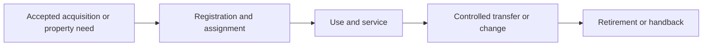
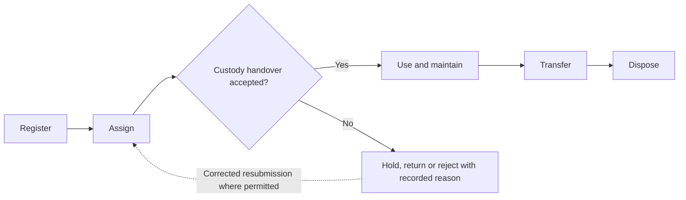
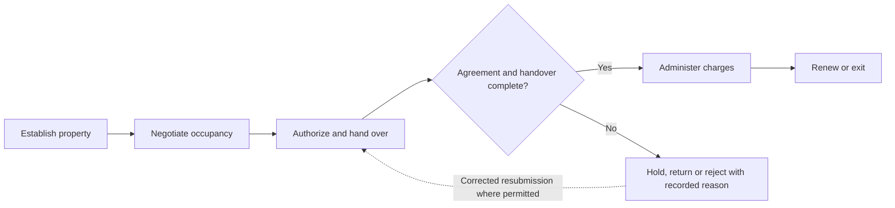
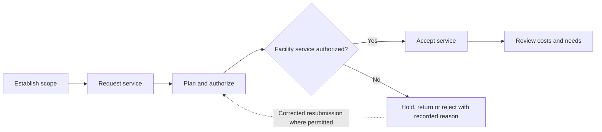

# athyper Assets & Facilities — Business Capabilities & Workflow Design

**Edition:** September 2026  
**Audience:** business owners, tenant implementation teams, process designers and solution reviewers  
**Status:** business design baseline with scoped source findings; not a deployment acceptance record

[Series index](README.md)

## 1. Purpose and business outcomes

Manage asset custody, site services and proposed property obligations with clear accounting and operational handoffs.

An asset steward should trace acquisition, assignment, maintenance and disposal while the accountant separately controls book value and retirement entries.

This document covers every module in the selected workspace. The workflow diagrams, step tables, proposed controls, notifications and measures describe a business design for validation. They are not a claim that every step is implemented. Each module separately states the inspected foundation and the remaining gap. No module is designated as available in a qualified tenant deployment by this review.

**Shared prerequisites:** Asset identity, classes, sites, custodians, companies, cost centers and applicable commercial terms.

**Ownership boundary:** Asset Management owns operational identity and custody. Facilities coordinates site services; Operations executes technical work; Finance owns asset accounting and settlement.

## 2. Module and capability map

| Module                                       | Business purpose                                                                           | Evidence position                             |
| -------------------------------------------- | ------------------------------------------------------------------------------------------ | --------------------------------------------- |
| [Enterprise Asset Management](#module-asset) | Maintain the operational identity, custody, location and disposition of enterprise assets. | Data foundation defined; workflow proposed    |
| [Real Estate Management](#module-assetrems)  | Manage property-related commercial obligations and coordinate occupancy, charges and exit. | Supporting foundation only; workflow proposed |
| [Facilities Management](#module-assetfm)     | Coordinate facilities, space and shared-site services with clear operational ownership.    | Supporting foundation only; workflow proposed |

A source implementation finding applies only to the named behavior in its module chapter. A supporting foundation can contain related records without containing the module-specific process. Proposed lifecycle labels below are business design states, not asserted application status values.

## 3. Workspace journey and responsibility

**Proposed end-to-end journey:**

At each handoff, the receiving owner checks scope, references and acceptance conditions. A completed sending step does not automatically authorize the next step. Return and rejection outcomes stay attached to the original business reference so that teams can resolve the cause without losing history.

## 4. Module workflows

### Enterprise Asset Management

**Purpose:** Maintain the operational identity, custody, location and disposition of enterprise assets.

**Responsible roles:** Asset steward; custodian; transfer approver; disposal owner.

**Business information and prerequisites:** Asset, component, class, assignment history and site. The relevant tenant, company and operating scope must be identified before the workflow starts.

**Evidence position:** Data foundation defined; workflow proposed.

**Inspected foundation:** Asset register, component and assignment-history structures are defined.

**Remaining implementation boundary:** A complete acquisition, transfer and disposal approval workflow requires implementation verification; accounting services do not establish operational asset workflows.

#### Capability catalogue and proposed lifecycle

| Business capability | Intended output                           |
| ------------------- | ----------------------------------------- |
| Register            | Asset record proposal                     |
| Assign              | Accepted assignment                       |
| Use and maintain    | Usage/maintenance reference               |
| Transfer            | New custody/location                      |
| Dispose             | Disposed asset and accounting instruction |

The primary journey starts with **accepted acquisition and identity evidence** and completes when **disposed asset and accounting instruction** is recorded by the responsible owner. Outstanding exceptions remain assigned; completion of this module does not imply completion of downstream work.

#### Workflow steps and exception handling

| Step                | Responsible role      | Input                                      | Business action and decision                                | Output                                    | Exception path                        |
| ------------------- | --------------------- | ------------------------------------------ | ----------------------------------------------------------- | ----------------------------------------- | ------------------------------------- |
| 1. Register         | Asset steward         | Accepted acquisition and identity evidence | Record class, serial identity where applicable and location | Asset record proposal                     | Resolve duplicate or missing identity |
| 2. Assign           | Custodian and steward | Approved asset and receiving owner         | Record custody and effective assignment                     | Accepted assignment                       | Hold unacknowledged handover          |
| 3. Use and maintain | Custodian             | Operational asset                          | Report issues and coordinate Maintenance                    | Usage/maintenance reference               | Escalate lost or unavailable asset    |
| 4. Transfer         | Transfer approver     | Requested move or responsibility change    | Authorize handover and preserve assignment history          | New custody/location                      | Hold disputed custody                 |
| 5. Dispose          | Disposal owner        | Approved retirement evidence               | Confirm physical disposition and notify Finance             | Disposed asset and accounting instruction | Keep unverified disposal open         |

An exception returns work to the named owner for correction or an explicit decision. A withdrawn proposal closes without executing its intended business effect. Once an effect is accepted, cancellation must use the applicable controlled correction or reversal path; it must not erase evidence. Exact commands and permitted transitions require implementation qualification.

#### Controls, responsibilities and tenant configuration

Operational asset ownership is separate from book value; Finance owns depreciation; Maintenance owns technical service; disposal requires both operational and financial follow-up.

**Configuration decisions:** Asset classes, identifiers, custody rules, sites, inventory checks and disposal authority.

Approval amounts, response deadlines, reviewers and escalation paths must be agreed for the tenant; this design does not assume default thresholds or a universal approval chain.

#### Communications, documents and visibility

Proposed: custody acknowledgement, transfer review, maintenance handoff and disposal confirmation.

Each enabled message should identify the business reference, intended recipient, required action and authorized navigation destination. Record access must still be checked when the recipient opens it. Delivery success is separate from approval.

**Proposed business measures:** Unassigned assets; pending transfers; missing custody acknowledgements; disposed assets awaiting accounting closure. Agree the population, period, exclusions and responsible owner before turning these into performance targets. Existing dashboards are not implied.

#### Atlas AI and activation criteria

Proposed: explain asset history; no automatic transfer or disposal decision.

Before tenant activation, verify the module-specific gap above, publish the applicable process and permissions, and demonstrate a successful case plus its return, denial, stale-change and downstream-failure paths. Require reconciliation of the resulting business records and evidence.

### Real Estate Management

**Purpose:** Manage property-related commercial obligations and coordinate occupancy, charges and exit.

**Responsible roles:** Property manager; contract owner; billing owner; facilities coordinator.

**Business information and prerequisites:** Site, asset, commitment and payment-term references. The relevant tenant, company and operating scope must be identified before the workflow starts.

**Evidence position:** Supporting foundation only; workflow proposed.

**Inspected foundation:** Site, asset and shared commitment structures provide related foundations.

**Remaining implementation boundary:** Dedicated property, lease, tenancy, rent schedule and common-area charge models were not identified in the inspected canonical inventory. The workflow is proposed.

#### Capability catalogue and proposed lifecycle

| Business capability     | Intended output                        |
| ----------------------- | -------------------------------------- |
| Establish property      | Property proposal                      |
| Negotiate occupancy     | Lease or occupancy proposal            |
| Authorize and hand over | Active occupancy evidence              |
| Administer charges      | Charge schedule and settlement handoff |
| Renew or exit           | Renewal or exit evidence               |

The primary journey starts with **property identity and ownership basis** and completes when **renewal or exit evidence** is recorded by the responsible owner. Outstanding exceptions remain assigned; completion of this module does not imply completion of downstream work.

#### Workflow steps and exception handling

| Step                       | Responsible role               | Input                                     | Business action and decision                          | Output                                 | Exception path                      |
| -------------------------- | ------------------------------ | ----------------------------------------- | ----------------------------------------------------- | -------------------------------------- | ----------------------------------- |
| 1. Establish property      | Property manager               | Property identity and ownership basis     | Define premises, responsible company and usable scope | Property proposal                      | Resolve missing ownership evidence  |
| 2. Negotiate occupancy     | Contract owner                 | Occupant requirements and terms           | Prepare agreement, dates and charges                  | Lease or occupancy proposal            | Return conflicting terms            |
| 3. Authorize and hand over | Signatory and property manager | Approved agreement                        | Record execution and premises handover                | Active occupancy evidence              | Hold incomplete agreement           |
| 4. Administer charges      | Billing owner                  | Effective terms and measured charge basis | Prepare billing or payable instructions               | Charge schedule and settlement handoff | Dispute unsupported allocation      |
| 5. Renew or exit           | Property manager               | Expiry or termination trigger             | Review obligations and inspect handback               | Renewal or exit evidence               | Keep deposits or repairs unresolved |

An exception returns work to the named owner for correction or an explicit decision. A withdrawn proposal closes without executing its intended business effect. Once an effect is accepted, cancellation must use the applicable controlled correction or reversal path; it must not erase evidence. Exact commands and permitted transitions require implementation qualification.

#### Controls, responsibilities and tenant configuration

Contract Management owns agreement review; Facilities owns site service coordination; Finance owns billing and accounting; lease-accounting compliance is not established by an asset record.

**Configuration decisions:** Property/space identifiers, agreement model, charges, escalation, deposits, notice periods and handback criteria.

Approval amounts, response deadlines, reviewers and escalation paths must be agreed for the tenant; this design does not assume default thresholds or a universal approval chain.

#### Communications, documents and visibility

Proposed: renewal notice, charge advice, inspection appointment and handback confirmation.

Each enabled message should identify the business reference, intended recipient, required action and authorized navigation destination. Record access must still be checked when the recipient opens it. Delivery success is separate from approval.

**Proposed business measures:** Expiring agreements; disputed charges; overdue handbacks; unresolved deposits. Agree the population, period, exclusions and responsible owner before turning these into performance targets. Existing dashboards are not implied.

#### Atlas AI and activation criteria

Proposed: summarize authorized agreement obligations; no legal conclusion or automatic renewal.

Before tenant activation, verify the module-specific gap above, publish the applicable process and permissions, and demonstrate a successful case plus its return, denial, stale-change and downstream-failure paths. Require reconciliation of the resulting business records and evidence.

### Facilities Management

**Purpose:** Coordinate facilities, space and shared-site services with clear operational ownership.

**Responsible roles:** Facilities coordinator; occupant; site manager; service supplier.

**Business information and prerequisites:** Site, asset, cost center and service acceptance. The relevant tenant, company and operating scope must be identified before the workflow starts.

**Evidence position:** Supporting foundation only; workflow proposed.

**Inspected foundation:** Sites, assets and financial scope records provide supporting foundations.

**Remaining implementation boundary:** Dedicated buildings/spaces, utility meters, occupancy and facilities-request workflows were not identified in the inspected canonical inventory.

#### Capability catalogue and proposed lifecycle

| Business capability    | Intended output              |
| ---------------------- | ---------------------------- |
| Establish scope        | Facility scope proposal      |
| Request service        | Facility request             |
| Plan and authorize     | Approved service instruction |
| Accept service         | Accepted facility service    |
| Review costs and needs | Facility review              |

The primary journey starts with **site and facility service needs** and completes when **facility review** is recorded by the responsible owner. Outstanding exceptions remain assigned; completion of this module does not imply completion of downstream work.

#### Workflow steps and exception handling

| Step                      | Responsible role        | Input                           | Business action and decision                    | Output                       | Exception path                                  |
| ------------------------- | ----------------------- | ------------------------------- | ----------------------------------------------- | ---------------------------- | ----------------------------------------------- |
| 1. Establish scope        | Site manager            | Site and facility service needs | Define responsible areas and service ownership  | Facility scope proposal      | Resolve unowned area                            |
| 2. Request service        | Occupant or coordinator | Space or facility need          | Record location, priority and requested outcome | Facility request             | Return ambiguous location                       |
| 3. Plan and authorize     | Facilities coordinator  | Request and resources           | Coordinate internal work or Procurement         | Approved service instruction | Hold budget or access concern                   |
| 4. Accept service         | Site manager            | Completed work evidence         | Verify outcome and occupant impact              | Accepted facility service    | Return incomplete work                          |
| 5. Review costs and needs | Facilities coordinator  | Accepted work and cost records  | Allocate costs and identify recurring needs     | Facility review              | Investigate repeated fault or unexplained usage |

An exception returns work to the named owner for correction or an explicit decision. A withdrawn proposal closes without executing its intended business effect. Once an effect is accepted, cancellation must use the applicable controlled correction or reversal path; it must not erase evidence. Exact commands and permitted transitions require implementation qualification.

#### Controls, responsibilities and tenant configuration

Facilities coordinates the site service; Maintenance executes technical work; Procurement controls external ordering; usage and occupancy must not be inferred from asset presence.

**Configuration decisions:** Site hierarchy, space model, service categories, occupant access, cost allocation and escalation.

Approval amounts, response deadlines, reviewers and escalation paths must be agreed for the tenant; this design does not assume default thresholds or a universal approval chain.

#### Communications, documents and visibility

Proposed: service acknowledgement, access arrangements, completion notice and recurring-issue review.

Each enabled message should identify the business reference, intended recipient, required action and authorized navigation destination. Record access must still be checked when the recipient opens it. Delivery success is separate from approval.

**Proposed business measures:** Service request age; repeated site issues; accepted cost by site; utilization only where measured. Agree the population, period, exclusions and responsible owner before turning these into performance targets. Existing dashboards are not implied.

#### Atlas AI and activation criteria

Proposed: summarize site service demand; no autonomous occupancy assignment or facility safety decision.

Before tenant activation, verify the module-specific gap above, publish the applicable process and permissions, and demonstrate a successful case plus its return, denial, stale-change and downstream-failure paths. Require reconciliation of the resulting business records and evidence.

## 5. Cross-module handoff contracts

These proposed handoff IDs are shared across the document series. They express business acceptance responsibilities, not a claim that an integration is already deployed.

| ID  | Owning modules                                       | Required handoff                                                        | Receiving decision                                                | Exception ownership                                   |
| --- | ---------------------------------------------------- | ----------------------------------------------------------------------- | ----------------------------------------------------------------- | ----------------------------------------------------- |
| H09 | Enterprise Asset Management → Fixed Asset Accounting | Acquisition, transfer or disposal evidence and asset identity           | Asset accountant determines book treatment                        | Hold incomplete valuation or retirement basis         |
| H10 | Assets / Facilities → Maintenance                    | Asset or site reference, fault/service need and operational constraints | Maintenance owner admits work and returns serviceability evidence | Keep unsafe, incomplete or unaccepted work unresolved |

Related workspace documents: [Finance](finance.md), [Operations](operations-management.md).

## 6. Implementation workshop and acceptance

Use the module chapters as the business workshop agenda. Agree the owning roles, business objects, entry channels, decision rules, exception routes and handoffs before configuring an approval flow. Shared master-data governance, identity, documents and notifications are dependencies; their availability does not establish that a domain workflow is complete.

| Review topic                 | Concrete acceptance evidence                                                                                                          |
| ---------------------------- | ------------------------------------------------------------------------------------------------------------------------------------- |
| Scope and ownership          | A representative tenant/company scenario, named process owner and agreed scope exclusions.                                            |
| Workflow and state           | A demonstrated primary journey, return/rejection, cancellation and applicable correction with identifiable outcomes.                  |
| Access and evidence          | Unauthorized actions denied; restricted data withheld; decisions linked to the relevant actor, version and business reference.        |
| Cross-module processing      | The recipient accepts or rejects the handoff explicitly; interruption and retry do not create unexplained duplicate business effects. |
| Documents and communications | Eligible recipients can retrieve permitted evidence; failed delivery remains visible and does not imply a failed business save.       |
| Measures and AI              | Report definitions reconcile to accepted records; any enabled AI use case preserves scope, evidence limits and human authority.       |
| Deployment readiness         | The selected configuration, service connections and business journey have tenant-specific qualification evidence.                     |

The resulting workshop decisions should become versioned configuration and delivery acceptance records. This document remains the business design reference; it does not itself activate routes, publish policies, change data or authorize transactions.
