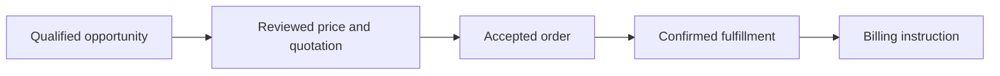
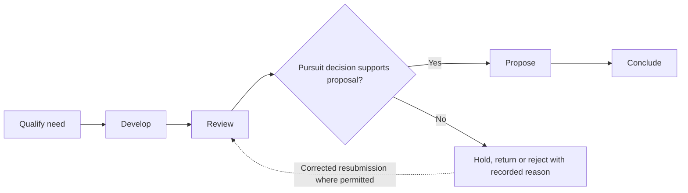
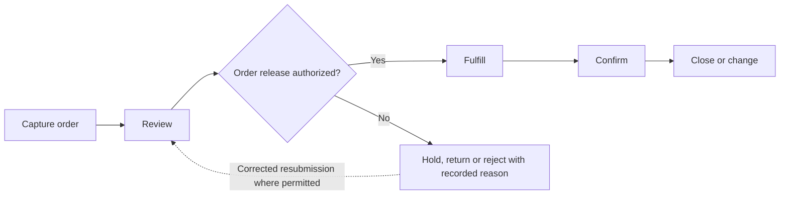
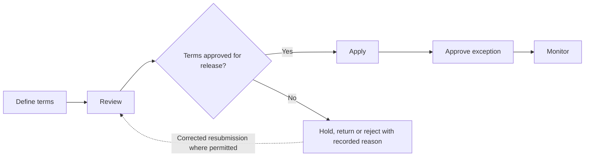

# athyper Commercial — Business Capabilities & Workflow Design

**Edition:** September 2026  
**Audience:** business owners, tenant implementation teams, process designers and solution reviewers  
**Status:** business design baseline with scoped source findings; not a deployment acceptance record

[Series index](README.md)

## 1. Purpose and business outcomes

Develop customer demand into accepted commercial terms, fulfilled orders and supported billing instructions.

An account owner explaining an order to a customer should see the accepted terms, the fulfillment outcome and any billing dispute without treating an opportunity as booked revenue.

This document covers every module in the selected workspace. The workflow diagrams, step tables, proposed controls, notifications and measures describe a business design for validation. They are not a claim that every step is implemented. Each module separately states the inspected foundation and the remaining gap. No module is designated as available in a qualified tenant deployment by this review.

**Shared prerequisites:** Governed customers, selling organizations, participating companies, products, pricing and payment terms.

**Ownership boundary:** Commercial owns the customer promise and acceptance basis. Supply Chain owns supply execution; Finance owns billing, collection and accounting.

## 2. Module and capability map

| Module                                          | Business purpose                                                                                   | Evidence position                          |
| ----------------------------------------------- | -------------------------------------------------------------------------------------------------- | ------------------------------------------ |
| [Customer Relationship Management](#module-crm) | Manage a customer opportunity from identified need to a traceable commercial outcome.              | Data foundation defined; workflow proposed |
| [Sales & Order Management](#module-sale)        | Translate accepted customer terms into controlled fulfillment and a clear billing handoff.         | Data foundation defined; workflow proposed |
| [Pricing & Commercial Management](#module-pcm)  | Maintain identifiable commercial terms and apply reviewed prices to customer proposals and orders. | Data foundation defined; workflow proposed |

A source implementation finding applies only to the named behavior in its module chapter. A supporting foundation can contain related records without containing the module-specific process. Proposed lifecycle labels below are business design states, not asserted application status values.

## 3. Workspace journey and responsibility

**Proposed end-to-end journey:**

At each handoff, the receiving owner checks scope, references and acceptance conditions. A completed sending step does not automatically authorize the next step. Return and rejection outcomes stay attached to the original business reference so that teams can resolve the cause without losing history.

## 4. Module workflows

### Customer Relationship Management

**Purpose:** Manage a customer opportunity from identified need to a traceable commercial outcome.

**Responsible roles:** Account owner; sales manager; customer-data steward.

**Business information and prerequisites:** Customer, opportunity, participating company and quotation. The relevant tenant, company and operating scope must be identified before the workflow starts.

**Evidence position:** Data foundation defined; workflow proposed.

**Inspected foundation:** Opportunity, company allocation and quotation structures are defined; probability and amount constraints provide data-level controls.

**Remaining implementation boundary:** Full lead capture, campaign management and opportunity stage automation are not established by the inspected source.

#### Capability catalogue and proposed lifecycle

| Business capability | Intended output                     |
| ------------------- | ----------------------------------- |
| Qualify need        | Qualified opportunity               |
| Develop             | Updated opportunity                 |
| Review              | Approved pursuit decision           |
| Propose             | Quotation request                   |
| Conclude            | Outcome and order handoff where won |

The primary journey starts with **customer inquiry and business scope** and completes when **outcome and order handoff where won** is recorded by the responsible owner. Outstanding exceptions remain assigned; completion of this module does not imply completion of downstream work.

#### Workflow steps and exception handling

| Step            | Responsible role | Input                               | Business action and decision                             | Output                              | Exception path                                |
| --------------- | ---------------- | ----------------------------------- | -------------------------------------------------------- | ----------------------------------- | --------------------------------------------- |
| 1. Qualify need | Account owner    | Customer inquiry and business scope | Identify need, company, expected value and next activity | Qualified opportunity               | Return unclear customer identity              |
| 2. Develop      | Account owner    | Qualified opportunity               | Record scope, assumptions and commercial participants    | Updated opportunity                 | Escalate missing sponsor or conflicting scope |
| 3. Review       | Sales manager    | Current opportunity and evidence    | Review stage, value and realistic next step              | Approved pursuit decision           | Rework unsupported probability or value       |
| 4. Propose      | Account owner    | Reviewed customer requirements      | Request pricing and prepare quotation handoff            | Quotation request                   | Resolve missing terms                         |
| 5. Conclude     | Sales manager    | Customer response                   | Record win, loss or withdrawal and reason                | Outcome and order handoff where won | Do not treat verbal interest as an order      |

An exception returns work to the named owner for correction or an explicit decision. A withdrawn proposal closes without executing its intended business effect. Once an effect is accepted, cancellation must use the applicable controlled correction or reversal path; it must not erase evidence. Exact commands and permitted transitions require implementation qualification.

#### Controls, responsibilities and tenant configuration

Customer stewardship owns identity changes; Pricing owns exceptions to terms; opportunity probability is a business estimate rather than evidence of booked revenue.

**Configuration decisions:** Stages, probability conventions, company allocation, qualification fields and lost-reason codes.

Approval amounts, response deadlines, reviewers and escalation paths must be agreed for the tenant; this design does not assume default thresholds or a universal approval chain.

#### Communications, documents and visibility

Proposed: account-owner tasks, quotation review and follow-up reminders; retain customer communications under the applicable access rules.

Each enabled message should identify the business reference, intended recipient, required action and authorized navigation destination. Record access must still be checked when the recipient opens it. Delivery success is separate from approval.

**Proposed business measures:** Pipeline by stage; opportunity age; conversion rate; missing next activities. Agree the population, period, exclusions and responsible owner before turning these into performance targets. Existing dashboards are not implied.

#### Atlas AI and activation criteria

Proposed: summarize authorized opportunity history; no inferred customer commitments or autonomous stage advancement.

Before tenant activation, verify the module-specific gap above, publish the applicable process and permissions, and demonstrate a successful case plus its return, denial, stale-change and downstream-failure paths. Require reconciliation of the resulting business records and evidence.

### Sales & Order Management

**Purpose:** Translate accepted customer terms into controlled fulfillment and a clear billing handoff.

**Responsible roles:** Sales operator; order approver; fulfillment coordinator; billing owner.

**Business information and prerequisites:** Customer, quotation, sales order, order line and intercompany fulfillment allocation. The relevant tenant, company and operating scope must be identified before the workflow starts.

**Evidence position:** Data foundation defined; workflow proposed.

**Inspected foundation:** Order, quotation and intercompany allocation structures are defined.

**Remaining implementation boundary:** Order approval, credit admission, stock reservation and customer billing orchestration require additional service and deployment evidence.

#### Capability catalogue and proposed lifecycle

| Business capability | Intended output                    |
| ------------------- | ---------------------------------- |
| Capture order       | Order proposal                     |
| Review              | Released order instruction         |
| Fulfill             | Fulfillment reference              |
| Confirm             | Billing instruction to Receivables |
| Close or change     | Closed or revised order            |

The primary journey starts with **accepted quotation or customer instruction** and completes when **closed or revised order** is recorded by the responsible owner. Outstanding exceptions remain assigned; completion of this module does not imply completion of downstream work.

#### Workflow steps and exception handling

| Step               | Responsible role        | Input                                      | Business action and decision                                  | Output                             | Exception path                               |
| ------------------ | ----------------------- | ------------------------------------------ | ------------------------------------------------------------- | ---------------------------------- | -------------------------------------------- |
| 1. Capture order   | Sales operator          | Accepted quotation or customer instruction | Identify seller, customer, lines, terms and requested dates   | Order proposal                     | Return inconsistent acceptance               |
| 2. Review          | Order approver          | Proposal and commercial scope              | Check price, customer eligibility and required credit control | Released order instruction         | Hold disputed terms or credit concern        |
| 3. Fulfill         | Fulfillment coordinator | Released demand                            | Request stock, production or service delivery                 | Fulfillment reference              | Manage partial supply or shortage            |
| 4. Confirm         | Commercial owner        | Delivery or service outcome                | Validate accepted billable quantity and terms                 | Billing instruction to Receivables | Hold rejected or disputed supply             |
| 5. Close or change | Sales operator          | Remaining quantities and customer decision | Resolve amendments, returns and final status                  | Closed or revised order            | Require renewed approval for material change |

An exception returns work to the named owner for correction or an explicit decision. A withdrawn proposal closes without executing its intended business effect. Once an effect is accepted, cancellation must use the applicable controlled correction or reversal path; it must not erase evidence. Exact commands and permitted transitions require implementation qualification.

#### Controls, responsibilities and tenant configuration

Sales owns customer commitment; Inventory owns quantity movement; Receivables owns billing; intercompany participation does not merge seller accountability.

**Configuration decisions:** Order types, approval rules, customer eligibility, credit integration, fulfillment allocation and amendment thresholds.

Approval amounts, response deadlines, reviewers and escalation paths must be agreed for the tenant; this design does not assume default thresholds or a universal approval chain.

#### Communications, documents and visibility

Proposed: order acknowledgement, delivery update, exception notice and amendment confirmation.

Each enabled message should identify the business reference, intended recipient, required action and authorized navigation destination. Record access must still be checked when the recipient opens it. Delivery success is separate from approval.

**Proposed business measures:** Open orders by age; fulfillment delay; billing-ready items; change and cancellation rates. Agree the population, period, exclusions and responsible owner before turning these into performance targets. Existing dashboards are not implied.

#### Atlas AI and activation criteria

Proposed: explain order status using confirmed evidence; no autonomous promise of delivery or credit release.

Before tenant activation, verify the module-specific gap above, publish the applicable process and permissions, and demonstrate a successful case plus its return, denial, stale-change and downstream-failure paths. Require reconciliation of the resulting business records and evidence.

### Pricing & Commercial Management

**Purpose:** Maintain identifiable commercial terms and apply reviewed prices to customer proposals and orders.

**Responsible roles:** Pricing analyst; commercial approver; sales representative.

**Business information and prerequisites:** Catalogue price, condition type, pricing component and quotation. The relevant tenant, company and operating scope must be identified before the workflow starts.

**Evidence position:** Data foundation defined; workflow proposed.

**Inspected foundation:** Catalogue prices, pricing components and quotations provide price and commercial-term foundations.

**Remaining implementation boundary:** A complete pricing engine, promotion/rebate settlement and margin approval workflow was not established by this review.

#### Capability catalogue and proposed lifecycle

| Business capability | Intended output    |
| ------------------- | ------------------ |
| Define terms        | Price proposal     |
| Review              | Released terms     |
| Apply               | Priced proposal    |
| Approve exception   | Exception decision |
| Monitor             | Pricing review     |

The primary journey starts with **product scope and commercial policy** and completes when **pricing review** is recorded by the responsible owner. Outstanding exceptions remain assigned; completion of this module does not imply completion of downstream work.

#### Workflow steps and exception handling

| Step                 | Responsible role     | Input                               | Business action and decision                           | Output             | Exception path                         |
| -------------------- | -------------------- | ----------------------------------- | ------------------------------------------------------ | ------------------ | -------------------------------------- |
| 1. Define terms      | Pricing analyst      | Product scope and commercial policy | Specify validity, currency and intended customer scope | Price proposal     | Return overlapping or incomplete scope |
| 2. Review            | Commercial approver  | Price and discount rationale        | Approve exception and effective period                 | Released terms     | Reject unauthorized discount           |
| 3. Apply             | Sales representative | Customer quotation or order         | Select applicable version and document deviations      | Priced proposal    | Resolve missing or conflicting term    |
| 4. Approve exception | Commercial approver  | Deviation request                   | Review margin and authority under tenant rules         | Exception decision | Return rejected proposal for repricing |
| 5. Monitor           | Pricing analyst      | Accepted transactions               | Review usage and prepare successor terms               | Pricing review     | Investigate unexpected price usage     |

An exception returns work to the named owner for correction or an explicit decision. A withdrawn proposal closes without executing its intended business effect. Once an effect is accepted, cancellation must use the applicable controlled correction or reversal path; it must not erase evidence. Exact commands and permitted transitions require implementation qualification.

#### Controls, responsibilities and tenant configuration

Accepted order price and later catalogue price must remain distinguishable; proposed margin rules need defined cost inputs; contractual rebates require separate qualification.

**Configuration decisions:** Currencies, effective dates, price priorities, discount authority and cost/margin definitions.

Approval amounts, response deadlines, reviewers and escalation paths must be agreed for the tenant; this design does not assume default thresholds or a universal approval chain.

#### Communications, documents and visibility

Proposed: price-change review, discount approval and expiry notice; recipients depend on commercial scope.

Each enabled message should identify the business reference, intended recipient, required action and authorized navigation destination. Record access must still be checked when the recipient opens it. Delivery success is separate from approval.

**Proposed business measures:** Discount exceptions; expired prices used; price variance; margin measures only where cost basis is qualified. Agree the population, period, exclusions and responsible owner before turning these into performance targets. Existing dashboards are not implied.

#### Atlas AI and activation criteria

Proposed: explain applied components; no autonomous discount approval.

Before tenant activation, verify the module-specific gap above, publish the applicable process and permissions, and demonstrate a successful case plus its return, denial, stale-change and downstream-failure paths. Require reconciliation of the resulting business records and evidence.

## 5. Cross-module handoff contracts

These proposed handoff IDs are shared across the document series. They express business acceptance responsibilities, not a claim that an integration is already deployed.

| ID  | Owning modules              | Required handoff                                               | Receiving decision                                          | Exception ownership                                      |
| --- | --------------------------- | -------------------------------------------------------------- | ----------------------------------------------------------- | -------------------------------------------------------- |
| H05 | Sales → Supply Chain        | Released order, quantity, destination and accepted terms       | Fulfillment owner admits and plans supply                   | Report shortage; do not change customer promise silently |
| H06 | Supply Chain → Sales        | Actual accepted fulfillment quantity and exception evidence    | Commercial owner determines accepted customer/billing basis | Resolve rejection or partial delivery                    |
| H07 | Sales → Accounts Receivable | Accepted billable scope, customer, company, terms and evidence | Billing owner validates customer invoice basis              | Hold missing acceptance or billing-model gap             |

Related workspace documents: [Finance](finance.md), [Supply Chain](supply-chain.md).

## 6. Implementation workshop and acceptance

Use the module chapters as the business workshop agenda. Agree the owning roles, business objects, entry channels, decision rules, exception routes and handoffs before configuring an approval flow. Shared master-data governance, identity, documents and notifications are dependencies; their availability does not establish that a domain workflow is complete.

| Review topic                 | Concrete acceptance evidence                                                                                                          |
| ---------------------------- | ------------------------------------------------------------------------------------------------------------------------------------- |
| Scope and ownership          | A representative tenant/company scenario, named process owner and agreed scope exclusions.                                            |
| Workflow and state           | A demonstrated primary journey, return/rejection, cancellation and applicable correction with identifiable outcomes.                  |
| Access and evidence          | Unauthorized actions denied; restricted data withheld; decisions linked to the relevant actor, version and business reference.        |
| Cross-module processing      | The recipient accepts or rejects the handoff explicitly; interruption and retry do not create unexplained duplicate business effects. |
| Documents and communications | Eligible recipients can retrieve permitted evidence; failed delivery remains visible and does not imply a failed business save.       |
| Measures and AI              | Report definitions reconcile to accepted records; any enabled AI use case preserves scope, evidence limits and human authority.       |
| Deployment readiness         | The selected configuration, service connections and business journey have tenant-specific qualification evidence.                     |

The resulting workshop decisions should become versioned configuration and delivery acceptance records. This document remains the business design reference; it does not itself activate routes, publish policies, change data or authorize transactions.
