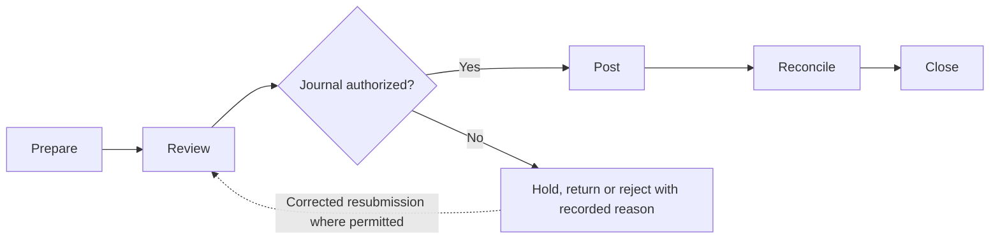
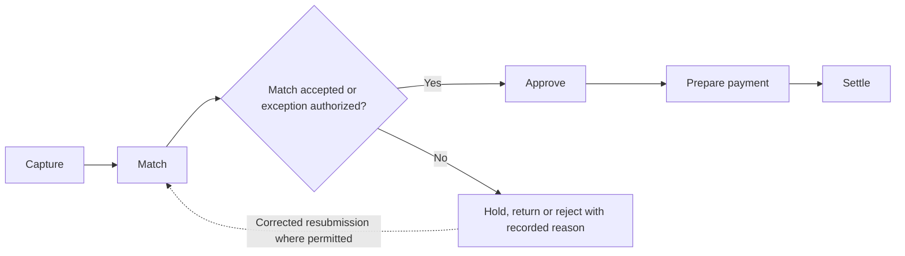
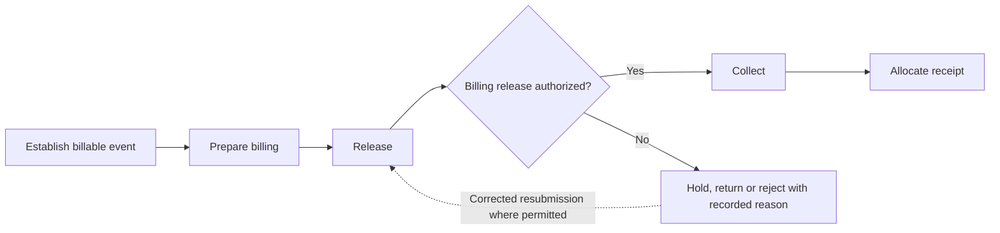
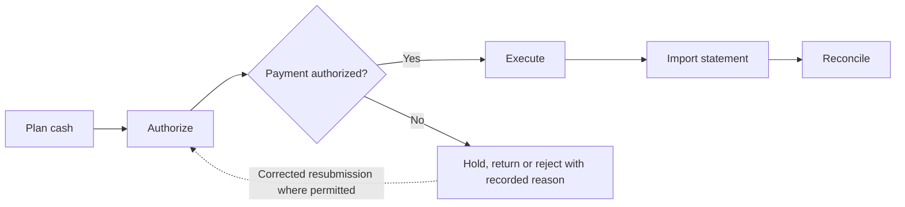
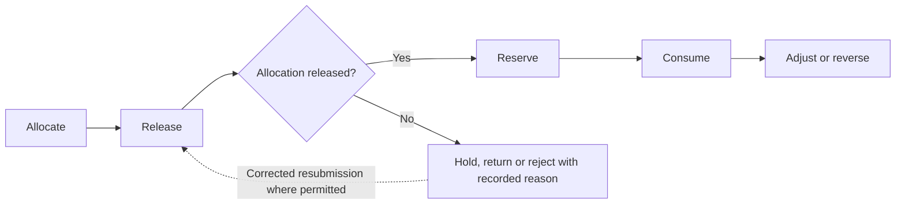
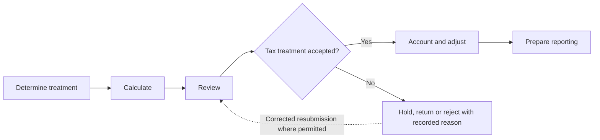
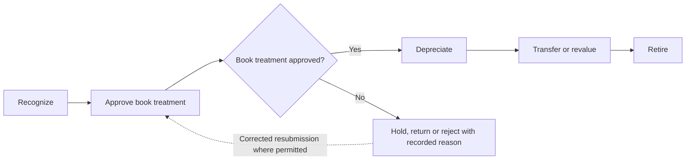

# athyper Finance — Business Capabilities & Workflow Design

**Edition:** September 2026  
**Audience:** business owners, tenant implementation teams, process designers and solution reviewers  
**Status:** business design baseline with scoped source findings; not a deployment acceptance record

[Series index](README.md)

## 1. Purpose and business outcomes

Establish controlled accounting, liabilities, collections, cash, budgets, tax and asset values.

A financial controller reviewing the period close should be able to distinguish unposted business evidence, accepted liabilities, executed payments and reconciled balances.

This document covers every module in the selected workspace. The workflow diagrams, step tables, proposed controls, notifications and measures describe a business design for validation. They are not a claim that every step is implemented. Each module separately states the inspected foundation and the remaining gap. No module is designated as available in a qualified tenant deployment by this review.

**Shared prerequisites:** Account charts, companies, books, periods, counterparties, bank references and approved tax configuration.

**Ownership boundary:** Finance owns accounting and monetary settlement. Business acceptance remains with the module that ordered, sold, delivered or used the underlying goods and services.

## 2. Module and capability map

| Module                                         | Business purpose                                                                                               | Evidence position                                    |
| ---------------------------------------------- | -------------------------------------------------------------------------------------------------------------- | ---------------------------------------------------- |
| [Financial Accounting](#module-acc)            | Maintain explainable financial balances and control the accounting period from source evidence through close.  | Source implementation present; activation unverified |
| [Accounts Payable](#module-ap)                 | Turn substantiated supplier charges into controlled liabilities and payment instructions.                      | Data foundation defined; workflow proposed           |
| [Accounts Receivable](#module-ar)              | Control the handoff from accepted customer supply to billing, collection and receipt allocation.               | Supporting foundation only; workflow proposed        |
| [Cash & Treasury Management](#module-treasury) | Coordinate cash execution and reconcile confirmed bank activity with business obligations.                     | Source implementation present; activation unverified |
| [Budget Management & Control](#module-budget)  | Maintain a controlled spending envelope and an explainable history of allocation, reservation and consumption. | Source implementation present; activation unverified |
| [Tax Management](#module-tax)                  | Apply configured tax treatment to business events and preserve calculation and adjustment evidence.            | Source implementation present; activation unverified |
| [Fixed Asset Accounting](#module-faa)          | Account for asset value separately from the operational custody and use of the asset.                          | Source implementation present; activation unverified |

A source implementation finding applies only to the named behavior in its module chapter. A supporting foundation can contain related records without containing the module-specific process. Proposed lifecycle labels below are business design states, not asserted application status values.

## 3. Workspace journey and responsibility

**Proposed end-to-end journey:**

At each handoff, the receiving owner checks scope, references and acceptance conditions. A completed sending step does not automatically authorize the next step. Return and rejection outcomes stay attached to the original business reference so that teams can resolve the cause without losing history.

## 4. Module workflows

### Financial Accounting

**Purpose:** Maintain explainable financial balances and control the accounting period from source evidence through close.

**Responsible roles:** Accountant; financial controller; period owner.

**Business information and prerequisites:** Account chart, account, company, book, period, journal, exchange rate, balance. The relevant tenant, company and operating scope must be identified before the workflow starts.

**Evidence position:** Source implementation present; activation unverified.

**Inspected foundation:** Journal and balance structures exist. Posting services validate complete posted journal snapshots, balance and currency consistency; period and close services are present.

**Remaining implementation boundary:** The inspected balance-posting service consumes an already-posted journal snapshot. Journal authoring, approval and the entire close journey still require separate qualification.

#### Capability catalogue and proposed lifecycle

| Business capability | Intended output                  |
| ------------------- | -------------------------------- |
| Prepare             | Journal proposal                 |
| Review              | Authorized posting instruction   |
| Post                | Recorded posting and balances    |
| Reconcile           | Reconciliation evidence          |
| Close               | Closed period and close evidence |

The primary journey starts with **source transaction and coding** and completes when **closed period and close evidence** is recorded by the responsible owner. Outstanding exceptions remain assigned; completion of this module does not imply completion of downstream work.

#### Workflow steps and exception handling

| Step         | Responsible role | Input                               | Business action and decision                                        | Output                           | Exception path                             |
| ------------ | ---------------- | ----------------------------------- | ------------------------------------------------------------------- | -------------------------------- | ------------------------------------------ |
| 1. Prepare   | Accountant       | Source transaction and coding       | Select company, book, period, currency and balanced lines           | Journal proposal                 | Return incomplete source or coding         |
| 2. Review    | Controller       | Journal proposal and evidence       | Check accounting treatment and independent approval requirement     | Authorized posting instruction   | Return disputed treatment                  |
| 3. Post      | Posting operator | Authorized complete journal         | Check open period, permissions, balanced totals and replay identity | Recorded posting and balances    | Reject closed period or conflicting repeat |
| 4. Reconcile | Accountant       | Balances and source totals          | Compare the period totals and investigate differences               | Reconciliation evidence          | Assign unresolved difference               |
| 5. Close     | Period owner     | Reconciliations and close checklist | Confirm prerequisites and control period transition                 | Closed period and close evidence | Hold close; govern any reopening           |

An exception returns work to the named owner for correction or an explicit decision. A withdrawn proposal closes without executing its intended business effect. Once an effect is accepted, cancellation must use the applicable controlled correction or reversal path; it must not erase evidence. Exact commands and permitted transitions require implementation qualification.

#### Controls, responsibilities and tenant configuration

Separate preparer and reviewer where required; preserve linked corrections rather than editing accepted history; define book and currency scope before posting.

**Configuration decisions:** Books, account assignments, fiscal periods, rounding, approval thresholds, close checklist and reopening authority.

Approval amounts, response deadlines, reviewers and escalation paths must be agreed for the tenant; this design does not assume default thresholds or a universal approval chain.

#### Communications, documents and visibility

Proposed: notify reviewer on submission, accountant on return, and period owner on unresolved close items; retain journal support and reconciliation evidence.

Each enabled message should identify the business reference, intended recipient, required action and authorized navigation destination. Record access must still be checked when the recipient opens it. Delivery success is separate from approval.

**Proposed business measures:** Unreconciled items by period; time from submission to posting; close exceptions; controlled reopenings. Agree the population, period, exclusions and responsible owner before turning these into performance targets. Existing dashboards are not implied.

#### Atlas AI and activation criteria

Proposed: explain a reconciliation difference from authorized evidence; do not infer an implemented accounting assistant or permit AI to close a period.

Before tenant activation, verify the module-specific gap above, publish the applicable process and permissions, and demonstrate a successful case plus its return, denial, stale-change and downstream-failure paths. Require reconciliation of the resulting business records and evidence.

### Accounts Payable

**Purpose:** Turn substantiated supplier charges into controlled liabilities and payment instructions.

**Responsible roles:** Payables clerk; receiving owner; invoice reviewer; treasury operator.

**Business information and prerequisites:** Supplier profile, purchase commitment, receipt or service acceptance, invoice, match case, payment allocation. The relevant tenant, company and operating scope must be identified before the workflow starts.

**Evidence position:** Data foundation defined; workflow proposed.

**Inspected foundation:** Supplier invoice, matching, accounting distribution and payment structures are defined. Shared finance controls are supporting components.

**Remaining implementation boundary:** A full invoice-capture, matching, approval and settlement service journey was not established by this review.

#### Capability catalogue and proposed lifecycle

| Business capability | Intended output                |
| ------------------- | ------------------------------ |
| Capture             | Draft invoice                  |
| Match               | Match result                   |
| Approve             | Approved liability instruction |
| Prepare payment     | Payment proposal to Treasury   |
| Settle              | Updated payable and evidence   |

The primary journey starts with **supplier invoice and business reference** and completes when **updated payable and evidence** is recorded by the responsible owner. Outstanding exceptions remain assigned; completion of this module does not imply completion of downstream work.

#### Workflow steps and exception handling

| Step               | Responsible role | Input                                   | Business action and decision                                 | Output                         | Exception path                                |
| ------------------ | ---------------- | --------------------------------------- | ------------------------------------------------------------ | ------------------------------ | --------------------------------------------- |
| 1. Capture         | Payables clerk   | Supplier invoice and business reference | Identify supplier, company, currency, dates and charge lines | Draft invoice                  | Flag potential duplicate or missing reference |
| 2. Match           | Receiving owner  | Invoice, order and acceptance evidence  | Compare quantities, prices and accepted supply               | Match result                   | Hold difference for resolution                |
| 3. Approve         | Invoice reviewer | Matched invoice or approved exception   | Review coding, tax and business acceptance                   | Approved liability instruction | Return unsupported charge                     |
| 4. Prepare payment | Payables clerk   | Approved due liability                  | Apply terms and propose eligible allocations                 | Payment proposal to Treasury   | Hold blocked supplier or disputed amount      |
| 5. Settle          | Payables clerk   | Treasury execution and posting outcomes | Apply confirmed settlement and reconcile liability           | Updated payable and evidence   | Retain failed or partial payment as open      |

An exception returns work to the named owner for correction or an explicit decision. A withdrawn proposal closes without executing its intended business effect. Once an effect is accepted, cancellation must use the applicable controlled correction or reversal path; it must not erase evidence. Exact commands and permitted transitions require implementation qualification.

#### Controls, responsibilities and tenant configuration

Receipt acceptance belongs to Supply Chain; payment execution belongs to Treasury; invoice approval must not silently update supplier bank details.

**Configuration decisions:** Match tolerances, terms, exception authority, tax handling, payment blocks and duplicate-review rules.

Approval amounts, response deadlines, reviewers and escalation paths must be agreed for the tenant; this design does not assume default thresholds or a universal approval chain.

#### Communications, documents and visibility

Proposed: mismatch request to receiver, approval prompt to reviewer, due-payment advice to Treasury and remittance after confirmed execution.

Each enabled message should identify the business reference, intended recipient, required action and authorized navigation destination. Record access must still be checked when the recipient opens it. Delivery success is separate from approval.

**Proposed business measures:** Unmatched invoice age; approval lead time; overdue liabilities; payment exceptions. Agree the population, period, exclusions and responsible owner before turning these into performance targets. Existing dashboards are not implied.

#### Atlas AI and activation criteria

Proposed: summarize match discrepancies and evidence; do not approve an invoice or select unverified bank details.

Before tenant activation, verify the module-specific gap above, publish the applicable process and permissions, and demonstrate a successful case plus its return, denial, stale-change and downstream-failure paths. Require reconciliation of the resulting business records and evidence.

### Accounts Receivable

**Purpose:** Control the handoff from accepted customer supply to billing, collection and receipt allocation.

**Responsible roles:** Billing clerk; commercial owner; credit reviewer; collections officer.

**Business information and prerequisites:** Customer profile, sales order, fulfillment reference, payment entry and allocation. The relevant tenant, company and operating scope must be identified before the workflow starts.

**Evidence position:** Supporting foundation only; workflow proposed.

**Inspected foundation:** Customer and sales structures and shared payment records exist as supporting foundations.

**Remaining implementation boundary:** A dedicated customer-invoice and collections lifecycle was not identified in the inspected canonical table inventory. Do not reuse the supplier invoice as evidence of receivables implementation.

#### Capability catalogue and proposed lifecycle

| Business capability      | Intended output                 |
| ------------------------ | ------------------------------- |
| Establish billable event | Billing instruction             |
| Prepare billing          | Proposed customer invoice       |
| Release                  | Issued billing record           |
| Collect                  | Collection outcome              |
| Allocate receipt         | Settlement or remaining balance |

The primary journey starts with **accepted order and supply evidence** and completes when **settlement or remaining balance** is recorded by the responsible owner. Outstanding exceptions remain assigned; completion of this module does not imply completion of downstream work.

#### Workflow steps and exception handling

| Step                        | Responsible role    | Input                              | Business action and decision                        | Output                          | Exception path                          |
| --------------------------- | ------------------- | ---------------------------------- | --------------------------------------------------- | ------------------------------- | --------------------------------------- |
| 1. Establish billable event | Commercial owner    | Accepted order and supply evidence | Confirm customer, company, terms and billable scope | Billing instruction             | Hold disputed or incomplete fulfillment |
| 2. Prepare billing          | Billing clerk       | Billing instruction                | Prepare charges, tax and customer references        | Proposed customer invoice       | Return inconsistent terms               |
| 3. Release                  | Billing reviewer    | Invoice proposal and evidence      | Approve release and accounting handoff              | Issued billing record           | Reject unsupported charge               |
| 4. Collect                  | Collections officer | Open dues and customer response    | Track due items, disputes and agreed follow-up      | Collection outcome              | Escalate disputed or overdue amount     |
| 5. Allocate receipt         | Receivables clerk   | Confirmed bank receipt             | Match receipt to customer dues and reconcile        | Settlement or remaining balance | Keep unidentified receipt unallocated   |

An exception returns work to the named owner for correction or an explicit decision. A withdrawn proposal closes without executing its intended business effect. Once an effect is accepted, cancellation must use the applicable controlled correction or reversal path; it must not erase evidence. Exact commands and permitted transitions require implementation qualification.

#### Controls, responsibilities and tenant configuration

Commercial owns fulfillment acceptance; Treasury owns bank confirmation; receipt identification and write-off authority require separate controls.

**Configuration decisions:** Billing triggers, credit checks, collection stages, dispute ownership and write-off thresholds.

Approval amounts, response deadlines, reviewers and escalation paths must be agreed for the tenant; this design does not assume default thresholds or a universal approval chain.

#### Communications, documents and visibility

Proposed: billing notice, due reminder, dispute assignment and receipt confirmation; all need enabled customer communication routes.

Each enabled message should identify the business reference, intended recipient, required action and authorized navigation destination. Record access must still be checked when the recipient opens it. Delivery success is separate from approval.

**Proposed business measures:** Overdue amount and age; unallocated receipts; dispute age; billing lead time. Agree the population, period, exclusions and responsible owner before turning these into performance targets. Existing dashboards are not implied.

#### Atlas AI and activation criteria

Proposed: draft a collection summary from authorized dues; do not infer creditworthiness or automatically write off balances.

Before tenant activation, verify the module-specific gap above, publish the applicable process and permissions, and demonstrate a successful case plus its return, denial, stale-change and downstream-failure paths. Require reconciliation of the resulting business records and evidence.

### Cash & Treasury Management

**Purpose:** Coordinate cash execution and reconcile confirmed bank activity with business obligations.

**Responsible roles:** Treasury analyst; payment approver; bank reconciler.

**Business information and prerequisites:** Bank account, payment method, payment entry, bank statement, reconciliation case, netting batch. The relevant tenant, company and operating scope must be identified before the workflow starts.

**Evidence position:** Source implementation present; activation unverified.

**Inspected foundation:** Bank, payment, statement, reconciliation and netting structures exist; foreign-exchange close services provide a bounded implementation.

**Remaining implementation boundary:** Bank connectivity, payment authorization and full cash forecasting are proposed until their specific adapters and workflows are qualified.

#### Capability catalogue and proposed lifecycle

| Business capability | Intended output                    |
| ------------------- | ---------------------------------- |
| Plan cash           | Cash and payment proposal          |
| Authorize           | Authorized payment instruction     |
| Execute             | Execution reference and result     |
| Import statement    | Statement lines ready to reconcile |
| Reconcile           | Reconciled cash position           |

The primary journey starts with **due payables, expected receipts and balances** and completes when **reconciled cash position** is recorded by the responsible owner. Outstanding exceptions remain assigned; completion of this module does not imply completion of downstream work.

#### Workflow steps and exception handling

| Step                | Responsible role  | Input                                        | Business action and decision                     | Output                             | Exception path                        |
| ------------------- | ----------------- | -------------------------------------------- | ------------------------------------------------ | ---------------------------------- | ------------------------------------- |
| 1. Plan cash        | Treasury analyst  | Due payables, expected receipts and balances | Select company, bank, currency and value date    | Cash and payment proposal          | Escalate funding shortfall            |
| 2. Authorize        | Payment approver  | Proposal and verified beneficiary            | Confirm authority, amount and duplicate controls | Authorized payment instruction     | Reject bank-change or funding concern |
| 3. Execute          | Treasury operator | Authorized instruction                       | Transmit through an approved banking arrangement | Execution reference and result     | Record uncertain or failed outcome    |
| 4. Import statement | Bank reconciler   | Bank-issued statement                        | Identify account and reject duplicate import     | Statement lines ready to reconcile | Quarantine invalid statement          |
| 5. Reconcile        | Bank reconciler   | Statement and payment records                | Match evidence and allocate exceptions           | Reconciled cash position           | Assign unexplained bank item          |

An exception returns work to the named owner for correction or an explicit decision. A withdrawn proposal closes without executing its intended business effect. Once an effect is accepted, cancellation must use the applicable controlled correction or reversal path; it must not erase evidence. Exact commands and permitted transitions require implementation qualification.

#### Controls, responsibilities and tenant configuration

Separate payment approval and execution where required; uncertain execution must be investigated before retry; foreign-exchange valuation differs from an actual cash transfer.

**Configuration decisions:** Bank arrangements, signatories, cutoffs, value dates, reconciliation rules and exception ownership.

Approval amounts, response deadlines, reviewers and escalation paths must be agreed for the tenant; this design does not assume default thresholds or a universal approval chain.

#### Communications, documents and visibility

Proposed: approval requests, execution-failure alerts and reconciliation assignments; remittance follows the confirmed business outcome.

Each enabled message should identify the business reference, intended recipient, required action and authorized navigation destination. Record access must still be checked when the recipient opens it. Delivery success is separate from approval.

**Proposed business measures:** Unreconciled bank items; payment failure age; cash by account and currency; forecast variance if forecasting is implemented. Agree the population, period, exclusions and responsible owner before turning these into performance targets. Existing dashboards are not implied.

#### Atlas AI and activation criteria

Proposed: explain unmatched items; no autonomous fund transfer or beneficiary amendment.

Before tenant activation, verify the module-specific gap above, publish the applicable process and permissions, and demonstrate a successful case plus its return, denial, stale-change and downstream-failure paths. Require reconciliation of the resulting business records and evidence.

### Budget Management & Control

**Purpose:** Maintain a controlled spending envelope and an explainable history of allocation, reservation and consumption.

**Responsible roles:** Budget owner; finance reviewer; spending requester.

**Business information and prerequisites:** Budget profile, allocation, transaction, balance and accounting scope. The relevant tenant, company and operating scope must be identified before the workflow starts.

**Evidence position:** Source implementation present; activation unverified.

**Inspected foundation:** Budget mutation, reversal, balance rebuilding and version controls are implemented in source.

**Remaining implementation boundary:** Budget authoring approvals and automatic checks at every purchasing stage need journey-specific binding and qualification.

#### Capability catalogue and proposed lifecycle

| Business capability | Intended output                   |
| ------------------- | --------------------------------- |
| Allocate            | Allocation proposal               |
| Release             | Released allocation               |
| Reserve             | Reserved amount                   |
| Consume             | Consumption and remaining balance |
| Adjust or reverse   | Revised balance with history      |

The primary journey starts with **approved planning envelope** and completes when **revised balance with history** is recorded by the responsible owner. Outstanding exceptions remain assigned; completion of this module does not imply completion of downstream work.

#### Workflow steps and exception handling

| Step                 | Responsible role   | Input                         | Business action and decision                         | Output                            | Exception path                                     |
| -------------------- | ------------------ | ----------------------------- | ---------------------------------------------------- | --------------------------------- | -------------------------------------------------- |
| 1. Allocate          | Budget owner       | Approved planning envelope    | Choose period, company and cost scope                | Allocation proposal               | Return incomplete scope                            |
| 2. Release           | Finance reviewer   | Allocation and rationale      | Authorize the spending envelope                      | Released allocation               | Reject unfunded proposal                           |
| 3. Reserve           | Spending requester | Proposed commitment           | Check applicable availability and record reservation | Reserved amount                   | Hold request exceeding rules                       |
| 4. Consume           | Finance operator   | Accepted business charge      | Apply the applicable budget transition               | Consumption and remaining balance | Reject conflicting or invalid transition           |
| 5. Adjust or reverse | Budget owner       | Change or correction evidence | Link adjustment to authority and original entry      | Revised balance with history      | Reject conflicting version or unsupported reversal |

An exception returns work to the named owner for correction or an explicit decision. A withdrawn proposal closes without executing its intended business effect. Once an effect is accepted, cancellation must use the applicable controlled correction or reversal path; it must not erase evidence. Exact commands and permitted transitions require implementation qualification.

#### Controls, responsibilities and tenant configuration

Current-period admission, permitted transition and expected-version checks protect the implemented service; approval thresholds remain tenant design choices.

**Configuration decisions:** Budget dimensions, periods, warning versus blocking rules, release authority and reversal policy.

Approval amounts, response deadlines, reviewers and escalation paths must be agreed for the tenant; this design does not assume default thresholds or a universal approval chain.

#### Communications, documents and visibility

Proposed: release notice to owner, insufficient-budget prompt to requester and adjustment decision to Finance.

Each enabled message should identify the business reference, intended recipient, required action and authorized navigation destination. Record access must still be checked when the recipient opens it. Delivery success is separate from approval.

**Proposed business measures:** Available versus reserved and consumed funds; rejected reservations; adjustments by reason. Agree the population, period, exclusions and responsible owner before turning these into performance targets. Existing dashboards are not implied.

#### Atlas AI and activation criteria

Proposed: explain consumption movements from records; no authority to increase a budget.

Before tenant activation, verify the module-specific gap above, publish the applicable process and permissions, and demonstrate a successful case plus its return, denial, stale-change and downstream-failure paths. Require reconciliation of the resulting business records and evidence.

### Tax Management

**Purpose:** Apply configured tax treatment to business events and preserve calculation and adjustment evidence.

**Responsible roles:** Tax specialist; transaction owner; finance reviewer.

**Business information and prerequisites:** Tax registration, jurisdiction, tax type, calculation, credit movement and certificate. The relevant tenant, company and operating scope must be identified before the workflow starts.

**Evidence position:** Source implementation present; activation unverified.

**Inspected foundation:** Calculation and tax-credit services exist alongside jurisdiction, registration and withholding-certificate structures.

**Remaining implementation boundary:** Country-specific returns, electronic invoicing and authority submission are not established as available by these foundations.

#### Capability catalogue and proposed lifecycle

| Business capability | Intended output              |
| ------------------- | ---------------------------- |
| Determine treatment | Calculation inputs           |
| Calculate           | Calculation evidence         |
| Review              | Accepted treatment           |
| Account and adjust  | Tax evidence and adjustments |
| Prepare reporting   | Reviewed reporting basis     |

The primary journey starts with **party, supply and jurisdiction facts** and completes when **reviewed reporting basis** is recorded by the responsible owner. Outstanding exceptions remain assigned; completion of this module does not imply completion of downstream work.

#### Workflow steps and exception handling

| Step                   | Responsible role     | Input                                     | Business action and decision                         | Output                       | Exception path                                       |
| ---------------------- | -------------------- | ----------------------------------------- | ---------------------------------------------------- | ---------------------------- | ---------------------------------------------------- |
| 1. Determine treatment | Transaction owner    | Party, supply and jurisdiction facts      | Resolve applicable configured tax treatment          | Calculation inputs           | Refer ambiguous classification to specialist         |
| 2. Calculate           | Tax service operator | Amounts, dates and tax configuration      | Calculate under the selected rules                   | Calculation evidence         | Reject missing or incompatible configuration         |
| 3. Review              | Tax specialist       | Calculation and supporting facts          | Resolve exception and authorize accounting use       | Accepted treatment           | Return invalid registration or rate basis            |
| 4. Account and adjust  | Finance operator     | Accepted calculation or linked correction | Record relevant accounting and credit effects        | Tax evidence and adjustments | Reject unsupported duplicate or reversal             |
| 5. Prepare reporting   | Tax specialist       | Period tax evidence                       | Reconcile and prepare the required reporting package | Reviewed reporting basis     | Keep unresolved differences outside final submission |

An exception returns work to the named owner for correction or an explicit decision. A withdrawn proposal closes without executing its intended business effect. Once an effect is accepted, cancellation must use the applicable controlled correction or reversal path; it must not erase evidence. Exact commands and permitted transitions require implementation qualification.

#### Controls, responsibilities and tenant configuration

Jurisdiction rules require specialist configuration; a calculated tax amount is not proof of a legally accepted filing. Preserve original and reversal links.

**Configuration decisions:** Jurisdictions, registrations, rates, exemptions, rounding, effective dates and reporting scope.

Approval amounts, response deadlines, reviewers and escalation paths must be agreed for the tenant; this design does not assume default thresholds or a universal approval chain.

#### Communications, documents and visibility

Proposed: exception assignments, review reminders and period-report readiness; external submissions need separate qualification.

Each enabled message should identify the business reference, intended recipient, required action and authorized navigation destination. Record access must still be checked when the recipient opens it. Delivery success is separate from approval.

**Proposed business measures:** Unresolved tax exceptions; calculation failures; adjustment volume; reconciled reporting totals. Agree the population, period, exclusions and responsible owner before turning these into performance targets. Existing dashboards are not implied.

#### Atlas AI and activation criteria

Proposed: explain configured treatment with references; no tax advice or autonomous filing.

Before tenant activation, verify the module-specific gap above, publish the applicable process and permissions, and demonstrate a successful case plus its return, denial, stale-change and downstream-failure paths. Require reconciliation of the resulting business records and evidence.

### Fixed Asset Accounting

**Purpose:** Account for asset value separately from the operational custody and use of the asset.

**Responsible roles:** Asset accountant; asset custodian; financial controller.

**Business information and prerequisites:** Asset class, asset book, asset transaction, depreciation schedule and run. The relevant tenant, company and operating scope must be identified before the workflow starts.

**Evidence position:** Source implementation present; activation unverified.

**Inspected foundation:** Asset-book, depreciation and transaction structures exist. Asset revaluation and close-readiness services have source implementations; this does not establish a depreciation execution service.

**Remaining implementation boundary:** The complete capitalization, scheduled depreciation and disposal approval experience requires separate qualification.

#### Capability catalogue and proposed lifecycle

| Business capability    | Intended output                 |
| ---------------------- | ------------------------------- |
| Recognize              | Capitalization proposal         |
| Approve book treatment | Approved asset-book setup       |
| Depreciate             | Depreciation result for posting |
| Transfer or revalue    | Linked accounting adjustment    |
| Retire                 | Retired book position           |

The primary journey starts with **accepted acquisition and asset identity** and completes when **retired book position** is recorded by the responsible owner. Outstanding exceptions remain assigned; completion of this module does not imply completion of downstream work.

#### Workflow steps and exception handling

| Step                      | Responsible role | Input                                   | Business action and decision                         | Output                          | Exception path                               |
| ------------------------- | ---------------- | --------------------------------------- | ---------------------------------------------------- | ------------------------------- | -------------------------------------------- |
| 1. Recognize              | Asset accountant | Accepted acquisition and asset identity | Determine capitalizable value and book treatment     | Capitalization proposal         | Return unsupported costs                     |
| 2. Approve book treatment | Controller       | Proposal, class and useful-life basis   | Confirm accounting policy and effective date         | Approved asset-book setup       | Return classification issue                  |
| 3. Depreciate             | Asset accountant | Eligible assets and period              | Prepare and review period calculation                | Depreciation result for posting | Hold missing dates or conflicting run        |
| 4. Transfer or revalue    | Asset accountant | Authorized change evidence              | Apply book-specific value changes                    | Linked accounting adjustment    | Refer unsupported valuation                  |
| 5. Retire                 | Controller       | Operational disposal evidence           | Approve accounting retirement and reconcile proceeds | Retired book position           | Hold incomplete disposal or residual balance |

An exception returns work to the named owner for correction or an explicit decision. A withdrawn proposal closes without executing its intended business effect. Once an effect is accepted, cancellation must use the applicable controlled correction or reversal path; it must not erase evidence. Exact commands and permitted transitions require implementation qualification.

#### Controls, responsibilities and tenant configuration

Asset Management owns custody; Maintenance owns work execution; Finance owns value and period postings. Never infer physical disposal from a depreciation result.

**Configuration decisions:** Asset classes, books, useful lives, conventions, value thresholds and disposal authority.

Approval amounts, response deadlines, reviewers and escalation paths must be agreed for the tenant; this design does not assume default thresholds or a universal approval chain.

#### Communications, documents and visibility

Proposed: capitalization review, depreciation exception and retirement approval; retain acquisition and disposal evidence.

Each enabled message should identify the business reference, intended recipient, required action and authorized navigation destination. Record access must still be checked when the recipient opens it. Delivery success is separate from approval.

**Proposed business measures:** Assets awaiting capitalization; depreciation exceptions; assets with residual values after retirement. Agree the population, period, exclusions and responsible owner before turning these into performance targets. Existing dashboards are not implied.

#### Atlas AI and activation criteria

Proposed: summarize an asset-book change; do not select valuation policy or authorize retirement.

Before tenant activation, verify the module-specific gap above, publish the applicable process and permissions, and demonstrate a successful case plus its return, denial, stale-change and downstream-failure paths. Require reconciliation of the resulting business records and evidence.

## 5. Cross-module handoff contracts

These proposed handoff IDs are shared across the document series. They express business acceptance responsibilities, not a claim that an integration is already deployed.

| ID  | Owning modules                                       | Required handoff                                                   | Receiving decision                                         | Exception ownership                                   |
| --- | ---------------------------------------------------- | ------------------------------------------------------------------ | ---------------------------------------------------------- | ----------------------------------------------------- |
| H02 | Procurement → Accounts Payable                       | Order, accepted quantity/service and supplier charge reference     | Payables matches and approves the liability                | Hold price, quantity or acceptance discrepancy        |
| H03 | Accounts Payable → Treasury                          | Approved due liability and proposed payment allocation             | Treasury authorizes and executes payment                   | Return funding, beneficiary or authority issue        |
| H04 | Treasury → Payables / Receivables                    | Confirmed execution or receipt with bank reference                 | Relevant account owner allocates and reconciles settlement | Keep unknown or partial result open                   |
| H07 | Sales → Accounts Receivable                          | Accepted billable scope, customer, company, terms and evidence     | Billing owner validates customer invoice basis             | Hold missing acceptance or billing-model gap          |
| H08 | Professional Services → Accounts Receivable          | Accepted deliverable or effort, contract basis and charge scope    | Billing owner validates billable event                     | Return disputed effort or missing customer acceptance |
| H09 | Enterprise Asset Management → Fixed Asset Accounting | Acquisition, transfer or disposal evidence and asset identity      | Asset accountant determines book treatment                 | Hold incomplete valuation or retirement basis         |
| H11 | Payroll → Finance and Treasury                       | Approved pay result and authorized accounting/payment instructions | Finance validates posting; Treasury authorizes settlement  | Return invalid mapping or uncertain payment           |
| H15 | Project Management → Finance                         | Approved budget scope and substantiated cost references            | Budget/accounting owner admits financial transaction       | Return missing project dimension or closed period     |

Related workspace documents: [Supply Chain](supply-chain.md), [Commercial](commercial.md), [People](people.md), [Projects & Services](projects-services.md), [Assets & Facilities](assets-facilities.md).

## 6. Implementation workshop and acceptance

Use the module chapters as the business workshop agenda. Agree the owning roles, business objects, entry channels, decision rules, exception routes and handoffs before configuring an approval flow. Shared master-data governance, identity, documents and notifications are dependencies; their availability does not establish that a domain workflow is complete.

| Review topic                 | Concrete acceptance evidence                                                                                                          |
| ---------------------------- | ------------------------------------------------------------------------------------------------------------------------------------- |
| Scope and ownership          | A representative tenant/company scenario, named process owner and agreed scope exclusions.                                            |
| Workflow and state           | A demonstrated primary journey, return/rejection, cancellation and applicable correction with identifiable outcomes.                  |
| Access and evidence          | Unauthorized actions denied; restricted data withheld; decisions linked to the relevant actor, version and business reference.        |
| Cross-module processing      | The recipient accepts or rejects the handoff explicitly; interruption and retry do not create unexplained duplicate business effects. |
| Documents and communications | Eligible recipients can retrieve permitted evidence; failed delivery remains visible and does not imply a failed business save.       |
| Measures and AI              | Report definitions reconcile to accepted records; any enabled AI use case preserves scope, evidence limits and human authority.       |
| Deployment readiness         | The selected configuration, service connections and business journey have tenant-specific qualification evidence.                     |

The resulting workshop decisions should become versioned configuration and delivery acceptance records. This document remains the business design reference; it does not itself activate routes, publish policies, change data or authorize transactions.
