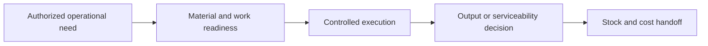
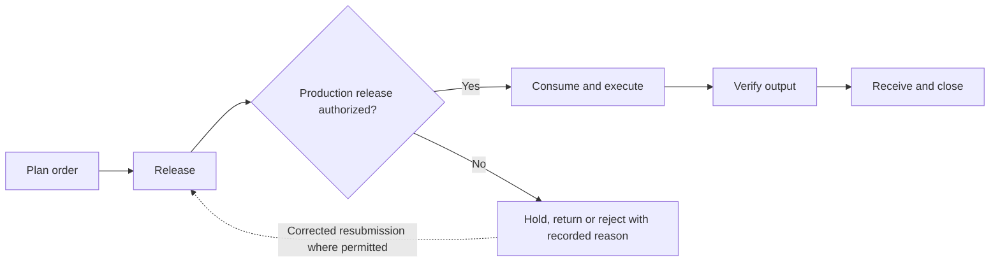
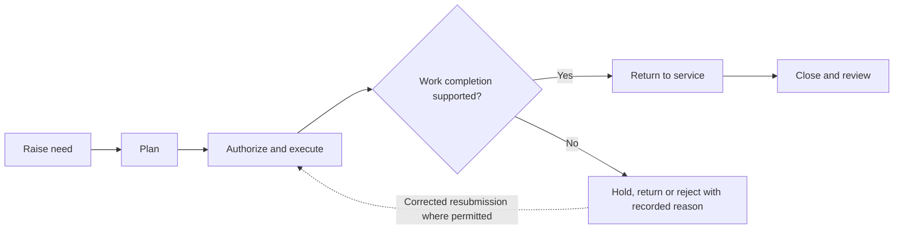

# athyper Operations — Business Capabilities & Workflow Design

**Edition:** September 2026  
**Audience:** business owners, tenant implementation teams, process designers and solution reviewers  
**Status:** business design baseline with scoped source findings; not a deployment acceptance record

[Series index](README.md)

## 1. Purpose and business outcomes

Control the execution of production and maintenance with explicit material, asset and acceptance evidence.

A supervisor should identify which production quantities were accepted and which equipment is authorized to return to service, independently of accounting completion.

This document covers every module in the selected workspace. The workflow diagrams, step tables, proposed controls, notifications and measures describe a business design for validation. They are not a claim that every step is implemented. Each module separately states the inspected foundation and the remaining gap. No module is designated as available in a qualified tenant deployment by this review.

**Shared prerequisites:** Governed items, components, assets, sites, suppliers, units and operational authorization rules.

**Ownership boundary:** Manufacturing owns production execution; Maintenance owns technical work. Inventory controls stock records and Assets & Facilities controls custody and location.

## 2. Module and capability map

| Module                                  | Business purpose                                                                                                | Evidence position                             |
| --------------------------------------- | --------------------------------------------------------------------------------------------------------------- | --------------------------------------------- |
| [Manufacturing](#module-mfg)            | Translate authorized production demand into controlled material consumption and completed output.               | Data foundation defined; workflow proposed    |
| [Maintenance Management](#module-maint) | Restore or preserve asset serviceability through controlled work, resource use and return-to-service decisions. | Supporting foundation only; workflow proposed |

A source implementation finding applies only to the named behavior in its module chapter. A supporting foundation can contain related records without containing the module-specific process. Proposed lifecycle labels below are business design states, not asserted application status values.

## 3. Workspace journey and responsibility

**Proposed end-to-end journey:**

At each handoff, the receiving owner checks scope, references and acceptance conditions. A completed sending step does not automatically authorize the next step. Return and rejection outcomes stay attached to the original business reference so that teams can resolve the cause without losing history.

## 4. Module workflows

### Manufacturing

**Purpose:** Translate authorized production demand into controlled material consumption and completed output.

**Responsible roles:** Production planner; supervisor; operator; quality reviewer.

**Business information and prerequisites:** Item, bill of materials, production order, component and inventory movement. The relevant tenant, company and operating scope must be identified before the workflow starts.

**Evidence position:** Data foundation defined; workflow proposed.

**Inspected foundation:** Bills of materials and production order/component structures are defined, including quantity/date and completion-evidence constraints. Inventory services provide supporting stock behavior.

**Remaining implementation boundary:** Capacity planning, shop-floor execution, quality release and full production costing need dedicated service qualification.

#### Capability catalogue and proposed lifecycle

| Business capability | Intended output             |
| ------------------- | --------------------------- |
| Plan order          | Production order proposal   |
| Release             | Released work instruction   |
| Consume and execute | Execution results           |
| Verify output       | Accepted output instruction |
| Receive and close   | Closed production record    |

The primary journey starts with **approved demand and item definition** and completes when **closed production record** is recorded by the responsible owner. Outstanding exceptions remain assigned; completion of this module does not imply completion of downstream work.

#### Workflow steps and exception handling

| Step                   | Responsible role   | Input                                    | Business action and decision                        | Output                      | Exception path                               |
| ---------------------- | ------------------ | ---------------------------------------- | --------------------------------------------------- | --------------------------- | -------------------------------------------- |
| 1. Plan order          | Production planner | Approved demand and item definition      | Select quantity, dates and component basis          | Production order proposal   | Resolve incomplete bill of materials         |
| 2. Release             | Supervisor         | Proposal and material readiness          | Authorize the applicable production scope           | Released work instruction   | Hold shortage or unavailable capacity        |
| 3. Consume and execute | Operator           | Authorized order and components          | Record actual consumption and work evidence         | Execution results           | Record scrap, shortage or interruption       |
| 4. Verify output       | Quality reviewer   | Completed quantity and required evidence | Confirm acceptance under defined criteria           | Accepted output instruction | Hold nonconforming output                    |
| 5. Receive and close   | Supervisor         | Accepted output and consumption          | Handoff movements to Inventory and costs to Finance | Closed production record    | Resolve residual components or cost variance |

An exception returns work to the named owner for correction or an explicit decision. A withdrawn proposal closes without executing its intended business effect. Once an effect is accepted, cancellation must use the applicable controlled correction or reversal path; it must not erase evidence. Exact commands and permitted transitions require implementation qualification.

#### Controls, responsibilities and tenant configuration

Production output, quality disposition and inventory receipt are different decisions; completed quantity requires evidence; substitutions and scrap require defined authority.

**Configuration decisions:** Bills of materials, units, production statuses, substitution rules, completion evidence and costing integration.

Approval amounts, response deadlines, reviewers and escalation paths must be agreed for the tenant; this design does not assume default thresholds or a universal approval chain.

#### Communications, documents and visibility

Proposed: release notice, material shortage, production interruption and quality-hold message.

Each enabled message should identify the business reference, intended recipient, required action and authorized navigation destination. Record access must still be checked when the recipient opens it. Delivery success is separate from approval.

**Proposed business measures:** Plan versus completed quantity; component variance; order delay; unresolved scrap. Agree the population, period, exclusions and responsible owner before turning these into performance targets. Existing dashboards are not implied.

#### Atlas AI and activation criteria

Proposed: explain material variance; no automatic production release or quality sign-off.

Before tenant activation, verify the module-specific gap above, publish the applicable process and permissions, and demonstrate a successful case plus its return, denial, stale-change and downstream-failure paths. Require reconciliation of the resulting business records and evidence.

### Maintenance Management

**Purpose:** Restore or preserve asset serviceability through controlled work, resource use and return-to-service decisions.

**Responsible roles:** Asset user; maintenance planner; technician; maintenance supervisor.

**Business information and prerequisites:** Asset, site, supplier, stock movement and service acceptance. The relevant tenant, company and operating scope must be identified before the workflow starts.

**Evidence position:** Supporting foundation only; workflow proposed.

**Inspected foundation:** Asset identity and purchasing/stock/service records provide supporting foundations.

**Remaining implementation boundary:** Dedicated maintenance plans, work orders, meter readings and preventive schedules were not identified in the inspected canonical inventory.

#### Capability catalogue and proposed lifecycle

| Business capability   | Intended output                   |
| --------------------- | --------------------------------- |
| Raise need            | Maintenance request               |
| Plan                  | Work proposal                     |
| Authorize and execute | Completed work evidence           |
| Return to service     | Serviceability decision           |
| Close and review      | Maintenance history and follow-up |

The primary journey starts with **fault or scheduled service requirement** and completes when **maintenance history and follow-up** is recorded by the responsible owner. Outstanding exceptions remain assigned; completion of this module does not imply completion of downstream work.

#### Workflow steps and exception handling

| Step                     | Responsible role          | Input                                  | Business action and decision                              | Output                            | Exception path                               |
| ------------------------ | ------------------------- | -------------------------------------- | --------------------------------------------------------- | --------------------------------- | -------------------------------------------- |
| 1. Raise need            | Asset user                | Fault or scheduled service requirement | Identify asset, impact and safe-work constraints          | Maintenance request               | Escalate urgent operational risk             |
| 2. Plan                  | Maintenance planner       | Request and resource needs             | Define work, parts, competence and downtime               | Work proposal                     | Hold missing parts or authorization          |
| 3. Authorize and execute | Supervisor and technician | Approved work scope                    | Perform permitted work and record labor/material evidence | Completed work evidence           | Record incomplete or changed scope           |
| 4. Return to service     | Authorized supervisor     | Inspection and completion evidence     | Confirm operational acceptance                            | Serviceability decision           | Keep asset unavailable if verification fails |
| 5. Close and review      | Maintenance planner       | Accepted work and costs                | Reconcile parts and external service charges              | Maintenance history and follow-up | Investigate repeat fault                     |

An exception returns work to the named owner for correction or an explicit decision. A withdrawn proposal closes without executing its intended business effect. Once an effect is accepted, cancellation must use the applicable controlled correction or reversal path; it must not erase evidence. Exact commands and permitted transitions require implementation qualification.

#### Controls, responsibilities and tenant configuration

Assets & Facilities owns custody and location; Operations owns technical work; asset retirement and financial write-off require separate authority. Safety procedures remain organization-specific prerequisites.

**Configuration decisions:** Maintenance types, safe-work requirements, technician authority, schedules, spares and acceptance rules.

Approval amounts, response deadlines, reviewers and escalation paths must be agreed for the tenant; this design does not assume default thresholds or a universal approval chain.

#### Communications, documents and visibility

Proposed: fault acknowledgement, work assignment, parts shortage and return-to-service notice.

Each enabled message should identify the business reference, intended recipient, required action and authorized navigation destination. Record access must still be checked when the recipient opens it. Delivery success is separate from approval.

**Proposed business measures:** Open work age; repeat faults; planned versus unplanned work; downtime with qualified event capture. Agree the population, period, exclusions and responsible owner before turning these into performance targets. Existing dashboards are not implied.

#### Atlas AI and activation criteria

Proposed: summarize work history; no autonomous safety clearance or equipment activation.

Before tenant activation, verify the module-specific gap above, publish the applicable process and permissions, and demonstrate a successful case plus its return, denial, stale-change and downstream-failure paths. Require reconciliation of the resulting business records and evidence.

## 5. Cross-module handoff contracts

These proposed handoff IDs are shared across the document series. They express business acceptance responsibilities, not a claim that an integration is already deployed.

| ID  | Owning modules                           | Required handoff                                                        | Receiving decision                                                | Exception ownership                                          |
| --- | ---------------------------------------- | ----------------------------------------------------------------------- | ----------------------------------------------------------------- | ------------------------------------------------------------ |
| H10 | Assets / Facilities → Maintenance        | Asset or site reference, fault/service need and operational constraints | Maintenance owner admits work and returns serviceability evidence | Keep unsafe, incomplete or unaccepted work unresolved        |
| H14 | Manufacturing → Inventory                | Authorized component consumption and accepted production output         | Inventory admits movement and reconciles quantity/value           | Hold failed output acceptance or inconsistent quantity       |
| H16 | Demand & Supply Planning → Manufacturing | Reviewed supply recommendation and assumptions                          | Production owner authorizes a production proposal                 | Return infeasible recommendation; no automatic order release |

Related workspace documents: [Supply Chain](supply-chain.md), [Assets & Facilities](assets-facilities.md).

## 6. Implementation workshop and acceptance

Use the module chapters as the business workshop agenda. Agree the owning roles, business objects, entry channels, decision rules, exception routes and handoffs before configuring an approval flow. Shared master-data governance, identity, documents and notifications are dependencies; their availability does not establish that a domain workflow is complete.

| Review topic                 | Concrete acceptance evidence                                                                                                          |
| ---------------------------- | ------------------------------------------------------------------------------------------------------------------------------------- |
| Scope and ownership          | A representative tenant/company scenario, named process owner and agreed scope exclusions.                                            |
| Workflow and state           | A demonstrated primary journey, return/rejection, cancellation and applicable correction with identifiable outcomes.                  |
| Access and evidence          | Unauthorized actions denied; restricted data withheld; decisions linked to the relevant actor, version and business reference.        |
| Cross-module processing      | The recipient accepts or rejects the handoff explicitly; interruption and retry do not create unexplained duplicate business effects. |
| Documents and communications | Eligible recipients can retrieve permitted evidence; failed delivery remains visible and does not imply a failed business save.       |
| Measures and AI              | Report definitions reconcile to accepted records; any enabled AI use case preserves scope, evidence limits and human authority.       |
| Deployment readiness         | The selected configuration, service connections and business journey have tenant-specific qualification evidence.                     |

The resulting workshop decisions should become versioned configuration and delivery acceptance records. This document remains the business design reference; it does not itself activate routes, publish policies, change data or authorize transactions.
