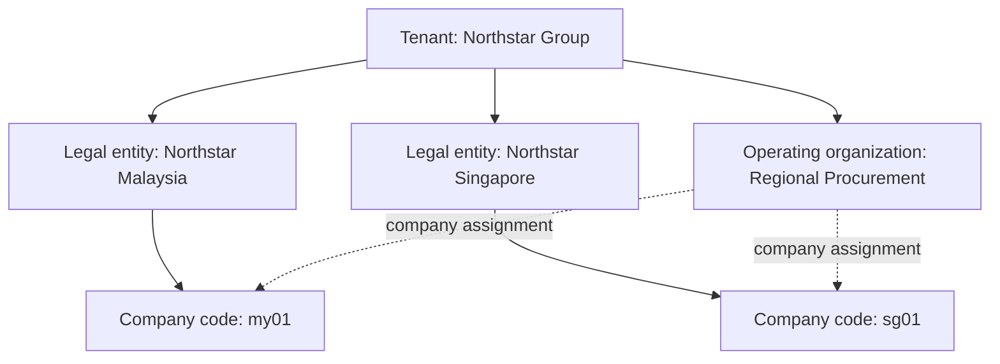

# athyper organization setup: business guide and data collection

Version 1.1 · 16 September 2026 · For business design and implementation workshops

This guide helps business owners agree how their enterprise will be represented in athyper and collect the information needed for setup. It covers the tenant, legal entities, company codes, operating organizations, and the assignments that connect operations to accounting.

Use the [Excel collection workbook](neon-organization-setup-data-collection.xlsx) during workshops. Blank CSV versions are in [templates](templates/). The [address, contact and master-defaults proposal](address-contact-defaults-proposal.md) explains the address/contact structure, supported purposes, recommended defaults and proposed improvements in business language. The workbook includes instructions, field guidance, example records, supporting decisions, access requirements and sign-off. These are collection templates, not executable imports.

The guide reflects the organization definitions and validation found in the current repository. It does not certify that a particular deployment has a complete setup screen, approval workflow or activated configuration. The setup and approval process below is a recommended business process. The implementation team must confirm the available setup route in the target environment.

## 1. Understand the four main concepts

| Concept | Plain-language explanation | Business question | Typical owner |
| --- | --- | --- | --- |
| Tenant | The application boundary within which an enterprise's data and configuration are organized and isolated. It can contain several legal entities. | Which enterprise workspace does this information belong to? | Enterprise sponsor and platform administrator |
| Legal entity | The representation of a legally recognized organization, with its official name, registration information and currencies. | Which legal organization is responsible? | Corporate administration / legal, with Finance |
| Company code | An accounting and balancing unit belonging to exactly one legal entity in the same tenant. | In which accounting unit will this transaction be recorded? | Finance controller |
| Operating organization | A unit that coordinates operational work, with optional procurement and sales profiles. It can serve several company codes through explicit assignments. | Which organization coordinates the buying or selling activity? | Procurement or sales owner |

A tenant is not automatically a legal entity. A legal entity may have more than one company code. An operating organization has its own hierarchy and company assignments; it is not simply the next level below a company code.

A department or reporting team can instead be an **organization unit**. Cost centers and profit centers are separate accounting responsibility records. Creating an operating organization does not automatically create these records or assign users to them.

## 2. How the structure fits together

The solid company-code links show legal ownership. The dotted links show operational participation. All records in this example belong to the same tenant. Cross-tenant cooperation requires separate design; these company assignments connect records within one tenant.

**Example:** Regional Procurement negotiates a supply agreement for both countries. A Malaysian purchase still needs the appropriate Malaysian company code for its accounting responsibility. The procurement organization's default currency or lead company does not replace the responsibility of the company on the transaction. Selecting an operating organization also does not by itself authorize a user to transact for every participating company.

The example names and codes in this pack are fictional workshop data, not existing tenants or configuration.

## 3. Decide what to create

| Situation | Decision to consider |
| --- | --- |
| Another registered organization joins the enterprise | Create a legal entity within the agreed tenant boundary; agree its company-code structure with Finance. |
| Finance needs a separate accounting and balancing unit | Consider another company code under the owning legal entity; document the accounting reason. |
| A shared buying team serves several companies | Consider one procurement operating organization with one assignment per participating company. |
| Buying and selling have the same operational ownership | Consider domain `both` and separate procurement and sales profiles if both behaviors are needed. |
| A team is only a department or management reporting unit | Consider an organization unit, cost center or profit center according to its purpose. |
| A separate customer workspace or isolation boundary is needed | Review tenant provisioning with the platform owner. A new country alone does not establish the need for another tenant. |

Start with the simplest structure that meets legal, accounting and operational requirements. Record the reason for each additional company code and operating organization. These are business design recommendations, not automatic system decisions.

## 4. Recommended setup sequence

| Step | Business action | Owner | Output |
| --- | --- | --- | --- |
| 1 | Agree enterprise boundary, scope, owners and intended launch date | Sponsor | Approved scope and tenant request |
| 2 | Collect tenant identity and regional preferences | Platform administrator with business owner | Tenant and tenant-profile data |
| 3 | Confirm official legal names, registrations and ownership hierarchy | Corporate administration / legal | Legal-entity register and evidence |
| 4 | Agree company codes, currencies, fiscal-year start and accounting dependencies | Finance | Company-code register and finance decisions |
| 5 | Define operating organizations, purpose, hierarchy and domains | Procurement / Sales | Operating-organization register |
| 6 | Assign participating companies and effective dates | Operations with Finance | Organization-to-company assignment register |
| 7 | Define procurement and sales profiles and default companies | Procurement / Sales with Finance | Profile settings |
| 8 | Agree access, approval responsibilities and supporting setup | Process owners with security administrator | Access requirements and dependency register |
| 9 | Validate the collected data, configure through the approved setup route and demonstrate representative journeys | Implementation team and business owners | Accepted configuration and evidence |

Create parent records before children. Establish tenant and legal-entity records before their company codes; create operating organizations and companies before their assignments and profiles.

**Default-company timing:** The current profile validation requires a selected lead, booking or invoicing company to have an active assignment effective on the day the profile is saved. A future-dated assignment alone does not satisfy that check. Agree when profiles will be configured; do not backdate membership simply to pass validation.

## 5. How to complete the collection workbook

Use one row per record. Refer to other sheets by their agreed business codes; the implementation team resolves those codes to system identifiers. Do not invent technical IDs. Preserve codes when exchanging revisions.

Columns ending in `*` are required for a complete workshop handover. This includes business decisions that the database may permit to be blank or defaulted. The Field Guide identifies the purpose of each column. Optional fields can be blank; record unresolved required decisions in the Decisions sheet with an owner and due date. Do not put placeholder text such as `TBC` in currency, date or code fields.

Use `YYYY-MM-DD` dates, two-letter country codes such as `MY`, three-letter currency codes such as `MYR`, and named time zones such as `Asia/Kuala_Lumpur`. Country, currency, locale and time-zone choices must exist in the target environment's reference catalogues. Use an end date only when an end is known. For company assignments, the end date is exclusive: an assignment ending `2027-01-01` does not apply on that date.

**Code rules:** Tenant codes have 2–63 characters, begin with a lowercase letter, and use lowercase letters, digits, underscores or hyphens. Legal-entity, company-code and operating-organization codes also allow periods. For example, use `my01`; a numeric-only code such as `1000` does not meet these definitions. Legal-entity, company-code and operating-organization codes must each be unique within their record type and tenant. Tenant codes are unique within their identity realm, which the platform administrator confirms.

### A. Tenant and preferences — one row per tenant

Collect the tenant code, name, display name, owner and target launch date. Confirm default country, locale, time zone, language and enabled languages with the business users. The tenant country is a presentation/operating default, not proof of legal registration or tax jurisdiction.

The current tenant locale policy supports `en`, `ar`, `ms`, `zh-Hans`, `hi`, `ta`, `fr` and `de`. English must remain enabled and is the fallback; the default locale must be among the enabled choices. Locale policy does not itself prove that all screens or business content are translated. Separate date/number display preferences and calendar preferences can be recorded on the Decisions sheet.

The platform administrator supplies the identity realm, canonical party link and applicable subscription during provisioning. Business users should supply an approved logo asset reference only if available, otherwise record the logo request as a decision. Never place credentials in the workbook.

### B. Legal entities — one row per legal entity

Collect the business code, familiar name, exact official legal name, entity type, registration country and number, incorporation date, functional currency, optional reporting currency and optional parent legal-entity code. Preserve supporting evidence references in the Decisions sheet.

Supported entity-type values are `company`, `group`, `division` and `legal_entity`. Have Corporate Administration confirm the correct classification: the availability of `division` does not mean every department is legally incorporated. Parent links represent the agreed hierarchy; they do not collect shareholding percentages or establish a consolidation policy.

Functional currency is the currency Finance identifies for the organization's primary economic activity. Reporting currency is the currency nominated for reporting. Finance must confirm the choices; the template does not calculate or determine them.

Registration details are included as required workshop information for registered organizations even though the database permits them to be absent. Record any justified exception in Decisions. Collect addresses and their owner/purpose usages on the Addresses and Address Usages sheets. Tax registrations and supporting documents require their own associated setup; do not substitute the tenant country for these details.

### C. Company codes — one row per accounting unit

Collect the code, name, owning legal-entity code, functional currency, country, fiscal-year start month, time zone and locale. Use months `1` through `12`. Record the accounting reason for the unit and any legacy-system reference.

A company code belongs to exactly one legal entity. Finance should explicitly review any difference between the company and legal entity's functional currencies. Do not assume that choosing a currency or fiscal start month completes the accounting setup.

Track chart of accounts, accounting books, fiscal periods, tax setup, exchange-rate arrangements, posting controls, bank-account usage, numbering, cost centers and profit centers as separate dependencies where applicable. Creating the company record alone does not make it ready to post or pay.

### D. Operating organizations — one row per coordination unit

Collect the code, name, purpose, domain, optional parent operating organization, owner and dates. Use `procurement`, `sales` or `both` for the procurement/sales scenarios in this pack. Confirm other intended domains with the implementation team rather than inventing a value.

An operating organization may have a procurement profile, a sales profile, or both when compatible with its domain. A domain label alone does not populate either profile. Procurement profiles require domain `procurement` or `both`; sales profiles require `sales` or `both`.

### E. Company assignments — one row per organization/company/date combination

Collect tenant, operating-organization code, company code, participation role, start date and optional end date. Roles are `lead` and `participant`. Record each participating company on its own row, including companies nominated in profiles.

Avoid duplicate assignments. The current data constraints prevent overlapping active periods for the same tenant, operating organization, company and participation role, and prohibit duplicate organization/company/start-date coordinates. As a business review rule, resolve conflicting roles or ambiguous lead responsibility even where a database rule would not reject them.

The assignment role `lead` and the procurement profile's default lead company are separate fields. Agree their consistency rather than assuming one automatically sets the other.

### F. Procurement and sales profiles — one row per applicable profile

For procurement, collect organization type, buying model, default currency and optional lead company. For sales, collect organization type, selling model, default currency, booking company and invoicing company where applicable. There is at most one profile of each kind per operating organization.

`Organization type` describes the agreed operational arrangement, for example `shared_services`. The source defaults buying and selling models to `federated`; confirm the intended model and the configured options with the implementation team. In business terms, document who negotiates, who places orders, who books sales and who invoices. A label alone does not define those responsibilities or approvals.

Profile default companies must be currently effective members of the operating organization when the profile is saved. Profile default currency is an operational preference and is distinct from a company's accounting currency. Booking and invoicing defaults may be separately specified; any cross-company process needs its own confirmed accounting and process design.

### G. Access, supporting decisions and sign-off

The Access sheet captures requested user/group responsibilities and tenant, legal-entity, company and operating-organization scope. It is a request register, not a permission grant. Review view, maintain, transact and approve needs separately; a person who can see an organization may not have authority to act for it.

Use the dedicated address/contact sheets for detailed collection, Master Defaults for setting decisions, and Decisions for tax evidence, finance dependencies, organizational units, approval rules and unresolved questions. Use Sign-off to record the version reviewed, approver, result and evidence. Owners, launch dates, approval references and decision notes are workshop controls; they are not automatically columns on the underlying organization records.

### H. Addresses, contacts and master defaults

Complete **Addresses** once per location and **Address Usages** once per organization/purpose using it. Collect street or postal lines, country, locality, postcode, building/unit and relevant delivery details. The same address may serve a legal entity and a company through separate approved usage links. Registered office and headquarters purposes are proposed catalogue additions; do not assume they are currently configured.

Complete **Contacts** for named people, **Contact Roles** for their business functions, and **Contact Channels** for email, phone, website or other supported channels. An organizational shared mailbox belongs directly to the organization and needs no invented person. Primary person, primary role and primary channel have different meanings. Channel timestamps require time-zone offsets; address and role validity use dates.

Complete **Master Defaults** to agree regional, financial and operational settings, their exact scope, permitted overrides and evidence. Existing master fields do not establish a universal inheritance chain. See the [business defaults proposal](address-contact-defaults-proposal.md) for the supported model, proposed purpose additions and default-selection rules.

## 6. Worked example

| Record | Code | Key settings |
| --- | --- | --- |
| Tenant | `northstar` | Northstar Group; default locale `en`; time zone `Asia/Kuala_Lumpur` |
| Legal entity | `northstar.my` | Northstar Malaysia Sdn. Bhd.; functional currency `MYR` |
| Legal entity | `northstar.sg` | Northstar Singapore Pte. Ltd.; functional currency `SGD` |
| Company code | `my01` | Owned by `northstar.my`; currency `MYR`; fiscal start month `1` |
| Company code | `sg01` | Owned by `northstar.sg`; currency `SGD`; fiscal start month `1` |
| Operating organization | `regional.buying` | Regional Procurement; domain `procurement` |
| Assignment | `regional.buying` → `my01` | Role `lead`; start `2026-01-01`; no end |
| Assignment | `regional.buying` → `sg01` | Role `participant`; start `2026-01-01`; no end |
| Procurement profile | `regional.buying` | Type `shared_services`; buying model `federated`; default currency `MYR`; lead company `my01` |

This example describes two legal and accounting responsibilities coordinated by one buying organization. An additional sales organization is needed only if the agreed sales operating model calls for it. The workbook's Examples sheet keeps illustrations separate from blank collection sheets.

## 7. Review checklist before configuration

- Every required field is completed or has a documented exception, owner and resolution date.
- Names and registration details match the supporting corporate records.
- Address details are complete, owner-purpose usages are approved, and primary contacts/channels are unambiguous for their validity periods.
- Required registered-office purposes and default-selection behavior are confirmed as configured, or tracked as gaps.
- Codes follow the format rules and references resolve within the same tenant.
- Every company has exactly one owning legal entity; currencies and fiscal start months have Finance review.
- Hierarchies have valid parents and no circular relationships.
- Effective end dates follow start dates; assignments have no duplicates or conflicting participation periods.
- Each profile matches the operating domain; default companies have current active membership.
- Finance, tax, banking, numbering and organizational dependencies have named owners.
- Access and approval requirements have been reviewed independently of organization membership.
- The target configuration has demonstrated agreed business journeys and scope restrictions.

Suggested demonstrations: a user can select an authorized operating organization and company; an unauthorized company is denied; expired membership is not usable; default companies are appropriate; and the configured purchasing or sales journey retains the intended company responsibility. Record actual outcomes and gaps rather than treating a completed spreadsheet as deployment acceptance.

## 8. Business approval and later changes

Corporate Administration signs off legal identity and hierarchy. Finance signs off company ownership, accounting currencies and accounting readiness. Procurement and Sales sign off operational responsibilities and company participation. The security owner signs off access design. The sponsor accepts scope and unresolved launch conditions. These are recommended responsibilities to adapt to the enterprise's governance.

Use the Sign-off sheet to capture: scope or record codes, pack version, reviewer role, reviewer name, decision, date, conditions and evidence reference. Collection decisions can be `pending`, `approved`, `approved_with_conditions` or `returned`; these are workbook review decisions, not application lifecycle states.

For later changes, record the old and proposed value, reason, effective date, affected transactions, owner and approval evidence in Decisions. Treat changes to legal ownership, accounting currencies or existing codes as controlled design changes with implementation impact assessment. Keep historical references and membership periods intact; do not overwrite them simply to represent a new operating arrangement.

The tenant source defines `provisioning`, `active`, `suspended` and `terminated`. Organization records define `draft`, `active`, `inactive`, `retired` and `archived`. These stored values do not establish a permitted approval sequence. Ask the implementation team to apply the approved lifecycle process in the target environment.

## Appendix: source basis for implementers

Reviewed against working-tree sources on 16 September 2026. No live environment was queried.

| Source | Basis |
| --- | --- |
| [Tenant and tenant profile](../../../server/db/ddl/common/master/03_platform_tables.sql) | Tenant boundary, names, code format, locale policy and lifecycle values |
| [Organization tables](../../../server/db/ddl/planes/neon/master/03_tables.sql) | Legal entities, company codes, operating organizations, profiles and assignments |
| [Organization domains](../../../server/db/ddl/planes/neon/master/02_domains.sql) | Legal entity types and organization statuses |
| [Relationships and constraints](../../../server/db/ddl/planes/neon/master/05_constraints.sql) | Same-tenant ownership, references and assignment overlap rules |
| [Profile validation](../../../server/db/ddl/planes/neon/master/07_functions.sql) | Profile/domain compatibility and current default-company membership |

The workbook includes field guidance for business collection. Technical identity, audit fields, canonical links and publication/provisioning details remain implementation responsibilities. Collection-only fields must not be silently treated as supported application settings.
