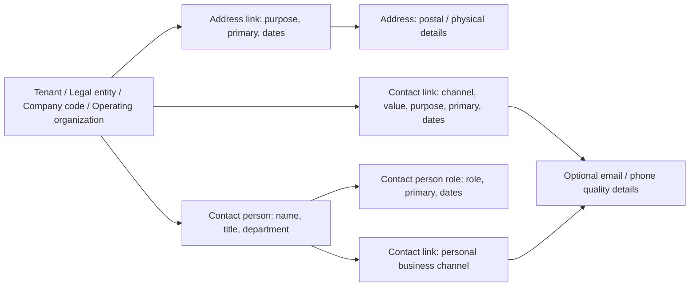

# Address, contact and master defaults: DDL review and proposal

Version 1.1 · 16 September 2026 · Business design proposal, based on repository DDL; no database changes applied

The organization model already supports addresses, organizational contact channels and named contacts. The original collection pack omitted their detailed capture. Reuse these existing records rather than adding address, email and telephone columns to each organization table. Extend the allowed purposes and default-selection behavior where the business requirement exceeds today's model.

“Existing” below means a field, relationship or constraint is present in source. It does not establish that every setup screen or consuming workflow is deployed. “Proposed” means configuration or behavior to implement and validate. A SQL insertion default, a business-selected primary record and an inherited transaction default are three different things.

## 1. Existing DDL model



Owner relationships use the registered owner type plus owner ID. They are validated against the owner registry and tenant, rather than represented by four separate foreign-key columns. The same address record can be linked to multiple owners and purposes with separate permissions for its use.

| Existing table | Relevant fields | Meaning |
| --- | --- | --- |
| `master.address` | Country, address kind, street/house/building/floor/unit, lines 1–3, locality/city/region/postcode, PO box, time zone, coordinates | Canonical physical/postal location; purpose and owner belong on its links. |
| `master.address_link` | Owner type/ID, address ID, purpose, role qualifier, attention line, primary flag, usage status, effective dates | Which organization uses the address and for what reason. |
| `master.contact_link` | Owner type/ID, channel type, value, purpose, role qualifier, primary flag, verification, status, effective timestamps | Canonical email, phone, fax, SMS, WhatsApp or website value. |
| `master.contact_person` | Owner type/ID, contact name, business title, department, primary flag, status | Named business contact; not an employee record or a login. |
| `master.contact_person_role` | Contact-person ID, role code, primary flag, effective dates | A person's function, such as procurement, accounts payable or legal. |
| `master.contact_email`, `master.contact_phone` | Channel quality, deliverability or enrichment | Supplementary details; do not duplicate the email/phone value here. |
| `control.owner_type`, `control.owner_type_purpose` | Owner capability flags and permitted purpose codes | Defines which owners and purposes are accepted. |

All four organization types are seeded as address/contact-capable. Named contacts can own contact channels, but their seeded owner type does not support addresses. Link an office address to the organization and use the address link's attention line when appropriate.

### Current purposes versus proposed purposes

| Owner | Seeded address purposes | Seeded contact purposes |
| --- | --- | --- |
| Tenant | `default`, `correspondence`, `bill_from`, `bill_to`, `ship_from`, `ship_to`, `place_of_service`, `remit_to` | `default`, `correspondence`, `notification`, `support` |
| Legal entity, company code, operating organization | `default`, `correspondence`, `bill_from`, `bill_to`, `ship_from`, `ship_to`, `remit_to` | `default`, `correspondence`, `notification` |
| Contact person | None | `default`, `business`, `notification`, `escalation` |

**Proposed additions:** `registered` for legal-entity registered offices; `headquarters` for tenant/legal-entity presentation where needed; and `support` for organization owners that need it. Add explicit owner-purpose catalogue entries through the normal controlled configuration route. These labels are not accepted merely because the text field can hold them. Do not treat `default` as proof that an address is the statutory registered office.

Contact-person role codes already include `procurement`, `sales`, `finance`, `accounts_payable`, `accounts_receivable`, `legal`, `tax`, `logistics`, `support` and `escalation`. A contact role is distinct from a contact-channel purpose: for example, a person has role `accounts_payable` and an email channel with purpose `business`.

## 2. Business collection requirements

The revised workbook adds six sheets:

| Sheet | One row represents | Information to collect |
| --- | --- | --- |
| Addresses | One address | Collection reference, country, kind, street/lines, locality, region, postcode, building/unit, PO box, time zone and optional coordinates. |
| Address Usages | One owner/address/purpose usage | Organization type/code, address reference, purpose, qualifier, attention, requested primary flag, start/end dates and reviewer. |
| Contacts | One named contact belonging to an organization | Collection reference, owner type/code, name, title, department, requested primary flag and reviewer. |
| Contact Roles | One contact/role/date assignment | Contact reference, role code, primary-role flag and dates. |
| Contact Channels | One channel for an organization or named contact | Owner type/code or contact reference, channel type/value, purpose, qualifier, primary flag and start/end timestamps. |
| Master Defaults | One proposed default decision | Scope, setting, value/reference, inheritance/override decision, dates, evidence and owner. This is a design register, not a generic database settings table. |

Address/contact collection references are workbook identifiers, not existing `code` columns on those tables. Implementers map them to generated IDs. Use separate usage rows to reuse an address; do not repeat the postal details merely because another company uses the same building.

For street addresses, collect enough detail for actual delivery, not just the minimum accepted by DDL. The address country is mandatory, but the current content constraint does not require a usable street/city combination beyond that mandatory country. Country-specific required fields and postal validation therefore need business/application validation. For `po_box`, collect the PO-box number. Coordinates must be supplied as a pair.

Address usage dates and contact-role dates use `YYYY-MM-DD`; contact-channel validity uses timestamps with time-zone offsets, such as `2026-10-01T09:00:00+08:00`. Treat end points as exclusive in the proposed selection policy. Do not conflate a primary person, a primary role for that person and a primary email/phone for a purpose.

Start address verification as `unverified` and contact verification as false. Verification requires evidence and system processing. Data collectors do not fill hashes, signatures, validation providers or audit IDs. Activation remains a separate controlled step even where a link table's SQL insertion default is active.

## 3. What defaults should be set at each master level?

The recommended values are decisions to collect, not universal values to install for all tenants.

| Level | Defaults / core settings | Existing storage | Recommendation and boundary |
| --- | --- | --- | --- |
| Tenant | Country, time zone, locale, language | `tenant_profile` | Agree enterprise presentation defaults. A missing profile preference may inherit the plane/platform default; do not use country as a tax rule. |
| Tenant | Enabled/default/fallback locales | `tenant_profile` | Choose supported locales; English remains enabled and fallback. |
| Tenant | Date format, number format, week start, weekend days | `tenant_profile` | Collect user-facing formats and calendar preferences. These are not a statutory or payroll working calendar. |
| Tenant | Display name and logo | `tenant`, `tenant_profile` | Agree enterprise branding; use managed logo references. |
| Tenant | General address, email, phone, support contact | Address/contact owner links | Select primary values per purpose/channel. Headquarters purpose is proposed where an explicit distinction is needed. |
| Legal entity | Legal identity, registration country, functional and reporting currencies | `legal_entity` | Explicit approved facts; never silently inherit legal identity or functional currency. |
| Legal entity | Display name/logo | `legal_entity` | Legal-context branding; any tenant-logo fallback must be explicitly designed in the consuming UI. |
| Legal entity | Registered office, correspondence address, legal/tax contact | Address/contact links and named-contact roles | Collect directly for this legal entity; add `registered` purpose. Do not silently fall back to another entity or tenant. |
| Legal entity / company | Tax-registration selection | `organization_tax_registration` with jurisdiction, type, dates and primary flag | Choose within the relevant jurisdiction/type/company context. No global tax rate or universal registration default. |
| Company code | Functional currency, country, fiscal-year start month, time zone, locale | `company_code` | Finance confirms currency/month; company locale/time zone can be explicitly populated from approved tenant preferences during setup. No general inheritance resolver is established by these columns. |
| Company code | Bill-from, bill-to and remit-to address; finance contact | Address/contact owner links | Set explicit company usages; reuse a legal-entity address through another approved link when appropriate. |
| Company code | Chart of accounts and accounting books | `company_code_chart_assignment`, `company_code_book_assignment` | Assign applicable charts/books, primary chart by assignment type and book priority/strategy. They are not one generic ledger-default field. |
| Company code | Additional accounting dimension defaults and override rules | `company_code_dimension_default` | Set by dimension type with dates, mandatory flag and override flag. Cost/profit centers remain separate masters. |
| Company + GL account | Cost-center/site suggestion; required cost/profit/project dimensions and posting controls | `company_code_gl_account` | Configure at the relevant account scope, not indiscriminately across the company. |
| Company / legal-entity bank relationship | Primary bank relationship; collection/disbursement defaults | `bank_account_link`, `bank_account_house_config` | Select eligible banks by owner/company/purpose; default selection does not authorize payment. |
| Supplier + company | Transaction currency, payment term, accounting profile, remittance bank link, dimension set | `company_code_supplier_profile` | Set negotiated company-specific supplier terms. These are not company-wide defaults for all suppliers. |
| Customer + company | Transaction currency, payment term, accounting profile, dimension set, statement cycle | `company_code_customer_profile` | Set agreed customer terms. A company-level proposal must not overwrite them. |
| Operating organization | Operational office, correspondence contact, buying/sales contacts | Address/contact links and named-contact roles | Select primary office/channels for operations; do not infer accounting or legal responsibility. |
| Procurement profile | Organization type, buying model, default currency, lead company | `procurement_organization_profile` | Confirm model; `federated` is the source insertion default. Lead company must be a currently effective active member on save. |
| Sales profile | Organization type, selling model, default currency, booking/invoicing companies | `sales_organization_profile` | Confirm models and responsibility; profile companies must be currently effective active members on save. |
| Platform configuration | Typed tenant-overridable parameters | `control.parameter_definition`, `control.tenant_parameter_value` | Use registered definitions and their override rules for platform parameters. Do not duplicate typed business masters in arbitrary metadata. |

### Candidate additions requiring design, not claimed existing organization settings

| Candidate | Recommended scope | Proposed handling |
| --- | --- | --- |
| Baseline AP/AR terms and accounting profiles for onboarding new partners | Company + AP/AR direction | Add a typed, versioned company commercial-default profile only if a company-wide requirement is approved; copy approved defaults into new partner-company proposals. |
| Operational delivery location / warehouse preference | Organization + company + process, with site/warehouse context | Resolve against eligible locations; an operating organization can serve multiple companies, so avoid an unqualified global ship-to. |
| Delivery terms, shipping method, incoterms and document language | Appropriate procurement/sales process and partner/contract context | Confirm existing capability-owned configuration before adding fields; these are not columns on the reviewed organization profiles. |
| FX rate type/source, payment method, rounding and tolerance policies | Finance/payment policy scope | Use capability-owned versioned policy. Do not bury authoritative settings in organization metadata. |
| Numbering, document templates, approval routes and reminders | Document/process/company scope | Configure with the respective numbering, document and workflow services. Contact defaults do not establish an approval route. |
| Notification contact fallback and address-selection policy | Named process with allowed owner/purpose/channel scope | Specify resolution order and blocked/missing behavior; implement and test consumers. Source links alone do not provide an inheritance engine. |

## 4. Proposed default-selection rules

Do not implement one universal `tenant → legal entity → company → operating organization` override chain. Operational and legal/accounting structures are different dimensions.

1. **Presentation:** use the relevant allowed user/company preference, then the tenant presentation preference, then the plane/platform default. Confirm each consumer's supported preference chain before claiming this behavior exists.
2. **Registered legal identity/address:** resolve only against the selected legal entity and required purpose at the relevant date. Missing approved information requires completion; no cross-entity fallback.
3. **Company document address:** use an explicit approved document selection, otherwise the current primary usage for the selected company and exact purpose. Reuse a legal-entity location via an explicit company link. Ship-to requires delivery context and eligibility.
4. **Commercial terms:** an approved transaction/contract rule may override partner-company terms where permitted; then use approved partner-company values; use a proposed company onboarding baseline only where defined. Never substitute functional currency for negotiated transaction currency by accident.
5. **Contacts:** resolve a permitted explicit recipient or the designated owner/role/channel/purpose. A named person's primary role does not make that person the primary contact for that role across the whole organization. Ambiguity must be surfaced.
6. **Status and dates first:** only eligible, effective, permitted records can be candidates. Suspended/prohibited usage must not be bypassed by trying a less specific address. If more than one valid primary remains, return a configuration error rather than pick arbitrarily.
7. **Traceability:** show the selected value and its source, allow overrides only by policy, revalidate before use, and preserve the relevant value/reference in accepted document history according to that document's model. Later master changes should not silently rewrite issued documents.

These rules are proposed behavior. They require consumer implementation and acceptance evidence.

## 5. DDL/configuration changes proposed

| Priority | Proposed change | Why / required safeguards |
| --- | --- | --- |
| P1 | Reuse address/link/contact/person/role tables; expose them in organization setup and data collection | Avoid duplicated address/email columns and inconsistent updates. Preserve tenant validation, allowed purposes, normalized address identity and audit processing. |
| P1 | Add approved owner-purpose entries for `registered`, optionally `headquarters` and organization `support` | DDL currently validates permitted purposes; a free-text label cannot bypass the registry. Limit additions to intended owners. |
| P1 | Enforce complete country-appropriate address data before operational use | Current country-required DDL is insufficient to guarantee deliverable/registered address content. Treat address validation and permitted usage separately. |
| P1 | Add temporal primary-channel conflict enforcement | The current contact-channel index only ensures uniqueness among active, open-ended primary rows. Bounded or future periods can conflict. Add a date-range exclusion after auditing existing rows. |
| P2 | Define role-based organizational contact routing | Current role-primary uniqueness is per person, not per owner and role. If one primary AP contact per company is required, add an explicit role-routing assignment or a validated service rule, with owner/role/time overlap protection. |
| P2 | Add a typed company commercial-default profile if needed | Existing supplier/customer company profiles are partner-specific. Proposed company baseline needs same-tenant FKs, direction, currency/term/accounting-profile references, effective dates, lifecycle, audit, RLS and no-overlap constraints; do not overwrite negotiated terms. |
| P2 | Implement scoped selection and provenance | Address/contact fields and primary flags are storage, not automatic propagation to documents or notification workflows. |

**Illustrative SQL shape — proposal only, not a runnable migration pack:**

```sql
-- Proposed addition after data-conflict remediation and migration review.
-- Uses the same btree_gist capability already required by existing exclusions.
ALTER TABLE master.contact_link
  ADD CONSTRAINT contact_link_primary_period_excl
  EXCLUDE USING gist (
    tenant_id WITH =,
    owner_type_id WITH =,
    owner_id WITH =,
    channel_type WITH =,
    purpose WITH =,
    COALESCE(role_qualifier, '') WITH =,
    tstzrange(effective_from, effective_until, '[)') WITH &&
  ) WHERE (is_primary AND status = 'active');
```

Future migrations must account for existing indexes, conflicting historical data and affected write paths. Do not apply this fragment directly as an approved migration. No DDL, registry entries or runtime behavior were changed in this documentation revision.

Other existing semantics to preserve: address primary exclusion includes suspended/prohibited usages unless cancelled; an additional open-ended primary-address index can also prevent replacements until the earlier link is ended. Address identity is guarded by triggers, so a move or correction must use the established address-change path rather than directly rewriting a shared address. Finance assignment tables do not all use the same date conventions as address links; consumers must respect each capability's contract.

## 6. Recommended first-pass business defaults

Collect a primary correspondence address and organizational email/phone where relevant at each owner level; require a separately approved registered office for each applicable legal entity. Capture legal/tax contacts at legal entity, finance/AP/AR contacts at company, and buying/sales contacts at operating organization. A shared mailbox can be an organization-owned contact channel without a fictitious contact person.

Set tenant presentation preferences explicitly. Set legal/entity accounting currencies and company fiscal settings only after Finance review. Configure operational currency and default companies only where required. Leave optional bank, tax, payment and posting selections unset until their eligible scope and evidence are agreed. Use draft/unverified intake where supported; do not promote a record to verified or authorized simply because it is marked primary.

## Source references

- [Shared tenant/address/contact DDL](../../../../server/db/ddl/common/master/03_platform_tables.sql)
- [Named contact and role DDL](../../../../server/db/ddl/common/master/03_tables.sql), [named contact indexes](../../../../server/db/ddl/common/master/06_indexes.sql), [contact-person owner purposes](../../../../server/db/ddl/common/master/12_contact_person_reference_seed.sql)
- [Organization/finance master DDL](../../../../server/db/ddl/planes/neon/master/03_tables.sql)
- [Neon owner registry and purposes](../../../../server/db/ddl/planes/neon/control/12_reference_seed.sql), [contact role catalogue](../../../../server/db/ddl/common/control/lookup-packs/12_operations_core_seed.sql)
- [Neon relationship constraints](../../../../server/db/ddl/planes/neon/master/05_constraints.sql), [Neon primary indexes](../../../../server/db/ddl/planes/neon/master/06_indexes.sql), [owner/profile validation](../../../../server/db/ddl/planes/neon/master/07_functions.sql)
- [Shared address/contact validation](../../../../server/db/ddl/common/master/07_functions.sql), [parameter definitions](../../../../server/db/ddl/common/control/03_tables.sql)
