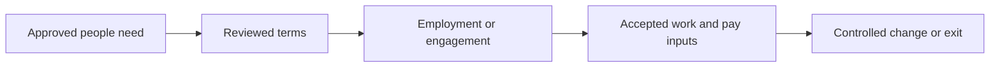
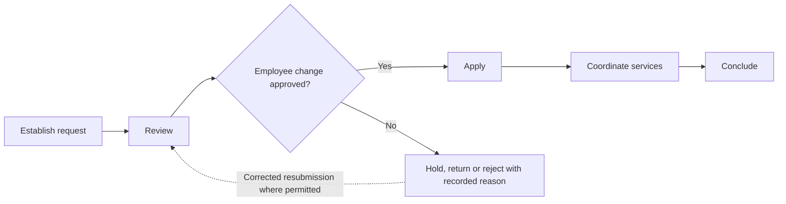
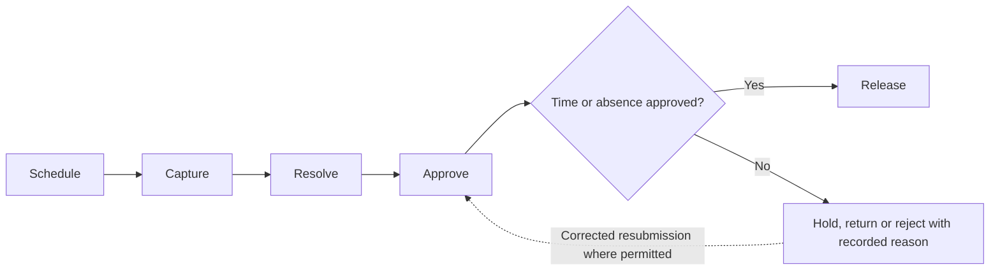
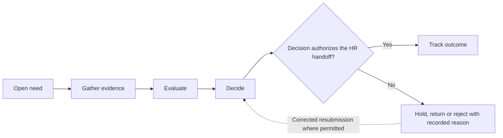
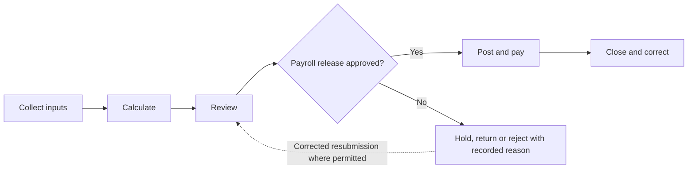
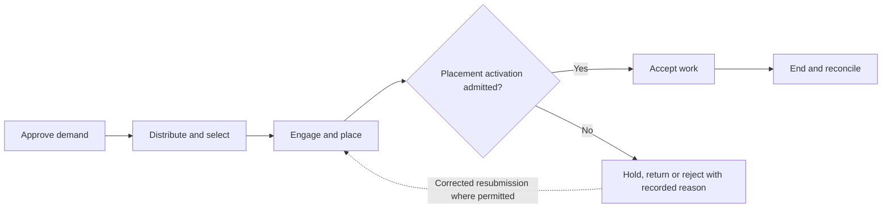

# athyper People — Business Capabilities & Workflow Design

**Edition:** September 2026  
**Audience:** business owners, tenant implementation teams, process designers and solution reviewers  
**Status:** business design baseline with scoped source findings; not a deployment acceptance record

[Series index](README.md)

## 1. Purpose and business outcomes

Coordinate employment, talent, attendance, payroll and external engagements while preserving person and access boundaries.

An HR owner completing a departure should see employment ending, access-removal work and outstanding pay or external-service obligations as separate outcomes.

This document covers every module in the selected workspace. The workflow diagrams, step tables, proposed controls, notifications and measures describe a business design for validation. They are not a claim that every step is implemented. Each module separately states the inspected foundation and the remaining gap. No module is designated as available in a qualified tenant deployment by this review.

**Shared prerequisites:** Person identity, employment organizations, positions, calendars, pay groups, suppliers for contingent work and restricted information policies.

**Ownership boundary:** HR owns employment; Workforce owns external engagement and placement; IAM owns access execution; Finance owns payment. A supplier-provided person is not a supplier organization.

## 2. Module and capability map

| Module                                  | Business purpose                                                                                                             | Evidence position                                    |
| --------------------------------------- | ---------------------------------------------------------------------------------------------------------------------------- | ---------------------------------------------------- |
| [Core Human Resources](#module-hr)      | Maintain an accurate employment relationship and controlled employee changes throughout the employment lifecycle.            | Data foundation defined; workflow proposed           |
| [Time & Attendance](#module-tna)        | Collect work and absence evidence, resolve exceptions and release reviewed inputs to payroll and costing.                    | Data foundation defined; workflow proposed           |
| [Talent Management](#module-tal)        | Coordinate recruitment and development decisions with explicit review and a controlled handoff to employment administration. | Supporting foundation only; workflow proposed        |
| [Payroll](#module-payroll)              | Transform reviewed employment and time inputs into a controlled payroll result and settlement handoff.                       | Data foundation defined; workflow proposed           |
| [External Workforce](#module-workforce) | Govern supplier-provided people from approved demand through engagement, placement, time acceptance and exit.                | Source implementation present; activation unverified |

A source implementation finding applies only to the named behavior in its module chapter. A supporting foundation can contain related records without containing the module-specific process. Proposed lifecycle labels below are business design states, not asserted application status values.

## 3. Workspace journey and responsibility

**Proposed end-to-end journey:**

At each handoff, the receiving owner checks scope, references and acceptance conditions. A completed sending step does not automatically authorize the next step. Return and rejection outcomes stay attached to the original business reference so that teams can resolve the cause without losing history.

## 4. Module workflows

### Core Human Resources

**Purpose:** Maintain an accurate employment relationship and controlled employee changes throughout the employment lifecycle.

**Responsible roles:** HR administrator; employee; line manager; HR reviewer.

**Business information and prerequisites:** Person, employee, employment, position, assignment, compensation and HR case. The relevant tenant, company and operating scope must be identified before the workflow starts.

**Evidence position:** Data foundation defined; workflow proposed.

**Inspected foundation:** Employment, position, work assignment, compensation and people-case structures are defined.

**Remaining implementation boundary:** End-to-end hiring, transfer, compensation and departure workflows remain subject to implementation and activation review.

#### Capability catalogue and proposed lifecycle

| Business capability | Intended output                 |
| ------------------- | ------------------------------- |
| Establish request   | People request                  |
| Review              | Approved change                 |
| Apply               | Effective employment state      |
| Coordinate services | Assigned downstream work        |
| Conclude            | Closed case or ended employment |

The primary journey starts with **approved hiring or employee-change need** and completes when **closed case or ended employment** is recorded by the responsible owner. Outstanding exceptions remain assigned; completion of this module does not imply completion of downstream work.

#### Workflow steps and exception handling

| Step                   | Responsible role | Input                                    | Business action and decision                              | Output                          | Exception path                                  |
| ---------------------- | ---------------- | ---------------------------------------- | --------------------------------------------------------- | ------------------------------- | ----------------------------------------------- |
| 1. Establish request   | HR administrator | Approved hiring or employee-change need  | Identify person, employing company and effective date     | People request                  | Resolve duplicate identity or missing authority |
| 2. Review              | HR reviewer      | Request and sensitive evidence           | Check employment terms, position and access scope         | Approved change                 | Return conflicting dates or incomplete evidence |
| 3. Apply               | HR operator      | Approved current request                 | Create or update employment and assignment records        | Effective employment state      | Reject stale or overlapping change              |
| 4. Coordinate services | Line manager     | Accepted change                          | Request applicable access, payroll and onboarding actions | Assigned downstream work        | Track incomplete downstream action              |
| 5. Conclude            | HR reviewer      | Completion evidence or departure request | Confirm required tasks and retained employment history    | Closed case or ended employment | Hold unresolved obligations                     |

An exception returns work to the named owner for correction or an explicit decision. A withdrawn proposal closes without executing its intended business effect. Once an effect is accepted, cancellation must use the applicable controlled correction or reversal path; it must not erase evidence. Exact commands and permitted transitions require implementation qualification.

#### Controls, responsibilities and tenant configuration

Person identity, employment and application access are separate; sensitive data needs restricted disclosure; ending employment requires an explicit access-removal handoff.

**Configuration decisions:** Employment types, effective-date rules, positions, sensitive-field access, approvals and downstream ownership.

Approval amounts, response deadlines, reviewers and escalation paths must be agreed for the tenant; this design does not assume default thresholds or a universal approval chain.

#### Communications, documents and visibility

Proposed: employee/manager tasks, change decisions and departure reminders; protected employment details stay out of broad notifications.

Each enabled message should identify the business reference, intended recipient, required action and authorized navigation destination. Record access must still be checked when the recipient opens it. Delivery success is separate from approval.

**Proposed business measures:** Pending employee changes; onboarding task age; effective-date exceptions; incomplete departure tasks. Agree the population, period, exclusions and responsible owner before turning these into performance targets. Existing dashboards are not implied.

#### Atlas AI and activation criteria

Proposed: explain authorized request requirements; no hiring, dismissal or compensation decision authority.

Before tenant activation, verify the module-specific gap above, publish the applicable process and permissions, and demonstrate a successful case plus its return, denial, stale-change and downstream-failure paths. Require reconciliation of the resulting business records and evidence.

### Time & Attendance

**Purpose:** Collect work and absence evidence, resolve exceptions and release reviewed inputs to payroll and costing.

**Responsible roles:** Employee; attendance supervisor; line manager; payroll operator.

**Business information and prerequisites:** Shift, work pattern, time punch, attendance day, adjustment, leave request and balance. The relevant tenant, company and operating scope must be identified before the workflow starts.

**Evidence position:** Data foundation defined; workflow proposed.

**Inspected foundation:** Shift, attendance, adjustment and leave records are defined.

**Remaining implementation boundary:** Time interpretation, overtime calculations, device feeds and approval-to-payroll integration were not verified end to end.

#### Capability catalogue and proposed lifecycle

| Business capability | Intended output              |
| ------------------- | ---------------------------- |
| Schedule            | Published schedule           |
| Capture             | Time or leave submission     |
| Resolve             | Reviewed correction proposal |
| Approve             | Approved time basis          |
| Release             | Released time package        |

The primary journey starts with **work pattern and staffing need** and completes when **released time package** is recorded by the responsible owner. Outstanding exceptions remain assigned; completion of this module does not imply completion of downstream work.

#### Workflow steps and exception handling

| Step        | Responsible role      | Input                                | Business action and decision                           | Output                       | Exception path                     |
| ----------- | --------------------- | ------------------------------------ | ------------------------------------------------------ | ---------------------------- | ---------------------------------- |
| 1. Schedule | Attendance supervisor | Work pattern and staffing need       | Assign applicable shifts and calendar                  | Published schedule           | Resolve conflicting assignment     |
| 2. Capture  | Employee              | Actual attendance or absence request | Record time evidence or request leave                  | Time or leave submission     | Flag missing or inconsistent entry |
| 3. Resolve  | Supervisor            | Exceptions and balance context       | Investigate missed punch, overlap or leave eligibility | Reviewed correction proposal | Request additional evidence        |
| 4. Approve  | Line manager          | Current submission and correction    | Confirm worked time or authorized absence              | Approved time basis          | Return unsupported hours           |
| 5. Release  | Payroll operator      | Approved period inputs               | Freeze applicable input version for pay and costing    | Released time package        | Hold late or unresolved entry      |

An exception returns work to the named owner for correction or an explicit decision. A withdrawn proposal closes without executing its intended business effect. Once an effect is accepted, cancellation must use the applicable controlled correction or reversal path; it must not erase evidence. Exact commands and permitted transitions require implementation qualification.

#### Controls, responsibilities and tenant configuration

Approved hours and calculated pay are distinct; preserve corrections and their reasons; payroll cutoffs should not silently erase late evidence.

**Configuration decisions:** Calendars, shifts, leave policies, overtime rules, cutoffs, approval hierarchy and device integration.

Approval amounts, response deadlines, reviewers and escalation paths must be agreed for the tenant; this design does not assume default thresholds or a universal approval chain.

#### Communications, documents and visibility

Proposed: missing-time reminder, leave decision, correction request and cutoff notice.

Each enabled message should identify the business reference, intended recipient, required action and authorized navigation destination. Record access must still be checked when the recipient opens it. Delivery success is separate from approval.

**Proposed business measures:** Missing submissions; adjustment age; approved overtime where defined; late payroll inputs. Agree the population, period, exclusions and responsible owner before turning these into performance targets. Existing dashboards are not implied.

#### Atlas AI and activation criteria

Proposed: summarize time exceptions; no autonomous attendance approval or statutory compliance conclusion.

Before tenant activation, verify the module-specific gap above, publish the applicable process and permissions, and demonstrate a successful case plus its return, denial, stale-change and downstream-failure paths. Require reconciliation of the resulting business records and evidence.

### Talent Management

**Purpose:** Coordinate recruitment and development decisions with explicit review and a controlled handoff to employment administration.

**Responsible roles:** Recruiter; hiring manager; talent reviewer; HR administrator.

**Business information and prerequisites:** Person, position, job, onboarding and offboarding case. The relevant tenant, company and operating scope must be identified before the workflow starts.

**Evidence position:** Supporting foundation only; workflow proposed.

**Inspected foundation:** Jobs, positions and lifecycle case records provide supporting foundations.

**Remaining implementation boundary:** Dedicated applicant, performance-review, learning and succession models were not identified in the inspected inventory. Those capabilities are proposed rather than inferred from HR tables.

#### Capability catalogue and proposed lifecycle

| Business capability | Intended output         |
| ------------------- | ----------------------- |
| Open need           | Talent request          |
| Gather evidence     | Review package          |
| Evaluate            | Recommendation          |
| Decide              | Decision and HR handoff |
| Track outcome       | Completion evidence     |

The primary journey starts with **approved position or development need** and completes when **completion evidence** is recorded by the responsible owner. Outstanding exceptions remain assigned; completion of this module does not imply completion of downstream work.

#### Workflow steps and exception handling

| Step               | Responsible role         | Input                                 | Business action and decision                 | Output                  | Exception path                            |
| ------------------ | ------------------------ | ------------------------------------- | -------------------------------------------- | ----------------------- | ----------------------------------------- |
| 1. Open need       | Hiring manager           | Approved position or development need | Define objectives, scope and review criteria | Talent request          | Return unapproved position                |
| 2. Gather evidence | Recruiter or coordinator | Candidate or development information  | Collect permitted evidence against criteria  | Review package          | Restrict sensitive or incomplete evidence |
| 3. Evaluate        | Authorized reviewer      | Current package                       | Record accountable human assessment          | Recommendation          | Resolve conflict of interest              |
| 4. Decide          | Decision owner           | Recommendation and authority          | Approve selection or development action      | Decision and HR handoff | Reject or return with reason              |
| 5. Track outcome   | HR administrator         | Accepted decision                     | Coordinate onboarding or planned follow-up   | Completion evidence     | Escalate unfinished action                |

An exception returns work to the named owner for correction or an explicit decision. A withdrawn proposal closes without executing its intended business effect. Once an effect is accepted, cancellation must use the applicable controlled correction or reversal path; it must not erase evidence. Exact commands and permitted transitions require implementation qualification.

#### Controls, responsibilities and tenant configuration

Hiring and performance decisions remain human-owned; employee and candidate disclosure boundaries differ; proposed development workflows require their own definitions.

**Configuration decisions:** Criteria, reviewer roles, candidate consent, retention, decision authority and HR handoff.

Approval amounts, response deadlines, reviewers and escalation paths must be agreed for the tenant; this design does not assume default thresholds or a universal approval chain.

#### Communications, documents and visibility

Proposed: interview/review invitations, decision communication and onboarding tasks; do not disclose comparative assessments broadly.

Each enabled message should identify the business reference, intended recipient, required action and authorized navigation destination. Record access must still be checked when the recipient opens it. Delivery success is separate from approval.

**Proposed business measures:** Decision lead time; pending reviews; onboarding completion; development follow-up where implemented. Agree the population, period, exclusions and responsible owner before turning these into performance targets. Existing dashboards are not implied.

#### Atlas AI and activation criteria

Proposed: summarize authorized evidence or draft interview questions; no automatic candidate ranking, hiring or employee scoring.

Before tenant activation, verify the module-specific gap above, publish the applicable process and permissions, and demonstrate a successful case plus its return, denial, stale-change and downstream-failure paths. Require reconciliation of the resulting business records and evidence.

### Payroll

**Purpose:** Transform reviewed employment and time inputs into a controlled payroll result and settlement handoff.

**Responsible roles:** Payroll preparer; payroll reviewer; HR owner; treasury operator.

**Business information and prerequisites:** Payroll period, run, employee result, result line, pay structure and tax declaration. The relevant tenant, company and operating scope must be identified before the workflow starts.

**Evidence position:** Data foundation defined; workflow proposed.

**Inspected foundation:** Payroll periods, runs, result lines, pay configuration and declaration records are defined.

**Remaining implementation boundary:** A qualified payroll calculation engine, jurisdiction rules, payslip delivery and filing integrations were not established by the inspected source.

#### Capability catalogue and proposed lifecycle

| Business capability | Intended output              |
| ------------------- | ---------------------------- |
| Collect inputs      | Payroll input package        |
| Calculate           | Proposed pay results         |
| Review              | Approved payroll result      |
| Post and pay        | Posting and payment outcomes |
| Close and correct   | Final period evidence        |

The primary journey starts with **employment, compensation and approved time** and completes when **final period evidence** is recorded by the responsible owner. Outstanding exceptions remain assigned; completion of this module does not imply completion of downstream work.

#### Workflow steps and exception handling

| Step                 | Responsible role     | Input                                      | Business action and decision                        | Output                       | Exception path                              |
| -------------------- | -------------------- | ------------------------------------------ | --------------------------------------------------- | ---------------------------- | ------------------------------------------- |
| 1. Collect inputs    | Payroll preparer     | Employment, compensation and approved time | Select pay group, period and input cutoff           | Payroll input package        | Hold missing or conflicting employment data |
| 2. Calculate         | Payroll operator     | Reviewed input and configured rules        | Run the qualified calculation when available        | Proposed pay results         | Quarantine failed calculation               |
| 3. Review            | Payroll reviewer     | Results and prior-period comparison        | Resolve anomalies and authorize release             | Approved payroll result      | Return unexpected deduction or net pay      |
| 4. Post and pay      | Finance and Treasury | Approved result                            | Record accounting and execute authorized payment    | Posting and payment outcomes | Keep failed payment separately tracked      |
| 5. Close and correct | Payroll owner        | Reconciled outcomes                        | Close run and initiate linked corrections if needed | Final period evidence        | Prevent silent overwrite of released pay    |

An exception returns work to the named owner for correction or an explicit decision. A withdrawn proposal closes without executing its intended business effect. Once an effect is accepted, cancellation must use the applicable controlled correction or reversal path; it must not erase evidence. Exact commands and permitted transitions require implementation qualification.

#### Controls, responsibilities and tenant configuration

Payroll approval does not confirm bank settlement; tax and labor rules require jurisdiction-specific validation; access to individual pay is restricted.

**Configuration decisions:** Pay groups, periods, earnings and deductions, statutory rules, rounding, approvals and private delivery.

Approval amounts, response deadlines, reviewers and escalation paths must be agreed for the tenant; this design does not assume default thresholds or a universal approval chain.

#### Communications, documents and visibility

Proposed: input reminders, reviewer exception tasks and private payslip delivery; payment and filing confirmations require separate connections.

Each enabled message should identify the business reference, intended recipient, required action and authorized navigation destination. Record access must still be checked when the recipient opens it. Delivery success is separate from approval.

**Proposed business measures:** Payroll input completeness; calculation exceptions; payment failures; adjustments after release. Agree the population, period, exclusions and responsible owner before turning these into performance targets. Existing dashboards are not implied.

#### Atlas AI and activation criteria

Proposed: explain an authorized result line; no autonomous pay alteration or compliance certification.

Before tenant activation, verify the module-specific gap above, publish the applicable process and permissions, and demonstrate a successful case plus its return, denial, stale-change and downstream-failure paths. Require reconciliation of the resulting business records and evidence.

### External Workforce

**Purpose:** Govern supplier-provided people from approved demand through engagement, placement, time acceptance and exit.

**Responsible roles:** Workforce requester; supplier coordinator; engagement owner; time approver.

**Business information and prerequisites:** Requisition, candidate submission, work order, engagement, placement, compliance item and external time/service entry. The relevant tenant, company and operating scope must be identified before the workflow starts.

**Evidence position:** Source implementation present; activation unverified.

**Inspected foundation:** Source services support requisition publication guards, workforce requests, placement activation and engagement ending. The service-acceptance bridge links approved external work to canonical service sheets; retained older service-entry records are not its write target.

**Remaining implementation boundary:** Publishing can be blocked by policy readiness. A full supplier-to-invoice journey is not established by service presence.

#### Capability catalogue and proposed lifecycle

| Business capability   | Intended output                            |
| --------------------- | ------------------------------------------ |
| Approve demand        | Approved requisition                       |
| Distribute and select | Selected candidate and work terms          |
| Engage and place      | Active placement and scoped access request |
| Accept work           | Accepted service basis for Procurement     |
| End and reconcile     | Ended engagement and remaining obligations |

The primary journey starts with **role, duration, company and budget** and completes when **ended engagement and remaining obligations** is recorded by the responsible owner. Outstanding exceptions remain assigned; completion of this module does not imply completion of downstream work.

#### Workflow steps and exception handling

| Step                     | Responsible role     | Input                                       | Business action and decision                              | Output                                     | Exception path                                  |
| ------------------------ | -------------------- | ------------------------------------------- | --------------------------------------------------------- | ------------------------------------------ | ----------------------------------------------- |
| 1. Approve demand        | Workforce requester  | Role, duration, company and budget          | Obtain governed workforce requirement                     | Approved requisition                       | Hold incomplete policy or authority             |
| 2. Distribute and select | Supplier coordinator | Approved requisition and eligible suppliers | Publish within permitted scope and review candidates      | Selected candidate and work terms          | Reject ineligible distribution or stale request |
| 3. Engage and place      | Engagement owner     | Accepted terms and compliance evidence      | Establish engagement and authorized operational placement | Active placement and scoped access request | Hold unmet compliance or activation gate        |
| 4. Accept work           | Time approver        | Time, expenses or service evidence          | Review work against engagement and approved terms         | Accepted service basis for Procurement     | Return overlap or unsupported charge            |
| 5. End and reconcile     | Engagement owner     | End date or termination instruction         | End placement, coordinate access and settle open work     | Ended engagement and remaining obligations | Escalate active access or unresolved charge     |

An exception returns work to the named owner for correction or an explicit decision. A withdrawn proposal closes without executing its intended business effect. Once an effect is accepted, cancellation must use the applicable controlled correction or reversal path; it must not erase evidence. Exact commands and permitted transitions require implementation qualification.

#### Controls, responsibilities and tenant configuration

Supplier organization, person, engagement and access identities are distinct; an engagement must not automatically grant unrestricted IAM access; prevent duplicate service-source allocation.

**Configuration decisions:** Eligible suppliers, requisition policy, engagement terms, placement scope, compliance, acceptance and exit rules.

Approval amounts, response deadlines, reviewers and escalation paths must be agreed for the tenant; this design does not assume default thresholds or a universal approval chain.

#### Communications, documents and visibility

Proposed: supplier invitation, compliance reminder, time-return task and exit instruction. Actual routes and protected worker disclosure need qualification.

Each enabled message should identify the business reference, intended recipient, required action and authorized navigation destination. Record access must still be checked when the recipient opens it. Delivery success is separate from approval.

**Proposed business measures:** Unfilled requisitions; activation blockers; unapproved time; open access-removal tasks. Agree the population, period, exclusions and responsible owner before turning these into performance targets. Existing dashboards are not implied.

#### Atlas AI and activation criteria

Proposed: explain compliance or time exceptions with permitted evidence; no worker selection or access-grant authority.

Before tenant activation, verify the module-specific gap above, publish the applicable process and permissions, and demonstrate a successful case plus its return, denial, stale-change and downstream-failure paths. Require reconciliation of the resulting business records and evidence.

## 5. Cross-module handoff contracts

These proposed handoff IDs are shared across the document series. They express business acceptance responsibilities, not a claim that an integration is already deployed.

| ID  | Owning modules                                   | Required handoff                                                   | Receiving decision                                          | Exception ownership                              |
| --- | ------------------------------------------------ | ------------------------------------------------------------------ | ----------------------------------------------------------- | ------------------------------------------------ |
| H11 | Payroll → Finance and Treasury                   | Approved pay result and authorized accounting/payment instructions | Finance validates posting; Treasury authorizes settlement   | Return invalid mapping or uncertain payment      |
| H12 | External Workforce → Procurement                 | Accepted engagement work with source identity and allocation       | Procurement creates or accepts the applicable service basis | Reject duplicate allocation or unsupported time  |
| H13 | Project Management → People / External Workforce | Approved resource need, duration, company and funding              | People owner governs employment or engagement route         | Return unavailable capacity or missing authority |

Related workspace documents: [Finance](finance.md), [Supply Chain](supply-chain.md), [Projects & Services](projects-services.md).

## 6. Implementation workshop and acceptance

Use the module chapters as the business workshop agenda. Agree the owning roles, business objects, entry channels, decision rules, exception routes and handoffs before configuring an approval flow. Shared master-data governance, identity, documents and notifications are dependencies; their availability does not establish that a domain workflow is complete.

| Review topic                 | Concrete acceptance evidence                                                                                                          |
| ---------------------------- | ------------------------------------------------------------------------------------------------------------------------------------- |
| Scope and ownership          | A representative tenant/company scenario, named process owner and agreed scope exclusions.                                            |
| Workflow and state           | A demonstrated primary journey, return/rejection, cancellation and applicable correction with identifiable outcomes.                  |
| Access and evidence          | Unauthorized actions denied; restricted data withheld; decisions linked to the relevant actor, version and business reference.        |
| Cross-module processing      | The recipient accepts or rejects the handoff explicitly; interruption and retry do not create unexplained duplicate business effects. |
| Documents and communications | Eligible recipients can retrieve permitted evidence; failed delivery remains visible and does not imply a failed business save.       |
| Measures and AI              | Report definitions reconcile to accepted records; any enabled AI use case preserves scope, evidence limits and human authority.       |
| Deployment readiness         | The selected configuration, service connections and business journey have tenant-specific qualification evidence.                     |

The resulting workshop decisions should become versioned configuration and delivery acceptance records. This document remains the business design reference; it does not itself activate routes, publish policies, change data or authorize transactions.
