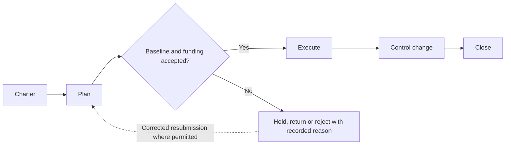
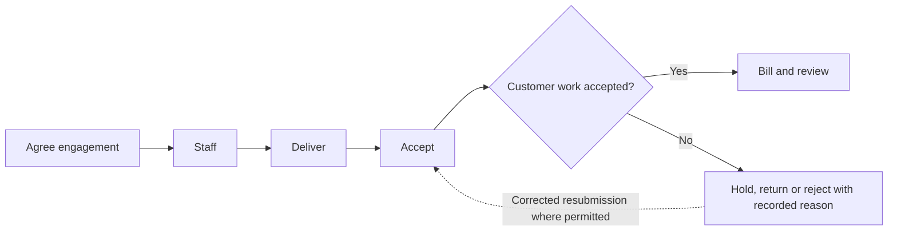
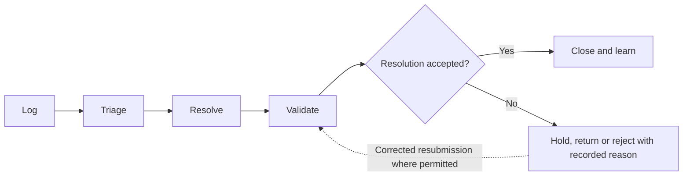

# athyper Projects & Services — Business Capabilities & Workflow Design

**Edition:** September 2026  
**Audience:** business owners, tenant implementation teams, process designers and solution reviewers  
**Status:** business design baseline with scoped source findings; not a deployment acceptance record

[Series index](README.md)

## 1. Purpose and business outcomes

Connect project scope, delivery responsibilities, service acceptance and financial accountability.

A project sponsor should distinguish a finished task, an accepted customer deliverable, an approved billable milestone and collected revenue.

This document covers every module in the selected workspace. The workflow diagrams, step tables, proposed controls, notifications and measures describe a business design for validation. They are not a claim that every step is implemented. Each module separately states the inspected foundation and the remaining gap. No module is designated as available in a qualified tenant deployment by this review.

**Shared prerequisites:** Customer or internal sponsor, company, project dimensions, budget, resources and explicit acceptance criteria.

**Ownership boundary:** Projects own scope and task acceptance. Professional Services owns the customer delivery basis; service owners accept service resolution; Finance owns posting and billing.

## 2. Module and capability map

| Module                                | Business purpose                                                                                               | Evidence position                             |
| ------------------------------------- | -------------------------------------------------------------------------------------------------------------- | --------------------------------------------- |
| [Project Management](#module-prjcost) | Plan accountable project work, control scope and relate progress to budget and actual cost.                    | Data foundation defined; workflow proposed    |
| [Professional Services](#module-psa)  | Connect customer service commitments with staffing, accepted delivery and a substantiated billing instruction. | Supporting foundation only; workflow proposed |
| [Service Management](#module-itsm)    | Coordinate service requests with accountable ownership, response expectations and closure evidence.            | Supporting foundation only; workflow proposed |

A source implementation finding applies only to the named behavior in its module chapter. A supporting foundation can contain related records without containing the module-specific process. Proposed lifecycle labels below are business design states, not asserted application status values.

## 3. Workspace journey and responsibility

**Proposed end-to-end journey:**

At each handoff, the receiving owner checks scope, references and acceptance conditions. A completed sending step does not automatically authorize the next step. Return and rejection outcomes stay attached to the original business reference so that teams can resolve the cause without losing history.

## 4. Module workflows

### Project Management

**Purpose:** Plan accountable project work, control scope and relate progress to budget and actual cost.

**Responsible roles:** Project sponsor; project manager; task owner; finance partner.

**Business information and prerequisites:** Project, work breakdown, task, requirement, project item and budget allocation. The relevant tenant, company and operating scope must be identified before the workflow starts.

**Evidence position:** Data foundation defined; workflow proposed.

**Inspected foundation:** Project, work-breakdown and task structures exist; Finance provides related budget and accounting components.

**Remaining implementation boundary:** Resource scheduling, progress approval, project billing and revenue recognition are not established by the project records alone.

#### Capability catalogue and proposed lifecycle

| Business capability | Intended output          |
| ------------------- | ------------------------ |
| Charter             | Approved project brief   |
| Plan                | Project baseline         |
| Execute             | Progress and cost inputs |
| Control change      | Approved successor plan  |
| Close               | Project closure evidence |

The primary journey starts with **business objective and funding basis** and completes when **project closure evidence** is recorded by the responsible owner. Outstanding exceptions remain assigned; completion of this module does not imply completion of downstream work.

#### Workflow steps and exception handling

| Step              | Responsible role | Input                                            | Business action and decision                              | Output                   | Exception path                           |
| ----------------- | ---------------- | ------------------------------------------------ | --------------------------------------------------------- | ------------------------ | ---------------------------------------- |
| 1. Charter        | Project sponsor  | Business objective and funding basis             | Define accountable scope, company and success criteria    | Approved project brief   | Return unclear outcome                   |
| 2. Plan           | Project manager  | Brief and budget                                 | Break work into tasks, owners and acceptance requirements | Project baseline         | Resolve unowned or unfunded work         |
| 3. Execute        | Task owner       | Assigned task and prerequisites                  | Perform work and submit completion evidence               | Progress and cost inputs | Escalate dependency or scope issue       |
| 4. Control change | Project manager  | Variance or change request                       | Review time, cost and outcome impact                      | Approved successor plan  | Hold unauthorized scope expansion        |
| 5. Close          | Sponsor          | Accepted deliverables and reconciled obligations | Confirm completion and remaining responsibilities         | Project closure evidence | Keep unresolved deliverable or cost open |

An exception returns work to the named owner for correction or an explicit decision. A withdrawn proposal closes without executing its intended business effect. Once an effect is accepted, cancellation must use the applicable controlled correction or reversal path; it must not erase evidence. Exact commands and permitted transitions require implementation qualification.

#### Controls, responsibilities and tenant configuration

Project completion, customer acceptance and financial close are separate; preserve baseline and change approval; Finance owns posted cost and revenue decisions.

**Configuration decisions:** Work breakdown, task dependencies, acceptance criteria, costing dimensions, change limits and closure checklist.

Approval amounts, response deadlines, reviewers and escalation paths must be agreed for the tenant; this design does not assume default thresholds or a universal approval chain.

#### Communications, documents and visibility

Proposed: task assignment, dependency alert, change review and completion acceptance.

Each enabled message should identify the business reference, intended recipient, required action and authorized navigation destination. Record access must still be checked when the recipient opens it. Delivery success is separate from approval.

**Proposed business measures:** Milestone variance; overdue tasks; budget versus actual cost; pending change requests. Agree the population, period, exclusions and responsible owner before turning these into performance targets. Existing dashboards are not implied.

#### Atlas AI and activation criteria

Proposed: summarize progress and blockers from authorized evidence; no autonomous scope or budget change.

Before tenant activation, verify the module-specific gap above, publish the applicable process and permissions, and demonstrate a successful case plus its return, denial, stale-change and downstream-failure paths. Require reconciliation of the resulting business records and evidence.

### Professional Services

**Purpose:** Connect customer service commitments with staffing, accepted delivery and a substantiated billing instruction.

**Responsible roles:** Engagement manager; resource manager; consultant; customer acceptance owner.

**Business information and prerequisites:** Project, work breakdown, statement of work, deliverables and time/service evidence. The relevant tenant, company and operating scope must be identified before the workflow starts.

**Evidence position:** Supporting foundation only; workflow proposed.

**Inspected foundation:** Project foundations exist. Statement-of-work and external-service structures support supplier-side engagements.

**Remaining implementation boundary:** Supplier-side statements of work are not evidence of a complete customer professional-services billing model. Customer staffing, timesheets, utilization and billing require dedicated verification.

#### Capability catalogue and proposed lifecycle

| Business capability | Intended output                   |
| ------------------- | --------------------------------- |
| Agree engagement    | Proposed engagement baseline      |
| Staff               | Staffing plan                     |
| Deliver             | Deliverable and effort submission |
| Accept              | Accepted milestone or effort      |
| Bill and review     | Billing handoff and margin review |

The primary journey starts with **customer scope and commercial terms** and completes when **billing handoff and margin review** is recorded by the responsible owner. Outstanding exceptions remain assigned; completion of this module does not imply completion of downstream work.

#### Workflow steps and exception handling

| Step                | Responsible role          | Input                               | Business action and decision                            | Output                            | Exception path                         |
| ------------------- | ------------------------- | ----------------------------------- | ------------------------------------------------------- | --------------------------------- | -------------------------------------- |
| 1. Agree engagement | Engagement manager        | Customer scope and commercial terms | Define deliverables, responsibilities and billing basis | Proposed engagement baseline      | Return ambiguous acceptance terms      |
| 2. Staff            | Resource manager          | Approved work and required skills   | Assign permitted staff or request external workforce    | Staffing plan                     | Escalate capacity shortage             |
| 3. Deliver          | Consultant or task owner  | Assigned work                       | Record progress and authorized time/expense evidence    | Deliverable and effort submission | Resolve scope or effort dispute        |
| 4. Accept           | Customer acceptance owner | Deliverable and agreed criteria     | Confirm acceptance or request rework                    | Accepted milestone or effort      | Hold rejected output                   |
| 5. Bill and review  | Engagement manager        | Accepted work and agreed terms      | Send supported billing instruction to Receivables       | Billing handoff and margin review | Resolve nonbillable or disputed effort |

An exception returns work to the named owner for correction or an explicit decision. A withdrawn proposal closes without executing its intended business effect. Once an effect is accepted, cancellation must use the applicable controlled correction or reversal path; it must not erase evidence. Exact commands and permitted transitions require implementation qualification.

#### Controls, responsibilities and tenant configuration

Customer acceptance belongs to the agreed engagement authority; external-worker supplier invoices remain Payables-owned; project cost does not automatically establish revenue.

**Configuration decisions:** Engagement types, rate basis, staffing rules, expense policy, acceptance authority and billing milestones.

Approval amounts, response deadlines, reviewers and escalation paths must be agreed for the tenant; this design does not assume default thresholds or a universal approval chain.

#### Communications, documents and visibility

Proposed: staffing request, effort reminder, acceptance prompt and billing-ready notice.

Each enabled message should identify the business reference, intended recipient, required action and authorized navigation destination. Record access must still be checked when the recipient opens it. Delivery success is separate from approval.

**Proposed business measures:** Accepted versus planned milestones; unbilled accepted work; effort variance; utilization only with qualified capacity inputs. Agree the population, period, exclusions and responsible owner before turning these into performance targets. Existing dashboards are not implied.

#### Atlas AI and activation criteria

Proposed: draft a delivery summary; no fabricated customer acceptance or automatic billing release.

Before tenant activation, verify the module-specific gap above, publish the applicable process and permissions, and demonstrate a successful case plus its return, denial, stale-change and downstream-failure paths. Require reconciliation of the resulting business records and evidence.

### Service Management

**Purpose:** Coordinate service requests with accountable ownership, response expectations and closure evidence.

**Responsible roles:** Service requester; service desk; resolver; service owner.

**Business information and prerequisites:** Shared work item, workflow request, entity case and asset reference. The relevant tenant, company and operating scope must be identified before the workflow starts.

**Evidence position:** Supporting foundation only; workflow proposed.

**Inspected foundation:** Shared case, work-item and workflow records provide a potential orchestration foundation.

**Remaining implementation boundary:** A dedicated service-ticket catalogue, incident/problem model and service-level timer implementation was not identified in this review.

#### Capability catalogue and proposed lifecycle

| Business capability | Intended output     |
| ------------------- | ------------------- |
| Log                 | Service request     |
| Triage              | Assigned work       |
| Resolve             | Resolution proposal |
| Validate            | Acceptance          |
| Close and learn     | Closed request      |

The primary journey starts with **service need or interruption** and completes when **closed request** is recorded by the responsible owner. Outstanding exceptions remain assigned; completion of this module does not imply completion of downstream work.

#### Workflow steps and exception handling

| Step               | Responsible role           | Input                            | Business action and decision                             | Output              | Exception path                     |
| ------------------ | -------------------------- | -------------------------------- | -------------------------------------------------------- | ------------------- | ---------------------------------- |
| 1. Log             | Requester                  | Service need or interruption     | Identify affected service, impact and permitted evidence | Service request     | Return insufficient description    |
| 2. Triage          | Service desk               | Request and business impact      | Classify priority and assign an owner                    | Assigned work       | Escalate uncertain ownership       |
| 3. Resolve         | Resolver                   | Assigned request and diagnostics | Perform authorized remedial action                       | Resolution proposal | Route dependency or change request |
| 4. Validate        | Requester or service owner | Resolution evidence              | Confirm service restoration or fulfilled request         | Acceptance          | Reopen unresolved service          |
| 5. Close and learn | Service owner              | Accepted resolution              | Record outcome and follow-up prevention action           | Closed request      | Retain open follow-up separately   |

An exception returns work to the named owner for correction or an explicit decision. A withdrawn proposal closes without executing its intended business effect. Once an effect is accepted, cancellation must use the applicable controlled correction or reversal path; it must not erase evidence. Exact commands and permitted transitions require implementation qualification.

#### Controls, responsibilities and tenant configuration

Service requests must not bypass controlled business changes or asset work authorization; priority and elapsed response time need defined measurement rules.

**Configuration decisions:** Service catalogue, impact/priority rules, ownership, response targets, business calendars and escalation.

Approval amounts, response deadlines, reviewers and escalation paths must be agreed for the tenant; this design does not assume default thresholds or a universal approval chain.

#### Communications, documents and visibility

Proposed: acknowledgement, assignment, escalation and closure confirmation; timer-based messages need implemented scheduling bindings.

Each enabled message should identify the business reference, intended recipient, required action and authorized navigation destination. Record access must still be checked when the recipient opens it. Delivery success is separate from approval.

**Proposed business measures:** Request age; first-response time; reopen rate; overdue work against agreed targets. Agree the population, period, exclusions and responsible owner before turning these into performance targets. Existing dashboards are not implied.

#### Atlas AI and activation criteria

Proposed: summarize permitted troubleshooting evidence; no autonomous privileged remediation.

Before tenant activation, verify the module-specific gap above, publish the applicable process and permissions, and demonstrate a successful case plus its return, denial, stale-change and downstream-failure paths. Require reconciliation of the resulting business records and evidence.

## 5. Cross-module handoff contracts

These proposed handoff IDs are shared across the document series. They express business acceptance responsibilities, not a claim that an integration is already deployed.

| ID  | Owning modules                                   | Required handoff                                                | Receiving decision                                   | Exception ownership                                   |
| --- | ------------------------------------------------ | --------------------------------------------------------------- | ---------------------------------------------------- | ----------------------------------------------------- |
| H08 | Professional Services → Accounts Receivable      | Accepted deliverable or effort, contract basis and charge scope | Billing owner validates billable event               | Return disputed effort or missing customer acceptance |
| H13 | Project Management → People / External Workforce | Approved resource need, duration, company and funding           | People owner governs employment or engagement route  | Return unavailable capacity or missing authority      |
| H15 | Project Management → Finance                     | Approved budget scope and substantiated cost references         | Budget/accounting owner admits financial transaction | Return missing project dimension or closed period     |

Related workspace documents: [Finance](finance.md), [People](people.md).

## 6. Implementation workshop and acceptance

Use the module chapters as the business workshop agenda. Agree the owning roles, business objects, entry channels, decision rules, exception routes and handoffs before configuring an approval flow. Shared master-data governance, identity, documents and notifications are dependencies; their availability does not establish that a domain workflow is complete.

| Review topic                 | Concrete acceptance evidence                                                                                                          |
| ---------------------------- | ------------------------------------------------------------------------------------------------------------------------------------- |
| Scope and ownership          | A representative tenant/company scenario, named process owner and agreed scope exclusions.                                            |
| Workflow and state           | A demonstrated primary journey, return/rejection, cancellation and applicable correction with identifiable outcomes.                  |
| Access and evidence          | Unauthorized actions denied; restricted data withheld; decisions linked to the relevant actor, version and business reference.        |
| Cross-module processing      | The recipient accepts or rejects the handoff explicitly; interruption and retry do not create unexplained duplicate business effects. |
| Documents and communications | Eligible recipients can retrieve permitted evidence; failed delivery remains visible and does not imply a failed business save.       |
| Measures and AI              | Report definitions reconcile to accepted records; any enabled AI use case preserves scope, evidence limits and human authority.       |
| Deployment readiness         | The selected configuration, service connections and business journey have tenant-specific qualification evidence.                     |

The resulting workshop decisions should become versioned configuration and delivery acceptance records. This document remains the business design reference; it does not itself activate routes, publish policies, change data or authorize transactions.
