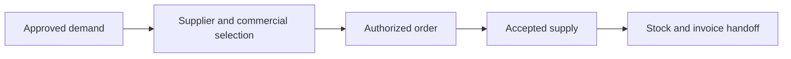
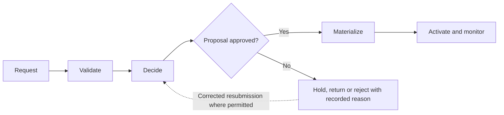
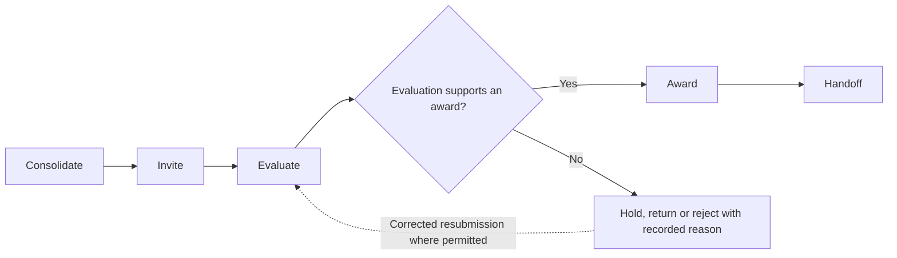
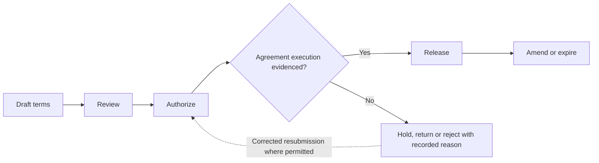
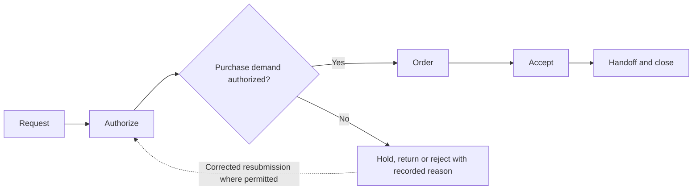
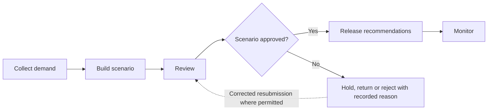
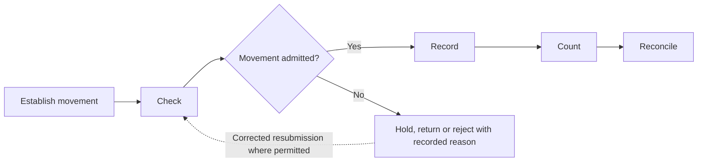
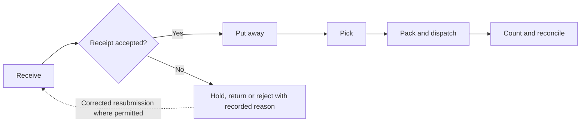
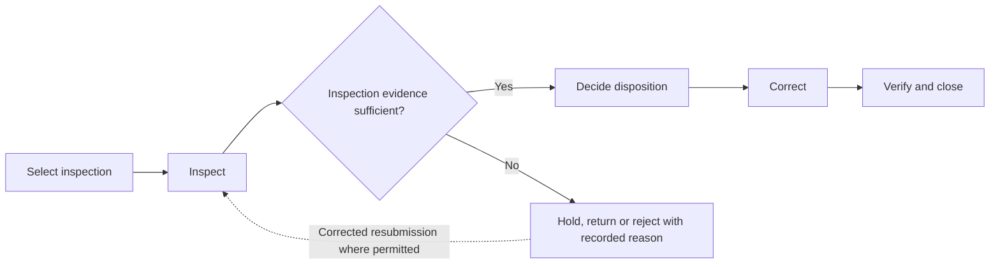

# athyper Supply Chain — Business Capabilities & Workflow Design

**Edition:** September 2026  
**Audience:** business owners, tenant implementation teams, process designers and solution reviewers  
**Status:** business design baseline with scoped source findings; not a deployment acceptance record

[Series index](README.md)

## 1. Purpose and business outcomes

Connect supplier eligibility, sourcing, purchasing, stock and delivery through accountable supply decisions.

A buyer investigating an unpaid invoice should be able to identify whether the blocker is supplier eligibility, missing acceptance, an invoice discrepancy or a payment issue.

This document covers every module in the selected workspace. The workflow diagrams, step tables, proposed controls, notifications and measures describe a business design for validation. They are not a claim that every step is implemented. Each module separately states the inspected foundation and the remaining gap. No module is designated as available in a qualified tenant deployment by this review.

**Shared prerequisites:** Governed suppliers, items, units, warehouses, operating companies, cost scopes and commercial terms.

**Ownership boundary:** Procurement owns purchase commitments; Inventory owns stock balances; Warehouse and Logistics own physical execution proposals. Finance owns liability approval and payment.

## 2. Module and capability map

| Module                                          | Business purpose                                                                                                             | Evidence position                                    |
| ----------------------------------------------- | ---------------------------------------------------------------------------------------------------------------------------- | ---------------------------------------------------- |
| [Supplier Management](#module-srm)              | Establish and maintain an eligible supplier relationship without confusing organizational identity with permission to trade. | Source implementation present; activation unverified |
| [Strategic Sourcing](#module-source)            | Consolidate demand, compare supplier proposals and produce an accountable award decision.                                    | Data foundation defined; workflow proposed           |
| [Contract Management](#module-contract)         | Control commercial commitments, their effective terms and their release into operational transactions.                       | Source implementation present; activation unverified |
| [Procurement](#module-buy)                      | Convert an approved business need into an authorized purchase and accepted supply.                                           | Source implementation present; activation unverified |
| [Demand & Supply Planning](#module-demand)      | Produce a reviewed supply response to anticipated demand with explicit assumptions and business ownership.                   | Source implementation present; activation unverified |
| [Inventory Management](#module-inventory)       | Maintain explainable stock quantities and valuation through controlled movements and reconciliation.                         | Source implementation present; activation unverified |
| [Warehouse Management](#module-wms)             | Organize the physical receipt, placement, picking and dispatch of goods.                                                     | Supporting foundation only; workflow proposed        |
| [Quality Management](#module-qms)               | Make inspection and nonconformance decisions explicit before affected goods or services are released.                        | Supporting foundation only; workflow proposed        |
| [Transportation & Logistics](#module-logistics) | Coordinate transport and make dispatch, custody transfer and delivery outcomes visible.                                      | Supporting foundation only; workflow proposed        |

A source implementation finding applies only to the named behavior in its module chapter. A supporting foundation can contain related records without containing the module-specific process. Proposed lifecycle labels below are business design states, not asserted application status values.

## 3. Workspace journey and responsibility

**Proposed end-to-end journey:**

At each handoff, the receiving owner checks scope, references and acceptance conditions. A completed sending step does not automatically authorize the next step. Return and rejection outcomes stay attached to the original business reference so that teams can resolve the cause without losing history.

## 4. Module workflows

### Supplier Management

**Purpose:** Establish and maintain an eligible supplier relationship without confusing organizational identity with permission to trade.

**Responsible roles:** Supplier requester; data steward; qualification reviewer; activation owner.

**Business information and prerequisites:** Business Partner, supplier role, company profile, case, evidence and activation result. The relevant tenant, company and operating scope must be identified before the workflow starts.

**Evidence position:** Source implementation present; activation unverified.

**Inspected foundation:** Governed Business Partner services and supplier eligibility services exist. Source architecture separates cases, decisions, materialization and activation.

**Remaining implementation boundary:** Specific qualification policies, communication routes and the full tenant onboarding journey still need deployment evidence.

#### Capability catalogue and proposed lifecycle

| Business capability  | Intended output                |
| -------------------- | ------------------------------ |
| Request              | Draft supplier proposal        |
| Validate             | Validation and review evidence |
| Decide               | Approved or rejected proposal  |
| Materialize          | Tenant-local supplier record   |
| Activate and monitor | Active or restricted supplier  |

The primary journey starts with **supplier purpose and organization scope** and completes when **active or restricted supplier** is recorded by the responsible owner. Outstanding exceptions remain assigned; completion of this module does not imply completion of downstream work.

#### Workflow steps and exception handling

| Step                    | Responsible role        | Input                                   | Business action and decision                          | Output                         | Exception path                                   |
| ----------------------- | ----------------------- | --------------------------------------- | ----------------------------------------------------- | ------------------------------ | ------------------------------------------------ |
| 1. Request              | Business requester      | Supplier purpose and organization scope | Open the applicable governed case                     | Draft supplier proposal        | Return missing purpose or scope                  |
| 2. Validate             | Data steward            | Saved proposal and evidence             | Check required data and resolve identity concerns     | Validation and review evidence | Return missing information or duplicate concern  |
| 3. Decide               | Qualification reviewer  | Current case and required evidence      | Record authorized decision under published rules      | Approved or rejected proposal  | Return for correction; do not mutate master data |
| 4. Materialize          | Owning business service | Approved current proposal               | Apply accepted organization and supplier role changes | Tenant-local supplier record   | Hold conflict or stale version                   |
| 5. Activate and monitor | Activation owner        | Readiness and operating scope           | Confirm business eligibility and subsequent changes   | Active or restricted supplier  | Hold bank, scope or readiness concern            |

An exception returns work to the named owner for correction or an explicit decision. A withdrawn proposal closes without executing its intended business effect. Once an effect is accepted, cancellation must use the applicable controlled correction or reversal path; it must not erase evidence. Exact commands and permitted transitions require implementation qualification.

#### Controls, responsibilities and tenant configuration

One Business Partner may hold supplier and customer roles; protected bank changes require their own access and verification; MESH disclosure remains a proposal until accepted.

**Configuration decisions:** Published definition, supplier roles, operating companies, qualification evidence, review assignments and activation rules.

Approval amounts, response deadlines, reviewers and escalation paths must be agreed for the tenant; this design does not assume default thresholds or a universal approval chain.

#### Communications, documents and visibility

Existing Business Partner event projections support configured submission and decision communications. Exact channel/recipient delivery must be qualified; retain case evidence and decision history.

Each enabled message should identify the business reference, intended recipient, required action and authorized navigation destination. Record access must still be checked when the recipient opens it. Delivery success is separate from approval.

**Proposed business measures:** Cases awaiting evidence; returned submissions; activation blockers; supplier reviews due. Agree the population, period, exclusions and responsible owner before turning these into performance targets. Existing dashboards are not implied.

#### Atlas AI and activation criteria

Bounded Business Partner summaries and readiness/eligibility explanations have source implementations. Current admission and evidence limits apply; Atlas cannot approve or activate suppliers.

Before tenant activation, verify the module-specific gap above, publish the applicable process and permissions, and demonstrate a successful case plus its return, denial, stale-change and downstream-failure paths. Require reconciliation of the resulting business records and evidence.

### Strategic Sourcing

**Purpose:** Consolidate demand, compare supplier proposals and produce an accountable award decision.

**Responsible roles:** Sourcing lead; demand owner; evaluator; award approver.

**Business information and prerequisites:** Sourcing event, participating companies, demand, award and award allocation. The relevant tenant, company and operating scope must be identified before the workflow starts.

**Evidence position:** Data foundation defined; workflow proposed.

**Inspected foundation:** Sourcing events and company/demand/award allocations are defined.

**Remaining implementation boundary:** Supplier response collection, scoring, negotiation and award workflow are proposed until executable services are verified.

#### Capability catalogue and proposed lifecycle

| Business capability | Intended output               |
| ------------------- | ----------------------------- |
| Consolidate         | Sourcing brief                |
| Invite              | Supplier invitation package   |
| Evaluate            | Evaluation recommendation     |
| Award               | Recorded award decision       |
| Handoff             | Contract or order instruction |

The primary journey starts with **approved demand from participating companies** and completes when **contract or order instruction** is recorded by the responsible owner. Outstanding exceptions remain assigned; completion of this module does not imply completion of downstream work.

#### Workflow steps and exception handling

| Step           | Responsible role | Input                                        | Business action and decision                            | Output                        | Exception path                                  |
| -------------- | ---------------- | -------------------------------------------- | ------------------------------------------------------- | ----------------------------- | ----------------------------------------------- |
| 1. Consolidate | Sourcing lead    | Approved demand from participating companies | Define scope, buyer model and allocation basis          | Sourcing brief                | Return inconsistent ownership                   |
| 2. Invite      | Sourcing lead    | Event scope and eligible suppliers           | Release approved requirements and response deadline     | Supplier invitation package   | Hold ineligible supplier                        |
| 3. Evaluate    | Evaluator        | Submitted proposals and criteria             | Compare commercial and required non-price factors       | Evaluation recommendation     | Seek clarification; record conflict of interest |
| 4. Award       | Award approver   | Recommendation and company allocations       | Authorize award scope and value                         | Recorded award decision       | Return unsupported allocation                   |
| 5. Handoff     | Sourcing lead    | Approved award                               | Send agreed terms to Contract Management or Procurement | Contract or order instruction | Hold changed terms for renewed review           |

An exception returns work to the named owner for correction or an explicit decision. A withdrawn proposal closes without executing its intended business effect. Once an effect is accepted, cancellation must use the applicable controlled correction or reversal path; it must not erase evidence. Exact commands and permitted transitions require implementation qualification.

#### Controls, responsibilities and tenant configuration

Preserve evaluation criteria and decision evidence; company allocations must match the approved sourcing model; selecting a supplier does not create a purchase authorization.

**Configuration decisions:** Event types, evaluation rules, invited suppliers, participating companies, thresholds and award communication.

Approval amounts, response deadlines, reviewers and escalation paths must be agreed for the tenant; this design does not assume default thresholds or a universal approval chain.

#### Communications, documents and visibility

Proposed: invitation, response reminder, clarification request and award notice; protect competing supplier information.

Each enabled message should identify the business reference, intended recipient, required action and authorized navigation destination. Record access must still be checked when the recipient opens it. Delivery success is separate from approval.

**Proposed business measures:** Response coverage; evaluation lead time; award variance against approved demand; unconverted awards. Agree the population, period, exclusions and responsible owner before turning these into performance targets. Existing dashboards are not implied.

#### Atlas AI and activation criteria

Proposed: summarize authorized proposals against approved criteria; no autonomous ranking or award authority.

Before tenant activation, verify the module-specific gap above, publish the applicable process and permissions, and demonstrate a successful case plus its return, denial, stale-change and downstream-failure paths. Require reconciliation of the resulting business records and evidence.

### Contract Management

**Purpose:** Control commercial commitments, their effective terms and their release into operational transactions.

**Responsible roles:** Contract owner; commercial reviewer; authorized signatory; obligation owner.

**Business information and prerequisites:** Commitment, commitment line, release allocation, terms and intercompany agreement where applicable. The relevant tenant, company and operating scope must be identified before the workflow starts.

**Evidence position:** Source implementation present; activation unverified.

**Inspected foundation:** The shared commitment model and fulfillment service provide related foundations; a separate universal legal-contract lifecycle was not established.

**Remaining implementation boundary:** Clause authoring, signature integration, obligation reminders and renewal workflows remain proposed.

#### Capability catalogue and proposed lifecycle

| Business capability | Intended output                   |
| ------------------- | --------------------------------- |
| Draft terms         | Contract proposal                 |
| Review              | Reviewed proposal                 |
| Authorize           | Executed agreement reference      |
| Release             | Operational commitment allocation |
| Amend or expire     | Amendment or closure evidence     |

The primary journey starts with **award or negotiated business need** and completes when **amendment or closure evidence** is recorded by the responsible owner. Outstanding exceptions remain assigned; completion of this module does not imply completion of downstream work.

#### Workflow steps and exception handling

| Step               | Responsible role    | Input                                   | Business action and decision                                  | Output                            | Exception path                         |
| ------------------ | ------------------- | --------------------------------------- | ------------------------------------------------------------- | --------------------------------- | -------------------------------------- |
| 1. Draft terms     | Contract owner      | Award or negotiated business need       | Define parties, scope, value, validity and release conditions | Contract proposal                 | Return unclear ownership               |
| 2. Review          | Commercial reviewer | Terms and supporting documents          | Review exceptions and operational obligations                 | Reviewed proposal                 | Return disputed clause                 |
| 3. Authorize       | Signatory           | Reviewed current terms                  | Approve execution under assigned authority                    | Executed agreement reference      | Hold unsigned or expired version       |
| 4. Release         | Obligation owner    | Effective agreement and eligible demand | Authorize controlled order or service releases                | Operational commitment allocation | Reject excess or out-of-period release |
| 5. Amend or expire | Contract owner      | Change, renewal or expiry trigger       | Review impact on open obligations                             | Amendment or closure evidence     | Keep unresolved obligations assigned   |

An exception returns work to the named owner for correction or an explicit decision. A withdrawn proposal closes without executing its intended business effect. Once an effect is accepted, cancellation must use the applicable controlled correction or reversal path; it must not erase evidence. Exact commands and permitted transitions require implementation qualification.

#### Controls, responsibilities and tenant configuration

Executed contract evidence and operational order approval are distinct; amendments must identify affected releases; legal acceptance criteria are tenant-defined.

**Configuration decisions:** Agreement types, approval authority, validity periods, release ceilings, renewal lead times and document requirements.

Approval amounts, response deadlines, reviewers and escalation paths must be agreed for the tenant; this design does not assume default thresholds or a universal approval chain.

#### Communications, documents and visibility

Proposed: review task, signature follow-up, expiry notice and obligation reminder; schedules need explicit configuration.

Each enabled message should identify the business reference, intended recipient, required action and authorized navigation destination. Record access must still be checked when the recipient opens it. Delivery success is separate from approval.

**Proposed business measures:** Agreements approaching expiry; open obligations; release value versus ceiling; amendment age. Agree the population, period, exclusions and responsible owner before turning these into performance targets. Existing dashboards are not implied.

#### Atlas AI and activation criteria

Proposed: summarize approved terms with citations; no legal interpretation guarantee or autonomous signature.

Before tenant activation, verify the module-specific gap above, publish the applicable process and permissions, and demonstrate a successful case plus its return, denial, stale-change and downstream-failure paths. Require reconciliation of the resulting business records and evidence.

### Procurement

**Purpose:** Convert an approved business need into an authorized purchase and accepted supply.

**Responsible roles:** Requester; buyer; budget owner; receiver.

**Business information and prerequisites:** Requisition, purchase commitment, confirmation, receipt, service sheet and fulfillment record. The relevant tenant, company and operating scope must be identified before the workflow starts.

**Evidence position:** Source implementation present; activation unverified.

**Inspected foundation:** Requisition, purchase-order commitment, receipt and service-acceptance structures exist. Commitment fulfillment services are implemented in source.

**Remaining implementation boundary:** End-to-end requisition approval, supplier order transmission and receipt-to-invoice automation require explicit qualification.

#### Capability catalogue and proposed lifecycle

| Business capability | Intended output                 |
| ------------------- | ------------------------------- |
| Request             | Purchase requisition            |
| Authorize           | Approved demand                 |
| Order               | Order and expected supply       |
| Accept              | Receipt or service acceptance   |
| Handoff and close   | Invoice-match basis and closure |

The primary journey starts with **item or service need and cost scope** and completes when **invoice-match basis and closure** is recorded by the responsible owner. Outstanding exceptions remain assigned; completion of this module does not imply completion of downstream work.

#### Workflow steps and exception handling

| Step                 | Responsible role | Input                               | Business action and decision                              | Output                          | Exception path                                  |
| -------------------- | ---------------- | ----------------------------------- | --------------------------------------------------------- | ------------------------------- | ----------------------------------------------- |
| 1. Request           | Requester        | Item or service need and cost scope | Describe quantity, date, company and funding basis        | Purchase requisition            | Return incomplete specification                 |
| 2. Authorize         | Budget owner     | Requisition and availability        | Review funding and purchase authority                     | Approved demand                 | Hold unavailable budget                         |
| 3. Order             | Buyer            | Approved demand and supplier terms  | Issue the applicable purchase commitment                  | Order and expected supply       | Reject ineligible supplier or conflicting terms |
| 4. Accept            | Receiver         | Delivery or service evidence        | Record actual quantity or approved service performance    | Receipt or service acceptance   | Record short, damaged or disputed supply        |
| 5. Handoff and close | Buyer            | Acceptance and remaining commitment | Send charge basis to Payables and resolve open quantities | Invoice-match basis and closure | Keep incomplete or disputed supply open         |

An exception returns work to the named owner for correction or an explicit decision. A withdrawn proposal closes without executing its intended business effect. Once an effect is accepted, cancellation must use the applicable controlled correction or reversal path; it must not erase evidence. Exact commands and permitted transitions require implementation qualification.

#### Controls, responsibilities and tenant configuration

Use the same company and supplier scope across demand, order and receipt; ordering and receiving authority may be separated; payment authorization remains Finance-owned.

**Configuration decisions:** Approval limits, supplier eligibility, budget checks, order types, receipt tolerances and service acceptance rules.

Approval amounts, response deadlines, reviewers and escalation paths must be agreed for the tenant; this design does not assume default thresholds or a universal approval chain.

#### Communications, documents and visibility

Proposed: approval prompt, order notification, delivery variance and receipt confirmation; transmit only through enabled channels.

Each enabled message should identify the business reference, intended recipient, required action and authorized navigation destination. Record access must still be checked when the recipient opens it. Delivery success is separate from approval.

**Proposed business measures:** Requisition age; overdue order lines; unaccepted deliveries; invoice-match readiness. Agree the population, period, exclusions and responsible owner before turning these into performance targets. Existing dashboards are not implied.

#### Atlas AI and activation criteria

Proposed: explain outstanding order quantities or draft a request; no supplier selection or spending authority.

Before tenant activation, verify the module-specific gap above, publish the applicable process and permissions, and demonstrate a successful case plus its return, denial, stale-change and downstream-failure paths. Require reconciliation of the resulting business records and evidence.

### Demand & Supply Planning

**Purpose:** Produce a reviewed supply response to anticipated demand with explicit assumptions and business ownership.

**Responsible roles:** Demand planner; supply planner; planning approver.

**Business information and prerequisites:** Item, bill of materials, planning scenario, run and output. The relevant tenant, company and operating scope must be identified before the workflow starts.

**Evidence position:** Source implementation present; activation unverified.

**Inspected foundation:** Planning scenario structures and financial planning-run/output services exist as supporting foundations.

**Remaining implementation boundary:** The inspected planning service manages financial amounts and run lifecycle; it does not establish demand forecasting, supply optimization or material-requirements calculations.

#### Capability catalogue and proposed lifecycle

| Business capability     | Intended output                    |
| ----------------------- | ---------------------------------- |
| Collect demand          | Demand baseline                    |
| Build scenario          | Scenario proposal                  |
| Review                  | Approved planning decision         |
| Release recommendations | Requisition or production proposal |
| Monitor                 | Successor scenario                 |

The primary journey starts with **orders, history and business assumptions** and completes when **successor scenario** is recorded by the responsible owner. Outstanding exceptions remain assigned; completion of this module does not imply completion of downstream work.

#### Workflow steps and exception handling

| Step                       | Responsible role  | Input                                    | Business action and decision                  | Output                             | Exception path                                           |
| -------------------------- | ----------------- | ---------------------------------------- | --------------------------------------------- | ---------------------------------- | -------------------------------------------------------- |
| 1. Collect demand          | Demand planner    | Orders, history and business assumptions | Select item, horizon and organizational scope | Demand baseline                    | Flag missing or incomparable inputs                      |
| 2. Build scenario          | Supply planner    | Baseline, stock and capacity assumptions | Model the proposed supply response            | Scenario proposal                  | Record shortage or infeasible assumption                 |
| 3. Review                  | Planning approver | Scenario and variance explanation        | Approve the assumptions and chosen response   | Approved planning decision         | Return unsupported forecast                              |
| 4. Release recommendations | Supply planner    | Approved recommendations                 | Send demand to Procurement or Manufacturing   | Requisition or production proposal | Require receiving-module approval                        |
| 5. Monitor                 | Demand planner    | Actual orders and fulfillment            | Compare actual results and revise assumptions | Successor scenario                 | Investigate deviation without overwriting prior evidence |

An exception returns work to the named owner for correction or an explicit decision. A withdrawn proposal closes without executing its intended business effect. Once an effect is accepted, cancellation must use the applicable controlled correction or reversal path; it must not erase evidence. Exact commands and permitted transitions require implementation qualification.

#### Controls, responsibilities and tenant configuration

Planning recommendations are not purchase orders; approved scenario identity and assumptions must be retained; financial planning evidence must not be presented as a physical planning engine.

**Configuration decisions:** Planning horizon, item/site scope, calendars, assumptions, scenario approval and receiving-module rules.

Approval amounts, response deadlines, reviewers and escalation paths must be agreed for the tenant; this design does not assume default thresholds or a universal approval chain.

#### Communications, documents and visibility

Proposed: shortage alert, scenario review and release notice; recipients depend on item/site ownership.

Each enabled message should identify the business reference, intended recipient, required action and authorized navigation destination. Record access must still be checked when the recipient opens it. Delivery success is separate from approval.

**Proposed business measures:** Forecast error where supported; unresolved shortages; plan-to-release lead time; recommendation acceptance. Agree the population, period, exclusions and responsible owner before turning these into performance targets. Existing dashboards are not implied.

#### Atlas AI and activation criteria

Proposed: explain scenario assumptions and variances; no autonomous forecast release or procurement command.

Before tenant activation, verify the module-specific gap above, publish the applicable process and permissions, and demonstrate a successful case plus its return, denial, stale-change and downstream-failure paths. Require reconciliation of the resulting business records and evidence.

### Inventory Management

**Purpose:** Maintain explainable stock quantities and valuation through controlled movements and reconciliation.

**Responsible roles:** Inventory controller; stock operator; count reviewer; accountant.

**Business information and prerequisites:** Item, warehouse, inventory movement, balance, valuation layer and stocktake. The relevant tenant, company and operating scope must be identified before the workflow starts.

**Evidence position:** Source implementation present; activation unverified.

**Inspected foundation:** Inventory movement, balance query/rebuild and valuation-related services exist.

**Remaining implementation boundary:** Warehouse task orchestration, counting approvals and all physical movement entry channels require separate qualification.

#### Capability catalogue and proposed lifecycle

| Business capability | Intended output        |
| ------------------- | ---------------------- |
| Establish movement  | Movement proposal      |
| Check               | Admitted movement      |
| Record              | Updated stock evidence |
| Count               | Count decision         |
| Reconcile           | Reconciliation outcome |

The primary journey starts with **receipt, issue, transfer or count instruction** and completes when **reconciliation outcome** is recorded by the responsible owner. Outstanding exceptions remain assigned; completion of this module does not imply completion of downstream work.

#### Workflow steps and exception handling

| Step                  | Responsible role           | Input                                         | Business action and decision                              | Output                 | Exception path                          |
| --------------------- | -------------------------- | --------------------------------------------- | --------------------------------------------------------- | ---------------------- | --------------------------------------- |
| 1. Establish movement | Stock operator             | Receipt, issue, transfer or count instruction | Identify item, location, quantity and source              | Movement proposal      | Reject incomplete coordinates           |
| 2. Check              | Inventory controller       | Proposal and current balance                  | Apply quantity, permission and applicable valuation rules | Admitted movement      | Hold disallowed quantity or stale state |
| 3. Record             | Inventory service operator | Admitted source evidence                      | Record movement and associated balance effects            | Updated stock evidence | Reject conflicting repeat               |
| 4. Count              | Count reviewer             | Physical count and recorded quantity          | Review variance and authorize adjustment                  | Count decision         | Recount unexplained discrepancy         |
| 5. Reconcile          | Accountant                 | Movements, balances and value evidence        | Reconcile stock history and financial handoff             | Reconciliation outcome | Assign quantity/value difference        |

An exception returns work to the named owner for correction or an explicit decision. A withdrawn proposal closes without executing its intended business effect. Once an effect is accepted, cancellation must use the applicable controlled correction or reversal path; it must not erase evidence. Exact commands and permitted transitions require implementation qualification.

#### Controls, responsibilities and tenant configuration

Inventory owns stock balances; Warehouse owns physical tasks; accepted movement identity must survive retries; a balance rebuild is not approval to conceal a variance.

**Configuration decisions:** Movement reasons, location scope, valuation rules, quantity precision, count tolerance and correction authority.

Approval amounts, response deadlines, reviewers and escalation paths must be agreed for the tenant; this design does not assume default thresholds or a universal approval chain.

#### Communications, documents and visibility

Proposed: movement failure, count assignment and variance approval; retain receipt and count evidence.

Each enabled message should identify the business reference, intended recipient, required action and authorized navigation destination. Record access must still be checked when the recipient opens it. Delivery success is separate from approval.

**Proposed business measures:** Quantity variance; negative-stock exceptions where applicable; unposted movements; reconciliation differences. Agree the population, period, exclusions and responsible owner before turning these into performance targets. Existing dashboards are not implied.

#### Atlas AI and activation criteria

Proposed: summarize movement history; no autonomous stock adjustment.

Before tenant activation, verify the module-specific gap above, publish the applicable process and permissions, and demonstrate a successful case plus its return, denial, stale-change and downstream-failure paths. Require reconciliation of the resulting business records and evidence.

### Warehouse Management

**Purpose:** Organize the physical receipt, placement, picking and dispatch of goods.

**Responsible roles:** Warehouse supervisor; receiving operator; picker; dispatch operator.

**Business information and prerequisites:** Warehouse, receipt, delivery note and inventory movement. The relevant tenant, company and operating scope must be identified before the workflow starts.

**Evidence position:** Supporting foundation only; workflow proposed.

**Inspected foundation:** Warehouse and stock/receipt/delivery structures are supporting foundations.

**Remaining implementation boundary:** Dedicated bin, handling-unit, picking-task and scanning workflows were not identified in the inspected canonical inventory; this operational design is proposed.

#### Capability catalogue and proposed lifecycle

| Business capability | Intended output                   |
| ------------------- | --------------------------------- |
| Receive             | Receipt proposal                  |
| Put away            | Placement confirmation            |
| Pick                | Picked quantity                   |
| Pack and dispatch   | Dispatch evidence                 |
| Count and reconcile | Approved stock correction request |

The primary journey starts with **inbound instruction and delivered goods** and completes when **approved stock correction request** is recorded by the responsible owner. Outstanding exceptions remain assigned; completion of this module does not imply completion of downstream work.

#### Workflow steps and exception handling

| Step                   | Responsible role     | Input                                   | Business action and decision                 | Output                            | Exception path                             |
| ---------------------- | -------------------- | --------------------------------------- | -------------------------------------------- | --------------------------------- | ------------------------------------------ |
| 1. Receive             | Receiving operator   | Inbound instruction and delivered goods | Verify expected item and received condition  | Receipt proposal                  | Record shortage or damage                  |
| 2. Put away            | Warehouse supervisor | Accepted goods and location plan        | Assign physical placement and confirmation   | Placement confirmation            | Hold unavailable space or restricted goods |
| 3. Pick                | Picker               | Authorized fulfillment instruction      | Confirm item, location and required quantity | Picked quantity                   | Report shortage or substitution request    |
| 4. Pack and dispatch   | Dispatch operator    | Picked goods and shipment instruction   | Check completeness and transfer custody      | Dispatch evidence                 | Hold mismatch or missing documentation     |
| 5. Count and reconcile | Supervisor           | Scheduled or exception count            | Review physical count with Inventory owner   | Approved stock correction request | Recount before adjustment                  |

An exception returns work to the named owner for correction or an explicit decision. A withdrawn proposal closes without executing its intended business effect. Once an effect is accepted, cancellation must use the applicable controlled correction or reversal path; it must not erase evidence. Exact commands and permitted transitions require implementation qualification.

#### Controls, responsibilities and tenant configuration

Warehouse task completion and stock accounting are separate; custody evidence must identify quantities; proposed scanning support is not established by a warehouse record.

**Configuration decisions:** Location model, handling rules, device/scanning requirements, picking strategy and count approval.

Approval amounts, response deadlines, reviewers and escalation paths must be agreed for the tenant; this design does not assume default thresholds or a universal approval chain.

#### Communications, documents and visibility

Proposed: receiving assignments, pick shortages and dispatch confirmation; retain packing and custody evidence.

Each enabled message should identify the business reference, intended recipient, required action and authorized navigation destination. Record access must still be checked when the recipient opens it. Delivery success is separate from approval.

**Proposed business measures:** Receipt-to-placement time; pick accuracy; dispatch exceptions; count variance. Agree the population, period, exclusions and responsible owner before turning these into performance targets. Existing dashboards are not implied.

#### Atlas AI and activation criteria

Proposed: explain task exceptions; no automatic physical movement confirmation.

Before tenant activation, verify the module-specific gap above, publish the applicable process and permissions, and demonstrate a successful case plus its return, denial, stale-change and downstream-failure paths. Require reconciliation of the resulting business records and evidence.

### Quality Management

**Purpose:** Make inspection and nonconformance decisions explicit before affected goods or services are released.

**Responsible roles:** Quality inspector; quality manager; receiving owner.

**Business information and prerequisites:** Receipt, item, service acceptance and supporting evidence. The relevant tenant, company and operating scope must be identified before the workflow starts.

**Evidence position:** Supporting foundation only; workflow proposed.

**Inspected foundation:** Receipt and item records can anchor quality context.

**Remaining implementation boundary:** A dedicated inspection plan, nonconformance and corrective-action lifecycle was not identified in the inspected canonical inventory; these capabilities are proposed.

#### Capability catalogue and proposed lifecycle

| Business capability | Intended output      |
| ------------------- | -------------------- |
| Select inspection   | Inspection request   |
| Inspect             | Inspection findings  |
| Decide disposition  | Disposition decision |
| Correct             | Correction evidence  |
| Verify and close    | Closed quality case  |

The primary journey starts with **delivery, production result or service trigger** and completes when **closed quality case** is recorded by the responsible owner. Outstanding exceptions remain assigned; completion of this module does not imply completion of downstream work.

#### Workflow steps and exception handling

| Step                  | Responsible role  | Input                                          | Business action and decision                    | Output               | Exception path                         |
| --------------------- | ----------------- | ---------------------------------------------- | ----------------------------------------------- | -------------------- | -------------------------------------- |
| 1. Select inspection  | Receiving owner   | Delivery, production result or service trigger | Identify applicable quality requirement         | Inspection request   | Hold missing requirement               |
| 2. Inspect            | Inspector         | Sample or service evidence                     | Record observations against approved criteria   | Inspection findings  | Escalate missing or invalid evidence   |
| 3. Decide disposition | Quality manager   | Findings and affected quantity                 | Approve release, rejection or controlled rework | Disposition decision | Keep unresolved quantity on hold       |
| 4. Correct            | Responsible owner | Nonconformance and assigned action             | Perform and evidence corrective work            | Correction evidence  | Escalate overdue or ineffective action |
| 5. Verify and close   | Quality reviewer  | Correction and repeat checks                   | Confirm resolution and receiving-module handoff | Closed quality case  | Reopen failed verification             |

An exception returns work to the named owner for correction or an explicit decision. A withdrawn proposal closes without executing its intended business effect. Once an effect is accepted, cancellation must use the applicable controlled correction or reversal path; it must not erase evidence. Exact commands and permitted transitions require implementation qualification.

#### Controls, responsibilities and tenant configuration

Proposed release gates must be bound to Inventory or Manufacturing before they can block movement; document attachment alone does not establish inspection completion.

**Configuration decisions:** Inspection criteria, sampling, disposition authority, hold enforcement and corrective-action escalation.

Approval amounts, response deadlines, reviewers and escalation paths must be agreed for the tenant; this design does not assume default thresholds or a universal approval chain.

#### Communications, documents and visibility

Proposed: inspection assignment, hold notice, corrective-action reminder and release decision.

Each enabled message should identify the business reference, intended recipient, required action and authorized navigation destination. Record access must still be checked when the recipient opens it. Delivery success is separate from approval.

**Proposed business measures:** Nonconformance age; repeat defects; inspection turnaround; corrective-action effectiveness. Agree the population, period, exclusions and responsible owner before turning these into performance targets. Existing dashboards are not implied.

#### Atlas AI and activation criteria

Proposed: summarize findings; no autonomous release or quality certification.

Before tenant activation, verify the module-specific gap above, publish the applicable process and permissions, and demonstrate a successful case plus its return, denial, stale-change and downstream-failure paths. Require reconciliation of the resulting business records and evidence.

### Transportation & Logistics

**Purpose:** Coordinate transport and make dispatch, custody transfer and delivery outcomes visible.

**Responsible roles:** Transport planner; dispatcher; receiving contact; freight reviewer.

**Business information and prerequisites:** Delivery note, schedule line, warehouse and source order. The relevant tenant, company and operating scope must be identified before the workflow starts.

**Evidence position:** Supporting foundation only; workflow proposed.

**Inspected foundation:** Delivery and scheduling records provide supporting shipment context.

**Remaining implementation boundary:** Carrier booking, shipment tracking, proof-of-delivery and freight settlement workflows require dedicated implementation verification.

#### Capability catalogue and proposed lifecycle

| Business capability | Intended output           |
| ------------------- | ------------------------- |
| Plan transport      | Transport plan            |
| Arrange             | Dispatch instruction      |
| Dispatch            | Dispatch evidence         |
| Confirm delivery    | Delivery outcome          |
| Review freight      | Freight charge acceptance |

The primary journey starts with **ready supply and delivery requirement** and completes when **freight charge acceptance** is recorded by the responsible owner. Outstanding exceptions remain assigned; completion of this module does not imply completion of downstream work.

#### Workflow steps and exception handling

| Step                | Responsible role   | Input                                 | Business action and decision                        | Output                    | Exception path                   |
| ------------------- | ------------------ | ------------------------------------- | --------------------------------------------------- | ------------------------- | -------------------------------- |
| 1. Plan transport   | Transport planner  | Ready supply and delivery requirement | Define destination, timing and handling constraints | Transport plan            | Escalate infeasible date         |
| 2. Arrange          | Dispatcher         | Approved plan and carrier arrangement | Confirm booking and dispatch documentation          | Dispatch instruction      | Hold unavailable transport       |
| 3. Dispatch         | Warehouse operator | Packed quantities                     | Confirm custody transfer and shipment reference     | Dispatch evidence         | Record short or damaged shipment |
| 4. Confirm delivery | Receiving contact  | Delivered goods and evidence          | Confirm quantity, condition and exceptions          | Delivery outcome          | Record loss, delay or rejection  |
| 5. Review freight   | Freight reviewer   | Transport charge and outcome          | Approve supported cost for Payables                 | Freight charge acceptance | Dispute unsupported charge       |

An exception returns work to the named owner for correction or an explicit decision. A withdrawn proposal closes without executing its intended business effect. Once an effect is accepted, cancellation must use the applicable controlled correction or reversal path; it must not erase evidence. Exact commands and permitted transitions require implementation qualification.

#### Controls, responsibilities and tenant configuration

Warehouse owns packing; Logistics owns transport coordination; Payables owns invoice acceptance; carrier status does not by itself prove customer acceptance.

**Configuration decisions:** Carrier arrangements, routes, delivery terms, evidence requirements, tracking access and freight approval.

Approval amounts, response deadlines, reviewers and escalation paths must be agreed for the tenant; this design does not assume default thresholds or a universal approval chain.

#### Communications, documents and visibility

Proposed: dispatch advice, delay notice, delivery confirmation and charge dispute; external status feeds require qualified integrations.

Each enabled message should identify the business reference, intended recipient, required action and authorized navigation destination. Record access must still be checked when the recipient opens it. Delivery success is separate from approval.

**Proposed business measures:** On-time delivery; delivery exceptions; unconfirmed shipments; freight variance. Agree the population, period, exclusions and responsible owner before turning these into performance targets. Existing dashboards are not implied.

#### Atlas AI and activation criteria

Proposed: summarize shipment exceptions from confirmed events; no invented delivery status.

Before tenant activation, verify the module-specific gap above, publish the applicable process and permissions, and demonstrate a successful case plus its return, denial, stale-change and downstream-failure paths. Require reconciliation of the resulting business records and evidence.

## 5. Cross-module handoff contracts

These proposed handoff IDs are shared across the document series. They express business acceptance responsibilities, not a claim that an integration is already deployed.

| ID  | Owning modules                           | Required handoff                                                | Receiving decision                                          | Exception ownership                                                        |
| --- | ---------------------------------------- | --------------------------------------------------------------- | ----------------------------------------------------------- | -------------------------------------------------------------------------- |
| H01 | Supplier Management → Procurement        | Eligible supplier and permitted company/role scope              | Buyer verifies current eligibility when ordering            | Return restricted or unresolved supplier; no implied purchasing permission |
| H02 | Procurement → Accounts Payable           | Order, accepted quantity/service and supplier charge reference  | Payables matches and approves the liability                 | Hold price, quantity or acceptance discrepancy                             |
| H05 | Sales → Supply Chain                     | Released order, quantity, destination and accepted terms        | Fulfillment owner admits and plans supply                   | Report shortage; do not change customer promise silently                   |
| H06 | Supply Chain → Sales                     | Actual accepted fulfillment quantity and exception evidence     | Commercial owner determines accepted customer/billing basis | Resolve rejection or partial delivery                                      |
| H12 | External Workforce → Procurement         | Accepted engagement work with source identity and allocation    | Procurement creates or accepts the applicable service basis | Reject duplicate allocation or unsupported time                            |
| H14 | Manufacturing → Inventory                | Authorized component consumption and accepted production output | Inventory admits movement and reconciles quantity/value     | Hold failed output acceptance or inconsistent quantity                     |
| H16 | Demand & Supply Planning → Manufacturing | Reviewed supply recommendation and assumptions                  | Production owner authorizes a production proposal           | Return infeasible recommendation; no automatic order release               |

Related workspace documents: [Finance](finance.md), [Commercial](commercial.md), [People](people.md), [Operations](operations-management.md).

## 6. Implementation workshop and acceptance

Use the module chapters as the business workshop agenda. Agree the owning roles, business objects, entry channels, decision rules, exception routes and handoffs before configuring an approval flow. Shared master-data governance, identity, documents and notifications are dependencies; their availability does not establish that a domain workflow is complete.

| Review topic                 | Concrete acceptance evidence                                                                                                          |
| ---------------------------- | ------------------------------------------------------------------------------------------------------------------------------------- |
| Scope and ownership          | A representative tenant/company scenario, named process owner and agreed scope exclusions.                                            |
| Workflow and state           | A demonstrated primary journey, return/rejection, cancellation and applicable correction with identifiable outcomes.                  |
| Access and evidence          | Unauthorized actions denied; restricted data withheld; decisions linked to the relevant actor, version and business reference.        |
| Cross-module processing      | The recipient accepts or rejects the handoff explicitly; interruption and retry do not create unexplained duplicate business effects. |
| Documents and communications | Eligible recipients can retrieve permitted evidence; failed delivery remains visible and does not imply a failed business save.       |
| Measures and AI              | Report definitions reconcile to accepted records; any enabled AI use case preserves scope, evidence limits and human authority.       |
| Deployment readiness         | The selected configuration, service connections and business journey have tenant-specific qualification evidence.                     |

The resulting workshop decisions should become versioned configuration and delivery acceptance records. This document remains the business design reference; it does not itself activate routes, publish policies, change data or authorize transactions.
