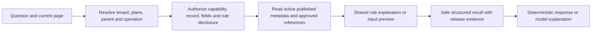

# Atlas answers grounded in Meta Entity rules

## Recommendation

Make the published Entity Framework the authority for Atlas answers, just as it is for forms and record operations. The model interprets the user's question and explains an authorized, versioned result. Server-owned capabilities select fields, resolve parent scope, format values and validate input. A prompt asking the model to respect permissions is not an authorization boundary.

Business Partner Address is a useful pilot, but it must enter through the shared Entity Framework. Do not restore the removed bespoke BP service/UI stack or teach Atlas to read repository JSON as runtime authority.

This document records a source review and a proposed implementation sequence. It does not claim that rule-explanation tools, an Address publication, or an address mutation journey have been implemented or deployed.

## What the foundation already provides

| Concern                   | Existing integration                                                                        | Assessment                                                                                                                                                                                                                                     |
| ------------------------- | ------------------------------------------------------------------------------------------- | ---------------------------------------------------------------------------------------------------------------------------------------------------------------------------------------------------------------------------------------------- |
| Active metadata           | `server/packages/platform/metadata/src/runtime-descriptor-repository.ts`, `findActive`      | Reads the activation head, active applied release/descriptor and published contract, scoped by plane and tenant. Use this path rather than draft files.                                                                                        |
| Published AI admission    | `server/packages/contracts/metadata/src/entity-ai.ts`                                       | Versioned aliases, field/relationship keys, context kinds and registered provider references. The contract explicitly says capability metadata is not an authorization grant.                                                                  |
| Current page admission    | `server/packages/platform/ai/src/business-context.ts`                                       | Resolves published metadata and verifies record/list access through Records. Binds descriptor hashes and scope fingerprints. Browser context is a request to validate, not authority.                                                          |
| Generic record answers    | `server/packages/platform/ai/src/entity-record-tool.ts`                                     | Reads published scalar summary fields through the authorized record gateway; checks fresh descriptor, authorization profile and source coordinates. Does not implement generic rule explanation or child-collection traversal.                 |
| Runtime tool installation | `server/apps/platform-host/src/composition/register-services.ts`                            | The local registry installs the generic record reader; configured deployments can install other registered tools. A BP provider name in the metadata vocabulary alone does not install its implementation.                                     |
| Field/mask enforcement    | `server/packages/services/records/src/record-read-access.ts` and `entity-list-service.ts`   | Field admission precedes projection; masked values remain masked. Form descriptors separately authorize create/patch and field writes. A form descriptor is not a general metadata-disclosure API.                                             |
| Mutation validation       | `server/packages/services/records/src/field-validation.ts` and `mutation-service.ts`        | Required fields, writable fields, type/enum/length/range/pattern checks and record predicates; operation/field authorization, locked parent values and owner mutation policies. Registered owner invariants can be stricter than scalar rules. |
| Replay authority          | `server/packages/platform/ai/src/tool-service.ts`, `revalidate`                             | Re-runs authorized read evidence using current authority and compares policy/result evidence before reuse. Extend this discipline to metadata rule answers, not only record values.                                                            |
| Postal reference data     | Country definition plus `address-form-choices.ts`                                           | Country exposes postal labels, examples, patterns and an address-format field; choices provide country-dependent hints. Their presence alone does not prove that the address mutation owner enforces a given rule.                             |
| Address rendering         | `packages/platform/entity/runtime/form-detail/src/related-record.tsx`, `postalAddressLines` | Preserves supplied postal lines, or combines authorized address parts. It is not a generic execution engine for Country's `address_format` field.                                                                                              |

The current safe form projection exposes field kind, required/read-only state and admitted choices. It does not expose the complete scalar validation or owner-policy explanation contract. Sending a raw EntityRuntimeDescriptor to the model would cross the intended boundary: it also contains storage bindings, internal policies and fields outside the user's disclosure scope.

## BP Address findings

The checked-in `metadata/products/mdg/entities/address/core.json`, `address/operation.json` and BP `presentation.section.addresses.json` are explicitly `draft_for_review`. Address operations include permissions marked as requiring catalogue verification; generic writes are disabled in the draft core. These files are design evidence, not proof of a live authorized capability. This review did not inspect the current DEV activation head for BP Address.

The presentation draft references a registered BP address handler. Confirm that a supported owner implementation is actually installed and published before enabling an AI provider. Do not infer support from that string or from the legacy `bp_read_addresses` vocabulary entry.

A correct answer to “What is required for this address?” therefore needs a current rule projection, not an assumption that common address conventions are enforced. In particular:

- Distinguish nullable storage fields, fields required for a particular operation, country-dependent input requirements and owner/workflow checks.
- Distinguish format hints from enforced validation. Do not call a postal pattern authoritative merely because it appears in reference choices.
- Explain only rules that are both implemented by the applicable validator and authorized for disclosure. Report unavailable/unsupported validation explicitly.
- Do not infer a country, postal code, missing address line or a masked component from model knowledge.

## Proposed runtime flow

The authorization and tool steps run on the server. A user asking about another BP must pass the same parent/record-scope checks; the model cannot substitute a different owner ID. No denied field names, hidden rule operands, raw policies, storage names or secret defaults should reach prompts, citations, errors, history or exports.

### 1. An authorized rule projection

Introduce a shared contract for rule explanation, produced by the same Entity owner that prepares forms and validates mutations. Proposed tool name: `entity_explain_rules` (not currently installed).

Its public result should contain only approved entity/section labels, permitted input fields, supported rule kinds, safe explanations, authorized reference choices and a release/rule revision. Internal execution evidence also binds the actor's current authorization revision, parent/scope fingerprint, descriptor hash and versions of reference data used.

Use explicit publication admission for rule explanation. Record-read permission is not permission to inspect all metadata. Write-only field input rules need a deliberate disclosure decision; permission to enter a value never grants permission to reveal the stored value. Deny rules involving inaccessible fields unless an approved owner explanation can omit those details safely.

Generate basic explanations from typed rules rather than having the model invent the interpretation of a regex. Require a code-registered owner explanation for conditional, cross-field or workflow rules. Unsupported owner policies must return “not available for explanation,” not a fabricated rule.

### 2. A deterministic input preview

Proposed tool name: `entity_preview_input`. It prepares a proposed value without saving it, after authorizing the intended operation and fields.

For Address, a versioned shared postal formatter can use the selected country's approved formatting profile and permitted address components. The same formatter should supply the UI preview and Atlas response. Templates need an allowlisted placeholder grammar, bounded output and no executable expressions. Record and metadata text remain untrusted content, never model instructions.

Return structured fields, formatted lines and the canonical validator's field-level results. Track whether each component came from user input, an authorized stored value or an approved reference lookup. Ask for missing input instead of manufacturing it. If a necessary component is masked, omit it or say a complete authorized preview is unavailable; do not reconstruct it from other data.

Do not run mutation side effects during preview. Owner checks requiring transactional state must expose a safe preview interface and still run again during the real write. “Preview valid” is not a guarantee that a later write will succeed.

### 3. Controlled changes later

Keep explanation/preview read-only initially. A later save must use the existing Records or governed owner command with explicit user confirmation, fresh authorization, expected version, idempotency, audit and applicable approval workflow. Model output is an input proposal, never permission to execute or bypass maker/checker.

### Example behavior

Question: “Format this BP address and explain why the postal code is rejected.”

An authorized answer would show the server-produced permitted address lines, identify the failing published rule in plain language, show an approved example if available, and cite the Entity release and relevant reference-data revision. It would state that the preview has not been saved.

If the user can view the BP but not its Addresses section, return a generic unavailable/unauthorized response. Do not reveal that a particular hidden address field, rule or value exists. If no authoritative postal rule is published, say that validation cannot be confirmed rather than quoting a plausible country rule from model memory.

## Implementation sequence and acceptance gates

1. Qualify one Address child Entity through the existing Country/Entity publication path: installed owner provider, parent relation, locked BP scope, current permissions and actual target activation. Keep browser onboarding, publication and runtime verification as separate evidence.
2. Add the shared authorized rule projection and `entity_explain_rules`; start with a rule-only pilot, with no writes or arbitrary descriptor access.
3. Add the shared formatter and `entity_preview_input`, reusing canonical field and owner validation. Add country-specific rules only when supported and published.
4. Qualify authorization and lifecycle behavior before enabling a model-backed explanation or adding mutation proposals.

Required tests should cover:

- Same question for permitted, denied, masked and write-only field contexts; no restricted labels, options, operands or values in any response channel.
- Cross-tenant, cross-plane, cross-BP, forged parent/child coordinates and unsupported section requests fail closed.
- Disabling the AI capability or changing descriptor/rule/reference versions invalidates cached results and stored-answer disclosure where applicable.
- Revoking permission in the same session prevents replay, citation expansion, history and export disclosure. Do not rely only on initial tool discovery.
- Model-proposed input receives exactly the same canonical validation outcome as the UI for required fields, patterns, ranges, enums, parent invariants and owner policies.
- Unknown, invalid or missing countries and unsupported format templates produce explicit unavailable/input-required results.
- Injection-like text in field labels, help, templates and record values never changes tool scope or execution policy.
- Preview performs no writes; stale versions, idempotent replay and approval requirements remain enforced on subsequent saves.

## Browser fixes delivered alongside this review

The shared-shell suite now passes all 30 tests. The four earlier failures used outdated Activity Center/Atlas accessible names, and the empty-state fixture lacked the current controlled Activity query contract. The tests retain viewport, mount/draft preservation, access-denial and retry assertions, and now verify the emitted unread/all query changes. No production authorization or validation was changed by these browser fixes.
