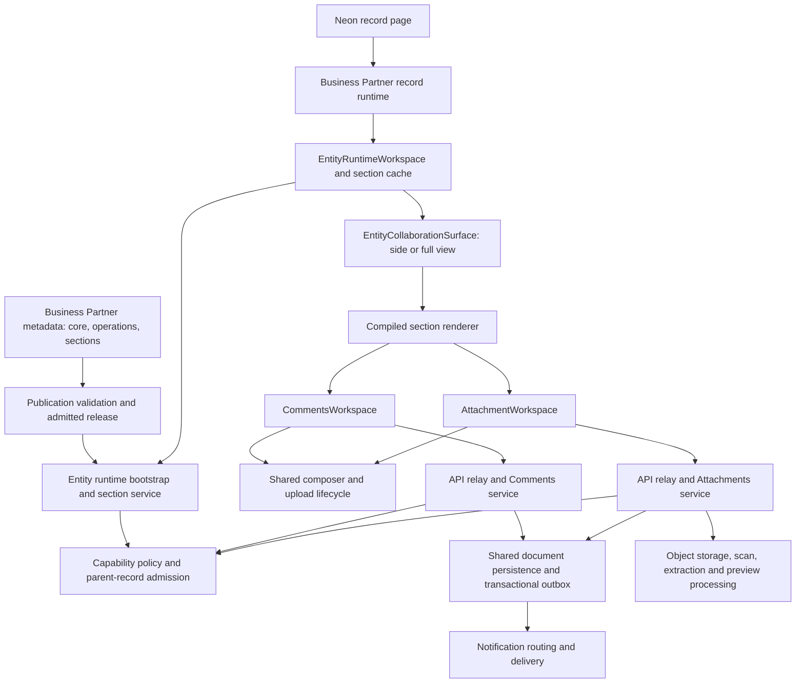

# Collaboration and MetaEntity architecture review

Reviewed against the working tree on 2026-09-23. This review includes local fixes and regression tests. It does not certify deployment, live notification delivery, or activation of a second published entity app.

## Assessment

Comments and Files already have the right broad architecture for reuse: entity metadata declares capabilities, the admitted runtime projects authorized sections/actions, shared React workspaces render them, and shared services own persistence and policy. Business Partner is a consumer. Copying its Comments/Files implementation into each new app would create unnecessary divergence.

The supplied inventory is partly outdated. `compiled-section-content.tsx` is now a 155-line renderer router. Comments and Files were extracted into separate workspaces during the preceding remediation. Those modules remain large—approximately 1,839 and 2,058 lines—and deserve further separation by state ownership, rather than another wholesale rewrite.

## 1. How Business Partner is wired

**Declaration and publication.** Under `metadata/products/mdg/entities/business_partner/`, `core.json` enables `platform.comments.v1` and `platform.attachments.v1`. `operation.json` binds their actions, permissions and owner entity. The two `presentation.section.*.json` artifacts select renderer/service keys, authorization and pagination. The publication capability contract validates the bindings. These authoring JSON files are marked draft-for-review; changing a file is not the same as publishing an admitted release.

**App entry.** `apps/neon/app/(shell)/mdg/business-partner/[recordId]/page.tsx` loads the product runtime. `packages/planes/neon/business-partner/src/record-runtime.tsx` supplies entity/record identity, operating context and the Comments/Files section keys. Route helpers express whether Collaboration should open and in which presentation. Saved panel placement should not itself open a record's Collaboration panel.

**Shared runtime.** `entity-runtime-workspace.tsx` combines bootstrap, header and lazy section resources. `use-section-resource.ts` scopes the cache by identity, authorization epoch, context and locale, with generation checks against stale requests. `collaboration-surface.tsx` supplies header/tabs and side/full presentation. Its persistent host preserves mounted composer state across presentation changes. `compiled-section-content.tsx` validates supported rows and dispatches by renderer key.

**Server admission.** `server/packages/platform/experience/src/entity-section-service.ts` resolves the admitted release and section, checks capability admission, invokes the registered handler and returns projected actions. `entity-capability-policy.ts` checks the capability declaration, operation binding, current parent-record access, action permission and audience constraints. Actual commands and retrieval must remain server-authorized; a hidden button is only a UI projection.

**Persistence and processing.** `server/packages/platform/collaboration` owns comments, replies, drafts, revisions, reactions and reports. `server/packages/services/attachments` owns staging/finalization, links, folders, versions, retention and authorized retrieval. Shared document tables and storage adapters keep these concerns independent of Business Partner tables. Document-processing providers handle scan/extraction/preview work.

## 2. Feature and ownership review

| Area | Current responsibility | Standard to preserve |
|---|---|---|
| Comment feed and replies | Comments workspace and section/thread pagination | Preserve loaded pages on mutation; reject stale generations; retain record context in thread requests |
| Composer, mentions and audience | `communications/collaboration-ui`, shared ComposerFrame, server rich-text/admission | Validate content and mentions on the server; do not derive access from client-supplied audience |
| Edit and drafts | Comments workspace and draft service | Keep root, reply and per-edit drafts isolated; cancel only the intended draft |
| Uploads | Shared `upload-lifecycle.ts`, service lifecycle | Stable operation identity, bounded requests, unknown-outcome recovery, identical picker/paste policy |
| File organization | Attachment workspace and folder command service | Folder revision checks, command receipts, explicit Unfiled destination; unlink is distinct from global archive |
| Versions and comment files | Attachment read model and pinned references | Preserve version identity; reauthorize preview/download |
| Preview/search | Shared preview/thumbnail components and discovery endpoints | Permission-scoped results; icon fallback; separate processing status from availability |
| Notifications | Comment transactional outbox and delivery routing | An emitted event is not evidence of inbox/email delivery |

Existing strengths include shared service contracts, transactional mutation/outbox boundaries, parent-record authorization, optimistic revisions, upload recovery and focused browser regressions. Remaining code-quality weaknesses include broad record-shaped UI data, large workspace modules, some literal section-name conventions, and heavily compressed legacy JSX/CSS. These are maintenance concerns, not grounds for duplicating the feature per app.

## 3. Confirmed issues fixed in this review

| Finding | Root cause and fix | Regression evidence |
|---|---|---|
| Replies unavailable for a differently named Comments section | Runtime supplied the thread callback only when `sectionKey === "comments"`. It now checks `platform.comments.v1` and retains the actual section key in requests. | Actual workspace/hook with a renderer probe uses `fixture_order`, `discussion`, record and organization context plus thread/cursor. This is a wiring test, not second-app acceptance. |
| Content-search results survive an access/client change | Search reset depended only on entity identity. It now also resets and aborts when the API client or search admission changes. | Delayed mock ignores cancellation; revocation and restoration cannot reveal its stale result. |
| Short snippets can be inaccessible in narrow panels | Expansion depended on a 280-character threshold while CSS clamps by rendered lines. ResizeObserver now detects actual clipping, with the length rule retained for text truncation. | A sub-280-character snippet in a narrow viewport expands fully and collapses again. |
| Undefined theme variables invalidate styling | Seven token names had no definitions, affecting focus, typography, surfaces and backdrop. Consumers now use canonical `--a-focus-*`, `--a-focus`, `--a-font-size-xs`, `--a-surface`, `--a-scrim` and `--a-warning`. | Static token-reference guard and browser focus checks in light, dark and high-contrast themes. |
| A repeated folder transition can lose its event | Event identity used folder/action/attachment, so moving into the same folder twice reused an event key. It now uses the command execution ID. | Move into folder, move to Unfiled, move back: three event identities; replayed commands add no events. |

The styling fix preserves the existing layouts. It does not reintroduce the previously rejected horizontal upload-bar design. Surface rules now resolve to the existing theme surface instead of an undefined variable.

## 4. Reuse across future MetaEntity apps

For an additional entity, the intended onboarding path is:

1. Define its Comments/Attachments capability declarations, owner entity, operation bindings, permissions, features and limits.
2. Publish authorized section presentations using the platform renderer/service keys. Use the existing `comments` and `attachments` section names until the remaining conventions are removed.
3. Supply valid parent-record admission and participant resolution for that entity and operating context. Reuse the registered capability services.
4. Mount `EntityRuntimeWorkspace` and `EntityCollaborationSurface` from the app's record experience; provide entityCode, recordId, surface, context and route intent.
5. Register the existing approved relay operations where the app host requires them. Do not add parallel app-specific comment/upload endpoints.
6. Verify audiences, mentions, uploads, preview/download, paging, context changes, edit drafts and notification delivery against the actual published app.

No separate Comments/Files UI or domain-specific comment tables should be required for the same feature semantics. Each app still needs real admission, metadata publication and acceptance work.

**Remaining convention coupling:** Business Partner explicitly supplies `["comments", "attachments"]`; comment-upload preparation loads `sectionKey: "attachments"`; Collaboration tab and toolbar decisions also use conventional section keys. Fixing the reply callback does not eliminate these other assumptions.

The durable improvement is an additive, validated capability-to-section projection in the admitted bootstrap plan. For example, expose the published section key, capability kind and supported presentation modes. The runtime can then resolve an attachment policy section by capability rather than guessing a name. Existing plans should retain their conventional-key fallback during migration. Do not infer authorization from that projection or from a tab label.

## 5. Recommended component boundaries

| Layer | Reuse as-is / next extraction |
|---|---|
| Foundation UI | Reuse PanelHeader, PanelTabs, PanelEmptyState, SearchField, FilterChipGroup, Tooltip, Dialog and ComposerFrame across Collaboration, Quick access and Activity center. Own their visual variants centrally. |
| Collaboration UI | Keep rich-text traversal, mention presentation, clipboard conversion, audience UI and upload lifecycle shared. Domain-specific participants enter through adapters. |
| Entity runtime | Keep one surface, resource cache, preview/download implementation and validated section boundary. Extract comment feed/reply state and file discovery/folder command state into dedicated hooks as those areas change. |
| Read contracts | Replace remaining `Record<string, unknown>` field access with complete discriminated resource types at the service boundary. Current row guards validate selected fields; they are not a complete response schema. Include pagination, revisions, processing states and permitted actions. |
| Product app | Own route integration, entity context and domain actions. Avoid forking shared workspace JSX or CSS. |
| Server composition | Extract read assembly from platform-host registration into tested provider modules. Registration should connect providers; shared contracts should describe their responses. |

Do not build one enormous generic component with dozens of flags. Small primitives can share appearance; dedicated state owners should handle Comments, Files and notifications separately.

## 6. CSS and code standards

Use semantic theme tokens for surface, foreground, border, focus, selection and status; use existing spacing, type, radius and touch-target tokens. Foundation primitives should own common appearance and keyboard behavior. Feature CSS should own feature layout, with logical properties for direction and responsive sizing.

Keep a single modifier for each supported presentation rather than app-specific selector copies. Use inline styles only for genuinely dynamic values such as measured panel width. Keep error, empty, loading and permission-denied states distinct. Icons supplement labels; tooltips must also work on keyboard focus. Preserve active editor focus and drafts during refresh or view switching.

For async code, require captured identity/generation, cancellation and explicit pending-operation ownership. Retry the same command identity for an uncertain result; create a fresh command only after a definite conflict and reconciliation. Do not refresh only page one after mutating a long list. Runtime validation belongs at external-data boundaries; TypeScript assertions alone do not validate HTTP payloads.

## 7. Follow-up priorities and notification policy

1. **Notification acceptance and semantics.** `collaboration-service.ts` emits create/edit events and mention events excluding the actor. The edit path passes all resolved current mentions, so retained mentions can emit again. Recommend notifying newly added mentions on edit and using comment revision/recipient/event kind for durable identity, with a separate deliberate policy for notifying existing participants about edits. This needs an atomic old/new mention comparison and retry tests; it was not silently changed in this review.
2. **Verify actual delivery.** The common notification seed declares `collaboration.comment.mentioned` routing to in-app/email. Verify outbox publication, recipient resolution, preferences, template rendering, worker delivery, inbox persistence/read state and authorized deep links. Include retries, removed mentions, denied/private audiences and tenant boundaries. Generic comment events do not by themselves establish a subscriber notification policy.
3. **Remove section-name conventions and prove a second published entity.** Add the admitted mapping described above and acceptance coverage for another app. The local generic-entity wiring probe is useful but insufficient for release closure.
4. **Extend validated contracts and extract state owners.** Preserve the existing regression suite while reducing broad row types and workspace responsibilities. Avoid an untested large rewrite.
5. **Review remaining mutation-event identity.** Category changes still use a category-value-based event key. Repeated transitions require a command/revision-based contract analogous to folder commands. That broader command/receipt change remains a follow-up; this review fixes folder commands, which already have durable receipts.

These remaining items mean the overall comments-and-attachments build plan should not be marked fully closed based on UI tests alone.

## 8. Verification performed for this review

- 60 browser tests passed: 36 file-discovery, 23 comment-actions/pagination, and one generic entity/section wiring regression.
- Six focused Node tests passed across upload/read-model reliability and the new theme token guard.
- Forty attachment service tests passed across lifecycle, routes and folder scope, including repeated transitions and command replay.
- Form-detail and attachment service typechecks passed, including attachment test types.

Browser tests use local fixtures. This review did not perform live storage/scan-provider acceptance, notification delivery, a production deployment, a second published entity activation, or Studio/Mesh acceptance. Earlier remediation evidence is recorded separately in [the UI audit remediation report](collaboration-ui-audit-remediation-20260923.md).
