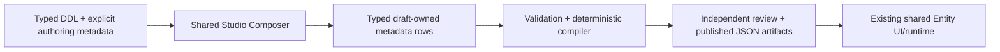

> **Historical design — superseded.** The sole active design is the standalone [Entity Studio blueprint](../blueprints/entity-studio/blueprint.md). This document is retained as historical evidence and is not implementation authority.

# Entity Studio authoring — authoritative design

**Status: sole active design for Entity metadata cleanup and DDL-led Studio authoring.** Last updated: 4 October 2026.

Update this file in place. Do not create companion design reports, alternative plans or JSON report copies. Other dated reviews are historical evidence, not implementation instructions. This document supersedes their Entity authoring/storage recommendations; it does not erase immutable applied migrations, audit records or publication evidence.

## Scope and architecture

Represent DDL tables/read models through the existing shared Entity Framework. Country and Principal Profile remain the reference experiences. Implement missing capabilities in the shared contracts, repository, compiler and standard UI; keep entity-specific choices in governed metadata.

**Authoring authority:** canonical typed metadata tables/fields. **Runtime authority:** exact approved, hash-pinned compiled JSON artifacts. `entity_surface.layout_config` is a legacy conversion carrier, not the target authoring model. Do not replace it with another arbitrary JSONB/EAV property bag or dual-write competing sources.

DDL supplies structural constraints; explicit governed properties supply readable identity, navigation, section behavior and supported controls. DDL column order cannot define the UI. Every composer property needs a DB location, typed API, editor/read-only reason, save/load mapping, validation and compiler mapping.

Excluded: bespoke entity applications/explorers/routes/providers, BP commands, banking-specific handlers, workflow/case execution, new business handler implementations and MFA changes. This document does not authorize publication or grant human review approval.

## Decisions and implementation status

| Area | Final decision | Current status |
| --- | --- | --- |
| Entity relationships | `entity_relation` + `entity_relation_target` + `entity_relation_field` are the single structural source | Shared canonical authoring validation/compiler/native projection implemented; legacy source conversion and live save/load qualification pending |
| Field references | `entity_field_reference_binding` supports lookup domains and registered resolvers only; entity references select canonical relations | New saves reject duplicate legacy joins; old compiled descriptors remain readable |
| Surfaces/sections/navigation | Explicit surface → navigation tab → section → ordered fields; shared layouts/components | Logical design below; typed schema extensions and composer implementation pending |
| List/detail/form presentation | Structured rows generate the existing UI contract | Existing list field/action wiring remains; standard detail/form sections still use legacy JSON until converted |
| Permissions/scope | Exact published Meta Entity properties through the shared authorization framework | Normalize storage without altering existing policy behavior or introducing inferred grants |
| Comments/attachments/activity | Reviewed existing profile selections and typed configuration; existing services/stores | Current capability contracts exist; normalized profile storage/composer and qualification remain pending |
| Publication | Existing ownership, independent human review and exact release/hash pins | No new release publication or live deployment verified by this work |
| Physical cleanup | Explicit forward migration after data/dependency and equivalence checks | No tables/columns dropped; no DB migration applied; containers remain stopped |

Validation completed: 45 focused authoring/compiler tests and 6 native projection tests passed. Production type checks and authoring test type checks passed. The broader platform metadata test type check reports four errors in unchanged `compiled-runtime-contract.test.ts` and `split-read-runtime.test.ts`. These results do not establish live composer/save/load or published runtime correctness.

## Source organization and target planes

- Common master data lives under `metadata/entities/common/master/`; common reference data under `metadata/entities/common/reference/`. `metadata/entities/mdg/` was removed. Folder location never supplies authorization, UI behavior or publication state.
- The 15 requested common references—bank_branch, bank_identifier, bank_institution, classification_scheme, commodity_code, commodity_crosswalk, country, currency, industry_code, industry_crosswalk, language, locale, state_region, timezone and uom—have the intended product target of Neon, Mesh and Studio. Definition/onboarding/qualification/publication must explicitly establish each target; directory presence alone is insufficient.
- Principal, Principal Profile, Principal UI Profile and Principal Notification Preferences are common product definitions targeting all three planes. Preserve owner/self access and published exact permissions.
- Person/Address/Contact and related master data use the same framework. Their accessibility and target publication require explicit governed metadata; do not infer plane eligibility or parent access from the folder or an entity name.
- BP sources were removed during the owner-directed cleanup. This design does not authorize recreating BP commands, business workflows or handlers. Any later BP onboarding must use this same DDL-driven framework.

## Canonical relationships and authorization

The relation row owns the name/cardinality/read behavior, the target row owns the target entity identity and declared target key, and ordered mapping rows own source-to-target fields. Presentation references relation identity and readable labels; it does not repeat joins.

The implemented authoring selection is `typeConfig.relationReference: { relationKey, labelField }`; surface relationships select `relationKey` with explicit presentation cardinality and read operation. The target DDL below promotes these selections to typed IDs. Target entity code is resolved from its stored metadata identity, not stored independently or guessed. Compiled legacy `keyReference`/relationship mappings are derived output.

State Region maps country_code → Country code, and its parent reference maps (country_code, parent_code) → (country_code, code). Principal's Profile/UI Profile references preserve optional zero-or-one presentation and explicit principal/tenant mappings; notification preferences use one-to-many. Child foreign-key mappings may differ from child record identity keys.

Structural relationships do not grant access. Enforce source and target published operation permissions, tenant/owner/record scope, explicit denies and existing platform controls. A valid undefined entity permission preserves the owner's access rule; broken/unpublished metadata or a broken defined permission is a distinct failure and must fail closed. Do not derive permission codes, expand grants or add MFA.

Current canonical Phase 1 authoring supports read-only one-to-one, many-to-one and one-to-many relationships with qualified mappings. Unsupported execution/mutation modes are rejected. The existing embedded reader requires explicit tenant scope; global embedded child surfaces remain unsupported until a shared contract improvement is qualified. Do not invent a global fallback.

## Current evidence, kept inside this document

The current compilers ran offline for every `definition.json` product: **15 products / 35 explicitly declared target-plane compilations, with no failures**. Source-only entities without these definitions are outside that compilation evidence. No database schema/row inspection, UI activation, live authorization qualification or publication ran.

| Product | Declared compiled planes |
| --- | --- |
| `address` | neon |
| `country` | studio, neon, mesh |
| `currency` | studio, neon, mesh |
| `employee` | neon |
| `external_worker` | neon |
| `language` | studio, neon, mesh |
| `locale` | studio, neon, mesh |
| `person` | neon |
| `person_address_use` | neon |
| `principal` | studio, neon, mesh |
| `principal_notification_preference` | studio, neon, mesh |
| `principal_profile` | studio, neon, mesh |
| `principal_ui_profile` | studio, neon, mesh |
| `state_region` | studio, neon, mesh |
| `timezone` | studio, neon, mesh |

The layout keys actually emitted are `ai`, `authorization`, `authorizationRuntime`, `defaultState`, `formPresentation`, `iconKey`, `identityField`, `limits`, `localizedLabels`, `mutationPolicy`, `ownerAccess`, `recordPredicates`, `recordPresentation`, `referenceCapability`, `supportedModes`. Optional consumer families are mapped below as well. The owner's 75% estimate was not verified against a live DB; the redesign does not depend on that percentage.

| Current graph rows | Country | State Region | Principal | Principal Profile |
| --- | ---: | ---: | ---: | ---: |
| Fields | 22 | 9 | 11 | 13 |
| Surfaces | 2 | 2 | 2 | 2 |
| Field bindings | 44 | 18 | 18 | 22 |
| Normalized sections | 0 | 0 | 0 | 0 |
| Operation placements | 0 | 0 | 0 | 0 |
| Normalized relations | 0 | 0 | 0 | 0 |
| Entity operations | 2 | 2 | 2 | 4 |

Zero section rows do not imply no sections: standard detail/form sections are presently inside JSON. Operation placements already feed the shared list-action compiler, although these four products declare none. Country's target example becomes **4 section rows, 21 displayed detail-field bindings, 1 explicit Overview navigation group and 4 group-to-section memberships**, with no record action placements. Country keeps its comments/attachments/activity configuration.

Confirmed DDL corrections: reconcile supported placement values with the SQL domain (the compiler currently accepts navigation/navigation_overflow while DDL rejects them); reject longer section-parent cycles; allow active-only position uniqueness where deprecated placements are retained. Existing same-graph guards and active default-surface uniqueness already exist and should not be duplicated.

## Existing table disposition

Retain the shared entity/draft/release/review spine, fields/keys/search, canonical relations, operation/permission/scope bindings, surfaces/sections/field/action bindings and capability enrollment. Zero rows in an example are not a deletion criterion. The typed extensions below specify new authoring ownership.

`entity_surface_component_binding` currently has DDL but no shared graph save/load mapping; it is not a completed custom-component mechanism. Its retirement or conversion requires consumer/data/FK inspection. The component field-role design below must be implemented through shared registered contracts before any selection is exposed.

Workflow/case/lifecycle/materialization/numbering collections are excluded from this activity. They are not automatically deleted from other existing applications. Keep immutable baseline/recovery/publication evidence outside normal layout authoring. Physical removals require explicit forward migrations after dependency/data inspection; preserve applied migration hashes.

## Canonical ownership and JSON boundary

1. `metadata.entity` remains the stable identity. All versioned definitions belong to an `entity_change_set`; the published release identifies that exact reviewed graph.
2. Every authoring property has one canonical table/column or member-row collection. No EAV/property-bag replacement, wildcard attributes, arbitrary executable SQL/JavaScript, or competing JSON source is introduced.
3. Use existing tables where their meanings match. Add shared tables only for independent profiles or repeated ordered memberships. Use typed scalar columns for scalar settings and field/operation/relation IDs for structural references.
4. JSON remains legitimate for **generated compiled descriptors, immutable legacy/recovery evidence and versioned validation/test literals**. It is not the normal composer storage for structural presentation, permissions or executable bindings. Existing field type/validation expressions need a separate supported-contract inventory; do not silently relocate a surface blob into `type_config`, `display_config` or section `layout_config`.
5. Typed arrays are permitted for bounded scalar sets such as allowed page sizes or aliases. Ordered structural memberships with identities or FKs use rows. Explicit empty collections are valid only where the contract permits them; absent required identity/navigation configuration is an error.
6. Compiled output is derived and hash-bound to the relational source. Neither UI clients nor importers may submit a competing compiled descriptor as new authoring input. Historical signed descriptors remain readable.

## Existing table extensions

The names below are proposed target columns. Match the final SQL/API naming convention when implementing them; each reference requires the ownership checks below.

| Table | Typed fields to add/promote | Purpose |
| --- | --- | --- |
| `entity_surface` | `title_label_id`, `description_label_id`, `icon_key`, `identity_field_id`, `title_field_id`, `code_field_id`, `search_profile_id`, `navigation_mode`, `form_mode`, `column_count`, `renderer_contract_key`, `renderer_contract_version`, `submit_label_id` | Surface identity/presentation and explicit registered renderer selection. Detail navigation mode matches `scroll` / `switch`; applicable fields are validated by surface kind |
| `entity_surface_section` | `label_id`, `icon_key`, `placement`, `relation_id`, `renderer_contract_key`, `renderer_contract_version` | Explicit section presentation and optional canonical relationship selection; keep existing parent/order/column/collapse fields |
| `entity_surface_field_binding` | `label_id`, `help_label_id`, `placeholder_label_id`, `list_available`, `read_only`, `grouping_enabled`, `width`, `alignment`, `format_contract_key`, `format_contract_version`, `relation_label_field_id` | UI-only field placement and supported formatting. These settings cannot grant field access, redefine storage or override mutation policy. A target relation label requires target-release validation |
| `entity_surface_operation` | `label_id`, explicit `target_surface_id` only where the operation contract supports multiple presentation destinations, `entry_policy` | Presentation of already declared operations; reuse existing placement, selection, confirmation and icon columns. Do not duplicate handler/permission/scope definitions |
| `entity_field` | `label_id`, `relation_id` | Canonical default label and structural relation selection; retain field semantics here. For a relation label rendered in several surfaces, use a declared default label reference plus explicit binding override, not independent joins |
| `entity_operation` | `label_id`, `authorization_target`, `authorization_effect`, `requires_parent_read`, `requires_preflight` | Explicit authorization semantics currently repeated in the JSON profile. Preserve existing handler/audit/idempotency contracts; do not derive these fields from operation names |
| `entity_operation_scope_binding` | Registered resolver reference/version where needed by its existing contract | Canonical scope coordinates, with no second scope definition in layout JSON |

`relation_label_field_id` points to the declared target field, not a source field. It is checked against an exact qualified target descriptor/key and pinned release at compilation/publication. Section `relation_id` uses the canonical relation mechanism already selected by the owner. Field names remain compiler output derived from referenced field rows.

Promoted properties replace their JSON counterparts after conversion. Existing title/label strings become compatibility/readback fields during migration; afterward display text comes from canonical labels. Do not accept independent text and label defaults that disagree.

## New shared authoring tables and minimum fields

Operation runtime binding owns plane-specific handler selection. Scope resolver key/version is owned by the referenced operation scope binding; do not independently repeat it in the runtime row. Preflight selection must match the existing operation requirement. Legacy `entity_operation.handler_key` remains read compatibility until migrated and then stops being a second writable property.

Every draft-owned table below includes `id`, `tenant_id`, `entity_id`, `change_set_id`, audit authorship/timestamps, and appropriate active/deprecated member status. Membership rows inherit their parent status unless separately versioned member status has an explicit purpose. One-to-one profiles have a unique owner/draft coordinate. This list describes logical ownership; omit redundant entity/tenant columns only if the established repository/guard contract consistently derives and enforces them from a parent.

| Proposed table | Minimum business columns / references | Composer control |
| --- | --- | --- |
| `entity_authoring_source` | source contract/version, source URI/revision/hash, source kind, explicitly declared target planes; references existing import/recovery evidence when applicable | Read-only provenance and governed publication targets |
| `entity_presentation_profile` | singular entity label ID, default locale code, required locale codes; references declared default surfaces where needed | Entity labels and localization settings |
| `entity_label` | unique draft-scoped `label_key`, `default_text` | Shared label selector/default text editor |
| `entity_label_translation` | label ID, locale code, translated text; unique label/locale | Translation grid |
| `entity_surface_navigation_group` | surface ID, key, label ID, icon key, position | Explicit navigation-group editor |
| `entity_surface_navigation_member` | navigation-group ID, section ID, position | Ordered section membership picker |
| `entity_surface_list_profile` | surface ID; supported modes, default page size, allowed page sizes, max sort levels, count mode; search enabled/minimum length where not owned by the search profile | List behavior/limits editor |
| `entity_surface_list_state` | surface ID, state key, state kind (`default` / `published_view`), label ID, query text, density, mode, group-field ID, position | Default state and published view editor |
| `entity_surface_list_column` | list-state ID, field-binding ID, position, width override when supported | Ordered default/view column picker |
| `entity_surface_list_sort` | list-state ID, field ID, direction, position | Ordered sort editor |
| `entity_surface_list_filter` | list-state ID, field ID, operator, typed literal value columns, position | Supported default/view filter editor |
| `entity_surface_filter_control` | surface ID, field ID, label ID, control kind, supported operator set, default operator, position | Visible filter controls; only actually implemented controls are selectable |
| `entity_surface_badge` | surface ID, field ID, optional label ID, position | Record badge editor |
| `entity_surface_badge_tone` | badge ID, typed field value, supported tone; unique badge/value | Badge value-to-tone grid |
| `entity_authorization_profile` | plane; ownership resolver key/version, record-read operation ID, directory operation ID, directory population | Published entity authorization metadata |
| `entity_field_access` | plane, field ID, read-operation ID, representation, permitted query-use set | Field-access editor using the shared authorization contract |
| `entity_field_write_operation` | field-access ID, operation ID | Explicit permitted write-operation memberships |
| `entity_surface_access` | plane, surface ID, operation ID and supported access target | Surface-access bindings currently inside the authorization profile |
| `entity_operation_runtime_binding` | plane, operation ID, scope-binding ID, registered handler/preflight keys and versions | Existing registered capability selections; no executable handler editor |
| `entity_record_access_profile` | plane, owner-field ID, created-by/updated-by field IDs, exact administration permission reference | Existing owner-access configuration; never inferred or enabled merely by entity class |
| `entity_record_predicate` | field ID, supported comparison operator, typed scalar value, position | Existing locked server predicate editor, separate from user list filters |
| `entity_record_mutation_binding` | registered existing mutation-policy contract key/version | Existing invariant binding only; no new business rule implementation |
| `entity_ai_profile` | enabled, description, aliases, supported context kinds, search-profile ID | Existing AI settings |
| `entity_ai_summary_field` | AI profile ID, field ID, position | Ordered summary fields |
| `entity_ai_binding` | AI profile ID, binding kind, registered contract key/version, operation ID for action bindings, position | Existing action/provider/presentation-profile selectors |
| `entity_ai_relation_binding` | AI profile ID, relation ID, position | Canonical relationship selector |

The table set is organized around actual independently ordered collections and separate platform controls. It is not a requirement that an onboarded entity populate every table. For Country many profile/access defaults are explicit read-only values and many member collections are empty. DDL/profile templates must show precisely which values were applied; no hidden runtime inheritance.

Default/list-view membership references the same field bindings as the owning surface. The `list_available` binding setting controls enrollment into the selectable column catalog; the explicit default state is the sole source for ordered visible columns. The compiler derives its legacy `defaultVisible` flags from that state. A column cannot be in a state if it is not available; UUID fields cannot be made available for visible lists or saved views. Personal saved views continue through the existing user-view service; product `published_view` rows do not absorb user preferences or change their ownership.

Typed literal values use a constrained tag and dedicated text/numeric/boolean/date/timestamp/UUID columns, or a supported typed list column for set operators. A CHECK requires exactly the payload allowed for that tag/operator; nullary operators have no payload. Values must match the referenced field's published type and operator set. UUID literals can be internal reference coordinates, but their editor/display uses authorized readable reference labels. Do not create an arbitrary JSON expression evaluator as a substitute.

Default text is authoritative in `entity_label`; non-default locale translations are rows. The compiler adds the default locale's text to the existing published localization shape. A default-locale translation row that creates a second source of truth must be rejected. The required locale set/default locale comes from `entity_presentation_profile`, with explicit catalog and completeness validation.

## Exhaustive layout-property disposition

| Current property/family | Canonical destination / action |
| --- | --- |
| `identityField`, `iconKey` | Typed `entity_surface` fields |
| `limits`, `supportedModes`, `search` | List profile plus existing search profile/fields |
| `defaultState`, `experience.standardViews` | List-state, column, sort and filter rows |
| `filterPresentation` | Filter-control rows and typed labels; field query eligibility remains authorization metadata |
| `localizedLabels`, `recordPresentation.localizedLabels` | Presentation profile, canonical labels/translations and consuming label references |
| `recordPresentation.titleField`, `codeField`, `navigation`, `sections`, `badges`, `actions` | Surface identity columns, navigation memberships, section/field bindings, badge/tone rows, existing operation placements |
| `recordPresentation.entityRelationships` | Canonical relation graph plus section relation selection and explicit read-operation/presentation cardinality. Add typed `read_operation_id`, presentation cardinality and empty-state label to the section relationship contract rather than repeat structural joins |
| `recordPresentation.related`, `panel`, summary/cards, section `component` | Inventory each used registered contract before implementation. Store registered renderer/provider key/version and typed field/operation/relation memberships; unsupported configurations block conversion. Do not carry a parallel section JSON blob or restore the unmapped component-binding table without completing its shared contract |
| `formPresentation.create` / `edit` | Explicit separate named form surfaces with typed `form_mode` (`create` / `edit`) when layouts differ, with section/field rows, operation input/result surface references and typed submit/help labels; shared renderer preserves existing behavior |
| `authorization` | Authorization profile, existing operation/permission/scope tables and explicit field/surface access rows |
| `authorizationRuntime` | Registered operation runtime bindings, independently qualified against installed shared capabilities |
| `ownerAccess`, `recordPredicates`, `mutationPolicy` | Dedicated record-access, predicate and registered mutation-binding metadata |
| `referenceCapability` | Existing exact published permission binding. Where needed retain a typed catalog-reference selection; never reconstruct a permission code or grant roles based on this marker |
| `ai` | AI profile and typed field/contract/relation selections |
| `experience.routes` | Operation target surface and shared route contract. New arbitrary URLs are not a normal composer feature; validate any supported links through the existing route contract |
| `experience.application` / custom explorer/task navigation | Not a new Phase 1 authoring feature. Preserve immutable historical evidence and block silent conversion of unsupported behavior; no bespoke app generation |
| `collectionRelationship`, `collectionCompilation`, `collectionConfiguration` | Separate existing collection-framework authoring contract. Inventory actual consumers and provide typed ownership/bindings there before retirement of its layout carrier; do not treat a DDL table as a new collection/business command implementation |
| `systemReferenceProduct`, `tableEntityProduct` | Typed `entity_authoring_source` and existing import/publication evidence references, including source hash and declared target planes; not UI layout |
| `baselineImport`, `authorizationSuccessor`, `runtimeRestoration` | Existing baseline/recovery/review evidence and source release/hash references. Historical payloads remain immutable evidence, outside normal composer editing; reuse their existing storage where appropriate |
| Other keys | Import reports the exact unsupported source path and blocks that successor. No silent dropping or pass-through into a new JSON property bag |

The last families are explicitly handled as migration dependencies, not claims that new tables or execution features have been implemented. They do not block designing the core Country table experience, but they prevent claiming repository-wide JSON retirement prematurely.

## Database guarantees

- All structural references must belong to the same entity/change-set graph, except declared external relation targets, catalog permissions, installed capability references and immutable source-release evidence. Each exception has an explicit tenant/plane/approval check.
- Prefer composite FKs with **non-null** entity/change-set coordinates and referenced unique keys for same-graph ownership. PostgreSQL composite FKs containing nullable tenant coordinates can skip checks; retain the existing NULL-safe tenant guard and test platform-owned `tenant_id IS NULL` cases explicitly.
- Member inserts/updates and deferred graph validation verify active references, valid surface kinds, exactly one required/default profile, default page-size membership, unique active sibling ordering, valid cardinality and an acyclic section tree. Keep existing default-surface uniqueness rather than add duplicate constraints.
- Navigation membership covers all eligible sections as required by the shared navigation contract. No UUID visible identity, invented Overview/navigation, or first-field display fallback is permitted.
- Filter/sort/group controls can reference only enrolled and query-authorized fields. A field binding, action placement, AI selection or relation never grants access.
- Registered capability keys/versions are validated through installed contracts at compilation/publication. DDL syntax validity cannot certify a runtime implementation exists.
- Active position uniqueness excludes retained deprecated field/action placements where successor reuse is intended. Section lifecycle/order semantics are explicit. Keep source IDs and review evidence stable.
- Resolve the observed compiler/DDL placement-domain mismatch against the supported Phase 1 set. Do not expand the domain to advertise unimplemented placement behavior.
- Existing JSON visibility/editability rules require an explicit supported condition-contract inventory. Prefer operation-access references for permission visibility and typed, supported field predicates for data conditions; unsupported expressions block conversion. Do not expose a free-form expression editor or add a new evaluator under this redesign.
- Index owner/change-set traversal and FK selectors, with parent/position indexes for repeated collections. Add indexes against observed queries; no blanket GIN indexes on a new JSON carrier.
- Keep existing RLS, author/proposer/reviewer controls and audit triggers. No additional MFA configuration is introduced or edited by this redesign.

## DDL-led composer contract

The DDL supplies types, domains, nullability, FKs, uniqueness and ownership. **DDL alone cannot supply readable identity, navigation design, supported widgets or authorization intent.** A versioned shared `AuthoringSchemaDescriptor` combines the actual DDL with explicit governed authoring presentation/capability metadata. It declares label references, groups/order, supported editors, selectors, validation messages, read-only/generated columns and registered contracts. Do not infer a usable screen from column order or UUID identifiers.

Generate/check this descriptor through the existing shared Entity Framework tooling. The Studio composer consumes it through the shared authoring service; it does not obtain unrestricted database access or invent another API/provider stack. Table/column names are server-owned schema contracts; clients submit typed property IDs, never SQL identifiers or clauses.

Use basic controls from shared DDL-type mappings (boolean switches, constrained numbers, text/date inputs, domain selectors), with explicit published widget overrides. FK selectors show the target's governed readable identity and enforce authorization. Repeated metadata rows use the existing shared editor/list components with explicit scope locked to the open draft. Technical UUIDs remain internal.

Recommended explicit composer navigation: Identity & Fields; Keys & References; List; Detail & Forms; Navigation & Sections; Labels & Locales; Permissions & Scope; Existing Capabilities; Publication Review. These are shared authoring properties, not hardcoded business entity pages. AI controls select existing contracts; unsupported features have actionable configuration errors and are not offered as placeholders.

Every property in the descriptor must have: a canonical database location, a typed API property, a composer control/explicit read-only reason, save/load mapping, a validation rule and a compiler output mapping. The implementation is incomplete until this trace exists; adding SQL tables alone is insufficient.

## Save, compile and publication sequence

1. Load the source draft and versioned authoring schema descriptor through the existing authorized Studio service. Read the canonical profiles/rows, including explicit source release provenance.
2. Submit typed graph edits with expected revision. Lock/check the owning change set; reject unknown properties, cross-graph IDs and unsupported selections. Validate scalar inputs and resolve catalog/relation targets without inventing permissions.
3. Apply all parent/member changes in one existing repository transaction. Use deferred structural validation where necessary, then advance one revision and audit it. Failure rolls back every row and revision. Concurrent stale saves return the existing conflict result.
4. Reload normalized rows. Preview and compilation use readback, not the unverified submitted body. Save success and preview failure remain distinct, as in the existing authoring service.
5. Canonicalize rows with stable owner/member ordering. Hash the complete semantic graph including labels, permissions, capability versions, locale requirements and dependencies; exclude transient database timestamps. Repeated compilation produces identical hashes for identical semantic input.
6. Compile the existing list/detail/form/authorization/AI JSON contracts, then run their real shared parsers and capability/target qualification. Persist the artifact/hash through the current publication storage. A compiled JSON snapshot is derived output, never a writable authoring authority.
7. Platform Admin authors/proposes and an independent Platform Owner reviews the exact product release/hash. Tenant authoring/review stays isolated under existing ownership. Publish to explicitly declared planes and pin source/target dependencies. A service account or seed receipt is not human approval.
8. The existing shared UI reads the approved compiled contract and enforces published authorization/tenant/record scope. No application changes are required just to add another eligible business entity.

The new semantic graph/authoring descriptor/compiler needs an explicit version. Build a canonical semantic representation rather than reusing the current whole-object hash as-is once new persistence-owned columns are introduced. Preserve hashes and compiler versions of historical applied releases. Raw row serialization with arbitrary ordering or generated timestamps is not an acceptable release hash.

## Migration and retirement

**Stage 1 — schema and trace:** finalize these columns/collections against the evidence in this document; author forward migrations, contract types, DDL checks and explicit composer property mappings. Existing applied SQL files/hashes are preserved. Validate the deployed schema before execution.

**Stage 2 — bounded implementation:** implement Country's surface/identity, labels, section/navigation and list profiles end to end; then use State Region and the Principal/Profile family to qualify relations, separate form layouts, owner scope and existing writes. Every change is shared and configured through metadata. AI bindings and full security-profile normalization follow their own bounded qualification; no new provider or handler is authorized.

**Stage 3 — explicit conversion:** a migration/import adapter reads legacy JSON, validates every path, writes a new structured draft and records source identity/hash. It emits a property-by-property ledger (source path → target row/property → compiled path) and unresolved-path report. Preserve historical releases and legacy evidence; do not rewrite already reviewed payloads or delete business data.

**Stage 4 — equivalence and review:** compare semantic compiled outputs for every affected declared plane, preserving labels/navigation, field enrollment, capability selections and permissions/scope. Expected changes are individually reviewed. Verify live composition/save/load, preview, authorization failures and default/list/detail rendering before release review/publication.

**Stage 5 — one writer:** new structured drafts use only normalized typed APIs. Historical formats have read compatibility; the explicit conversion adapter is the only legacy-to-new write path. Do not dual-write authoring JSON and rows or silently select whichever was last updated.

**Stage 6 — retire carriers:** once every supported consumer is converted, normal authoring no longer accepts `entity_surface.layout_config` and duplicated section/binding JSON structure. Move immutable evidence through existing archive contracts where needed; remove empty legacy columns only through forward migrations after dependency/data checks. Retain explicitly approved bounded literal/validation contracts with a registered schema; no arbitrary extension dictionary is permitted.

## Required acceptance evidence

- Every source configuration path has a migration disposition; unknown paths block conversion. No business entity name/permission dispatch exists in the shared implementation.
- Country's 4 sections, 21 detail field placements and explicit 1-tab/4-member navigation survive save/load and compilation; technical IDs remain internal.
- State Region's Country/composite parent relationships and Principal's optional child cardinality, tenant/owner enforcement and separate profile form layouts survive conversion.
- All 35 currently compilable declared-plane source graphs still compile, or an exact reviewed reason explains a deliberate change. Source-only entities and any other live drafts are audited separately before repository-wide retirement.
- Invalid targets, cross-tenant IDs, circular sections, malformed scalar values, duplicate active positions, unsupported controls/providers and visible UUID configurations fail before publication.
- Tests prove rollback/no revision advance on invalid saves, optimistic concurrency, readback/hash stability, deterministic compilation and independent human review bound to the exact graph.
- Defined permissions use their exact published codes; valid undefined permissions preserve the owner's access rule. Unpublished/broken metadata fails closed. No grants/MFA changes are inferred from new DDL fields.
- UI qualification proves controls actually work and preserves shared navigation/list/detail behavior. Personal view ownership is unchanged.
- Runtime/publication evidence is reported separately from implementation and offline compilation. No percentage estimate or schema-only test establishes user-flow completion.

## Explicit hierarchy, shared components and collaboration profiles

The hierarchy and profile requirements below are part of this single design. The new composer implementation remains pending.

- A surface's navigation-group rows define its tabs and explicit labels/order. Navigation-member rows point to section rows. Section field-binding rows point to canonical fields and specify order/layout. Shared column/collapse/placement settings are typed metadata. Tabs are navigation groups, not a second duplicated section definition.
- Shared renderer key/version selects an installed reusable layout/component contract. For field-based components add `entity_surface_component_field` memberships (`section_id`, `role_key`, `field_binding_id`, `position`), with unique role/field bindings and registered role validation. Do not keep component field-role mappings inside a JSON dictionary. The existing specialized section-component parser is not a general registry contract: its current single renderer/role shape needs a shared registry improvement before claiming arbitrary component selection works.
- The approved Phase 1 component scope is standard field layouts and sections. A future component attached directly to a tab or individual field needs an explicitly supported placement contract and appropriate binding owner; do not expose placeholder placements or infer them from renderer names. Reuse existing registered components, with no entity-specific page or executable-code upload.
- Keep `entity_capability` as canonical capability enrollment. Promote enabled/service contract/admission contract, load mode, aggregate inclusion and immutable profile selection (code/version/source release/hash) to typed fields. Capability placement references that enrollment from the shared surface/section/header layout; it never creates another service stack.
- Profile settings require typed capability-specific models: comment settings (audiences, length/depth, replies/reactions/mentions, draft retention and attachment rules), attachment settings (file/batch limits, content types, existing scan requirement, categories/folders/versioning and processing flags), activity settings (available/default views, query limits, retention and already supported capture/recording policy). Repeated registered actions use capability-action rows with exact governed permission/handler references and concurrency/idempotency settings. Select a reviewed profile release and permit only its explicitly allowed overrides; do not use an arbitrary `overrides` JSON object or copy an independently editable profile blob into every entity.
- Existing profile authoring/governance is reused. A profile's settings, allowed override rules and member rows need normalized shared profile storage when its UI authoring is implemented. Entity enrollment pins that immutable source; compilation freezes the resolved configuration into the entity artifact. The profile editor must show the source profile, effective values and permitted override bounds. No unreviewed mutable default is read at runtime.
- Country currently enrolls comments and attachments through `capabilities.json`, and selects `platform.activity.standard` version 2 through `activity.json`. Activity supports timeline, audit log, versions and snapshots through existing contracts. Selecting a view does not establish that its entity has recorded history, snapshots or an installed authorized reader. Qualification must validate actual data/reader coverage; empty permitted histories remain empty, with no synthetic history or new recording handler.
- Each collaboration/history reader enforces the authorized parent record and tenant scope plus exact published action permissions. Child services receive locked record coordinates. A tab label, selected profile or parent visibility does not grant mutations/downloads/history access.
- Comments, files, audit events and snapshots stay in their existing owning stores. Metadata saves only configuration/bindings. Audit/history Entity lists and embedded record views use the shared Entity Framework; no standalone HistoryExplorer, custom history route or duplicate API is introduced.

Required UI evidence includes correct tab/section ordering, authorized field-role mapping, lazy comments/attachment/activity loading, exact profile version/hash, read/write capability distinctions, locked record scope, proper empty/unavailable states and cross-tenant denial. No component/profile publication is claimed until these checks and the existing independent release review pass.

## Implementation trace and document maintenance

Use this document as the sole design authority. Update the decision/status table and the affected specification section together when work changes. Keep evidence and limitations here; do not create another design report or JSON companion. Unresolved configurations block conversion instead of authorizing a workaround.

Existing integration points:

- [Authoring graph contracts](../../server/packages/contracts/meta-entity-authoring/src/model.ts).
- [Shared save/load repository](../../server/packages/planes/studio/meta-entity-authoring/src/kysely-authoring-repository.ts).
- [Authoring service](../../server/packages/planes/studio/meta-entity-authoring/src/authoring-service.ts).
- [Deterministic validation/compiler](../../server/packages/planes/studio/meta-entity-authoring/src/deterministic.ts).
- [Canonical relation derivation](../../server/packages/planes/studio/meta-entity-authoring/src/canonical-relations.ts).
- [Canonical target validation](../../server/packages/planes/studio/meta-entity-authoring/src/canonical-relation-targets.ts).
- [List experience compiler](../../server/packages/planes/studio/meta-entity-authoring/src/list-experience.ts).
- [Native runtime projection](../../server/packages/platform/metadata/src/native-runtime-projection.ts).
- [Studio metadata DDL](../../server/db/ddl/planes/studio/metadata/03_tables.sql).
- [DDL domains](../../server/db/ddl/planes/studio/metadata/02_domains.sql), [indexes](../../server/db/ddl/planes/studio/metadata/06_indexes.sql), [graph guards](../../server/db/ddl/planes/studio/metadata/07_functions.sql).
- [Shared component contract](../../packages/contracts/platform/entity-runtime/src/section-component.ts).
- [Capability profile contracts](../../server/packages/contracts/publication/src/capability-profile.ts).

**Next implementation boundary:** implement and qualify Country's typed surface/section/navigation/field/label/list authoring through these shared paths, then prove the same implementation with State Region and Principal/Profile. No bespoke business implementation is an accepted substitute.
