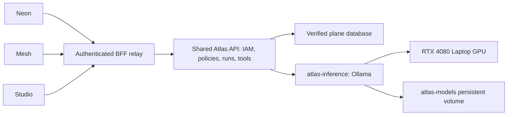

# Atlas local inference implementation plan

Status: Phases 0–3 completed on 2026-09-07; generation integration and subsequent phases remain proposed. See [GPU benchmark qualification](atlas-gpu-benchmark.md): measured targets passed, with application queue admission and context budgeting required before shared chat. See [model acquisition and offline restore](atlas-model-artifacts.md) for the full artifact pin and offline acceptance evidence. See [inference deployment](atlas-inference-deployment.md) for private connectivity, persistence, and separate readiness evidence. See [Docker GPU setup result](atlas-docker-gpu-setup-result.md) for installed versions, CUDA computation evidence, and service recovery.

Objective: deploy Ollama as `atlas-inference`, retain and verify `qwen3:8b`, and connect it to the governed Atlas backend serving Neon, Mesh, and Studio. Preserve conversation history, IAM, tenant isolation, policies, and domain commands. Retain cloud adapters as inactive alternatives; local bindings have no cloud fallback.

## Starting point

The machine assessment found an RTX 4080 Laptop GPU with 12 GB VRAM (about 9.9 GB available at inspection), NVIDIA driver 610.88, an i9-13980HX, approximately 64 GB host RAM, 31 GB exposed to WSL with 18 GB available, and about 854 GB available in the WSL filesystem. These are point-in-time readings; recheck before execution. Ollama was not detected, WSL can access the GPU, and the Docker daemon has no NVIDIA runtime registered. DEV, QA, and shared operational services use this daemon.

Atlas history is deployed separately from inference. Authenticated browser history verification remains outstanding because the previous session expired. The API entrypoint supplies no complete AI dependency bundle. The provider union and credential database constraints currently name only OpenAI, Anthropic, and Gemini. Existing runtime interfaces require provider credentials, run persistence, usage recording, policies, prompts, and tool services. Installing a model alone cannot complete these dependencies.

## Proposed architecture

Service name: `atlas-inference`. Engine: official Ollama image pinned by immutable digest. Internal endpoint: `http://atlas-inference:11434`. Initial upstream model: `qwen3:8b`; user-facing model ID: `atlas-re-1.0-local`, display label: Atlas RE 1.0 Local. Keep the upstream identity visible in server diagnostics and deployment receipts. An Atlas display label does not rename or change the model's provenance or license.

Use a dedicated internal inference network attached only to the development API and inference service during normal operation. Publish no host port and add no Traefik route. Native Ollama does not enforce Athyper permissions; application access must enter through the API. Host Docker administrators remain trusted. Use a separate temporary bootstrap network/profile to download model artifacts, then recreate the serving container on the internal-only network.

## Phase 0 — Docker GPU access

1. Verify the Docker context, daemon location, WSL distribution, GPU visibility, and driver before choosing installation steps. The observed setup uses a local WSL Docker daemon; do not configure a different Docker Desktop daemon by mistake.
2. Capture current container health, API readiness, active deployment image digests, restart policies, and Docker configuration. Keep an owner-readable backup of `daemon.json` and runtime configuration.
3. Install a pinned compatible NVIDIA Container Toolkit from NVIDIA's signed repository. Retain the Windows GPU driver exposed through WSL; do not install a Linux display driver inside WSL.
4. Generate and review the runtime configuration change, preserving unrelated Docker settings. Configure the NVIDIA runtime without changing the default runtime unnecessarily.
5. Coordinate a brief Docker restart. Check active work first because the daemon serves DEV, QA, and shared operations. Do not assume live-restore eliminates disruption or stop database containers abruptly.
6. Run a disposable, pinned CUDA sample container with GPU access. Verify device identity and actual CUDA computation, not just `nvidia-smi` output.
7. Recheck every previously running service and DEV/QA readiness; restore service state before proceeding if any regression occurs.

Exit gate: CUDA executes inside Docker and existing services recover to their recorded health state. Rollback: restore daemon configuration, restart Docker as needed, and recover the recorded workloads.

References: [NVIDIA installation](https://docs.nvidia.com/datacenter/cloud-native/container-toolkit/latest/install-guide.html), [WSL driver guidance](https://docs.nvidia.com/cuda/wsl-user-guide/index.html).

## Phase 1 — Isolated service and storage

Create an opt-in development Compose overlay and integrate it with the deployment controller so routine DEV deployments preserve it. Do not implicitly enable it in QA, staging, or production.

Initial configuration to validate against the pinned Ollama version:

| Setting | Initial value |
|---|---|
| Service | `atlas-inference` |
| Model volume | `atlas-models`, scoped to the deployment |
| Container mount | `/root/.ollama` for the official image, validated during setup |
| Cloud features | `OLLAMA_NO_CLOUD=1` |
| Context | `OLLAMA_CONTEXT_LENGTH=4096`, also explicitly controlled per request |
| Loaded models | `OLLAMA_MAX_LOADED_MODELS=1` |
| Parallel inference | `OLLAMA_NUM_PARALLEL=1` |
| Runtime queue | Small bounded queue, initially 8; API admission adds a bounded wait |
| Keep alive | 5 minutes initially |
| Output cap | 1,024 tokens per request |
| Thinking | Disabled explicitly for the initial baseline |
| Host RAM cap | Start at 10 GiB and adjust using measured peak memory |
| GPU | Explicit NVIDIA device reservation; no assumption of VRAM partitioning |
| Host/public ports | None |
| Cloud fallback | Disabled |

The total context budget includes system instructions, history, user input, tool schemas/results, and reserved output. Configure one loaded model and one active request to avoid multiplying GPU memory consumption. Docker's host memory limit does not impose a GPU VRAM limit.

Separate process liveness from model readiness: the process can answer while the model is absent. Model readiness requires the expected digest and a successful bounded warm-up. A model outage disables generation with a clear error while history and unrelated application routes remain available. Avoid making every `/readyz` request trigger inference.

Exit gate: private API-to-inference connectivity works; no public endpoint exists; service recreation preserves model storage; cloud-disabled configuration is effective. Reference: [Ollama Docker](https://docs.ollama.com/docker), [Ollama FAQ](https://docs.ollama.com/faq).

## Phase 2 — Download, verify, pin, and mirror

1. Select and record a tested official Ollama release and its full image digest; never deploy an unqualified moving `latest` tag.
2. Pull `qwen3:8b` through the temporary bootstrap path. The model catalog currently lists a roughly 5.2 GB Q4_K_M package; allow space for downloads, installed artifacts, and one rollback copy.
3. Read the full model digest through `/api/tags` and inspect model metadata with `/api/show`. Verify family, parameter size, quantization, template, context capability, and license against the expected artifact.
4. Record a versioned model lock manifest containing source tag, full digest, Ollama version/image digest, model metadata, license reference, prompt/template revisions, runtime parameters, and acquisition time. Record any locally derived alias separately; do not assume an alias proves identity.
5. Verify stored manifest/blob hashes. Tag names remain mutable; require digest checks on initialization and before model readiness. Pinning must not rely on assuming the pull API supports a particular digest syntax.
6. Retain model manifests and blobs in the volume. Create an offline backup archive with checksums and retain the container image or an OCI/image archive. Store large artifacts outside Git; commit only the lock manifest and scripts.
7. Recreate the service without its download network. Run inference, then restore the saved artifacts into a disposable volume and verify the same digest and successful offline inference.

Exit gate: the exact recorded model can be restored and run without downloading it again. A mismatch fails generation readiness rather than silently accepting new weights. References: [model catalog](https://ollama.com/library/qwen3:8b), [model digest API](https://docs.ollama.com/api/tags).

## Phase 3 — Independent GPU benchmark

Use synthetic fixtures while existing Athyper services remain running. Record hardware state, model/image digests, context settings, thinking mode, output budget, and fixture version with each result.

Run one cold-start test, followed by at least 30 warm requests covering short chat, structured business summaries, multi-turn context, structured JSON, and increasingly large inputs. Separately test cancellation, context overflow, queue saturation, malformed tool arguments, and a bounded service restart scenario. Repeat any performance outliers before drawing conclusions.

Measure cold-load time, first visible token latency, complete response latency, prompt tokens/second, generated tokens/second, peak host RAM/VRAM, actual GPU offload, failure rate, and collateral impact on DEV/QA readiness. Use streaming wall-clock measurements for first-token latency and Ollama evaluation counters for throughput. Keep thinking/output accounting separate when evaluating thinking mode later.

Provisional acceptance targets, not predicted results: warm short-chat p95 first-token latency at most 5 seconds, median output throughput at least 15 tokens/second, no OOM events, no silent CPU-only fallback, cancellation releasing the single request slot within 5 seconds, and no reproducible readiness regression in the existing stack. Evaluate answer correctness and structured output against explicit fixtures, not fluent appearance. Record output lengths so generation caps cannot game the throughput result.

If targets fail, inspect GPU offload and context allocation first. Tune context/output and keep-alive before considering another model. A 4B fallback is a separately qualified artifact and must not be substituted silently. Reference: [Ollama response metrics](https://docs.ollama.com/api/generate).

## Phase 4 — Atlas generation integration

A. Add a dedicated `server/packages/adapters/ai-ollama` package implementing the Atlas provider interface, preferably using native `/api/chat` to control context, thinking, tools, streaming, and metrics explicitly. Normalize NDJSON chunks into Atlas events; handle split records, malformed streams, missing terminal events, disconnects, timeouts, cancellation, and completed tool-call arguments. Never expose internal thinking as ordinary answer text. Preserve separate canonical identities for UI model ID, upstream name, and artifact digest; validate name normalization rather than weakening mismatch checks globally.

B. Extend provider types, request validators, relevant database constraints, serialization, and dependency registration for `ollama`. Use forward migrations and clean-install DDL parity. Existing cloud-provider behavior must remain covered by regression checks.

C. Model local transport authentication explicitly. Current contracts require a secret lease; refactor to a discriminated local/no-provider-secret mode rather than inventing a fake API key. Restrict that mode to the configured internal Ollama endpoint, with no request-controlled URLs. Review usage-ledger and credential foreign-key requirements so local calls retain a stable deployment identity without fabricating credentials. Preserve secret-backed resolution for cloud providers. Externalizing the service later would require a separately authenticated transport.

D. Compose the inference core independently of optional credential-admin, knowledge-ingestion, and monitoring integrations. Do not satisfy the existing broad dependency bundle with fake implementations. Reuse durable thread storage, add the real plane-scoped run repository and content-free usage ledger, and connect admission, model policies, prompts, quota, and the Ollama adapter. Identify optional capabilities explicitly and keep unavailable operations disabled. Only change worker/scheduler composition when a real recovery or tool workflow requires it.

E. Implement atomic run/message creation and terminal transitions. Cover idempotency payload mismatch, concurrent duplicate requests, in-flight replay, message sequencing, cancellation/completion races, restart recovery, and bounded handling of abandoned runs. A retry must not generate or execute a business action twice. Apply tenant/principal/plane RLS to every persistence operation.

F. Enforce the 4,096-token budget across the complete prompt. The current 55,000-character input ceiling and larger bounded-history allowance cannot be reused as local context limits. Use a model-compatible tokenizer or conservative validated accounting with a safety margin; reserve output tokens, trim oldest complete turns, and reject an oversized current request. Tool definitions/results consume the same budget. Retention history can remain longer than the context sent to the model.

G. Publish an `atlas-re-1.0-local` binding with inference tools initially disabled, explicit synthetic/internal data policies, no fallback, model digest, and versioned system instructions. Preserve exact-plane `*.ai.agent.use` authorization, tenant admission, deny precedence, and quota checks. Record local token usage and latency; represent provider API fees as zero without claiming electricity/hardware cost is zero.

H. Build the API with the new adapter, run targeted contract/service/integration checks, inspect the exact image dependency graph, apply migrations, then redeploy. Add capability-specific status so the UI can explain unavailable generation while history continues working.

Exit gate: one authorized synthetic conversation streams a local answer, persists it, records its usage, and correctly handles denied access, cancellation, provider outage, and duplicate submission. Reference: [Ollama chat API](https://docs.ollama.com/api/chat).

## Phase 5 — Three-plane acceptance

Use normal authenticated sessions and fresh MFA when required. Verify the same matrix independently in Neon, Mesh, and Studio:

- History GET `/api/relay/atlas/threads` returns 200 with the actual persisted list.
- Create a thread, submit a run, observe streaming and a terminal result, then reload and verify both messages.
- Read messages, paginate, rename, archive, and verify row-version conflicts and supported lifecycle endpoints.
- Recreate API and inference containers and verify persisted history survives without another model download.
- Cancel generation; retry an identical idempotent request; restart during a run and verify recovery does not duplicate output.
- Deny anonymous, missing-capability, cross-tenant, cross-plane, and uninvited-user access. Exercise an allowed participant and a revoked participant.
- Simulate model unavailability and quota exhaustion; history remains functional and generation reports the correct error.
- Inspect desktop/mobile chat behavior for stream cleanup, stale pending messages, error feedback, and history updates.

Use a second authorized test principal and a second tenant for negative cases; do not grant broad permissions merely to make a test pass. Pace traffic to avoid BFF limits and the single inference slot. Save a report with route statuses and assertions, but no cookies, access tokens, or sensitive conversation bodies.

Exit gate: every plane has recorded authenticated chat and persistence evidence, including successful history responses. Backend unit tests cannot substitute for this gate.

## Phase 6 — Governed tools

Enable read-only tools first, beginning with `bp_read_summary` only in planes with a supported record gateway. Keep mutation admission false. Validate schemas, resource access, field filtering, result size, citations, and rejection of unknown tools. Tool availability must follow each plane's real capabilities; shared inference does not make a Neon command valid in Studio or Mesh.

After read-tool acceptance, integrate a supported mutation such as `bp_submit_case` through the existing domain command service. Verify confirmation binding to principal, tenant, plane, tool, arguments, expiry, and expected row version. Reauthorize at execution. Exercise duplicate confirmation, expired/replayed tokens, stale records, permission revocation, failed commands, and retry after interruption. Domain idempotency and database constraints must prevent duplicate effects; model behavior is not the enforcement boundary.

Use deterministic fake-provider tests for all dangerous edge cases plus live Qwen tool-call tests. The fake provider is test-only. For live read tools, target at least 95% correct tool selection/schema across a fixed representative fixture set; publish the actual result. Every negative authorization test and duplicate-side-effect test must pass before enabling mutation tools.

Only then enable the global tool flag and the qualifying per-plane/tenant/agent policies. Readiness alone is insufficient. Enabling tools does not grant permissions or make every registered tool available everywhere.

## Deliverables and rollback

Proposed deliverables:

- `deploy/compose/instance/compose.atlas-local.yaml` and deployment-controller/catalog integration.
- GPU preflight, model bootstrap/digest verification, offline restore, and benchmark scripts.
- Versioned model/image lock manifest and benchmark results; model blobs remain outside Git.
- `server/packages/adapters/ai-ollama/` plus provider contract/migration changes.
- Real run/usage adapters and host composition changes; optional AI capabilities remain explicit.
- Three-plane chat/tool acceptance tests and a result report.
- Operator runbook covering start/stop, updates, backup/restore, disk usage, GPU pressure, and recovery.

Rollback is layered: first disable mutation policies, then all tool execution, then generation admission. Keep history enabled. Restore the previous tested API image and model lock as needed. Retain the model volume, conversation database, run records, and audit evidence. Revert Docker runtime configuration only if it causes infrastructure regressions. Do not run destructive volume cleanup or database rollback as an inference rollback.

Completion requires: Docker CUDA test passed; private cloud-disabled service deployed; artifact restore verified; benchmark recorded; generation integrated with durable runs; successful authenticated chat/history in all three planes; and tools enabled only for capabilities that pass their execution tests. Documentation or an Ollama “hello” response alone does not complete the plan.
