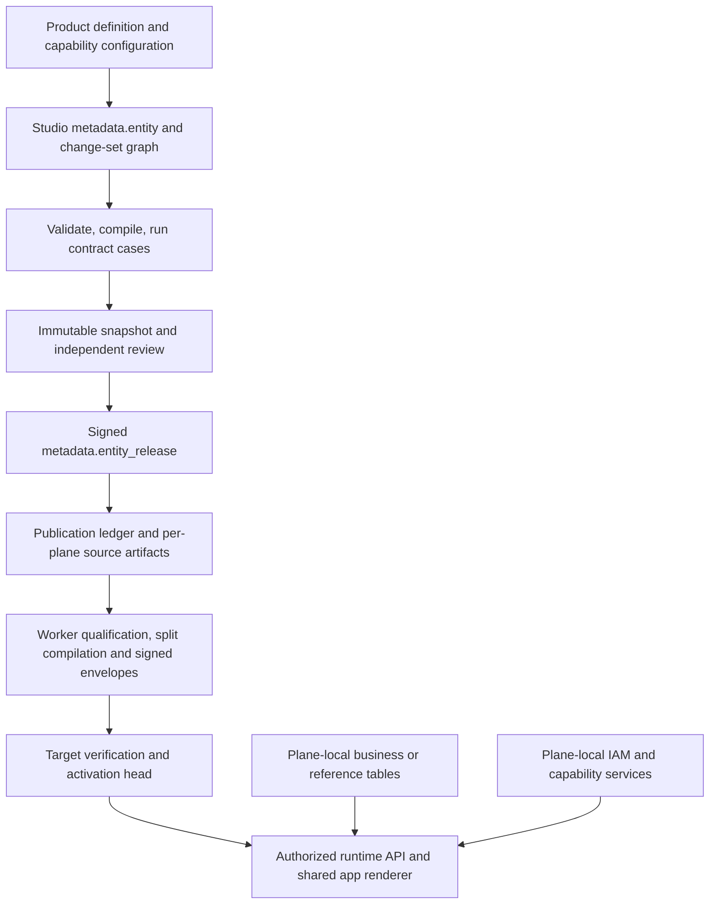

# Meta Entity onboarding: Studio to runtime apps

Source review: 2026-09-28. Scope: document the current Country pattern, its limits,
and the next onboarding sequence. This document does not publish an entity or
certify the current live environment. Proposed `state_region` and Business Partner
design decisions below are not yet finalized metadata.

Document this baseline before starting the next entity. Use `state_region` to
prove that onboarding is reusable, then start Business Partner with an explicit
reference-dependency inventory. Keep the guide and each entity's acceptance record
updated as implementation closes the gaps described here.

## 1. What Country establishes

Country demonstrates a system-owned shared reference entity with generic list and
detail pages, plane-local storage, explicit authorization, localized presentation,
and separately published collaboration capabilities. The current source defines
22 fields, UUID record identity, `code` display identity, `name` title, list columns,
search membership and four detail sections. It exposes no Country CRUD writes.
Comment and attachment writes are separate service operations.

Use these sources in this order:

- [Current onboarding boundaries](../architecture/application-experience/entity-onboarding-boundaries.md)
  and [28 September follow-up](../reports/entity-onboarding-followup-20260928.md)
  retain Country release 8's passed manual acceptance. They also describe later
  source-only changes that need normal qualification before another publication.
- [Country product](../../metadata/entities/country/definition.json)
  and [capabilities](../../metadata/entities/country/capabilities.json)
  describe the working-tree candidate, not necessarily the exact active release.
- [Country runbook](country-entity-app.md) contains historical 26 September gates;
  its early “not activated” statements are not the latest acceptance status.
- [Release integration review](../reports/country-runtime-release-scope-review-20260928.md)
  records mixed uncommitted runtime/BP changes. A tested working tree is not yet
  an independently qualified, reproducible deployment revision.

A table existing in PostgreSQL, a valid draft, a signed release, a worker job being
queued, and a usable app are five different milestones. Record them separately.

## 2. Ownership and the publication path



Studio owns editable definitions. `snapshot` holds immutable evidence and compiled
sources. `publication` tracks distribution. Each target's `runtime_meta` holds
applied release state and descriptors. Actual Country/state/partner records remain
in their business/reference tables. Publishing metadata does not seed those rows,
create arbitrary storage, replicate records between planes, or grant user access.

Keep three coordinates distinct: definition ownership (`tenant_id=NULL` for a
system product), authenticated platform publication authority, and the tenant using
the app. Global ownership does not make tenant administrators global publishers.
A global reference row can still require tenant-context authorization; collaboration
on that row must remain isolated by the authenticated tenant.

## 3. One, several, or all planes

The general release schema permits `studio`, `neon`, and `mesh`, with one to three
target entries. The product parser accepts explicit subsets and rejects compilation
for an excluded target. However, the current **governed system-reference importer
and target compiler require Studio in the product target set**. Do not infer full
single-plane publication support from successful offline compilation.

| Requested rollout | Current Country-style governed path |
| --- | --- |
| Studio only | Target set `["studio"]`; qualify and activate Studio. |
| Studio and Neon | `["studio", "neon"]`; separate qualification and receipts. |
| Studio and Mesh | `["studio", "mesh"]`; separate qualification and receipts. |
| All current planes | `["studio", "neon", "mesh"]`; “all” is this explicit list, not a wildcard. |
| Neon only, Mesh only, or Neon + Mesh without Studio | Product-level compilation is possible, but the system-reference import/lowering path rejects omission of Studio. Separate source-plane ownership from runtime enrollment in a tested change before promising these rollouts. |

Evidence: [product parser](../../server/packages/planes/studio/meta-entity-authoring/src/authoring/product.ts),
[system importer](../../server/packages/planes/studio/meta-entity-authoring/src/system-reference-authoring.ts),
[target compiler](../../server/packages/planes/studio/meta-entity-authoring/src/compilation/target-compiler.ts).
The compiler derives target coordinates from one persisted Studio graph and retains
its authored identities. Do not independently create three source entities.

For every selected plane, verify local storage and records, callable registrations,
permission definitions and grants, dependencies, runtime version/compiler identity,
trust configuration and activation evidence. One plane's grant or receipt does not
cover another. A multi-target release is not a promise of simultaneous distributed
activation: track partial failure explicitly and withhold full-rollout acceptance.
Adding a target later changes the reviewed publication scope and needs a governed
successor; it is not an unreviewed replay into another database.

## 4. Metadata properties to finalize

The [table/property inventory](meta-entity-property-reference.md) lists all columns
of all 36 authoring tables in the canonical `metadata/03_tables.sql`, grouped by
purpose, with explanations. Read it alongside the
[domains](../../server/db/ddl/planes/studio/metadata/02_domains.sql),
[constraints](../../server/db/ddl/planes/studio/metadata/05_constraints.sql), and
[triggers](../../server/db/ddl/planes/studio/metadata/08_triggers.sql).
DDL is the storage contract; validators, compilers, host registrations and runtime
consumers determine what can actually execute. A database enum alone does not
prove that every mode is implemented in this publication path.

Finalize the following decisions for each entity before requesting publication:

| Decision | What must be recorded |
| --- | --- |
| Identity and ownership | Canonical code, module, class, owner scope; whether an existing identity/release must be reused. |
| Storage and isolation | Table/view/facade, plane, schema, object, tenant/version/deletion columns where applicable, SQL privileges and RLS. |
| Fields | Type/configuration, nullability/cardinality, storage mapping, origin, mutability, validation, classification and retention. Expose only approved fields. |
| Keys and references | UUID identity, actual natural/alternate composite keys, null semantics, country/parent relations, lookup domains, active-only rules. |
| Query contract | Search membership, matching, default sorting, pagination, independent search/filter/sort/group authorization. |
| Presentation | Localized plural/singular names, field labels, columns, detail sections, tabs, summary and supported layouts. |
| Operations | Exact handlers, permissions, scope recipes, required context, MFA, audit, idempotency and concurrency. |
| Business behavior | Lifecycle, numbering, policy, flows, change cases and materialization, where required and supported. |
| Optional services | Comments, attachments, activity; exact declaration, binding, versioned profile and overrides if used. |
| Release and evidence | Targets, dependencies, compatibility, minimum runtime, tests, independent review, signer and per-plane acceptance. |

### Country product properties and their persisted meaning

| Product property | Meaning and resulting graph |
| --- | --- |
| `schema` | `athyper.shared-reference-product/1`; versioned input format. It is distinct from the graph's `athyper.meta-entity-contract/2.1`. |
| `moduleCode` | Resolves an active Studio `control.module`; Country uses `ent`. It does not automatically install a navigation entry. |
| `planes` | Explicit enrollment, persisted in the source marker and checked during target derivation. |
| `definition.entityCode` | Stable identity; `^[a-z][a-z0-9_]{1,62}$`. No silent case conversion or trimming. |
| `title`, `entityLabel`, `localizedTitle` | Plural page title, singular entity label and optional localization reference. A label object contains `labelKey` and `defaultText`; fallbacks must agree when supplied separately. |
| `storageObject` | Existing table under `shared` for this helper. Schema, table backing, generic read and no entity writes are explicit generated settings. |
| `codeField`, `titleField` | Display/search identity and record heading. UUID `id` remains record identity. The helper also emits a single-column alternate key for `codeField`; review this assumption. |
| `fields[].key/label/type/required` | Storage column, UI label, one of UUID/string/boolean/datetime, and `one` versus `zero_or_one` cardinality. Generated fields are stored, public, read-only and active. |
| `columns` | Default-visible list fields and order. Other declared fields still exist; hiding a column is not access control. |
| `searchFields` | Keyword-search membership, generated `contains` matching and minimum query length 1. Search permission and membership are both required. |
| `sections[].key/label/fields` | Record presentation grouping embedded in detail `layout_config`; the helper does not need separate normalized section rows for these groups. |
| `navigation` | Validated detail navigation mode/tabs and references to existing section keys. |
| `summaryView` | Optional typed record summary presentation; do not assume every field is a supported summary widget. |
| `runtimeBindings[]` | Explicit operation/handler/resolver identifiers. Country binds list/read to `entity.record.list.v1`, `entity.record.read.v1` and `tenant.record.v1`. Host registration proves availability. |

The [graph builder](../../server/packages/planes/studio/meta-entity-authoring/src/authoring/graph-builder.ts)
also emits primary/alternate keys, list/detail surfaces, field bindings, list/read
operations, exact-plane permission bindings and deny-on-missing tenant scope. Its
list defaults include name ascending, comfortable table mode, compact alternative,
page size 25, allowed sizes 10/25/50/100, at most three sort levels and exact counts.
These are helper defaults, not independent top-level product options.

This helper is deliberately narrow: no arbitrary JSON/numeric field support, no
composite-key configuration, no authored relations/flows and no write operations
in its public product format. Extend the shared contract deliberately when needed;
do not smuggle unrecognized properties into JSON or add per-entity UI/SQL branches.

### Capability properties

`metadata.entity_capability` separates capabilities from the core entity's CRUD.
Country's current source uses explicit bindings. For each selected capability,
record all of the following, using the typed capability validators as authority:

- Declaration: `enabled`, `serviceKey`, `ownerEntityCode`, `load`,
  `includeInAggregateData`. Country uses lazy loading outside aggregate data.
- Common binding: `schemaVersion`, service/owner identifiers,
  `admissionResolverKey`, permitted `layouts`, and `actions`. Each action names
  its permission, callable handler, concurrency and idempotency requirement.
- Comments: rich-text schema, text/depth limits, audiences and default audience,
  feature switches, reaction codes, draft retention, attachment count/version
  policy and attachment binding reference. Country currently allows public/private
  audiences with private default; do not widen that policy by copying defaults.
- Attachments: file/batch limits, content-type allowlist, scan requirement, link
  kinds, categories, folders, versioning, rename, duplicate behavior, unlink
  semantics, download authorization and preview/extraction/search/renditions.
- Optional profile adoption: `profile`, `profile_definition`, `overrides` must
  resolve and validate through the supported profile tooling. A profile edit is
  not permission to mutate a historical signed entity binding.
- Activity: the schema admits `activity`; require its actual provider, policy and
  publication qualification separately. Country's inspected capabilities file
  declares comments and attachments, not proof of every activity mode.

Changing `ownerEntityCode` also requires changing owner-specific references such
as `country/operation#attachmentBinding`. Read access to the parent record,
capability action authorization, tenant isolation, object storage/scanning and
other declared processing services must all qualify. A rendered tab is not proof
that these services are available.

## 5. Repeatable onboarding procedure

### Step 1 — Capture the baseline and entity decision sheet

Record source revision and uncommitted changes, environment, entity code, existing
Studio identity/change sets/releases, each target's active head, and the current
runtime/compiler version. Inventory storage columns, keys, FKs, triggers, row
counts and permissions on every target. Preserve plane-local UUIDs. Verify that a
first publication really has no predecessor; otherwise use successor preparation.

Output: a dated decision sheet with selected targets, field exposure, operations,
capabilities, dependency order and unresolved implementation gaps. Use “not
applicable” deliberately for unsupported/unneeded property groups.

### Step 2 — Prepare storage and dependencies

Apply required schema/data changes through the normal database migration and seed
process before runtime qualification. Metadata publication is not a DDL migration.
For existing shared tables, check deployment drift without recreating them.
Resolve lookup data and dependencies in each target; a Country reference may use
`code`, while record navigation still uses the local UUID.

Output: verified storage registration, compatible columns and callable providers,
plus an explicit dependency matrix. Reference-data browsing and a parent form's
lookup authorization are separate contracts.

### Step 3 — Author the source in Studio's graph model

For a compatible shared reference, create a product directory following Country's
`definition.json` and optional `capabilities.json`. Supply the actual entity's
fields and labels. Do not copy historical IDs, hashes, release numbers or audit
actors. Other entity categories use the broader normalized authoring graph and
must prove compiler/runtime support for their required branches.

Offline compilation, with no activation, can be exercised using the existing
Country example:

```sh
pnpm exec tsx server/db/scripts/provisioning/prepare-reference-runtime.ts --product=metadata/entities/country --plane=studio
pnpm exec tsx server/db/scripts/provisioning/prepare-reference-runtime.ts --product=metadata/entities/country --plane=neon
pnpm exec tsx server/db/scripts/provisioning/prepare-reference-runtime.ts --product=metadata/entities/country --plane=mesh
```

Substitute the new product path only after it exists and the helper supports its
contract. Compile each selected target and test excluded-target rejection. This
produces unsigned candidates, not a release. Do not equate independently generated
offline graph IDs with the persisted source's target derivation.

### Step 4 — Persist the draft and validation evidence

Use the authenticated authoring service or the trusted system-reference importer.
The current DEV maintenance script offers a transaction-rollback check:

```sh
pnpm exec tsx server/db/scripts/operations/publication/import-dev-reference-product.ts --product=metadata/entities/country --check
```

This is DEV-specific tooling with privileged database access, not a universal
production command. It can rehearse missing binding migration work inside the
rolled-back transaction; it is not a strictly read-only SQL probe. Applying uses
its explicit `--confirm=DEV-IMPORT-REFERENCE-DRAFT` mode in an authorized rollout.
It creates/reuses a global identity and draft through the repository; it neither
approves nor activates. Inspect script preconditions before reuse.

Record entity/change-set IDs, optimistic revision, product/contract/descriptor
hashes, validation snapshot and real test results. Zero embedded contract cases
means no contract cases executed, even if the evaluator reports “passed.”

### Step 5 — Qualify every target and dependency

Verify actual column/type compatibility and SELECT access; permission catalog and
scope support; handlers/resolvers; capability service readiness; and the runtime's
compiled metadata mode. Native `entity_runtime` and split `compiled_entity_runtime`
are distinct paths. A plane configured for the compiled path must receive a
compatible split publication, not a hand-inserted native descriptor fallback.

Test invalid/missing scope, unauthorized users, excluded planes, missing handlers,
missing lookup data and unavailable capability infrastructure. For write entities,
add negative field-policy, stale-version, duplicate-request and materialization
failure tests. Output: durable qualification evidence pinned to the exact source,
target set and compiler version.

### Step 6 — Submit and independently review

Use the ordinary authoring submit/review transitions. Approved/published change
sets are sealed. Real authenticated actors, current IAM, separation of duties and
required MFA apply. The DEV machine workflow additionally requires an exact active
persisted policy and its authenticated workload identities; source edits or grants
alone do not authorize it. DEV enrollment does not establish QA/production trust.

For first publication, the workflow pins no predecessor and the exact reviewed
contract. For subsequent publication, capture and pin the predecessor authoring
release, publication release and target activation heads. Existing successor tools
prepare a draft against those pins; they do not make a changed head acceptable.
Do not reuse Country's enrolled machine policy for a new entity without checking
and independently enrolling the new source/target scope.

### Step 7 — Sign, dispatch, compile and deliver

The approved revision is published as append-only `metadata.entity_release`, with
hashes, target planes, compatibility and signature information. The governed
preparation path stores immutable per-target `snapshot.entity_release_artifact`
sources and connects the authoring release to `publication.release` through
`publication.entity_release_link`.

The publication worker reads approved sources through
`publication.fn_compiled_entity_compilation_source`, performs target-qualified
lowering into split artifacts, records compilation and builds signed runtime
envelopes. `publication.artifact`, `artifact_compilation`, `deployment`,
`deployment_event` and `deployment_acknowledgement` track the distribution work.
Configured signing keys and target trust must agree, including canonical hashing.
Never edit signed JSON or re-label an old hash to repair a mismatch.

Dispatch success only means work was queued. Follow each deployment through target
verification; retain artifact identity, compiler fingerprint, signer and errors.

### Step 8 — Activate and prove the runtime read path

Each target verifies and applies the release through its governed activation path.
Inspect `runtime_meta.applied_release`, `applied_release_payload`,
`release_activation_head`, `release_activation_event`, `entity_contract` and
`entity_descriptor` as appropriate to the compiled path. Reconcile the active
publication key/release/hash against the deployment receipt; a stored artifact
that is not the active head does not govern current requests.

The runtime metadata service resolves the active descriptor, the API authorizes
the operation, and registered record services query the approved plane-local
storage. Shared app adapters render the descriptor. They do not read Studio drafts
or infer arbitrary table access from a URL.

Use canonical URLs on each enrolled app:

```text
/app/entity/<entity_code>
/app/entity/<entity_code>/manage
/app/entity/<entity_code>/<local-record-UUID>
```

`manage` is the list route here, not write permission. An entity appearing in a
workspace/module menu requires a separately registered, authorized catalog entry;
Country's route acceptance does not establish such aliases.

### Step 9 — Accept, record and prepare recovery

Check authenticated list/detail, search/filter/sort/pagination, optional/null
values, localization/RTL, themes, direct links and denied operations on each plane.
For collaboration, test permitted actions, ownership, private audiences, scanning,
versions, retries and cross-tenant denial. Use ordinary tenant app accounts as well
as governance accounts where their responsibilities require it.

Retain the source revision, graph and compiler hashes, independent review, both
release identifiers, targets, signing identity, per-target active heads/receipts,
IAM scope, test results and remaining gaps. Record excluded-plane rejection too.
A first release has no prior entity version to restore: define an authorized
containment/retirement plan. For successors, rehearse the supported governed
rollback/restoration against a compatible prior release and data schema. Metadata
rollback does not undo business data writes or database migrations. Never implement
rollback by manually rewriting activation heads or signed history.

## 6. Next entity: state_region

Start here, with a read-only scope. This is a useful second case because it adds a
Country dependency, a composite natural key and an optional hierarchy.

The [physical DDL](../../server/db/ddl/common/shared/03_tables.sql) already defines
`shared.state_region`; [constraints](../../server/db/ddl/common/shared/05_constraints.sql)
link `country_code` to Country and `(country_code, parent_code)` to the parent
subdivision. [Triggers](../../server/db/ddl/common/shared/08_triggers.sql) and their
[functions](../../server/db/ddl/common/shared/07_functions.sql) enforce code-prefix
consistency and hierarchy rules, including cycle/active-parent checks. The
[seed source](../../server/db/ddl/common/shared/reference-data/002_state_region.sql)
is not evidence that every target has the same installed rows.

| Physical property | Proposed first app treatment |
| --- | --- |
| `id` UUID | Required read-only record identity; preserve existing IDs. |
| `code` text | Required display code; stored format is country prefix plus subdivision suffix. |
| `name` text | Required title and search field. |
| `country_code` char(2) | Required visible/filterable country coordinate; do not replace it with a Country UUID. |
| `category` text, `parent_code` text | Optional visible fields; start with scalar presentation if relations are not yet qualified. |
| `metadata` JSONB | Do not expose by default. The current reference-product parser cannot declare JSON fields. |
| `status`, generated `is_active` | Read-only lifecycle display; never author a write to generated `is_active`. |
| `status_changed_at/by`, `created_at/by`, `updated_at/by` | Audit data; decide deliberate exposure. Timestamp fields can be shown without exposing actor UUIDs by default. |
| `(country_code, code)` | Actual composite unique key; model both ordered members. |

Suggested initial columns: code, name, country, category, parent, status. Suggested
search: code and name, with country filtering tested explicitly. Suggested detail
sections: identity, geography and audit. Confirm labels and locales before release.

**Resolve the key gap before publishing.** Country's helper creates an alternate
key on `code` alone. Although code-prefix rules constrain values, the declared
storage unique constraint is composite. Extend generic key configuration and its
validation/compilation tests (or use an appropriately supported full graph) rather
than silently declaring the Country key pattern correct for this table.

Use scalar `country_code`/`parent_code` in the first read surface if that scope is
accepted. Country links, hierarchy navigation and dependent address dropdowns are
separate features requiring published relation/lookup contracts. The inspected
[native-to-split lowering](../../server/packages/services/publication/src/compilation/native-runtime.ts)
explicitly rejects nonempty `relations`, `flows`, `flowSteps`,
`materializationBindings`, `materializationFieldMappings` and `changeCaseBindings`.
Implement and qualify the required branches before including them; do not silently
drop relations from a declared contract.

Acceptance must include a real country filter, duplicate names across countries,
null parent/category, active/inactive behavior, local UUID navigation, denied
writes and target exclusions. A future address selector must enforce the selected
country server-side, reject a state from another country, and revalidate/reset an
incompatible selection when Country changes.

## 7. Then Business Partner and reference entities

Begin Business Partner design immediately after `state_region` acceptance, but
publish its required dependencies before the operations that consume them. Do not
wait to discover missing references during final BP activation.

Business Partner is not a renamed shared-reference product. Establish its class,
ownership, tenant/company/network boundaries, privacy classifications, child
collections, mutation lifecycle and exact target apps. Do not inherit Country's
public field classification, common reference permission or `shared` storage.
Existing BP documents and metadata are historical input to reconcile, not automatic
authority to restore legacy runtime paths.

Build a dependency register with: entity/domain code, owning team, storage scope,
required fields/operations, consuming BP field/operation, selected planes, exact
published version, authorization rule, seed readiness and acceptance evidence.
Inventory actual FK/reference bindings and selected business workflows to make
this exhaustive. The following are planning groups, not a claim of finalized codes:

| Order | Work and release gate |
| --- | --- |
| 1 | Accept `state_region` with Country and key correctness. |
| 2 | Define BP root and its first usable scope; inventory actual schema, legacy integration and required references. |
| 3 | Qualify required geographic, currency/language/timezone, classification/type/role/status, address/contact, tax/registration and payment/bank reference groups for that scope. Small enumerations may remain lookup domains rather than separate entity apps. |
| 4 | Publish a BP read slice with approved field exposure, tenant/company scope and qualified child/reference reads. |
| 5 | Add create/change operations only after handlers, field policies, concurrency, idempotency, validation and audit are proven. |
| 6 | Add lifecycle/numbering, approval/change cases, workflow and materialization only when their complete lowering/runtime branches qualify. Add broader modules and optional references as subsequent releases. |

For every BP relation, determine cardinality, owning side, natural/UUID join,
allowed child mutations, deletion semantics, parent authorization and collection
scope. A child collection must not be accessible just because its table exists.
For tax, banking and personal contact data, choose appropriate field policies and
permissions. Numbering must use target policy bindings and runtime counters, not
metadata pretending to be a mutable sequence.

Required BP test scenarios include duplicate business identity, invalid references,
cross-tenant/company denial, parent-child scope, masked fields excluded from query
channels, stale updates, replayed commands, approval separation and failed or
retried materialization. Country acceptance does not cover these behaviors.

## 8. Definition of ready and done

Ready to implement: entity decision sheet complete; storage/dependency inventory
captured; key and ownership decisions explicit; unsupported compiler/runtime
branches identified; initial scope and target set agreed in the implementation.

Ready to publish: exact persisted candidate validated; meaningful tests passed;
all targets qualified; independent review and signing authority available;
compatible runtime revision deployable; recovery procedure specified.

Done: every intended plane's active head and signed receipt match; authorized app
journeys and denial cases pass; dependencies and IAM work in the intended tenant
scope; source and evidence are reproducible; entity-specific decisions are added
to this guide's companion acceptance record. Documentation completion alone does
not meet this release definition.
